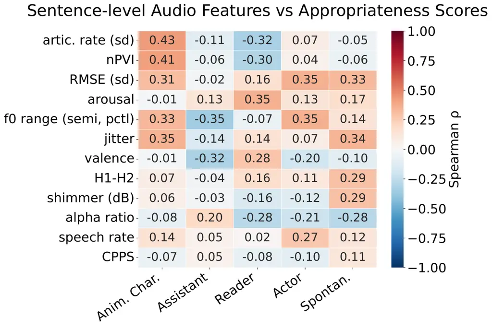
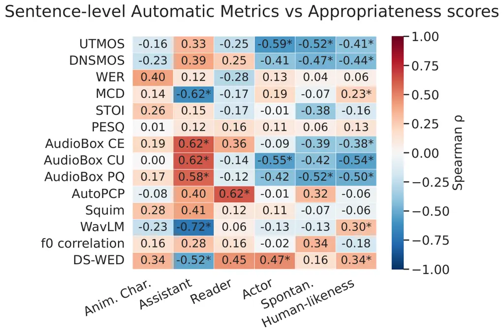

Woszczyk Triantafyllopoulos Miniota Székely Schuller

# Is Natural Always Appropriate? Investigating Naturalness and Appropriateness Across Different Domains for TTS Evaluation

Dominika    Andreas    Jura    Éva    Bjoern

###### Abstract

Text-to-speech (TTS) evaluation is an open challenge. While the primary
target was “naturalness,” recent fidelity gains shifted focus toward
“appropriateness” and whether speech is correct for its context. In this
work, we examine how perception changes when the expected downstream use
varies. We measure the appropriateness and human-likeness of five SOTA
TTS systems across five domains: AI assistant, reader, actor, animated
character, and spontaneous speaker. Results show appropriateness varies
across domains independently of naturalness. While systems shine at
reading, expressive domains remain challenging, and optimizing for one
can degrade others. Furthermore, naturalness scores tend to penalize
stylized speech while rewarding spontaneity. Finally, our study also
highlights blind spots in one-size-fits-all evaluation metrics across
more expressive domains. We demonstrate that TTS performance is not
“solved” but depends on the target domain, requiring context-aware
evaluation.

###### keywords

text-to-speech evaluation, human perception, human-computer interaction

^(†)^(†)address: ¹ Iconic, United Kingdom  
² Technische Universität München, Germany  
³ KTH Royal Institute of Technology, Sweden  
⁴ Imperial College London, United Kingdom ^(†)^(†)email:
dominika@iconicgames.ai

## 1 Introduction

Text-to-speech is fundamentally a one-to-many problem: the same sentence
can be spoken in countless ways while remaining intelligible. Prosody,
pacing, and delivery vary naturally depending on the situation, the
speaker’s intent, and the audience. Consequently, good synthesis depends
entirely on delivery and performance style. A voice perfectly suited for
an audiobook may be inappropriate for an emergency hotline, a
conversational agent, or an animated character \[1, 2\].

For a long time, naturalness has been the primary evaluation target in
speech synthesis. However, naturalness is now widely recognized as an
ill-defined and multi-dimensional concept \[3, 4\]. Importantly, Mean
Opinion Scores (MOS), the most common measure of naturalness, are
neither stable nor absolute. Ratings depend on evaluation setup and
listener expectations, and framing the intended use can change system
rankings \[4, 5, 6, 7\]. As systems improve and reach high MOS values,
differences that matter in real applications are not always reflected in
a single naturalness score.

For this reason, several automatic metrics attempt to provide
“objective” alternatives \[8\], ranging from ASR-based intelligibility
to spectral fidelity and distributional measures of prosodic
similarity \[9, 10\]. In expressive TTS, evaluation often relies on
emotional embedding distances or pitch correlation against a target
sample or style \[1\], while recent persona-based benchmarks assess
instruction following and character consistency \[11, 12, 13\]. More
recently, persona-based benchmarks assess instruction following,
role-play ability, or character consistency \[11, 12, 13\].

While these methods extend evaluation beyond simple MOS, they still
provide only partial views. Many focus on global similarity or
reconstruction accuracy rather than contextual suitability, and some
approaches, such as LLM-as-judge \[14, 12\], raise important questions
regarding their reliability. Furthermore, current benchmarks prioritize
linguistic “stress tests” (e.g., difficult pronunciations) over
functional performance across spontaneous or expressive domains \[15,
14\]. Crucially, given that these “task-agnostic” scores ignore
situational needs, a model with high accuracy may still be perceived as
inappropriate for its intended real-world use.

In parallel, as “naturalness” is being increasingly questioned by the
research community, several works argue that evaluation should consider
“appropriateness” – that is, whether speech fits its intended
communicative purpose \[16, 1\]. This shift moves the focus from
“human-likeness” to evaluating how suited the generated response is
given the target task. However, the impact of the target domain on
appropriateness judgments has not been systematically studied. Existing
work often compares read versus spontaneous speech \[17\], or examines
how accented or disordered speech affects perceived naturalness \[18\].
Appropriateness is also partially explored in terms of style transfer or
role-play settings, where the goal is to reproduce a specific
persona \[12, 19\]. Previous work thus leaves an important gap that
needs to be investigated – how the same utterance is judged when framed
for different target tasks that require different operationalizations of
expressivity.

Our Study We contribute to this ongoing discussion by investigating how
perceived appropriateness for both synthetic and human speech changes
across five domains: read speech, acted speech, spontaneous interaction,
conversational assistant, and animated character. This study examines
how framing the intended use affects listener expectations, tolerance,
and whether naturalness, which we frame as human-likeness, reliably
predicts suitability. Our contributions are as follows:

- •
  Cross-Domain Perceptual Analysis We systematically measure how
  perceived naturalness and appropriateness change across various
  settings for different TTS.
- •
  Human-Likeness Paradox Exploration We analyze the relationship between
  human-likeness and domain suitability, and show that while they may
  align in certain contexts, in others human-likeness may not predict
  appropriateness and vice-versa.
- •
  Domain-Specific Evaluation & Metrics Profiling We show that TTS
  systems perform differently across different domains, and that common
  metrics are not universally indicative of appropriateness.

## 2 Methodology

### 2.1 Perception Study Design

To evaluate the perception of appropriatness of synthetic speech across
domains, we conduct a perceptual study. We design the listening test
using a Gradio interface hosted on Prolific \[20\]¹¹ 1
https://github.com/domiwk/domain-aware-tts-eval²² 2 Study demo page
available at https://researcht81.github.io/unconvincing-human. We
recruited 150 native English speakers (95% approval rating) via
Prolific, split into 6 sessions of 25 participants. We curated 30
sentences with ground truth (GT) samples and synthesized them across 5
TTS systems. Using a Latin Square design, 180 samples
($`30\times(5+1)`$) were distributed across six sessions. Each
participant evaluated all 30 sentences and all systems without
repetition, ensuring independent judgment while anchoring across TTS
profiles. Two attention checks were included to filter bots and
inattentive participants.

Rating Task Participants rated both human-likeness and appropriateness
(for each persona) on a 5-point Likert scale. After initial pilot
studies observations, we use the term “convincingness” instead of
appropriateness to improve conceptual clarity and reduce bias, and
naturalness as “human-likeness” to make it a more defined concept.

Stimuli Curation We manually curated speech and text pairs spanning four
speech task families (examples shown in Table 1). We selected samples
from task-related datasets and extracted corresponding samples as ground
truth:

- •
  Narration: We extracted quotation-style narration excerpts curated
  from LibriQuote \[21\] read speech (narration-only subset), designed
  to probe descriptive statements.
- •
  Spontaneous conversational: We selected conversational sentences from
  MSP-Podcast \[22\] to stress-test informal phrasing, disfluencies, and
  natural conversational prosody in realistic audio conditions.
- •
  Affect conversational: We curated acted dialogue using MELD \[23\] and
  AnimeVox \[24\], to probe emotional expressivity and as GT for acted
  and animated character.
- •
  Inform: We generated 6 sentences using gemini-3-pro that are
  informative and conversational across different statement types
  (statement, interrogation) and length, and manually checked them. We
  generated a proxy for the AI assistant GT using elevenlab-v3 and the
  voice Katie X.

In order to mitigate participants confusing the content appropriateness
with the delivery and get a diverse coverage of emotions for the
conversational sets, we first ran an LLM pass to label the sentences for
plausible emotions from the text and for appropriateness for each given
persona. We then manually selected sentences that are less idiomatic for
the source persona and for the conversational tasks to span a total of 6
emotions per stimuli set (anger, fear, sadness, disgust, neutral, joy).

| Speech Task           | Example Sentence                                                                |
| --------------------- | ------------------------------------------------------------------------------- |
| Inform                | Your meeting starts in 30 minutes.                                              |
| Affect Conversational | Ew! What is that? Something exploded!                                           |
| Spontaneous           | Oh, um, I can’t. I mean, I don’t know the festival circuit and all that.        |
| Narration             | But that night Dorothy could not sleep. The excitement perhaps, or was it fear? |

Table 1: Example sentences per speech task.

TTS Systems We identified high-quality TTS systems from the Emergent TTS
benchmark \[14\] with low WER ($`\leq`$0.13), and $`\geq`$ 20% win rate
overall, and that cover different stylistic archetypes across the
expressivity and spontaneity axis. To reduce voice-preference bias, we
selected female voices with similar timbre.

- •
  Kokoro (af_heart): A lightweight 82M parameter StyleTTS 2 model.
  Provides high-quality speech but is prosodically consistent, with low
  spontaneity.
- •
  Gemini TTS (Flash 2.5, Despina): Google’s flagship multimodal model
  and first on the Emergent TTS leaderboard. It delivers highly
  expressive and stylized speech.
- •
  Kyutai-TTS (1.6B, p037): Built on the Moshi audio-to-audio framework.
  It was trained on raw conversational data and captures high
  spontaneity and natural disfluencies.
- •
  GPT-4o-mini-tts (Coral): A high-quality commercial TTS with a balanced
  profile with medium–high spontaneity and moderate expressivity.
- •
  ElevenLabs (multilingual_v2, Bella): A state-of-the-art commercial TTS
  model that is designed for professional delivery. We picked the
  default voice (“Bella”) for conversational speech with medium
  spontaneity and moderate expressivity.

### 2.2 Acoustic Features and Automatic Metrics

Acoustic Features To investigate the characteristics linked with
appropriateness within each domain and identify the preferred acoustic
profiles, we analyzed features spanning rhythm (articulation rate sd,
speech rate, nPVI), expressivity (f0 range semitones, percentiles, RMSE
sd, arousal, valence), and voice quality (jitter, shimmer, H1-H2, alpha
ratio, CPPS).³³ 3 Computed with praat-parlsemouth and eGeMAPSv02 \[25\]
through openSMILE \[26\] and wavlm-large-msp-podcast-emotion-dim \[27\]
for valence and arousal.

Automatic Metrics To investigate the effectiveness of automatic
evaluation, we analyzed metrics spanning quality estimation
(UTMOSv2 \[28\], DNSMOS \[29\], Squim \[30\], PESQ \[31\], MCD \[32\],
STOI \[33\]), prosodic distance (f0 correlation computed with
SwiftF0 \[34\], AutoPCP \[35\], WavLM \[36\]), style (AudioBox
CE/CU/PQ \[37\]), intelligibility (WER, measured with
nvidia/parakeet-tdt-0.6b-v2 \[38\]), and diversity (DS-WED \[39\]).

## 3 Results

Figure 1: Appropriatness and human-likeness score for each TTS across
the 5 personas across all speech tasks, averaged across sentences per
participant per session. For ground truth, we report the scores only for
dataset-matched sentences as the upper anchor. We mark non-significant
pairs with ‘ns‘ with the Wilcoxon paired test (with Holm–Bonferroni
corrections) and p-value$`\leq`$0.05.

### 3.1 Appropriateness Across Domains

Figure 1 shows the distributed score for each persona across the TTS and
all tasks. The results show that while most systems achieve high
appropriateness scores for reading or AI assistant roles, for some
contexts like spontaneous conversation, actor, and animated character
personas remain more challenging.

Specifically, Kokoro performs well for reading and assistant tasks but
scores poorly on conversational tasks. Conversely, Kyutai-TTS is
perceived as highly appropriate for spontaneous conversation but has low
scores for the AI assistant and animated character personas. Systems
like Eleven Labs, Gemini, and GPT-4o-mini-TTS score highly on the acting
domain but fail to achieve high scores in the spontaneous conversation.
We report an overall Krippendorff’s $`\alpha`$ of 0.2 for TTS and 0.44
for GT samples, indicating a relatively low level of agreement.

These results show that a TTS system that is deemed appropriate for one
domain is not necessarily suitable for another. Kokoro’s narrow profile
and peaks in assistant and reading roles, despite lower naturalness,
suggest listeners may actually expect AI assistants to sound somewhat
robotic. Meanwhile, Kyutai-TTS, while offering a broader profile, excels
in spontaneous speech but sounds too raw for an assistant. Finally, the
low inter-rater agreement suggests appropriateness is highly subjective,
heavily influenced by individual listener expectations.

### 3.2 Human-likeness and Appropriateness across Domains

|                   |             |        |        |                 |           |
| ----------------- | ----------- | ------ | ------ | --------------- | --------- |
| Domain            | Spontaneous | Actor  | Reader | Anim. Character | Assistant |
| Spearman $`\rho`$ | 0.4021      | 0.4705 | 0.3757 | 0.0821          | -0.4438   |

Table 2: Correlation between Human-likeness and Appropriateness across
Domains.

Table 2 shows the correlation between human-likeness and style scores at
the sentence level. This indicates how much the perceived naturalness
aligns with the specific style requirements. We observe positive
correlations for Actor, Spontaneous, and Reader domains, whereas
correlations are near-zero for Animated Character and negative for
Assistant. We hypothesize that while systems balancing prosodic
naturalness with expressivity achieve higher appropriateness, those like
Kokoro, though deemed highly appropriate for the Assistant role, yield
lower naturalness scores. Conversely, Kyutai-TTS demonstrates that high
naturalness does not guarantee appropriateness for Animated or Assistant
voices, leading to the observed decoupling of these metrics in those
domains.

### 3.3 Impact of Speech Tasks on Naturalness

Figure 2: Human-likeness mean scores for systems across different speech
tasks.

Figure 2 illustrates the task’s impact on human-likeness scores.
Interestingly, even GT ratings varied across domains, with
conversational samples from MELD and MSP Podcast preferred over
LibriQuote and Animevox. Manual inspection suggests these lower scores
likely come from the Irish accent or the more mature voice of the
reader, which participants may have perceived as less natural. This
finding aligns with previous studies on non-standard speech. Similarly,
the lower scores for Animevox set, but not for the MELD set, suggest
that highly stylized delivery is penalized regardless of the task.

On the other hand, TTS naturalness scores may reflect a model’s ability
to handle specific styles rather than the task’s inherent difficulty.
For instance, while narration is often considered easier to synthesize,
Kyutai-TTS performed more naturally on conversational tasks than on
reading. Interestingly, a similar analysis of mean appropriateness
scores across speech tasks revealed no considerable differences.

### 3.4 Appropriateness and Acoustic Features

Figure 3: Appropriateness-acoustic features correlation on sentence
level across all speech tasks.

To understand what features are more suitable for each domain, we
analyze the Spearman correlations between sentence-level appropriateness
scores and acoustic features.

In Figure 3, we observe that Animated Character correlates most strongly
with articulation rate variability ($`\rho=0.43`$) and nPVI
($`\rho=0.41`$). For this domain, “good” synthesis seems to require
significant fluctuations in pacing and rhythm. In contrast, the Reader
domain shows negative correlations with these same features
($`\rho\approx-0.30`$), suggesting that listeners prefer a more steady,
controlled rhythmic delivery for long-form reading. For the Assistant,
we notice a preference for stability and neutrality. This is reflected
in the negative correlation with f0 range ($`\rho=-0.35`$) and valence
($`\rho=-0.32`$), indicating that overly expressive or emotionally
charged speech is deemed less appropriate for an AI companion.
Meanwhile, high-expressivity domains like Actor and Spontaneous speech
show positive correlation to RMSE (sd $`\approx 0.35`$) and voice
quality. Specifically, Spontaneous speech is the only domain to show
notable positive correlations with features like jitter ($`\rho=0.34`$)
and creakiness (H1-H2, $`\rho=0.29`$), suggesting that these “human”
imperfections are actually expected in casual interaction. Finally, we
see that spectral tilt (alpha ratio) has a slight positive correlation
with Assistant appropriateness ($`\rho=0.20`$); it is penalized in
Spontaneous ($`\rho=-0.28`$) and Actor ($`\rho=-0.21`$) contexts.

These results show that appropriateness is not only linked with rhythmic
features (more or less expressive or energetic) but also with the
quality of the voice itself. While a TTS model can be trained to adapt
its rhythmic properties given the linguistic context, voice qualities
are harder to adapt at test time. This suggests that both the design of
the voice and the TTS system need to take into account the target
delivery style.

### 3.5 Appropriateness and Automatic Metrics

In Figure 4, we examine the correlation between sentence-level
appropriateness and various automatic metrics. We observe that common
quality estimators, UTMOS and DNSMOS, show an important negative
correlation with appropriateness for Actor ($`\rho\leq-0.41`$) and
Spontaneous ($`\rho\leq-0.47`$) styles. This suggests that these metrics
penalize the naturalistic disfluencies and high-dynamic range essential
for expressive or conversational speech. Conversely, Assistant
correlates positively with these MOS predictors ($`\rho\approx 0.35`$),
indicating that for traditional high-quality audio, these metrics remain
a valid proxy for appropriateness.

Furthermore, we notice that embedding-based metrics like AudioBox and
AutoPCP are effective for styles like Assistant and Reader
($`\rho\geq 0.36`$), yet they fail to capture the nuances of
human-likeness, where they show stronger inverse correlations
($`\rho\approx-0.50`$). It is also noteworthy that WavLM distance is
negatively correlated with Assistant($`\rho=-0.72`$), but positively
correlated with human-likeness, indicating that WavLM embeddings are
more representative of neutral speech. Finally, DS-WED is a more robust
metric for diversity, whereas PESQ and f0 correlation remain largely
uninformative for predicting perceived appropriateness.

Figure 4: Appropriateness-automatic metrics correlations on sentence
level across all speech tasks. \* indicates significance.

## 4 Discussion & Limitations

This study demonstrates that speech evaluation is inherently
domain-dependent. Listener judgments for the same utterance shift based
on the framed scenario, showing that perceived quality depends as much
on situational expectations as the acoustic signal itself. Our findings
confirm that human-likeness and appropriateness are distinct dimensions.
Human-likeness fails to reliably predict cross-domain suitability and
tends to favor spontaneous over stylized speech. Because even highly
human-like voices can feel inappropriate for specific tasks, evaluation
must prioritize metrics aligned with the intended use. Furthermore, even
flexible systems struggle to capture the domain-specific voice qualities
required across diverse applications. We also observe that different TTS
systems favor specific domains rather than uniform performance. Systems
likely reflect their training data and optimization targets, supporting
the idea that TTS systems and chosen voices are not a one-size-fits-all
solution.

A limitation of this study is the use of isolated sentences. Real-world
speech involves dialogue and emotional progression and extending this
evaluation to multi-turn contexts is a natural next step. Additionally,
we did not explore how a speaker’s perceived gender, age, or
socioeconomic background influences perception. Investigating how these
social identities and simulated roles shape listener perception remains
an important avenue for future research.

## 5 Conclusion

In light of the recent improvement in TTS performance, the question of
quantifying progress has become more pertinent than ever. Most works
focus on _naturalness_, a term which is usually equated with “appearing
human-like”, in colloquial terms. Yet, our listening experiments show
that the _appropriateness_ of a response is context and
application-dependent; there is no one-size-fits-all approach that fits
all intended uses of a TTS system. Rather, the correlation between
human-likeness differs across different applications. Moreover,
state-of-the-art TTS systems do not score equally well across all
evaluated dimensions, but rather show a differentiated, domain-specific
profile. Our work illustrates how evaluations of TTS systems should be
multi-dimensional and contextualized. Rather than asking if an utterance
“sounds like a human”, we should be asking whether an utterance “sounds
right”. Future work could further investigate how appropriateness is
manifested across different application areas and, crucially, how it can
allow us to better gauge performance and iteratively define future TTS
systems.

## 6 Generative AI Use Disclosure

Generative AI was used to edit and polish drafts made by the authors.
Any generated content was reviewed and edited by authors who maintain
full responsibility for the final content.

## References

- \[1\] A. Triantafyllopoulos et al. (2023) An overview of affective
  speech synthesis and conversion in the deep learning era. Proceedings
  of the IEEE 111 (10), pp. 1355–1381. Cited by: §1, §1, §1.
- \[2\] P. Wagner et al. (2019) Speech synthesis
  evaluation—state-of-the-art assessment and suggestion for a novel
  research program. In Proceedings of the 10th Speech Synthesis Workshop
  (SSW10), Cited by: §1.
- \[3\] S. Shirali-Shahreza and G. Penn (2025) A multi-dimensional
  evaluation of the 2025 blizzard challenge. In of the Speech Synthesis
  Workshop, pp. 209–214. Cited by: §1.
- \[4\] S. Le Maguer et al. (2024) The limits of the mean opinion score
  for speech synthesis evaluation. Computer Speech & Language 84,
  pp. 101577. Cited by: §1.
- \[5\] O. Perrotin et al. (2025) Refining the evaluation of speech
  synthesis: a summary of the blizzard challenge 2023. Computer Speech &
  Language 90, pp. 101747. Cited by: §1.
- \[6\] J. Edlund et al. (2024) Assessing the impact of contextual
  framing on subjective tts quality. In Interspeech, pp. 1205–1209.
  Cited by: §1.
- \[7\] S. Shirali-Shahreza and G. Penn (2023) Better replacement for
  tts naturalness evaluation. In 12th Speech Synthesis Workshop (SSW)
  2023, Cited by: §1.
- \[8\] E. Cooper et al. (2024) A review on subjective and objective
  evaluation of synthetic speech. Acoustical Science and Technology 45,
  pp. . External Links:
  [Document](https://dx.doi.org/10.1250/ast.e24.12) Cited by: §1.
- \[9\] C. Minixhofer et al. (2024) TTSDS-text-to-speech distribution
  score. In 2024 IEEE Spoken Language Technology Workshop (SLT),
  pp. 766–773. Cited by: §1.
- \[10\] C. Minixhofer et al. (2025) TTSDS2: robust objective evaluation
  for human-quality synthetic speech. In The 13th Speech Synthesis
  Workshop, pp. 68–75. Cited by: §1.
- \[11\] C. Jiang et al. (2025) SpeechRole: a large-scale dataset and
  benchmark for evaluating speech role-playing agents. arXiv preprint
  arXiv:2508.02013. Cited by: §1.
- \[12\] J. Shi et al. (2025) Speech-drame: a framework for
  human-aligned benchmarks in speech role-play. arXiv preprint
  arXiv:2511.01261. Cited by: §1, §1, §1.
- \[13\] K. Huang et al. (2025) Instructttseval: benchmarking complex
  natural-language instruction following in text-to-speech systems.
  arXiv preprint arXiv:2506.16381. Cited by: §1.
- \[14\] R. R. Manku et al. (2025) EmergentTTS-eval: evaluating TTS
  models on complex prosodic, expressiveness, and linguistic challenges
  using model-as-a-judge. In The Thirty-ninth Annual Conference on
  Neural Information Processing Systems Datasets and Benchmarks Track,
  Cited by: §1, §2.1.
- \[15\] M. Łajszczak et al. (2024) Base tts: lessons from building a
  billion-parameter text-to-speech model on 100k hours of data. arXiv
  preprint arXiv:2402.08093. Cited by: §1.
- \[16\] A. Pandey, S. Le Maguer, and N. Harte (2025) What is
  Naturalness?. In 13th edition of the Speech Synthesis Workshop,
  pp. 215–221. External Links:
  [Document](https://dx.doi.org/10.21437/SSW.2025-33) Cited by: §1.
- \[17\] R. Dall et al. (2014) Rating naturalness in speech synthesis:
  the effect of style and expectation. In Speech Prosody 2014, Cited by:
  §1.
- \[18\] L. S. Mackey et al. (1997) Effect of speech dialect on speech
  naturalness ratings: a systematic replication of martin, haroldson,
  and triden (1984). Journal of Speech, Language, and Hearing Research
  40 (2), pp. 349–360. Cited by: §1.
- \[19\] Y. Lee et al. (2025) P2VA: converting persona descriptions into
  voice attributes for fair and controllable text-to-speech. arXiv
  preprint arXiv:2505.17093. Cited by: §1.
- \[20\] (-) Prolific research. Note: \[Online; accessed 2026-03-04\]
  External Links: [Link](https://researcher-help.prolific.com/en/) Cited
  by: §2.1.
- \[21\] G. Michel et al. (2025) LibriQuote: a speech dataset of
  fictional character utterances for expressive zero-shot speech
  synthesis. arXiv preprint arXiv:2509.04072. Cited by: 1st item.
- \[22\] R. Lotfian and C. Busso (2017) Building naturalistic
  emotionally balanced speech corpus by retrieving emotional speech from
  existing podcast recordings. IEEE Transactions on Affective Computing
  10 (4), pp. 471–483. Cited by: 2nd item.
- \[23\] S. Poria et al. (2019) MELD: a multimodal multi-party dataset
  for emotion recognition in conversations. In Proceedings of the 57th
  Annual Meeting of the Association for Computational Linguistics, A.
  Korhonen, D. Traum, and L. Màrquez (Eds.), Florence, Italy,
  pp. 527–536. External Links:
  [Document](https://dx.doi.org/10.18653/v1/P19-1050) Cited by: 3rd
  item.
- \[24\] (2025) Taresh18/animevox · datasets at hugging face. Note:
  \[Online; accessed 2026-03-04\] External Links:
  [Link](https://huggingface.co/datasets/taresh18/AnimeVox) Cited by:
  3rd item.
- \[25\] F. Eyben et al. (2015) The geneva minimalistic acoustic
  parameter set (gemaps) for voice research and affective computing.
  IEEE transactions on affective computing 7 (2), pp. 190–202. Cited by:
  footnote 3.
- \[26\] F. Eyben, M. Wöllmer, and B. Schuller (2010) Opensmile: the
  munich versatile and fast open-source audio feature extractor. In
  Proceedings of the 18th ACM international conference on Multimedia,
  pp. 1459–1462. Cited by: footnote 3.
- \[27\] T. Feng et al. (2025) Vox-profile: a speech foundation model
  benchmark for characterizing diverse speaker and speech traits. arXiv
  preprint arXiv:2505.14648. Cited by: footnote 3.
- \[28\] K. Baba et al. (2024) The t05 system for the VoiceMOS Challenge
  2024: transfer learning from deep image classifier to naturalness MOS
  prediction of high-quality synthetic speech. In IEEE Spoken Language
  Technology Workshop (SLT), pp. 818–824. External Links:
  [Document](https://dx.doi.org/10.1109/SLT61566.2024.10832315) Cited
  by: §2.2.
- \[29\] C. K. Reddy et al. (2021) DNSMOS: a non-intrusive perceptual
  objective speech quality metric to evaluate noise suppressors. In
  ICASSP 2021-2021 IEEE International Conference on Acoustics, Speech
  and Signal Processing (ICASSP), pp. 6493–6497. Cited by: §2.2.
- \[30\] A. Kumar et al. (2023) Torchaudio-squim: reference-less speech
  quality and intelligibility measures in torchaudio. In ICASSP
  2023-2023 IEEE International Conference on Acoustics, Speech and
  Signal Processing (ICASSP), pp. 1–5. Cited by: §2.2.
- \[31\] A. W. Rix et al. (2001) Perceptual evaluation of speech quality
  (pesq)-a new method for speech quality assessment of telephone
  networks and codecs. In 2001 IEEE international conference on
  acoustics, speech, and signal processing. Proceedings (Cat. No.
  01CH37221), Vol. 2, pp. 749–752. Cited by: §2.2.
- \[32\] R. Kubichek (1993) Mel-cepstral distance measure for objective
  speech quality assessment. In Proceedings of IEEE Pacific Rim
  Conference on Communications Computers and Signal Processing, Vol. 1,
  pp. 125–128 vol.1. External Links:
  [Document](https://dx.doi.org/10.1109/PACRIM.1993.407206) Cited by:
  §2.2.
- \[33\] C. H. Taal et al. (2011) An algorithm for intelligibility
  prediction of time–frequency weighted noisy speech. IEEE Transactions
  on Audio, Speech, and Language Processing 19 (7), pp. 2125–2136.
  External Links:
  [Document](https://dx.doi.org/10.1109/TASL.2011.2114881) Cited by:
  §2.2.
- \[34\] L. Nieradzik (2025) SwiftF0: fast and accurate monophonic pitch
  detection. arXiv preprint arXiv:2508.18440. Cited by: §2.2.
- \[35\] L. Barrault et al. (2023) Seamless: multilingual expressive and
  streaming speech translation. arXiv preprint arXiv:2312.05187. Cited
  by: §2.2.
- \[36\] S. Chen et al. (2022) Wavlm: large-scale self-supervised
  pre-training for full stack speech processing. IEEE Journal of
  Selected Topics in Signal Processing 16 (6), pp. 1505–1518. Cited by:
  §2.2.
- \[37\] A. Vyas et al. (2023) Audiobox: unified audio generation with
  natural language prompts. arXiv preprint arXiv:2312.15821. Cited by:
  §2.2.
- \[38\] (2025) Nvidia/parakeet-tdt-0.6b-v2 · hugging face. Note:
  \[Online; accessed 2026-03-05\] External Links:
  [Link](https://huggingface.co/nvidia/parakeet-tdt-0.6b-v2) Cited by:
  §2.2.
- \[39\] Y. Yang et al. (2025) Measuring prosody diversity in zero-shot
  tts: a new metric, benchmark, and exploration. arXiv preprint
  arXiv:2509.19928. Cited by: §2.2.
