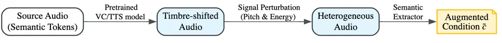
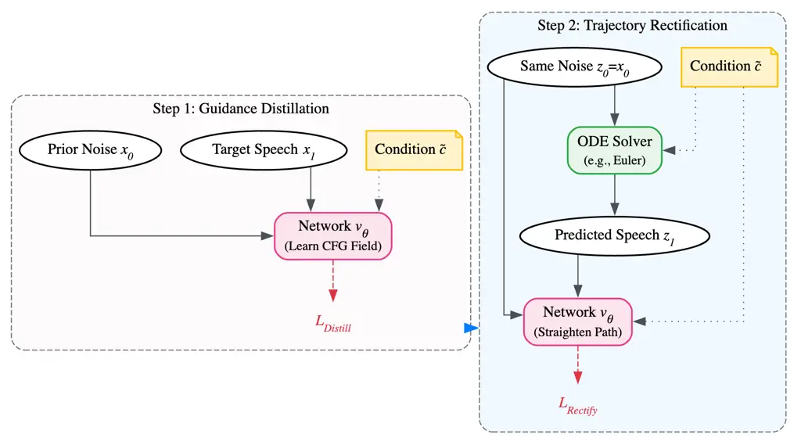

Yu Xu Chen Zhang Fu Yu Wang Song

# Enhancing Flow Matching with A Unified Guidance Framework for Efficient and Robust Speech Synthesis

Zuda    Qianhui    Ting    Junhui    Tao    Hongjiang    Qiangqing   
Yang

###### Abstract

Flow Matching (FM) has emerged as a powerful paradigm for speech
generation but remains constrained by high inference latency and timbre
leakage. To address these bottlenecks, we propose a unified guidance
framework that enhances generation efficiency and robustness through two
complementary strategies. On the data front, we introduce Data-guidance
via heterogeneous augmentation, encouraging the model to disentangle
linguistic content from acoustic residue. In parallel, we propose an
enhanced Model-guidance mechanism that synergizes trajectory
rectification with a novel intrinsic guidance objective. This approach
distills conditional knowledge into network weights and straightens
inference trajectory path, thereby eliminating Classifier-Free Guidance
(CFG) overhead. Experiments demonstrate that our framework accelerates
inference by nearly three times while effectively improving speaker
similarity compared to state-of-the-art baselines. Audio samples are
available here.¹¹ 1
[https://yuzuda283.github.io/unified-guidance-flow-matching/Interspeech2026_demo_samples/](https://yuzuda283.github.io/unified-guidance-flow-matching/Interspeech2026_demo_samples/).

###### keywords

speech synthesis, voice conversion, flow matching

^(†)^(†)address: Zuoyebang, China ^(†)^(†)email: {yuzuda, xuqianhui02,
chenting08, zhangjunhui04, futao01, yuhongjiang, wangqiangqiang,
songyang}@zuoyebang.com

## 1 Introduction

Flow Matching (FM) \[1\] has rapidly advanced speech synthesis by
modeling the continuous transformation from a simple prior to complex
data distributions. This paradigm has demonstrated remarkable potential
across various speech generation tasks. For instance, text-based
approaches such as F5-TTS \[2\] and Matcha-TTS \[3\] achieve fully
non-autoregressive speech generation by directly mapping text to
acoustic features. Concurrently, discrete-token-based frameworks
including the CosyVoice family \[4, 5, 6, 7\], MaskGCT \[8\], and
FireRedTTS \[9\] apply FM to convert semantic representations into
mel-spectrograms. Furthermore, recent audio-language models like
Kimi-Audio \[10\], GLM-4-Voice \[11\], and Step-Audio \[12\]
increasingly rely on FM as a high-fidelity detokenizer for waveform
reconstruction. Beyond speech synthesis, models such as Seed-VC \[13\]
and StableVC \[14\] illustrate the capacity of FM to effectively
disentangle speech attributes for voice conversion. Despite these
impressive milestones, the widespread deployment of FM models in
real-time scenarios remains fundamentally constrained by two distinct
yet critical bottlenecks.

The first bottleneck, timbre leakage, compromises the robustness of
zero-shot generation. Token-based models rely on discrete semantic
representations as conditioning inputs, yet extracting purely
disentangled content is notoriously difficult. Traditional information
bottlenecks such as Vector Quantization (VQ) \[15\] attempt to strip
away speaker identity but often degrade linguistic intelligibility and
pronunciation quality. Consequently, data-driven approaches have gained
prominence. Seed-TTS \[16\] mitigates leakage by retraining models on
synthetic cross-speaker pairs generated via self-distillation, while
Seed-VC \[13\] successfully employs an external generative model to
perturb the source audio during training, forcing the network to align
with the target prompt. These strategies inspire us to extend
single-stage perturbation into a more comprehensive data-guidance
constraint.

The second bottleneck, inference latency, stems from the intrinsic
nature of ODE-based generation imposing two distinct computational
costs. First, iterative ODE solvers require a high Number of Function
Evaluations (NFE) along curved probability paths. Extensive research has
focused on accelerating this process through trajectory manipulation,
with fundamental techniques like Rectified Flow \[17\] attempting to
straighten the probability paths. Similar concepts mapping noise to data
in fewer steps are explored in InstaFlow \[18\] and Consistency
Models \[19\]. In the speech domain specifically, acceleration has been
adapted through progressive distillation in ProDiff \[20\], adversarial
training in FastDiff \[21\], and consistency distillation in
CoMoSpeech \[22\]. While these trajectory-level acceleration methods
substantially reduce NFE, the secondary computational burden of
Classifier-Free Guidance (CFG) \[23\] often remains. CFG ensures strict
prompt adherence but doubles generation cost by requiring conditional
and unconditional passes per sampling step. Concurrently, recent work on
Model-guidance \[24\] offers an inspiring direction by explicitly
optimizing a guided velocity field to replace CFG. Motivated by these
two distinct lines of acceleration, we seek to effectively synergize
them to address both trajectory curvature and guidance overhead
simultaneously.

We argue that overcoming these dual challenges benefits from a unified
approach: robust zero-shot generation demands severing the acoustic
information shortcut during training, while efficient generation demands
a straight, guidance-aware flow trajectory. To this end, we propose a
unified guidance framework that systematically enhances FM through two
complementary pillars:

- •
  Data-guidance (DG): We propose a dual-stage heterogeneous perturbation
  strategy that cascades model-driven cross-synthesis with signal-driven
  acoustic deformations. By deliberately degrading the acoustic
  reliability of semantic tokens during training, the model is forced to
  rely more heavily on the target prompt for timbre generation, thereby
  effectively mitigating timbre leakage.
- •
  Enhanced Model-guidance (MG): We propose an advanced optimization
  mechanism that explicitly synergizes intrinsic guidance distillation
  with trajectory rectification. Our method simultaneously distills the
  CFG-aware velocity field into the network weights and linearizes the
  ODE path on the fly. This strategy circumvents the CFG dual-pass
  overhead and enables high-fidelity sampling in minimal steps.

Through this systematic optimization, our framework accelerates
inference by nearly $`3\times`$ while achieving superior speaker
similarity and pronunciation stability compared to state-of-the-art
baselines.

## 2 Methodology

### 2.1 Conditional Flow Matching

Our method builds upon Conditional Flow Matching (CFM) \[1\], which
constructs probability paths via linear Optimal Transport. Let $`x_{1}`$
denote the target speech sample and $`x_{0}\sim\mathcal{N}(0,I)`$ be the
prior noise. The probability path $`x_{t}`$ is defined via linear
interpolation:

```math
x_{t}=(1-t)x_{0}+tx_{1},\quad t\in[0,1]. \tag{1}
```

The corresponding target velocity field is given by
$`u_{t}=x_{1}-x_{0}`$. CFM trains a neural network
$`v_{\theta}(x_{t},t,c)`$ to approximate this velocity field by
minimizing:

```math
\mathcal{L}_{\text{CFM}}(\theta)=\mathbb{E}_{t,x_{0},x_{1},c}\left[\left\|v_{\theta}(x_{t},t,c)-(x_{1}-x_{0})\right\|^{2}\right]. \tag{2}
```

During inference, samples are generated by solving the ODE
$`dx/dt=v_{\theta}(x_{t},t,c)`$ from $`t=0`$ to $`1`$. To strengthen the
model’s adherence to the target condition $`c`$ (e.g., semantic tokens
and speaker prompts), Classifier-Free Guidance (CFG) \[23\] is widely
adopted. It explicitly modifies the velocity field by extrapolating away
from the unconditional prediction:

```math
\tilde{v}(x_{t},t,c)=(1+w)v_{\theta}(x_{t},t,c)-wv_{\theta}(x_{t},t,\emptyset), \tag{3}
```

where $`w`$ is the guidance scale. While CFG effectively improves
conditional fidelity, it requires two network forward passes per
integration step, doubling the computational cost and exacerbating
inference latency.

### 2.2 Data-guidance via heterogeneous augmentation

Timbre leakage fundamentally stems from an information routing problem
during model optimization. In conditional Flow Matching (FM) for
zero-shot generation, the model is guided by two distinct prompts:
semantic tokens (intended for linguistic content) and acoustic prompts
(e.g., mel-spectrogram, speaker embedding). However, discrete semantic
tokens are rarely pure; they inherently retain residual acoustic hints
from the source audio.

During standard reconstruction training, if the semantic tokens and the
target acoustic prompt share similar acoustic properties, the network
tends to take an information shortcut. Instead of learning to properly
disentangle the two inputs, the model passively extracts overlapping
acoustic clues directly from the semantic tokens. Consequently, during
zero-shot inference, this entangled dependency causes the residual
source acoustics within the tokens to overpower the target prompt,
leading to severe timbre leakage.

To address this, we propose Data-guidance (DG), formulated as a
Dual-Stage Heterogeneous Perturbation strategy. Our objective is not
merely to purify the tokens, but to deliberately degrade their acoustic
reliability during training, thereby mitigating the acoustic shortcut.
As illustrated in Figure 1, we achieve this by constructing heavily
mismatched training pairs through two cascaded steps:

- •
  Model-driven cross-synthesis: Inspired by \[13\], we first feed the
  original source semantic tokens through a generative system (e.g., a
  pretrained VC or TTS model) to synthesize an intermediate speech
  waveform. While this step introduces a preliminary identity shift,
  existing systems possess limited disentanglement capabilities.
  Consequently, the intermediate waveform inevitably retains latent
  acoustic residue that the model could still exploit.
- •
  Signal-driven acoustic deformation: To further suppress these
  remaining acoustic shortcuts, we introduce a secondary perturbation.
  Building upon proven speech augmentation principles \[25\], we apply
  explicit signal-processing transformations, randomized pitch shifting
  and energy scaling to the intermediate waveform. This deliberate
  deformation effectively disrupts the residual acoustic information
  without altering the underlying phonetics.

The final semantic tokens, extracted from this deformed audio, serve as
the augmented condition $`\tilde{c}`$. During training, the FM model
must reconstruct the target speech $`x_{1}`$ from the mismatched
$`\tilde{c}`$ and the clean acoustic prompt. Since the acoustic
properties of $`\tilde{c}`$ have been systematically degraded, the
network is encouraged to extract linguistic content from the semantic
tokens while relying primarily on the acoustic prompt for timbre
rendering.



Figure 1: Illustration of the Data-guidance (DG) strategy. DG employs a
dual-stage heterogeneous perturbation pipeline. By cascading
model-driven cross-synthesis with signal-driven acoustic deformation, it
constructs severely mismatched training pairs.

### 2.3 Enhanced Model-guidance for unified acceleration

The slow inference of flow matching stems from two factors: the
iteration overhead due to curved ODE paths (requiring many NFE) and the
guidance overhead from CFG (requiring dual forward passes). Previous
works \[17, 18, 24\] typically treat these as separate challenges.

We bypass this complexity with an Enhanced Model-guidance (MG) mechanism
that effectively integrates intrinsic guidance distillation \[24\] and
trajectory rectification \[17\] within a single, online training loop.
As illustrated in Figure 2, for each training batch, the optimization
alternates between two sequential steps utilizing the augmented
condition $`\tilde{c}`$.



Figure 2: Overview of the Enhanced Model-guidance (MG) mechanism. MG
operates within a unified batch-level training loop. It first distills
the CFG-aware vector field directly into the network weights.
Subsequently, it utilizes the updated model to integrate straight
trajectory paths.

#### 2.3.1 Model-guidance distillation

First, we infuse the CFG mechanism directly into the network weights. We
formulate an intrinsic guidance objective that replaces the standard CFM
target with a guided velocity field:

```math
v^{\prime}_{\text{target}}=(x_{1}-x_{0})+w\cdot\text{sg}\big(v_{\theta}(x_{t},t,\tilde{c})-v_{\theta}(x_{t},t,\emptyset)\big), \tag{4}
```

where $`\text{sg}(\cdot)`$ denotes the stop-gradient operation. The
network is updated via a single backward pass to minimize the
distillation loss:

```math
\mathcal{L}_{\text{Distill}}(\theta)=\mathbb{E}_{t,x_{0},x_{1},\tilde{c}}\left[\left\|v_{\theta}(x_{t},t,\tilde{c})-v^{\prime}_{\text{target}}\right\|^{2}\right]. \tag{5}
```

By optimizing $`\mathcal{L}_{\text{Distill}}`$, the network
intrinsically learns the CFG-aware vector field, enabling it to generate
highly condition-aligned results using only a single forward pass
$`v_{\theta}(x_{t},t,\tilde{c})`$ at inference time.

#### 2.3.2 Trajectory rectification

Following the distillation step, we leverage the updated, CFG-distilled
network to straighten the generation trajectory. Using the same batch of
prior noise $`z_{0}=x_{0}`$ and the augmented condition $`\tilde{c}`$,
we perform numerical ODE integration to predict the corresponding clean
speech feature $`\hat{z}_{1}`$:

```math
\hat{z}_{1}=\operatorname{ODE}(v_{\theta},z_{0},\tilde{c}). \tag{6}
```

Because the current model $`v_{\theta}`$ has already absorbed the CFG
knowledge, this generation does not require double forward passes,
making the on-the-fly simulation efficient. We then construct a
rectified, straight probability path $`z_{t}=(1-t)z_{0}+t\hat{z}_{1}`$
and update the network to track this linear trajectory:

```math
\mathcal{L}_{\text{Rectify}}(\theta)=\mathbb{E}_{t,z_{0},\hat{z}_{1},\tilde{c}}\left[\left\|v_{\theta}(z_{t},t,\tilde{c})-(\hat{z}_{1}-z_{0})\right\|^{2}\right]. \tag{7}
```

## 3 Experiments

### 3.1 Experimental setup

#### 3.1.1 Datasets

We employ a two-stage data construction strategy to balance pre-training
scale with optimization quality. First, to establish a robust
initialization, the foundation model is pre-trained on 50k hours of
English speech from the Emilia dataset \[26\] under a standard
matched-condition setting. Second, to enforce the proposed Data-guidance
(DG) constraints, we curate a high-quality subset of 30k hours by
filtering for DNSMOS \[27\] scores above 3.2. We then apply our
dual-stage heterogeneous perturbation pipeline (model-driven
cross-synthesis followed by randomized pitch and energy shifting) to
this subset. This generates an additional 30k hours of acoustically
mismatched but linguistically identical pairs. The original and
perturbed subsets are combined to form a 60k-hour mixed corpus, which
serves as the training data for all subsequent Enhanced Model-guidance
(MG) optimization stages.

#### 3.1.2 Experimental configuration

Model architecture: We build a token-based flow matching model inspired
by CosyVoice2 \[5\]. Unlike its original convolution-augmented
architecture, our decoder adopts a pure Diffusion Transformer
(DiT) \[28\]. The model consists of 20 stacked DiT blocks, each
configured with an attention dimension of 1024 and a feed-forward
network (FFN) dimension of 4096, totaling approximately 330M parameters.
Instead of concatenating speaker embeddings with the input tokens, we
inject speaker information through Adaptive Layer Normalization
(AdaLN) \[29\], which provides more effective and fine-grained timbre
control in practice.

Training details: All training processes are conducted on 16 NVIDIA H100
GPUs. Our foundation Flow Matching model is first pre-trained for 5
epochs. We optimize the network using AdamW, with the learning rate
linearly warmed up to a peak of $`1\times 10^{-4}`$ over the first 1,000
steps, followed by a cosine annealing decay to $`1\times 10^{-5}`$. This
pre-training stage takes approximately 48 hours.

Building upon this initialization, we deploy our unified optimization
pipeline on the 60k-hour mixed corpus. The Enhanced MG is executed for 2
epochs. Specifically, to achieve true joint optimization, we perform two
distinct backward passes for each mini-batch: First, we compute and
backpropagate the Intrinsic Guidance Distillation loss (Equation 5) to
internalize the CFG field. Second, we immediately utilize the updated
weights to simulate straight trajectories on the fly with the exact same
batch of noise, backpropagating the Rectification loss (Equation 7).
During this unified optimization phase, we freeze all modules except the
DiT decoder to ensure the model efficiently learns the straightened flow
paths without catastrophically forgetting its pre-trained linguistic
representations. Due to the online training, this stage takes
approximately 90 hours.

### 3.2 Evaluation metrics

To assess the performance of our guidance-enhanced Flow Matching, we
consider the following objective metrics:

Real-time factor (RTF): Measures inference speed. We report RTF for the
Flow Matching model alone, isolating its impact from other pipeline
components.

Speaker similarity (SIM): Cosine similarity between speaker embeddings
of generated speech and reference prompts. We extract embeddings using
Cam++ model \[30\].

Word error rate (WER): Assesses linguistic intelligibility by comparing
Whisper-Large ASR \[31\] transcriptions with the ground-truth text.

### 3.3 Results and discussion

We report evaluation results separately for Voice Conversion (VC) and
Text-to-Speech (TTS) to highlight task-specific performance. All samples
are generated on an NVIDIA RTX 4090 GPU. VC is conditioned on semantic
tokens from source speech, while TTS uses semantic features derived from
text via the CosyVoice2 LLM \[5\] and synthesizes audio with the HiFTNet
Vocoder \[32\].

#### 3.3.1 Voice Conversion (VC) performance

Table 1 presents the ablation results for Voice Conversion under both
Parallel (same speaker, different audio) and Non-Parallel
(cross-speaker) settings. We first isolate the effect of Data-guidance
(DG). Applying DG alone yields the highest Speaker Similarity (SIM)
scores, exceeding the Ground Truth SIM, suggesting that our
heterogeneous perturbation effectively encourages the model to ignore
source acoustic residue. This confirms that our heterogeneous
perturbation successfully forces the model to ignore source acoustic
residue. Conversely, addressing only the inference bottleneck via
Model-guidance (MG) reduces latency but incurs trade-offs. While Vanilla
MG internalizes the CFG logic to lower the RTF from 0.078 to 0.058, our
Enhanced MG further incorporates trajectory rectification to achieve an
extreme 3-step inference. However, without data-level correction, this
acceleration leads to a minor degradation in SIM.

Finally, our unified guidance framework resolves this dilemma by
combining the 3-step Enhanced MG with the DG strategy. Although its
absolute SIM is marginally lower than the computationally heavy DG-only
model, it achieves a substantial $`3.25\times`$ speedup, mitigating the
performance drop seen in the pure Enhanced MG model and outperforming
the 10-step Base baseline. Crucially, the Unified framework demonstrates
strong zero-shot robustness: its Non-Parallel SIM on LibriTTS (0.808)
not only surpasses the Base model but even exceeds the Ground Truth
Parallel SIM (0.799). This confirms that despite operating under 3-step
acceleration without CFG, our framework achieves highly effective
content-timbre disentanglement, offering a practical solution for
real-time deployment.

|                          |                      |                    |          |              |          |
| ------------------------ | -------------------- | ------------------ | -------- | ------------ | -------- |
| Method                   | RTF ($`\downarrow`$) | SIM ($`\uparrow`$) |          |              |          |
|                          |                      | Parallel           |          | Non-Parallel |          |
|                          |                      | LibriTTS           | Seed-TTS | LibriTTS     | Seed-TTS |
| Reference (GT)           | \-                   | 0.799              | 0.789    | 0.073        | 0.128    |
| Base Model (10 NFE)      | 0.078                | 0.874              | 0.800    | 0.793        | 0.730    |
| Data-guidance (DG)       |                      |                    |          |              |          |
|    + DG (10 NFE)         | 0.078                | 0.897              | 0.822    | 0.869        | 0.792    |
| Model-guidance (MG)      |                      |                    |          |              |          |
|    + Vanilla MG (10 NFE) | 0.058                | 0.885              | 0.810    | 0.813        | 0.744    |
|    + Enhanced MG (3 NFE) | 0.024                | 0.870              | 0.791    | 0.792        | 0.722    |
| Unified Guidance (3 NFE) | 0.024                | 0.887              | 0.808    | 0.850        | 0.767    |

Table 1: Results for Voice Conversion on LibriTTS and Seed-TTS. The
table demonstrates the individual and combined impact of the
Data-guidance (DG) strategy and Enhanced Model-guidance (MG) mechanism.

| Method           | LibriTTS             |                    | Seed-TTS             |                    |
| ---------------- | -------------------- | ------------------ | -------------------- | ------------------ |
|                  | WER ($`\downarrow`$) | SIM ($`\uparrow`$) | WER ($`\downarrow`$) | SIM ($`\uparrow`$) |
| Reference (GT)   | 2.12                 | 0.799              | 1.82                 | 0.789              |
| CosyVoice2       | 2.57                 | 0.847              | 2.47                 | 0.750              |
| Base Model       | 2.57                 | 0.871              | 2.22                 | 0.794              |
| Unified Guidance | 2.60                 | 0.888              | 2.45                 | 0.806              |

Table 2: Text-to-Speech (TTS) performance on LibriTTS and Seed-TTS.

#### 3.3.2 Text-to-Speech (TTS) performance

To evaluate the generalization capability of our framework, we extend
our experiments to the zero-shot TTS task. We utilize the CosyVoice2 LLM
\[5\] to generate semantic tokens and exclusively swap the Flow Matching
(FM) model.

As reported in Table 2, our 3-step Unified FM backend maintains
comparable intelligibility compared to the official CosyVoice2 backend.
While extreme trajectory rectification introduces a slight degradation
in WER, the linguistic stability remains robust. More importantly, when
paired with the same LLM, our unified model achieves a higher SIM score
outperforming the unoptimized Base FM model. This demonstrates that our
Data-guidance strategy effectively filters out latent acoustic variance
inherently predicted by the LLM, anchoring the timbre to the target
prompt. Overall, our framework serves as a robust, efficient acoustic
detokenizer for existing TTS systems.

## 4 Conclusion

This paper presented a unified guidance framework that addresses the
distinct bottlenecks of timbre leakage and high inference latency in
Flow Matching-based speech generation. On the data side, our
Data-guidance strategy employs dual-stage heterogeneous perturbation to
sever acoustic shortcuts during training, promoting robust
content-timbre disentanglement. On the model side, our Enhanced
Model-guidance mechanism integrates intrinsic guidance distillation with
online trajectory rectification, entirely eliminating CFG overhead.
Experiments on both Voice Conversion and Text-to-Speech benchmarks show
that the proposed framework achieves a $`3.25\times`$ inference speedup
while consistently improving zero-shot speaker similarity. Furthermore,
when deployed as an acoustic backend for existing TTS systems, our
framework maintains competitive intelligibility while delivering
improved speaker fidelity. These results demonstrate that our unified
approach offers a practical and effective solution for real-time speech
generation.

## 5 Acknowledgments

(Hidden for review)

## 6 Generative AI Use Disclosure

The authors used generative AI tools (Gemini 3.0 pro) solely for the
purpose of checking LaTeX formatting, correcting syntax errors, and
refining the layout of this manuscript. No AI tools were used to
generate scientific content, experimental data, or the intellectual
ideas presented in this work.

## References

- \[1\] Y. Lipman, R. T. Q. Chen, H. Ben-Hamu, M. Nickel, and M.
  Le (2023) Flow matching for generative modeling. In The Eleventh
  International Conference on Learning Representations, External Links:
  [Link](https://openreview.net/forum?id=PqvMRDCJT9t) Cited by: §1,
  §2.1.
- \[2\] Y. Chen, Z. Niu, Z. Ma, K. Deng, C. Wang, J. JianZhao, K. Yu,
  and X. Chen (2025) F5-TTS: a fairytaler that fakes fluent and faithful
  speech with flow matching. In Proceedings of the 63rd Annual Meeting
  of the Association for Computational Linguistics (Volume 1: Long
  Papers), W. Che, J. Nabende, E. Shutova, and M. T. Pilehvar (Eds.),
  Vienna, Austria, pp. 6255–6271. External Links:
  [Link](https://aclanthology.org/2025.acl-long.313/),
  [Document](https://dx.doi.org/10.18653/v1/2025.acl-long.313), ISBN
  979-8-89176-251-0 Cited by: §1.
- \[3\] S. Mehta, R. Tu, J. Beskow, É. Székely, and G. E. Henter (2024)
  Matcha-TTS: a fast TTS architecture with conditional flow matching. In
  Proc. ICASSP, Cited by: §1.
- \[4\] Z. Du, Q. Chen, S. Zhang, K. Hu, H. Lu, Y. Yang, H. Hu, S.
  Zheng, Y. Gu, Z. Ma, et al. (2024) Cosyvoice: a scalable multilingual
  zero-shot text-to-speech synthesizer based on supervised semantic
  tokens. arXiv preprint arXiv:2407.05407. Cited by: §1.
- \[5\] Z. Du, Y. Wang, Q. Chen, X. Shi, X. Lv, T. Zhao, Z. Gao, Y.
  Yang, C. Gao, H. Wang, et al. (2024) Cosyvoice 2: scalable streaming
  speech synthesis with large language models. arXiv preprint
  arXiv:2412.10117. Cited by: §1, §3.1.2, §3.3.2, §3.3.
- \[6\] Z. Du, C. Gao, Y. Wang, F. Yu, T. Zhao, H. Wang, X. Lv, H.
  Wang, X. Shi, K. An, et al. (2025) CosyVoice 3: towards in-the-wild
  speech generation via scaling-up and post-training. arXiv preprint
  arXiv:2505.17589. Cited by: §1.
- \[7\] X. Lyu, Y. Wang, T. Zhao, H. Wang, H. Liu, and Z. Du (2025)
  Build llm-based zero-shot streaming tts system with cosyvoice. In
  ICASSP 2025-2025 IEEE International Conference on Acoustics, Speech
  and Signal Processing (ICASSP), pp. 1–2. Cited by: §1.
- \[8\] Y. Wang, H. Zhan, L. Liu, R. Zeng, H. Guo, J. Zheng, Q.
  Zhang, X. Zhang, S. Zhang, and Z. Wu (2025) MaskGCT: zero-shot
  text-to-speech with masked generative codec transformer. In ICLR,
  Cited by: §1.
- \[9\] H. Guo, Y. Hu, K. Liu, F. Shen, X. Tang, Y. Wu, F. Xie, K. Xie,
  and K. Xu (2024) Fireredtts: a foundation text-to-speech framework for
  industry-level generative speech applications. arXiv preprint
  arXiv:2409.03283. Cited by: §1.
- \[10\] D. Ding, Z. Ju, Y. Leng, S. Liu, T. Liu, Z. Shang, K. Shen, W.
  Song, X. Tan, H. Tang, et al. (2025) Kimi-audio technical report.
  arXiv preprint arXiv:2504.18425. Cited by: §1.
- \[11\] A. Zeng, Z. Du, M. Liu, K. Wang, S. Jiang, L. Zhao, Y. Dong,
  and J. Tang (2024) GLM-4-voice: towards intelligent and human-like
  end-to-end spoken chatbot. External Links: 2412.02612,
  [Link](https://arxiv.org/abs/2412.02612) Cited by: §1.
- \[12\] A. Huang, B. Wu, B. Wang, C. Yan, C. Hu, C. Feng, F. Tian, F.
  Shen, J. Li, M. Chen, et al. (2025) Step-audio: unified understanding
  and generation in intelligent speech interaction. arXiv preprint
  arXiv:2502.11946. Cited by: §1.
- \[13\] S. Liu (2024) Zero-shot voice conversion with diffusion
  transformers. External Links: 2411.09943,
  [Link](https://arxiv.org/abs/2411.09943) Cited by: §1, §1, 1st item.
- \[14\] J. Yao, Y. Yuguang, Y. Pan, Z. Ning, J. Ye, H. Zhou, and L.
  Xie (2025) StableVC: style controllable zero-shot voice conversion
  with conditional flow matching. In Proceedings of the Thirty-Ninth
  AAAI Conference on Artificial Intelligence and Thirty-Seventh
  Conference on Innovative Applications of Artificial Intelligence and
  Fifteenth Symposium on Educational Advances in Artificial
  Intelligence, AAAI’25/IAAI’25/EAAI’25. External Links: ISBN
  978-1-57735-897-8, [Link](https://doi.org/10.1609/aaai.v39i24.34758),
  [Document](https://dx.doi.org/10.1609/aaai.v39i24.34758) Cited by: §1.
- \[15\] T. V. Ho and M. Akagi (2020) Non-parallel Voice Conversion
  based on Hierarchical Latent Embedding Vector Quantized Variational
  Autoencoder. In Joint Workshop for the Blizzard Challenge and Voice
  Conversion Challenge 2020, pp. 140–144. External Links:
  [Document](https://dx.doi.org/10.21437/VCCBC.2020-20) Cited by: §1.
- \[16\] P. Anastassiou, J. Chen, J. Chen, Y. Chen, Z. Chen, Z. Chen, J.
  Cong, L. Deng, C. Ding, L. Gao, et al. (2024) Seed-tts: a family of
  high-quality versatile speech generation models. arXiv preprint
  arXiv:2406.02430. Cited by: §1.
- \[17\] X. Liu, C. Gong, and qiang liu (2023) Flow straight and fast:
  learning to generate and transfer data with rectified flow. In The
  Eleventh International Conference on Learning Representations,
  External Links: [Link](https://openreview.net/forum?id=XVjTT1nw5z)
  Cited by: §1, §2.3, §2.3.
- \[18\] X. Liu, X. Zhang, J. Ma, J. Peng, and qiang liu (2024)
  InstaFlow: one step is enough for high-quality diffusion-based
  text-to-image generation. In The Twelfth International Conference on
  Learning Representations, External Links:
  [Link](https://openreview.net/forum?id=1k4yZbbDqX) Cited by: §1, §2.3.
- \[19\] Y. Song, P. Dhariwal, M. Chen, and I. Sutskever (2023)
  Consistency models. In Proceedings of the 40th International
  Conference on Machine Learning, ICML’23. Cited by: §1.
- \[20\] R. Huang, Z. Zhao, H. Liu, J. Liu, C. Cui, and Y. Ren (2022)
  ProDiff: progressive fast diffusion model for high-quality
  text-to-speech. In Proceedings of the 30th ACM International
  Conference on Multimedia, MM ’22, pp. 2595–2605. External Links: ISBN
  9781450392037, [Link](https://doi.org/10.1145/3503161.3547855),
  [Document](https://dx.doi.org/10.1145/3503161.3547855) Cited by: §1.
- \[21\] R. Huang, M. W. Lam, J. Wang, D. Su, D. Yu, Y. Ren, and Z.
  Zhao (2022) FastDiff: a fast conditional diffusion model for
  high-quality speech synthesis. Cited by: §1.
- \[22\] Z. Ye, W. Xue, X. Tan, J. Chen, Q. Liu, and Y. Guo (2023)
  CoMoSpeech: one-step speech and singing voice synthesis via
  consistency model. In Proceedings of the 31st ACM International
  Conference on Multimedia, pp. 1831–1839. External Links: ISBN
  9798400701085, [Link](https://doi.org/10.1145/3581783.3612061),
  [Document](https://dx.doi.org/10.1145/3581783.3612061) Cited by: §1.
- \[23\] J. Ho and T. Salimans (2021) Classifier-free diffusion
  guidance. In NeurIPS 2021 Workshop on Deep Generative Models and
  Downstream Applications, External Links:
  [Link](https://openreview.net/forum?id=qw8AKxfYbI) Cited by: §1, §2.1.
- \[24\] Z. Tang, D. Chen, J. Bao, and B. Guo (2025) Diffusion models
  without classifier-free guidance. External Links:
  [Link](https://openreview.net/forum?id=kkiLdrKk0G) Cited by: §1, §2.3,
  §2.3.
- \[25\] E. Kharitonov, M. Rivière, G. Synnaeve, L. Wolf, P. Mazaré, M.
  Douze, and E. Dupoux (2021) Data augmenting contrastive learning of
  speech representations in the time domain. In 2021 IEEE Spoken
  Language Technology Workshop (SLT), Vol. , pp. 215–222. External
  Links: [Document](https://dx.doi.org/10.1109/SLT48900.2021.9383605)
  Cited by: 2nd item.
- \[26\] H. He, Z. Shang, C. Wang, X. Li, Y. Gu, H. Hua, L. Liu, C.
  Yang, J. Li, P. Shi, et al. (2024) Emilia: an extensive, multilingual,
  and diverse speech dataset for large-scale speech generation. In 2024
  IEEE Spoken Language Technology Workshop (SLT), pp. 885–890. Cited by:
  §3.1.1.
- \[27\] C. K. A. Reddy, V. Gopal, and R. Cutler (2021) Dnsmos: a
  non-intrusive perceptual objective speech quality metric to evaluate
  noise suppressors. In ICASSP 2021 - 2021 IEEE International Conference
  on Acoustics, Speech and Signal Processing (ICASSP), Vol. ,
  pp. 6493–6497. External Links:
  [Document](https://dx.doi.org/10.1109/ICASSP39728.2021.9414878) Cited
  by: §3.1.1.
- \[28\] W. Peebles and S. Xie (2023) Scalable diffusion models with
  transformers. In Proceedings of the IEEE/CVF International Conference
  on Computer Vision (ICCV), pp. 4195–4205. Cited by: §3.1.2.
- \[29\] J. Xu, X. Sun, Z. Zhang, G. Zhao, and J. Lin (2019)
  Understanding and improving layer normalization. In Advances in Neural
  Information Processing Systems (NeurIPS), Vol. 32. Cited by: §3.1.2.
- \[30\] H. Wang, S. Zheng, Y. Chen, L. Cheng, and Q. Chen (2023) CAM++:
  A Fast and Efficient Network for Speaker Verification Using
  Context-Aware Masking. In Interspeech 2023, pp. 5301–5305. External
  Links: [Document](https://dx.doi.org/10.21437/Interspeech.2023-1513),
  ISSN 2958-1796 Cited by: §3.2.
- \[31\] A. Radford, J. W. Kim, T. Xu, G. Brockman, C. Mcleavey, and I.
  Sutskever (2023) Robust speech recognition via large-scale weak
  supervision. In Proceedings of the 40th International Conference on
  Machine Learning, A. Krause, E. Brunskill, K. Cho, B. Engelhardt, S.
  Sabato, and J. Scarlett (Eds.), Proceedings of Machine Learning
  Research, Vol. 202, pp. 28492–28518. External Links:
  [Link](https://proceedings.mlr.press/v202/radford23a.html) Cited by:
  §3.2.
- \[32\] Y. A. Li, C. Han, X. Jiang, and N. Mesgarani (2023) HiFTNet: a
  fast high-quality neural vocoder with harmonic-plus-noise filter and
  inverse short time fourier transform. External Links: 2309.09493,
  [Link](https://arxiv.org/abs/2309.09493) Cited by: §3.3.
