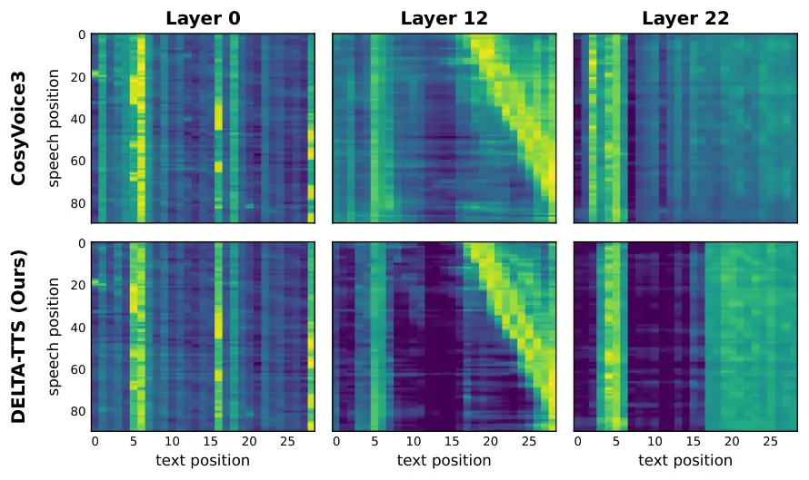

# DELTA-TTS: Adapting Autoregressive Model into Diffusion Language Model for Text-to-Speech

Junwon Moon Affiliation: Sungkyunkwan University
Email: [mppn98@skku.edu](mailto:)    Yejin Lee Affiliation: Sungkyunkwan
University Email: [khshim@skku.edu](mailto:)    Seungbeom Kim
Affiliation: Sungkyunkwan University    Hoseong Ahn
Affiliation: Sungkyunkwan University    Sewoong Park
Affiliation: Sungkyunkwan University    Heeseung Kim
Affiliation: University of Seoul    Kyuhong Shim
Affiliation: Sungkyunkwan University

###### Abstract

Autoregressive (AR) text-to-speech (TTS) models generate discrete speech
tokens sequentially, which makes inference slow and can degrade
robustness, since local errors propagate to later positions and can
escalate into hallucination. This limitation stems from their
left-to-right AR commitment: each token must be determined before future
speech-token context is available. However, such ordering is not an
inherent requirement for TTS, since the model receives the full input
text before synthesis. In this paper, we introduce DELTA-TTS, a
lightweight LoRA-based adaptation framework that converts a pretrained
AR TTS model into a discrete diffusion language model (dLLM) for
confidence-ordered speech-token decoding. To better capture the local
structure of speech, DELTA-TTS incorporates a convolution module that
injects local acoustic context, together with a $`1/t`$-weighted
training objective and a time-shifted inference schedule that together
defer low-confidence positions to later steps. Trained on only $`585`$
hours of LibriTTS, DELTA-TTS achieves a $`\textbf{1.75}\%`$ WER on
Seed-TTS _test-en_, outperforming its AR backbone while generating
tokens $`\textbf{3.3}\times`$ faster. Further analysis shows that
DELTA-TTS produces sharper text–speech alignment, increases overall
decoding confidence, and mitigates the hallucinations observed in AR
generation.

## 1 Introduction

Recent autoregressive (AR) text-to-speech (TTS) models synthesize highly
natural speech using large language model (LLM) backbones that predict
discrete speech tokens \[11, 12, 22, 42\]. Despite their strong
performance, AR TTS models have two fundamental limitations. First,
token-by-token generation leads to slow inference. This cost is
particularly pronounced for speech, which requires far more tokens than
text to represent the same content. Second, unidirectional generation
conditions each token only on past context. Because neighboring speech
tokens strongly depend on one another, the AR model’s inability to
attend to future context becomes a structural weakness.

Figure 1: Overview of DELTA-TTS. A pretrained AR TTS backbone is
converted into a discrete diffusion language model with two adaptations:
bidirectional attention and block-wise LoRA with a Conformer-style
convolution module.

Formally, AR TTS models the conditional distribution
$`P(A\mid T)=P(a_{1},a_{2},\dots\mid T)`$, where $`A`$ is a speech-token
sequence and $`T`$ is the input text. The AR formulation factorizes this
distribution as $`P(a_{1}\mid T)\,P(a_{2}\mid a_{1},T)\cdots`$, forcing
a fixed left-to-right generation order. However, because the entire text
$`T`$ is given in advance, this factorization is not the only option for
producing $`A`$. Since the learned model can only approximate the target
conditional distribution, the decoding order affects how errors
accumulate. We hypothesize that decoding tokens in order of confidence,
rather than in temporal (i.e., left-to-right) order, leads to more
stable generation. Interestingly, this hypothesis aligns closely with
the generation process of discrete diffusion language models (dLLMs),
which have recently emerged as a promising alternative to AR generation
in the text domain \[30, 33, 41, 34\]. In essence, dLLMs generate
high-confidence tokens first and progressively complete the sequence
through iterative refinement. In this paper, we propose DELTA-TTS, a
framework that adapts a pretrained AR TTS model into a dLLM, generating
speech non-autoregressively while preserving the synthesis quality of
the backbone. The conversion process employs parameter-efficient
LoRA-based modifications. To better reflect the local and bidirectional
structure of speech, we introduce two additional refinements. First, we
incorporate a Conformer-style convolution module to model the
correlations among adjacent speech tokens. Second, we combine a
$`1/t`$-weighted training objective with a time-shifted inference
schedule so that tokens with insufficient context can be deferred to
later decoding steps. With these refinements, the model learns a sharper
text–speech alignment and reduces error accumulation caused by
committing tokens too early.

We validate DELTA-TTS through both empirical evaluation and analysis.
Trained on only 585 hours of LibriTTS, DELTA-TTS achieves 1.75% WER on
Seed-TTS _test-en_ while generating tokens 3.3$`\times`$ faster, and our
analysis shows how each refinement contributes to these gains.

Our contributions are as follows:

- •
  We introduce DELTA-TTS, the first method to extend AR-to-dLLM
  conversion to speech. DELTA-TTS converts a pretrained AR TTS backbone
  into a non-autoregressive model through a lightweight LoRA-based
  modification that requires only $`\sim`$15% additional parameters.
- •
  We propose two speech-aware designs for generation in confidence order
  rather than temporal order: a convolution module for locality, and a
  $`1/t`$-weighted training objective with a time-shifted schedule for
  deferring uncertain tokens to later steps.
- •
  We analyze the conversion from two perspectives. First, naive
  text-domain conversion substantially degrades performance, and the
  convolution module recovers it by sharpening the text–speech
  alignment. Second, confidence-ordered decoding maintains high
  confidence across the sequence, mitigating hallucination.

## 2 Related Work

### 2.1 Autoregressive and Non-Autoregressive TTS

Modern zero-shot AR TTS systems formulate speech synthesis as language
modeling over discrete tokens and are trained on large speech
corpora \[1, 11, 6\]. A growing line of work initializes their backbones
from pretrained text language models \[12, 36, 40\]. On top of these
backbones, they attach speech embedding and output projection layers to
process discrete speech tokens. However, this paradigm inherits two
limitations from AR language modeling. First, generating an $`N`$-token
speech sequence demands $`N`$ sequential forward passes, so inference
latency grows linearly with the output length. Second, attending only to
past context prevents the model from exploiting future tokens, despite
the strong local dependencies among neighboring speech tokens.

NAR TTS models instead generate all tokens within a fixed number of
refinement steps, independent of the output length. This parallel
formulation is also naturally compatible with bidirectional attention,
so the model can capture full-sequence context. These methods can be
broadly categorized into continuous-space approaches \[7, 13, 25, 26\]
and discrete-token approaches \[4, 24, 37, 38\]. However, as with AR
systems, NAR TTS models are typically trained from scratch on
large-scale speech corpora, which incurs substantial computational cost.

To bridge the gap between these two paradigms, hybrid approaches
combining AR and NAR generation have also been explored. For example,
DiTAR \[23\] performs autoregressive generation at the chunk level while
employing diffusion-based decoding within each chunk. While
bidirectional attention operates within each chunk, generation across
chunks remains sequential. As a result, the latency bottleneck is only
partially resolved.

### 2.2 Discrete Diffusion Language Models

Diffusion-based language modeling has emerged as a competitive NAR
paradigm. Early continuous-diffusion approaches \[9, 16, 19, 27\] suffer
from scalability issues and information loss when mapping continuous
representations back to discrete tokens. Subsequent work has therefore
shifted toward discrete diffusion models that operate directly in the
token space \[3, 28, 33\].

Specifically, these models learn to predict masked tokens in a partially
masked sequence, reversing a forward masking process. At inference time,
starting from a fully masked sequence, the model iteratively unmasks
tokens in parallel and commits the most confident predictions at each
step. Building on this paradigm, recent dLLMs \[2, 30, 41, 46\] have
begun to narrow the quality gap with AR LLMs while retaining the
efficiency advantages of parallel generation.

### 2.3 AR-to-dLLM Conversion

A recent line of research has shown that pretrained AR language models
can be converted into dLLMs \[15, 35, 39, 41\]. These methods adapt
pretrained AR weights through continual pretraining with a masked
diffusion objective \[33\]. Many of these methods further incorporate a
shift operation that preserves the next-token prediction behavior of the
AR model, so the pretrained weights transfer directly to parallel
generation. Because this conversion route avoids training from scratch,
it substantially improves training efficiency. However, existing
approaches have been developed primarily for text language models, and
extending AR-to-dLLM conversion to TTS models remains unexplored.

## 3 Method

### 3.1 Overview

DELTA-TTS adapts a pretrained AR TTS model into a dLLM, while keeping
the speech tokenizer and the flow-matching decoder frozen so that the
existing zero-shot inference pipeline can be reused without
modification. We use CosyVoice3 \[11\] as the AR backbone, in which a
Qwen2.5-0.5B language model produces a 25 Hz semantic speech-token
sequence and a flow-matching decoder converts these tokens into
waveforms.

We adapt the backbone through two changes (Figure 1). First, we replace
the causal self-attention mask with a bidirectional one. Second, we add
two block-wise modules, a LoRA and a Conformer-style convolution module,
on top of the frozen AR backbone. We detail these changes in
Sections 3.2 and 3.3, followed by the training objective in Section 3.4
and the inference procedure in Section 3.5.

### 3.2 Bidirectional Adaptation

Following CosyVoice3’s zero-shot input format, each sample is laid out
as

```math
[\text{SOS},\mathbf{t}_{\text{inst}},\mathbf{t}_{\text{prompt}},\mathbf{t}_{\text{target}},\text{TASK},\mathbf{s}_{\text{prompt}},\mathbf{s}_{\text{target}},\text{EOS}], \tag{1}
```

where $`\mathbf{t}_{\text{inst}}`$, $`\mathbf{t}_{\text{prompt}}`$, and
$`\mathbf{t}_{\text{target}}`$ denote the instruction, prompt, and
target text tokens, and $`\mathbf{s}_{\text{prompt}}`$ and
$`\mathbf{s}_{\text{target}}`$ denote the prompt and target speech
tokens. Masking is applied only to $`\mathbf{s}_{\text{target}}`$.

During training, a random subset of its positions is replaced with the
mask token $`\mathrm{M}`$, and the model learns to recover the original
tokens. At inference time, $`\mathbf{s}_{\text{target}}`$ is initialized
as a sequence of $`\mathrm{M}`$ tokens.

The AR backbone processes the resulting sequence under bidirectional
self-attention. As a result, each masked target token has direct access
to the surrounding speech context, the full transcript, and the prompt
speech tokens that carry speaker identity.

### 3.3 Lightweight Adapter Architecture

We freeze the AR backbone and route all adaptation through two trainable
modules attached to every transformer block. The first module is
LoRA \[21\], which adds low-rank updates to the attention and
feed-forward projections of each block while leaving the original
weights untouched. Because the pretrained weights are not modified, the
backbone retains its language modeling capabilities and speech-token
representations while transitioning from causal to bidirectional
attention. The low-rank updates alone are sufficient to support the
newly introduced bidirectional context. In prior AR-to-dLLM
adaptation \[15\], the bidirectional mask must be phased in gradually
over training to prevent disruption of the fully trained backbone. Our
approach removes the need for this mask-annealing schedule.

The second module is a Conformer-style convolution module \[17\],
inserted as a residual branch after each transformer block and composed
of a depth-wise convolution, GLU gating, and a Swish activation. Speech
tokens at 25 Hz exhibit strong temporal locality. Neighboring positions
encode acoustically similar frames, and most of the structure relevant
to prosody and phoneme transitions lies within a short window.
Bidirectional self-attention mixes information across the full sequence
but has limited inductive bias toward local context. The convolution
module compensates for this limitation with an explicit local-mixing
operation, so the two mechanisms jointly cover both global structure and
short-range continuity.

### 3.4 Training

We follow the masked discrete diffusion formulation \[30, 33\]. Let
$`\mathbf{s}_{0}`$ denote the original target speech tokens. For each
training example, we sample $`t\in(0,1)`$. We then form a partially
masked sequence $`\mathbf{s}_{t}`$ by replacing each token of
$`\mathbf{s}_{0}`$ with the mask token $`\mathrm{M}`$ independently with
probability $`t`$. All other tokens in the input (text, prompt speech,
special tokens) remain visible and form the context $`\mathbf{c}`$. The
model is trained to predict the original token at each masked position:

```math
\mathcal{L}(\theta)\triangleq-\mathbb{E}_{t,\mathbf{s}_{0},\mathbf{s}_{t}}\biggl[\frac{1}{t}\sum_{i=1}^{L}\mathbf{1}[\mathbf{s}_{t}^{i}=\mathrm{M}]\,\log p_{\theta}(\mathbf{s}_{0}^{i}\,|\,\mathbf{c},\mathbf{s}_{t})\biggr], \tag{2}
```

where $`L`$ is the target speech length and the indicator restricts the
loss to masked positions. The $`1/t`$ weighting follows from the ELBO of
the masked diffusion process \[15, 30\], amplifying the loss at low
masking ratios where the model should predict with high confidence.

The AR backbone predicts the token at position $`i{+}1`$ from the hidden
state at position $`i`$, whereas standard masked diffusion predicts the
masked token at the same position $`i`$. We adopt the shift operation
from prior AR-to-dLLM conversions \[15, 41\]: the hidden state at
position $`i`$ predicts $`\mathbf{s}_{0}^{i+1}`$ rather than
$`\mathbf{s}_{0}^{i}`$, preserving the AR backbone’s next-token
prediction behavior.

The mask token $`\mathrm{M}`$ is the only newly added embedding; we
initialize it as the mean of all speech-token embeddings and let
training refine it.

Figure 2: Speed–quality Pareto front on Seed-TTS _test-en_ (both axes
log-scale). DELTA-TTS at 16 steps achieves the lowest WER and RTF among
all evaluated systems, offering the most favorable speed–quality
trade-off.

### 3.5 Inference

We decode $`\mathbf{s}_{\text{target}}`$ through $`T`$ iterations of
parallel unmasking. At each iteration, the model predicts every masked
position simultaneously and draws each candidate with top-$`p`$ nucleus
sampling \[20\]. We then accept the candidates with the highest
confidence, defined as the probability of the sampled token, and keep
the rest masked for the next iteration.

Instead of unmasking a uniform number of tokens per step, we use a
time-shifted schedule that adapts the continuous formulation of \[14\]
to the discrete unmasking setting. Let $`c_{n}`$ be the cumulative
fraction of tokens unmasked after step $`n`$ out of $`T`$:

```math
c_{n}=\frac{\mu\cdot n/T}{1+(\mu-1)\cdot n/T}, \tag{3}
```

where $`\mu>0`$ is a time-shifting parameter, and the number of
decisions made at step $`n`$ is
$`k_{n}=\lfloor c_{n}L\rfloor-\lfloor c_{n-1}L\rfloor`$. With $`\mu<1`$,
the schedule unmasks few tokens at early steps and concentrates most
decisions toward the end.

This schedule creates a confidence-to-context decoding trajectory. When
the sequence is still highly masked, the model commits only a few
tokens, selecting the most confident positions first. Once committed,
these tokens become reliable anchors that provide local and
bidirectional speech context for the remaining masked positions. As
decoding proceeds, the accumulated high-confidence tokens help resolve
later, less confident positions under richer context. The time-shifted
schedule in Eq. (3) avoids unreliable early commitments, and the few
confident decisions made early support later, more difficult ones.

## 4 Experiments

### 4.1 Experimental Setup

#### 4.1.1 Training and Evaluation Datasets

We train our AR-to-dLLM conversion on LibriTTS \[43\] (585 h of English
speech). We evaluate on two zero-shot TTS benchmarks: Seed-TTS
*test-en* \[1\] (1088 samples) from the Seed-TTS evaluation suite, and
the LibriSpeech-PC _test-clean_ Subset B \[29\] (1127 samples) released
by F5-TTS \[7\].

#### 4.1.2 Evaluation Metrics

We report four objective metrics. For Word Error Rate (WER), which
assesses generation intelligibility, we follow prior conventions and use
a different ASR system per benchmark: Whisper-Large-V3 \[31\] for
Seed-TTS _test-en_ and Faster-Whisper-Large-V3 for LibriSpeech-PC Subset
B. For speaker similarity (SIM), we compute the cosine similarity
between the generated and prompt speech using an ECAPA-TDNN model \[8\]
based on WavLM-large \[5\]. We adopt UTMOS \[32\], a predicted mean
opinion score, to assess speech naturalness objectively. We measure
inference speed as the Real-Time Factor (RTF) on a single NVIDIA A100.

For subjective evaluation, we collect the comparative mean opinion score
(CMOS, $`[-3,3]`$) for side-by-side naturalness comparison against human
audio, and the similarity mean opinion score (SMOS, $`[1,5]`$) for
speaker similarity to the prompt audio.

|      |                  |          |                       |                    |                  |
| ---- | ---------------- | -------- | --------------------- | ------------------ | ---------------- |
| Type | Model            | Params.  | Training Data (hours) | Seed-TTS _test-en_ |                  |
|      |                  |          |                       | WER $`\downarrow`$ | SIM $`\uparrow`$ |
| –    | Ground-truth     | –        | –                     | 2.14               | 0.734            |
| AR   | Seed-TTS         | N/A      | N/A                   | 2.25               | 0.762            |
|      | CosyVoice        | 0.3B     | 170K Multi.           | 4.29               | 0.609            |
|      | CosyVoice2       | 0.5B     | 170K Multi.           | 2.57               | 0.659            |
|      | Spark TTS        | 0.5B     | 100K Multi.           | 1.98               | 0.573            |
|      | FireRedTTS2      | 1.5B     | 1400K Multi.          | 1.95               | 0.665            |
|      | IndexTTS2        | 1.5B     | 55K Emilia            | 2.23               | 0.706            |
|      | VoxCPM           | 0.5B     | 1800K Multi.          | 1.85               | 0.729            |
|      | Llasa            | 1B       | 250K Multi.           | 3.22               | 0.572            |
|      | CosyVoice3       | 0.5B     | 1000K Multi.          | 2.02               | 0.692            |
| NAR  | MaskGCT (50 NFE) | 1.1B     | 100K Emilia           | 2.62               | 0.714            |
|      | E2 TTS (32 NFE)  | 0.3B     | 100K Emilia           | 2.19               | 0.710            |
|      | F5-TTS (32 NFE)  | 0.3B     | 100K Emilia           | 2.00               | 0.647            |
| Ours | DELTA-TTS        | 0.5B+94M | 0.585K LibriTTS       | 1.75               | 0.688            |

Table 1: Objective evaluation on Seed-TTS _test-en_. Baseline results
are from official checkpoints or papers. Best results are in bold and
second-best are underlined. $`\uparrow`$: higher is better;
$`\downarrow`$: lower is better.

| Model        | CMOS $`\uparrow`$          | SMOS $`\uparrow`$         |
| ------------ | -------------------------- | ------------------------- |
| Ground-truth | 0.00                       | $`3.80\pm 0.09`$          |
| CosyVoice3   | $`-0.25\pm 0.12`$          | $`4.00\pm 0.08`$          |
| DELTA-TTS    | $`\mathbf{+0.16}\pm 0.11`$ | $`\mathbf{4.14}\pm 0.07`$ |

Table 2: Subjective evaluation on Seed-TTS _test-en_. Means with 95%
confidence intervals.

| Duration | WER (%) $`\downarrow`$ |       | RTF $`\downarrow`$ |       | Speedup $`\uparrow`$ |
| -------- | ---------------------- | ----- | ------------------ | ----- | -------------------- |
|          | CosyVoice3             | DELTA | CosyVoice3         | DELTA |                      |
| 0–3 s    | 1.54                   | 1.24  | 0.479              | 0.230 | 2.08$`\times`$       |
| 3–5 s    | 1.74                   | 1.45  | 0.475              | 0.144 | 3.30$`\times`$       |
| 5–10 s   | 2.80                   | 2.60  | 0.473              | 0.106 | 4.46$`\times`$       |
| All      | 2.02                   | 1.75  | 0.475              | 0.144 | 3.30$`\times`$       |

Table 3: Length-bucketed WER and RTF on Seed-TTS _test-en_. RTF is
measured on the token-generation stage.

|      |                  |          |                       |                             |                  |                    |
| ---- | ---------------- | -------- | --------------------- | --------------------------- | ---------------- | ------------------ |
| Type | Model            | Params.  | Training Data (hours) | LibriSpeech-PC _test-clean_ |                  |                    |
|      |                  |          |                       | WER $`\downarrow`$          | SIM $`\uparrow`$ | UTMOS $`\uparrow`$ |
| –    | Ground-truth     | –        | –                     | 2.23                        | 0.69             | 4.10               |
| AR   | CosyVoice        | 0.3B     | 170K Multi.           | 3.59                        | 0.66             | 4.14               |
|      | FireRedTTS       | 0.6B     | 248K Multi.           | 2.69                        | 0.47             | –                  |
|      | DiTAR            | 0.6B     | 100K Emilia           | 2.39                        | 0.67             | 4.22               |
|      | CosyVoice3       | 0.5B     | 1000K Multi.          | 1.95                        | 0.69             | 4.28               |
| NAR  | MaskGCT (50 NFE) | 1.1B     | 100K Emilia           | 2.72                        | 0.69             | 3.90               |
|      | E2 TTS (32 NFE)  | 0.3B     | 100K Emilia           | 2.95                        | 0.69             | 3.56               |
|      | F5-TTS (32 NFE)  | 0.3B     | 100K Emilia           | 2.42                        | 0.66             | 3.88               |
| Ours | DELTA-TTS        | 0.5B+94M | 0.585K LibriTTS       | 2.17                        | 0.69             | 4.27               |

Table 4: Objective evaluation on LibriSpeech-PC _test-clean_ (Subset B,
1127 samples). Baseline results are from official checkpoints or papers.
Best results are in bold and second-best are underlined. $`\uparrow`$:
higher is better; $`\downarrow`$: lower is better.

#### 4.1.3 Baselines

We compare DELTA-TTS against representative AR and NAR zero-shot TTS
systems. AR baselines include Seed-TTS \[1\], CosyVoice \[10\],
CosyVoice2 \[12\], Spark TTS \[36\], FireRedTTS \[18\],
FireRedTTS2 \[40\], IndexTTS2 \[44\], Llasa \[42\], VoxCPM \[45\],
DiTAR \[23\], and our base model CosyVoice3 \[11\]; NAR baselines
include MaskGCT \[37\], E2 TTS \[13\], and F5-TTS \[7\]. For Seed-TTS
_test-en_, baseline numbers are taken from the CosyVoice HuggingFace
evaluation page¹¹ 1
[https://huggingface.co/FunAudioLLM/CosyVoice-300M#evaluation](https://huggingface.co/FunAudioLLM/CosyVoice-300M#evaluation)
where available, and from the Llasa paper \[42\] for E2 TTS and Llasa.

For LibriSpeech-PC Subset B, baseline numbers are taken from
F5-TTS \[7\] and DiTAR \[23\] where available, or measured by us using
the released official checkpoints. For CosyVoice3 in particular, we
measure WER, SIM, and UTMOS ourselves on both benchmarks using the
released checkpoint, to ensure consistency with the rest of the
evaluation pipeline.

### 4.2 Main Results

#### 4.2.1 Intelligibility

On Seed-TTS _test-en_ (Table 1), DELTA-TTS achieves the lowest WER among
all compared systems despite training on only 585 h of English speech.
On LibriSpeech-PC Subset B (Table 4), DELTA-TTS again achieves a lower
WER than every NAR baseline and is second only to the strongest AR
system, showing that the conversion preserves the synthesis capability
of the pretrained backbone. These results are obtained by training only
$`94`$M parameters on top of the frozen backbone, without retraining the
AR weights.

#### 4.2.2 Speaker Similarity and Naturalness

DELTA-TTS achieves SIM competitive with leading AR and NAR baselines on
both benchmarks, and UTMOS on Subset B is on par with the strongest AR
systems, indicating that the parallel paradigm does not degrade
perceptual audio quality. Subjective evaluation in Table 3 reinforces
this finding. DELTA-TTS is judged more natural than ground truth in CMOS
($`+0.16`$, against $`-0.25`$ for CosyVoice3) and obtains the highest
SMOS ($`4.14`$ vs. $`4.00`$ for CosyVoice3 and $`3.80`$ for ground
truth), with both gaps over CosyVoice3 statistically significant
(Appendix A.7).

### 4.3 Speed–Quality Trade-off

Figure 2 reports the speed–quality Pareto front on Seed-TTS _test-en_,
obtained by sweeping the number of unmasking steps over $`\{4,8,16\}`$.
With too few steps the masked positions are under-resolved and WER rises
sharply, while quality improves steadily as the step budget grows. At
$`16`$ steps, DELTA-TTS reaches the bottom-left corner of the front, and
we adopt this setting as our default. DELTA-TTS then achieves a WER of
$`1.75\%`$ at an RTF of $`0.144`$, a $`3.3\times`$ speedup over the AR
baseline, and dominates the NAR baselines on both axes. RTF here is
measured on the token-generation stage alone; end-to-end latency
including the flow-matching vocoder is reported in Appendix A.2, where
the speedup is $`2.71\times`$ at batch $`1`$.

Table 3 further shows that DELTA-TTS’s fixed unmasking budget produces a
larger speedup on longer utterances ($`2.08\times\to 4.46\times`$ from
$`<3`$ s to $`\geq 5`$ s) while retaining the WER advantage at every
length.

### 4.4 Ablation Study

Table 5 breaks down each component of our adaptation. Adding the
time-shifted schedule reduces WER over the uniform-schedule baseline,
confirming the benefit of deferring uncertain commitments to later
steps. The block-wise convolution module further reduces WER by
introducing short-range mixing that complements bidirectional attention.
Raising the LoRA rank to a comparable trainable budget without the
convolution reduces WER only to $`2.13\%`$, so the gain comes from the
convolutional inductive bias rather than added capacity.
Prompt-conditioned training trades a small amount of WER and naturalness
for a substantial gain in speaker similarity.

Fully unfreezing the backbone increases WER despite more parameters,
suggesting that the limited 585-hour adaptation data is insufficient to
fine-tune all 494M parameters without overfitting. Parameter-efficient
adapters are therefore preferable in this low-resource setting.
Fine-tuning the AR backbone on the same corpus with LoRA while keeping
causal decoding reaches $`1.87\%`$, so part of the gain comes from
English-only adaptation; the conversion accounts for the remainder as
well as the entire speedup. A knowledge-distillation baseline that
trains the same dLLM to match CosyVoice3’s outputs lags our direct
conversion in both WER and SIM, showing that distilling from a teacher
caps the student at the teacher’s quality, whereas direct conversion can
surpass the AR backbone.

For the rule-based length variant, we set the target speech-token count
to $`r_{\text{prompt}}\times W_{\text{target}}`$, where
$`r_{\text{prompt}}=N_{\text{prompt}}^{\text{audio}}/W_{\text{prompt}}`$
denotes the prompt’s audio-to-character rate and $`W`$ counts characters
with reduced weights for whitespace and punctuation.

|                                                  |                        |                  |                    |           |
| ------------------------------------------------ | ---------------------- | ---------------- | ------------------ | --------- |
| Configuration                                    | WER (%) $`\downarrow`$ | SIM $`\uparrow`$ | UTMOS $`\uparrow`$ | Trainable |
| _Cumulative adaptation_                          |                        |                  |                    |           |
| Naive conversion (LoRA, no Conv, uniform sched.) | 3.01                   | 0.574            | 4.04               | 35M       |
|    + Time-shifted schedule                       | 2.59                   | 0.586            | 4.05               | 35M       |
|    + Convolution module ($`k{=}31`$)             | 1.61                   | 0.584            | 4.09               | 94M       |
|    + Prompt conditioning (GT length)             | 1.63                   | 0.686            | 4.01               | 94M       |
|    + Prompt conditioning (rule-based length)     | 1.75                   | 0.688            | 3.97               | 94M       |
| _Capacity-matched control_                       |                        |                  |                    |           |
| LoRA only ($`r{=}160`$, no Conv)                 | 2.13                   | 0.576            | 4.02               | 88M       |
| _Control: adaptation without conversion_         |                        |                  |                    |           |
| LoRA AR fine-tuning (causal)                     | 1.87                   | 0.687            | 3.98               | 35M       |
| _Alternative training strategies_                |                        |                  |                    |           |
| Full fine-tuning                                 | 1.97                   | 0.680            | 4.01               | 494M      |
| KD from CosyVoice3                               | 2.37                   | 0.591            | 4.05               | 94M       |

Table 5: Ablation of DELTA-TTS on Seed-TTS _test-en_. Rows marked “+”
are cumulative on top of the preceding row. The two controls isolate
trainable capacity and English-only adaptation, respectively, from the
conversion itself.

### 4.5 Backbone Transfer

The ablations above are all measured on a single backbone, so we test
whether the conversion recipe itself is backbone-agnostic by applying it
to two additional AR TTS systems, Llasa (1B) and CosyVoice2, keeping the
same LoRA rank, the same per-block convolution, and the same LibriTTS
adaptation data. For Llasa, whose codec produces $`50`$ Hz tokens and
therefore roughly twice the sequence length of CosyVoice3, we adjust
only the decoding schedule to $`32`$ unmasking steps; CosyVoice2 uses
our CosyVoice3 configuration unchanged.

| Model                    | WER (%) $`\downarrow`$ | SIM $`\uparrow`$ |
| ------------------------ | ---------------------- | ---------------- |
| Llasa (AR backbone)      | 3.72                   | 0.519            |
|    + DELTA-TTS           | 3.13                   | 0.454            |
| CosyVoice2 (AR backbone) | 2.50                   | 0.602            |
|    + DELTA-TTS           | 2.31                   | 0.614            |

Table 6: Backbone transfer on Seed-TTS _test-en_. The same adapter
recipe is applied to two additional AR backbones without further tuning.

The conversion improves WER on both backbones (Table 6), and on
CosyVoice2 it improves speaker similarity as well, indicating that the
recipe does not depend on the particular tokenizer or backbone it was
developed on.

### 4.6 Analysis



(a)

(b)

Figure 3: (a) Text–speech alignment across depth: DELTA-TTS sharpens the
middle-layer diagonal and, in the late layer, attends to upcoming text,
a pattern unavailable to the causal AR baseline. (b) Per-step attention
budget from masked tokens; the convolution module shifts more attention
onto neighboring unmasked speech while keeping text attention stable.

(a)

(b)

Figure 4: (a) Mean teacher-forced AR confidence at the GT speech token
across $`1088`$ Seed-TTS _test-en_ utterances; the first $`5`$ positions
sit close to zero. (b) Marginal distribution of per-position confidence
at the GT speech token; the AR model’s teacher-forced confidence
concentrates near zero, while DELTA-TTS commits at far higher
confidence.

We analyze DELTA-TTS from two angles. We first examine how the
conversion reshapes attention over text and speech, and then how
confidence-ordered decoding mitigates the hallucinations that afflict AR
generation.

#### 4.6.1 Text–Speech Alignment and Speech-Token Locality

Figure 3(a) shows that DELTA-TTS produces a substantially cleaner
text–speech alignment than CosyVoice3, with the middle-layer diagonal
sharpening from a noisy blur into a clearly defined line. This
sharpening does not come from the adaptation data but from the
convolution module: a LoRA fine-tune on the same corpus with causal
attention does not sharpen at all (Appendix A.3).

Figure 3(b) shows that masked positions concentrate more attention on
neighboring unmasked speech tokens while attention to text remains
stable, and this strengthened local focus tightens the alignment. Beyond
this, the late layer attends to upcoming text, exploiting future context
that is structurally inaccessible to the causal AR decoder.

#### 4.6.2 Confidence Advantage and Robustness to AR Failure Modes

Autoregressive decoders must commit each token before observing the
tokens that follow, so early positions are decided under insufficient
context and the resulting errors propagate. DELTA-TTS removes this
constraint. Bidirectional attention grants every position access to
future context, and confidence-ordered decoding defers the positions
that require more context until enough has accumulated.

Figure 4(a) plots the AR model’s confidence at the ground-truth (GT)
speech token at each position. The first 5 positions sit close to zero:
the AR model places almost no probability mass on the GT token at the
utterance start, yet must commit these positions from the prompt context
alone. DELTA-TTS instead defers them through confidence-ordered decoding
(Appendix A.10).

Figure 4(b) aggregates these per-position confidences into a marginal
distribution. The AR model’s teacher-forced confidence concentrates near
zero (median $`0.023`$), whereas DELTA-TTS commits at far higher
confidence (median $`0.193`$, $`8\times`$ higher), with negligible mass
in that region.

This confidence advantage has a measurable consequence. Over the $`5`$
random seeds of our sampling stability sweep (Appendix A.5), we examine
the tail of the per-utterance WER distribution across all $`5440`$
generations per system (Table 7). The AR backbone collapses completely
on 5 generations, abandoning the target text, while DELTA-TTS never does
and its worst case remains a partial error at $`64\%`$. The error
decomposition points the same way: insertions, the signature of
repetition-style hallucination, drop by $`47.9\%`$ (Appendix A.6).

|                                       | CosyVoice3 (AR)   | DELTA-TTS                  |
| ------------------------------------- | ----------------- | -------------------------- |
| Complete collapse (WER $`\geq 80\%`$) | $`5`$             | $`\mathbf{0}`$             |
| WER $`\geq 50\%`$                     | $`7`$             | $`\mathbf{3}`$             |
| Worst-case per-utterance WER          | $`100\%`$         | $`\mathbf{64\%}`$          |
| Perfect transcription (WER $`=0`$)    | $`83.9\pm 0.3\%`$ | $`\mathbf{86.2\pm 0.8\%}`$ |

Table 7: Tail of the per-utterance WER distribution on Seed-TTS
_test-en_ over $`5440`$ generations per system ($`5`$ seeds $`\times`$
$`1088`$ utterances). The AR backbone abandons the target text entirely
on 5 generations, whereas DELTA-TTS never does.

## 5 Conclusion

We presented DELTA-TTS, a lightweight framework that converts a
pretrained autoregressive TTS model into a discrete diffusion language
model with only about $`15\%`$ added parameters. On top of LoRA, a
block-wise convolution module injected the local acoustic context that
bidirectional attention captures weakly, and a $`1/t`$-weighted
objective with a time-shifted schedule deferred low-confidence positions
to later steps. Trained on only $`585`$ hours of LibriTTS, DELTA-TTS
achieved a $`1.75\%`$ WER on Seed-TTS _test-en_, improving on the
$`2.02\%`$ of its AR backbone while generating tokens $`3.3\times`$
faster. We attributed these gains to local mixing and to
confidence-ordered decoding, which deferred the positions where the AR
model is least confident until sufficient context has accumulated and
therefore reduced hallucination and error propagation. These results
support our hypothesis that confidence-ordered decoding produces fewer
catastrophic failures than strictly left-to-right decoding.

## References

- \[1\] P. Anastassiou, J. Chen, J. Chen, Y. Chen, Z. Chen, Z. Chen, J.
  Cong, L. Deng, C. Ding, L. Gao, et al. (2024) Seed-TTS: a family of
  high-quality versatile speech generation models. arXiv preprint
  arXiv:2406.02430. Cited by: §2.1, §4.1.1, §4.1.3.
- \[2\] M. Arriola, A. Gokaslan, J. Chiu, Z. Yang, Z. Qi, J. Han, S.
  Sahoo, and V. Kuleshov (2025) Block diffusion: interpolating between
  autoregressive and diffusion language models. In International
  Conference on Learning Representations, Cited by: §2.2.
- \[3\] J. Austin, D. D. Johnson, J. Ho, D. Tarlow, and R. Van Den
  Berg (2021) Structured denoising diffusion models in discrete
  state-spaces. Advances in neural information processing systems 34,
  pp. 17981–17993. Cited by: §2.2.
- \[4\] Z. Borsos, M. Sharifi, D. Vincent, E. Kharitonov, N. Zeghidour,
  and M. Tagliasacchi (2024) SoundStorm: efficient parallel audio
  generation. External Links:
  [Link](https://openreview.net/forum?id=KknWbD5j95) Cited by: §2.1.
- \[5\] S. Chen, C. Wang, Z. Chen, Y. Wu, S. Liu, Z. Chen, J. Li, N.
  Kanda, T. Yoshioka, X. Xiao, et al. (2022) WavLM: large-scale
  self-supervised pre-training for full stack speech processing. IEEE
  Journal of Selected Topics in Signal Processing 16 (6), pp. 1505–1518.
  Cited by: §4.1.2.
- \[6\] S. Chen, C. Wang, Y. Wu, Z. Zhang, L. Zhou, S. Liu, Z. Chen, Y.
  Liu, H. Wang, J. Li, et al. (2025) Neural codec language models are
  zero-shot text to speech synthesizers. IEEE Transactions on Audio,
  Speech and Language Processing 33, pp. 705–718. Cited by: §2.1.
- \[7\] Y. Chen, Z. Niu, Z. Ma, K. Deng, C. Wang, J. Zhao, K. Yu, and X.
  Chen (2025) F5-TTS: a fairytaler that fakes fluent and faithful speech
  with flow matching. In Proceedings of the 63rd Annual Meeting of the
  Association for Computational Linguistics (Volume 1: Long Papers),
  pp. 6255–6271. Cited by: §2.1, §4.1.1, §4.1.3, §4.1.3.
- \[8\] B. Desplanques, J. Thienpondt, and K. Demuynck (2020)
  ECAPA-TDNN: Emphasized Channel Attention, Propagation and Aggregation
  in TDNN Based Speaker Verification. In Interspeech 2020,
  pp. 3830–3834. External Links:
  [Document](https://dx.doi.org/10.21437/Interspeech.2020-2650), ISSN
  2958-1796 Cited by: §4.1.2.
- \[9\] S. Dieleman, L. Sartran, A. Roshannai, N. Savinov, Y.
  Ganin, P. H. Richemond, A. Doucet, R. Strudel, C. Dyer, C. Durkan, et
  al. (2022) Continuous diffusion for categorical data. arXiv preprint
  arXiv:2211.15089. Cited by: §2.2.
- \[10\] Z. Du, Q. Chen, S. Zhang, K. Hu, H. Lu, Y. Yang, H. Hu, S.
  Zheng, Y. Gu, Z. Ma, et al. (2024) CosyVoice: a scalable multilingual
  zero-shot text-to-speech synthesizer based on supervised semantic
  tokens. arXiv preprint arXiv:2407.05407. Cited by: §4.1.3.
- \[11\] Z. Du, C. Gao, Y. Wang, F. Yu, T. Zhao, H. Wang, X. Lv, H.
  Wang, C. Ni, X. Shi, et al. (2025) CosyVoice 3: towards in-the-wild
  speech generation via scaling-up and post-training. arXiv preprint
  arXiv:2505.17589. Cited by: §1, §2.1, §3.1, §4.1.3.
- \[12\] Z. Du, Y. Wang, Q. Chen, X. Shi, X. Lv, T. Zhao, Z. Gao, Y.
  Yang, C. Gao, H. Wang, et al. (2024) CosyVoice 2: scalable streaming
  speech synthesis with large language models. arXiv preprint
  arXiv:2412.10117. Cited by: §1, §2.1, §4.1.3.
- \[13\] S. E. Eskimez, X. Wang, M. Thakker, C. Li, C. Tsai, Z. Xiao, H.
  Yang, Z. Zhu, M. Tang, X. Tan, et al. (2024) E2 TTS: embarrassingly
  easy fully non-autoregressive zero-shot TTS. In 2024 IEEE spoken
  language technology workshop (SLT), pp. 682–689. Cited by: §2.1,
  §4.1.3.
- \[14\] P. Esser, S. Kulal, A. Blattmann, R. Entezari, J. Müller, H.
  Saini, Y. Levi, D. Lorenz, A. Sauer, F. Boesel, et al. (2024) Scaling
  rectified flow transformers for high-resolution image synthesis. In
  Forty-first international conference on machine learning, Cited by:
  §3.5.
- \[15\] S. Gong, S. Agarwal, Y. Zhang, J. Ye, L. Zheng, M. Li, C.
  An, P. Zhao, W. Bi, J. Han, et al. (2024) Scaling diffusion language
  models via adaptation from autoregressive models. arXiv preprint
  arXiv:2410.17891. Cited by: §2.3, §3.3, §3.4, §3.4.
- \[16\] S. Gong, M. Li, J. Feng, Z. Wu, and L. Kong (2023) DiffuSeq:
  sequence to sequence text generation with diffusion models. In The
  Eleventh International Conference on Learning Representations,
  External Links: [Link](https://openreview.net/forum?id=jQj-_rLVXsj)
  Cited by: §2.2.
- \[17\] A. Gulati, J. Qin, C. Chiu, N. Parmar, Y. Zhang, J. Yu, W.
  Han, S. Wang, Z. Zhang, Y. Wu, and R. Pang (2020) Conformer:
  Convolution-augmented Transformer for Speech Recognition. In
  Interspeech 2020, pp. 5036–5040. External Links:
  [Document](https://dx.doi.org/10.21437/Interspeech.2020-3015), ISSN
  2958-1796 Cited by: §3.3.
- \[18\] H. Guo, Y. Hu, F. Shen, X. Tang, Y. Wu, F. Xie, and K.
  Xie (2025) FireRedTTS-1S: an upgraded streamable foundation
  text-to-speech system. arXiv preprint arXiv:2503.20499. Cited by:
  §4.1.3.
- \[19\] X. Han, S. Kumar, and Y. Tsvetkov (2023) SSD-LM:
  semi-autoregressive simplex-based diffusion language model for text
  generation and modular control. In Proceedings of the 61st Annual
  Meeting of the Association for Computational Linguistics (Volume 1:
  Long Papers), pp. 11575–11596. Cited by: §2.2.
- \[20\] A. Holtzman, J. Buys, L. Du, M. Forbes, and Y. Choi (2020) The
  curious case of neural text degeneration. In International Conference
  on Learning Representations, External Links:
  [Link](https://openreview.net/forum?id=rygGQyrFvH) Cited by: §3.5.
- \[21\] E. J. Hu, Y. Shen, P. Wallis, Z. Allen-Zhu, Y. Li, S. Wang, L.
  Wang, and W. Chen (2022) LoRA: low-rank adaptation of large language
  models. In International Conference on Learning Representations,
  External Links: [Link](https://openreview.net/forum?id=nZeVKeeFYf9)
  Cited by: §3.3.
- \[22\] H. Hu, X. Zhu, T. He, D. Guo, B. Zhang, X. Wang, Z. Guo, Z.
  Jiang, H. Hao, Z. Guo, et al. (2026) Qwen3-TTS technical report. arXiv
  preprint arXiv:2601.15621. Cited by: §1.
- \[23\] D. Jia, Z. Chen, J. Chen, C. Du, J. Wu, J. Cong, X. Zhuang, C.
  Li, Z. Wei, Y. Wang, and Y. Wang (2025) DiTAR: diffusion transformer
  autoregressive modeling for speech generation. In Forty-second
  International Conference on Machine Learning, External Links:
  [Link](https://openreview.net/forum?id=8tRtweTTwv) Cited by: §2.1,
  §4.1.3, §4.1.3.
- \[24\] Z. Ju, Y. Wang, K. Shen, X. Tan, D. Xin, D. Yang, E. Liu, Y.
  Leng, K. Song, S. Tang, Z. Wu, T. Qin, X. Li, W. Ye, S. Zhang, J.
  Bian, L. He, J. Li, and S. Zhao (2024) NaturalSpeech 3: zero-shot
  speech synthesis with factorized codec and diffusion models. In
  Forty-first International Conference on Machine Learning, External
  Links: [Link](https://openreview.net/forum?id=dVhrnjZJad) Cited by:
  §2.1.
- \[25\] M. Le, A. Vyas, B. Shi, B. Karrer, L. Sari, R. Moritz, M.
  Williamson, V. Manohar, Y. Adi, J. Mahadeokar, et al. (2023) Voicebox:
  text-guided multilingual universal speech generation at scale.
  Advances in neural information processing systems 36, pp. 14005–14034.
  Cited by: §2.1.
- \[26\] K. Lee, D. W. Kim, J. Kim, S. Chung, and J. Cho (2025)
  DiTTo-TTS: diffusion transformers for scalable text-to-speech without
  domain-specific factors. In The Thirteenth International Conference on
  Learning Representations, External Links:
  [Link](https://openreview.net/forum?id=hQvX9MBowC) Cited by: §2.1.
- \[27\] X. Li, J. Thickstun, I. Gulrajani, P. S. Liang, and T. B.
  Hashimoto (2022) Diffusion-LM improves controllable text generation.
  Advances in neural information processing systems 35, pp. 4328–4343.
  Cited by: §2.2.
- \[28\] A. Lou, C. Meng, and S. Ermon (2024) Discrete diffusion
  modeling by estimating the ratios of the data distribution. In
  Forty-first International Conference on Machine Learning, External
  Links: [Link](https://openreview.net/forum?id=CNicRIVIPA) Cited by:
  §2.2.
- \[29\] A. Meister, M. Novikov, N. Karpov, E. Bakhturina, V. Lavrukhin,
  and B. Ginsburg (2023) LibriSpeech-PC: benchmark for evaluation of
  punctuation and capitalization capabilities of end-to-end ASR models.
  In 2023 IEEE automatic speech recognition and understanding workshop
  (ASRU), pp. 1–7. Cited by: §4.1.1.
- \[30\] S. Nie, F. Zhu, Z. You, X. Zhang, J. Ou, J. Hu, J. Zhou, Y.
  Lin, J. Wen, and C. Li (2025) Large language diffusion models. In The
  Thirty-ninth Annual Conference on Neural Information Processing
  Systems, External Links:
  [Link](https://openreview.net/forum?id=KnqiC0znVF) Cited by: §1, §2.2,
  §3.4, §3.4.
- \[31\] A. Radford, J. W. Kim, T. Xu, G. Brockman, C. McLeavey, and I.
  Sutskever (2023) Robust speech recognition via large-scale weak
  supervision. In International conference on machine learning,
  pp. 28492–28518. Cited by: §4.1.2.
- \[32\] T. Saeki, D. Xin, W. Nakata, T. Koriyama, S. Takamichi, and H.
  Saruwatari (2022) UTMOS: UTokyo-SaruLab system for VoiceMOS challenge 2022. arXiv preprint arXiv:2204.02152. Cited by: §4.1.2.
- \[33\] S. S. Sahoo, M. Arriola, Y. Schiff, A. Gokaslan, E.
  Marroquin, J. T. Chiu, A. Rush, and V. Kuleshov (2024) Simple and
  effective masked diffusion language models. Advances in Neural
  Information Processing Systems 37, pp. 130136–130184. Cited by: §1,
  §2.2, §2.3, §3.4.
- \[34\] J. Shi, K. Han, Z. Wang, A. Doucet, and M. Titsias (2024)
  Simplified and generalized masked diffusion for discrete data.
  Advances in neural information processing systems 37,
  pp. 103131–103167. Cited by: §1.
- \[35\] J. Tae, H. Ivison, S. Kumar, and A. Cohan (2025) TESS 2: a
  large-scale generalist diffusion language model. In Proceedings of the
  63rd Annual Meeting of the Association for Computational Linguistics
  (Volume 1: Long Papers), pp. 21171–21188. Cited by: §2.3.
- \[36\] X. Wang, M. Jiang, Z. Ma, Z. Zhang, S. Liu, L. Li, Z. Liang, Q.
  Zheng, R. Wang, X. Feng, et al. (2025) Spark-TTS: an efficient
  LLM-based text-to-speech model with single-stream decoupled speech
  tokens. arXiv preprint arXiv:2503.01710. Cited by: §2.1, §4.1.3.
- \[37\] Y. Wang, H. Zhan, L. Liu, R. Zeng, H. Guo, J. Zheng, Q.
  Zhang, X. Zhang, S. Zhang, and Z. Wu (2025) MaskGCT: zero-shot
  text-to-speech with masked generative codec transformer. In The
  Thirteenth International Conference on Learning Representations,
  External Links: [Link](https://openreview.net/forum?id=ExuBFYtCQU)
  Cited by: §2.1, §4.1.3.
- \[38\] Y. Wang, J. Zheng, J. Zhang, X. Zhang, H. Liao, and Z.
  Wu (2025) Metis: a foundation speech generation model with masked
  generative pre-training. In The Thirty-ninth Annual Conference on
  Neural Information Processing Systems, External Links:
  [Link](https://openreview.net/forum?id=RTjr4DnS79) Cited by: §2.1.
- \[39\] C. Wu, H. Zhang, S. Xue, S. Diao, Y. Fu, Z. Liu, P.
  Molchanov, P. Luo, S. Han, and E. Xie (2026) Fast-dLLM v2: efficient
  block-diffusion LLM. In The Fourteenth International Conference on
  Learning Representations, External Links:
  [Link](https://openreview.net/forum?id=1NZ3DHF9nT) Cited by: §2.3.
- \[40\] K. Xie, F. Shen, J. Li, F. Xie, X. Tang, and Y. Hu (2025)
  FireRedTTS-2: towards long conversational speech generation for
  podcast and chatbot. arXiv preprint arXiv:2509.02020. Cited by: §2.1,
  §4.1.3.
- \[41\] J. Ye, Z. Xie, L. Zheng, J. Gao, Z. Wu, X. Jiang, Z. Li, and L.
  Kong (2025) Dream 7B: diffusion large language models. arXiv preprint
  arXiv:2508.15487. Cited by: §1, §2.2, §2.3, §3.4.
- \[42\] Z. Ye, X. Zhu, C. Chan, X. Wang, X. Tan, J. Lei, Y. Peng, H.
  Liu, Y. Jin, Z. Dai, et al. (2025) Llasa: scaling train-time and
  inference-time compute for LLaMA-based speech synthesis. arXiv
  preprint arXiv:2502.04128. Cited by: §1, §4.1.3.
- \[43\] H. Zen, V. Dang, R. Clark, Y. Zhang, R. J. Weiss, Y. Jia, Z.
  Chen, and Y. Wu (2019) LibriTTS: A Corpus Derived from LibriSpeech for
  Text-to-Speech. In Interspeech 2019, pp. 1526–1530. External Links:
  [Document](https://dx.doi.org/10.21437/Interspeech.2019-2441), ISSN
  2958-1796 Cited by: §4.1.1.
- \[44\] S. Zhou, Y. Zhou, Y. He, X. Zhou, J. Wang, W. Deng, and J.
  Shu (2026) IndexTTS2: a breakthrough in emotionally expressive and
  duration-controlled auto-regressive zero-shot text-to-speech. In
  Proceedings of the AAAI Conference on Artificial Intelligence, Vol.
  40, pp. 35139–35148. Cited by: §4.1.3.
- \[45\] Y. Zhou, G. Zeng, X. Liu, X. Li, R. Yu, Z. Wang, R. Ye, W.
  Sun, J. Gui, K. Li, et al. (2025) VoxCPM: tokenizer-free TTS for
  context-aware speech generation and true-to-life voice cloning. arXiv
  preprint arXiv:2509.24650. Cited by: §4.1.3.
- \[46\] Z. Zhou, L. Chen, H. Tong, and D. Song (2026) dLLM: simple
  diffusion language modeling. arXiv preprint arXiv:2602.22661. Cited
  by: §2.2.

## Appendix A Appendix

### A.1 Implementation Details

We train on a single NVIDIA A100 with bfloat16 mixed precision. The LoRA
targets the query, key, value, output, gate, up, and down projections of
every transformer block, with scaling $`\alpha{=}128`$. The depth-wise
convolution uses kernel size $`31`$ and dropout $`0.1`$. We optimize
with AdamW at a constant learning rate of $`1{\times}10^{-4}`$ after a
$`2000`$-step linear warmup, with an effective batch size of $`16`$
utterances obtained via gradient accumulation.

### A.2 End-to-End Latency

We measure RTF over the full generation pipeline, including text
processing, speech-token generation, and the flow-matching vocoder, so
that the reported numbers reflect user-visible latency rather than the
token-generation stage alone. All measurements use a single NVIDIA A100.
CosyVoice3 runs its official decoder with KV caching enabled, and
DELTA-TTS is measured at $`8`$ and $`16`$ unmasking steps. RTF is
wall-clock time divided by generated-audio duration, averaged over
Seed-TTS _test-en_.

| Batch | CosyVoice3 (AR)    | DELTA-TTS ($`8`$ steps) |                         | DELTA-TTS ($`16`$ steps) |                         |
| ----- | ------------------ | ----------------------- | ----------------------- | ------------------------ | ----------------------- |
|       | RTF $`\downarrow`$ | RTF $`\downarrow`$      | Speedup $`\uparrow`$    | RTF $`\downarrow`$       | Speedup $`\uparrow`$    |
| $`1`$ | $`0.5967`$         | $`0.1453`$              | $`4.11\times`$          | $`0.2201`$               | $`2.71\times`$          |
| $`2`$ | $`0.3403`$         | $`0.0760`$              | $`4.48\times`$          | $`0.1081`$               | $`3.15\times`$          |
| $`4`$ | $`0.2108`$         | $`0.0421`$              | $`\mathbf{5.01\times}`$ | $`0.0612`$               | $`\mathbf{3.44\times}`$ |
| $`8`$ | $`0.1343`$         | $`0.0297`$              | $`4.52\times`$          | $`0.0401`$               | $`3.35\times`$          |

Table 8: End-to-end RTF including the flow-matching vocoder, on Seed-TTS
_test-en_.

The speedup holds across batch sizes and peaks at batch $`4`$. It is
smaller than the speedup measured on the token-generation stage alone at
batch 1, since the shared flow-matching vocoder is unaffected by the
conversion and takes a fixed share of the wall-clock time in both
systems.

### A.3 Alignment Sharpness Control

The sharper alignment in Figure 3(a) could in principle come from
fine-tuning on a narrow domain rather than from the conversion itself.
We therefore train a control that keeps attention causal, using the
identical LoRA configuration, the same LibriTTS data, and the official
CosyVoice3 objective. We then measure diagonal alignment sharpness on
Seed-TTS _test-en_.

| Model                         | WER (%) $`\downarrow`$ | SIM $`\uparrow`$ | UTMOS $`\uparrow`$ | Sharpness $`\uparrow`$ | Relative   |
| ----------------------------- | ---------------------- | ---------------- | ------------------ | ---------------------- | ---------- |
| CosyVoice3 (backbone)         | 2.02                   | 0.692            | 3.955              | 0.725                  | –          |
|    + LoRA fine-tune (control) | 1.87                   | 0.687            | 3.982              | 0.720                  | $`-0.7\%`$ |
| DELTA-TTS                     | 1.75                   | 0.688            | 3.975              | 0.788                  | $`+8.8\%`$ |

Table 9: Alignment sharpness control on Seed-TTS _test-en_. Sharpness is
the fraction of text-to-speech attention mass falling within $`\pm 1`$
text token of the position identified by MFA forced alignment, taken
from each utterance’s best-aligned head.

Fine-tuning on LibriTTS improves the backbone’s WER from $`2.02\%`$ to
$`1.87\%`$. The control’s attention nonetheless does not sharpen, while
DELTA-TTS is $`8.8\%`$ sharper, indicating that the sharper alignment
does not follow from training on this data.

### A.4 Expressivity Preservation

The adapter is trained on LibriTTS, a corpus of read audiobook speech
with little emotional or rhythmic variation, so we test whether the
conversion preserves the expressive capability of the multilingual
backbone. We evaluate on the two expressive subsets of CV3-eval,
measuring CosyVoice3 and DELTA-TTS under the same pipeline.

| Metric                 | Model      | sad   | happy | angry | Spread           |
| ---------------------- | ---------- | ----- | ----- | ----- | ---------------- |
| Median F0 (Hz)         | CosyVoice3 | 162.2 | 182.3 | 205.7 | 43.5             |
|                        | DELTA-TTS  | 162.6 | 172.7 | 200.6 | 38.1 ($`88\%`$)  |
| F0 variability (st)    | CosyVoice3 | 4.38  | 4.57  | 5.04  | 0.67             |
|                        | DELTA-TTS  | 4.54  | 4.71  | 5.24  | 0.69 ($`104\%`$) |
| Speaking rate (char/s) | CosyVoice3 | 12.9  | 13.9  | 15.4  | 2.5              |
|                        | DELTA-TTS  | 16.0  | 17.9  | 18.3  | 2.3 ($`92\%`$)   |

Table 10: Emotion cloning on the CV3-eval emotion subset (en, $`150`$
utterances) with happy, sad, and angry prompts. Spread is the gap
between the extreme emotions; parentheses give DELTA-TTS’s spread as a
fraction of the backbone’s.

DELTA-TTS preserves the emotion ordering on every metric (sad $`<`$
happy $`<`$ angry) and retains $`88`$–$`104\%`$ of the backbone’s
separation between emotions. The speaking rate is uniformly faster, with
total, voiced, and silence durations all about $`80\%`$ of the
backbone’s, which we attribute to the rule-based length estimator
(Section 4.4): the short prompts in CV3-eval make the target length
harder to estimate.

| Axis (prompt $`\rightarrow`$ generation) | CosyVoice3                | DELTA-TTS                 |
| ---------------------------------------- | ------------------------- | ------------------------- |
| Speaking rate                            | $`+0.94`$ $`[0.88,0.98]`$ | $`+0.87`$ $`[0.76,0.95]`$ |
| Volume (RMS dB)                          | $`+0.98`$ $`[0.96,0.99]`$ | $`+0.93`$ $`[0.87,0.97]`$ |
| Emotion (F0 variability, st)             | $`+0.76`$ $`[0.63,0.88]`$ | $`+0.55`$ $`[0.29,0.73]`$ |
| Rhythm (F0 variability, st)              | $`+0.76`$ $`[0.37,0.92]`$ | $`+0.70`$ $`[0.25,0.88]`$ |
| Pooled ($`90`$, z-scored)                | $`+0.85`$ $`[0.78,0.91]`$ | $`+0.74`$ $`[0.64,0.82]`$ |

Table 11: Expressive continuation on the CV3-eval
subjective-continuation subset (en, $`90`$ utterances). Values are the
correlation between the prompt’s attribute and the generation’s, with
bootstrap $`95\%`$ intervals.

The prompt’s expressive attributes are carried into the generation
rather than flattened, most strongly for speed and volume. The adapter
was never exposed to expressive prompts of this kind during adaptation,
so the emotional and prosodic conditioning measured in both tables
appears to be inherited from the backbone rather than learned from the
training data.

### A.5 Sampling Stability Sweep

We evaluate sampling stability by running each model with $`5`$
different random seeds on Seed-TTS _test-en_ ($`1088`$ utterances) under
the default configuration (DELTA-TTS: $`\mu=0.3`$). Since Seed-TTS
provides no dev split, $`\mu`$ was selected on a held-out LibriTTS
dev-clean set rather than on the evaluation set. We set
$`\text{top\_p}{=}0.8`$ for both models, following CosyVoice3’s official
sampling configuration.²² 2
[https://github.com/FunAudioLLM/CosyVoice](https://github.com/FunAudioLLM/CosyVoice)

| Configuration          | WER (%) $`\downarrow`$    | SIM $`\uparrow`$            | UTMOS $`\uparrow`$          |
| ---------------------- | ------------------------- | --------------------------- | --------------------------- |
| DELTA-TTS, stochastic  | $`\mathbf{1.75\pm 0.10}`$ | $`0.688\pm 0.001`$          | $`\mathbf{3.975\pm 0.005}`$ |
| CosyVoice3, stochastic | $`1.99\pm 0.09`$          | $`\mathbf{0.692\pm 0.001}`$ | $`3.955\pm 0.004`$          |

Table 12: Sampling stability on Seed-TTS _test-en_. Stochastic results
are mean$`\pm`$std over $`5`$ random seeds.

### A.6 Error-Type Decomposition

We decompose the WER on Seed-TTS _test-en_ into substitutions,
insertions, and deletions. Insertions, the signature of repetition-style
hallucination, drop by $`47.9\%`$ and substitutions by $`15.8\%`$, while
deletions are marginally higher (Table 13).

| Error type (% of reference words) | CosyVoice3 (AR)    | DELTA-TTS          | Relative change |
| --------------------------------- | ------------------ | ------------------ | --------------- |
| Substitution                      | $`1.559`$          | $`\mathbf{1.313}`$ | $`-15.8\%`$     |
| Insertion                         | $`0.117`$          | $`\mathbf{0.061}`$ | $`-47.9\%`$     |
| Deletion                          | $`\mathbf{0.315}`$ | $`0.351`$          | $`+11.4\%`$     |

Table 13: WER decomposed into substitutions, insertions, and deletions
on Seed-TTS _test-en_, as a percentage of reference words.

### A.7 Subjective Evaluation Details

For the subjective evaluation in Table 3, we recruited $`30`$ adult
volunteers anonymously from the authors’ institution, each rating
$`100`$ samples per system from Seed-TTS _test-en_. Listeners rated SMOS
(speaker similarity to the prompt voice, $`1`$–$`5`$) for all three
systems and CMOS (naturalness against ground truth, $`-3`$ to $`+3`$)
for the two synthetic ones. DELTA-TTS obtains significantly higher CMOS
and SMOS than CosyVoice3 (Wilcoxon signed-rank test; $`p<0.001`$ and
$`p<0.01`$).

We additionally run an A/B preference test with the same raters on
$`100`$ utterances drawn independently of the MOS set. Excluding neutral
choices, DELTA-TTS is preferred significantly more often on both axes
(Table 14; binomial test; $`p<0.001`$ for quality, $`p<0.01`$ for
speaker similarity).

|                    | CosyVoice3 | Neutral  | DELTA-TTS         |
| ------------------ | ---------- | -------- | ----------------- |
| Overall quality    | $`21\%`$   | $`43\%`$ | $`\mathbf{36\%}`$ |
| Speaker similarity | $`22\%`$   | $`49\%`$ | $`\mathbf{29\%}`$ |

Table 14: A/B preference test on $`100`$ utterances drawn independently
of the MOS set.

In our SMOS setup, raters hear the reference prompt and rate all systems
against it. Since the ground truth is a different utterance by the same
speaker, it naturally differs from the reference in style and recording
conditions, while the TTS systems explicitly target that reference.
Synthetic samples scoring above the ground truth are therefore an
expected outcome of this protocol.

### A.8 Time-Shifted Schedule and $`1/t`$ Loss

We use a time-shifted schedule that defers most unmasking decisions to
the later steps of decoding. As shown in Figure 5, the shifted schedule
concentrates these decisions at low masking ratios, where the $`1/t`$
loss places its largest weights.

Figure 5: Number of tokens unmasked per step under uniform and shifted
schedules (left), and the $`1/t`$ loss weight as a function of the
masking ratio (right).

### A.9 Easy-first, Hard-last Unmasking Order

Figure 6 plots the per-step informative-token (vowel + consonant) ratio.
Under the AR order (CosyVoice3 audio aligned via MFA), the ratio peaks
at the middle steps and drops at both ends, since the AR decoder commits
the leading and trailing silence at the first and last steps. Under
DELTA-TTS, the ratio increases monotonically: the model commits silence
first and defers phonetically meaningful tokens until enough
bidirectional context has accumulated. This phoneme-class deferral
mirrors the AR-difficulty deferral in Figure 7.

Figure 6: Per-step informative-token (vowel + consonant) ratio averaged
over 1088 utterances. Strip on top: phoneme classes on one example
utterance.

### A.10 Per-Step Commit Ordering

Figure 7 shows, at each unmasking step, the mean teacher-forced AR
confidence of the positions DELTA-TTS commits. DELTA-TTS commits
high-AR-confidence positions early and defers low-AR-confidence
positions to later steps, once the bidirectional decoder has resolved
more surrounding context. Through this deferral, DELTA-TTS commits even
AR-hard positions at high confidence, producing the elevated
distribution in Figure 4(b).

Figure 7: Mean teacher-forced AR confidence (GT token) of the positions
DELTA-TTS commits at each unmasking step, over $`1088`$ utterances.
AR-low-confidence positions are deferred to later steps.

### A.11 Limitations and Future Work

We view DELTA-TTS as a starting point for converting AR TTS models into
dLLMs, rather than a finished system. Specifically, the current setup
determines the target length from a rule-based audio-to-character rate;
this is a general challenge for dLLM-based generation, which maturing
dLLM techniques may resolve. The model also operates only in English;
multilingual extension remains future work. We also expect the
conversion approach to transfer to other AR speech LMs and to richer
multi-codebook tokenizers, and reward-based fine-tuning with metrics
such as WER and speaker similarity is a natural next step.

### A.12 Broader Impacts

This work is intended for academic research purposes. DELTA-TTS shows
that TTS can be obtained from a pretrained AR backbone with $`585`$
hours of public data and $`\sim`$$`15\%`$ additional parameters,
lowering the compute and data barrier for speech-synthesis research and
bridging dLLM research between text and speech language modeling. As
with any high-fidelity zero-shot TTS, the model carries misuse risks
such as voice impersonation; we urge downstream users to obtain consent
from any reference speaker and to clearly disclose synthetic audio.
