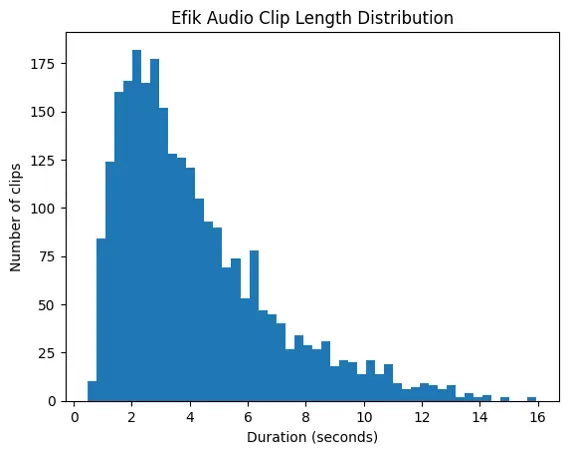
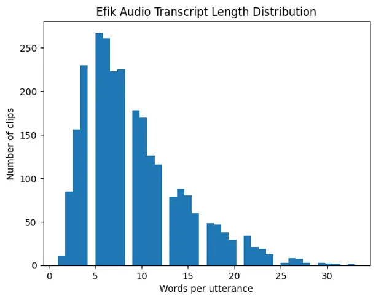

Edet Oyo-Ita Archibong Bassey Awak

# Towards Digital Preservation of Efik: TTS for a Low-Resource African Language

Offiong Bassey    Emmanuel    Archibong Okon    David Effanga   
Mbuotidem Sunday

###### Abstract

Efik, a tonal language spoken by about 3 million second language
speakers and 1.5 million native speakers in Southeastern Nigeria,
remains underrepresented in speech synthesis research. We present the
first documented end-to-end text-to-speech study for Efik, introducing a
curated single speaker corpus of 2,632 utterances totaling three hours
and a comparative evaluation of four neural models (VITS, MMS-TTS,
SpeechT5, and Orpheus-TTS) under low resource conditions. Native
speakers evaluated the systems using MOS, Nat-MOS, and A-MOS. MMS-TTS
achieved the highest MOS of 3.80 ± 0.63 and produced more stable long
form speech, though tonal errors persisted. Other models showed greater
tonal and prosodic inconsistencies. These results provide a reproducible
baseline and highlight the need for larger corpora and tone aware
modeling for tonal African languages.

###### keywords

text-to-speech, low-resource languages, Efik language, tonal languages,
speech synthesis, African languages

^(†)^(†)address: ¹ University of Cross River State, Nigeria  
² University of Calabar, Nigeria  
³ ML Collective ^(†)^(†)email: offiongbassey99@gmail.com,
emmanueloyoita@unicross.edu.ng, archibongarchibong54@gmail.com,
daviba231@gmail.com, mbuotidemawak@gmail.com

## 1 Introduction

Text-to-Speech (TTS) technology has made remarkable progress in
producing speech that approaches human naturalness in high-resource
languages \[1, 2\]. Modern end-to-end architectures, often combining
attention mechanisms with neural vocoders, achieve high-quality
synthesis when trained on large-scale paired text–audio corpora.
However, these successes rely on hundreds of hours of curated speech
data, a requirement that remains a major obstacle for low-resource
languages, where such datasets are scarce or entirely unavailable \[3,
4, 5\].

Efik, a Lower Cross language spoken in Southeastern Nigeria, exemplifies
this challenge. Despite an estimated 3 million second speakers and 1.5
million native speakers \[6\], Efik lacks publicly available speech
datasets suitable for supervised TTS training and remains largely absent
from contemporary speech technology pipelines, reflecting broader
patterns of digital language inequality \[7\]. While text-based NLP
tasks such as machine translation for Efik language have been receiving
attention, speech systems remain critically underdeveloped \[8, 9\].

Developing TTS for Efik presents several technical challenges. First,
severe data scarcity constrains the training of data-intensive neural
architectures \[10\]. Second, Efik is a tonal language in which lexical
and grammatical contrasts are encoded through pitch variation \[11\].
Accurate synthesis therefore requires careful modeling of tonal contours
in addition to segmental phonetic structure. Inadequate tone realization
can alter lexical meaning, reducing intelligibility and perceived
naturalness.

To investigate the feasibility of neural speech synthesis under such
constraints, we curated a high-quality Efik speech corpus consisting of
approximately three hours of single-speaker recordings captured with a
wireless microphone in controlled conditions. The dataset comprises
2,632 utterances designed to provide phonetic and tonal coverage for
supervised training. Operating within this limited-data regime, we
finetune and evaluate four neural TTS models to assess naturalness and
intelligibility in synthesized Efik speech.

This research addresses these critical gaps by developing TTS systems
specifically tailored for Efik, contributing to the broader effort of
digital language preservation and ensuring that speakers of low-resource
languages can participate fully in the digital ecosystem.

## 2 Efik Language Documentation and Computational Efforts

Historically, Efik has enjoyed a robust literary status due to early
missionary documentation, such as the dictionaries of Hugh Goldie and
R.G.F. Adams, and the extensive cultural records of indigenous
historians like E. U. Aye. However, these works remained largely
“analogue,” restricted to hard copies and physical libraries. While
later promoters like Ita \[12\] expanded this corpus with multi-volume
thematic studies on Efik proverbs. Mensah \[6\] notes a simultaneous
decline in vitality among younger urban speakers who prioritize English
and Nigerian Pidgin.

The 21st century marks a critical transition toward digital preservation
to bridge this “digital language divide.” Akoda \[13\] establishes the
foundational need to migrate deteriorating analogue manuscripts into
digital repositories, highlighting early mobile successes like the Learn
Efik app and the Tete Efik Dictionary. While these tools improved
accessibility, challenges remain regarding tonal accuracy for non-native
speakers.

Recent research underscores a critical shift toward digital preservation
for Nigeria’s minority languages. While, Akoda \[13\] establishes the
foundational need to transition Efik cultural and historical records
from deteriorating analogue manuscripts into digital repositories,
Kalejaiye \[8\] demonstrate the technical application of such digitized
data through the Ibom NLP project, creating the essential text corpora
required for Anang, Efik, Ibibio, and Oro to participate in global AI
ecosystems. Complementing these efforts, Ekpenyong \[14\] introduce a
multimodal framework using digitized speech and geospatial data to
automate the real-time assessment of language vitality.

Together, these advancements represent a move from passive archiving to
active computational linguistics, ensuring Efik remains a functional,
“living” language in the age of Artificial Intelligence and also for the
next generation of digital speakers.

## 3 Related Work

Recent advances in neural text-to-speech (TTS) have stimulated growing
interest in speech technologies for African languages. Several studies
have explored TTS for relatively higher-resource African languages,
including Yoruba, Igbo, Hausa, Swahili, Akan, Lagunda, Lingala, and Ewe
\[15, 1, 16, 17, 18, 19\]. Large-scale multilingual efforts such as
WAXAL further expanded coverage by providing speech resources for 24
African languages \[4\].

Beyond African-language coverage, prior work has examined the broader
challenge of low-resource speech synthesis, including data efficiency,
minimal-supervision TTS, and speech generation for language
revitalization and education \[20, 2, 5\]. These studies highlight
persistent constraints such as limited recordings, speaker scarcity,
orthographic variation, and evaluation challenges in underrepresented
languages.

Despite this progress, the Efik language remains severely
underrepresented in speech technology research, with no prior systematic
benchmark for TTS to the best of our knowledge. Our work addresses this
gap by introducing a curated Efik speech corpus and evaluating multiple
modern TTS SOTA models.

## 4 Dataset Creation

We curated approximately three hours of high-quality speech data from a
single native Efik speaker. Recordings were captured using a wireless
microphone in a quiet indoor environment to minimize background noise
and ensure acoustic consistency. The final corpus consists of 2,632
utterances segmented at the sentence level.

The recording materials were drawn from Efik novels, folktales, and
educational texts in order to provide lexical diversity and broad domain
coverage. Care was taken to include varied sentence structures and tonal
patterns to support supervised speech synthesis under low-resource
conditions.

Although Efik is spoken by 1.5 million native speakers \[6\], obtaining
a high-quality speech dataset suitable for neural Text-to-Speech
training presents significant challenges. Publicly available audio
resources often contain background music, environmental noise, or
overlapping speech, rendering them unsuitable for controlled acoustic
modeling. Furthermore, many existing recordings lack explicit usage
consent for computational research and TTS development, limiting their
applicability.

These constraints necessitated the collection of a dedicated, consented,
and acoustically controlled dataset specifically designed for supervised
Efik TTS development.

### 4.1 Data Labeling

We initially explored automatic forced alignment to generate
time-aligned transcriptions for the recorded Efik speech data. However,
this approach proved unreliable due to the absence of robust Automatic
Speech Recognition (ASR) models for Efik. Pretrained multilingual
models, including Whisper \[21\] and XLS-R \[22\], produced highly
inaccurate transcriptions when applied to the segmented Efik utterances,
likely due to limited exposure to Lower Cross languages during
pretraining.

Given the low transcription accuracy and the tonal sensitivity of the
language, we opted for manual annotation of the entire corpus. Each of
the 2,632 utterances was carefully transcribed and verified to ensure
orthographic consistency and alignment with the recorded speech. This
manual labeling process ensured high-quality paired text–audio data
suitable for supervised TTS training.

### 4.2 Dataset Validation

The curated TTS corpus underwent a manual validation process to ensure
transcription accuracy and phonetic fidelity. A native Efik speaker and
a linguist independently reviewed each utterance to verify that the
recorded audio corresponded precisely with its transcript.

Particular attention was given to tonal realization and pronunciation
accuracy, given the tonal nature of Efik. Utterances containing tonal
inconsistencies, articulation errors, or misalignments between speech
and text were flagged during review. Such instances were either
corrected through re-transcription where appropriate or removed from the
dataset to maintain high-quality paired text–audio alignment.

This validation process ensured that the final corpus meets the quality
requirements for supervised neural TTS training, where even minor
transcription or tonal errors can negatively affect acoustic modeling
and intelligibility.

### 4.3 Data Preprocessing

All recordings were originally captured in .m4a format and subsequently
converted to uncompressed .wav format to ensure compatibility with
standard speech processing pipelines. The audio was resampled to 16kHz
mono to maintain consistency across the corpus and align with common
neural TTS training configurations.

Basic signal cleaning procedures were applied to improve acoustic
consistency. Leading and trailing silence segments were trimmed while
preserving natural prosodic boundaries. To prevent truncation of final
phonemes, which is important for tonal realization, approximately 60-100
milliseconds of trailing silence were retained at the end of each
utterance. This ensured that sentence-final acoustic cues were not
clipped during segmentation.

Text preprocessing involved orthographic normalization to remove
irrelevant punctuation marks and non-speech symbols. Sentence boundaries
were preserved to maintain natural prosodic structure. All transcripts
were manually verified for consistency with the spoken content.

The final corpus of 2,632 utterances was partitioned into training,
validation and test sets as summarized in Table 1.

| Split      | Utterances |
| ---------- | ---------- |
| Train      | 1,975      |
| Validation | 264        |
| Test       | 393        |

Table 1: Dataset split statistics.

### 4.4 Statistical Analysis of Dataset

The Efik TTS corpus consists of 2,632 utterances with a total duration
of approximately 3.08 hours. The utterances vary in length from 0.48
seconds to 15.94 seconds, with an average duration of 4.21 seconds and a
median duration of 3.49 seconds. Figure 1 shows the distribution of
audio clip durations, where the y-axis represents the number of clips
and the x-axis represents duration in seconds.

Figure 1: Distribution of audio clips duration.

The corresponding text corpus contains 23,986 word tokens with a
vocabulary of 3,276 unique words. Utterance lengths range from 1 to 33
words, with an average of 9.11 words per utterance. Figure 2 illustrates
the distribution of utterance lengths, with the y-axis representing the
number of clips and the x-axis representing the number of words per
utterance.

Figure 2: Distribution of transcript length per audio clip.

## 5 TTS Models

We fine-tuned four state-of-the-art (SOTA) Text-to-Speech (TTS) models
for Efik: VITS, MMS-TTS, SpeechT5, and Orpheus-TTS. Each model was
selected based on its ability to perform high-quality single-speaker TTS
under low-resource conditions, which is critical for our dataset of 3
hours of single-speaker speech.

VITS (Variational Inference with Adversarial Learning for End-to-End
TTS) \[23\] is a single-stage model that directly generates raw audio
waveforms from text using a conditional variational autoencoder combined
with normalizing flows and adversarial learning.

MMS-TTS \[24\] is part of the Multilingual Speech Synthesis (MMS)
framework, leveraging pretrained multilingual representations to improve
synthesis quality in low-resource languages. Its architecture enables
cross-lingual transfer, which is useful for Efik given the lack of
large-scale TTS corpora.

SpeechT5 \[25\] is a transformer-based sequence-to-sequence TTS model
that unifies speech and text representations. It allows flexible
encoding of linguistic and acoustic features.

Orpheus-TTS \[26\] is a neural TTS model optimized for waveform fidelity
and naturalness. It uses adversarial training techniques to improve the
realism of generated audio.

## 6 Experiments

The four TTS models were fine-tuned with hyperparameters optimized for
low-resource, single-speaker Efik TTS. VITS was trained for 50 epochs
with a learning rate of 2e-4, a batch size of 4, and the Adam optimizer.
MMS-TTS was trained for 50 epochs with a learning rate of 2e-5, a batch
size of 16, and the AdamW optimizer, leveraging multilingual pretraining
to improve performance in low-resource settings. SpeechT5 was trained
with a smaller learning rate of 1e-5 and a batch size of 4, and was
allowed to run up to 2,500 epochs with early stopping to ensure stable
convergence under limited data conditions. A dropout rate of 0.1 was
applied to reduce overfitting. Orpheus-TTS was trained for 50 epochs
with a learning rate of 2e-5 and a batch size of 8. All models were
trained on a single NVIDIA A100 GPU using mixed-precision training to
improve computational efficiency and memory utilization. Early stopping
based on validation loss was applied to mitigate overfitting given the
limited size of the dataset. The single-speaker configuration provided
acoustic consistency across recordings, which is beneficial for learning
stable spectral and prosodic representations, particularly in a tonal
language such as Efik.

Since MMS-TTS had no pretrained checkpoint for Efik, we initialized it
using a Yoruba checkpoint and extended its vocabulary and embedding to
include Efik-specific characters such as ọ and ñ. Similarly, VITS and
SpeechT5 required updates to their embeddings and vocabularies to
accommodate these characters, whereas Orpheus-TTS worked without
modification. Despite these efforts, all models struggled to correctly
pronounce words containing ñ  highlighting the challenge of representing
rare phonemes in extremely low-resource settings. In contrast, for the ọ
character, MMS-TTS, SpeechT5, and Orpheus-TTS were able to generate
intelligible pronunciations, likely benefiting from pretraining on
similar phonemes in other languages. VITS, however, failed to produce
intelligible speech for many Efik utterances, reflecting the sensitivity
of its architecture to extremely low-resource conditions and the
necessity for larger datasets to learn both waveform and prosody
jointly.

When evaluating long-sequence generation, MMS-TTS outperformed all other
models, generating continuous Efik audio of up to three minutes without
hallucinating or producing nonsensical output. By comparison, VITS,
Orpheus-TTS, and SpeechT5 frequently produced incoherent or meaningless
speech after 20–30 seconds. Among these, Orpheus performed better than
VITS and SpeechT5 in terms of intelligibility, although the generated
speech retained a distinctly foreign accent resembling a European male
speaker and often failed to preserve Efik tonal and cultural nuances.

These observations indicate that while current TTS architectures can
generate intelligible Efik speech in short sequences, high-quality,
larger datasets are essential for improving naturalness, tonal accuracy,
and long-form generation. MMS-TTS shows the greatest promise for
low-resource, single-speaker Efik synthesis, but all models would
benefit from additional data to capture the unique phonetic, prosodic,
and cultural characteristics of the language. With more extensive,
high-quality recordings, it is feasible to develop a TTS system capable
of producing natural Efik speech that preserves both tonal distinctions
and pronunciation nuances.

### 6.1 Evaluation

The performance of the four TTS models was evaluated using three
complementary metrics: Mean Opinion Score (MOS) \[27\], Naturalness MOS
(Nat-MOS), and Accent MOS (A-MOS). MOS measures the overall perceived
naturalness of synthesized speech, Nat-MOS focuses specifically on how
natural the speech sounds to native Efik listeners, and A-MOS evaluates
the degree to which the synthesized speech preserves Efik accent and
phonetic characteristics. Ratings were collected from 5 native Efik
speakers, who were asked to rate short audio clips on a 1–5 scale (1 =
completely unnatural, 5 = highly natural). Each model was evaluated on a
subset of test utterances, and the mean and standard deviation of the
ratings are reported in Table 2.

| Model       | MOS         | Nat-MOS     | A-MOS       |
| ----------- | ----------- | ----------- | ----------- |
| VITS        | 1.08 ± 0.27 | 1.04 ± 0.19 | \-          |
| SpeechT5    | 2.48 ± 0.49 | 1.88 ± 0.51 | 1.64 ± 0.48 |
| Orpheus-TTS | 3.08 ± 0.48 | 2.32 ± 0.46 | 2.21 ± 0.43 |
| MMS-TTS     | 3.80 ± 0.63 | 3.60 ± 0.56 | 3.04 ± 0.52 |

Table 2: MOS evaluation of Efik TTS models by native speakers. Higher
MOS indicates more natural or accurate speech.

From the results, MMS-TTS achieved the highest MOS, Nat-MOS, and A-MOS
among the TTS models, producing the most natural and intelligible Efik
speech. MMS-TTS also performed best in long-form generation, generating
coherent speech close to 3 minutes without hallucinating, whereas other
models often produced incoherent outputs after 20–30 seconds. VITS
performed the worst across all metrics, likely due to its architectural
reliance on large-scale data and sensitivity to extremely low-resource,
single-speaker datasets. SpeechT5 achieved moderate scores, producing
intelligible speech for short utterances but struggling with tonal
accuracy, long-sequence generation, and accent preservation. Orpheus-TTS
performed better than VITS and SpeechT5 for short sequences, though it
retained a slight foreign (European) accent and did not fully preserve
Efik tonal and cultural nuances.

In general, the evaluation demonstrates that while current end-to-end
TTS models can generate intelligible Efik speech, high-quality, larger
datasets and specialized low-resource training strategies will be
critical for achieving more natural, culturally aligned, and tonally
accurate speech synthesis in African languages like Efik.

## 7 Results and Discussion

The MOS evaluation in Table 2 highlights clear performance differences
among the four TTS models for Efik speech synthesis. MMS-TTS achieved
the highest MOS (3.80 ± 0.63), producing the most natural and
intelligible speech. Its strong performance is likely due to
multilingual pretraining, which enables the model to leverage
cross-lingual phonetic knowledge, particularly for tonal phonemes like
ọ, and to generate long-form audio sequences of up to three minutes
without hallucination.

Orpheus-TTS achieved a moderate MOS (3.08 ± 0.48), outperforming VITS
and SpeechT5 in short sequences. However, native speakers noted a slight
foreign accent, and the model struggled to fully preserve Efik tonal and
cultural characteristics. Despite these limitations, it maintained
coherent output for medium-length sequences, making it a viable option
for low-resource single-speaker TTS when tonal precision is less
critical.

SpeechT5 produced intelligible short utterances but exhibited
hallucinations and incoherent output after 20–30 seconds. Its MOS of
2.48 ± 0.49 reflects both the issues and challenges in accurately
reproducing tonal contours, which are essential for lexical and
grammatical meaning in Efik.

VITS performed the worst, with an MOS of 1.08 ± 0.27. The model
struggled to generate intelligible audio and reliably capture tonal
variations. This outcome is expected given VITS’s reliance on
large-scale datasets for training; the 3-hour single-speaker dataset was
insufficient. Consequently, longer utterances were often incoherent and
unnatural.

This study shows that current state-of-the-art TTS architectures can
produce intelligible Efik speech, but further work is required to
achieve natural, culturally aligned, and tonally accurate synthesis.
Future directions include expanding the dataset, incorporating multiple
speakers to enrich prosody, and exploring architecture modifications or
phoneme-level conditioning to better handle tonal and rare phonemes.

## 8 Conclusion

This work presents the first systematic effort to develop Text-to-Speech
systems for Efik, a low-resource tonal African language. We fine-tuned
four state-of-the-art end-to-end TTS models, VITS, MMS-TTS, SpeechT5,
and Orpheus-TTS, using a single-speaker, three-hour dataset. Evaluation
with native speakers shows that MMS-TTS achieved the highest
naturalness, particularly for long-form generation, while VITS struggled
due to its architectural reliance on large datasets. Orpheus-TTS and
SpeechT5 produced intelligible short sequences but were less successful
in preserving tonal and culturally aligned speech patterns.

While prior work on African languages such as Yoruba, Hausa, and Swahili
\[17, 18, 19\] has laid the groundwork for TTS in low-resource settings,
Efik presents unique challenges due to its extremely limited data and
tonal complexity. These findings indicate that achieving truly natural,
culturally aligned, and tonally accurate Efik speech synthesis requires
larger, high-quality datasets, careful phoneme coverage, and model
adaptations tailored for low-resource tonal languages. This study builds
on existing African language TTS research and provides a foundation for
future work in Efik and other underrepresented African languages,
highlighting the critical role of speech technologies in digital
language preservation.

## 9 Limitations

This study is limited by the use of a single-speaker dataset and a total
of only 3 hours of audio, which constrained prosodic variation and
long-sequence modeling, particularly for models like VITS. Rare phonemes
such as ñ posed challenges across all models, and while MMS-TTS handled
tonal patterns reasonably well, Orpheus-TTS and SpeechT5 produced speech
with slight foreign accents, failing to fully capture Efik tonal and
cultural nuances. Overcoming these limitations will require larger,
multi-speaker datasets and specialized training strategies designed for
low-resource tonal languages.

## 10 Ethics Statement

The single native Efik speaker provided informed consent for the
recording and use of their voice for research purposes in text-to-speech
development. All collected materials, including narrative and
educational texts, were used in accordance with copyright and cultural
guidelines.

We recognize the potential risks associated with speech synthesis
systems, particularly the possibility of voice misuse, such as
generating speech that could impersonate the recorded speaker without
authorization. To mitigate this, the dataset and resulting models are
intended strictly for non-commercial research use and will be released
under a non-commercial license.

Access to the dataset and trained models will be restricted to
researchers who agree to the license terms, which explicitly prohibit
malicious or deceptive use, including impersonation or fraudulent
content generation.

We will also document these risks clearly to raise awareness of
responsible use of low-resource speech synthesis systems. No sensitive
personal data is included in this work.

## 11 Acknowledgements

We sincerely thank the native Efik speakers for their invaluable
contribution, and the linguist who carefully validated the dataset. We
also extend our appreciation to Dr. David Adelani, Luel Hagos, Saheed
Azeez, Abraham Owodunni, Gideon george and Steven Kolawole for their
guidance, insightful advice, and support throughout this project. We
especially appreciate the Machine Learning Collective (ML Collective)
community for their unwavering support and guidance toward the success
of this research work.

## 12 Generative AI Use Disclosure

No generative AI tools were used to generate scientific content,
analyses, results, figures, or conclusions in this manuscript. Any use
of generative AI was limited to grammar correction and language editing.

## References

- \[1\] P. Ogayo, G. Neubig, and A. W. Black (2022) Building african
  voices. In Proceedings of Interspeech 2022, External Links:
  [Document](https://dx.doi.org/10.21437/Interspeech.2022-152),
  [Link](https://arxiv.org/abs/2207.00688) Cited by: §1, §3.
- \[2\] A. Pine, E. Cooper, D. Guzmán, E. Joanis, A. Kazantseva, R.
  Krekoski, R. Kuhn, S. Larkin, P. Littell, D. Lothian, A. Martin, K.
  Richmond, M. Tessier, C. Valentini-Botinhao, D. Wells, and J.
  Yamagishi (2025) Speech generation for indigenous language education.
  Computer Speech & Language 90, pp. 101723. External Links:
  [Document](https://dx.doi.org/10.1016/j.csl.2024.101723),
  [Link](https://www.sciencedirect.com/science/article/pii/S0885230824001062)
  Cited by: §1, §3.
- \[3\] A. Magueresse, V. Carles, and E. Heetderks (2020) Low-resource
  languages: a review of past work and future challenges. arXiv preprint
  arXiv:2006.07264. External Links:
  [Document](https://dx.doi.org/10.48550/arXiv.2006.07264),
  [Link](https://arxiv.org/abs/2006.07264) Cited by: §1.
- \[4\] A. Diack, P. Nelson, K. Agbesi, A. Nakalembe, M.
  MohamedKhair, V. Dube, T. Siyavora, S. Venugopalan, J. Hickey, U.
  Okonkwo, A. Bapna, I. Wiafe, R. D. Helegah, E. D. Atsakpo, C.
  Nutrokpor, F. B. P. Winful, K. K. Solaga, J. Abdulai, A. O. Ekpezu, A.
  Niyonkuru, S. Rutunda, B. Ishimwe, M. Melese, E. Bainomugisha, J.
  Nakatumba-Nabende, A. Katumba, C. Babirye, J. Mukiibi, V. Kimani, S.
  Kibacia, J. Maina, F. Emmah, A. I. Shekarau, I. S. Adamu, Y.
  Abdullahi, H. Lakougna, B. MacDonald, H. Shemtov, A.
  Walcott-Bryant, M. Cisse, A. Hassidim, J. Dean, and Y. Matias (2026)
  WAXAL: a large-scale multilingual african language speech corpus.
  arXiv preprint arXiv:2602.02734. External Links:
  [Document](https://dx.doi.org/10.48550/arXiv.2602.02734),
  [Link](https://arxiv.org/abs/2602.02734) Cited by: §1, §3.
- \[5\] E. Kharitonov, D. Vincent, Z. Borsos, R. Marinier, S. Girgin, O.
  Pietquin, M. Sharifi, M. Tagliasacchi, and N. Zeghidour (2023) Speak,
  read and prompt: high-fidelity text-to-speech with minimal
  supervision. Transactions of the Association for Computational
  Linguistics 11, pp. 1703–1718. External Links:
  [Document](https://dx.doi.org/10.1162/tacl%5Fa%5F00618),
  [Link](https://direct.mit.edu/tacl/article/doi/10.1162/tacl_a_00618)
  Cited by: §1, §3.
- \[6\] E. Mensah and E. Mensah (2013) The adaptation of english
  consonants by efik learners of english. English Language Teaching 7
  (3), pp. 38–45. External Links:
  [Document](https://dx.doi.org/10.5539/elt.v7n3p38),
  [Link](http://dx.doi.org/10.5539/elt.v7n3p38) Cited by: §1, §2, §4.
- \[7\] A. Kornai (2013) Digital language death. PLoS One 8 (10),
  pp. e77056. Cited by: §1.
- \[8\] O. Kalejaiye, L. H. Beyene, D. I. Adelani, M. G. Edet, A. D.
  Akpan, E. Urua, and A. Andy (2025) Ibom nlp: a step toward inclusive
  natural language processing for nigeria’s minority languages. In
  Proceedings of the 14th International Joint Conference on Natural
  Language Processing and the 4th Conference of the Asia-Pacific Chapter
  of the Association for Computational Linguistics, pp. 372–382.
  External Links: [Link](https://aclanthology.org/2025.ijcnlp-long.22/)
  Cited by: §1, §2.
- \[9\] O. B. Edet, M. S. Awak, E. Oyo-Ita, B. O. Nyong, and I. E.
  Bassey (2026) Developing an english–efik corpus and machine
  translation system for digitization inclusion. arXiv preprint
  arXiv:2603.14873. Note: Accepted at AfricaNLP 2026 (co-located with
  EACL) External Links:
  [Document](https://dx.doi.org/10.48550/arXiv.2603.14873),
  [Link](https://arxiv.org/abs/2603.14873) Cited by: §1.
- \[10\] A. Katumba, S. Kagumire, J. Nakatumba-Nabende, J. Quinn, and S.
  Murindanyi (2025) Building text-to-speech models for low-resourced
  languages from crowdsourced data. Applied AI Letters 6 (2), pp. e117.
  External Links: [Document](https://dx.doi.org/10.1002/ail2.117),
  [Link](https://www.researchgate.net/publication/391230042_Building_Text-to-Speech_Models_for_Low-Resourced_Languages_From_Crowdsourced_Data)
  Cited by: §1.
- \[11\] M. Yip (2002) Lexical tone as a distinctive cue in tonal
  languages. Cambridge lexical tone studies. Note: Describes how pitch
  variation conveys lexical contrast in tonal languages External Links:
  [Link](https://www.cambridge.org/core/journals/bilingualism-language-and-cognition/article/lexical-tone-as-a-cue-in-statistical-word-learning-from-bilingual-input/7CB242A850FF4D89AFCAB3E6663A80FD)
  Cited by: §1.
- \[12\] E. E. Ita (2016) Efik proverbs. their beauty, interpretation
  and application. (book 1-4). Alpha Grafix. Cited by: §2.
- \[13\] W. E. Akoda (2022) From analogue to digital: using digital
  technology to preserve and promote efik language, culture and history
  in the 21st century. Bassey Andah Journal 15, pp. 38–48. External
  Links:
  [Link](https://www.academicexcellencesociety.com/from_analogue_to_digital_using_digital_technology_to_preserve_and_promote_efik.pdf)
  Cited by: §2, §2.
- \[14\] M. Ekpenyong, I. Udoh, E. Urua, N. Udoh, E. Obikudo, O.
  Anyanwu, A. Shehu, E. Sylvanus, R. Bassey, U. Saturday, T.
  Fakiyesi, C. Kekai, E. Udoh, S. Ansa, E. Ifesieh, G. Ikhimwin, U.
  Udoeyo, E. Alexander, E. Okon, M. Ekpe, B. O. Nyong, M. Darah, A.
  Diffre-Odiete, L. Ejobee, W. Aigbedo, F. Imoudu, C. Manda, M.
  Kiine, D. Ugwu, and A. Akpan (2025) A multimodal dataset for
  automating language vitality and endangerment assessment in
  south-south nigeria. Scientific Data 12, pp. 53. External Links:
  [Document](https://dx.doi.org/10.1038/s41597-025-05337-6),
  [Link](https://www.nature.com/articles/s41597-025-05337-6) Cited by:
  §2.
- \[15\] S. Kagumire, A. Katumba, J. Nakatumba-Nabende, and J.
  Quinn (2024) Building a luganda text-to-speech model from crowdsourced
  data. arXiv preprint arXiv:2405.10211. Note: Presented at the
  AfricaNLP Workshop at ICLR 2024 External Links:
  [Document](https://dx.doi.org/10.48550/arXiv.2405.10211),
  [Link](https://arxiv.org/abs/2405.10211) Cited by: §3.
- \[16\] J. Meyer, D. I. Adelani, E. Casanova, A. Öktem, D.
  Whitenack, J. Weber, S. Kabongo, E. Salesky, I. Orife, C. Leong, P.
  Ogayo, C. Emezue, J. Mukiibi, S. Osei, A. Agbolo, V. Akinode, B.
  Opoku, S. Olanrewaju, J. Alabi, and S. Muhammad (2022) BibleTTS: a
  large, high-fidelity, multilingual, and uniquely african speech
  corpus. In Proceedings of Interspeech 2022, External Links:
  [Document](https://dx.doi.org/10.48550/arXiv.2207.03546),
  [Link](https://arxiv.org/abs/2207.03546) Cited by: §3.
- \[17\] A. A. Tolúlópè Ógúnrèmí (2024) ÌRòyìnspeech: a multi-purpose
  yorùbá speech corpus. In Proceedings of LREC 2024, External Links:
  [Link](https://aclanthology.org/2024.lrec-main.812/) Cited by: §3, §8.
- \[18\] A. A. Aliero, D. Muhammed, M. B. Binti Peer Mustafa, M. A.
  Saidu, and M. Garba (2020) A cross-lingual text-to-speech system for
  hausa using dnn-based approach. International Journal of Advanced
  Research in Computer Science and Software Engineering 10 (35),
  pp. 4460–4470. Note: Available online Jan. 1, 2020 External Links:
  [Link](https://www.researchgate.net/publication/344398069_A_Cross-Lingual_Text-To-Speech_System_for_Hausa_using_DNN-Based_Approach)
  Cited by: §3, §8.
- \[19\] P. S. Mbonimpa, D. Tuyizere, A. A. Biyabani, and O. K.
  Tonguz (2025) Edge-based speech transcription and synthesis for
  kinyarwanda and swahili languages. arXiv preprint arXiv:2510.16497.
  External Links: [Link](https://arxiv.org/abs/2510.16497) Cited by: §3,
  §8.
- \[20\] A. Pine, D. Wells, N. Brinklow, P. Littell, and K.
  Richmond (2022) Requirements and motivations of low-resource speech
  synthesis for language revitalization. In Proceedings of the 60th
  Annual Meeting of the Association for Computational Linguistics (ACL),
  Dublin, Ireland, pp. 7346–7359. External Links:
  [Document](https://dx.doi.org/10.18653/v1/2022.acl-long.507),
  [Link](https://aclanthology.org/2022.acl-long.507) Cited by: §3.
- \[21\] A. Radford and et al. (2023) Robust speech recognition via
  large-scale weak supervision. Note:
  [https://github.com/openai/whisper](https://github.com/openai/whisper)
  Cited by: §4.1.
- \[22\] A. Babu and W. Team (2021) XLS-r: self-supervised cross-lingual
  speech representation learning at scale. In arXiv preprint
  arXiv:2111.09296, External Links:
  [Link](https://arxiv.org/abs/2111.09296) Cited by: §4.1.
- \[23\] J. Kim, J. Kong, and J. Son (2021) Conditional variational
  autoencoder with adversarial learning for end-to-end text-to-speech.
  arXiv preprint arXiv:2106.06103. External Links:
  [Link](https://arxiv.org/abs/2106.06103) Cited by: §5.
- \[24\] V. Pratap, A. Tjandra, B. Shi, P. Tomasello, A. Babu, S.
  Kundu, A. Elkahky, Z. Ni, A. Vyas, M. Fazel-Zarandi, A. Baevski, Y.
  Adi, X. Zhang, W. Hsu, A. Conneau, and M. Auli (2023) Scaling speech
  technology to 1,000+ languages. arXiv preprint arXiv:2305.13516.
  External Links: [Link](https://arxiv.org/abs/2305.13516) Cited by: §5.
- \[25\] J. Ao, R. Wang, L. Zhou, C. Wang, S. Ren, Y. Wu, S. Liu, T.
  Ko, Q. Li, Y. Zhang, Z. Wei, Y. Qian, J. Li, and F. Wei (2022)
  SpeechT5: unified-modal encoder-decoder pre-training for spoken
  language processing. In Proceedings of the 60th Annual Meeting of the
  Association for Computational Linguistics (Volume 1: Long Papers),
  pp. 6944–6961. External Links:
  [Link](https://aclanthology.org/2022.acl-long.393) Cited by: §5.
- \[26\] CanopyAI (2023) Orpheus-tts. Note: GitHub repository External
  Links: [Link](https://github.com/canopyai/Orpheus-TTS) Cited by: §5.
- \[27\] M. Viswanathan and M. Viswanathan (2005) Measuring speech
  quality for text-to-speech systems: development and assessment of a
  modified mean opinion score (mos) scale. Computer Speech and Language
  19 (1), pp. 55–83. Cited by: §6.1.
