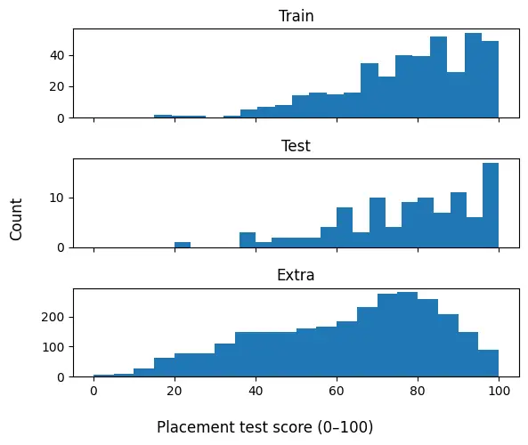
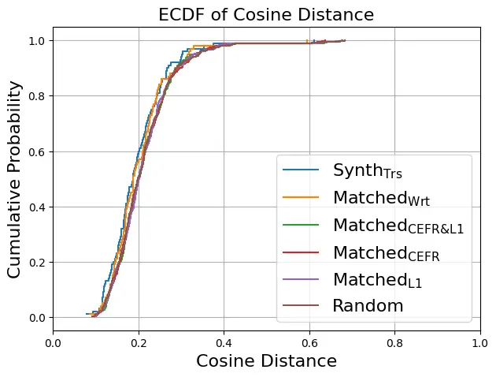
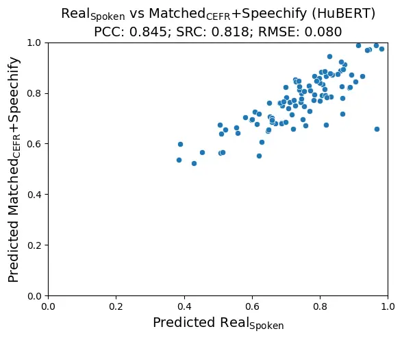
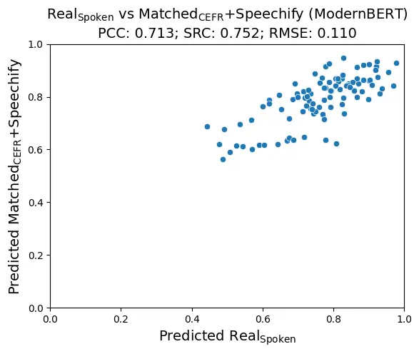

# Data Augmentation for L2 English Speaking Assessment using TTS

Stefano Bannò    Penny Karanasou    Mengjie Qian    Kate M. Knill   
Mark J. F. Gales Affiliation: ALTA Institute Affiliation: Machine
Intelligence Laboratory, Department of Engineering
Affiliation: University of Cambridge, UK
Email: [{sb2549,pk407,mq227,kmk1001,mjfg1000}@cam.ac.uk](mailto:)

###### Abstract

Automated assessment of second language (L2) speaking proficiency
requires substantial annotated speech data, which are scarce compared to
written learner corpora. We investigate whether written L2 responses can
be transformed into useful synthetic speech for proficiency assessment
using text-to-speech (TTS) and voice cloning. Using COREFL, a corpus of
paired spoken and written responses from L2 learners of English, we
systematically study two factors: how written responses should be
transformed into spoken-style language (“speechification”) and how
synthetic voices and texts should be paired based on shared learner
attributes (proficiency level, first language, both, or neither). We
generate speechified responses with a large language model and
synthesise them using TTS and voice cloning, then evaluate their utility
for audio-based (HuBERT) and text-based (ModernBERT) proficiency
grading. Results show that pairing voices and texts based on proficiency
provides a principled strategy for synthetic data generation, while
speechification substantially improves the match between written and
spoken L2 and improves downstream grading performance. Augmenting real
training data with synthetic speechified responses improves both HuBERT-
and ModernBERT-based graders, demonstrating the potential of synthetic
spoken data for L2 speaking proficiency assessment.

^(†)^(†) Demo examples:
[sbanno.github.io/l2-synthetic-speech/](https://sbanno.github.io/l2-synthetic-speech/)

## 1 Introduction

Automated assessment of second language (L2) speaking proficiency is
increasingly used in computer-assisted language learning systems,
providing scalable and consistent scoring of learner performance Zechner
and Evanini (2019). Despite these advances, progress in automated L2
speaking assessment research remains constrained by the limited
availability of large-scale, well-annotated spontaneous speech corpora.
While large L2 written corpora are widely available Geertzen et al.
(2013); Blanchard et al. (2013); Nicholls et al. (2024); Crossley et al.
(2023), spoken datasets remain comparatively scarce due to the cost of
recording, transcription, and expert annotation.

A promising way to address this imbalance is the use of zero-shot
text-to-speech (TTS) and voice-cloning technologies. These frameworks
enable the conversion of abundant, diverse, and easily accessible L2
written essays into synthetic speech. Recent studies have started to
investigate the use of TTS synthesis to augment data for L2 spontaneous
speech assessment. In Wang et al. (2025), proficiency-conditioned
responses are generated with a large language model (LLM) and converted
into speech using speaker-conditioned TTS to augment training data for
automated speaking assessment. Whilst improvements are reported in
downstream scoring performance through fine-tuning a multimodal
LLM-based grader, the quality of the generated speech itself is not
analysed (e.g., speaker similarity, transcription quality, or linguistic
realism), and the gains over a BERT-based Devlin et al. (2019) baseline
remain relatively modest. Similarly, in Voskoboinik et al. (2025), the
use of LLM-generated synthetic transcripts is explored for automated
speaking assessment in low-resource languages. Using GPT-4 OpenAI (2023)
to generate proficiency-conditioned learner responses, it shows that
transcript-level data augmentation can improve scoring performance.
However, this approach operates exclusively on transcripts without
including TTS. In Karanasou et al. (2025), a more detailed analysis of
acoustic and content-related aspects of the synthetic learner speech is
provided, but the primary focus is spoken grammatical error correction
rather than assessment. Additionally, the approach does not rely on
essays, but on manual transcriptions, which remain costly to obtain.

In this study, by contrast, we aim to leverage essays to augment L2
learner spoken data for proficiency assessment. A fundamental challenge
remains: the disparity between written and spoken language. Spontaneous
L2 speech is defined by online speech-planning phenomena, resulting in
disfluencies such as hesitations, self-repairs, and repetitions, and
discourse markers that are tightly linked with learners’ oral
proficiency Huang et al. (2023); Yan et al. (2025). Conversely, written
essays reflect a deliberate planning process characterised by higher
syntactic complexity and greater lexical richness Biber et al. (2002).

This raises the question of what is actually required to generate
synthetic L2 speech that is suitable for assessment purposes, and more
broadly, how written L2 data can be reliably transformed into
spoken-like data. Addressing this question requires analysing the
relationship between written and spoken L2 productions. The few existing
L2 speech corpora provide valuable resources in isolation, but they are
not designed for this purpose. ICNALE Ishikawa (2011), CLES Coulange et
al. (2024), Speechocean762 Zhang et al. (2021), and L2-ARCTIC Zhao et
al. (2018) are limited either in first language (L1) diversity, modality
(read rather than spontaneous speech), or proficiency level coverage.
The Speak & Improve Corpus Knill et al. (2025); Qian et al. (2025)
represents a major milestone, providing large-scale spontaneous L2
speech with detailed proficiency annotations, but its speakers, tasks,
and exam parts are not directly comparable to its written counterpart,
the Write & Improve Corpus Nicholls et al. (2024).

In this work, we use the Corpus of English as a Foreign Language
(COREFL) Lozano et al. (2021) (see Section 2). What differentiates this
corpus from the above-mentioned ones is that it contains paired written
and spoken answers to the same questions from the same L2 learners. This
double modality allows us to study how linguistic and speaker-level
factors interact in synthetic speech generation, enabling controlled
investigation of different speaker–text pairing strategies as discussed
below.

In our proposed data augmentation framework, to address the structural
differences between modalities, we first introduce a _text
speechification_ step using a large language model (LLM). This module
rewrites written responses into spoken-style transcripts. Next, the
resulting texts are used for audio generation with a TTS/voice-cloning
model. To select the voice for the generated audio, we investigate
different matching strategies for pairing learner voices and written
texts based on shared learner attributes (proficiency level, L1, both,
or neither). Ensuring consistency between the textual and acoustic
dimensions is important because, in real-world scenarios, the downstream
grading system is not known a priori and may be text-based, audio-based,
or multimodal. Finally, we validate our augmented data by evaluating
downstream performance on two automated grading models: an audio-based
system using a self-supervised learning (SSL) speech foundation model,
i.e., HuBERT Hsu et al. (2021), and a text-based system using a text
foundation model, i.e., ModernBERT Warner et al. (2025). Both
SSL-based Xu et al. (2021); Peng et al. (2021); Kim et al. (2022); Bannò
et al. (2023); McKnight et al. (2023) and BERT-like Craighead et al.
(2020); Raina et al. (2020); Wang et al. (2021) architectures have been
extensively used in L2 speaking assessment. The main contributions of
this paper are as follows:

- •
  we introduce an LLM-based preprocessing step that converts written
  responses into spoken-style transcripts, reducing the discrepancy
  between written and spoken language before TTS generation;
- •
  we study how to construct high-quality synthetic L2 speech for
  speaking assessment by pairing speakers and texts according to
  proficiency level and L1, finding that proficiency-level matching
  provides a principled strategy for synthetic data augmentation that is
  consistent across downstream assessment models;
- •
  we show that our data augmentation approach consistently improves
  performance across both text-based and audio-based grading systems.

## 2 Data

For our experiments, we use the Corpus of English as a Foreign Language
(COREFL) Lozano et al. (2021), a publicly available dataset¹¹ 1
[corefl.learnercorpora.com/](https://corefl.learnercorpora.com/) that
contains both written and spoken answers to the same questions by L2
learners of English from 9 different L1 backgrounds, with German and
Spanish representing the highest percentage of learners, followed by
Greek, Italian, Chinese, Turkish, Czech, Estonian, and French learners.
However, only the first 5 L1s are also represented in the spoken
section.

A unique feature of this corpus is that some learners were asked to
produce both a spoken and written response to the same question with a
few weeks of difference between the two tasks. The corpus includes four
question prompts. Learners are asked to: describe the picture story
_Frog, where are you?_ Mayer (2003); talk about a famous person;
describe a film they have seen recently; describe an excerpt from
Charlie Chaplin’s _The Kid_.

Although the spoken section of the corpus is relatively small, it
contains comparatively long responses: they range from approximately 40
seconds to 8 minutes with an average duration of 3 minutes. All the
spoken responses are accompanied by manual transcriptions. The written
responses range from roughly 10 to 1,000 words, with an average of 160
words. Table 1 shows the speaker-independent training and test set
splits. All learners included in the test set also produced a written
response, whereas not all learners included in the training set also
have a written counterpart. Additionally, there are 2,820 written
responses that are not accompanied by their spoken counterparts. We
refer to this set as _Extra_.

The corpus is annotated with proficiency levels based on the Common
European Framework of Reference (CEFR) Council of Europe (2001). These
were given to the learners after they took a placement test, which
assigned them a score ranging from 0 to 100 (i.e., A1 to C2). We
normalise this score to \[0, 1\] and use it as the target variable for
model training in our language assessment experiments. There is also a
control L1 English subcorpus. For our experiments, we use this subcorpus
as additional C2 data. Figure 1 shows the placement test score
distribution.

|       |           |       |           |       |
| ----- | --------- | ----- | --------- | ----- |
|       | Spoken    |       | Written   |       |
| Set   | Responses | Hours | Responses | Words |
| Train | 410       | 16.7  | 383       | 111K  |
| Test  | 100       | 4.2   | 100       | 27K   |
| Extra | –         | –     | 2,820     | 765K  |

Table 1: Composition of COREFL (spoken and written).

Figure 1: Placement test scores (0-100) distribution across sets.

## 3 Data Augmentation Framework

We propose a data augmentation framework that leverages L2 learner texts
to generate synthetic spoken responses for the automated assessment of
holistic speaking proficiency. As outlined in Section 1, it consists of
two phases: LLM-based speechification and attribute-conditioned
speaker-text matching and synthesis.

### 3.1 Text “speechification”

To improve the quality of synthetic responses, we introduce a _text
speechification_ step. Given a learner’s written response and CEFR
level, we use an LLM to transform the essay-like text into a
spoken-style learner transcript. The prompt, reported in Appendix A,
instructs the model to preserve the original meaning and all learner
errors while rewriting the response as spontaneous speech. Specifically,
the generated transcript incorporates characteristics of natural spoken
production, including incremental discourse structure, hesitations,
repetitions, self-repairs, false starts, and occasional vague
references. The frequency and complexity of these phenomena are
conditioned on the learner’s CEFR level, with lower-proficiency learners
exhibiting more disfluencies and simpler discourse structures. The
resulting transcript is intended to approximate the characteristics of
authentic learner speech while remaining faithful to the content of the
original written response.

We also include a control experiment in which we remove
CEFR-conditioning from the prompt. This can be found in Appendix A.

### 3.2 Speaker-text matching strategies for synthesis

We refer to real spoken data as _Real\_(Spoken)_ and to real written data
as _Real\_(Written)_. In the following, we describe the matching
conditions used to generate synthetic data. First, we synthesise a
learner’s spoken response by using its own manual transcription and the
same learner’s voice. We refer to this condition as _Synth\_(Trs)_. This
serves as a best-case reference for evaluating the TTS system, as both
the speaker identity and linguistic content from the same spoken
response are preserved. We then synthesise a learner’s written
production using the same learner’s voice, referred to as
_Matched\_(Spkr)_. In this case, although the information is produced by
the same learner, the linguistic content differs between the written and
spoken productions. Subsequently, we synthesise spoken data from written
data using different pairing strategies to investigate how conditioning
on learner attributes affects the similarity between synthetic and real
speech. For each learner voice, a written response is chosen and
assigned to it. A voice may match the selected written response with
respect to CEFR level (_Matched\_(CEFR)_), L1 (_Matched\_(L1)_), both
attributes (_Matched\_(CEFR&L1)_), or neither (_Random_). When no
eligible text satisfies the primary matching criterion, we progressively
relax the constraints. For _Matched\_(CEFR&L1)_, the fallback order is
exact CEFR+L1 and adjacent CEFR level with the same L1. For
_Matched\_(CEFR)_, the order is exact CEFR and adjacent CEFR level. For
_Matched\_(L1)_, the order is exact L1 followed by an unrestricted global
pool. In all cases, except _Synth\_(Trs)_ and _Matched\_(Spkr)_, the
voice’s own written responses are excluded from the candidate pool. To
promote diversity in the synthetic datasets, we use a balanced selection
mechanism which tracks the frequency with which voices and texts are
selected and avoids repetition of speakers or responses. To improve
robustness, we generate five different draws for each matching
condition. Each draw corresponds to a different random assignment of
voices to texts under the same matching constraints, such that a voice
paired with one text in a given draw may be paired with a different text
in another.²² 2 With respect to the fallback system, the
_Matched\_(CEFR&L1)_ test set only has 5 adjacent cases for each draw,
while the _Matched\_(CEFR)_ test set only has 1 adjacent case for each
draw. The _Matched\_(L1)_ and _Random_ test sets fully satisfy their
criteria.

## 4 Experimental Setup

The first objective of this work is to investigate the requirements and
criteria for generating synthetic data suitable for L2 spontaneous
speaking assessment. To this end, we first synthesise the test set data
(see Section 5.1). The underlying idea is that, if an automated grading
system trained on real data produces similar results when tested on
synthetic and real audio data, then the synthetic data are likely to
preserve the characteristics that are relevant for assessment.

Based on this initial analysis, we then revisit the synthetic generation
pipeline. In particular, after observing that synthetic speech generated
directly from raw written responses leads to a substantial degradation
in the text-based grading system, we introduce a text speechification
step (see Section 5.2) to transform written responses into spoken-style
transcripts before TTS synthesis. We subsequently evaluate whether this
modification improves the quality of the generated speech.

Finally, having identified both the most effective speaker-text pairing
strategy and the benefit of speechification, we apply the resulting
pipeline to the training data (see Section 5.3). The generated synthetic
responses are used for data augmentation to investigate whether
additional synthetic training examples improve the performance of our
graders.

### 4.1 Models

#### 4.1.1 TTS

As our TTS/voice-cloning system for spoken data augmentation, we use
OmniVoice Zhu et al. (2026),³³ 3
[github.com/k2-fsa/OmniVoice](https://github.com/k2-fsa/OmniVoice) a
zero-shot multilingual TTS model supporting over 600 languages, based on
a non-autoregressive diffusion language model architecture that directly
maps text to multi-codebook acoustic tokens.To generate synthetic spoken
responses, the written responses in the test set are first segmented
into sentences using the spaCy⁴⁴ 4 [spacy.io](https://spacy.io)
_sentencizer_. Voice cloning is then applied at the sentence-level using
the first 10 seconds of the reference audio, and the resulting synthetic
utterances are concatenated to reconstruct the full spoken response.

#### 4.1.2 Automatic speech recognition (ASR)

In a real-world deployment, manually transcribing every learner’s spoken
response is infeasible. Consequently, text-based grading systems must
rely on ASR to produce the transcriptions used for assessment. To do
this, we use the publicly available CrisperWhisper Zusag et al.
(2024),⁵⁵ 5
[github.com/nyrahealth/CrisperWhisper](https://github.com/nyrahealth/CrisperWhisper)
a variant of OpenAI’s Whisper Radford et al. (2023) designed for
verbatim speech recognition. Unlike the original Whisper model, which
tends to normalise speech and omit disfluencies in favour of a more
fluent transcription style, CrisperWhisper aims to transcribe speech as
accurately as possible, preserving all spoken content, including fillers
and disfluencies.

#### 4.1.3 Grading systems

For automatic language assessment, i.e., the main task of this paper, we
employ an audio-based and a text-based grading system. The former is
based on HuBERT Hsu et al. (2021),⁶⁶ 6 Initialised from
facebook/hubert-base-ls960. with an architecture similar to that
described in McKnight et al. (2023), which uses wav2vec2 Baevski et al.
(2020). The audio recordings are first segmented into overlapping
fixed-length chunks prior to modelling. We use 15-second segments with a
3-second overlap to ensure coverage of long-form responses while
preserving local temporal context. At model level, HuBERT is used as a
frozen feature encoder, and we introduce a regression head operating on
pooled hidden representations. Instead of simple pooling, we apply a
hierarchical attention-based aggregation mechanism over frame-level
encoder outputs. This mechanism learns to weight temporal frames and
segment-level representations before producing a final utterance-level
embedding, which is passed through a feed-forward regression head to
predict the score.

The text-based grading system is based on ModernBERT Warner et al.
(2025).⁷⁷ 7 Initialised from answerdotai/ModernBERT-base. The model is
fine-tuned using a standard sequence regression head.

For both grading systems, we use an ensemble of two graders using two
different random seeds, and training minimises mean squared error
between predicted and placement scores normalised from 0 to 1 (see
Section 2) for a maximum of 20 epochs. The training hyperparameters are
reported in Table 2.

|                             |                     |                     |
| --------------------------- | ------------------- | ------------------- |
| Hyperparameter              | HuBERT              | MBERT               |
| Learning rate               | $`1\times 10^{-5}`$ | $`2\times 10^{-5}`$ |
| Batch size                  | 8                   | 32                  |
| Gradient accumulation steps | 4                   | \-                  |
| Early stopping patience     | 3                   | 3                   |

Table 2: Grading systems training hyperparameters.

For each of the two training seeds, we randomly select 10% of the real
spoken training data (41 samples) as a development set for optimisation.
To avoid data contamination, the candidate IDs selected for the
development set in each seed are excluded from that seed’s augmented
training sets, including both their written texts and speech recordings.

As will be illustrated in Section 5.3, our best-performing system uses a
training set composed of real learner data and synthetic data generated
by matching learners’ texts and voices based on CEFR level. This means
that, for the synthetic section of the training data, we have two
possible target training labels: one placement score referred to voices
and one associated with texts. However, since they are matched based on
CEFR level, their differences are tiny, i.e., the mean of the absolute
difference between the two sets of labels on the whole dataset is 0.043
and their standard deviation is 0.034. Therefore, we chose the labels
associated with voices as training labels.

#### 4.1.4 Text speechifier

To transform the original written responses into spoken-style learner
transcripts, we use GPT-4.1 OpenAI (2023). The cost of speechifying the
383 written responses in the training set was approximately \$2.5.
Generating speechified versions of the 2,820 responses in the _Extra_
set (see Section 5.3) incurred an additional cost of approximately \$15.

### 4.2 Evaluation metrics

#### 4.2.1 Speaker verification

To assess whether speaker identity is preserved after voice cloning, we
compute cosine similarity between the speaker embeddings of the real and
synthetic speech. The speaker embeddings are extracted using
pyannote Bredin et al. (2020).

#### 4.2.2 ASR evaluation

We use CrisperWhisper to transcribe both real and synthetic spoken
responses. As these transcripts are used in the text-based grading
system, transcription quality is critical. We evaluate them using word
error rate (WER).

#### 4.2.3 Speech quality

To assess the perceptual quality of the synthetic speech, we use
UTMOSv2 Baba et al. (2024), a non-intrusive speech quality assessment
model that predicts human ratings of speech quality from the audio
signal. We report the mean UTMOS score across the generated responses
ranging from 1 to 5, with higher scores indicating better perceived
speech quality. This metric provides a complementary assessment to
speaker verification, allowing us to evaluate not only whether the
cloned voice preserves speaker identity, but also the overall quality
and naturalness of the synthesised speech.

#### 4.2.4 Grading performance

To evaluate grading performance, we report Pearson’s correlation
coefficient (PCC), Spearman’s rank correlation coefficient (SRC), and
root mean square error (RMSE) between the reference and predicted
scores. For PCC and SRC, the higher value, the better. For RMSE, the
lower value the better.

#### 4.2.5 Text analysis

We analyse textual differences between real and synthetic transcriptions
using five metrics: average text length (Txt. len.), the average mean
dependency distance (MDD) Liu (2008) as computed with textdescriptives⁸⁸
8
[github.com/HLasse/textdescriptives](https://github.com/HLasse/textdescriptives),
hesitation ratio (Hes. rt.), Moving Average Type-Token Ratio
(MATTR) Covington and McFall (2010) with a window size of 50 tokens, and
the average number of unique difficult words (Dif. wds.) as computed
with textstat.⁹⁹ 9 [textstat.org/](https://textstat.org/)

#### 4.2.6 Text similarity

As described in Section 3.1, we speechify written responses. To ensure
that this transformation preserves the original semantic content, we
measure text similarity between the written responses before and after
speechification using cosine similarity between sentence embeddings of
original and speechified written responses. These are extracted using
all-mpnet-base-v2 Song et al. (2020); Reimers and Gurevych (2019).

## 5 Experimental results

### 5.1 Analysis and results on augmented test set without training

As illustrated in Section 4, we first evaluate the quality of the
synthetic spoken responses on the test set across all matching
conditions, prior to introducing speechification.

First, we evaluate whether speaker identity is preserved. As illustrated
in Section 4.2, we report the cosine similarity between the speaker
embeddings of the real and synthetic speech for each matching condition
in Table 3. Additionally, following Karanasou et al. (2025), we report
the empirical cumulative distribution function (ECDF) of the cosine
distances between speaker embeddings (i.e., real vs. synthetic) in
Figure 2. As can be observed, no substantial differences are observed
across matching conditions, except for _Synth\_(Trs)_ and
_Matched\_(Spkr)_, which yield the highest cosine similarity. This is
expected, as we match learners’ voices with their own manual
transcriptions for _Synth\_(Trs)_ and with their own written production
for _Matched\_(Spkr)_. The few failures were traced to a recording with
prolonged background noise before speech onset, which corrupted the
speaker representation used for voice cloning.

Figure 2: ECDF of cosine distances across matching conditions.

We then compute WER on the CrisperWhisper transcriptions across the
different matching conditions. The results are also reported in Table 3.
We do not observe systematic differences in WER across the various
conditions.

|                           |                    |                       |                       |
| ------------------------- | ------------------ | --------------------- | --------------------- |
| Linguistic content source | Test Set           | WER                   | Cos. Sim.             |
| Spoken                    | Real\_(Spoken)     | 11.98                 | –                     |
|                           | Synth\_(Trs)       | 11.03                 | 0.803                 |
| Written                   | Matched\_(Spkr)    | 12.00                 | 0.797                 |
|                           | Matched\_(CEFR&L1) | $`9.60_{\pm{1.45}}`$  | $`0.790_{\pm{.001}}`$ |
|                           | Matched\_(CEFR)    | $`9.87_{\pm{1.16}}`$  | $`0.789_{\pm{.001}}`$ |
|                           | Matched\_(L1)      | $`10.77_{\pm{2.10}}`$ | $`0.788_{\pm{.002}}`$ |
|                           | Random             | $`10.87_{\pm{1.46}}`$ | $`0.788_{\pm{.002}}`$ |

Table 3: WER and cosine similarity (Cos. sim.) across matching
conditions. Mean and standard deviation are computed across the five
draws.

We can now use UTMOSv2 to score the speech quality of the TTS-generated
data. Table 4 reports the results across matching conditions.

|                           |                    |                      |
| ------------------------- | ------------------ | -------------------- |
| Linguistic source content | Test set           | UTMOS                |
| Spoken                    | Real\_(Spoken)     | 2.205                |
|                           | Synth\_(Trs)       | 2.326                |
| Written                   | Matched\_(Spkr)    | 2.366                |
|                           | Matched\_(CEFR&L1) | $`2.380_{\pm{.04}}`$ |
|                           | Matched\_(CEFR)    | $`2.398_{\pm{.05}}`$ |
|                           | Matched\_(L1)      | $`2.394_{\pm{.03}}`$ |
|                           | Random             | $`2.402_{\pm{.05}}`$ |

Table 4: Mean UTMOS scores results across matching conditions. Mean and
standard deviation are computed across the five draws.

UTMOSv2 is trained primarily on corpora of L1-speaker and
professionally-recorded TTS output, and it is calibrated to treat
deviations from fluent, native-like prosody and pronunciation as
indicators of lower quality. As our reference recordings consist of
authentic L2 English speech, they naturally contain non-native prosodic
patterns, disfluencies, and accented pronunciation that are typical and
expected features of L2 speech rather than genuine defects. As a result,
UTMOS may penalise reference recordings for characteristics that are
inherent to L2 speech rather than indicative of poor recording or speech
quality. This can lead to artificially lower scores for the reference
recordings compared with the synthetic systems. Such domain mismatch
suggests that UTMOS scores should be interpreted cautiously when applied
to L2 speech data. However, if we treat it as a comparative metric, all
systems are shown to obtain similar results, with the lowest performance
observed in _Real\_(Spoken)_, suggesting that TTS synthesis may smooth
over some of the L2-specific characteristics that would otherwise lower
UTMOS scores.

We can then evaluate the performance of the grading systems, as shown in
Tables 5 and 6. It is important to note that, at this stage, neither
grader has been exposed to synthetic data during training. The
HuBERT-based grader is trained solely on the real audio recordings,
whereas the ModernBERT-based grader is trained solely on the
corresponding CrisperWhisper transcriptions. As a result, across all
matching conditions, the former is evaluated on audio recordings,
whereas the latter is evaluated on the corresponding CrisperWhisper
transcriptions. Due to space constraints, we report only PCC; however,
SRC and RMSE exhibit similar trends. Table 5 reports the results on
_Real\_(Spoken)_, _Synth\_(Trs)_, and _Matched\_(Spkr)_, for which there is
only one reference score label, as both text and voice originate from
the same learner. The results in this table serve as best-case
references with best results achieved, as expected, on _Real\_(Spoken)_
test data. _Synth\_(Trs)_ leads to a drop in performance, indicating that
the TTS system already introduces some degradation even without data
augmentation with different speakers. For _Matched\_(Spkr)_, the drop in
performance is more pronounced for ModernBERT (0.195 PCC points) than
for HuBERT (0.081 PCC points). We discuss this difference in more detail
below, after analysing the results reported in Table 6.

|                           |                 |        |       |
| ------------------------- | --------------- | ------ | ----- |
| Linguistic content source | Test Set        | HuBERT | MBERT |
| Spoken                    | Real\_(Spoken)  | 0.677  | 0.684 |
|                           | Synth\_(Trs)    | 0.570  | 0.653 |
| Written                   | Matched\_(Spkr) | 0.596  | 0.489 |

Table 5: Baseline - no synthetic training data - grading results on real
and matched transcript/speaker test sets in terms of PCC. One reference
score label per test set.

Across all the other pairing strategies, as described in Section 3.2,
each synthetic response is generated by combining a text with a voice.
Therefore, two reference scores (i.e., one for audio and one for text)
can be associated with a generated response. Accordingly, Table 6
reports grading performance with respect to both labels. As expected,
performance is generally higher when HuBERT-based predictions are
evaluated on audio and ModernBERT-based predictions are evaluated on
text, as these represent the most appropriate input modalities for each
model (see quadrants highlighted in yellow).

|        |                    |                      |                      |
| ------ | ------------------ | -------------------- | -------------------- |
| Model  | Test Set           | Audio ref.           | Text ref.            |
| HuBERT | Matched\_(CEFR&L1) | $`0.544_{\pm{.02}}`$ | $`0.553_{\pm{.02}}`$ |
|        | Matched\_(CEFR)    | $`0.560_{\pm{.02}}`$ | $`0.534_{\pm{.01}}`$ |
|        | Matched\_(L1)      | $`0.542_{\pm{.01}}`$ | $`0.399_{\pm{.05}}`$ |
|        | Random             | $`0.554_{\pm{.01}}`$ | $`0.054_{\pm{.11}}`$ |
| MBERT  | Matched\_(CEFR&L1) | $`0.454_{\pm{.02}}`$ | $`0.484_{\pm{.01}}`$ |
|        | Matched\_(CEFR)    | $`0.468_{\pm{.03}}`$ | $`0.474_{\pm{.02}}`$ |
|        | Matched\_(L1)      | $`0.331_{\pm{.08}}`$ | $`0.521_{\pm{.02}}`$ |
|        | Random             | $`0.033_{\pm{.10}}`$ | $`0.522_{\pm{.02}}`$ |

Table 6: Baseline - no synthetic training data - PCC grading results on
matched CEFR and/or L1 or random paired test sets. Two reference score
labels per test set.

Overall, the choice of linguistic content source has relatively little
effect on HuBERT, while the choice of synthetic voice has relatively
little effect on ModernBERT, as reflected by the comparatively small
differences across matching conditions in the yellow quadrants. This
suggests that the matching strategy does not have a substantial or
consistent effect on either grader when evaluated on its corresponding
input modality.

For our data augmentation setting, however, the downstream grading
system is not known a priori. We therefore favour matching strategies
that provide stable performance across both reference types and both
grading modalities. Under this criterion, _Random_ fails, while
_Matched\_(CEFR&L1)_ and _Matched\_(CEFR)_ show relatively consistent
performance across the two reference types for both the text- and
audio-based graders. _Matched\_(L1)_ exhibits less stable performance
across evaluation settings. Since there is no substantial difference
between _Matched\_(CEFR&L1)_ and _Matched\_(CEFR)_, we select the latter
for our data augmentation experiments, as it requires less information:
only the CEFR level of the source voice and the written response needs
to be known.

In Section 5.3, we additionally compare the performance of systems
trained using data generated under the _Random_ matching strategy. This
provides a complementary analysis of the extent to which the choice of
matching strategy affects the performance of models trained on the
resulting synthetic data, rather than only their evaluation on the
held-out test set.

Focusing on model-specific behaviour, a comparison of the results
reported in Table 5 and Table 6 shows that the HuBERT-based grader shows
only a reasonable drop in PCC when evaluated on the synthetic condition
_Matched\_(Spkr)_ compared to the _Real\_(Spoken)_ setting. In contrast,
the ModernBERT-based grader shows a substantially larger degradation
(Table 5). This degradation is not recovered by the matching strategies
that we applied (Table 6). We hypothesise that this discrepancy arises
from the linguistic gap between written and spoken language. Although
the TTS system introduces some hesitations and repetitions, written
responses still differ fundamentally from spoken production: they lack
discourse markers, reformulations, and other indicators of online speech
planning such as uncertainty or self-repair. Moreover, written responses
tend to exhibit higher syntactic complexity and lexical richness,
reflecting greater planning time compared to spontaneous speech.

Our hypothesis is supported by the analysis reported in Table 7, which
presents the textual metrics described in Section 4.2 for automatic
transcriptions derived from real and synthetic test data. For
simplicity, we report results only for one draw of the _Matched\_(CEFR)_
condition. Comparing _Real_ and _Matched\_(CEFR)_ columns, transcriptions
of synthetic speech derived from written responses are, on average,
shorter than those derived from real learner speech (block Txt. len.).
As shown in the MDD block, they also tend to show a slightly higher
syntactic complexity than real learner speech. Furthermore, they contain
substantially fewer hesitations (block Hes. rt.), reflecting the fact
that TTS-generated speech does not fully capture the disfluency patterns
characteristic of spontaneous learner production. At the same time,
synthetic transcriptions exhibit greater lexical diversity (block MATTR)
and contain a larger number of difficult words (block Dif. wds.). This
is expected, as the synthetic spoken responses are generated from
written productions, which are typically more sophisticated and
carefully planned than spontaneous speech. These findings support our
hypothesis that the linguistic characteristics of written language are
largely preserved in the synthetic responses, despite the fact that the
TTS randomly introduces some hesitations and repetitions.

|     |       |           |                 |       |      |                 |      |              |                 |      |       |                 |      |           |                 |      |
| --- | ----- | --------- | --------------- | ----- | ---- | --------------- | ---- | ------------ | --------------- | ---- | ----- | --------------- | ---- | --------- | --------------- | ---- |
|     | Count | Txt. len. |                 |       | MDD  |                 |      | Hes. rt. (%) |                 |      | MATTR |                 |      | Dif. wds. |                 |      |
|     |       | Real      | Matched\_(CEFR) | +Spf  | Real | Matched\_(CEFR) | +Spf | Real         | Matched\_(CEFR) | +Spf | Real  | Matched\_(CEFR) | +Spf | Real      | Matched\_(CEFR) | +Spf |
| A   | 9     | 249.8     | 155.8           | 263.9 | 2.38 | 2.48            | 2.35 | 8.2          | 2.7             | 15.3 | 0.56  | 0.67            | 0.61 | 9.0       | 11.8            | 11.0 |
| B1  | 15    | 234.7     | 178.8           | 322.3 | 2.61 | 2.68            | 2.37 | 4.8          | 1.0             | 11.9 | 0.65  | 0.72            | 0.67 | 14.6      | 16.9            | 16.8 |
| B2  | 25    | 284.7     | 190.2           | 330.4 | 2.69 | 2.62            | 2.32 | 5.5          | 0.8             | 10.8 | 0.65  | 0.72            | 0.68 | 15.9      | 15.6            | 16.3 |
| C1  | 28    | 333.9     | 249.6           | 434.8 | 2.64 | 2.86            | 2.46 | 5.7          | 0.9             | 7.9  | 0.66  | 0.70            | 0.71 | 17.9      | 23.9            | 25.5 |
| C2  | 23    | 328.9     | 222.4           | 443.9 | 2.56 | 2.68            | 2.40 | 3.9          | 0.7             | 7.8  | 0.68  | 0.73            | 0.72 | 19.0      | 22.3            | 26.3 |

Table 7: Text statistics across CEFR levels for CrisperWhisper
transcriptions from _Real\_(Spoken)_, _Matched\_(CEFR)_, and
_Matched\_(CEFR)+Speechify_ (+Spf) data. Abbreviations are explained in
Section 4.2.

### 5.2 Effects of speechification

To address the gap between written and spoken language, we revisit the
written responses and apply the speechification procedure described in
Section 3.1, transforming them into spoken-style learner transcripts
using GPT-4.1 prior to speech synthesis. To assess whether semantic
content is preserved after speechification, as described in Section 4.2,
we compute the cosine similarity between sentence embeddings extracted
from the original (_Real\_(Written)_) and speechified
(_Real\_(Written)+Speechify_) written responses. The value of
$`0.853_{\pm{.052}}`$ indicates that the speechified responses remain
highly similar to the original texts, suggesting that the
speechification process largely preserves semantic content. For
comparison, the cosine similarity between real written and spoken texts
from the same learners is $`0.813_{\pm{.080}}`$.

In addition to semantic similarity, we analyse the _+Spf_ column in
Table 7, which reports the text statistics described in Section 4.2.5
for speechified _Matched\_(CEFR)_ transcriptions. Overall,
speechification shifts several properties of the generated transcripts
towards those observed in real learner speech. For MDD, the speechified
texts show lower values than the real spoken texts across all CEFR
levels, suggesting that the procedure may over-simplify syntactic
structure, while still moving away from the higher MDD values observed
in the non-speechified transcriptions. Similarly, the hesitation rate
increases substantially after speechification and exceeds the values
observed in real speech, indicating that the model may overproduce
hesitation phenomena. In contrast, MATTR generally moves towards the
values observed in real speech. Speechification also substantially
increases text length relative to the non-speechified _Matched\_(CEFR)_
transcripts, bringing it closer to, and at several levels beyond, the
length of real spoken responses. Finally, the number of difficult words
remains relatively stable across conditions, suggesting that
speechification primarily modifies the form of the responses rather than
substantially changing their lexical difficulty. Together with the high
semantic similarity reported above, these results indicate that
speechification introduces several characteristics of spoken language
while preserving the core content of the original responses, although
some features, particularly hesitations and syntactic complexity, appear
to be exaggerated.

Table 8 compares the performance obtained on _Matched\_(CEFR)_ data
before and after speechification. As illustrated in Section 3.1,
speechification is conditioned on the CEFR level associated with the
learner’s text. Importantly, this CEFR information is used here only as
a control variable for the generation process and for analysing whether
proficiency-specific speech characteristics can be reproduced; it is not
provided to the grading models and is not used to determine their
predictions. Thus, the use of CEFR conditioning in this analysis should
not be interpreted as providing additional proficiency information to
the downstream grading systems. We also report the results when running
the speechification process without injecting the CEFR-related labels
into the prompt given to the LLM. The results indicate that
CEFR-conditioned speechification substantially improves the quality of
the synthetic data, yielding large gains for the ModernBERT-based grader
and more moderate, yet consistent, improvements for the HuBERT-based
system. These findings suggest that modelling the discourse- and
fluency-related characteristics is at least as important as preserving
acoustic characteristics when generating synthetic data for speaking
assessment. The fact that, for ModernBERT, the results for
_Matched\_(CEFR)+Speechify_ are even higher than those for _Real_ (see
Table 5) should not be surprising, as the two settings are not directly
comparable: the former, despite speechification, is generated starting
from written productions, whereas the latter consists of authentic
spoken responses. Therefore, the linguistic content of the two sets is
different.

The analysis in this section is intended to characterise the effect of
speechification and its conditioning, rather than to establish its
effectiveness as a training data augmentation strategy. We therefore
provide a separate ablation experiment in Table 11 at the end of
Section 5.3, where HuBERT and ModernBERT are trained with and without
speechified synthetic data and evaluated on the real test set. This
experiment provides a direct assessment of the contribution of
speechification to grading performance under the final training and
evaluation setting.

|                     |                |                      |                      |
| ------------------- | -------------- | -------------------- | -------------------- |
| Test Set            | CEFR in Spf    | HuBERT               | MBERT                |
| Matched\_(CEFR)     | \-             | $`0.560_{\pm{.02}}`$ | $`0.474_{\pm{.04}}`$ |
| Matched\_(CEFR)+Spf | $`\times`$     | $`0.542_{\pm{.02}}`$ | $`0.457_{\pm{.01}}`$ |
| Matched\_(CEFR)+Spf | $`\checkmark`$ | $`0.583_{\pm{.01}}`$ | $`0.715_{\pm{.01}}`$ |

Table 8: Analysis on synthetic test sets in terms of PCC:
_Matched\_(CEFR)_ vs _Matched\_(CEFR)+Speechify_ (with and without
CEFR-conditioning).

Additionally, in Figure 3, we report scatterplots between predictions on
_Real\_(Spoken)_ and predictions on _Matched\_(CEFR)+Speechify_ for both
graders, together with the corresponding PCC, SRC, and RMSE values. The
higher performance observed for the HuBERT-based system can be explained
as follows: HuBERT operates directly on acoustic signals, which are
largely preserved through the TTS process, as shown in Table 3 (see
Cosine Similarity column), despite differences in linguistic content. In
contrast, ModernBERT operates on text and is therefore more sensitive to
differences in linguistic realisation, since _Real\_(Spoken)_ derives
from spoken responses, while _Matched\_(CEFR)+Speechify_, despite
speechification, still originates from a written source.

Figure 3: _Real\_(Spoken)_ vs _Matched\_(CEFR)+Speechify_ predictions.

### 5.3 Training and testing with augmented data

At this point, we can use the augmented training data to train our
grading systems and evaluate them on the real test set. In Table 9, we
compare different training configurations. _Real\_(Spoken)_ refers to
models trained exclusively on the real training spoken data. _Syn_
denotes training on synthetic data generated using the
_Matched\_(CEFR)+Speechify_ pipeline by matching the 410 voices with the
383 written responses in the training set (see Table 1). For the
audio-based grader, this results in 410 synthetic speech samples, with
27 (i.e., $`410-383`$) written responses reused across different voices.
Conversely, for the text-based grader, training is performed on the
automatic transcriptions obtained after synthesising the 383 unique
written responses without duplicates. Finally, _Syn\_(Extra)_ extends
_Syn_ by additionally incorporating the 2,820 written responses without
spoken counterparts (i.e., _Extra_ in Table 1).

Table 9 reports the results on the _Real\_(Spoken)_ test set. As can be
observed, data augmentation leads to consistent performance improvements
across all evaluation metrics for both models. We hypothesise that this
gain is particularly pronounced for the ModernBERT-based system due to
the substantially increased amount of training text available. In the
_Real*(Spoken)+Syn*(Extra)_ setting, the model effectively benefits from
a total of 3,613 training automatic transcriptions (i.e., 410 from
_Real\_(Spoken)_, 383 from _Syn_, and the remaining 2,820 in
_Syn\_(Extra)_). In contrast, the HuBERT-based system, although exposed
to the same augmented synthetic speech pipeline, remains constrained by
the diversity of available speaker identities. Specifically, it still
relies on the 410 unique voices present in the spoken training set,
which limits the effective increase in variability compared to the
text-based model. However, for both models, the
_Real\_(Spoken)_+_Syn__(Extra) setting significantly outperforms the
\*Real_(Spoken)* baseline.¹⁰¹⁰ 10 We used a paired permutation test with
10,000 within-pair swaps comparing *Real*(Spoken)* to
*Real*(Spoken)*+*Syn\*\_(Extra). This yielded $`p=0.041`$ for HuBERT and
$`p=0.011`$ for ModernBERT.

|        |                           |       |       |       |
| ------ | ------------------------- | ----- | ----- | ----- |
| Model  | Training Set              | PCC   | SRC   | RMSE  |
| HuBERT | Real\_(Spoken)            | 0.677 | 0.634 | 0.133 |
|        | Syn                       | 0.663 | 0.629 | 0.133 |
|        | Syn\_(Extra)              | 0.687 | 0.656 | 0.134 |
|        | Real*(Spoken)+Syn*(Extra) | 0.739 | 0.692 | 0.119 |
| MBERT  | Real\_(Spoken)            | 0.684 | 0.656 | 0.132 |
|        | Syn                       | 0.643 | 0.577 | 0.136 |
|        | Syn\_(Extra)              | 0.663 | 0.607 | 0.132 |
|        | Real*(Spoken)+Syn*(Extra) | 0.769 | 0.710 | 0.113 |
| Both   | Real\_(Spoken)            | 0.730 | 0.699 | 0.121 |
|        | Syn                       | 0.696 | 0.652 | 0.126 |
|        | Syn\_(Extra)              | 0.717 | 0.686 | 0.123 |
|        | Real*(Spoken)+Syn*(Extra) | 0.795 | 0.775 | 0.107 |

Table 9: Results on real test data using different training sets. _Syn_
and _Syn\_(Extra)_ use the _Matched\_(CEFR)+Speechify_ process.

Interestingly, the combination of HuBERT and ModernBERT¹¹¹¹ 11 I.e., the
average of the two grading systems predictions. using
_Real\_(Spoken)_+_Syn__(Extra) achieves the best performance showing that
the two models carry complementary information. As we observed for the
two models taken individually, the \*Real_(Spoken)*+*Syn*\_(Extra) setting
is significantly better than the *Real\_(Spoken)\* baseline.¹²¹² 12 The
paired permutation test with 10,000 within-pair swaps yielded
$`p=0.009`$.

One of the leitmotifs of this paper is that the downstream grading
system is not known a priori. However, if the target system is known to
be text-based, TTS is not necessarily required. To examine this, we
train a ModernBERT-based grader directly on the original _Real\_(Spoken)_
CrisperWhisper transcriptions together with the _Syn\_(Extra)_ data
before the synthesis step, i.e., using the speechified written texts
directly. This yields PCC = 0.778, SRC = 0.732, and RMSE = 0.110,
compared with PCC = 0.769, SRC = 0.710, and RMSE = 0.113 when the same
synthetic texts are first converted to speech and subsequently
transcribed. The slightly better performance obtained without TTS
suggests that speech synthesis and subsequent ASR introduce some noise
that is detrimental to text-based grading. Thus, while TTS is necessary
when augmenting an acoustic grading system, it appears to be an
unnecessary intermediate step for a text-based grader when the latter
can operate directly on the speechified transcripts.

|        |                       |       |       |       |
| ------ | --------------------- | ----- | ----- | ----- |
| Model  | Matching              | PCC   | SRC   | RMSE  |
| HuBERT | Matched\_(CEFR)       | 0.663 | 0.629 | 0.133 |
|        | Random\_(Audio_Label) | 0.632 | 0.614 | 0.139 |
|        | Random\_(Text_Label)  | 0.322 | 0.342 | 0.175 |
| MBERT  | Matched\_(CEFR)       | 0.643 | 0.577 | 0.136 |
|        | Random\_(Audio_Label) | 0.164 | 0.061 | 0.185 |
|        | Random\_(Text_Label)  | 0.632 | 0.586 | 0.140 |

Table 10: Results on real test data comparing _Matched\_(CEFR)+Speechify_
to _Random+Speechify_ training data using the _Syn_ training partition.

Furthermore, as mentioned in Section 5.1, we consider a different
matching strategy, i.e., _Random+Speechify_, to generate synthetic
training data. Under this matching strategy, the TTS-generated responses
might have two very different text and speaker labels. We therefore
train separate graders on the audio (_Random__(Audio_Label)) and the
text labels (*Random*_(Text*Label)) using the *Syn* training data
partition. We compare this matching strategy to \*Matched*(CEFR)* in
Table 10. These results suggest that matching synthetic voices and texts
by CEFR provides a more reliable alignment between the augmented samples
and the proficiency labels than random matching. *Matched*(CEFR)*
achieves the best PCC and RMSE for both models and the best SRC for
HuBERT, with only a small exception for ModernBERT SRC, where
*Random*(TextLabel)* performs marginally better. More importantly,
CEFR-based matching avoids a fundamental ambiguity associated with
random matching: when the voice and text originate from learners with
different proficiency levels, it is unclear whether the proficiency
label of the synthetic sample should be determined by the voice or by
the text. This is particularly problematic because the appropriate
choice depends on the modality used by the downstream grader. By
matching the voice and text at the same CEFR level (see Section 4.1.3),
*Matched*(CEFR)* ensures that both modalities are associated with the
same proficiency level, removing the need to make this decision and
making the resulting synthetic data independent of the modality of the
downstream grader. This is exactly where *Random* is shown to fail (see
row *Random\**(Text*Label) for HuBERT and row *Random**(Audio_Label) for
ModernBERT).

Finally, as mentioned in Section 5.2, we conduct an ablation study in
order to provide a direct assessment of the contribution of
speechification to grading performance. Specifically, we consider the
_Syn_ training partition using the _Matched\_(CEFR)_ setting with and
without the speechification process. As can be observed in Table 11,
speechification consistently improves performance across all three
evaluation metrics for both grading models. The improvement is
substantially larger for ModernBERT, suggesting that the spoken-language
phenomena introduced through speechification are particularly beneficial
for the text-based grading system. This finding supports the analysis
presented in Table 8 in Section 5.2, while providing direct evidence
that speechification contributes to downstream grading performance when
used as a training data augmentation strategy.

|        |                 |       |       |       |
| ------ | --------------- | ----- | ----- | ----- |
| Model  | Speechification | PCC   | SRC   | RMSE  |
| HuBERT | $`\checkmark`$  | 0.663 | 0.629 | 0.133 |
|        | $`\times`$      | 0.640 | 0.621 | 0.139 |
| MBERT  | $`\checkmark`$  | 0.643 | 0.577 | 0.136 |
|        | $`\times`$      | 0.546 | 0.522 | 0.148 |

Table 11: Results on real test data comparing _Matched\_(CEFR)_ training
data with and without speechification using the _Syn_ training
partition.

## 6 Conclusions

In this work, we investigated how to generate synthetic L2 speech for
proficiency assessment. We proposed a cross-modal augmentation framework
that speechifies written L2 responses using an LLM followed by TTS
synthesis. Using HuBERT- and ModernBERT-based graders, we showed that
pairing speakers and texts by proficiency level is a principled and
effective strategy for data augmentation. We further found that raw
written text creates a strong mismatch with spoken language, while
speechification substantially reduces this gap and improves performance.
Overall, synthetic data consistently improve both audio- and text-based
grading systems, highlighting the importance of modelling spoken
linguistic structure in addition to speaker characteristics.

Future work will explore LLM-generated responses directly, removing
reliance on written sources, following Wang et al. (2025) and
Voskoboinik et al. (2025).

## Limitations

Our experiments are based on COREFL and therefore involve a relatively
limited number of speakers and approximately 16.7 hours of spoken
training data. The extent to which our findings generalise to other L2
populations, proficiency distributions, languages, or assessment
settings remains to be established. In particular, our experiments use a
specific combination of LLM, TTS, ASR, and proficiency models, and
different model architectures may respond differently to synthetic data.

A further limitation concerns the calibration of the speechification
process. Although the LLM is instructed to modulate disfluency rates and
syntactic complexity according to the learner’s CEFR level, these
instructions are qualitative rather than derived from the empirical
distributions observed in real learner speech. As shown in Table 7, the
resulting speechified transcriptions overestimate hesitation rates
relative to authentic spoken productions at every proficiency level and,
conversely, tend to underestimate syntactic complexity as measured by
MDD. Explicitly calibrating the speechification prompt through few-shot
prompting or against corpus-derived, level-specific statistics (e.g.,
target hesitation rates, MDD ranges) is a promising direction for future
work, but is not explored in this study.

## Ethics Statement

The use of voice cloning to generate synthetic L2 speech introduces
ethical and privacy risks that require particular consideration. A
cloned or synthesised voice may closely resemble that of a real speaker,
raising concerns related to consent, speaker identity, impersonation,
and unauthorised reuse of voice data.

In this work, synthetic speech is generated solely for research and
assessment-data augmentation. Voice cloning is not used to provide
learner feedback, for example, by generating a synthesised version of a
learner’s utterance with corrected pronunciation or grammatical errors.
Instead, its sole purpose is to increase the amount and diversity of
training data available to the grading systems.

## Acknowledgments

This paper reports on research supported by Cambridge University Press &
Assessment, a department of The Chancellor, Masters, and Scholars of the
University of Cambridge. The authors would like to thank the ALTA Spoken
Language Processing Technology Project Team for general discussions and
contributions to the evaluation infrastructure.

Generative AI tools, namely ChatGPT and Gemini, were used only to review
grammar and improve the fluency of the text.

## References

- Baba et al. (2024) K. Baba, W. Nakata, Y. Saito, and H. Saruwatari The
  t05 system for the VoiceMOS Challenge 2024: transfer learning from
  deep image classifier to naturalness MOS prediction of high-quality
  synthetic speech. In IEEE Spoken Language Technology Workshop (SLT),
  pp. 818–824. External Links:
  [Document](https://dx.doi.org/10.1109/SLT61566.2024.10832315) Cited
  by: §4.2.3.
- Baevski et al. (2020) A. Baevski, H. Zhou, A. Mohamed, and M. Auli
  Wav2vec 2.0: a framework for self-supervised learning of speech
  representations. In NeurIPS 2020, pp. 1–12. Cited by: §4.1.3.
- Bannò et al. (2023) S. Bannò, K. M. Knill, M. Matassoni, V. Raina,
  and M. Gales Assessment of L2 Oral Proficiency Using Self-Supervised
  Speech Representation Learning. In Proc. 9th Workshop on Speech and
  Language Technology in Education (SLaTE), pp. 126–130. External Links:
  [Document](https://dx.doi.org/10.21437/SLaTE.2023-24) Cited by: §1.
- Biber et al. (2002) D. Biber, S. Conrad, R. Reppen, P. Byrd, and M.
  Helt Speaking and writing in the university: a multidimensional
  comparison. TESOL Quarterly 36 (1), pp. 9–48. Cited by: §1.
- Blanchard et al. (2013) D. Blanchard, J. Tetreault, D. Higgins, A.
  Cahill, and M. Chodorow TOEFL11: A corpus of non-native English. ETS
  Research Report Series 2013 (2), pp. i–15. Cited by: §1.
- Bredin et al. (2020) H. Bredin, R. Yin, J. M. Coria, G. Gelly, P.
  Korshunov, M. Lavechin, D. Fustes, H. Titeux, W. Bouaziz, and M. Gill
  pyannote.audio: neural building blocks for speaker diarization. In
  Proc. ICASSP 2020, IEEE International Conference on Acoustics, Speech,
  and Signal Processing, Barcelona, Spain. Cited by: §4.2.1.
- Coulange et al. (2024) S. Coulange, M. Fries, M. Masperi, and S.
  Rossato A corpus of spontaneous L2 English speech for real-situation
  speaking assessment. In Proceedings of the 2024 Joint International
  Conference on Computational Linguistics, Language Resources and
  Evaluation (LREC-COLING 2024), Torino, Italia, pp. 293–297. External
  Links: [Link](https://aclanthology.org/2024.lrec-main.27/) Cited by:
  §1.
- Council of Europe (2001) Council of Europe Common european framework
  of reference for languages: learning, teaching, assessment. Cambridge
  University Press, Cambridge. External Links:
  [Link](https://rm.coe.int/1680459f97) Cited by: §2.
- Covington and McFall (2010) M. A. Covington and J. D. McFall Cutting
  the Gordian Knot: The Moving-Average Type–Token Ratio (MATTR). Journal
  of Quantitative Linguistics 17 (2), pp. 94–100. External Links:
  [Document](https://dx.doi.org/10.1080/09296171003643098),
  [Link](https://doi.org/10.1080/09296171003643098),
  https://doi.org/10.1080/09296171003643098 Cited by: §4.2.5.
- Craighead et al. (2020) H. Craighead, A. Caines, P. Buttery, and H.
  Yannakoudakis Investigating the effect of auxiliary objectives for the
  automated grading of learner English speech transcriptions. In Proc.
  58th Annual Meeting of the Association for Computational Linguistics,
  Online, pp. 2258–2269. External Links:
  [Link](https://aclanthology.org/2020.acl-main.206/),
  [Document](https://dx.doi.org/10.18653/v1/2020.acl-main.206) Cited by:
  §1.
- Crossley et al. (2023) S. Crossley, Y. Tian, P. Baffour, A.
  Franklin, Y. Kim, W. Morris, M. Benner, A. Picou, and U. Boser The
  English Language Learner Insight, Proficiency and Skills Evaluation
  (ELLIPSE) Corpus. International Journal of Learner Corpus Research 9
  (2), pp. 248–269. Cited by: §1.
- Devlin et al. (2019) J. Devlin, M. Chang, K. Lee, and K. Toutanova
  BERT: pre-training of deep bidirectional transformers for language
  understanding. In Proc. 2019 Conference of the North American Chapter
  of the Association for Computational Linguistics: Human Language
  Technologies, Volume 1 (Long and Short Papers), Minneapolis,
  Minnesota, pp. 4171–4186. External Links:
  [Link](https://aclanthology.org/N19-1423),
  [Document](https://dx.doi.org/10.18653/v1/N19-1423) Cited by: §1.
- Geertzen et al. (2013) J. Geertzen, T. Alexopoulou, and A. Korhonen
  Automatic linguistic annotation of large scale L2 databases: The
  EF-Cambridge Open Language Database (EFCAMDAT). In Proc. 31st Second
  Language Research Forum, Somerville, pp. 240–254. External Links:
  [Link](http://www.lingref.com/cpp/slrf/2012/paper3100.pdf) Cited by:
  §1.
- Hsu et al. (2021) W. Hsu, B. Bolte, Y. H. Tsai, K. Lakhotia, R.
  Salakhutdinov, and A. Mohamed Hubert: self-supervised speech
  representation learning by masked prediction of hidden units. IEEE/ACM
  Transactions on Audio, Speech, and Language Processing 29,
  pp. 3451–3460. Cited by: §1, §4.1.3.
- Huang et al. (2023) L. Huang, Y. Lin, and T. Gráf Development of the
  use of discourse markers across different fluency levels of CEFR: A
  learner corpus analysis. Pragmatics 33 (1), pp. 49–77. Cited by: §1.
- Ishikawa (2011) S. Ishikawa A new horizon in learner corpus studies:
  the aim of the ICNALE project. In Corpora and language technologies in
  teaching, learning and research, pp. 3–11. Cited by: §1.
- Karanasou et al. (2025) P. Karanasou, M. Qian, S. Bannò, M. J.F.
  Gales, and K. M. Knill Data Augmentation for Spoken Grammatical Error
  Correction. In Proc. 10th Workshop on Speech and Language Technology
  in Education (SLaTE), pp. 194–198. External Links:
  [Document](https://dx.doi.org/10.21437/SLaTE.2025-39), ISSN 2311-4975
  Cited by: §1, §5.1.
- Kim et al. (2022) E. Kim, J. Jeon, H. Seo, and H. Kim Automatic
  Pronunciation Assessment using Self-Supervised Speech Representation
  Learning. In Interspeech 2022, pp. 1411–1415. External Links:
  [Document](https://dx.doi.org/10.21437/Interspeech.2022-10245), ISSN
  2958-1796 Cited by: §1.
- Knill et al. (2025) K. Knill, D. Nicholls, M. J.F. Gales, M. Qian,
  and P. Stroinski The Speak & Improve Corpus 2025: an L2 English Speech
  Corpus for Language Assessment and Feedback. External Links:
  [Link](https://doi.org/10.17863/CAM.114333) Cited by: §1.
- Liu (2008) H. Liu Dependency distance as a metric of language
  comprehension difficulty. Journal of Cognitive Science 9 (2),
  pp. 159–191. Cited by: §4.2.5.
- Lozano et al. (2021) C. Lozano, A. Díaz-Negrillo, and M. Callies
  Designing and compiling a learner corpus of written and spoken
  narratives: COREFL. In What’s in a Narrative? Variation in
  Storytelling at the Interface Between Language and Literacy, C.
  Bongartz and J. Torregrossa (Eds.), pp. 21–46. External Links:
  [Document](https://dx.doi.org/10.3726/978-3-653-05182-7),
  [Link](https://www.peterlang.com/document/1049094) Cited by: §1, §2.
- Mayer (2003) M. Mayer Frog, where are you?. Penguin. Cited by: §2.
- McKnight et al. (2023) S. W. McKnight, A. Civelekoglu, M. Gales, S.
  Bannò, A. Liusie, and K. M. Knill Automatic Assessment of
  Conversational Speaking Tests. In Proc. 9th Workshop on Speech and
  Language Technology in Education (SLaTE), pp. 99–103. External Links:
  [Document](https://dx.doi.org/10.21437/SLaTE.2023-19), ISSN 2311-4975
  Cited by: §1, §4.1.3.
- Nicholls et al. (2024) D. Nicholls, A. Caines, and P. Buttery The
  Write & Improve Corpus 2024: error-annotated and CEFR-labelled essays
  by learners of English. External Links:
  [Link](https://doi.org/10.17863/CAM.112997) Cited by: §1, §1.
- OpenAI (2023) OpenAI GPT-4 Technical Report. External Links:
  2303.08774, [Document](https://dx.doi.org/10.48550/arXiv.2303.08774)
  Cited by: §1, §4.1.4.
- Peng et al. (2021) L. Peng, K. Fu, B. Lin, D. Ke, and J. Zhan A Study
  on Fine-Tuning wav2vec2.0 Model for the Task of Mispronunciation
  Detection and Diagnosis. In Proc. Interspeech 2021, pp. 4448–4452.
  External Links:
  [Document](https://dx.doi.org/10.21437/Interspeech.2021-1344) Cited
  by: §1.
- Qian et al. (2025) M. Qian, K. Knill, S. Bannò, S. Tang, P.
  Karanasou, M. Gales, and D. Nicholls Speak & Improve Challenge 2025.
  In Proc. 10th Workshop on Speech and Language Technology in Education
  (SLaTE), pp. 41–45. External Links:
  [Document](https://dx.doi.org/10.21437/SLaTE.2025-9) Cited by: §1.
- Radford et al. (2023) A. Radford, J. W. Kim, T. Xu, G. Brockman, C.
  McLeavey, and I. Sutskever Robust speech recognition via large-scale
  weak supervision. In Proc. International Conference on Machine
  Learning (ICML), pp. 28492–28518. Cited by: §4.1.2.
- Raina et al. (2020) V. Raina, M. J.F. Gales, and K. M. Knill Universal
  Adversarial Attacks on Spoken Language Assessment Systems. In Proc.
  Interspeech 2020, pp. 3855–3859. External Links:
  [Document](https://dx.doi.org/10.21437/Interspeech.2020-1890) Cited
  by: §1.
- Reimers and Gurevych (2019) N. Reimers and I. Gurevych Sentence-BERT:
  sentence embeddings using Siamese BERT-networks. In Proc. 2019
  Conference on Empirical Methods in Natural Language Processing and the
  9th International Joint Conference on Natural Language Processing
  (EMNLP-IJCNLP), Hong Kong, China, pp. 3982–3992. External Links:
  [Link](https://aclanthology.org/D19-1410/),
  [Document](https://dx.doi.org/10.18653/v1/D19-1410) Cited by: §4.2.6.
- Song et al. (2020) K. Song, X. Tan, T. Qin, J. Lu, and T. Liu MPNet:
  Masked and permuted pre-training for language understanding. In Proc.
  Advances in Neural Information Processing Systems (NeuRIPS), Vol. 33,
  pp. 16857–16867. Cited by: §4.2.6.
- Voskoboinik et al. (2025) E. Voskoboinik, A. von Zansen, N. C.
  Phan, Y. Getman, T. Grósz, and M. Kurimo Enhancing second language
  speaking assessment: Integrating large language models for Finnish and
  Finland Swedish proficiency scoring. Language Testing 42 (4),
  pp. 508–538. Cited by: §1, §6.
- Wang et al. (2025) C. Wang, J. Lin, H. Lu, H. Lin, and B. Chen A novel
  data augmentation approach for automatic speaking assessment on
  opinion expressions. In Proc. 10th Workshop on Speech and Language
  Technology in Education (SLaTE), pp. 199–203. Cited by: §1, §6.
- Wang et al. (2021) X. Wang, K. Evanini, Y. Qian, and M. Mulholland
  Automated scoring of spontaneous speech from young learners of english
  using transformers. In Proc. 2021 IEEE Spoken Language Technology
  Workshop (SLT), Vol. , pp. 705–712. Cited by: §1.
- Warner et al. (2025) B. Warner, A. Chaffin, B. Clavié, O. Weller, O.
  Hallström, S. Taghadouini, A. Gallagher, R. Biswas, F. Ladhak, T.
  Aarsen, G. T. Adams, J. Howard, and I. Poli Smarter, better, faster,
  longer: a modern bidirectional encoder for fast, memory efficient, and
  long context finetuning and inference. In Proc. 63rd Annual Meeting of
  the Association for Computational Linguistics (Volume 1: Long
  Papers), W. Che, J. Nabende, E. Shutova, and M. T. Pilehvar (Eds.),
  Vienna, Austria, pp. 2526–2547. External Links:
  [Link](https://aclanthology.org/2025.acl-long.127/),
  [Document](https://dx.doi.org/10.18653/v1/2025.acl-long.127), ISBN
  979-8-89176-251-0 Cited by: §1, §4.1.3.
- Xu et al. (2021) X. Xu, Y. Kang, S. Cao, B. Lin, and L. Ma Explore
  wav2vec 2.0 for Mispronunciation Detection. In Proc. Interspeech 2021,
  pp. 4428–4432. External Links:
  [Document](https://dx.doi.org/10.21437/Interspeech.2021-777) Cited by:
  §1.
- Yan et al. (2025) X. Yan, P. Chuang, Y. Pan, H. Cai, S. Staples,
  and M. C. Bertho Disfluency doesn’t happen in isolation: Exploring how
  individual disfluency features co-occur in L2 speaking performances.
  Studies in Second Language Acquisition 47 (2), pp. 560–591. Cited by:
  §1.
- Zechner and Evanini (2019) K. Zechner and K. Evanini Automated
  speaking assessment: Using language technologies to score spontaneous
  speech. Routledge. Cited by: §1.
- Zhang et al. (2021) J. Zhang, Z. Zhang, Y. Wang, Z. Yan, Q. Song, Y.
  Huang, K. Li, D. Povey, and Y. Wang speechocean762: An Open-Source
  Non-Native English Speech Corpus for Pronunciation Assessment. In
  Proc. Interspeech 2021, pp. 3710–3714. External Links:
  [Document](https://dx.doi.org/10.21437/Interspeech.2021-1259), ISSN
  2958-1796 Cited by: §1.
- Zhao et al. (2018) G. Zhao, S. Sonsaat, A. Silpachai, I. Lucic, E.
  Chukharev-Hudilainen, J. Levis, and R. Gutierrez-Osuna L2-ARCTIC: a
  non-native English speech corpus.. In Proc. Interspeech 2018,
  pp. 2783–2787. Cited by: §1.
- Zhu et al. (2026) H. Zhu, L. Ye, W. Kang, Z. Yao, L. Guo, F. Kuang, Z.
  Han, W. Zhuang, L. Lin, and D. Povey OmniVoice: Towards Omnilingual
  Zero-Shot Text-to-Speech with Diffusion Language Models. External
  Links: 2604.00688, [Link](https://arxiv.org/abs/2604.00688) Cited by:
  §4.1.1.
- Zusag et al. (2024) M. Zusag, L. Wagner, and B. Thallinger
  CrisperWhisper: Accurate Timestamps on Verbatim Speech Transcriptions.
  In Proc. Interspeech 2024, pp. 1265–1269. External Links:
  [Document](https://dx.doi.org/10.21437/Interspeech.2024-731), ISSN
  2958-1796 Cited by: §4.1.2.

## Appendix A Prompt for speechification

Below, we report the prompt used for GPT-4.1 _speechification_, i.e.,
the transformation of essay-like texts into spoken-style learner
transcripts. We highlight in bold the placeholders for the learner’s
CEFR level and written response.

> Rewrite the following text as a spoken response by an English learner.
>
> Speaker profile:
>
> \* Proficiency level (CEFR): \[CEFR LEVEL\]
>
> Input text: \[WRITTEN RESPONSE\]
>
> Core constraints:
>
> \* Keep the original meaning exactly the same.
>
> \* DO NOT correct grammar mistakes or improve the language.
>
> \* Preserve all learner errors.
>
> \* Do NOT introduce new factual content.
>
> Goal:
>
> Produce a realistic transcription of spontaneous speech, as if the
> learner is speaking and constructing the response in real time (not
> reading or summarising).
>
> Discourse and structure:
>
> \* Convert the text into an incremental spoken narrative.
>
> \* Avoid compact or essay-like sentences.
>
> \* Use step-by-step development of ideas (as if recalling or
> explaining while speaking).
>
> \* Allow partial sentences, restarts, and local reformulations.
>
> \* Introduce mild redundancy (rephrasing, clarifying, or repeating
> ideas).
>
> \* Expand the text slightly to resemble spoken length (do not
> shorten).
>
> Disfluency modelling (must be natural and controlled):
>
> Include a mix of:
>
> \* Hesitations (e.g., ‘‘um’’, ‘‘uh’’)
>
> \* Repetitions (e.g., ‘‘he-he goes’’, ‘‘they go, they go’’)
>
> \* False starts and self-repairs (e.g., ‘‘go-went’’, ‘‘to the- to the
> place’’)
>
> \* Occasional word fragments (e.g., ‘‘bi-bit’’, ‘‘f-falled’’)
>
> Placement rules:
>
> \* Insert disfluencies at natural planning points (before verbs, noun
> phrases, or difficult words).
>
> \* Include some mid-clause disfluencies, not only at sentence
> boundaries.
>
> \* Do NOT overuse any single type.
>
> \* Model disfluencies according to CEFR level.
>
> \* Model hesitation frequency according to CEFR level, distributing
> them naturally across the text (not clustered or periodic).
>
> Cognitive/production effects:
>
> Simulate real speaking behaviour:
>
> \* Include signs of uncertainty or memory limits (e.g., ‘‘I think’’,
> ‘‘I don’t remember’’, ‘‘something like that’’) when appropriate.
>
> \* Allow vague references (e.g., ‘‘that thing’’, ‘‘that kind of
> things’’).
>
> \* Do not make the speaker sound perfectly confident or precise.
>
> \* Avoid perfectly structured summaries.
>
> Proficiency adaptation:
>
> \* Lower CEFR (A1–A2): shorter chunks, more hesitations, more
> repetitions, simpler structure.
>
> \* Mid CEFR (B1–B2): moderate disfluency, some repairs, longer
> sentences.
>
> \* High CEFR (C1–C2): mostly fluent, occasional hesitation for
> planning.
>
> Formatting:
>
> \* Keep punctuation clear and readable.
>
> \* Use commas, dashes, and ellipses to reflect pauses and repairs.
>
> \* Do NOT produce raw ASR-style text.
>
> \* Output should remain compatible with standard written text
> processing.
>
> Final requirement:
>
> The output must resemble a real learner transcript, capturing both
> linguistic errors and the cognitive process of speaking, not just
> adding superficial noise. Only output the transcript without adding
> any other comments or observations.

Here, we report the prompt used for speechification without
CEFR-conditioning:

> Rewrite the following text as a spoken response by an English learner.
>
> Input text: \[WRITTEN RESPONSE\]
>
> Core constraints:
>
> \* Keep the original meaning exactly the same. \* DO NOT correct
> grammar mistakes or improve the language. \* Preserve all learner
> errors. \* Do NOT introduce new factual content.
>
> Goal: Produce a realistic transcription of spontaneous speech, as if
> the learner is speaking and constructing the response in real time
> (not reading or summarising).
>
> Discourse and structure:
>
> \* Convert the text into an incremental spoken narrative. \* Avoid
> compact or essay-like sentences. \* Use step-by-step development of
> ideas (as if recalling or explaining while speaking). \* Allow partial
> sentences, restarts, and local reformulations. \* Introduce mild
> redundancy (rephrasing, clarifying, or repeating ideas). \* Expand the
> text slightly to resemble spoken length (do not shorten).
>
> Disfluency modelling (must be natural and controlled): Include a mix
> of:
>
> \* Hesitations (e.g., ‘‘um’’, ‘‘uh’’) \* Repetitions (e.g., ‘‘he-he
> goes’’, ‘‘they go, they go’’) \* False starts and self-repairs (e.g.,
> ‘‘go-went’’, ‘‘to the- to the place’’) \* Occasional word fragments
> (e.g., ‘‘bi-bit’’, ‘‘f-falled’’)
>
> Placement rules:
>
> \* Insert disfluencies at natural planning points (before verbs, noun
> phrases, or difficult words). \* Include some mid-clause disfluencies,
> not only at sentence boundaries. \* Do NOT overuse any single type.
>
> Cognitive/production effects: Simulate real speaking behaviour:
>
> \* Include signs of uncertainty or memory limits (e.g., ‘‘I think’’,
> ‘‘I don’t remember’’, ‘‘something like that’’) when appropriate. \*
> Allow vague references (e.g., ‘‘that thing’’, ‘‘that kind of
> things’’). \* Do not make the speaker sound perfectly confident or
> precise. \* Avoid perfectly structured summaries.
>
> Formatting:
>
> \* Keep punctuation clear and readable. \* Use commas, dashes, and
> ellipses to reflect pauses and repairs. \* Do NOT produce raw
> ASR-style text. \* Output should remain compatible with standard
> written text processing.
>
> Final requirement: The output must resemble a real learner transcript,
> capturing both linguistic errors and the cognitive process of
> speaking, not just adding superficial noise. Only output the
> transcript without adding any other comments or observations.
