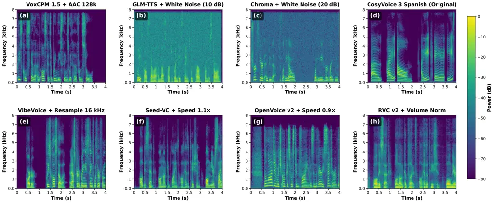
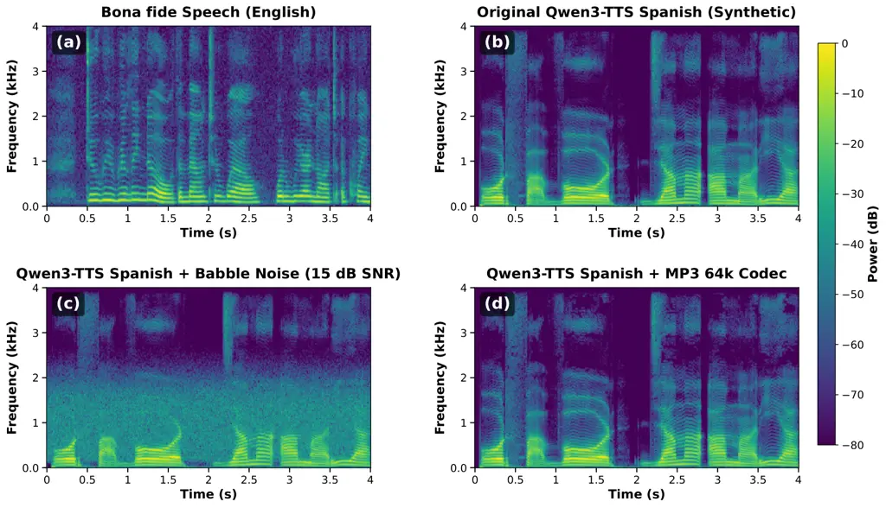

Sharma Wang

# VoxENES 2026: Benchmarking Generalization of Speech Spoofing Detectors Against LLM-Era TTS and Voice Conversion

Aastha    Guangjing

###### Abstract

Modern LLM-driven text-to-speech (TTS) and voice conversion (VC) systems
produce synthetic speech that differs from the generators represented in
many legacy spoofing benchmarks. This mismatch creates a temporal
generalization gap that can overestimate detector robustness under
real-world post-processing conditions. We bridge this gap by introducing
VoxENES 2026, a bilingual (English and Spanish) benchmark of 53,628
audio samples generated using 10 contemporary speech synthesis methods
and evaluated under 10 standardized post-processing conditions. Using
VoxENES 2026, we benchmark eight pretrained detectors without
fine-tuning and observe substantial performance degradation: the best
model achieves 28.98% EER overall, while most perform near or below
random chance across modern generators and perturbations. Our results
highlight the reliance on brittle artifacts in current detectors and
establish VoxENES 2026 as a practical testbed for developing robust
audio spoofing countermeasures.

###### keywords

audio deepfake detection, speech spoofing detection, benchmark dataset

^(†)^(†)address: University of South Florida, Tampa, FL, USA
^(†)^(†)email: aasthasharma@usf.edu, guangjingwang@usf.edu

## 1 Introduction

Robust speech spoofing and deepfake detection are essential to preserve
trust in speech-based authentication \[1, 2, 3, 4\]. This need is
growing as voice becomes a biometric and a control channel for
speech-driven agents and assistive technologies. If synthetic speech
becomes indistinguishable from genuine speech, detection failures not
only compromise security protocols but also erode trust in audio
evidence.

Many benchmark datasets are proposed for speech spoofing and deepfake
detection evaluation. For example, the ASVspoof challenge series has
been the primary driver of spoofing countermeasure development. ASVspoof
2019 \[5\] introduces logical access (LA) with TTS and VC, and physical
access (PA) with replay tracks. ASVspoof 2021 \[6\] adds the deepfake
task targeting compressed manipulated speech, and ASVspoof 5 \[7\]
introduces crowdsourced data with adversarial attacks at scale. In
addition to ASVspoof, WaveFake \[8\] provides a multilingual dataset
from six neural vocoder architectures. The In-the-Wild dataset \[9\]
includes real-world deepfakes of celebrities. The MLAAD \[10\] dataset
expands coverage to 23 languages and 54 TTS models. The
VoiceWukong \[11\] benchmarks 12 detectors against 34 commercial and
open-source tools with post-processing manipulations.

Yet, existing benchmarks primarily rely on speech synthesis systems
before 2024 and fail to capture artifact patterns produced by the modern
large language model (LLM)-driven generation pipelines. For example,
text-to-speech (TTS) designs include autoregressive language-model-based
synthesis, such as VoxCPM \[12\] and Qwen3-TTS \[13\]; flow-matching
models, including GLM-TTS \[14\], CosyVoice 3 \[15\], and
Chatterbox \[16\]; diffusion-based systems like FlashLabs Chroma \[17\];
and hybrid DiT architectures, such as VibeVoice \[18\]. For voice
conversion (VC), zero-shot approaches such as Seed-VC \[19\], tone-color
extraction methods such as OpenVoice v2 \[20\], and retrieval-based
systems like RVC v2 \[21\] have substantially improved naturalness and
speaker similarity.

Evaluation on temporally stale benchmarks can overestimate real-world
robustness as speech synthesis techniques improve. LLM-driven TTS and VC
systems produce synthetic audio with acoustic characteristics that
differ substantially from earlier spoofing corpora, creating a _data
drifting issue_ for existing detectors. Deepfake detection models that
perform well on older benchmarks may fail when deployed against newer
deepfake generators. This mismatch reflects a cat-and-mouse dynamic in
which detectors learn cues tied to previous synthesis artifacts, while
generators and post-processing steps progressively suppress or conceal
those cues. As a consequence, the rapid LLM-driven TTS and VC evolution
motivates updated evaluation benchmarks.

To study the generalization ability of deepfake detectors under the data
drifting issue in the era of LLM, we introduce a modern bilingual
benchmark dataset VoxENES 2026. We generate synthetic audios from 10
LLM-driven synthesis methods (7 TTS, 3 VC), covering English and Spanish
audios. In addition, real-world audios are frequently subjected to
transformations such as compression, noise, and resampling, which can
substantially affect detector behavior \[6, 11, 10\]. Therefore, VoxENES
2026 explicitly models the post-processing setting by applying a
standardized set of audio augmentation methods that simulate common
transmission and manipulation effects, including codec compression,
additive noise, resampling, speed perturbation, and loudness
normalization.

With VoxENES 2026, we evaluate eight pretrained deepfake detectors
without fine-tuning to measure out-of-distribution generalization. Our
results show that existing detectors suffer from substantial degradation
relative to reported performance on legacy benchmarks. The best detector
achieves only 28.98% EER overall, while most detectors perform near or
below random chance. These findings suggest that many current detectors
rely on brittle artifact cues that may not generalize across new TTS and
VC generations and realistic post-processing. By providing a modern
benchmark and a controlled out-of-distribution evaluation, our work
establishes a necessary testbed for measuring real-world speech spoofing
detector robustness and for driving detector development that keeps pace
with the evolving synthesis frontier.

In summary, the main contributions of our work are:

- •
  We introduce a modern bilingual benchmark dataset VoxENES 2026 using
  LLM-driven TTS and VC systems with realistic post-processing to
  emulate deployment-time distribution shifts, totaling 53,628 audio
  samples available at
  [https://www.kaggle.com/datasets/interspeech2712/voxenes-2026](https://www.kaggle.com/datasets/interspeech2712/voxenes-2026).
- •
  We benchmark eight pretrained detectors and reveal a substantial
  generalization gap, exposing detector-specific blind spots and
  robustness failures across synthesis methods.

## 2 VoxENES 2026

VoxENES 2026 consists of three components: (1) real speech from
established corpora, (2) synthetic audio generated by modern TTS and VC
systems, and (3) post-processed augmented variants simulating real-world
transmission conditions. As shown in Table 1, VoxENES includes 3,028
real speech samples and 50,600 synthetic samples (original synthetic
4,600 and augmented synthetic 46,000).

### 2.1 Real Speech and Standardization

As shown in Table 2, we drew 1,500 real English speech samples from 40
speakers from LibriSpeech \[22\]. We drew 1,528 real Spanish speech
samples from 96 speakers from VoxPopuli \[23\]. All audio was
standardized to 16 kHz mono WAV. For detector compatibility, samples
were capped at 4 seconds with truncation and zero-padding. This
fixed-length standardization was applied uniformly to both bonafide and
synthetic samples so that any padding-induced cues are shared across
classes rather than correlated with the spoofing label. We, therefore,
do not expect zero-padding to serve as a discriminative shortcut, though
a detailed analysis of padding artifacts is left to future work. Note
that for the downstream voice conversion tasks, the people whose voices
appear in the real speech samples are not used as target speakers.

| Component           | Count  | Notes                        |
| ------------------- | ------ | ---------------------------- |
| Real speech         | 3,028  | LibriSpeech + VoxPopuli      |
| Original synthetic  | 4,600  | TTS + VC originals           |
| Augmented synthetic | 46,000 | 10$`\times`$ post-processing |
| Total               | 53,628 | EN + ES combined             |

Table 1: VoxENES 2026 dataset summary.

| Category        | EN     | ES     | Total  |
| --------------- | ------ | ------ | ------ |
| Real speech     | 1,500  | 1,528  | 3,028  |
| TTS (7 methods) | 11,000 | 6,600  | 17,600 |
| VC (3 methods)  | 16,500 | 16,500 | 33,000 |
| Total           | 29,000 | 24,628 | 53,628 |

Table 2: Language and source breakdown in VoxENES 2026.

### 2.2 Synthesis Systems

We selected seven TTS and three VC systems representing state-of-the-art
LLM-driven synthesis techniques across diverse architectures as shown in
Table 3. The TTS systems include: (i) VoxCPM 1.5 \[12\], an
autoregressive language model from HKUST; (ii) Qwen3-TTS \[13\], a
streaming LM from Alibaba with native multilingual support; (iii)
GLM-TTS \[14\], a flow-matching model from Zhipu AI; (iv) FlashLabs
Chroma \[17\], a diffusion-based system; (v) VibeVoice \[18\], combining
DiT with flow matching; (vi) CosyVoice 3 \[15\], an LM plus
flow-matching system from Alibaba; and (vii) Chatterbox ML \[16\], a
flow-matching model from Resemble AI. The three VC systems represent
distinct paradigms: (i) Seed-VC \[19\] uses diffusion-based zero-shot
conversion with Whisper and WavLM features; (ii) OpenVoice v2 \[20\]
performs tone-color extraction and transfer; and (iii) RVC v2 \[21\]
uses HuBERT-based retrieval with HiFi-GAN vocoding. All TTS systems were
released or updated in 2025, ensuring they represent modern threats that
older detection models have never encountered. VC samples are generated
using disjoint source audio partitions and multiple target speaker
references to maintain diversity.

|                         |      |                       |             |     |     |       |      |         |
| ----------------------- | ---- | --------------------- | ----------- | --- | --- | ----- | ---- | ------- |
| System                  | Type | Architecture          | Developer   | EN  | ES  | Total | Year | ES Mode |
| VoxCPM 1.5 \[12\]       | TTS  | Autoregressive LM     | HKUST       | 200 | –   | 200   | 2025 | –       |
| Qwen3-TTS \[13\]        | TTS  | Streaming LM          | Alibaba     | 200 | 200 | 400   | 2025 | Native  |
| GLM-TTS \[14\]          | TTS  | Flow matching         | Zhipu AI    | 200 | –   | 200   | 2025 | –       |
| FlashLabs Chroma \[17\] | TTS  | Diffusion             | FlashLabs   | 200 | –   | 200   | 2025 | –       |
| VibeVoice \[18\]        | TTS  | DiT + flow matching   | Vibe AI     | 200 | –   | 200   | 2025 | –       |
| CosyVoice 3 \[15\]      | TTS  | LM + flow matching    | Alibaba     | –   | 200 | 200   | 2025 | Native  |
| Chatterbox ML \[16\]    | TTS  | Flow matching         | Resemble AI | –   | 200 | 200   | 2025 | Native  |
| Seed-VC \[19\]          | VC   | Diffusion + zero-shot | ByteDance   | 500 | 500 | 1,000 | 2025 | –       |
| OpenVoice v2 \[20\]     | VC   | Tone cloning          | MyShell AI  | 500 | 500 | 1,000 | 2024 | –       |
| RVC v2 \[21\]           | VC   | Retrieval + HiFi-GAN  | RVC-Project | 500 | 500 | 1,000 | 2023 | –       |

Table 3: TTS and VC systems used in VoxENES 2026.

| Augmentation      | Description                             |
| ----------------- | --------------------------------------- |
| mp3_64k           | MP3 encoding at 64 kbps                 |
| aac_128k          | AAC encoding at 128 kbps                |
| noise_white_10db  | White Gaussian noise at 10 dB SNR       |
| noise_white_20db  | White Gaussian noise at 20 dB SNR       |
| noise_babble_15db | Multi-speaker babble noise at 15 dB SNR |
| resample_8k       | Downsample to 8 kHz, upsample to 16 kHz |
| resample_16k      | Resample to 16 kHz (control)            |
| speed_fast        | 1.1$`\times`$ playback speed            |
| speed_slow        | 0.9$`\times`$ playback speed            |
| volume_norm       | Peak normalization to $`-`$3 dBFS       |

Table 4: Post-processing augmentation techniques.

### 2.3 Post-Processing Augmentations

Each original synthetic sample was subjected to one post-processing
operation in Table 4 that reflect common transmission and editing
effects: lossy codec compression (MP3 at 64 kbps and AAC at 128 kbps),
additive noise perturbations (white noise at 10/20 dB SNR and babble
noise at 15 dB SNR), bandwidth and sampling-rate distortions
(downsampling to 8 kHz with restoration to 16 kHz, plus a 16 kHz
resampling control), playback-rate changes (1.1$`\times`$ and
0.9$`\times`$ speed), and amplitude normalization (peak normalization to
$`-`$3 dBFS). This pipeline expands the synthetic subset and enables
systematic robustness analysis across realistic post-processing
conditions.

## 3 Evaluation Setup

### 3.1 Detection Baselines

We evaluated eight pretrained audio deepfake detection systems spanning
graph neural networks, raw-waveform CNNs, self-supervised learning (SSL)
models, transformer-based detectors, and speaker-embedding anomaly
detection as shown in Table 5. None were retrained or fine-tuned on
VoxENES 2026, enabling an honest temporal generalization evaluation. The
detectors differ in their training corpora (e.g., ASVspoof 2019 LA,
ASVspoof 2021 DF, ASVspoof 5, and VoxCeleb), so absolute EER values
should be read as out-of-distribution generalization indicators rather
than as a strictly controlled head-to-head comparison; the most directly
comparable cases are detectors sharing the same training source.

| Detector             | Family                  | Training Data    |
| -------------------- | ----------------------- | ---------------- |
| AASIST2 \[24\]       | Graph NN                | ASVspoof 2019 LA |
| RawNet2 \[25\]       | Raw waveform CNN        | ASVspoof 2021 DF |
| Wav2Vec2-AASIST      | SSL + classifier        | ASVspoof 2019    |
| Wav2Vec2-DF          | SSL + classifier        | Mixed deepfake   |
| Wav2Vec2-Large       | SSL + classifier        | Mixed deepfake   |
| AST-ASVspoof5 \[26\] | Spectrogram Transformer | ASVspoof 5       |
| Wav2Vec2-ASVspoof5   | SSL + classifier        | ASVspoof 5       |
| ECAPA-TDNN \[27\]    | Speaker embeddings      | VoxCeleb         |

Table 5: Detection baselines evaluated on VoxENES 2026.

| Augmentation      | AASIST2 | RawNet2 | W2V-AASIST | W2V-DF | W2V-Large | AST-ASV5 | W2V-ASV5 | ECAPA |
| ----------------- | ------- | ------- | ---------- | ------ | --------- | -------- | -------- | ----- |
| original          | 54.4    | 51.3    | 41.0       | 53.9   | 39.9      | 26.7     | 52.6     | 46.5  |
| aac_128k          | 53.1    | 50.2    | 42.5       | 53.6   | 37.9      | 31.8     | 51.5     | 46.9  |
| mp3_64k           | 53.7    | 50.1    | 42.5       | 54.1   | 39.8      | 48.4     | 52.0     | 47.2  |
| noise_white_10db  | 67.5    | 27.9    | 32.3       | 69.5   | 61.2      | 17.4     | 52.5     | 33.3  |
| noise_white_20db  | 59.0    | 40.0    | 44.5       | 68.9   | 63.3      | 18.3     | 49.8     | 36.2  |
| noise_babble_15db | 65.6    | 33.0    | 22.9       | 50.8   | 45.1      | 25.7     | 46.3     | 44.5  |
| resample_8k       | 59.1    | 55.6    | 37.5       | 42.0   | 34.3      | 29.5     | 52.1     | 46.4  |
| resample_16k      | 54.1    | 49.7    | 42.3       | 54.1   | 39.7      | 27.1     | 52.3     | 46.1  |
| speed_fast        | 56.0    | 53.4    | 38.6       | 52.2   | 37.5      | 26.1     | 59.0     | 38.5  |
| speed_slow        | 52.7    | 47.8    | 45.0       | 52.5   | 42.4      | 30.2     | 49.8     | 42.0  |
| volume_norm       | 56.7    | 47.1    | 42.0       | 53.9   | 40.1      | 28.5     | 52.2     | 46.6  |

Table 6: Per-augmentation EER (%) across all detectors.

Figure 1: Representative spectrograms across multiple TTS and VC systems
and augmentation conditions in VoxENES 2026.

Figure 2: Qualitative spectrogram comparison.

All detectors were evaluated in inference-only mode using published
pretrained weights. We report Equal Error Rate (EER) and accuracy in the
results. EER was computed from the ROC operating point where the false
acceptance rate (FAR) and the false rejection rate (FRR) are equal. In
particular, ECAPA-TDNN \[27\] is a speaker verification model rather
than a dedicated spoof detector. Thus, we use an anomaly-based scoring
scheme, where a reference centroid is computed from real speech audio,
and the cosine distance from this centroid is used as the spoofing
score. The system’s performance is then evaluated using the EER,
determined by the threshold at which the FAR and FRR are equivalent.

## 4 Evaluation Results

### 4.1 Qualitative Spectrogram Analysis

Figures 1 and 2 visualize the spectral variability across bonafide
(real) speech, synthetic speech, and post-processed synthetic samples in
VoxENES 2026. The examples highlight that realistic perturbations, such
as additive noise and lossy codec compression, can reshape
time-frequency structure and attenuate synthesis artifacts that many
detectors implicitly rely on, providing a qualitative rationale for the
observed performance changes under post-processing.

### 4.2 Impact of Post-Processing

As shown in Table 6, post-processing impacts detector performance in a
highly non-uniform and occasionally counterintuitive manner. Adding
white noise reduces EER for AST-ASVspoof5 (from 26.7% to 17.4%) and
RawNet2 (from 51.3% to 27.9%). This is plausibly because noise perturbs
synthetic and bonafide speech differently and attenuates
generator-specific artifacts, thereby inducing alternative
discriminative cues. In contrast, MP3 compression degrades AST-ASVspoof5
(from 26.7% to 48.4% EER), consistent with a reliance on fine-grained
spectral structure, particularly in higher frequencies, that is
suppressed by lossy codec encoding.

### 4.3 Overall Detection Performance

| Detector           | EER (%) | Acc (%) | TTS EER (%) | VC EER (%) |
| ------------------ | ------- | ------- | ----------- | ---------- |
| AASIST2            | 57.86   | 42.13   | 61.2        | 49.9       |
| RawNet2            | 47.03   | 52.97   | 53.6        | 49.8       |
| Wav2Vec2-AASIST    | 39.16   | 60.85   | 43.7        | 38.4       |
| Wav2Vec2-DF        | 55.51   | 44.49   | 59.3        | 49.2       |
| Wav2Vec2-Large     | 44.38   | 55.62   | 40.0        | 39.7       |
| AST-ASVspoof5      | 28.98   | 75.94   | 20.9        | 29.8       |
| Wav2Vec2-ASVspoof5 | 51.53   | 48.49   | 50.6        | 53.5       |
| ECAPA-TDNN         | 43.22   | 56.78   | 28.5        | 52.5       |

Table 7: Overall detection results on VoxENES 2026.

As shown in Table 7, among the evaluated models, only AST-ASVspoof5
achieves an EER below 30% (i.e., 28.98%), a result that remains
insufficient for reliable field deployment. In addition, five of the
eight detectors perform at or below the stochastic baseline (EER
$`\geq 47\%`$), most notably AASIST2 (57.86%), which exhibits inverted
prediction behavior on this benchmark and suggests a severe domain
mismatch between the training distribution and the VoxENES 2026
benchmark. This phenomenon occurs when a classifier learns
dataset-specific artifacts, such as silence patterns or channel
characteristics, that are reversed or absent in the target domain.
Consequently, the model assigns higher bonafide scores to synthetic
samples, misinterpreting spoofing cues as genuine speech features.
Across models, TTS-generated samples are marginally easier to detect
than VC-generated samples for some detectors, but the relative
difficulty varies by detector and does not hold uniformly.

### 4.4 Per-Method Detection Performance

We evaluate different detectors on each speech synthesis method. As
shown in Figure 3, Seed-VC is the most challenging synthesis method
overall: no evaluated detector achieves an EER below 41%. We hypothesize
that its diffusion-based conversion pipeline, augmented with strong
speech representations (e.g., Whisper- and WavLM-derived features),
yields highly natural outputs that preserve many bonafide time–frequency
characteristics, thereby reducing detector-accessible artifacts. More
broadly, no single detector is consistently reliable across all
synthesis methods. For example, ECAPA-TDNN performs well on several TTS
systems (e.g., GLM-TTS at 10.2% and CosyVoice 3 at 11.5%) but degrades
substantially on VC (e.g., OpenVoice v2 at 62.7%). The results suggest
that speaker-embedding approaches may capture anomalies introduced by
certain TTS pipelines yet struggle when VC more faithfully preserves
speaker identity and natural speech structure. A promising future
direction is to explore alternative modalities, such as acoustic sensing
data \[28\], for deepfake audio detection.

Figure 3: Per-method EER on Original Samples

## 5 Conclusion

We presented VoxENES 2026, a modern bilingual benchmark for speech
spoofing detection that reflects LLM-era TTS and VC generation and
realistic post-processing. Using VoxENES 2026, we evaluated eight
pretrained detectors without fine-tuning and observed a substantial
generalization gap: the best model achieves only 28.98% EER overall,
while many detectors perform near or below chance. These results suggest
that many current countermeasures rely on brittle, benchmark-specific
artifacts and remain sensitive to modern generators and routine
post-processing. We encourage future work on deployment-oriented
spoofing detection that improves generalization under data drift and
advances evaluation protocols that continuously track the fast-evolving
TTS and VC frontier.

## 6 Use of Generative AI Disclosure

Generative AI tools were used for language editing and manuscript
polishing. All authors reviewed, verified, and take full responsibility
for the content, experiments, and conclusions presented in this paper.

## References

- \[1\] Y. Wang, B. Chen, H. Guo, G. Wang, W. Ding, and Q. Yan (2025)
  ClearMask: noise-free and naturalness-preserving protection against
  voice deepfake attacks. In Proceedings of the 20th ACM Asia Conference
  on Computer and Communications Security, pp. 696–709. Cited by: §1.
- \[2\] H. Guo, G. Wang, B. Chen, Y. Wang, X. Zhang, X. Chen, Q. Yan,
  and L. Xiao (2024) WavePurifier: purifying audio adversarial examples
  via hierarchical diffusion models. In Proceedings of the 30th Annual
  International Conference on Mobile Computing and Networking,
  pp. 1268–1282. Cited by: §1.
- \[3\] H. Guo, G. Wang, Y. Wang, B. Chen, Q. Yan, and L. Xiao (2023)
  Phantomsound: black-box, query-efficient audio adversarial attack via
  split-second phoneme injection. In Proceedings of the 26th
  International Symposium on Research in Attacks, Intrusions and
  Defenses, pp. 366–380. Cited by: §1.
- \[4\] Y. Wang, H. Guo, G. Wang, B. Chen, and Q. Yan (2023) Vsmask:
  defending against voice synthesis attack via real-time predictive
  perturbation. In Proceedings of the 16th ACM Conference on Security
  and Privacy in Wireless and Mobile Networks, pp. 239–250. Cited by:
  §1.
- \[5\] M. Todisco, X. Wang, V. Vestman, M. Sahidullah, H. Delgado, A.
  Nautsch, J. Yamagishi, N. Evans, T. Kinnunen, and K. A. Lee (2019)
  ASVspoof 2019: future horizons in spoofed and fake audio detection. In
  Proc. Interspeech, pp. 1008–1012. Cited by: §1.
- \[6\] J. Yamagishi, X. Wang, M. Todisco, M. Sahidullah, J. Patino, A.
  Nautsch, X. Liu, K. A. Lee, T. Kinnunen, N. Evans, and H.
  Delgado (2024) ASVspoof 2021: accelerating progress in spoofed and
  deepfake speech detection. IEEE/ACM Trans. Audio, Speech, and Language
  Processing. Cited by: §1, §1.
- \[7\] X. Wang, H. Delgado, H. Tak, J. Jung, H. Shim, M. Todisco, I.
  Kukanov, X. Liu, M. Sahidullah, T. Kinnunen, N. Evans, K. A. Lee,
  and J. Yamagishi (2026) ASVspoof 5: design, collection and validation
  of resources for spoofing, deepfake, and adversarial attack detection
  using crowdsourced speech. Computer Speech & Language 95. Cited by:
  §1.
- \[8\] J. Frank and L. Schönherr (2021) WaveFake: a data set to
  facilitate audio deepfake detection. In Proc. NeurIPS Datasets and
  Benchmarks Track, Cited by: §1.
- \[9\] N. M. Müller, P. Czempin, F. Dieckmann, A. Frober, and K.
  Böttinger (2022) Does audio deepfake detection generalize?. arXiv
  preprint arXiv:2203.16263. Cited by: §1.
- \[10\] N. M. Müller, P. Kawa, W. H. Choong, E. Casanova, E. Gölge, T.
  Müller, P. Syga, P. Sperl, and K. Böttinger (2024) MLAAD: the
  multi-language audio anti-spoofing dataset. In Proc. IJCNN, Cited by:
  §1, §1.
- \[11\] Z. Yan, Y. Zhao, and H. Wang (2024) VoiceWukong: benchmarking
  deepfake voice detection. arXiv preprint arXiv:2409.06348. Cited by:
  §1, §1.
- \[12\] Y. Zhou, G. Zeng, X. Liu, X. Li, R. Yu, Z. Wang, R. Ye, W.
  Sun, J. Gui, K. Li, et al. (2025) VoxCPM: tokenizer-free TTS for
  context-aware speech generation and true-to-life voice cloning. arXiv
  preprint arXiv:2509.24650. Cited by: §1, §2.2, Table 3.
- \[13\] H. Hu, X. Zhu, T. He, D. Guo, B. Zhang, X. Wang, Z. Guo, Z.
  Jiang, H. Hao, Z. Guo, et al. (2026) Qwen3-TTS technical report. arXiv
  preprint arXiv:2601.15621. Cited by: §1, §2.2, Table 3.
- \[14\] J. Cui, Z. Yang, N. Li, J. Tian, X. Ma, Y. Zhang, G. Chen, R.
  Yang, Y. Cheng, Y. Zhou, et al. (2025) GLM-TTS technical report. arXiv
  preprint arXiv:2512.14291. Cited by: §1, §2.2, Table 3.
- \[15\] Z. Du, C. Gao, Y. Wang, F. Yu, T. Zhao, H. Wang, X. Lv, H.
  Wang, X. Shi, K. An, et al. (2025) CosyVoice 3: towards in-the-wild
  speech generation via scaling-up and post-training. arXiv preprint
  arXiv:2505.17589. Cited by: §1, §2.2, Table 3.
- \[16\] Resemble AI (2025) Chatterbox: open-source flow-matching TTS
  with emotion exaggeration control. Note:
  [https://huggingface.co/resemble-ai/chatterbox](https://huggingface.co/resemble-ai/chatterbox)
  Cited by: §1, §2.2, Table 3.
- \[17\] T. Chen, T. Chen, K. Shen, Z. Bao, Z. Zhang, M. Yuan, and Y.
  Shi (2026) FlashLabs Chroma 1.0: a real-time end-to-end spoken
  dialogue model with personalized voice cloning. arXiv preprint
  arXiv:2601.11141. Cited by: §1, §2.2, Table 3.
- \[18\] Z. Peng, J. Yu, W. Wang, Y. Chang, Y. Sun, L. Dong, Y. Zhu, W.
  Xu, H. Bao, Z. Wang, et al. (2025) VibeVoice: expressive podcast
  generation with next-token diffusion. In Proc. ICLR, Cited by: §1,
  §2.2, Table 3.
- \[19\] S. Liu et al. (2024) Zero-shot voice conversion with diffusion
  transformers. arXiv preprint arXiv:2411.09943. Cited by: §1, §2.2,
  Table 3.
- \[20\] MyShell AI (2024) OpenVoice V2. Note:
  [https://huggingface.co/myshell-ai/OpenVoiceV2](https://huggingface.co/myshell-ai/OpenVoiceV2)
  Cited by: §1, §2.2, Table 3.
- \[21\] RVC-Project (2024) Retrieval-based-voice-conversion-webui
  (RVC). Note:
  [https://github.com/RVC-Project/Retrieval-based-Voice-Conversion-WebUI](https://github.com/RVC-Project/Retrieval-based-Voice-Conversion-WebUI)
  Cited by: §1, §2.2, Table 3.
- \[22\] V. Panayotov, G. Chen, D. Povey, and S. Khudanpur (2015)
  LibriSpeech: an ASR corpus based on public domain audio books. In
  Proc. ICASSP, pp. 5206–5210. Cited by: §2.1.
- \[23\] C. Wang, M. Riviere, A. Lee, A. Wu, C. Talber, J. Bhosale, et
  al. (2021) VoxPopuli: a large-scale multilingual speech corpus for
  representation learning, semi-supervised learning and interpretation.
  In Proc. ACL, pp. 993–1003. Cited by: §2.1.
- \[24\] J. Jung, H. Heo, H. Tak, H. Shim, J. S. Chung, B. Lee, H. Yu,
  and N. Evans (2022) AASIST: a new end-to-end anti-spoofing system
  using integrated spectro-temporal graph attention networks. In Proc.
  ICASSP, pp. 6367–6371. Cited by: Table 5.
- \[25\] H. Tak, J. Jung, J. Patino, M. Kamble, M. Todisco, and N.
  Evans (2021) End-to-end spectro-temporal graph attention networks for
  speaker verification anti-spoofing and speech deepfake detection. In
  Proc. 2021 Edition of the Automatic Speaker Verification and Spoofing
  Countermeasures Challenge, pp. 1–8. Cited by: Table 5.
- \[26\] Y. Gong, Y. Chung, and J. Glass (2021) AST: audio spectrogram
  transformer. In Proc. Interspeech, pp. 571–575. External Links:
  [Document](https://dx.doi.org/10.21437/Interspeech.2021-698) Cited by:
  Table 5.
- \[27\] B. Desplanques, J. Thienpondt, and K. Demuynck (2020)
  ECAPA-TDNN: emphasized channel attention, propagation and aggregation
  in TDNN based speaker verification. In Proc. Interspeech,
  pp. 3830–3834. Cited by: §3.1, Table 5.
- \[28\] G. Wang, Q. Yan, S. Patrarungrong, J. Wang, and H. Zeng (2023)
  FacER: contrastive attention based expression recognition via
  smartphone earpiece speaker. In IEEE INFOCOM 2023-IEEE conference on
  computer communications, pp. 1–10. Cited by: §4.4.
