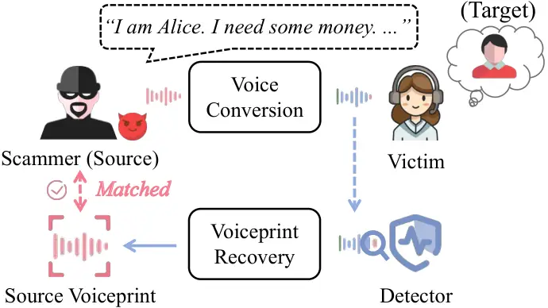
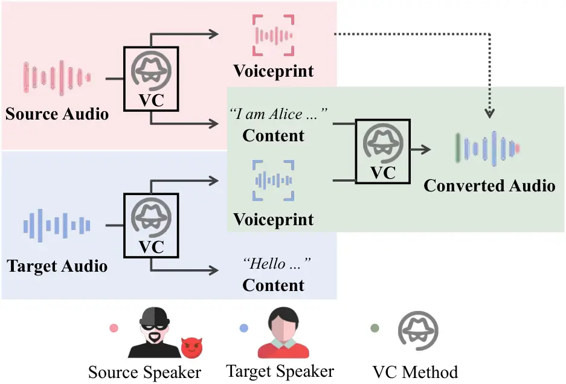
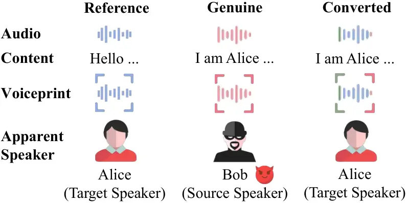
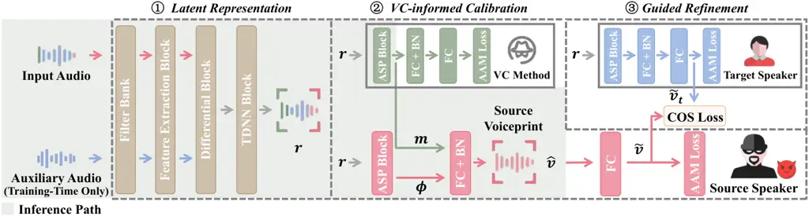
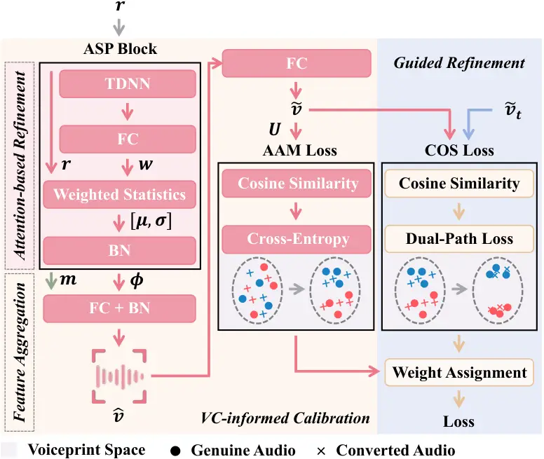

# Expose Your Disguise: Recovering Source Speaker Identity From Voice Conversion

Hanlei Zhang Affiliation: Zhejiang University Affiliation: Hangzhou,
China Email: <zhanghanlei@zju.edu.cn>    Zhongming Ma Affiliation:
Zhejiang University Affiliation: Hangzhou, China Email:
<zmma@zju.edu.cn>    Mingyang Zhang Affiliation: Ant Group Affiliation:
Shanghai, China Email: <zhangmingyang.zmy@antgroup.com>    Tengfei Liu
Affiliation: Ant Group Affiliation: Shanghai, China Email:
<aaron.ltf@antgroup.com>    Yushi Cheng Affiliation: Zhejiang University
Affiliation: Hangzhou, China Email: <yushicheng@zju.edu.cn>    Yanjiao
Chen Affiliation: Zhejiang University Affiliation: Hangzhou, China
Email: <chenyj.thu@gmail.com>

###### Abstract

Voice conversion (VC) poses a significant threat to biometric security
by allowing attackers to impersonate target speakers. In forensic
contexts, recovering the source speaker’s identity from converted audio
is vital for narrowing the field of suspects. To address this, we
propose Trident, a retracing framework designed to restore a source
speaker’s original identity from a converted audio sample. Trident
utilizes a three-pronged architecture consisting of a primary extractor
and two auxiliary branches. The first auxiliary branch identifies the
underlying voice conversion mechanism. This design acknowledges that
even if the exact conversion strategy is unknown, a high-performance
model adopted by the attacker is typically a derivative or variant of
established mainstream ones. The second auxiliary branch extracts a
latent representation of the target speaker, facilitating the isolation
of target-specific traits from the composite converted audio sample.
Finally, the main extractor leverages insights from both auxiliary
branches to decouple confounding factors and distill a highly
discriminative representation of the source speaker’s identity.
Experimental results demonstrate that Trident achieves an accuracy as
high as $`90.99\%`$ against 7 state-of-the-art voice conversion methods.
Furthermore, Trident maintains robust performance under challenging
conditions, including telephony channels, unseen languages, and adaptive
scenarios.



Figure 1: The application scenario of voiceprint recovery.

## 1 Introduction

By enabling the creation of high-fidelity vocal impersonations, speech
deepfake technology has become a potent tool for social engineering,
allowing attackers to manipulate human trust on an unprecedented scale.
Voice conversion and text-to-speech (TTS) synthesis are two
representative techniques of speech deepfakes. TTS generates vocal
output from raw text but typically incurs higher latency due to its
dependency on complete text input and additional style conditioning.
Furthermore, due to the lack of fine-grained prosodic details in raw
text, TTS produces less nuanced prosody than voice conversion, rendering
it unsuitable for real-time fraudulent interactions. Conversely, voice
conversion maps the acoustic features of a source speaker onto a target
identity, allowing the attacker to project their own emotional nuances
and natural rhythm onto the converted audio. Therefore, voice conversion
can generate high-fidelity speech that preserves fine-grained prosodic
attributes, with real-time streaming systems now achieving sub-100 ms
latencies \[80\].

In this manner, voice conversion provides a viable mechanism for
real-time impersonation and live-call spoofing \[47, 81, 74, 23, 22,
21\] as shown in Figure 1. A notable real-world manifestation occurred
in 2024, when an employee at Arup transferred approximately HK\$200
million to scammers who impersonated the company’s CFO and other senior
executives during a live video conference \[21\]. In this full-on video
call, real-time voice conversion enabled interactions between scammers
and the victim, who made money transfers across 15 transactions
following the scammers’ orders \[5\]. Prior research mainly focused on
deepfake detection, a binary task that differentiates genuine audio from
fake audio \[13, 43, 52, 18, 40, 45, 41, 36, 78, 17, 33\], which falls
short in forensic attribution. Unlike TTS outputs, which are entirely
synthetic, voice conversion produces composite signals that inherently
retain underlying acoustic traces of the source speaker alongside the
target speaker. This composition presents a unique opportunity for
source identity recovery, a critical capability for narrowing down
suspect pools and unmasking malicious actors.

As illustrated in Figure 2, voice conversion works in a
representation-mapping-reconstruction pipeline \[62\]. The source audio
sample is first decomposed into representations of the speech and the
speaker. These representations are then transformed by a mapping module
to match the target speaker’s characteristics, and finally reconstructed
as time-domain signals. While early voice conversion methods rely
primarily on statistical modeling such as gaussian mixture models \[3,
32\], modern approaches have shifted toward deep learning, specifically
the encoder-decoder architecture. In this framework, an encoder performs
representation extraction, and a decoder handles the combined mapping
and reconstruction process \[62\]. Because the mapping-reconstruction
stage is critical for ensuring that the converted audio captures the
natural characteristics of the target speaker, significant research has
focused on integrating advanced generative models and architectures into
the decoder to enhance synthesis quality, such as variational
autoencoders (VAEs) \[11, 77\], U-Nets \[76, 8\], sequence-to-sequence
(Seq2Seq) models \[28, 46\], generative adversarial networks (GANs)
\[44, 42\], and diffusion models \[10, 9\]. However, despite extensive
efforts to achieve seamless voice conversion, it is shown that source
speaker leakage is inevitable in converted audio samples \[75, 55\].
Furthermore, voice conversion also introduces method-specific
_fingerprints_, e.g., unique spectral signatures or prosodic artifacts,
into converted audios.

While pioneering research \[14\] and subsequent studies \[7, 48, 82\]
have achieved satisfactory performance in source speaker recovery, they
often struggle to generalize across advanced or previously unseen voice
conversion methods. This limitation stems from the complex coupling of
heterogeneous information embedded within converted audio, which
presents two primary challenges. First, different voice conversion
techniques obfuscate the source speaker’s voiceprint in distinctive
ways. Consequently, a naive extraction approach that overlooks these
methodological variations fails to generalize. Second, the target
speaker’s characteristics, which are the dominant component of the
converted audio, further mask the residual source voiceprint, severely
hindering direct extraction. To overcome these challenges, we propose
Trident, a robust framework equipped with two specialized modules. These
modules disentangle the two confounding components, namely the features
of the voice conversion method and the target speaker, from the
converted samples, thereby facilitating the recovery of the source
speaker’s voiceprint.



Figure 2: The workflow of voice conversion. Different colors represent
voiceprint parts that carry information targeting different speakers or
methods. Variations in audio waveforms correspond to differences in
speech content.

- •
  How can the recovery process be customized to diversified voice
  conversion paradigms?

Under the black-box threat model, existing works \[14, 7, 48, 82\]
largely overlook the impact of specific voice conversion architecture on
the recovery process. The common practice is to train a recovery model
on converted audio samples labeled with the source speaker in a
supervised way. While effective for voice conversion methods seen during
training, these models often suffer from poor generalization. We observe
recovery accuracy plummeting to below 10% when encountering unseen
conversion techniques \[14\]. Despite architectural nuances, we find
that high-performance voice conversion methods generally derive from a
few mainstream paradigms featuring different decoders, e.g., VAEs \[11,
77\], U-Nets \[76, 8\], Seq2Seq models \[28, 46\], GANs \[44, 42\], and
diffusion models \[10, 9\]. Leveraging this insight, we equip Trident
with the auxiliary branch to capture method-specific information.
Specifically, a classifier categorizes the input into different voice
conversion families. The latent representation of the classifier is
provided to guide the primary extractor in a more informed recovery
process.

- •
  How can the recovery pipeline better isolate source identities from
  target-dominated audio?

The influence of the target speaker on source voiceprint recovery is
notable. While existing frameworks \[14\] attempt to mitigate this by
providing the target voiceprint as an input, this often leads to
_information dilution_ as the signal propagates through deep layers. In
contrast, Trident shifts target information to the output via a
dedicated auxiliary branch designed to explicitly extract the target
speaker identity from the converted audio. To enforce distinctness, we
employ a cosine similarity (COS) loss to maximize the margin between the
source and target representations. Specifically, for converted audio
(e.g., Source: Bob, Target: Alice), we maximize the dissimilarity
between the primary extractor and this auxiliary branch. For authentic
speech (e.g., Alice), we minimize the distance. This contrastive
approach ensures the primary extractor effectively filters out target
interference to recover a pure source identity.

Extensive experiments demonstrate that Trident outperforms existing
methods across 7 voice conversion methods. It achieves over 90% source
identification accuracy for unseen speakers and is effective even when
audio is transmitted over real-world telephony and voice over internet
protocol (VoIP) channels. Furthermore, the framework exhibits robust
cross-lingual generalization. A model trained exclusively on English
successfully generalizes to Spanish, French, German, and Amharic.
Finally, Trident maintains high accuracy even when attackers use
pre-processing or adaptive techniques.

Our main contributions are summarized as follows.

- •
  We present Trident, a recovery framework that enhances forensic
  accountability by isolating source speaker identities across diverse
  voice conversion paradigms.
- •
  We establish a three-pronged architecture to effectively tap into the
  information of the conversion method and the target speaker to
  facilitate better source speaker identity recovery.
- •
  We validate the performance of Trident through extensive experiments
  and verify its robustness across gender subgroups, telephony
  scenarios, adaptive adversaries, unseen voice conversion methods, and
  unseen languages.

## 2 Preliminaries

### 2.1 Speaker Recognition Systems

Voiceprint is the unique characteristic of audio that can be associated
with the identity of the speaker. To enable speaker recognition,
voiceprint representations are extracted from audio samples as

```math
v=\mathcal{V}(x), \tag{1}
```

where $`v`$ is the voiceprint representation of an audio sample $`x`$
and $`\mathcal{V}`$ denotes a particular speaker recognition system.

There are two phases in speaker recognition systems: enrollment and
verification. In the enrollment phase, the voiceprint representation of
a speaker $`i\in I`$ is extracted from several reference audio samples
$`D^{r}=\{(x^{r},i)\}`$ and aggregated as a template
$`v^{r}_{i}=\mathop{\mathrm{Average}}\limits_{(x^{r},i)\in D^{r}}\mathcal{V}(x^{r})`$.
Reference audio samples are indispensable for speaker recognition,
providing the biometric templates for comparison. In the verification
phase, the voiceprint representation of an audio sample is extracted and
compared against all recorded templates to find the most similar match
$`\mathcal{O}(x)=\mathop{\mathrm{arg\,max}}\limits_{i\in I}{\mathcal{S}(\mathcal{V}(x),v^{r}_{i})}`$.
$`S`$ typically employs the cosine similarity function. ECAPA-TDNN
\[16\] is one of the mainstream speaker recognition systems. ECAPA-TDNN
enhances the time delay neural network (TDNN) architecture with
SE-Res2Blocks and attentive stat pooling, obtaining remarkable
performance on VoxCeleb \[53, 12\], the widely-used speaker recognition
dataset.



Figure 3: Comparison of information contained in reference, genuine, and
converted audio samples. The reference audio is the enrollment audio of
Alice, which has significant differences from the genuine audio of Bob,
i.e., the attacker, in both voiceprint and content. However, Bob can
change the voiceprint to that of Alice by voice conversion.

### 2.2 Voice Conversion

Voice conversion aims to transform the style of an audio sample while
preserving its linguistic content (i.e., the spoken words). As shown in
Figure 3, most voice conversion methods convert the source speaker’s
identity into that of a target speaker for various applications, e.g.,
fraud. To achieve this, voice conversion typically follows a
representation-mapping-reconstruction pipeline. It first extracts
representations corresponding to speaker identity and linguistic
content. After mapping the source speaker representation to the target
speaker, the converted audio is finally reconstructed from the
transformed representations.

Early voice conversion methods focus on mapping source-to-target speaker
features, including spectral envelopes \[64\], spectrum parameters
\[1\], and spectral parameter trajectory \[70\]. Beyond classical
statistical models \[3, 32\], methods also utilize deep neural networks
for feature extraction, e.g., Deep Belief Nets \[54\], DBLSTM-RNNs
\[65\], and GANs \[35, 34\]. However, these traditional mapping
approaches often suffer from limited performance and a failure to
generalize to unseen speakers. To overcome these limitations,
contemporary voice conversion systems resort to encoder-decoder
architectures. In this framework, the encoder disentangles the audio
sample into voiceprint/identity representation and linguistic content
representation. The decoder then facilitates the mapping-reconstruction
stage by transforming the source voiceprint to match the target speaker
and synthesizing the final audio through the integration of this
converted voiceprint representation with the original linguistic
content. The decoder, handling the mapping-reconstruction stage, is a
critical component that determines the quality of converted audio.

Voice conversion has undergone a significant evolution driven by
advancements in generative models. Early research leveraged VAEs \[39\]
to learn a structured latent representation of speech. While these
models facilitate conversion by swapping speaker embeddings, as in
AdaIN-VC \[11\] and VQVC \[77\], they often suffer from loss of critical
acoustic details. To address this, later frameworks integrated U-Net
\[60\] architectures by employing skip connections to propagate
low-level features directly to the decoder. Models such as AGAIN-VC
\[8\] and VQVC+ \[76\] enhanced reconstruction fidelity. To better model
prosody, Seq2Seq frameworks such as the Voice Transformer Network \[28\]
and BNE-Seq2seqMoL \[46\] were introduced to learn explicit temporal
alignments. Building on these structural improvements, the integration
of GANs \[26\] shifted the research focus toward enhancing perceptual
naturalness. Models like StarGANv2-VC \[44\] and FreeVC \[42\] utilize
adversarial objectives to generate high-fidelity speech, often
integrating VAEs or U-Nets within the GAN framework. Most recently,
diffusion models \[63\] employ an iterative denoising process to recover
acoustic features from gaussian noise. By modeling the complex
distribution of speech data, systems such as DPM-VC \[57\], Diff-HierVC
\[10\], and DDDM-VC \[9\] capture fine-grained speaker characteristics
and generate high-fidelity audio.

### 2.3 Voice Conversion Countermeasures

In the case of malicious use of voice conversion, countermeasures have
been proposed to either detect voice conversion or recover the source
speaker identity from converted audio.

Voice conversion detection aims to make use of various information to
detect whether an audio sample is a converted one or not, such as
spectral \[67\], emotional \[13\], physical \[43\], perceptual \[43\],
breathing \[52\], silence \[18\], pause \[40\] features, dual-channel
stereo information \[45\], frequency dynamics and oscillations \[41\].
The detection model may take the form of convolutional neural networks
\[25, 31, 69, 83\], residual networks \[49, 36\], transformers \[78\],
generative adversarial networks \[17\], and graph attention networks
\[67, 68, 33\]. However, voice conversion detection methods are not able
to recover the identity of the source speaker.



Figure 4: The overview of Trident.

Voiceprint recovery tries to achieve the more challenging goal of
restoring the identity information of the source speaker from converted
audio. Revelio \[14\] is the state-of-the-art voiceprint recovery
method, which introduces a differential rectification algorithm to
recover the source voiceprint from converted audio. However, Revelio
exhibits limited generalization across diverse voice conversion methods.
Another work \[7\] employs a residual convolutional network \[29\] for
recovering source identity, yet its performance is considerably inferior
to that of Revelio. Subsequent efforts \[48, 82\] have introduced
incremental modifications to Revelio, such as incorporating a mask
estimation \[82\] or a distillation algorithm \[48\], yielding results
that are either worse or, at best, on par with Revelio. To address this
limitation, Trident eliminates interference from both method-specific
distortion and target speaker characteristics to recover the source
speaker voiceprint robustly across diverse voice conversion methods.

Another related line of work lies in speaker de-anonymization, which has
thus far exclusively tackled traditional speaker anonymization
techniques that modify speaker-specific characteristics while preserving
baseline acoustic features \[51\]. Unlike these conventional
anonymization methods, voice conversion explicitly alters the source
audio to mimic a specific target identity. Existing speaker
de-anonymization mainly exploits conventional acoustic features (e.g.,
phoneme timing patterns \[71, 72\] and accent cues \[4\]) and linguistic
content (e.g., semantic keyword patterns \[24\] and stylometric
fingerprinting \[2\]) for speaker recognition. Some methods \[61, 85\]
identify speakers based on acoustic embedding similarity between
anonymized and original speech, with embeddings extracted using
pre-trained speaker recognition models. To the best of our knowledge,
the unique challenges posed by voice conversion remain unaddressed
within the existing speaker de-anonymization literature.

## 3 System Model

This section defines the goals, capabilities, and knowledge of the
attacker and the defender.

### 3.1 Attacker

Goal. The attacker intends to use voice conversion to produce audio
samples that sound similar to the target speaker.

Knowledge. We assume that the attacker has knowledge of any widely-used
voice conversion methods.

Capability. We assume that the attacker has sufficient computational
resources to train and implement any voice conversion model, has access
to enough audio samples of the target speaker to ensure a
well-performing model, and has the ability to arbitrarily modify audio
samples to hinder voiceprint recovery.

### 3.2 Defender

Goal. The defender aims to extract the source voiceprint from a
converted audio or the sole voiceprint from a genuine audio.

Knowledge. We assume that the defender does not know whether the input
audio is converted or genuine. The defender does not know the specific
voice conversion method used by the attacker, but has knowledge of
commonly-used voice conversion methods.

Capability. The defender can collect public voice datasets for training
the voiceprint recovery model. During inference, the model requires only
a single input audio to extract the source speaker voiceprint, with no
additional data and no prior exposure to the source or target speaker
during training. The extracted voiceprint can then be used for speaker
recognition. We assume a voiceprint database is available for this
purpose, which can be constructed from only a few reference audio
samples per speaker. This assumption is reasonable given that the mass
collection of voices has become increasingly common across various
domains, such as social media, banking, and prisons \[50, 15\]. If the
true identity of the source speaker is already enrolled in the
defender’s database, the speaker recognition system yields a “hit,”
successfully mapping the audio to a specific identity. Conversely, if
the speaker is not present in the database, the system registers a
“miss,” and the extracted voiceprint can be archived to facilitate
future cross-referencing as the database expands. We discuss these two
cases in terms of forensic settings in Section 6.4.

_Disclaimer._ Note that TTS is out of our scope since TTS leaves no
source voiceprint to be recovered. Nevertheless, Trident can be used to
trace synthesized audio back to the specific TTS tools.

## 4 Methodology

As shown in Figure 4, Trident consists of three main modules, i.e.,
latent representation, VC-informed calibration, and guided refinement.

- •
  Latent representation. The latent representation module applies to
  extract the basic latent representation of the input audio, which
  encodes information including the source speaker voiceprint, the
  target speaker voiceprint, and the method-specific fingerprints. The
  output latent representation requires further purification to obtain a
  highly discriminative representation of the source speaker’s identity.
- •
  VC-informed calibration. The VC-informed calibration module identifies
  the specific voice conversion method and guides the model to refine
  the extracted latent representation, steering it towards the source
  speaker voiceprint. This module consists of the primary feature
  extractor and the first auxiliary branch dedicated to VC method
  identification.
- •
  Guided refinement. The guided refinement module extracts a latent
  representation of the target speaker, facilitating the isolation of
  target-specific traits from the composite converted audio. This module
  incorporates the second auxiliary branch, which biases the primary
  extractor toward extracting the source speaker voiceprint and away
  from the target speaker voiceprint during training.

### 4.1 Latent Representation

The latent representation module is applied to extract basic
representation of the audio sample. As shown in Figure 4, we adapt the
internal architecture of widely-used speaker recognition models as the
backbone of this module.

The latent representation module is composed of a filter bank layer,
TDNN blocks, SERes blocks, and a differential block. The filter bank
layer is used to extract Mel-frequency-domain features, which are widely
used for speaker recognition. Then a feature extraction block, namely a
TDNN block and three SERes blocks, helps extract time-domain features
and global channel interdependence. The TDNN block consists of one
one-dimensional convolution (Conv1D) layer, one rectified linear unit
(ReLU) activation layer, and one batch normalization (BN) layer. An
SERes block consists of one TDNN block, one Res2-Dilated-TDNN layer,
another TDNN block, and one squeeze-excitation layer. The outputs of
three SERes blocks are concatenated and fed into a differential block.

The differential block is specially designed to assist in guided
refinement. In addition to the outputs of the SERes blocks, the
differential block accepts an auxiliary input. Specifically, during
training, if the input audio sample $`x`$ is converted, a genuine audio
sample from the target speaker serves as this auxiliary input; if $`x`$
is genuine, the auxiliary input is set to a zero embedding. Internally,
the differential block utilizes a built-in TDNN block to process the
difference between the two inputs, which is then added back to the
original input. This combined representation is subsequently fed into
another TDNN block for further feature extraction.

During inference, the auxiliary input of the differential block is fixed
as a zero embedding regardless of the input type. This design strictly
conforms to our threat model, which assumes the defender has no prior
knowledge of whether the test audio is converted or genuine. Notably,
using a genuine target speaker sample during training but a zero
embedding during inference for a converted input $`x`$ might raise
concerns regarding a training-inference mismatch. However, our ablation
study confirms that incorporating genuine target speaker audio as the
auxiliary input during training yields superior performance compared to
using zero embeddings across both phases. Detailed analysis is provided
in Section 5.13.

### 4.2 VC-informed Calibration

The VC-informed calibration module introduces the information of the
voice conversion method to guide the model to refine the extracted
embedding towards the source speaker voiceprint. To achieve this
objective, we equip this module with three submodules, i.e., VC method
inference, attention-based refinement, and feature aggregation. Let
$`r`$ denote the output of the latent representation module.


(a) O

(b) O+M

(c) O+G

(d) O+M+G

|                                |                    |      |      |       |
| ------------------------------ | ------------------ | ---- | ---- | ----- |
| Distance                       | Branch Combination |      |      |       |
|                                | O                  | O+M  | O+G  | O+M+G |
| Inter-Speaker ($`\uparrow`$)   | 0.84               | 0.86 | 0.92 | 0.96  |
| Intra-Speaker ($`\downarrow`$) | 0.59               | 0.54 | 0.49 | 0.48  |

Figure 5: Distribution of voiceprints extracted by models with different
auxiliary branch combinations, which is visualized by t-SNE \[73\]. M
and G are the abbreviations for the VC method inference and the guided
refinement. O denotes a variant of Trident that excludes the two
auxiliary branches. Different colors represent different ground-truth
speakers. Distances are computed using cosine distance between the
extracted voiceprints, which subtracts the cosine similarity from unity.

#### 4.2.1 VC method inference

The VC method inference submodule aims to infer the specific VC method
used to convert the input audio samples. More specifically, during
training, the defender constructs converted samples using various
widely-used VC methods so that the method used to convert a training
sample is known. Let $`\mathcal{M}`$ denote the set of VC methods used
during the training phase. A label $`0`$ is added to indicate that the
audio sample is genuine.

Note that we assume that the defender does not know the specific VC
method adopted to convert an input sample during inference. The
ground-truth VC method utilized by the attacker may belong to
$`\mathcal{M}`$ or not. Our extensive empirical study demonstrates that
even if the ground-truth VC method is not in $`\mathcal{M}`$, the
information from the VC method inference submodule is still
instrumental. This is because a well-performed VC method is usually a
variant of one or multiple mainstream VC methods. The VC method
inference submodule will find the most _similar_ method to the
ground-truth one, narrowing down the searching scope. Since different
families of VC methods shape the converted audio samples in different
ways, being aware of the VC method or its proxy provides valuable
guidelines for Trident to further process the embedding to distill the
source voiceprint. Figure 5 illustrates the t-SNE \[73\] visualization
of extracted voiceprint space under different auxiliary branch
combinations. It is shown that the extracted voiceprint embeddings from
converted samples cluster more closely to those of genuine samples in
the presence of the VC method inference branch. This indicates that this
auxiliary branch provides crucial guidance for Trident to accurately
distill the residual source voiceprint.

The VC method inference submodule processes input $`r`$ through 2
blocks, i.e., an ASP block and a classification block. The ASP block
features attentive stat pooling (ASP). The classification block
comprises a fully-connected (FC) layer and a batch normalization (BN)
layer. Note that during training, the ASP block and the classification
block will be jointly trained, but only the ASP block is used during
inference. Let $`m`$ denote the output of the ASP block of the VC method
inference submodule. The additive angular margin (AAM) loss is employed
as the loss function. We will describe the details of the ASP block as
we introduce the attention-based refinement submodule and the AAM loss
as we introduce the feature aggregation submodule.



Figure 6: The workflow of VC-informed calibration and guided refinement.
The changes of voiceprint distributions visualized by t-SNE \[73\] are
schematized to illustrate the effects of VC-informed calibration and
guided refinement.

#### 4.2.2 Attention-based refinement

The attention-based refinement submodule is composed of one ASP block,
which is designed to refine the feature representations to be more
discriminative.

The internal structure of ASP is shown in Figure 6. The input $`v`$ is
first processed by one TDNN block and one FC layer. The output
represents inter-frame attention weights, which reflect each frame’s
importance to the source speaker identity. We have

```math
w_{{j}}=\frac{FC(TDNN(r_{j}))}{\sum_{j=1}^{T}FC(TDNN(r_{j}))}. \tag{2}
```

where $`r_{j}`$ is the $`j`$-th frame of $`r`$, $`w_{{j}}`$ is the
attentive weight of $`r_{j}`$, and $`T`$ is the number of frames.

Combining $`r_{j}`$ with $`w_{{j}}`$ can capture the speaker-related
features, effectively filtering out irrelevant information. The weighted
statistics, namely mean and standard deviation, are calculated to model
the speaker-related distribution patterns, which are associated with the
identity information of speakers. We have

```math
\begin{split}\mu_{r}&=\sum_{j=1}^{T}r_{j}w_{{j}},\\
\sigma_{r}&=\sqrt{\sum_{j=1}^{T}w_{{j}}(r_{j}-\mu)^{2}}.\end{split} \tag{3}
```

Then a BN layer is used to standardize the concatenated statistic
features, aligning their numerical scales to avoid biased weighting in
the following FC layers.

```math
\phi=BN([\mu,\sigma]). \tag{4}
```

#### 4.2.3 Feature aggregation

The feature aggregation submodule takes the output of the VC method
inference submodule $`m`$ and the output of the attention-based
refinement submodule $`\phi`$, and outputs the final extracted
voiceprint $`\hat{v}`$. The feature aggregation submodule contains one
FC layer and one BN layer.

During training, the design of the loss function is important since it
guides the learning process of the model. Naturally, the optimization
goal is to minimize the distance between the extracted voiceprint
$`\hat{v}`$ and the ground-truth voiceprint $`v`$. Note that the
ground-truth voiceprint $`v`$ is the source speaker’s voiceprint of a
converted audio sample or the sole speaker’s voiceprint of a genuine
audio sample.

We employ the additive angular margin (AAM) loss. The AAM loss forces
the extracted voiceprint of the same category to have high similarity,
thereby enabling the model to generalize to unseen speakers. The AAM
loss learns a weight matrix $`U`$ that represents corresponding
embeddings for each speaker, which can be used to calculate and enhance
intra-class compactness and inter-class distinctiveness in the angular
space.

One FC layer is utilized to perform feature transformation that enables
more training-efficient loss computation.

```math
\tilde{v}=FC(\hat{v}). \tag{5}
```

Then the cosine similarity between the output embedding $`\tilde{v}`$
and the weighted matrix is calculated as

```math
\cos\theta_{i}=\frac{\tilde{v}^{T}u_{i}}{||\tilde{v}||_{2}||u_{i}||_{2}}. \tag{6}
```

where $`u_{i}`$ is the representative embedding of speaker $`i`$.
$`||\cdot||_{2}`$ represents the $`L_{2}`$ norm. $`\cos\theta_{i}`$
computes the similarity score between the output embedding $`\tilde{v}`$
and the representative embedding $`u_{i}`$ of speaker $`i`$.

As for the source speaker $`y_{s}`$ in the label, AAM loss will add a
predefined angular margin $`\delta`$, which enforces tighter angular
clustering for positive pairs while pushing negative pairs beyond a
fixed angular boundary.

```math
\cos(\theta_{y_{s}}+\delta)=\cos\theta_{y_{s}}\cos\delta-\sin\theta_{y_{s}}\sin\delta. \tag{7}
```

To prevent sluggish gradient updates, we introduce a scaling factor
$`\beta`$ to amplify the cosine similarity scores.

```math
s_{i}=\begin{cases}\beta\cos\theta_{i},&i\neq y_{s},\\
\beta\cos(\theta_{y_{s}}+\delta),&i=y_{s}.\end{cases} \tag{8}
```

Consequently, the final AAM loss function, an improved softmax
cross-entropy loss with additive angular margin, can be formulated as

```math
\mathcal{L}_{AAM}=-\frac{1}{N}\sum_{(x_{i},y_{i})\in\mathcal{D}}\ln\frac{e^{s_{y_{s}}}}{\sum_{i}e^{s_{i}}}. \tag{9}
```

where $`N`$ is the total number of samples in dataset $`\mathcal{D}`$.

### 4.3 Guided Refinement

During training, we teach the model to learn to simultaneously master
two tasks: (1) extract the source speaker voiceprint from converted
audio samples, and (2) extract the sole speaker voiceprint from genuine
audio samples. However, the first task is obviously more challenging
than the second one. Our extensive empirical study shows that the
existing models fail to yield satisfactory results in the face of
advanced voice conversion methods. To address this problem, we further
improve the model with a guided refinement module. This module elicits
more information to aid the more complicated task of extracting the
source speaker voiceprint from converted audio samples.

The guided refinement module is an additional subnetwork, which will be
used for training but not for inference. The input of the subnetwork is
the output of the latent representation module $`r`$ and the output of
the subnetwork is the target speaker of converted audios or the sole
speaker of genuine audios. Let $`\tilde{v}_{t}`$ denote the output
voiceprint of the guided refinement module.

During training, we leverage the extracted target speaker voiceprint
$`\tilde{v}_{t}`$ to further guide the refinement of the extracted
source speaker voiceprint $`\tilde{v}`$ via an additional loss term. The
loss term aims to reduce the similarity between $`\tilde{v}_{t}`$ and
$`\tilde{v}`$ of converted audio samples, while increasing the
similarity between $`\tilde{v}_{t}`$ and $`\tilde{v}`$ of genuine audio
samples.

```math
\mathcal{L}_{COS}=\mathcal{L}_{COS_{c}}-\mathcal{L}_{COS_{g}}. \tag{10}
```

```math
\mathcal{L}_{COS_{c}}=\frac{1}{N_{c}}\sum_{x_{c}\in\mathcal{D}_{c}}\frac{\tilde{v}^{T}\tilde{v}_{t}}{||\tilde{v}||_{2}||\tilde{v}_{t}||_{2}}. \tag{11}
```

```math
\mathcal{L}_{COS_{g}}=\frac{1}{N_{g}}\sum_{x_{g}\in\mathcal{D}_{g}}\frac{\tilde{v}^{T}\tilde{v}_{t}}{||\tilde{v}||_{2}||\tilde{v}_{t}||_{2}}. \tag{12}
```

in which $`\mathcal{D}_{c}`$ is the subset of converted audio samples
and $`\mathcal{D}_{g}`$ is the subset of genuine audio samples in the
training dataset. $`N_{c}`$ is the number of converted audios in
$`\mathcal{D}_{c}`$ and $`N_{g}`$ is the number of genuine audios in
$`\mathcal{D}_{g}`$. As shown in Figure 5, the guided refinement branch
further improves the performance of source speaker recovery, increasing
the inter-speaker distance to 0.96.

The overall loss function for training is

```math
\mathcal{L}=\mathcal{L}_{AAM}+\lambda\mathcal{L}_{COS}, \tag{13}
```

in which $`\lambda`$ is a hyperparameter.

During the whole training process, we also implement commonly-used data
augmentation techniques to boost model performance, including modifying
speed, adding noise, adding reverberation, and randomly dropping frames.

## 5 Evaluation

We conduct extensive experiments to evaluate the effectiveness of
Trident. The experimental setup is detailed in Section 5.1. In this
section, we take different voice conversion methods (Section 5.2),
gender subgroups (Section 5.3), telephony codecs (Section 5.4),
real-world scenarios (Section 5.5), large-scale settings (Section 5.6),
preprocessing obfuscation (Section 5.7), subjective study (Section 5.8),
adaptive scenarios (Section 5.9), unseen voice conversion methods
(Section 5.10), and unseen languages (Section 5.11) into consideration.
We conduct two ablation studies to demonstrate the effect of auxiliary
branches and the impact of training-inference inconsistency in Section
5.12 and 5.13. We also explore the impact of some parameters on the
method performance in Sections 5.14-5.18. The comprehensive experimental
results demonstrate the superiority of Trident.

### 5.1 Setup

#### 5.1.1 Datasets

We conduct experiments on three basic speaker recognition datasets:
VoxCeleb1 \[53\], VoxCeleb2 \[12\], and LibriSpeech \[56\]. These
datasets are collected from open resources such as interview videos and
audiobooks. Due to their high quality, diversity, and open
accessibility, these datasets are widely used in speaker identification
and speech recognition. Moreover, these three datasets contain extensive
speakers and audio samples. We have annotated the number of speakers and
audio samples from each dataset in the Appendix (Table 6). The number of
speakers achieves 9623, which are split into 9583 speakers for training
and the remaining 40 speakers for testing. The detailed information on
converted dataset generation is presented in the Appendix A.

Genuine samples are randomly sampled from audios of each speaker. For
the training datasets, the total number of genuine samples is consistent
with the converted audio number of one voice conversion method. For the
testing dataset, we randomly sample 50 genuine audios from each speaker
to form the genuine test set. As for reference audios, three reference
audios are randomly sampled from the remaining genuine audios to form
the voiceprint templates for each speaker. There is no overlap between
reference audios and test genuine audios.

As for voice preprocessing, we resample the audios to 16kHz in both the
training phase and testing phase. The length of audios is randomly
trimmed to 6 seconds due to the memory limitation of GPUs in the
training phase and trimmed or padded to 20 seconds for high-precision
authentication in the testing phase.

#### 5.1.2 Voice Conversion Methods

We evaluate our method against seven representative voice conversion
methods, providing systematic coverage of all mainstream families. They
are AGAIN-VC \[8\], VQVC \[77\], VQVC+ \[76\], BNE-Seq2seqMoL \[46\],
FreeVC \[42\], Diff-HierVC \[10\], and DDDM-VC \[9\]. For brevity and
clarity, we use the concise prefixes of compound method names (e.g.,
AGAIN for AGAIN-VC, BNE for BNE-Seq2seqMoL, Diff for Diff-HierVC, and
DDDM for DDDM-VC) where no ambiguity arises.

#### 5.1.3 Evaluation Metrics

We employ the Equal Error Rate and Top-$`k`$ Accuracy for performance
evaluation.

- •
  Equal Error Rate (EER) is a performance metric widely used in speaker
  recognition, defined as the error rate at the point where the false
  positive rate equals the false negative rate. A lower EER corresponds
  to higher discriminative capability in voiceprint recognition.
- •
  Top-$`k`$ Accuracy (Top-$`k`$ ACC) is widely used in multi-label
  classification tasks, by calculating the proportion of correct labels
  in the top $`k`$ predicted results. However, in order to verify the
  model performance in unseen speakers, we use Top-$`k`$ ACC to measure
  the cosine similarity between $`\hat{v}`$. It means that the Top-$`k`$
  ACC depends on the rank of cosine similarity between the extracted
  voiceprints and the reference voiceprint templates. We assign $`k`$
  the values of 1, 3, and 5 in experiments, which can comprehensively
  reflect the model performance.

|        |                          |                            |        |         |         |
| ------ | ------------------------ | -------------------------- | ------ | ------- | ------- |
| VC     | Metric                   | Voiceprint Recovery Method |        |         |         |
|        |                          | MFA                        | ECAPA  | Revelio | Trident |
| Clean  | EER ($`\downarrow`$)     | 15.93%                     | 4.24%  | 2.38%   | 1.11%   |
|        | Top-1 ACC ($`\uparrow`$) | 69.14%                     | 83.77% | 93.06%  | 98.49%  |
|        | Top-3 ACC ($`\uparrow`$) | 82.24%                     | 88.58% | 97.26%  | 99.86%  |
|        | Top-5 ACC ($`\uparrow`$) | 82.76%                     | 90.50% | 98.60%  | 99.97%  |
| AGAIN  | EER ($`\downarrow`$)     | 35.87%                     | 31.15% | 4.66%   | 1.34%   |
|        | Top-1 ACC ($`\uparrow`$) | 22.44%                     | 10.87% | 83.88%  | 97.79%  |
|        | Top-3 ACC ($`\uparrow`$) | 38.46%                     | 21.86% | 92.88%  | 99.81%  |
|        | Top-5 ACC ($`\uparrow`$) | 50.45%                     | 29.49% | 95.74%  | 99.94%  |
| VQVC   | EER ($`\downarrow`$)     | 45.91%                     | 40.81% | 8.48%   | 6.83%   |
|        | Top-1 ACC ($`\uparrow`$) | 10.03%                     | 4.81%  | 64.54%  | 83.39%  |
|        | Top-3 ACC ($`\uparrow`$) | 22.76%                     | 12.92% | 86.53%  | 94.58%  |
|        | Top-5 ACC ($`\uparrow`$) | 30.48%                     | 19.97% | 92.95%  | 97.05%  |
| VQVC+  | EER ($`\downarrow`$)     | 43.37%                     | 36.69% | 5.54%   | 3.85%   |
|        | Top-1 ACC ($`\uparrow`$) | 21.60%                     | 11.15% | 77.92%  | 94.36%  |
|        | Top-3 ACC ($`\uparrow`$) | 40.42%                     | 24.14% | 91.41%  | 99.14%  |
|        | Top-5 ACC ($`\uparrow`$) | 47.95%                     | 32.98% | 94.58%  | 99.71%  |
| BNE    | EER ($`\downarrow`$)     | 43.48%                     | 46.17% | 10.46%  | 7.92%   |
|        | Top-1 ACC ($`\uparrow`$) | 13.05%                     | 1.73%  | 60.96%  | 77.40%  |
|        | Top-3 ACC ($`\uparrow`$) | 21.64%                     | 8.88%  | 84.46%  | 90.03%  |
|        | Top-5 ACC ($`\uparrow`$) | 30.22%                     | 15.96% | 91.03%  | 95.29%  |
| FreeVC | EER ($`\downarrow`$)     | 33.91%                     | 39.99% | 5.38%   | 3.87%   |
|        | Top-1 ACC ($`\uparrow`$) | 22.12%                     | 6.28%  | 86.19%  | 93.69%  |
|        | Top-3 ACC ($`\uparrow`$) | 35.87%                     | 17.02% | 94.01%  | 98.59%  |
|        | Top-5 ACC ($`\uparrow`$) | 43.78%                     | 25.00% | 96.64%  | 99.58%  |
| Diff   | EER ($`\downarrow`$)     | 36.93%                     | 32.61% | 4.77%   | 2.61%   |
|        | Top-1 ACC ($`\uparrow`$) | 19.26%                     | 9.52%  | 90.58%  | 95.35%  |
|        | Top-3 ACC ($`\uparrow`$) | 28.27%                     | 29.30% | 98.11%  | 99.62%  |
|        | Top-5 ACC ($`\uparrow`$) | 37.08%                     | 39.90% | 99.18%  | 99.90%  |
| DDDM   | EER ($`\downarrow`$)     | 41.43%                     | 35.12% | 4.26%   | 3.02%   |
|        | Top-1 ACC ($`\uparrow`$) | 22.53%                     | 6.47%  | 88.33%  | 94.98%  |
|        | Top-3 ACC ($`\uparrow`$) | 33.78%                     | 22.82% | 95.45%  | 99.26%  |
|        | Top-5 ACC ($`\uparrow`$) | 42.50%                     | 33.01% | 97.37%  | 99.84%  |

Table 1: Performance of voiceprint recovery methods against various
voice conversion methods.

In addition, we also take clean performance into consideration by
calculating the EER and Top-$`k`$ ACC on genuine audios. The clean
performance reflects the model’s ability to correctly identify the true
speaker rather than fabricating a non-existent source speaker for
non-converted audio samples. All experiments are repeated five times and
the average values are taken as the experimental results.

#### 5.1.4 Baselines and Method Settings

We compare our method against representative baselines, including the
powerful speaker recognition models MFA-Conformer \[84\] and ECAPA-TDNN
\[16\], as well as the state-of-the-art voice recovery method Revelio
\[14\]. As for Trident, we set the default configuration as
$`\delta=0.2`$, $`\beta=30`$, and $`\lambda=0.1`$. The parameters of the
model are detailed in the Appendix (Table 8). In the training phase, we
initialize the latent representation module of both Revelio and Trident
with the parameters of an ECAPA-TDNN pretrained on VoxCeleb1&2. We
utilize the Adam \[38\] optimizer to train models for 4 epochs with a
learning rate set as 1e-3, a weight decay rate set as 2e-6, and the
batch size set as 24 until the loss no longer decreases. Each model is
trained on a mixture of genuine audios and converted audio samples
processed by these seven VC methods, considering that a robust model
should learn to restore voiceprints converted by different methods. All
models are tested with the auxiliary input fixed as a zero embedding.

### 5.2 Overall Effectiveness

Here we compare MFA-Conformer, ECAPA-TDNN, Revelio, and our method
Trident across seven different voice conversion methods. As shown in
Table 1, MFA-Conformer and ECAPA-TDNN exhibit significant vulnerability
to converted audios, which underscores the necessity of voiceprint
recovery for voice authentication security. However, the existing method
Revelio only achieves 6.22% EER and 78.91% Top-1 ACC on converted
audios. As for Trident, our method substantially improves voiceprint
recovery performance, attaining 4.21% EER, 90.99% Top-1 ACC, 97.29%
Top-3 ACC, and 98.76% Top-5 ACC on converted audios. These experimental
results demonstrate that the three-pronged structure enables the
extraction of highly distinctive source voiceprints from complex
converted audios. Furthermore, Trident also achieves a high clean
performance on genuine audio samples, yielding a 1.11% EER and a 98.49%
Top-1 ACC. This not only demonstrates that Trident correctly identifies
genuine audio as non-converted with a low false positive rate, but also
highlights its capability to accurately recognize the true speaker of a
genuine audio sample.

To further illustrate the effectiveness, we visualize the cumulative
distribution function (CDF) of cosine similarity between extracted
voiceprints and reference voiceprint templates. And as we can see in the
Appendix (Figure 12), the cosine similarity between an extracted
voiceprint and the reference voiceprint of the ground-truth speaker is
much higher than that of other speakers, which intuitively demonstrates
the strong discriminative ability of Trident. The CDFs of other methods
are also provided in the Appendix (Figures 9-11). Additionally, we
employ t-SNE \[73\] to visualize the discriminative ability of different
voiceprint recovery methods. Figure 7 shows that voiceprints of the same
ground-truth speaker are well clustered by Trident.

### 5.3 Performance by Gender Subgroups

Audio samples exhibit inherent differences in pitch, harmonics, and
speaking rate across genders, which may influence the quality of
converted audios. To investigate the impact of gender, we divide the
converted audios into four groups, male-to-male (M$`\rightarrow`$M),
female-to-female (F$`\rightarrow`$F), male-to-female
(M$`\rightarrow`$F), and female-to-male (F$`\rightarrow`$M). The first
refers to the gender of the source speaker, i.e., the attacker, and the
second refers to the gender of the target speaker. As shown in the
Appendix (Table 9), the performance of Trident varies in different
gender subgroups, but within an acceptable range. Trident achieves an
average of 91.16% (M$`\rightarrow`$M), 89.46% (F$`\rightarrow`$F),
90.18% (M$`\rightarrow`$F) and 90.44% (F$`\rightarrow`$M) on Top-1 ACC.
Based on the empirical evidence presented, gender differences do not
appear to exert a significant impact on the model performance of
Trident.

### 5.4 Performance under Telephony Codecs

Telephony is a canonical domain within voice communication technologies.
We adopt four commonly-used audio codecs to simulate the voice quality
degradation in real telephony transmissions.

- •
  G.711 \[59\] is a widely adopted pulse-code modulation standard for
  digital telephony. It employs companding algorithms ($`\mu`$-law and
  A-law) to enhance the dynamic range of analog signals during
  digitization. The $`\mu`$-law variant is predominantly deployed in
  North America and Japan, whereas A-law is the standard in Europe and
  other international regions. Both operate at 8-bit resolution and an 8
  kHz sampling rate, making them fundamental to traditional PSTN and
  VoIP systems.
- •
  GSM-FR \[20\] processes audio signals as 13-bit linear PCM sampled at
  8 kHz. As the inaugural speech coding standard for GSM mobile
  networks, it balances acceptable voice quality with the bandwidth
  constraints of early cellular systems.
- •
  AMR-NB \[19\] is a versatile narrow-band speech codec designed for GSM
  and UMTS networks. Its multi-rate capability dynamically adjusts bit
  rates based on network conditions, improving efficiency without
  compromising voice clarity.


(a) MFA-Conformer

(b) ECAPA-TDNN

(c) Revelio

(d) Trident

Figure 7: Distribution of voiceprints extracted by MFA-Conformer,
ECAPA-TDNN, Revelio, and Trident, which is visualized by t-SNE \[73\].
Different colors represent different ground-truth speakers.

We adopt four audio codecs to process audio converted by these seven
different VC methods. As shown in the Appendix (Figure 13), we compare
the performance of MFA-Conformer, ECAPA-TDNN, Revelio, and Trident. In
these experiments, Trident maintains a 7.50% EER and a 94.75% Top-5 ACC
on converted audio. As for genuine audio, Trident achieves a 2.62% EER
and a 95.63% Top-1 ACC. It demonstrates the resilience of Trident to
distortion, quantization noise, and information loss inherent in
telephony codecs.

### 5.5 Performance under Real-World Scenarios

To assess real-world performance, we evaluate Trident across both
telephony and VoIP channels. To simulate a realistic telephony scenario,
the audio is played via a studio-grade loudspeaker, transmitted over the
air, captured by an iPhone 13, and subsequently routed through a
commercial cellular network to an iPhone 11. For the VoIP scenario, the
speech is transmitted through a widely adopted commercial platform
(Discord) via a virtual audio device, configured at encoding bitrates of
32 kbps and 64 kbps. The evaluation results across four voiceprint
recovery methods are summarized in Table 2 and the Appendix (Tables
13–15). In the telephony scenario, all voiceprint recovery methods
exhibit a performance degradation when dealing with audio manipulated by
certain VC techniques, such as VQVC, VQVC+, and BNE. This drop in
accuracy occurs because the telephone channel distortion exacerbates the
artifacts and noise inherently introduced by these specific VC methods,
thereby severely hindering downstream speaker recognition. Despite these
severe real-world channel distortions, Trident consistently sustains
high performance on genuine audio. For converted audio, Trident
maintains robust performance, achieving an EER of 7.14%, alongside
Top-1, Top-3, and Top-5 accuracies of 86.01%, 94.84%, and 97.54%,
respectively. These results underscore the strong practical
applicability and resilience of Trident in real-world deployment
scenarios.

|        |                          |                            |             |             |
| ------ | ------------------------ | -------------------------- | ----------- | ----------- |
| VC     | Metric                   | Voiceprint Recovery Method |             |             |
|        |                          | Telephone                  | VoIP-32kbps | VoIP-64kbps |
| Clean  | EER ($`\downarrow`$)     | 4.39%                      | 2.71%       | 2.22%       |
|        | Top-1 ACC ($`\uparrow`$) | 94.98%                     | 96.78%      | 97.25%      |
|        | Top-3 ACC ($`\uparrow`$) | 98.80%                     | 98.89%      | 99.21%      |
|        | Top-5 ACC ($`\uparrow`$) | 99.76%                     | 99.78%      | 99.93%      |
| AGAIN  | EER ($`\downarrow`$)     | 6.22%                      | 5.27%       | 4.61%       |
|        | Top-1 ACC ($`\uparrow`$) | 93.95%                     | 94.74%      | 96.32%      |
|        | Top-3 ACC ($`\uparrow`$) | 98.82%                     | 98.95%      | 99.08%      |
|        | Top-5 ACC ($`\uparrow`$) | 99.21%                     | 99.61%      | 99.74%      |
| VQVC   | EER ($`\downarrow`$)     | 14.74%                     | 8.63%       | 7.89%       |
|        | Top-1 ACC ($`\uparrow`$) | 63.68%                     | 81.05%      | 83.29%      |
|        | Top-3 ACC ($`\uparrow`$) | 85.66%                     | 93.95%      | 94.37%      |
|        | Top-5 ACC ($`\uparrow`$) | 92.53%                     | 96.95%      | 97.16%      |
| VQVC+  | EER ($`\downarrow`$)     | 9.40%                      | 5.66%       | 5.14%       |
|        | Top-1 ACC ($`\uparrow`$) | 79.57%                     | 92.24%      | 93.29%      |
|        | Top-3 ACC ($`\uparrow`$) | 90.27%                     | 97.90%      | 98.42%      |
|        | Top-5 ACC ($`\uparrow`$) | 95.52%                     | 98.82%      | 99.45%      |
| BNE    | EER ($`\downarrow`$)     | 15.53%                     | 8.68%       | 8.32%       |
|        | Top-1 ACC ($`\uparrow`$) | 60.79%                     | 76.18%      | 77.37%      |
|        | Top-3 ACC ($`\uparrow`$) | 82.90%                     | 89.93%      | 90.32%      |
|        | Top-5 ACC ($`\uparrow`$) | 91.87%                     | 93.95%      | 94.97%      |
| FreeVC | EER ($`\downarrow`$)     | 8.44%                      | 6.71%       | 4.22%       |
|        | Top-1 ACC ($`\uparrow`$) | 85.08%                     | 90.53%      | 92.58%      |
|        | Top-3 ACC ($`\uparrow`$) | 93.21%                     | 94.08%      | 97.54%      |
|        | Top-5 ACC ($`\uparrow`$) | 96.45%                     | 98.68%      | 99.43%      |
| Diff   | EER ($`\downarrow`$)     | 6.35%                      | 3.82%       | 3.27%       |
|        | Top-1 ACC ($`\uparrow`$) | 89.37%                     | 93.29%      | 94.08%      |
|        | Top-3 ACC ($`\uparrow`$) | 97.90%                     | 98.79%      | 99.34%      |
|        | Top-5 ACC ($`\uparrow`$) | 98.74%                     | 99.20%      | 99.87%      |
| DDDM   | EER ($`\downarrow`$)     | 8.97%                      | 4.17%       | 3.80%       |
|        | Top-1 ACC ($`\uparrow`$) | 81.45%                     | 93.05%      | 94.40%      |
|        | Top-3 ACC ($`\uparrow`$) | 94.21%                     | 97.68%      | 98.42%      |
|        | Top-5 ACC ($`\uparrow`$) | 97.24%                     | 99.34%      | 99.61%      |

Table 2: Performance of Trident under real-world scenarios.

### 5.6 Performance under Large-Scale Settings

To evaluate the robustness of Trident on a larger scale, we expand the
test set from 40 to 100 speakers, and ultimately include all test
speakers from LibriSpeech and VoxCeleb1&2. For VC methods, we adopt
AGAIN, FreeVC, Diff, and DDDM. Table 3 and Table 7 in Appendix B present
the evaluation results on 100 speakers and all test speakers,
respectively. While baselines suffer from degraded performance on
genuine audio, Trident consistently maintains strong performance. As
shown in Table 3, on converted audio, Revelio experiences a severe
performance drop, with its Top-1 ACC falling to 67.57%. In contrast,
Trident sustains a notably higher Top-1 ACC of 81.54%. These findings
validate the scalability and robustness of Trident on large-scale
datasets.

|        |                          |                            |        |         |         |
| ------ | ------------------------ | -------------------------- | ------ | ------- | ------- |
| VC     | Metric                   | Voiceprint Recovery Method |        |         |         |
|        |                          | MFA                        | ECAPA  | Revelio | Trident |
| Clean  | EER ($`\downarrow`$)     | 17.82%                     | 7.89%  | 5.09%   | 2.32%   |
|        | Top-1 ACC ($`\uparrow`$) | 64.97%                     | 79.70% | 86.78%  | 95.30%  |
|        | Top-3 ACC ($`\uparrow`$) | 74.69%                     | 85.29% | 92.33%  | 99.36%  |
|        | Top-5 ACC ($`\uparrow`$) | 79.44%                     | 88.58% | 95.59%  | 99.83%  |
| AGAIN  | EER ($`\downarrow`$)     | 35.57%                     | 32.45% | 9.38%   | 5.47%   |
|        | Top-1 ACC ($`\uparrow`$) | 15.13%                     | 10.72% | 66.31%  | 82.88%  |
|        | Top-3 ACC ($`\uparrow`$) | 31.31%                     | 23.35% | 85.16%  | 94.90%  |
|        | Top-5 ACC ($`\uparrow`$) | 42.16%                     | 32.61% | 90.06%  | 97.25%  |
| FreeVC | EER ($`\downarrow`$)     | 23.81%                     | 37.28% | 10.35%  | 5.52%   |
|        | Top-1 ACC ($`\uparrow`$) | 20.78%                     | 7.71%  | 65.38%  | 72.98%  |
|        | Top-3 ACC ($`\uparrow`$) | 39.10%                     | 17.78% | 84.99%  | 90.38%  |
|        | Top-5 ACC ($`\uparrow`$) | 51.37%                     | 25.45% | 89.92%  | 94.82%  |
| Diff   | EER ($`\downarrow`$)     | 34.95%                     | 30.99% | 7.69%   | 4.35%   |
|        | Top-1 ACC ($`\uparrow`$) | 20.22%                     | 13.47% | 69.89%  | 88.40%  |
|        | Top-3 ACC ($`\uparrow`$) | 33.56%                     | 29.95% | 87.79%  | 97.04%  |
|        | Top-5 ACC ($`\uparrow`$) | 41.37%                     | 39.29% | 92.77%  | 98.93%  |
| DDDM   | EER ($`\downarrow`$)     | 35.76%                     | 33.59% | 8.75%   | 5.32%   |
|        | Top-1 ACC ($`\uparrow`$) | 16.79%                     | 10.03% | 68.69%  | 81.89%  |
|        | Top-3 ACC ($`\uparrow`$) | 32.64%                     | 21.82% | 85.81%  | 94.31%  |
|        | Top-5 ACC ($`\uparrow`$) | 42.71%                     | 30.68% | 91.55%  | 97.11%  |

Table 3: Performance of voiceprint recovery methods under large-scale
settings.

(a) VQVC+

(b) FreeVC

(c) Diff

Figure 8: Results of the subjective study.

### 5.7 Robustness to Preprocessing Obfuscation

To avoid being identified, an attacker may employ audio pre-processing
techniques to obfuscate the source features in converted audios. We
evaluate Revelio and Trident on audio samples subjected to three
commonly-used audio pre-processing techniques: (1) Additive White
Gaussian Noise with signal-to-noise ratios (SNR) of 30, 25, 20, 15, and
10 dB; (2) Low-pass Filtering via a Butterworth filter with cutoff
frequencies at 8, 6, 4, 3, and 2 kHz; (3) MP3 Compression at bit rates
of 128, 96, 64, 48, and 32 kbit/s. Results are shown in the Appendix
(Figures 14-19). The performance of Trident has a noticeable degradation
only in the case of severe signal degradation, e.g., with additive white
Gaussian noise at 10 dB, where the subjective naturalness rating falls
to only 1.81 out of 5 in Section 5.8. Even in this extreme case, Trident
maintains a Top-5 accuracy of 91.52%.

### 5.8 Subjective Study

We conduct a formal subjective user study to empirically correlate the
trends of machine failure and human suspicion, where 30 participants are
recruited to evaluate the naturalness of the converted audios. For each
of VQVC+, FreeVC, and Diff, we randomly select 5 converted audio and
obfuscate each audio with Additive White Gaussian Noise at five SNR
levels (50, 40, 30, 20, and 10 dB), resulting in 90 audios. Each
participant is asked to rate the naturalness of each audio sample on a
scale from 1 to 5 (1 for completely unnatural and 5 for completely
natural). As shown in Figure 8, when the model’s performance begins to
decline under white noise at an SNR of 20 dB, the corresponding mean
human naturalness rating has already dropped to $`2.53`$. This
conspicuous impairment of sound quality would likely alert human
victims, rendering these VC techniques impractical for real-time fraud
under such noisy conditions.

### 5.9 More Advanced Adaptive Adversary

If an adaptive attacker attempts to circumvent Trident, one potential
strategy is to perform voice conversion iteratively to disrupt the two
auxiliary branches. We consider two potential scenarios. In the first
scenario, the attacker applies two different voice conversion methods to
convert audios with the same target speaker. By combining two different
methods, the attacker tries to hinder the first auxiliary branch from
identifying the specific VC method. In the second scenario, the attacker
applies the same voice conversion method twice with different target
speakers. The audio is first converted to match a randomly selected
speaker, and then processed a second time to match the final target
speaker. The repetitive voice conversion renders the target voiceprint
heterogeneous, attempting to mislead the model trained with the second
auxiliary branch. These repeatedly converted audios present a
significant challenge to voiceprint recovery.

The experimental results are shown in the Appendix (Tables 10-11). In
the first scenario, we adopt VQVC+, FreeVC, Diff, and DDDM to further
disguise audios converted first by AGAIN. Revelio can only maintain an
8.26% EER and a 72.69% Top-1 ACC against the composite methods. In
contrast, Trident can still achieve a 6.67% EER, an 82.34% Top-1 ACC, a
94.22% Top-3 ACC, and a 97.04% Top-5 ACC on average, which proves the
robustness of the first auxiliary branch in complex scenarios. In the
second scenario, we adopt AGAIN, VQVC+, FreeVC, Diff, and DDDM to
convert the same audio samples twice with two different target speakers.
Despite the added complexity of multiple target speakers, Trident
achieves a 5.20% EER, an 89.03% Top-1 ACC, a 97.31% Top-3 ACC, and a
98.82% Top-5 ACC on average. These results demonstrate the robustness of
Trident, which consistently outperforms existing approaches against more
advanced adaptive attackers.

### 5.10 Generalization to unseen VC

To evaluate model performance on unseen VC methods, we utilize AGAIN,
VQVC, BNE, FreeVC, and Diff to train different voiceprint recovery
models and measure them with AdaIN-VC \[11\], VQVC+, StarGANv2-VC
\[44\], and DDDM. These unseen VC methods employ different types of
generative models, which can provide a reasonable assessment. The
experimental results are shown in the Appendix (Table 12). Compared to
Revelio, Trident exhibits a stable advantage. Despite never having been
exposed to these VC methods during training, Trident achieves
competitive performance, attaining an average Top-5 ACC of 93.07%. These
results demonstrate that Trident can generalize to other unseen VC
methods.

### 5.11 Cross-lingual Evaluation

Language can greatly impact model performance in automatic speech
recognition and speaker identification tasks. To evaluate this effect,
we consider six typologically diverse languages: Spanish, French,
German, Chinese, Amharic, and Finnish. Spanning four distinct language
families, this selection enables a comprehensive and reliable
generalization analysis. Additionally, we include VCTK \[79\], an
out-of-distribution English dataset. Detailed descriptions of these
datasets are provided in Table 16 in the Appendix. The voiceprint
recovery methods, all trained exclusively on English data, are evaluated
across these out-of-scope test sets considering AGAIN, FreeVC, Diff, and
DDDM as the VC methods. As illustrated in Figure 20 in the Appendix,
Trident achieves an EER of 2.69% and a Top-1 accuracy of 96.65% on
genuine audio, while attaining a 97.70% average Top-5 ACC on converted
audio. These results substantially outperform competing methods,
demonstrating the strong cross-domain generalization capability of
Trident.

### 5.12 Decoupling Effects of Auxiliary Branches

|        |                          |                                          |        |        |        |
| ------ | ------------------------ | ---------------------------------------- | ------ | ------ | ------ |
| VC     | Metric                   | Voiceprint Recovery Method^($`\dagger`$) |        |        |        |
|        |                          | O                                        | O+M    | O+G    | O+M+G  |
| Clean  | EER ($`\downarrow`$)     | 2.45%                                    | 1.84%  | 1.87%  | 1.11%  |
|        | Top-1 ACC ($`\uparrow`$) | 95.10%                                   | 97.63% | 97.21% | 98.49% |
|        | Top-3 ACC ($`\uparrow`$) | 97.44%                                   | 99.68% | 99.78% | 99.86% |
|        | Top-5 ACC ($`\uparrow`$) | 98.37%                                   | 99.96% | 99.94% | 99.97% |
| AGAIN  | EER ($`\downarrow`$)     | 2.61%                                    | 1.48%  | 2.34%  | 1.34%  |
|        | Top-1 ACC ($`\uparrow`$) | 88.85%                                   | 96.12% | 92.50% | 97.79% |
|        | Top-3 ACC ($`\uparrow`$) | 95.77%                                   | 99.04% | 98.08% | 99.81% |
|        | Top-5 ACC ($`\uparrow`$) | 97.02%                                   | 99.68% | 99.42% | 99.94% |
| VQVC   | EER ($`\downarrow`$)     | 7.74%                                    | 7.73%  | 7.09%  | 6.83%  |
|        | Top-1 ACC ($`\uparrow`$) | 76.80%                                   | 78.59% | 80.10% | 83.39% |
|        | Top-3 ACC ($`\uparrow`$) | 90.51%                                   | 93.08% | 91.73% | 94.58% |
|        | Top-5 ACC ($`\uparrow`$) | 94.97%                                   | 96.67% | 96.25% | 97.05% |
| VQVC+  | EER ($`\downarrow`$)     | 5.47%                                    | 4.34%  | 4.50%  | 3.85%  |
|        | Top-1 ACC ($`\uparrow`$) | 86.47%                                   | 88.97% | 87.28% | 94.36% |
|        | Top-3 ACC ($`\uparrow`$) | 94.84%                                   | 97.31% | 95.03% | 99.14% |
|        | Top-5 ACC ($`\uparrow`$) | 96.67%                                   | 99.20% | 97.53% | 99.71% |
| BNE    | EER ($`\downarrow`$)     | 10.72%                                   | 8.85%  | 8.05%  | 7.92%  |
|        | Top-1 ACC ($`\uparrow`$) | 69.20%                                   | 72.56% | 72.24% | 77.40% |
|        | Top-3 ACC ($`\uparrow`$) | 87.47%                                   | 90.00% | 89.84% | 90.03% |
|        | Top-5 ACC ($`\uparrow`$) | 93.08%                                   | 95.16% | 94.49% | 95.29% |
| FreeVC | EER ($`\downarrow`$)     | 4.56%                                    | 3.92%  | 4.17%  | 3.87%  |
|        | Top-1 ACC ($`\uparrow`$) | 86.54%                                   | 93.37% | 92.69% | 93.69% |
|        | Top-3 ACC ($`\uparrow`$) | 95.51%                                   | 98.24% | 97.73% | 98.59% |
|        | Top-5 ACC ($`\uparrow`$) | 97.85%                                   | 99.55% | 98.38% | 99.58% |
| Diff   | EER ($`\downarrow`$)     | 3.05%                                    | 2.85%  | 2.88%  | 2.61%  |
|        | Top-1 ACC ($`\uparrow`$) | 93.62%                                   | 94.90% | 94.46% | 95.35% |
|        | Top-3 ACC ($`\uparrow`$) | 98.78%                                   | 99.46% | 99.42% | 99.62% |
|        | Top-5 ACC ($`\uparrow`$) | 99.52%                                   | 99.81% | 99.87% | 99.90% |
| DDDM   | EER                      | 4.94%                                    | 4.37%  | 4.72%  | 3.02%  |
|        | Top-1 ACC ($`\uparrow`$) | 91.92%                                   | 94.33% | 92.66% | 94.98% |
|        | Top-3 ACC ($`\uparrow`$) | 97.89%                                   | 99.11% | 98.75% | 99.26% |
|        | Top-5 ACC ($`\uparrow`$) | 99.04%                                   | 99.74% | 99.65% | 99.84% |

- $`\dagger`$
  M and G are the abbreviations for the VC method inference and the
  guided refinement. O denotes a variant of Trident that excludes the
  two auxiliary branches.

Table 4: Effect of each auxiliary branch.

|        |                          |                                          |         |           |
| ------ | ------------------------ | ---------------------------------------- | ------- | --------- |
| VC     | Metric                   | Voiceprint Recovery Method^($`\dagger`$) |         |           |
|        |                          | Trident ⁻                                | Trident | Trident ⁺ |
| Clean  | EER ($`\downarrow`$)     | 1.78%                                    | 1.11%   | 1.06 %    |
|        | Top-1 ACC ($`\uparrow`$) | 98.13%                                   | 98.49%  | 99.07%    |
|        | Top-3 ACC ($`\uparrow`$) | 99.81%                                   | 99.86%  | 100.00%   |
|        | Top-5 ACC ($`\uparrow`$) | 99.95%                                   | 99.97%  | 100.00%   |
| AGAIN  | EER ($`\downarrow`$)     | 2.45%                                    | 1.34%   | 1.28%     |
|        | Top-1 ACC ($`\uparrow`$) | 96.51%                                   | 97.79%  | 98.88%    |
|        | Top-3 ACC ($`\uparrow`$) | 98.53%                                   | 99.81%  | 99.94%    |
|        | Top-5 ACC ($`\uparrow`$) | 99.81%                                   | 99.94%  | 99.97%    |
| VQVC   | EER ($`\downarrow`$)     | 8.25%                                    | 6.83%   | 6.06%     |
|        | Top-1 ACC ($`\uparrow`$) | 80.71%                                   | 83.39%  | 88.59%    |
|        | Top-3 ACC ($`\uparrow`$) | 93.74%                                   | 94.58%  | 97.82%    |
|        | Top-5 ACC ($`\uparrow`$) | 96.56%                                   | 97.05%  | 98.94%    |
| VQVC+  | EER ($`\downarrow`$)     | 4.05%                                    | 3.85%   | 3.35%     |
|        | Top-1 ACC ($`\uparrow`$) | 93.77%                                   | 94.36%  | 95.69%    |
|        | Top-3 ACC ($`\uparrow`$) | 98.86%                                   | 99.14%  | 99.65%    |
|        | Top-5 ACC ($`\uparrow`$) | 99.54%                                   | 99.71%  | 99.96%    |
| BNE    | EER ($`\downarrow`$)     | 8.31%                                    | 7.92%   | 6.31%     |
|        | Top-1 ACC ($`\uparrow`$) | 77.15%                                   | 77.40%  | 79.15%    |
|        | Top-3 ACC ($`\uparrow`$) | 90.24%                                   | 90.03%  | 92.24%    |
|        | Top-5 ACC ($`\uparrow`$) | 94.65%                                   | 95.29%  | 95.87%    |
| FreeVC | EER ($`\downarrow`$)     | 4.50%                                    | 3.87%   | 3.02%     |
|        | Top-1 ACC ($`\uparrow`$) | 91.15%                                   | 93.69%  | 95.55%    |
|        | Top-3 ACC ($`\uparrow`$) | 98.42%                                   | 98.59%  | 99.33%    |
|        | Top-5 ACC ($`\uparrow`$) | 99.35%                                   | 99.58%  | 99.81%    |
| Diff   | EER ($`\downarrow`$)     | 3.94%                                    | 2.61%   | 1.93%     |
|        | Top-1 ACC ($`\uparrow`$) | 94.74%                                   | 95.35%  | 97.52%    |
|        | Top-3 ACC ($`\uparrow`$) | 98.88%                                   | 99.62%  | 99.73%    |
|        | Top-5 ACC ($`\uparrow`$) | 99.46%                                   | 99.90%  | 100.00%   |
| DDDM   | EER                      | 3.19%                                    | 3.02%   | 2.47%     |
|        | Top-1 ACC ($`\uparrow`$) | 94.08%                                   | 94.98%  | 96.03%    |
|        | Top-3 ACC ($`\uparrow`$) | 98.87%                                   | 99.26%  | 99.68%    |
|        | Top-5 ACC ($`\uparrow`$) | 99.58%                                   | 99.84%  | 100.00%   |

- $`\dagger`$
  Trident ⁻ and Trident ⁺ use zero embeddings and genuine target speaker
  samples respectively as auxiliary inputs for converted samples during
  both training and inference.

Table 5: Impact of training-inference mismatch.

To evaluate the contribution of each extracted representation to
voiceprint recovery, we conduct ablation experiments on Trident by
removing its two auxiliary branches: VC method inference (which extracts
method-specific information) and guided refinement (which extracts
target speaker voiceprint components). The variants include: (1) Trident
without both branches, (2) Trident without guided refinement, (3)
Trident without VC method inference, and (4) the complete Trident. As
shown in Table 4, Trident achieves the best performance when both
auxiliary branches are present. We further employ t-SNE \[73\] to
visualize the discriminative ability of different branch combinations in
Figure 5. Notably, these two auxiliary branches significantly enhance
the discriminative ability of Trident.

To quantitatively assess the disentanglement performance of Trident, we
use three metrics: Adjusted Rand Index (ARI), Normalized Mutual
Information (NMI), and Correlation Coefficient Matrix. As shown in the
Appendix (Table 17), Trident achieves mean ARI and NMI scores of 0.906
and 0.949, indicating strong alignment between the extracted voiceprint
components and their corresponding labels (i.e., VC method, target
speaker, source speaker). Additionally, all off-diagonal correlations
are below 0.2, confirming their mutual independence. These results
demonstrate that intra-branch correlations are high and inter-branch
correlations are low, indicating an effective decoupling of different
components (i.e., VC method, target speaker, source speaker) by each
branch.

### 5.13 Ablation Study on Differential Block

To evaluate the impact of training-inference mismatch, we conduct an
ablation study where the auxiliary inputs for converted samples during
training and testing are different or the same. In the former case, the
auxiliary input is a genuine target speaker sample during training and a
zero embedding during inference for a converted audio sample, i.e., the
design of Trident. In the latter case, we consider zero embeddings for
both training and inference (denoted as Trident ⁻) and genuine target
speaker samples for both training and inference (denoted as Trident ⁺).
Note that Trident ⁺ is an ideal case but cannot be implemented since the
threat model assumes that the defender does not know whether the input
is converted or not. As demonstrated in Table 5, the inclusion of the
genuine target speaker sample as an auxiliary does improve the
performance of Trident over the baseline strategy, namely Trident ⁻, in
voiceprint recovery tasks. Furthermore, these results demonstrate that
Trident does not rely on potential label leakage as a training shortcut
that could impair inference performance.

### 5.14 Impact of Reference Audio Number

We explore the impact of the reference audio number. We separately set
the number of reference audios per speaker to 1, 5, 10, 15, and 20. The
experimental results are shown in the Appendix (Figure 21). By
increasing the reference audio number, the performance of Trident is
significantly improved. The EER decreases from 7.81% to 2.85%. The
accuracy increases from 79.82% to 95.87% (Top-1), from 91.01% to 99.14%
(Top-3) and from 94.71% to 99.68% (Top-5) in converted audios. These
experimental results validate the importance of reference audios.
Trident exhibits superior performance across different reference audio
numbers, where a single reference audio per speaker suffices to match
the performance of Revelio employing three reference audio samples per
speaker.

### 5.15 Impact of Audio Length

We explore the impact of the input audio length. We separately set the
audio length to 1, 5, 10, 15, and 20 s. According to the specified audio
length, the input audios are randomly trimmed. The experimental results
are shown in the Appendix (Figure 22). When the input audios are trimmed
into 1 s, the most useful information has been pruned, which severely
limits the effectiveness of methods. However, significant changes occur
when the audios are trimmed into 5 s. Trident can preliminarily recover
the voiceprint of converted audios with the audio length of 5 s. As the
audio length increases, the method performance becomes better. These
experimental results demonstrate the superiority of Trident.

### 5.16 Impact of Sampling Rate

We explore the impact of the sampling rate to simulate inconsistent
sampling rates of input audios. We separately set the sampling rate to
12, 14, 16, 18, and 20 kHz. Experiments are conducted under two
conditions, one without resampling and the other with resampling. The
experimental results without resampling are shown in the Appendix
(Figure 23). Different sampling rates can cause distortion of the
voiceprint, resulting in timbre changes and information loss. Therefore,
the different sampling rates in these experiments pose a significant
challenge for voiceprint recovery. Trident maintains good performance
within the 14–18 kHz sampling rate range but exhibits significant
performance fluctuations outside this range. However, simple resampling
can handle most of the issues as shown in the Appendix (Figure 24).

### 5.17 Impact of Learning Rate

We explore the impact of the learning rate. We separately set the
learning rate as 0.0005, 0.0008, 0.0010, 0.0012, and 0.0015. The
experimental results are shown in the Appendix (Figure 25). A learning
rate of 0.0005 leads to premature convergence to suboptimal local
minima, while rates above 0.0012 cause unstable training and
non-convergence. The intermediate value of 0.0010 achieves the highest
accuracy, demonstrating a robust optimum. These experiments provide
empirical justification for our parameter choice.

### 5.18 Impact of Loss Weight

We explore the impact of the loss weight $`\lambda`$. We separately set
the loss weight $`\lambda`$ as 0.05, 0.08, 0.10, 0.12, and 0.15. The
experimental results are shown in the Appendix (Figure 26). A high
$`\lambda`$ of 0.15 compromises main-task learning and degrades
voiceprint recovery, whereas a low $`\lambda`$ of 0.05 provides
insufficient guidance, leading to suboptimal performance. The
intermediate value of 0.10 achieves the best trade-off between the main
and auxiliary tasks, yielding the highest recovery accuracy. These
experiments justify our choice of $`\lambda`$.

## 6 Discussion

### 6.1 Data dependence

An inherent limitation of speaker recognition systems is their
dependence on a comprehensive voiceprint database. In our experiments,
we mitigate this dependency by synthesizing voiceprint enrollment
templates using only three reference audio samples per speaker, a
requirement that is feasible in most practical scenarios. To further
stress-test this dependency, we evaluate an extreme condition using only
a single reference audio sample per speaker, as described in Section
5.14. Even under this severe data limitation, Trident achieves an
average Top-5 accuracy of 94.71%. These empirical findings underscore
that our framework remains robust and effective even under extreme
data-scarcity conditions.

### 6.2 Cross-lingual generalization

In cross-lingual experiments, our method achieves the best performance
on all languages tested. However, on Chinese, which is sharply divergent
from English, our method suffers a notable performance drop. This drop
in accuracy suggests that pronounced acoustic and phonetic discrepancies
stemming from cross-lingual variations can impede model generalization.
To achieve consistent generalization across markedly divergent languages
remains a critical and promising direction for future work.

### 6.3 Computational Resources

Trident is computationally efficient and suitable for real-time
deployment. For inference, it processes a 20-second audio input with 30
ms latency while maintaining a memory consumption below 880 MB. In terms
of training, it only requires 80 hours on four NVIDIA 3090 GPUs in
Section 5.

### 6.4 Deployment Scenario

Trident holds significant potential for forensic applications,
leveraging the fact that a voiceprint serves as a powerful biometric
modality combining an individual’s unique vocal tract physiology with
learned neuromuscular habits \[30\]. In investigative workflows,
voiceprints are evaluated using distinct candidate set paradigms
depending on the availability of case-specific intelligence. In a closed
candidate set scenario, investigators isolate a bounded pool of suspects
based on external leads (e.g., phone numbers or financial transactions).
Trident can then be deployed to extract the source speaker voiceprint,
execute a $`1:N`$ comparative ranking, and generate similarity scores to
prioritize leads. Conversely, in an open candidate set scenario,
investigators do not assume the true speaker is present in the database.
Consequently, after querying the database with the voiceprint extracted
by Trident, an absolute verification threshold is required to determine
whether the true speaker matches an existing entry or is entirely absent
\[27\]. If the similarity score falls below this threshold, the system
triggers a rejection. In such scenarios, the extracted voiceprint can be
securely archived. If a new suspect emerges later, this stored
voiceprint allows investigators to look back and make a retrospective
match without needing to start the investigation from scratch. This
verification threshold can be calibrated using cumulative distribution
function analysis.

## 7 Conclusion

This paper introduces Trident, a novel method to reconstruct the source
speaker’s original identity from converted audios. We propose a
three-pronged structure featuring a primary extractor supported by two
auxiliary branches. One auxiliary branch identifies the underlying VC
mechanism, which helps distill the source voiceprint. The other
auxiliary branch extracts a latent representation of the target speaker,
facilitating the isolation of target-specific traits from the composite
converted audio. The primary extractor recovers the source voiceprint
with the assistance of the other two auxiliary branches, which distills
a highly discriminative representation of the source speaker’s identity.
Extensive experiments prove that Trident can achieve robust and high
performance to recover the voiceprint of the source speaker even in
complex scenarios, such as telephony scenarios, unseen languages
scenarios, and adaptive scenarios.

## Acknowledgment

This work was supported by the National Natural Science Foundation of
China (Grant No. 62271280), the Ant Group through CCF-Ant Research Fund
(Grant No. CCF-AFSG RF20230301), and the Zhejiang Key Laboratory of
Electrical Technology and System on Renewable Energy. Yanjiao Chen and
Yushi Cheng are the corresponding authors.

## References

- \[1\] M. Abe, S. Nakamura, K. Shikano, and H. Kuwabara (1990) Voice
  conversion through vector quantization. Journal of the Acoustical
  Society of Japan (E) 11 (2), pp. 71–76. Cited by: §2.2.
- \[2\] C. Aggazzotti, A. Garg, Z. Cai, and N. Andrews (2026) Content
  anonymization for privacy in long-form audio. In ICASSP 2026-2026 IEEE
  International Conference on Acoustics, Speech and Signal Processing
  (ICASSP), pp. 13412–13416. Cited by: §2.3.
- \[3\] R. Aihara, R. Takashima, T. Takiguchi, and Y. Ariki (2012)
  GMM-based emotional voice conversion using spectrum and prosody
  features. American Journal of Signal Processing 2 (5), pp. 134–138.
  Cited by: §1, §2.2.
- \[4\] R. Bakari, O. Le Blouch, N. Gengembre, N. Evans, and M.
  Panariello (2026) Identity leakage through accent cues in voice
  anonymisation. In ICASSP 2026-2026 IEEE International Conference on
  Acoustics, Speech and Signal Processing (ICASSP), pp. 13657–13661.
  Cited by: §2.3.
- \[5\] G. Belani (2025) AI rewrites the rules of phishing, cybercrime.
  Communications of the ACM 69 (1), pp. 8–9. Cited by: §1.
- \[6\] H. Bu, J. Du, X. Na, B. Wu, and H. Zheng (2017) Aishell-1: an
  open-source mandarin speech corpus and a speech recognition baseline.
  In 2017 20th conference of the oriental chapter of the international
  coordinating committee on speech databases and speech I/O systems and
  assessment (O-COCOSDA), pp. 1–5. Cited by: Table 16.
- \[7\] D. Cai, Z. Cai, and M. Li (2023) Identifying source speakers for
  voice conversion based spoofing attacks on speaker verification
  systems. In ICASSP 2023-2023 IEEE International Conference on
  Acoustics, Speech and Signal Processing (ICASSP), pp. 1–5. Cited by:
  §1, §1, §2.3.
- \[8\] Y. Chen, D. Wu, T. Wu, and H. Lee (2021) Again-vc: a one-shot
  voice conversion using activation guidance and adaptive instance
  normalization. In ICASSP 2021-2021 IEEE International Conference on
  Acoustics, Speech and Signal Processing (ICASSP), pp. 5954–5958. Cited
  by: §1, §1, §2.2, §5.1.2.
- \[9\] H. Y. Choi, S. H. Lee, and S. W. Lee (2024) Dddm-vc: decoupled
  denoising diffusion models with disentangled representation and prior
  mixup for verified robust voice conversion. In Proceedings of the AAAI
  Conference on Artificial Intelligence, Vol. 38, pp. 17862–17870. Cited
  by: §1, §1, §2.2, §5.1.2.
- \[10\] H. Choi, S. Lee, and S. Lee (2023) Diff-hiervc: diffusion-based
  hierarchical voice conversion with robust pitch generation and masked
  prior for zero-shot speaker adaptation. In Proc. Interspeech 2023,
  pp. 2283–2287. Cited by: §1, §1, §2.2, §5.1.2.
- \[11\] J. Chou and H. Lee (2019) One-shot voice conversion by
  separating speaker and content representations with instance
  normalization. In Proc. Interspeech 2019, pp. 664–668. Cited by: §1,
  §1, §2.2, §5.10.
- \[12\] J. S. Chung, A. Nagrani, and A. Zisserman (2018) VoxCeleb2:
  deep speaker recognition. In Proc. Interspeech 2018, pp. 1086–1090.
  Cited by: Appendix C, §2.1, §5.1.1.
- \[13\] E. Conti, D. Salvi, C. Borrelli, B. Hosler, P. Bestagini, F.
  Antonacci, A. Sarti, M. C. Stamm, and S. Tubaro (2022) Deepfake speech
  detection through emotion recognition: a semantic approach. In ICASSP
  2022-2022 IEEE international conference on acoustics, speech and
  signal processing (ICASSP), pp. 8962–8966. Cited by: §1, §2.3.
- \[14\] J. Deng, Y. Chen, Y. Zhong, Q. Miao, X. Gong, and W. Xu (2023)
  Catch you and i can: revealing source voiceprint against voice
  conversion. In 32nd USENIX Security Symposium (USENIX Security 23),
  pp. 5163–5180. Cited by: §1, §1, §1, §2.3, §5.1.4.
- \[15\] C. Deskus and J. R. Fattal (2019) A fourth amendment framework
  for voiceprint database searches. Note:
  [https://www.justsecurity.org/66571/a-fourth-amendment-framework-for-voiceprint-database-searches/](https://www.justsecurity.org/66571/a-fourth-amendment-framework-for-voiceprint-database-searches/)Accessed:
  2025-12-27 Cited by: §3.2.
- \[16\] B. Desplanques, J. Thienpondt, and K. Demuynck (2020)
  Ecapa-tdnn: emphasized channel attention, propagation and aggregation
  in tdnn based speaker verification. In 21st Annual conference of the
  International Speech Communication Association (INTERSPEECH 2020),
  pp. 3830–3834. Cited by: §2.1, §5.1.4.
- \[17\] T. P. Doan, K. Hong, and S. Jung (2023) Gan discriminator based
  audio deepfake detection. In Proceedings of the 2nd Workshop on
  Security Implications of Deepfakes and Cheapfakes, pp. 29–32. Cited
  by: §1, §2.3.
- \[18\] T. Doan, L. Nguyen-Vu, S. Jung, and K. Hong (2023) BTS-e: audio
  deepfake detection using breathing-talking-silence encoder. In ICASSP
  2023-2023 IEEE International Conference on Acoustics, Speech and
  Signal Processing (ICASSP), pp. 1–5. Cited by: §1, §2.3.
- \[19\] E. Ekudden, R. Hagen, I. Johansson, and J. Svedberg (1999) The
  adaptive multi-rate speech coder. In 1999 IEEE workshop on speech
  coding proceedings. model, coders, and error criteria (cat. no.
  99EX351), pp. 117–119. Cited by: 3rd item.
- \[20\] ETSI (2000) Digital cellular telecommunications system (phase
  2+)(gsm); full rate speech; transcoding, gsm 06.10 version 8.1. 1
  release 1999. In Standard ETSI EN 300 961, European Telecommunications
  Standards Institute, Cited by: 2nd item.
- \[21\] (2024) Finance worker pays out \$25 million after video call
  with deepfake ‘chief financial officer’. Note:
  [https://edition.cnn.com/2024/02/04/asia/deepfake-cfo-scam-hong-kong-intl-hnk](https://edition.cnn.com/2024/02/04/asia/deepfake-cfo-scam-hong-kong-intl-hnk)
  Cited by: §1.
- \[22\] (2021) Fraudsters Cloned Company Director’s Voice In \$35
  Million Heist, Police Find. Note:
  [https://www.forbes.com/sites/thomasbrewster/2021/10/14/huge-bank-fraud-uses-deep-fake-voice-tech-to-steal-millions/](https://www.forbes.com/sites/thomasbrewster/2021/10/14/huge-bank-fraud-uses-deep-fake-voice-tech-to-steal-millions/)
  Cited by: §1.
- \[23\] (2019) Fraudsters Used AI to Mimic CEO’s Voice in Unusual
  Cybercrime Case. Note:
  [https://www.wsj.com/articles/fraudsters-use-ai-to-mimic-ceos-voice-in-unusual-cybercrime-case-11567157402](https://www.wsj.com/articles/fraudsters-use-ai-to-mimic-ceos-voice-in-unusual-cybercrime-case-11567157402)
  Cited by: §1.
- \[24\] Ü. E. Gaznepoglu, A. Leschanowsky, A. Aloradi, P. Singh, D.
  Tenbrinck, E. A. Habets, and N. Peters (2025) You are what you say:
  exploiting linguistic content for voiceprivacy attacks. In Proc.
  Interspeech 2025, pp. 4238–4242. Cited by: §2.3.
- \[25\] W. Ge, J. Patino, M. Todisco, and N. Evans (2021) Raw
  differentiable architecture search for speech deepfake and spoofing
  detection. In ASVSPOOF 2021, Automatic Speaker Verification and
  Spoofing Countermeasures Challenge, pp. 22–28. Cited by: §2.3.
- \[26\] I. J. Goodfellow, J. Pouget-Abadie, M. Mirza, B. Xu, D.
  Warde-Farley, S. Ozair, A. Courville, and Y. Bengio (2014) Generative
  adversarial nets. Advances in neural information processing systems 27. Cited by: §2.2.
- \[27\] J. H. Hansen and T. Hasan (2015) Speaker recognition by
  machines and humans: a tutorial review. IEEE Signal processing
  magazine 32 (6), pp. 74–99. Cited by: §6.4.
- \[28\] T. Hayashi, H. Kameoka, Y. Wu, W. Huang, and T. Toda (2020)
  Voice transformer network: sequence-to-sequence voice conversion using
  transformer with text-to-speech pretraining. Interspeech 2020. Cited
  by: §1, §1, §2.2.
- \[29\] K. He, X. Zhang, S. Ren, and J. Sun (2016) Deep residual
  learning for image recognition. In Proceedings of the IEEE conference
  on computer vision and pattern recognition, pp. 770–778. Cited by:
  §2.3.
- \[30\] H. F. Hollien (2002) Forensic voice identification. Academic
  Press. Cited by: §6.4.
- \[31\] G. Hua, A. B. J. Teoh, and H. Zhang (2021) Towards end-to-end
  synthetic speech detection. IEEE Signal Processing Letters 28,
  pp. 1265–1269. Cited by: §2.3.
- \[32\] H. Hwang, Y. Tsao, H. Wang, Y. Wang, and S. Chen (2013)
  Incorporating global variance in the training phase of gmm-based voice
  conversion. In 2013 Asia-Pacific Signal and Information Processing
  Association Annual Summit and Conference, pp. 1–6. Cited by: §1, §2.2.
- \[33\] J. Jung, H. Heo, H. Tak, H. Shim, J. S. Chung, B. Lee, H. Yu,
  and N. Evans (2022) Aasist: audio anti-spoofing using integrated
  spectro-temporal graph attention networks. In ICASSP 2022-2022 IEEE
  international conference on acoustics, speech and signal processing
  (ICASSP), pp. 6367–6371. Cited by: §1, §2.3.
- \[34\] T. Kaneko, H. Kameoka, K. Tanaka, and N. Hojo (2019)
  Cyclegan-vc2: improved cyclegan-based non-parallel voice conversion.
  In ICASSP 2019-2019 IEEE International Conference on Acoustics, Speech
  and Signal Processing (ICASSP), pp. 6820–6824. Cited by: §2.2.
- \[35\] T. Kaneko and H. Kameoka (2018) Cyclegan-vc: non-parallel voice
  conversion using cycle-consistent adversarial networks. In 2018 26th
  European Signal Processing Conference (EUSIPCO), pp. 2100–2104. Cited
  by: §2.2.
- \[36\] P. Kawa, M. Plata, and P. Syga (2022) Specrnet: towards faster
  and more accessible audio deepfake detection. In 2022 IEEE
  International Conference on Trust, Security and Privacy in Computing
  and Communications (TrustCom), pp. 792–799. Cited by: §1, §2.3.
- \[37\] Kielipankki (2023) Plenary sessions of the parliament of
  finland (eduskunta). Note: The Language Bank of Finland External
  Links: [Link](https://www.kielipankki.fi/download/eduskunta/v1.5/)
  Cited by: Table 16.
- \[38\] D. P. Kingma and J. Ba (2015) Adam: a method for stochastic
  optimization. In International Conference on Learning Representations,
  Cited by: §5.1.4.
- \[39\] D. P. Kingma and M. Welling (2014) Auto-encoding variational
  bayes. In International Conference on Learning Representations (ICLR),
  Cited by: §2.2.
- \[40\] N. V. Kulangareth, J. Kaufman, J. Oreskovic, and Y.
  Fossat (2024) Investigation of deepfake voice detection using speech
  pause patterns: algorithm development and validation. JMIR biomedical
  engineering 9, pp. e56245. Cited by: §1, §2.3.
- \[41\] K. Kumari, M. Abbasihafshejani, A. Pegoraro, P. Rieger, K.
  Arshi, M. Jadliwala, and A. Sadeghi (2025) VoiceRadar: voice deepfake
  detection using micro-frequency and compositional analysis. In NDSS,
  Cited by: §1, §2.3.
- \[42\] J. Li, W. Tu, and L. Xiao (2023) Freevc: towards high-quality
  text-free one-shot voice conversion. In ICASSP 2023-2023 IEEE
  International Conference on Acoustics, Speech and Signal Processing
  (ICASSP), pp. 1–5. Cited by: §1, §1, §2.2, §5.1.2.
- \[43\] M. Li, Y. Ahmadiadli, and X. Zhang (2022) A comparative study
  on physical and perceptual features for deepfake audio detection. In
  Proceedings of the 1st International Workshop on Deepfake Detection
  for Audio Multimedia, pp. 35–41. Cited by: §1, §2.3.
- \[44\] Y. A. Li, A. Zare, and N. Mesgarani (2021) StarGANv2-vc: a
  diverse, unsupervised, non-parallel framework for natural-sounding
  voice conversion. In Proc. Interspeech 2021, pp. 1349–1353. Cited by:
  §1, §1, §2.2, §5.10.
- \[45\] R. Liu, J. Zhang, G. Gao, and H. Li (2023) Betray oneself: a
  novel audio deepfake detection model via mono-to-stereo conversion. In
  Proc. Interspeech 2023, pp. 3999–4003. Cited by: §1, §2.3.
- \[46\] S. Liu, Y. Cao, D. Wang, X. Wu, X. Liu, and H. Meng (2021)
  Any-to-many voice conversion with location-relative
  sequence-to-sequence modeling. IEEE/ACM Transactions on Audio, Speech,
  and Language Processing 29, pp. 1717–1728. Cited by: §1, §1, §2.2,
  §5.1.2.
- \[47\] J. Lorenzo-Trueba, J. Yamagishi, T. Toda, D. Saito, F.
  Villavicencio, T. Kinnunen, and Z. Ling (2018) The voice conversion
  challenge 2018: promoting development of parallel and nonparallel
  methods. In The Speaker and Language Recognition Workshop (Odyssey
  2018), pp. 195. Cited by: §1.
- \[48\] X. Ma, W. Lu, R. Zhang, J. Xu, X. Lu, and J. Wei (2024)
  Distillation-based feature extraction algorithm for source speaker
  verification. In 2024 IEEE Spoken Language Technology Workshop (SLT),
  pp. 1240–1246. Cited by: §1, §1, §2.3.
- \[49\] Y. Ma, Z. Ren, and S. Xu (2021) RW-resnet: a novel speech
  anti-spoofing model using raw waveform. In Proc. Interspeech 2021,
  pp. 4144–4148. Cited by: §2.3.
- \[50\] M. McCluskey (2021) TikTok has started collecting your
  faceprints and voiceprints. here’s what it could do with them. Note:
  [https://time.com/6071773/tiktok-faceprints-voiceprints-privacy/](https://time.com/6071773/tiktok-faceprints-voiceprints-privacy/)Accessed:
  2025-12-27 Cited by: §3.2.
- \[51\] X. Miao, R. Tao, C. Zeng, and X. Wang (2025) A benchmark for
  multi-speaker anonymization. IEEE Transactions on Information
  Forensics and Security. Cited by: §2.3.
- \[52\] Z. Mostaani and M. M. Doss (2022) On breathing pattern
  information in synthetic speech. In Proc. Interspeech 2022,
  pp. 2768–2772. Cited by: §1, §2.3.
- \[53\] A. Nagrani, J. S. Chung, and A. Zisserman (2017) VoxCeleb: a
  large-scale speaker identification dataset. In Proc. Interspeech 2017,
  pp. 2616–2620. Cited by: Appendix C, §2.1, §5.1.1.
- \[54\] T. Nakashika, R. Takashima, T. Takiguchi, and Y. Ariki (2013)
  Voice conversion in high-order eigen space using deep belief nets.. In
  Interspeech, pp. 369–372. Cited by: §2.2.
- \[55\] M. Panariello, N. Tomashenko, X. Wang, X. Miao, P. Champion, H.
  Nourtel, M. Todisco, N. Evans, E. Vincent, and J. Yamagishi (2024) The
  voiceprivacy 2022 challenge: progress and perspectives in voice
  anonymisation. IEEE/ACM Transactions on Audio, Speech, and Language
  Processing. Cited by: §1.
- \[56\] V. Panayotov, G. Chen, D. Povey, and S. Khudanpur (2015)
  Librispeech: an asr corpus based on public domain audio books. In 2015
  IEEE international conference on acoustics, speech and signal
  processing (ICASSP), pp. 5206–5210. Cited by: Appendix C, §5.1.1.
- \[57\] V. Popov, I. Vovk, V. Gogoryan, T. Sadekova, M. S. Kudinov,
  and J. Wei (2022) Diffusion-based voice conversion with fast maximum
  likelihood sampling scheme. In International Conference on Learning
  Representations, Cited by: §2.2.
- \[58\] V. Pratap, Q. Xu, A. Sriram, G. Synnaeve, and R.
  Collobert (2020) MLS: a large-scale multilingual dataset for speech
  research. In Proc. Interspeech 2020, pp. 2757–2761. Cited by: Table
  16, Table 16, Table 16.
- \[59\] C. Recommendation (1988) Pulse code modulation (pcm) of voice
  frequencies. In ITU, Cited by: 1st item.
- \[60\] O. Ronneberger, P. Fischer, and T. Brox (2015) U-net:
  convolutional networks for biomedical image segmentation. In
  International Conference on Medical image computing and
  computer-assisted intervention, pp. 234–241. Cited by: §2.2.
- \[61\] S. Seo, O. Aulov, A. Godil, and K. Mangold (2026) EVALUATING
  identity leakage in speaker de-identification systems. In ICASSP
  2026-2026 IEEE International Conference on Acoustics, Speech and
  Signal Processing (ICASSP), Cited by: §2.3.
- \[62\] B. Sisman, J. Yamagishi, S. King, and H. Li (2020) An overview
  of voice conversion and its challenges: from statistical modeling to
  deep learning. IEEE/ACM Transactions on Audio, Speech, and Language
  Processing 29, pp. 132–157. Cited by: §1.
- \[63\] J. Sohl-Dickstein, E. Weiss, N. Maheswaranathan, and S.
  Ganguli (2015) Deep unsupervised learning using nonequilibrium
  thermodynamics. In International conference on machine learning,
  pp. 2256–2265. Cited by: §2.2.
- \[64\] Y. Stylianou, O. Cappé, and E. Moulines (1998) Continuous
  probabilistic transform for voice conversion. IEEE Transactions on
  speech and audio processing 6 (2), pp. 131–142. Cited by: §2.2.
- \[65\] L. Sun, S. Kang, K. Li, and H. Meng (2015) Voice conversion
  using deep bidirectional long short-term memory based recurrent neural
  networks. In 2015 IEEE international conference on acoustics, speech
  and signal processing (ICASSP), pp. 4869–4873. Cited by: §2.2.
- \[66\] M. Tachbelie, S. T. Abate, and L. Besacier (2014) Using
  different acoustic, lexical and language modeling units for asr of an
  under-resourced language - amharic. Speech Communication 56. Cited by:
  Table 16.
- \[67\] H. Tak, J. Jung, J. Patino, M. Kamble, M. Todisco, and N.
  Evans (2021) End-to-end spectro-temporal graph attention networks for
  speaker verification anti-spoofing and speech deepfake detection. In
  ASVSPOOF 2021, Automatic Speaker Verification and Spoofing
  Countermeasures Challenge, pp. 1–8. Cited by: §2.3.
- \[68\] H. Tak, J. Jung, J. Patino, M. Todisco, and N. Evans (2021)
  Graph attention networks for anti-spoofing. In Proc. Interspeech 2021,
  pp. 2356–2360. Cited by: §2.3.
- \[69\] H. Tak, J. Patino, M. Todisco, A. Nautsch, N. Evans, and A.
  Larcher (2021) End-to-end anti-spoofing with rawnet2. In ICASSP
  2021-2021 IEEE International Conference on Acoustics, Speech and
  Signal Processing (ICASSP), pp. 6369–6373. Cited by: §2.3.
- \[70\] T. Toda, A. W. Black, and K. Tokuda (2007) Voice conversion
  based on maximum-likelihood estimation of spectral parameter
  trajectory. IEEE Transactions on Audio, Speech, and Language
  Processing 15 (8), pp. 2222–2235. Cited by: §2.2.
- \[71\] N. Tomashenko, E. Vincent, and M. Tommasi (2025) Analysis of
  speech temporal dynamics in the context of speaker verification and
  voice anonymization. In ICASSP 2025-2025 IEEE International Conference
  on Acoustics, Speech and Signal Processing (ICASSP), pp. 1–5. Cited
  by: §2.3.
- \[72\] N. Tomashenko, E. Vincent, and M. Tommasi (2025) Exploiting
  context-dependent duration features for voice anonymization attack
  systems. In Proc. Interspeech 2025, pp. 5128–5132. Cited by: §2.3.
- \[73\] L. Van der Maaten and G. Hinton (2008) Visualizing data using
  t-sne.. Journal of machine learning research 9 (11). Cited by: Figure
  5, Figure 6, §4.2.1, Figure 7, §5.12, §5.2.
- \[74\] X. Wang, J. Yamagishi, M. Todisco, H. Delgado, A. Nautsch, N.
  Evans, M. Sahidullah, V. Vestman, T. Kinnunen, K. A. Lee, et
  al. (2020) ASVspoof 2019: a large-scale public database of
  synthesized, converted and replayed speech. Computer Speech & Language
  64, pp. 101114. Cited by: §1.
- \[75\] S. Wellington, X. Liu, and J. Yamagishi (2024) Quantifying
  source speaker leakage in one-to-one voice conversion. In 2024
  International Conference of the Biometrics Special Interest Group
  (BIOSIG), pp. 1–6. Cited by: §1.
- \[76\] D. Wu, Y. Chen, and H. Lee (2020) VQVC+: one-shot voice
  conversion by vector quantization and u-net architecture. Interspeech 2020. Cited by: §1, §1, §2.2, §5.1.2.
- \[77\] D. Wu and H. Lee (2020) One-shot voice conversion by vector
  quantization. In ICASSP 2020-2020 IEEE International Conference on
  Acoustics, Speech and Signal Processing (ICASSP), pp. 7734–7738. Cited
  by: §1, §1, §2.2, §5.1.2.
- \[78\] A. K. S. Yadav, Z. Xiang, K. Bhagtani, P. Bestagini, S. Tubaro,
  and E. J. Delp (2024) Compression robust synthetic speech detection
  using patched spectrogram transformer. CoRR. Cited by: §1, §2.3.
- \[79\] J. Yamagishi, C. Veaux, and K. MacDonald (2019) CSTR vctk
  corpus: english multi-speaker corpus for cstr voice cloning toolkit
  (version 0.92). University of Edinburgh. The Centre for Speech
  Technology Research (CSTR). External Links:
  [Document](https://dx.doi.org/10.7488/ds/2645),
  [Link](https://doi.org/10.7488/ds/2645) Cited by: Table 16, §5.11.
- \[80\] Y. Yang, Y. Kartynnik, Y. Li, J. Tang, X. Li, G. Sung, and M.
  Grundmann (2024) Streamvc: real-time low-latency voice conversion. In
  ICASSP 2024-2024 IEEE International Conference on Acoustics, Speech
  and Signal Processing (ICASSP), pp. 11016–11020. Cited by: §1.
- \[81\] Z. Yi, W. Huang, X. Tian, J. Yamagishi, R. K. Das, T.
  Kinnunen, Z. Ling, and T. Toda (2020) Voice conversion challenge 2020:
  intra-lingual semi-parallel and cross-lingual voice conversion. In
  Joint Workshop for the Blizzard Challenge and Voice Conversion
  Challenge 2020, Cited by: §1.
- \[82\] J. Zhang, X. Zhang, M. Sun, X. Zou, C. Jia, and Y. Li (2024)
  Target speaker filtration by mask estimation for source speaker
  traceability in voice conversion. Engineering Applications of
  Artificial Intelligence 136, pp. 109071. Cited by: §1, §1, §2.3.
- \[83\] L. Zhang, X. Wang, E. Cooper, and J. Yamagishi (2021)
  Multi-task learning in utterance-level and segmental-level spoof
  detection. In Proc. ASVSPOOF 2021, pp. 9–15. Cited by: §2.3.
- \[84\] Y. Zhang, Z. Lv, H. Wu, S. Zhang, P. Hu, Z. Wu, H. Lee, and H.
  Meng (2022) MFA-conformer: multi-scale feature aggregation conformer
  for automatic speaker verification. In Proc. Interspeech 2022,
  pp. 306–310. Cited by: §5.1.4.
- \[85\] Y. Zhang, Z. Bi, F. Xiao, X. Yang, Q. Zhu, and J. Guan (2025)
  Attacking voice anonymization systems with augmented feature and
  speaker identity difference. In ICASSP 2025-2025 IEEE International
  Conference on Acoustics, Speech and Signal Processing (ICASSP),
  pp. 1–2. Cited by: §2.3.

## Appendix A Converted Audio Generation

Following the description below, we process each dataset with every
voice conversion method to generate adequate voice conversion samples.

\[b\] Dataset^($`\dagger`$) Language Speakers Converted
Audios^($`\ddagger`$) train-clean-100 English 251 25,100 train-clean-360
921 92,100 train-other-500 1,166 116,600 VoxCeleb1 1,251 125,100
VoxCeleb2 5,994 239,760 test-clean English 40 31,200

- $`\dagger`$
  train-clean-100, train-clean-360 and train-other-500 are training sets
  in LibriSpeech. test-clean is the testing set in LibriSpeech, which we
  utilize to evaluate the performance of different voiceprint recovery
  methods.
- $`\ddagger`$
  It refers to the converted audio number of each voice conversion
  method.

Table 6: Description of the datasets.

- •
  For training sets, we generate one sample for each source-target pair.
  For each speaker in train-clean-100, train-clean-360, train-other-500,
  and VoxCeleb1, we randomly sample another 100 speakers for each source
  speaker to form source-target pairs and generate converted audios. For
  VoxCeleb2, we randomly select another 40 speakers as target speakers
  to convert audios of each source speaker.
- •
  For testing sets, we generate twenty samples for each source-target
  pair. For each source speaker in test-clean, we select the remaining
  39 speakers as target speakers to generate converted audios. As for
  datasets of unseen languages in Section 5.11, we also exhaustively
  pair all speakers to generate twenty converted audios for each
  source-target pair.

## Appendix B Performance on all test speakers

For large-scale evaluation, we include all 231 test speakers from the
test sets of LibriSpeech (40 speakers in test-clean and 33 in
test-other, with no overlap), VoxCeleb1 (40 speakers), and VoxCeleb2
(118 speakers). All other settings follow those described in Section
5.1. As shown in Table 7, scaling up the test set generally degrades the
performance of all voiceprint recovery methods. However, unlike
MFA-Conformer, which suffers from a notable increase in EER, the other
methods benefit from the cross-dataset variability, yielding EERs that
are lower than or comparable to those reported in Section 5.6. Overall,
Trident achieves the best performance, yielding a 4.57% EER and a 90.83%
Top-5 ACC on converted audio, thereby confirming its robustness in
large-scale scenarios.

|        |                          |                            |        |         |         |
| ------ | ------------------------ | -------------------------- | ------ | ------- | ------- |
| VC     | Metric                   | Voiceprint Recovery Method |        |         |         |
|        |                          | MFA                        | ECAPA  | Revelio | Trident |
| Clean  | EER ($`\downarrow`$)     | 18.53%                     | 6.94%  | 4.22%   | 1.64%   |
|        | Top-1 ACC ($`\uparrow`$) | 38.47%                     | 73.56% | 81.27%  | 92.03%  |
|        | Top-3 ACC ($`\uparrow`$) | 52.18%                     | 83.40% | 93.46%  | 96.82%  |
|        | Top-5 ACC ($`\uparrow`$) | 59.19%                     | 87.17% | 96.22%  | 97.81%  |
| AGAIN  | EER ($`\downarrow`$)     | 44.83%                     | 32.02% | 8.48%   | 4.25%   |
|        | Top-1 ACC ($`\uparrow`$) | 4.17%                      | 5.70%  | 62.91%  | 75.18%  |
|        | Top-3 ACC ($`\uparrow`$) | 7.78%                      | 11.40% | 79.01%  | 89.03%  |
|        | Top-5 ACC ($`\uparrow`$) | 10.08%                     | 15.23% | 84.91%  | 92.59%  |
| FreeVC | EER ($`\downarrow`$)     | 42.44%                     | 36.19% | 9.31%   | 5.32%   |
|        | Top-1 ACC ($`\uparrow`$) | 4.35%                      | 3.61%  | 50.63%  | 64.99%  |
|        | Top-3 ACC ($`\uparrow`$) | 9.11%                      | 8.24%  | 71.65%  | 82.30%  |
|        | Top-5 ACC ($`\uparrow`$) | 12.77%                     | 11.73% | 79.64%  | 87.64%  |
| Diff   | EER ($`\downarrow`$)     | 46.54%                     | 31.63% | 7.20%   | 4.15%   |
|        | Top-1 ACC ($`\uparrow`$) | 6.60%                      | 5.61%  | 61.59%  | 72.18%  |
|        | Top-3 ACC ($`\uparrow`$) | 11.67%                     | 12.90% | 78.02%  | 88.28%  |
|        | Top-5 ACC ($`\uparrow`$) | 14.24%                     | 17.61% | 84.37%  | 93.21%  |
| DDDM   | EER ($`\downarrow`$)     | 47.09%                     | 35.96% | 8.08%   | 4.56%   |
|        | Top-1 ACC ($`\uparrow`$) | 4.91%                      | 4.14%  | 53.15%  | 68.05%  |
|        | Top-3 ACC ($`\uparrow`$) | 8.49%                      | 9.88%  | 74.06%  | 83.91%  |
|        | Top-5 ACC ($`\uparrow`$) | 10.94%                     | 13.93% | 81.67%  | 89.87%  |

Table 7: Performance of voiceprint recovery methods on all test speakers
across the three datasets.

## Appendix C Ethical Considerations

The authors confirm their strict adherence to relevant ethical
guidelines throughout this research. Ethical considerations have been
critically examined and upheld during all stages of the work.

Motivation. This study is motivated by the need to defend against
malicious applications of voice conversion technology. Such technology
can be exploited to impersonate target speakers and manipulate human
trust on an unprecedented scale, leading to serious consequences such as
widespread misinformation, substantial financial loss, and general
societal harm. Defending against voice conversion-based spoofing is
therefore essential for reliable speaker recognition.

Privacy. All experiments utilize publicly available benchmark datasets
(VoxCeleb1 \[53\], VoxCeleb2 \[12\], and LibriSpeech \[56\]), which are
widely adopted in the speech research community under compliant
licenses. Our use of the data aligns with ethical standards and the
respective license agreements. Moreover, the voiceprint vectors
generated by Trident do not directly reveal personal speaker attributes
such as age or gender. Speaker identity could only be inferred if an
attacker already possesses a sufficient set of reference audios to build
a voiceprint database. Given these safeguards, we believe the research
benefits of this work substantially outweigh any potential risks.

## Appendix D Open Science

The authors are committed to open science policy and publicly share
research outputs. In accordance with this policy, we provide artifacts
at https://github.com/Forliqr/TRIDENT, which include all materials
necessary to evaluate the paper’s core contributions, i.e., code,
datasets, models, and evaluation pipelines.

\[b\] Module Block Output Size Params Input Input Audio Size: (1, T)
Auxiliary Audio Size: (1, T) Latent Representation Filter Bank (80, T) -
Conv1D+ReLU+BN (1024, T) 412,672 SE-Res2Bloack (1024, T) 2,713,344
SE-Res2Bloack (1024, T) 2,713,344 SE-Res2Bloack (1024, T) 2,713,344
Differential Block (3072, T) 9,446,400 Conv1D+ReLU+BN (3072, T)
9,446,400 VC Method Inference ASP (6144, 1) 1,588,608 FC+BN (32, 1)
196,640 FC (9583^($`\dagger`$), 1) 306,656 Attention-based Refinement
ASP (6144, 1) 1,588,608 Feature Aggregation FC+BN (192, 1) 2,359,488 FC
(9583, 1) 1,839,936 Guided Refinement ASP (6144, 1) 1,588,608 FC+BN
(192, 1) 1,179,840 FC (9583, 1) 1,839,936 Output Output Voiceprint Size:
(192, 1) Output Size: (9853, 1)

- $`\dagger`$
  We have reserved sufficient labels here for more voice conversion
  methods.

Table 8: Detailed description of Trident.

|        |                          |                   |                   |                   |                   |
| ------ | ------------------------ | ----------------- | ----------------- | ----------------- | ----------------- |
| VC     | Metric                   | M$`\rightarrow`$M | F$`\rightarrow`$F | M$`\rightarrow`$F | F$`\rightarrow`$M |
| AGAIN  | EER ($`\downarrow`$)     | 1.27%             | 1.87%             | 1.26%             | 1.17%             |
|        | Top-1 ACC ($`\uparrow`$) | 97.76%            | 97.68%            | 97.00%            | 97.88%            |
|        | Top-3 ACC ($`\uparrow`$) | 99.87%            | 98.82%            | 99.63%            | 99.25%            |
|        | Top-5 ACC ($`\uparrow`$) | 100.00%           | 99.87%            | 100.00%           | 99.50%            |
| VQVC   | EER ($`\downarrow`$)     | 7.26%             | 7.18%             | 6.78%             | 6.67%             |
|        | Top-1 ACC ($`\uparrow`$) | 82.66%            | 81.50%            | 83.50%            | 83.75%            |
|        | Top-3 ACC ($`\uparrow`$) | 94.47%            | 93.34%            | 96.13%            | 94.25%            |
|        | Top-5 ACC ($`\uparrow`$) | 97.76%            | 96.08%            | 97.88%            | 96.75%            |
| VQVC+  | EER ($`\downarrow`$)     | 3.64%             | 4.17%             | 3.63%             | 3.87%             |
|        | Top-1 ACC ($`\uparrow`$) | 94.90%            | 91.18%            | 93.88%            | 93.63%            |
|        | Top-3 ACC ($`\uparrow`$) | 99.47%            | 97.24%            | 99.12%            | 98.50%            |
|        | Top-5 ACC ($`\uparrow`$) | 100.00%           | 98.82%            | 99.63%            | 100.00%           |
| BNE    | EER ($`\downarrow`$)     | 7.76%             | 8.08%             | 8.00%             | 8.26%             |
|        | Top-1 ACC ($`\uparrow`$) | 78.97%            | 75.05%            | 74.50%            | 74.55%            |
|        | Top-3 ACC ($`\uparrow`$) | 93.42%            | 91.74%            | 89.88%            | 88.85%            |
|        | Top-5 ACC ($`\uparrow`$) | 96.05%            | 92.42%            | 93.38%            | 93.75%            |
| FreeVC | EER ($`\downarrow`$)     | 2.70%             | 3.17%             | 2.76%             | 3.37%             |
|        | Top-1 ACC ($`\uparrow`$) | 93.50%            | 92.47%            | 94.25%            | 91.63%            |
|        | Top-3 ACC ($`\uparrow`$) | 98.82%            | 97.11%            | 99.38%            | 96.63%            |
|        | Top-5 ACC ($`\uparrow`$) | 99.61%            | 99.74%            | 99.88%            | 99.63%            |
| Diff   | EER ($`\downarrow`$)     | 2.93%             | 2.91%             | 2.30%             | 2.76%             |
|        | Top-1 ACC ($`\uparrow`$) | 95.24%            | 94.61%            | 93.25%            | 97.38%            |
|        | Top-3 ACC ($`\uparrow`$) | 98.68%            | 99.21%            | 98.38%            | 99.75%            |
|        | Top-5 ACC ($`\uparrow`$) | 99.47%            | 99.74%            | 99.88%            | 100.00%           |
| DDDM   | EER ($`\downarrow`$)     | 3.06%             | 3.13%             | 3.00%             | 3.64%             |
|        | Top-1 ACC ($`\uparrow`$) | 95.12%            | 93.75%            | 94.90%            | 94.25%            |
|        | Top-3 ACC ($`\uparrow`$) | 99.24%            | 98.37%            | 99.25%            | 99.13%            |
|        | Top-5 ACC ($`\uparrow`$) | 99.61%            | 99.95%            | 99.63%            | 99.63%            |

Table 9: Performance of Trident by gender subgroups.

|        |                          |                            |        |         |         |
| ------ | ------------------------ | -------------------------- | ------ | ------- | ------- |
| VC     | Metric                   | Voiceprint Recovery Method |        |         |         |
|        |                          | MFA                        | ECAPA  | Revelio | Trident |
| VQVC+  | EER ($`\downarrow`$)     | 44.79%                     | 42.00% | 10.10%  | 8.76%   |
|        | Top-1 ACC ($`\uparrow`$) | 14.88%                     | 5.99%  | 58.56%  | 75.48%  |
|        | Top-3 ACC ($`\uparrow`$) | 30.72%                     | 15.03% | 80.29%  | 91.03%  |
|        | Top-5 ACC ($`\uparrow`$) | 42.61%                     | 22.40% | 88.21%  | 95.35%  |
| FreeVC | EER ($`\downarrow`$)     | 35.19%                     | 47.71% | 7.52%   | 5.86%   |
|        | Top-1 ACC ($`\uparrow`$) | 27.21%                     | 4.01%  | 78.16%  | 85.61%  |
|        | Top-3 ACC ($`\uparrow`$) | 36.83%                     | 13.46% | 91.27%  | 95.22%  |
|        | Top-5 ACC ($`\uparrow`$) | 44.23%                     | 21.28% | 95.31%  | 98.01%  |
| Diff   | EER ($`\downarrow`$)     | 40.30%                     | 40.00% | 7.29%   | 6.19%   |
|        | Top-1 ACC ($`\uparrow`$) | 17.16%                     | 3.61%  | 80.62%  | 86.22%  |
|        | Top-3 ACC ($`\uparrow`$) | 34.19%                     | 18.61% | 92.90%  | 95.67%  |
|        | Top-5 ACC ($`\uparrow`$) | 41.12%                     | 28.37% | 95.95%  | 97.69%  |
| DDDM   | EER ($`\downarrow`$)     | 46.21%                     | 40.00% | 8.12%   | 5.88%   |
|        | Top-1 ACC ($`\uparrow`$) | 13.27%                     | 3.61%  | 73.43%  | 82.05%  |
|        | Top-3 ACC ($`\uparrow`$) | 29.53%                     | 18.61% | 89.62%  | 94.97%  |
|        | Top-5 ACC ($`\uparrow`$) | 38.65%                     | 28.37% | 94.32%  | 97.12%  |

Table 10: Performance of voiceprint recovery methods over the composite
voice conversion methods.

|        |                          |                            |        |         |         |
| ------ | ------------------------ | -------------------------- | ------ | ------- | ------- |
| VC     | Metric                   | Voiceprint Recovery Method |        |         |         |
|        |                          | MFA                        | ECAPA  | Revelio | Trident |
| AGAIN  | EER ($`\downarrow`$)     | 33.96%                     | 38.31% | 5.88%   | 3.08%   |
|        | Top-1 ACC ($`\uparrow`$) | 18.26%                     | 11.35% | 85.22%  | 96.47%  |
|        | Top-3 ACC ($`\uparrow`$) | 37.54%                     | 24.07% | 94.07%  | 99.55%  |
|        | Top-5 ACC ($`\uparrow`$) | 48.82%                     | 33.17% | 97.12%  | 99.78%  |
| VQVC+  | EER ($`\downarrow`$)     | 47.81%                     | 40.80% | 12.11%  | 8.33%   |
|        | Top-1 ACC ($`\uparrow`$) | 15.35%                     | 6.38%  | 56.67%  | 79.10%  |
|        | Top-3 ACC ($`\uparrow`$) | 29.84%                     | 16.31% | 77.23%  | 93.14%  |
|        | Top-5 ACC ($`\uparrow`$) | 38.88%                     | 24.07% | 87.16%  | 96.47%  |
| FreeVC | EER ($`\downarrow`$)     | 36.10%                     | 49.30% | 7.73%   | 5.29%   |
|        | Top-1 ACC ($`\uparrow`$) | 26.76%                     | 3.53%  | 76.31%  | 89.65%  |
|        | Top-3 ACC ($`\uparrow`$) | 39.68%                     | 11.80% | 91.92%  | 98.30%  |
|        | Top-5 ACC ($`\uparrow`$) | 46.86%                     | 18.27% | 95.96%  | 99.46%  |
| Diff   | EER ($`\downarrow`$)     | 38.92%                     | 41.50% | 7.59%   | 4.30%   |
|        | Top-1 ACC ($`\uparrow`$) | 23.54%                     | 2.83%  | 79.09%  | 92.87%  |
|        | Top-3 ACC ($`\uparrow`$) | 37.18%                     | 17.61% | 91.89%  | 98.44%  |
|        | Top-5 ACC ($`\uparrow`$) | 45.75%                     | 28.85% | 94.96%  | 99.50%  |
| DDDM   | EER ($`\downarrow`$)     | 41.25%                     | 41.50% | 7.23%   | 5.01%   |
|        | Top-1 ACC ($`\uparrow`$) | 20.51%                     | 2.83%  | 73.11%  | 87.05%  |
|        | Top-3 ACC ($`\uparrow`$) | 31.44%                     | 17.61% | 90.51%  | 97.12%  |
|        | Top-5 ACC ($`\uparrow`$) | 39.87%                     | 28.85% | 94.94%  | 98.88%  |

Table 11: Performance of voiceprint recovery methods over the repetitive
voice conversion methods.

|           |                          |                            |        |         |         |
| --------- | ------------------------ | -------------------------- | ------ | ------- | ------- |
| VC        | Metric                   | Voiceprint Recovery Method |        |         |         |
|           |                          | MFA                        | ECAPA  | Revelio | Trident |
| AdaIN     | EER ($`\downarrow`$)     | 46.16%                     | 43.81% | 15.34%  | 11.70%  |
|           | Top-1 ACC ($`\uparrow`$) | 3.01%                      | 3.81%  | 51.54%  | 61.57%  |
|           | Top-3 ACC ($`\uparrow`$) | 11.80%                     | 12.15% | 70.35%  | 79.68%  |
|           | Top-5 ACC ($`\uparrow`$) | 17.95%                     | 19.17% | 83.72%  | 91.03%  |
| VQVC+     | EER ($`\downarrow`$)     | 43.54%                     | 36.69% | 8.60%   | 7.39%   |
|           | Top-1 ACC ($`\uparrow`$) | 9.84%                      | 11.15% | 69.01%  | 76.86%  |
|           | Top-3 ACC ($`\uparrow`$) | 20.64%                     | 24.14% | 86.35%  | 90.67%  |
|           | Top-5 ACC ($`\uparrow`$) | 25.35%                     | 32.98% | 92.47%  | 94.58%  |
| StarGANv2 | EER ($`\downarrow`$)     | 37.53%                     | 30.92% | 10.71%  | 9.42%   |
|           | Top-1 ACC ($`\uparrow`$) | 13.69%                     | 20.61% | 67.85%  | 71.70%  |
|           | Top-3 ACC ($`\uparrow`$) | 23.62%                     | 35.51% | 84.19%  | 87.34%  |
|           | Top-5 ACC ($`\uparrow`$) | 32.21%                     | 44.39% | 89.30%  | 92.15%  |
| DDDM      | EER ($`\downarrow`$)     | 43.70%                     | 35.12% | 8.34%   | 7.94%   |
|           | Top-1 ACC ($`\uparrow`$) | 4.58%                      | 6.47%  | 70.71%  | 75.90%  |
|           | Top-3 ACC ($`\uparrow`$) | 14.71%                     | 22.82% | 88.75%  | 90.80%  |
|           | Top-5 ACC ($`\uparrow`$) | 21.89%                     | 33.01% | 92.98%  | 94.52%  |

Table 12: Performance of voiceprint recovery methods over unseen VC.

|        |                          |                            |             |             |
| ------ | ------------------------ | -------------------------- | ----------- | ----------- |
| VC     | Metric                   | Voiceprint Recovery Method |             |             |
|        |                          | Telephone                  | VoIP-32kbps | VoIP-64kbps |
| Clean  | EER ($`\downarrow`$)     | 5.12%                      | 3.78%       | 3.43%       |
|        | Top-1 ACC ($`\uparrow`$) | 91.75%                     | 92.13%      | 92.76%      |
|        | Top-3 ACC ($`\uparrow`$) | 95.93%                     | 96.52%      | 96.80%      |
|        | Top-5 ACC ($`\uparrow`$) | 97.42%                     | 97.86%      | 98.28%      |
| AGAIN  | EER ($`\downarrow`$)     | 9.53%                      | 8.47%       | 6.32%       |
|        | Top-1 ACC ($`\uparrow`$) | 75.92%                     | 80.66%      | 82.76%      |
|        | Top-3 ACC ($`\uparrow`$) | 87.37%                     | 89.87%      | 92.07%      |
|        | Top-5 ACC ($`\uparrow`$) | 93.50%                     | 94.47%      | 95.51%      |
| VQVC   | EER ($`\downarrow`$)     | 19.55%                     | 9.36%       | 8.99%       |
|        | Top-1 ACC ($`\uparrow`$) | 46.18%                     | 63.29%      | 64.05%      |
|        | Top-3 ACC ($`\uparrow`$) | 72.11%                     | 85.40%      | 86.26%      |
|        | Top-5 ACC ($`\uparrow`$) | 85.79%                     | 90.95%      | 91.82%      |
| VQVC+  | EER ($`\downarrow`$)     | 12.30%                     | 6.64%       | 5.79%       |
|        | Top-1 ACC ($`\uparrow`$) | 67.51%                     | 75.13%      | 77.24%      |
|        | Top-3 ACC ($`\uparrow`$) | 83.68%                     | 89.11%      | 90.29%      |
|        | Top-5 ACC ($`\uparrow`$) | 90.26%                     | 92.90%      | 94.04%      |
| BNE    | EER ($`\downarrow`$)     | 24.43%                     | 11.32%      | 10.58%      |
|        | Top-1 ACC ($`\uparrow`$) | 34.21%                     | 58.26%      | 60.55%      |
|        | Top-3 ACC ($`\uparrow`$) | 65.01%                     | 83.53%      | 84.37%      |
|        | Top-5 ACC ($`\uparrow`$) | 77.37%                     | 89.05%      | 90.68%      |
| FreeVC | EER ($`\downarrow`$)     | 11.43%                     | 7.35%       | 6.83%       |
|        | Top-1 ACC ($`\uparrow`$) | 74.61%                     | 82.76%      | 85.40%      |
|        | Top-3 ACC ($`\uparrow`$) | 89.84%                     | 91.65%      | 92.76%      |
|        | Top-5 ACC ($`\uparrow`$) | 94.32%                     | 95.89%      | 96.18%      |
| Diff   | EER ($`\downarrow`$)     | 10.51%                     | 5.93%       | 5.67%       |
|        | Top-1 ACC ($`\uparrow`$) | 77.25%                     | 88.18%      | 88.97%      |
|        | Top-3 ACC ($`\uparrow`$) | 93.41%                     | 97.49%      | 97.86%      |
|        | Top-5 ACC ($`\uparrow`$) | 97.31%                     | 98.34%      | 98.61%      |
| DDDM   | EER ($`\downarrow`$)     | 9.34%                      | 6.62%       | 5.67%       |
|        | Top-1 ACC ($`\uparrow`$) | 75.79%                     | 85.79%      | 88.03%      |
|        | Top-3 ACC ($`\uparrow`$) | 90.02%                     | 93.03%      | 95.26%      |
|        | Top-5 ACC ($`\uparrow`$) | 94.61%                     | 96.32%      | 96.93%      |

Table 13: Performance of Revelio under real-world scenarios.

|        |                          |                            |             |             |
| ------ | ------------------------ | -------------------------- | ----------- | ----------- |
| VC     | Metric                   | Voiceprint Recovery Method |             |             |
|        |                          | Telephone                  | VoIP-32kbps | VoIP-64kbps |
| Clean  | EER ($`\downarrow`$)     | 6.21%                      | 5.87%       | 5.50%       |
|        | Top-1 ACC ($`\uparrow`$) | 80.91%                     | 82.73%      | 83.06%      |
|        | Top-3 ACC ($`\uparrow`$) | 85.82%                     | 86.60%      | 87.13%      |
|        | Top-5 ACC ($`\uparrow`$) | 88.93%                     | 89.13%      | 90.30%      |
| AGAIN  | EER ($`\downarrow`$)     | 34.02%                     | 32.58%      | 31.59%      |
|        | Top-1 ACC ($`\uparrow`$) | 8.97%                      | 9.67%       | 10.42%      |
|        | Top-3 ACC ($`\uparrow`$) | 20.11%                     | 20.21%      | 21.58%      |
|        | Top-5 ACC ($`\uparrow`$) | 26.58%                     | 27.53%      | 28.95%      |
| VQVC   | EER ($`\downarrow`$)     | 45.99%                     | 42.12%      | 41.32%      |
|        | Top-1 ACC ($`\uparrow`$) | 2.63%                      | 3.88%       | 4.73%       |
|        | Top-3 ACC ($`\uparrow`$) | 9.08%                      | 12.63%      | 12.76%      |
|        | Top-5 ACC ($`\uparrow`$) | 16.05%                     | 19.01%      | 19.47%      |
| VQVC+  | EER ($`\downarrow`$)     | 39.88%                     | 37.90%      | 37.33%      |
|        | Top-1 ACC ($`\uparrow`$) | 8.42%                      | 10.63%      | 10.90%      |
|        | Top-3 ACC ($`\uparrow`$) | 20.03%                     | 23.92%      | 24.05%      |
|        | Top-5 ACC ($`\uparrow`$) | 27.66%                     | 32.58%      | 32.87%      |
| BNE    | EER ($`\downarrow`$)     | 47.37%                     | 47.01%      | 46.59%      |
|        | Top-1 ACC ($`\uparrow`$) | 1.37%                      | 1.51%       | 1.68%       |
|        | Top-3 ACC ($`\uparrow`$) | 8.14%                      | 8.35%       | 8.68%       |
|        | Top-5 ACC ($`\uparrow`$) | 14.24%                     | 14.65%      | 15.56%      |
| FreeVC | EER ($`\downarrow`$)     | 42.74%                     | 41.09%      | 40.13%      |
|        | Top-1 ACC ($`\uparrow`$) | 5.16%                      | 5.88%       | 6.24%       |
|        | Top-3 ACC ($`\uparrow`$) | 15.37%                     | 16.17%      | 16.90%      |
|        | Top-5 ACC ($`\uparrow`$) | 22.18%                     | 23.75%      | 24.47%      |
| Diff   | EER ($`\downarrow`$)     | 35.51%                     | 34.26%      | 33.29%      |
|        | Top-1 ACC ($`\uparrow`$) | 8.35%                      | 9.08%       | 9.40%       |
|        | Top-3 ACC ($`\uparrow`$) | 27.86%                     | 28.16%      | 28.68%      |
|        | Top-5 ACC ($`\uparrow`$) | 38.41%                     | 38.82%      | 39.30%      |
| DDDM   | EER ($`\downarrow`$)     | 38.11%                     | 37.18%      | 36.44%      |
|        | Top-1 ACC ($`\uparrow`$) | 5.95%                      | 6.03%       | 6.21%       |
|        | Top-3 ACC ($`\uparrow`$) | 20.92%                     | 21.18%      | 22.37%      |
|        | Top-5 ACC ($`\uparrow`$) | 31.97%                     | 32.63%      | 32.90%      |

Table 14: Performance of ECAPA-TDNN under real-world scenarios.

|        |                          |                            |             |             |
| ------ | ------------------------ | -------------------------- | ----------- | ----------- |
| VC     | Metric                   | Voiceprint Recovery Method |             |             |
|        |                          | Telephone                  | VoIP-32kbps | VoIP-64kbps |
| Clean  | EER ($`\downarrow`$)     | 21.93%                     | 17.11%      | 16.89%      |
|        | Top-1 ACC ($`\uparrow`$) | 62.20%                     | 66.03%      | 68.62%      |
|        | Top-3 ACC ($`\uparrow`$) | 76.84%                     | 79.19%      | 79.90%      |
|        | Top-5 ACC ($`\uparrow`$) | 79.43%                     | 81.82%      | 82.30%      |
| AGAIN  | EER ($`\downarrow`$)     | 44.08%                     | 37.50%      | 36.82%      |
|        | Top-1 ACC ($`\uparrow`$) | 10.13%                     | 20.47%      | 22.11%      |
|        | Top-3 ACC ($`\uparrow`$) | 25.92%                     | 34.87%      | 37.37%      |
|        | Top-5 ACC ($`\uparrow`$) | 34.08%                     | 44.74%      | 46.45%      |
| VQVC   | EER ($`\downarrow`$)     | 50.53%                     | 47.37%      | 46.49%      |
|        | Top-1 ACC ($`\uparrow`$) | 7.34%                      | 9.42%       | 9.74%       |
|        | Top-3 ACC ($`\uparrow`$) | 18.42%                     | 21.71%      | 22.47%      |
|        | Top-5 ACC ($`\uparrow`$) | 27.69%                     | 29.47%      | 30.21%      |
| VQVC+  | EER ($`\downarrow`$)     | 47.31%                     | 44.25%      | 43.86%      |
|        | Top-1 ACC ($`\uparrow`$) | 12.56%                     | 19.95%      | 20.84%      |
|        | Top-3 ACC ($`\uparrow`$) | 24.34%                     | 39.90%      | 40.11%      |
|        | Top-5 ACC ($`\uparrow`$) | 34.93%                     | 46.26%      | 46.58%      |
| BNE    | EER ($`\downarrow`$)     | 39.87%                     | 38.47%      | 37.72%      |
|        | Top-1 ACC ($`\uparrow`$) | 10.92%                     | 11.82%      | 12.11%      |
|        | Top-3 ACC ($`\uparrow`$) | 20.86%                     | 21.32%      | 21.42%      |
|        | Top-5 ACC ($`\uparrow`$) | 27.36%                     | 28.42%      | 29.95%      |
| FreeVC | EER ($`\downarrow`$)     | 42.67%                     | 38.47%      | 35.53%      |
|        | Top-1 ACC ($`\uparrow`$) | 18.61%                     | 20.39%      | 21.18%      |
|        | Top-3 ACC ($`\uparrow`$) | 29.50%                     | 32.91%      | 34.58%      |
|        | Top-5 ACC ($`\uparrow`$) | 38.55%                     | 42.74%      | 42.79%      |
| Diff   | EER ($`\downarrow`$)     | 45.29%                     | 42.56%      | 41.05%      |
|        | Top-1 ACC ($`\uparrow`$) | 14.34%                     | 15.61%      | 16.45%      |
|        | Top-3 ACC ($`\uparrow`$) | 25.79%                     | 28.16%      | 28.68%      |
|        | Top-5 ACC ($`\uparrow`$) | 34.34%                     | 35.13%      | 36.71%      |
| DDDM   | EER ($`\downarrow`$)     | 52.32%                     | 50.79%      | 49.21%      |
|        | Top-1 ACC ($`\uparrow`$) | 20.61%                     | 21.58%      | 22.50%      |
|        | Top-3 ACC ($`\uparrow`$) | 31.45%                     | 33.07%      | 33.32%      |
|        | Top-5 ACC ($`\uparrow`$) | 39.87%                     | 42.24%      | 42.37%      |

Table 15: Performance of MFA-Conformer under real-world scenarios.

\[b\] Dataset Language Speakers Audio Samples Genuine Converted VCTK
\[79\] English 20 1,600 7,600 MLS Spanish \[58\] Spanish 20 1,600 7,600
MLS French \[58\] French 18 1,440 6,120 MLS German \[58\] German 30
2,400 17,400 Aishell Chinese \[6\] Chinese 20 1,600 7,600 ALFFA Amharic
\[66\] Amharic 20 300 7,600 Eduskunta Corpus \[37\] Finnish 20 1,600
7,600

Table 16: Description of different language datasets.

|         |        |        |                                |         |         |
| ------- | ------ | ------ | ------------------------------ | ------- | ------- |
| Feature | ARI    | NMI    | Correlation Coefficient Matrix |         |         |
|         |        |        | Method                         | Target  | Source  |
| Method  | 0.9846 | 0.9721 | 1                              | -0.0559 | -0.0626 |
| Target  | 0.8776 | 0.9719 | -0.0559                        | 1       | 0.1867  |
| Source  | 0.8557 | 0.9018 | -0.0626                        | 0.1867  | 1       |

Table 17: Disentanglement metrics for different components.

(a) Clean

(b) AGAIN

(c) VQVC

(d) VQVC+

(e) BNE

(f) FreeVC

(g) Diff

(h) DDDM

Figure 9: Cumulative distribution functions of MFA-Conformer against
various voice conversion methods.

(a) Clean

(b) AGAIN

(c) VQVC

(d) VQVC+

(e) BNE

(f) FreeVC

(g) Diff

(h) DDDM

Figure 10: Cumulative distribution functions of ECAPA-TDNN against
various voice conversion methods.

(a) Clean

(b) AGAIN

(c) VQVC

(d) VQVC+

(e) BNE

(f) FreeVC

(g) Diff

(h) DDDM

Figure 11: Cumulative distribution functions of Revelio against various
voice conversion methods.

(a) Clean

(b) AGAIN

(c) VQVC

(d) VQVC+

(e) BNE

(f) FreeVC

(g) Diff

(h) DDDM

Figure 12: Cumulative distribution functions of Trident against various
voice conversion methods.

(a) $`\mu`$-law

(b) A-law

(c) GSM-FR

(d) AMR-NB

Figure 13: Performance of voiceprint recovery methods over telephony.

(a) Clean

(b) AGAIN

(c) VQVC

(d) VQVC+

(e) BNE

(f) FreeVC

(g) Diff

(h) DDDM

Figure 14: Performance of Revelio under additive white gaussian noise.

(a) Clean

(b) AGAIN

(c) VQVC

(d) VQVC+

(e) BNE

(f) FreeVC

(g) Diff

(h) DDDM

Figure 15: Performance of Trident under additive white gaussian noise.

(a) Clean

(b) AGAIN

(c) VQVC

(d) VQVC+

(e) BNE

(f) FreeVC

(g) Diff

(h) DDDM

Figure 16: Performance of Revelio under low-pass filtering.

(a) Clean

(b) AGAIN

(c) VQVC

(d) VQVC+

(e) BNE

(f) FreeVC

(g) Diff

(h) DDDM

Figure 17: Performance of Trident under low-pass filtering.

(a) Clean

(b) AGAIN

(c) VQVC

(d) VQVC+

(e) BNE

(f) FreeVC

(g) Diff

(h) DDDM

Figure 18: Performance of Revelio under MP3 compression.

(a) Clean

(b) AGAIN

(c) VQVC

(d) VQVC+

(e) BNE

(f) FreeVC

(g) Diff

(h) DDDM

Figure 19: Performance of Trident under MP3 compression.

(a) English (VCTK)

(b) Spanish

(c) French

(d) German

(e) Chinese

(f) Amharic

(g) Finnish

Figure 20: Performance of voiceprint recovery methods over unseen
language.

(a) Clean

(b) AGAIN

(c) VQVC

(d) VQVC+

(e) BNE

(f) FreeVC

(g) Diff

(h) DDDM

Figure 21: Impact of reference audio number.

(a) Clean

(b) AGAIN

(c) VQVC

(d) VQVC+

(e) BNE

(f) FreeVC

(g) Diff

(h) DDDM

Figure 22: Impact of audio length.

(a) Clean

(b) AGAIN

(c) VQVC

(d) VQVC+

(e) BNE

(f) FreeVC

(g) Diff

(h) DDDM

Figure 23: Impact of sampling rate.

(a) Clean

(b) AGAIN

(c) VQVC

(d) VQVC+

(e) BNE

(f) FreeVC

(g) Diff

(h) DDDM

Figure 24: Impact of sampling rate after resampling.

(a) Clean

(b) AGAIN

(c) VQVC

(d) VQVC+

(e) BNE

(f) FreeVC

(g) Diff

(h) DDDM

Figure 25: Impact of learning rate.

(a) Clean

(b) AGAIN

(c) VQVC

(d) VQVC+

(e) BNE

(f) FreeVC

(g) Diff

(h) DDDM

Figure 26: Impact of loss weight.
