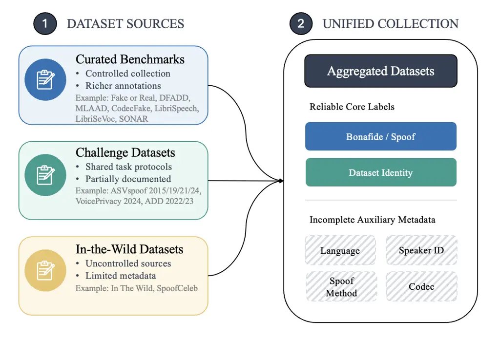
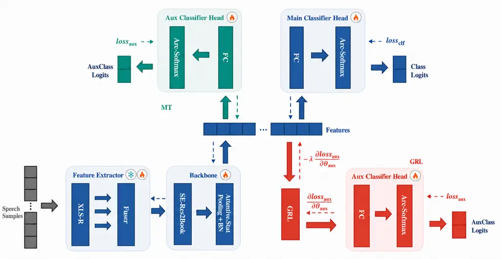
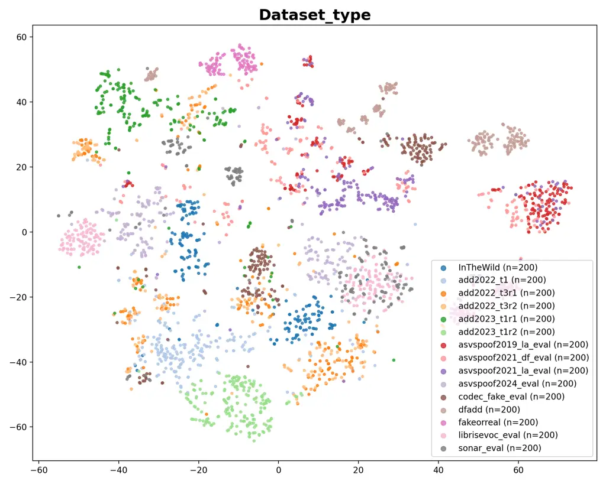
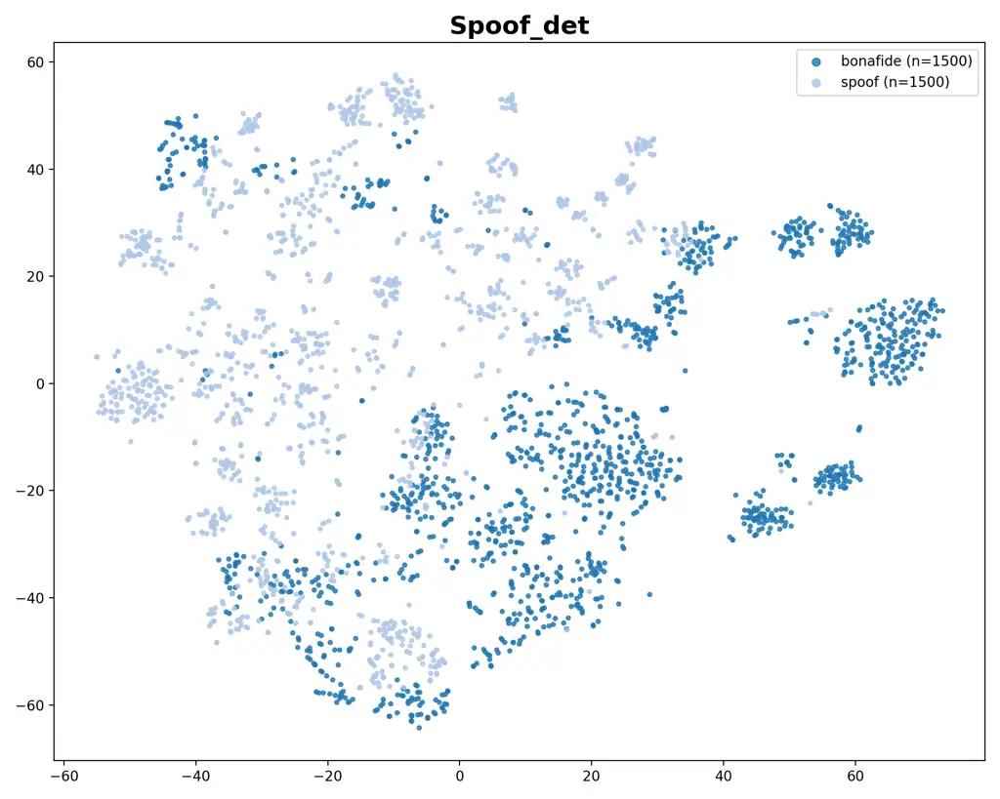
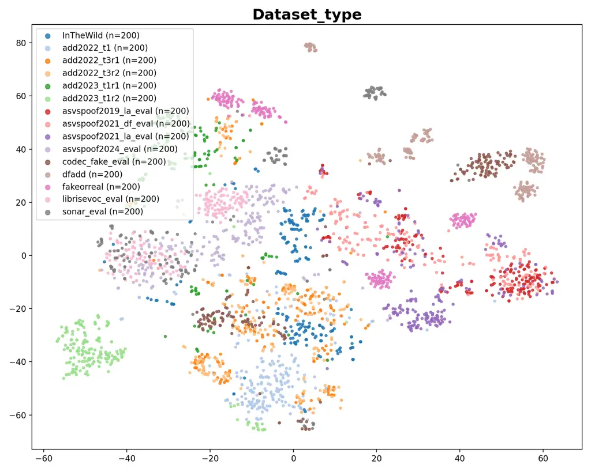
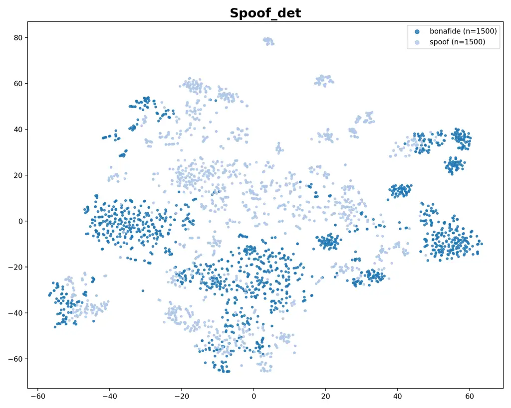
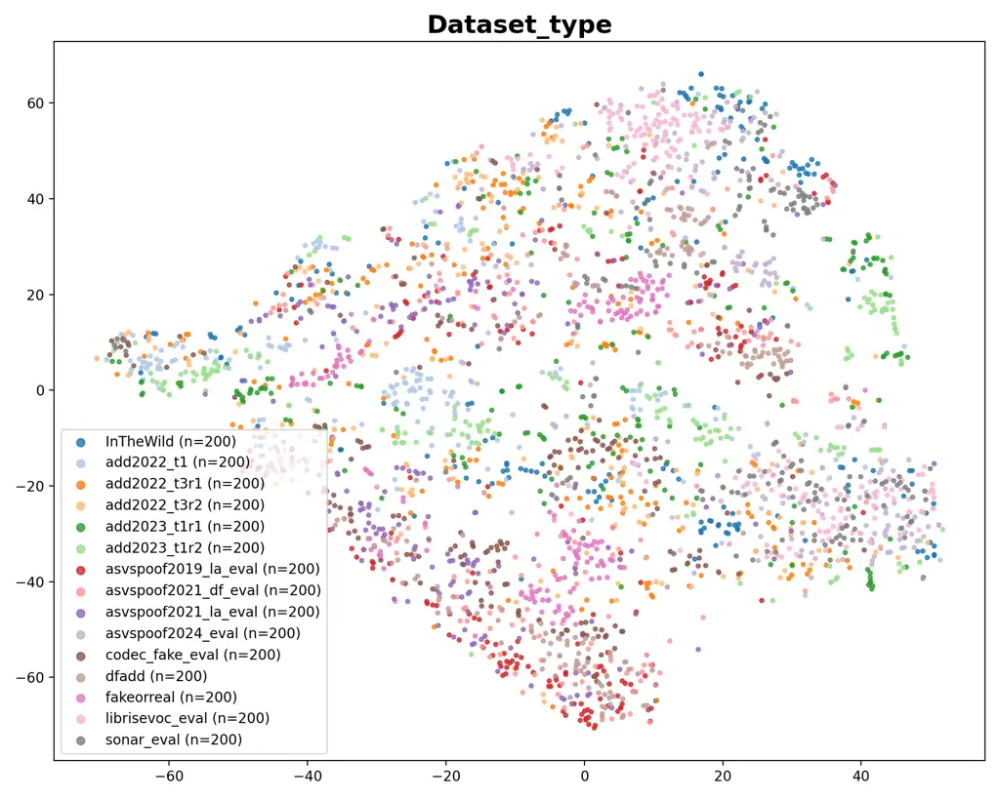
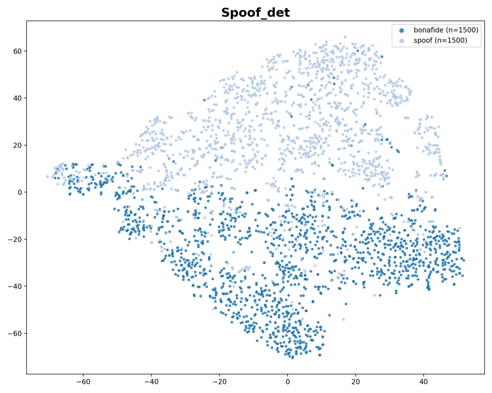

Liang Thebaud Wójciak Moro Velazquez Carmiel Villalba Lopez Dehak

# Leveraging Gradient Reversal Loss and Multitask Learning for Datasets-Aware Audio Deepfake Detection

Mingrui    Thomas    Łukasz    Laureano    Yishay    Jesus    Najim

###### Abstract

Recent advances in speech synthesis and voice conversion, which pose
threats to security and privacy, have underscored the need for deepfake
detection technology. Although existing detection systems achieve strong
performance on individual datasets, they often fail to generalize across
diverse datasets. Prior methods for improving generalization, including
data augmentation, adversarial training on auxiliary factors such as
language or codec types, and Mixture-of-Experts (MoE), are limited by
predefined augmentation coverage, difficulties in obtaining auxiliary
factors, and substantial model complexity. In this work, we propose a
practical dataset-aware framework for deepfake detection. Our method
targets heterogeneous datasets for which auxiliary annotations such as
language, codec, or spoofing method may not be consistently available.
We therefore rely only on dataset identity as a naturally available
supervisory signal for multitask (MT) and gradient reversal layer (GRL)
training, allowing the model to investigate both dataset-aware multitask
supervision and adversarial suppression of dataset-specific information.
We conduct experiments following the 2025 Speech DeepFake Arena
benchmark protocol, evaluating our model across multiple evaluation
datasets and reporting aggregate performance in terms of Equal Error
Rate (EER), including Average EER and Pooled EER. Compared with the
baseline, MT reduces Average EER by 13.14% relatively, while GRL reduces
Pooled EER by 5.32% relatively. These results demonstrate that our
method can improve aggregate detection performance across heterogeneous
evaluation datasets, offering a practical solution for deploying
reliable deepfake detection systems on diverse and unseen real-world
data.

###### keywords

DeepFake detection, speech anti-spoofing, SSL, multitask, GRL

^(†)^(†)address: ¹ Department of Electrical and Computer Engineering,
Johns Hopkins University, USA  
² Meaning, USA ^(†)^(†)email: mliang17@jh.edu, tthebau1@jhu.edu,

Project links:

MT model repository ¹¹ 1
[https://huggingface.co/RuiRuihigh/hyperion-mt-deepfake-detector](https://huggingface.co/RuiRuihigh/hyperion-mt-deepfake-detector)
and GRL model repository²² 2
[https://huggingface.co/RuiRuihigh/hyperion-grl-deepfake-detector](https://huggingface.co/RuiRuihigh/hyperion-grl-deepfake-detector).

## 1 Introduction



Figure 1: Overview of the unified data construction. After aggregating
datasets from diverse sources, only bona fide/spoof labels and dataset
identity remain consistently available across datasets. The Curated,
Challenge, and In-the-Wild categories indicate the primary grouping of
each dataset and are not intended to be strictly mutually exclusive.

With the help of powerful deep neural networks, recent advances in
text-to-speech (TTS) and voice conversion (VC) have significantly
improved the perceptual quality of generated speech. Although this
technique is widely used across domains, such as data enhancement \[1\],
it can also be used for criminal activities, including financial fraud,
political conflict, and impersonation. Therefore, audio deepfake
detection has gradually become an active research field \[2, 3\].
Initially, researchers primarily used handcrafted features, such as CQT,
STFT, and LF, as inputs to classify audio \[4\], achieving excellent
results. Later, as the self-supervised learning (SSL) models become more
and more powerful, people begin to take advantage of them in different
tasks in the speech area, such as automatic speech recognition (ASR)
\[5\], speaker verification (SV) \[6\], and surely audio deepfake
detection (ADD) \[7\]. By leveraging large-scale pretraining corpora and
learning rich representations, SSL models significantly enhance the
robustness and generalization of anti-spoofing systems \[8, 9, 10\].
Currently, state-of-the-art systems typically combine SSL models with
advanced neural backbones \[7\].

Although these systems have achieved remarkable performance in
controlled scenarios \[11, 12\], the challenge of effectively
generalizing their capabilities to unseen data and increasingly
sophisticated speech deepfakes remains critical. This issue is further
complicated by the unique characteristics of the state-of-the-art speech
deepfake datasets, including diverse generation methods, multilingual
data, and varied post-processing, which make them reasonable to consider
as distinct domains.

Currently, the most common approach to address the domain gap is data
augmentation, in which variable masks or codec types are applied to
audio. Another approach is adversarial training with labels such as
language or codec types, which can help the model learn
language-invariant or codec-invariant information \[13, 14, 15\].
Furthermore, MoE provides a natural way to handle domain shift by
routing different experts to process data from their respective domains,
thereby enabling domain-specific specialization. However, these
approaches remain difficult to scale to heterogeneous training data.
Data augmentation is restricted to predefined transformations and may
not cover real-world dataset shifts. Adversarial training based on
language or codec labels requires auxiliary annotations that are often
unavailable or inconsistently defined across datasets, while MoE-based
methods introduce additional model complexity and computational cost.
This annotation issue becomes more evident when datasets from different
sources are combined, as illustrated in Fig. 1. In such a unified
collection, metadata such as language, spoofing method, and codec type
cannot be consistently obtained for all samples. In contrast, bona
fide/spoof labels and dataset identity are reliably available across
datasets, making dataset identity a practical supervisory signal for
mixed-dataset training.

Motivated by this observation, we propose a dataset-aware framework for
training with heterogeneous and unlabeled in-the-wild datasets. At the
same time, our framework leverages the diversity of pooled datasets
without relying on introducing substantial model complexity.
Specifically, in the multitask (MT) learning, we introduce a complex
auxiliary label by combining dataset identity with the spoof/bona fide
label, forming class-conditional dataset labels such as dataset-spoof
and dataset-bona fide. This design ensures that the auxiliary task
remains aligned with the main spoofing detection objective while still
capturing dataset-specific characteristics. For the gradient reversal
layer (GRL) training, we apply dataset identity directly to encourage
the feature extractor to reduce dataset-specific bias. The key
contributions of this work can be summarized as follows:

- •
  Adaptation to in-the-wild datasets: Our framework uses dataset
  identity as a naturally available supervisory signal, avoiding the
  need for auxiliary annotations, which are often unavailable or
  inconsistent across datasets. This makes newly collected or unlabeled
  in-the-wild datasets easier to integrate into mixed-dataset training.
- •
  Dataset-aware supervision: We introduce class-conditional dataset
  labels by combining dataset identity with bona fide/spoof labels.
  Compared with using dataset identity alone, this supervision better
  aligns the auxiliary task with the main spoofing detection objective
  and helps the model capture dataset-specific variations.
- •
  Improved detection with a lightweight single-model framework: Our
  approach achieves a 13.14% relative improvement in Average EER and a
  5.32% relative improvement in Pooled EER, demonstrating stronger
  cross-dataset generalization. Unlike MoE- or ensemble-based methods,
  our framework trains a single detector with 315.4M parameters,
  reducing training and inference complexity while maintaining strong
  performance.



Figure 2: Overview of the proposed framework. The blue modules represent
the baseline detection pipeline. MT consists of the blue modules and the
green auxiliary branch for multitask learning, while GRL consists of the
blue modules and the orange auxiliary branch. The snowflake and flame
icons denote frozen and trainable modules, respectively, with the
feature extractor frozen in Stage 1 and all modules trainable in
Stage 2.

## 2 Related Work

### 2.1 Hand-crafted Feature-based Audio Deepfake Detection

Hand-crafted features (e.g., Mel Spectrogram) are widely used across
many speech-related fields. In preliminary audio deepfake detection
work, these features indeed achieved some remarkable results \[16, 17\].
For example, HM-Conformer \[18\] introduced the hierarchical pooling and
multi-level classification token aggregation into Conformer \[19\],
transferring LFCC to two-class prediction. Additionally, some work used
a combination of a special log-Mel spectrogram and ResNet \[20\] to
address deepfake detection tasks, achieving robust results.

### 2.2 Self-Supervised Learning (SSL) Model-based Audio Deepfake Detection

SSL models are usually pretrained on large amounts of unlabeled speech
data with self-supervised learning techniques. Among these SSL models,
the most popular models are WavLM \[21\], HuBERT \[22\], Wav2Vec2 2.0
\[23\], and XLS-R \[24\]. Compared with hand-crafted features, SSL
models can capture richer and more meaningful speech representations
that can be effectively used in downstream tasks.

Beyond simply obtaining embeddings from the last layers of SSL, recent
work leverages information from multiple layers in SSL models using
various techniques \[25, 26, 27, 28\]. For instance, Zhang et al. \[26\]
leverage Sensitive Layer Select (SLS) to fuse representative layers
automatically, and Guo et al. \[27\] propose using attentive statistic
pooling on every layer in WavLM to improve accuracy.

With SSL models and advanced backbone models (e.g., ECAPA-TDNN \[29\],
BiCrossMamba-ST \[30\], and AASIST \[31\]), researchers can achieve
great results. Given that XLS-R typically achieves more competitive
performance \[32\] and that speaker information can contribute to
classification \[17\], we use the combination of XLS-R and ECAPA-TDNN as
our baseline model.

### 2.3 Domain Generalization and Robustness

Although current models have thousands of parameters and are highly
effective at discriminating real audio from fake audio, they still fall
short in generalization \[4\]. When these models are exposed to unseen
conditions, such as novel spoofing algorithms, cross-dataset variations,
and different recording channels, their performance will decline
markedly.

One way to improve robustness is to introduce data variability by data
augmentation \[33, 34, 35\]. For instance, RawBoost \[35\] enhances
robustness by applying a series of realistic signal-level perturbations
directly to raw waveforms, including channel effects, additive noise,
and nonlinear distortions.

Another direction focuses on learning domain-invariant representations
through multitasking and adversarial domain adaptation. Specifically,
multitasking explicitly retains domain-specific information, whereas
adversarial domain adaptation aims to align feature distributions across
domains by removing domain-specific factors. Previous work has primarily
leveraged auxiliary classifiers and gradient reversal on auxiliary
labels such as language, device, and codec types \[13, 14, 15\].

More recently, model specialization strategies have been explored to
improve generalization. Negroni et al. propose a Mixture-of-Experts
(MoE) framework, where multiple domain-specific detectors are combined
through a gating mechanism to dynamically adapt to different input
conditions \[36\]. This approach leverages domain-specific knowledge and
improves adaptability to diverse datasets.

Despite their effectiveness, these approaches remain limited in
real-world scenarios. Data augmentation improves robustness by
increasing data diversity, but it does not fundamentally address unseen
distributions, as deepfake techniques continue to evolve \[7\]. Existing
MT and adversarial adaptation methods often use auxiliary metadata, such
as language, codec, or synthesis method, as supervision. However, these
labels are frequently unavailable or inconsistently defined across
datasets, limiting their applicability in large-scale mixed-dataset
training. Meanwhile, model specialization approaches such as
Mixture-of-Experts require training multiple large models and additional
gating mechanisms, leading to high computational cost and poor
scalability \[37\]. These limitations highlight the need for more
flexible and efficient approaches for domain generalization.

| Dataset                  | Language     | Total \#utt | Train | Dev | Eval |
| ------------------------ | ------------ | ----------- | ----- | --- | ---- |
| ASVspoof 2015 \[38\]     | English      | 263,151     | ✓     | ✓   |      |
| ASVspoof 2019 \[39\]     | English      | 121,461     | ✓     | ✓   | ✓    |
| ASVspoof 2024 \[40\]     | English      | 1,004,078   | ✓     | ✓   | ✓    |
| Fake or Real \[41\]      | English      | 37,541      | ✓     | ✓   | ✓    |
| DFADD \[42\]             | English      | 191,039     | ✓     | ✓   | ✓    |
| MLAAD \[43\]             | Multilingual | 54,000      | ✓     | ✓   |      |
| Codecfake \[44\]         | English      | 1,172,314   | ✓     | ✓   | ✓    |
| SpoofCeleb \[45\]        | English      | 2,631,551   | ✓     | ✓   |      |
| LibriSpeech \[46\]       | English      | 281,241     | ✓     | ✓   |      |
| VoicePrivacy 2024 \[47\] | English      | 728,098     | ✓     | ✓   |      |
| SONAR \[48\]             | Multilingual | 3,947       | ✓     | ✓   | ✓    |
| LibriSeVoc \[49\]        | English      | 92,407      | ✓     | ✓   | ✓    |
| ASVspoof 2021 \[50\]     | English      | 181,566     |       |     | ✓    |
| In The Wild \[51\]       | English      | 31,779      |       |     | ✓    |
| ADD 2022 \[52\]          | Chinese      | 404,329     |       |     | ✓    |
| ADD 2023 \[53\]          | Chinese      | 285,861     |       |     | ✓    |

Note: Dev denotes the validation split, and Total \#utt denotes the sum
of all available utterances for each dataset. For ADD 2022 and ADD 2023,
all provided tasks and evaluation rounds are included.

Table 1: Summary of the datasets used for training, validation, and
evaluation, including language coverage and the total number of
utterances.

## 3 Method

To make the system robust across scenarios, the key is to enable it to
learn characteristics that are irrelevant to those scenarios, such as
dataset-specific ones. Considering this, we propose two methods to
explicitly allow the system to understand the special information:
multitask (MT) and gradient reversal layer (GRL).

Our baseline builds on the SSL-based spoofing detection framework
explored in \[54\], where SSL front-end representations combined with an
ECAPA-TDNN backbone are shown to be effective for generalizing to unseen
audio data. As shown in the blue modules of Fig. 2, raw audio waveforms
are first processed by an XLS-R encoder to extract high-level
representations. Beyond simply using the encoder’s last layer, we employ
attentive fusion to integrate outputs from multiple encoder layers. The
fused feature is then fed into a convolutional backbone network, where
we modify the ECAPA-TDNN from three SE-Res2Blocks to a single
SE-Res2Block to capture both temporal and frequency-related
dependencies. An attentive statistical pooling layer is applied to
aggregate variable frame-level features into a fixed embedding. Finally,
a fully connected classifier head is used to predict the binary label,
spoof or bona fide. Totally, the whole framework only contains 315.4M
parameters.

### 3.1 Multitask Learning

In MT (the blue and green modules) of Fig. 2, we adopt a multitask
learning strategy to explicitly model dataset-dependent variations. For
each input sample $`x`$, we denote its spoofing label as
$`y\in\{\text{bona fide},\text{spoof}\}`$ and its dataset identity as
$`d`$. Instead of using the dataset identity alone as the auxiliary
label, we construct a class-conditional dataset label:

```math
y_{\text{aux}}^{\text{MT}}=(d,y), \tag{1}
```

which corresponds to labels such as dataset-bona fide and dataset-spoof.

Given an input sample $`x`$, the backbone extracts a feature
representation:

```math
f=\mathcal{F}(x). \tag{2}
```

The main classifier predicts the binary spoofing label:

```math
z_{\text{main}}=\mathcal{C}_{\text{main}}(f), \tag{3}
```

while the auxiliary classifier predicts the class-conditional dataset
label:

```math
z_{\text{aux}}^{\text{MT}}=\mathcal{C}_{\text{aux}}^{\text{MT}}(f). \tag{4}
```

The corresponding losses are:

```math
\mathcal{L}_{\text{main}}=\text{CE}(z_{\text{main}},y), \tag{5}
```

```math
\mathcal{L}_{\text{aux}}^{\text{MT}}=\text{CE}(z_{\text{aux}}^{\text{MT}},y_{\text{aux}}^{\text{MT}}), \tag{6}
```

where $`\text{CE}(\cdot)`$ denotes the cross-entropy loss. The overall
multitask objective is:

```math
\mathcal{L}_{\text{MT}}=\mathcal{L}_{\text{main}}+\lambda_{\text{MT}}\mathcal{L}_{\text{aux}}^{\text{MT}}, \tag{7}
```

where $`\lambda_{\text{MT}}`$ controls the contribution of the auxiliary
task.

This class-conditional auxiliary supervision encourages the
representation to capture dataset-specific variations while remaining
aligned with the main spoofing detection objective. Compared with
predicting dataset identity alone, our proposed label reduces ambiguity
because the auxiliary task is conditioned on the bona fide/spoof
distinction rather than being independent of it.

### 3.2 Gradient Reversal Layer

In GRL (the blue and orange modules) of Fig. 2, we adopt a gradient
reversal layer to learn dataset-invariant representations. Unlike
multitask learning, which encourages the backbone to encode
dataset-related information, GRL discourages the backbone from
preserving information that allows the dataset identity to be predicted.

Given the feature representation:

```math
f=\mathcal{F}(x), \tag{8}
```

we pass it through a GRL before feeding it into the auxiliary dataset
classifier:

```math
\tilde{f}=\text{GRL}(f), \tag{9}
```

```math
z_{\text{aux}}^{\text{GRL}}=\mathcal{C}_{\text{aux}}^{\text{GRL}}(\tilde{f}). \tag{10}
```

For GRL training, the auxiliary label is the dataset identity:

```math
y_{\text{aux}}^{\text{GRL}}=d. \tag{11}
```

The auxiliary loss is therefore:

```math
\mathcal{L}_{\text{aux}}^{\text{GRL}}=\text{CE}(z_{\text{aux}}^{\text{GRL}},d). \tag{12}
```

During the forward pass, the GRL acts as an identity function:

```math
\tilde{f}=\text{GRL}(f)=f. \tag{13}
```

During backpropagation, however, it reverses the gradient passed to the
backbone:

```math
\frac{\partial\mathcal{L}_{\text{aux}}^{\text{GRL}}}{\partial f}=-\frac{\partial\mathcal{L}_{\text{aux}}^{\text{GRL}}}{\partial\tilde{f}}. \tag{14}
```

The training loss is written as:

```math
\mathcal{L}_{\text{GRL}}=\mathcal{L}_{\text{main}}+\lambda_{\text{GRL}}\mathcal{L}_{\text{aux}}^{\text{GRL}}, \tag{15}
```

where $`\lambda_{\text{GRL}}`$ controls the strength of the auxiliary
objective. The adversarial effect is introduced by the GRL during
backpropagation, rather than by explicitly subtracting the auxiliary
loss from the training objective.

Specifically, the auxiliary classifier is optimized normally to predict
the dataset identity. However, for the backbone, the effective gradient
becomes:

```math
\frac{\partial\mathcal{L}_{\text{GRL}}}{\partial\theta_{\mathcal{F}}}=\frac{\partial\mathcal{L}_{\text{main}}}{\partial\theta_{\mathcal{F}}}-\lambda_{\text{GRL}}\frac{\partial\mathcal{L}_{\text{aux}}^{\text{GRL}}}{\partial\theta_{\mathcal{F}}}, \tag{16}
```

where $`\theta_{\mathcal{F}}`$ denotes the parameters of the backbone.

Therefore, the auxiliary classifier learns to identify the dataset
source, while the backbone learns to make this prediction difficult.
This encourages the learned representation to remove
dataset-discriminative information, thereby promoting dataset-invariant
features and improving cross-dataset generalization.

## 4 Experiment

### 4.1 Datasets

We construct a large-scale unified corpus for training and validation by
combining multiple publicly available datasets. The usage of each
dataset across the training, validation, and evaluation splits is
summarized in Table 1. Specifically, for training and validation, we
have ASVspoof 2015, ASVspoof 2019, ASVspoof 2024, Fake or Real, DFADD,
MLAAD, Codecfake, Spoofceleb, Librispeech, VoicePrivacy 2024, SONAR and
LibriSeVoc. These corpora cover diverse spoofing techniques, recording
conditions, speaker characteristics, and languages, providing broad
supervision for robust speech deepfake detection.

The resulting training subset contains 7,325.65 hours of audio and
4,859,430 utterances in total. Among them, 4,198,675 are spoof samples
and 660,755 are bona fide samples, accounting for 86.4% and 13.6% of the
training utterances, respectively.

For evaluation, we follow the benchmark protocol of the 2025 Speech
Deepfake Arena \[55\], where the evaluation datasets include In The
Wild, ASVspoof 2019, ASVspoof 2021, ASVspoof 2024, Fake or Real,
Codecfake, ADD 2022, ADD 2023, DFADD, LibriSeVoc, and SONAR. The
evaluation suite consists of multiple in-domain and out-of-domain test
sets, enabling a comprehensive assessment of model generalization across
heterogeneous speech deepfake scenarios.

### 4.2 Auxiliary Labels

In this work, the design of auxiliary labels plays a crucial role in
guiding the learning behavior of different components in our framework.
For multitask learning, we construct auxiliary labels by combining
dataset identity with spoof/bona fide annotations, forming joint labels
of the form dataset $`\times`$ spoof/bona fide. As a result, the model
is encouraged to learn distinctions across datasets and spoofing
conditions, thereby enhancing its discriminative capability in
multi-domain scenarios. In contrast, for the GRL-based method, we employ
only the dataset identity as the auxiliary label. The motivation is that
GRL aims to learn domain-invariant representations. If spoof/bona fide
information is also included in the auxiliary labels, the adversarial
training may remove useful cues for spoof detection. Therefore, we use
dataset-only labels so that GRL focuses on eliminating domain
differences while preserving spoof-related information.

### 4.3 Training Setup

We adopt a two-stage training strategy to stabilize optimization and
improve representation learning.

Data processing. For both stages, we apply data augmentation including
reverberation and noise perturbation, with up to six augmented variants
per sample. Training samples are generated using a class-weighted random
segment sampler with a fixed chunk length of 2 seconds, ensuring
balanced sampling across different datasets. For validation, we use a
bucketing sampler to handle variable-length inputs efficiently.

Stage 1. In the first stage, we freeze the SSL feature extractor and
train only the fuser, downstream backbone, and classifiers, which allows
the model to learn stable representations without disrupting the
pretrained features. During this stage, we use stochastic gradient
descent (SGD) with a relatively large learning rate (0.4) and
exponential decay scheduling. The effective batch size is set to 1024,
and the model is trained with mixed-precision training.

Stage 2. In the second stage, we unfreeze the entire model and perform
full training. The learning rate is reduced to $`5\times 10^{-3}`$ with
a similar exponential decay schedule to ensure stable optimization. The
effective batch size is set to 512, and we adopt the additive angular
margin softmax (AAM-Softmax) loss with scale $`s=32`$ and margin
$`m=0.2`$ for the main classification task.

In both stages, the auxiliary classifier or adapter is trainable, and we
employ early stopping to prevent overfitting. Additionally, for both MT
and GRL, we set the auxiliary loss weight $`\lambda`$ to 0.1 based on
preliminary experiments on a smaller development subset.

|                  |          |        |        |
| ---------------- | -------- | ------ | ------ |
| Dataset          | Baseline | MT     | GRL    |
| In the Wild      | 5.211    | 4.778  | 3.062  |
| ASV2019          | 5.850    | 1.526  | 4.453  |
| ASV2021LA        | 10.940   | 6.986  | 13.712 |
| ASV2021DF        | 5.261    | 4.041  | 5.043  |
| ASV2024-EVAL     | 13.263   | 14.371 | 13.538 |
| Fake or Real     | 1.428    | 0.057  | 4.583  |
| Codecfake        | 19.990   | 15.084 | 18.980 |
| ADD 2022 Track 1 | 23.951   | 21.912 | 22.570 |
| ADD 2022 Track 3 | 5.275    | 4.535  | 5.718  |
| ADD 2023 R1      | 15.978   | 19.967 | 18.389 |
| ADD 2023 R2      | 23.935   | 21.233 | 18.290 |
| DFADD            | 0.747    | 0.095  | 0.214  |
| LibriSeVoc       | 0.056    | 0.116  | 0.662  |
| SONAR            | 0.885    | 0.632  | 2.097  |
| Average EER      | 9.484    | 8.238  | 9.379  |
| Pooled EER       | 12.596   | 13.050 | 11.926 |

Note: ASV2019 denotes ASVspoof 2019; ASV2021LA and ASV2021DF denote the
LA and DF tracks of ASVspoof 2021, respectively; ASV2024-EVAL denotes
the evaluation set of ASVspoof 2024.

Table 2: Evaluation results on the 2025 Speech Deepfake Arena benchmark.
Results are reported in terms of EER (%), where lower is better. The MT
system uses Dataset Type $`\times`$ Spoof Detection labels as auxiliary
supervision, while the GRL system uses Dataset Type labels for
adversarial training.

|                          |            |        |        |
| ------------------------ | ---------- | ------ | ------ |
| System                   | Params (M) | Avg.   | Pooled |
| DF_Arena_1B_V_1 \[56\]   | 1000       | 5.919  | 9.524  |
| DF_Arena_500M_V_1 \[56\] | 500        | 5.780  | 10.880 |
| XLSR+SLS \[26\]          | 340        | 14.015 | 16.079 |
| TCM \[57\]               | 319        | 15.846 | 16.691 |
| BiCrossMamba-ST \[30\]   | 318.2      | 15.778 | 17.154 |
| Nes2NetX \[58\]          | 317.9      | 16.186 | 17.366 |
| Wav2Vec2_AASIST \[10\]   | 317.8      | 18.138 | 19.607 |
| XLSR_Mamba \[59\]        | 319        | 14.647 | 20.591 |
| Whisper_Mesonet \[60\]   | 7.6        | 28.355 | 23.551 |
| MT (Ours)                | 315.4      | 8.238  | 13.050 |
| GRL (Ours)               | 315.4      | 9.379  | 11.926 |

Table 3: Comparison with top-performing open systems on the 2025 Speech
Deepfake Arena benchmark. Params denotes the number of parameters in
millions. Results are reported as EER (%), where lower is better. The
best, second-best, and third-best results are indicated by bold,
italics, and underline, respectively.

|              |        |                 |        |        |
| ------------ | ------ | --------------- | ------ | ------ |
| Dataset      | MT     |                 | GRL    |        |
|              | D      | D$`\times`$S    | Lang.  | D      |
| In the Wild  | 3.072  | 4.778           | 3.276  | 3.062  |
| ASV2019      | 7.518  | 1.526           | 9.353  | 4.453  |
| ASV2021LA    | 16.037 | 6.986           | 15.697 | 13.712 |
| ASV2021DF    | 5.706  | 4.041           | 4.644  | 5.043  |
| ASV24-EVAL   | 13.506 | 14.371          | 11.512 | 13.538 |
| Fake or Real | 1.165  | 0.057           | 2.289  | 4.583  |
| Codecfake    | 17.655 | 15.084          | 24.398 | 18.980 |
| ADD22-T1     | 28.283 | 21.912          | 24.347 | 22.570 |
| ADD22-T3     | 5.312  | 4.535           | 6.176  | 5.718  |
| ADD 2023 R1  | 16.101 | 19.967          | 20.745 | 18.389 |
| ADD 2023 R2  | 26.695 | 21.233          | 29.856 | 18.290 |
| DFADD        | 0.000  | 0.095           | 1.305  | 0.214  |
| LibriSeVoc   | 0.038  | 0.116           | 0.049  | 0.662  |
| SONAR        | 0.862  | 0.632           | 3.034  | 2.097  |
| Average EER  | 10.139 | 8.238           | 11.192 | 9.379  |
| Pooled EER   | 14.762 | 13.050          | 12.939 | 11.926 |

Note: D denotes Dataset, S denotes Spoof_det, and Lang. denotes
Language. ASV2019: ASVspoof 2019; ASV2021LA & ASV2021DF: the LA and DF
tracks of ASVspoof 2021, respectively; ASV24-EVAL: the evaluation set of
ASVspoof 2024; ADD22-T1: ADD 2022 Track 1; ADD22-T3: ADD 2022 Track 3.

Table 4: Ablation study on auxiliary label design. Results are reported
in terms of EER (%), where lower is better. The best result within each
method group is shown in bold.





(a) Baseline





(b) MT





(c) GRL

“‘

Figure 3: t-SNE visualization of learned embeddings under different
training strategies. Each row corresponds to one model configuration:
Baseline, MT, and GRL. Within each row, the two panels show the same
embedding space colored by Dataset_type labels and Spoof_det labels,
respectively.

## 5 Results and Analysis

### 5.1 MT & GRL Results

Table 2 presents the evaluation results of the baseline, multitask
learning (MT), and gradient reversal layer (GRL) methods on the 2025
Speech Deepfake Arena benchmark. Overall, MT achieves the best Average
EER, reducing the baseline from 9.484% to 8.238%, corresponding to a
relative improvement of 13.14%. This indicates that explicitly
introducing auxiliary domain-related supervision improves the average
detection performance across diverse evaluation datasets.

At the dataset level, MT obtains the best performance on 9 out of 14
evaluation subsets, including ASVspoof 2019, ASVspoof 2021LA, ASVspoof
2021DF, Fake or Real, Codecfake, ADD 2022 Track 1, ADD 2022 Track 3,
DFADD, and SONAR. In particular, MT leads to substantial improvements on
several challenging subsets, such as ASVspoof 2019, where the EER
decreases from 5.850% to 1.526%, and Fake or Real, where the EER
decreases from 1.428% to 0.057%. These results suggest that the MT
objective can effectively exploit dataset-level supervision to improve
generalization across diverse evaluation datasets.

Compared with MT, GRL shows a different behavior. Although GRL does not
achieve the best Average EER, it obtains the best Pooled EER, reducing
the baseline from 12.596% to 11.926%, corresponding to a relative
improvement of 5.32%. GRL also achieves the best result on In the Wild
and ADD 2023 R2. This suggests that GRL may be more beneficial when
aggregating trials across datasets under a shared decision threshold,
potentially due to improved cross-dataset score consistency.

Table 3 further compares our systems with top-performing open systems on
the 2025 Speech Deepfake Arena leaderboard. Among the open systems
summarized in the table, MT achieves the third-best Average EER, while
GRL achieves the third-best Pooled EER. Notably, the two systems that
outperform ours use substantially larger models, with 500M and 1000M
parameters, whereas our MT and GRL systems use 315.4M parameters. This
comparison suggests that the proposed training strategies provide a
favorable trade-off between detection performance and model size,
achieving competitive leaderboard performance without relying on
substantially larger model capacity.

These observations reveal distinct performance profiles for MT and GRL.
MT improves the average performance across individual datasets through
explicit, dataset-aware auxiliary supervision, whereas GRL yields better
pooled performance under an objective designed to reduce
dataset-specific information. Therefore, MT is more effective in
improving the macro-average of per-dataset EERs, whereas GRL can be
advantageous for pooled evaluation across heterogeneous datasets.

### 5.2 Visualization Analysis

Fig. 3 shows the t-SNE visualization of the learned embeddings extracted
after the backbone pooling layer. For each training strategy, the two
panels in the same row correspond to the same embedding space, but are
colored according to Dataset_type, which denotes the source dataset
category, and Spoof_det labels, which denotes the binary bona fide/spoof
label, respectively. The visualized samples are drawn from the
evaluation split, with an equal number of bona fide and spoof samples
sampled from each dataset. This visualization provides qualitative
evidence for how different training objectives affect the structure of
the learned representation.

For the baseline model, the embeddings exhibit noticeable
dataset-dependent clustering. Samples from the same dataset tend to
occupy similar local regions, indicating that the baseline
representation contains strong dataset-specific information. However,
when colored by Spoof_det labels, bona fide and spoof samples are not
clearly separated into two global clusters. This suggests that the
baseline model may partially rely on dataset-related biases rather than
learning purely spoof-discriminative cues.

Compared with the baseline, MT produces a more structured feature space
with respect to Dataset_type labels. Samples from the same dataset form
clearer local clusters, which is consistent with the design of the MT
objective. Since MT explicitly introduces an auxiliary task to model
dataset-related information, the backbone is encouraged to preserve
domain-dependent variations. Meanwhile, the Spoof_det visualization
shows that MT does not simply force all bona fide and spoof samples into
two global clusters. Instead, it appears to learn more fine-grained
spoof-discriminative structures within different dataset regions. This
observation is consistent with the quantitative results in Table 2,
where MT achieves the best Average EER and performs best on most
individual evaluation subsets.

In contrast, GRL leads to a substantially more mixed embedding space
across datasets. In the Dataset_type visualization, samples from
different datasets are more entangled, and the dataset-specific clusters
observed in the baseline and MT settings become less pronounced. This
indicates that the adversarial objective imposed by GRL suppresses
dataset-discriminative information from the backbone representation. As
a result, GRL encourages a more domain-invariant feature space, where
samples from heterogeneous datasets are better aligned. In the Spoof_det
visualization, GRL also shows a more globally organized bona fide/spoof
structure, suggesting that reducing dataset separability can help the
model focus on spoof-related information shared across datasets. This is
consistent with the Pooled EER results in Table 2, where GRL achieves
the best pooled performance.

Overall, the visualization reveals a clear difference between the two
strategies. MT learns domain-aware representations by explicitly
modeling dataset-specific variations, which benefits per-dataset
performance. GRL, on the other hand, learns domain-invariant
representations by reducing dataset separability, which improves global
generalization under heterogeneous evaluation conditions. These
qualitative findings support the complementary behavior observed in the
quantitative results.

### 5.3 Ablation Study Result

Table 4 presents the ablation study on different auxiliary label designs
for MT and GRL. For MT, we compare two auxiliary supervision strategies:
dataset-only labels and Dataset_type $`\times`$ Spoof_det labels. For
GRL, we compare language-based adversarial labels with dataset-based
adversarial labels.

While prior MT-based studies typically use a single auxiliary label,
such as language or codec type, our Dataset_type $`\times`$ Spoof_det
design jointly encodes dataset identity and bona fide/spoof information.
We therefore compare it with a dataset-only label design to verify the
benefit of this combined auxiliary supervision. As shown in Table 4,
using Dataset_type $`\times`$ Spoof_det labels consistently outperforms
using dataset-only labels on most evaluation subsets. Specifically,
Dataset_type $`\times`$ Spoof_det achieves better results on 9 out of 14
datasets and reduces the Average EER from 10.139% to 8.238%. The
improvement is especially clear on ASVspoof 2019, Fake or Real, and ADD
2023 R2, where incorporating spoof/bona fide information into the
auxiliary label provides substantially stronger supervision. These
results indicate that simply modeling dataset identity is not sufficient
for MT. Instead, combining dataset identity with spoof_det labels allows
the auxiliary task to capture both domain variation and spoof-related
distribution differences, leading to more discriminative
representations.

For the GRL setting, we further investigate the choice of adversarial
labels. Previous studies have also explored using language or
codec-related attributes as auxiliary labels for adversarial training.
However, these settings are usually conducted on one or two datasets
where such auxiliary annotations are naturally available. In contrast,
our training setup mixes multiple datasets collected from different
sources, making it difficult to obtain consistent language or codec
labels for all samples. In particular, codec-type annotations are not
reliably available in our collected training data. Therefore, we focus
on comparing dataset-based adversarial labels with language-based
adversarial labels. To construct the language labels, we use a
pre-trained VoxLingua107 ECAPA-TDNN spoken language identification
model³³ 3
[https://huggingface.co/speechbrain/lang-id-voxlingua107-ecapa](https://huggingface.co/speechbrain/lang-id-voxlingua107-ecapa)
from SpeechBrain \[61\] to predict the language of each training sample.
This model achieves an error rate of 6.7% on the VoxLingua107
development set, providing reasonably reliable language predictions for
constructing pseudo language labels at scale. The predicted language
labels are then used as pseudo labels for the GRL auxiliary classifier.

As shown in Table 4, dataset-based adversarial training achieves better
aggregate performance than language-based adversarial training. GRL with
dataset labels also performs better across most individual datasets.
Compared with language labels, it reduces the Average EER from 11.192%
to 9.379% and the Pooled EER from 12.939% to 11.926%, corresponding to
relative reductions of 16.20% and 7.83%, respectively. This suggests
that dataset identity provides a more effective adversarial signal than
language identity for encouraging domain-invariant feature learning in
this benchmark. Since the evaluation datasets differ not only in
language but also in recording conditions, spoofing algorithms, data
collection protocols, and corpus-specific artifacts, dataset labels can
capture broader domain discrepancies than language labels alone.

## 6 Conclusion

In this work, we propose a dataset-aware framework to improve audio
deepfake detection across heterogeneous evaluation settings. Instead of
relying on auxiliary annotations such as language, codec, or spoofing
method, which are often unavailable or inconsistent across datasets, our
method uses dataset identity as a naturally available supervisory
signal. Based on this idea, we explore two distinct strategies:
multitask learning with Dataset_type $`\times`$ Spoof_det labels and
adversarial training with dataset-based GRL.

Experimental results on the 2025 Speech Deepfake Arena benchmark show
distinct performance gains for MT and GRL under Average EER and Pooled
EER, respectively. MT achieves the best Average EER, reducing it from
9.484% to 8.238%, while GRL achieves the best Pooled EER, reducing it
from 12.596% to 11.926%. The t-SNE visualization qualitatively suggests
that MT encourages domain-aware representations, whereas GRL promotes
more domain-invariant feature alignment. In addition, the ablation study
confirms that Dataset_type $`\times`$ Spoof_det labels are more
effective than dataset-only labels for MT, and dataset labels provide a
stronger adversarial signal than language pseudo labels for GRL.

Overall, these results show that dataset identity can serve as a simple
and effective supervisory signal for improving aggregate detection
performance across heterogeneous evaluation datasets.

## 7 Limitation & Future Work

Despite the promising results, this work still has several limitations.
First, MT and GRL are investigated as two separate strategies. As shown
in the results, MT achieves better Average EER by learning domain-aware
representations, while GRL achieves better Pooled EER by encouraging
domain-invariant representations. However, we have not yet developed a
unified framework that can effectively combine these two complementary
behaviors.

Second, our experiments are conducted based on one backbone
architecture. Although the proposed auxiliary label designs improve
performance in this setting, it remains unclear whether the same MT and
GRL modules can consistently benefit other deepfake detection backbones,
such as different SSL encoders, pooling strategies, or classifier
architectures.

For future work, we plan to explore a unified training objective that
jointly leverages the strengths of MT and GRL, allowing the model to
adaptively balance domain-aware and domain-invariant learning. In
addition, we will evaluate the proposed dataset-aware training
strategies on more backbone architectures to verify their general
applicability and robustness across different model designs.

## 8 Acknowledgments

This work was supported in part by computational resources provided by
the Center for Language and Speech Processing (CLSP) at Johns Hopkins
University. We thank Jan Vainer from Meaning for his helpful assistance.

## 9 Generative AI Use Disclosure

The author used generative AI tools to assist with language polishing,
grammar correction, writing organization, and LaTeX formatting. All
research ideas, experimental design, implementation, data analysis,
results, and conclusions were developed and finalized by the author. The
author takes full responsibility for the content of this work.

## References

- \[1\] K. C. Yuen, L. Haoyang, and C. E. Siong (2023) Asr model
  adaptation for rare words using synthetic data generated by multiple
  text-to-speech systems. In 2023 Asia Pacific Signal and Information
  Processing Association Annual Summit and Conference (APSIPA ASC),
  pp. 1771–1778. Cited by: §1.
- \[2\] H. Wu, J. Kang, L. Meng, H. Meng, and H. Lee (2023) The
  defender’s perspective on automatic speaker verification: an overview.
  arXiv preprint arXiv:2305.12804. Cited by: §1.
- \[3\] A. Khan, K. M. Malik, J. Ryan, and M. Saravanan (2022) Voice
  spoofing countermeasures: taxonomy, state-of-the-art, experimental
  analysis of generalizability, open challenges, and the way forward.
  arXiv preprint arXiv:2210.00417. Cited by: §1.
- \[4\] L. Pham, P. Lam, D. Tran, H. Tang, T. Nguyen, A. Schindler, F.
  Skopik, A. Polonsky, and H. C. Vu (2025) A comprehensive survey with
  critical analysis for deepfake speech detection. Computer Science
  Review 57, pp. 100757. Cited by: §1, §2.3.
- \[5\] J. Zhao and W. Zhang (2022) Improving automatic speech
  recognition performance for low-resource languages with
  self-supervised models. IEEE Journal of Selected Topics in Signal
  Processing 16 (6), pp. 1227–1241. Cited by: §1.
- \[6\] J. Jung, W. Zhang, J. Shi, Z. Aldeneh, T. Higuchi, B.
  Theobald, A. H. Abdelaziz, and S. Watanabe (2024) ESPnet-spk: full
  pipeline speaker embedding toolkit with reproducible recipes,
  self-supervised front-ends, and off-the-shelf models. arXiv preprint
  arXiv:2401.17230. Cited by: §1.
- \[7\] M. Li, Y. Ahmadiadli, and X. Zhang (2025) A survey on speech
  deepfake detection. ACM Computing Surveys 57 (7), pp. 1–38. Cited by:
  §1, §2.3.
- \[8\] X. Chen, H. Wu, J. R. Jang, and H. Lee (2024) Singing voice
  graph modeling for singfake detection. arXiv preprint
  arXiv:2406.03111. Cited by: §1.
- \[9\] Y. Zhu, S. Koppisetti, T. Tran, and G. Bharaj (2024) Slim:
  style-linguistics mismatch model for generalized audio deepfake
  detection. Advances in Neural Information Processing Systems 37,
  pp. 67901–67928. Cited by: §1.
- \[10\] H. Tak, M. Todisco, X. Wang, J. Jung, J. Yamagishi, and N.
  Evans (2022) Automatic speaker verification spoofing and deepfake
  detection using wav2vec 2.0 and data augmentation. arXiv preprint
  arXiv:2202.12233. Cited by: §1, Table 3.
- \[11\] Y. Yang, H. Qin, H. Zhou, C. Wang, T. Guo, K. Han, and Y.
  Wang (2024) A robust audio deepfake detection system via multi-view
  feature. In ICASSP 2024-2024 IEEE International Conference on
  Acoustics, Speech and Signal Processing (ICASSP), pp. 13131–13135.
  Cited by: §1.
- \[12\] L. Li, T. Lu, X. Ma, M. Yuan, and D. Wan (2023) Voice deepfake
  detection using the self-supervised pre-training model hubert. Applied
  sciences 13 (14), pp. 8488. Cited by: §1.
- \[13\] X. Chen, Y. Zhang, G. Zhu, and Z. Duan (2021) UR channel-robust
  synthetic speech detection system for asvspoof 2021. arXiv preprint
  arXiv:2107.12018. Cited by: §1, §2.3.
- \[14\] Z. Ba, Q. Wen, P. Cheng, Y. Wang, F. Lin, L. Lu, and Z.
  Liu (2023) Transferring audio deepfake detection capability across
  languages. In Proceedings of the ACM Web Conference 2023,
  pp. 2033–2044. Cited by: §1, §2.3.
- \[15\] Y. Zhang, G. Zhu, F. Jiang, and Z. Duan (2021) An empirical
  study on channel effects for synthetic voice spoofing countermeasure
  systems. arXiv preprint arXiv:2104.01320. Cited by: §1, §2.3.
- \[16\] J. Deng, Y. Ren, T. Zhang, H. Zhu, and Z. Sun (2024) Vfd-net:
  vocoder fingerprints detection for fake audio. In ICASSP 2024-2024
  IEEE International Conference on Acoustics, Speech and Signal
  Processing (ICASSP), pp. 12151–12155. Cited by: §2.1.
- \[17\] Y. Zhang, Z. Li, J. Lu, W. Wang, and P. Zhang (2023) Synthetic
  speech detection based on temporal consistency and distribution of
  speaker features. arXiv preprint arXiv:2309.16954. Cited by: §2.1,
  §2.2.
- \[18\] H. Shin, J. Heo, J. Kim, C. Lim, W. Kim, and H. Yu (2024)
  Hm-conformer: a conformer-based audio deepfake detection system with
  hierarchical pooling and multi-level classification token aggregation
  methods. In ICASSP 2024-2024 IEEE International Conference on
  Acoustics, Speech and Signal Processing (ICASSP), pp. 10581–10585.
  Cited by: §2.1.
- \[19\] A. Gulati, J. Qin, C. Chiu, N. Parmar, Y. Zhang, J. Yu, W.
  Han, S. Wang, Z. Zhang, Y. Wu, et al. (2020) Conformer:
  convolution-augmented transformer for speech recognition. arXiv
  preprint arXiv:2005.08100. Cited by: §2.1.
- \[20\] Y. Gao, T. Vuong, M. Elyasi, G. Bharaj, and R. Singh (2021)
  Generalized spoofing detection inspired from audio generation
  artifacts. arXiv preprint arXiv:2104.04111. Cited by: §2.1.
- \[21\] S. Chen, C. Wang, Z. Chen, Y. Wu, S. Liu, Z. Chen, J. Li, N.
  Kanda, T. Yoshioka, X. Xiao, et al. (2022) Wavlm: large-scale
  self-supervised pre-training for full stack speech processing. IEEE
  Journal of Selected Topics in Signal Processing 16 (6), pp. 1505–1518.
  Cited by: §2.2.
- \[22\] W. Hsu, B. Bolte, Y. H. Tsai, K. Lakhotia, R. Salakhutdinov,
  and A. Mohamed (2021) Hubert: self-supervised speech representation
  learning by masked prediction of hidden units. IEEE/ACM transactions
  on audio, speech, and language processing 29, pp. 3451–3460. Cited by:
  §2.2.
- \[23\] A. Baevski, Y. Zhou, A. Mohamed, and M. Auli (2020) Wav2vec
  2.0: a framework for self-supervised learning of speech
  representations. Advances in neural information processing systems 33,
  pp. 12449–12460. Cited by: §2.2.
- \[24\] A. Babu, C. Wang, A. Tjandra, K. Lakhotia, Q. Xu, N. Goyal, K.
  Singh, P. Von Platen, Y. Saraf, J. Pino, et al. (2021) XLS-r:
  self-supervised cross-lingual speech representation learning at scale.
  arXiv preprint arXiv:2111.09296. Cited by: §2.2.
- \[25\] A. Kulkarni, S. Dowerah, A. Kulkarni, T. Alumäe, and M. M.
  Doss (2026) Do compact ssl backbones matter for audio deepfake
  detection? a controlled study with raptor. arXiv preprint
  arXiv:2603.06164. Cited by: §2.2.
- \[26\] Q. Zhang, S. Wen, and T. Hu (2024) Audio deepfake detection
  with self-supervised xls-r and sls classifier. In Proceedings of the
  32nd ACM International Conference on Multimedia, pp. 6765–6773. Cited
  by: §2.2, Table 3.
- \[27\] Y. Guo, H. Huang, X. Chen, H. Zhao, and Y. Wang (2024) Audio
  deepfake detection with self-supervised wavlm and multi-fusion
  attentive classifier. In ICASSP 2024-2024 IEEE International
  Conference on Acoustics, Speech and Signal Processing (ICASSP),
  pp. 12702–12706. Cited by: §2.2.
- \[28\] Y. El Kheir, Y. Samih, S. Maharjan, T. Polzehl, and S.
  Möller (2025) Comprehensive layer-wise analysis of ssl models for
  audio deepfake detection. In Findings of the Association for
  Computational Linguistics: NAACL 2025, pp. 4070–4082. Cited by: §2.2.
- \[29\] B. Desplanques, J. Thienpondt, and K. Demuynck (2020)
  Ecapa-tdnn: emphasized channel attention, propagation and aggregation
  in tdnn based speaker verification. arXiv preprint arXiv:2005.07143.
  Cited by: §2.2.
- \[30\] Y. E. Kheir, T. Polzehl, and S. Möller (2025) BiCrossMamba-st:
  speech deepfake detection with bidirectional mamba spectro-temporal
  cross-attention. arXiv preprint arXiv:2505.13930. Cited by: §2.2,
  Table 3.
- \[31\] J. Jung, H. Heo, H. Tak, H. Shim, J. S. Chung, B. Lee, H. Yu,
  and N. Evans (2022) Aasist: audio anti-spoofing using integrated
  spectro-temporal graph attention networks. In ICASSP 2022-2022 IEEE
  international conference on acoustics, speech and signal processing
  (ICASSP), pp. 6367–6371. Cited by: §2.2.
- \[32\] H. Ali, N. S. Adupa, S. Subramani, and H. Malik (2026) A
  superb-style benchmark of self-supervised speech models for audio
  deepfake detection. arXiv preprint arXiv:2603.01482. Cited by: §2.2.
- \[33\] M. Korvas, O. Plátek, O. Dušek, L. Žilka, and F.
  Jurčíček (2014) Free English and Czech telephone speech corpus shared
  under the CC-BY-SA 3.0 license. In Proceedings of the Eigth
  International Conference on Language Resources and Evaluation (LREC
  2014), pp. To Appear. Cited by: §2.3.
- \[34\] D. Snyder, G. Chen, and D. Povey (2015) Musan: a music, speech,
  and noise corpus. arXiv preprint arXiv:1510.08484. Cited by: §2.3.
- \[35\] H. Tak, M. Kamble, J. Patino, M. Todisco, and N. Evans (2022)
  Rawboost: a raw data boosting and augmentation method applied to
  automatic speaker verification anti-spoofing. In ICASSP 2022-2022 IEEE
  International Conference on Acoustics, Speech and Signal Processing
  (ICASSP), pp. 6382–6386. Cited by: §2.3.
- \[36\] V. Negroni, D. Salvi, A. I. Mezza, P. Bestagini, and S.
  Tubaro (2025) Leveraging mixture of experts for improved speech
  deepfake detection. In ICASSP 2025-2025 IEEE International Conference
  on Acoustics, Speech and Signal Processing (ICASSP), pp. 1–5. Cited
  by: §2.3.
- \[37\] Y. Feng, B. Shen, N. Gu, J. Zhao, P. Fu, Z. Lin, and W.
  Wang (2025) Dive into moe: diversity-enhanced reconstruction of large
  language models from dense into mixture-of-experts. In Proceedings of
  the 63rd Annual Meeting of the Association for Computational
  Linguistics (Volume 1: Long Papers), pp. 19375–19394. Cited by: §2.3.
- \[38\] Z. Wu, J. Yamagishi, T. Kinnunen, C. Hanilçi, M. Sahidullah, A.
  Sizov, N. Evans, M. Todisco, and H. Delgado (2017) ASVspoof: the
  automatic speaker verification spoofing and countermeasures challenge.
  IEEE Journal of Selected Topics in Signal Processing 11 (4),
  pp. 588–604. Cited by: Table 1.
- \[39\] M. Todisco, X. Wang, V. Vestman, M. Sahidullah, H. Delgado, A.
  Nautsch, J. Yamagishi, N. Evans, T. Kinnunen, and K. A. Lee (2019)
  ASVspoof 2019: future horizons in spoofed and fake audio detection.
  arXiv preprint arXiv:1904.05441. Cited by: Table 1.
- \[40\] X. Wang, H. Delgado, H. Tak, J. Jung, H. Shim, M. Todisco, I.
  Kukanov, X. Liu, M. Sahidullah, T. Kinnunen, et al. (2024) ASVspoof 5:
  crowdsourced speech data, deepfakes, and adversarial attacks at scale.
  arXiv preprint arXiv:2408.08739. Cited by: Table 1.
- \[41\] R. Reimao and V. Tzerpos (2019) FoR: a dataset for synthetic
  speech detection.. In SpeD, pp. 1–10. Cited by: Table 1.
- \[42\] J. Du, I. Lin, I. Chiu, X. Chen, H. Wu, W. Ren, Y. Tsao, H.
  Lee, and J. R. Jang (2024) Dfadd: the diffusion and flow-matching
  based audio deepfake dataset. In 2024 IEEE Spoken Language Technology
  Workshop (SLT), pp. 921–928. Cited by: Table 1.
- \[43\] N. M. Müller, P. Kawa, W. H. Choong, E. Casanova, E. Gölge, T.
  Müller, P. Syga, P. Sperl, and K. Böttinger (2024) Mlaad: the
  multi-language audio anti-spoofing dataset. In 2024 International
  Joint Conference on Neural Networks (IJCNN), pp. 1–7. Cited by: Table
  1.
- \[44\] Y. Xie, Y. Lu, R. Fu, Z. Wen, Z. Wang, J. Tao, X. Qi, X.
  Wang, Y. Liu, H. Cheng, et al. (2025) The codecfake dataset and
  countermeasures for the universally detection of deepfake audio. IEEE
  Transactions on Audio, Speech and Language Processing 33, pp. 386–400.
  Cited by: Table 1.
- \[45\] J. Jung, Y. Wu, X. Wang, J. Kim, S. Maiti, Y. Matsunaga, H.
  Shim, J. Tian, N. Evans, J. S. Chung, et al. (2025) Spoofceleb: speech
  deepfake detection and sasv in the wild. IEEE Open Journal of Signal
  Processing. Cited by: Table 1.
- \[46\] V. Panayotov, G. Chen, D. Povey, and S. Khudanpur (2015)
  Librispeech: an asr corpus based on public domain audio books. In
  Acoustics, Speech and Signal Processing (ICASSP), 2015 IEEE
  International Conference on, pp. 5206–5210. Cited by: Table 1.
- \[47\] N. Tomashenko, X. Miao, E. Vincent, and J. Yamagishi (2025) The
  first voiceprivacy attacker challenge. In ICASSP 2025-2025 IEEE
  International Conference on Acoustics, Speech and Signal Processing
  (ICASSP), pp. 1–2. Cited by: Table 1.
- \[48\] X. Li, P. Chen, and W. Wei (2024) Sonar: a synthetic ai-audio
  detection framework and benchmark. Cited by: Table 1.
- \[49\] C. Sun, S. Jia, S. Hou, and S. Lyu (2023) Ai-synthesized voice
  detection using neural vocoder artifacts. In Proceedings of the
  IEEE/CVF Conference on Computer Vision and Pattern Recognition,
  pp. 904–912. Cited by: Table 1.
- \[50\] X. Liu, X. Wang, M. Sahidullah, J. Patino, H. Delgado, T.
  Kinnunen, M. Todisco, J. Yamagishi, N. Evans, A. Nautsch, et
  al. (2023) Asvspoof 2021: towards spoofed and deepfake speech
  detection in the wild. IEEE/ACM Transactions on Audio, Speech, and
  Language Processing 31, pp. 2507–2522. Cited by: Table 1.
- \[51\] N. M. Müller, P. Czempin, F. Dieckmann, A. Froghyar, and K.
  Böttinger (2022) Does audio deepfake detection generalize?.
  Interspeech. Cited by: Table 1.
- \[52\] J. Yi, R. Fu, J. Tao, S. Nie, H. Ma, C. Wang, T. Wang, Z.
  Tian, Y. Bai, C. Fan, et al. (2022) Add 2022: the first audio deep
  synthesis detection challenge. In ICASSP 2022-2022 IEEE International
  Conference on Acoustics, Speech and Signal Processing (ICASSP),
  pp. 9216–9220. Cited by: Table 1.
- \[53\] J. Yi, J. Tao, R. Fu, X. Yan, C. Wang, T. Wang, C. Y. Zhang, X.
  Zhang, Y. Zhao, Y. Ren, et al. (2023) Add 2023: the second audio
  deepfake detection challenge. arXiv preprint arXiv:2305.13774. Cited
  by: Table 1.
- \[54\] A. Kulkarni, H. M. Tran, A. Kulkarni, S. Dowerah, D. Lolive,
  and M. M. Doss (2024) Exploring generalization to unseen audio data
  for spoofing: insights from ssl models. In ASVSpoof workshop 2024,
  Cited by: §3.
- \[55\] S. Dowerah, A. Kulkarni, A. Kulkarni, H. M. Tran, J. Kalda, A.
  Fedorchenko, B. Fauve, D. Lolive, T. Alumäe, and M. M. Doss (2026)
  Speech df arena: a leaderboard for speech deepfake detection models.
  IEEE Open Journal of Signal Processing. Cited by: §4.1.
- \[56\] A. Kulkarni, S. Dowerah, A. Kulkarni, T. Alumäe, and M. M.
  Doss (2026) Do compact ssl backbones matter for audio deepfake
  detection? a controlled study with raptor. External Links: 2603.06164,
  [Link](https://arxiv.org/abs/2603.06164) Cited by: Table 3, Table 3.
- \[57\] D. Truong, R. Tao, T. Nguyen, H. Luong, K. A. Lee, and E. S.
  Chng (2024) Temporal-channel modeling in multi-head self-attention for
  synthetic speech detection. arXiv preprint arXiv:2406.17376. Cited by:
  Table 3.
- \[58\] T. Liu, D. Truong, R. K. Das, K. A. Lee, and H. Li (2025)
  Nes2net: a lightweight nested architecture for foundation model driven
  speech anti-spoofing. IEEE Transactions on Information Forensics and
  Security 20, pp. 12005–12018. Cited by: Table 3.
- \[59\] Y. Xiao and R. K. Das (2025) XLSR-mamba: a dual-column
  bidirectional state space model for spoofing attack detection. IEEE
  Signal Processing Letters. Cited by: Table 3.
- \[60\] P. Kawa, M. Plata, M. Czuba, P. Syga, et al. (2023) Improved
  deepfake detection using whisper features. arXiv preprint
  arXiv:2306.01428. Cited by: Table 3.
- \[61\] M. Ravanelli, T. Parcollet, P. Plantinga, A. Rouhe, S.
  Cornell, L. Lugosch, C. Subakan, N. Dawalatabad, A. Heba, J. Zhong, J.
  Chou, S. Yeh, S. Fu, C. Liao, E. Rastorgueva, F. Grondin, W. Aris, H.
  Na, Y. Gao, R. D. Mori, and Y. Bengio (2021) SpeechBrain: a
  general-purpose speech toolkit. Note: arXiv:2106.04624 External Links:
  2106.04624 Cited by: §5.3.
