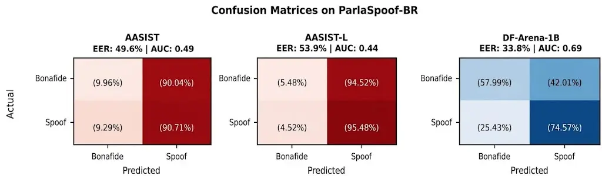

\workshoptitle

Trustworthy AI for Good

# Cloned Voices, Real Consequences: Evaluating Bias in Political Deepfake Detection for Electoral Integrity in Brazil

Lucas Rafael Gris Affiliation: Federal University of Goiás, Goiânia,
Brazil Affiliation: Ermis, Goiânia & São Paulo, Brazil    Daniel
Casanova Affiliation: Federal University of Technology – Paraná,
Medianeira, Brazil    Frederico Santos De Oliveira Affiliation: Ermis,
Goiânia & São Paulo, Brazil    Alef Iury Ferreira Affiliation: Federal
University of Goiás, Goiânia, Brazil    Beatriz Almeida Felício
Affiliation: Federal University of Goiás, Goiânia, Brazil    Raul César
Reis Mata Affiliation: Ermis, Goiânia & São Paulo, Brazil    Anderson da
Silva Soares Email: [{lucas.gris, alef_iury_c.c, beatrizfelicio,
andersonsoares}@discente.ufg.br{fred, raul}@ermis.ai,
danielcasanova@alunos.utfpr.edu.br^(\*)Equal contribution](mailto:,%20)
Affiliation: Federal University of Goiás, Goiânia, Brazil

###### Abstract

Recent advances in generative artificial intelligence have made it
easier to create convincing fake speech and spread political
disinformation during elections. We introduce ParlaSpoof-BR, an audio
deepfake dataset derived from recordings of the Brazilian Chamber of
Deputies and extended by a range of state-of-the-art (SOTA)
text-to-speech and voice conversion models. Using ParlaSpoof-BR, we
benchmark SOTA audio deepfake detectors, evaluate their generalization
to Brazilian Portuguese in the political domain, and examine potential
biases in their predictions. Across these evaluations, our analysis
shows that current systems struggle to provide consistent decisions
across the diversity represented in the dataset. Differences related to
the synthesis model and the extent of manipulation have a stronger
effect on detector performance than demographic factors. ParlaSpoof-BR
provides a domain-specific benchmark for studying audio deepfake
detection in a socially consequential and underrepresented setting,
supporting the development of more robust detection systems for
electoral integrity in Brazil.

## 1 Introduction

Political disinformation poses a persistent threat to democratic
processes by disrupting public debate, eroding trust in electoral
institutions and political information, and shaping voters’ beliefs and
perceptions Vaccari and Chadwick (2020). Recent advances in Generative
Artificial Intelligence (Generative AI) have intensified this challenge
by lowering the cost of producing convincing false content at
scale Pawelec (2022); Twomey et al. (2023). Audio deepfakes are
particularly concerning because they can fabricate statements in the
voices of political figures, allowing false narratives to shape public
opinion before journalists and fact-checkers can effectively
respond Pawelec (2022); Twomey et al. (2023). This risk is especially
salient in Brazil, where the 2022 election was marked by coordinated
disinformation campaigns Hale et al. (2024). This risk is particularly
acute in the lead-up to Brazil’s 2026 presidential election, as
zero-shot voice-cloning technologies capable of generating highly
realistic speech from only a few seconds of reference audio have become
widely accessible Hu et al. (2026); Zhou et al. (2026); k2-fsa (2025).
These developments underscore the critical importance of reliable audio
deepfake detection for electoral integrity.

Yet existing audio deepfake detectors provide limited assurance in
realistic settings. Although they achieve near-zero Equal Error Rates
(EERs) on ASVspoof Weizman et al. (2025), a widely used benchmark for
speech anti-spoofing, their performance degrades by an order of
magnitude on real-world audio. In these conditions, detectors often rely
on spurious cues, such as silence statistics, bitrate signatures, and
spoken content, rather than artifacts intrinsic to speech
synthesis Müller et al. (2021); Borz‘̀i et al. (2022). Detection errors
also vary across gender, age, and accent Singh Yadav et al. (2024),
while representative, Portuguese-language resources remain scarce. The
only dedicated corpus, BRSpeech-DF Ferro Filho et al. (2025), consists
of studio-clean audiobook recordings and does not include voice
conversion, partial manipulation, or regional stratification.

In this work, we introduce ParlaSpoof-BR¹¹ 1
[https://ermisai.github.io/parlaspoof-br-demo](https://ermisai.github.io/parlaspoof-br-demo),
an audio deepfake benchmark based on Brazilian parliamentary speech. The
dataset is publicly available for research purposes²² 2
[https://huggingface.co/datasets/freds0/ParlaSpoof-BR](https://huggingface.co/datasets/freds0/ParlaSpoof-BR).
It contains 2,000 utterances from 40 speakers balanced across gender and
region, with attacks covering text-to-speech (TTS), voice conversion
(VC), and semantically targeted partial manipulation. Our contributions
are threefold: (1) the first Portuguese benchmark for political speech
deepfakes; (2) a partial-manipulation protocol that is harder to detect
than full synthesis; and (3) a systematic bias analysis showing that
methodological factors have a greater impact than demographic
differences.

## 2 Related Work

Audio deepfake detection has gained increasing attention as synthetic
speech becomes more realistic and accessible. Prior work has examined
its societal risks, detection robustness, bias, language coverage, and
different forms of speech manipulation.

Deepfakes and Elections. Synthetic media pose a growing threat to
electoral integrity worldwide. Pawelec Pawelec (2022) analyzes how
deepfakes can undermine democratic discourse by fabricating statements
attributed to candidates. Twomey et al. Twomey et al. (2023) show that
synthetic media can erode epistemic trust, meaning confidence in
distinguishing reliable information from falsehoods, because their
effects may occur before fact-checking can correct the record. In
Brazil, the 2022 election was marked by coordinated disinformation
campaigns on WhatsApp Hale et al. (2024). More recently, manipulated and
AI-generated political audio has been documented during the 2024
elections in Brazil Farrugia (2024). These studies motivate
domain-specific benchmarks targeting political speech rather than
generic audio.

Cross-Domain Generalization and Robustness. Audio deepfake detectors
often degrade substantially outside their training domain. Müller et
al. Müller et al. (2022) show that systems achieving strong results on
ASVspoof perform considerably worse on real-world recordings, while
Speech DF Arena Dowerah et al. (2026) confirms this limitation across
multiple datasets and detectors. Robustness studies further show that
compression, additive noise, and reverberation can suppress synthesis
artifacts and increase detection errors Ali et al. (2024); Li et al.
(2026). These findings motivate our evaluation of detectors on
spontaneous Brazilian political speech under realistic acoustic
perturbations.

Bias in Deepfake Detection. Detectors exhibit systematic biases that
aggregate metrics conceal. FairSSD Singh Yadav et al. (2024) audits six
detectors over 0.9 million signals and finds most biased with respect to
gender, age, and accent, with systematically higher false positive rates
for male speakers.

Fursule et al. Fursule et al. (2026a) demonstrate statistically
significant gender disparities that are obscured by aggregate metrics.
Their follow-up study Fursule et al. (2026b) shows that group-specific
thresholds can reduce false-positive-rate disparities by 54–75% without
reducing overall detection accuracy. Cross-lingual transfer is a
persistent weakness: Liu et al. Liu et al. (2024a) measure language
mismatch across twelve languages, and Moreno et al. Moreno et al. (2025)
show that even holding TTS architecture fixed, detection rates vary
systematically by language. To the best of our knowledge, no previous
audio deepfake detection study has examined within-language regional
variation as a fairness dimension. ParlaSpoof-BR addresses this gap by
considering Brazil’s five geographic regions explicitly.

Portuguese Deepfake Resources. Portuguese-language resources for audio
deepfake detection remain limited. BRSpeech-DF Ferro Filho et al.
(2025), introduced as the first publicly available dataset in this
setting, provides over 458,000 utterances covering Brazilian and
European Portuguese. Its data are derived from enhanced LibriVox
audiobook recordings from 62 speakers and synthetic speech generated by
five zero-shot TTS systems. Evaluations on BRSpeech-DF revealed
substantial cross-lingual generalization challenges, with
English-trained detectors obtaining EERs between 30.67% and 63.03%.
ParlaSpoof-BR complements this large-scale resource by targeting
spontaneous Brazilian political speech and expanding the attack coverage
to TTS, voice conversion, and partial manipulation, with explicit
regional and gender balance.

Partial Manipulation. Fully synthesizing an utterance is unnecessary
when replacing a few words suffices to invert meaning. Liu et al. Liu et
al. (2024b) show detectors concentrate on transition regions rather than
synthesis artifacts, and Gajewska et al. Gajewska et al. (2026) report
14.5% of real fraud cases involved partial edits. Our infilling protocol
extends this work by selecting targets semantically and cross-fading
boundaries to suppress transition cues.

## 3 Methodology

We describe the construction of ParlaSpoof-BR, the generation of
synthetic and partially manipulated speech, and the evaluation protocol
used in our experiments.

### 3.1 Dataset

ParlaSpoof-BR was constructed from recordings collected between
2024-01-01 and 2026-07-01 from the official Sound Archive of the
Brazilian Chamber of Deputies³³ 3
[https://imagem.camara.leg.br/internet/audio/](https://imagem.camara.leg.br/internet/audio/).
These recordings preserve the reverberation and microphone variability
of parliamentary proceedings and are distributed under a Creative
Commons Attribution license, allowing research and commercial use.
Speaker identities and segment boundaries were obtained directly from
the archive metadata.

The dataset comprises 40 speakers, balanced by gender (20 male and 20
female), and distributed across Brazil’s five geographic regions: North,
Northeast, Central-West, Southeast, and South. Eligible speakers had at
least 100 segments of five seconds or longer and 30 segments of ten
seconds or longer. We selected 50 utterances per speaker, yielding 2,000
bona fide samples, and five additional segments of at least ten seconds
per speaker as voice-cloning references. These references were kept
separate from the bona fide evaluation samples. Each utterance includes
the source waveform, an automatic transcription, and word-level
timestamps obtained with WhisperX Bain et al. (2023).

### 3.2 Audio Deepfake Generation

We generate synthetic samples using pairs of distinct speakers. Speaker
$`A`$ provides the target identity, while speaker $`B`$ provides the
linguistic content. This speaker assignment is used consistently across
the TTS and VC generation pipelines. Building on this speaker-pairing
setup, we employ three complementary attack paradigms: Text-to-Speech
(TTS), Voice Conversion (VC), and partial manipulation through audio
infilling. The latter is evaluated both with content-preserving
resynthesis and with semantically guided edits generated by a Large
Language Model (LLM), which we refer to as “LLM Attack”. Table 1
summarizes the composition of ParlaSpoof-BR across bona fide and spoofed
subsets.

Text-to-Speech. We evaluate five state-of-the-art (SOTA) zero-shot
voice-cloning models capable of generating audio in Brazilian
Portuguese: OmniVoice k2-fsa (2025), XTTS-v2 Casanova et al. (2024),
Chatterbox Multilingual V3 Resemble AI (2025), VoxCPM2 Zhou et al.
(2026), and Qwen3-TTS Hu et al. (2026). For each cross-speaker pair,
speaker $`A`$ provides the target voice and speaker $`B`$ provides the
linguistic content. Each model processes all 2,000 source utterances,
yielding 10,000 TTS files.

Voice Conversion. We evaluate five zero-shot VC models: Seed-VC Liu
(2024), kNN-VC Baas et al. (2023), OpenVoice-v2 Qin et al. (2023),
X-VC Zheng et al. (2026), and EZVC Joglekar et al. (2025). For each
source utterance, speaker $`B`$’s audio is converted to speaker $`A`$’s
identity while preserving its linguistic content. Applying all five
systems to the 2,000 source utterances yields 10,000 VC files.

Audio Infilling and LLM Attack. For partial manipulations, we employ
OmniVoice’s native masked-infilling capability. Its non-causal,
bidirectional architecture allows a masked region to be regenerated
while conditioning on the surrounding audio and the desired
transcription. This avoids generating isolated segments independently of
their acoustic context. WhisperX Bain et al. (2023) word alignments
determine the corresponding frame boundaries.

We construct four manipulation conditions, each comprising 2,000
samples, yielding 8,000 partially manipulated audios. Three conditions
correspond to fixed manipulation ratios (25%, 50%, and 75% of words
within the utterance), where a contiguous span of words is resynthesized
while preserving the original transcription. The fourth condition
employs LLM-guided semantic manipulation, where Claude Sonnet
4 Anthropic (2024) analyzes the transcript and selects a minimal,
meaning-altering edit designed to change the political or factual
interpretation of the utterance. The LLM chooses from five semantic
categories: antonym (e.g., “approved” $`\rightarrow`$ “rejected”),
number (e.g., “15%” $`\rightarrow`$ “51%”), name (substituting entity
names), phrase (replacing key expressions), and negation (inserting or
removing negation markers such as “not”). This condition simulates
targeted disinformation attacks where an adversary seeks to subtly alter
the speaker’s stated position. In the three contiguous-resynthesis
conditions, the original words within spans covering 25%, 50%, or 75% of
the utterance are regenerated without changing the linguistic content.
The former models realistic semantic manipulation, whereas the latter
isolates acoustic cues introduced by partial synthesis.

We additionally construct a second set of 8,000 partially manipulated
files using the same four conditions, but restricting the manipulated
regions to the first 4 seconds of each utterance. We refer to this
subset as “Short”. This constraint is motivated by the input-duration
limitations of current deepfake detectors. In particular, DF-Arena
processes only the first 4 seconds of an input utterance. For
unconstrained partial manipulations, the altered region may therefore
occur outside the portion analyzed by the detector, introducing a
positional bias into the evaluation. Restricting manipulations to the
initial 4 seconds ensures that the spoofed region is observable by
detectors with this input constraint.

For the LLM-guided condition in the “Short” subset, the semantic edits
are restricted to words occurring within the initial 4-second interval.
Likewise, the 25%, 50%, and 75% conditions regenerate word spans
selected within this interval. This constrained variant is designed to
evaluate whether detectors can identify partial manipulations when the
altered region is localized to the beginning of the utterance. Together,
the two infilling variants yield 16,000 files.

For each infilling condition, the target region is masked at the token
level and regenerated according to the desired transcription. The
original transcription is retained for percentage-based resynthesis,
while the modified transcription is used for the LLM-guided condition.
Only the generated infill region is inserted back into the original
waveform, preserving the unmodified portions of the recording. To reduce
discontinuities at the splice boundaries, we linearly interpolate
between the original and generated phase spectra over a 10 ms transition
window while retaining the generated magnitude spectrum throughout the
infilled region.

### 3.3 Acoustic Robustness Conditions

We introduce three types of acoustic transformations to evaluate
detector robustness under realistic processing conditions.

Enhancement. We process each of the 2,000 bona fide utterances with
three speech enhancement systems: Resemble Enhance⁴⁴ 4
[https://github.com/resemble-ai/resemble-enhance](https://github.com/resemble-ai/resemble-enhance),
Demucs Defossez et al. (2020), and MetricGAN+ Fu et al. (2021).
Producing one variant per system and 6,000 enhanced files in total.

Lossy Compression. We evaluate MP3 and OGG compression followed by
decoding back to WAV. For each codec, we sample 20% of eligible bona
fide (original and enhanced) and spoofed (TTS, VC, and babble-noise)
files, stratified by speaker and attack method. Partial-manipulation and
voice-cloning reference files are excluded. Codec-derived files retain
their original labels and identifiers. Across both codecs, this produces
35,200 files: 3,200 bona fide and 32,000 spoofed variants.

Babble Noise. Parliamentary recordings often contain overlapping speech
and background conversations, producing interference similar to babble
noise. To better reproduce these acoustic conditions, we construct
babble signals from random speech segments extracted from other
recordings using Silero VAD Team (2024). We add this noise to the 20,000
full-synthesis attacks, comprising 10,000 TTS and 10,000 VC files, at
20, 15, and 10 dB SNR. One variant is generated at each SNR, yielding
60,000 additional spoofed files. Babble noise is not applied to bona
fide or partially manipulated speech.

|                       |                                |         |
| --------------------- | ------------------------------ | ------- |
| Label                 | Subset                         | Files   |
| Bona fide             | Original Chamber recordings    | 2,000   |
|                       | Enhancement variants           | 6,000   |
|                       | MP3/OGG to WAV variants        | 3,200   |
| Spoof                 | TTS: five systems              | 10,000  |
|                       | Voice conversion: five systems | 10,000  |
|                       | OmniVoice speech infilling     | 16,000  |
|                       | Babble noise: three SNR levels | 60,000  |
|                       | MP3/OGG to WAV variants        | 32,000  |
| Bona fide total       |                                | 11,200  |
| Spoof total           |                                | 128,000 |
| Total benchmark files |                                | 139,200 |

Table 1: Composition of ParlaSpoof-BR.

### 3.4 Synthetic Speech Quality Assessment

We assess clean synthetic speech in terms of perceptual quality,
intelligibility, and target-speaker similarity. UTMOS Saeki et al.
(2022) estimates perceptual quality, WER and CER are computed from
WhisperX Bain et al. (2023) transcriptions, and speaker similarity is
measured using the cosine similarity between ECAPA-TDNN
embeddings Desplanques et al. (2020). TTS transcriptions are compared
with the synthesis text, whereas VC transcriptions are compared with the
corresponding source transcript. We exclude files modified by babble
noise or lossy codecs to avoid conflating generation quality with
acoustic degradation. Table 2 reports medians because the metric
distributions are asymmetric. Higher UTMOS and ECAPA scores are
preferred, while lower WER and CER indicate better intelligibility.

| Type | Generator    | UTMOS$`\uparrow`$ | WER$`\downarrow`$ | CER$`\downarrow`$ | ECAPA$`\uparrow`$ |
| ---- | ------------ | ----------------- | ----------------- | ----------------- | ----------------- |
| TTS  | Chatterbox   | 2.983             | 2.6               | 0.7               | 0.802             |
|      | XTTS-v2      | 2.464             | 4.3               | 1.4               | 0.687             |
|      | OmniVoice    | 2.680             | 3.3               | 1.0               | 0.852             |
|      | Qwen3-TTS    | 3.220             | 4.0               | 1.3               | 0.847             |
|      | VoxCPM2      | 2.524             | 3.3               | 0.9               | 0.819             |
| VC   | EZ-VC        | 2.452             | 19.6              | 10.2              | 0.753             |
|      | kNN-VC       | 1.943             | 9.7               | 3.4               | 0.762             |
|      | OpenVoice-v2 | 2.125             | 7.5               | 2.7               | 0.444             |
|      | Seed-VC      | 1.998             | 7.1               | 2.6               | 0.839             |
|      | X-VC         | 1.714             | 6.2               | 2.4               | 0.791             |

Table 2: Synthesis quality metrics across TTS and VC generators.

Among the TTS systems, Qwen3-TTS achieves the highest UTMOS score
(3.220), while Chatterbox obtains the lowest error rates (2.6% WER and
0.7% CER). OmniVoice achieves the highest target-speaker similarity
(0.852), closely followed by Qwen3-TTS (0.847). Among the VC systems,
EZ-VC obtains the highest UTMOS score (2.452), Seed-VC achieves the
highest speaker similarity (0.839), and X-VC yields the lowest error
rates (6.2% WER and 2.4% CER). Overall, the evaluated TTS systems
generally achieve higher estimated perceptual quality and
intelligibility than the VC systems, although no single system performs
best across all evaluation dimensions.

### 3.5 Detection Systems

We evaluate three detectors representing different points on the
capacity-generalization trade-off:

AASIST Jung et al. (2022) is a graph-attention-based anti-spoofing
system that operates on raw waveforms using a RawNet2-based Tak et al.
(2021) encoder. We use the standard pretrained configuration, trained on
the ASVspoof 2019 Logical Access dataset, as an established baseline for
measuring cross-domain generalization.

AASIST-L Jung et al. (2022) is the lightweight AASIST variant,
containing 85,306 parameters while retaining the same overall
spectro-temporal graph-attention design. Comparing it with the
higher-capacity standard AASIST configuration examines whether model
capacity within this architecture is associated with improved
out-of-domain performance.

DF-Arena-1B Dowerah et al. (2026) is an industrial-grade transformer (1B
parameters) trained on diverse multilingual deepfake corpora. It
represents the best-case scenario for heterogeneous training and tests
whether massive scale can overcome domain shift to Portuguese political
speech.

Figure 1: Confusion matrices for all detectors. AASIST and AASIST-L
classify nearly all samples as spoof regardless of true label.
DF-Arena-1B shows better discrimination but still exhibits a 42.01% FPR
on bona fide speech

### 3.6 Evaluation

The complete benchmark comprises 139,200 files: 11,200 bona fide or
bona-fide-derived files and 128,000 spoofed files. We divide the
benchmark into a 38,000-file core evaluation set and a 101,200-file
robustness set. The core set comprises 2,000 original bona fide
recordings and 36,000 unperturbed attacks: 10,000 TTS files, 10,000 VC
files, and 16,000 infilling files.

The robustness set comprises 9,200 bona fide-derived files and 92,000
spoofed files. It contains 6,000 enhanced bona fide recordings, 60,000
babble-noise spoof variants, and 35,200 codec-derived variants. The
codec-derived conditions consist of 3,200 bona fide variants and 32,000
spoofed variants. Robustness variants are evaluated separately from the
headline core-set metrics because their unequal distribution would
otherwise cause the babble-noise and codec conditions to dominate the
aggregate results.

For the core set, we report Equal Error Rate (EER), Area Under the ROC
Curve (AUC), macro-averaged F1-score, accuracy, and spoof-class
precision and recall. Robustness results are reported separately by
comparing each perturbed condition with its corresponding clean
condition, where applicable. All derived variants retain the identifier
of their source utterance and are therefore not treated as independent
source recordings.

## 4 Results

We evaluate detector performance on ParlaSpoof-BR from three
complementary perspectives. We first examine overall detection
performance, then analyze variation across synthesis methods and partial
manipulation strategies, and finally assess how demographic and
methodological factors influence detection outcomes.

### 4.1 Overall Detection Performance

Table 3 presents the overall performance of the three detectors on the
ParlaSpoof-BR core set, which comprises 36,000 spoofed and 2,000 bona
fide samples. Because spoofed samples represent 94.7% of this set,
accuracy and spoof-class precision must be interpreted together with
class-balanced and threshold-independent metrics such as Macro-F1, EER,
and AUC. All three detectors obtain substantially higher EERs than those
reported on ASVspoof 2019 (0.83% for AASIST, 0.99% for AASIST-L, and
1.14% for DF-Arena-1B), consistent with prior evidence of limited
cross-domain generalization Müller et al. (2022).

| Detector    | EER (%)$`\downarrow`$ | AUC$`\uparrow`$ | Prec.$`\uparrow`$ | Rec.$`\uparrow`$ | Macro-F1$`\uparrow`$ | Acc. (%)$`\uparrow`$ |
| ----------- | --------------------- | --------------- | ----------------- | ---------------- | -------------------- | -------------------- |
| AASIST      | 49.62                 | 0.493           | 0.948             | 0.907            | 0.499                | 86.45                |
| AASIST-L    | 53.95                 | 0.440           | 0.948             | 0.955            | 0.505                | 90.76                |
| DF-Arena-1B | 33.83                 | 0.693           | 0.970             | 0.746            | 0.516                | 73.73                |

Table 3: Overall detection performance on ParlaSpoof-BR considering the
core subset. Prec. and Rec. denote spoof-class precision and recall,
respectively; Macro-F1 denotes the macro-averaged F1-score, and Acc.
denotes accuracy. Best results for each metric are shown in bold.

AASIST and AASIST-L perform close to chance, with EERs of 49.62% and
53.95% and AUCs below 0.5. As shown in Figure 1, both models exhibit
strong bias toward predicting spoof, resulting in FPRs of 90.04% and
94.52%, respectively. The modest difference between variants suggests
that increased capacity alone does not overcome domain mismatch Müller
et al. (2024). DF-Arena-1B performs better (EER 33.83%, AUC 0.693) with
more balanced predictions, although 42.01% of bona fide samples are
still misclassified. It is the strongest detector evaluated, but
performance remains well below ASVspoof benchmarks.

### 4.2 Performance by Synthesis Method

Table 4 reports DF-Arena-1B performance by synthesis method, including
unweighted means for each attack family. On average, the detector
performs better on VC than on TTS, with a lower EER (17.1% versus
26.7%), higher AUC (0.885 versus 0.777), and higher recall (99.9% versus
81.8%). However, the substantial variation within both families
indicates that performance depends strongly on the individual generator.

OpenVoice-v2 obtains the lowest EER overall (6.3%), whereas VoxCPM2 and
Qwen3-TTS produce the weakest results. Their recalls of 60.9% and 48.2%
correspond to miss rates of 39.1% and 51.8%, respectively. Although
these results are consistent with previously reported cross-lingual
limitations Liu et al. (2024a); Moreno et al. (2025), the present
experiment cannot distinguish language mismatch from other
generator-specific factors.

| Type | Method       | EER (%)$`\downarrow`$ | AUC$`\uparrow`$ | Rec. (%)$`\uparrow`$ |
| ---- | ------------ | --------------------- | --------------- | -------------------- |
| VC   | OpenVoice-v2 | 6.3                   | 0.976           | 100.0                |
|      | kNN-VC       | 16.1                  | 0.902           | 100.0                |
|      | X-VC         | 16.4                  | 0.896           | 100.0                |
|      | Seed-VC      | 22.6                  | 0.829           | 99.8                 |
|      | EZ-VC        | 24.2                  | 0.821           | 99.6                 |
|      | Mean         | 17.1                  | 0.885           | 99.9                 |
| TTS  | XTTS-v2      | 13.1                  | 0.935           | 100.0                |
|      | Chatterbox   | 14.0                  | 0.923           | 100.0                |
|      | OmniVoice    | 20.3                  | 0.872           | 100.0                |
|      | VoxCPM2      | 41.1                  | 0.603           | 60.9                 |
|      | Qwen3-TTS    | 44.8                  | 0.550           | 48.2                 |
|      | Mean         | 26.7                  | 0.777           | 81.8                 |

Table 4: DF-Arena-1B performance by clean synthesis method. Mean rows
report unweighted averages across generators.

### 4.3 Partial Manipulation

Table 5 reports utterance-level recall for partially manipulated speech.
Under the Full protocol, DF-Arena-1B follows its standard inference
procedure and observes only the first 4 seconds of each utterance. This
limits the interpretation of the results because smaller manipulations
are less likely to overlap the portion of the signal available to the
detector, while larger manipulations have a greater probability of
appearing within this window. DF-Arena-1B recall consequently increases
from 26.35% at 25% manipulation to 44.25% at 50% and 71.75% at 75%. The
Short subset controls for this positional effect by constraining the
manipulation to the first 4 seconds while preserving the original
utterance duration. Under this setting, recall increases to 61.90% and
79.00% for the 50% and 75% conditions, respectively. The LLM-guided
attack remains difficult to detect, with recalls of 9.49% on Full and
18.41% on Short.

The Full Sliding protocol increases temporal coverage by applying the
detector to overlapping 4-second windows across the complete utterance
and assigning the audio the maximum score obtained across all windows.
DF-Arena-1B recall rises to 76.20%, 98.00%, and 99.75% for the 25%, 50%,
and 75% conditions, respectively. This large improvement indicates that
the original 4-second input restriction is an important source of error
for partial manipulations. However, sliding-window inference differs
from the procedure for which DF-Arena-1B was originally designed and
should therefore be interpreted as an alternative evaluation strategy.
Even with this broader temporal coverage, the LLM-guided attack reaches
only 16.01% recall, suggesting that its difficulty cannot be explained
solely by manipulation position. One possible explanation is that these
attacks modify only the short segment needed to change the meaning of
the utterance, leaving most of the waveform unchanged. In addition, the
infilled region is generated using the surrounding audio as context,
which may reduce acoustic differences between the original and modified
segments. The low recall on both Short and Full Sliding indicates that
this difficulty cannot be explained only by the 4-second input
constraint of DF-Arena-1B.

Table 6 provides a complementary explanation of the AASIST results by
evaluating each 4-second window independently. On the Full subset,
AASIST accuracy increases from 53.03% at 25% manipulation to 71.34% at
50% and 88.98% at 75%, with a similar trend for AASIST-L. This apparent
improvement should not be interpreted as stronger localization of
synthetic artifacts. As the manipulated proportion increases, a larger
fraction of windows is labeled as fake, making the task increasingly
compatible with the strong tendency of both AASIST variants to predict
the spoof class. This interpretation is reinforced by the Short subset,
where manipulation is confined to the beginning of the utterance and
later windows remain bona fide. In this setting, AASIST and AASIST-L
achieve only 26.19% to 39.50% window-level accuracy. DF-Arena-1B, in
contrast, remains between 78.78% and 83.33%, indicating substantially
better discrimination between manipulated and unmanipulated regions.

| Protocol     | Condition  | AASIST | AASIST-L | DF-Arena |
| ------------ | ---------- | ------ | -------- | -------- |
| Full         | 25%        | 91.15  | 98.55    | 26.35    |
|              | 50%        | 92.00  | 98.65    | 44.25    |
|              | 75%        | 93.65  | 97.35    | 71.75    |
|              | LLM Attack | 91.89  | 97.90    | 9.49     |
| Short        | 25%        | 93.24  | 98.05    | 25.39    |
|              | 50%        | 94.05  | 97.10    | 61.90    |
|              | 75%        | 93.85  | 96.35    | 79.00    |
|              | LLM Attack | 90.70  | 96.10    | 18.41    |
| Full Sliding | 25%        | 99.95  | 99.95    | 76.20    |
|              | 50%        | 99.95  | 100.00   | 98.00    |
|              | 75%        | 100.00 | 99.90    | 99.75    |
|              | LLM Attack | 100.00 | 99.95    | 16.01    |

Table 5: Infilling detection recall (%) on ParlaSpoof-BR. Full uses the
original detector pipeline; Full Sliding uses 4s windows with 50%
overlap and maximum-score aggregation; Short evaluates the dedicated
short-audio subset without windowing. Lower recall indicates better
evasion.

| Subset | Condition  | AASIST | AASIST-L | DF-Arena |
| ------ | ---------- | ------ | -------- | -------- |
| Full   | 25%        | 53.03  | 51.05    | 70.05    |
|        | 50%        | 71.34  | 72.69    | 73.50    |
|        | 75%        | 88.98  | 92.48    | 80.62    |
|        | LLM Attack | 38.15  | 35.18    | 68.25    |
| Short  | 25%        | 34.56  | 26.87    | 79.03    |
|        | 50%        | 37.20  | 29.33    | 83.01    |
|        | 75%        | 39.50  | 32.33    | 83.33    |
|        | LLM Attack | 33.93  | 26.19    | 78.78    |

Table 6: Window-level accuracy (%) on ParlaSpoof-BR. A window is labeled
as fake when it intersects any portion of the annotated infilled
interval. Predictions use a 0.5 threshold. Windows have 4s duration and
50% overlap.

### 4.4 Bias Analysis

We compare the variation in DF-Arena-1B performance across attack,
processing, quality, and demographic factors. Table 7 summarizes these
differences by reporting the performance gap within each factor. For
methodological factors, the gap is computed as the difference between
the highest and lowest recall observed across the corresponding
conditions. For demographic factors, it is computed as the difference
between the highest and lowest EER. All gaps are reported in percentage
points.

| Rank | Bias Factor                      | Gap (pp) |
| ---- | -------------------------------- | -------- |
| 1    | Partial Manipulation (infilling) | 83.7     |
| 2    | Synthesis Model                  | 51.8     |
| 3    | Processing Group                 | 32.9     |
| 4    | UTMOS Quality                    | 29.5     |
| 5    | Speaker Similarity (ECAPA)       | 19.0     |
| 6    | Codec                            | 10.4     |
| 7    | SNR Level                        | 9.4      |
| 8    | Gender                           | 2.9      |
| 9    | Region                           | 2.3      |

Table 7: Bias factors ranked by impact on DF-Arena-1B detection using 4s
sliding windows with 50% overlap. Partial manipulation was recalculated
using the Full subset; the remaining factors use the unchanged
sliding-window benchmark results.

The largest differences are associated with how fake audio is generated:
partial manipulation shows the largest gap (83.7 pp), followed by
synthesis model (51.8 pp). DF-Arena-1B recall ranges from 48.2% for
Qwen3-TTS to 100.0% for OpenVoice-v2, showing that performance depends
strongly on the generation method.

Audio processing also affects detection. At 10 dB SNR, 22.2% of
previously detected deepfakes escape detection. Resemble Enhance causes
98.9% of bona fide recordings to be misclassified as fake. Compression
has a strong effect, with false positive rates of 18.7% after MP3 and
94.8% after OGG conversion.

Demographic variation is considerably smaller: gender produces a gap of
2.9 pp and region 2.3 pp. Overall, the detector is more sensitive to how
audio is generated or processed than to speaker demographics.

## 5 Conclusion

We introduced ParlaSpoof-BR, an audio deepfake benchmark comprising
139,200 files from 40 speakers balanced across gender and geographic
region. Our evaluation shows that current detectors generalize poorly to
Brazilian parliamentary speech and that performance varies substantially
across synthesis methods, manipulation strategies, and audio processing
conditions. Partial manipulation is particularly challenging, with the
LLM-guided attack reaching only 9.49% recall. The bias analysis shows
that methodological factors produce much larger performance differences
than demographics (83.7 pp for partial manipulation and 51.8 pp for
synthesis model, compared with 2.9 pp for gender and 2.3 pp for region).
These findings highlight the need to evaluate detectors under diverse
generation and processing conditions. Future work should prioritize
bias-aware training, adaptation to Brazilian Portuguese political
speech, and detection methods effective on partially manipulated
utterances. ParlaSpoof-BR supports research toward more reliable
deepfake detection for electoral integrity in Brazil.

## Acknowledgments

This work has been funded by the project Research and Development of
Genese Digital: Scaling Interactive and Culturally Adapted Digital
Humans with Generative AI, supported by the Advanced Knowledge Center in
Immersive Technologies (AKCIT), with financial resources from the PPI
IoT/Manufatura 4.0 / PPI HardwareBR of the MCTI, grant number 057/2023,
signed with EMBRAPII. The authors also acknowledge the support and
contributions of Huglabs and Ermis.ai.

## References

- Ali et al. (2024) H. Ali, S. Subramani, S. Sudhir, R. Varahamurthy,
  and H. Malik Is audio spoof detection robust to laundering attacks?.
  In Proc. ACM Workshop on Information Hiding and Multimedia Security
  (IH&MMSec), External Links:
  [Document](https://dx.doi.org/10.1145/3658664.3659656) Cited by: §2.
- Anthropic (2024) Anthropic Claude sonnet model family. Note:
  [https://www.anthropic.com/claude](https://www.anthropic.com/claude)
  Cited by: §3.2.
- Baas et al. (2023) M. Baas, B. van Niekerk, and H. Kamper Voice
  conversion with just nearest neighbors. In Proc. Interspeech,
  pp. 2053–2057. Cited by: §3.2.
- Bain et al. (2023) M. Bain, J. Huh, T. Han, and A. Zisserman WhisperX:
  time-accurate speech transcription of long-form audio. In Proc.
  Interspeech, pp. 4489–4493. Cited by: §3.1, §3.2, §3.4.
- Borz‘̀i et al. (2022) S. Borz‘̀i, O. Giudice, F. Stanco, and D. Allegra
  Is synthetic voice detection research going into the right direction?.
  In Proc. IEEE/CVF Conference on Computer Vision and Pattern
  Recognition (CVPR) Workshops, Cited by: §1.
- Casanova et al. (2024) E. Casanova, K. Davis, E. Gölge, G. Göknar, I.
  Gulea, L. Hart, A. Aljafari, J. Meyer, R. Morais, S. Olayemi, and J.
  Weber XTTS: a massively multilingual zero-shot text-to-speech model.
  In Proc. Interspeech, pp. 4978–4982. Cited by: §3.2.
- Defossez et al. (2020) A. Defossez, G. Synnaeve, and Y. Adi Real time
  speech enhancement in the waveform domain. arXiv preprint
  arXiv:2006.12847. Cited by: §3.3.
- Desplanques et al. (2020) B. Desplanques, J. Thienpondt, and K.
  Demuynck ECAPA-TDNN: emphasized channel attention, propagation and
  aggregation in tdnn based speaker verification. In Proceedings of
  Interspeech 2020, pp. 3830–3834. External Links:
  [Document](https://dx.doi.org/10.21437/Interspeech.2020-2650) Cited
  by: §3.4.
- Dowerah et al. (2026) S. Dowerah, A. Kulkarni, A. Kulkarni, H. M.
  Tran, J. Kalda, A. Fedorchenko, B. Fauve, D. Lolive, T. Alumäe, and M.
  Magimai-Doss Speech DF arena: a leaderboard for speech DeepFake
  detection models. IEEE Open Journal of Signal Processing. External
  Links: [Document](https://dx.doi.org/10.1109/OJSP.2026.3652496) Cited
  by: §2, §3.5.
- Farrugia (2024) B. Farrugia Brazil’s electoral deepfake law tested as
  ai-generated content targeted local elections. Digital Forensic
  Research Lab. Note: Accessed: 2026-07-29 External Links:
  [Link](https://dfrlab.org/2024/11/26/brazil-election-ai-deepfakes/)
  Cited by: §2.
- Ferro Filho et al. (2025) A. C. Ferro Filho, R. Virgilli, L. A.
  Souza, F. S. de Oliveira, M. H. L. Ferreira, D. Tunnermann, G. R.
  Oliveira, A. S. Soares, and A. R. Galvão Filho BRSpeech-DF: a deep
  fake synthetic speech dataset for Portuguese zero-shot TTS. In Proc.
  Conference on Empirical Methods in Natural Language Processing
  (EMNLP), pp. 35122–35127. Cited by: §1, §2.
- Fu et al. (2021) S. Fu, C. Yu, T. Hsieh, P. Plantinga, M.
  Ravanelli, X. Lu, and Y. Tsao Metricgan+: an improved version of
  metricgan for speech enhancement. arXiv preprint arXiv:2104.03538.
  Cited by: §3.3.
- Fursule et al. (2026a) A. Fursule, S. Kshirsagar, and A. R. Avila
  Gender fairness in audio deepfake detection: performance and disparity
  analysis. arXiv preprint arXiv:2603.09007. Cited by: §2.
- Fursule et al. (2026b) A. Fursule, S. Kshirsagar, and A. R. Avila
  Towards trustworthy audio deepfake detection: a systematic framework
  for diagnosing and mitigating gender bias. arXiv preprint
  arXiv:2605.09087. Cited by: §2.
- Gajewska et al. (2026) J. Gajewska, A. Martinek, and E.
  Bartuzi-Trokielewicz Audio deepfake detectors vs. real fraud: the fall
  of benchmarks. In Proc. IEEE/CVF Winter Conference on Applications of
  Computer Vision (WACV) Workshops, Cited by: §2.
- Hale et al. (2024) S. A. Hale, A. Belisario, A. N. Mostafa, N.
  Marchal, C. C. Bento, F. M. Simon, F. Cantú, C. Scannavino, and P. N.
  Howard Analyzing misinformation claims during the 2022 Brazilian
  general election on WhatsApp, Twitter, and Kwai. International Journal
  of Public Opinion Research 36 (2). External Links:
  [Document](https://dx.doi.org/10.1093/ijpor/edae012) Cited by: §1, §2.
- Hu et al. (2026) H. Hu, X. Zhu, T. He, D. Guo, B. Zhang, X. Wang, Z.
  Guo, Z. Jiang, H. Hao, Z. Guo, X. Zhang, P. Zhang, B. Yang, J. Xu, J.
  Zhou, and J. Lin Qwen3-TTS technical report. External Links:
  2601.15621, [Link](https://arxiv.org/abs/2601.15621) Cited by: §1,
  §3.2.
- Joglekar et al. (2025) A. Joglekar, D. Singh, R. R. Bhatia, and S.
  Umesh EZ-VC: easy zero-shot any-to-any voice conversion. External
  Links: 2505.16691, [Link](https://arxiv.org/abs/2505.16691) Cited by:
  §3.2.
- Jung et al. (2022) J. Jung, H. Heo, H. Tak, H. Shim, J. S. Chung, B.
  Lee, H. Yu, and N. Evans AASIST: audio anti-spoofing using integrated
  spectro-temporal graph attention networks. In Proc. IEEE ICASSP,
  pp. 6367–6371. Cited by: §3.5, §3.5.
- k2-fsa (2025) k2-fsa OmniVoice: masked generative speech modeling with
  bidirectional attention. Note:
  [https://github.com/k2-fsa/OmniVoice](https://github.com/k2-fsa/OmniVoice)
  Cited by: §1, §3.2.
- Li et al. (2026) X. Li, P. Chen, and W. Wei Measuring the robustness
  of audio deepfake detection under real-world corruption. In Proc. ACM
  Conference on Data and Application Security and Privacy (CODASPY),
  External Links: [Document](https://dx.doi.org/10.1145/3800506.3803494)
  Cited by: §2.
- Liu (2024) S. Liu Seed-VC: zero-shot voice conversion and singing
  voice conversion. Note:
  [https://github.com/Plachtaa/seed-vc](https://github.com/Plachtaa/seed-vc)
  Cited by: §3.2.
- Liu et al. (2024a) T. Liu, I. Kukanov, Z. Pan, Q. Wang, H. B. Sailor,
  and K. A. Lee Towards quantifying and reducing language mismatch
  effects in cross-lingual speech anti-spoofing. In Proc. IEEE Spoken
  Language Technology Workshop (SLT), Cited by: §2, §4.2.
- Liu et al. (2024b) T. Liu, L. Zhang, R. K. Das, Y. Ma, R. Tao, and H.
  Li How do neural spoofing countermeasures detect partially spoofed
  audio?. In Proc. Interspeech, Cited by: §2.
- Moreno et al. (2025) V. Moreno, J. Lima, F. Simões, R. Violato, M.
  Uliani Neto, F. Runstein, and P. Costa Revealing cross-lingual bias in
  synthetic speech detection under controlled conditions. In Proc.
  Symposium on Security and Privacy in Speech Communication (SPSC),
  External Links: [Document](https://dx.doi.org/10.21437/SPSC.2025-1)
  Cited by: §2, §4.2.
- Müller et al. (2022) N. M. Müller, P. Czempin, F. Dieckmann, A.
  Froghyar, and K. Böttinger Does audio deepfake detection generalize?.
  In Proc. Interspeech, pp. 2783–2787. Cited by: §2, §4.1.
- Müller et al. (2021) N. M. Müller, F. Dieckmann, P. Czempin, R. U.
  Canals, K. Böttinger, and J. Williams Speech is silver, silence is
  golden: what do ASVspoof-trained models really learn?. In Proc.
  ASVspoof Workshop, Cited by: §1.
- Müller et al. (2024) N. M. Müller, N. Evans, H. Tak, P. Sperl, and K.
  Böttinger Harder or different? understanding generalization of audio
  deepfake detection. In Proc. Interspeech, Cited by: §4.1.
- Pawelec (2022) M. Pawelec Deepfakes and democracy (theory): how
  synthetic audio-visual media for disinformation and hate speech
  threaten core democratic functions. Digital Society 1 (2), pp. 19.
  External Links:
  [Document](https://dx.doi.org/10.1007/s44206-022-00010-6) Cited by:
  §1, §2.
- Qin et al. (2023) Z. Qin, W. Zhao, X. Yu, and X. Sun OpenVoice:
  versatile instant voice cloning. arXiv preprint arXiv:2312.01479.
  Cited by: §3.2.
- Resemble AI (2025) Chatterbox: sota open-source tts External Links:
  [Link](https://github.com/resemble-ai/chatterbox) Cited by: §3.2.
- Saeki et al. (2022) T. Saeki, D. Xin, W. Nakata, T. Koriyama, S.
  Takamichi, and H. Saruwatari UTMOS: utokyo-sarulab system for voicemos
  challenge 2022. In Proceedings of Interspeech 2022, pp. 4521–4525.
  External Links:
  [Document](https://dx.doi.org/10.21437/Interspeech.2022-439) Cited by:
  §3.4.
- Singh Yadav et al. (2024) A. K. Singh Yadav, K. Bhagtani, D. Salvi, P.
  Bestagini, and E. J. Delp FairSSD: understanding bias in synthetic
  speech detectors. In Proc. IEEE/CVF Conference on Computer Vision and
  Pattern Recognition (CVPR) Workshops, Cited by: §1, §2.
- Tak et al. (2021) H. Tak, J. Patino, M. Todisco, A. Nautsch, N. Evans,
  and A. Larcher End-to-end anti-spoofing with rawnet2. In ICASSP
  2021-2021 IEEE International Conference on Acoustics, Speech and
  Signal Processing (ICASSP), pp. 6369–6373. Cited by: §3.5.
- Team (2024) S. Team Silero vad: pre-trained enterprise-grade voice
  activity detector (vad), number detector and language classifier.
  GitHub. Note:
  [https://github.com/snakers4/silero-vad](https://github.com/snakers4/silero-vad)
  Cited by: §3.3.
- Twomey et al. (2023) J. Twomey, D. Ching, M. P. Aylett, M. Quayle, C.
  Linehan, and G. Murphy Do deepfake videos undermine our epistemic
  trust? a thematic analysis of tweets that discuss deepfakes in the
  Russian invasion of Ukraine. PLOS ONE 18 (10), pp. e0291668. External
  Links: [Document](https://dx.doi.org/10.1371/journal.pone.0291668)
  Cited by: §1, §2.
- Vaccari and Chadwick (2020) C. Vaccari and A. Chadwick Deepfakes and
  disinformation: exploring the impact of synthetic political video on
  deception, uncertainty, and trust in news. Social media+ society 6
  (1), pp. 2056305120903408. Cited by: §1.
- Weizman et al. (2025) A. Weizman, Y. Ben-Shimol, and I. Lapidot
  ASVspoof2019 vs. ASVspoof5: assessment and comparison. In Proc.
  Interspeech, Cited by: §1.
- Zheng et al. (2026) Q. Zheng, Y. Zhao, T. Wang, W. Chen, K. Xu, Y.
  Li, Q. Chen, X. Qiu, K. Yu, and X. Chen X-VC: zero-shot streaming
  voice conversion in codec space. External Links: 2604.12456,
  [Link](https://arxiv.org/abs/2604.12456) Cited by: §3.2.
- Zhou et al. (2026) Y. Zhou, G. Zeng, X. Liu, X. Li, R. Yu, J. Gui, J.
  Wu, Z. Wang, X. Shen, R. Ye, Z. Zhang, J. Zhou, B. Bai, W. Sun, M.
  Deng, Q. Shi, Z. Wu, and Z. Liu VoxCPM2 technical report. External
  Links: 2606.06928, [Link](https://arxiv.org/abs/2606.06928) Cited by:
  §1, §3.2.
