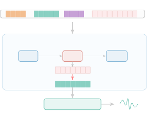
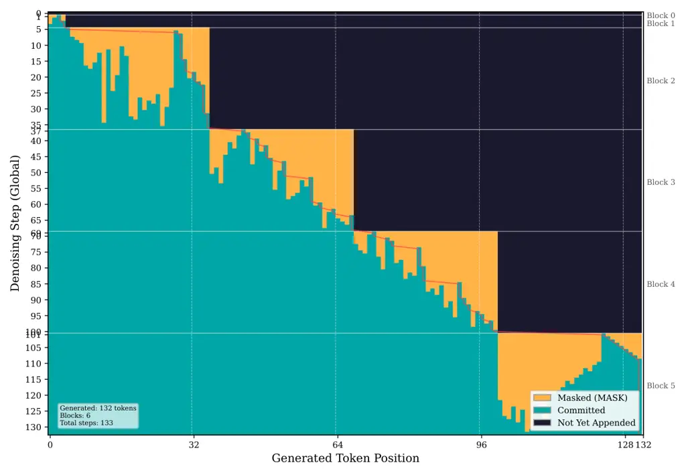

Madha Mathur Sayed Singh Khurana Mandloi Kamath

# DLLM-TTS: Block Discrete Diffusion Language Model for Text-to-Speech Synthesis

Wasim    Nityanand    Hamees    Apoorv    Sameer    Akshat    Sudarshan

###### Abstract

Current text-to-speech systems face a trade-off: autoregressive codec
language models produce highly intelligible speech but require
large-scale models and training data and decode tokens sequentially,
while non-autoregressive approaches improve speed at the cost of
linguistic accuracy. We present DLLM-TTS, a framework that formulates
TTS as conditional block discrete diffusion over X-Codec2 neural audio
codec tokens. The model decomposes sequences into blocks and applies
masked diffusion within each block while processing blocks sequentially,
learning both local acoustic coherence and global text-speech alignment.
During inference, parallel token prediction within blocks enables
efficient generation with a real-time factor (RTF) of 0.15. A
0.6B-parameter model trained on 20K hours achieves competitive
performance on the Seed-TTS-eval benchmark, demonstrating that block
discrete diffusion language models enable practical and data-efficient
speech synthesis with parallel generation.

###### keywords

discrete diffusion, text-to-speech, block diffusion, neural codec,
language model

^(†)^(†)address: ¹ Smallest.ai ^(†)^(†)email: wasim@smallest.ai,
nityanand.mathur@iiitg.ac.in, hamees@smallest.ai,
apoorv.singh@smallest.ai, sameerkhurana10@gmail.com, akshat@smallest.ai,
sudarshan@smallest.ai

## 1 Introduction

Text-to-speech synthesis faces a fundamental efficiency-quality
trade-off. Autoregressive codec language models \[1, 2, 3\] achieve
high-quality zero-shot synthesis but require 60K–250K hours of data and
generate tokens sequentially, incurring high latency. Non-autoregressive
approaches based on flow matching \[4, 5\] and diffusion \[6, 7\] enable
parallel generation but typically need explicit duration modeling or
struggle with text-speech alignment, leading to word skipping or
repetition errors.

Recent masked discrete diffusion language models \[8, 9\] have shown
that discrete diffusion can match autoregressive quality for text
generation with parallel decoding. BD3-LM \[10\] further introduces
block decomposition, interpolating between autoregressive and fully
parallel generation with flexible speed-quality trade-offs. However,
these methods have only been explored for text; their application to
conditional speech generation over discrete codec tokens remains
unexplored.

We present DLLM-TTS, which adapts block discrete diffusion to
conditional speech generation. Speech exhibits strong local acoustic
coherence at the phoneme level while requiring longer-range dependencies
for text-speech alignment, a structure naturally suited to block
diffusion. We model speech as block discrete diffusion over
X-Codec2 \[11\] codec tokens: sequences are decomposed into blocks, and
the model reconstructs masked tokens within each block conditioned on
text, enabling parallel prediction within blocks while preserving
sequential dependencies across them. The masked diffusion objective
additionally provides implicit data augmentation, as each sequence is
observed under diverse masking patterns, improving data efficiency over
autoregressive training.

Contributions. ❶ We introduce block discrete diffusion for TTS, modeling
speech synthesis as conditional masked token reconstruction over codec
tokens with block decomposition, the first application of block discrete
diffusion to conditional speech generation. ❷ We employ staircase
attention to jointly capture local acoustic coherence within blocks and
global text-speech alignment across blocks, without explicit duration
modeling. ❸ We achieve competitive intelligibility on the Seed-TTS
benchmark \[12\] using only 20K hours of data, a 3–12$`\times`$
reduction over autoregressive systems. ❹ A 0.6B-parameter model achieves
an RTF of 0.15 with strong zero-shot speaker similarity.

## 2 Related Work

Autoregressive Codec Language Models. A dominant paradigm in TTS
formulates speech synthesis as language modeling over discrete neural
codec tokens. VALL-E \[1\] pioneered this approach by training on 60K
hours of speech, achieving strong zero-shot synthesis from a 3-second
prompt. VALL-E 2 \[2\] introduced repetition-aware sampling and grouped
code modeling to reach human parity on standard benchmarks. LLASA \[3\]
demonstrated that scaling LLaMA-based architectures with X-Codec2 \[11\]
up to 8B parameters yields consistent quality gains. DiTAR \[13\]
combines a language model with a diffusion transformer in a patch-based
autoregressive framework for continuous-valued speech generation. While
these systems achieve high quality, sequential token generation
introduces latency that limits real-time applications.

Non-Autoregressive Speech Synthesis. To overcome the latency bottleneck,
non-autoregressive methods generate speech in parallel. Voicebox \[4\]
applies flow matching over mel-spectrograms conditioned on text and
surrounding audio context. F5-TTS \[5\] simplifies the pipeline by using
flow matching with a Diffusion Transformer (DiT), eliminating duration
models and phoneme alignment. NaturalSpeech 3 \[6\] employs factorized
diffusion over disentangled speech attributes (content, prosody,
timbre). StyleTTS 2 \[7\] achieves human-level quality through style
diffusion and adversarial training with speech language model
discriminators. CosyVoice \[14\] combines an LLM-based text-to-token
stage with conditional flow matching for token-to-speech synthesis.
SoundStorm \[15\] uses confidence-based parallel decoding over RVQ
tokens for fast generation but struggles with text-speech alignment when
trained from scratch. MegaTTS 3 \[16\] proposes sparse alignment with a
latent diffusion transformer for robust zero-shot synthesis. These
approaches typically require explicit duration prediction, frame-aligned
annotations, or multi-stage pipelines, which complicate training data
preparation.

Discrete Diffusion Language Models. Masked discrete diffusion has
recently emerged as a viable alternative to autoregressive modeling for
text generation. MDLM \[8\] derives a simplified objective based on
masked language modeling losses, achieving strong performance among
diffusion-based language models. LLaDA \[9\] scales masked diffusion to
8B parameters, demonstrating competitive performance with autoregressive
LLMs on in-context learning and instruction following. BD3-LM \[10\]
extends MDLM with block decomposition, interpolating between fully
parallel diffusion and autoregressive generation while enabling
variable-length output and KV caching. However, these methods have
primarily been studied for text generation. Their application to
conditional speech generation, where both acoustic coherence and
text–speech alignment must be modeled jointly over discrete codec
tokens, remains largely unexplored. Our work addresses this gap by
adapting block discrete diffusion for text-to-speech synthesis.

## 3 Methodology



Figure 1: Overview of DLLM-TTS. Text and reference codec tokens are
concatenated with generation text and \[MASK\]^(L) targets, then
processed by the Block Discrete Diffusion Transformer using staircase
attention (bidirectional/causal). Each block is iteratively denoised and
decoded by X-Codec2 into speech.

### 3.1 Background

Neural Audio Codecs. Neural audio codecs compress continuous audio
waveforms into discrete token sequences through learned quantization.
Traditional residual vector quantization (RVQ) approaches like
EnCodec \[17\] employ multiple codebook layers to progressively refine
representations, producing parallel token streams. In contrast,
X-Codec2 \[11\] adopts a unified semantic-acoustic architecture: a
semantic encoder (Wav2Vec2-BERT) captures linguistic content while an
acoustic encoder preserves fine-grained audio characteristics. These
representations are fused and quantized using single-stage Finite Scalar
Quantization (FSQ) with vocabulary size $`|\mathcal{V}|=6561`$,
producing a single token stream at frame rate $`f_{r}=50`$ Hz. This
yields $`L=f_{r}\cdot d_{\text{sec}}`$ codec tokens for
$`d_{\text{sec}}`$ seconds of audio, simplifying integration with
transformer language models by avoiding multiple parallel codebook
streams.

Masked Discrete Diffusion. Masked diffusion \[8\] defines a forward
process that progressively corrupts discrete sequences by replacing
tokens with a special \[MASK\] token, and a reverse process that learns
to denoise the corrupted observations. For a sequence
$`\mathbf{x}=(x_{1},\ldots,x_{L})`$ where each $`x_{i}\in\mathcal{V}`$,
the forward process at continuous timestep $`t\in[0,1]`$ corrupts each
token independently:

```math
q(\mathbf{z}_{t}\mid\mathbf{x})=\prod_{i=1}^{L}\big[\alpha_{t}\cdot\delta(z_{t}^{i}=x_{i})+(1-\alpha_{t})\cdot\delta(z_{t}^{i}=\texttt{[MASK]})\big] \tag{1}
```

where $`\alpha_{t}\in[0,1]`$ is a monotonically decreasing schedule
function. At $`t=0`$ the sequence is fully clean ($`\alpha_{0}=1`$),
while at $`t=1`$ it is fully masked ($`\alpha_{1}\approx 0`$). The model
learns the reverse process
$`p_{\theta}(\mathbf{x}\mid\mathbf{z}_{t},\mathbf{c})`$ to predict
original tokens given corrupted observations $`\mathbf{z}_{t}`$ and
conditioning $`\mathbf{c}`$.

Block Discrete Diffusion. BD3-LM \[10\] extends masked diffusion by
decomposing sequences into blocks of size $`B`$. Rather than processing
the entire sequence uniformly, block diffusion generates blocks
sequentially while allowing parallel prediction within each block.
During training, the model receives concatenated input
$`[\mathbf{x}_{t}\oplus\mathbf{x}_{0}]`$ where $`\mathbf{x}_{t}`$
contains masked tokens and $`\mathbf{x}_{0}`$ contains clean tokens from
previous blocks. A specialized staircase attention mask enforces:
(1) bidirectional attention within each block for local coherence,
(2) causal attention from noised blocks to previous clean blocks for
sequential context, and (3) full causal attention within clean blocks.
This architecture interpolates between fully parallel diffusion
($`B=L`$) and autoregressive generation ($`B=1`$), enabling a flexible
trade-off between generation speed and sequential dependency modeling.

### 3.2 Block Discrete Diffusion for Speech

We formulate text-to-speech synthesis as conditional block discrete
diffusion over codec token sequences. Given a text input and speaker
prompt, the model generates speech by iteratively denoising masked codec
tokens through a block-based generation process.

Sequence Decomposition. A codec token sequence
$`\mathbf{x}=(x_{1},\ldots,x_{L})`$ is partitioned into $`K`$ contiguous
blocks of size $`B`$:

```math
\mathbf{x}=[\mathbf{x}^{(1)},\ldots,\mathbf{x}^{(K)}],\quad K=\lceil L/B\rceil,\quad\mathbf{x}^{(k)}\in\mathcal{V}^{B} \tag{2}
```

where $`B=32`$ tokens ($`\sim`$0.64 s of audio at $`f_{r}=50`$ Hz).

Forward Process. For a given diffusion timestep $`t\in[0,1]`$, tokens
within the target block are independently masked with probability
$`1-\alpha_{t}`$ where $`\alpha_{t}=1-t`$ is a linear schedule.
Concretely, for each position $`i`$ in block $`k`$, a binary mask is
sampled as $`m_{i}^{(k)}\sim\text{Bernoulli}(1-\alpha_{t})`$, and the
corrupted token is:

```math
z_{t}^{i}=(1-m_{i}^{(k)})\,x_{i}+m_{i}^{(k)}\,\texttt{[MASK]} \tag{3}
```

i.e., positions where $`m_{i}^{(k)}=1`$ are replaced with \[MASK\] while
others remain clean. The resulting masked sequence $`\mathbf{z}_{t}`$
forms the corrupted observation that the model learns to reconstruct.

Reverse Process and Training. The model predicts original unmasked
tokens given $`\mathbf{z}_{t}`$, conditioned on both text and speaker
information. We adopt staircase attention, where position $`i`$ attends
to position $`j`$ according to the binary mask
$`\mathbf{A}_{ij}\in\{0,1\}`$, defined as:

```math
\mathbf{A}_{ij}=\mathbf{1}[\,C_{1}\vee C_{2}\vee C_{3}\,] \tag{4}
```

with three conditions: $`C_{1}{:}`$
$`\;b_{i}{=}b_{j}\wedge b_{i}{\leq}b^{*}`$ (bidirectional within noised
blocks), $`C_{2}{:}\;b_{j}{<}b_{i}`$ (causal across blocks), and
$`C_{3}{:}\;b_{i}{=}b_{j}\wedge b_{i}{>}b^{*}\wedge j{\leq}i`$ (causal
within clean blocks), where $`b_{i}=\lceil i/B\rceil`$ maps position
$`i`$ to its block index, $`b^{*}`$ is the current noised block, and
$`\mathbf{1}[\cdot]`$ is the indicator function. This enables
bidirectional attention within each noised block for local coherence,
causal attention to previous clean blocks for sequential context, and
causal attention within clean blocks for autoregressive conditioning.
The training objective minimizes cross-entropy loss over masked
positions:

```math
\mathcal{L}=\mathbb{E}_{t\sim\mathcal{U}[0,1],\,\mathbf{x},\,\mathbf{z}_{t}\sim q(\cdot|\mathbf{x})}\bigg[-\sum_{i\in\mathcal{M}_{t}}\log p_{\theta}(x_{i}\mid\mathbf{z}_{t},\mathbf{c})\bigg] \tag{5}
```

where $`\mathcal{M}_{t}`$ denotes the set of masked positions at
timestep $`t`$, and $`\mathbf{c}`$ represents conditioning information
(text and speaker prompt).

Variable-Length Handling. To handle variable-length sequences, we
introduce an end-of-sequence (EOS) token. All tokens following EOS are
set to EOS, which simplifies the masking process and eliminates the need
for explicit length prediction, as the model learns to generate EOS when
synthesis is complete.

### 3.3 Model Architecture

Our model is a 0.6B-parameter transformer initialized from Qwen2 \[18\]
and adapted for block discrete diffusion. Table 1 summarizes the
architecture. The model uses Rotary Position Embeddings (RoPE) \[19\]
for efficient long-context modeling.

| Hyperparameter              | Value       |
| --------------------------- | ----------- | --- | ----- |
| Layers                      | 28          |
| Hidden dim ($`d`$)          | 896         |
| Attention heads ($`H`$)     | 14          |
| Head dim ($`d/H`$)          | 64          |
| Text vocab (Qwen tokenizer) | 151 936     |
| Codec vocab ($`             | \mathcal{V} | `$) | 6 561 |
| Max sequence length         | 2 048       |
| Block size ($`B`$)          | 32          |

Table 1: Model architecture hyperparameters.

Training Input Format. During training, the input sequence consists of
$`N`$ text tokens followed by $`L`$ codec tokens:

```math
[\texttt{<text>}\,t_{1}\cdots t_{N}\,\texttt{<EOS>}\,c_{1}\cdots c_{L}]
```

Text tokens and codec tokens are embedded via separate embedding layers
$`\mathbf{E}_{\text{text}}\in\mathbb{R}^{|\mathcal{V}_{\text{text}}|\times d}`$
and $`\mathbf{E}_{\text{codec}}\in\mathbb{R}^{|\mathcal{V}|\times d}`$
into a shared $`d`$-dimensional space, then concatenated to form the
input $`\mathbf{h}_{0}\in\mathbb{R}^{(N+L)\times d}`$. During each
training step, codec tokens are randomly masked according to the
diffusion timestep $`t`$ (Eq. 3), and the model learns to reconstruct
the original tokens.

Inference Input Format. For zero-shot speaker adaptation, we employ a
reference-and-generation paradigm:

The reference text is the transcript of a 3–5 s speaker prompt. The
reference codec tokens ($`M=150`$–$`250`$ at $`f_{r}=50`$ Hz) encode the
speaker’s voice characteristics. The generation section ($`L`$ tokens)
starts fully masked and is iteratively denoised through block diffusion
(Eq. 2), providing the model with both linguistic content and speaker
identity through attention-based conditioning. The maximum sequence
length is 2048 tokens ($`\sim`$40 s of speech).

### 3.4 Inference

At inference time, we generate speech through sequential block diffusion
decoding. Starting from a fully masked generation segment, we process
$`K`$ blocks sequentially, applying $`T`$ denoising steps within each
block (default $`T=B/2=16`$).

Confidence-Based Sampling. At each denoising step $`s\in\{1,\ldots,T\}`$
within a block, the model predicts token distributions for all masked
positions. For each masked position $`i\in\mathcal{M}_{s}`$, we compute:

```math
\hat{x}_{i}=\arg\max_{v\in\mathcal{V}}p_{\theta}(x_{i}=v\mid\mathbf{z}_{s},\mathbf{c}) \tag{6}
```

Position $`i`$ is unmasked if the model confidence exceeds a threshold
$`\tau`$:

```math
\mathcal{U}_{s}=\big\{i\in\mathcal{M}_{s}:\max_{v}p_{\theta}(x_{i}=v\mid\mathbf{z}_{s},\mathbf{c})>\tau\big\} \tag{7}
```

with $`\tau=0.6`$. Unmasked positions are fixed to $`\hat{x}_{i}`$;
remaining positions stay masked for subsequent steps. This allows the
model to commit to high-certainty tokens first, then resolve ambiguous
positions.

Early Stopping. If all masked positions are unmasked
($`\mathcal{M}_{s}=\emptyset`$) before step $`T`$, denoising terminates
early, reducing computation for easy blocks.

Generation Speed. Each block of $`B=32`$ tokens spans $`B/f_{r}=0.64`$ s
of audio. Blocks are decoded sequentially with up to $`T`$ parallel
denoising steps each, yielding an RTF of 0.15 at $`T=16`$. KV caching
across blocks reduces latency for subsequent blocks, and the
block-sequential design enables streaming with low time-to-first-audio.

## 4 Experiments

### 4.1 Experimental Setup

Training Data. We train DLLM-TTS through a two-stage curriculum: Stage 1
trains the model on 16K hours sampled from the Emilia dataset \[20\] for
20 epochs, establishing coherent codec token generation conditioned on
text and speaker prompts. Training uses a batch size of 16 per GPU with
8-step gradient accumulation (effective batch size 128) across
$`8\times`$H100 GPUs for 3 days. Stage 2 fine-tunes on 4K hours of
high-quality synthetic speech to improve prosody and alignment.
Throughout both stages, we sample $`t\sim\mathcal{U}[0,1]`$ and apply
per-token masking with probability $`1-\alpha_{t}`$ (Eq. 3). We use
AdamW \[21\] with learning rate $`1\times 10^{-4}`$, cosine schedule
with 1% warmup, and effective batch size 128.

Evaluation. We evaluate on the Seed-TTS-eval benchmark \[12\], a
zero-shot TTS evaluation suite covering standard and challenging
scenarios (rare words, complex prosody, long-form utterances).

Metrics. We report:

- •
  Word Error Rate (WER) and Character Error Rate (CER) computed using
  Whisper-large-v3 \[22\] to measure intelligibility.
- •
  Speaker Similarity (SIM) measured as cosine similarity between speaker
  embeddings extracted using WavLM-TDNN \[23\], evaluating voice cloning
  fidelity.
- •
  Mean Opinion Score (MOS) collected from 25 listeners following the
  CodecMOS-Accent protocol \[24\], assessing perceptual naturalness and
  prosody on a 5-point scale.

Baselines. We compare against autoregressive models (LLASA \[3\],
IndexTTS2 \[25\], Qwen2.5-Omni \[26\]), non-autoregressive models
(F5-TTS \[5\], MaskGCT \[27\], CosyVoice3 \[28\],
OpenAudio-s1-mini \[29\]), and hybrid models (DiTAR \[13\]).

### 4.2 Results and Analysis

Table 2 presents results on the Seed-TTS-eval benchmark. With $`T=32`$
denoising steps and block size $`B=32`$, DLLM-TTS achieves a WER of
2.25% and one of the highest speaker similarity scores (0.750) among
open-source systems, using only 0.6B parameters and 20K hours of
training data, substantially less than systems trained on up to 250K
hours. These results demonstrate that block discrete diffusion achieves
competitive intelligibility while providing strong zero-shot voice
cloning.

Subjective Quality. On subjective evaluation (Table 2), DLLM-TTS attains
a MOS of 4.25, behind only OpenAudio-s1-mini and LLASA-3B and ahead of
all other baselines. This confirms that our objective gains translate
into perceptual quality, and that block-wise denoising boundaries do not
harm naturalness or prosody.

Data Efficiency. Compared to autoregressive codec language models
trained on 60K–250K hours, DLLM-TTS achieves competitive intelligibility
with only 20K hours, a 3–12$`\times`$ data reduction. We attribute this
to the masked diffusion training objective (Eq. 5), which exposes each
sequence to diverse masking patterns across timesteps, providing
implicit data augmentation compared to the single left-to-right ordering
of autoregressive training.

Latency. Following the inference procedure in Section 3.4, with $`T=16`$
steps per block and confidence threshold $`\tau=0.6`$, DLLM-TTS achieves
an RTF of 0.15. Each block of $`B=32`$ codec tokens spans
$`B/f_{r}=0.64`$ s of audio, enabling low time-to-first-audio and
streaming synthesis after the first block is denoised. KV caching across
the $`K`$ sequential blocks further reduces latency.

|                           |        |                   |                   |                 |                 |
| ------------------------- | ------ | ----------------- | ----------------- | --------------- | --------------- |
| Model                     | Params | WER$`\downarrow`$ | CER$`\downarrow`$ | SIM$`\uparrow`$ | MOS$`\uparrow`$ |
| Autoregressive Models     |        |                   |                   |                 |                 |
| LLASA-3B                  | 3B     | 3.14              | 1.59              | 0.579           | 4.28            |
| Qwen2.5-Omni              | 7B     | 2.72              | 1.70              | 0.632           | 3.85            |
| Non-Autoregressive Models |        |                   |                   |                 |                 |
| F5-TTS                    | 0.3B   | 2.00              | 1.53              | 0.670           | 4.05            |
| MaskGCT                   | –      | 2.62              | 2.27              | 0.717           | 3.76            |
| OpenAudio-s1-mini         | 0.5B   | 1.94              | 1.18              | 0.550           | 4.29            |
| Hybrid Models             |        |                   |                   |                 |                 |
| DiTAR                     | 0.6B   | 1.69              | 1.02              | 0.735           | 4.20            |
| CosyVoice3                | 0.5B   | 2.02              | 1.16              | 0.718           | 4.10            |
| IndexTTS2                 | 1.5B   | 2.23              | 1.08              | 0.706           | 3.98            |
| Block Diffusion (Ours)    |        |                   |                   |                 |                 |
| DLLM-TTS                  | 0.6B   | 2.25              | 1.05              | 0.750           | 4.25            |

Table 2: Results on Seed-TTS-eval (English). MOS collected from 25
listeners under the CodecMOS-Accent protocol. Bold: best. Underline:
second best.



Figure 2: Visualization of the block-wise denoising process. ($`B=32`$,
$`T=32`$)

### 4.3 Ablation Studies

Effect of Denoising Steps. Table 3 (top) evaluates the number of
denoising steps $`T`$ per block during inference (Section 3.4). With
$`\tau=0.6`$ (Eq. 7), increasing $`T`$ improves intelligibility while
maintaining stable speaker similarity: WER decreases from 14.58% to
2.25% and CER from 7.86% to 1.05% when moving from $`T=8`$ to $`T=32`$,
while SIM remains relatively stable (0.746–0.765). At $`T=16`$
($`=B/2`$), the model achieves a favorable speed–quality trade-off with
an RTF of 0.15.

|                                   |                   |                   |                 |
| --------------------------------- | ----------------- | ----------------- | --------------- |
| Config                            | WER$`\downarrow`$ | CER$`\downarrow`$ | SIM$`\uparrow`$ |
| Denoising steps ($`T`$), $`B=32`$ |                   |                   |                 |
| $`T{=}8`$                         | 14.58             | 7.86              | 0.748           |
| $`T{=}16`$                        | 3.84              | 1.25              | 0.765           |
| $`T{=}32`$                        | 2.25              | 1.05              | 0.750           |
| $`T{=}64`$                        | 8.83              | 6.76              | 0.746           |
| Block size ($`B`$), $`T=B`$       |                   |                   |                 |
| $`B{=}8`$                         | 4.19              | 2.06              | 0.725           |
| $`B{=}16`$                        | 3.04              | 1.43              | 0.746           |
| $`B{=}32`$                        | 2.25              | 1.05              | 0.750           |

Table 3: Ablation studies. Top: denoising steps $`T`$ (at $`B=32`$).
Bottom: block size $`B`$ (at $`T=B`$). Bold: best.

Effect of Block Size. Table 3 (bottom) varies block size $`B`$ with
matched denoising steps ($`T=B`$). Larger $`B`$ raises within-block
parallelism but reduces sequential boundaries $`K=\lceil L/B\rceil`$,
weakening cross-block conditioning under the staircase mask (Eq. 4);
smaller $`B`$ strengthens autoregressive guidance but limits parallel
context. Empirically, $`B=32`$ is best (WER 2.25%, CER 1.05%, SIM
0.750): smaller blocks ($`B=8,16`$) raise error rates, while excessively
large blocks sacrifice sequential modeling capacity and degrade
intelligibility. Speaker similarity stays stable across configurations
(0.725–0.750), showing robust voice cloning.

## 5 Conclusion

We presented DLLM-TTS, a TTS framework based on block discrete diffusion
language modeling over neural audio codec tokens. By decomposing codec
token sequences into blocks and applying masked diffusion within each
block while processing them sequentially, the model learns both local
acoustic coherence and global text–speech alignment without requiring
explicit duration modeling or phoneme-level annotations.

A 0.6B-parameter model trained on 20K hours of data achieves competitive
intelligibility on the Seed-TTS benchmark while obtaining strong speaker
similarity, demonstrating improved data efficiency compared to
autoregressive codec language models trained on 60K–250K hours. The
block-parallel inference strategy achieves a real-time factor (RTF) of
0.15, enabling practical real-time speech synthesis.

These results suggest that block discrete diffusion language models
offer a scalable alternative to autoregressive speech models, combining
the parallel generation advantages of diffusion with the sequential
structure needed for stable text–speech alignment.

## 6 Use of Generative AI Disclosure

In preparing this manuscript, the authors used generative AI tools for
language refinement (rephrasing and improving the clarity of
author-written text) and as a coding assistant (helping write and debug
software for experiments and analysis). All research contributions,
including the methodology, experimental design, results, and scientific
claims, are the authors’ own. The authors reviewed and verified all
AI-assisted text and code, and take full responsibility for the content
of this paper.

## References

- \[1\] C. Wang, S. Chen, Y. Wu, Z. Zhang, L. Zhou, S. Liu, Z. Chen, Y.
  Liu, H. Wang, J. Li, et al. (2023) Neural codec language models are
  zero-shot text to speech synthesizers. arXiv preprint
  arXiv:2301.02111. Cited by: §1, §2.
- \[2\] S. Chen, S. Yu, L. Zhou, Y. Wu, et al. (2024) VALL-E 2: neural
  codec language models are human parity zero-shot text to speech
  synthesizers. arXiv preprint arXiv:2406.05370. Cited by: §1, §2.
- \[3\] Z. Ye, P. Ai, J. Sun, et al. (2025) LLASA: scaling train-time
  and inference-time compute for LLaMA-based speech synthesis. arXiv
  preprint arXiv:2502.04128. Cited by: §1, §2, §4.1.
- \[4\] M. Le, A. Vyas, B. Shi, B. Karrer, L. Sager, X. Adel, M.
  Williamson, V. Manohar, N. Moritz, W. Hsu, et al. (2023) Voicebox:
  text-guided multilingual universal speech generation at scale. In
  Proc. NeurIPS, Cited by: §1, §2.
- \[5\] Y. Chen, Z. Wu, Z. Zhang, et al. (2024) F5-TTS: a fairytaler
  that fakes fluent and faithful speech with flow matching. arXiv
  preprint arXiv:2410.06885. Cited by: §1, §2, §4.1.
- \[6\] Z. Ju, Y. Wang, K. Shen, X. Tan, D. Xin, D. Yang, Y. Liu, Y.
  Leng, K. Song, S. Tang, et al. (2024) NaturalSpeech 3: zero-shot
  speech synthesis with factorized codec and diffusion models. In Proc.
  ICML, Cited by: §1, §2.
- \[7\] Y. A. Li, C. Han, V. S. Raber, and N. Mesgarani (2023) StyleTTS
  2: towards human-level text-to-speech through style diffusion and
  adversarial training with large speech language models. In Proc.
  NeurIPS, Cited by: §1, §2.
- \[8\] S. S. Sahoo, M. Arriola, Y. Schiff, A. Gokaslan, E.
  Marroquin, J. T. Chiu, A. Rush, and V. Kuleshov (2024) Simple and
  effective masked diffusion language models. In Proc. NeurIPS, Cited
  by: §1, §2, §3.1.
- \[9\] S. Nie, F. Zhu, C. You, X. Zhang, and J. Gong (2025) Large
  language diffusion models. arXiv preprint arXiv:2502.09992. Cited by:
  §1, §2.
- \[10\] M. Arriola, A. Gokaslan, S. S. Sahoo, L. Hsu, and V.
  Kuleshov (2025) Block diffusion: interpolating between autoregressive
  and diffusion language models. In Proc. ICLR, Cited by: §1, §2, §3.1.
- \[11\] Z. Ye, P. Ai, J. Sun, et al. (2024) Codec does matter:
  exploring the semantic shortcoming of codec for audio language model.
  arXiv preprint arXiv:2408.17175. Cited by: §1, §2, §3.1.
- \[12\] P. Anastassiou, J. Cheng, D. Leng, et al. (2024) Seed-TTS: a
  family of high-quality versatile speech generation models. arXiv
  preprint arXiv:2406.02430. Cited by: §1, §4.1.
- \[13\] D. Jia, Z. Chen, Y. Wang, et al. (2025) DiTAR: diffusion
  transformer autoregressive modeling for speech generation. arXiv
  preprint arXiv:2502.03930. Cited by: §2, §4.1.
- \[14\] Z. Du, Q. Chen, S. Shi, et al. (2024) CosyVoice: a scalable
  multilingual zero-shot text-to-speech synthesizer based on supervised
  semantic tokens. arXiv preprint arXiv:2407.05407. Cited by: §2.
- \[15\] Z. Borsos, M. Sharifi, D. Vincent, E. Kharitonov, N. Zeghidour,
  and M. Tagliasacchi (2023) SoundStorm: efficient parallel audio
  generation. arXiv preprint arXiv:2305.09636. Cited by: §2.
- \[16\] Z. Jiang, Y. Ren, R. Li, et al. (2025) MegaTTS 3: sparse
  alignment enhanced latent diffusion transformer for zero-shot speech
  synthesis. arXiv preprint arXiv:2502.18924. Cited by: §2.
- \[17\] A. Défossez, J. Copet, G. Synnaeve, and Y. Adi (2022) High
  fidelity neural audio compression. arXiv preprint arXiv:2210.13438.
  Cited by: §3.1.
- \[18\] A. Yang, B. Yang, B. Hui, et al. (2024) Qwen2 technical report.
  arXiv preprint arXiv:2407.10671. Cited by: §3.3.
- \[19\] J. Su, M. Ahmed, Y. Lu, S. Pan, W. Bo, and Y. Liu (2024)
  RoFormer: enhanced transformer with rotary position embedding.
  Neurocomputing 568, pp. 127063. Cited by: §3.3.
- \[20\] H. He, Z. Shang, C. Wang, et al. (2024) Emilia: an extensive,
  multilingual, and diverse speech dataset for large-scale speech
  generation. arXiv preprint arXiv:2407.05361. Cited by: §4.1.
- \[21\] I. Loshchilov and F. Hutter (2019) Decoupled weight decay
  regularization. In Proc. ICLR, Cited by: §4.1.
- \[22\] A. Radford, J. W. Kim, T. Xu, G. Brockman, C. McLeavey, and I.
  Sutskever (2023) Robust speech recognition via large-scale weak
  supervision. In Proc. ICML, Cited by: 1st item.
- \[23\] S. Chen, C. Wang, Z. Chen, Y. Wu, S. Liu, Z. Chen, J. Li, N.
  Kanda, T. Yoshioka, X. Xiao, et al. (2022) WavLM: large-scale
  self-supervised pre-training for full stack speech processing. IEEE
  Journal of Selected Topics in Signal Processing 16 (6), pp. 1505–1518.
  Cited by: 2nd item.
- \[24\] W. Huang, N. Sanders, and E. Cooper (2026) CodecMOS-Accent: a
  MOS benchmark of resynthesized and TTS speech from neural codecs
  across English accents. arXiv preprint arXiv:2603.14328. Cited by: 3rd
  item.
- \[25\] S. Zhou, Y. Zhou, Y. He, X. Zhou, J. Wang, W. Deng, and J.
  Shu (2025) IndexTTS2: a breakthrough in emotionally expressive and
  duration-controlled auto-regressive zero-shot text-to-speech. arXiv
  preprint arXiv:2506.21619. Cited by: §4.1.
- \[26\] J. Xu, Z. Guo, J. He, et al. (2025) Qwen2.5-Omni technical
  report. arXiv preprint arXiv:2503.20215. Cited by: §4.1.
- \[27\] Y. Wang, H. Zhan, L. Liu, R. Zeng, H. Guo, J. Zheng, Q.
  Zhang, X. Zhang, S. Zhang, and Z. Wu (2024) MaskGCT: zero-shot
  text-to-speech with masked generative codec transformer. arXiv
  preprint arXiv:2409.00750. Cited by: §4.1.
- \[28\] Z. Du, C. Gao, Y. Wang, et al. (2025) CosyVoice 3: towards
  in-the-wild speech generation via scaling-up and post-training. arXiv
  preprint arXiv:2505.17589. Cited by: §4.1.
- \[29\] S. Liao, Y. Wang, T. Li, Y. Cheng, R. Zhang, R. Zhou, and Y.
  Xing (2024) Fish-Speech: leveraging large language models for advanced
  multilingual text-to-speech synthesis. arXiv preprint
  arXiv:2411.01156. Cited by: §4.1.
