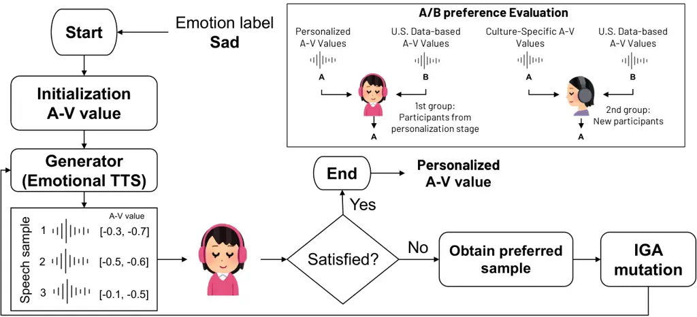
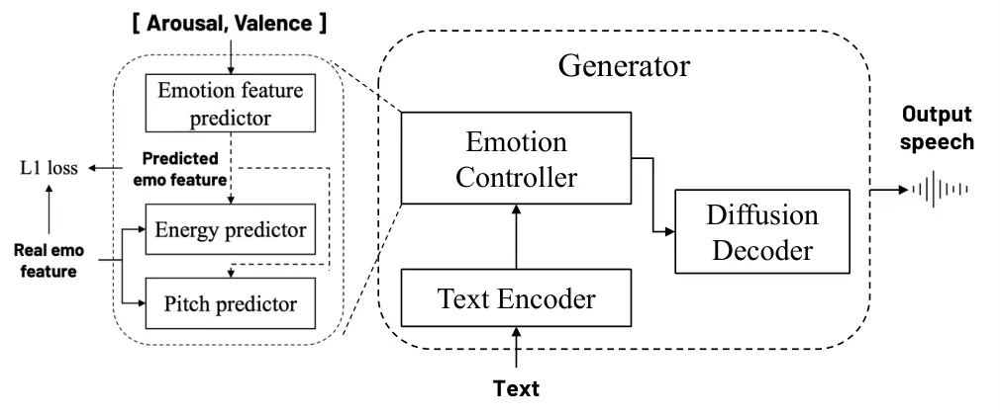
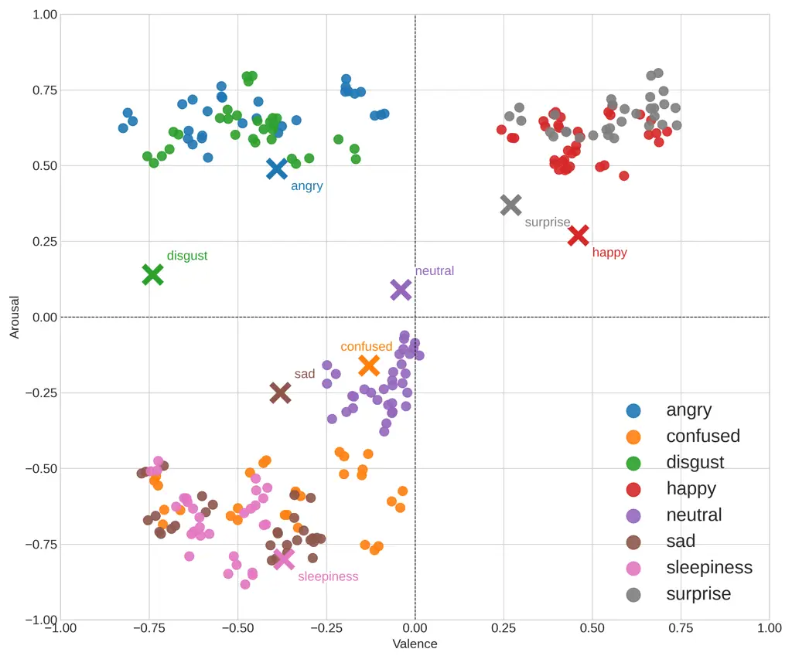
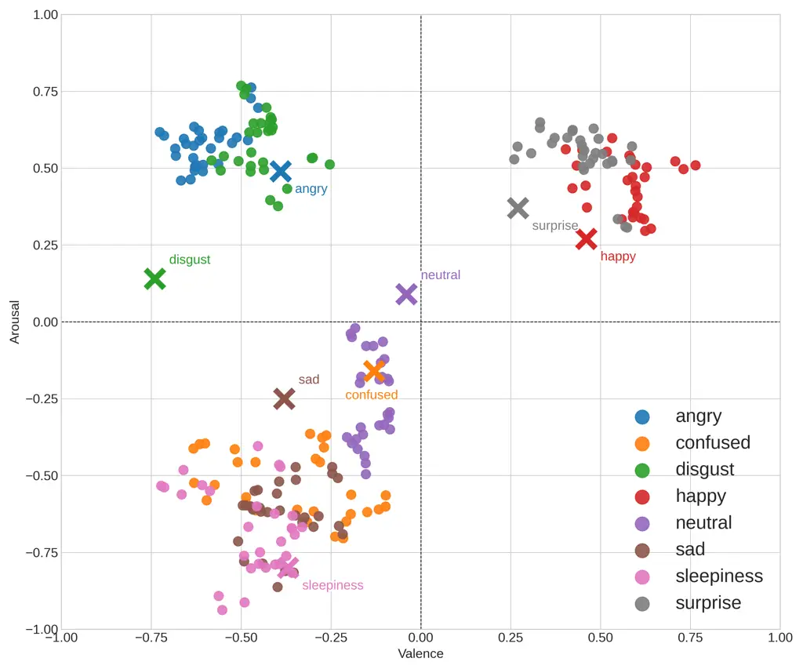
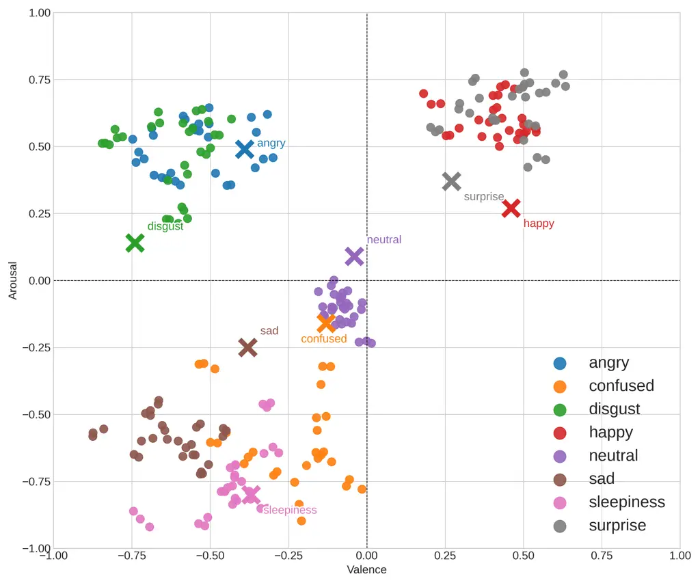
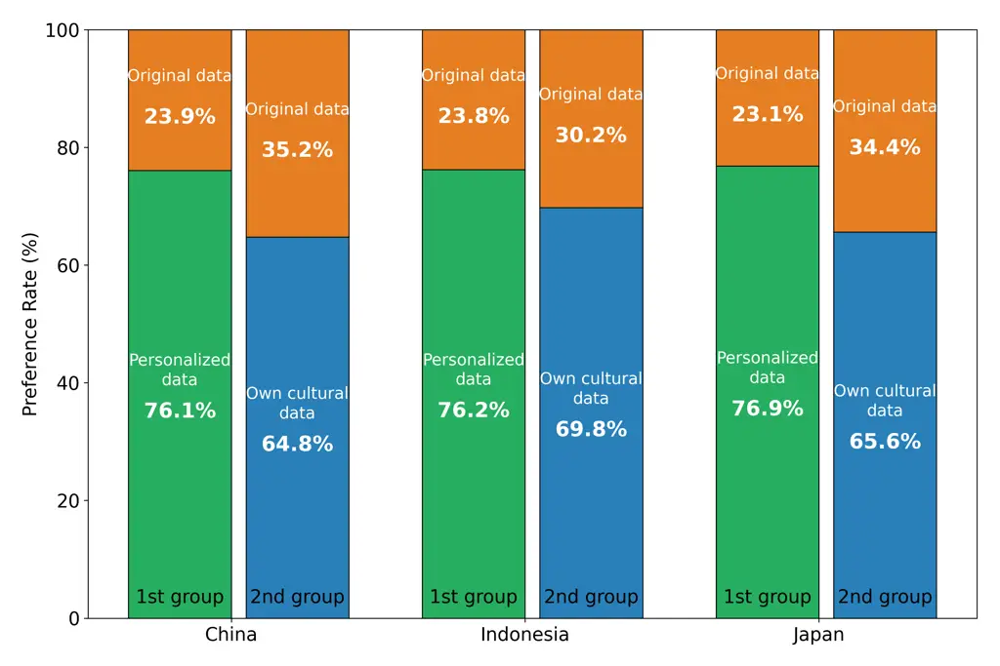

Zhou Atmaja Sakti

# Beyond One-Size-Fits-All: Personalized and Culturally Adaptive Emotional TTS via Interactive Optimization of Individual Emotion Perception Spaces

Wangzixi    Bagus Tris    Sakriani

###### Abstract

The rise of conversational AI has increased interest in emotional
Text-to-Speech (TTS). Most systems rely on discrete emotion labels,
which fail to capture the nuanced nature of human affect. Recent models
employ dimensional representations such as Russell’s arousal–valence
(A–V) model, offering finer control. However, emotional perception
varies across individuals and cultures, which may cause mismatches
between modeled and perceived emotions. We propose a personalized and
culturally adaptive emotional TTS framework that performs interactive
optimization of individualized A–V perception spaces using an
Interactive Genetic Algorithm. By adapting emotion representations to
each listener, the system produces speech with more perceptually aligned
emotional expression than models using averaged A–V values. Evaluations
with Japanese, Chinese, and Indonesian participants highlight the
importance of personalization and cultural adaptation for moving beyond
one-size-fits-all emotional TTS.

###### keywords

emotional text-to-speech, personalization and cultural adaptation,
emotion perception modeling

^(†)^(†)address: Nara Institute of Science and Technology, Japan
^(†)^(†)email: zhou.wangzixi.az3@naist.ac.jp, bagus.tris@naist.ac.jp,
ssakti@is.naist.jp

## 1 Introduction

Human emotion is inherently complex, shaped by subtle physiological,
psychological, and social factors. Rather than existing as simple
categorical states, emotional experiences lie on a continuum influenced
by personality, gender, culture, and situational context \[1\].
Capturing this variability is essential for speech synthesis systems
that aim to interact naturally with humans, as emotion conveys intent,
empathy, and engagement.

In affective computing, two widely adopted theoretical frameworks are
the Emotion Wheel \[2\], which organizes emotions into discrete
categories (e.g., happiness, sadness, anger), and Russell’s Circumplex
Model \[3\], which represents emotions along continuous dimensions of
arousal and valence. While state-of-the-art neural Text-to-Speech (TTS)
systems \[4, 5, 6, 7\] have achieved high quality and naturalness, many
emotional TTS approaches still rely on discrete style labels to
represent emotion \[8, 9, 10, 11\]. Such categorical representations
limit the expression of subtle affective variations and often produce
speech that sounds exaggerated or inflexible. To address this
limitation, arousal–valence (A–V) representations have been explored in
emotional TTS \[12, 13, 14\] to enable finer emotional control and
smoother transitions between affective states.

However, emotional perception is inherently subjective and culturally
influenced. Models trained on averaged annotations—often derived from a
single cultural population—implicitly assume a universal mapping between
acoustic cues and perceived emotion. This assumption overlooks both
individual variability and cross-cultural differences in emotional
interpretation. Consequently, even when dimensional control is
available, fixed A–V mappings may fail to align with a specific
listener’s perception of emotion.

Recent large-scale preference learning approaches, such as reinforcement
learning with human feedback (RLHF) \[15\] and related alignment methods
\[16\], have demonstrated success in aligning model behavior with human
preferences through gradient-based retraining. However, these approaches
typically target dataset-level alignment and require substantial
preference data and model updates. In contrast, our objective is rapid
per-user adaptation under extremely limited interactive feedback,
without modifying the backbone acoustic model.

To address this challenge, we formulate emotional personalization as a
low-dimensional perceptual optimization problem within the
arousal–valence control space of neural TTS. We introduce a lightweight
post-training personalization layer that refines emotion representations
for each listener using direct preference feedback. As a practical
instantiation of this interactive optimization process, we adopt an
Interactive Genetic Algorithm (IGA) \[17\] to iteratively adjust A–V
coordinates for target emotions. This design enables efficient
adaptation with minimal user interaction, without retraining the
pretrained TTS backbone or learning an explicit reward model.

Importantly, our approach personalizes the perceptual emotion mapping
while keeping the high-dimensional acoustic representation fixed. By
restricting adaptation to the low-dimensional emotion control space, the
framework enables practical per-user customization while preserving
model stability. Through this process, we obtain individualized variants
of Russell’s circumplex model that better reflect each listener’s
emotional interpretation.

Our key contributions are as follows:

- •
  We propose a lightweight post-training personalization framework for
  emotional TTS that adapts arousal–valence representations to
  individual listeners under limited interactive feedback, instantiated
  using an Interactive Genetic Algorithm (IGA).
- •
  We design an emotion controller that maps personalized A–V coordinates
  to high-dimensional acoustic features, enabling fine-grained and
  perceptually aligned emotional expression.
- •
  We conduct a cross-cultural evaluation involving Japanese, Chinese,
  and Indonesian participants, demonstrating that both individual
  personalization and cultural adaptation significantly improve
  emotional alignment compared to one-size-fits-all models.

Speech samples from experiments are available on the demo page¹¹ 1
https://37integer.github.io/Beyond-One-Size-Fits-All/.



(a) Human-in-the-loop personalization with IGA



(b) Architecture of the emotional TTS generator

Figure 1: Overview of the proposed framework: (a) human-in-the-loop
personalization using an Interactive Genetic Algorithm (IGA); (b)
architecture of the emotional TTS generator with the proposed emotion
controller.

## 2 Related Work

### 2.1 Controllable Emotional TTS

Emotional speech synthesis has evolved from categorical emotion
representations (e.g., “happy,” “sad”) \[8, 9, 10, 11\] to dimensional
emotion representations such as arousal, valence, and dominance \[12,
13, 14\]. Dimensional representations enable smoother and more
fine-grained affect modulation compared to discrete styles. However,
both categorical and dimensional emotional TTS models are typically
trained on averaged population-level annotations, implicitly assuming a
universal mapping between acoustic cues and perceived emotion. Such an
assumption overlooks individual and cultural variability in emotional
interpretation, potentially leading to mismatches between synthesized
emotion and listener perception.

### 2.2 Personalized Speech Synthesis

Personalization in TTS has primarily focused on speaker identity, voice
timbre, and prosodic style modeling \[18, 19, 20\]. These approaches
enable voice cloning and flexible speaking style control but do not
explicitly address personalization of emotional perception. Emotional
expression in neural TTS is typically modeled using population-level
representations, leaving individual and cultural differences in emotion
interpretation largely unexplored. Extending personalization to
emotional perception therefore remains an open challenge.

### 2.3 Preference-Guided Interactive Optimization

Preference-guided optimization incorporates human evaluation into the
learning or search process, making it particularly suitable for
subjective perceptual tasks. Large-scale alignment approaches such as
reinforcement learning with human feedback (RLHF) \[15\] and related
techniques \[16\] optimize model behavior through gradient-based
retraining using large preference datasets, primarily targeting global
model alignment.

In contrast, interactive optimization focuses on localized adaptation
under limited feedback. The Interactive Genetic Algorithm (IGA) \[17\],
an extension of traditional genetic algorithms \[21\], evolves candidate
solutions based on user preference rather than explicit objective
functions. IGA has been applied in visual design \[17\] and perceptual
audio optimization \[22\]. While evolutionary search appeared in earlier
unit concatenative TTS systems \[23\], its use as a lightweight
post-training perceptual adaptation mechanism for modern neural
emotional TTS with continuous A–V control remains largely unexplored.

Taken together, these limitations motivate the need for a framework that
directly adapts emotional representations to individual listeners
through efficient interactive optimization.

## 3 Proposed Framework

We propose a personalized emotional TTS framework with human-in-the-loop
preference learning. The overall architecture is illustrated in Fig. 1
and consists of two components: (a) emotion preference learning that
personalizes the arousal–valence (A–V) emotion space through user
feedback, and (b) an emotion-controllable speech generator conditioned
on A–V coordinates.

### 3.1 Emotion Preference Learning

As illustrated in Fig. 1, we propose an emotion preference learning
framework driven by an Interactive Genetic Algorithm (IGA). The primary
objective is to personalize the mapping from discrete emotion categories
to continuous A-V coordinates, aligning synthesized speech with each
listener’s perceptual preferences. The optimization procedure is
summarized in Algorithm 1. Given a target emotion (e.g., sad), the
system initiates an iterative optimization process: it generates a
population of candidate A–V coordinates, synthesizes the corresponding
speech samples, and dynamically refines these coordinates based on
explicit user feedback until a highly satisfactory emotional expression
is achieved.

1: Target emotion $`E`$, generator $`G`$, population size $`N`$

2: Initialize candidate coordinates $`\{e_{i}\}_{i=1}^{N}`$

3: Set generation counter $`g=1`$

4: repeat

5:   for $`i=1`$ to $`N`$ do

6:    Synthesize speech samples $`s_{i}=G(e_{i})`$

7:   end for

8:   Present $`\{s_{i}\}`$ to user and obtain preferred sample
$`S_{pref}`$

9:   Retain parent set $`P=\{e_{k}\mid s_{k}\in S_{pref}\}`$.

10:   for $`i=|P|+1`$ to $`N`$ do

11:    Generate new candidate $`\{e_{k}\}`$ according to Eq. 1

12:   end for

13:   Update mutation strength $`\mathcal{M}_{g+1}`$ according to Eq. 2

14:   $`g=g+1`$

15: until user satisfaction

16: return optimized personalized coordinate $`e_{k}`$

Algorithm 1 Emotion Preference Learning via IGA

During the preference learning, the user selects the samples that align
with their perception of the target emotion. Based on this preference,
the IGA evolves the new candidate set through a parent-based
reproduction mechanism. The user-selected candidates will be directly
preserved in the next generation. The algorithm utilizes multi-parent
arithmetic crossover and uniform mutation. Specifically, given the
preferred parent set $`P`$, a new child coordinate $`e_{k}`$ is
generated through a random weighted combination of all parents in $`P`$:

```math
e_{k}=\sum_{j=1}^{|P|}w_{j}p_{j}+\Delta, \tag{1}
```

where $`p_{j}\in P`$, and $`w_{j}\in[0,1]`$ are random weights
constrained by $`\sum_{j=1}^{|P|}w_{j}=1`$. The term
$`\Delta\sim\mathcal{U}(-\mathcal{M}_{g},\mathcal{M}_{g})`$ represents a
random mutation perturbation applied independently to the arousal and
valence dimensions.

To dynamically balance global exploration and local convergence, the
mutation strength $`\mathcal{M}_{g}`$ decays multiplicatively over
successive generations. The strength at generation $`g`$ is defined by
the following piecewise decay function:

```math
\mathcal{M}_{g}=\max(\mathcal{M}_{min},\mathcal{M}_{g-1}\cdot\gamma), \tag{2}
```

where the initial mutation strength is set to $`\mathcal{M}_{1}=0.20`$,
the decay rate is $`\gamma=0.90`$, and the lower bound is
$`\mathcal{M}_{min}=0.05`$. This human-in-the-loop interaction typically
converges within a few iterations once the listener’s internal emotional
criteria are met. Through this process, Russell’s circumplex model is
adaptively reshaped for each listener, enabling emotional speech
synthesis that reflects both individual and cultural perception
patterns.

### 3.2 Emotional Speech Generator with Emotion Controller

The speech generator architecture is shown in Fig. 1. We adopt Grad-TTS
\[24\] as the backbone and use Russell’s circumplex model \[3\],
represented by arousal and valence (A–V), as the control interface for
emotional speech synthesis. To achieve fine-grained emotional control,
we introduce an Emotion Controller module that maps A–V coordinates to
emotion-related acoustic features used by the generator.

As shown in Fig. 1, the Emotion Controller consists of three components:
the proposed Emotion Feature Predictor, a Pitch Predictor, and an Energy
Predictor (adapted from FastSpeech 2 \[25\]). These modules jointly
condition prosody on emotional cues and acoustic features, linking
emotional state to low-level speech dynamics.

The Emotion Feature Predictor bridges the gap between the
low-dimensional arousal–valence (A–V) space and high-dimensional emotion
representations extracted from speech. It learns a mapping
$`f_{\theta}`$ from an A–V coordinate $`e=[a,v]\in\mathbb{R}^{2}`$ to a
latent emotion feature vector $`h_{gt}\in\mathbb{R}^{D_{feat}}`$.

Training targets $`h_{gt}`$ are obtained from a pre-trained Speech
Emotion Recognition (SER) model \[26\], which encodes high-level
emotion-related acoustic features. Using these representations enables
the model to learn emotion-related acoustic structure without additional
manual annotation.

To enhance the representation capacity of the low-dimensional input, we
apply Gaussian Fourier feature mapping:

```math
\gamma(e)=[\sin(2\pi eB),\cos(2\pi eB)]\in\mathbb{R}^{D_{f}},
```

where $`B\in\mathbb{R}^{2\times(D_{f}/2)}`$ is a fixed Gaussian matrix
and $`D_{f}`$ is the Fourier feature dimension. The resulting feature
vector $`e_{ff}=\gamma(e)`$ is fed into a four-layer MLP consisting of
linear layers, SiLU activations, and dropout. A final linear projection
maps the output to the target feature dimension $`D_{feat}`$, producing
the predicted latent feature $`h_{pred}`$. The model is trained using an
L1 loss between $`h_{pred}`$ and $`h_{gt}`$.

During training, pitch and energy predictors are conditioned on
ground-truth emotion features. During inference, only the A–V coordinate
is required, and the Emotion Feature Predictor generates the
corresponding emotion representation used by the generator.

In our framework, the SER-derived feature space is trained prior to the
IGA process and remains fixed, providing a stable acoustic prior for
emotional speech synthesis. Personalization is achieved by adapting the
A–V coordinates through human-in-the-loop preference learning, allowing
users to reposition emotions according to subjective perception without
retraining the acoustic model.

## 4 Experimental Setup

### 4.1 Dataset and Training Setup

Dataset: We constructed a 9-hour American English female emotional
speech dataset (22.05 kHz) by combining EXPRESSO \[27\], EmoV-DB \[28\],
and ESD \[9\]. Since these datasets do not provide continuous
arousal–valence (A–V) annotations, we estimated A–V values using a
pre-trained Speech Emotion Recognition (SER) model \[26\].

Model and Training: Acoustic features were 80-dimensional
mel-spectrograms and HiFi-GAN \[29\] was used as the vocoder. As a
baseline, we implemented Grad-TTS with a simple A–V emotion embedding
layer. Models were trained for 2000 epochs using Adam on a single NVIDIA
RTX A6000 GPU. Default Grad-TTS hyperparameters were used unless
specified.

### 4.2 Human-in-the-Loop Personalization

We recruited 30 participants from three Asian cultural groups: Chinese,
Indonesian, and Japanese (10 per group, gender balanced). Seven emotions
were used: angry, confused, sad, happy, disgust, sleepiness, and
neutral.

Participants performed interactive personalization using the IGA loop
for three sentences per emotion. In each round, participants selected
the sample that best matched the target emotion. The process typically
converged within three rounds, producing a personalized A–V mapping for
each user. Cultural average A–V values were then computed for
cross-cultural analysis.

### 4.3 Evaluation Protocol

Objective Metrics: We evaluated 100 synthesized utterances using:

- •
  Word Error Rate (WER) for speech intelligibility.
- •
  Concordance Correlation Coefficient (CCC) \[30\] to measure emotional
  similarity by comparing SER-predicted A–V values between generated and
  reference speech.

Subjective Metrics: Listening tests involved 30 participants.

- •
  MOS: Participants rated the naturalness of 20 utterances on a
  five-point scale.
- •
  A/B preference: Two groups were used. The first group (15 participants
  from the personalization stage) compared personalized A–V speech with
  the baseline using averaged U.S. dataset A–V values. The second group
  (15 new participants) evaluated culturally adapted speech using
  Japanese, Chinese, and Indonesian A–V averages against the same
  baseline. All tests were conducted blindly.



(a) Chinese



(b) Indonesian



(c) Japanese

Figure 2: A–V distributions from the personalization process for (a)
Chinese, (b) Indonesian, and (c) Japanese participants. The $`\bullet`$
indicates participant-selected A–V values, and $`\times`$ indicates
averaged reference dataset values.

## 5 Experimental Results

### 5.1 Speech Quality and Emotional Similarity

Table 1 summarizes the performance of the emotional speech generator
before human-in-the-loop IGA personalization. We compare the baseline
Grad-TTS with emotion embedding against Grad-TTS with the proposed
emotion controller.

Our model increases MOS from 3.37 to 3.75 and achieves a 23.5% relative
reduction in WER, indicating improved speech naturalness and
intelligibility. Emotional similarity also improves, with CCC increasing
from 0.60 to 0.84 for arousal and from 0.64 to 0.77 for valence,
suggesting closer alignment between synthesized and reference emotional
characteristics.

|                     |                   |                       |                     |                     |
| ------------------- | ----------------- | --------------------- | ------------------- | ------------------- |
|                     | MOS $`\uparrow`$  | WER(%) $`\downarrow`$ | CCC(A) $`\uparrow`$ | CCC(V) $`\uparrow`$ |
| Ground truth        | 4.04 $`\pm`$ 0.09 | \-                    | \-                  | \-                  |
| Grad-TTS w/emo emb  | 3.37 $`\pm`$ 0.10 | 21                    | 0.60                | 0.64                |
| Grad-TTS w/emo ctrl | 3.75 $`\pm`$ 0.09 | 17                    | 0.84                | 0.77                |

Table 1: Results of MOS, WER, and CCC. Proposed method is shown in bold.
A: arousal, V: valence.

### 5.2 A–V Space after Personalization

Figure 2 shows A–V mappings obtained through the personalization
process. Most personalized A–V values deviate from those in the original
U.S.-based dataset, indicating that emotional perception varies across
individuals and cultures.

Chinese participants (Fig. 2) exhibit relatively narrow arousal ranges
but wider valence variation. Indonesian participants (Fig. 2) show
tighter clustering around emotion centers, suggesting more consistent
emotional interpretation within the group. Japanese participants
(Fig. 2) tend to map negative emotions to lower arousal and require
stronger expressions for positive emotions, reflecting a tendency toward
restrained emotional expression.

### 5.3 Subjective Evaluation

Personalization: Participants who completed the IGA personalization
process performed blind A/B comparisons between speech generated using
their personalized A–V values and speech generated using the U.S.-based
reference A–V baseline. As shown in Fig. 3 (left bars), participants
were unaware of which sample corresponded to their personalized mapping,
yet personalized speech achieved a preference rate of 76%. This result
indicates that listeners consistently favored speech aligned with their
own emotion perception.

Culture-specific evaluation: A second group of participants who did not
undergo personalization evaluated culturally adapted speech generated
using culture-specific A–V averages (Chinese, Indonesian, and Japanese)
against the U.S.-based baseline. As shown in Fig. 3 (right bars),
evaluations were conducted blindly, and participants were unaware of the
cultural source of each sample. Preference rates were 64.8%, 69.8%, and
65.6%, respectively, suggesting improved emotional alignment.

Cross-cultural evaluation: In addition, we also conducted a
cross-cultural evaluation in which participants ranked samples generated
using Chinese, Indonesian, and Japanese A–V values. Participants from
all three cultures consistently preferred samples generated with their
own culture’s A–V mapping. Chinese participants selected Chinese samples
65% of the time, while Japanese and Indonesian participants showed
preferences of 67% and 70%, respectively. These preliminary results
suggest group-level differences in preferred A-V mappings.



Figure 3: A/B preference test results.

## 6 Conclusion

We presented a novel personalized emotional TTS framework that
incorporates human-in-the-loop optimization with an Interactive Genetic
Algorithm to address the subjectivity of emotion perception. Our results
show that the proposed emotional controller improves both speech quality
and emotional similarity, while personalization highlights individual
and cultural variation in emotional preferences. These findings
underscore the need to move beyond generic emotional models toward
systems that adapt to both individual users and cultural contexts.
Future work will explore broader linguistic and cultural settings, as
well as strategies for real-time personalization, advancing the goal of
emotionally adaptive conversational AI.

## 7 Acknowledgement

Part of this work was supported by JSPS KAKENHI Grant Numbers JP24K0296
and JP25H01139, as well as JST NEXUS (JPMJNX25C1).

## 8 Generative AI Use Disclosure

Generative AI tools were used only for minor language editing, such as
grammar checking and wording refinement to improve clarity. All
manuscript content and scientific work—including problem formulation,
methodology development, experimental design and execution, and data
analysis- were conducted entirely by the authors. The authors reviewed
the final manuscript and take full responsibility for its accuracy and
integrity.

## References

- \[1\] A. H. Fischer, P. M. Rodriguez Mosquera, A. E. Van Vianen,
  and A. S. Manstead (2004) Gender and culture differences in emotion..
  Emotion 4 (1), pp. 87. Cited by: §1.
- \[2\] R. Plutchik and H. Kellerman (2013) Theories of emotion. Vol. 1,
  Academic press. Cited by: §1.
- \[3\] J. A. Russell (1980) A circumplex model of affect.. Journal of
  personality and social psychology 39 (6), pp. 1161. Cited by: §1,
  §3.2.
- \[4\] S. Mehta, R. Tu, J. Beskow, É. Székely, and G. E. Henter (2024)
  Matcha-tts: a fast tts architecture with conditional flow matching. In
  ICASSP 2024-2024 IEEE International Conference on Acoustics, Speech
  and Signal Processing (ICASSP), pp. 11341–11345. Cited by: §1.
- \[5\] Y. Chen, Z. Niu, Z. Ma, K. Deng, C. Wang, J. JianZhao, K. Yu,
  and X. Chen (2025) F5-tts: a fairytaler that fakes fluent and faithful
  speech with flow matching. In Proceedings of the 63rd Annual Meeting
  of the Association for Computational Linguistics (Volume 1: Long
  Papers), pp. 6255–6271. Cited by: §1.
- \[6\] K. Shen, Z. Ju, X. Tan, Y. Liu, Y. Leng, L. He, T. Qin, S. Zhao,
  and J. Bian (2023) Naturalspeech 2: latent diffusion models are
  natural and zero-shot speech and singing synthesizers. arXiv preprint
  arXiv:2304.09116. Cited by: §1.
- \[7\] Y. A. Li, C. Han, V. Raghavan, G. Mischler, and N.
  Mesgarani (2023) Styletts 2: towards human-level text-to-speech
  through style diffusion and adversarial training with large speech
  language models. Advances in neural information processing systems 36,
  pp. 19594–19621. Cited by: §1.
- \[8\] H. Barakat, O. Turk, and C. Demiroglu (2024) Deep learning-based
  expressive speech synthesis: a systematic review of approaches,
  challenges, and resources. EURASIP Journal on Audio, Speech, and Music
  Processing 2024 (1), pp. 11. Cited by: §1, §2.1.
- \[9\] K. Zhou, B. Sisman, R. Liu, and H. Li (2022) Emotional voice
  conversion: theory, databases and esd. Speech Communication 137,
  pp. 1–18. Cited by: §1, §2.1, §4.1.
- \[10\] D. Diatlova and V. Shutov (2023) Emospeech: guiding fastspeech2
  towards emotional text to speech. arXiv preprint arXiv:2307.00024.
  Cited by: §1, §2.1.
- \[11\] X. Gao, C. Zhang, Y. Chen, H. Zhang, and N. F. Chen (2025)
  Emo-dpo: controllable emotional speech synthesis through direct
  preference optimization. In ICASSP 2025-2025 IEEE International
  Conference on Acoustics, Speech and Signal Processing (ICASSP),
  pp. 1–5. Cited by: §1, §2.1.
- \[12\] D. Cho, H. Oh, S. Kim, S. Lee, and S. Lee (2024) Emosphere-tts:
  emotional style and intensity modeling via spherical emotion vector
  for controllable emotional text-to-speech. arXiv preprint
  arXiv:2406.07803. Cited by: §1, §2.1.
- \[13\] D. Cho, H. Oh, S. Kim, and S. Lee (2025) EmoSphere++:
  emotion-controllable zero-shot text-to-speech via emotion-adaptive
  spherical vector. IEEE Transactions on Affective Computing. Cited by:
  §1, §2.1.
- \[14\] S. Liang, R. Zhou, and Q. Yuan (2025) ECE-tts: a zero-shot
  emotion text-to-speech model with simplified and precise control.
  Applied Sciences 15 (9), pp. 5108. Cited by: §1, §2.1.
- \[15\] L. Ouyang, J. Wu, X. Jiang, D. Almeida, C. Wainwright, P.
  Mishkin, C. Zhang, S. Agarwal, K. Slama, A. Ray, et al. (2022)
  Training language models to follow instructions with human feedback.
  Advances in neural information processing systems 35, pp. 27730–27744.
  Cited by: §1, §2.3.
- \[16\] T. Kaufmann, P. Weng, V. Bengs, and E. Hüllermeier (2024) A
  survey of reinforcement learning from human feedback. Cited by: §1,
  §2.3.
- \[17\] S. Cho (2002) Towards creative evolutionary systems with
  interactive genetic algorithm. Applied Intelligence 16 (2),
  pp. 129–138. Cited by: §1, §2.3.
- \[18\] W. Hsu, Y. Zhang, R. J. Weiss, H. Zen, Y. Wu, Y. Wang, Y.
  Cao, Y. Jia, Z. Chen, J. Shen, et al. (2018) Hierarchical generative
  modeling for controllable speech synthesis. arXiv preprint
  arXiv:1810.07217. Cited by: §2.2.
- \[19\] J. Shen, R. Pang, R. J. Weiss, M. Schuster, N. Jaitly, Z.
  Yang, Z. Chen, Y. Zhang, Y. Wang, R. Skerrv-Ryan, et al. (2018)
  Natural tts synthesis by conditioning wavenet on mel spectrogram
  predictions. In 2018 IEEE international conference on acoustics,
  speech and signal processing (ICASSP), pp. 4779–4783. Cited by: §2.2.
- \[20\] E. Casanova, J. Weber, C. D. Shulby, A. C. Junior, E. Gölge,
  and M. A. Ponti (2022) Yourtts: towards zero-shot multi-speaker tts
  and zero-shot voice conversion for everyone. In International
  conference on machine learning, pp. 2709–2720. Cited by: §2.2.
- \[21\] S. Katoch, S. S. Chauhan, and V. Kumar (2021) A review on
  genetic algorithm: past, present, and future. Multimedia tools and
  applications 80 (5), pp. 8091–8126. Cited by: §2.3.
- \[22\] M. Fukumoto and K. Hijikuro (2020) Optimization of sound of
  autonomous sensory meridian response with interactive genetic
  algorithm. In 2020 Joint 11th International Conference on Soft
  Computing and Intelligent Systems and 21st International Symposium on
  Advanced Intelligent Systems (SCIS-ISIS), pp. 1–6. Cited by: §2.3.
- \[23\] L. Formiga, F. Alías, and X. Llorà (2010) Evolutionary process
  indicators for active igas applied to weight tuning in unit selection
  tts synthesis. In IEEE Congress on Evolutionary Computation, pp. 1–8.
  Cited by: §2.3.
- \[24\] V. Popov, I. Vovk, V. Gogoryan, T. Sadekova, and M.
  Kudinov (2021) Grad-tts: a diffusion probabilistic model for
  text-to-speech. In International conference on machine learning,
  pp. 8599–8608. Cited by: §3.2.
- \[25\] Y. Ren, C. Hu, X. Tan, T. Qin, S. Zhao, Z. Zhao, and T.
  Liu (2020) Fastspeech 2: fast and high-quality end-to-end text to
  speech. arXiv preprint arXiv:2006.04558. Cited by: §3.2.
- \[26\] J. Wagner, A. Triantafyllopoulos, H. Wierstorf, M. Schmitt, F.
  Burkhardt, F. Eyben, and B. W. Schuller (2023) Dawn of the transformer
  era in speech emotion recognition: closing the valence gap. IEEE
  Transactions on Pattern Analysis and Machine Intelligence, pp. 1–13.
  Cited by: §3.2, §4.1.
- \[27\] T. A. Nguyen, W. Hsu, A. d’Avirro, B. Shi, I. Gat, M.
  Fazel-Zarani, T. Remez, J. Copet, G. Synnaeve, M. Hassid, et
  al. (2023) Expresso: a benchmark and analysis of discrete expressive
  speech resynthesis. arXiv preprint arXiv:2308.05725. Cited by: §4.1.
- \[28\] A. Adigwe, N. Tits, K. E. Haddad, S. Ostadabbas, and T.
  Dutoit (2018) The emotional voices database: towards controlling the
  emotion dimension in voice generation systems. arXiv preprint
  arXiv:1806.09514. Cited by: §4.1.
- \[29\] J. Kong, J. Kim, and J. Bae (2020) HiFi-GAN: Generative
  adversarial networks for efficient and high fidelity speech synthesis.
  Adv. Neural Inf. Process. Syst. 2020-December (NeurIPS). External
  Links: 2010.05646, ISSN 10495258 Cited by: §4.1.
- \[30\] B. T. Atmaja and M. Akagi (2021) Evaluation of error- And
  correlation-based loss functions for multitask learning dimensional
  speech emotion recognition. J. Phys. Conf. Ser. 1896 (1), pp. 012004.
  External Links:
  [Document](https://dx.doi.org/10.1088/1742-6596/1896/1/012004),
  2003.10724, ISSN 17426596 Cited by: 2nd item.
