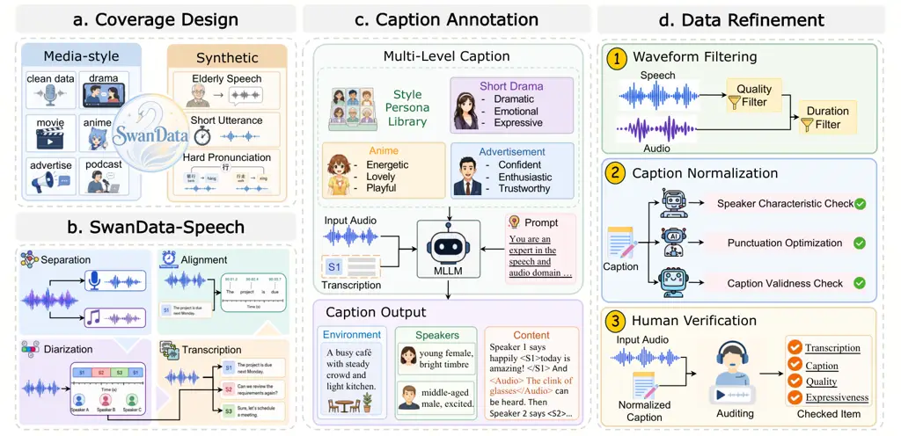
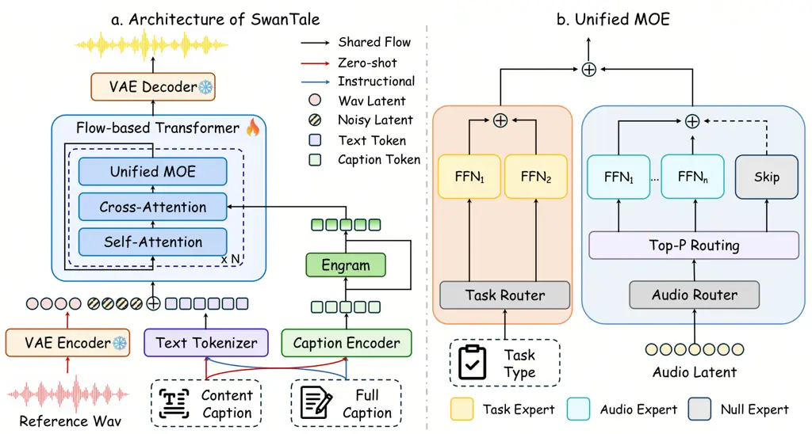
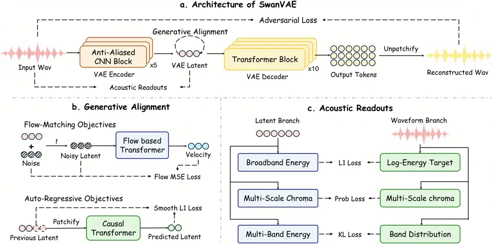

1\]ByteDance 2\]Zhejiang University \contribution\[\*\]Equal
contribution \contribution\[†\]Corresponding author
\correspondence[{zhangyu.34,liruiqi.23,yinxiang.stephen}@bytedance.com](mailto:zhangyu.34@bytedance.com,liruiqi.23@bytedance.com,yinxiang.stephen@bytedance.com)
\project[https://swanaigc.github.io/#swantale](https://swanaigc.github.io/#swantale)

# ![[Uncaptioned image]](arxiv-2608-02023--6d06898cceef.figures/figure-1.webp) SwanTale: Unified Multi-Speaker Speech and Audio Generation for Instruct and Zero-Shot Tasks

Yu Zhang    Ruiqi Li    Changhao Pan    Ke Lei    Xiang Yin    Cheng
Yang Affiliation: \[ Affiliation: \[

###### Abstract

Speech and audio generation is often needed in animation dubbing, audio
drama, movies, advertising, games, podcasts, and short-video production.
In these scenarios, creators may need to design voices without reference
recordings, control speaker styles with natural language, support
acoustic scenes with environments and audio effects, and later reuse the
designed voices. Therefore, it is important to support multi-speaker
speech and audio generation for both instruct and zero-shot tasks. The
instruct task requires a caption of the environment, speaker styles, and
fine-grained content, while the zero-shot task uses reference audio
together with the same fine-grained content. We address these tasks from
both the data and model sides. First, we propose SwanData-Caption, which
cleans raw speech and audio data, adds targeted synthetic coverage, and
annotates diverse and accurate multi-level captions. Then, we propose
SwanTale, a multi-speaker expressive speech and audio generation model
that supports both zero-shot and instruct tasks. We introduce SwanVAE to
support high-quality multi-audio-modality generation. Then, we adopt
reward-conditioned quality control and Engram conditioning, along with
Unified MoE for multi-task and multi-audio-modality modeling. In
addition, we use curriculum learning and GRPO post-training to let the
model progressively learn and strengthen its capabilities. Experimental
results show that SwanTale leads on multiple key zero-shot and instruct
metrics, achieves the best expressiveness scores in both tasks, and
supports complex instruct generation involving multi-speaker speech and
audio.

## 1 Introduction

Recent text-to-speech (TTS) systems have made substantial progress in
zero-shot speech synthesis. Given only a short reference audio clip,
these systems can synthesize vivid new content according to the
reference voice \[13, 21, 83, 49, 43\]. This capability has made speaker
voice cloning and multi-speaker speech generation practical when the
desired voice already exists in a recording \[103, 51, 117, 63, 94,
113\]. Media creation, however, often begins from the opposite case. In
animation dubbing, audio drama, movies, advertising, games, podcasts,
and short-video production, the target speaker may not have a reference
recording at all. Creators need to design a voice from scratch, specify
how the character should perform a line, and place that line inside an
acoustic scene that changes how the performance is perceived; later, the
designed voice may be reused through zero-shot synthesis. A modern TTS
system for such workflows should therefore support both the zero-shot
task with reference audio and the instruct task controlled by natural
language captions.

In the classical zero-shot speech synthesis task, the input is speech
content paired with reference audio. The reference audio provides
speaker identity. In addition to speech content and, for dialogue tasks,
speaker-turn labels, recent systems increasingly use local style
descriptions to control emotion and speaking rate \[8, 22\]. By
contrast, in the instruct speech synthesis task, the input is only a
caption, which may describe the environment, speaker styles, and
fine-grained content. Here, _environment_ includes scene type,
sound-field or recording-space cues, and persistent background audio
effects \[44, 118, 70\]. _Speaker styles_ include not only gender and
age, but also persona, role, timbre, habitual style, and other stable
voice traits. _Fine-grained content_ covers the information in
additional local style descriptions and can also describe local audio
effects \[114, 108, 35\]. Existing instruct TTS systems can already
control dimensions such as speaker age, gender, emotion, and pace \[60,
41, 8, 80, 38\]. Yet most of them still generate only speech. For
scenarios that require environment and local audio effects, if these
components are produced by a downstream audio pipeline, their timing,
loudness, reverberation, and acoustic texture can drift away from the
speech even when each component is plausible in isolation. Existing
designs also often reduce speaker control to decomposed attribute
labels, while creators may want a persona description in natural
language to map directly to a voice. Finally, existing instruct TTS
systems are usually not designed to preserve zero-shot capability in the
same model. Therefore, supporting both long-form multi-speaker zero-shot
and highly expressive instruct speech generation with environment,
speaker personas, fine-grained content, and audio effects remains an
open problem.

Overall, this task faces three main challenges. (1) Data scarcity.
Zero-shot TTS can rely on public speech corpora \[100, 9, 52, 84, 73\],
but diverse and high-quality caption data for the instruct task requires
richer audio coverage and more detailed caption annotation. Collecting
expressive speech data, as well as clean audio data, is costly \[98,
111, 34\], and annotating multi-level natural-language captions is also
expensive \[95, 109, 36\]. (2) Task compatibility. Instruct samples
describe speaker styles through natural-language captions, whereas
zero-shot samples obtain speaker styles from reference audio. At the
same time, both tasks need to share fine-grained content captions. Joint
training must preserve the shared speech modeling while preventing the
two conditioning paths from weakening each other \[77, 110\]. (3)
Multi-audio-modality complexity. Our task aims to generate expressive
speech, general audio, occasional singing voice, and music within a
single waveform, while preserving intelligibility and speaker identity
\[99, 65, 61\]. These components have different temporal structures:
speech needs lexical alignment and stable identity, environmental audio
should remain stable, local audio effects are transient, while singing
voice and music need to stay in tune \[107, 62, 112\].

To obtain caption data at this granularity, we construct
SwanData-Caption, a pipeline that converts diverse speech-centered media
audio into multi-level, multi-style captions. Its coverage design stage
combines internal data with targeted synthetic subsets, so special
styles, like pronunciation-challenging text, are not left to incidental
coverage. The SwanData-Speech preprocessing stage provides each caption
with reliable speech spans and speaker-attributed text anchors. The
caption annotation stage then labels the environment, speakers, and
fine-grained content fields, while the style-persona library
substantially enriches the descriptions and characteristics of speaker
styles. Finally, to improve data quality, the data refinement stage uses
waveform filtering and caption auditing to select and polish
high-quality, expressive, and accurately annotated data.

On the modeling side, we propose SwanTale, a multi-speaker expressive
TTS and audio generation model that supports both zero-shot and instruct
tasks. To handle multi-audio-modality generation, we design SwanVAE,
whose architecture improves reconstruction quality while reducing the
learning burden of the DiT prior. In the flow-based Transformer, we
apply reward-conditioned quality control, which conditions inference on
the highest quality without reinforcement learning, and Engram
conditioning. To support both tasks and improve compatibility across
audio modalities, we design Unified MoE with a task router and an audio
router. We also use curriculum learning, moving from zero-shot ability
to caption-conditioned generation, then to full-mixture training and
expressive high-quality supervised fine-tuning. Finally, GRPO
post-training improves pronunciation accuracy, generation stability, and
caption-conditioned speaker-attribute control.

For experiments, we evaluate zero-shot monologue and dialogue TTS on
SwanBench-Speech \[72\]. We also evaluate instruction following on
InstructTTSEval \[41\], and acoustic quality on SwanBench-Scene. We also
build SwanBench-Caption for heterogeneous instruct generation with
dialogue speech and audio. Experimental results show that SwanTale leads
on multiple key zero-shot and instruct metrics, achieves the best
expressiveness scores in both tasks, and supports complex instruct
generation involving multi-speaker speech and audio.

## 2 Data Pipeline: SwanData-Caption

SwanTale is trained from fine-grained captions rather than transcripts
alone. For complex multi-speaker speech and audio data, basic speech
transcription and speaker turns are not enough; the model also needs
multi-level caption annotations \[53\]. Figure 1 summarizes our data
processing pipeline. The following subsections correspond to the same
four blocks: coverage design, SwanData-Speech preprocessing, caption
annotation, and data refinement. The current mixture contains
approximately 70M caption records.



Figure 1: Overview of the four-stage SwanData-Caption data processing
pipeline, including coverage design, SwanData-Speech preprocessing,
caption annotation, and data refinement.

### 2.1 Coverage Design

Media-style coverage. SwanData-Caption is built from internal,
real-world, speech-centered, and media-style data, covering speech,
audio effects, and background music. Figure 1 shows representative
examples of this coverage design, like short dramas, advertisements, and
animations. The coverage spans diverse speaker densities, recording
conditions, character styles, scene locations, sound-field conditions,
persistent background effects, fine-grained delivery changes, and local
audio effects. This design supports expressive speech generation in
settings where speech and scene audio must be modeled together.

Targeted synthetic coverage. Relying solely on real corpora leaves many
rare scenarios underrepresented. Following SwanVoice \[63\], we
incorporate three targeted synthetic subsets. A phoneme-aware TTS
teacher \[50\] is employed to generate these subsets to maintain
pronunciation accuracy, with each containing 100k utterances. (1)
Elderly speech: Because elderly speech remains underrepresented in
existing speech datasets \[12\], we expand the limited elderly-speaker
data to improve the model’s demographic age coverage. The average
duration is about 10 seconds. (2) Short utterances in Chinese and
English: These utterances range from single words and names to standard
short sentences and have an average duration of 1.5 seconds. Many
real-world TTS applications require sub-second spoken content, and this
subset enhances model stability in such conditions. (3) Challenging
pronunciation targets: These are primarily Chinese texts featuring
polyphonic characters, proper nouns, brand names, English insertions,
and mixed-language phrases. For these pronunciation-sensitive examples,
the model-facing target text remains unchanged, while the teacher
model’s input incorporates pronunciation hints to ensure the synthesized
waveform reflects the intended reading. We process these data using
pypinyin \[40\]. Overall, human listeners are highly sensitive to errors
in polyphonic characters and brand names, yet models encounter few such
examples, and existing annotations are often inaccurate; therefore, this
specific expansion is essential. The average duration is approximately
10 seconds.

### 2.2 SwanData-Speech Preprocessing

This stage reuses the SwanData-Speech backbone \[63\] for
speech-centered segments rather than pure audio-only clips. Its role is
to prepare clean speech spans and reliable text anchors.

Separation. For mixed-media audio, we first separate vocal and residual
background streams with Ultimate Vocal Remover \[2\]. The vocal stream
is used for higher-quality diarization, transcription, and alignment. We
keep the original audio with the environmental sound field and local
audio effects needed for captioning.

Diarization. Speaker diarization is performed with the 3D-Speaker
toolkit \[11\], which combines VAD, CAM++ embeddings \[90\], and
clustering. For single-speaker data, we keep segments between 1 and 60
seconds. For multi-speaker data, we allow segments up to 120 seconds and
require at least two speaker turns whenever possible. Diarization model
accuracy is limited, so we use it only for coarse data segmentation;
real speaker discrimination is left to the subsequent caption
annotations.

Transcription. ASR is applied to the vocal stream with Seed-ASR 2.0
\[7\]. We also use SenseVoice ASR \[1\] for an additional ASR-based
pronunciation check. Specifically, we do not trust punctuation from
these ASR tools, because their punctuation depends more on semantics
than on actual pauses.

Alignment. SwanAligner \[63\] aligns the ASR transcript with the vocal
stream and stores pause evidence for later post-processing. This module
is related to forced-alignment and word-timestamping systems \[78, 4,
39\]. Specifically, we let the subsequent caption annotation provide
suitable punctuation according to semantics, such as exclamation marks
and question marks, and then use the aligner results for correction,
instead of making the aligner convert all punctuation into fixed commas
and periods from the beginning.

### 2.3 SwanData-Caption Annotation

To provide structured supervision for controllable audio generation, we
develop SwanData-Caption, an automatic annotation pipeline that converts
raw audio and ASR transcripts into unified, fine-grained captions.

Annotation inputs. We use Seed2.0 Lite \[6\] as the caption annotator.
The annotator receives the target audio, the de-punctuated transcript,
and a captioning prompt. In the transcript, ASR outputs from multiple
speakers may be concatenated together, so the model is required to
segment speakers, split sentences, and add semantically appropriate
punctuation. The captioning prompt specifies a strict output format and
strict behavioral requirements for the model, and provides suitable
examples tailored to each dataset to be annotated. Our constraints
include, for example, that Speaker IDs must be contiguous, every speaker
span in Content must match an entry in Speakers, and the ASR text inside
speaker tags must preserve the original language.

Style-persona library. We find that, without sufficient examples, the
model produces highly impoverished speaker styles, lacks plausible
persona information, and often relies on only a few individual examples.
Therefore, we design a style-persona library as a soft prior during
annotation. In particular, we construct separate style matrices for
three media families with strong stylistic priors: animation, short
drama and film/TV drama, and advertisement/digital-human content. These
matrices specify scene triggers, the preferred ordering of stable
speaker descriptors, and the boundary between stable speaker profiles
and transient local delivery. Animation uses a dubbing-style baseline
with role-like vocal archetypes; short drama and film/TV drama allow
plot-supported role identity and dramatic delivery; and
advertisement/digital-human content emphasizes persona type, voice-style
class, timbre, and stable product-pitch delivery. The library does not
introduce labels that are not audible; instead, it guides the annotator
to describe stable speaker traits in the Speakers field and leave
transient emotion or emphasis to the Content field. The condensed style
matrices are provided in Appendix 6. For ordinary data, we omit these
style matrices to avoid introducing unsupported attributes.

Caption output. Each caption contains the three fields described in
Table 1. Scene location, sound-field impression, recording space,
reverberation, and persistent background sounds or effects are assigned
to Environment. Only speakers who actually speak are included in
Speakers, where their detailed speaking styles are described.
Fine-grained local style descriptions, such as emotion, together with
local audio effects, are written in Content. The Content field supports
both zero-shot and instruct TTS. An example caption is:

Environment: {an antique courtyard interior with a quiet ambience; faint
\<Audio\>wind and dripping water from the eaves\</Audio\> can be heard
in the distance.} Speakers: {Speaker 1: a young woman, a reborn heroine,
calm, with a low pitch and a cold tone.} Content: {Speaker 1 speaks in
an icy and scrutinizing tone: \<S1\>What you owe me, I will make you
spit it back out, mouthful by mouthful, with your own hands!\</S1\>}.

| Field       | Description                                                                                                                                                                                                                                                                                                                                                                                          |
| ----------- | ---------------------------------------------------------------------------------------------------------------------------------------------------------------------------------------------------------------------------------------------------------------------------------------------------------------------------------------------------------------------------------------------------- |
| Environment | Scene-level environment and recording context, including location or place description, sound-field impression, room or recording-space cues, microphone characteristics, reverberation, background music, crowd murmur, traffic, wind, rain, electrical hum, keyboard tapping, appliance noise, distant footsteps, or other persistent background sound or effects that function as the scene bed.  |
| Speakers    | The inventory of actually speaking subjects. Each speaker is described by perceived gender, age range, persona or role when audible from delivery, stable timbre, articulation, loudness tendency, speaking rate, accent, habitual style, and stable affective tendency.                                                                                                                             |
| Content     | A chronological content field and fine-grained local style description. Speech is wrapped by speaker tags such as \<S1\> and \</S1\>; local audio effects are wrapped by \<Audio\> and \</Audio\>. Fine-grained local style, including changes in emotion, volume, pace, pause, emphasis, hesitation, interruption, code-switching, and nearby effect context, is described around the tagged spans. |

Table 1: Output-field definitions used in the caption annotation schema.

### 2.4 Data Refinement

Waveform filtering. To filter speech samples by acoustic quality, we
apply the following waveform-level criteria only to speech data.
Candidate speech clips are first scored with DNSMOS \[79\] and
reference-free estimates from torchaudio-SQUIM \[57\], including STOI-
and PESQ-related scores \[101, 81\]. In the default filtering
configuration, speech samples are removed if PESQ is below 2.0, STOI is
below 0.85, SI-SDR is below 0, or MOS is below 2.5. The duration filter
keeps retained speech segments between 1 and 120 seconds, with an
average duration of about 10 seconds across the retained speech set.

Caption normalization. Caption normalization checks speaker
characteristics, punctuation, and caption validity. SwanVerifier, a
lightweight waveform-grounded attribute model described in Appendix 7,
checks gender and age-range labels against the vocal stream and flags
inconsistent speaker descriptions for removal. Punctuation is normalized
only for spoken content. We use alignment data from SwanAligner to
regularize pause marks and obvious boundary punctuation. If the original
punctuation meets the pause requirements, we preserve it; otherwise, we
replace or remove it. This allows special punctuation annotated by the
annotator, such as exclamation marks and question marks, to be retained,
rather than converting all punctuation into periods and commas.
Caption-validity checks remove illegal speaker indices, unmatched
speaker spans, missing required fields, unused speaker descriptions, or
local text that disagrees with the transcript after punctuation
stripping.

Human verification. Human auditors review transcription accuracy,
caption quality, audio quality, and expressiveness. They correct ASR
errors, speaker-attribution mistakes, omitted local audio effects,
inaccurate environment descriptions, and captions that over-interpret
non-audible information. They also inspect failure modes that are often
missed by objective metrics, like crowd leakage, separation artifacts,
and speaker confusion in dense dialogue. In addition, they annotate
audio-quality issues such as background noise, unclear articulation,
severe word elision, unnatural accents, electronic artifacts, and
audible editing traces.

Expressiveness is audited through group-wise best–worst comparison.
Within each matched group and task type, we sample four valid candidates
and ask annotators to select the most expressive and the least
expressive one, considering naturalness, emotion strength, prosodic
variation, and contextual appropriateness. Compared with MOS, this
protocol does not require annotators to maintain a globally consistent
absolute scoring standard across different speakers, contents, and
tasks. Annotators only need to judge relative extremes within a
controlled group, which reduces scale bias and calibration noise.
Compared with pairwise A/B testing, our best–worst comparison method is
much more annotation-efficient \[54\].

## 3 Method: SwanTale

This section introduces SwanTale. We first describe SwanVAE, the 48 kHz
waveform-latent autoencoder. Then we present the flow-based Transformer,
including content, caption, speaker-turn, Engram conditioning, and
reward-conditioned quality control. We next introduce Unified MoE for
zero-shot and instruct tasks with multiple audio modalities, followed by
curriculum training, GRPO post-training, and inference procedure.



Figure 2: Overview of SwanTale. Figure (a) shows the architecture of
SwanTale, and Figure (b) shows Unified MoE. In (a), the zero-shot path
supplies reference audio, while both tasks share text and caption. In
(b), a task router selects experts at the sample level, while an audio
router applies Top-$`P`$ routing over frame-level audio and null
experts.

### 3.1 SwanVAE

SwanTale operates on the continuous acoustic latents produced by
SwanVAE. Designing this latent space involves a three-way balance among
reconstruction fidelity, representation compactness, and learnability by
the downstream flow model. A lower latent rate shortens the sequence
used for long-form generation, but it also requires each latent frame to
carry more acoustic information. Encoding fine waveform detail improves
reconstruction, yet the resulting latent distribution can become harder
for the flow model to predict. SwanVAE represents 48 kHz mono audio as
96-dimensional latents at 25 Hz. The encoding path uses a local
anti-aliased convolutional encoder and a Gaussian VAE bottleneck, and
most waveform synthesis capacity is placed in a decoder-side Transformer
Resampling Block adapted from SAME \[74\]. SwanVAE is intentionally
restricted to local acoustic modeling, with longer-range sequence
modeling handled by the downstream DiT. Figure 3 summarizes the SwanVAE
architecture and the training-only objectives used to shape its
posterior mean.



Figure 3: Overview of SwanVAE. (a) The anti-aliased convolutional
encoder, Gaussian variational bottleneck, and local Transformer decoder.
(b) Generative alignment through flow matching and causal latent
prediction. (c) Energy, multi-scale chroma, and multi-band energy
readouts with waveform-derived targets. The decoder receives posterior
samples $`\mathbf{z}`$, while the alignment objectives operate on the
posterior mean $`\bm{\mu}_{\phi}`$ exclusively during the SwanVAE
training stage and do not enter the downstream generator at inference
time.

#### 3.1.1 Architecture

Encoder. The encoder begins with a weight-normalized 1-D convolution,
followed by five downsampling stages with rates $`[4,4,4,5,6]`$. Their
product gives the 1920-sample hop required for a 25 Hz latent sequence.
Each stage contains three residual units with dilation factors $`1`$,
$`3`$, and $`9`$, followed by a strided projection. A fixed low-pass
filter is applied before temporal decimation to reduce aliasing at large
strides \[104\]. A learnable high-frequency envelope shortcut with a
small initial gain is added alongside the filtered path. The channel
width grows from 64 to 1536. No Transformer layer is used in the
encoder, whose waveform receptive field is approximately 0.95 s in the
exact configuration used here.

Variational bottleneck. Two $`1\times 1`$ convolutional heads map the
encoder output to the posterior mean $`\bm{\mu}_{\phi}`$ and
log-variance $`\log\bm{\sigma}_{\phi}^{2}`$. For an input waveform
$`\mathbf{x}`$, the posterior and its reparameterized sample are

```math
q_{\phi}(\mathbf{z}\mid\mathbf{x})=\mathcal{N}\!\left(\bm{\mu}_{\phi}(\mathbf{x}),\operatorname{diag}\!\left(\bm{\sigma}_{\phi}^{2}(\mathbf{x})\right)\right),\qquad\mathbf{z}=\bm{\mu}_{\phi}(\mathbf{x})+\bm{\sigma}_{\phi}(\mathbf{x})\odot\bm{\epsilon},\quad\bm{\epsilon}\sim\mathcal{N}(\mathbf{0},\mathbf{I}). \tag{1}
```

The sampled latent $`\mathbf{z}`$ is passed to the decoder during VAE
training. SwanTale uses the globally normalized posterior mean
$`\bm{\mu}_{\phi}`$ as its deterministic acoustic representation.

Decoder. The decoder uses the decoder-side Transformer Resampling Block
(TRB) introduced in SAME \[74\]. Each latent vector is projected to the
decoder width and interleaved with six learnable output tokens. A local
bidirectional Transformer processes the combined sequence, after which
each output token is projected to a 320-sample waveform patch. The six
output patches associated with one latent frame cover
$`6\times 320=1920`$ samples, or 40 ms of audio. Self-attention couples
neighboring latent and output tokens before projection, so adjacent
waveform patches are reconstructed with shared context even though they
are concatenated without overlap at the final waveform output during
both training and inference.

The asymmetric allocation reflects the role of each path. The encoder
determines the temporal support and statistics of the latent target seen
by SwanTale, so every reduction stage retains an explicit low-pass
operation and the encoding context stays local. Once the latent sequence
has been formed, the decoder can mix nearby frames and spend more
capacity on waveform synthesis. Its local context supports phase
continuity, patch boundaries, transient structure, and high-frequency
detail.

Receptive field design. We deliberately keep the temporal context of
SwanVAE bounded. The convolutional encoder ties each latent to a local
waveform neighborhood, while the decoder uses local attention to
coordinate waveform details across adjacent patches. With the current
configuration, the encoder covers approximately 0.95 seconds of
waveform, and the end-to-end theoretical dependency span is about 3.23
seconds. The downstream DiT subsequently operates over the full latent
sequence to model dependencies beyond this local acoustic context across
the complete generated sequence.

#### 3.1.2 Reconstruction and Adversarial Training

We train SwanVAE on fixed-duration waveform segments sampled at random
from the training recordings. This exposes the model to different local
regions of long recordings while keeping the training context consistent
with the local role of SwanVAE. Similar to the on-the-fly source mixing
used in EnCodec \[19\], we randomly mix pairs of segments and use the
mixture as both the encoder input and reconstruction target. This covers
overlapping acoustic sources, and we also observed smoother decoded
transitions under latent interpolation.

SwanVAE reconstructs each training waveform $`\mathbf{x}`$ from the
reparameterized posterior sample $`\mathbf{z}`$. The reconstruction loss
combines a multi-resolution complex STFT loss, a multi-resolution
multi-band Mel loss, and a frame-wise energy loss, as summarized by the
following objective:

```math
\mathcal{L}_{\mathrm{rec}}=\lambda_{\mathrm{stft}}\mathcal{L}_{\mathrm{stft}}+\lambda_{\mathrm{mel}}\mathcal{L}_{\mathrm{mel}}+\lambda_{\mathrm{eng}}\mathcal{L}_{\mathrm{eng}}. \tag{2}
```

The complex STFT loss compares spectral magnitude and phase across
multiple time-frequency resolutions. The multi-band Mel loss provides
spectral-envelope supervision over different frequency ranges and
analysis windows, while $`\mathcal{L}_{\mathrm{eng}}`$ matches
frame-wise log energy on the 40-ms latent grid. We regularize the
posterior toward a unit Gaussian with a KL penalty, using
$`\lambda_{\mathrm{KL}}=0.02`$.

Fine waveform structure remains underconstrained by these regression
losses. We therefore train three discriminator families: a multi-period
discriminator (MPD) \[55\], a multi-resolution discriminator (MRD)
\[46\], and a multi-band complex STFT discriminator (MBCSD) \[59\]. MPD
is sensitive to periodic waveform patterns, while MRD evaluates
time-frequency structure at several STFT resolutions. MBCSD operates on
the real and imaginary components of complex STFTs. At each resolution,
it partitions the frequency axis into fixed bands and processes each
band with a separate convolutional stack. This provides band-specific
discrimination paths over the spectrum up to 24 kHz during training.

Let $`\mathcal{D}=\{\mathrm{MPD},\mathrm{MRD},\mathrm{MBCSD}\}`$ denote
the discriminator families. During training, we optimize the generator
with the following waveform objective:

```math
\mathcal{L}_{\mathrm{wav}}=\mathcal{L}_{\mathrm{rec}}+\lambda_{\mathrm{KL}}\mathcal{L}_{\mathrm{KL}}+\lambda_{\mathrm{adv}}\sum_{D\in\mathcal{D}}w_{D}\mathcal{L}_{\mathrm{adv}}^{D}+\lambda_{\mathrm{fm}}\sum_{D\in\mathcal{D}}\mathcal{L}_{\mathrm{fm}}^{D}, \tag{3}
```

where $`w_{D}`$ controls the adversarial contribution of each
discriminator family. Feature matching is computed from their
intermediate activations for real and reconstructed audio. All
discriminators are discarded after training and add no cost to SwanVAE
decoding at inference time.

#### 3.1.3 Latent Alignment Objectives

Waveform objectives constrain the reconstructed signal but leave
considerable freedom in how acoustic information is arranged in the
posterior mean. At a latent rate of 25 Hz, fine waveform detail may be
carried by sharp changes between adjacent frames, increasing the burden
on the downstream flow model. Related work on image and video
autoencoders has also associated excessively high-frequency latent
components with more difficult diffusion modeling \[85\]. SwanVAE
therefore applies several weak alignment objectives to the posterior
mean $`\bm{\mu}_{\phi}`$ during training as auxiliary guidance.

Generative alignment. Following SAME \[74\], we jointly train a
lightweight unconditional predictor on the latent sequence using the
standard flow-matching objective. The predictor is optimized with its
full training loss, while the gradient passed from this objective to the
encoder is scaled separately and kept small. It provides a direct signal
about how readily the current latent distribution can be modeled by a
flow network, without allowing the auxiliary predictor to dominate
waveform reconstruction.

We also train a causal predictor to estimate future latent patches from
their preceding context. Future prediction is well established in speech
representation learning \[69, 16\], and latent-domain predictive coding
has also been used to remove temporal redundancy in neural speech codecs
\[48\]. In SwanVAE, the predictor operates directly on continuous
posterior-mean patches and provides only a weak target-side gradient to
the encoder. The prediction residual therefore measures the part of
local latent evolution that cannot be inferred from recent history.
Compared with a fixed temporal-difference penalty, the learned predictor
can accommodate locally predictable changes while discouraging abrupt
and weakly structured variation. We keep the encoder-facing gradient
small so that the global latent geometry remains governed primarily by
reconstruction and KL regularization throughout joint SwanVAE training.

Semantic and acoustic readouts. Following the semantic regression
objective in SAME \[74\], lightweight regressors predict
octave-specific, multi-scale chroma distributions from each latent
frame. Here, semantic alignment refers to perceptually meaningful
structure within a local audio context, including pitch-class and
harmonic organization represented at the latent-frame scale.

Two additional readouts predict normalized frame energy and the relative
energy distribution across frequency bands from each latent frame. To
increase variation in effective bandwidth, we occasionally downsample a
48 kHz training crop to a lower sampling rate and resample it back to 48
kHz. This keeps the waveform interface fixed while exposing the encoder
to signals with different usable spectral extents. The multi-band energy
readout encourages the latent representation to retain these
differences. For example, a 48 kHz recording derived from 24 kHz audio
typically contains little energy above 12 kHz. Since the band-energy
target is normalized across frequency bands, it describes spectral
allocation independently of overall loudness.

The reconstruction decoder continues to receive the reparameterized
sample $`\mathbf{z}`$, whereas the alignment objectives act on the
posterior mean $`\bm{\mu}_{\phi}`$. After training, SwanTale uses the
globally normalized posterior mean as its deterministic acoustic target.
All auxiliary predictors and readout heads are discarded.

### 3.2 Flow-based Transformer

Following SwanVoice \[63\], SwanTale trains a non-causal diffusion
Transformer with flow matching as the backbone to avoid repetition and
other instabilities common in autoregressive systems, while preserving
the integrity of local audio effects and environmental soundscapes.
Specifically, SwanTale maps the inputs of the two tasks to a latent
audio trajectory, as shown in Figure 2(a). For these two tasks,
zero-shot samples use a content caption to control local style and
reference audio to control global acoustic information, while instruct
samples use a full caption to control all information. The denoiser is
non-causal because these controls interact across the whole audio
sequence. To realize this interface, SwanTale combines caption, text,
and speaker conditioning for semantic alignment, reward-conditioned
quality control for global acoustic preference, Engram conditioning for
recurring caption patterns, and a flow-matching DiT backbone for
conditioned generation.

Caption, text, and speaker conditioning. General instruct-generation
systems often encode captions and text with a shared tokenizer and rely
on an LM backbone, typically inherited from a pretrained LLM \[97\] with
strong language-understanding ability, for instruction understanding and
generation \[105, 77\]. Since SwanTale uses a DiT backbone, we need to
preserve lexical accuracy while strengthening caption understanding
without overloading the model. Therefore, the conditioning stack
separates caption-level control from text alignment.

The caption branch uses a Qwen-family text encoder \[3\] to understand
the caption and encode it into embeddings, which are injected into all
DiT layers through cross-attention. In addition, we add a set of label
embeddings aligned to the caption-embedding length. Different embeddings
are used to distinguish speech content, local audio effect descriptions,
environment information, and other descriptions, providing acoustic
prior information and reducing the learning burden on cross-attention.

The spoken content is tokenized with the CosyVoice 2.0 tokenizer \[21\],
and the resulting tokens are processed by a lightweight Transformer text
encoder. Unlike the filler-token expansion adopted in SwanVoice \[63\],
SwanTale length-normalizes this branch by interpolating text-encoder
hidden states onto the audio-latent timeline before concatenation with
the noised latent stream. This allows normal training and generation
even when the boundary text is longer than the latent sequence.
Speaker-turn embeddings are derived from the structured speaker tags,
aligned with the text embeddings, and injected into the text path.

Reward-conditioned quality control. During preprocessing,
SwanData-Caption annotates quality scores for the STOI-, PESQ-, SI-SDR-,
and MOS-related metrics described in Section 2. The data pipeline
filters out very low-quality samples, but the remaining data still spans
different quality levels, and we want generated speech to be as
high-quality as possible. Therefore, we add an explicit quality caption
and quality flag so the model can recognize data quality and use it as a
controllable signal. When all four scores are available, SwanTale
converts them into a short quality caption and appends it to the global
caption before the content field. Specifically, the implemented quality
caption template is: Quality: speech clarity {STOI level}; noise level
{SI-SDR level}; signal naturalness {PESQ level}; listening quality {MOS
level}.

The quality scores are also mapped into the quality flag
$`q\in\{\mathrm{low},\mathrm{normal},\mathrm{high},\mathrm{unknown}\}`$.
During training, this flag can be replaced by the unknown value under
dropout to support classifier-free guidance; during inference, we use
the high-quality caption and flag to bias generation toward clearer and
more natural speech.

This makes SwanTale a reward-conditioned policy \[58\]. The four
waveform-quality scores act as a reward that is supplied as part of the
condition rather than optimized against, so the model learns how each
quality level is acoustically realized; at inference, the reward is
fixed to its maximum, and generation is always requested at the highest
quality. Compared with explicitly optimizing a quality reward, this
requires no rollout, no reward model in the loop, and no additional
sampling. It also keeps every retained sample useful for training:
moderate-quality data still contributes to coverage of speakers, scenes,
and audio effects, with its quality level marked rather than discarded,
preserving its contribution across the full data mixture.

Engram conditioning. In real captions, many patterns recur across
samples with stable and distinctive meanings, such as persona
descriptions like an energetic girl, or common audio effects like a
train whistle. Pure attention can learn these patterns, but it must also
handle long-range acoustic planning. To reduce this burden and make
fixed caption patterns recognizable even in long captions, SwanTale adds
an Engram memory layer \[14\] to the caption branch. Engram separates
fixed-pattern recognition from broader acoustic planning without
introducing another full language encoder. Concretely, after the caption
encoder output is projected, it is also processed by Engram and added
back as a memory update. The resulting caption representation is then
used as the cross-attention context.

For a caption token sequence $`\mathbf{c}=(c_{1},\ldots,c_{L})`$ and an
order set $`\mathcal{N}`$, the $`n`$-gram window centered at position
$`i`$ is
$`w^{(n)}_{i}=c_{\,i-\lfloor(n-1)/2\rfloor\,:\,i+\lfloor n/2\rfloor}.`$
The original formulation uses suffix windows because an autoregressive
backbone cannot see its right context; the caption branch here is
non-causal, so we center the window instead. The memory hashes each
window into $`K`$ head-specific tables and concatenates every retrieved
slot:

```math
\mathbf{e}_{i}=\operatorname{concat}\left(\left\{\operatorname{Engram}_{n,k}\left(\operatorname{hash}_{k}(w^{(n)}_{i})\right)\right\}_{n\in\mathcal{N},\,k=1,\ldots,K}\right). \tag{4}
```

We set $`\mathcal{N}=\{2,3\}`$. Concatenating before read-out lets a
single pair of projections weigh the orders against each other, rather
than forcing every order to contribute equally. Given the projected
caption embedding $`\mathbf{u}_{i}`$, SwanTale injects this memory by a
gated residual update:

```math
\tilde{\mathbf{u}}_{i}=\mathbf{u}_{i}+\sigma\!\left(\frac{\operatorname{RMSNorm}(\mathbf{u}_{i})^{\top}\operatorname{RMSNorm}(W_{K}\mathbf{e}_{i})}{\sqrt{d}}+b\right)W_{V}\mathbf{e}_{i}. \tag{5}
```

Here, $`d`$ is the model dimension. The gate is instantiated with two
branches that share the tables and $`W_{V}`$ while keeping separate
$`W_{K}`$, and their gated outputs are averaged. The learnable bias
$`b`$ is initialized to a negative value, so the memory path starts
nearly closed and gradually opens during training. The dot product makes
the gate content-dependent within each caption, allowing the model to
use Engram more strongly for structured markers and less strongly for
free-form natural language. In this way, the memory becomes part of the
caption-conditioning stack and strengthens the model’s understanding of
fixed-pattern phrases.

Flow-matching DiT backbone. SwanTale builds on a non-causal
flow-matching DiT architecture \[63\] with three additions:
Engram-enhanced caption cross-attention, reward-conditioned quality
control, and Unified MoE feed-forward layers. Each block contains
self-attention over the latent timeline, cross-attention over the
Engram-enhanced caption tokens, and a Unified MoE feed-forward branch.
Timestep embeddings modulate the block through AdaLN-Zero adapters
\[75\], and RMSNorm is used for stable deep Transformer optimization
\[102\]. The quality-flag embedding is added to the same global
conditioning stream as the timestep embedding.

SwanTale uses one backbone for joint instruct and zero-shot training.
Let $`\tau\in\{\mathrm{inst},\mathrm{zero}\}`$ denote the task type and
let $`\mathbf{x}^{\star}\in\mathbb{R}^{T\times d_{z}}`$ denote the
target latent sequence produced by the frozen SwanVAE. The two tasks
differ only in their respective caption inputs and context masks:

```math
\mathbf{c}^{(\tau)}=\begin{cases}\mathbf{c}_{\mathrm{full}},&\tau=\mathrm{inst},\\
\mathbf{c}_{\mathrm{content}},&\tau=\mathrm{zero},\end{cases}\qquad\mathbf{m}^{(\tau)}=\begin{cases}\mathbf{0},&\tau=\mathrm{inst},\\
\mathbf{m}_{\mathrm{prompt}},&\tau=\mathrm{zero},\end{cases}\qquad\mathbf{r}^{(\tau)}=\mathbf{m}^{(\tau)}\odot\mathbf{x}^{\star}. \tag{6}
```

Here $`\mathbf{m}^{(\tau)}`$ is a context mask: instruct samples have no
prompt context and therefore use the whole latent sequence as the
generation target, whereas zero-shot samples use prompt frames as
reference context and generate only the remaining frames. Following
recent non-AR speech generation systems \[64, 13\], we sample Gaussian
noise $`\bm{\epsilon}\sim\mathcal{N}(\mathbf{0},\mathbf{I})`$ and a time
$`t\sim\mathcal{U}(0,1)`$, then noise only the task-specific generation
region:

```math
\tilde{\mathbf{x}}^{(\tau)}_{t}=\left(1-\mathbf{m}^{(\tau)}\right)\odot\left((1-t)\bm{\epsilon}+t\mathbf{x}^{\star}\right). \tag{7}
```

The DiT receives $`\tilde{\mathbf{x}}^{(\tau)}_{t}`$, the context latent
$`\mathbf{r}^{(\tau)}`$, and a learned context-mask embedding that
distinguishes generated frames from reference frames. It predicts a
velocity field conditioned on the content tokens $`\mathbf{y}`$, caption
$`\mathbf{c}^{(\tau)}`$, speaker turns, and task-specific reference
context:

```math
\hat{\mathbf{v}}_{\theta}=f_{\theta}\left(\tilde{\mathbf{x}}^{(\tau)}_{t},t,\mathbf{y},\mathbf{c}^{(\tau)},\mathbf{r}^{(\tau)},\mathbf{m}^{(\tau)}\right). \tag{8}
```

The training loss is a masked mean-squared error over the task-specific
generation region:

```math
\mathcal{L}_{\mathrm{flow}}=\mathbb{E}\left[\frac{\left\|\left(1-\mathbf{m}^{(\tau)}\right)\odot\left(\hat{\mathbf{v}}_{\theta}-(\mathbf{x}^{\star}-\bm{\epsilon})\right)\right\|_{2}^{2}}{\max\left(1,\sum_{i=1}^{T}\left(1-\mathbf{m}^{(\tau)}_{i}\right)\right)}\right]. \tag{9}
```

Under this formulation, instruct samples provide full-caption
supervision over the entire latent trajectory, while zero-shot samples
provide content-caption supervision with reference audio excluded from
the loss but available as context. The same velocity parameterization
and objective therefore train a unified backbone for both
instruction-following generation and prompt-conditioned zero-shot
generation.

### 3.3 Unified MoE

SwanTale handles both instruct and zero-shot tasks within a single
network, covering multi-speaker expressive speech, general audio,
occasional singing voice, and music. Speech regions must preserve
content, prosody, and speaker continuity while modeling
speaker-dependent expression. General audio spans two regimes:
environmental sound forms smooth and persistent structure, whereas local
audio effects are transient and require sharply localized acoustic
shaping. Singing voice adds sustained pitch contours, and music carries
melodic and harmonic regularity without lexical content. Processing all
of them with the same dense feed-forward parameters forces these
heterogeneous acoustic patterns to compete for one shared set of
weights.

We therefore introduce Unified MoE in our flow-based Transformer, a
caption-conditioned dynamic-capacity sparse feed-forward module, as
illustrated in Figure 2(b). It dynamically allocates model capacity
according to the generation task, the current acoustic state, and the
diffusion time, providing specialized transformations for complex
regions while controlling the overall computation. Unified MoE builds on
sparse-expert Transformers \[26, 119\], DeepSeek-style expert
specialization \[18\], and auxiliary-loss-free routing bias \[91\]. Its
routing mechanism operates at two levels. A task router selects
sample-level shared experts that capture stable priors for instruct and
zero-shot generation, while an audio router applies dynamic Top-$`P`$
routing to each latent-frame hidden state to model frame-level acoustic
variation. The hidden states received by the audio router have already
passed through self-attention and caption cross-attention and therefore
incorporate information from the caption, text stream, speaker turns,
and reference audio.

Expert layout. Every second DiT feed-forward layer is replaced with a
Dynamic Top-$`P`$ MoE-FFN layer. The dense layers retained between
sparse layers provide a stable shared path, while inserted MoE layers
add capacity for heterogeneous acoustic patterns. Each MoE-FFN contains
$`R`$ routed audio experts, $`S`$ task-shared experts, and $`U`$ null
experts in every sparse layer.

The three expert types operate at different levels of granularity.
Task-shared experts encode priors that remain stable throughout a
sample: instruct generation places greater emphasis on caption following
and the composition of multiple audio events, whereas zero-shot
generation relies more strongly on prompt-speaker preservation. Routed
audio experts provide input-dependent frame-level specialization for
speaker changes, overlapping speech, expressive variation, local audio
effects, and complex background textures. Null experts act as skip paths
without an additional feed-forward transformation, reducing expert
computation for stable backgrounds, near-silent regions, and other
frames that do not require frame-level specialization.

Let $`\tau\in\{\mathrm{inst},\mathrm{zero}\}`$ denote the task type. The
task router selects a set of shared experts $`\mathcal{T}_{\tau}`$ that
is reused across all sparse layers and frames of each sample. The shared
branch is defined as

```math
\mathbf{o}_{\mathrm{shared}}(\mathbf{h},\tau)=\sum_{j\in\mathcal{T}_{\tau}}E_{j}^{\mathrm{shared}}(\mathbf{h}). \tag{10}
```

This task-routing branch injects sample-level task priors, while the
audio-routing branch is designed to model frame-level acoustic variation
over the latent sequence.

Latent- and time-conditioned audio routing. At diffusion time $`t`$, let
$`\mathbf{h}_{\ell,m}`$ denote the hidden state of frame $`m`$ after
self-attention and caption cross-attention in the $`\ell`$-th DiT block.
The DiT time embedding $`\mathbf{e}_{t}`$ is linearly projected and
added to the corresponding frame representation:

```math
\mathbf{r}_{\ell,m}=\mathbf{h}_{\ell,m}+W_{t}\mathbf{e}_{t}. \tag{11}
```

The audio router computes the base router logits from
$`\mathbf{r}_{\ell,m}`$:

```math
\bm{\ell}_{\ell,m}=W_{g}\mathbf{r}_{\ell,m}+\mathbf{b}^{\mathrm{null}}(t), \tag{12}
```

where $`W_{g}`$ projects the frame representation into the candidate
space of routed audio experts and null experts. We then compute the
expert-selection logits as follows:

```math
\mathbf{a}_{\ell,m}=\bm{\ell}_{\ell,m}+\mathbf{b}, \tag{13}
```

where $`\mathbf{b}`$ is a load-correction bias for routed experts and is
zero on null-expert dimensions. The expert set is determined from
$`\mathbf{a}_{\ell,m}`$, while the combination weights within the
selected set are computed from $`\bm{\ell}_{\ell,m}`$ \[91\].

For routed expert $`i`$, let $`f_{i}`$ denote its fraction of recent
non-null assignments among the routed experts, with a target average
load of $`1/R`$. We use the following continuous and clipped bias
update:

```math
b_{i}\leftarrow\operatorname{clip}\left(b_{i}+\eta\left(\frac{1}{R}-f_{i}\right),-B,B\right). \tag{14}
```

The selection score of an overloaded expert is reduced, whereas an
underutilized expert receives a higher score. If a layer produces no
non-null assignments, its routing bias is left unchanged.

Time-aware expert budget. The required amount of expert computation
varies with diffusion time. Different denoising stages emphasize global
structure, speaker and event arrangement, timbre, and local acoustic
detail to different degrees. We predict a learned time-dependent budget
from the time embedding:

```math
q(t)=\sigma(W_{b}\mathbf{e}_{t}). \tag{15}
```

This budget jointly controls the Top-$`P`$ threshold, the null-expert
bias, and the expert capacity:

```math
\displaystyle p(t) \displaystyle=p_{\min}+(p_{\max}-p_{\min})q(t), \tag{16}
```

```math
\displaystyle b_{\mathrm{null}}(t) \displaystyle=b_{\max}^{\mathrm{null}}+\left(b_{\min}^{\mathrm{null}}-b_{\max}^{\mathrm{null}}\right)q(t), \tag{17}
```

```math
\displaystyle c(t) \displaystyle=c_{\min}+(c_{\max}-c_{\min})q(t). \tag{18}
```

The vector $`\mathbf{b}^{\mathrm{null}}(t)`$ takes
$`b_{\mathrm{null}}(t)`$ on the null-expert dimensions and zero on the
routed-expert dimensions. A larger $`q(t)`$ yields a higher
cumulative-probability threshold, a weaker preference for null routing,
and greater expert capacity. A smaller $`q(t)`$ reduces additional
expert transformations and shifts more computation toward task-shared
and null paths at the same denoising stage.

Dynamic Top-$`P`$ routing with annealed Gumbel mixing. The number of
experts required varies substantially across frames. Stable backgrounds
and near-silent regions typically require few additional
transformations, whereas speaker changes, environmental sound fields,
and superimposed global audio events may benefit from multiple experts.
Fixed Top-$`K`$ routing assigns the same number of experts to every
frame and cannot adapt to this variation. Unified MoE therefore uses
dynamic Top-$`P`$ routing.

During training, we first draw Gumbel noise for all routed audio and
null experts:

```math
g_{\ell,m,i}=-\log\left(-\log u_{\ell,m,i}\right),\qquad u_{\ell,m,i}\sim\mathcal{U}(0,1). \tag{19}
```

The Gumbel-Softmax selection distribution is then computed from the
bias-adjusted selection logits:

```math
\pi^{\mathrm{g,sel}}_{\ell,m,i}=\frac{\exp\left(\frac{a_{\ell,m,i}+g_{\ell,m,i}}{\tau_{g}(n)}\right)}{\sum_{j=1}^{R+U}\exp\left(\frac{a_{\ell,m,j}+g_{\ell,m,j}}{\tau_{g}(n)}\right)}. \tag{20}
```

For each frame, candidate experts are sorted in descending order of
$`\bm{\pi}^{\mathrm{g,sel}}_{\ell,m}`$, and the smallest prefix whose
cumulative probability reaches $`p(t)`$ is selected as
$`\mathcal{S}_{\ell,m}`$.

The Gumbel temperature $`\tau_{g}(n)`$ is gradually annealed over
optimization step $`n`$:

```math
\tau_{g}(n)\searrow\tau_{\min}>0. \tag{21}
```

Following the Gumbel-Softmax annealing strategy \[45\], a higher
temperature at the beginning of training produces smoother routing
distributions and encourages exploration over more expert combinations.
Gradually, as the temperature decreases, the distribution becomes
sharper, and the experts develop distinct roles, reducing premature
concentration on a single expert early in optimization.

Using the same Gumbel perturbations, the mixture weights are computed
from the base router logits and then renormalized over the selected
expert set:

```math
\tilde{\pi}_{\ell,m,i}=\frac{\exp\left(\frac{\ell_{\ell,m,i}+g_{\ell,m,i}}{\tau_{g}(n)}\right)}{\sum_{j\in\mathcal{S}_{\ell,m}}\exp\left(\frac{\ell_{\ell,m,j}+g_{\ell,m,j}}{\tau_{g}(n)}\right)},\qquad i\in\mathcal{S}_{\ell,m}. \tag{22}
```

At inference time, the Gumbel noise is removed. The deterministic
selection distribution is

```math
\bm{\pi}^{\mathrm{sel}}_{\ell,m}=\operatorname{softmax}\left(\mathbf{a}_{\ell,m}\right). \tag{23}
```

Candidate experts are sorted according to
$`\bm{\pi}^{\mathrm{sel}}_{\ell,m}`$, and the smallest prefix whose
cumulative probability reaches $`p(t)`$ is selected as
$`\mathcal{S}_{\ell,m}`$. The corresponding mixture weights are

```math
\bar{\pi}_{\ell,m,i}=\frac{\exp(\ell_{\ell,m,i})}{\sum_{j\in\mathcal{S}_{\ell,m}}\exp(\ell_{\ell,m,j})},\qquad i\in\mathcal{S}_{\ell,m}. \tag{24}
```

We use $`\tilde{\pi}_{\ell,m,i}`$ during training and
$`\bar{\pi}_{\ell,m,i}`$ during inference, and denote both by
$`\hat{\pi}_{\ell,m,i}`$ below. Let

```math
\mathcal{S}_{\ell,m}^{\mathrm{r}}=\mathcal{S}_{\ell,m}\cap\{1,\ldots,R\} \tag{25}
```

denote the selected routed audio experts. The audio-branch output is

```math
\mathbf{o}_{\mathrm{audio}}(\mathbf{h}_{\ell,m},t)=\sum_{i\in\mathcal{S}_{\ell,m}^{\mathrm{r}}}\hat{\pi}_{\ell,m,i}E_{i}^{\mathrm{audio}}(\mathbf{h}_{\ell,m}). \tag{26}
```

When $`\mathcal{S}_{\ell,m}^{\mathrm{r}}=\varnothing`$, the routed audio
branch produces a zero output:

```math
\mathbf{o}_{\mathrm{audio}}(\mathbf{h}_{\ell,m},t)=\mathbf{0}. \tag{27}
```

Null experts participate in the normalization over selected experts but
produce no feed-forward output. When null and routed audio experts are
selected together, the probability mass assigned to null experts reduces
the magnitude of the audio-branch transformation. If only null experts
are selected, the frame skips the routed audio branch while retaining
the task-shared branch and the original residual path of the DiT block.

The final MoE-FFN output combines the shared and routed audio branches
as follows:

```math
\mathbf{o}_{\mathrm{MoE}}(\mathbf{h}_{\ell,m},t,\tau)=\mathbf{o}_{\mathrm{shared}}(\mathbf{h}_{\ell,m},\tau)+\mathbf{o}_{\mathrm{audio}}(\mathbf{h}_{\ell,m},t), \tag{28}
```

which is combined with the input through the original residual
connection of the DiT block.

Capacity and auxiliary objectives. Expert capacity limits the number of
assignments received by each routed expert within a batch. Without
capacity control, a large number of frames may be concentrated on a
single expert, increasing peak memory usage and weakening functional
specialization.

Let $`M`$ denote the total number of non-null frame-expert assignments
produced by Top-$`P`$ routing before capacity truncation. The capacity
of each routed expert is

```math
\mathrm{cap}=\left\lceil c(t)\frac{M}{R}\right\rceil. \tag{29}
```

If an expert receives more assignments than its capacity, only the
assignments with the largest mixture weights are retained, and the
remaining assignments are dropped as overflow. If all frames in the
current layer select only null experts, then $`M=0`$ and routed-expert
dispatch and capacity truncation are skipped. Expert dropout is further
applied during training to reduce dependence on fixed expert
combinations.

Meanwhile, we use lightweight auxiliary objectives for router-logit
instability and null-routing collapse:

```math
\mathcal{L}_{\mathrm{MoE}}=\lambda_{z}\mathcal{L}_{z}+\lambda_{\mathrm{null}}\mathcal{L}_{\mathrm{null}}. \tag{30}
```

The router z-loss is applied directly to the base router logits during
training:

```math
\mathcal{L}_{z}=\mathbb{E}_{\ell,m}\left[\left(\log\sum_{j}\exp(\ell_{\ell,m,j})\right)^{2}\right], \tag{31}
```

which constrains the magnitude of the router logits and improves
numerical stability \[119\]. The null-collapse penalty
$`\mathcal{L}_{\mathrm{null}}`$ is the average probability mass assigned
to null experts by the base routing distribution, preventing the routed
audio branch from remaining inactive throughout training.

The complete SwanTale training objective is defined as follows:

```math
\mathcal{L}=\mathcal{L}_{\mathrm{flow}}+\omega_{\mathrm{MoE}}(n)\mathcal{L}_{\mathrm{MoE}}, \tag{32}
```

where $`\omega_{\mathrm{MoE}}(n)`$ is linearly annealed during early
training to a small nonzero floor. The stronger initial auxiliary signal
stabilizes routing early in training, while later specialization is
driven by the flow-matching objective.

Overall, Unified MoE combines a task-level shared path, frame-level
dynamic expert routing, and a diffusion-time-aware computation budget to
provide adaptive capacity for heterogeneous speech and scene audio
within a unified model, without imposing the same fixed computation on
every acoustic region.

### 3.4 Curriculum Learning

We use SwanVoice as the reference design for the zero-shot foundation
stage when training the SwanTale base model. The model first learns
speaker-conditioned speech generation from single-speaker and
multi-speaker zero-shot data, and is then adapted to caption-conditioned
instruct generation. This ordering is important because caption
conditioning introduces longer contexts, text-described speaker
attributes, environment descriptions, and local audio effects.
Introducing all these conditions before the speech prior is sufficiently
stable makes both alignment and conditional modeling more difficult
\[5\].

1. Zero-shot base model training. In the first stage, we train a
   zero-shot base model in the SwanVAE latent space. The training recipe
   follows the SwanVoice pretraining setup for single-speaker and
   multi-speaker speech, using only transcript text and optional reference
   audio as conditions. This preserves the reference-audio pathway required
   for zero-shot inference without making generation entirely dependent on
   a reference signal. We first train on internal single-speaker zero-shot
   data. We then introduce concatenated speech containing one to four
   speakers, together with real one- to four-speaker dialogue data, and
   enable speaker-turn encoding to develop multi-speaker dialogue
   generation. Throughout this stage, reference audio is dropped with a
   probability of 50%, exposing the model to both reference-conditioned and
   reference-free generation.

2. Dense caption adaptation on clean speech. We next train a dense
   SwanTale model on clean speech data with rich and reliable attribute
   annotations. At this stage, the Unified MoE layers are replaced with
   standard dense feed-forward layers. The goal is to teach the model to
   interpret simple instructions, such as gender, age, and emotion, before
   introducing sparse routing. Clean bilingual speech with consistent
   speaker- and utterance-level attributes allows the model to transition
   from transcript conditioning to caption conditioning while preserving
   intelligibility, speaker identity, and alignment quality. We
   additionally incorporate the targeted synthetic subsets described in
   Section 2, improving coverage of elderly speakers, short utterances, and
   pronunciation-challenging conditions before training on the full caption
   mixture. In this stage, each sample is trained as an instruct task with
   a probability of 70% and as a zero-shot task with a probability of 30%.

3. Full caption-mixture training. After the dense model has learned
   stable caption-conditioned speech generation, we expand the training
   data to the full SwanData-Caption corpus described in Section 2 and
   introduce Unified MoE in the flow-based Transformer. This stage exposes
   the model to speech, environmental audio, local audio effects, and a
   broader range of speaker personas. The dense parameters initialize the
   shared transformation path, while the routed experts learn specialized
   transformations for speaker variation, environments, and global and
   local audio effects across the full data mixture.

4. High-expressiveness, high-quality SFT. The full caption mixture
   provides broad coverage, but large-scale mixed datasets also contain
   many samples of moderate quality or limited expressiveness. We therefore
   continue supervised fine-tuning on the high-expressiveness, high-quality
   subset selected during data refinement. Samples in this subset must
   satisfy both automatic waveform-quality thresholds and the human
   preference audit based on group-wise best–worst comparison described in
   Section 2. The resulting narrower data distribution further improves
   expressive generation before reward-guided post-training.

### 3.5 Reward-guided GRPO Post-training

The supervised stages give SwanTale broad instruct and zero-shot
ability, but recurring errors remain in pronunciation accuracy,
generation stability, and caption-conditioned speaker-attribute control.
We therefore apply reward-guided post-training to these three targets.
The post-training set comprises difficult single-speaker speech cases
encountered in advertising, film, television, and animation production,
and covers both instruct and zero-shot conditions. Multi-speaker and
audio-containing samples are retained through supervised anchor replay
rather than assigned unreliable rewards during targeted post-training.

Task-specific reward design. We adopt group relative policy optimization
(GRPO) \[82\]. Reward difficulty varies substantially with the target
text and condition, so absolute scores from different prompts are not
directly comparable. GRPO instead samples multiple candidates under the
same condition and optimizes their relative quality without an
additional value model.

Both tasks share five speech-side rewards. The phoneme accuracy reward
(phone_core) penalizes substitutions, deletions, and insertions in the
recognized phone-tone sequence, while the phoneme-length consistency
reward (phone_len) focuses specifically on deletion and insertion
errors:

```math
r_{\mathrm{phone}}=\exp\left[-\alpha\frac{w_{s}S+w_{d}D+w_{i}I}{N}\right],\qquad r_{\mathrm{len}}=\exp\left[-\alpha_{\mathrm{len}}\frac{w_{d}D+w_{i}I}{N}\right], \tag{33}
```

where $`S`$, $`D`$, and $`I`$ are the numbers of substitutions,
deletions, and insertions, and $`N`$ is the phone length. The
punctuation-aware pause reward (pause_punct) checks whether short and
long punctuation marks are followed by pauses in their expected duration
ranges. The audio-boundary energy reward (edge_rms) penalizes excessive
RMS energy in the first and last 0.2 seconds relative to the whole
waveform. The waveform-quality reward (quality) penalizes clipping,
abnormal peaks, excessive boundary energy, and high-frequency artifacts.

The final control reward depends on the task. For the instruct task,
SwanVerifier predicts age and gender from the generated speech, and the
attribute reward measures agreement with the corresponding attributes in
the full caption (Appendix 7). For zero-shot generation, speaker
identity is supplied by reference audio rather than demographic text; we
therefore replace the attribute reward with speaker similarity,

```math
r_{\mathrm{sim}}=\frac{1+\cos\left(f_{\mathrm{spk}}(\hat{x}),f_{\mathrm{spk}}(x_{\mathrm{ref}})\right)}{2}, \tag{34}
```

where $`f_{\mathrm{spk}}`$ is a frozen WavLM-based ECAPA-TDNN speaker
encoder \[10, 20\]. All reward terms are calibrated to $`[0,1]`$ before
aggregation. Let $`\tau\in\{\mathrm{inst},\mathrm{zero}\}`$ denote the
task type and $`M_{\tau,m}`$ select the rewards applicable to task
$`\tau`$. The total reward for candidate $`i`$ is then computed as
follows:

```math
R_{i}^{(\tau)}=g_{i}\frac{\sum_{m}M_{\tau,m}\lambda_{m}r_{i,m}}{\sum_{m}M_{\tau,m}\lambda_{m}}, \tag{35}
```

where $`g_{i}\in(0,1]`$ is a multiplicative pronunciation gate that
downweights samples with severe pronunciation errors. Thus, both
instruct and zero-shot tasks share the same pronunciation and stability
rewards while switching only the speaker-control reward under a shared
aggregation rule.

Stochastic flow policy. The original sampler follows the deterministic
ODE
$`\mathrm{d}\mathbf{x}_{t}=\mathbf{v}_{\theta}(\mathbf{x}_{t},t,c)\mathrm{d}t`$,
whose transition distribution is degenerate once the initial noise is
fixed. Following Flow-GRPO and its TTS adaptation \[89\], we construct a
marginal-preserving SDE

```math
\mathrm{d}\mathbf{x}_{t}=\mathbf{b}_{\theta}(\mathbf{x}_{t},t,c)\mathrm{d}t+\eta(t)\mathrm{d}\mathbf{W}_{t},\qquad\mathbf{b}_{\theta}=\mathbf{v}_{\theta}+\frac{\eta(t)^{2}}{2}\mathbf{s}_{\theta}, \tag{36}
```

where $`\mathbf{W}_{t}`$ is a Wiener process. Under our noise-to-data
convention $`\mathbf{x}_{t}=(1-t)\mathbf{x}_{0}+t\mathbf{x}_{1}`$, the
rectified-flow score estimate and diffusion schedule are defined as
follows:

```math
\mathbf{s}_{\theta}(\mathbf{x}_{t},t,c)=\frac{t\mathbf{v}_{\theta}(\mathbf{x}_{t},t,c)-\mathbf{x}_{t}}{1-t},\qquad\eta(t)=a\sqrt{\frac{1-t}{t}}, \tag{37}
```

with the two endpoints clamped to the nearest interior integration times
for numerical stability. For consecutive times $`t_{j}<t_{j+1}`$,
Euler–Maruyama gives the Gaussian transition policy

```math
\pi_{\theta}(\mathbf{x}_{j+1}\mid\mathbf{x}_{j},c)=\mathcal{N}\!\left(\bm{\mu}_{\theta,j},\eta(t_{j})^{2}\Delta t_{j}\mathbf{I}\right),\qquad\bm{\mu}_{\theta,j}=\mathbf{x}_{j}+\mathbf{b}_{\theta}(\mathbf{x}_{j},t_{j},c)\Delta t_{j}, \tag{38}
```

where $`\Delta t_{j}=t_{j+1}-t_{j}`$. Noise and transition likelihoods
are applied only to the generated latent region $`\mathcal{G}`$;
reference frames remain fixed for zero-shot generation throughout the
rollout.

Group-relative policy optimization. For condition $`c`$, we use a frozen
behavior-policy snapshot to sample $`K=8`$ trajectories with independent
SDE noise realizations, producing a candidate group under the same
conditioning input. Then, we score the final waveform generated by each
trajectory and normalize the resulting rewards within the group to
obtain a group-relative advantage:

```math
A_{i}=\frac{R_{i}^{(\tau)}-\mu_{R}(c)}{\sigma_{R}(c)+\epsilon}. \tag{39}
```

During rollout, we store every generated-region transition and its
behavior-policy log-probability $`\ell_{\mathrm{old},i,j}`$. The current
policy recomputes
$`\ell_{\theta,i,j}=\log\pi_{\theta}(\mathbf{x}_{i,j+1}\mid\mathbf{x}_{i,j},c)`$
using the same SDE kernel. Gaussian log-probabilities are averaged over
the valid latent elements in $`\mathcal{G}`$ rather than summed. A
summed log-likelihood scales with the number of generated elements, so a
per-element discrepancy of $`10^{-3}`$ already moves $`\rho_{i,j}`$ by
ten orders of magnitude and saturates the clipping range; the
per-element mean keeps $`\rho_{i,j}`$ near one and makes a single
$`\varepsilon`$ comparable across utterance lengths. With
$`\rho_{i,j}=\exp(\ell_{\theta,i,j}-\ell_{\mathrm{old},i,j})`$, the
clipped objective is

```math
\mathcal{L}_{\mathrm{GRPO}}=-\mathbb{E}_{i,j}\left[\min\left(\rho_{i,j}\tilde{A}_{i},\,\operatorname{clip}(\rho_{i,j},1-\varepsilon,1+\varepsilon)\tilde{A}_{i}\right)\right]. \tag{40}
```

We directly use
$`\tilde{A}_{i}=\operatorname{clip}(A_{i},-A_{\max},A_{\max})`$ with
$`A_{\max}=2`$, and share it across all transitions in trajectory $`i`$.
$`\rho_{i,j}`$ compares the two policies on the same recorded
transition, rather than on a denoising surrogate built from a re-noised
sample during the clipped policy update.

Capability preservation. Targeted single-speaker post-training should
not erase the multi-speaker and audio capabilities learned during
full-mixture SFT. We use two safeguards. First, a frozen SFT reference
policy constrains every GRPO transition. Since the current and reference
policies share the same transition variance, their KL divergence has the
following closed form:

```math
\mathcal{D}_{\mathrm{KL}}\!\left(\pi_{\theta}\,\|\,\pi_{\mathrm{ref}}\right)=\frac{\|\bm{\mu}_{\theta,j}-\bm{\mu}_{\mathrm{ref},j}\|_{\mathcal{G}}^{2}}{2\eta(t_{j})^{2}\Delta t_{j}}. \tag{41}
```

Here, $`\|\cdot\|_{\mathcal{G}}^{2}`$ averages over the valid latent
elements in $`\mathcal{G}`$, matching the normalization of the
transition log-probabilities so that $`\beta_{\mathrm{ref}}`$ transfers
across utterance lengths. Second, each GRPO update block is followed by
supervised anchor steps drawn from the original multi-speaker and
audio-containing SFT mixture. These anchor batches use the standard
forward noising path and the original masked flow-matching objective,
rather than the SDE rollout. The behavior policy is refreshed only after
both update blocks, before the next rollout round. The two blocks
minimize the following objectives, respectively:

```math
\mathcal{L}_{\mathrm{RL}}=\mathcal{L}_{\mathrm{GRPO}}+\beta_{\mathrm{ref}}\mathbb{E}_{i,j}\left[\mathcal{D}_{\mathrm{KL}}\!\left(\pi_{\theta}\,\|\,\pi_{\mathrm{ref}}\right)\right],\qquad\mathcal{L}_{\mathrm{anchor}}=\mathcal{L}_{\mathrm{flow}}(\mathcal{D}_{\mathrm{anchor}}). \tag{42}
```

The reference term limits policy drift on rewarded samples, while anchor
replay preserves capabilities outside the coverage of the reward models,
including speaker switching, environments, music, and local audio
effects.

### 3.6 Inference Procedure

SwanTale uses a unified inference procedure for instruct and zero-shot
generation. For instruct generation, the model takes the full caption,
and generates the complete latent sequence. For zero-shot generation, it
takes a content caption including the content text and reference audio;
the reference frames form the latent prompt, and the model generates the
unmasked region. In both cases, the text and caption are encoded with
the conditioning modules defined above, and speaker-turn labels are
constructed from \<S{id}\> tags. The generation region is initialized
with Gaussian noise, while prompt frames in the zero-shot setting remain
fixed as reference context. SwanTale then solves the flow ODE over the
task-specific generation region and decodes the resulting latent
trajectory with SwanVAE.

Content and speaker-turn conditions determine what is spoken and which
speaker is active at each turn, whereas caption, reference, and quality
conditions control the remaining acoustic attributes. A single guidance
scale would couple these two groups of constraints. We therefore use a
two-stage decomposed classifier-free guidance (CFG) rule \[37\]. The
denoiser is evaluated under a null condition, a text-and-speaker-turn
condition, and a task-specific full condition. The guided velocity is

```math
\tilde{\mathbf{v}}_{t}=\mathbf{v}_{\emptyset}+\omega_{\mathrm{text}}(t)(\mathbf{v}_{\mathrm{text}}-\mathbf{v}_{\emptyset})+\omega_{\mathrm{all}}(t)(\mathbf{v}_{\mathrm{full}}-\mathbf{v}_{\mathrm{text}}), \tag{43}
```

where $`\omega_{\mathrm{text}}(t)`$ guides content and speaker-turn
consistency, and $`\omega_{\mathrm{all}}(t)`$ adds the task-specific
full condition. For instruct generation, the full condition contains the
full caption and quality flag. For zero-shot generation, it contains the
content caption and reference context throughout the conditioned
inference trajectory.

Condition strength and numerical resolution need not be uniform over the
flow trajectory. Early steps establish coarse speech structure and
text–speaker alignment from noise, whereas later steps refine local
acoustics. We therefore apply timestep-dependent guidance annealing by
setting $`\omega_{k}(t)=\gamma(t)\bar{\omega}_{k}`$ for
$`k\in\{\mathrm{text},\mathrm{all}\}`$, where $`\gamma(t)=a+b(1-t)^{p}`$
and $`\bar{\omega}_{k}`$ is the corresponding base guidance weight. This
applies stronger conditional guidance early and weaker guidance near the
data endpoint. Separately, sway sampling \[13\] warps a uniform
integration grid $`u`$ to $`t(u)=1-\cos(\pi u/2)`$, allocating more
Euler steps to the early part of the trajectory.

## 4 Experiments

### 4.1 Implementation Details

We train SwanVAE on 32 A100 GPUs using roughly 100,000 hours of internal
audio spanning speech, singing voice, general audio, and music. Training
uses fixed 3.84-s waveform segments, randomly cropped from longer
recordings and repeated when necessary for shorter ones. Waveform mixing
is applied to 25% of the crops with $`\alpha\sim\mathcal{U}(0.3,0.7)`$.
Effective-bandwidth augmentation is applied to 1% of the crops by
downsampling them to one of several standard rates from 8 to 44.1 kHz
and resampling them back to 48 kHz. The model converts 48 kHz mono
waveforms into 96-dimensional continuous latents at 25 Hz. SwanVAE is
frozen before training SwanTale. The globally normalized posterior mean
$`\bm{\mu}_{\phi}`$ is used as the acoustic training target, while
generated latents are de-normalized and passed to the frozen decoder for
waveform synthesis. SwanVAE contains 407.0M parameters, including 51.7M
in the encoder, 0.3M in the variational bottleneck, and 355.0M in the
decoder; training-only discriminators and auxiliary heads are excluded
from these counts. All SwanTale experiments use the 200k-step checkpoint
of the final 96-dimensional model.

All supervised SwanTale stages are trained on 64 A100 GPUs. The first
stage trains a 2B-active-parameter zero-shot base model following
SwanVoice-style pretraining on 23M hours of single-speaker data and 1.7M
hours of two-speaker data. We then perform dense caption adaptation on
70M clean, attribute-rich speech samples for 20k steps. In this stage,
we adopt Qwen3.0-Instruct-8B \[97\] as our caption encoder. Next, we
train the Unified MoE full-mixture model on 10M SwanData-Caption samples
for 10k steps. During caption-mixture training, reference audio is
dropped with probability 70%, so no-reference instruct generation and
reference-conditioned zero-shot generation are both observed during
training. The final supervised fine-tuning stage uses a 1M-sample subset
with high expressiveness and high quality and runs for 4k steps. We use
AdamW \[66\] with $`\beta_{1}=0.9`$, $`\beta_{2}=0.999`$. The peak
learning rate is $`7.5\times 10^{-5}`$, and the minimum is
$`4.0\times 10^{-5}`$. GRPO post-training uses 8 GPUs and trains for 10
epochs.

For inference, we use the two-stage decomposed CFG rule in Section 3,
with guidance weights $`[1.5,3.0]`$ for the text/speaker branch and the
full-condition branch, respectively. We also use the timestep-dependent
guidance annealing in Section 3, with $`(a,b,p)=(0.6,0.6,1.0)`$ in every
reported experiment.

### 4.2 Evaluation Metrics

SwanVAE. We evaluate reconstruction on four audio domains: speech,
singing voice, general audio, and music. Each domain contains 1,000
clips, drawn from VCTK \[96\] for speech, GTSinger \[109\] for singing
voice, FSD50K \[28\] for general audio, and the MUSDB18-HQ test set
\[86\] for music. This gives 4,000 evaluation clips in total. For
GTSinger, we compute each metric separately on the Chinese and English
subsets and average the two scores with equal weight. We exclude any
clips that overlap with the training data. Speech and singing voice
share vocal and phonetic structure, so we use the same metric set for
both domains: PESQ \[81\], STOI \[87\], Mel-Cepstral Distortion (MCD)
\[56\], and ViSQOL \[15\]. For general audio and music, we report ViSQOL
and Log-Spectral Distance (LSD) \[33\].

Zero-shot task. SwanBench-Speech \[72\] provides monologue and dialogue
test cases paired with reference audio. Timbre Consistency is computed
as the mean pairwise cosine similarity among WavLM-TDCNN speaker
embeddings \[10\] extracted from sliding windows; for dialogue, we
compute the score separately for each speaker and average the resulting
per-speaker scores. Reverb Consistency is defined as the standard
deviation of window-level SRMR scores \[25\]. Sound Fidelity is measured
with the reference-free SQUIM-PESQ metric \[57\]. Content Error is the
unweighted mean of Chinese CER and English WER, with percentages
converted to fractions before averaging. SpeechJudge \[106\] evaluates
Prosodic Coherence based on pauses, speaking rate, and global prosodic
consistency. Both expressiveness metrics are scored by Gemini 3 Pro
\[72, 31\]. Expressive Richness assesses emotional resonance, character
portrayal, and storytelling. Expressive Hierarchy holistically assesses
emotional variation, vocal dynamics, and scene appropriateness.

Instruct task. InstructTTSEval \[41\] provides speech prompts that
specify speaker attributes and delivery in natural language.
Acoustic-Parameter Specification (APS) tests direct control of 12
explicit acoustic attributes. Descriptive-Style Directive (DSD) uses
free-form descriptions of speaking style. Role-Play (RP) requires the
model to infer an appropriate vocal style from a given role or scenario.
For all three tasks, we report the official instruction-following
accuracy computed by the automatic judge Gemini 2.5 Pro \[30\].

We also construct SwanBench-Scene to evaluate acoustic quality, which is
not covered by InstructTTSEval. It contains 180 instruct-TTS
instructions: 60 advertising instructions, 60 comic-drama instructions,
and 60 general-scene instructions. Annotators rate four dimensions:
Overall Expressiveness, Prosodic Naturalness, Audio Fullness, and Scene
Appropriateness. Each score is on a 1–5 scale. Each item is evaluated by
five professional annotators. Mean MOS is calculated as the arithmetic
mean of the four dimension scores.

For hard instruction-based speech and audio generation, we construct
SwanBench-Caption, a focused evaluation set of 64 cases spanning ambient
and localized audio effects, singing voice, background music,
multi-language speech, and multi-speaker dialogue. The automatic judge
gemini-3.5-flash \[32\] assigns a score from 1 to 5 along three
dimensions. Instruction Accuracy measures whether the generated audio
correctly realizes the requested content, speaker turns, and sound
events. Acoustic Quality assesses clarity, naturalness, and artifacts.
Overall Expressiveness assesses emotional delivery, dynamic variation,
and scene-level vividness.

### 4.3 Baselines

SwanVAE. We compare SwanVAE with neural audio codecs and continuous
audio autoencoders. To keep the codec comparison consistent across
domains, we evaluate DAC \[59\], the 48-kHz EnCodec model \[19\], and
WavTokenizer Large Unify \[47\] on all four test sets. We then add
continuous autoencoders according to their intended data domains. For
speech and singing voice, these are VoxCPM2 AudioVAE V2 \[116\] and
MegaTTS 3 WaveVAE \[50\]. For general audio and music, we include Stable
Audio Open 1.0 \[23\] and SAME-L \[74\], the large SAME autoencoder used
in Stable Audio 3 \[24\]. ACE-Step Music-DCAE \[29\] is included for
music.

Zero-shot task. We compare with open-source speech generation systems
with reference audio. Monologue baselines include CosyVoice-2 \[21\],
CosyVoice-3 \[22\], FishSpeech \[27\], F5TTS \[13\], GLM-TTS \[17\],
IndexTTS-2 \[114\], MegaTTS-3 \[50\], SparkTTS \[92\], VibeVoice \[76\],
ZipVoice \[117\], and SwanVoice \[63\]. Dialogue baselines include
FireRedTTS-2 \[94\], MoonCast \[51\], MOSS-TTSD \[68\], SoulX-Podcast
\[93\], VibeVoice \[76\], ZipVoice-Dialog \[117\], and SwanVoice \[63\].

Instruct task. We compare with representative open-source
instruction-following TTS systems: Parler-TTS-large \[67\], VoxInstruct
\[115\], VoiceSculptor \[38\], MiMo-Audio-7B-Instruct \[105\],
Qwen3-TTS-12Hz-1.7B-VD \[77\], MOSS-VoiceGenerator \[42\], and VoxCPM2
\[116\]. On SwanBench-Scene, we add Seedance 2.0 \[88\], using the same
input instructions and extracting the audio component from its outputs
for evaluation.

### 4.4 SwanVAE Evaluation

We report the latent configurations and reconstruction quality of
SwanVAE and the baselines. Table 2 summarizes the sample rate, native
latent frame rate, latent size, and nominal rate of each system. Tables
3 and 4 report reconstruction quality on the four test sets described
above.

Model Representation Sample Rate Frame Rate Latent per Frame Nominal
Rate ACE-Step Music-DCAE \[29\] Continuous 44.1 kHz 10.77 Hz 128 scalars
22.05 kbps VoxCPM2 AudioVAE V2 \[116\] Continuous $`16\rightarrow 48`$
kHz 25 Hz 64 scalars 25.60 kbps Stable Audio Open 1.0 \[23\] Continuous
44.1 kHz 21.53 Hz 64 scalars 22.05 kbps SAME-L \[74\] Continuous 44.1
kHz 10.77 Hz 256 scalars 44.10 kbps MegaTTS 3 WaveVAE \[50\] Continuous
24 kHz 25 Hz 32 scalars 12.80 kbps DAC \[59\] RVQ 44.1 kHz 86.13 Hz
$`9\times 10`$-bit indices 7.75 kbps EnCodec \[19\] RVQ 48 kHz 150 Hz
$`16\times 10`$-bit indices 24.00 kbps WavTokenizer Large Unify \[47\]
VQ 24 kHz 40 Hz $`1\times 12`$-bit index 0.48 kbps SwanVAE (Ours)
Continuous 48 kHz 25 Hz 96 scalars 38.40 kbps

Table 2: Latent configurations of the evaluated audio autoencoders and
codecs. Frame rates refer to native encoder outputs before downstream
patching. For continuous representations, nominal rates assume 16 bits
per scalar (FP16 or BF16); for discrete representations, they count
codebook indices only and exclude entropy coding and side information.

SwanVAE produces 96-dimensional continuous latents at 25 Hz, with one
latent step every 40 ms. Under the 16-bit convention in Table 2, this
corresponds to a nominal rate of 38.40 kbps; the same 25-Hz sequence is
used as SwanTale’s acoustic representation. The following tables
evaluate reconstruction quality at this setting across every reported
audio domain under the same protocol.

| Model                           | PESQ $`\uparrow`$ | STOI $`\uparrow`$ | MCD $`\downarrow`$ | ViSQOL $`\uparrow`$ |
| ------------------------------- | ----------------- | ----------------- | ------------------ | ------------------- |
| Speech                          |                   |                   |                    |                     |
| DAC \[59\]                      | 4.1178            | 0.9693            | 1.1963             | 4.1585              |
| EnCodec \[19\]                  | 3.1872            | 0.9297            | 1.5147             | 3.5035              |
| WavTokenizer Large Unify \[47\] | 2.1423            | 0.8428            | 2.9393             | 2.3787              |
| VoxCPM2 AudioVAE V2 \[116\]     | 3.9987            | 0.9690            | 1.2222             | 4.0340              |
| MegaTTS 3 WaveVAE \[50\]        | 3.5968            | 0.9507            | 1.5130             | 4.2348              |
| SwanVAE (Ours)                  | 4.1683            | 0.9680            | 0.9638             | 4.1248              |
| Singing Voice                   |                   |                   |                    |                     |
| DAC \[59\]                      | 3.7872            | 0.8627            | 1.9293             | 3.6681              |
| EnCodec \[19\]                  | 2.6464            | 0.8166            | 2.2392             | 3.3841              |
| WavTokenizer Large Unify \[47\] | 1.9226            | 0.6613            | 5.1885             | 1.6018              |
| VoxCPM2 AudioVAE V2 \[116\]     | 3.7088            | 0.8838            | 1.9335             | 3.6734              |
| MegaTTS 3 WaveVAE \[50\]        | 3.5727            | 0.8620            | 2.0310             | 4.0013              |
| SwanVAE (Ours)                  | 3.9821            | 0.9001            | 1.5661             | 3.7085              |

Table 3: Reconstruction quality on the speech and singing voice test
sets. Bold and underlined values indicate the best and second-best
results among the compared systems within each domain, respectively.

On speech, SwanVAE achieves the best PESQ and MCD, while remaining close
to the strongest baselines on STOI and ViSQOL. On singing voice, it
ranks first on PESQ, STOI, and MCD, and second on ViSQOL. The MCD result
is consistent across both domains, suggesting that the 25-Hz
representation retains vocal spectral structure well despite the low
latent frame rate for both vocal domains.

| General Audio                   |                     |                    |
| ------------------------------- | ------------------- | ------------------ |
| Model                           | ViSQOL $`\uparrow`$ | LSD $`\downarrow`$ |
| DAC \[59\]                      | 4.0198              | 0.9589             |
| EnCodec \[19\]                  | 4.1140              | 0.9761             |
| WavTokenizer Large Unify \[47\] | 2.8595              | 1.0967             |
| Stable Audio Open 1.0 \[23\]    | 4.0355              | 0.9358             |
| SAME-L \[74\]                   | 3.7541              | 1.0372             |
| SwanVAE (Ours)                  | 4.1269              | 0.9455             |

| Music                           |                     |                    |
| ------------------------------- | ------------------- | ------------------ |
| Model                           | ViSQOL $`\uparrow`$ | LSD $`\downarrow`$ |
| DAC \[59\]                      | 4.1534              | 0.9196             |
| EnCodec \[19\]                  | 4.2976              | 0.9000             |
| WavTokenizer Large Unify \[47\] | 2.6968              | 1.0612             |
| Stable Audio Open 1.0 \[23\]    | 4.1357              | 0.9236             |
| SAME-L \[74\]                   | 4.0267              | 0.9210             |
| ACE-Step Music-DCAE \[29\]      | 4.1756              | 0.9019             |
| SwanVAE (Ours)                  | 4.2623              | 0.9172             |

Table 4: Reconstruction quality on the general audio and music test
sets. Bold and underlined values indicate the best and second-best
results among the compared systems within each domain, respectively.

On general audio, SwanVAE achieves the highest ViSQOL and the
second-lowest LSD, behind Stable Audio Open 1.0. On music, EnCodec leads
both metrics, while SwanVAE ranks second on ViSQOL and third on LSD. The
same SwanVAE checkpoint is used across all four domains, without
domain-specific model selection.

### 4.5 Zero-Shot Evaluation

Model Timbre $`\uparrow`$ Reverb $`\downarrow`$ Sound Fidelity
$`\uparrow`$ Content Error $`\downarrow`$ SpeechJudge $`\uparrow`$
Richness $`\uparrow`$ Hierarchy $`\uparrow`$ Monologue CosyVoice-2
\[21\] 0.93 2.37 3.58 0.106 2.81 2.02 2.59 CosyVoice-3 \[22\] 0.93 2.73
3.80 0.077 3.26 2.64 2.47 FishSpeech \[27\] 0.93 2.00 4.09 0.066 3.77
2.37 2.90 F5TTS \[13\] 0.92 2.12 2.60 0.085 2.87 2.77 2.97 GLM-TTS
\[17\] 0.94 1.64 3.90 0.074 3.28 1.57 2.39 IndexTTS-2 \[114\] 0.93 1.77
2.78 0.077 3.63 3.32 2.94 MegaTTS-3 \[50\] 0.93 2.07 3.52 0.072 3.22
2.40 3.01 SparkTTS \[92\] 0.92 2.04 3.53 0.314 2.35 2.23 2.22 VibeVoice
\[76\] 0.92 2.45 3.47 0.092 3.75 3.42 3.06 ZipVoice \[117\] 0.89 2.10
3.53 0.213 2.97 2.11 2.05 SwanVoice \[63\] 0.93 2.06 3.60 0.172 3.56
3.81 3.62 SwanTale (Ours) 0.95 1.83 3.95 0.086 3.75 3.90 3.70 Dialogue
FireRedTTS-2 \[94\] 0.91 3.54 2.54 0.148 2.93 2.52 2.65 MoonCast \[51\]
0.90 3.29 2.60 0.284 2.93 2.42 2.54 MOSS-TTSD \[68\] 0.89 3.52 2.83
0.227 2.57 3.04 2.86 SoulX-Podcast \[93\] 0.92 3.23 3.98 0.101 3.89 2.80
3.15 VibeVoice \[76\] 0.89 2.09 2.75 0.204 3.00 3.09 2.83
ZipVoice-Dialog \[117\] 0.90 3.49 2.48 0.116 3.46 2.88 2.93 SwanVoice
\[63\] 0.92 3.02 3.77 0.145 3.70 3.62 3.71 SwanTale (Ours) 0.94 3.21
3.73 0.120 3.92 3.66 3.85

Table 5: Zero-shot monologue and dialogue TTS results on
SwanBench-Speech. All scores are reported to two decimal places except
Content Error, which is reported to three decimal places. Bold and
underlined values indicate the best and second-best results among the
compared systems within each setting, respectively.

Table 5 reports SwanBench-Speech results for monologue and two-speaker
dialogue zero-shot TTS. SwanTale ranks first in Timbre Consistency,
Expressive Richness, and Expressive Hierarchy in both settings, and
first on SpeechJudge in the dialogue setting. This indicates that adding
and filtering expressive data benefits the model. However, the
comparison also reveals room for improvement in content accuracy and
audio quality. In the monologue setting, FishSpeech achieves lower
Content Error and higher Sound Fidelity; in the dialogue setting,
SoulX-Podcast performs best in Sound Fidelity and Content Error among
the compared systems.

Moreover, SwanTale consistently improves over SwanVoice. In the
monologue zero-shot setting, SwanTale increases Timbre Consistency to
0.95, reduces Content Error to 0.086, and improves SpeechJudge,
Expressive Richness, and Expressive Hierarchy to 3.75, 3.90, and 3.70.
In the two-speaker dialogue zero-shot setting, the same five metrics
improve to 0.94, 0.120, 3.92, 3.66, and 3.85, respectively. These gains
result from the complete training recipe: in addition to adding
high-expressiveness data, we use ASR-based pronunciation checks to
filter the data used for pretraining and supervised fine-tuning (SFT),
while reward-conditioned quality control and GRPO further improve
generation quality.

### 4.6 Instruct Evaluation

| Model                          | Chinese (ZH)     |                  |                 | English (EN)     |                  |                 |
| ------------------------------ | ---------------- | ---------------- | --------------- | ---------------- | ---------------- | --------------- |
|                                | APS $`\uparrow`$ | DSD $`\uparrow`$ | RP $`\uparrow`$ | APS $`\uparrow`$ | DSD $`\uparrow`$ | RP $`\uparrow`$ |
| Parler-TTS-large \[67\]        | –                | –                | –               | 60.0             | 45.9             | 31.2            |
| VoxInstruct \[115\]            | 47.5             | 52.3             | 42.6            | 54.9             | 57.0             | 39.3            |
| VoiceSculptor \[38\]           | 75.7             | 64.7             | 61.5            | –                | –                | –               |
| MiMo-Audio-7B-Instruct \[105\] | 75.7             | 74.3             | 61.5            | 80.6             | 77.6             | 59.5            |
| Qwen3-TTS-12Hz-1.7B-VD \[77\]  | 85.2             | 81.1             | 65.1            | 82.9             | 82.4             | 68.4            |
| MOSS-VoiceGenerator \[42\]     | 78.0             | 80.0             | 74.0            | 68.2             | 82.0             | 68.7            |
| VoxCPM2 \[116\]                | 85.2             | 71.5             | 60.8            | 84.2             | 83.2             | 71.4            |
| SwanTale (Ours)                | 86.1             | 80.1             | 64.1            | 84.2             | 79.2             | 63.6            |

Table 6: Instruct TTS results on InstructTTSEval. Results for all models
other than SwanTale are taken from the VoxCPM2 paper \[116\]. Bold and
underlined values indicate the best and second-best results.

Model Mean MOS $`\uparrow`$ Overall Exp. $`\uparrow`$ Prosodic Nat.
$`\uparrow`$ Audio Fullness $`\uparrow`$ Scene App. $`\uparrow`$
Advertising MOSS-VoiceGenerator \[42\] 3.13 2.89 3.10 3.75 2.76
MiMo-Audio-7B-Instruct \[105\] 3.13 2.96 3.17 3.49 2.89 Seedance 2.0
\[88\] 3.38 3.25 3.34 3.73 3.22 Qwen3-TTS-12Hz-1.7B-VD \[77\] 3.71 3.62
3.73 4.12 3.38 SwanTale (Ours) 3.88 3.76 3.82 4.21 3.73 Comic Drama
MiMo-Audio-7B-Instruct 3.23 3.06 3.24 3.72 2.89 MOSS-VoiceGenerator 4.06
3.94 4.11 4.33 3.87 Qwen3-TTS-12Hz-1.7B-VD 4.35 4.20 4.35 4.63 4.21
Seedance 2.0 4.35 4.30 4.42 4.45 4.23 SwanTale (Ours) 4.45 4.36 4.47
4.60 4.36 General Scene MiMo-Audio-7B-Instruct 3.28 3.17 3.39 3.49 3.05
MOSS-VoiceGenerator 3.62 3.42 3.65 4.10 3.29 Seedance 2.0 4.14 4.11 4.18
4.23 4.05 Qwen3-TTS-12Hz-1.7B-VD 4.22 4.05 4.18 4.59 4.04 SwanTale
(Ours) 4.34 4.24 4.30 4.60 4.21 Overall MiMo-Audio-7B-Instruct 3.19 3.04
3.24 3.55 2.93 MOSS-VoiceGenerator 3.48 3.29 3.49 3.98 3.17 Seedance 2.0
3.86 3.78 3.87 4.07 3.73 Qwen3-TTS-12Hz-1.7B-VD 4.09 3.96 4.09 4.45 3.88
SwanTale (Ours) 4.22 4.12 4.20 4.47 4.10

Table 7: Results on SwanBench-Scene. Mean MOS is the arithmetic mean of
the other four metrics. Bold and underlined values indicate the best and
second-best results.

InstructTTSEval. As shown in Table 6, SwanTale is strongest on explicit
acoustic control and performs strongly on Chinese descriptive-style
instructions. It ranks first on Chinese APS (86.1), ties for first on
English APS (84.2), and ranks second on Chinese DSD (80.1). APS and DSD
closely match the detailed acoustic and speaking-style descriptions used
in our caption data. Meanwhile, SwanTale’s Chinese and English scores
are close within each task, showing balanced performance across
languages. English DSD is less competitive in the cross-system
comparison: several baselines improve markedly from Chinese to English,
while SwanTale stays at a similar level. RP is also a weakness in both
languages. It requires the model to map an occupation, character
archetype, or scenario to a recognizable vocal performance. Our caption
annotation and current style matrices may not cover enough long-tail
role-imitation styles, limiting generalization to unseen roles and
scenarios. Therefore, improving RP will require broader caption and
style-matrix coverage of roles, occupations, character archetypes, and
situations in practical instruction settings.

SwanBench-Scene. Table 7 summarizes the SwanBench-Scene results.
SwanTale achieves the highest overall Mean MOS (4.22) and the highest
overall scores for Overall Expressiveness (4.12), Prosodic Naturalness
(4.20), Audio Fullness (4.47), and Scene Appropriateness (4.10). It also
obtains the highest Mean MOS for advertising (3.88), comic drama (4.45),
and general scenes (4.34). Its only second-place dimension score is
Audio Fullness in comic drama (4.60) among all evaluated systems.

| Setting            | Instruction Accuracy $`\uparrow`$ | Acoustic Quality $`\uparrow`$ | Overall Expressiveness $`\uparrow`$ |
| ------------------ | --------------------------------- | ----------------------------- | ----------------------------------- |
| SwanTale w/o MoE   | 3.02                              | 4.09                          | 3.56                                |
| SwanTale           | 3.39                              | 4.31                          | 3.82                                |
| SwanTale w/ 32B CE | 3.70                              | 4.34                          | 3.98                                |

Table 8: Results on SwanBench-Caption. All metrics are scored on a 1–5
scale by gemini-3.5-flash; higher is better. 32B CE replaces the default
Qwen3.0-Instruct-8B caption encoder with Qwen3.0-Instruct-32B \[97\].

SwanBench-Caption. Table 8 reports the ablation results on
SwanBench-Caption. Removing Unified MoE lowers Instruction Accuracy from
3.39 to 3.02, Acoustic Quality from 4.31 to 4.09, and Overall
Expressiveness from 3.82 to 3.56. The declines across all three metrics
show that Unified MoE benefits instruction realization, acoustic
quality, and expressiveness. Scaling the caption encoder from 8B to 32B
further raises the three scores to 3.70, 4.34, and 3.98, respectively,
with the largest increase in Instruction Accuracy.

Overall, the three instruct evaluations reveal complementary strengths.
SwanTale leads APS and performs strongly on Chinese DSD, while English
DSD and RP are less competitive. SwanBench-Scene demonstrates high
perceptual quality across diverse scenarios, and the SwanBench-Caption
ablations show gains from Unified MoE and increased caption-encoder
capacity on complex speech-and-audio instructions.

## 5 Conclusion

This work presents SwanTale, a unified model for multi-speaker speech
and audio generation across instruct and zero-shot tasks.
SwanData-Caption provides the required supervision through targeted data
coverage, speech-aware preprocessing, multi-level caption annotation,
and quality filtering. SwanTale combines SwanVAE, a flow-based
Transformer with reward-conditioned quality control, Engram
conditioning, and Unified MoE, together with curriculum learning and
GRPO post-training, to progressively adapt a unified generator to both
caption and reference-audio conditioning. The resulting model can design
speaker voices from natural-language descriptions, reuse these voices
through reference audio, and jointly generate speech, environments, and
local audio effects in a single waveform through one unified generation
process.

Experiments show that SwanTale leads on multiple key zero-shot and
instruction-following metrics. It achieves the best expressiveness
scores in both zero-shot and instruct tasks and supports complex
instruct generation involving multi-speaker speech and audio within the
same model.

Several challenges remain for both instruct and zero-shot generation.
First, complex background music generation remains difficult,
particularly when the music must change in type or transition in
response to different emotions. Second, long-form instruct generation is
still challenging, especially for complex multi-speaker scenes longer
than two minutes that also contain audio effects. Third, precise local
style control remains difficult. This includes continuous emotional
changes for a specified speaker, accurate control over emphasis and
speaking rhythm, and well-timed pauses and audio effects, all of which
pose challenges for both data annotation and model design. Beyond
generation, editing the spoken content, speaker identity, and emotion of
existing audio is another important problem \[71\]. A model that unifies
audio generation and editing is therefore a clear direction for future
research within a common framework.

## References

- \[1\] Keyu An, Qian Chen, Chong Deng, Zhihao Du, Changfeng Gao, Zhifu
  Gao, Yue Gu, Ting He, Hangrui Hu, Kai Hu, et al. Funaudiollm: Voice
  understanding and generation foundation models for natural interaction
  between humans and llms. _arXiv preprint arXiv:2407.04051_, 2024.
- \[2\] Anjok07 and aufr33. Ultimate vocal remover. _GitHub
  repository_, 2020. URL
  [https://github.com/Anjok07/ultimatevocalremovergui](https://github.com/Anjok07/ultimatevocalremovergui).
- \[3\] Jinze Bai, Shuai Bai, Yunfei Chu, Zeyu Cui, Kai Dang, Xiaodong
  Deng, Yang Fan, Wenbin Ge, Yu Han, Fei Huang, et al. Qwen technical
  report. _arXiv preprint arXiv:2309.16609_, 2023.
- \[4\] Max Bain, Jaesung Huh, Tengda Han, and Andrew Zisserman.
  Whisperx: Time-accurate speech transcription of long-form audio.
  _arXiv preprint arXiv:2303.00747_, 2023.
- \[5\] Yoshua Bengio, Jérôme Louradour, Ronan Collobert, and Jason
  Weston. Curriculum learning. In _Proceedings of the 26th Annual
  International Conference on Machine Learning_, pages 41–48. ACM, 2009.
- \[6\] ByteDance Seed Team. Seed2.0, 2026. URL
  [https://seed.bytedance.com/en/seed2](https://seed.bytedance.com/en/seed2).
  Model website.
- \[7\] BytePlus. Seed Speech ASR 2.0 Documentation. _BytePlus
  documentation_, 2026. URL
  [https://docs.byteplus.com/en/docs/byteplusvoice/speechtotextv2](https://docs.byteplus.com/en/docs/byteplusvoice/speechtotextv2).
  Accessed: 2026-06-01.
- \[8\] Dekun Chen, Xueyao Zhang, Yuancheng Wang, Kenan Dai, Li Ma, and
  Zhizheng Wu. FlexiVoice: Enabling flexible style control in zero-shot
  TTS with natural language instructions. In _International Conference
  on Learning Representations_, 2026.
- \[9\] Guoguo Chen, Shuzhou Chai, Guanbo Wang, Jiayu Du, Wei-Qiang
  Zhang, Chao Weng, Dan Su, Daniel Povey, Jan Trmal, Junbo Zhang, et al.
  Gigaspeech: An evolving, multi-domain asr corpus with 10,000 hours of
  transcribed audio. _arXiv preprint arXiv:2106.06909_, 2021.
- \[10\] Sanyuan Chen, Chengyi Wang, Zhengyang Chen, Yu Wu, Shujie Liu,
  Zhuo Chen, Jinyu Li, Naoyuki Kanda, Takuya Yoshioka, Xiong Xiao, et
  al. Wavlm: Large-scale self-supervised pre-training for full stack
  speech processing. _IEEE Journal of Selected Topics in Signal
  Processing_, 16(6):1505–1518, 2022.
- \[11\] Yafeng Chen, Siqi Zheng, Hui Wang, Luyao Cheng, Tinglong Zhu,
  Rongjie Huang, Chong Deng, Qian Chen, Shiliang Zhang, Wen Wang, et al.
  3d-speaker-toolkit: An open-source toolkit for multimodal speaker
  verification and diarization. In _ICASSP 2025-2025 IEEE International
  Conference on Acoustics, Speech and Signal Processing (ICASSP)_, pages
  1–5. IEEE, 2025a.
- \[12\] Yang Chen, Hui Wang, Shiyao Wang, Junyang Chen, Jiabei He,
  Jiaming Zhou, Xi Yang, Yequan Wang, Yonghua Lin, and Yong Qin.
  SeniorTalk: A chinese conversation dataset with rich annotations for
  super-aged seniors. _arXiv preprint arXiv:2503.16578_, 2025b. URL
  [https://arxiv.org/abs/2503.16578](https://arxiv.org/abs/2503.16578).
- \[13\] Yushen Chen, Zhikang Niu, Ziyang Ma, Keqi Deng, Chunhui Wang,
  Jian Zhao, Kai Yu, and Xie Chen. F5-tts: A fairytaler that fakes
  fluent and faithful speech with flow matching. _arXiv preprint
  arXiv:2410.06885_, 2024.
- \[14\] Xin Cheng, Wangding Zeng, Damai Dai, Qinyu Chen, Bingxuan Wang,
  Zhenda Xie, Kezhao Huang, Xingkai Yu, Zhewen Hao, Yukun Li, Han Zhang,
  Huishuai Zhang, Dongyan Zhao, and Wenfeng Liang. Conditional memory
  via scalable lookup: A new axis of sparsity for large language models.
  _arXiv preprint arXiv:2601.07372_, 2026.
- \[15\] Michael Chinen, Felicia S. C. Lim, Jan Skoglund, Nikita Gureev,
  Feargus O’Gorman, and Andrew Hines. ViSQOL v3: An open source
  production ready objective speech and audio metric. In _2020 Twelfth
  International Conference on Quality of Multimedia Experience (QoMEX)_,
  pages 1–6, 2020.
  [10.1109/QoMEX48832.2020.9123150](https://doi.org/10.1109/QoMEX48832.2020.9123150).
- \[16\] Yu-An Chung, Wei-Ning Hsu, Hao Tang, and James Glass. An
  unsupervised autoregressive model for speech representation learning.
  _arXiv preprint arXiv:1904.03240_, 2019.
- \[17\] Jiayan Cui, Zhihan Yang, Naihan Li, Jiankun Tian, Xingyu Ma, Yi
  Zhang, Guangyu Chen, Runxuan Yang, Yuqing Cheng, Yizhi Zhou, Guochen
  Yu, Xiaotao Gu, and Jie Tang. GLM-4-Voice: Towards intelligent and
  human-like end-to-end spoken chatbot. _arXiv preprint
  arXiv:2507.01006_, 2025.
- \[18\] Damai Dai, Chengqi Deng, Chenggang Zhao, R. X. Xu, Huazuo Gao,
  Deli Chen, Jiashi Li, Wangding Zeng, Xingkai Yu, Y. Wu, Zhenda
  Xie, Y. K. Li, Panpan Huang, Fuli Luo, Chong Ruan, Zhifang Sui, and
  Wenfeng Liang. DeepSeekMoE: Towards ultimate expert specialization in
  mixture-of-experts language models. _arXiv preprint
  arXiv:2401.06066_, 2024.
- \[19\] Alexandre Defossez, Jade Copet, Gabriel Synnaeve, and Yossi
  Adi. High fidelity neural audio compression. _arXiv preprint
  arXiv:2210.13438_, 2022.
- \[20\] Brecht Desplanques, Jenthe Thienpondt, and Kris Demuynck.
  ECAPA-TDNN: Emphasized channel attention, propagation and aggregation
  in TDNN based speaker verification. In _Interspeech_, pages
  3830–3834, 2020.
- \[21\] Zhihao Du, Qian Chen, Shiliang Zhang, Kai Hu, Heng Lu, Yexin
  Yang, Hangrui Hu, Siqi Zheng, Yue Gu, Ziyang Ma, et al. Cosyvoice: A
  scalable multilingual zero-shot text-to-speech synthesizer based on
  supervised semantic tokens. _arXiv preprint arXiv:2407.05407_, 2024.
- \[22\] Zhihao Du, Changfeng Gao, Yuxuan Wang, Fan Yu, Tianyu Zhao, Hao
  Wang, Xiang Lv, Hui Wang, Chongjia Ni, Xian Shi, et al. Cosyvoice 3:
  Towards in-the-wild speech generation via scaling-up and
  post-training. _arXiv preprint arXiv:2505.17589_, 2025.
- \[23\] Zach Evans, Julian D Parker, CJ Carr, Zack Zukowski, Josiah
  Taylor, and Jordi Pons. Stable audio open. In _ICASSP 2025-2025 IEEE
  International Conference on Acoustics, Speech and Signal Processing
  (ICASSP)_, pages 1–5. IEEE, 2025.
- \[24\] Zach Evans, Julian D Parker, Matthew Rice, CJ Carr, Zack
  Zukowski, Josiah Taylor, and Jordi Pons. Stable audio 3. _arXiv
  preprint arXiv:2605.17991_, 2026.
- \[25\] Tiago H. Falk, Chenxi Zheng, and Wai-Yip Chan. A non-intrusive
  quality and intelligibility measure of reverberant and dereverberated
  speech. _IEEE Transactions on Audio, Speech, and Language Processing_,
  18(7):1766–1774, 2010.
  [10.1109/TASL.2010.2052247](https://doi.org/10.1109/TASL.2010.2052247).
- \[26\] William Fedus, Barret Zoph, and Noam Shazeer. Switch
  transformers: Scaling to trillion parameter models with simple and
  efficient sparsity. _Journal of Machine Learning Research_,
  23(120):1–39, 2022.
- \[27\] Fish Audio Team. Fish-Speech: Leveraging large language models
  for advanced multilingual text-to-speech synthesis. _arXiv preprint
  arXiv:2411.01156_, 2024.
- \[28\] Eduardo Fonseca, Xavier Favory, Jordi Pons, Frederic Font, and
  Xavier Serra. Fsd50k: an open dataset of human-labeled sound events.
  _IEEE/ACM Transactions on Audio, Speech, and Language Processing_,
  30:829–852, 2021.
- \[29\] Junmin Gong, Sean Zhao, Sen Wang, Shengyuan Xu, and Joe Guo.
  Ace-step: A step towards music generation foundation model. _arXiv
  preprint arXiv:2506.00045_, 2025.
- \[30\] Google DeepMind. Gemini 2.5 Pro model card, 2025a. URL
  [https://storage.googleapis.com/deepmind-media/Model-Cards/Gemini-2-5-Pro-Model-Card.pdf](https://storage.googleapis.com/deepmind-media/Model-Cards/Gemini-2-5-Pro-Model-Card.pdf).
  Model card.
- \[31\] Google DeepMind. Gemini 3 Pro model card, 2025b. URL
  [https://deepmind.google/models/model-cards/gemini-3-pro/](https://deepmind.google/models/model-cards/gemini-3-pro/).
  Model card.
- \[32\] Google DeepMind. Gemini 3.5 Flash model card, 2026. URL
  [https://deepmind.google/models/model-cards/gemini-3-5-flash/](https://deepmind.google/models/model-cards/gemini-3-5-flash/).
  Model card.
- \[33\] Augustine H. Gray and John D. Markel. Distance measures for
  speech processing. _IEEE Transactions on Acoustics, Speech, and Signal
  Processing_, 24(5):380–391, 1976.
  [10.1109/TASSP.1976.1162849](https://doi.org/10.1109/TASSP.1976.1162849).
- \[34\] Wenxiang Guo, Changhao Pan, Zhiyuan Zhu, Xintong Hu, Yu Zhang,
  Li Tang, Rui Yang, Han Wang, Zongbao Zhang, Yuhan Wang, Yixuan Chen,
  Hankun Xu, Ke Xu, Pengfei Fan, Zhetao Chen, Yanhao Yu, Qiange Huang,
  Fei Wu, and Zhou Zhao. MRSAudio: A large-scale multimodal recorded
  spatial audio dataset with refined annotations. In _Advances in Neural
  Information Processing Systems_, 2025a.
- \[35\] Wenxiang Guo, Yu Zhang, Changhao Pan, Rongjie Huang, Li Tang,
  Ruiqi Li, Zhiqing Hong, Yongqi Wang, and Zhou Zhao. Techsinger:
  Technique controllable multilingual singing voice synthesis via flow
  matching. _arXiv preprint arXiv:2502.12572_, 2025b.
- \[36\] Wenxiang Guo, Yu Zhang, Changhao Pan, Zhiyuan Zhu, Ruiqi Li,
  ZheTao Chen, Wenhao Xu, Fei Wu, and Zhou Zhao. STARS: A unified
  framework for singing transcription, alignment, and refined style
  annotation. In _Findings of the Association for Computational
  Linguistics: ACL 2025_, pages 15081–15093, Vienna, Austria, 2025c.
  Association for Computational Linguistics.
- \[37\] Jonathan Ho and Tim Salimans. Classifier-free diffusion
  guidance. _arXiv preprint arXiv:2207.12598_, 2022.
- \[38\] Jingbin Hu, Huakang Chen, Linhan Ma, Dake Guo, Qirui Zhan,
  Wenhao Li, Haoyu Zhang, Kangxiang Xia, Ziyu Zhang, Wenjie Tian,
  Chengyou Wang, Jinrui Liang, Shuhan Guo, Zihang Yang, Bengu Wu, Binbin
  Zhang, Pengcheng Zhu, Pengyuan Xie, Chuan Xie, Qiang Zhang, Jie Liu,
  and Lei Xie. VoiceSculptor: Your voice, designed by you. _arXiv
  preprint arXiv:2601.10629_, 2026.
- \[39\] Ke Hu, Krishna Puvvada, Elena Rastorgueva, Zhehuai Chen, He
  Huang, Shuoyang Ding, Kunal Dhawan, Hainan Xu, Jagadeesh Balam, and
  Boris Ginsburg. Word level timestamp generation for automatic speech
  recognition and translation. _arXiv preprint arXiv:2505.15646_, 2025.
- \[40\] Huang Huang, Xiaoquan Kong, et al. python-pinyin: pypinyin,
  2023a. URL
  [https://github.com/mozillazg/python-pinyin](https://github.com/mozillazg/python-pinyin).
  Software, version 0.48.0.
- \[41\] Kexin Huang, Qian Tu, Liwei Fan, Chenchen Yang, Dong Zhang,
  Shimin Li, Zhaoye Fei, Qinyuan Cheng, and Xipeng Qiu. InstructTTSEval:
  Benchmarking complex natural-language instruction following in
  text-to-speech systems. _arXiv preprint arXiv:2506.16381_, 2025.
- \[42\] Kexin Huang, Liwei Fan, Botian Jiang, Yaozhou Jiang, Qian Tu,
  Jie Zhu, Yuqian Zhang, Yiwei Zhao, Chenchen Yang, Zhaoye Fei, Shimin
  Li, Xiaogui Yang, Qinyuan Cheng, and Xipeng Qiu. MOSS-VoiceGenerator:
  Create realistic voices with natural language descriptions. _arXiv
  preprint arXiv:2603.28086_, 2026.
- \[43\] Rongjie Huang, Yi Ren, Jinglin Liu, Chenye Cui, and Zhou Zhao.
  Generspeech: Towards style transfer for generalizable out-of-domain
  text-to-speech. _Advances in Neural Information Processing Systems
  (NeurIPS)_, 2022.
- \[44\] Rongjie Huang, Jiawei Huang, Dongchao Yang, Yi Ren, Luping Liu,
  Mingze Li, Zhenhui Ye, Jinglin Liu, Xiang Yin, and Zhou Zhao.
  Make-an-audio: Text-to-audio generation with prompt-enhanced diffusion
  models. In _International Conference on Machine Learning_, pages
  13916–13932. PMLR, 2023b.
- \[45\] Eric Jang, Shixiang Gu, and Ben Poole. Categorical
  reparameterization with gumbel-softmax. _arXiv preprint
  arXiv:1611.01144_, 2016.
- \[46\] Won Jang, Dan Lim, Jaesam Yoon, Bongwan Kim, and Juntae Kim.
  Univnet: A neural vocoder with multi-resolution spectrogram
  discriminators for high-fidelity waveform generation. _arXiv preprint
  arXiv:2106.07889_, 2021.
- \[47\] Shengpeng Ji, Ziyue Jiang, Wen Wang, Yifu Chen, Minghui Fang,
  Jialong Zuo, Qian Yang, Xize Cheng, Zehan Wang, Ruiqi Li, et al.
  Wavtokenizer: an efficient acoustic discrete codec tokenizer for audio
  language modeling. _arXiv preprint arXiv:2408.16532_, 2024.
- \[48\] Xue Jiang, Xiulian Peng, Huaying Xue, Yuan Zhang, and Yan Lu.
  Latent-domain predictive neural speech coding. _IEEE/ACM Transactions
  on Audio, Speech, and Language Processing_, 31:2111–2123, 2023.
- \[49\] Ziyue Jiang, Jinglin Liu, Yi Ren, Jinzheng He, Zhenhui Ye,
  Shengpeng Ji, Qian Yang, Chen Zhang, Pengfei Wei, Chunfeng Wang, et
  al. Mega-tts 2: Boosting prompting mechanisms for zero-shot speech
  synthesis. In _The Twelfth International Conference on Learning
  Representations_, 2024.
- \[50\] Ziyue Jiang, Yi Ren, Ruiqi Li, Shengpeng Ji, Boyang Zhang,
  Zhenhui Ye, Chen Zhang, Bai Jionghao, Xiaoda Yang, Jialong Zuo, et al.
  Megatts 3: Sparse alignment enhanced latent diffusion transformer for
  zero-shot speech synthesis. _arXiv preprint arXiv:2502.18924_, 2025.
- \[51\] Zeqian Ju, Dongchao Yang, Jianwei Yu, Kai Shen, Yichong Leng,
  Zhengtao Wang, Xu Tan, Xinyu Zhou, Tao Qin, and Xiangyang Li.
  Mooncast: High-quality zero-shot podcast generation. _arXiv preprint
  arXiv:2503.14345_, 2025.
- \[52\] Wei Kang, Xiaoyu Yang, Zengwei Yao, Fangjun Kuang, Yifan Yang,
  Liyong Guo, Long Lin, and Daniel Povey. Libriheavy: A 50,000 hours asr
  corpus with punctuation casing and context. In _ICASSP 2024-2024 IEEE
  International Conference on Acoustics, Speech and Signal Processing
  (ICASSP)_, pages 10991–10995. IEEE, 2024.
- \[53\] Chris Dongjoo Kim, Byeongchang Kim, Hyunmin Lee, and Gunhee
  Kim. AudioCaps: Generating captions for audios in the wild. In
  _Proceedings of the 2019 Conference of the North American Chapter of
  the Association for Computational Linguistics: Human Language
  Technologies_, pages 119–132. Association for Computational
  Linguistics, 2019.
  [10.18653/v1/N19-1011](https://doi.org/10.18653/v1/N19-1011).
- \[54\] Svetlana Kiritchenko and Saif Mohammad. Best-worst scaling more
  reliable than rating scales: A case study on sentiment intensity
  annotation. In _Proceedings of the 55th Annual Meeting of the
  Association for Computational Linguistics (Volume 2: Short Papers)_,
  pages 465–470, Vancouver, Canada, 2017. Association for Computational
  Linguistics.
- \[55\] Jungil Kong, Jaehyeon Kim, and Jaekyoung Bae. Hifi-gan:
  Generative adversarial networks for efficient and high fidelity speech
  synthesis. _Advances in neural information processing systems_,
  33:17022–17033, 2020.
- \[56\] Robert F. Kubichek. Mel-cepstral distance measure for objective
  speech quality assessment. In _Proceedings of the IEEE Pacific Rim
  Conference on Communications, Computers and Signal Processing_, volume
  1, pages 125–128, 1993.
  [10.1109/PACRIM.1993.407206](https://doi.org/10.1109/PACRIM.1993.407206).
- \[57\] Anurag Kumar, Ke Tan, Zhaoheng Ni, Pranay Manocha, Xiaohui
  Zhang, Ethan Henderson, and Buye Xu. Torchaudio-squim: Reference-less
  speech quality and intelligibility measures in torchaudio. In _ICASSP
  2023 - 2023 IEEE International Conference on Acoustics, Speech and
  Signal Processing (ICASSP)_, pages 1–5, 2023a.
- \[58\] Aviral Kumar, Xue Bin Peng, and Sergey Levine.
  Reward-conditioned policies. _arXiv preprint arXiv:1912.13465_, 2019.
  URL
  [https://arxiv.org/abs/1912.13465](https://arxiv.org/abs/1912.13465).
- \[59\] Rithesh Kumar, Prem Seetharaman, Alejandro Luebs, Ishaan Kumar,
  and Kundan Kumar. High-fidelity audio compression with improved
  rvqgan. _arXiv preprint arXiv:2306.06546_, 2023b.
- \[60\] Yoach Lacombe, Vaibhav Srivastav, and Sanchit Gandhi.
  Parler-TTS. _GitHub repository_, 2024. URL
  [https://github.com/huggingface/parler-tts](https://github.com/huggingface/parler-tts).
- \[61\] Ke Lei, Yu Zhang, Changhao Pan, Xueyi Pu, Wenxiang Guo, Ruiqi
  Li, and Zhou Zhao. Towards streaming synchronized spatial audio
  generation via autoregressive diffusion transformer. In _Proceedings
  of the 43rd International Conference on Machine Learning_, 2026.
- \[62\] Ruiqi Li, Yu Zhang, Yongqi Wang, Zhiqing Hong, Rongjie Huang,
  and Zhou Zhao. Robust singing voice transcription serves synthesis.
  _arXiv preprint arXiv:2405.09940_, 2024.
- \[63\] Ruiqi Li, Yu Zhang, Changhao Pan, Ke Lei, Xiang Yin, and Cheng
  Yang. SwanVoice: Expressive long-form zero-shot speech synthesis for
  both monologue and dialogue. _arXiv preprint arXiv:2605.30993_, 2026.
- \[64\] Yaron Lipman, Ricky TQ Chen, Heli Ben-Hamu, Maximilian Nickel,
  and Matthew Le. Flow matching for generative modeling. In _The
  Eleventh International Conference on Learning Representations_, 2022.
- \[65\] Zhenyu Liu, Yunxin Li, Xuanyu Zhang, Qixun Teng, Shenyuan
  Jiang, Xinyu Chen, Haoyuan Shi, Jinchao Li, Qi Wang, Haolan Chen,
  Fanbo Meng, Mingjun Zhao, Yu Xu, Yancheng He, Baotian Hu, and Min
  Zhang. UniMoE-Audio: Unified speech and music generation with
  dynamic-capacity MoE. _arXiv preprint arXiv:2510.13344_, 2025.
- \[66\] Ilya Loshchilov and Frank Hutter. Decoupled weight decay
  regularization. In _International Conference on Learning
  Representations_, 2019.
- \[67\] Dan Lyth and Simon King. Natural language guidance of
  high-fidelity text-to-speech with synthetic annotations. _arXiv
  preprint arXiv:2402.01912_, 2024.
- \[68\] MOSI. MOSS-TTSD. _Project website_, February 2026. URL
  [https://mosi.cn/models/moss-ttsd](https://mosi.cn/models/moss-ttsd).
- \[69\] Aaron van den Oord, Yazhe Li, and Oriol Vinyals. Representation
  learning with contrastive predictive coding. _arXiv preprint
  arXiv:1807.03748_, 2018.
- \[70\] Changhao Pan, Wenxiang Guo, Yu Zhang, Zhiyuan Zhu, Zhetao Chen,
  Han Wang, and Zhou Zhao. A multimodal evaluation framework for spatial
  audio playback systems: From localization to listener preference. In
  _Proceedings of the 33rd ACM International Conference on Multimedia_,
  pages 7006–7015. ACM, 2025.
- \[71\] Changhao Pan, Yifei Fan, Fan Zhuo, Yifu Chen, Wenxiang Guo, Yu
  Zhang, Ruiqi Li, Zhiyuan Zhu, Rui Yang, Shengpeng Ji, Chenyuhao Wen,
  Jiayang Xu, Ke Lei, Xiaoda Yang, Jingyu Lu, and Zhou Zhao. Audio
  editing in the era of foundation models: A survey. _arXiv preprint
  arXiv:2606.23139_, 2026a. URL
  [https://arxiv.org/abs/2606.23139](https://arxiv.org/abs/2606.23139).
- \[72\] Changhao Pan, Rui Yang, Han Wang, Zhuan Zhou, Xuming He,
  Wenxiang Guo, Ziyue Jiang, Ruiqi Li, Yu Zhang, Chenyuhao Wen, Ke Lei,
  Xiang Yin, Jingyu Lu, Zhiyuan Zhu, and Zhou Zhao. Comprehensive
  benchmarking of long-form speech generation in diverse scenarios.
  _arXiv preprint arXiv:2605.28618_, 2026b.
- \[73\] Vassil Panayotov, Guoguo Chen, Daniel Povey, and Sanjeev
  Khudanpur. Librispeech: an asr corpus based on public domain audio
  books. In _2015 IEEE international conference on acoustics, speech and
  signal processing (ICASSP)_, pages 5206–5210. IEEE, 2015.
- \[74\] Julian D Parker, Zach Evans, CJ Carr, Zachary Zukowski, Josiah
  Taylor, Matthew Rice, and Jordi Pons. Same: A semantically-aligned
  music autoencoder. _arXiv preprint arXiv:2605.18613_, 2026.
- \[75\] William Peebles and Saining Xie. Scalable diffusion models with
  transformers. In _Proceedings of the IEEE/CVF International Conference
  on Computer Vision_, pages 4195–4205, 2023.
- \[76\] Zhiliang Peng, Jianwei Yu, Wenhui Wang, Yaoyao Chang, Yutao
  Sun, Li Dong, Yi Zhu, Weijiang Xu, Hangbo Bao, Zehua Wang, Shaohan
  Huang, Yan Xia, and Furu Wei. Vibevoice technical report. _arXiv
  preprint arXiv:2508.19205_, 2025.
- \[77\] Qwen Team. Qwen3-TTS technical report. _arXiv preprint
  arXiv:2601.15621_, 2026.
- \[78\] Elena Rastorgueva, Vitaly Lavrukhin, and Boris Ginsburg. Nemo
  forced aligner and its application to word alignment for subtitle
  generation. In _Interspeech_, pages 5257–5258, 2023.
- \[79\] Chandan K. A. Reddy, Vishak Gopal, and Ross Cutler. Dnsmos: A
  non-intrusive perceptual objective speech quality metric to evaluate
  noise suppressors. In _ICASSP 2021 - 2021 IEEE International
  Conference on Acoustics, Speech and Signal Processing (ICASSP)_, pages
  6493–6497, 2021.
- \[80\] Yong Ren, Jiangyan Yi, Jianhua Tao, Haiyang Sun, Zhengqi Wen,
  Hao Gu, Le Xu, and Ye Bai. OV-InstructTTS: Towards open-vocabulary
  instruct text-to-speech. _arXiv preprint arXiv:2601.01459_, 2026.
- \[81\] A. W. Rix, J. G. Beerends, M. P. Hollier, and A. P. Hekstra.
  Perceptual evaluation of speech quality (pesq)-a new method for speech
  quality assessment of telephone networks and codecs. In _2001 IEEE
  International Conference on Acoustics, Speech, and Signal Processing
  (ICASSP)_, volume 2, pages 749–752, 2001.
- \[82\] Zhihong Shao, Peiyi Wang, Qihao Zhu, Runxin Xu, Junxiao Song,
  Xiao Bi, Haowei Zhang, Mingchuan Zhang, Y. K. Li, Y. Wu, and Daya Guo.
  DeepSeekMath: Pushing the limits of mathematical reasoning in open
  language models. _arXiv preprint arXiv:2402.03300_, 2024.
- \[83\] Kai Shen, Zeqian Ju, Xu Tan, Yanqing Liu, Yichong Leng, Lei He,
  Tao Qin, Sheng Zhao, and Jiang Bian. Naturalspeech 2: Latent diffusion
  models are natural and zero-shot speech and singing synthesizers.
  _arXiv preprint arXiv:2304.09116_, 2023.
- \[84\] Yao Shi, Hui Bu, Xin Xu, Shaoji Zhang, and Ming Li. Aishell-3:
  A multi-speaker mandarin tts corpus and the baselines. _arXiv preprint
  arXiv:2010.11567_, 2020.
- \[85\] Ivan Skorokhodov, Sharath Girish, Benran Hu, Willi Menapace,
  Yanyu Li, Rameen Abdal, Sergey Tulyakov, and Aliaksandr Siarohin.
  Improving the diffusability of autoencoders. _arXiv preprint
  arXiv:2502.14831_, 2025.
- \[86\] Fabian-Robert Stöter, Antoine Liutkus, and Nobutaka Ito. The
  2018 signal separation evaluation campaign. In _Latent Variable
  Analysis and Signal Separation_, pages 293–305. Springer, 2018.
- \[87\] Cees H Taal, Richard C Hendriks, Richard Heusdens, and Jesper
  Jensen. An algorithm for intelligibility prediction of time–frequency
  weighted noisy speech. _IEEE Transactions on audio, speech, and
  language processing_, 19(7):2125–2136, 2011.
- \[88\] Team Seedance, De Chen, Liyang Chen, Xin Chen, et al. Seedance
  2.0: Advancing video generation for world complexity. _arXiv preprint
  arXiv:2604.14148_, 2026.
- \[89\] Haoxu Wang, Biao Tian, Weiqin Li, Xiang Lv, Han Zhao, and
  Xiangang Li. Flowtts-grpo: Online reinforcement learning with
  multi-objective reward optimization for flow-matching based
  text-to-speech. _arXiv preprint arXiv:2606.23190_, 2026.
- \[90\] Hui Wang, Siqi Zheng, Yafeng Chen, Luyao Cheng, and Qian Chen.
  Cam++: A fast and efficient network for speaker verification using
  context-aware masking. _arXiv preprint arXiv:2303.00332_, 2023.
- \[91\] Lean Wang, Huazuo Gao, Chenggang Zhao, Xu Sun, and Damai Dai.
  Auxiliary-loss-free load balancing strategy for mixture-of-experts.
  _arXiv preprint arXiv:2408.15664_, 2024.
- \[92\] Xinsheng Wang, Mingqi Jiang, Ziyang Ma, Ziyu Zhang, Songxiang
  Liu, Linqin Li, Zheng Liang, Qixi Zheng, Rui Wang, Xiaoqin Feng, et
  al. Spark-tts: An efficient llm-based text-to-speech model with
  single-stream decoupled speech tokens. _arXiv preprint
  arXiv:2503.01710_, 2025.
- \[93\] Hanke Xie, Haopeng Lin, Wenxiao Cao, Dake Guo, Wenjie Tian, Jun
  Wu, Hanlin Wen, Ruixuan Shang, Hongmei Liu, Zhiqi Jiang, et al.
  Soulx-podcast: Towards realistic long-form podcasts with dialectal and
  paralinguistic diversity. _arXiv preprint arXiv:2510.23541_, 2025a.
- \[94\] Kun Xie, Feiyu Shen, Junjie Li, Fenglong Xie, Xu Tang, and Yao
  Hu. Fireredtts-2: Towards long conversational speech generation for
  podcast and chatbot. _arXiv preprint arXiv:2509.02020_, 2025b.
- \[95\] Yaoxun Xu, Hangting Chen, Jianwei Yu, Qiaochu Huang, Zhiyong
  Wu, Shi-Xiong Zhang, Guangzhi Li, Yi Luo, and Rongzhi Gu. Secap:
  Speech emotion captioning with large language model. In _Proceedings
  of the AAAI Conference on Artificial Intelligence_, volume 38, pages
  19323–19331, 2024.
- \[96\] Junichi Yamagishi, Christophe Veaux, and Kirsten MacDonald.
  CSTR VCTK Corpus: English multi-speaker corpus for CSTR voice cloning
  toolkit (version 0.92), 2019.
- \[97\] An Yang, Anfeng Li, Baosong Yang, et al. Qwen3 technical
  report. _arXiv preprint arXiv:2505.09388_, 2025.
- \[98\] Bing Yang, Changsheng Quan, Yabo Wang, Pengyu Wang, Yujie Yang,
  Ying Fang, Nian Shao, Hui Bu, Xin Xu, and Xiaofei Li. Realman: A
  real-recorded and annotated microphone array dataset for dynamic
  speech enhancement and localization. _Advances in Neural Information
  Processing Systems_, 37:105997–106019, 2024.
- \[99\] Dongchao Yang, Jinchuan Tian, Xu Tan, Rongjie Huang, Songxiang
  Liu, Xuankai Chang, Jiatong Shi, Sheng Zhao, Jiang Bian, Xixin Wu, et
  al. Uniaudio: An audio foundation model toward universal audio
  generation. _arXiv preprint arXiv:2310.00704_, 2023.
- \[100\] Heiga Zen, Viet Dang, Rob Clark, Yu Zhang, Ron J. Weiss, Ye
  Jia, Zhifeng Chen, and Yonghui Wu. Libritts: A corpus derived from
  librispeech for text-to-speech. In _Proc. Interspeech_, pages
  1526–1530, 2019.
- \[101\] Ryandhimas E. Zezario, Szu-Wei Fu, Chiou-Shann Fuh, Yu Tsao,
  and Hsin-Min Wang. Stoi-net: A deep learning based non-intrusive
  speech intelligibility assessment model. In _Asia-Pacific Signal and
  Information Processing Association Annual Summit and Conference,
  APSIPA 2020, Auckland, New Zealand, December 7–10, 2020_, pages
  482–486. IEEE, 2020.
- \[102\] Biao Zhang and Rico Sennrich. Root mean square layer
  normalization. _Advances in Neural Information Processing Systems_,
  32, 2019.
- \[103\] Leying Zhang, Yao Qian, Long Zhou, Shujie Liu, Dongmei Wang,
  Xiaofei Wang, Midia Yousefi, Yanmin Qian, Jinyu Li, Lei He, et al.
  Covomix: Advancing zero-shot speech generation for human-like
  multi-talker conversations. _Advances in Neural Information Processing
  Systems_, 37:100291–100317, 2024a.
- \[104\] Richard Zhang. Making convolutional networks shift-invariant
  again. In _International conference on machine learning_, pages
  7324–7334. PMLR, 2019.
- \[105\] Xin Zhang, Tianrui Liu, Han Li, Zhi Li, Wenbo Wang, Yunhua
  Zhu, Zheng Wang, et al. MiMo-Audio: Audio language models are few-shot
  learners. _arXiv preprint arXiv:2512.23808_, 2025a.
- \[106\] Xueyao Zhang, Chaoren Wang, Huan Liao, Ziniu Li, Yuancheng
  Wang, Li Wang, Dongya Jia, Yuanzhe Chen, Xiulin Li, Zhuo Chen, and
  Zhizheng Wu. SpeechJudge: Towards human-level judgment for speech
  naturalness. In _International Conference on Learning
  Representations_, 2026.
- \[107\] Yu Zhang, Rongjie Huang, Ruiqi Li, JinZheng He, Yan Xia,
  Feiyang Chen, Xinyu Duan, Baoxing Huai, and Zhou Zhao. Stylesinger:
  Style transfer for out-of-domain singing voice synthesis. In
  _Proceedings of the AAAI Conference on Artificial Intelligence_,
  volume 38, pages 19597–19605, 2024b.
- \[108\] Yu Zhang, Ziyue Jiang, Ruiqi Li, Changhao Pan, Jinzheng He,
  Rongjie Huang, Chuxin Wang, and Zhou Zhao. Tcsinger: Zero-shot singing
  voice synthesis with style transfer and multi-level style control. In
  _Proceedings of the 2024 Conference on Empirical Methods in Natural
  Language Processing_, pages 1960–1975, 2024c.
- \[109\] Yu Zhang, Changhao Pan, Wenxiang Guo, Ruiqi Li, Zhiyuan Zhu,
  Jialei Wang, Wenhao Xu, Jingyu Lu, Zhiqing Hong, Chuxin Wang, et al.
  Gtsinger: A global multi-technique singing corpus with realistic music
  scores for all singing tasks. _Advances in Neural Information
  Processing Systems (NeurIPS)_, 2024d.
- \[110\] Yu Zhang, Wenxiang Guo, Changhao Pan, Dongyu Yao, Zhiyuan Zhu,
  Ziyue Jiang, Yuhan Wang, Tao Jin, and Zhou Zhao. TCSinger 2:
  Customizable multilingual zero-shot singing voice synthesis. In
  _Proceedings of the 63rd Annual Meeting of the Association for
  Computational Linguistics_, pages 13280–13294, Vienna, Austria, 2025b.
  Association for Computational Linguistics.
- \[111\] Yu Zhang, Wenxiang Guo, Changhao Pan, Zhiyuan Zhu, Tao Jin,
  and Zhou Zhao. Isdrama: Immersive spatial drama generation through
  multimodal prompting. _arXiv preprint arXiv:2504.20630_, 2025c.
- \[112\] Yu Zhang, Wenxiang Guo, Changhao Pan, Zhiyuan Zhu, Ruiqi Li,
  Jingyu Lu, Rongjie Huang, Ruiyuan Zhang, Zhiqing Hong, Ziyue Jiang, et
  al. Versatile framework for song generation with prompt-based control.
  _arXiv preprint arXiv:2504.19062_, 2025d.
- \[113\] Yu Zhang, Baotong Tian, and Zhiyao Duan. Conan: A chunkwise
  online network for zero-shot adaptive voice conversion. In _2025 IEEE
  Automatic Speech Recognition and Understanding Workshop_, 2025e.
- \[114\] Siyi Zhou, Yiquan Zhou, Yi He, Xun Zhou, Jinchao Wang, Wei
  Deng, and Jingchen Shu. Indextts2: A breakthrough in emotionally
  expressive and duration-controlled auto-regressive zero-shot
  text-to-speech. _arXiv preprint arXiv:2506.21619_, 2025.
- \[115\] Yixuan Zhou, Xiaoyu Qin, Zeyu Jin, Shuoyi Zhou, Shun Lei,
  Songtao Zhou, Zhiyong Wu, and Jia Jia. VoxInstruct: Expressive human
  instruction-to-speech generation with unified multilingual codec
  language modelling. In _Proceedings of the 32nd ACM International
  Conference on Multimedia_, pages 554–563, 2024.
- \[116\] Yixuan Zhou, Guoyang Zeng, Xin Liu, Xiang Li, Renjie Yu,
  Jiancheng Gui, Jiaheng Wu, Ziyang Wang, Xudong Shen, Runchuan Ye,
  Zhisheng Zhang, Jiuyang Zhou, Bingsong Bai, Weiyue Sun, Mengyuan Deng,
  Qundong Shi, Zhiyong Wu, and Zhiyuan Liu. VoxCPM2 technical report.
  _arXiv preprint arXiv:2606.06928_, 2026.
- \[117\] Han Zhu, Wei Kang, Liyong Guo, Zengwei Yao, Fangjun Kuang,
  Weiji Zhuang, Zhaoqing Li, Zhifeng Han, Dong Zhang, Xin Zhang, et al.
  Zipvoice-dialog: Non-autoregressive spoken dialogue generation with
  flow matching. _arXiv preprint arXiv:2507.09318_, 2025a.
- \[118\] Zhiyuan Zhu, Yu Zhang, Wenxiang Guo, Changhao Pan, and Zhou
  Zhao. ASAudio: A survey of advanced spatial audio research. In
  _Proceedings of the 14th International Joint Conference on Natural
  Language Processing and the 4th Conference of the Asia-Pacific Chapter
  of the Association for Computational Linguistics_, pages 417–442,
  Mumbai, India, 2025b. The Asian Federation of Natural Language
  Processing and The Association for Computational Linguistics.
- \[119\] Barret Zoph, Irwan Bello, Sameer Kumar, Nan Du, Yanping Huang,
  Jeff Dean, Noam Shazeer, and William Fedus. ST-MoE: Designing stable
  and transferable sparse expert models. _arXiv preprint
  arXiv:2202.08906_, 2022.

\beginappendix

## 6 Caption Style Matrices

Scope. The matrices below condense the annotation guides for three media
families introduced in Section 2: animation; short drama and film/TV
drama; and advertisement and digital-human content. The source guides
are hierarchical: animation moves from broad audience and topic trends
to role-level vocal archetypes, and drama refines role identities with
dialogue and delivery evidence. Advertisement and digital-human
annotation combine persona and voice-style candidates with
expressiveness and industry-specific speaking strategies. The matrices
provide soft priors for clips that follow strong media conventions and
are not used for ordinary data.

Annotation procedure. Annotators first select the applicable matrix
using the scene trigger. Only speakers who actually speak are listed,
ordered by their first utterance. Each Speakers entry starts with
perceived gender and age range and adds three to five stable,
discriminative characteristics: a role or persona when supported by
speech or delivery, stable timbre, and habitual delivery. The matrix
supplies candidate descriptions for these characteristics.
Utterance-level changes in emotion, pace, loudness, pausing, emphasis,
hesitation, and local audio effects are recorded chronologically in
Content. Every retained descriptor must be supported by audible evidence
at the relevant temporal location in the recording.

| Aspect                      | Condensed rule                                                                                                                                                                                                                                                                           |
| --------------------------- | ---------------------------------------------------------------------------------------------------------------------------------------------------------------------------------------------------------------------------------------------------------------------------------------- |
| Typical triggers            | Animation, cartoon, anime, dubbing, role-playing voices, and other clips whose delivery follows a character-dubbing convention.                                                                                                                                                          |
| Stable speaker profile      | Describe perceived gender, approximate age, an audible vocal archetype when useful, stable timbre, and habitual delivery, in that order. Archetypes such as an energetic lead, a restrained mature speaker, or a comic supporting voice require clear evidence in the vocal performance. |
| Local delivery              | Record exaggerated reactions, abrupt emotional shifts, punch-line timing, shouts, laughter, hesitation, and changes in pace, loudness, or arousal in the chronological Content field.                                                                                                    |
| Acoustic evidence           | Ground descriptions in cues such as habitual pitch range, brightness, breathiness, energy, attack strength, pausing, and the degree of restraint or exaggeration.                                                                                                                        |
| Representative distinctions | Action-oriented clips favor larger loudness dynamics, faster pace, and stronger bursts; romance favors finer emotional control, breathiness, and pauses; suspense favors restrained, clear delivery; historical or courtly settings favor formal diction and measured expression.        |

Table 9: Condensed style matrix for animation-style captions.

| Aspect                      | Condensed rule                                                                                                                                                                                                                                   |
| --------------------------- | ------------------------------------------------------------------------------------------------------------------------------------------------------------------------------------------------------------------------------------------------ |
| Typical triggers            | Short drama, micro drama, vertical drama, scripted short video, web drama, film, TV drama, and other dialogue-heavy staged media.                                                                                                                |
| Stable speaker profile      | Describe perceived gender, approximate age, a role or social identity supported by spoken dialogue or vocal delivery, stable timbre, and habitual delivery.                                                                                      |
| Local delivery              | Record interruption, conflict, emotional escalation, reversal, pleading, threat, command, hesitation, and relationship-driven changes in pace, loudness, or tone in the chronological Content field.                                             |
| Acoustic evidence           | Use audible properties such as pacing, diction, theatrical coloring, controlled pauses, coldness, ingratiating delivery, and abrupt changes in intensity to describe delivery. Character identity requires supporting dialogue or role evidence. |
| Representative distinctions | Examples include secretary-like delivery (fast, clear, formal), guard-like delivery (steady, terse, forceful), ingratiating or eunuch-like delivery (thin voice, raised endings, deferential wording).                                           |

Table 10: Condensed style matrix for short-drama and film/TV-drama-style
captions.

| Aspect                      | Condensed rule                                                                                                                                                                                                                                                                                   |
| --------------------------- | ------------------------------------------------------------------------------------------------------------------------------------------------------------------------------------------------------------------------------------------------------------------------------------------------ |
| Typical triggers            | Advertisement, commercial voice-over, digital-human content, livestream selling, product recommendation, product seeding, marketing speech, and scripted promotional narration.                                                                                                                  |
| Stable speaker profile      | Describe perceived gender, approximate age, a persona type supported by the speech function, voice-style class, timbre, and habitual product-pitch delivery. Persona labels such as host, product recommender, lecturer, or service worker require evidence from the spoken content or delivery. |
| Local delivery              | Record selling-point emphasis, urgency, price or discount emphasis, calls to action, question hooks, trust-building explanations, conversational softening, and changes in excitement in the chronological Content field.                                                                        |
| Acoustic evidence           | Ground descriptions in audible properties such as friendliness, authority, energy, technical density, conversational warmth, cadence regularity, pause timing, emotional range, and script-like phrasing. Synthetic-voice judgments require direct audible artifacts.                            |
| Representative distinctions | Representative groups include product recommenders and livestream hosts, health or education explainers, finance or business speakers, and service roles; matching styles range from conversational sharing and storytelling to energetic sales and structured explanation.                      |

Table 11: Condensed style matrix for advertisement and
digital-human-style captions.

## 7 SwanVerifier

### 7.1 Motivation

The Speakers field provides SwanTale with stable, controllable speaker
attributes. Perceived age and gender are difficult for automatic
captioners in noisy media audio, child or elderly speech, role-playing
voices, advertisements, animation, and game-style dubbing. Because these
labels recur throughout the training data, a systematic error would
create repeated supervision rather than an isolated captioning mistake.

SwanVerifier provides a waveform-grounded check for these coarse
attributes. It tests whether the demographic labels are acoustically
plausible and abstains when the waveform or prediction is ambiguous;
caption generation is outside its scope. Detailed persona, role, and
expressive style are still handled by caption annotation and human audit
whenever automatic evidence is insufficient.

### 7.2 Overview

SwanVerifier is a compact audio tagger built on a pretrained WavLM
encoder \[10\]. The input waveform is resampled to 16 kHz and encoded as
frame-level speech representations, which are pooled by
attribute-specific heads to produce utterance-level predictions. For its
primary consistency checks, SwanData-Caption uses the following two
demographic heads:

- •
  Age group: Child, Teenager, Youth-Adult, Middle-aged, and Elderly.
- •
  Perceived gender: the male and female labels in the caption inventory.

The underlying tagger also exposes emotion, pitch, pitch standard
deviation, and speaking speed. We treat these outputs as auxiliary
evidence, not as grounds for automatic demographic correction. Transient
affect, emphasis, hesitation, and scene-specific performance stay in
Content and are checked during the final captioning and auditing pass
for each retained sample.

### 7.3 Problem Setup

Let $`c`$ be a caption containing the following speaker inventory:

```math
\mathcal{D}(c)=\{d_{1},\ldots,d_{K}\},
```

where $`d_{k}`$ is the normalized description of speaker $`k`$ in the
Speakers field. For verification, $`x_{k}`$ denotes a vocal segment
attributed to that speaker. Automatic demographic checking is applied
only when $`x_{k}`$ contains a single acoustically separable speaker;
segments with unresolved overlap, cross-talk, or uncertain attribution
bypass hard verification and are left to later auditing before any
automatic repair.

When the corresponding tokens are present in $`d_{k}`$, let $`y_{a,k}`$
and $`y_{g,k}`$ denote its normalized age and perceived-gender labels.
SwanVerifier estimates their class distributions as follows:

```math
p_{a}(\cdot\mid x_{k}),\qquad p_{g}(\cdot\mid x_{k}),
```

and compares each sufficiently confident prediction with the
corresponding caption label. Missing labels are not inferred or
inserted. SwanVerifier is therefore a selective consistency check, not a
complete speaker profiler.

### 7.4 Backbone Encoding and Prediction Heads

WavLM maps a vocal segment to frame-level hidden states,

```math
H_{k}=\mathrm{Enc}_{\mathrm{WavLM}}(x_{k})\in\mathbb{R}^{T_{k}\times d},
```

where $`T_{k}`$ is the number of valid acoustic frames. For each
demographic attribute $`r\in\{a,g\}`$, an attention-pooling head forms
the following utterance-level representation:

```math
\alpha^{(r)}_{k,t}=\frac{\exp(q_{r}^{\top}h_{k,t})}{\sum_{\tau=1}^{T_{k}}\exp(q_{r}^{\top}h_{k,\tau})},\qquad v_{k,r}=\sum_{t=1}^{T_{k}}\alpha^{(r)}_{k,t}h_{k,t}.
```

The corresponding classifier produces the following output distribution:

```math
o_{k,r}=W_{r}v_{k,r}+b_{r},\qquad p_{r}(\cdot\mid x_{k})=\mathrm{softmax}(o_{k,r}).
```

Separate heads allow the age and gender predictions to be calibrated and
audited independently.

### 7.5 Training Objective

The demographic heads are trained with cross-entropy over normalized
labels:

```math
\mathcal{L}_{\mathrm{tag}}=\lambda_{a}\,w_{y_{a,k}}\,\mathrm{CE}\!\left(p_{a}(\cdot\mid x_{k}),y_{a,k}\right)+\lambda_{g}\,\mathrm{CE}\!\left(p_{g}(\cdot\mid x_{k}),y_{g,k}\right),
```

where $`w_{y_{a,k}}`$ compensates for age-class imbalance. A term is
evaluated only when its label is available. The auxiliary emotion head
is trained on samples with a non-unknown emotion label; the remaining
auxiliary outputs are used only as secondary signals in this pipeline.

### 7.6 Training and Scope

We fine-tune an existing WavLM-based tagger on labeled speech whose
speaker and utterance attributes can be mapped to the verifier taxonomy.
Samples without an unambiguous acoustic subject are excluded from
supervised demographic checking. SwanVerifier is an internal filtering
component rather than a new tagging benchmark; the results below
therefore characterize the verifier used in the data pipeline and should
not be read as a comparison with dedicated speaker-attribute systems.

### 7.7 Evaluation

We evaluate the final model on a held-out labeled split. Table 12
reports utterance-level accuracy; emotion accuracy is computed only on
samples with a non-unknown emotion label.

|                        |       |        |         |
| ---------------------- | ----- | ------ | ------- |
| Split                  | Age   | Gender | Emotion |
| Held-out labeled split | 86.11 | 97.60  | 92.75   |

Table 12: Utterance-level accuracy (%) of SwanVerifier on the held-out
labeled split.

These results establish the operating accuracy of the filtering
component on its held-out split. They do not show that every prediction
is safe for automatic correction, so inference also requires
confidence-based abstention and leaves ambiguous cases to manual audit.

### 7.8 Inference Procedure

During caption validation, SwanVerifier processes speaker-attributed
segments from the vocal stream. A prediction is compared with a
normalized demographic token only when it exceeds the confidence
threshold for that attribute. A confident match leaves the caption
unchanged; a confident mismatch flags the sample for repair,
re-captioning, or removal. Low-confidence predictions, unresolved
speaker overlap, and missing demographic tokens produce no automatic
decision under these confidence-based validation rules.

Restricting automatic decisions in this way targets systematic age- and
gender-label errors without treating inferred persona, role identity, or
transient delivery as demographic evidence. Caption-level checks and
human listening audits handle those richer attributes throughout the
data pipeline.
