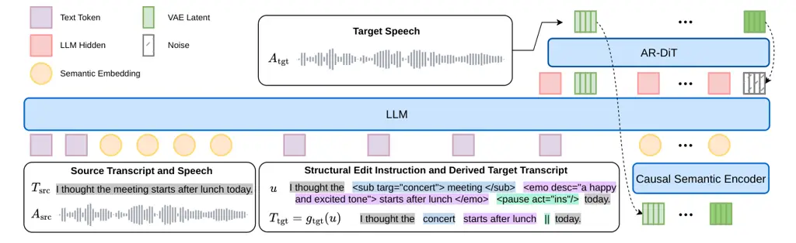

\[ Extension=.otf, UprightFont=\*-regular, BoldFont=\*-bold,
ItalicFont=\*-italic, BoldItalicFont=\*-bolditalic\] \[ Scale=0.92,
Extension=.otf, UprightFont=\*-regular, BoldFont=\*-bold,
ItalicFont=\*-italic, BoldItalicFont=\*-bolditalic\] \[ Extension=.otf,
UprightFont=\*-regular, BoldFont=\*-bold, ItalicFont=\*-italic,
BoldItalicFont=\*-bolditalic\] \[ Path=fonts/, Extension=.otf,
UprightFont=\*-Regular, BoldFont=\*-Bold, ItalicFont=\*-Regular,
BoldItalicFont=\*-Bold\]

# \dotsttsfontdots.tts.edit: Precisely Controlled Speech Editing with a Continuous Autoregressive Model

Hankun Wang^(1,2), Bohan Li^(1,2)¹¹footnotemark: 1 , Shi Lian¹, Xiaoyu
Gu^(1,2)¹¹footnotemark: 1 , Jing Peng^(1,2)¹¹footnotemark: 1  
Da Zheng¹, Yiwei Guo², Colin Zhang¹, Shuai Wang³, Kai Yu²  
¹Xiaohongshu Inc. ²X-LANCE Lab, School of Computer Science, Shanghai
Jiao Tong University ³School of Intelligence Science and Technology,
Nanjing University wanghankun@xiaohongshu.com;
{wanghankun,kai.yu}@sjtu.edu.cn ^(†)^(†)thanks: Work done during an
internship at Xiaohongshu Inc.^(†)^(†)thanks: Corresponding author.

###### Abstract

Speech editing for content creation requires precise control over both
what an edit should do and where it should apply. Free-form natural
language provides a flexible interface for expressing edit requests, but
its ambiguity may leave the intended operation, parameters, or target
region underspecified. We study a precise and explicit interface for
speech editing: a transcript-grounded structural edit instruction with
XML-style tags explicitly specifies typed operations and localizes them
to transcript spans or boundaries. This semantic timeline avoids
explicit timestamp alignment and provides an externally inspectable
contract for compositional edits. We instantiate the interface in
\dotsttsfontdots.tts.edit, an editor adapted from the continuous
autoregressive \dotsttsfontdots.tts foundation model. Four
representative speech-creation controls cover lexical content, affective
expression, pitch and speaking-rate delivery, and temporal phrasing
through text, emotion, prosody, and pause editing. Task-specific data
pipelines construct operation- and scope-controlled pairs while
retaining source-derived context outside each target region. We further
introduce _doteBench_, a bilingual evaluation suite that measures
precise instruction following, local preservation, and audio quality
across the four controls and their composition. Experiments show leading
overall instruction following and local preservation across its five
editing categories, while audio quality remains comparable to existing
open-source systems. Across three Seed-TTS-Eval shards, the model shows
negligible differences from the base model in zero-shot TTS recognition
error rate and speaker similarity.

|             |                                                                                                          |
| ----------- | -------------------------------------------------------------------------------------------------------- |
| Playground: | [dots-studio-dots-tts-edit.hf.space](https://dots-studio-dots-tts-edit.hf.space)                         |
| Demo Page:  | [dots-studio-dots-tts-edit-demo.static.hf.space](https://dots-studio-dots-tts-edit-demo.static.hf.space) |
| Checkpoint: | [huggingface.co/dots-studio/dots.tts.edit](https://huggingface.co/dots-studio/dots.tts.edit)             |
| Codebase:   | [github.com/studio-dots-ai/dots.tts](https://github.com/studio-dots-ai/dots.tts)                         |
| Benchmark:  | [github.com/studio-dots-ai/doteBench](https://github.com/studio-dots-ai/doteBench)                       |

## 1 Introduction

Speech editing for content creation requires more than generating
plausible speech. An editor must let a creator state which property
should change, in which direction and by how much, and over exactly
which part of an existing recording. Speech editing has historically
provided this control most explicitly for lexical correction: inserting,
deleting, or replacing words while matching the surrounding voice and
acoustics  (Jin et al., 2017; Tan et al., 2021; Wang et al., 2022; Bai
et al., 2022). Practical creation also calls for changing the affective
expression or pitch and rate of a selected phrase, or adjusting a
phrasing boundary, without disturbing the rest of the utterance.

Recent editing benchmarks such as MMAE use free-form natural language as
an interface for specifying edit requests (Ma et al., 2026b). This
representation is flexible, but its flexibility can also introduce
ambiguity: textual references may admit multiple interpretations, while
the intended operation category, parameters, or target region may remain
underspecified. Additionally, professional creation frequently requires
repeatable controls whose requested effect and scope can be checked
independently. Such settings benefit from a precise and explicit
representation of editing instructions. A machine-readable, inspectable,
and composable representation is also suitable as a controllable backend
for audio-creation studios or as a callable tool in agentic
audio-creation workflows.

We formalize this precision along two axes. _Precise operation
specification_ makes the operation category, direction, and parameters
explicit—what to edit and how. _Precise localization_ states where it
applies. Absolute timestamps require explicit temporal-alignment
awareness, which is challenging for users and many audio-understanding
systems, while acoustic boundaries are often ambiguous. A
transcript-based semantic timeline is therefore more practical and
easier to interact with in most speech-editing scenarios. We therefore
propose a transcript-grounded structural edit instruction with XML-style
tags. Natural-language descriptions can still express open-ended
attributes such as emotion, while typed tags make the operation category
and parameters explicit, bind each operation’s scope to linguistic spans
or word boundaries, and serialize multiple non-overlapping operations in
source order. The representation makes the requested behavior externally
inspectable. Figure 1 illustrates the two forms of precision in a
compositional edit.

[TABLE]

Figure 1: An explicit edit program. A transcript-grounded structural
edit instruction with XML-style tags specifies operation categories and
parameters while colored spans and a boundary localize their effects.
The transcript rendering replaces _meeting_ with _concert_; emotion and
pause operations alter delivery without changing the remaining words.
Colors and $`\|`$ in the target rendering are visual annotations that
mark edited content, delivery, and the inserted pause; they are not part
of $`T_{\mathrm{tgt}}`$.

The space of speech-creation requests is broader than any fixed task
list. We select four representative, recurring controls that exercise
distinct operation categories and localization patterns. Text editing
changes lexical content at spans or boundaries. Emotion editing changes
affective expression globally or over a selected span. Prosody editing
controls pitch or speaking rate over a span. Pause editing changes
temporal structure at a word boundary.

Realizing this formulation remains difficult. The output must execute
every requested operation, preserve non-target content and acoustics,
and remain coherent even when a local edit changes duration. Natural
recordings rarely provide paired utterances that differ only in one
requested property, while alignment, resynthesis, and stitching can
introduce incidental changes. The evaluation must therefore distinguish
target execution from local preservation and overall audio quality.

We instantiate the formulation in \dotsttsfontdots.tts.edit, adapting
the continuous autoregressive \dotsttsfontdots.tts TTS foundation
model (Lian et al., 2026). The model conditions on source speech and the
explicit edit program, whose deterministic transcript renderings provide
source and target transcripts, then generates target speech in the base
model’s continuous latent space. Task-specific pipelines construct
controlled pairs for the four representative categories under a common
audio–instruction–audio contract. Multiple operations can be composed in
one instruction and executed in one generation pass.

We also introduce _doteBench_, a bilingual evaluation suite with
precise, scope-aware metrics. Instruction Following tests whether the
requested operation is realized, Local Preservation tests whether speech
outside the edited regions and non-target attributes within them remain
unchanged, and Audio Quality evaluates the complete output. Across text,
emotion, prosody, pause, and compositional editing,
\dotsttsfontdots.tts.edit achieves leading overall instruction following
and local preservation among the evaluated open-source audio-generation
and speech-editing systems, while maintaining comparable audio quality.
Its Seed-TTS-Eval recognition and speaker-similarity scores remain close
to the strongest \dotsttsfontdots.tts variants.

Our contributions are:

- •
  a precise edit representation that explicitly specifies typed
  operations and parameters and localizes them to transcript spans or
  boundaries, supporting inspectable compositional control;
- •
  a continuous autoregressive speech editor and task-specific data
  pipelines that learn four representative creation controls under the
  same operation- and scope-controlled paired-data interface; and
- •
  doteBench, a bilingual suite that evaluates precise instruction
  following, local preservation, and audio quality for individual and
  compositional edits.

## 2 Related Work

##### Text-based speech editing.

VoCo combines synthesis, retrieval, voice conversion, and stitching to
replace speech in an existing narration (Jin et al., 2017). Neural
editors then learned missing-region acoustics from text and surrounding
speech: EditSpeech uses partial inference and bidirectional fusion (Tan
et al., 2021), CampNet predicts masked speech (Wang et al., 2022), A³T
introduces alignment-aware acoustic–text pretraining (Bai et al., 2022),
and E³TTS supports text-guided insertion, deletion, and replacement in a
joint TTS and editing model (Liang et al., 2024). FluentEditor variants
regularize boundary acoustics and global prosody  (Liu et al., 2024; Liu
et al., 2025), whereas UniCATS uses contextual VQ-diffusion over
semantic tokens (Du et al., 2024). Foundation-scale systems extend
infilling through flow matching in Voicebox  (Le et al., 2023) and
autoregressive codec generation in VoiceCraft  (Peng et al., 2024);
CosyEdit and AST adapt pretrained TTS models for precise content
edits (Chen et al., 2026a; Lv et al., 2026). Many such systems rely on
an explicit aligner module to map the edited transcript span to the
acoustic region that is masked or regenerated. This progression improves
realization, boundary fluency, and contextual continuity, but
predominantly studies lexical edits rather than localized control of
delivery.

##### Generalized generation and attribute editing.

SpeechX prompts one codec language model for TTS, enhancement,
extraction, and editing (Wang et al., 2024). Step-Audio-EditX performs
iterative utterance-level editing of emotion, speaking style, and
paralinguistics (Yan et al., 2025b), while SpeechEdit selectively
controls speaker, emotion, and prosody attributes during TTS
generation (Pei et al., 2026). Ming-UniAudio supports free-form content
editing and utterance-level acoustic changes  (Yan et al., 2025a).
UniSAE extends local content editing from sub-phoneme to word level and
composes it with speaker and emotion control  (Zhu et al., 2026). Beyond
speech attributes, MMEdit localizes general-audio events, while
Audio-Omni and UNISON unify editing across speech, sound, music, or
audio scenes (Tao et al., 2025; Tian et al., 2026; Li et al., 2026b).
FireRedTTS3-Instruct unifies speech generation and instruction-guided
editing (Shen et al., 2026); AuK likewise combines speech generation and
editing through natural-language instructions and audio context (Ma et
al., 2026a).

Existing systems thus provide local control over content or events and
utterance-level control over speech attributes. To our knowledge,
\dotsttsfontdots.tts.edit is the first end-to-end editor to jointly
support fine-grained local text, emotion, prosody, and pause editing
while preserving unrequested regions and attributes.

##### Speech editing benchmarks.

RealEdit targets zero-shot content editing in diverse acoustics  (Peng
et al., 2024), and LibriSpeech-Edit adds controlled text and style edits
with temporal-consistency measures (Lv et al., 2026). SpeechEditBench
covers content, emotion, prosody, and four other atomic editing tasks,
together with compositional editing (Zhang et al., 2026). Its
preservation-success gate for non-content tasks checks only speech
recognition error rates—word error rate (WER) for English and character
error rate (CER) for Chinese—and therefore does not assess whether
source prosody or other paralinguistic attributes remain preserved.

MMAE broadens coverage to multimodal and mixed acoustic scenarios with
complex instructions and local or global operations  (Ma et al., 2026b).
Its fine-grained instruction-following and consistency rubrics rely on
Qwen3-Omni judgments (Xu et al., 2025). Three independent queries,
majority voting, and option shuffling mitigate variation in discrete
rubric decisions and positional bias, but the resulting scores remain
constrained by the judge’s fine-grained perceptual capability and offer
limited interpretability. doteBench instead defines category-specific,
scope-aware protocols for text, emotion, prosody, pause, and
compositional editing under a common evaluation of instruction
following, local preservation, and audio quality. MMAE emphasizes
breadth and free-form tasks, whereas doteBench emphasizes interpretable
execution and preservation measurements for explicitly localized speech
controls.

## 3 Problem Definition and Benchmark

### 3.1 Precisely Controlled Speech Editing

We define an edit sample as the five-tuple

```math
\displaystyle d_{\mathrm{edit}} \displaystyle=\left(T_{\mathrm{src}},A_{\mathrm{src}},u,T_{\mathrm{tgt}},A_{\mathrm{tgt}}\right), \tag{1}
```

```math
\displaystyle T_{\mathrm{src}} \displaystyle=g_{\mathrm{src}}\!\left(u\right),\qquad T_{\mathrm{tgt}}=g_{\mathrm{tgt}}\!\left(u\right).
```

Here $`T_{\mathrm{src}}`$ and $`T_{\mathrm{tgt}}`$ are the source and
target transcripts, $`A_{\mathrm{src}}`$ and $`A_{\mathrm{tgt}}`$ are
the corresponding waveforms, and $`u`$ is a transcript-grounded
structural edit instruction with XML-style tags. The deterministic
renderer $`g_{\mathrm{src}}\!\left(u\right)`$ removes the tags while
retaining source-side lexical content, whereas
$`g_{\mathrm{tgt}}\!\left(u\right)`$ applies lexical insertions,
deletions, and substitutions. Attribute tags leave the transcript
unchanged. The editor produces

```math
\hat{A}_{\mathrm{tgt}}=f_{\theta}\!\left(T_{\mathrm{src}},A_{\mathrm{src}},u,T_{\mathrm{tgt}}\right). \tag{2}
```

Here $`f_{\theta}`$ is the editor with trainable parameters $`\theta`$,
and $`\hat{A}_{\mathrm{tgt}}`$ is its predicted target waveform. Each
tag provides an operation category, its parameters, and a localization.
Span operations wrap transcript tokens, whereas point operations mark
word boundaries. This separates precise operation specification from
precise localization and avoids making the generative model infer either
field from an underspecified request. A successful output must (i)
realize every tagged operation, (ii) preserve content and attributes
outside the tagged locations, and (iii) remain natural and coherent as a
complete utterance.

The four evaluated categories are representative controls rather than an
exhaustive speech-editing taxonomy. Text operations modify lexical
content through insertion, deletion, or substitution at spans or
boundaries. Emotion operations modify affective expression globally or
over a span. Prosody operations change pitch or speaking rate over a
span, and pause operations insert, lengthen, or shorten temporal
structure at a boundary. A compositional instruction contains several
non-overlapping operations and succeeds only when all components are
realized.

##### Extensibility.

Within speech, the typed vocabulary can incorporate additional
attributes and edit actions. Its explicit schema also provides a stable
tool boundary through which a studio frontend, planner, or agent can
construct, validate, and invoke an edit program. More broadly, the
structural-program principle could extend to non-verbal events, general
audio, or music given a suitable symbolic timeline and paired
supervision; this work evaluates speech only.

### 3.2 doteBench

We propose doteBench, a bilingual evaluation suite for precisely
controlled speech editing. It comprises five categories: text editing,
emotion editing, prosody editing, pause editing, and compositional
editing. The first four evaluate one edit family at a time on
single-speaker utterances, with explicit target and preserved regions.
Text editing has Easy and Hard splits, and emotion editing has Neutral
and Intense shards. Prosody and pause editing each use one primary set.
The compositional editing category covers two-, three-, and
four-operation instructions; its instruction following metrics report
component-wise and all-component success. Together, the three evaluation
dimensions match the control contract: Instruction Following tests
execution of the specified operation, Local Preservation tests speech
outside its localization, and Audio Quality tests the complete result.
The hierarchy and case counts are shown in Figure 2, and Table 1
summarizes the measured dimensions.

Figure 2: Hierarchical composition of doteBench. Angular span is
proportional to the number of cases within each parent. The single-task
editing suite contains 1,841 cases across text, emotion, prosody, and
pause editing; the compositional category contains 240 cases.

| Category      | Cases | Instruction following | Local preservation             |
| ------------- | ----- | --------------------- | ------------------------------ |
| Text          | 569   | Edit WER/CER          | Non-edit WER/CER; WDTW; SpkSim |
| Emotion       | 612   | Emotion accuracy      | WER/CER; WDTW; SpkSim          |
| Prosody       | 360   | Duration/pitch error  | WER/CER; WDTW; SpkSim          |
| Pause         | 300   | Direction accuracy    | WER/CER; WDTW; SpkSim          |
| Compositional | 240   | Component/all success | WER/CER; WDTW; SpkSim          |

Table 1: doteBench categories, case counts, and evaluation dimensions.

##### Instruction following.

Text editing uses edited-region WER/CER. Emotion editing uses
Qwen3-Omni-30B-A3B-Instruct (Xu et al., 2025) to classify the requested
emotion from the edited region under a fixed prompt and label set.
Prosody editing measures absolute duration error in seconds and
pitch-shift error in semitones. Pause editing requires a gap change of
at least 160 ms in the requested direction. Compositional editing
reports success per measurable operation and success of all measurable
operations in an example; the exact criteria appear in Appendix A.3.

##### Local preservation.

For text editing, Qwen3-ASR (Shi et al., 2026) measures recognition
error outside the instruction-derived edit neighborhood. Because the
other tasks retain the transcript, they use full-utterance WER/CER. We
additionally compare matched, preserved words acoustically. WDTW-Dur
inherits the word-level duration comparison introduced by AST (Lv et
al., 2026); intuitively, it force-aligns instruction-selected words and
measures the normalized change in their duration sequences as a
percentage, where lower values indicate better timing preservation. This
differs from the absolute Duration L1 error in seconds used to assess
requested prosody changes. Duration alone cannot expose pitch drift, so
we introduce WDTW-F0, which compares the minimum, maximum, and mean
voiced F0 of eligible preserved words in semitones; lower values
indicate less pitch drift. We expect both duration and F0 to be
preserved in regions with no edit. Within an edited region, a
duration-only change should preserve F0, and a pitch-only change should
preserve duration. Accordingly, WDTW-F0 includes duration-only regions,
and WDTW-Dur includes pitch-only regions.

We also assess whether editing preserves speaker identity using speaker
similarity (SpkSim), computed as the cosine similarity between source
and edited speech embeddings from WavLM-large/ECAPA-TDNN  (Chen et al.,
2022; Desplanques et al., 2020). Appendix A details the preservation
metrics and their aggregation.

##### Audio quality.

Beyond instruction following and preservation of unedited regions,
evaluation must also measure the overall acoustic quality of the
generated speech. Audio quality is measured by UTMOS (Saeki et al.,
2022).

## 4 Data Pipelines for Precisely Controlled Speech Editing

Figure 3: Data construction pipeline. A sampler selects an original
utterance, a planner produces an instruction and target transcript, and
a task-specific synthesizer constructs the generated counterpart. The
evaluator checks edit effect, preservation, and quality before the saver
materializes accepted examples. For text, prosody, and pause editing, we
construct supervision in both directions.

### 4.1 Construction Challenges and Shared Principle

##### Challenges.

Natural recordings rarely provide two versions of the same utterance
that differ only in one local attribute. A useful training pair must
exhibit the requested change while keeping content, speaker identity,
and the surrounding acoustics consistent. This is difficult to achieve
by independently synthesizing the two sides: differences in timing,
timbre, and rendering quality may then be mistaken for the intended
edit. The difficulty is compounded by duration-changing operations, for
which the same linguistic span occupies different source and target
timelines.

##### Principle.

Each task-specific pipeline in Figure 3 constructs a provenance-aware
original/generated pair around an intervention with an explicit
operation category, parameters, and localization, then serializes it
through the common edit sample in Equation 1. The pipelines differ in
how they realize a control, but every accepted pair exposes the same
operation- and scope-controlled supervision rather than an unrelated
task-specific target. Inspired by the use of recorded anchors and
synthetic counterparts in ISSE (Chen et al., 2026b), we construct
supervision in both directions for text, prosody, and pause editing.
Besides doubling the supervision obtained from one intervention, the
generated-to-original direction places the original audio on the target
side. When the original is a recording, this prevents target supervision
from depending exclusively on synthetic audio.

Local assembly introduces a second problem. Directly joining a
synthesized or signal-processed segment to its surrounding context often
produces an audible seam, and a forced aligner does not always place the
join exactly at the acoustic boundary. For pipelines that require such
joins, we therefore use the masked-regeneration ability of F5-TTS (Chen
et al., 2025) to resynthesize a short neighborhood around the boundary
from both its transcript and acoustic context. This repair can modify a
small amount of nominally unedited speech; we accept that controlled
relaxation of exact preservation as a necessary trade-off for natural
transitions and accurate content. The evaluator then checks instruction
validity, edit realization, intelligibility, preservation, speaker
consistency, and quality before the saver retains the pair together with
its alignments, intervention parameters, validation results, and source
provenance. Appendix B provides the shared planning and alignment
procedures, category-specific construction algorithms, and principal
parameters.

### 4.2 Task-Specific Editing Pipelines

##### Text editing.

Lexical edits change both the spoken content and its timeline. For
insertion, deletion, and substitution, forced alignment first maps the
instructed source spans to waveform intervals. We then construct a
target-timeline condition whose unedited intervals copy samples from the
original recording and whose edit intervals are masked. F5-TTS infills
these masks from the target transcript while conditioning on the
preserved speech on both sides. Thus the model sees a locally
regenerated lexical change rather than an independently synthesized
target utterance, and the reverse instruction turns insertions into
deletions, deletions into insertions, and substitutions into their
inverse.

##### Emotion editing.

Emotion editing must alter several correlated acoustic cues without
turning speaker or content variation into supervision. We build a
speaker-balanced neutral timbre pool from open-source datasets, with
4,000 speakers and approximately 1 million utterances, and hold one
speaker prompt fixed while IndexTTS2 (Zhou et al., 2026a) renders the
same text under different emotion conditions. For a local edit, the
complete target-emotion realization is kept as the target audio. To
construct its paired source, we use that same realization as the
acoustic base and splice only the corresponding span from the
source-emotion realization back into it. Consequently, the target
remains a coherent, unspliced TTS output and the two sides share the
same waveform away from the donor and repair regions. F5-TTS regenerates
a narrow neighborhood around each join to suppress alignment and
splicing artifacts. Repeating this construction with the two emotion
realizations exchanged provides the reverse edit with the same
clean-target property.

##### Prosody editing.

Signal-level prosody control is precise, but by itself can distort
speech and shift the perceived speaker timbre. PSOLA (Moulines and
Charpentier, 1990) applies the requested pitch change and
WSOLA (Verhelst and Roelands, 1993) applies the requested time stretch.
We then resynthesize the transformed segment with the IndexTTS2
tokenizer and decoder. The transformed segment supplies semantic tokens,
speaker-conditioning, and style features, while the original segment
supplies the base speaker prompt and mel reference. This arrangement
retains the intended prosody change while restoring identity and
naturalness from the original recording. Rate editing similarly applies
IndexTTS2 after WSOLA with the original utterance as its speaker
reference. We cross-fade both types of transformed segments into the
source and locally repair their boundaries with F5-TTS. The rest of the
utterance is copied from the original.

##### Pause editing.

Pause editing requires explicit duration control, but inserting silence
alone creates unnatural entry and exit transitions. Forced alignment
locates the instructed linguistic boundary, where we insert exactly 200,
500, or 800 ms of zero-valued samples according to the requested level.
F5-TTS then regenerates separate neighborhoods of the two boundaries
while retaining the intervening silence, allowing the transitions to
adapt to the new timing and repair imperfect cuts without filling the
intended gap with speech. Samples outside these repair windows remain
unchanged. The original-to-generated record teaches pause insertion,
while swapping the two waveforms and reversing the instruction supplies
the corresponding pause reduction.

## 5 \dotsttsfontdots.tts.edit: Continuous Autoregressive Speech Editing

### 5.1 Continuous Autoregressive Backbone

\dotsttsfontdots.tts is a 2B-parameter continuous autoregressive TTS
foundation model (Lian et al., 2026). It represents 48 kHz speech with
an AudioVAE based on HoliTok (Li et al., 2026a), producing a 25 Hz
latent stream. It reduces each four-frame patch to a 6.25 Hz semantic
representation, and autoregressively predicts representations from which
a flow-matching head renders continuous latent patches. A frozen CAM++
speaker encoder (Wang et al., 2023) provides global identity
conditioning.

\dotsttsfontdots.tts.edit retains this architecture and generation
interface. We change the conditioning sequence and paired training
examples rather than adding task-specific inpainting networks. The
resulting model tests whether a continuous autoregressive TTS backbone
can learn editing when source, intent, and target are represented
explicitly. Figure 4 shows the retained backbone and the editing
conditioning sequence.



Figure 4: \dotsttsfontdots.tts.edit overview. Source transcript and
speech, together with the transcript-grounded structural edit
instruction with XML-style tags and its target-transcript rendering,
condition the retained continuous autoregressive \dotsttsfontdots.tts
backbone; only target speech is generated.

### 5.2 Editing and TTS Training

Training mixes ordinary TTS examples with the paired editing examples
from section 4. Let
$`Z_{\mathrm{src}}=\mathcal{E}_{\mathrm{VAE}}(A_{\mathrm{src}})`$ and
$`Z_{\mathrm{tgt}}=\mathcal{E}_{\mathrm{VAE}}(A_{\mathrm{tgt}})`$ denote
the source and target AudioVAE latent sequences produced by the frozen
encoder $`\mathcal{E}_{\mathrm{VAE}}`$, and let
$`\mathbf{e}_{\mathrm{spk}}`$ denote the frozen CAM++ speaker embedding.
Editing examples follow the sequence
$`[\,T_{\mathrm{src}},Z_{\mathrm{src}},u,T_{\mathrm{tgt}},Z_{\mathrm{tgt}}\,]`$.
The target-audio positions carry flow-matching and stopping supervision,
and $`Z_{\mathrm{src}}`$ provides the complete source utterance as
acoustic context. TTS and editing retain distinct conditioning contexts
but share the same target-latent generator:

```math
\displaystyle p_{\theta}^{\mathrm{TTS}} \displaystyle=p_{\theta}\!\left(Z\mid T,\mathbf{e}_{\mathrm{spk}}\right), \tag{3}
```

```math
\displaystyle p_{\theta}^{\mathrm{edit}} \displaystyle=p_{\theta}\!\left(Z_{\mathrm{tgt}}\mid T_{\mathrm{src}},Z_{\mathrm{src}},u,T_{\mathrm{tgt}},\mathbf{e}_{\mathrm{spk}}\right).
```

Here $`T`$ denotes a generic transcript, $`Z`$ a target AudioVAE latent
sequence, and $`p_{\theta}`$ the shared conditional generator. Thus TTS
is conditioned on the requested transcript and speaker identity, whereas
editing additionally observes the source transcript, source speech,
instruction, and target transcript. All edit families use this second
factorization rather than separate task heads.

For each supervised target patch $`x_{1}`$, flow matching (Lipman et
al., 2023) draws standard Gaussian noise $`x_{0}\sim\mathcal{N}(0,I)`$,
where $`I`$ is the identity covariance, and time
$`t\sim\mathcal{U}(0,1)`$. With the configured zero terminal-noise
scale, it forms $`x_{t}=tx_{1}+(1-t)x_{0}`$ and uses the target velocity
$`v^{\star}=x_{1}-x_{0}`$. The autoregressive backbone supplies the
causal semantic history and conditioning context for this patch-level
velocity field. The training objective is

```math
\mathcal{L}=\lambda_{\mathrm{FM}}\,\mathbb{E}\!\left[\left\|v_{\theta}(x_{t},t;c)-v^{\star}\right\|_{2}^{2}\right]+\lambda_{\mathrm{EOS}}\mathcal{L}_{\mathrm{EOS}}. \tag{4}
```

Here $`v_{\theta}`$ is the predicted velocity and $`c`$ is the
corresponding TTS or editing context in Equation 3. The expectation is
over training examples, target patches, Gaussian noise, and
interpolation times. $`\mathcal{L}_{\mathrm{EOS}}`$ is the two-class
cross-entropy of the audio-stop projection at supervised target-audio
positions. Both loss weights are one; text tokens provide conditioning
and receive no next-token supervision.

Losses are normalized over their active token or latent-patch masks
before being combined.

## 6 Experiments

Our experiments ask four questions: whether the editor executes
explicitly specified operations, whether it preserves speech outside
their localizations, whether several operations can be composed in one
generation pass, and whether editing post-training retains the zero-shot
TTS capability of the base model. doteBench answers the first three
through Instruction Following, Local Preservation, and Audio Quality
comparisons against existing open-source audio-generation and
speech-editing models and task-specific pipelines. SpeechEditBench
provides a complementary bilingual, multi-attribute comparison
(Appendix C), and Seed-TTS-Eval tests TTS retention.

### 6.1 Setup

#### 6.1.1 Training

##### Model initialization.

\dotsttsfontdots.tts.edit initializes all editor parameters from the
public 2B-parameter \dotsttsfontdots.tts checkpoint (Lian et al., 2026),
whose weights are available online.¹¹ 1
[https://huggingface.co/collections/rednote-hilab/dotstts](https://huggingface.co/collections/rednote-hilab/dotstts)
The backbone comprises a Qwen2.5-1.5B language model  (Qwen Team, 2024),
a 24-layer semantic encoder, and an 18-layer autoregressive
flow-matching DiT (Peebles and Xie, 2023) operating on four-frame
patches of a frozen 48 kHz AudioVAE. A frozen 512-dimensional CAM++
speaker encoder  (Wang et al., 2023) supplies the voice condition; we
use the VoxCeleb-trained public checkpoint.²² 2
[https://modelscope.cn/models/iic/speech_campplus_sv_en_voxceleb_16k](https://modelscope.cn/models/iic/speech_campplus_sv_en_voxceleb_16k)

##### Objectives and optimization.

We optimize the flow-matching and audio-stop objectives end-to-end while
keeping the AudioVAE and speaker encoder fixed. Training uses bfloat16
arithmetic, AdamW (Loshchilov and Hutter, 2019) with learning rate
$`2\times 10^{-5}`$, moment coefficients $`\beta_{1}=0.9`$ and
$`\beta_{2}=0.99`$, weight decay $`0.01`$, gradient accumulation 2, and
gradient clipping at 2. The WSD schedule (Hu et al., 2024) uses 1,000
linear warm-up updates and a 15,000-update linear decay to 15% of the
peak rate.

##### Training mixture.

TTS replay is sampled from the 1.5M-hour multilingual corpus used by the
base model (Lian et al., 2026). Before the online quality filters in the
training loader, the edit manifests contain approximately 11M text, 10M
emotion, 8M prosody, and 5M pause pairs. The rounded sampling weights
for TTS:text:emotion:prosody:pause are $`48{:}4{:}4{:}2{:}1`$; TTS
replay maintains exposure to synthesis examples alongside localized
editing supervision.

##### Augmentation.

For 60% of edit examples, we concatenate two or three independently
sampled segments, up to 40 s total, creating longer, compositional, and
potentially multi-speaker contexts that train preservation of each
speaker identity. All concatenated examples drop the global CAM++
speaker embedding. Noise augmentation at 10–20 dB SNR supports speech
enhancement and background-noise preservation. TTS replay is not
augmented.

#### 6.1.2 Evaluation

##### Baselines.

The open-source model comparison includes Step-Audio-EditX (Yan et al.,
2025b), Ming-UniAudio (Yan et al., 2025a), MiMo-Audio-Instruct (Xiaomi
LLM-Core Team, 2025), FireRedTTS3-Instruct (Shen et al., 2026), and
AuK (Ma et al., 2026a). We map each request to the model’s supported
instruction and conditioning interface, using native editing or
generation paths and deterministic operation selection when a single
call cannot express all controls. This accommodates differences in local
and multi-operation interfaces while keeping the original edit goals
fixed for evaluation. To make use of AuK’s potential for local editing,
we combine it with an external Qwen3-ForcedAligner-0.6B (Shi et al., 2026) and denote this setting as AuK + Qwen3-FA in the tables.
Appendix A.4 details these settings. The tables additionally report an
Identity reference that copies the source audio and data-construction
pipelines grouped separately from learned systems. For Seed-TTS-Eval, we
report the \dotsttsfontdots.tts.edit result and quote all baseline
values from the \dotsttsfontdots.tts Technical Report (Lian et al.,
2026). The compared systems are three \dotsttsfontdots.tts variants,
Seed-TTS (Seed Team, ByteDance, 2024), Qwen3-TTS (Hu et al., 2026), and
VoxCPM2 (Zhou et al., 2026b).

##### Benchmarks.

The primary evaluation comprises the five doteBench categories. For text
editing, the main comparison uses the Hard split; the Easy split is
included in Table 2 for reference and is not merged into the headline
scores. Emotion editing is reported separately on the Neutral and
Intense shards in Table 3. The Emotion radar panel uses the unweighted
arithmetic mean of each metric across the two shard-level results. All
doteBench systems are evaluated against the same frozen manifests.
Generation failures remain in metric denominators with fixed penalties.
Preservation metrics require eligible reference objects, and pitch-based
metrics additionally require measurable voiced estimates. The latter can
depend on the generated audio; unavailable estimates are not zero
errors. Appendix A.3 specifies aggregation and failure handling.
Seed-TTS-Eval uses 1,088 English, 2,020 Chinese, and 400 Chinese Hard
examples under the official WER/CER and speaker-similarity protocol.

Execution strategies. One-take is the primary comparison and permits one
model call per case, with the request expressed through each candidate’s
supported interface. Sequential execution applies text operations first
and then acoustic operations, using each output as the next input. Each
run starts from the original source audio, and the final output is
scored against every operation in the original instruction in both
modes. The compositional data-construction pipeline uses multiple
passes.

##### Inference parameters.

At inference time, \dotsttsfontdots.tts.edit uses Euler integration with
10 flow steps, a classifier-free guidance scale of 1.2 (Ho and Salimans,
2022), speaker guidance of 1.5, bfloat16 inference, and a maximum
generation length of 500 latent steps. We use x-vector guidance for
every evaluation category except Emotion, for which it is disabled.

### 6.2 doteBench Results

Figure 5summarizes the one-take comparison, while Figure 6 shows the
effect of sequential execution; the tables report the original metrics.
Across the five doteBench categories, \dotsttsfontdots.tts.edit combines
leading instruction execution with consistent local preservation and
audio quality among the evaluated learned systems. Its advantage is the
ability to carry out different precisely localized edits, including
their compositions, within one model and one generation pass.

Figure 5: One-take model comparison on doteBench. Five panels summarize
the text, emotion, prosody, pause, and compositional editing categories.
Axes form contiguous groups for instruction following, local
preservation, and audio quality. Fixed model-independent semantic bounds
map every metric to $`[0,1]`$, with outward indicating better
performance. Text uses Hard; Emotion averages the Neutral and Intense
shard metrics equally before normalization. The outer ring corresponds
to 40% on the Emotion Acc. and Emotion Success axes. The sequential
comparison is shown in Figure 6.

Figure 6: Sequential model comparison on doteBench. Panels, axes,
aggregation, and normalization match Figure 5. Each candidate executes
edits sequentially and is scored on its final audio.

|                            |                                 |                                     |                             |                             |                    |                   |
| -------------------------- | ------------------------------- | ----------------------------------- | --------------------------- | --------------------------- | ------------------ | ----------------- |
| System                     | Edit WER/CER (%) $`\downarrow`$ | Non-edit WER/CER (%) $`\downarrow`$ | WDTW Dur (%) $`\downarrow`$ | WDTW F0 (st) $`\downarrow`$ | SpkSim$`\uparrow`$ | UTMOS$`\uparrow`$ |
| Shard: Easy                |                                 |                                     |                             |                             |                    |                   |
| Identity (source audio)    | 43.68                           | 0.21                                | 1.45                        | 0.04                        | 1.000              | 3.37              |
| Execution: One-take        |                                 |                                     |                             |                             |                    |                   |
| AuK + Qwen3-FA             | 44.81                           | 3.95                                | 6.19                        | 1.43                        | 0.890              | 3.37              |
|                            |                                 |                                     |                             |                             |                    |                   |
| Step-Audio-EditX           | 15.38                           | 1.71                                | 7.92                        | 2.73                        | 0.768              | 3.68              |
| Ming-UniAudio              | 40.13                           | 7.33                                | 9.30                        | 1.95                        | 0.777              | 3.11              |
| MiMo-Audio-Instruct        | 5.85                            | 5.62                                | 13.05                       | 3.85                        | 0.636              | 3.27              |
| FireRedTTS3-Instruct       | 26.81                           | 0.96                                | 7.09                        | 1.56                        | 0.820              | 3.17              |
| \dotsttsfontdots.tts.edit  | 0.69                            | 0.89                                | 6.45                        | 2.10                        | 0.851              | 3.40              |
| Execution: Sequential      |                                 |                                     |                             |                             |                    |                   |
| Data-construction pipeline | 1.17                            | 0.46                                | 3.76                        | 0.90                        | 0.918              | 3.22              |
|                            |                                 |                                     |                             |                             |                    |                   |
| AuK + Qwen3-FA             | 42.51                           | 4.63                                | 7.48                        | 1.81                        | 0.838              | 3.14              |
|                            |                                 |                                     |                             |                             |                    |                   |
| Step-Audio-EditX           | 25.15                           | 2.10                                | 8.04                        | 2.92                        | 0.732              | 3.62              |
| Ming-UniAudio              | 41.46                           | 10.40                               | 9.87                        | 2.09                        | 0.721              | 3.00              |
| MiMo-Audio-Instruct        | 5.77                            | 6.44                                | 13.85                       | 4.33                        | 0.583              | 3.28              |
| FireRedTTS3-Instruct       | 24.71                           | 1.25                                | 7.71                        | 1.83                        | 0.764              | 3.10              |
| \dotsttsfontdots.tts.edit  | 1.17                            | 1.00                                | 6.95                        | 2.14                        | 0.820              | 3.42              |
| Shard: Hard                |                                 |                                     |                             |                             |                    |                   |
| Identity (source audio)    | 178.52                          | 0.17                                | 7.75                        | 0.33                        | 1.000              | 3.49              |
| Execution: One-take        |                                 |                                     |                             |                             |                    |                   |
| AuK + Qwen3-FA             | 144.63                          | 7.54                                | 13.15                       | 1.35                        | 0.900              | 3.37              |
|                            |                                 |                                     |                             |                             |                    |                   |
| Step-Audio-EditX           | 19.47                           | 0.85                                | 11.56                       | 2.65                        | 0.732              | 3.84              |
| Ming-UniAudio              | 145.97                          | 13.14                               | 18.08                       | 2.19                        | 0.725              | 2.67              |
| MiMo-Audio-Instruct        | 19.56                           | 9.07                                | 14.34                       | 3.95                        | 0.640              | 3.24              |
| FireRedTTS3-Instruct       | 152.22                          | 1.19                                | 12.55                       | 1.58                        | 0.862              | 3.12              |
| \dotsttsfontdots.tts.edit  | 12.95                           | 0.85                                | 7.28                        | 1.82                        | 0.772              | 3.49              |
| Execution: Sequential      |                                 |                                     |                             |                             |                    |                   |
| Data-construction pipeline | 24.87                           | 0.25                                | 6.84                        | 1.17                        | 0.766              | 3.11              |
|                            |                                 |                                     |                             |                             |                    |                   |
| AuK + Qwen3-FA             | 90.47                           | 24.24                               | 18.46                       | 2.32                        | 0.717              | 2.80              |
|                            |                                 |                                     |                             |                             |                    |                   |
| Step-Audio-EditX           | 44.77                           | 2.54                                | 13.81                       | 3.41                        | 0.638              | 3.77              |
| Ming-UniAudio              | 106.86                          | 16.10                               | 15.09                       | 2.80                        | 0.564              | 2.45              |
| MiMo-Audio-Instruct        | 20.12                           | 7.29                                | 14.29                       | 4.58                        | 0.507              | 3.16              |
| FireRedTTS3-Instruct       | 117.31                          | 8.56                                | 12.69                       | 2.39                        | 0.670              | 2.92              |
| \dotsttsfontdots.tts.edit  | 14.59                           | 1.61                                | 7.85                        | 2.06                        | 0.692              | 3.45              |

Table 2: Text editing results. Bold and underline mark the best and
second-best systems below the dashed separators within each mode and
shard.

|                            |                               |                            |                             |                             |                    |                   |
| -------------------------- | ----------------------------- | -------------------------- | --------------------------- | --------------------------- | ------------------ | ----------------- |
| System                     | Emotion Acc. (%) $`\uparrow`$ | WER/CER (%) $`\downarrow`$ | WDTW Dur (%) $`\downarrow`$ | WDTW F0 (st) $`\downarrow`$ | SpkSim$`\uparrow`$ | UTMOS$`\uparrow`$ |
| Shard: Neutral             |                               |                            |                             |                             |                    |                   |
| Identity (source audio)    | 20.43                         | 2.76                       | 0.00                        | 0.00                        | 1.000              | 3.07              |
| Execution: One-take        |                               |                            |                             |                             |                    |                   |
| AuK + Qwen3-FA             | 21.63                         | 5.60                       | 1.14                        | 0.10                        | 0.894              | 3.14              |
|                            |                               |                            |                             |                             |                    |                   |
| Step-Audio-EditX           | 23.08                         | 2.46                       | 11.28                       | 3.50                        | 0.701              | 3.54              |
| Ming-UniAudio              | 25.72                         | 6.82                       | 12.73                       | 6.66                        | 0.325              | 2.86              |
| MiMo-Audio-Instruct        | 23.08                         | 4.59                       | 13.49                       | 4.72                        | 0.644              | 2.95              |
| FireRedTTS3-Instruct       | 20.43                         | 3.70                       | 5.65                        | 1.43                        | 0.906              | 2.92              |
| \dotsttsfontdots.tts.edit  | 33.17                         | 2.75                       | 6.51                        | 1.93                        | 0.649              | 3.04              |
| Execution: Sequential      |                               |                            |                             |                             |                    |                   |
| Data-construction pipeline | 36.78                         | 3.14                       | 3.19                        | 0.68                        | 0.870              | 2.77              |
|                            |                               |                            |                             |                             |                    |                   |
| AuK + Qwen3-FA             | 21.88                         | 5.99                       | 1.57                        | 0.13                        | 0.882              | 3.14              |
|                            |                               |                            |                             |                             |                    |                   |
| Step-Audio-EditX           | 24.52                         | 2.28                       | 11.60                       | 3.70                        | 0.665              | 3.54              |
| Ming-UniAudio              | 26.92                         | 7.79                       | 13.82                       | 6.73                        | 0.294              | 2.90              |
| MiMo-Audio-Instruct        | 25.24                         | 4.42                       | 14.02                       | 5.22                        | 0.610              | 2.95              |
| FireRedTTS3-Instruct       | 21.15                         | 3.98                       | 5.97                        | 1.69                        | 0.881              | 2.86              |
| \dotsttsfontdots.tts.edit  | 34.38                         | 2.84                       | 6.88                        | 2.09                        | 0.633              | 3.05              |
| Shard: Intense             |                               |                            |                             |                             |                    |                   |
| Identity (source audio)    | 3.50                          | 0.62                       | 0.00                        | 0.00                        | 1.000              | 3.11              |
| Execution: One-take        |                               |                            |                             |                             |                    |                   |
| AuK + Qwen3-FA             | 4.00                          | 1.43                       | 1.01                        | 0.04                        | 0.928              | 3.14              |
|                            |                               |                            |                             |                             |                    |                   |
| Step-Audio-EditX           | 4.00                          | 0.63                       | 11.28                       | 3.41                        | 0.780              | 3.39              |
| Ming-UniAudio              | 4.00                          | 0.94                       | 12.22                       | 6.61                        | 0.375              | 2.74              |
| MiMo-Audio-Instruct        | 4.25                          | 3.43                       | 12.56                       | 4.30                        | 0.740              | 3.07              |
| FireRedTTS3-Instruct       | 3.25                          | 0.68                       | 4.86                        | 1.05                        | 0.918              | 2.94              |
| \dotsttsfontdots.tts.edit  | 7.50                          | 1.00                       | 7.63                        | 1.67                        | 0.703              | 2.93              |
| Execution: Sequential      |                               |                            |                             |                             |                    |                   |
| Data-construction pipeline | 9.00                          | 0.80                       | 3.06                        | 0.53                        | 0.905              | 2.75              |
|                            |                               |                            |                             |                             |                    |                   |
| AuK + Qwen3-FA             | 4.50                          | 1.69                       | 1.23                        | 0.05                        | 0.917              | 3.13              |
|                            |                               |                            |                             |                             |                    |                   |
| Step-Audio-EditX           | 4.75                          | 0.53                       | 11.74                       | 3.56                        | 0.753              | 3.39              |
| Ming-UniAudio              | 3.75                          | 1.23                       | 13.06                       | 6.66                        | 0.349              | 2.78              |
| MiMo-Audio-Instruct        | 5.00                          | 3.07                       | 13.22                       | 4.71                        | 0.703              | 3.06              |
| FireRedTTS3-Instruct       | 4.00                          | 0.69                       | 5.25                        | 1.22                        | 0.893              | 2.88              |
| \dotsttsfontdots.tts.edit  | 6.75                          | 0.74                       | 7.45                        | 1.72                        | 0.686              | 2.93              |

Table 3: Emotion editing results. Bold and underline mark the best and
second-best systems below the dashed separators within each mode and
shard.

|                            |                                |                              |                            |                             |                             |                    |                   |
| -------------------------- | ------------------------------ | ---------------------------- | -------------------------- | --------------------------- | --------------------------- | ------------------ | ----------------- |
| System                     | Duration L1 (s) $`\downarrow`$ | Pitch L1 (st) $`\downarrow`$ | WER/CER (%) $`\downarrow`$ | WDTW Dur (%) $`\downarrow`$ | WDTW F0 (st) $`\downarrow`$ | SpkSim$`\uparrow`$ | UTMOS$`\uparrow`$ |
| Identity (source audio)    | 0.212                          | 4.39                         | 1.65                       | 0.01                        | 0.00                        | 1.000              | 3.45              |
| Execution: One-take        |                                |                              |                            |                             |                             |                    |                   |
| AuK + Qwen3-FA             | 0.180                          | 3.63                         | 6.15                       | 2.60                        | 0.41                        | 0.946              | 2.75              |
|                            |                                |                              |                            |                             |                             |                    |                   |
| Step-Audio-EditX           | 0.371                          | 4.60                         | 34.87                      | 22.86                       | 2.70                        | 0.710              | 3.94              |
| Ming-UniAudio              | 0.201                          | 4.52                         | 7.36                       | 14.43                       | 3.25                        | 0.399              | 1.31              |
| MiMo-Audio-Instruct        | 0.304                          | 5.25                         | 8.31                       | 15.59                       | 3.60                        | 0.623              | 3.21              |
| FireRedTTS3-Instruct       | 0.218                          | 3.75                         | 2.32                       | 9.11                        | 2.62                        | 0.562              | 2.44              |
| \dotsttsfontdots.tts.edit  | 0.073                          | 2.90                         | 1.95                       | 6.28                        | 1.45                        | 0.869              | 3.55              |
| Execution: Sequential      |                                |                              |                            |                             |                             |                    |                   |
| Data-construction pipeline | 0.045                          | 1.51                         | 2.07                       | 3.39                        | 0.86                        | 0.901              | 3.15              |
|                            |                                |                              |                            |                             |                             |                    |                   |
| AuK + Qwen3-FA             | 0.190                          | 2.84                         | 10.67                      | 3.52                        | 0.72                        | 0.887              | 2.41              |
|                            |                                |                              |                            |                             |                             |                    |                   |
| Step-Audio-EditX           | 0.528                          | 4.64                         | 47.16                      | 29.56                       | 3.31                        | 0.593              | 4.03              |
| Ming-UniAudio              | 0.216                          | 4.25                         | 45.88                      | 31.04                       | 3.82                        | 0.252              | 1.30              |
| MiMo-Audio-Instruct        | 0.316                          | 5.61                         | 8.93                       | 17.54                       | 4.36                        | 0.501              | 3.19              |
| FireRedTTS3-Instruct       | 0.194                          | 3.10                         | 3.44                       | 11.04                       | 2.98                        | 0.497              | 2.12              |
| \dotsttsfontdots.tts.edit  | 0.076                          | 2.77                         | 2.38                       | 6.36                        | 1.58                        | 0.803              | 3.49              |

Table 4: Prosody editing results. Bold and underline mark the best and
second-best systems below the dashed separators within each mode.

|                            |                                 |                            |                             |                             |                    |                   |
| -------------------------- | ------------------------------- | -------------------------- | --------------------------- | --------------------------- | ------------------ | ----------------- |
| System                     | Direction Acc. (%) $`\uparrow`$ | WER/CER (%) $`\downarrow`$ | WDTW Dur (%) $`\downarrow`$ | WDTW F0 (st) $`\downarrow`$ | SpkSim$`\uparrow`$ | UTMOS$`\uparrow`$ |
| Identity (source audio)    | 0.00                            | 2.30                       | 0.00                        | 0.00                        | 1.000              | 3.67              |
| Execution: One-take        |                                 |                            |                             |                             |                    |                   |
| AuK + Qwen3-FA             | 28.67                           | 2.78                       | 7.28                        | 0.96                        | 0.990              | 3.62              |
|                            |                                 |                            |                             |                             |                    |                   |
| Step-Audio-EditX           | 52.33                           | 3.40                       | 10.17                       | 2.66                        | 0.789              | 3.82              |
| Ming-UniAudio              | 5.50                            | 2.87                       | 6.74                        | 1.40                        | 0.848              | 3.54              |
| MiMo-Audio-Instruct        | 46.17                           | 10.23                      | 14.97                       | 3.92                        | 0.672              | 3.29              |
| FireRedTTS3-Instruct       | 0.83                            | 2.89                       | 6.05                        | 1.12                        | 0.897              | 3.47              |
| \dotsttsfontdots.tts.edit  | 91.83                           | 2.87                       | 7.64                        | 1.44                        | 0.899              | 3.59              |
| Execution: Sequential      |                                 |                            |                             |                             |                    |                   |
| Data-construction pipeline | 95.17                           | 3.96                       | 7.19                        | 0.97                        | 0.971              | 3.53              |
|                            |                                 |                            |                             |                             |                    |                   |
| AuK + Qwen3-FA             | 56.67                           | 3.38                       | 6.69                        | 0.88                        | 0.982              | 3.55              |
|                            |                                 |                            |                             |                             |                    |                   |
| Step-Audio-EditX           | 54.67                           | 4.41                       | 11.43                       | 3.25                        | 0.714              | 3.83              |
| Ming-UniAudio              | 7.17                            | 4.62                       | 7.61                        | 1.90                        | 0.754              | 3.33              |
| MiMo-Audio-Instruct        | 50.83                           | 8.72                       | 15.75                       | 4.20                        | 0.591              | 3.28              |
| FireRedTTS3-Instruct       | 3.00                            | 3.65                       | 6.77                        | 1.75                        | 0.816              | 3.21              |
| \dotsttsfontdots.tts.edit  | 92.50                           | 3.94                       | 7.96                        | 1.65                        | 0.849              | 3.48              |

Table 5: Pause editing results. Bold and underline mark the best and
second-best systems below the dashed separators within each mode.

|                            |                            |                      |                       |                          |                          |                        |                            |                             |                             |                    |                   |
| -------------------------- | -------------------------- | -------------------- | --------------------- | ------------------------ | ------------------------ | ---------------------- | -------------------------- | --------------------------- | --------------------------- | ------------------ | ----------------- |
| System                     | Component (%) $`\uparrow`$ | All (%) $`\uparrow`$ | Text (%) $`\uparrow`$ | Emotion (%) $`\uparrow`$ | Prosody (%) $`\uparrow`$ | Pause (%) $`\uparrow`$ | WER/CER (%) $`\downarrow`$ | WDTW Dur (%) $`\downarrow`$ | WDTW F0 (st) $`\downarrow`$ | SpkSim$`\uparrow`$ | UTMOS$`\uparrow`$ |
| Identity (source audio)    | 4.53                       | 0.00                 | 0.00                  | 13.04                    | 2.90                     | 2.17                   | 8.58                       | 2.25                        | 0.08                        | 1.000              | 3.54              |
| Execution: One-take        |                            |                      |                       |                          |                          |                        |                            |                             |                             |                    |                   |
| AuK + Qwen3-FA             | 22.10                      | 0.83                 | 0.72                  | 12.32                    | 41.30                    | 34.06                  | 10.77                      | 6.16                        | 0.76                        | 0.973              | 3.32              |
|                            |                            |                      |                       |                          |                          |                        |                            |                             |                             |                    |                   |
| Step-Audio-EditX           | 32.43                      | 8.75                 | 53.62                 | 16.67                    | 21.74                    | 37.68                  | 7.04                       | 12.66                       | 3.11                        | 0.779              | 3.76              |
| Ming-UniAudio              | 25.59                      | 3.75                 | 0.00                  | 18.84                    | 68.61                    | 15.22                  | 12.00                      | 13.12                       | 4.42                        | 0.573              | 2.42              |
| MiMo-Audio-Instruct        | 37.77                      | 12.08                | 69.57                 | 18.12                    | 30.60                    | 32.61                  | 12.80                      | 17.64                       | 3.93                        | 0.713              | 3.23              |
| FireRedTTS3-Instruct       | 21.92                      | 2.50                 | 22.46                 | 15.22                    | 44.93                    | 5.07                   | 6.71                       | 8.44                        | 1.74                        | 0.820              | 3.11              |
| \dotsttsfontdots.tts.edit  | 66.12                      | 35.42                | 74.64                 | 21.74                    | 77.54                    | 90.58                  | 3.15                       | 6.95                        | 1.71                        | 0.906              | 3.41              |
| Execution: Sequential      |                            |                      |                       |                          |                          |                        |                            |                             |                             |                    |                   |
| Data-construction pipeline | 76.09                      | 51.25                | 78.99                 | 31.88                    | 98.55                    | 94.93                  | 2.88                       | 5.00                        | 0.92                        | 0.953              | 3.24              |
|                            |                            |                      |                       |                          |                          |                        |                            |                             |                             |                    |                   |
| AuK + Qwen3-FA             | 38.77                      | 9.17                 | 0.72                  | 12.32                    | 81.88                    | 60.14                  | 15.35                      | 8.25                        | 1.19                        | 0.941              | 3.07              |
|                            |                            |                      |                       |                          |                          |                        |                            |                             |                             |                    |                   |
| Step-Audio-EditX           | 38.95                      | 10.42                | 62.32                 | 19.57                    | 26.09                    | 47.83                  | 7.18                       | 13.58                       | 3.84                        | 0.672              | 3.73              |
| Ming-UniAudio              | 37.57                      | 10.42                | 23.19                 | 17.39                    | 81.75                    | 28.26                  | 18.23                      | 16.95                       | 6.12                        | 0.410              | 2.06              |
| MiMo-Audio-Instruct        | 36.25                      | 12.08                | 60.87                 | 18.12                    | 31.85                    | 34.06                  | 12.90                      | 17.98                       | 4.95                        | 0.605              | 3.20              |
| FireRedTTS3-Instruct       | 42.93                      | 13.33                | 51.45                 | 15.22                    | 96.38                    | 8.70                   | 4.41                       | 9.82                        | 2.89                        | 0.657              | 2.74              |
| \dotsttsfontdots.tts.edit  | 71.74                      | 44.58                | 75.36                 | 29.71                    | 91.30                    | 90.58                  | 3.00                       | 7.16                        | 1.93                        | 0.834              | 3.33              |

Table 6: Compositional editing results. Bold and underline mark the best
and second-best systems below the dashed separators within each mode.
Component and All measure operation-level and sample-level success,
respectively. The data-construction pipeline uses multiple passes.

##### Single-task editing.

On Text Hard (Table 2), one-take \dotsttsfontdots.tts.edit obtains the
lowest edited-region WER/CER among the evaluated learned systems at
12.95%, while non-edit WER/CER remains 0.85%. It also has the lowest
WDTW-Dur among learned systems at 7.28%. Together, these results show
that difficult transcript changes can be realized while retaining the
surrounding speech, rather than trading away local preservation to
improve the edited words.

On emotion editing (Table 3), one-take \dotsttsfontdots.tts.edit reaches
33.17% accuracy on Neutral and 7.50% on Intense, the highest among the
evaluated learned systems on both shards. It also maintains a coherent
profile across recognition, timing and F0 preservation, speaker
similarity, and audio quality, rather than attaining emotion accuracy at
the expense of the remaining edit contract. Intense emotion remains
difficult for all evaluated systems, but \dotsttsfontdots.tts.edit
provides the strongest instruction response in that setting.

On prosody editing (Table 4), one-take \dotsttsfontdots.tts.edit has the
lowest one-take duration and pitch errors in the comparison: Duration L1
is 0.073 s and Pitch L1 is 2.90 semitones. Its recognition error is
1.95%, while WDTW-Dur is 6.28% and WDTW-F0 is 1.45 semitones. Unlike
Duration L1, which measures absolute error in seconds, WDTW-Dur measures
normalized timing change in regions where duration should be preserved.
The results show that the requested delivery changes can be made without
losing control of content and the surrounding timing and pitch.

On pause editing (Table 5), one-take \dotsttsfontdots.tts.edit reaches
91.83% direction accuracy, well above the other evaluated learned
systems. Its recognition error remains 2.87%, with 0.899 speaker
similarity and 3.59 UTMOS. Together, these results show that the model
can change a specified boundary while maintaining the utterance’s
content, voice, and overall acoustic quality. For local acoustic edits,
the AuK + Qwen3-FA setting retains source audio outside independently
aligned generation windows, which helps explain its strong preservation
scores; subsection A.4 describes this setting.

##### Compositional editing.

In one-take compositional editing (Table 6), \dotsttsfontdots.tts.edit
reaches 66.12% component success and 35.42% all-component success,
substantially above the next learned system, MiMo-Audio-Instruct, at
37.77% and 12.08%. It leads the evaluated candidates on success in each
operation family and has the lowest recognition error, showing that its
advantage extends beyond a single kind of edit. Pause, prosody, and text
components all exceed 70% success; emotion remains the hardest component
at 21.74%. The joint result therefore tests the model’s ability to
execute several precisely scoped requests in one generation pass.

Sequential execution tests whether attempting the operations in separate
calls improves completion of a compositional request. For
\dotsttsfontdots.tts.edit, component success rises from 66.12% to
71.74%, and all-component success from 35.42% to 44.58%. This shows that
additional passes can recover operations missed in one take, while the
one-take result already demonstrates substantial joint control in a
single generation. Repeated generation also reduces speaker similarity
from 0.906 to 0.834 and UTMOS from 3.41 to 3.33, so the gain in
execution comes with some loss of preservation and quality.

The data-construction pipelines offer a reference for precise local
expert operations: each isolates the requested region, applies a
task-specific method, and retains the remaining waveform. As expected,
this gives them strong instruction-following and preservation scores;
their compositional baseline reaches 76.09% component success and 51.25%
all-component success through multiple passes. In contrast,
\dotsttsfontdots.tts.edit handles difficult Text Hard target transcripts
more reliably than the text pipeline (12.95% versus 24.87% edit error)
and achieves higher UTMOS across the five categories. It performs the
complete edit with one model and one generation pass, retaining a
simpler deployment path for combined controls.

### 6.3 TTS Capability Retention

Table 7tests whether editing post-training preserves the foundation
model’s synthesis capability. Relative to the fixed pretrained
\dotsttsfontdots.tts model with 10 flow steps, the largest absolute
WER/CER increase across the three Seed-TTS-Eval shards is 0.29%, and
speaker similarity decreases by at most 0.008. English and standard
Chinese remain close to the reference; Chinese Hard shows the largest,
but still moderate, recognition degradation. Editing post-training thus
largely retains zero-shot TTS intelligibility and speaker identity.

|                                       |       |                      |                 |                      |                 |                      |                 |
| ------------------------------------- | ----- | -------------------- | --------------- | -------------------- | --------------- | -------------------- | --------------- |
|                                       |       | English              |                 | Chinese              |                 | Chinese Hard         |                 |
| System                                | Steps | WER(%)$`\downarrow`$ | SIM$`\uparrow`$ | CER(%)$`\downarrow`$ | SIM$`\uparrow`$ | CER(%)$`\downarrow`$ | SIM$`\uparrow`$ |
| Seed-TTS (Seed Team, ByteDance, 2024) | –     | 2.25                 | 0.762           | 1.12                 | 0.796           | 7.59                 | 0.776           |
| Qwen3-TTS 1.7B (Hu et al., 2026)      | –     | 1.23                 | 0.717           | 1.22                 | 0.770           | 6.76                 | 0.748           |
| VoxCPM2 2B (Zhou et al., 2026b)       | –     | 1.84                 | 0.753           | 0.97                 | 0.795           | 8.13                 | 0.753           |
| \dotsttsfontdots.tts                  | 10    | 1.34                 | 0.768           | 0.96                 | 0.805           | 6.46                 | 0.792           |
| \dotsttsfontdots.tts + SOAR           | 10    | 1.30                 | 0.771           | 0.94                 | 0.810           | 6.60                 | 0.795           |
| \dotsttsfontdots.tts MeanFlow         | 4     | 1.29                 | 0.762           | 0.94                 | 0.800           | 6.60                 | 0.785           |
| \dotsttsfontdots.tts.edit             | 10    | 1.39                 | 0.760           | 0.96                 | 0.805           | 6.75                 | 0.790           |

Table 7: Retention of zero-shot TTS capability on Seed-TTS-Eval.

### 6.4 Ablation Studies

Table 8asks whether conditioning on the source helps when changing a
difficult target transcript, compared with full-utterance zero-shot TTS
on the same Text Hard cases. Editing reduces target WER/CER from 12.77%
to 11.22%, edit-region WER/CER from 14.72% to 12.95%, WDTW-Dur from
9.74% to 7.28%, and WDTW-F0 from 2.52 to 1.82 semitones. Full-utterance
resynthesis has higher speaker similarity (0.816 versus 0.772) and UTMOS
(3.64 versus 3.49). The dedicated editing path therefore improves
lexical accuracy and local temporal–prosodic preservation on challenging
edits.

| System        | WER/CER (%) $`\downarrow`$ | Edit WER/CER (%) $`\downarrow`$ | Non-edit WER/CER (%) $`\downarrow`$ | WDTW Dur (%) $`\downarrow`$ | WDTW F0 (st) $`\downarrow`$ | SpkSim$`\uparrow`$ | UTMOS$`\uparrow`$ |
| ------------- | -------------------------- | ------------------------------- | ----------------------------------- | --------------------------- | --------------------------- | ------------------ | ----------------- |
| Editing       | 11.22                      | 12.95                           | 0.85                                | 7.28                        | 1.82                        | 0.772              | 3.49              |
| Zero-shot TTS | 12.77                      | 14.72                           | 1.10                                | 9.74                        | 2.52                        | 0.816              | 3.64              |

Table 8: Source-conditioned editing versus full-utterance zero-shot TTS
on Text Hard. WER/CER measures the target transcript of the entire
utterance. Bold marks the better result in each column. The instruction
and category-expert comparison is given in Table 9.

Instruction representation. The matched XML and natural-language
comparison tests whether an explicit, checkable instruction interface
helps execute local and combined edits. We hold initialization, training
data, sampling, optimizer, and training seed fixed and use one canonical
bilingual natural-language rendering. The XML row in Table 9 is the
one-take baseline in the main comparison. XML lowers Text Hard edit
error from 15.96% to 12.95% and raises compositional
component/all-component success from 33.51%/6.25% to 66.12%/35.42%.
Natural language has slightly lower Text non-edit error (0.68% versus
0.85%) and higher compositional UTMOS (3.52 versus 3.41), but the large
execution gap supports the structural interface for precisely scoped
requests in this matched setting.

Unified and category-specific training. The category experts test
whether one editor can cover distinct controls without depending on a
separate model for each. The unified XML model has lower Text and
Prosody execution errors and higher Pause direction accuracy; on Prosody
it also better preserves unrequested F0. The emotion expert improves
Neutral accuracy from 33.17% to 37.02% and Intense accuracy from 7.50%
to 7.75%, showing where specialization still helps. Together, the
results support a single model for the four controls while leaving room
for category-specific gains. The experts use a different combined
training budget and are evaluated only on their respective categories.
The full comparison in Appendix C.2 reports preservation and audio
quality across the categories and shards. For example, XML has lower
Prosody WDTW-F0 than the category expert (1.45 versus 1.69 semitones;
Table 12).

|                  | Text                            | Emotion                       | Prosody                        |                              | Pause                           | Compositional              |                      |
| ---------------- | ------------------------------- | ----------------------------- | ------------------------------ | ---------------------------- | ------------------------------- | -------------------------- | -------------------- |
| System           | Edit WER/CER (%) $`\downarrow`$ | Emotion Acc. (%) $`\uparrow`$ | Duration L1 (s) $`\downarrow`$ | Pitch L1 (st) $`\downarrow`$ | Direction Acc. (%) $`\uparrow`$ | Component (%) $`\uparrow`$ | All (%) $`\uparrow`$ |
| XML              | 12.95                           | 7.50                          | 0.073                          | 2.90                         | 91.83                           | 66.12                      | 35.42                |
| Natural language | 15.96                           | 6.25                          | 0.212                          | 4.32                         | 42.33                           | 33.51                      | 6.25                 |
| Category expert  | 15.42                           | 7.75                          | 0.214                          | 4.43                         | 80.00                           | —                          | —                    |

Table 9: Instruction and category-expert ablation on the principal
execution metrics. Bold and underline mark the best and second-best
results. Text uses the Hard shard and Emotion uses the Intense shard.
Full results appear in Table 12.

## 7 Conclusion

We presented \dotsttsfontdots.tts.edit, a precisely controlled speech
editor built on a continuous autoregressive TTS model. Its
transcript-grounded structural edit instruction with XML-style tags
makes operation categories and parameters explicit and localizes them to
transcript spans or boundaries. Text, emotion, prosody, and pause
editing instantiate four representative creation controls, while
task-specific pipelines construct operation- and scope-controlled pairs.
The doteBench categories then evaluate whether requested operations
execute, whether non-target speech remains preserved, and whether the
complete result remains natural. Across the five doteBench categories,
\dotsttsfontdots.tts.edit combines leading one-take instruction
execution among the evaluated learned systems with consistent local
preservation and audio quality. Its compositional results show that one
model can carry out several precisely localized controls in a single
generation pass; the matched instruction ablation further supports the
structural interface for executing those requests. Seed-TTS-Eval shows
that editing post-training largely retains synthesis capability:
relative to the fixed pretrained \dotsttsfontdots.tts model with 10 flow
steps, recognition error increases by at most 0.29% and speaker
similarity decreases by at most 0.008. These results support the
structural instruction as a practical, inspectable interface for
individual and compositional speech edits in human-directed studio
interfaces and agent-mediated editing workflows.

## Limitations

Speech editing is a broad and multifaceted task. This work focuses on
representative requirements for precisely controlled editing, while
doteBench and the current model still leave substantial room to expand
toward speaker conversion, complex acoustic-scene editing, and dialect
and accent conversion. Performance also remains unstable when multiple
regions within a short utterance are edited. In addition, the trade-off
between edit-operation accuracy and the overall naturalness of the
resulting speech requires deeper investigation. We have not evaluated
\dotsttsfontdots.tts.edit in an end-to-end agent integration. Moreover,
although \dotsttsfontdots.tts.edit achieves higher predicted perceptual
quality than the data-construction pipeline baselines across the
evaluated categories, its audio quality still has room for improvement.
More advanced non-autoregressive foundation TTS or caption-to-speech
models could enable data-construction pipelines with fewer synthesis and
smoothing stages and more fluent audio; we leave this direction to
future work.

## Appendix A doteBench

### A.1 Evaluation Design

Speech editing admits flexible requests, while individual models follow
different input conventions and support different combinations of
controls. A shared benchmark must therefore specify the intended outcome
independently of the input format accepted by a particular model. In
doteBench, the transcript-grounded structural edit instruction with
XML-style tags is the sole authority for the requested edits. It
determines the source and target transcripts, operation categories and
parameters, and the transcript spans or boundaries to which each
operation applies. These specifications determine which
instruction-following metrics are evaluated and their local scope, as
well as the regions selected for preservation measurements.

We separate this evaluation contract from model adaptation. Each
candidate may _compile_ the shared instruction: translate it, together
with the source audio, into model-specific requests and an execution
plan. Compilation accommodates each model’s input contract, while the
evaluator always measures the resulting audio against the original
instruction. Source alignments used for evaluation are withheld from
candidates; any alignment needed for adaptation is obtained
independently. This separation supports different generation interfaces
under a common editing objective. We describe the local preservation
measurements below, followed by aggregation criteria and the two
execution strategies used in our experiments.

### A.2 Local Preservation Details

Local preservation distinguishes intended changes from unintended drift.
The instruction specifies where a change is requested, so preservation
must be assessed with respect to both the region and the attribute being
edited. The following mask construction identifies the eligible regions,
and the duration and F0 measures quantify acoustic changes within them.

#### A.2.1 Instruction-Derived Preservation Mask

Each doteBench instruction identifies a transcript span or boundary to
be edited. For text editing, source–target transcript differences first
identify the target tokens; the excluded neighborhood is expanded by
three tokens on both sides. Recognition substitutions, deletions, and
insertions are counted only on the complement of that neighborhood.
Emotion, prosody, and pause edits do not change the transcript, so their
content-preservation score is full-utterance WER/CER.

For acoustic preservation, XML node identity fixes the correspondence of
preserved source and target words before alignment times are selected.
Repeated lexical forms are therefore distinguished by their occurrence,
rather than paired by subsequence matching. Source alignments are
frozen; one output alignment against the target transcript is shared by
the metrics. The acoustic scope is distinct from the three-token
recognition neighborhood: pitch-only edits remain eligible for duration
preservation, and duration-only edits remain eligible for F0
preservation. Each measure therefore includes regions where its
corresponding attribute is expected to remain unchanged.

#### A.2.2 WDTW-Dur

WDTW-Dur builds on the word-level WDTW duration formulation introduced
by AST (Lv et al., 2026). Dynamic time warping (Sakoe and Chiba, 1978)
is applied to the duration sequences of the selected source and output
words. Let $`X=((x_{i},d_{i}^{\mathrm{src}}))_{i=1}^{m}`$ and
$`Y=((y_{j},d_{j}^{\mathrm{out}}))_{j=1}^{n}`$, where $`x_{i}`$ and
$`y_{j}`$ are normalized word forms, $`d_{i}^{\mathrm{src}}`$ and
$`d_{j}^{\mathrm{out}}`$ their durations, and $`m`$ and $`n`$ the source
and output word counts. The local cost is

```math
c_{ij}=\begin{cases}\lvert d_{i}^{\mathrm{src}}-d_{j}^{\mathrm{out}}\rvert,&x_{i}=y_{j},\\
d_{i}^{\mathrm{src}}+d_{j}^{\mathrm{out}}+\lambda_{\mathrm{mis}},&x_{i}\neq y_{j},\end{cases}\qquad\lambda_{\mathrm{mis}}=1.0\,\mathrm{s}. \tag{5}
```

Here $`\lambda_{\mathrm{mis}}`$ is the word-mismatch penalty. Let
$`D_{ij}`$ be the minimum accumulated alignment cost through source word
$`i`$ and output word $`j`$. With $`D_{00}=0`$, $`D_{i0}=D_{0j}=\infty`$
for positive indices, it follows

```math
D_{ij}=c_{ij}+\min\{D_{i-1,j},D_{i,j-1},D_{i-1,j-1}\}. \tag{6}
```

The normalized score is

```math
\operatorname{WDTW\text{-}Dur}(X,Y)=\frac{D_{mn}}{\sum_{i=1}^{m}d_{i}^{\mathrm{src}}+\sum_{j=1}^{n}d_{j}^{\mathrm{out}}}. \tag{7}
```

Across examples, WDTW-Dur divides the sum of distances by the sum of
duration normalizers. Items with no eligible duration contribute neither
statistic. Tables report 100 times the pooled ratio in %; lower values
indicate better timing preservation. AST supplies the forced-alignment,
duration-DTW, and length-normalization premise, while doteBench makes
the instruction-derived selection and local cost explicit.

#### A.2.3 WDTW-F0

WDTW-Dur is insensitive to pitch drift. For every eligible preserved
word, WDTW-F0 uses Praat CLI to extract the minimum, maximum, and mean
voiced F0 from the aligned source and output intervals. The same F0
extraction procedure is used to measure pitch shifts and determine
pitch-editing success. For statistic
$`k\in\mathcal{K}=\{\min,\max,\operatorname{mean}\}`$ of valid word
$`r`$, let $`F^{\mathrm{src}}_{0,r,k}`$ and $`F^{\mathrm{out}}_{0,r,k}`$
denote the corresponding source and output F0 statistics. The semitone
error is

```math
\displaystyle e_{r,k} \displaystyle=\left|12\log_{2}\frac{F^{\mathrm{out}}_{0,r,k}}{F^{\mathrm{src}}_{0,r,k}}\right|, \tag{8}
```

```math
\displaystyle\operatorname{WDTW\text{-}F0} \displaystyle=\frac{1}{|\mathcal{V}|}\sum_{r\in\mathcal{V}}\frac{1}{3}\sum_{k\in\mathcal{K}}e_{r,k}.
```

Here $`\mathcal{V}`$ contains preserved word pairs with positive
duration and finite positive minimum, maximum, and mean voiced F0 on
both sides. The overall score pools these word-level errors and
valid-word counts. Unmeasurable words contribute neither error nor
normalizer; an empty metric is unavailable. Different measurable
coverage limits direct interpretation of score differences. Despite its
name, WDTW-F0 is not dynamic time warping over complete F0 trajectories:
it is a word-aligned summary designed to complement the duration
measure.

### A.3 Aggregation and Execution Criteria

Recognition error pools substitutions, deletions, insertions, and
reference units over the evaluated set. Category results pool the
underlying records rather than averaging shard scores. Pitch and rate
errors and component success weight measurable operations equally;
speaker similarity, UTMOS, and all-component success weight examples
equally. The Emotion radar’s equal average of Neutral and Intense is a
visualization convention only.

For composition, a text operation succeeds when its local recognition
error is zero; an emotion operation requires the requested label. Pitch
and rate operations require changes of at least one semitone and 10% in
duration, respectively, in the requested direction. Pause insertion and
reduction require a gap change of at least 160 ms in the requested
direction. An unmeasurable pitch operation enters neither pitch error
nor component success; all-component success evaluates the remaining
operations, excluding examples with none remaining. Thus all-component
success is conditional on measurability, rather than proof of every
requested pitch change.

Generation failures remain scored with 100% recognition error for a
nonempty reference, speaker similarity zero, UTMOS one, WDTW-Dur 100%,
and WDTW-F0 and pitch error eight semitones; all instructed components
fail. Rate error uses the requested duration, derived from source
duration and rate factor. Preservation penalties apply only when
eligible source objects exist. Unmeasurable F0 in generated audio is
excluded rather than assigned these failure penalties. Missing evaluator
responses or invalid alignments are infrastructure errors and leave the
evaluation incomplete.

### A.4 Candidate Adaptation

Our adaptation principle is to prioritize coherent speech with the
intended linguistic content, then express the requested edits through
controls that each model can reliably use. Several candidates are
designed around whole-utterance generation or individual attribute
changes, and their instruction following generalizes poorly to
fine-grained, multi-operation requests. During adapter validation,
directly prompting these models with local spans and combined controls
produced unstable outputs that could lose even the intended linguistic
content, rather than achieve local editing. We therefore simplify
requests where necessary, retaining supported controls even when this
means omitting part of the instruction in a single call. This gives each
candidate a usable input through its native interface, instead of making
the comparison depend on its response to an unfamiliar instruction
format. We compile requests for two execution strategies: _one-take_,
which uses a single model call, and _sequential_, which applies the
operations through successive calls.

One-take execution. \dotsttsfontdots.tts.edit receives the complete
instruction with the syntactic conversion required by its runtime,
preserving spans and parameter values. In contrast, the other evaluated
interfaces use natural-language requests, task templates, or transcript
arguments. All outputs are scored against the original complete
instruction, including operations not expressible in the selected
single-call request. Thus, adaptation prioritizes reliable generation
while evaluation retains the full editing objective. The following
mappings describe the one-take requests and the native controls used by
each candidate.

Step-Audio-EditX, Ming-UniAudio, and MiMo-Audio-Instruct use the
complete target transcript for text edits and select the first acoustic
operation in source order for compositional one-take requests. Local
acoustic controls are expressed as utterance-level requests.
Step-Audio-EditX uses its native TTS path for text, editing templates
for emotion and speed, and free-form requests for pitch and pause
insertion; pause reduction uses VAD editing or the compositional
silence-removal request. Ming-UniAudio retains its native
speech-plus-instruction format, with its editing reasoning path for
text-only requests. MiMo-Audio-Instruct receives the transcript and
instruction as separate arguments, with the current audio as voice
reference.

FireRedTTS3-Instruct and AuK select the first operation in source/XML
order for one-take evaluation. FireRedTTS3-Instruct uses local semantic
editing for text, disambiguating repeated words with the smallest unique
lexical context, and global requests for acoustic edits. Rate and pitch
values are mapped to the nearest supported settings in the requested
direction. AuK uses whole-utterance generation for text and
whole-utterance controls; local acoustic edits use independently aligned
generation windows and retain the surrounding waveform. This
candidate-side alignment observes only the current audio and transcript,
not benchmark evaluation alignments.

Sequential execution. Localizing an individual edit and executing
multiple edits are distinct challenges. The adaptations above address
how each model can express an edit and its scope, but a single call may
still omit operations from a compositional request. Sequential execution
lets each requested operation be attempted separately, reducing the need
to interpret multiple controls jointly. Each call retains the
candidate’s adaptation of local scope. Sequential execution applies text
edits before acoustic edits, with each output becoming the next source.
This establishes the intended transcript before delivery changes and
avoids a later text-generation step replacing earlier acoustic edits.
These mappings evaluate supported interfaces under fixed adaptation
rules; they do not exhaust alternative prompting strategies or establish
that a model cannot express additional controls.

## Appendix B Data Pipeline Details

### B.1 Construction Challenges and Shared Principles

Precisely controlled speech editing requires paired utterances that
differ in the requested content or attribute while preserving the
remaining speech. Such pairs are rarely available in natural recordings.
Constructing them introduces two coupled challenges. First, a local
intervention must realize the requested change and join naturally with
its acoustic context. Independently synthesizing both utterances can
introduce unrelated differences in timing, voice, and rendering, while
direct segment replacement can expose alignment errors and audible
discontinuities. Second, the data must cover a deliberately chosen range
of operation types, locations, granularities, and control strengths.
These properties must be controlled during construction so that
difficult forms of editing receive sufficient supervision.

##### An instruction-centered construction process.

We organize construction around a transcript-grounded structural edit
instruction with XML-style tags, denoted by $`u`$. The language model
generates this instruction under programmatically specified constraints.
Once validated, it is the authoritative description of the edit:
operation categories and parameters are read from its tags, and edit
locations are read from their positions in the transcript. Alignment
queries, synthesis requests, and paired transcripts are derived from
this same representation. This common interface connects semantic
planning to precise tool execution.

Every training example follows the shared definition

```math
(T_{\mathrm{src}},A_{\mathrm{src}},u,T_{\mathrm{tgt}},A_{\mathrm{tgt}}),\qquad T_{\mathrm{src}}=g_{\mathrm{src}}(u),\quad T_{\mathrm{tgt}}=g_{\mathrm{tgt}}(u).
```

Here, $`A`$ denotes a waveform and $`T`$ its transcript. The source and
target projections determine the text before and after the operation.
The pipeline checks these projections and the requested control values
before invoking the acoustic tools. All constructed training pairs
undergo quality filtering for edit realization, intelligibility, speaker
consistency, local preservation, and audio quality.

##### Controlling coverage before semantic planning.

Programmatic sampling determines the axes on which the construction
distribution should be controlled, including span granularity, operation
count, emotion condition, and pitch, rate, or pause parameters. The
sampled specification is passed to the language model, which chooses
semantically appropriate spans, generates replacement content, or
describes the intended vocal delivery. Validation returns feedback when
a proposal violates the specification, allowing the model to revise its
output.

This division is particularly useful for multi-operation text editing.
Several changes within one utterance require coordinated generation and
provide more demanding training examples. Unconstrained language-model
proposals need not allocate enough examples to these cases. We therefore
sample the operation count explicitly and ask the planner to realize
that count. For example, one-, two-, and three-operation proposals use
weights of $`2:3:5`$, favoring multi-operation examples. The weights
govern the proposal distribution; linguistic validity and acoustic
quality checks subsequently determine which examples are retained.
Within the sampled constraints, the language model retains the
flexibility to select meaningful edits.

##### A common local replacement operation.

The acoustic constructions share a simple local operation. Let
$`I=[s,e)`$ denote an interval in a base waveform $`A`$, and let
$`A_{\mathrm{patch}}`$ be the waveform that will replace it. We write

```math
\operatorname{Replace}(A,I,A_{\mathrm{patch}})=A[0:s]\;\|\;A_{\mathrm{patch}}\;\|\;A[e:],
```

where $`\|`$ denotes concatenation. The patch may contain newly
generated words, a different emotional realization, transformed prosody,
or silence; an insertion uses $`s=e`$. Text infilling implements the
same local organization by generating a masked patch within the
surrounding waveform. Emotion construction uses a complete target
realization as the base and constructs the paired source through
replacement, as detailed in subsection B.4.

Alignment uncertainty can place a cut inside a word, and acoustic
differences between a patch and its context can produce an audible seam.
We use context-conditioned F5-TTS (Chen et al., 2025) regeneration
around the affected boundaries to repair these transitions. Exact
waveform reuse applies outside the replacement and boundary-repair
regions, accounting for any shift in the subsequent timeline. The
following sections describe how each category chooses its patch and the
constraints needed to preserve the requested control.

### B.2 Instruction-Derived Alignment

Local construction requires the waveform interval corresponding to a
particular transcript span or boundary. The transcript-grounded
structural edit instruction with XML-style tags already identifies the
intended occurrence through its position in the full transcript. We
preserve this positional information when constructing the alignment
request. This is useful for repeated words: a request containing only
the isolated word leaves its occurrence unspecified, whereas marking it
in its full transcript identifies the intended occurrence directly.

For the waveform being aligned, the pipeline first renders the
corresponding transcript projection. It then replaces the
operation-specific markup with a query marker around the same character
span. For example, selecting the second occurrence of “again” yields

> Say again, then say \<q\>again\</q\>.

The query is derived from the parsed instruction span, so repeated
occurrences are distinguished before acoustic alignment. For an
insertion or pause at a boundary, the query marks the point between
adjacent transcript characters. The full transcript provides the
surrounding linguistic context, while Qwen3-ForcedAligner-0.6B (Shi et
al., 2026) maps the specified occurrence to waveform time. Character
positions remove ambiguity about the requested occurrence; the returned
acoustic boundary remains an estimate and motivates the subsequent local
repair.

 

Algorithm 1  Localize an instruction-defined edit

 

Input: waveform $`A`$; instruction $`u`$; side
$`\in\{\mathrm{source},\mathrm{target}\}`$.

Output: edit interval $`I`$, or a boundary for a point operation.

1.  1.  Render the transcript $`T`$ for side from $`u`$.
2.  2.  Read the selected edit’s character span from the parsed instruction.
3.  3.  Mark that span with \<q\>…\</q\> inside the complete $`T`$; use an
        empty marked span for a point operation.
4.  4.  Query the forced aligner with $`A`$ and the marked transcript.
5.  5.  Return the aligned start and end; collapse a point operation to its
        boundary.

 

The same interface supports lexical spans, emotion and prosody regions,
and pause boundaries. The downstream tools receive the aligned interval
and control parameters derived from the instruction, maintaining a
direct connection between the planned edit and its acoustic execution.

### B.3 Text Editing

Text editing changes lexical content and can change the duration of an
utterance. The construction must therefore supply enough time for the
new words while retaining the original context. We support insertion,
deletion, and substitution. Their locations and replacement text are
specified by a transcript-grounded structural edit instruction with
XML-style tags, from which the source and target transcripts are
rendered. subsection B.2 localizes each source-side span or insertion
boundary.

##### Duration planning and the target timeline.

The replacement duration is estimated from the source speaking rate. Let
$`\ell(T)`$ denote the text-length measure used by the duration
estimator and $`d_{\mathrm{src}}`$ the source duration. For replacement
text $`T_{\mathrm{new}}`$, the estimate is

```math
r_{\mathrm{src}}=\frac{\ell(T_{\mathrm{src}})}{d_{\mathrm{src}}},\qquad d_{\mathrm{new}}=\frac{\ell(T_{\mathrm{new}})}{r_{\mathrm{src}}}.
```

Deletion has an empty replacement and $`d_{\mathrm{new}}=0`$; insertion
uses a point interval. For a replacement at $`I=[s,e)`$, the change in
duration is

```math
\Delta d=d_{\mathrm{new}}-(e-s).
```

The prefix retains its original position, and the unchanged suffix moves
by $`\Delta d`$ on the target timeline. For example, replacing a
0.6-second phrase with a 0.9-second phrase moves all subsequent speech
0.3 seconds later while reusing its waveform samples. For multiple
non-overlapping edits, the pipeline processes spans in temporal order
and accumulates these shifts.

##### Context-conditioned local generation.

The aligned edit windows are expanded by 0.4 seconds on each side,
bounded by the utterance endpoints. The extra context allows
regeneration to accommodate imperfect cuts and the transition between
old and new content. Windows separated by less than 0.1 seconds are
merged so that closely spaced changes are synthesized together. These
settings were selected through listening and inspection of construction
failures.

Using the estimated durations, the pipeline places preserved speech on
the target timeline and leaves the expanded edit regions masked. F5-TTS
fills the masks using the target transcript and the surrounding waveform
as acoustic context. Its output is assembled with the preserved
intervals, with a 20-millisecond source-side cross-fade at the joins.
The generation step can adapt local articulation and coarticulation
while the surrounding speech remains directly anchored to the original
recording.

 

Algorithm 2  Construct a lexical editing pair

 

Input: original waveform $`A_{\mathrm{ori}}`$; validated instruction
$`u`$; expansion 0.4 s; merge gap 0.1 s.

Output: source and target waveforms with their instruction and
transcripts.

1.  1.  Render source and target transcripts from $`u`$; localize each edit
        with subsection B.2.
2.  2.  Estimate source speaking rate and the duration of each replacement
        text; assign zero duration to deletions.
3.  3.  Expand the source windows and include the duration of their added
        context; merge nearby windows.
4.  4.  Build the target timeline, copying preserved samples and reserving
        masks for replacement content and transition context.
5.  5.  Run F5-TTS with the target transcript, waveform condition, and
        masks.
6.  6.  Assemble the result with the copied context and apply the
        source-side cross-fade.
7.  7.  Return the original waveform as source and the locally generated
        waveform as target.

 

The planner covers word, phrase, clause, sentence, and arbitrary spans.
Explicit operation-count sampling provides examples with several changes
in one utterance, while the acoustic construction uses the same sequence
of localization, duration planning, and masked generation. The inverse
instruction exchanges insertion and deletion and reverses substitutions,
enabling the constructed waveform pair to support the opposite editing
direction as well.

### B.4 Emotion Editing

Emotion changes several correlated properties of speech, including
pitch, energy, rhythm, and voice quality. A strongly expressive speaker
prompt can carry an emotional bias that interferes with synthesis under
another strong emotion. We address this by drawing speaker prompts from
a neutral library and generating both emotional realizations from the
same prompt. The speaker-balanced library covers 4,000 speakers and
approximately 1 million utterances. Holding its selected prompt fixed
provides a common identity reference for both sides of the pair.

##### Emotion conditions and local instructions.

Categorical construction uses eight emotion categories—happy, angry,
sad, afraid, disgusted, melancholic, surprised, and calm—with three
intensity levels. The planner specifies either a change of emotion
category or a change of intensity within a category. IndexTTS2 (Zhou et
al., 2026a) renders the same text under the selected conditions, so the
intended contrast is determined by the emotion controls while the
lexical content and identity reference are shared.

Description-conditioned construction expresses the desired vocal
delivery in natural language. The planner supplies a concise description
of the emotion and its audible realization, which conditions the
IndexTTS2-based synthesis procedure following the
description-conditioning approach of TED-TTS (Liang et al., 2026). This
form accommodates finer descriptions of delivery than a category label
alone. For both forms, the local change is serialized as a
transcript-grounded structural edit instruction with XML-style tags. The
span specifies the affected text, and its attributes specify the target
emotional control.

##### Constructing the source around a complete target.

For local supervision, directly pairing two independent syntheses would
introduce differences outside the desired emotion region. Instead, let
$`A_{1}`$ and $`A_{2}`$ be the complete realizations under the source
and target emotion conditions, and let $`I_{1}`$ and $`I_{2}`$ be the
corresponding aligned intervals. We retain the complete second
realization as the target and construct the source from it:

```math
A_{\mathrm{tgt}}=A_{2},\qquad A_{\mathrm{src}}=\operatorname{Repair}\!\left(\operatorname{Replace}(A_{2},I_{2},A_{1}[I_{1}])\right).
```

Here, $`\operatorname{Repair}`$ denotes local F5-TTS regeneration around
the replacement boundaries. The source contains the first emotion in the
selected region and otherwise shares the target realization’s context.
The target retains the coherent utterance-level rendering produced by
the emotion synthesizer. This arrangement both avoids teaching assembly
artifacts on the target side and preserves the target’s overall
emotional and prosodic continuity.

 

Algorithm 3  Construct an ordered local emotion pair

 

Input: transcript $`T`$; source and target emotion conditions; selected
transcript span.

Output: a locally assembled source and a complete target realization.

1.  1.  Select one neutral speaker prompt and keep it fixed.
2.  2.  Synthesize $`A_{1}`$ and $`A_{2}`$ from $`T`$ under the two emotion
        conditions.
3.  3.  Align the selected transcript span in each waveform, obtaining
        $`I_{1}`$ and $`I_{2}`$.
4.  4.  Set $`A_{\mathrm{tgt}}\leftarrow A_{2}`$.
5.  5.  Set
        $`A_{\mathrm{src}}\leftarrow\operatorname{Replace}(A_{2},I_{2},A_{1}[I_{1}])`$.
6.  6.  Repair the source’s splice boundaries with F5-TTS.
7.  7.  Associate the ordered pair with the corresponding local emotion
        instruction.
8.  8.  For the opposite direction, exchange the emotional realizations and
        repeat Steps 3–7.

 

Repeating the assembly for the opposite direction keeps a complete
synthesis as the target in each ordered pair. The construction uses the
same replacement operation as the other categories, with the assembled
waveform occupying the source role. For an utterance-level emotion
change, the two complete realizations directly provide the pair. Local
and utterance-level examples therefore share the emotion controls and
neutral identity reference while differing in how the pair is assembled.

### B.5 Prosody Editing

Prosody control requires a prescribed pitch or rate change within a
selected region while maintaining the speaker’s identity and the
surrounding speech. Signal processing provides an explicit acoustic
intervention, but the transformed segment can contain artifacts or a
changed perceived timbre. We combine the intervention with neural
resynthesis that uses the original speech as an identity reference.

The transcript-grounded structural edit instruction with XML-style tags
supplies the pitch shift in semitones or the speech-rate factor and
identifies the span to localize with subsection B.2. Pitch conversion
uses Praat PSOLA (Boersma, 2001; Moulines and Charpentier, 1990). For a
requested shift of $`\Delta`$ semitones, the ideal pitch multiplier is
$`2^{\Delta/12}`$. Quantitative calibration of the subsequent
resynthesis gives a compensation factor of 1.6, which we apply to the
requested shift before signal-level conversion:

```math
\Delta_{\mathrm{pre}}=1.6\Delta,\qquad F_{0,\mathrm{pre}}(t)=2^{\Delta_{\mathrm{pre}}/12}F_{0}(t).
```

The instruction retains the requested value $`\Delta`$. The larger
intermediate shift compensates for attenuation during resynthesis. The
converted segment provides semantic, speaker-conditioning, and style
features to IndexTTS2; the original segment provides the base speaker
prompt and mel reference. This conditioning arrangement is designed to
retain the pitch intervention while recovering the original identity and
naturalness.

Rate conversion uses SoX WSOLA (Verhelst and Roelands, 1993). A factor
$`r>1`$ speeds up speech, while $`r<1`$ slows it down; for an interval
of duration $`e-s`$, the intended transformed duration is approximately
$`(e-s)/r`$. IndexTTS2 extracts content from the time-stretched segment
and uses the original utterance as its speaker reference for
resynthesis.

For either control, the resulting patch is inserted using
$`\operatorname{Replace}`$. A 40-millisecond in-window cross-fade blends
the patch with its context, and F5-TTS locally repairs the boundaries.
The rest of the waveform is reused with the timeline correspondence
described in subsection B.3. Pitch proposals cover shifts from $`-9`$ to
$`+9`$ semitones excluding zero, with separate near-neutral, moderate,
and wide ranges. Rate proposals cover 0.50–0.99 and 1.01–1.99.
Programmatic sampling controls coverage across these strengths and
across word, short-phrase, clause, and sentence spans.

### B.6 Pause Editing

Pause editing introduces a prescribed gap at a transcript boundary while
retaining the surrounding lexical content. The transcript-grounded
structural edit instruction with XML-style tags specifies the boundary
and pause level. Its transcript projections leave the words unchanged,
and subsection B.2 maps the marked boundary to a waveform time $`s`$.
The three pause levels insert 200, 500, or 800 milliseconds of silence.

Using the common replacement notation, the initial construction is

```math
\widetilde{A}=\operatorname{Replace}\!\left(A_{\mathrm{ori}},[s,s),\mathbf{0}_{d}\right),\qquad d\in\{0.2,0.5,0.8\}\;\mathrm{s},
```

where $`\mathbf{0}_{d}`$ denotes a zero-valued waveform segment of
duration $`d`$. This operation establishes the gap explicitly. The
source waveform supplies both the preserved speech and the acoustic
condition for subsequent local regeneration.

##### Repairing the two boundaries while preserving the gap.

An estimated alignment boundary can fall inside a word. Inserting
silence there may split that word across the two sides of the gap, so
the transitions require local reconstruction. At the same time,
unrestricted regeneration across the entire inserted interval can extend
speech into the intended silence and substantially shorten the pause. We
therefore restrict F5-TTS regeneration to separate neighborhoods of the
left and right boundaries and retain the intervening silence.

Let $`\mathcal{R}_{\mathrm{left}}`$ and $`\mathcal{R}_{\mathrm{right}}`$
denote these two repair windows. Their extents are constrained to leave
a nonempty central silence interval fixed. Regeneration uses the
transcript and surrounding speech to restore the word boundaries and
transitions, while samples outside the repair windows are copied from
$`\widetilde{A}`$. This combines explicit duration control with local
acoustic repair. Exchanging the resulting waveform pair and reversing
the instruction supplies pause-reduction supervision.

### B.7 Principal Construction Parameters

Table 10collects the parameters that directly determine control
strength, affected extent, or acoustic reconstruction. The
category-specific sections explain their roles. Sampling controls
determine the coverage of candidate plans, while quality filtering
retains the pairs used for training.

| Component                  | Principal setting                                                             | Purpose                                                           |
| -------------------------- | ----------------------------------------------------------------------------- | ----------------------------------------------------------------- |
| Shared planning            | Operation, span granularity, operation count, and parameter ranges            | Set proposal coverage before semantic planning                    |
| Alignment                  | Qwen3-ForcedAligner-0.6B; full-transcript queries with a marked span or point | Identify the intended occurrence and locate its waveform interval |
| Text sampling              | One/two/three-operation proposal weights: 2:3:5                               | Increase coverage of multi-operation edits                        |
| Text duration              | Estimate replacement duration from source speaking rate                       | Allocate time for the new content                                 |
| Text context               | 0.4 s window expansion; merge gaps below 0.1 s                                | Accommodate cut uncertainty and closely spaced edits              |
| Text assembly              | 20 ms source-side cross-fade                                                  | Blend generated content with retained speech                      |
| Emotion identity reference | Neutral library: 4,000 speakers; approximately 1 million utterances           | Share a neutral identity reference across emotional realizations  |
| Emotion controls           | Eight categories and three intensity levels; description-conditioned delivery | Specify the intended emotional contrast                           |
| Prosody pitch              | $`\pm`$1–$`\pm`$9 semitones; 1.6$`\times`$ intermediate compensation          | Control pitch strength and compensate for resynthesis attenuation |
| Prosody rate               | 0.50–0.99 and 1.01–1.99                                                       | Cover slower and faster delivery                                  |
| Prosody assembly           | 40 ms cross-fade; local F5-TTS boundary repair                                | Restore continuity after patch insertion                          |
| Pause levels               | 200 / 500 / 800 ms                                                            | Set the inserted silence duration                                 |
| Pause repair               | Separate left/right repair windows; fixed central silence                     | Repair cut errors while retaining the intended gap                |
| F5-TTS infilling           | 32 sampling steps; guidance 2; sway $`-1`$                                    | Shared local waveform regeneration                                |

Table 10: Principal controls and acoustic construction parameters.

Together, the pipelines expose a common instruction-centered
construction process while choosing category-specific interventions for
lexical, emotional, prosodic, and temporal control.

## Appendix C Additional Results

### C.1 SpeechEditBench Results

SpeechEditBench (Zhang et al., 2026) is an English–Chinese benchmark
covering content, speaker, emotion, style, prosody, paralinguistic, and
acoustic editing. It evaluates whether requested changes succeed while
preserving the required content. Its compositional setting combines two
or three changes across semantic content, speaker identity, expressive
delivery, and acoustic environment in a single instruction, such as a
content edit combined with speaker conversion and an emotion change.
This tests cross-attribute control, including utterance-level changes to
voice and environment. In doteBench, compositional editing instead
combines two to four explicit text, emotion, prosody, or pause
operations localized to transcript spans or boundaries, testing their
joint execution and preservation outside the specified scopes. The two
settings therefore provide complementary views of compositional editing,
with different operation coverage and localization requirements.

We follow the official joint-success protocol and use Qwen3-ASR
transcripts for \dotsttsfontdots.tts.edit. Unsupported cases remain in
the metric denominator; a category unsupported in full is marked N/T.
Baseline results, including Gemini-Live and GPT-Realtime, are quoted
from the benchmark paper (Zhang et al., 2026).

As shown in Table 11, \dotsttsfontdots.tts.edit combines 94.50% content
success with the highest prosody joint and target success among all
reported systems, while remaining competitive on style and acoustic
editing. This cross-category balance distinguishes it from open-source
systems with sharper trade-offs: Step-Audio-EditX reaches 31.25%
paralinguistic joint success but only 16.50% content and 20.13% prosody
joint success, whereas MiMo-Audio-Instruct reaches 64.17% content
success but only 0.50% style and 0.67% prosody joint success. Even
against the quoted closed-source systems, \dotsttsfontdots.tts.edit
achieves the strongest prosody result; its absolute content-success gap
to GPT-Realtime is only 2.17%.

|                           |         |         |               |               |               |               |               |               |
| ------------------------- | ------- | ------- | ------------- | ------------- | ------------- | ------------- | ------------- | ------------- |
| System                    | Content | Speaker | Emotion       | Style         | Prosody       | Paraling.     | Acoustic      | Compositional |
| Open-source systems       |         |         |               |               |               |               |               |               |
| Ming-UniAudio             | 76.46   | N/T     | 3.43 (5.29)   | 22.17 (32.50) | 26.50 (28.00) | 11.25 (29.25) | 25.85 (29.66) | 1.76 (14.81)  |
| Step-Audio-EditX          | 16.50   | N/T     | 7.71 (9.29)   | 49.67 (54.00) | 20.13 (51.51) | 31.25 (61.75) | 22.89 (40.96) | 2.01 (16.17)  |
| MiMo-Audio-Base           | 31.67   | N/T     | 0.21 (8.79)   | 5.83 (42.17)  | 5.67 (36.17)  | 1.00 (49.75)  | 4.44 (43.35)  | 1.75 (15.00)  |
| MiMo-Audio-Instruct       | 64.17   | N/T     | 0.86 (42.36)  | 0.50 (77.50)  | 0.67 (42.83)  | 2.00 (67.50)  | 0.80 (45.69)  | 7.30 (32.16)  |
| Closed-source systems     |         |         |               |               |               |               |               |               |
| Gemini-Live               | 93.17   | N/T     | 27.79 (34.43) | 63.67 (84.00) | 65.17 (69.67) | 26.50 (61.75) | 36.69 (41.53) | 11.03 (38.57) |
| GPT-Realtime              | 96.67   | N/T     | 14.57 (21.00) | 68.67 (82.33) | 63.94 (70.12) | 47.00 (81.50) | 27.60 (43.60) | 10.05 (34.97) |
| Ours                      |         |         |               |               |               |               |               |               |
| \dotsttsfontdots.tts.edit | 94.50   | N/T     | 3.29 (3.79)   | 40.67 (48.00) | 89.33 (94.17) | 9.00 (9.50)   | 32.40 (38.60) | 6.50 (33.86)  |

Table 11: Results on SpeechEditBench. Content reports joint success.
Other atomic categories report joint success with target success in
parentheses; Compositional reports joint success with component success
in parentheses. N/T denotes a category not supported by the evaluated
interface. Best and second-best results are bolded and underlined,
respectively. Published baseline values are quoted from Zhang et al.
(2026).

### C.2 Instruction and Category-Expert Ablations

Table 12 extends the execution comparison in Table 9 with all
preservation and audio-quality metrics for each task and shard.

Category: Text editing

| System           | Edit WER/CER (%) $`\downarrow`$ | Non-edit WER/CER (%) $`\downarrow`$ | WDTW Dur (%) $`\downarrow`$ | WDTW F0 (st) $`\downarrow`$ | SpkSim$`\uparrow`$ | UTMOS$`\uparrow`$ |
| ---------------- | ------------------------------- | ----------------------------------- | --------------------------- | --------------------------- | ------------------ | ----------------- |
| Shard: Hard      |                                 |                                     |                             |                             |                    |                   |
| XML              | 12.95                           | 0.85                                | 7.28                        | 1.82                        | 0.772              | 3.49              |
| Natural language | 15.96                           | 0.68                                | 7.81                        | 2.14                        | 0.767              | 3.45              |
| Category expert  | 15.42                           | 0.93                                | 8.28                        | 2.13                        | 0.761              | 3.44              |

Category: Emotion editing

|                  |                               |                            |                             |                             |                    |                   |
| ---------------- | ----------------------------- | -------------------------- | --------------------------- | --------------------------- | ------------------ | ----------------- |
| System           | Emotion Acc. (%) $`\uparrow`$ | WER/CER (%) $`\downarrow`$ | WDTW Dur (%) $`\downarrow`$ | WDTW F0 (st) $`\downarrow`$ | SpkSim$`\uparrow`$ | UTMOS$`\uparrow`$ |
| Shard: Neutral   |                               |                            |                             |                             |                    |                   |
| XML              | 33.17                         | 2.75                       | 6.51                        | 1.93                        | 0.649              | 3.04              |
| Natural language | 29.81                         | 2.54                       | 7.39                        | 2.42                        | 0.583              | 3.04              |
| Category expert  | 37.02                         | 3.00                       | 8.14                        | 2.47                        | 0.567              | 3.05              |
| Shard: Intense   |                               |                            |                             |                             |                    |                   |
| XML              | 7.50                          | 1.00                       | 7.63                        | 1.67                        | 0.703              | 2.93              |
| Natural language | 6.25                          | 0.65                       | 7.82                        | 2.00                        | 0.639              | 2.92              |
| Category expert  | 7.75                          | 1.00                       | 7.81                        | 1.90                        | 0.665              | 2.99              |

Category: Prosody editing

| System           | Duration L1 (s) $`\downarrow`$ | Pitch L1 (st) $`\downarrow`$ | WER/CER (%) $`\downarrow`$ | WDTW Dur (%) $`\downarrow`$ | WDTW F0 (st) $`\downarrow`$ | SpkSim$`\uparrow`$ | UTMOS$`\uparrow`$ |
| ---------------- | ------------------------------ | ---------------------------- | -------------------------- | --------------------------- | --------------------------- | ------------------ | ----------------- |
| XML              | 0.073                          | 2.90                         | 1.95                       | 6.28                        | 1.45                        | 0.869              | 3.55              |
| Natural language | 0.212                          | 4.32                         | 2.49                       | 6.48                        | 1.59                        | 0.848              | 3.65              |
| Category expert  | 0.214                          | 4.43                         | 2.32                       | 6.40                        | 1.69                        | 0.832              | 3.85              |

Category: Pause editing

| System           | Direction Acc. (%) $`\uparrow`$ | WER/CER (%) $`\downarrow`$ | WDTW Dur (%) $`\downarrow`$ | WDTW F0 (st) $`\downarrow`$ | SpkSim$`\uparrow`$ | UTMOS$`\uparrow`$ |
| ---------------- | ------------------------------- | -------------------------- | --------------------------- | --------------------------- | ------------------ | ----------------- |
| XML              | 91.83                           | 2.87                       | 7.64                        | 1.44                        | 0.899              | 3.59              |
| Natural language | 42.33                           | 3.02                       | 7.86                        | 1.74                        | 0.869              | 3.72              |
| Category expert  | 80.00                           | 4.38                       | 8.05                        | 1.68                        | 0.866              | 3.73              |

Category: Compositional editing

| System           | Component (%) $`\uparrow`$ | All (%) $`\uparrow`$ | Text (%) $`\uparrow`$ | Emotion (%) $`\uparrow`$ | Prosody (%) $`\uparrow`$ | Pause (%) $`\uparrow`$ | WER/CER (%) $`\downarrow`$ | WDTW Dur (%) $`\downarrow`$ | WDTW F0 (st) $`\downarrow`$ | SpkSim$`\uparrow`$ | UTMOS$`\uparrow`$ |
| ---------------- | -------------------------- | -------------------- | --------------------- | ------------------------ | ------------------------ | ---------------------- | -------------------------- | --------------------------- | --------------------------- | ------------------ | ----------------- |
| XML              | 66.12                      | 35.42                | 74.64                 | 21.74                    | 77.54                    | 90.58                  | 3.15                       | 6.95                        | 1.71                        | 0.906              | 3.41              |
| Natural language | 33.51                      | 6.25                 | 76.81                 | 18.12                    | 3.62                     | 35.51                  | 2.59                       | 7.40                        | 2.02                        | 0.882              | 3.52              |
| Category expert  | —                          | —                    | —                     | —                        | —                        | —                      | —                          | —                           | —                           | —                  | —                 |

Table 12: Complete instruction and category-expert comparison. XML
denotes the transcript-grounded structural edit instruction with
XML-style tags. Bold and underline mark the best and second-best results
within each shard. Category experts are evaluated on their own tasks;
compositional results are not applicable.

## References

- Bai et al. (2022) H. Bai, R. Zheng, J. Chen, M. Ma, X. Li, and L.
  Huang $`A^{3}T`$: alignment-aware acoustic and text pretraining for
  speech synthesis and editing. In Proceedings of the 39th International
  Conference on Machine Learning, Proceedings of Machine Learning
  Research, Vol. 162, pp. 1399–1411. External Links:
  [Link](https://proceedings.mlr.press/v162/bai22d.html) Cited by: §1,
  §2.
- Boersma (2001) P. Boersma Praat, a system for doing phonetics by
  computer. Glot International 5 (9/10), pp. 341–345. External Links:
  [Link](https://www.fon.hum.uva.nl/paul/papers/speakUnspeakPraat_glot2001.pdf)
  Cited by: §B.5.
- Chen et al. (2026a) J. Chen, Y. Jia, H. Wang, J. Zhou, and Y. Qin
  CosyEdit: unlocking end-to-end speech editing capability from
  zero-shot text-to-speech models. External Links: 2601.05329,
  [Link](https://arxiv.org/abs/2601.05329) Cited by: §2.
- Chen et al. (2022) S. Chen, C. Wang, Z. Chen, Y. Wu, S. Liu, Z.
  Chen, J. Li, N. Kanda, T. Yoshioka, X. Xiao, J. Wu, L. Zhou, S.
  Ren, Y. Qian, Y. Qian, J. Wu, M. Zeng, X. Yu, and F. Wei WavLM:
  large-scale self-supervised pre-training for full stack speech
  processing. IEEE Journal of Selected Topics in Signal Processing 16
  (6), pp. 1505–1518. External Links:
  [Document](https://dx.doi.org/10.1109/JSTSP.2022.3188113) Cited by:
  §3.2.
- Chen et al. (2026b) Y. Chen, Q. Chen, Z. Dai, A. Singh, P. J. B.
  Jackson, and M. D. Plumbley ISSE: an instruction-guided speech style
  editing dataset and benchmark. In Proceedings of the IEEE
  International Conference on Acoustics, Speech and Signal Processing,
  External Links:
  [Document](https://dx.doi.org/10.1109/ICASSP55912.2026.11464188),
  [Link](https://doi.org/10.1109/ICASSP55912.2026.11464188) Cited by:
  §4.1.
- Chen et al. (2025) Y. Chen, Z. Niu, Z. Ma, K. Deng, C. Wang, J.
  Zhao, K. Yu, and X. Chen F5-TTS: a fairytaler that fakes fluent and
  faithful speech with flow matching. In Proceedings of the 63rd Annual
  Meeting of the Association for Computational Linguistics,
  pp. 6255–6271. External Links:
  [Document](https://dx.doi.org/10.18653/v1/2025.acl-long.313),
  [Link](https://aclanthology.org/2025.acl-long.313/) Cited by: §B.1,
  §4.1.
- Desplanques et al. (2020) B. Desplanques, J. Thienpondt, and K.
  Demuynck ECAPA-TDNN: emphasized channel attention, propagation and
  aggregation in TDNN based speaker verification. In Proceedings of
  Interspeech, pp. 3830–3834. External Links:
  [Document](https://dx.doi.org/10.21437/Interspeech.2020-2650) Cited
  by: §3.2.
- Du et al. (2024) C. Du, Y. Guo, F. Shen, Z. Liu, Z. Liang, X. Chen, S.
  Wang, H. Zhang, and K. Yu UniCATS: a unified context-aware
  text-to-speech framework with contextual VQ-diffusion and vocoding. In
  Proceedings of the AAAI Conference on Artificial Intelligence, Vol.
  38, pp. 17924–17932. External Links:
  [Document](https://dx.doi.org/10.1609/aaai.v38i16.29747),
  [Link](https://ojs.aaai.org/index.php/AAAI/article/view/29747) Cited
  by: §2.
- Ho and Salimans (2022) J. Ho and T. Salimans Classifier-free diffusion
  guidance. External Links: 2207.12598,
  [Link](https://arxiv.org/abs/2207.12598) Cited by: §6.1.2.
- Hu et al. (2026) H. Hu, X. Zhu, T. He, D. Guo, B. Zhang, X. Wang, Z.
  Guo, Z. Jiang, H. Hao, Z. Guo, X. Zhang, P. Zhang, B. Yang, J. Xu, J.
  Zhou, and J. Lin Qwen3-TTS technical report. External Links:
  2601.15621, [Link](https://arxiv.org/abs/2601.15621) Cited by: §6.1.2,
  Table 7.
- Hu et al. (2024) S. Hu, Y. Tu, X. Han, C. He, G. Cui, X. Long, Z.
  Zheng, Y. Fang, Y. Huang, W. Zhao, et al. MiniCPM: unveiling the
  potential of small language models with scalable training strategies.
  External Links: 2404.06395, [Link](https://arxiv.org/abs/2404.06395)
  Cited by: §6.1.1.
- Jin et al. (2017) Z. Jin, G. J. Mysore, S. DiVerdi, J. Lu, and A.
  Finkelstein VoCo: text-based insertion and replacement in audio
  narration. ACM Transactions on Graphics 36 (4), pp. 1–13. External
  Links: [Document](https://dx.doi.org/10.1145/3072959.3073702),
  [Link](https://doi.org/10.1145/3072959.3073702) Cited by: §1, §2.
- Le et al. (2023) M. Le, A. Vyas, B. Shi, B. Karrer, L. Sari, R.
  Moritz, M. Williamson, V. Manohar, Y. Adi, J. Mahadeokar, and W. Hsu
  Voicebox: text-guided multilingual universal speech generation at
  scale. In Advances in Neural Information Processing Systems, Vol. 36.
  External Links: 2306.15687, [Link](https://arxiv.org/abs/2306.15687)
  Cited by: §2.
- Li et al. (2026a) B. Li, S. Lian, H. Wang, Y. Guo, Y. Xi, Z. Li, D.
  Zheng, C. Zhang, and K. Yu HoliTok: a continuous holistic tokenization
  with robust dual capabilities of speech generation and understanding.
  External Links: 2605.29948, [Link](https://arxiv.org/abs/2605.29948)
  Cited by: §5.1.
- Li et al. (2026b) Z. Li, H. Xu, J. Su, Y. Liu, Z. Rao, H. Wang, J.
  Deng, T. Wang, Z. Jin, R. Liu, H. Che, and X. Liu UNISON: a unified
  sound generation and editing framework via deep LLM fusion. External
  Links: 2605.31530, [Link](https://arxiv.org/abs/2605.31530) Cited by:
  §2.
- Lian et al. (2026) S. Lian, C. Li, B. Li, H. Wang, D. Zheng, J.
  Tian, Y. Ma, C. Zhang, and K. Yu dots.tts technical report. External
  Links: 2606.07080, [Link](https://arxiv.org/abs/2606.07080) Cited by:
  §1, §5.1, §6.1.1, §6.1.1, §6.1.2.
- Liang et al. (2026) Q. Liang, Y. Liu, R. Wei, N. Lu, J. Zhao, and Y.
  Wang TED-TTS: training-free intra-utterance emotion and duration
  control for text-to-speech synthesis. In Proceedings of the 64th
  Annual Meeting of the Association for Computational Linguistics,
  pp. 23485–23508. External Links:
  [Document](https://dx.doi.org/10.18653/v1/2026.acl-long.1077),
  [Link](https://aclanthology.org/2026.acl-long.1077/) Cited by: §B.4.
- Liang et al. (2024) Z. Liang, Z. Ma, C. Du, K. Yu, and X. Chen
  E$`{}^{3}`$TTS: end-to-end text-based speech editing TTS system and
  its applications. IEEE/ACM Transactions on Audio, Speech, and Language
  Processing 32, pp. 4810–4821. External Links:
  [Document](https://dx.doi.org/10.1109/TASLP.2024.3485466),
  [Link](https://ieeexplore.ieee.org/document/10731477/) Cited by: §2.
- Lipman et al. (2023) Y. Lipman, R. T. Q. Chen, H. Ben-Hamu, M. Nickel,
  and M. Le Flow matching for generative modeling. In International
  Conference on Learning Representations, External Links:
  [Link](https://arxiv.org/abs/2210.02747) Cited by: §5.2.
- Liu et al. (2024) R. Liu, J. Xi, Z. Jiang, and H. Li FluentEditor:
  text-based speech editing by considering acoustic and prosody
  consistency. In Proceedings of Interspeech, pp. 3435–3439. External
  Links: [Document](https://dx.doi.org/10.21437/Interspeech.2024-2320),
  [Link](https://www.isca-archive.org/interspeech_2024/liu24p_interspeech.html)
  Cited by: §2.
- Liu et al. (2025) R. Liu, J. Xi, Z. Jiang, and H. Li FluentEditor2:
  text-based speech editing by modeling multi-scale acoustic and prosody
  consistency. IEEE Transactions on Audio, Speech and Language
  Processing 33, pp. 4500–4514. External Links:
  [Document](https://dx.doi.org/10.1109/TASLPRO.2025.3624913),
  [Link](https://doi.org/10.1109/TASLPRO.2025.3624913) Cited by: §2.
- Loshchilov and Hutter (2019) I. Loshchilov and F. Hutter Decoupled
  weight decay regularization. In International Conference on Learning
  Representations, External Links: 1711.05101,
  [Link](https://arxiv.org/abs/1711.05101) Cited by: §6.1.1.
- Lv et al. (2026) S. Lv, Y. Jin, Z. Li, J. Chen, J. Zhang, Y. Li, J.
  Yin, and M. Xi AST: adaptive, seamless, and training-free precise
  speech editing. External Links: 2604.16056,
  [Link](https://arxiv.org/abs/2604.16056) Cited by: §A.2.2, §2, §2,
  §3.2.
- Ma et al. (2026a) Z. Ma, Z. Niu, W. Tu, T. Wang, R. Yan, J. Liu, Y.
  Huo, N. Huang, Y. Liu, Q. Xie, Z. Xie, H. Wang, H. Li, Z. Jiang, Y.
  Li, J. Fang, Y. Duan, Z. Tian, G. Li, H. Zhu, S. Wang, J. Wang, M.
  Cui, T. Tan, Auden, S. Liang, S. Yves, S. Yang, L. Bo, Z. Zheng, K.
  Yu, E. Chng, and X. Chen AuK technical report: an open-source
  foundational model for speech generation and editing. arXiv preprint
  arXiv:2609.08936. Cited by: §2, §6.1.2.
- Ma et al. (2026b) Z. Ma, R. Yan, R. Xu, J. Fang, Z. Niu, Y. Chao, W.
  Tu, T. Wang, Auden, Q. Chen, W. Chen, J. Chi, Y. Huo, Z. Jiang, X.
  Li, Y. Li, J. Liu, M. Liu, B. Qiang, Y. Shan, Z. Song, T. Tan, Z.
  Wang, Z. Xie, Z. Xie, X. Xing, Q. Xu, C. Yang, G. Yang, S. Yang, Y.
  Yang, S. Yves, H. Zhang, H. Zhu, K. Yu, L. Bo, E. Chng, and X. Chen
  MMAE: a massive multitask audio editing benchmark. External Links:
  2606.07229, [Link](https://arxiv.org/abs/2606.07229) Cited by: §1, §2.
- Moulines and Charpentier (1990) E. Moulines and F. Charpentier
  Pitch-synchronous waveform processing techniques for text-to-speech
  synthesis using diphones. Speech Communication 9 (5–6), pp. 453–467.
  External Links:
  [Document](https://dx.doi.org/10.1016/0167-6393%2890%2990021-Z) Cited
  by: §B.5, §4.2.
- Peebles and Xie (2023) W. Peebles and S. Xie Scalable diffusion models
  with transformers. In Proceedings of the IEEE/CVF International
  Conference on Computer Vision, pp. 4195–4205. External Links:
  2212.09748, [Link](https://arxiv.org/abs/2212.09748) Cited by: §6.1.1.
- Pei et al. (2026) H. Pei, S. Liu, Y. Liu, J. Yu, Y. Qian, G. Huang, S.
  Zhao, and Y. Lu A unified neural codec language model for selective
  editable text to speech generation. External Links: 2601.12480,
  [Link](https://arxiv.org/abs/2601.12480) Cited by: §2.
- Peng et al. (2024) P. Peng, P. Huang, S. Li, A. Mohamed, and D.
  Harwath VoiceCraft: zero-shot speech editing and text-to-speech in the
  wild. In Proceedings of the 62nd Annual Meeting of the Association for
  Computational Linguistics, External Links:
  [Link](https://aclanthology.org/2024.acl-long.673/) Cited by: §2, §2.
- Qwen Team (2024) Qwen Team Qwen2.5 technical report. External Links:
  2412.15115, [Link](https://arxiv.org/abs/2412.15115) Cited by: §6.1.1.
- Saeki et al. (2022) T. Saeki, D. Xin, W. Nakata, T. Koriyama, S.
  Takamichi, and H. Saruwatari UTMOS: UTokyo-SaruLab system for VoiceMOS
  challenge 2022. In Proceedings of Interspeech, pp. 4521–4525. External
  Links: [Document](https://dx.doi.org/10.21437/Interspeech.2022-439)
  Cited by: §3.2.
- Sakoe and Chiba (1978) H. Sakoe and S. Chiba Dynamic programming
  algorithm optimization for spoken word recognition. IEEE Transactions
  on Acoustics, Speech, and Signal Processing 26 (1), pp. 43–49.
  External Links:
  [Document](https://dx.doi.org/10.1109/TASSP.1978.1163055) Cited by:
  §A.2.2.
- Seed Team, ByteDance (2024) Seed Team, ByteDance Seed-TTS: a family of
  high-quality versatile speech generation models. External Links:
  2406.02430, [Link](https://arxiv.org/abs/2406.02430) Cited by: §6.1.2,
  Table 7.
- Shen et al. (2026) F. Shen, K. Xie, Y. Wu, Z. Dai, Y. Han, J. Li, X.
  Geng, F. Xie, L. Xie, X. Tang, and Y. Hu FireRedTTS3: unified speech
  generation and editing with semantically enriched speech
  representations. arXiv preprint arXiv:2608.17492. Cited by: §2,
  §6.1.2.
- Shi et al. (2026) X. Shi, X. Wang, Z. Guo, Y. Wang, P. Zhang, X.
  Zhang, Z. Guo, H. Hao, Y. Xi, B. Yang, J. Xu, J. Zhou, and J. Lin
  Qwen3-ASR technical report. External Links: 2601.21337,
  [Link](https://arxiv.org/abs/2601.21337) Cited by: §B.2, §3.2, §6.1.2.
- Tan et al. (2021) D. Tan, L. Deng, Y. T. Yeung, X. Jiang, X. Chen,
  and T. Lee EditSpeech: a text based speech editing system using
  partial inference and bidirectional fusion. In 2021 IEEE Automatic
  Speech Recognition and Understanding Workshop (ASRU), pp. 626–633.
  External Links:
  [Document](https://dx.doi.org/10.1109/ASRU51503.2021.9688051),
  2107.01554, [Link](https://arxiv.org/abs/2107.01554) Cited by: §1, §2.
- Tao et al. (2025) Y. Tao, W. Wu, C. Zhang, M. Wu, S. Wang, and X. Xu
  MMEDIT: a unified framework for multi-type audio editing via audio
  language model. External Links: 2512.20339,
  [Link](https://arxiv.org/abs/2512.20339) Cited by: §2.
- Tian et al. (2026) Z. Tian, B. Yang, Z. Liu, J. Zhang, R. Yuan, H.
  Yin, Q. Chen, C. Li, J. Lyu, W. Xue, and Y. Guo Audio-Omni: extending
  multi-modal understanding to versatile audio generation and editing.
  In Proceedings of the ACM SIGGRAPH Conference Papers, External Links:
  [Document](https://dx.doi.org/10.1145/3799902.3811191),
  [Link](https://doi.org/10.1145/3799902.3811191) Cited by: §2.
- Verhelst and Roelands (1993) W. Verhelst and M. Roelands An
  overlap-add technique based on waveform similarity (WSOLA) for high
  quality time-scale modification of speech. In Proceedings of the IEEE
  International Conference on Acoustics, Speech, and Signal Processing,
  Vol. 2, pp. 554–557. External Links:
  [Document](https://dx.doi.org/10.1109/ICASSP.1993.319366) Cited by:
  §B.5, §4.2.
- Wang et al. (2023) H. Wang, S. Zheng, Y. Chen, L. Cheng, and Q. Chen
  CAM++: a fast and efficient network for speaker verification using
  context-aware masking. In Proceedings of Interspeech, pp. 5301–5305.
  External Links:
  [Document](https://dx.doi.org/10.21437/Interspeech.2023-1513) Cited
  by: §5.1, §6.1.1.
- Wang et al. (2022) T. Wang, J. Yi, R. Fu, J. Tao, and Z. Wen CampNet:
  context-aware mask prediction for end-to-end text-based speech
  editing. IEEE/ACM Transactions on Audio, Speech, and Language
  Processing 30, pp. 2241–2254. External Links:
  [Document](https://dx.doi.org/10.1109/TASLP.2022.3190717), 2202.09950,
  [Link](https://arxiv.org/abs/2202.09950) Cited by: §1, §2.
- Wang et al. (2024) X. Wang, M. Thakker, Z. Chen, N. Kanda, S. E.
  Eskimez, S. Chen, M. Tang, S. Liu, J. Li, and T. Yoshioka SpeechX:
  neural codec language model as a versatile speech transformer.
  IEEE/ACM Transactions on Audio, Speech, and Language Processing 32,
  pp. 3355–3364. External Links:
  [Document](https://dx.doi.org/10.1109/TASLP.2024.3419418),
  [Link](https://ieeexplore.ieee.org/document/10577150/) Cited by: §2.
- Xiaomi LLM-Core Team (2025) Xiaomi LLM-Core Team MiMo-Audio: audio
  language models are few-shot learners. External Links: 2512.23808,
  [Link](https://arxiv.org/abs/2512.23808) Cited by: §6.1.2.
- Xu et al. (2025) J. Xu, Z. Guo, H. Hu, Y. Chu, X. Wang, J. He, Y.
  Wang, X. Shi, T. He, X. Zhu, et al. Qwen3-Omni technical report.
  External Links: 2509.17765, [Link](https://arxiv.org/abs/2509.17765)
  Cited by: §2, §3.2.
- Yan et al. (2025a) C. Yan, C. Jin, D. Huang, H. Yu, H. Peng, H.
  Zhan, J. Gao, J. Peng, J. Chen, J. Zhou, K. Ren, M. Yang, M. Yang, Q.
  Xu, Q. Zhao, R. Xiong, S. Lin, X. Wang, Y. Yuan, Y. Wu, Y. Lyu, Z.
  He, Z. Qiu, Z. Fang, and Z. Huang Ming-UniAudio: speech LLM for joint
  understanding, generation and editing with unified representation.
  External Links: 2511.05516, [Link](https://arxiv.org/abs/2511.05516)
  Cited by: §2, §6.1.2.
- Yan et al. (2025b) C. Yan, B. Wu, P. Yang, P. Tan, G. Hu, L. Xie, Y.
  Zhang, X. (. Zhang, F. Tian, X. Yang, X. Zhang, D. Jiang, S. Zhou,
  and G. Yu Step-Audio-EditX technical report. External Links:
  2511.03601, [Link](https://arxiv.org/abs/2511.03601) Cited by: §2,
  §6.1.2.
- Zhang et al. (2026) H. Zhang, D. Tan, D. Tao, X. Chen, H. Tan, and L.
  Song SpeechEditBench: a bilingual multi-attribute benchmark for
  instruction-guided speech editing. External Links: 2606.01804,
  [Link](https://arxiv.org/abs/2606.01804) Cited by: §C.1, §C.1, Table
  11, Table 11, §2.
- Zhou et al. (2026a) S. Zhou, Y. Zhou, Y. He, X. Zhou, J. Wang, W.
  Deng, and J. Shu IndexTTS2: a breakthrough in emotionally expressive
  and duration-controlled auto-regressive zero-shot text-to-speech. In
  Proceedings of the AAAI Conference on Artificial Intelligence, Vol.
  40, pp. 35139–35148. External Links:
  [Document](https://dx.doi.org/10.1609/aaai.v40i41.40820),
  [Link](https://ojs.aaai.org/index.php/AAAI/article/view/40820) Cited
  by: §B.4, §4.2.
- Zhou et al. (2026b) Y. Zhou, G. Zeng, X. Liu, X. Li, R. Yu, J. Gui, J.
  Wu, Z. Wang, X. Shen, R. Ye, et al. VoxCPM2 technical report. External
  Links: 2606.06928, [Link](https://arxiv.org/abs/2606.06928) Cited by:
  §6.1.2, Table 7.
- Zhu et al. (2026) C. Zhu, W. Zhou, R. Zhong, S. Zhang, K. Qian, Y.
  Guo, and W. Xue UniSAE: unified speech attribute editing on speaker,
  emotion and low-level content via discrete phonetic posteriorgram
  modelling. External Links: 2606.31128,
  [Link](https://arxiv.org/abs/2606.31128) Cited by: §2.
