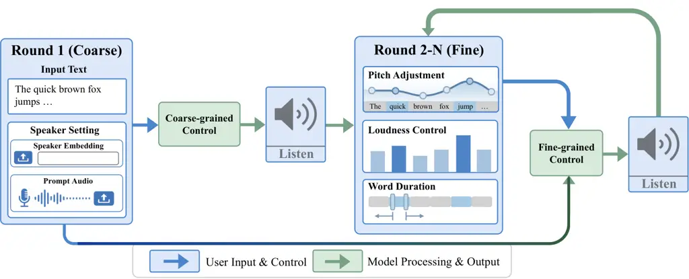
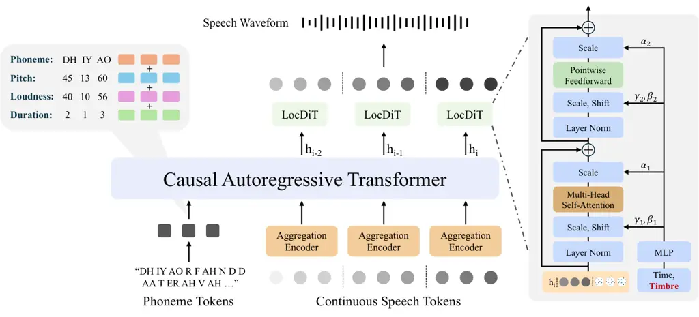

Zheng Sun Liu Chen Kumar Aggarwal Medioni Harwath

# CtrlSpeech: Coarse-to-Fine Control for Expressive Speech Synthesis

Zhisheng    Xiaohang    Zhu    Caren    Rohith    Manoj    Gerard   
David

###### Abstract

Recent Text-To-Speech (TTS) systems have achieved strong naturalness and
zero-shot voice cloning performance, but fine-grained control of
expressive speech at the word or phoneme level remains challenging. We
propose CtrlSpeech, a controllable, expressive TTS framework with
coarse-to-fine control. Built on the DiTAR architecture, CtrlSpeech
combines global speaker conditioning with phone-aligned pitch, loudness,
and duration signals, enabling localized prosodic control while
preserving the target speaker’s timbre. This design allows users to
adjust expressive attributes at a fine temporal granularity, making
speech refinement more flexible and controllable. Experimental results
show that CtrlSpeech achieves competitive zero-shot TTS performance and
improves controllability over expressive attributes, demonstrating its
effectiveness for flexible and practical expressive speech synthesis.
Our demo, code and model weights are available at
[CtrlSpeech](https://zhishengzheng.com/ctrlspeech).

###### keywords

speech synthesis, prosody control, autoregressive diffusion

^(†)^(†)address: ¹ The University of Texas at Austin ² Amazon
^(†)^(†)email: zszheng@utexas.edu, harwath@utexas.edu

## 1 Introduction

Recent text-to-speech (TTS) systems have achieved remarkable progress in
naturalness and zero-shot voice cloning. Reference-conditioned methods
can synthesize speech for unseen speakers from a short prompt waveform,
while text-prompted and instruction-based systems provide a more
intuitive interface for controlling speaking style. However,
fine-grained and explicit control over expressive speech remains
difficult. In many existing systems, speaker identity, prosody, and
style are highly entangled. Even when models expose control over
multiple speech attributes, such control is often provided only at the
sentence or utterance level (e.g., a global style prompt or
instruction), rather than as temporally aligned signals tied to specific
phones or words. As a result, users still lack a practical way to
precisely manipulate local prosodic events—such as the pitch, loudness,
or duration of a specific segment—while preserving target timbre.

To address this problem, we propose CtrlSpeech, a controllable,
expressive speech synthesis framework with _coarse-to-fine_ control.
Built on a DiTAR \[1\] backbone, CtrlSpeech combines global speaker
conditions for timbre control with phone-aligned prosodic signals,
including pitch, loudness, and duration, enabling explicit manipulation
of local expressiveness while preserving speaker identity. It also
supports iterative refinement, allowing users to progressively improve
synthesized speech through control adjustment, which makes expressive
TTS more practical for real-world use.

The contributions of this work are summarized as follows:

1.  1.  We propose CtrlSpeech, a controllable, expressive speech synthesis
        framework that enables unified coarse-to-fine control over both
        global and local attributes.
2.  2.  We design an explicit control pipeline that supports iterative
        speech refinement through aligned pitch, loudness, and duration
        signals, allowing users to flexibly adjust synthesized speech.
3.  3.  Extensive experiments show that CtrlSpeech achieves competitive
        zero-shot TTS performance and significantly improves fine-grained
        controllability over expressive attributes.



Figure 1: Coarse-to-fine speech control pipeline.

## 2 Related Work

### 2.1 Reference-Conditioned Speech Synthesis

Reference-conditioned speech synthesis, also known as voice-cloning or
zero-shot TTS, aims to generate target speech by conditioning the model
on a short reference utterance from an unseen speaker. The input text
specifies the linguistic content and the reference speech provides
speaker-dependent cues such as timbre, prosody, emotion, and style.
Recent work \[2, 3, 4, 5, 6, 1\] shows a clear trend from early
style-transfer methods toward more powerful voice cloning and
controllable generation: autoregressive LLM-based systems such as
VALL-E \[2\] model speech as discrete codec tokens and enable strong
in-context voice imitation, while newer non-autoregressive, diffusion,
and flow-based models such as NaturalSpeech \[3\], MaskGCT \[4\], and
F5-TTS \[5\] improve synthesis quality and efficiency. This paradigm has
enabled models to be highly personalized without speaker-specific
fine-tuning.

### 2.2 Text-Prompted Speech Synthesis

Text-prompted speech synthesis uses textual descriptions or natural
language instructions to guide speech generation in a more intuitive and
user-friendly manner. Representative systems \[7, 8, 9, 10\] show that
language prompts can provide fine-grained control over multiple speech
attributes. More recently, LLM-based systems \[11, 12, 13, 14, 15\] have
further extended this paradigm, enabling more unified and expressive
instruction-following speech synthesis.

## 3 Methodology



Figure 2: The architecture of CtrlSpeech.

### 3.1 Continuous Speech Representations

We model speech in a continuous latent space rather than with discrete
codec tokens, as continuous representations avoid the information loss
introduced by quantization \[1, 16, 17\]. Prior work also notes that
discrete-token pipelines often rely on multi-stage coarse-to-fine
generation, which can increase system complexity and accumulate
errors \[1, 16\]. Therefore, continuous speech representations provide a
more suitable space for modeling subtle variations in prosody, timbre,
and other fine-grained acoustic attributes.

We adopt a variational auto-encoder (VAE) \[18\] to transform raw
waveforms into compact continuous latent tokens. Specifically, the VAE
encoder maps an input waveform to a latent posterior distribution
parameterized by $`(\mu,\log\sigma^{2})`$, from which latent tokens are
sampled. The encoder is implemented with stacked convolutional layers,
while the decoder follows the BigVGAN \[19\] architecture for waveform
reconstruction. In our setup, a 16 kHz input waveform is compressed into
a latent token sequence with a frame rate of 40 Hz, with each latent
token having a dimensionality of 64.

### 3.2 Diffusion Transformer Autoregressive Modeling

To model continuous speech representations, we adopt the DiTAR
architecture \[1\] as our backbone. DiTAR combines causal autoregressive
modeling across patches (groups of tokens) with bidirectional diffusion
modeling within each patch. Instead of predicting every continuous token
derived from the VAE with a purely left-to-right decoder, we partition
the continuous sequence into local groups of tokens (patches) and
decouple generation into two levels: an autoregressive module captures
long-range dependencies among patches, while a local diffusion
transformer reconstructs the fine-grained tokens of the next patch
conditioned on the autoregressive state. This design leverages
bidirectional attention to better model short-range correlations in the
continuous speech features, while retaining an autoregressive backbone
to model longer-range dependencies.

#### 3.2.1 Patch-wise factorization.

Given a continuous token sequence $`\mathbf{x}=(x_{1},\dots,x_{N})`$,
the canonical autoregressive factorization is

```math
p_{\theta}(\mathbf{x})=\prod_{i=1}^{N}p_{\theta}(x_{i}\mid x_{<i}). \tag{1}
```

Rather than parameterizing Eq. (1) directly at the frame level, we group
neighboring tokens into patches of size $`P`$. Let
$`\mathbf{x}^{(k)}=(x_{(k-1)P+1},\dots,x_{kP})`$ denote the $`k`$-th
patch. Each patch is mapped by an aggregation encoder into an embedding,
and the sequence of patch embeddings is processed by the causal
autoregressive transformer. The autoregressive transformer outputs a
hidden representation $`h_{k}`$ summarizing the historical context up to
patch $`k`$, which is used as the condition to generate the next patch:

```math
p(\mathbf{x})\approx\prod_{k}p_{\theta_{a}}(h_{k}\mid\mathbf{x}^{(\leq k)})\,p_{\theta_{b}}(\mathbf{x}^{(k+1)}\mid h_{k}), \tag{2}
```

where $`\theta_{a}`$ denotes the causal autoregressive backbone and
$`\theta_{b}`$ denotes the local diffusion decoder.

#### 3.2.2 Local diffusion decoding (next-patch generation).

Following this formulation, the diffusion decoder (LocDiT in the
original DiTAR design) performs _next-patch generation_ rather than
full-sequence diffusion. Concretely, after the autoregressive backbone
produces $`h_{k}`$, the diffusion module takes $`h_{k}`$ as condition
and denoises the target patch with bidirectional attention, enabling
stronger modeling of intra-patch structure. In addition, historical
patches can be provided as prefix context to the diffusion decoder,
turning local prediction into a context-aware “outpainting”-style
generation process and improving cross-patch continuity.

#### 3.2.3 Diffusion parameterization and training objective.

The diffusion process over each target patch is instantiated as a
variance-preserving (VP) forward process:

```math
x_{t}=\alpha_{t}x_{0}+\sigma_{t}\epsilon,\quad\epsilon\sim\mathcal{N}(0,I),\quad t\in[0,1], \tag{3}
```

and the diffusion decoder is trained with a conditional flow-matching
objective:

```math
\mathcal{L}_{\mathrm{diff}}=\mathbb{E}\left[\left\lVert v_{\theta}(x_{t},t)-v(x_{t},t)\right\rVert_{2}^{2}\right]. \tag{4}
```

where $`v_{\theta}`$ is the predicted velocity field and $`v(x_{t},t)`$
is the target velocity induced by the forward process.

In our work, we inherit this diffusion–autoregressive factorization as
the generative backbone, and adapt the conditioning and training
objectives to our task.

### 3.3 Controllable Attributes

#### 3.3.1 Coarse-grained conditions

We incorporate speaker identity as a coarse-grained controllable
attribute to guide the generation. Specifically, this can be achieved in
two ways: by providing a speaker embedding or by providing prompt
speech. This attribute serves as a global condition for each utterance,
aiming to control timbre-related characteristics without requiring
fine-grained frame-level annotations.

Timbre To capture and replicate the target speaker’s unique vocal
characteristics, the model takes as input a speaker embedding vector
extracted from the prompt speech. We follow the approach of
CosyVoice \[20, 21\] by using a pre-trained voiceprint model¹¹ 1
[https://www.modelscope.cn/models/iic/CosyVoice-300M/file/view/master/campplus.onnx](https://www.modelscope.cn/models/iic/CosyVoice-300M/file/view/master/campplus.onnx)
to extract the robust speaker embedding. This global vector ensures that
the synthesized audio maintains high speaker similarity with the
reference.

#### 3.3.2 Fine-grained conditions

Pitch (Fundamental Frequency)  Pitch corresponds to the fundamental
frequency ($`f_{0}`$), which reflects the vocal fold vibration rate in
voiced speech and plays an important role in prosody. In this work,
$`f_{0}`$ is extracted using the WORLD vocoder \[22\], where the DIO
algorithm \[23\] first estimates the raw contour and StoneMask is then
applied for refinement. The refined $`f_{0}`$ is converted from Hz to
the Mel scale to better match human auditory perception:

```math
f_{\text{mel}}=1127\ln\left(1+\frac{f_{0}}{700}\right) \tag{5}
```

The Mel-scaled $`f_{0}`$ is then quantized into 128 bins (0–127) within
a predefined range of 65.0–650.0 Hz. Voiced frames are linearly mapped
to bins 1–126, unvoiced frames ($`f_{0}\leq 0`$) are assigned to bin 0,
and values above 650.0 Hz are clipped to bin 127. The final coarse pitch
is obtained by rounding to the nearest integer.

Loudness  Loudness reflects the perceived intensity of sound. Since
human hearing is more sensitive to mid-frequency components than to very
low or high frequencies, the waveform is first processed with an
A-weighting filter \[24\] to approximate human auditory sensitivity.
Frame-wise RMS energy is then computed and converted to the decibel
scale:

```math
L_{\text{dB}}=20\log_{10}(\max(\text{RMS},\epsilon)) \tag{6}
```

where $`\epsilon=10^{-10}`$ prevents numerical issues during silent
segments.

The resulting dB values are clipped to the range of -60.0 to 0.0 dB and
quantized into 64 bins (0–63) after min-max normalization. This provides
a compact representation of perceptual loudness with approximately a 1
dB resolution.

Duration  We specify the duration as the temporal length of each phone,
which provides the model low-level control for speech pacing and rhythm.
We use forced alignment to temporally align the phonetic transcription
of each utterance with its paired waveform, and then specify the
duration for each phone in terms of the total number of acoustic frames
spanning that phone.

### 3.4 CtrlSpeech

CtrlSpeech  builds on DiTAR \[1\] and extends it with explicit
controllability for expressive speech synthesis. Given an input phone
sequence, we first encode the linguistic content with phone embeddings.
To enable fine-grained prosody control, each phone embedding is further
augmented with aligned control signals, including discretized pitch,
loudness, and duration. In addition, a speaker embedding extracted from
prompt speech is used as a global condition to preserve the target
speaker’s timbre.

For acoustic modeling, we represent the target waveform as a sequence of
continuous latent tokens produced by the VAE codec. Following the
patch-wise design of DiTAR, we group the acoustic latent sequence into
non-overlapping patches, where each patch contains 4 consecutive latent
tokens. This patch size provides a simple and effective trade-off
between local acoustic coherence and modeling efficiency. The resulting
patch sequence is then fed into the autoregressive backbone for
long-range dependency modeling.

Specifically, the concatenation of text/control tokens and acoustic
patch tokens is processed by a transformer backbone, using
modality-aware position indexing that resets positions independently for
the text and speech streams. The autoregressive backbone outputs one
context representation for each acoustic patch, which conditions the
local diffusion transformer decoder to reconstruct the next patch in
parallel. The entire model is optimized with an L1 flow-matching
objective, together with an auxiliary stop prediction loss that
classifies each acoustic patch as first, middle, or last \[25\]. The
final training objective is defined as

```math
\mathcal{L}=\mathcal{L}_{\mathrm{flow}}+\lambda\mathcal{L}_{\mathrm{stop}}, \tag{7}
```

where $`\mathcal{L}_{\mathrm{flow}}`$ denotes the flow-matching loss,
$`\mathcal{L}_{\mathrm{stop}}`$ denotes the stop prediction loss, and
$`\lambda`$ is a balancing coefficient.

## 4 Experimental Setup

### 4.1 Datasets

During the pretraining stage, CtrlSpeech is trained on a subset of the
English split of Emilia \[26\] and a subset of GigaSpeech \[27\],
yielding approximately 20,000 hours of English speech in total. This
pretraining corpus provides broad acoustic and linguistic coverage,
enabling the model to acquire robust speech generation capabilities. For
evaluation, we assess zero-shot synthesis on LibriSpeech-PC
test-clean \[5\] and Seed-TTS test-en \[28\], and evaluate fine-grained
controllability on LJSpeech \[29\].

### 4.2 Model Configuration

We train two model variants, a 0.1B model and a 0.6B model, under the
same DiTAR architecture. The 0.1B model uses a hidden size of 512, with
a 4-layer, 8-head aggregation encoder and a 4-layer, 8-head DiT decoder;
in contrast, the 0.6B model scales the hidden size to 1024, and
correspondingly adopts a 6-layer, 16-head aggregation encoder and a
6-layer, 16-head DiT decoder. For VAE, we directly use checkpoints from
Semantic-VAE \[30\].

### 4.3 Training and Inference

Both model variants were trained with the same setup. We used the AdamW
optimizer with a learning rate of $`2\times 10^{-4}`$ and a weight decay
of 0.01. The learning rate was linearly warmed up over the first 5% of
training steps and then linearly decayed for the remaining steps. Each
model was trained for 5 epochs on 8 NVIDIA A100 80GB GPUs. During
inference, classifier-free guidance (CFG) \[31\] is adopted with 32
sampling steps and a guidance scale of 1.5, where the time and speaker
embeddings are treated as a unified conditioning signal.

### 4.4 Evaluation Metrics

Objective metrics We use Word Error Rate (WER) as an automatic proxy for
the intelligibility of the synthesized speech; this is calculated using
Whisper-large-v3 \[32\]. Additionally, speaker similarity (SIM-o) is
objectively measured by computing the cosine similarity of speaker
embeddings, which are extracted from both the generated and original
target speech using a WavLM-based speaker verification model \[33\].
RMSE for pitch and loudness measures frame-level deviation from the
ground-truth speech in Hz and dB, respectively. For duration, we report
phoneme-level mean absolute error (MAE). Lower RMSE or MAE indicates
better controllability.

Subjective metrics We adopt Comparative Mean Opinion Score (CMOS) and
Similarity Mean Opinion Score (SMOS) assessed by human raters. For CMOS,
raters listen to the synthesized utterance and the ground-truth
recording and judge which one sounds more natural (and by how much). For
SMOS, raters score the perceived speaker similarity between the
synthesized speech and the reference prompt.

## 5 Results and Analysis

|                           |                      |                   |                  |                  |
| ------------------------- | -------------------- | ----------------- | ---------------- | ---------------- |
| Model                     | WER(%)$`\downarrow`$ | SIM-o$`\uparrow`$ | CMOS$`\uparrow`$ | SMOS$`\uparrow`$ |
| LibriSpeech-PC test-clean |                      |                   |                  |                  |
| Ground Truth              | 2.40                 | 0.69              | 0.00             | 3.90             |
| Vocoder Reconstructed     | 2.45                 | 0.68              | -                | -                |
| DiTAR^(†)                 | 2.55                 | 0.61              | -0.22            | 3.74             |
| CtrlSpeech (0.1B)         | 4.36                 | 0.61              | -0.65            | 3.66             |
| CtrlSpeech (0.6B)         | 2.46                 | 0.65              | -0.16            | 3.81             |
| Seed-TTS test-en          |                      |                   |                  |                  |
| Ground Truth              | 1.90                 | 0.73              | 0.00             | 3.85             |
| Vocoder Reconstructed     | 1.93                 | 0.69              | -                | -                |
| DiTAR^(†)                 | 2.89                 | 0.59              | -0.32            | 3.70             |
| CtrlSpeech (0.1B)         | 6.50                 | 0.58              | -0.60            | 3.66             |
| CtrlSpeech (0.6B)         | 2.58                 | 0.63              | -0.23            | 3.78             |

^(†)Since DiTAR is not open-source, these results are based on our own
reproduction using the same training data. The model size is 0.6B.

Table 1: Zero-Shot TTS performance on LibriSpeech-PC test-clean and
Seed-TTS test-en.

### 5.1 Zero-shot TTS Performance

Table 1 summarizes the zero-shot TTS results on LibriSpeech-PC
test-clean and Seed-TTS test-en. Overall, CtrlSpeech (0.6B) achieves
competitive performance against the reproduced DiTAR baseline. On
LibriSpeech-PC, it obtains 2.46% WER and 0.65 SIM-o, and on Seed-TTS, it
reaches 2.58% WER and 0.63 SIM-o, outperforming DiTAR on both objective
metrics. Subjective results also show consistent gains in SMOS,
indicating better speaker similarity in zero-shot synthesis.

### 5.2 Effect of Speaker Control

|                             |                      |                   |
| --------------------------- | -------------------- | ----------------- |
| Condition                   | WER(%)$`\downarrow`$ | SIM-o$`\uparrow`$ |
| w/o speaker condition       | 3.12                 | 0.07              |
| + speaker embedding only    | 3.27                 | 0.48              |
| + prompt speech only        | 2.69                 | 0.53              |
| + embedding + prompt speech | 2.58                 | 0.63              |

Table 2: Ablation study on coarse-grained speaker control conditions for
CtrlSpeech (0.6B) on the Seed-TTS test-en set.

Table 2 shows the effect of coarse-grained speaker conditions. Without
speaker conditioning, SIM-o drops to 0.07, confirming its importance for
timbre control. Using only speaker embedding or only prompt speech
improves performance, while combining both achieves the best result
(2.58% WER and 0.63 SIM-o), indicating that they provide complementary
speaker information.

### 5.3 Fine-grained Controllability

|                      |                   |                          |                             |
| -------------------- | ----------------- | ------------------------ | --------------------------- |
| Condition            | Model             | Pitch (Hz)$`\downarrow`$ | Loudness (dB)$`\downarrow`$ |
| Text-only            | DrawSpeech \[34\] | 43.59                    | 14.03                       |
|                      | CtrlSpeech (0.1B) | 77.84                    | 7.12                        |
|                      | CtrlSpeech (0.6B) | 67.86                    | 6.35                        |
| With Sketch          | DrawSpeech \[34\] | 27.78                    | 13.15                       |
| With Control Signals | CtrlSpeech (0.1B) | 41.54                    | 5.01                        |
|                      | CtrlSpeech (0.6B) | 38.39                    | 4.56                        |

Table 3: RMSE between synthesized speech and ground truth speech on
LJSpeech test set.

As shown in Table 3, we first measure pitch and loudness controllability
on the LJSpeech test set using RMSE with respect to the ground-truth
speech. In the text-only setting, CtrlSpeech exhibits larger pitch error
than DrawSpeech, indicating that accurate local prosody is difficult to
recover from text alone. However, once explicit control signals are
provided, both model variants show substantial reductions in RMSE for
both attributes. In particular, CtrlSpeech (0.6B) reduces pitch RMSE
from 67.86 Hz to 38.39 Hz and loudness RMSE from 6.35 dB to 4.56 dB,
demonstrating that the aligned pitch and loudness conditions provide
effective and direct control over local acoustic realization.

|                    |             |                    |
| ------------------ | ----------- | ------------------ |
| Model              | Setting     | MAE $`\downarrow`$ |
| DiTAR (replicated) | –           | 28.00              |
| CtrlSpeech (0.1B)  | w/o control | 31.58              |
|                    | w/ control  | 14.00              |
| CtrlSpeech (0.6B)  | w/o control | 28.08              |
|                    | w/ control  | 11.86              |

Table 4: Phoneme-level duration mean absolute error (MAE) on
LibriSpeech-PC test-clean.

Table 4 further evaluates duration controllability using phoneme-level
duration MAE on LibriSpeech-PC test-clean. Without duration control,
CtrlSpeech achieves similar duration accuracy to the replicated DiTAR
baseline. In contrast, when duration control is enabled, the error drops
sharply for both model sizes. Specifically, the MAE decreases from 31.58
to 14.00 for CtrlSpeech (0.1B), and from 28.08 to 11.86 for CtrlSpeech
(0.6B), substantially outperforming the replicated DiTAR result. These
results confirm that the proposed phone-aligned duration condition
allows the model to better follow target temporal patterns and gives
users effective control over speech pacing and rhythm.

### 5.4 User Interface for Coarse-to-Fine Control

As shown in Figure 1, the user interface of CtrlSpeech supports a
coarse-to-fine workflow: users first generate an initial speech sample
with input text and speaker conditions, and then iteratively refine
local pitch, loudness, and duration through fine-grained controls.

## 6 Conclusion

In this paper, we proposed CtrlSpeech, a controllable expressive TTS
framework with coarse-to-fine control. By combining global speaker
conditioning with phone-aligned prosodic signals, CtrlSpeech enables
flexible control over expressive speech while preserving zero-shot
synthesis quality. Experimental results demonstrate its effectiveness in
zero-shot TTS, as well as its coarse- and fine-grained controllability.

## 7 Limitations

This work has several limitations. First, our experiments are mainly
conducted on English speech, so the effectiveness of CtrlSpeech for
multilingual or code-switching synthesis remains unexplored. Second, the
proposed fine-grained control depends on phone-aligned pitch, loudness,
and duration signals, whose quality may be affected by errors from pitch
extraction and forced alignment. Third, although explicit controls
improve attribute controllability, text-only generation still has
difficulty predicting precise local prosody, especially pitch. Finally,
the current system focuses on speaker identity, pitch, loudness, and
duration, while other expressive factors such as emotion, voice quality,
and nonverbal vocalizations are not explicitly modeled.

## 8 Acknowledgments

This work was supported by Amazon.com, PO No. 2D-16003984 through the
Amazon-UT Austin HUB. We thank Guanrou Yang and Zhikang Niu for their
incredible help.

## 9 Generative AI Use Disclosure

Generative AI tools were used only for language editing and
proofreading. All authors remain fully responsible for the content of
this manuscript.

## References

- \[1\] D. Jia, Z. Chen, J. Chen, C. Du, J. Wu, J. Cong, X. Zhuang, C.
  Li, Z. Wei, Y. Wang, et al. (2025) Ditar: diffusion transformer
  autoregressive modeling for speech generation. arXiv preprint
  arXiv:2502.03930. Cited by: §1, §2.1, §3.1, §3.2, §3.4.
- \[2\] C. Wang, S. Chen, Y. Wu, Z. Zhang, L. Zhou, S. Liu, Z. Chen, Y.
  Liu, H. Wang, J. Li, et al. (2023) Neural codec language models are
  zero-shot text to speech synthesizers. arXiv preprint
  arXiv:2301.02111. Cited by: §2.1.
- \[3\] Z. Ju, Y. Wang, K. Shen, X. Tan, D. Xin, D. Yang, Y. Liu, Y.
  Leng, K. Song, S. Tang, et al. (2024) Naturalspeech 3: zero-shot
  speech synthesis with factorized codec and diffusion models. arXiv
  preprint arXiv:2403.03100. Cited by: §2.1.
- \[4\] Y. Wang, H. Zhan, L. Liu, R. Zeng, H. Guo, J. Zheng, Q.
  Zhang, X. Zhang, S. Zhang, and Z. Wu (2024) Maskgct: zero-shot
  text-to-speech with masked generative codec transformer. arXiv
  preprint arXiv:2409.00750. Cited by: §2.1.
- \[5\] Y. Chen, Z. Niu, Z. Ma, K. Deng, C. Wang, J. JianZhao, K. Yu,
  and X. Chen (2025) F5-tts: a fairytaler that fakes fluent and faithful
  speech with flow matching. In Proceedings of the 63rd Annual Meeting
  of the Association for Computational Linguistics (Volume 1: Long
  Papers), pp. 6255–6271. Cited by: §2.1, §4.1.
- \[6\] Z. Zheng, P. Peng, A. Diwan, C. P. Huynh, X. Sun, Z. Liu, V.
  Bhat, and D. Harwath (2025) VoiceCraft-x: unifying multilingual,
  voice-cloning speech synthesis and speech editing. In Proceedings of
  the 2025 Conference on Empirical Methods in Natural Language
  Processing, pp. 2737–2756. Cited by: §2.1.
- \[7\] Z. Guo, Y. Leng, Y. Wu, S. Zhao, and X. Tan (2023) Prompttts:
  controllable text-to-speech with text descriptions. In ICASSP
  2023-2023 IEEE International Conference on Acoustics, Speech and
  Signal Processing (ICASSP), pp. 1–5. Cited by: §2.2.
- \[8\] Y. Leng, Z. Guo, K. Shen, X. Tan, Z. Ju, Y. Liu, Y. Liu, D.
  Yang, L. Zhang, K. Song, et al. (2023) Prompttts 2: describing and
  generating voices with text prompt. arXiv preprint arXiv:2309.02285.
  Cited by: §2.2.
- \[9\] D. Yang, S. Liu, R. Huang, C. Weng, and H. Meng (2024)
  Instructtts: modelling expressive tts in discrete latent space with
  natural language style prompt. IEEE/ACM Transactions on Audio, Speech,
  and Language Processing 32, pp. 2913–2925. Cited by: §2.2.
- \[10\] D. Lyth and S. King (2024) Natural language guidance of
  high-fidelity text-to-speech with synthetic annotations. arXiv
  preprint arXiv:2402.01912. Cited by: §2.2.
- \[11\] Y. Zhou, X. Qin, Z. Jin, S. Zhou, S. Lei, S. Zhou, Z. Wu,
  and J. Jia (2024) Voxinstruct: expressive human instruction-to-speech
  generation with unified multilingual codec language modelling. In
  Proceedings of the 32nd ACM International Conference on Multimedia,
  pp. 554–563. Cited by: §2.2.
- \[12\] G. Yang, C. Yang, Q. Chen, Z. Ma, W. Chen, W. Wang, T. Wang, Y.
  Yang, Z. Niu, W. Liu, et al. (2025) Emovoice: llm-based emotional
  text-to-speech model with freestyle text prompting. In Proceedings of
  the 33rd ACM International Conference on Multimedia, pp. 10748–10757.
  Cited by: §2.2.
- \[13\] A. Diwan, Z. Zheng, D. Harwath, and E. Choi (2025) Scaling rich
  style-prompted text-to-speech datasets. In Proceedings of the 2025
  Conference on Empirical Methods in Natural Language Processing,
  pp. 3639–3659. Cited by: §2.2.
- \[14\] Z. Du, C. Gao, Y. Wang, F. Yu, T. Zhao, H. Wang, X. Lv, H.
  Wang, C. Ni, X. Shi, et al. (2025) Cosyvoice 3: towards in-the-wild
  speech generation via scaling-up and post-training. arXiv preprint
  arXiv:2505.17589. Cited by: §2.2.
- \[15\] X. Zhang, J. Zhang, Y. Wang, C. Wang, Y. Chen, D. Jia, Z. Chen,
  and Z. Wu (2025) Vevo2: a unified and controllable framework for
  speech and singing voice generation. arXiv preprint arXiv:2508.16332.
  Cited by: §2.2.
- \[16\] K. An, Z. Zhang, C. Gao, Y. Li, Z. Peng, H. Wang, Z. Du, H.
  Zhao, Z. Gao, and X. Li (2025) MELA-tts: joint transformer-diffusion
  model with representation alignment for speech synthesis. arXiv
  preprint arXiv:2509.14784. Cited by: §3.1.
- \[17\] H. Wang, Y. Yang, S. Liu, J. Li, L. Meng, Y. Liu, J. Zhou, H.
  Sun, Y. Lu, and Y. Qin (2025) Streammel: real-time zero-shot
  text-to-speech via interleaved continuous autoregressive modeling.
  IEEE Signal Processing Letters. Cited by: §3.1.
- \[18\] R. Kumar, P. Seetharaman, A. Luebs, I. Kumar, and K.
  Kumar (2023) High-fidelity audio compression with improved rvqgan.
  Advances in Neural Information Processing Systems 36, pp. 27980–27993.
  Cited by: §3.1.
- \[19\] S. Lee, W. Ping, B. Ginsburg, B. Catanzaro, and S. Yoon (2022)
  Bigvgan: a universal neural vocoder with large-scale training. arXiv
  preprint arXiv:2206.04658. Cited by: §3.1.
- \[20\] Z. Du, Q. Chen, S. Zhang, K. Hu, H. Lu, Y. Yang, H. Hu, S.
  Zheng, Y. Gu, Z. Ma, et al. (2024) Cosyvoice: a scalable multilingual
  zero-shot text-to-speech synthesizer based on supervised semantic
  tokens. arXiv preprint arXiv:2407.05407. Cited by: §3.3.1.
- \[21\] Z. Du, Y. Wang, Q. Chen, X. Shi, X. Lv, T. Zhao, Z. Gao, Y.
  Yang, C. Gao, H. Wang, et al. (2024) Cosyvoice 2: scalable streaming
  speech synthesis with large language models. arXiv preprint
  arXiv:2412.10117. Cited by: §3.3.1.
- \[22\] M. Morise, F. Yokomori, and K. Ozawa (2016) World: a
  vocoder-based high-quality speech synthesis system for real-time
  applications. IEICE TRANSACTIONS on Information and Systems 99 (7),
  pp. 1877–1884. Cited by: §3.3.2.
- \[23\] M. Morise, H. Kawahara, and H. Katayose (2009) Fast and
  reliable f0 estimation method based on the period extraction of vocal
  fold vibration of singing voice and speech. In Audio Engineering
  Society Conference: 35th International Conference: Audio for Games,
  Cited by: §3.3.2.
- \[24\] (2013) IEC 61672-1:2013: electroacoustics — sound level meters
  — part 1: specifications. International Electrotechnical Commission
  (IEC), Geneva, Switzerland. Cited by: §3.3.2.
- \[25\] X. He, S. N. Ray, H. Mallidi, J. Huang, A. Bellur, C.
  Chandak, M. Maruf, and V. Ravichandran (2025) Continuous-token
  diffusion for speaker-referenced tts in multimodal llms. arXiv
  preprint arXiv:2510.12995. Cited by: §3.4.
- \[26\] H. He, Z. Shang, C. Wang, X. Li, Y. Gu, H. Hua, L. Liu, C.
  Yang, J. Li, P. Shi, et al. (2024) Emilia: an extensive, multilingual,
  and diverse speech dataset for large-scale speech generation. In 2024
  IEEE Spoken Language Technology Workshop (SLT), pp. 885–890. Cited by:
  §4.1.
- \[27\] G. Chen, S. Chai, G. Wang, J. Du, W. Zhang, C. Weng, D. Su, D.
  Povey, J. Trmal, J. Zhang, et al. (2021) Gigaspeech: an evolving,
  multi-domain asr corpus with 10,000 hours of transcribed audio. arXiv
  preprint arXiv:2106.06909. Cited by: §4.1.
- \[28\] P. Anastassiou, J. Chen, J. Chen, Y. Chen, Z. Chen, Z. Chen, J.
  Cong, L. Deng, C. Ding, L. Gao, et al. (2024) Seed-tts: a family of
  high-quality versatile speech generation models. arXiv preprint
  arXiv:2406.02430. Cited by: §4.1.
- \[29\] K. Ito and L. Johnson (2017) The lj speech dataset. Cited by:
  §4.1.
- \[30\] Z. Niu, S. Hu, J. Choi, Y. Chen, P. Chen, P. Zhu, Y. Yang, B.
  Zhang, J. Zhao, C. Wang, et al. (2025) Semantic-vae:
  semantic-alignment latent representation for better speech synthesis.
  arXiv preprint arXiv:2509.22167. Cited by: §4.2.
- \[31\] J. Ho and T. Salimans (2022) Classifier-free diffusion
  guidance. arXiv preprint arXiv:2207.12598. Cited by: §4.3.
- \[32\] A. Radford, J. W. Kim, T. Xu, G. Brockman, C. McLeavey, and I.
  Sutskever (2023) Robust speech recognition via large-scale weak
  supervision. In International conference on machine learning,
  pp. 28492–28518. Cited by: §4.4.
- \[33\] S. Chen, C. Wang, Z. Chen, Y. Wu, S. Liu, Z. Chen, J. Li, N.
  Kanda, T. Yoshioka, X. Xiao, et al. (2022) Wavlm: large-scale
  self-supervised pre-training for full stack speech processing. IEEE
  Journal of Selected Topics in Signal Processing 16 (6), pp. 1505–1518.
  Cited by: §4.4.
- \[34\] W. Chen, S. Yang, G. Li, and X. Wu (2025) Drawspeech:
  expressive speech synthesis using prosodic sketches as control
  conditions. In ICASSP 2025-2025 IEEE International Conference on
  Acoustics, Speech and Signal Processing (ICASSP), pp. 1–5. Cited by:
  Table 3, Table 3.
