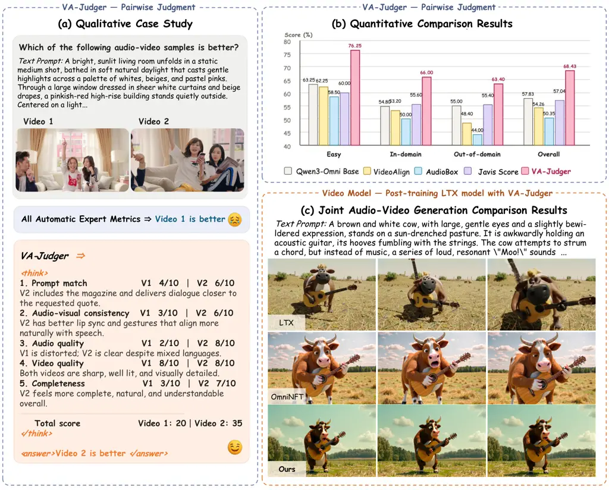
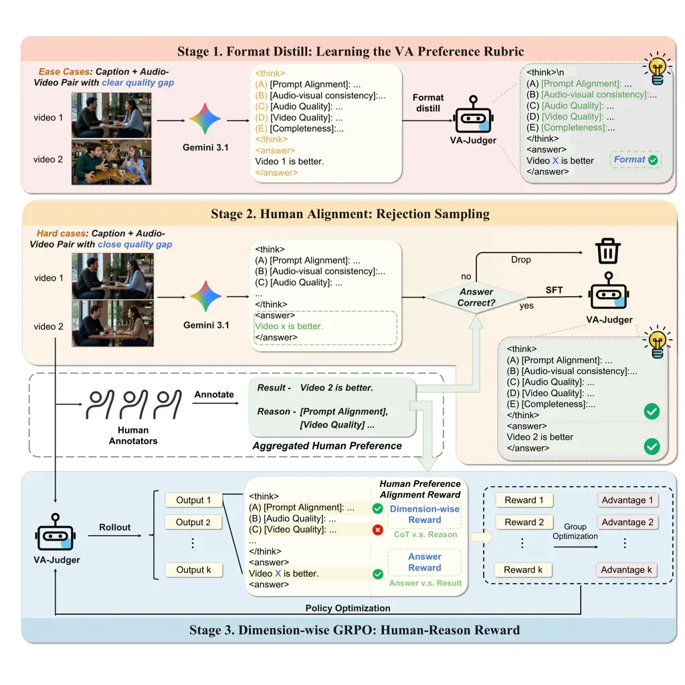
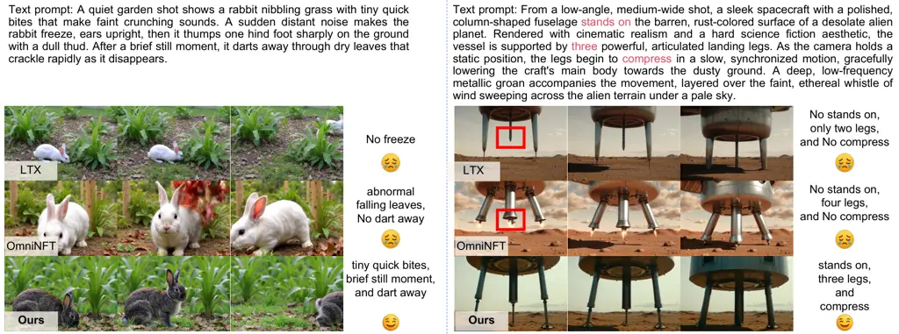
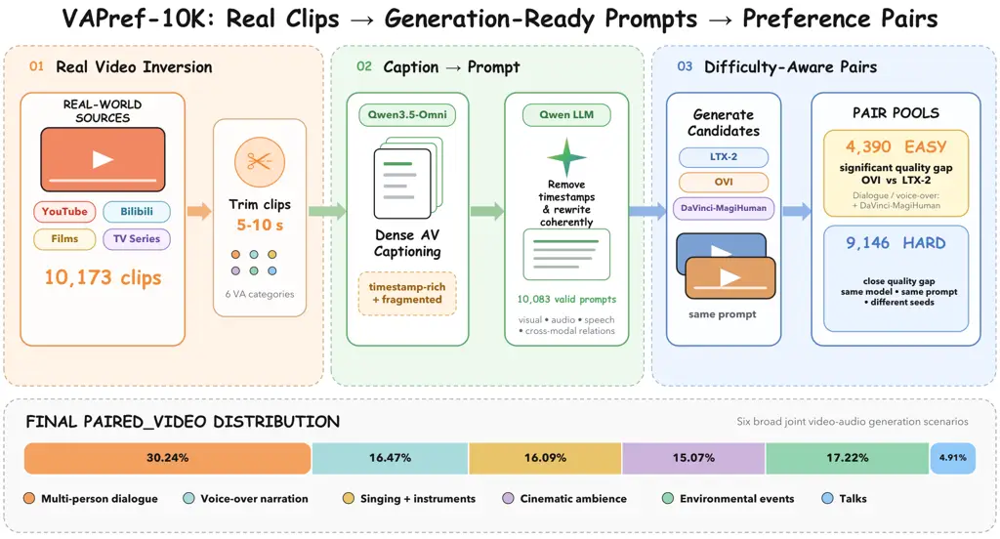

# VA-Judger: Reward Modeling from Human Preference Feedback for Joint Video-Audio Generation

Yinming Huang^(1,2,\*)   Shuyuan Tu^(1,\*)   Xi Yan¹   Zihan Yang¹
  Jianhua Han³  
Hang Xu³   Kaihang Pan⁴   Yu-Gang Jiang^(1,†)   Zuxuan Wu^(1,2,†) ¹Fudan
University  ²Shanghai Innovation Institution ³Yinwang Intelligent
Technology Co., Ltd  ⁴Zhejiang University ^(\*)Equal contribution.
 ^(†)Corresponding authors. Code:
[https://github.com/ShareLab-SII/VA-Judger](https://github.com/ShareLab-SII/VA-Judger)

###### Abstract

Using reinforcement learning to post-train joint video-audio generation
models requires a reward signal. Existing methods construct this reward
by combining metrics for individual quality dimensions, including audio
quality, visual fidelity, and synchronization. However, these metrics
evaluate perceptual dimensions separately and fail to capture the
overall semantic and temporal coherence among the text prompt, video,
and audio that shapes human preferences. More critically, they are
poorly aligned with actual human judgments. Optimizing models against
these metrics encourages reward hacking, generating video-audio content
that achieves high scores on these metrics yet appears incoherent or
unfaithful to human viewers. To address this problem, we first construct
VAPref-10K for joint video-audio generation, comprising 9K prompts and
10.3K fine-grained paired comparisons from generation models. We also
introduce the VA-Judger-Bench benchmark with both in-domain and
out-of-domain model comparisons to evaluate whether reward models truly
align with human preferences. We further propose VA-Judger, a
chain-of-thought omni-reward model for joint video-audio generation. In
particular, VA-Judger first learns from pairs with clear quality gaps to
establish structured output and coarse preference discrimination, then
distills reliable preference explanations for harder near-quality
comparisons via rejection sampling verified against human annotations,
and finally performs dimension-wise reinforcement learning that
decomposes human feedback into individual quality dimensions for denser
reward signals than a single binary preference label. Experiments show
that VA-Judger outperforms metric baselines in predicting human
preferences on both in-domain and out-of-domain evaluations. Using its
human-aligned rewards to post-train an audio-video generation model also
improves most automatic metrics and human preference.

|     |
| --- |
|     |



Figure 1: Evaluation of VA-Judger. (a) VA-Judger selects the preferred
clip through structured dimension-wise reasoning, whereas separate
evaluation metrics disagree with human judgment. (b) VA-Judger achieves
the highest agreement with human preferences. (c) VA-Judger provides the
reward for post-training LTX-2, improving the quality over the base
model and OmniNFT.

## 1 Introduction

Recent advancements in joint video-audio generation (OpenAI, 2025;
Google DeepMind, 2025; Seedance et al., 2026; Alibaba Cloud, 2026b;
Google DeepMind, 2026b; Wang et al., 2025b; Low et al., 2025; Liu et
al., 2026a; Team et al., 2025; Team et al., 2026; Liu et al., 2026b;
Chern et al., 2026; HaCohen et al., 2026; Zhou et al., 2026) have made
it possible to generate increasingly realistic visual content and
synchronized sound. These inspire researchers to explore post-training
via reinforcement learning to align the synthesized content with
perceptual quality and user intent. However, the reward signal used
during reinforcement learning remains a critical bottleneck for joint
video-audio generation. Current approaches such as OmniNFT (Zhang et
al., 2026) construct rewards from multiple evaluation metrics, including
VideoAlign (Liu et al., 2025b) and HPSv3 (Ma et al., 2025) for video
quality, Audiobox Aesthetics (Tjandra et al., 2025) for audio quality,
CLAP (Wu et al., 2023) for audio-text alignment, and DeSync (Iashin et
al., 2024) for audio-visual synchronization. These metrics score
perceptual dimensions separately and may miss semantic and temporal
relations among the prompt, video, and audio. More fundamentally, such
evaluation metrics are poorly aligned with actual human judgments (Liu
et al., 2025b; Wang et al., 2024b). A sample may receive a high
synchronization score while depicting the wrong event, obtain a strong
visual score while carrying emotionally incompatible sound, or satisfy
several metric criteria while failing as a coherent video-audio
experience (Figure 1(a,b)). Optimizing models against such rewards
encourages overfitting to narrow metric targets, synthesizing
video-audio content that scores well on these metrics yet appears
unfaithful to human viewers, undermining the practical value of
post-training (Figure 1(c)).

This issue has been addressed in other generation domains through human
preference learning. In language modeling, preference-based optimization
and reward modeling have enabled instruction-following
generation (Christiano et al., 2017; Ouyang et al., 2022; Rafailov et
al., 2023). Image generation has adopted human-preference datasets and
reward models such as Pick-a-Pic (Kirstain et al., 2023),
ImageReward (Xu et al., 2023), HPSv3 (Ma et al., 2025), and MPS (Zhang
et al., 2024). Video generation has similarly begun to leverage human
feedback through InstructVideo (Yuan et al., 2024), LiFT (Wang et al.,
2024b), VADER (Prabhudesai et al., 2024), and VideoReward (Liu et al.,
2025b). However, none of these efforts address joint video-audio
generation, and their reward models cannot be directly transferred to
this setting. The fundamental challenge is that human preference over
video-audio content is not decomposable into independent per-modality
judgments. Text-to-image/video reward models do not observe the audio
stream and thus cannot assess whether sound matches the depicted event,
while audio-only evaluation lacks the visual context that shapes human
perception of sound plausibility. Even combining such single-modality
evaluators cannot recover the cross-modal interactions that govern human
preference. Addressing this problem requires both joint audio-video
assessment and preference data derived from holistic human judgments of
the complete text-video-audio experience, neither of which currently
exists for joint video-audio generation.

In light of this, we first address the scarcity of human preference data
by constructing VAPref-10K, a large-scale preference dataset tailored
for joint video-audio generation. VAPref-10K comprises approximately 9K
prompts derived from captioned web videos across seven broad video-audio
categories, with 10.3K fine-grained paired comparisons generated by
state-of-the-art generation models. Rather than absolute scalar scoring
for each quality dimension, which can vary substantially across human
experts due to subjective calibration, annotators compare two generated
clips from the same prompt, select the preferred one, and identify the
quality dimensions that justify their decision. From VAPref-10K, we
introduce VA-Judger-Bench as a benchmark for evaluating whether reward
models align with human video-audio preferences. Beyond in-domain
evaluation, VA-Judger-Bench includes an out-of-domain split built from
AVGenBench (Zhou et al., 2026), pairing outputs from closed-source
models (Kling 2.6 (Kuaishou Technology, 2025), Wan 2.6 (Alibaba Cloud,
2026a), Veo 3.1 Fast, Veo 3.1 Quality (Google DeepMind, 2025), and
Sora 2 (OpenAI, 2025)). They are excluded from training.

Furthermore, we propose VA-Judger, a chain-of-thought omni-reward model
for joint video-audio generation. Video-audio preference judgment is a
complex reasoning task because it must simultaneously acquire a
structured comparison format, discriminate subtle cross-modal failures,
and provide dimension-level feedback. Thus, we adopt a progressive
training strategy. We begin with pairs that have clear quality gaps, for
which Gemini 3.1 (Google DeepMind, 2026a) generates rubric-format CoT
answers containing dimension-wise scores, explanations, and a final
preference to perform cold start. These generated answers help the model
acquire the structured comparison format and basic quality
discrimination before encountering ambiguous cases. For the more
challenging comparisons between outputs with subtle quality differences,
Gemini’s final preferences alone are not sufficiently reliable. We thus
use rejection sampling. Gemini 3.1 (Google DeepMind, 2026a) first
generates CoT answers for hard pairs, and we retain only format-valid
responses whose final preferences and human-selected dimension score
orderings agree with the annotations. This allows the model to learn
from consistently formatted reasoning traces grounded in human
judgments. Finally, since a single binary preference label is too sparse
to guide fine-grained preference learning, we perform dimension-wise
reinforcement learning with GRPO (Shao et al., 2024). This separately
rewards score orderings on human-identified quality dimensions,
including visual quality, audio quality, synchronization, and semantic
faithfulness, and therefore provides denser optimization signals than
the final preference alone.

In conclusion, our contributions are as follows: (1) We construct
VAPref-10K and VA-Judger-Bench, comprising 10.3K human-labeled
comparisons across three training models and five additional benchmark
models. (2) We propose VA-Judger, a chain-of-thought omni-reward model
for joint video-audio generation, trained via easy-to-hard preference
learning, structured-response distillation, and dimension-wise
reinforcement learning with human feedback. To our knowledge, we are the
first to explore reward modeling for joint video-audio generation via
human feedback. (3) We introduce VA-Judger-Bench for evaluating
video-audio reward models against human preferences. VA-Judger achieves
better alignment with human judgments in both in-domain and
out-of-domain settings. Using VA-Judger as a reward for post-training
further improves human-perceived generation quality.

## 2 Related work

### 2.1 Joint video-audio generation models

Recent generative models have moved from silent video generation toward
joint video-audio generation. Broader video-generation research explores
unified free-form composition and reasoning in OmniWeaving and agentic
long-form generation in ViMax (Pan et al., 2026; Huang et al., 2026).
Closed-source models (OpenAI, 2025; Google DeepMind, 2025) demonstrate
the joint-generation trend at product scale. Regarding open-source
models, UniVerse-1 stitches pretrained video and music experts (Wang et
al., 2025b), whereas Ovi uses twin diffusion backbones with blockwise
cross-modal fusion (Low et al., 2025). MOVA (Team et al., 2026) and
daVinci-MagiHuman (Chern et al., 2026) use large-scale video data.
LTX-2 (HaCohen et al., 2026) aims to handle the capacity imbalance
between modalities. Baton (Tu et al., 2026b) introduces explicit
semantic blueprints for joint video-audio generation. The Javis (Liu et
al., 2026a; Liu et al., 2026b) series further emphasizes
synchronization. JoyAI-Echo (Li et al., 2026) targets long-form
generation. Complementary work studies motion editing (Tu et al., 2024a;
Tu et al., 2024b) and identity-preserving or long-form portrait
animation (Tu et al., 2025c; Tu et al., 2025b; Tu et al., 2025a; Tu et
al., 2026a). However, existing models are still primarily optimized by
model-side objectives or expert metrics, leaving substantial room for
improving human-perceived quality and video-audio coherence.

### 2.2 Multimodal reward models

Reward modeling is a standard way to turn human preference data into
optimization signals. Recent multimodal generation methods improve
unified visual modeling through discrete diffusion timestep tokens,
zero-shot demonstrative instruction tuning, and intrinsic 3D
awareness (Pan et al., 2025a; Li et al., 2024; Qiu et al., 2026). In
image generation, Pick-a-Pic (Kirstain et al., 2023) provides image
preference data, and ImageReward (Xu et al., 2023) learns an image
reward model. In video generation, LiFT (Wang et al., 2024b) trains
LiFT-Critic for preference alignment, and VideoReward (Liu et al.,
2025b) studies multi-dimensional human preference annotations.
Furthermore, IXC-2.5-Reward (Zang et al., 2025) is trained on broad
image and video preference data, while UnifiedReward-Think (Wang et al., 2026) provides reward signals for both multimodal understanding and
generation tasks. However, neither model is trained on joint
text-video-audio preference comparisons or explicitly evaluates whether
the text, video, and audio form a coherent event. VA-Judger instead
targets human preference alignment for joint video-audio generation by
jointly assessing visual and audio quality, semantic fidelity, and
cross-modal consistency.

### 2.3 Reinforcement learning for generative models

Recent works adapt online reinforcement learning to diffusion models.
FlowGRPO (Liu et al., 2025a) makes GRPO applicable to text-to-image flow
models. DanceGRPO (Xue et al., 2025) designs a unified GRPO framework
for text-to-image/video and image-to-video generation.
DiffusionNFT (Zheng et al., 2026) uses positive and negative generations
to define an implicit policy-improvement direction. ArcFlow improves
two-step text-to-image generation through high-precision nonlinear flow
distillation (Yang et al., 2026). SelfTok and Janus-Pro-R1 further
combine unified visual generation with reinforcement learning or
supervised and reinforcement-learning stages (Wang et al., 2025a; Pan et
al., 2025b). In joint video-audio generation, OmniNFT (Zhang et al., 2026) applies online diffusion reinforcement learning, while related
systems such as JavisDiT++ (Liu et al., 2026b) explore preference
optimization through different formulations. OmniNFT’s optimization
still depends on separate evaluation metrics such as VideoAlign (Liu et
al., 2025b), HPSv3 (Ma et al., 2025), Audiobox Aesthetics (Tjandra et
al., 2025), CLAP (Wu et al., 2023), and DeSync (Iashin et al., 2024).
This motivates our dimension-wise reinforcement learning with VA-Judger,
which learns the reward signal from human preference annotations instead
of optimizing only narrow expert metrics.

## 3 Method

VA-Judger is designed to provide a reward signal for post-training
text-to-video-audio generation models. Concretely, we first construct
VAPref-10K from difficulty-aware video-audio pairs (Fig 6 and Sec 3.2).
We then train VA-Judger using the three-stage pipeline (Fig 2), which
combines an easy-pair cold start, hard-pair SFT using human-aligned and
format-valid responses (Sec 3.3), and dimension-wise reinforcement
learning (Sec 3.4).

### 3.1 Task Formulation

We formulate video-audio reward modeling as pairwise preference
prediction with structured dimension-wise reasoning. Each example
consists of a text prompt $`p`$, two generated video-audio clips
$`x_{1}=(v_{1},a_{1})`$ and $`x_{2}=(v_{2},a_{2})`$, and a preferred
index $`y^{\star}\in\{1,2\}`$. The input to the model is a fixed system
prompt that specifies the evaluation rubric, followed by a user message
containing the text prompt and the two videos with audio. This input
format forces our model to jointly evaluate the combined
text-video-audio performance, not a separate audio or video score. The
model then produces an interpretable chain-of-thought comparison (Wei et
al., 2022; Wang et al., 2026). For each clip, it assigns a 1–10 score
with a brief justification on five dimensions, namely (A) prompt
alignment, (B) video-audio consistency, (C) audio quality, (D) video
quality, and (E) completeness and coherence, then aggregates these into
a total score and emits a final preference in the format \<answer\>video
k is better\</answer\>.

### 3.2 Human-Preference Data Construction

VAPref-10K contains human-annotated hard comparisons and out-of-domain
comparisons. The 4,390 easy cross-model pairs form a separate cold-start
set and are not part of VAPref-10K. To make VAPref-10K comprehensive, it
covers a diverse range of text prompts across various scenarios. Recent
benchmarks combine taxonomy-driven synthetic prompts with curated or
video-derived examples (Hua et al., 2026; Cao et al., 2025; Zhou et al.,
2026). In contrast, VAPref-10K uses 10,173 real video-audio clips
sourced from YouTube, Bilibili, films, and TV series as the primary
source for prompt construction. This preserves naturally occurring
events and cross-modal interactions, yielding more complex and realistic
prompts. We trim the collected videos into 5-10-second segments and
organize them into six categories.

As shown in Fig 6, source videos are collected from the web and
organized into six broad categories: multi-person dialogue, voice-over
narration, music, cinematic ambience, environmental events, and talks.
Source video distribution is shown in Fig 7. We then caption these
source videos with Qwen3.5-Omni (Team, 2026). Although these captions
capture rich multimodal detail, their temporally structured format
produces dense timestamps and fragmented event descriptions in our data,
making them unsuitable as direct inputs to video-audio generation
models. Thus, we use a Qwen (Yang et al., 2025) to remove the
timestamp-heavy structure and rewrite each caption into a coherent,
generation-ready _text prompt_ while preserving the visual content,
audio events, speech, and cross-modal relations. This produces 10,083
rewritten prompt candidates. We then remove candidates that do not
satisfy the generation and data-quality requirements. The remaining
approximately 9K prompts are used to generate candidate clips and
construct preference pairs.

Pair construction is deliberately difficulty-aware. If all training
pairs are near ties, the base omni-model may struggle to learn the
rubric format and produce unstable judgments. If all pairs are easy, it
may overfit to superficial model-specific cues and fail on realistic
near-quality comparisons. Thus, we build two complementary splits. The
easy pool contains 4,390 pairs with clear quality gaps. Across all six
categories, we compare Ovi (Low et al., 2025) with LTX-2 (HaCohen et
al., 2026). In our preliminary evaluation, LTX-2 is substantially better
than Ovi, so the preferred output is usually apparent from overall
quality. For multi-person dialogue and voice-over, we also compare Ovi
with daVinci-MagiHuman, which is strong in human-centric speech
generation (Chern et al., 2026). The raw hard pool contains 9,146 pairs
with much smaller quality gaps. It compares two samples generated from
the same prompt by the same model using different random seeds.
Distinguishing these pairs requires close inspection of subtle
audio-visual differences. More details are in Sec 3.3.



Figure 2: Overview of the VA-Judger training pipeline. Stage 1
cold-starts the model on easy preference pairs. Stage 2 aligns the model
on harder pairs using responses filtered by final-choice agreement,
dimension-score agreement, and format validation. Stage 3 performs GRPO
using answer-level and dimension-level rewards grounded in human
reasons.

### 3.3 Curriculum Supervised Fine-Tuning

VA-Judger produces structured chain-of-thought judgments rather than
opaque scalar scores. A base omni-model lacks this capability, as it is
not trained to compare clips under a multi-dimensional rubric, and
binary preference supervision alone cannot induce such structured
reasoning. Thus, we use supervised fine-tuning to establish the output
format. We initialize VA-Judger from Qwen3-Omni (Xu et al., 2025) and
train it on complete rubric responses that include dimension-wise
scores, explanations, total scores, and a final \<answer\> tag.

#### 3.3.1 Stage 1: Easy Cold-start

Stage 1 aims to teach VA-Judger the required response format and lets
the model learn preference discrimination from unambiguous examples. We
begin with easy cross-model pairs, where large quality gaps make
preferences clear and allow the model to learn comparison without
relying on subtle perceptual differences. This easy-to-hard schedule
follows curriculum learning, which improves optimization by presenting
simpler examples before harder ones (Bengio et al., 2009). We use Gemini
3.1 Pro (Google DeepMind, 2026a) to generate structured reasoning
responses, as it agrees with human annotators on 80% of final
preferences in a 200-pair pilot study, avoiding costly large-scale
annotation at this stage. Training on these responses forces the model
to follow the five-dimensional rubric, aggregate scores, and produce
valid \<answer\> outputs, allowing the subsequent hard stage to focus on
fine-grained preference alignment rather than output formatting.

#### 3.3.2 Stage 2: Hard Preference Alignment

Hard pairs contain clips of similar overall quality, so their preference
depends on subtle differences that must be identified through close
inspection of the audio and video. This ambiguity makes the supervision
generated by Gemini in Stage 1 unreliable. In a separate pilot study of
200 hard pairs, Gemini 3.1 Pro agrees with human judgments on only 60%
of the pairs. As the reward model is intended to represent subjective
human preference (Christiano et al., 2017; Ouyang et al., 2022), we
replace Gemini’s final choices with human-provided preference labels.
Annotators label all 9,146 raw hard pairs by selecting the preferred
clip and identifying the rubric dimensions that support their decision.

Furthermore, human labels alone do not provide the complete structured
responses required for SFT. We therefore use Gemini to generate rubric
responses and retain only those that match the human preference, pass
the regular-expression format parser, and assign the human-preferred
clip a strictly higher score on every human-selected supporting
dimension, that is, $`s_{y^{\star},d}>s_{3-y^{\star},d}`$ for all
$`d\in\mathcal{D}_{\mathrm{h}}`$. This yields 4,436 hard-pair responses
whose final choices and dimension-level score orderings agree with the
human annotations. Training on these structured responses exposes
VA-Judger to hard pairs with similar overall quality while preserving
the response format learned in Stage 1.

### 3.4 Dimension-wise Reinforcement Learning

The two SFT stages teach the model to imitate structured rubric
responses, but imitation alone has a fundamental limitation. The
likelihood objective treats every token in the target response equally
and does not distinguish whether the model’s own generated judgments
actually agree with human preferences. A model can achieve low SFT loss
while still producing dimension scores that contradict its final answer,
or choosing the wrong clip with confident but internally consistent
reasoning. We therefore use an objective that rewards sampled judgments
according to their agreement with human labels.

Thus, we propose _Dimension-wise GRPO_, which extends GRPO (Shao et al., 2024) with a human-grounded verifiable reward. A key observation is that
a single binary reward (correct or incorrect final answer) is too sparse
for structured judgments. The model may guess the right winner while
assigning dimension scores that do not support its decision, learning a
shortcut rather than dimension-level agreement. Our reward addresses
this by jointly verifying two aspects of each response. Given input
$`x=(p,x_{1},x_{2})`$ consisting of a prompt and two clips, the rollout
policy samples $`G`$ responses $`\{o_{i}\}_{i=1}^{G}`$. Each human
annotation provides the preferred clip $`y^{\star}`$ and a set of
supporting dimensions $`\mathcal{D}_{\mathrm{h}}\subseteq\mathcal{D}`$
that justify the preference (the full rubric $`\mathcal{D}`$ is shown in
Appendix Figure A). For response $`o_{i}`$, we parse the predicted
preference $`\hat{y}_{i}`$ and dimension scores $`s_{i,k,d}`$ for clip
$`k`$ on dimension $`d`$. The reward combines an answer component that
verifies the final preference with a dimension component that checks
whether the score ordering on each human-specified dimension supports
the human decision. For clarity, we define both components for a generic
response $`o`$, with predicted preference $`\hat{y}`$ and score
$`s_{k,d}`$ for clip $`k`$ on dimension $`d`$:

```math
r_{\mathrm{ans}}(o)=\mathbf{1}[\hat{y}=y^{\star}],\qquad r_{\mathrm{dim}}(o)=\frac{1}{|\mathcal{D}_{\mathrm{h}}|}\sum_{d\in\mathcal{D}_{\mathrm{h}}}\mathbf{1}\!\left[s_{y^{\star},d}>s_{3-y^{\star},d}\right]. \tag{1}
```

For each sampled response, we define the combined reward as
$`R_{i}=\tfrac{1}{2}\bigl(r_{\mathrm{ans}}(o_{i})+r_{\mathrm{dim}}(o_{i})\bigr)`$.
This design rewards both the final choice and score orderings that agree
with the human-identified quality dimensions. Responses whose dimension
scores disagree with these dimensions receive only partial reward.
Annotations without any valid dimension in $`\mathcal{D}`$, including
Other-only annotations, are excluded from Dimension-wise GRPO, ensuring
that $`|\mathcal{D}_{\mathrm{h}}|>0`$.

We optimize the policy with a group-normalized on-policy variant of
GRPO. The $`G`$ rewards within each group are normalized to advantages
$`A_{i}`$. We then maximize the advantage-weighted mean log likelihood
of the generated tokens:

```math
\displaystyle A_{i} \displaystyle=\frac{R_{i}-\bar{R}}{\sigma_{R}+\epsilon},\qquad\mathcal{J}_{\mathrm{GRPO}}(\theta) \displaystyle=\mathbb{E}\!\left[\frac{1}{G}\sum_{i=1}^{G}\frac{A_{i}}{|o_{i}|}\sum_{t=1}^{|o_{i}|}\log\pi_{\theta}(o_{i,t}\mid x,o_{i,<t})\right]. \tag{2}
```

Here, $`\bar{R}`$ and $`\sigma_{R}`$ are the group mean and standard
deviation of rewards, and $`\epsilon`$ stabilizes normalization. The
submitted implementation uses neither PPO ratio clipping nor a
reference-model KL penalty. This choice keeps the optimization objective
consistent with the sampled group-relative advantages and avoids an
additional reference-model copy.

## 4 Experiments

### 4.1 Experiment Setup

##### Reward model evaluation.

VA-Judger-Bench contains three splits: 400 easy pairs, 250 in-domain
pairs, and 500 out-of-domain pairs. The easy split contains clear
quality gaps and tests coarse preference discrimination. The in-domain
split follows the hard training distribution and tests subtle judgments
on familiar generation models. The out-of-domain split uses clips from
unseen closed-source generation models to test the model’s
generalization capability. None of the 1,150 benchmark pairs overlaps
with the training set.

##### Generation model post-training.

We use LTX-2 (HaCohen et al., 2026) as the policy and retain OmniNFT’s
reinforcement-learning framework (Zhang et al., 2026), but replace its
independent expert rewards with VA-Judger. VA-Judger evaluates pairwise
candidates and provides audio, video, and shared cross-modal rewards
derived from its five rubric dimensions. We freeze the LTX-2 backbone
and optimize only LoRA parameters (Hu et al., 2021). Full reward
construction and training details are provided in Appendix D.2.

### 4.2 Reward Model Evaluation

|                                      |               |               |               |                 |
| ------------------------------------ | ------------- | ------------- | ------------- | --------------- |
| Model                                | Easy          | In-domain     | Out-of-domain | Overall (micro) |
| Automatic evaluation metrics         |               |               |               |                 |
| Video quality: VideoAlign            | 62.25         | 53.20         | 48.40         | 54.26           |
| Audio quality: Audiobox Aesthetics   | 58.50         | 50.00         | 44.00         | 50.35           |
| Text-video: CLIP Score               | 55.75         | 54.80         | 53.80         | 54.70           |
| Text-audio: ImageBind T-A            | 58.50         | 52.80         | 51.60         | 54.26           |
| Audio-video: ImageBind               | 61.25         | 55.60         | 51.80         | 55.91           |
| Synchronization: SynchFormer         | 61.50         | 46.80         | 48.20         | 52.52           |
| Overall: Javis Score                 | 60.00         | 55.60         | 55.40         | 57.04           |
| Metric ensemble: Hard voting         | 64.50         | 52.00         | 50.00         | 55.48           |
| Metric ensemble: Z-score soft voting | 67.00         | 58.00         | 52.40         | 58.70           |
| Reward models                        |               |               |               |                 |
| Qwen3-Omni Captioner (No CoT)        | 57.00 / 57.00 | 54.00 / 54.00 | 56.20 / 56.20 | 56.00 / 56.00   |
| Qwen3-Omni Captioner (CoT)           | 52.50 / 57.69 | 49.60 / 54.87 | 46.60 / 56.97 | 49.30 / 56.76   |
| Qwen3-Omni Instruct NoCoT            | 60.75 / 60.75 | 54.00 / 54.00 | 54.60 / 54.60 | 56.61 / 56.61   |
| Qwen3-Omni Instruct CoT              | 63.25 / 64.71 | 54.80 / 55.92 | 55.00 / 55.33 | 57.83 / 58.69   |
| VA-Judger (Ours)                     | 76.25 / 76.25 | 66.00 / 66.00 | 63.40 / 63.40 | 68.43 / 68.43   |

Table 1: Accuracy (%) against human pairwise preferences on 400 easy,
250 in-domain, and 500 out-of-domain pairs. Reward models report Total
Acc / Parsed Acc. Overall is the micro accuracy over all 1,150 pairs.

We evaluate seven representative automatic metrics spanning unimodal
quality, text consistency, audio-video consistency, synchronization, and
aggregate quality (Liu et al., 2025b; Tjandra et al., 2025; Hessel et
al., 2021; Girdhar et al., 2023; Iashin et al., 2024; Liu et al.,
2026a). Each metric selects the clip with the better scalar score, with
an exact tie receiving half credit. Table 1 shows limited agreement with
human preference: overall micro accuracy ranges from 50.35% to 57.04%,
while VideoAlign and Audiobox Aesthetics drop to 48.40% and 44.00% out
of domain.

Combining all seven metrics does not close the gap. Label-free Z-score
soft voting improves overall accuracy to 58.70%, but reaches only 52.40%
out of domain, while hard voting reaches 50.00%. Separate metrics
observe only partial aspects of the joint experience, and embedding
similarity or temporal offset can overlook local defects and semantic
mismatch. Appendix E.1 gives the ensemble definitions, and Appendix
Tables 4–9 define the metrics and report the complete results.

VA-Judger reaches 68.43% overall Total Acc, improving over Qwen3-Omni
Instruct with CoT by 10.60 percentage points. Total Acc counts invalid
final choices as incorrect, while Parsed Acc uses only valid responses.

### 4.3 Post-training LTX-2 with VA-Judger

We evaluate all models on 200 uniformly sampled JavisBench prompts (Liu
et al., 2026a). Appendix Table 3 reports the subset distribution. Higher
is better except for DeSync.

|                       | Video Quality   |                 | Audiobox Aesthetics |                    |                    |                    |                    | Cross-Modal Alignment |                       |                     |
| --------------------- | --------------- | --------------- | ------------------- | ------------------ | ------------------ | ------------------ | ------------------ | --------------------- | --------------------- | ------------------- |
| Model                 | VQ $`\uparrow`$ | MQ $`\uparrow`$ | AQ $`\uparrow`$     | AB-CE $`\uparrow`$ | AB-CU $`\uparrow`$ | AB-PC $`\uparrow`$ | AB-PQ $`\uparrow`$ | TV-Align $`\uparrow`$ | TA-Align $`\uparrow`$ | ViCLIP $`\uparrow`$ |
| LTX-2                 | 2.248           | 0.697           | 4.767               | 3.957              | 5.904              | 3.041              | 6.166              | 0.303                 | 0.105                 | 0.232               |
| LTX-2 + Qwen3-Omni-RL | 2.908           | 0.635           | 4.900               | 4.214              | 6.200              | 2.923              | 6.398              | 0.272                 | 0.143                 | 0.224               |
| LTX-2 + OmniNFT       | 3.727           | 0.947           | 5.399               | 4.745              | 6.797              | 3.150              | 6.905              | 0.279                 | 0.133                 | 0.219               |
| LTX-2 + VA-Judger     | 3.942           | 1.183           | 5.610               | 5.136              | 6.766              | 3.606              | 6.932              | 0.310                 | 0.180                 | 0.242               |

|                       | Text Consistency   |                    |                   |                   | AV Consistency and Synchrony |                   |                       |                       |                       |                         |
| --------------------- | ------------------ | ------------------ | ----------------- | ----------------- | ---------------------------- | ----------------- | --------------------- | --------------------- | --------------------- | ----------------------- |
| Model                 | TV-IB $`\uparrow`$ | TA-IB $`\uparrow`$ | CLIP $`\uparrow`$ | CLAP $`\uparrow`$ | AV-IB $`\uparrow`$           | CAVP $`\uparrow`$ | AV-Align $`\uparrow`$ | AVHScore $`\uparrow`$ | DeSync $`\downarrow`$ | JavisScore $`\uparrow`$ |
| LTX-2                 | 0.355              | 0.102              | 0.303             | 0.304             | 0.091                        | 0.786             | 0.192                 | 0.091                 | 0.430                 | 0.074                   |
| LTX-2 + Qwen3-Omni-RL | 0.370              | 0.140              | 0.317             | 0.354             | 0.142                        | 0.799             | 0.200                 | 0.142                 | 0.335                 | 0.122                   |
| LTX-2 + OmniNFT       | 0.336              | 0.134              | 0.298             | 0.394             | 0.154                        | 0.800             | 0.208                 | 0.146                 | 0.226                 | 0.122                   |
| LTX-2 + VA-Judger     | 0.376              | 0.179              | 0.326             | 0.425             | 0.265                        | 0.799             | 0.228                 | 0.261                 | 0.592                 | 0.230                   |

Table 2: Results on the randomly sampled 200-prompt JavisBench subset.
LTX-2 + Qwen3-Omni-RL uses the untuned Qwen3-Omni as the reward model
under the same post-training configuration as LTX-2 + VA-Judger
(Appendix D.2). Best results are highlighted in green and second-best
results are underlined. Higher is better unless marked with
$`\downarrow`$.

##### Quantitative results.

VA-Judger ranks first on 17 of the 20 reported metrics and receives the
highest human preference. Relative to LTX-2, visual, motion, and audio
quality rise from 2.248, 0.697, and 4.767 to 3.942, 1.183, and 5.610,
while JavisScore and AVHScore rise from 0.074 and 0.091 to 0.230 and
0.261. OmniNFT obtains the lowest DeSync value, but DeSync is explicitly
included in its post-training reward. This advantage likely reflects
direct optimization of that metric and is consistent with
metric-specific reward hacking rather than uniformly better video-audio
quality. The broad improvement of VA-Judger is consistent with learning
a unified reward from holistic human comparisons rather than optimizing
separate expert metrics (Zhang et al., 2026).

##### Qualitative results.

Figure 3 shows that the VA-Judger post-trained model better follows the
requested temporal actions. In the rabbit example, the baselines omit
either the requested freeze-and-dart motion or the intended temporal
sequence, whereas our result preserves the brief pause followed by rapid
movement. In the spacecraft example, our result maintains the requested
three-leg structure and depicts the synchronized compression, while the
baselines exhibit incorrect support geometry or fail to show the
specified motion.



Figure 3: Qualitative comparisons of LTX-2, OmniNFT, and our VA-Judger
post-trained model. VA-Judger better follows the requested temporal
actions in both examples.

##### Human evaluation.

Across 4,000 selections from 200 three-way comparisons judged by 20
adults, VA-Judger receives 62.30% of preferences, compared with 27.63%
for OmniNFT and 10.08% for LTX-2, as shown in Figure 4.

Figure 4: Human preference rates for 200 prompts, aggregated over 4,000
three-way selections by 20 participants, among LTX-2, LTX-2 post-trained
with OmniNFT, and LTX-2 post-trained with VA-Judger as the learned
reward model.

## 5 Conclusion

We introduced VA-Judger, a human-aligned omni-reward model for joint
video-audio generation, together with VAPref-10K and VA-Judger-Bench.
VA-Judger combines easy-to-hard supervised fine-tuning with
human-matched hard examples and dimension-wise reinforcement learning to
learn final preferences and structured dimension-level comparisons.
Unlike separate expert metrics that optimize isolated properties, its
unified reward jointly evaluates visual quality, audio quality, semantic
fidelity, and cross-modal coherence. On VA-Judger-Bench, it improves
preference prediction over existing omni-models and automatic metrics
across both in-domain and out-of-domain evaluations. As a post-training
reward for LTX-2, it leads on 17 of 20 automatic metrics and receives
62.30% human preference. Together, these results establish holistic
human preference supervision as an effective foundation for improving
joint video-audio generation.

## References

- Alibaba Cloud (2026a) Alibaba Cloud Wan 2.6 models. Note:
  [https://www.alibabacloud.com/help/en/model-studio/video-generate-edit-model](https://www.alibabacloud.com/help/en/model-studio/video-generate-edit-model)Accessed:
  2026-09-08 Cited by: §1.
- Alibaba Cloud (2026b) Alibaba Cloud Wan 2.7. Note:
  [https://www.alibabacloud.com/help/en/model-studio/video-generate-edit-model](https://www.alibabacloud.com/help/en/model-studio/video-generate-edit-model)Accessed:
  2026-09-08 Cited by: §1.
- Bansal et al. (2026) H. Bansal, C. Peng, Y. Bitton, R. Goldenberg, A.
  Grover, and K. Chang Videophy-2: a challenging action-centric physical
  commonsense evaluation in video generation. In International
  Conference on Learning Representations, Vol. 2026, pp. 118456–118470.
  Cited by: Table 4.
- Bengio et al. (2009) Y. Bengio, J. Louradour, R. Collobert, and J.
  Weston Curriculum learning. In Proceedings of the 26th annual
  international conference on machine learning, pp. 41–48. Cited by:
  §3.3.1.
- Cao et al. (2025) Z. Cao, T. Wang, J. Wang, Y. Wang, Y. Zhang, J.
  Wang, J. Chen, M. Deng, Y. Guo, C. Liao, et al. T2av-compass: towards
  unified evaluation for text-to-audio-video generation. arXiv preprint
  arXiv:2512.21094. Cited by: §3.2.
- Chern et al. (2026) E. Chern, H. Teng, H. Sun, H. Wang, H. Pan, H.
  Jia, J. Su, J. Li, J. Yu, L. Liu, et al. Speed by simplicity: a
  single-stream architecture for fast audio-video generative foundation
  model. arXiv preprint arXiv:2603.21986. Cited by: §1, §2.1, §3.2.
- Christiano et al. (2017) P. F. Christiano, J. Leike, T. Brown, M.
  Martic, S. Legg, and D. Amodei Deep reinforcement learning from human
  preferences. Advances in neural information processing systems 30.
  Cited by: §1, §3.3.2.
- Chung and Zisserman (2016) J. S. Chung and A. Zisserman Out of time:
  automated lip sync in the wild. In Asian conference on computer
  vision, pp. 251–263. Cited by: Table 4.
- Girdhar et al. (2023) R. Girdhar, A. El-Nouby, Z. Liu, M. Singh, K. V.
  Alwala, A. Joulin, and I. Misra ImageBind one embedding space to bind
  them all. In 2023 IEEE/CVF Conference on Computer Vision and Pattern
  Recognition (CVPR), pp. 15180–15190. Cited by: §4.2.
- Google DeepMind (2025) Google DeepMind Introducing Veo 3.1 and
  advanced capabilities in Flow. Note:
  [https://blog.google/innovation-and-ai/products/veo-updates-flow/](https://blog.google/innovation-and-ai/products/veo-updates-flow/)Accessed:
  2026-06-25 Cited by: §1, §1, §2.1.
- Google DeepMind (2026a) Google DeepMind Gemini 3.1 pro. Note:
  [https://deepmind.google/models/gemini/pro/](https://deepmind.google/models/gemini/pro/)Accessed:
  2026-06-23 Cited by: §D.2, §1, §3.3.1.
- Google DeepMind (2026b) Google DeepMind Gemini-omni. Note:
  [https://deepmind.google/models/gemini-omni/](https://deepmind.google/models/gemini-omni/)Accessed:
  2026-09-08 Cited by: §1.
- HaCohen et al. (2026) Y. HaCohen, B. Brazowski, N. Chiprut, Y.
  Bitterman, A. Kvochko, A. Berkowitz, D. Shalem, D. Lifschitz, D.
  Moshe, E. Porat, et al. Ltx-2: efficient joint audio-visual foundation
  model. arXiv preprint arXiv:2601.03233. Cited by: §1, §2.1, §3.2,
  §4.1.
- Hessel et al. (2021) J. Hessel, A. Holtzman, M. Forbes, R. Le Bras,
  and Y. Choi Clipscore: a reference-free evaluation metric for image
  captioning. In Proceedings of the 2021 conference on empirical methods
  in natural language processing, pp. 7514–7528. Cited by: §4.2.
- Hu et al. (2021) E. J. Hu, Y. Shen, P. Wallis, Z. Allen-Zhu, Y. Li, S.
  Wang, L. Wang, and W. Chen Lora: low-rank adaptation of large language
  models. arXiv preprint arXiv:2106.09685. Cited by: §4.1.
- Hua et al. (2026) D. Hua, X. Wang, B. Zeng, X. Huang, H. Liang, J.
  Niu, X. Chen, Q. Xu, and W. Zhang Vabench: a comprehensive benchmark
  for audio-video generation. In Proceedings of the IEEE/CVF Conference
  on Computer Vision and Pattern Recognition, pp. 23345–23355. Cited by:
  §3.2.
- Huang et al. (2026) L. Huang, S. He, H. Zhou, L. Nie, L. Xia, and C.
  Huang ViMax: agentic video generation. arXiv preprint
  arXiv:2606.07649. Cited by: §2.1.
- Iashin et al. (2024) V. Iashin, W. Xie, E. Rahtu, and A. Zisserman
  SynchFormer: efficient synchronization from sparse cues. In ICASSP
  2024-2024 IEEE International Conference on Acoustics, Speech and
  Signal Processing (ICASSP), pp. 5325–5329. Cited by: §1, §2.3, §4.2.
- Kirstain et al. (2023) Y. Kirstain, A. Polyak, U. Singer, S.
  Matiana, J. Penna, and O. Levy Pick-a-pic: an open dataset of user
  preferences for text-to-image generation. Advances in neural
  information processing systems 36, pp. 36652–36663. Cited by: §1,
  §2.2.
- Kuaishou Technology (2025) Kuaishou Technology Kling ai launches video
  2.6 model with “simultaneous audio-visual generation” capability,
  redefining ai video creation workflow. Note: [Official
  release](https://ir.kuaishou.com/news-releases/news-release-details/kling-ai-launches-video-26-model-simultaneous-audio-visual/)
  Cited by: §1.
- Li et al. (2026) H. Li, F. Li, S. Ma, J. Huang, Y. Liu, J. Shi, and Y.
  Ma JoyAI-echo: pushing the frontier of long audio-visual generation.
  Cited by: §2.1.
- Li et al. (2024) J. Li, K. Pan, Z. Ge, M. Gao, W. Ji, W. Zhang, T.
  Chua, S. Tang, H. Zhang, and Y. Zhuang Fine-tuning multimodal LLMs to
  follow zero-shot demonstrative instructions. In International
  Conference on Learning Representations, Cited by: §2.2.
- Liu et al. (2025a) J. Liu, G. Liu, J. Liang, Y. Li, J. Liu, X.
  Wang, P. Wan, D. Zhang, and W. Ouyang Flow-grpo: training flow
  matching models via online rl. Advances in neural information
  processing systems 38, pp. 40783–40818. Cited by: §2.3.
- Liu et al. (2025b) J. Liu, G. Liu, J. Liang, Z. Yuan, X. Liu, M.
  Zheng, X. Wu, Q. Wang, M. Xia, X. Wang, et al. Improving video
  generation with human feedback. Advances in Neural Information
  Processing Systems 38, pp. 82155–82192. Cited by: §1, §1, §2.2, §2.3,
  §4.2.
- Liu et al. (2026a) K. Liu, W. Li, L. Chen, S. Wu, Y. Zheng, J. Ji, F.
  Zhou, J. Luo, Z. Liu, H. S. Fei, et al. Javisdit: joint audio-video
  diffusion transformer with hierarchical spatio-temporal prior
  synchronization. In International Conference on Learning
  Representations, Vol. 2026, pp. 139160–139194. Cited by: Table 4, §1,
  §2.1, §4.2, §4.3.
- Liu et al. (2026b) K. Liu, Y. Zheng, K. Wang, S. Wu, R. Zhang, J.
  Luo, D. Hatzinakos, Z. Liu, H. S. Fei, and T. Chua Javisdit++: unified
  modeling and optimization for joint audio-video generation. In
  International Conference on Learning Representations, Vol. 2026,
  pp. 150592–150618. Cited by: §1, §2.1, §2.3.
- Low et al. (2025) C. Low, W. Wang, and C. Katyal Ovi: twin backbone
  cross-modal fusion for audio-video generation. arXiv preprint
  arXiv:2510.01284. Cited by: §1, §2.1, §3.2.
- Ma et al. (2025) Y. Ma, X. Wu, K. Sun, and H. Li Hpsv3: towards
  wide-spectrum human preference score. In 2025 IEEE/CVF International
  Conference on Computer Vision (ICCV), pp. 15086–15095. Cited by: §1,
  §1, §2.3.
- Mittag et al. (2021) G. Mittag, B. Naderi, A. Chehadi, and S. Möller
  NISQA: a deep cnn-self-attention model for multidimensional speech
  quality prediction with crowdsourced datasets. arXiv preprint
  arXiv:2104.09494. Cited by: Table 4.
- OpenAI (2025) OpenAI Sora 2 is here. Note:
  [https://openai.com/index/sora-2/](https://openai.com/index/sora-2/)Accessed:
  2026-06-25 Cited by: §1, §1, §2.1.
- Ouyang et al. (2022) L. Ouyang, J. Wu, X. Jiang, D. Almeida, C.
  Wainwright, P. Mishkin, C. Zhang, S. Agarwal, K. Slama, A. Ray, et al.
  Training language models to follow instructions with human feedback.
  Advances in neural information processing systems 35, pp. 27730–27744.
  Cited by: §1, §3.3.2.
- Pan et al. (2025a) K. Pan, W. Lin, Z. Yue, T. Ao, L. Jia, W. Zhao, J.
  Li, S. Tang, and H. Zhang Generative multimodal pretraining with
  discrete diffusion timestep tokens. In Proceedings of the IEEE/CVF
  Conference on Computer Vision and Pattern Recognition,
  pp. 26136–26146. Cited by: §2.2.
- Pan et al. (2026) K. Pan, Q. Tian, J. Zhang, W. Kong, J. Xiong, Y.
  Long, S. Zhang, H. Qiu, T. Wang, Z. Lv, Y. Wu, L. Bo, S. Tang, and Z.
  Zhong OmniWeaving: towards unified video generation with free-form
  composition and reasoning. arXiv preprint arXiv:2603.24458. Cited by:
  §2.1.
- Pan et al. (2025b) K. Pan, Y. Wu, W. Bu, K. Shen, J. Li, Y. Wang, Y.
  Li, S. Tang, J. Xiao, F. Wu, et al. Janus-pro-r1: advancing
  collaborative visual comprehension and generation via reinforcement
  learning. In Advances in Neural Information Processing Systems, Vol. 38. Cited by: §2.3.
- Prabhudesai et al. (2024) M. Prabhudesai, R. Mendonca, Z. Qin, K.
  Fragkiadaki, and D. Pathak Video diffusion alignment via reward
  gradients. arXiv preprint arXiv:2407.08737. Cited by: §1.
- Qiu et al. (2026) H. Qiu, K. Pan, J. Li, J. Li, S. Tang, and Y. Zhuang
  SpatialFusion: endowing unified image generation with intrinsic 3d
  geometric awareness. arXiv preprint arXiv:2604.26341. Cited by: §2.2.
- Rafailov et al. (2023) R. Rafailov, A. Sharma, E. Mitchell, C. D.
  Manning, S. Ermon, and C. Finn Direct preference optimization: your
  language model is secretly a reward model. Advances in neural
  information processing systems 36, pp. 53728–53741. Cited by: §1.
- Reddy et al. (2022) C. K. Reddy, V. Gopal, and R. Cutler DNSMOS p.
  835: a non-intrusive perceptual objective speech quality metric to
  evaluate noise suppressors. In ICASSP 2022-2022 IEEE international
  conference on acoustics, speech and signal processing (ICASSP),
  pp. 886–890. Cited by: Table 4.
- Seedance et al. (2026) T. Seedance, D. Chen, L. Chen, X. Chen, Y.
  Chen, Z. Chen, Z. Chen, F. Cheng, T. Cheng, Y. Cheng, et al. Seedance
  2.0: advancing video generation for world complexity. arXiv preprint
  arXiv:2604.14148. Cited by: §1.
- Shao et al. (2024) Z. Shao, P. Wang, Q. Zhu, R. Xu, J. Song, X. Bi, H.
  Zhang, M. Zhang, Y. Li, Y. Wu, et al. Deepseekmath: pushing the limits
  of mathematical reasoning in open language models. arXiv preprint
  arXiv:2402.03300. Cited by: §1, §3.4.
- Team et al. (2025) K. Team, J. Chen, Y. Ci, X. Du, Z. Feng, K. Gai, S.
  Guo, F. Han, J. He, K. He, et al. Kling-omni technical report. arXiv
  preprint arXiv:2512.16776. Cited by: §1.
- Team et al. (2026) O. Team, D. Yu, M. Chen, Q. Chen, Q. Luo, Q. Wu, Q.
  Cheng, R. Li, T. Liang, W. Zhang, et al. Mova: towards scalable and
  synchronized video-audio generation. arXiv preprint arXiv:2602.08794.
  Cited by: §1, §2.1.
- Team (2026) Q. Team Qwen3. 5-omni technical report. arXiv preprint
  arXiv:2604.15804. Cited by: §3.2.
- Tjandra et al. (2025) A. Tjandra, Y. Wu, B. Guo, J. Hoffman, B.
  Ellis, A. Vyas, B. Shi, S. Chen, M. Le, N. Zacharov, et al. Meta
  Audiobox Aesthetics: unified automatic quality assessment for speech,
  music, and sound. arXiv preprint arXiv:2502.05139. Cited by: §1, §2.3,
  §4.2.
- Tu et al. (2024a) S. Tu, Q. Dai, Z. Cheng, H. Hu, X. Han, Z. Wu,
  and Y. Jiang MotionEditor: editing video motion via content-aware
  diffusion. In Proceedings of the IEEE/CVF Conference on Computer
  Vision and Pattern Recognition, Cited by: §2.1.
- Tu et al. (2024b) S. Tu, Q. Dai, Z. Zhang, S. Xie, Z. Cheng, C.
  Luo, X. Han, Z. Wu, and Y. Jiang MotionFollower: editing video motion
  via lightweight score-guided diffusion. arXiv preprint
  arXiv:2405.20325. Cited by: §2.1.
- Tu et al. (2025a) S. Tu, Y. Pan, Y. Huang, X. Han, Z. Xing, Q. Dai, C.
  Luo, Z. Wu, and Y. Jiang StableAvatar: infinite-length audio-driven
  avatar video generation. arXiv preprint arXiv:2508.08248. Cited by:
  §2.1.
- Tu et al. (2026a) S. Tu, Y. Pan, Y. Huang, X. Han, Z. Xing, Q. Dai, K.
  Qiu, C. Luo, and Z. Wu FlashPortrait: 6x faster infinite portrait
  animation with adaptive latent prediction. In Proceedings of the
  IEEE/CVF Conference on Computer Vision and Pattern Recognition, Cited
  by: §2.1.
- Tu et al. (2026b) S. Tu, Q. Tian, Z. Yang, Y. Wu, X. Han, W. Kong, J.
  Xiong, J. Zhang, Z. Zhong, L. Bo, et al. Baton: explicit semantic
  blueprints for joint video-audio generation. arXiv preprint
  arXiv:2605.25195. Cited by: §2.1.
- Tu et al. (2025b) S. Tu, Z. Xing, X. Han, Z. Cheng, Q. Dai, C. Luo, Z.
  Wu, and Y. Jiang StableAnimator++: overcoming pose misalignment and
  face distortion for human image animation. arXiv preprint
  arXiv:2507.15064. Cited by: §2.1.
- Tu et al. (2025c) S. Tu, Z. Xing, X. Han, Z. Cheng, Q. Dai, C. Luo,
  and Z. Wu StableAnimator: high-quality identity-preserving human image
  animation. In Proceedings of the IEEE/CVF Conference on Computer
  Vision and Pattern Recognition, Cited by: §2.1.
- Wang et al. (2025a) B. Wang, Z. Yue, F. Zhang, S. Chen, L. Bi, J.
  Zhang, X. Song, K. Y. Chan, J. Pan, W. Wu, et al. SelfTok: discrete
  visual tokens of autoregression, by diffusion, and for reasoning.
  arXiv preprint arXiv:2505.07538. Cited by: §2.3.
- Wang et al. (2025b) D. Wang, W. Zuo, A. Li, L. Chen, X. Liao, D.
  Zhou, Z. Yin, X. Dai, D. Jiang, and G. Yu Universe-1: unified
  audio-video generation via stitching of experts. arXiv preprint
  arXiv:2509.06155. Cited by: §1, §2.1.
- Wang et al. (2024a) Y. Wang, Y. He, Y. Li, K. Li, J. Yu, X. Ma, X.
  Li, G. Chen, X. Chen, Y. Wang, et al. Internvid: a large-scale
  video-text dataset for multimodal understanding and generation. In
  International Conference on Learning Representations, Vol. 2024,
  pp. 42055–42079. Cited by: Table 4.
- Wang et al. (2024b) Y. Wang, Z. Tan, J. Wang, X. Yang, C. Jin, and H.
  Li LiFT: leveraging human feedback for text-to-video model alignment.
  arXiv preprint arXiv:2412.04814. Cited by: §1, §1, §2.2.
- Wang et al. (2026) Y. Wang, Y. Zang, C. Wang, Q. Lu, C. Jin, J. Wang,
  et al. Unified multimodal chain-of-thought reward model through
  reinforcement fine-tuning. Advances in neural information processing
  systems 38, pp. 159130–159157. Cited by: §2.2, §3.1.
- Wei et al. (2022) J. Wei, X. Wang, D. Schuurmans, M. Bosma, F. Xia, E.
  Chi, Q. V. Le, D. Zhou, et al. Chain-of-thought prompting elicits
  reasoning in large language models. Advances in neural information
  processing systems 35, pp. 24824–24837. Cited by: §3.1.
- Wu et al. (2023) Y. Wu, K. Chen, T. Zhang, Y. Hui, T.
  Berg-Kirkpatrick, and S. Dubnov Large-scale contrastive language-audio
  pretraining with feature fusion and keyword-to-caption augmentation.
  In ICASSP 2023-2023 IEEE International Conference on Acoustics, Speech
  and Signal Processing (ICASSP), pp. 1–5. Cited by: §1, §2.3.
- Xu et al. (2023) J. Xu, X. Liu, Y. Wu, Y. Tong, Q. Li, M. Ding, J.
  Tang, and Y. Dong Imagereward: learning and evaluating human
  preferences for text-to-image generation. Advances in Neural
  Information Processing Systems 36, pp. 15903–15935. Cited by: §1,
  §2.2.
- Xu et al. (2025) J. Xu, Z. Guo, H. Hu, Y. Chu, X. Wang, J. He, Y.
  Wang, X. Shi, T. He, X. Zhu, et al. Qwen3-omni technical report. arXiv
  preprint arXiv:2509.17765. Cited by: §3.3.
- Xue et al. (2025) Z. Xue, J. Wu, Y. Gao, F. Kong, L. Zhu, M. Chen, Z.
  Liu, W. Liu, Q. Guo, W. Huang, et al. Dancegrpo: unleashing grpo on
  visual generation. arXiv preprint arXiv:2505.07818. Cited by: §2.3.
- Yang et al. (2025) A. Yang, A. Li, B. Yang, B. Zhang, B. Hui, B.
  Zheng, B. Yu, C. Gao, C. Huang, C. Lv, et al. Qwen3 technical report.
  arXiv preprint arXiv:2505.09388. Cited by: §3.2.
- Yang et al. (2026) Z. Yang, S. Tu, L. Zhang, Q. Dai, Y. Jiang, and Z.
  Wu ArcFlow: unleashing 2-step text-to-image generation via
  high-precision non-linear flow distillation. arXiv preprint
  arXiv:2602.09014. Cited by: §2.3.
- Yuan et al. (2024) H. Yuan, S. Zhang, X. Wang, Y. Wei, T. Feng, Y.
  Pan, Y. Zhang, Z. Liu, S. Albanie, and D. Ni Instructvideo:
  instructing video diffusion models with human feedback. In 2024
  IEEE/CVF Conference on Computer Vision and Pattern Recognition (CVPR),
  pp. 6463–6474. Cited by: §1.
- Zang et al. (2025) Y. Zang, X. Dong, P. Zhang, Y. Cao, Z. Liu, S.
  Ding, S. Wu, Y. Ma, H. Duan, W. Zhang, et al. Internlm-xcomposer2.
  5-reward: a simple yet effective multi-modal reward model. In Findings
  of the Association for Computational Linguistics: ACL 2025,
  pp. 6547–6563. Cited by: §2.2.
- Zhang et al. (2026) G. Zhang, X. Ma, J. Huang, H. Xu, H. Yu, S. Fu, Y.
  Li, Z. Xue, L. Song, H. Huang, et al. Omninft: modality-wise omni
  diffusion reinforcement for joint audio-video generation. arXiv
  preprint arXiv:2605.12480. Cited by: §D.2, §1, §2.3, §4.1, §4.3.
- Zhang et al. (2024) S. Zhang, B. Wang, J. Wu, Y. Li, T. Gao, D. Zhang,
  and Z. Wang Learning multi-dimensional human preference for
  text-to-image generation. In 2024 IEEE/CVF Conference on Computer
  Vision and Pattern Recognition (CVPR), pp. 8018–8027. Cited by: §1.
- Zheng et al. (2026) K. Zheng, H. Chen, H. Ye, H. Wang, Q. Zhang, K.
  Jiang, H. Su, S. Ermon, J. Zhu, and M. Liu Diffusionnft: online
  diffusion reinforcement with forward process. In International
  Conference on Learning Representations, Vol. 2026, pp. 134129–134150.
  Cited by: §2.3.
- Zhou et al. (2026) Z. Zhou, Z. Lai, R. Wang, Y. Yang, Y. Yang, Q.
  Dai, L. Qiu, and C. Luo AVGen-bench: a task-driven benchmark for
  multi-granular evaluation of text-to-audio-video generation. In
  Forty-third International Conference on Machine Learning, Cited by:
  §1, §1, §3.2.

## Appendix

## Appendix A Qualitative Example of a VA-Judger Judgment

![[Uncaptioned
image]](arxiv-2608-18607--44f85df5f7cc.figures/figure-4.webp)

Figure 5: A complete VA-Judger input and response. The system prompt
defines dimensions A to E, and the response compares both clips on every
dimension before producing the final preference.

## Appendix B VAPref-10K Construction and Final Pair Distribution

### B.1 Construction Pipeline



Figure 6: Overview of VAPref-10K construction and the distribution of
paired generated videos retained after filtering and pair construction.
Real video-audio clips are captioned by Qwen3.5-Omni, rewritten into
text prompts by an LLM, and passed to LTX-2, Ovi, and daVinci-MagiHuman
to generate candidate clips. A prompt may yield multiple generated clips
and therefore contribute more than one within-model comparison. The
diagram reports 4,390 easy cold-start pairs and 9,146 human-annotated
raw hard pairs. The separately constructed 1,150-pair benchmark is not
included in the diagram.

### B.2 Source Video Distribution

Figure 7: Distribution of the source videos across the six categories in
VAPref-10K.

## Appendix C JavisBench Evaluation Subset Distribution

Table 3 compares the category distribution of the full 10,140 prompt
JavisBench pool with the 200 prompt subset used for generation model
evaluation. The subset is sampled uniformly at random without
category-based filtering or stratification. Sound Type and Spatial
Composition allow multiple labels, so their percentages do not sum to
100%.

| Dimension            | Category            | Full pool (10,140) | Random subset (200) |
| -------------------- | ------------------- | ------------------ | ------------------- |
| Event Scenario       | Living Scenario     | 4,029 (39.7%)      | 73 (36.5%)          |
|                      | Natural Scenario    | 2,452 (24.2%)      | 37 (18.5%)          |
|                      | Urban Scenario      | 2,140 (21.1%)      | 66 (33.0%)          |
|                      | Industrial Scenario | 1,090 (10.7%)      | 20 (10.0%)          |
|                      | Virtual Scenario    | 429 (4.2%)         | 4 (2.0%)            |
| Visual Style         | Camera Shooting     | 8,586 (84.7%)      | 174 (87.0%)         |
|                      | 2D Animation        | 915 (9.0%)         | 17 (8.5%)           |
|                      | 3D Animation        | 639 (6.3%)         | 9 (4.5%)            |
| Sound Type           | Musical Sounds      | 5,065 (50.0%)      | 73 (36.5%)          |
|                      | Ambient Sounds      | 4,183 (41.3%)      | 126 (63.0%)         |
|                      | Biological Sounds   | 2,215 (21.8%)      | 59 (29.5%)          |
|                      | Mechanical Sounds   | 1,940 (19.1%)      | 49 (24.5%)          |
|                      | Speech Sounds       | 1,090 (10.7%)      | 29 (14.5%)          |
| Spatial Composition  | Multiple Subjects   | 7,588 (74.8%)      | 167 (83.5%)         |
|                      | Single Subject      | 2,502 (24.7%)      | 33 (16.5%)          |
|                      | Off-screen Sound    | 2,165 (21.4%)      | 59 (29.5%)          |
| Temporal Composition | Sequential Events   | 3,698 (36.5%)      | 46 (23.0%)          |
|                      | Simultaneous Events | 3,306 (32.6%)      | 99 (49.5%)          |
|                      | Single Event        | 3,136 (30.9%)      | 55 (27.5%)          |

Table 3: Category distributions of the full JavisBench pool and the
random evaluation subset. Each cell reports the number and percentage of
examples.

## Appendix D Implementation Details

### D.1 Reward Model Training and Evaluation

##### Supervised fine-tuning.

Stage 1 initializes from Qwen3-Omni-30B-A3B-Instruct and trains on easy
pairs for 400 optimizer updates. Stage 2 continues from the Stage 1
checkpoint and trains on hard pairs for another 1,000 updates. In both
stages, we update the language backbone while freezing the visual
encoder and aligner. Training uses eight GPUs, BF16, DeepSpeed ZeRO 3, a
peak learning rate of $`5\times 10^{-6}`$, a warmup ratio of 0.05, a
maximum sequence length of 24,576, and an effective batch size of 128.

##### Dimension-wise GRPO.

This stage starts from the hard SFT checkpoint and trains for 600
optimizer updates on 9,136 human-annotated hard pairs after excluding 10
only-“Other” annotations. We freeze the visual and audio encoders and
update the language thinker using six training GPUs, while two GPUs host
rollout servers. We sample eight responses per pair with temperature 1.0
and optimize with Adafactor at a learning rate of $`1\times 10^{-6}`$.
The answer and dimension rewards receive equal weight.

##### Evaluation.

We use greedy decoding with vLLM. Each process receives the training
comparison rubric. We extract the final choice from the \<answer\> tag;
a response without a valid choice is incorrect for Total Acc and
excluded from Parsed Acc.

### D.2 LTX-2 Post-training

We initialize the policy from the 19B LTX-2 checkpoint and keep the
backbone frozen. LoRA adapters with rank 32 and scaling factor 64 are
inserted into the video and audio attention layers, feed-forward layers,
and bidirectional cross-modal attention layers. The current and old
policies use separate adapters, while disabling the adapters recovers
the fixed reference policy.

For each prompt, the old policy generates eight video-audio candidates,
which form 28 unique pairs. VA-Judger evaluates every pair using the
five rubric dimensions shown in Appendix Figure A. We average the scores
obtained by each candidate across its seven comparisons. Dimension C
provides the audio reward, dimension D provides the video reward, and
the average of dimensions A, B, and E provides the shared cross-modal
reward. Each reward is normalized within the eight-candidate group. The
audio and video rewards are routed to their corresponding generation
branches, while the shared reward updates both branches. Gemini 3.1
Pro (Google DeepMind, 2026a) is used only for offline data construction,
while online post-training uses the locally deployed VA-Judger for
efficient batched reward computation.

Following OmniNFT (Zhang et al., 2026), we use its 20K-prompt VGGSound
split and train for 400 optimizer updates. Candidates contain 121 frames
at $`512\times 768`$ resolution and 24 FPS, and rollouts use 20
denoising steps. We optimize the LoRA parameters with AdamW at a
learning rate of $`3\times 10^{-5}`$ in BF16. Training runs with FSDP on
seven GPUs, while one additional GPU hosts a VA-Judger inference server.
All generation-model baselines use the same prompts, generation
settings, and evaluation subset.

##### Qwen3-Omni-RL baseline.

Qwen3-Omni-RL in Table 2 isolates the contribution of reward-model
training by replacing VA-Judger with the untuned
Qwen3-Omni-30B-A3B-Instruct. It uses the same rubric, pairwise
aggregation, LoRA configuration, prompts, and post-training settings as
LTX-2 + VA-Judger.

## Appendix E Full Metric Alignment Results

We convert each scalar metric into a pairwise prediction using its
preferred direction and compare the prediction with the human label.
Every metric is evaluated on all 1,150 benchmark pairs, comprising 400
easy, 250 in-domain, and 500 out-of-domain comparisons. Exact score ties
receive half credit. Metrics selected as representatives in Table 1 are
marked with $`\ast`$.

| Metric    | Definition                                                                                                 | Input             | Dir.         | Preprocessing and source                                                                                                                             |
| --------- | ---------------------------------------------------------------------------------------------------------- | ----------------- | ------------ | ---------------------------------------------------------------------------------------------------------------------------------------------------- |
| VideoPhy2 | VideoPhy-2-AutoEval for semantic adherence and physical commonsense (Bansal et al., 2026)                  | Text, video       | $`\uparrow`$ | Decode and sample the generated clip following the official evaluator through the JavisBench wrapper.                                                |
| NISQA     | Non-Intrusive Speech Quality Assessment, predicting perceptual speech quality (Mittag et al., 2021)        | Audio             | $`\uparrow`$ | Extract audio and apply the model-native waveform preprocessing and sampling rate.                                                                   |
| DNSMOS    | Deep Noise Suppression Mean Opinion Score, using the overall P.835 quality prediction (Reddy et al., 2022) | Audio             | $`\uparrow`$ | Extract audio, convert it to the model-required mono waveform, and apply model-native resampling.                                                    |
| ViCLIP    | Video-text contrastive similarity from InternVid (Wang et al., 2024a)                                      | Text, video       | $`\uparrow`$ | Sample video frames with the JavisBench wrapper and compute cosine similarity between video and text embeddings.                                     |
| SyncNet   | Audio-mouth synchronization network (Chung and Zisserman, 2016)                                            | Audio, face video | Mixed        | Use the JavisBench face-track and audio preprocessing. Confidence is higher-better; minimum embedding distance and absolute offset are lower-better. |

Table 4: Definitions and implementation details for less standard
automatic metrics. All implementations use the JavisBench evaluation
pipeline (Liu et al., 2026a); $`\uparrow`$ and $`\downarrow`$ indicate
the preferred raw-score direction before conversion to pairwise
accuracy.

### E.1 Label-Free Metric Fusion

We examine whether combining the seven representative automatic metrics
provides a stronger proxy for human preference. The ensemble contains
VideoAlign, Audiobox Aesthetics, CLIP Score, ImageBind text-audio
similarity, ImageBind audio-video similarity, SynchFormer offset, and
Javis Score. Both fusion methods assign equal importance to all metrics
and do not use human preference labels to learn or tune weights. They
are evaluated on the same 1,150 benchmark pairs as the individual
metrics.

##### Equal-weight hard voting.

For each pair, every metric votes for the clip with the better score. We
orient all votes so that $`v_{m}=+1`$ selects the first clip and
$`v_{m}=-1`$ selects the second clip. Higher values are preferred for
all metrics except SynchFormer offset, for which a lower value is
preferred. An exact score tie contributes no vote. The ensemble
prediction is

```math
\hat{y}_{\mathrm{hard}}=\operatorname{sign}\!\left(\sum_{m=1}^{7}v_{m}\right). \tag{3}
```

Hard voting obtains 64.50%, 52.00%, and 50.00% accuracy on the easy,
in-domain, and out-of-domain splits, respectively. The resulting micro
accuracy over all 1,150 benchmark pairs is 55.48%.

##### Equal-weight Z-score soft voting.

Hard voting ignores the magnitude of each score difference. We therefore
also standardize the scores of each metric within each evaluation split,

```math
z_{m}(x)=\frac{s_{m}(x)-\mu_{m}}{\sigma_{m}},\qquad S(x)=\frac{1}{7}\sum_{m=1}^{7}\tilde{z}_{m}(x), \tag{4}
```

where $`\mu_{m}`$ and $`\sigma_{m}`$ are computed from all clip scores
for metric $`m`$ in the corresponding split. We set
$`\tilde{z}_{m}(x)=-z_{m}(x)`$ for SynchFormer offset and
$`\tilde{z}_{m}(x)=z_{m}(x)`$ for the other six metrics so that a higher
value is always preferred. The clip with the larger $`S(x)`$ is
selected. This method obtains 67.00%, 58.00%, and 52.40% accuracy on the
three splits, with an overall micro accuracy of 58.70%. Compared with
Javis Score, the strongest of the seven representative individual
metrics, Z-score soft voting improves easy, in-domain, and overall
accuracy by 7.00, 2.40, and 1.66 percentage points, respectively, but
decreases out-of-domain accuracy by 3.00 points. This result shows that
the metrics contain complementary information, while their label-free
combination remains insufficiently robust under generation model
distribution shift.

| Metric                    | Easy  | In-domain | Out-of-domain | Overall (micro) |
| ------------------------- | ----- | --------- | ------------- | --------------- |
| VideoAlign Overall^(∗)    | 62.25 | 53.20     | 48.40         | 54.26           |
| VideoPhy2                 | 52.75 | 54.00     | 50.20         | 51.91           |
| Motion Quality            | 60.00 | 51.20     | 50.00         | 53.74           |
| Visual Quality            | 62.50 | 52.40     | 42.80         | 51.74           |
| HPSv3                     | 56.50 | 52.00     | 50.20         | 52.78           |
| Video Aesthetic           | 57.75 | 50.00     | 47.40         | 51.57           |
| Video Technical/Aesthetic | 57.50 | 51.20     | 42.80         | 49.74           |
| Video Technical/Overall   | 59.25 | 52.80     | 42.20         | 50.43           |
| Video Technical/Technical | 54.25 | 54.00     | 47.20         | 51.13           |

Table 5: Human preference accuracy (%) of video-quality metrics. All raw
metric scores are higher-better before pairwise conversion.

| Metric                  | Easy  | In-domain | Out-of-domain | Overall (micro) |
| ----------------------- | ----- | --------- | ------------- | --------------- |
| Audiobox Aesthetics^(∗) | 58.50 | 50.00     | 44.00         | 50.35           |
| Audiobox Aesthetics CE  | 61.50 | 50.00     | 42.20         | 50.61           |
| Audiobox Aesthetics CU  | 62.25 | 48.00     | 38.60         | 48.87           |
| Audiobox Aesthetics PC  | 45.25 | 54.40     | 53.60         | 50.87           |
| Audiobox Aesthetics PQ  | 64.25 | 45.60     | 36.20         | 48.00           |
| NISQA                   | 53.75 | 51.60     | 43.80         | 48.96           |
| DNSMOS                  | 47.25 | 52.00     | 40.40         | 45.30           |

Table 6: Human preference accuracy (%) of audio-quality metrics. All raw
metric scores are higher-better before pairwise conversion.

|                        |       |           |               |                 |
| ---------------------- | ----- | --------- | ------------- | --------------- |
| Metric                 | Easy  | In-domain | Out-of-domain | Overall (micro) |
| Text-video consistency |       |           |               |                 |
| CLIP Score^(∗)         | 55.75 | 54.80     | 53.80         | 54.70           |
| ImageBind T-V          | 47.25 | 53.20     | 51.00         | 50.17           |
| ViCLIP                 | 53.75 | 43.60     | 49.60         | 49.74           |
| Text-audio consistency |       |           |               |                 |
| ImageBind T-A^(∗)      | 58.50 | 52.80     | 51.60         | 54.26           |
| CLAP Score             | 51.25 | 52.00     | 66.20         | 57.91           |

Table 7: Human preference accuracy (%) of text-video and text-audio
consistency metrics. All raw similarity scores are higher-better before
pairwise conversion.

| Metric                    | Easy  | In-domain | Out-of-domain | Overall (micro) |
| ------------------------- | ----- | --------- | ------------- | --------------- |
| Audio-Video Alignment^(∗) | 61.25 | 55.60     | 51.80         | 55.91           |
| AVH Score                 | 61.75 | 58.80     | 54.40         | 57.91           |
| ImageBind A-V             | 61.25 | 58.80     | 55.20         | 58.09           |

Table 8: Human preference accuracy (%) of audio-video
semantic-consistency metrics. All raw scores are higher-better.
Audio-Video Alignment, AVHScore, and ImageBind A-V are ImageBind-based
metrics but differ in preprocessing and feature aggregation.

| Metric                              | Easy                    | In-domain                  | Out-of-domain | Overall (micro) |
| ----------------------------------- | ----------------------- | -------------------------- | ------------- | --------------- | ----- | ----- |
| SyncNet Confidence $`\uparrow`$     | 64.50                   | 50.80                      | 40.20         | 50.96           |
| SyncNet Min Distance $`\downarrow`$ | 54.50                   | 59.20                      | 47.00         | 52.26           |
| SyncNet $`                          | \mathrm{Offset}         | `$ (frames) $`\downarrow`$ | 65.25         | 48.00           | 42.00 | 51.39 |
| SynchFormer $`                      | \mathrm{Argmax\ Offset} | `$ (s) $`\downarrow`$      | 63.75         | 47.20           | 50.60 | 54.43 |
| SynchFormer $`                      | \mathrm{Offset}         | `$ (s)^(∗) $`\downarrow`$  | 61.50         | 46.80           | 48.20 | 52.52 |
| Desync $`\downarrow`$               | 66.25                   | 49.20                      | 52.00         | 56.35           |
| Lip-sync Confidence $`\uparrow`$    | 63.25                   | 53.60                      | 42.80         | 52.26           |
| Javis Score^(∗) $`\uparrow`$        | 60.00                   | 55.60                      | 55.40         | 57.04           |

Table 9: Human preference accuracy (%) of synchronization and aggregate
audio-video metrics. Preferred raw-score directions are repeated beside
each metric.
