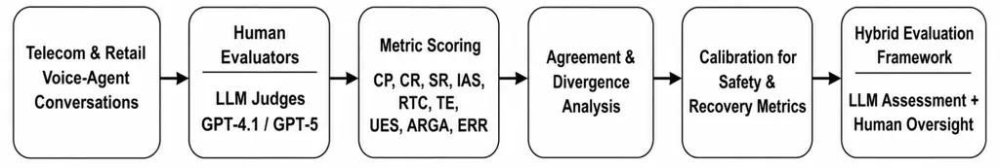

# LLM-as-a-Judge for Voice-Agent Evaluation: Alignment, Stability, and Human Oversight

Shashank SinghSprinklr AIBengaluru, India    Anupam PurwarSprinklr
AIGurugram, India ^(†)^(†)thanks: †˜These authors contributed equally to
this work.^(†)^(†)thanks: \*Corresponding author: anupam.aiml@gmail.com.
Project page: https://anupam-purwar.github.io/page/    Kritika
SrivastavaSprinklr AIBengaluru, India

###### Abstract

Evaluating conversational voice agents at scale requires reliable
assessment methods that capture both observable interaction quality and
the contextual judgment typically provided by human evaluators. We
investigate LLM-as-a-Judge evaluation by comparing human judgments with
GPT-4.1 and GPT-5 on telecom and retail voice-agent conversations,
across conversational quality and safety dimensions. The same
interactions are scored under three evaluation configurations, p0, p1,
and p2, to test whether automated judgments are sensitive to the
evaluation setup and whether observed patterns generalize across
configurations and judge models. Beyond aggregate agreement, we examine
metric-level correlations, evaluator consistency, and systematic
human-LLM disagreement to identify which conversational attributes can
be judged reliably by automation and which remain sensitive to
interpretation and context. Effective voice-agent evaluation is also
shaped by pipeline-level factors such as speech generation, streaming,
and error propagation across ASR, reasoning, and tool-calling stages,
motivating our focus on comparing how human and LLM judges score the
same interactions end to end. Our results show that LLM-based evaluation
can serve as an effective component of large-scale voice-agent
assessment, but that its reliability is metric- and
configuration-dependent rather than uniform. This provides an empirical
framework for identifying which metrics suit automated evaluation and
supports hybrid pipelines in which LLM judges handle scalable assessment
while human evaluators remain engaged for metrics that demand contextual
interpretation and higher-confidence judgment.

## I Introduction

Evaluating conversational voice agents has traditionally relied on human
evaluation, which, while providing a reliable measure of interaction
quality, is expensive, time-consuming, subjective, and difficult to
scale across large volumes of conversations \[1\] \[2\] . With the
recent advances in Large Language Models (LLMs), automated evaluation
using LLMs as judges has emerged as a promising alternative for
assessing open-ended conversations across multiple quality dimensions
\[3\] \[4\]. Prior work on dialogue-system evaluation has explored both
human and automated evaluation protocols, highlighting challenges in
obtaining reliable and consistent human judgments as well as the
limitations of conventional automatic metrics in capturing nuanced
conversational quality \[1\] \[2\] \[5\]. More recently, the
LLM-as-a-Judge paradigm has demonstrated that capable LLMs can achieve
substantial agreement with human preferences when evaluating multi-turn
conversations, establishing the potential of foundation models as
scalable evaluators \[3\]. However, subsequent studies have shown that
LLM-based judges can exhibit position bias, prompt sensitivity, and
variability across evaluation settings, raising questions about the
stability and reliability of automated judgments \[6\] \[7\]. Surveys of
LLM-based agent evaluation further indicate that conversational quality
is inherently multi-dimensional, encompassing aspects such as response
quality, task completion, contextual understanding, consistency, and
user experience, and that different evaluation dimensions may exhibit
different levels of agreement between LLMs and human evaluators \[7\]
\[8\]. Voice agents introduce additional layers of complexity that
text-only dialogue evaluation does not have to contend with. Prior work
on low-latency Voice-to-Voice architectures shows that end-to-end
responsiveness in such systems depends not just on the underlying
language model but also on speech generation and streaming \[18\].
Separately, work on benchmarking multi-modal agents has argued that
errors can originate and compound at any stage of the pipeline, from
speech recognition through reasoning, tool use, and speech synthesis
\[19\]. Taken together, these findings suggest that a full picture of
voice-agent quality cannot come from evaluating the conversation
transcript alone, and this is part of what motivates our focus on
comparing how human and LLM judges score the same interactions. These
findings motivate a systematic investigation into the extent to which
LLM-based evaluation can serve as a reliable complement to human
assessment for conversational voice agents. In this work, we compare
human evaluations with LLM-as-a-Judge evaluations using GPT-4.1 and
GPT-5 across three evaluation configurations, namely p0, p1, and p2. We
investigate (1) whether LLM evaluations remain stable across evaluation
modes, (2) how closely LLM assessments align with human judgments, and
(3) which evaluation metrics can be reliably automated and which
continue to require human oversight.

To make the evaluation conditions explicit, in this work, we compare
human evaluations with LLM-as-a-Judge evaluations using GPT-4.1 and
GPT-5 across three evaluation configurations (namely p0,p1,p2)\[9\]:

- •
  p0 (no user context) - No Persona: No additional persona or
  user-context information is provided to the agent. The agent responds
  based solely on the ongoing conversation.
- •
  p1 (static persona) - Persona Injection: A predefined user persona is
  explicitly provided to the agent, including characteristics such as
  domain expertise, ambiguity, and communication behavior.
- •
  p2 (dynamically inferred context) - Context Injection: The agent
  receives dynamically inferred user context derived from the ongoing
  conversation. This enables the agent to adapt to changes in the user’s
  behavior, expertise, or interaction style during the conversation.

Through this comparison, we aim to characterize the reliability,
consistency, and practical applicability of LLM-based evaluation for
conversational voice agents and identify the evaluation dimensions for
which automated judging can effectively complement human assessment.

Fig. 1: Workflow for comparing human and LLM-as-Judge evaluations, from
voice-agent conversation scoring through divergence analysis,
calibration, and hybrid evaluation design.

|         |                        |              |                                                     |
| ------- | ---------------------- | ------------ | --------------------------------------------------- |
| Domain  | Configuration Counts   | Domain Total | Task-Type Distribution                              |
| Retail  | P0: 40, P1: 40, P2: 40 | 120          | Return / Exchange / Modification / Cancellation: 98 |
|         |                        |              | Address Update / Change: 11                         |
|         |                        |              | Order Information / Inquiry: 8                      |
|         |                        |              | Tracking Request: 1                                 |
|         |                        |              | Payment Method Change: 1                            |
|         |                        |              | Account Verification / Human Transfer: 1            |
| Telecom | P0: 41, P1: 40, P2: 41 | 122          | MMS / Picture Messaging Issue: 56                   |
|         |                        |              | No Service / Service Restoration: 42                |
|         |                        |              | Mobile Data / Internet Connectivity Issue: 24       |
| Overall | 6 configurations       | 242          | Retail: 120; Telecom: 122                           |

TABLE I: Task-Type Distribution Across Retail and Telecom Domains

|                                    |             |           |             |           |             |           |
| ---------------------------------- | ----------- | --------- | ----------- | --------- | ----------- | --------- |
| Metric Ratios                      | H/G4.1 (p0) | H/G5 (p0) | H/G4.1 (p1) | H/G5 (p1) | H/G4.1 (p2) | H/G5 (p2) |
| CFA (Critical Field Accuracy)      | 1.717       | 1.684     | 1.716       | 1.709     | 1.814       | 1.799     |
| CP (Confirmation Precision)        | 2.200       | 2.138     | 4.040       | 4.301     | 2.381       | 2.738     |
| CR (Confirmation Recall)           | 1.041       | 1.016     | 1.125       | 1.000     | 1.059       | 1.000     |
| IAS (Irreversible Action Safety)   | 5.497       | 6.067     | 5.865       | 6.082     | 4.033       | 4.284     |
| SR (Safety Recall)                 | 5.644       | 5.323     | 5.133       | 4.852     | 3.479       | 3.071     |
| ARGA (ASR-Robust Goal Achievement) | 0.171       | 0.156     | 0.265       | 0.215     | 0.142       | 0.117     |
| TE (Turn Efficiency)               | 0.845       | 0.827     | 0.966       | 0.945     | 0.913       | 0.893     |
| UES (User Experience Score)        | 0.484       | 0.503     | 0.555       | 0.557     | 0.467       | 0.483     |
| ERR (Error Rate)                   | 1.120       | 1.733     | 1.461       | 2.705     | 0.857       | 2.020     |
| RTC (Recovery Turn Count)          | 3.864       | 1.889     | 6.064       | 2.051     | 3.200       | 1.505     |

Note: H/G4.1= Human score/LLM Score, where LLM = GPT 4.1 and H/G5= Human
score/LLM Score, where LLM = GPT 5, respectively. p0, p1, p2 indicate
evaluation configuration modes. A ratio greater than 1 indicates that
the human score exceeds the corresponding LLM-judge score, while a ratio
below 1 indicates that the LLM judge assigns a higher score.

TABLE II: Ratio of Human to LLM-Judge Scores Across Evaluation Modes
(Telecom)

|                                    |             |           |             |           |             |           |
| ---------------------------------- | ----------- | --------- | ----------- | --------- | ----------- | --------- |
| Metric Ratios                      | H/G4.1 (p0) | H/G5 (p0) | H/G4.1 (p1) | H/G5 (p1) | H/G4.1 (p2) | H/G5 (p2) |
| CFA (Critical Field Accuracy)      | 1.394       | 1.204     | 1.142       | 0.986     | 1.128       | 1.023     |
| CP (Confirmation Precision)        | 0.659       | 0.953     | 0.567       | 0.924     | 0.492       | 1.934     |
| CR (Confirmation Recall)           | 0.730       | 0.738     | 0.909       | 0.837     | 0.962       | 0.962     |
| IAS (Irreversible Action Safety)   | 1.418       | 1.754     | 1.473       | 1.623     | 1.189       | 1.441     |
| SR (Safety Recall)                 | 1.292       | 1.543     | 1.427       | 1.626     | 1.056       | 1.269     |
| ARGA (ASR-Robust Goal Achievement) | 0.562       | 0.598     | 0.448       | 0.657     | 0.387       | 0.383     |
| TE (Turn Efficiency)               | 0.847       | 0.847     | 0.763       | 0.755     | 0.900       | 0.900     |
| UES (User Experience Score)        | 0.464       | 0.496     | 0.482       | 0.527     | 0.440       | 0.466     |
| ERR (Error Rate)                   | 3.855       | 2.998     | 5.665       | 5.665     | 6.024       | 2.906     |
| RTC (Recovery Turn Count)          | 1.556       | 0.791     | 1.469       | 1.063     | 1.148       | 2.270     |

Note: H/G4.1= Human score/LLM Score, where LLM = GPT 4.1 and H/G5= Human
score/LLM Score, where LLM = GPT 5, respectively. p0, p1, p2 indicate
evaluation configuration modes. A ratio greater than 1 indicates that
the human score exceeds the corresponding LLM-judge score, while a ratio
below 1 indicates that the LLM judge assigns a higher score.

TABLE III: Ratio of Human to LLM-Judge Scores Across Evaluation Modes
(Retail)

## II Evaluation Methodology

Figure 1 summarizes the overall workflow used in this study, from
scoring voice-agent conversations through divergence analysis,
calibration, and the design of a hybrid human-LLM evaluation pipeline.
Human evaluators and LLM judges independently assessed the same sets of
retail and telecom voice-agent conversations across multiple metrics.
Each conversation in the retail and telecom evaluation sets was
independently scored by $`n=3`$ trained human annotators using the same
rubric definitions supplied to the LLM judges. The human scores used in
the human-LLM ratios (Tables II and III) are those of Manual Eval 1, not
the mean of the three annotators (Section II-B). Inter-annotator
agreement was monitored during annotation, and conversations with high
annotator disagreement were flagged for adjudication by a fourth senior
annotator rather than being resolved by simple majority vote. The same
aggregation procedure (mean across the conversation set) is applied
uniformly to both the Eval 1 human scores and the LLM-judge scores so
that the human-to-LLM ratios reported in Table II are directly
comparable. The metrics evaluated by both human annotators and LLM
judges, defined and reported in benchmark paper MM-$`\tau`$-p² \[9\]
(refer Appendix A). These metric definitions and their rubric-based
scoring criteria are adopted unchanged from our companion benchmark
paper, MM-$`\tau`$-p² \[9\], which introduces them alongside seven
additional metrics spanning goal achievement, efficiency, recovery, and
safety for multi-modal agent evaluation. For each metric, the ratio
between human and LLM-generated scores was calculated for GPT-4.1 and
GPT-5 under p0, p1, and p2 evaluation modes. This comparison enabled a
quantitative assessment of evaluator agreement, highlighting systematic
differences in scoring behavior across models and prompting
configurations. The analysis also examined the consistency of these
differences across individual metrics, allowing us to identify
evaluation dimensions where LLM judgments closely align with human
assessments and those where notable deviations persist.

Across the two verticals, the evaluation set spanned 242 conversations
in total, drawn from six separate configurations, three prompting modes
(p0, p1, p2) applied to each of the Retail and Telecom domains. Retail
accounted for 120 cases, split evenly at 40 per configuration, while
Telecom contributed 122 cases (41, 40, and 41 across the three modes,
refer Table I). Within Retail, the vast majority of cases involved
return, exchange, modification, or cancellation requests (98 of 120),
with the remainder covering address changes, order information
inquiries, tracking requests, payment method changes, and a small number
of account verification or human-transfer cases. Telecom conversations
were more evenly distributed across three issue types: MMS or
picture-messaging problems accounted for 56 cases, service outages or
restoration requests for 42, and mobile data or connectivity issues for
the remaining 24. This distribution reflects the kinds of problems each
domain typically surfaces in real customer interactions, and it also
means the evaluation results are naturally weighted toward the task
types that occur most often, something worth keeping in mind when
comparing metric behavior across domains.

### II-A Evaluation Process for Voice Agent Conversations (Retail/Telecom)

Each evaluation begins with opening the conversation log, either Retail
or Telecom, and reading through the exchange in full before any scoring
takes place. Every case includes three versions of the same interaction:
the ground truth, representing how the conversation should ideally have
unfolded, alongside the actual voice conversation and text conversation.
Having all three side by side makes it possible to see precisely where
the agent’s real behavior deviated from the expected flow, and how its
performance differed between speaking and typing. Voice interactions are
generally more error-prone than text, so particular attention is paid to
identifying ASR (speech recognition) errors and evaluating how well the
agent recovers from them. While reviewing the transcript, unnecessary
clarifications or confirmations are flagged, and necessary ones are
marked separately so they are easy to locate later. All ASR errors are
highlighted in red for quick visibility. Whenever an error occurs, the
number of turns the agent takes to recover from it is counted. User
effort is assessed alongside this, specifically how much the customer
had to repeat, correct, or restate before the task was completed.
Whether the intended goal was ultimately achieved is also checked in
every case, and where a conversation was escalated to a human agent, the
likely cause is investigated to understand what the AI agent was unable
to resolve on its own. In terms of pace, a full working day - roughly
six hours, from 12 PM to 6 PM - typically covers 10 to 15 cases,
averaging around 24 to 36 minutes per case. This figure is approximate
rather than fixed, since evaluation time depends on the length of the
conversation and the number of errors that need to be traced through for
recovery analysis; longer or more error-dense cases naturally take more
time to review thoroughly.

### II-B Multi-Annotator Manual Scores

We collected scores from three independent human annotators on all
twelve metrics for both domains. Tables IV, V, and VI report the
metric-level aggregates. Table IV covers configuration p0. Table V
covers p1. Table VI covers p2. Each table lists Manual Eval 1, Manual
Eval 2, and Manual Eval 3 for Retail and Telecom. MRS is constant at
$`1.0`$ in nearly all cells. TO is $`0`$ throughout. Neither metric adds
any variance, so both are left out of the agreement analysis below.

Manual Eval 1 matches the human baselines used in Tables II and III.
Agreement here is measured on those aggregates, not on individual
conversations, so it is not conversation-level inter-annotator agreement
in the usual sense. For the nine bounded metrics in the main ratio
tables, excluding RTC, pairwise Pearson correlation is $`r=0.975`$
between Eval 1 and Eval 3 and $`r=0.903`$ between Eval 1 and Eval 2
($`N=54`$ cells: 9 metrics, 2 domains, 3 configurations). Including RTC
reduces these values to $`r=0.930`$ and $`r=0.804`$ ($`N=60`$). Retail
Eval 3 is identical across p0, p1, and p2, which inflates the Eval 1 to
Eval 3 correlation in that domain.

To compare annotator spread across metrics on different scales, we use
the mean relative range: for each of the six domain and configuration
cells we take the range across the three annotators divided by their
mean, then average over the six cells. On this measure the ordering is
ARGA ($`0.77`$), RTC ($`0.46`$), CP ($`0.27`$), SR ($`0.20`$), ERR
($`0.20`$), IAS ($`0.15`$), UES ($`0.15`$), CR ($`0.15`$), TE
($`0.14`$), and CFA ($`0.11`$). ARGA, RTC, and CP are therefore the
least reproducible metrics across annotators, and CFA, TE, CR, and UES
the most reproducible. The ordering differs if absolute range is used
instead, because ARGA and CP have small means: by absolute range, SR
($`0.15`$), CP ($`0.15`$), IAS ($`0.13`$), and CR ($`0.13`$) are
comparable. We use relative range throughout because the metrics differ
in scale. Annotator spread and human-LLM divergence are distinct: the
largest human-LLM ratios are on IAS and SR, which are mid-ranked for
annotator spread.

|        |        |        |        |         |        |        |
| ------ | ------ | ------ | ------ | ------- | ------ | ------ |
| Metric | Retail |        |        | Telecom |        |        |
|        | Eval 1 | Eval 2 | Eval 3 | Eval 1  | Eval 2 | Eval 3 |
| CFA    | 0.530  | 0.522  | 0.525  | 0.815   | 0.769  | 0.784  |
| ARGA   | 0.287  | 0.248  | 0.258  | 0.055   | 0.112  | 0.074  |
| MRS    | 1.000  | 1.000  | 1.000  | 1.000   | 1.000  | 1.000  |
| TE     | 0.831  | 0.844  | 0.852  | 0.817   | 0.745  | 0.793  |
| TO     | 0.000  | 0.000  | 0.000  | 0.000   | 0.000  | 0.000  |
| UES    | 0.213  | 0.205  | 0.203  | 0.215   | 0.185  | 0.205  |
| ERR    | 0.270  | 0.303  | 0.306  | 0.277   | 0.323  | 0.291  |
| RTC    | 1.385  | 2.500  | 2.381  | 2.300   | 2.797  | 2.741  |
| CP     | 0.448  | 0.456  | 0.462  | 0.364   | 0.394  | 0.385  |
| CR     | 0.716  | 0.679  | 0.743  | 1.000   | 1.059  | 1.059  |
| IAS    | 0.667  | 0.640  | 0.653  | 0.978   | 0.865  | 0.876  |
| SR     | 0.556  | 0.608  | 0.573  | 0.935   | 0.987  | 0.953  |

TABLE IV: Manual Evaluation Scores for Configuration p0 (No Persona)

|        |        |        |        |         |        |        |
| ------ | ------ | ------ | ------ | ------- | ------ | ------ |
| Metric | Retail |        |        | Telecom |        |        |
|        | Eval 1 | Eval 2 | Eval 3 | Eval 1  | Eval 2 | Eval 3 |
| CFA    | 0.434  | 0.412  | 0.525  | 0.835   | 0.718  | 0.805  |
| ARGA   | 0.197  | 0.652  | 0.258  | 0.061   | 0.273  | 0.134  |
| MRS    | 1.000  | 0.755  | 1.000  | 1.000   | 1.000  | 1.000  |
| TE     | 0.748  | 0.544  | 0.852  | 0.930   | 0.872  | 0.909  |
| TO     | 0.000  | 0.000  | 0.000  | 0.000   | 0.000  | 0.000  |
| UES    | 0.227  | 0.173  | 0.203  | 0.230   | 0.257  | 0.238  |
| ERR    | 0.283  | 0.333  | 0.306  | 0.267   | 0.364  | 0.278  |
| RTC    | 3.189  | 2.571  | 2.381  | 1.318   | 4.875  | 2.030  |
| CP     | 0.397  | 0.868  | 0.462  | 0.482   | 0.833  | 0.624  |
| CR     | 0.837  | 0.995  | 0.743  | 1.000   | 1.037  | 0.983  |
| IAS    | 0.795  | 0.818  | 0.653  | 1.000   | 0.800  | 0.904  |
| SR     | 0.699  | 0.857  | 0.573  | 0.828   | 1.043  | 0.779  |

TABLE V: Manual Evaluation Scores for Configuration p1 (Static Persona)

|        |        |        |        |         |        |        |
| ------ | ------ | ------ | ------ | ------- | ------ | ------ |
| Metric | Retail |        |        | Telecom |        |        |
|        | Eval 1 | Eval 2 | Eval 3 | Eval 1  | Eval 2 | Eval 3 |
| CFA    | 0.439  | 0.437  | 0.525  | 0.866   | 0.866  | 0.868  |
| ARGA   | 0.225  | 0.342  | 0.258  | 0.037   | 0.085  | 0.067  |
| MRS    | 1.000  | 1.000  | 1.000  | 1.000   | 1.000  | 1.000  |
| TE     | 0.887  | 0.920  | 0.852  | 0.874   | 0.756  | 0.804  |
| TO     | 0.000  | 0.000  | 0.000  | 0.000   | 0.000  | 0.000  |
| UES    | 0.223  | 0.193  | 0.203  | 0.210   | 0.173  | 0.193  |
| ERR    | 0.247  | 0.228  | 0.306  | 0.309   | 0.267  | 0.275  |
| RTC    | 2.951  | 3.618  | 2.381  | 1.379   | 1.396  | 1.451  |
| CP     | 0.478  | 0.453  | 0.462  | 0.397   | 0.419  | 0.393  |
| CR     | 0.962  | 0.846  | 0.743  | 1.000   | 1.130  | 1.128  |
| IAS    | 0.620  | 0.667  | 0.653  | 1.000   | 0.794  | 0.826  |
| SR     | 0.518  | 0.436  | 0.573  | 0.821   | 0.906  | 0.871  |

TABLE VI: Manual Evaluation Scores for Configuration p2 (Dynamically
Inferred Context)

## III Results

### III-A Analysis for Telecom sector conversations

Table II splits the Telecom metrics into two groups. In the first group
the two evaluator types stay close. Turn Efficiency stays near a ratio
of 1 in all three configurations and for both judges. Confirmation
Recall stays near 1.0 to 1.1. Humans and judges agree on turn efficiency
and on when a clarification was needed. User Experience Score is not in
this group. Its ratios are near 0.5. The judges give a higher UES than
humans do.

The second group diverges. Irreversible Action Safety and Safety Recall
have ratios above 3 in every configuration. Humans record far more
safety events than either judge. Confirmation Precision reaches 4.3
under p1. There the judges penalize unnecessary clarifications more
heavily than humans. ARGA moves the other way. Its ratio stays below 1,
from 0.117 to 0.265. The judges are more generous than humans on goal
achievement after an ASR error. Recovery Turn Count is the most volatile
metric in the table. It ranges from 1.889 to 6.064.

GPT-4.1 and GPT-5 track each other closely on most metrics. GPT-5 is
slightly closer to human scores on CFA and TE. GPT-4.1 is slightly
closer on IAS and SR. Neither model leads across the full metric set.

Tables IV, V, and VI show the same Telecom conversations scored by three
annotators. Manual Eval 1 is the baseline used in Table II. CFA, TE,
UES, ERR, and CR are more reproducible across annotators than RTC or CP.
They are still not uniformly tight. CFA spreads under p1, at 0.835,
0.718, and 0.805. TE spreads under p2, at 0.874, 0.756, and 0.804. UES
is the tightest of the five. Its annotator range is at most 0.037 in any
Telecom configuration.

The safety scores are high for every annotator. IAS runs from 0.794 to
1.000 and SR from 0.779 to 1.043. The spread is wider under p1. The
safety gap against the judges therefore holds for all three annotators,
not only Eval 1. ARGA is low for all three, from 0.037 to 0.273. This
agrees with the ratio result. Humans score ASR-robust goal achievement
more strictly than the judges do. The size of the gap depends on the
annotator under p1, where Eval 2 reports 0.273 against 0.061 and 0.134.

Annotator disagreement is largest on RTC and CP under p1. Telecom RTC in
p1 is 1.318, 4.875, and 2.030. CP is 0.482, 0.833, and 0.624. p0 and p2
are much tighter on RTC, with ranges of 0.497 and 0.072. The volatility
seen for RTC in Table II is therefore not only a judge problem. Humans
also disagree on how many recovery turns to count. The study has one
persona-injection condition per domain. On this evidence the p1 spread
cannot be assigned to persona injection by itself.

### III-B Analysis for Retail sector conversations

The Retail metrics split the same way (Table III). Turn Efficiency and
Confirmation Recall stay near a ratio of 1 in all three configurations.
Critical Field Accuracy is also fairly stable, from 0.986 to 1.394. Both
evaluator types score field-level correctness in much the same way.

The safety metrics again show the largest gaps. The gaps are smaller
than in Telecom. IAS runs from 1.189 to 1.754 and SR from 1.056 to
1.626. Both stay above 1. Confirmation Precision is the least stable
metric in the table. Under p2 it moves from 0.492 for GPT-4.1 to 1.934
for GPT-5. The two judges therefore disagree with each other, not only
with the human baseline. Error Rate is also erratic, from 2.906 to
6.024. ARGA stays below 1, from 0.383 to 0.657. The judges again score
ASR-error recovery more generously than humans. Recovery Turn Count has
a moderate spread, from 0.791 to 2.270.

Humans apply stricter safety judgment in Retail. The judges are more
lenient on ASR-robust goal achievement. Confirmation Precision and Error
Rate are the least reliable metrics for automated judging in this
domain.

The annotators agree most closely under p0 (Tables IV, V, and VI). For
Retail p0 they are within a narrow band on CFA (0.522 to 0.530), TE
(0.831 to 0.852), UES (0.203 to 0.213), and CP (0.448 to 0.462). IAS and
SR also cluster, at 0.640 to 0.667 and 0.556 to 0.608. These safety
scores are lower than the Telecom values in the same configuration. That
is consistent with the smaller Retail safety ratios.

Configuration p1 has the widest annotator spread. Eval 2 reports ARGA of
0.652 against 0.197 and 0.258 for the other two. It reports CP of 0.868
against 0.397 and 0.462. Its TE is also lower, at 0.544 against 0.748
and 0.852. Retail RTC varies in every configuration. It is 1.385, 2.500,
and 2.381 under p0, and 2.951, 3.618, and 2.381 under p2. Recovery and
clarification precision are the hardest metrics for humans to score
consistently.

One limit applies to Retail only. Eval 3 is unchanged across p0, p1, and
p2 on every metric. It therefore gives no independent check at the
configuration level. Comparisons across configurations in this domain
rest on Eval 1 and Eval 2.

### III-C Telecom vs. Retail

The two domains disagree in the same direction but not by the same
amount. In both, Turn Efficiency and Confirmation Recall stay near a
ratio of 1 and ARGA stays below 1. Stable turn-level scoring and lenient
judge scoring on ASR-error recovery are therefore not specific to one
domain.

The safety metrics diverge much more in Telecom. IAS and SR ratios
exceed 4 in Telecom in every configuration. In Retail they stay between
1.06 and 1.75. CFA is tighter in Retail, from 0.986 to 1.394, against
1.684 to 1.814 in Telecom. Confirmation Precision behaves differently in
the two domains. In Telecom it rises to 4.3 under p1, where the judges
over-penalize unnecessary clarifications. In Retail it falls to 0.492
and then rises to 1.934 for GPT-5 under p2. That swing reflects
disagreement between the two judges rather than a steady bias against
humans. RTC is more volatile in Telecom, from 1.889 to 6.064, than in
Retail, from 0.791 to 2.270.

The annotator tables support part of this contrast. In Telecom all three
annotators give high IAS and SR in every configuration. Retail values
are generally lower, from 0.620 to 0.818 for IAS and 0.436 to 0.857 for
SR. The two ranges do overlap in one cell. Under p1, Eval 2 gives a
higher IAS in Retail (0.818) than in Telecom (0.800). SR is lower in
Retail for every annotator and configuration.

The human baseline alone does not explain the smaller Retail safety
ratios. Human IAS and SR do differ by domain. That difference is smaller
than the difference in the ratios. The judges must therefore also be
closer to humans on Retail safety than on Telecom safety.

Annotator spread and human-judge divergence do not fall on the same
metrics. ARGA, RTC, and CP have the widest annotator spread in both
domains. The widest human-judge gaps are on IAS and SR. The sharpest
human disagreement is Telecom RTC under p1, where Eval 2 gives 4.875
against 1.318 and 2.030. Retail p1 shows the same pattern for ARGA and
CP, again from Eval 2. Reading the tables qualitatively, using Eval 2 or
Eval 3 in place of Eval 1 would not reverse the direction of the CFA,
TE, CR, IAS, and SR ratios. It would change the size of the RTC, ARGA,
and CP ratios, because the human score itself moves on those. We did not
recompute the ratios under the other two annotators.

In summary, the direction of disagreement is the same in both domains.
Humans are stricter on safety. The judges are more generous on
ASR-robust recovery. The disagreement is larger in Telecom. Automated
judging tracks human scores more closely in Retail. RTC, ARGA, and CP
stay difficult for humans and judges alike.

## IV Discussion

### IV-A Stability Across Evaluation Modes

Most metrics keep the same relative pattern across p0, p1, and p2, and
across GPT-4.1 and GPT-5. Humans and judges often differ in absolute
score. The ranking of metrics stays much the same. Metrics that score
high in one configuration still score high in the others. Metrics that
score low stay low. This looks like a calibration difference rather than
a change in what each evaluator treats as strong or weak.

The annotator tables qualify this on the human side, and the
qualification depends on the domain. In Telecom the Eval 1 baseline is
stable across modes on most metrics. CFA moves by $`0.051`$ across the
three configurations. CR does not move at all. IAS moves by $`0.022`$,
ARGA by $`0.023`$, and UES by $`0.020`$. In Retail the same baseline
moves much more. CR runs from $`0.716`$ to $`0.962`$. SR runs from
$`0.518`$ to $`0.699`$. IAS runs from $`0.620`$ to $`0.795`$. TE runs
from $`0.748`$ to $`0.887`$. RTC moves in both domains, by $`0.982`$
turns in Telecom and $`1.804`$ turns in Retail. Mode insensitivity
therefore holds well for the Telecom human baseline and for the judges.
It holds less well for the Retail human baseline.

Two further limits apply. Eval 2 shifts sharply under p1 on ARGA and CP
in both domains, and on RTC in Telecom. Mode stability is weaker if that
annotator is taken as the human target. Retail Eval 3 is identical
across p0, p1, and p2. It gives no evidence either way on mode stability
in that domain.

### IV-B Significant Divergence in Safety Metrics

The largest human-judge gaps are on Safety Recall (SR) and Irreversible
Action Safety (IAS). In Telecom the human scores are several times the
judge scores (Table II). Humans record far more safety events than
either judge. Our companion benchmark MM-$`\tau`$-p² \[9\] helps explain
why. Both GPT-4.1 and GPT-5 produced low and inconsistent safety
precision and recall. This happened on identical conversations under
identical rubric prompts. It was clearest in escalation cases, such as
SIM-lock cases in telecom. There a transfer to a human is the safe and
correct action, not an agent failure. The rubric text for a necessary
escalation is hard to state without ambiguity. The judges then swing
between two readings of the same behavior. One reading credits the agent
for handing a high-risk action to a human. The other penalizes the agent
for not finishing the task itself. This inconsistency suppresses the
recall of real safety events. A human annotator can use situational
judgment instead. Safety-critical evaluation should therefore keep human
oversight even inside an automated pipeline.

The annotator tables show that this high human baseline is not the work
of one scorer. In Telecom all three annotators give high IAS, from 0.794
to 1.000, and high SR, from 0.779 to 1.043. The spread is wider under
p1. Even so, no annotator comes near the judge level implied by
Table II. Human IAS near 0.8 to 1.0 with ratios of 4 to 6 implies judge
scores near 0.15 to 0.25. In Retail the annotators are lower, from 0.620
to 0.818 for IAS and 0.436 to 0.857 for SR. That matches the smaller
Retail ratios, which stay below 2.

The Retail case is weaker and should not be overstated. Dividing the
Eval 1 score by the Retail ratios puts the judge scores near $`0.38`$ to
$`0.54`$ for IAS and $`0.36`$ to $`0.49`$ for SR. Most annotator values
are above that band. One is not. Under p2, Eval 2 gives SR $`=0.436`$,
below the $`0.490`$ implied for GPT-4.1 in the same cell. In Retail the
direction of the safety gap therefore depends on the reference annotator
in at least one configuration. Telecom has no such case. Every Telecom
annotator value is far above the implied judge range. The case for human
oversight on safety rests mainly on Telecom. There the gap is large, it
holds for all three annotators, and irreversible actions such as
SIM-lock or plan-change escalations are more frequent and more costly.

### IV-C Mixed Leadership Between GPT-4.1 and GPT-5

Neither GPT-4.1 nor GPT-5 leads the other across the board. Alignment
with humans shifts by metric. This follows from how the two models are
built. GPT-4.1 is a non-reasoning model tuned for low latency and
predictable, direct responses \[11, 13\]. It does not plan before
answering. It gives a fast and literal reading of the rubric on each
turn. That helps it track humans on well-specified metrics. It leaves
less room to weigh context on ambiguous cases. GPT-5 is a unified
reasoning system with an internal planning stage \[12, 10, 13\]. It is
trained for agentic work such as multi-step tool calls and task
coordination. OpenAI reports that this training also reduced sycophancy
and cut overconfident answers on tasks the model cannot complete \[12\].

These design choices show up in the scores. GPT-5 is more willing to
credit an agent for reasonable effort before escalating. That lifts its
goal-completion scores, such as CFA, closer to human levels. The same
behavior hurts it on safety metrics, where it under-flags unconfirmed
irreversible actions. GPT-4.1 is more conservative and shows the
opposite pattern. It tracks humans better on some safety-adjacent
judgments. It diverges more on metrics that reward partial progress. The
two models are therefore two design points in one family. GPT-4.1 favors
speed and predictability \[11\]. GPT-5 favors deeper reasoning and
agentic judgment \[12\]. This trade-off is documented across GPT
generations \[10\]. It is a more likely cause of the mixed leadership
pattern than a simple capability gap.

This comparison uses Eval 1, and the choice of annotator matters in a
limited and predictable way. Both judges are scored as $`h/a_{j}`$
against the same human value $`h`$. Replacing Eval 1 with another
annotator multiplies both ratios by the same constant. The ordering of
the two judges by ratio size therefore cannot change. What can change is
which judge is closer to parity. Rescaling can move one ratio across
$`1`$ while the other stays on the same side. This only matters for
metrics whose ratios are already near $`1`$, such as Retail CFA at 0.986
to 1.394. The risk is highest on ARGA, RTC, and CP, where the annotator
spread is widest. We did not recompute the per-model ratios under Eval 2
or Eval 3.

Evaluation pipelines may therefore do better with metric-specific or
ensemble judging than with one default model. Different metrics capture
different parts of conversational performance. Specialized or combined
judges can raise reliability and reduce metric-specific bias. This
matters most in safety-critical cases.

### IV-D Human Superiority in Recovery Turn Count Estimation

Recovery Turn Count (RTC) is one of the largest differences between
human and automated evaluation. Human evaluators assign substantially
higher RTC values, while LLM judges often produce values below one. That
is hard to reconcile with the definition of recovery, which requires one
or more turns after an error.

This gap fits a pattern seen in other work on LLM judges. Agreement with
human raters is not uniform. It varies by what is being judged. One
large study of empathic communication found expert-LLM agreement from a
weighted kappa of 0.17 to 0.86 across 21 dimensions \[16\]. Some
dimensions were rated almost as well by the LLM as by a second human.
Others were rated far worse. RTC looks like one of the harder ones.
Scoring it means tracing an error back through several turns. It then
means counting forward to the turn where the error was resolved. That is
a multi-step tracking task, not a single-turn judgment. Industry
evaluations report the same drop-off on harder tasks. Agreement on
open-ended, multi-step reasoning falls below half, against over 80
percent on simpler tasks \[17\]. A judge scoring a conversation in one
pass can lose track of where the error started and where recovery ended.
It may count only the turn that contains the fix. A human reviewer can
hold the whole exchange in mind and trace the repair more slowly. That
is a plausible reason why judge RTC values cluster near zero while human
values run higher.

The annotator tables both support and limit that account. All three
humans report RTC above 1 in every domain and configuration. The finding
that humans count at least one recovery turn therefore does not depend
on Eval 1. In Telecom the gap is clear. Dividing the Eval 1 score by the
ratios in Table II places both judges between 0.22 and 1.22 turns. That
is below every annotator value in the matching cell.

Retail is different. The idea of RTC as a uniform human advantage does
not survive the annotator data. The implied GPT-5 estimate exceeds at
least one annotator in each Retail configuration. The clearest case is
p0, where GPT-5 implies about 1.75 turns against 1.385 for Eval 1. In
Retail the ordering between human and judge RTC therefore depends on the
reference annotator.

Humans also disagree with each other on the count. Telecom p1 is the
extreme case, at 1.318, 4.875, and 2.030 turns. Telecom p0 and p2 are
much tighter. Retail spreads in every configuration. It is 1.385, 2.500,
and 2.381 under p0, and 2.951, 3.618, and 2.381 under p2. RTC has the
second widest annotator spread of any metric here. It is hard for human
raters as well as for judges. The case for human review of recovery
therefore rests on Telecom. It also rests on using more than one rater,
not on treating any single human count as correct.

### IV-E Baseline Differences Rather Than Structural Disagreement

Human and judge scores often keep the same relative order across metrics
even when the absolute values differ. Metrics that score high for humans
also tend to score high for the judges. Metrics that are weak stay weak
for both. This matches other work on LLM-based rating. A psychometric
study compared human, GPT, and Claude raters on large-scale writing
assessment \[14\]. Generalizability coefficients for relative decisions,
such as ranking one essay above another, were consistently higher than
reliability coefficients for absolute, fixed-standard scoring. The two
rater groups agreed on order but not on scale. The same study found that
both human and LLM raters are more reliable at comparative judgments
than at criterion-referenced ones \[14\]. A separate study using
multiple LLM judges reports the same effect \[15\]. Rank correlations
with expert rankings stayed stable across a wide range of scoring
thresholds. Absolute scores moved with the threshold, but the rank order
barely did. Rank-order agreement is therefore more stable than
absolute-score agreement. The practical task is not to replace human
evaluation. It is to calibrate judge scores to a human baseline.

Calibration still needs a stable baseline. The annotator tables show
that stability depends on the metric. We use the mean relative range
defined in Section II-B. CFA ($`0.11`$), TE ($`0.14`$), CR ($`0.15`$),
and UES ($`0.15`$) are the most reproducible across annotators. Eval 1
is a defensible calibration target for those four. ARGA ($`0.77`$), RTC
($`0.46`$), and CP ($`0.27`$) are the least reproducible. A correction
factor fit to Eval 1 on those three would shift if Eval 2 were used
instead. IAS ($`0.15`$) and SR ($`0.20`$) fall in between. Their human
score is reasonably reproducible and their human-judge gap is large.
That combination suits calibration well.

Two caveats apply. Reproducibility here is measured on metric-level
aggregates, not on individual conversations, so it is an upper bound on
agreement. Retail Eval 3 gives no independent check at all, since it
does not change from p0 to p2. Calibration is a reasonable approach
where annotators agree. Where they do not, the rubric given to human
raters also needs work. A scale correction cannot fix an unstable
target.

### IV-F Human-Autoeval Score Correlation Analysis

Table VII shows something the ratios alone could not. For most metrics
both evaluators land on the same side of the scale, even when the values
differ. TE and CR are high for both in both domains. ARGA is low for
humans and higher for the judges in both domains. That repeats the
pattern in Sections III.A and III.B. SR and IAS behave the same way.
They are high for humans and low for both judges. The gap is widest in
Telecom, where the judge scores fall below 0.21 and the human scores
stay above 0.85. The Human column in that table is the Eval 1 baseline,
not the mean of the three annotators.

|        |         |         |       |        |         |       |
| ------ | ------- | ------- | ----- | ------ | ------- | ----- |
| Metric | Telecom |         |       | Retail |         |       |
|        | Human   | GPT-4.1 | GPT-5 | Human  | GPT-4.1 | GPT-5 |
| CFA    | 0.839   | 0.480   | 0.485 | 0.467  | 0.383   | 0.436 |
| CP     | 0.416   | 0.151   | 0.143 | 0.441  | 0.784   | 0.382 |
| CR     | 1.000   | 0.931   | 0.995 | 0.838  | 0.967   | 0.990 |
| IAS    | 0.993   | 0.199   | 0.186 | 0.694  | 0.511   | 0.433 |
| SR     | 0.860   | 0.187   | 0.204 | 0.591  | 0.470   | 0.399 |
| ARGA   | 0.051   | 0.270   | 0.317 | 0.236  | 0.511   | 0.456 |
| TE     | 0.875   | 0.963   | 0.985 | 0.822  | 0.982   | 0.986 |
| UES    | 0.220   | 0.440   | 0.429 | 0.221  | 0.479   | 0.447 |
| ERR    | 0.283   | 0.263   | 0.137 | 0.267  | 0.054   | 0.075 |
| RTC    | 1.666   | 0.415   | 0.926 | 2.508  | 1.877   | 2.017 |

TABLE VII: Human and Autoeval Scores, Pooled Across Configurations

We next measure how closely the two evaluators track each other in
magnitude. We compute the Pearson and Spearman correlations between the
human and autoeval score vectors across the ten metrics. We do this
twice. The first run uses the configuration-pooled scores in Table VII,
giving $`N=10`$ metrics. The second treats each configuration as a
separate observation, giving $`N=30`$. The second run therefore captures
variation across configurations as well as across metrics. Table VIII
reports both.

|         |         |              |                 |              |                 |
| ------- | ------- | ------------ | --------------- | ------------ | --------------- |
| Domain  | Judge   | $`r`$ (N=10) | $`\rho`$ (N=10) | $`r`$ (N=30) | $`\rho`$ (N=30) |
| Telecom | GPT-4.1 | 0.295        | 0.236           | 0.318        | 0.224           |
| Telecom | GPT-5   | 0.592        | 0.503           | 0.606        | 0.460           |
| Retail  | GPT-4.1 | 0.912        | 0.624           | 0.909        | 0.697           |
| Retail  | GPT-5   | 0.943        | 0.539           | 0.854        | 0.661           |

Note: $`N=10`$ uses configuration-pooled scores (one point per metric).
$`N=30`$ uses each of the three configurations as a separate observation
per metric. $`r`$ = Pearson correlation, $`\rho`$ = Spearman rank
correlation.

TABLE VIII: Human-Autoeval Correlation on Back-Calculated Scores

The two domains differ sharply here. In Retail the human and autoeval
scores are strongly correlated in magnitude for both judges. Pearson
$`r`$ is $`0.912`$ for GPT-4.1 and $`0.943`$ for GPT-5, both significant
at $`p<0.001`$. The two evaluators still disagree on exact values. A
metric that scores relatively high for humans also scores relatively
high for the judge. The same holds at the low end of the scale. In
Telecom the relationship is much weaker. For GPT-4.1 it is not
significant, with $`r=0.295`$ and $`p=0.408`$ at $`N=10`$, and
$`r=0.318`$ and $`p=0.087`$ at $`N=30`$. GPT-5 does better in Telecom,
with $`r=0.592`$ at $`N=10`$ and $`r=0.606`$ at $`N=30`$. The second of
these is significant. Both still fall well short of the Retail values.

This adds to the stability finding in Section IV-A rather than
contradicting it. That section asked whether a metric keeps its ratio as
the configuration changes. It found that most metrics, including SR and
IAS, keep the same direction across modes for Eval 1. The correlation
here asks a different question. Across the ten metrics, does the judge
score rise and fall with the human score? A metric can hold a stable
ratio across configurations while the full set of ten still fails to
line up between evaluators. That is what happens in Telecom. The Telecom
judges are not scaling every metric by a roughly constant factor.
GPT-4.1 in particular differs from humans on which metrics count as
strong and which count as weak. This fits the domain comparison in
Section III.C, where Telecom showed the larger safety divergence. The
correlation shows that the disagreement is not limited to SR and IAS. It
extends to how well the whole metric profile matches.

The weak Telecom correlation is unlikely to be an Eval 1 artifact. IAS
and SR are the main Telecom mismatch in Table VII. Both are high for all
three annotators in every configuration. Using Eval 2 or Eval 3 would
not pull those human points down to the judge range near 0.19. It would
move ARGA, RTC, and CP, which are the least stable human points in the
correlation. We did not recompute Table VIII under those alternative
baselines.

This adds a domain caveat to the calibration argument in Section IV-E.
Consider a linear calibration of the form
$`\hat{h}_{i}=\alpha_{m}\cdot a_{i}+\beta_{m}`$, fit separately for each
metric $`m`$. That remains reasonable for Retail. The strong linear
relationship there suggests the judge captures the right signal and
mainly needs rescaling. Telecom is harder. The correlation is weaker,
and for GPT-4.1 it is not significant. A per-metric linear correction
may not close the gap on its own. Calibration in Telecom may also need
rubric-level fixes for RTC and CP. For GPT-4.1 the relationship across
metrics is closer to noise than to a linear trend. Any such fit should
also treat the human target as uncertain on RTC, ARGA, and CP. Those
three have the widest annotator spread in Tables IV, V, and VI.

### IV-G ASR Error Analysis

- •
  Significant ASR-related issues were observed in recognizing customer
  names, order IDs, phone numbers, email IDs, and URLs across telecom
  and retail conversations.
- •
  In telecom logs, users providing phone numbers in the requested
  xxx-xxx-xxxx format were frequently misrecognized, resulting in
  repeated prompts and increased transfers to human agents.
- •
  Spacing-related transcription errors were observed, affecting the
  accurate interpretation of user inputs.
- •
  User email IDs were frequently misrecognized, leading to failures in
  information capture and task completion.
- •
  In some cases, the system was unable to recover even when users
  followed instructions clearly, such as spelling out names to improve
  recognition accuracy.

ASR errors fell mainly on alphanumeric content. This covers names,
numbers, URLs, and email addresses. These failures hurt task completion,
raised recovery attempts, and caused avoidable handoffs to human agents.
Better ASR accuracy on structured inputs is therefore important for
voice-agent reliability.

The annotator scores agree with this picture, with one caveat. ARGA
measures goal achievement after an ASR error. It is low for every
annotator in Telecom, from 0.037 to 0.273. Retail ARGA is higher but
stays at or below 0.342 in every cell except Eval 2 under p1, which
gives 0.652. RTC counts the turns spent recovering. It is above 1 for
every annotator, domain, and configuration. All three annotators
therefore agree on two things. ASR errors are often not recovered, and
recovery takes more than one turn. They do not agree on the size of
either effect. ARGA and RTC have the two widest annotator spreads in
this study. Neither should be treated as a single ground-truth number
without a second scoring pass.

## V Implications

LLM-as-Judge systems can already support large-scale evaluation
workflows. This matches current industry practice. A recent survey found
that 92 percent of teams run LLM judges inside their continuous
integration and deployment pipelines \[17\]. Teams that use them well
report over twice the reliability of teams that avoid them, and they
catch more incidents rather than fewer \[17\]. Academic work agrees. A
large psychometric study of human, GPT, and Claude raters found
acceptable reliability for relative decisions with as few as one or two
raters per group \[14\]. Our results point the same way. Most metrics in
Table II hold a stable ratio between human and judge scores across
modes. Calibration needs exactly that. A stable ratio means a judge
score can be mapped to an expected human score with a simple correction.
The results therefore support automated evaluation at scale for most
metrics. Scale alone does not close every gap.

Six considerations follow.

- •
  Safety metrics need human validation: SR and IAS diverge most from
  human judgment. All three annotators score them high in Telecom, so
  this is not one rater’s view.
- •
  Recovery metrics need better modelling: RTC is unreliable in current
  judges. It is also among the least reproducible metrics for human
  raters, second only to ARGA. It needs a clearer rubric on both sides.
- •
  Calibration can improve alignment: Metric trends stay stable across
  evaluators. A per-metric correction factor can therefore map judge
  scores toward human-equivalent scores.
- •
  Calibration works best where the human baseline is stable: A
  correction fit on CFA, TE, CR, or UES is robust to the choice of
  annotator. One fit on ARGA, RTC, or CP is not, because the human
  target itself moves.
- •
  Calibration is also domain-dependent: Section IV-F shows a simple
  per-metric linear calibration is well supported in Retail, where
  $`r>0.9`$ for both judges. It is weaker in Telecom, and for GPT-4.1 it
  is not significant. Rescaling may be enough in some domains. Others
  may need rubric revisions as well.
- •
  No single judge model is best: GPT-4.1 and GPT-5 trade places by
  metric. GPT-5 tracks humans more closely on goal-completion metrics
  such as CFA. GPT-4.1 tracks humans more closely on some
  safety-adjacent judgments. Metric-specific or ensemble judging may
  therefore beat a single default model.

LLM evaluators are best used as scalable first-pass tools. Human review
still matters for safety-sensitive work and for recovery analysis.
Calibration and judge choice should be set per domain and per metric
rather than applied uniformly.

## VI Conclusion

This study compared human evaluators with GPT-4.1 and GPT-5 on
conversational voice agents. Across p0, p1, and p2, both LLM judges held
stable metric-level trends. Their relative assessments often followed
human judgments. Their absolute scores did not.

The largest human-judge differences were on Safety Recall, Irreversible
Action Safety, and Recovery Turn Count. The judges recorded far fewer
safety events than human raters. They also counted fewer recovery turns.
Neither model led across the full metric set. GPT-4.1 reads the rubric
quickly and literally. That helps on well-specified metrics. GPT-5
reasons further and credits partial agent effort. That helps on goal
completion but under-flags unconfirmed safety risks. Evaluator quality
therefore depends on the metric. No single judge model is uniformly
better.

Scoring the same conversations with three annotators shows how far these
conclusions can be pushed. The safety result is the most robust. All
three annotators scored IAS and SR high in Telecom. Every value is well
above the level implied for either judge. That gap does not depend on
the annotator. The recovery result is weaker than it first looked. Every
annotator counted more than one recovery turn. In Retail, though, the
implied GPT-5 estimate exceeded at least one annotator in each
configuration. The direction of the Retail RTC gap therefore depends on
the reference annotator.

The annotator tables also separate two things that are easy to confuse.
Human-judge divergence is largest on IAS and SR. Disagreement between
human raters is largest on ARGA, RTC, and CP. A metric can be scored
consistently by humans and still be scored very differently by a judge.
The reverse also happens. Calibration is well supported on CFA, TE, CR,
and UES, where annotators agree closely. It is weaker on ARGA, RTC, and
CP, where the human target itself moves. For those three the human
rubric needs work, not only the judge score.

These results support LLM judges for scalable, first-pass evaluation.
Human review is still needed for safety-critical decisions and for
recovery analysis in Telecom. A hybrid pipeline remains the practical
choice. Metric-specific calibration can improve alignment. It is more
straightforward in Retail than in Telecom, where the cross-metric
correlation is weaker.

Two limits should be kept in view. Agreement here was measured on
metric-level aggregates, not on individual conversations, so it is an
upper bound. Retail Eval 3 is identical across the three configurations
and gives no independent check in that domain. Future work should
measure conversation-level agreement with a standard reliability
coefficient. It should recompute the ratios under each annotator. It
should also tighten the rubrics for ambiguous safety and recovery cases.

## VII Future Work

The current benchmark does not model temporal and interaction-level
phenomena unique to voice, such as missed response windows, prolonged
silence, interruptions, overtalk, overlapping speech, and unsuccessful
barge-in handling. These are hard to capture from text transcripts
alone, since their evaluation depends on acoustic and timing
information, yet they can affect recovery behavior and user experience
and may drive repeated requests or call abandonment. Future work will
extend the framework to audio signals, speaker-turn boundaries, and
timestamp data, enabling metrics for response-window adherence,
interruption detection, overtalk frequency, and barge-in success, and
will separate failures caused by ASR from those caused by
dialogue-management or response-generation policies.

We also plan to test whether audio-aware or multi-modal LLM judges
assess these voice-specific behaviors more reliably than text-only
judges, and to validate the proposed calibration framework across larger
datasets, additional tasks, and more diverse speakers and acoustic
conditions. Finally, future work should refine rubrics for
safety-sensitive escalation and multi-turn recovery to determine which
voice-specific metrics can be automated reliably and which still require
human oversight.

## VIII Acknowledgment

Authors acknowledge Peeyush Aggarwal for his support towards and Aditya
Choudhary for data analysis related to LLM based evaluation.

## Appendix A Evaluation Metric Definitions

- •
  Critical Field Accuracy (CFA): Accuracy on error-sensitive entities
  (e.g., order ID, phone number, plan identifier) whose incorrect
  capture can invalidate task success.
- •
  Confirmation Precision (CP): The fraction of requested
  clarifications/confirmations that were actually necessary; a low CP
  indicates the agent over-clarifies when context was already
  sufficient.
- •
  Confirmation Recall (CR): The fraction of required
  clarifications/confirmations that were actually requested by the
  agent; a low CR means the agent proceeded on ambiguous input without
  asking.
- •
  Safety Recall (SR): Consistency with which the agent requests
  confirmation when required (e.g., under low ASR confidence or
  ambiguous intent), computed as confirmations requested over
  confirmation-required cases.
- •
  Irreversible Action Safety (IAS): The proportion of high-risk,
  irreversible actions (cancellations, charges, plan changes) that were
  executed only after explicit user confirmation; an IAS below 1.0 flags
  a critical safety failure.
- •
  Recovery Turn Count (RTC): The average number of conversational turns
  needed to recover from an error, covering ASR misrecognitions, tool
  failures, and incorrect agent actions.
- •
  Turn Efficiency (TE): The ratio of the optimal number of turns to the
  actual number of turns taken to complete a task, with values closer to
  1.0 indicating efficient resolution.
- •
  Turn Overhead (TO): Extra turns incurred in voice versus text
  interactions, computed as
  $`\frac{T_{\text{voice}}-T_{\text{text}}}{T_{\text{text}}}`$. TO
  $`<0.2`$ is minimal; TO $`>0.5`$ indicates excessive voice friction.
- •
  User Experience Score (UES): A count of user repetitions, corrections,
  or restatements (e.g., re-spelling a name); high UES signals poor user
  experience even when the task ultimately succeeds.
- •
  ASR-Robust Goal Achievement (ARGA): The probability of achieving the
  task goal given that an ASR error occurred, isolating the agent’s
  recovery capability from raw transcription accuracy.
- •
  Modality Robustness Score (MRS): Degradation from text to voice,
  computed as
  $`\frac{\text{Pass}^{k}_{\text{voice}}}{\text{Pass}^{k}_{\text{text}}}`$.
  MRS $`=1.0`$ indicates no degradation; MRS $`<0.7`$ suggests the agent
  is not voice-ready.
- •
  Error Recovery Rate (ERR): The proportion of all detected errors,
  across ASR misrecognitions, tool failures, and wrong agent actions,
  that were successfully recovered via clarification, retry, or undo.

## References

- \[1\] S. E. Finch and J. D. Choi, Towards Unified Dialogue System
  Evaluation: A Comprehensive Analysis of Current Evaluation Protocols,
  SIGDIAL, 2020. ACL Anthology
- \[2\] T. Ji et al., Achieving Reliable Human Assessment of
  Open-Domain Dialogue Systems, ACL, 2022. ACL Anthology
- \[3\] L. Zheng et al., Judging LLM-as-a-Judge with MT-Bench and
  Chatbot Arena, 2023. Paper
- \[4\] J. Gu et al., A Survey on LLM-as-a-Judge, 2024. Paper
- \[5\] B. Pang et al., Towards Holistic and Automatic Evaluation of
  Open-Domain Dialogue Generation, ACL, 2020. ACL Anthology
- \[6\] L. Shi et al., Judging the Judges: A Systematic Study of
  Position Bias in LLM-as-a-Judge, 2024. Paper
- \[7\] H. Wei et al., Systematic Evaluation of LLM-as-a-Judge in LLM
  Alignment Tasks: Explainable Metrics and Diverse Prompt
  Templates, 2024. Paper
- \[8\] S. Guan et al., Evaluating LLM-based Agents for Multi-Turn
  Conversations: A Survey, 2025. Paper
- \[9\] A. Purwar and A. Choudhary, MM-$`\tau`$-p²: Persona-Adaptive
  Prompting for Robust Multi-Modal Agent Evaluation in Dual-Control
  Settings, arXiv:2603.09643, 2026.
- \[10\] H. Afridi, H. Ullah, S. D. Khan, and M. Ullah, From GPT-3 to
  GPT-5: Mapping their Capabilities, Scope, Limitations, and
  Consequences, arXiv:2604.10332, 2026.
- \[11\] OpenAI, GPT-4.1 Model Documentation, OpenAI API Docs.
  https://developers.openai.com/api/docs/models/gpt-4.1. Accessed:
  2026-08-17.
- \[12\] OpenAI, Introducing GPT-5, 2025.
  https://openai.com/index/introducing-gpt-5/. Accessed: 2026-08-17.
- \[13\] Microsoft, GPT-5 vs GPT-4.1: Choosing the Right Model for Your
  Use Case, Microsoft Foundry Docs.
  https://learn.microsoft.com/en-us/azure/foundry/foundry-models/how-to/model-choice-guide.
  Accessed: 2026-08-17.
- \[14\] Y. Wang, J. Huang, L. Du, Y. Guo, Y. Liu, and R. Wang,
  Evaluating Large Language Models as Raters in Large-Scale Writing
  Assessments: A Psychometric Framework for Reliability and Validity,
  Computers and Education: Artificial Intelligence, vol. 9,
  100481, 2025.
- \[15\] B. Braun and M. Forell, (Towards) Scalable Reliable Automated
  Evaluation with Large Language Models, arXiv:2607.28282, 2026.
- \[16\] J. P. Kim, Augmenting Human Evaluation with LLM Judges: How
  Many Human Reviews Do You Need?, arXiv:2605.16354, 2026.
- \[17\] P. Bhavsar, LLM-as-a-Judge vs Human Evaluation: When to Use
  Each (And Why Elite Teams Use Both), Galileo AI Blog, 2026.
  https://galileo.ai/blog/llm-as-a-judge-vs-human-evaluation. Accessed:
  2026-08-18.
- \[18\] A. Purwar and A. Choudhary, i-LAVA: Insights on Low Latency
  Voice-2-Voice Architecture for Agents, arxiv:2509.20971, 2025.
- \[19\] A. Purwar and A. Choudhary, FOCAL: A Novel Benchmarking
  Technique for Multi-modal Agents, arxiv:2601.07367, 2026
