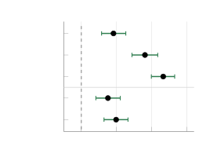
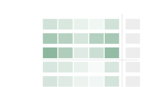
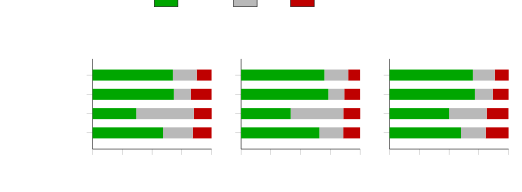
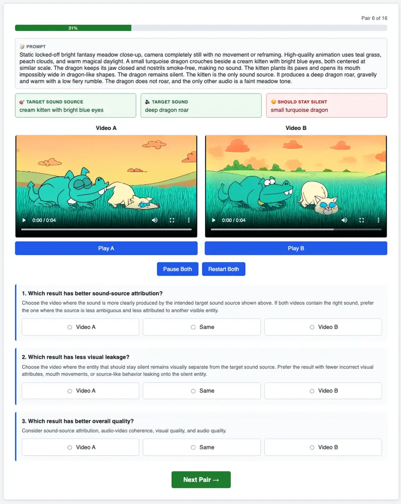

\\ACM@balancefalse

# The Attention Triangle in Audio-Video Models

Journal: TOG

Sagi Polaczek Affiliation: Tel Aviv University, Tel Aviv, Israel , Noa
Kraicer Affiliation: Tel Aviv University, Tel Aviv, Israel , Gal Metzer
Affiliation: Tel Aviv University, Tel Aviv, Israel , Zhuo Ning
Affiliation: Simon Fraser University, Burnaby, Canada , Ali
Mahdavi-Amiri Affiliation: Simon Fraser University, Burnaby, Canada ,
Daniel Cohen-Or Affiliation: Tel Aviv University, Tel Aviv, Israel and
Raja Giryes Affiliation: Tel Aviv University, Tel Aviv, Israel

© none


Figure 1. The Attention Triangle in Audio-Video Models. Top-left:
baseline T2AV generation exhibits strong leakage; the pirate visually
inherits parrot-like attributes and becomes the speaking source.
Top-right: Ours-Text restores the pirate’s appearance, but speech
remains incorrectly localized to the pirate. Bottom-left: Ours-AV
correctly localizes speech to the parrot, but appearance leakage
persists in the pirate. Bottom-right: Ours-Full jointly restores correct
appearance and localizes speech to the intended source. The prompt is
shown below the figure. Four generated-video examples arranged in a
two-by-two grid for a dockside scene with a pirate and a parrot. The
baseline gives the pirate parrot-like visual attributes and makes the
pirate speak. Ours-Text restores the pirate's appearance but leaves
speech on the pirate. Ours-AV moves speech to the parrot but leaves the
pirate's visual corruption. Ours-Full preserves the pirate's appearance
and assigns speech to the parrot.

###### Abstract.

Audio-video diffusion models rely on cross-modal attention to coordinate
text, sound, and visual content, yet this same mechanism can introduce
subtle and systematic semantic leakage. We study these models by probing
and analyzing the “attention triangle,” comprising the three
cross-attention edges connecting the text, audio, and video streams, and
examine how semantic information is routed across modalities during
generation. Our analysis reveals that routing along the audio-video edge
is bidirectional: audio can influence video generation, while video can
influence audio generation. This edge is shaped by biases encoded in the
model’s parameters and emerges as a major contributor to leakage: when
prompts are in tension with learned priors, cross-modal interactions may
override the intended conditioning and reroute semantics toward visually
canonical but incorrect outcomes. These effects suggest that semantic
artifacts arise not merely from attention spreading beyond its intended
target, but from structured, bias-driven interactions along specific
pathways. Building on this perspective, we extract attention-derived
signals that expose how semantics are distributed and grounded across
modalities, and use them as a diagnostic tool to both analyze and
deliberately incur leakage under controlled conditions. This enables us
to probe the internal dynamics of cross-modal routing and isolate the
role of individual interactions. We further leverage these signals to
guide inference-time interventions that encourage more consistent
cross-modal alignment. Extensive experiments support our analysis and
demonstrate improved semantic grounding while preserving generation
quality.

## 1. Introduction

Recent advances in _diffusion models_, particularly with Diffusion
Transformers (DiT) (Peebles and Xie, 2023), have established attention
as a central mechanism for conditional generation. By leveraging
cross-attention within transformer architectures, these models can
associate conditioning signals such as text, reference images, or other
modalities with the evolving visual representation. Attention captures
and propagates semantic associations across interacting representations
throughout denoising, enabling expressive and compositional generation.
The same mechanism, however, mixes information softly and globally
without explicit locality or exclusivity constraints. Semantic
associations can therefore spread beyond their intended targets,
producing attribute leakage, semantic entanglement, and unstable
bindings over time.

These limitations become more pronounced in audio-video generation,
where attention must jointly mediate interactions between text, audio,
and video modalities (Figs. 1 and 3). We refer to this trimodal setting
as an _attention triangle_ (Fig. 2), in which each modality both
influences and constrains the others. Unlike bimodal conditioning,
alignment is no longer pairwise but coupled across all three modalities.
The model must reconcile semantic intent from text, temporal structure
from audio, and spatiotemporal realization in video. These coupled
constraints can produce competing signals, modality dominance, and
entangled associations, allowing a competing interpretation to propagate
through attention and reduce global consistency. Our ablations identify
the audio-video pathway as a major contributor to semantic leakage in
LTX-2 (Fig. 6 and Supp. Fig. 7). We hypothesize that this vulnerability
arises partly because audio tokens encode temporal (but not spatial)
position, leaving source localization underconstrained.

In this work, we revisit audio-video generation through an
analysis-driven lens. We analyze the leakage problem, as introduced
above, through the structure of the attention triangle, while placing
particular emphasis on failures of source attribution, namely whether
sound semantics are grounded in the appropriate visual entity. Viewing
the model through this lens, leakage can be understood in terms of how
semantic information is routed across the text, audio, and video
streams. More generally, this routing is inherently bidirectional: audio
can influence the visual interpretation, while visual priors can in turn
bias the generation and attribution of sound.

An interesting observation that emerges from our analysis is that the
audio-video edge of this triangle often acts as a weak link (Fig. 5 and
Supp. Fig. 11). In cases where the prompt is in tension with the model’s
learned cross-modal biases, this interaction may override the binding
induced by the text, rerouting sound semantics toward visually canonical
but incorrect sources. This suggests that leakage is not only a
consequence of semantic associations extending to unintended entities,
but is closely tied to bias-driven interactions encoded in the model’s
parameters, which manifest along specific cross-modal pathways.

Building on this perspective, we extract attention-derived signals that
expose source attribution, and use them as a diagnostic tool to both
analyze and deliberately incur leakage. By inducing controlled failures,
we probe how sound semantics are routed across entities and modalities,
and isolate the role of specific cross-modal interactions. We then use
these signals to guide inference-time interventions toward more
consistent sound-to-source grounding.

A representative example is shown in Fig. 1. The baseline exhibits both
appearance leakage and incorrect source attribution, with the pirate
inheriting parrot-like attributes and becoming the speaking source.
Partial interventions reveal a decoupling: steering the text edges
restores appearance but not attribution, while steering the audio-video
edge corrects attribution but not appearance. Only joint steering of all
triangle edges resolves both, illustrating that no single interaction
suffices to control cross-modal routing.

Across diverse prompts and settings, our experiments reveal consistent
leakage patterns and show that the framework supports both probing and
mitigation (Tab. 1 and Supp. Fig. 9).

## 2. Background and Related Work

Diffusion models rely on two complementary attention mechanisms.
_Self-attention_ operates within a single modality, allowing each token
to aggregate long-range context from all others (Vaswani et al., 2017).
_Cross-attention_ couples two token sequences, typically the noisy
latent and a text embedding, so latent tokens selectively attend to
relevant conditioning tokens (Rombach et al., 2022). In text-to-image
DiT (Peebles and Xie, 2023) and UNet backbones, cross-attention serves
as the primary mechanism for grounding prompt semantics spatially in the
image.

Our work builds on three closely related lines of research: the use of
cross-attention as a control surface for image generation, its failure
mode of leakage between distinct entities, and audio-video diffusion
models that inherit and compound this problem along a new modality axis.

### 2.1. Attention Manipulation and Leakage in Image Diffusion Models

Cross-attention has become the primary control surface of text-to-image
diffusion: it encodes spatial layout (Hertz et al., 2023) and carries
attribute binding through its keys and values (Feng et al., 2023).
Inference-time methods steer it to boost under-attended tokens and
recover missing or under-represented subjects (Chefer et al., 2023),
align attention maps with syntactic structure to correct attribute
correspondence (Rassin et al., 2023), separate competing entities while
binding attributes (Li et al., 2023), or enforce user-specified
layouts (Chen et al., 2024). Even in modern RoPE-based MMDiT backbones
(Esser et al., 2024), different transformer layers play qualitatively
distinct roles that invite layer-targeted edits (Wei et al., 2025).
Together these works treat cross-attention as a steerable, semantically
meaningful signal yielding fine-grained control without retraining.

The flip side is _leakage_: because attention is a soft, global mixing
process without explicit locality or exclusivity constraints, features
routinely bleed between entities the prompt intends to keep distinct. A
prompt such as “a striped cat next to a spotted dog” frequently produces
a striped dog or a spotted cat, because patterns are routed by the
semantics of the target entity rather than the target description. This
failure has been attributed to attention-layer feature blending across
visually similar subjects (Dahary et al., 2024), conflict between
externally imposed layouts and the noise prior (Dahary et al., 2025),
entangled End-of-Sequence text embeddings that aggregate attributes
across the prompt (Mun et al., 2025), and mis-allocated attention logits
across entities (Ventura et al., 2026); the corresponding remedies all
operate as inference-time interventions, treating leakage as an
attention-routing failure. A related failure mode is _contextual
contradiction_, where one concept implicitly suppresses another through
entangled learned associations; Huberman et al. (2025) address this via
stage-aware prompting that decomposes the prompt across denoising stages
rather than editing attention directly. Our work extends this
perspective beyond text-to-image generation to the attention triangle,
where leakage occurs not only between visual entities but also across
modalities.

### 2.2. Video and Audio-Video Diffusion Models

Early text-to-video systems such as Make-A-Video (Singer et al., 2023)
and Imagen Video (Ho et al., 2022a) attached spatiotemporal modules (Ho
et al., 2022b; Blattmann et al., 2023) to pretrained text-to-image
models, generating _silent_ clips with audio outside the generative
loop. The shift to Diffusion Transformer (DiT) backbones (Brooks et al., 2024) enabled large-scale joint video training behind open systems
including CogVideoX (Yang et al., 2024), HunyuanVideo (Kong et al.,
2024), Wan (Wan et al., 2025), and LTX-Video (HaCohen et al., 2024),
alongside closed-source Sora (Brooks et al., 2024) and Veo (Google
DeepMind, 2025). These systems retain the silent-video assumption.

A more recent thread closes the audio gap by jointly generating audio
and video in a single diffusion framework. MM-Diffusion (Ruan et al., 2023) pioneered this by pairing video and audio sub-nets through a
random-shift cross-attention block exchanging time-aligned information;
MM-LDM (Sun et al., 2024) lifted the idea into a shared semantic latent
space. Transformer backbones then produced dual-branch designs coupling
two parallel DiT towers via cross-modal attention: SyncFlow (Liu et al., 2024) fuses a dual diffusion-transformer for temporally aligned
text-to-audio-video; AV-Link (Haji-Ali et al., 2025) repurposes
intermediate features of frozen audio and video diffusion models as
cross-modal conditioning; JavisDiT (Liu et al., 2025) introduces a
hierarchical spatiotemporal prior aligning the two streams at multiple
granularities; and Ovi (Low et al., 2025) adopts a fully symmetric
twin-DiT design with paired cross-attention layers. On the closed side,
Veo 3 (Google DeepMind, 2025) performs joint denoising over a unified
token sequence covering both modalities. The open foundation model
LTX-2 (HaCohen et al., 2026) is representative of the state of the art.

Recent work more directly examines or structures cross-modal interaction
in dual-stream generators. UniAVGen introduces modality-specific,
temporally aligned interaction and learned face-aware modulation (Zhang
et al., 2026), while Cross-Modal Context Learning (CCL) identifies
background-region attention bias, optimization instability, and
conflicts between text and cross-modal conditions, addressing them
through temporal partitioning, learnable context tokens, and learned
routing and guidance (Ma et al., 2026). Very recent work uses
bidirectional audio-video attention to guide training-free
sparsification and cache reuse while preserving synchronization (Gao
et al., 2026). These approaches redesign or accelerate cross-modal
interaction; we instead target entity-level semantic leakage and source
attribution in a pretrained generator through training-free
interventions across all three triangle edges.

Complementary work evaluates spatial audio-video alignment using
visual-object and stereo sound-direction estimates (Shimada et al.,
2026), or introduces trained reference-conditioned branches for
multimodal control (Li et al., 2026); our method instead targets
prompt-specified source binding without auxiliary training or reference
inputs.

While these architectures make joint audio-video generation tractable,
their cross-modal attention inherits and arguably amplifies the same
leakage and source-attribution failures seen in the image domain. Unlike
image leakage between spatially colocated features, the audio-video case
introduces a fundamental dimensional mismatch: a 1D audio temporal
embedding must attend to a 3D spatiotemporal positional
embedding (HaCohen et al., 2026). Forcing video patches to collapse onto
the 1D time axis strips intra-frame spatial distinctness, creating a
degeneracy that we diagnose and address in the following sections.

## 3. Identifying the Triangle Problem


Figure 2. The Attention Triangle. Edge-specific biases promote attention
to the intended speaker (green) and suppress leakage to the competing
entity (red). Intended denotes amplified attention for prompt-designated
pairings: source$`\leftrightarrow`$source,
sound$`\leftrightarrow`$sound, or source$`\leftrightarrow`$sound.
Conflicting denotes attenuated pairings between these signals and the
competing source. The agreement matrix $`\mathbf{G}_{VA}`$ is defined in
Eq. 2; the intended and conflicting text-edge masks $`\mathbf{M}_{VT}`$
and $`\mathbf{M}_{AT}`$ are defined in Eqs. 4 and 5, respectively. A
triangular diagram with Text at the top, Audio at the lower left, and
Video at the lower right. Text-audio and text-video edges receive
positive bias for the intended source and negative bias for the
competing source. The audio-video edge is gated to suppress cross-modal
leakage. Green plus signs denote alignment with the intended source; red
minus signs denote suppression of the competing source.

We consider joint text-to-video and text-to-audio generation with modern
video diffusion models that synthesize a video clip and its accompanying
soundtrack from a single textual prompt. Given a textual prompt, the
models simultaneously condition both a video stream of frames and a
temporally aligned audio stream, and the two modalities are coupled
through cross-attention so that what is heard reinforces what is seen
and vice versa. This mutual dependence suggests a useful abstraction:
rather than viewing the different conditioning pathways independently,
we regard them as a coupled trimodal system in which semantic
information can be routed both directly and indirectly between text,
audio, and video.


Figure 3. Cross-modal leakage in T2V vs T2AV generation. Left: T2V.
Middle: T2AV. Right: prompt. Adding audio induces both appearance and
speaking leakage: in the puppet example, both the performer and puppet
move their lips; in the dog and cat example, the dog shifts toward a
cat-like appearance and both animals appear to speak.Two example rows
compare text-to-video and text-to-audio-video outputs beside their
prompts. In the puppet example, adding audio makes both the performer
and puppet move their lips. In the dog-and-cat example, adding audio
makes the dog more cat-like and makes both animals appear to speak.

We formalize this system as an _attention triangle_ comprising three
cross-attention edges (Fig. 2) and associate each surface with a
pre-softmax bias matrix. Bias arrows denote conditioning flow:
$`\mathbf{B}_{X\to Y}`$ acts on the $`Y`$-query/$`X`$-key surface. Thus,
$`\mathbf{B}_{T\to V}`$ and $`\mathbf{B}_{T\to A}`$ bias the
text-conditioned video and audio surfaces (Eqs. 4 and 5), while
$`\mathbf{G}_{VA}`$ denotes the audio-video agreement matrix and
$`\mathbf{B}_{A\leftrightarrow V}`$ denotes the corresponding pair of
audio-video biases (Eqs. 2 and 3). While this joint formulation is
appealing, it makes the prompt highly susceptible to semantic leakage:
textual attributes intended for one entity are silently rerouted to
another, more frequent or more salient entity in the scene. For example,
a prompt such as “a parrot sitting on the shoulder of a pirate, the
_parrot_ is _talking_” reliably produces a speaking pirate rather than a
talking parrot, because speech carries a strong learned prior toward
human-like figures, causing the model to route audio tokens to pirate
patches rather than to the parrot the prompt explicitly designates as
the speaker.

### 3.1. The Attention Triangle

The attention triangle connects three token populations through pairwise
cross-attention: (1) text tokens, (2) audio tokens, and (3) video
patches. Every pair of modalities exchanges information through
cross-attention, so a single attribute embedded in the text can reach
the video stream both directly (text $`\to`$ video) and indirectly
through the audio stream (text $`\to`$ audio $`\to`$ video), and
symmetrically in the opposite direction. This relationship is depicted
in Figure 2. Composing these pairwise paths also exposes second-order,
within-modality interactions; in particular, the
video$`\to`$audio$`\to`$video rollout reveals an effective
audio-mediated coupling between visual regions, formalized in Eq. 1 and
visualized in Fig. 5. A particularly problematic edge of this triangle
is the audio-video cross-attention itself. The model’s training
distribution encodes strong priors directly in this edge: speech-like
audio features are correlated with human-shaped patches, not parrots.
Even when the text correctly assigns speech to the parrot, the
audio-video edge can override that binding and drag the sound toward its
statistically familiar source. Beyond these learned statistical biases,
we hypothesize that the audio-video edge may also be underconstrained
spatially. In LTX-2 (HaCohen et al., 2026), video patches and audio
tokens share temporal positional information, while audio tokens do not
carry explicit within-frame spatial coordinates. This asymmetry may
force cross-modal correspondence to rely more heavily on learned
semantic compatibility between audio content and visual entities than on
explicit spatial alignment. It may therefore make it more difficult for
cross-modal attention to distinguish between spatially distinct
candidate sources and may contribute to weaker sound localization.

These considerations motivate us to test whether audio-video
cross-attention is a major contributor to semantic leakage in LTX-2. We
examine this question through attention visualizations, controlled
attention interventions that induce or mitigate leakage, and
complementary ablations. Unlike the direct text-conditioning paths, this
edge relays semantic information between two generated modalities along
an implicit pathway that is not directly specified by the user’s prompt.

### 3.2. Audio Leakage Analysis

#### Direction convention.

We index attention matrices by query and key modality:
$`\mathbf{P}_{VA}`$ has video queries and audio keys. Under our
key/value information-flow convention, this is the $`A\to V`$
conditioning surface because audio values contribute to video-query
outputs; under row rollout, right multiplication by $`\mathbf{P}_{VA}`$
maps a video-indexed distribution to an audio-indexed distribution and
therefore constitutes a $`V\to A`$ rollout step.

#### Visualizing Audio-Mediated Attention

As a first-order probe, we inspect $`\mathbf{P}_{VA}`$, the
video-query/audio-key attention matrix. For each video query, we sum its
attention weights over the selected speech-active audio keys and average
the resulting spatial score across heads and denoising steps. On leakage
prompts, high scores concentrate spatially on the wrong subject; for
example, video queries on the pirate assign more attention to
speech-active audio keys than video queries on the parrot, even though
the prompt assigns speech to the parrot. This misbinding is visualized
in Fig. 4.

To make matrix orientation explicit, let
$`\mathbf{P}_{QK}^{(\ell)}\in[0,1]^{N_{Q}\times N_{K}}`$ denote the
head-averaged attention matrix at layer $`\ell`$, with rows indexed by
queries from modality $`Q`$ and columns by keys from modality $`K`$.
Following the Markov-chain interpretation of attention matrices (Erel
et al., 2025), we compose consecutive video-query/audio-key and
audio-query/video-key matrices:

```math
\mathbf{P}_{VV}^{\mathrm{eff}}\;=\;\mathbf{P}_{VA}^{(\ell)}\mathbf{P}_{AV}^{(\ell+1)}\;\in\;[0,1]^{N_{V}\times N_{V}}. \tag{1}
```

The effective matrix $`\mathbf{P}_{VV}^{\mathrm{eff}}`$ captures a
video-to-video coupling mediated by the audio stream that does not
appear in any single attention layer. Seeding a uniform row distribution
over each entity’s visual mask and propagating it through
$`\mathbf{P}_{VV}^{\mathrm{eff}}`$ (see Appendix G.1), we observe that
on leakage prompts, the mass migrates from the intended source to the
visually canonical one (e.g. from the parrot patches to the pirate),
making the audio-mediated mis-binding visible as a concrete spatial
transport pattern.

#### Removing the Audio

A complementary way to test the same hypothesis is to ablate the audio
branch and check whether the leakage persists. LTX-2 ships in audio-free
and joint variants sharing the same backbone (see Appendix G.2), making
this ablation straightforward. In the paired examples shown in Fig. 3,
failures present under joint T2AV generation are absent from the
audio-free T2V outputs despite the shared visual backbone. Together with
the text-edge-only intervention in Sec. 5.3, which leaves source
misattribution unresolved, this provides complementary evidence that the
audio-video pathway is a major contributor to leakage in LTX-2. These
interventions do not, however, establish temporal-only positional
encoding as the pathway’s unique failure mechanism.

## 4. Steering: Grounding Audio and Video Regions


Figure 4. Mitigating audio-to-video attention leakage. Using the same
prompt and random seed as in Figure 1, we sum, for each video query, its
attention weights over the _speech-active_ audio keys identified from
the waveform shown at the bottom, then overlay the resulting spatial
score on a representative frame. Left (baseline): high active-audio
scores concentrate across the pirate’s face and chest, the visually
canonical but prompt-incorrect human source. Right (ours): after
attention-triangle steering, high scores concentrate sharply on the
parrot, the entity designated by the prompt. The right panel is
desaturated outside the high-scoring region to highlight the
post-steering localization. Two attention-score overlays and a speech
waveform compare baseline and steered generations of the
pirate-and-parrot scene. During speech-active waveform intervals,
baseline scores are concentrated over video-query locations on the
pirate's face and chest, whereas scores after steering are concentrated
on the parrot.

Having identified audio-video cross-attention as a major contributor to
semantic leakage, we introduce a training-free, inference-time steering
algorithm, instantiated on LTX-2 (HaCohen et al., 2026), that jointly
operates on all three edges of the attention triangle. We identify the
intended sound source, the sound or action, and an optional competing
source in the prompt. On the two text-conditioned surfaces, we define
_intended_ and _conflicting_ cell masks; all remaining cells are
_neutral_. In the pirate-parrot example (Figure 1), intended cells pair
parrot video patches with “parrot” text tokens and speech-active audio
tokens with the speaking-action text. Conflicting cells pair these video
or audio regions with competing-source text, or pair competing-source
video or audio regions with the intended source or action text. On the
audio-video surfaces, we instead compute the soft agreement matrix
$`\mathbf{G}_{VA}`$. Intended-source/sound and non-source/non-sound
pairs have high agreement, whereas mismatched source-sound pairs have
low agreement; the bias $`-\lambda(\mathbf{1}-\mathbf{G}_{VA})`$
penalizes each pair in proportion to its disagreement. During denoising,
we apply a pre-softmax additive logit bias to all three cross-attention
surfaces: audio$`\leftrightarrow`$video, text$`\rightarrow`$video, and
text$`\rightarrow`$audio. The text-conditioned biases reinforce intended
cells and suppress conflicting cells, while the audio-video bias
suppresses mismatched source-sound pairs. Together, these biases
reground both the audio and video streams to their intended prompt
semantics. We denote the text-edge-only, audio-video-only, and joint
variants as Ours-Text, Ours-AV, and Ours-Full, respectively.

#### Anchors.

The biases are built from three families of anchors, all derived once
from the unsteered baseline pass and held fixed across all denoising
steps of the steered pass.

Prompt-side text anchors. For text, audio, and video modalities
$`M\in\{T,A,V\}`$, let $`N_{M}`$ denote the number of tokens. The user
annotates the intended sound-source phrase, the sound-or-action phrase,
and an optional competing-source phrase (e.g., “pirate” in Fig. 1). We
remove the annotation tags before text encoding and map the annotated
phrases to their corresponding token-index sets
$`\mathcal{I}_{\mathrm{src}}^{T}`$, $`\mathcal{I}_{\mathrm{snd}}^{T}`$,
and $`\mathcal{I}_{\mathrm{cmp}}^{T}`$ in the cleaned prompt. Their
indicator vectors are denoted
$`\mathbf{m}_{\mathrm{src}}^{T},\mathbf{m}_{\mathrm{snd}}^{T},\mathbf{m}_{\mathrm{cmp}}^{T}\in\{0,1\}^{N_{T}}`$.

Visual anchors. For both the audio$`\leftrightarrow`$video and
text-conditioned video surfaces, we decode the baseline frames, prompt
SAM3 (Carion et al., 2025) with the intended-source text, binarize at
$`0.5`$, and resize to the latent grid. This yields the hard source mask
$`\mathbf{m}_{\mathrm{src}}^{V}\in\{0,1\}^{N_{V}}`$; the
competing-source mask $`\mathbf{m}_{\mathrm{cmp}}^{V}`$ is obtained
analogously.

Audio anchors. No external audio segmenter is available, so we aggregate
audio-query/text-key attention targeting
$`\mathcal{I}_{\mathrm{snd}}^{T}`$ across denoising steps and normalize
it to $`[0,1]`$, yielding the soft sound mask
$`\mathbf{m}_{\mathrm{snd}}^{A}\in[0,1]^{N_{A}}`$. For the
text-conditioned audio surface, thresholding at $`\theta_{A}{=}0.3`$
gives $`\bar{\mathbf{m}}_{\mathrm{snd}}^{A}\in\{0,1\}^{N_{A}}`$. When a
distinct audio region associated with the competing source is available,
$`\bar{\mathbf{m}}_{\mathrm{cmp}}^{A}`$ is obtained analogously;
otherwise, as in examples with a silent competing source, it is the zero
vector.

This asymmetric anchor design, with hard external masks where a reliable
segmenter exists and soft model-derived saliency where it does not, is
detailed in Appendix H.1.

#### Audio$`\leftrightarrow`$video edge.

Let $`\mathbf{1}_{N}`$ and $`\mathbf{1}_{N_{Q}\times N_{K}}`$ denote an
all-ones vector and matrix of the indicated sizes. We define the
audio$`\leftrightarrow`$video agreement matrix as

```math
\displaystyle\mathbf{G}_{VA}={} \displaystyle\mathbf{m}_{\mathrm{src}}^{V}(\mathbf{m}_{\mathrm{snd}}^{A})^{\top} \tag{2}
```

```math
\displaystyle+(\mathbf{1}_{N_{V}}-\mathbf{m}_{\mathrm{src}}^{V})(\mathbf{1}_{N_{A}}-\mathbf{m}_{\mathrm{snd}}^{A})^{\top}\in[0,1]^{N_{V}\times N_{A}}.
```

The agreement matrix in Eq. 2 assigns high values to
intended-source/sound and non-source/non-sound pairs, and low values to
mismatched source-sound pairs. We suppress the mismatched
audio$`\leftrightarrow`$video logits using

```math
\mathbf{B}_{A\to V}=-\lambda(\mathbf{1}_{N_{V}\times N_{A}}-\mathbf{G}_{VA}),\qquad\mathbf{B}_{V\to A}=\mathbf{B}_{A\to V}^{\top},\quad\lambda>0. \tag{3}
```

We use $`\mathbf{B}_{A\leftrightarrow V}`$ as shorthand for the pair
$`(\mathbf{B}_{A\to V},\mathbf{B}_{V\to A})`$. We add
$`\mathbf{B}_{A\to V}`$ to the video-query/audio-key logits and
$`\mathbf{B}_{V\to A}`$ to the audio-query/video-key logits at every
transformer block and denoising step. This soft two-class construction
has one hyperparameter; we use $`\lambda{=}10`$ throughout
(Appendix H.2).

#### Text$`\rightarrow`$video and text$`\rightarrow`$audio edges.

A single audio$`\leftrightarrow`$video correction is insufficient: on
the video-query/text-key surface, queries in the intended-source and
competing-source regions can still attend to the other entity’s text
tokens, producing appearance leakage. Both text-conditioned surfaces use
the same three classes: _intended_, _conflicting_, and _neutral_. We
denote the corresponding cell masks by $`\mathbf{M}^{\mathrm{int}}`$ and
$`\mathbf{M}^{\mathrm{conf}}`$, respectively.

For the video-query/text-key surface,

```math
\displaystyle\mathbf{M}^{\mathrm{int}}_{VT}\; \displaystyle=\;\mathbf{m}_{\mathrm{src}}^{V}(\mathbf{m}_{\mathrm{src}}^{T})^{\top},
```

```math
\displaystyle\mathbf{M}^{\mathrm{conf}}_{VT}\; \displaystyle=\;\mathbf{m}_{\mathrm{src}}^{V}(\mathbf{m}_{\mathrm{cmp}}^{T})^{\top}+\mathbf{m}_{\mathrm{cmp}}^{V}(\mathbf{m}_{\mathrm{src}}^{T})^{\top},
```

```math
\displaystyle\mathbf{B}_{T\to V}\; \displaystyle=\;\beta\mathbf{M}^{\mathrm{int}}_{VT}-\gamma\mathbf{M}^{\mathrm{conf}}_{VT}\in\mathbb{R}^{N_{V}\times N_{T}}. \tag{4}
```

For the audio-query/text-key surface,

```math
\displaystyle\mathbf{M}^{\mathrm{int}}_{AT}\; \displaystyle=\;\bar{\mathbf{m}}_{\mathrm{snd}}^{A}(\mathbf{m}_{\mathrm{snd}}^{T})^{\top},
```

```math
\displaystyle\mathbf{M}^{\mathrm{conf}}_{AT}\; \displaystyle=\;\bar{\mathbf{m}}_{\mathrm{snd}}^{A}(\mathbf{m}_{\mathrm{cmp}}^{T})^{\top}+\bar{\mathbf{m}}_{\mathrm{cmp}}^{A}(\mathbf{m}_{\mathrm{snd}}^{T})^{\top},
```

```math
\displaystyle\mathbf{B}_{T\to A}\; \displaystyle=\;\beta\mathbf{M}^{\mathrm{int}}_{AT}-\gamma\mathbf{M}^{\mathrm{conf}}_{AT}\in\mathbb{R}^{N_{A}\times N_{T}}. \tag{5}
```

We use $`\beta{=}0.5`$ and $`\gamma{=}2.0`$. Together with
$`\lambda{=}10`$ and $`\theta_{A}{=}0.3`$ above, these values are fixed
across all LTX-2 experiments and are not tuned per prompt
(Appendix H.2). The asymmetric choice places greater weight on
suppressing conflicting cells than on reinforcing intended cells. When
no competing-source indices are supplied, $`\mathbf{M}^{\mathrm{conf}}`$
vanishes and the bias reduces to an intended-cell boost.

We validate this design in Section 5, where ablations confirm that
steering all three edges jointly is necessary: partial interventions
that address only a subset of edges leave residual leakage (see Fig. 6).

The three biases together close the triangle; their effect on attention
weights is depicted in Figure 2. Ours-Full is training-free and requires
no auxiliary loss or fine-tuning. Its overhead is one additional full
denoising trajectory over all steps required to generate the final video
to extract the baseline anchors, plus frame decoding and SAM3 for the
visual anchors, giving roughly $`2.5\times`$ the cost of unsteered
generation (Supp. H.3).

## 5. Experiments

We validate our analysis and steering framework through attention
visualizations, qualitative and quantitative comparisons, and human
preference studies. Full protocols, additional examples, and per-metric
breakdowns are provided in the Supplementary Material; we strongly
encourage readers to inspect the side-by-side videos in the accompanying
supplementary HTML page (Supp. E), because the leakage phenomena require
synchronized audio and video.

### 5.1. Attention-Leakage Analysis

#### First-Order Attention Visualization

As analyzed in Sec. 3, the cross-attention between audio and video
tokens carries a direct signature of leakage. Figure 4 visualizes the
spatial active-audio attention score derived from the
video-query/audio-key matrix $`\mathbf{P}_{VA}`$. In the baseline, high
scores concentrate at video-query locations on the pirate, the visually
canonical but prompt-incorrect entity. Under steering, high scores
concentrate on the parrot, consistent with improved source attribution.

#### Second-Order Attention Visualization


Figure 5. Audio-mediated video-to-video leakage. Using the same prompt
as in Figure 1, we apply the $`V\to A\to V`$ row rollout in Eq. 1, using
$`\mathbf{P}_{VA}^{(\ell)}`$ for the $`V\to A`$ rollout hop followed by
$`\mathbf{P}_{AV}^{(\ell+1)}`$ for the $`A\to V`$ rollout hop. This
exposes an indirect attention association between visual regions that is
not represented by either individual cross-attention matrix alone. Left:
seed mass on the parrot, the prompt-designated source. Middle: the
resulting audio-token distribution after the $`v{\to}a`$ hop is diffuse
rather than peaked, reflecting the 1D-to-2D dimensional mismatch
(Sec. 3). Right: after the $`a{\to}v`$ hop, mass has migrated onto the
pirate, exposing the audio-mediated misrouting behind source-attribution
leakage. Three panels trace composed video-to-audio-to-video attention
in the pirate-and-parrot scene. Initial attention mass is seeded on the
parrot. After the video-to-audio hop, mass is diffuse across audio
tokens. After the audio-to-video hop, attention mass has migrated onto
the pirate, revealing indirect source leakage.

Figure 5 exposes the second-order, audio-mediated video-to-video
coupling described in Sec. 3.2. We seed a uniform attention distribution
over the parrot’s spatial region and propagate it through
$`\mathbf{P}_{VV}^{\mathrm{eff}}`$ (Eq. 1). Before steering, the mass
migrates from the parrot patches to the pirate after the round trip
through the audio stream, directly revealing the audio-mediated
misrouting that drives the leakage. After steering, the mass returns to
the parrot, confirming that the intervention successfully breaks this
indirect pathway. Supplementary Fig. 11 corroborates this routing
pattern in two additional LTX-2 examples and quantifies how Ours-Full
redirects the returned mass toward the intended source while suppressing
the competing source.

### 5.2. Manipulation in the Wild

We apply our steering framework to a broad set of open-domain
audio-video scenarios spanning realistic humans, animals, animated
characters, and multi-entity scenes with diverse spatial layouts. Across
these settings, we identify four recurring leakage modes:
_source-attribution leakage_, where sound-producing behavior is assigned
to the wrong entity; _appearance leakage_, where sound semantics alter
the visual rendering of an unrelated entity (e.g., a pirate acquiring
parrot-like features); _voice-characteristic leakage_, where the
generated voice follows canonical priors of the visual entity rather
than the prompt specification; and _generation suppression_, where
strong conflicts between the prompt and learned priors cause the model
to omit the requested sound entirely. Ours-Full mitigates all four modes
by jointly steering the full attention triangle, preserving both visual
appearance and correct sound grounding across all tested scenarios
(detailed in Supp. A).

### 5.3. Comparisons and Ablations


Figure 6. Horse-neigh attribution. The prompt asks for a horse neigh
that should be produced by the knight rather than the horse. Three
representative frames are shown per method. Across baselines and
partial-edge variants the neigh is misattributed to the horse or the
knight acquires horse-like visual features; Ours-Full both localizes the
sound to the knight and preserves his appearance. Zoomed regions
indicate the active sound source. A qualitative grid compares generated
frames from several baselines, partial-edge variants, and Ours-Full for
a scene containing a knight and a horse. Baselines and partial variants
either attribute the neigh to the horse or give the knight horse-like
visual features. Ours-Full preserves the knight's appearance and
attributes the neigh to him. Insets enlarge the apparent sound source.

|                                            |                    |            |                    |                    |                    |                             |                     |
| ------------------------------------------ | ------------------ | ---------- | ------------------ | ------------------ | ------------------ | --------------------------- | ------------------- |
| Metric                                     | Native LTX-2       | Video-only | Ovi                | Bounded Attn.      | Ours-Text          | Ours-AV                     | Ours-Full           |
| Qwen source-attribution score $`\uparrow`$ | $`0.1216`$         | N/A        | $`0.1207`$         | $`0.0925`$         | $`0.1140`$         | $`0.1302`$                  | $`\mathbf{0.1349}`$ |
| CLAP audio-text $`\uparrow`$               | $`0.375\pm 0.187`$ | N/A        | $`0.357\pm 0.187`$ | $`0.384\pm 0.198`$ | $`0.374\pm 0.188`$ | $`\mathbf{0.384}\pm 0.189`$ | $`0.383\pm 0.185`$  |
| VBench subject consistency $`\uparrow`$    | $`0.988`$          | $`0.987`$  | $`0.971`$          | $`0.981`$          | $`0.989`$          | $`0.989`$                   | $`\mathbf{0.990}`$  |
| VBench background consistency $`\uparrow`$ | $`0.981`$          | $`0.983`$  | $`0.975`$          | $`0.981`$          | $`0.984`$          | $`0.983`$                   | $`\mathbf{0.986}`$  |
| VBench aesthetic quality $`\uparrow`$      | $`0.590`$          | $`0.597`$  | $`0.571`$          | $`0.588`$          | $`0.598`$          | $`0.589`$                   | $`\mathbf{0.604}`$  |

Metric definitions. Qwen source-attribution score is the conditional
probability that only the intended visible entity produced the audible
target event, computed from a counterbalanced five-option Qwen3-Omni
judge; higher is better. The video-only diagnostic has no audio and is
therefore not scored. CLAP audio-text measures the alignment between the
generated audio and the intended sound phrase; we report mean $`\pm`$
standard deviation. VBench subscores measure visual subject consistency,
background consistency, and aesthetic quality. All metrics are computed
on the same prompt set across methods.

Table 1. Main leakage comparison. We compare the native audio-video
generator, a video-only diagnostic baseline, the external Ovi baseline,
an adapted text/image-side Bounded Attention baseline, and three
variants of our attention-triangle intervention.

We compare against the native LTX-2 T2AV baseline, an adaptation of
Bounded Attention (Dahary et al., 2024) to the audio-video setting, and
two partial variants: Ours-Text steers only the text edges
(Text$`\rightarrow`$Audio, Text$`\rightarrow`$Video) whereas Ours-AV
steers only the audio-video edge (Audio$`\leftrightarrow`$Video). The
partial variants isolate the contribution of each edge family and serve
as controlled ablations. A representative qualitative example is shown
in Fig. 6: Ours-Text corrects the textual binding but cannot overcome
the audio-video prior, leaving the sound misattributed; Ours-AV
localizes the source correctly but introduces appearance leakage into
the competing source; only Ours-Full simultaneously preserves appearance
and grounds the sound to the intended source. Additional qualitative
examples and per-method pairwise user-study results are reported in
Supp. B and Supp. D. Representative comparisons with Ovi are provided in
Supp. H.4.

#### Quantitative evaluation.

We use two complementary automatic audio-video validators. A
counterbalanced five-option Qwen3-Omni judge (Xu et al., 2025) targets
sound-source attribution, while VA-Judger (Huang et al., 2026) compares
matched video pairs using prompt fidelity, audiovisual consistency,
audio quality, video quality, and completeness. We additionally measure
audio-text alignment with CLAP (Wu et al., 2023) and visual fidelity
with VBench (Huang et al., 2024); the human study below provides an
independent pairwise assessment of attribution, appearance leakage
(shown to annotators as “visual leakage”), and overall quality. The
higher-is-better Qwen source-attribution score is $`1`$ minus
conditional leakage. Ours-Full obtains the highest mean score
($`0.1349`$), compared with $`0.1216`$ for the native LTX-2 baseline;
the exact judge prompt, logit extraction, counterbalancing, and
aggregation are given in Supp. C.1. On the broader VA-Judger evaluation,
Ours-Full is preferred over every alternative, with mean preference
scores ranging from $`57.6\%`$ to $`73.3\%`$; all pair-bootstrap
$`95\%`$ confidence intervals lie above $`50\%`$. The complete
per-reference results and protocol are reported in Supp. C.2. Ours-Full
attains the best VBench scores across subject consistency ($`0.990`$),
background consistency ($`0.986`$), and aesthetic quality ($`0.604`$),
while remaining competitive on CLAP ($`0.383`$ vs. $`0.384`$ for the
closest baseline), suggesting that the intervention does not cause a
large degradation in the measured fidelity metrics. Tab. 1 reports the
full comparison; protocol details are provided in Supp. C.

#### User study.

We conduct pairwise human preference studies against each comparison
method across three axes: (i) sound-source attribution, (ii) visual
leakage (appearance leakage), and (iii) overall generation quality.
Among decided preferences, annotators choose Ours-Full in $`79.2\%`$ of
attribution comparisons, $`82.9\%`$ of leakage comparisons, and
$`80.1\%`$ of overall-quality comparisons, demonstrating a strong
preference for ours on all three axes. The largest margins appear on
attribution and leakage, the two axes most directly targeted by our
intervention. A two-sided exact binomial test on non-tie votes confirms
that all three aggregate preferences are statistically significant after
Bonferroni correction ($`p<10^{-28}`$). Per-method breakdowns are
reported in Supp. D (Fig. 9).

#### Ablations.

The Ours-Text and Ours-AV columns of Tab. 1, together with the
partial-steering panels of Fig. 6, ablate the contribution of each edge
family of the attention triangle: Ours-Text corrects appearance but
leaves source attribution unresolved, Ours-AV localizes the source but
reintroduces appearance leakage, and only Ours-Full addresses both. The
fixed hyperparameter choices ($`\lambda,\beta,\gamma,\theta_{A}`$) and
asymmetric intended- vs. conflicting-cell weighting are described in
Supp. H.2.

## 6. Discussion

Our analysis of LTX-2 identifies the audio-video pathway as a major
contributor to bias-driven misalignment and shows that controlled
attention steering can expose and mitigate these failures. More broadly,
additional cross-modal coupling can create new routes through which
learned priors override prompt-specified bindings. We call this the
Attention Lesson: strengthening cross-modal coupling through attention
can amplify bias-driven routing rather than resolve it.

Our evidence establishes the contribution of the audio-video pathway,
not a unique underlying mechanism. We hypothesize that its vulnerability
partly reflects the mismatch between spatial video tokens and temporally
organized audio tokens, which may leave sound-source grounding
underconstrained. Future work should directly test this mechanism,
explore spatial or pseudo-spatial audio representations and stronger
grounding supervision, and determine whether the same leakage patterns
and interventions transfer to single-stream architectures that process
all modalities within shared self-attention rather than through explicit
cross-attention between modality-specific streams. We discuss
limitations in Supp. F.

## Acknowledgments

This research was supported in part by the Israel Science Foundation
(grants no. 2492/20 and 1473/24), Len Blavatnik and the Blavatnik family
foundation.

## References

- Blattmann et al. (2023) Andreas Blattmann, Robin Rombach, Huan Ling,
  Tim Dockhorn, Seung Wook Kim, Sanja Fidler, and Karsten Kreis. 2023.
  Align Your Latents: High-Resolution Video Synthesis with Latent
  Diffusion Models. In _Proceedings of the IEEE/CVF Conference on
  Computer Vision and Pattern Recognition_. IEEE, Piscataway, NJ, USA,
  22563–22575.
- Brooks et al. (2024) Tim Brooks, Bill Peebles, Connor Holmes, Will
  DePue, Yufei Guo, Li Jing, David Schnurr, Joe Taylor, Troy Luhman,
  Eric Luhman, Clarence Ng, Ricky Wang, and Aditya Ramesh. 2024. Video
  generation models as world simulators.
  [https://openai.com/research/video-generation-models-as-world-simulators](https://openai.com/research/video-generation-models-as-world-simulators)
- Carion et al. (2025) Nicolas Carion, Laura Gustafson, Yuan-Ting Hu,
  Shoubhik Debnath, Ronghang Hu, Didac Suris, Chaitanya Ryali,
  Kalyan Vasudev Alwala, Haitham Khedr, Andrew Huang, Jie Lei, Tengyu
  Ma, Baishan Guo, Arpit Kalla, Markus Marks, Joseph Greer, Meng Wang,
  Peize Sun, Roman Rädle, Triantafyllos Afouras, Effrosyni Mavroudi,
  Katherine Xu, Tsung-Han Wu, Yu Zhou, Liliane Momeni, Rishi Hazra,
  Shuangrui Ding, Sagar Vaze, Francois Porcher, Feng Li, Siyuan Li,
  Aishwarya Kamath, Ho Kei Cheng, Piotr Dollár, Nikhila Ravi, Kate
  Saenko, Pengchuan Zhang, and Christoph Feichtenhofer. 2025. SAM 3:
  Segment Anything with Concepts. arXiv:2511.16719 \[cs.CV\]
  [https://arxiv.org/abs/2511.16719](https://arxiv.org/abs/2511.16719)
- Chefer et al. (2023) Hila Chefer, Yuval Alaluf, Yael Vinker, Lior
  Wolf, and Daniel Cohen-Or. 2023. Attend-and-excite: Attention-based
  semantic guidance for text-to-image diffusion models. _ACM
  transactions on Graphics (TOG)_ 42, 4 (2023), 1–10.
- Chen et al. (2024) Minghao Chen, Iro Laina, and Andrea Vedaldi. 2024.
  Training-free layout control with cross-attention guidance. In
  _Proceedings of the IEEE/CVF winter conference on applications of
  computer vision_. IEEE, Piscataway, NJ, USA, 5343–5353.
- Cui et al. (2026) Zijun Cui, Xiulong Liu, Hao Fang, Mingwei Xu,
  Jiageng Liu, Zexin Xu, Weiguo Pian, Shijian Deng, Feiyu Du, Chenming
  Ge, and Yapeng Tian. 2026. Do Joint Audio-Video Generation Models
  Understand Physics? arXiv:2605.07061 \[cs.CV\]
  [https://arxiv.org/abs/2605.07061](https://arxiv.org/abs/2605.07061)
- Dahary et al. (2025) Omer Dahary, Yehonathan Cohen, Or Patashnik, Kfir
  Aberman, and Daniel Cohen-Or. 2025. Be decisive: Noise-induced layouts
  for multi-subject generation. In _Proceedings of the Special Interest
  Group on Computer Graphics and Interactive Techniques Conference
  Conference Papers_. Association for Computing Machinery, New York, NY,
  USA, 1–12.
  [doi:10.1145/3721238.3730631](https://doi.org/10.1145/3721238.3730631)
- Dahary et al. (2024) Omer Dahary, Or Patashnik, Kfir Aberman, and
  Daniel Cohen-Or. 2024. Be yourself: Bounded attention for
  multi-subject text-to-image generation. In _Computer Vision – ECCV
  2024_ _(Lecture Notes in Computer Science, Vol. 15072)_. Springer,
  Cham, Switzerland, 432–448.
  [doi:10.1007/978-3-031-72630-9_25](https://doi.org/10.1007/978-3-031-72630-9_25)
- Erel et al. (2025) Yotam Erel, Olaf Dünkel, Rishabh Dabral, Vladislav
  Golyanik, Christian Theobalt, and Amit H Bermano. 2025. Attention (as
  Discrete-Time Markov) Chains. In _Advances in Neural Information
  Processing Systems_, Vol. 38. Curran Associates, Inc., Red Hook, NY,
  USA, 54658–54690.
  [doi:10.52202/085713-1828](https://doi.org/10.52202/085713-1828)
- Esser et al. (2024) Patrick Esser, Sumith Kulal, Andreas Blattmann,
  Rahim Entezari, Jonas Müller, Harry Saini, Yam Levi, Dominik Lorenz,
  Axel Sauer, Frederic Boesel, Dustin Podell, Tim Dockhorn, Zion
  English, and Robin Rombach. 2024. Scaling Rectified Flow Transformers
  for High-Resolution Image Synthesis. In _Proceedings of the 41st
  International Conference on Machine Learning_ _(Proceedings of Machine
  Learning Research, Vol. 235)_. PMLR, Vienna, Austria, 12606–12633.
  [https://proceedings.mlr.press/v235/esser24a.html](https://proceedings.mlr.press/v235/esser24a.html)
- Feng et al. (2023) Weixi Feng, Xuehai He, Tsu-Jui Fu, Varun Jampani,
  Arjun Akula, Pradyumna Narayana, Sugato Basu, Xin Eric Wang, and
  William Yang Wang. 2023. Training-free structured diffusion guidance
  for compositional text-to-image synthesis. The Eleventh International
  Conference on Learning Representations (ICLR).
  [https://openreview.net/forum?id=PUIqjT4rzq7](https://openreview.net/forum?id=PUIqjT4rzq7)
- Gao et al. (2026) Shengchuan Gao, Teng Hu, Bohao Feng, Luchen Li,
  Wenqiang Wang, Hongqian Deng, and Ran Yi. 2026. Efficient Audio-Visual
  Generation via Synchrony-Aware Cross-Modal Sparse Attention.
  arXiv:2608.15522 \[cs.CV\]
  [doi:10.48550/arXiv.2608.15522](https://doi.org/10.48550/arXiv.2608.15522)
- Google DeepMind (2025) Google DeepMind. 2025. Veo 3 Technical Report.
  [https://storage.googleapis.com/deepmind-media/veo/Veo-3-Tech-Report.pdf](https://storage.googleapis.com/deepmind-media/veo/Veo-3-Tech-Report.pdf).
- HaCohen et al. (2026) Yoav HaCohen, Benny Brazowski, Nisan Chiprut,
  Yaki Bitterman, Andrew Kvochko, Avishai Berkowitz, Daniel Shalem,
  Daphna Lifschitz, Dudu Moshe, Eitan Porat, Eitan Richardson, Guy
  Shiran, Itay Chachy, Jonathan Chetboun, Michael Finkelson, Michael
  Kupchick, Nir Zabari, Nitzan Guetta, Noa Kotler, Ofir Bibi, Ori
  Gordon, Poriya Panet, Roi Benita, Shahar Armon, Victor Kulikov, Yaron
  Inger, Yonatan Shiftan, Zeev Melumian, and Zeev Farbman. 2026. LTX-2:
  Efficient Joint Audio-Visual Foundation Model.
  arXiv:2601.03233 \[cs.CV\]
  [https://arxiv.org/abs/2601.03233](https://arxiv.org/abs/2601.03233)
- HaCohen et al. (2024) Yoav HaCohen, Nisan Chiprut, Benny Brazowski,
  Daniel Shalem, Dudu Moshe, Eitan Richardson, Eran Levin, Guy Shiran,
  Nir Zabari, Ori Gordon, et al. 2024. Ltx-video: Realtime video latent
  diffusion.
- Haji-Ali et al. (2025) Moayed Haji-Ali, Willi Menapace, Aliaksandr
  Siarohin, Ivan Skorokhodov, Alper Canberk, Kwot Sin Lee, Vicente
  Ordonez, and Sergey Tulyakov. 2025. Av-link: Temporally-aligned
  diffusion features for cross-modal audio-video generation. In
  _Proceedings of the IEEE/CVF International Conference on Computer
  Vision_. IEEE, Piscataway, NJ, USA, 19373–19385.
- Hertz et al. (2023) Amir Hertz, Ron Mokady, Jay Tenenbaum, Kfir
  Aberman, Yael Pritch, and Daniel Cohen-Or. 2023. Prompt-to-prompt
  image editing with cross attention control. The Eleventh International
  Conference on Learning Representations (ICLR).
  [https://openreview.net/forum?id=\_CDixzkzeyb](https://openreview.net/forum?id=_CDixzkzeyb)
- Ho et al. (2022a) Jonathan Ho, William Chan, Chitwan Saharia, Jay
  Whang, Ruiqi Gao, Alexey Gritsenko, Diederik P Kingma, Ben Poole,
  Mohammad Norouzi, David J Fleet, et al. 2022a. Imagen video: High
  definition video generation with diffusion models. arXiv:2210.02303
  [https://arxiv.org/abs/2210.02303](https://arxiv.org/abs/2210.02303)
- Ho et al. (2022b) Jonathan Ho, Tim Salimans, Alexey Gritsenko, William
  Chan, Mohammad Norouzi, and David J Fleet. 2022b. Video Diffusion
  Models. _Advances in Neural Information Processing Systems_ 35 (2022),
  8633–8646.
- Huang et al. (2026) Yinming Huang, Shuyuan Tu, Xi Yan, Zihan Yang,
  Jianhua Han, Xu Hang, Yu-Gang Jiang, and Zuxuan Wu. 2026. VA-Judger:
  Reward Modeling from Human Preference Feedback for Joint Video-Audio
  Generation. arXiv:2608.18607 \[cs.CV\]
  [doi:10.48550/arXiv.2608.18607](https://doi.org/10.48550/arXiv.2608.18607)
- Huang et al. (2024) Ziqi Huang, Yinan He, Jiashuo Yu, Fan Zhang,
  Chenyang Si, Yuming Jiang, Yuanhan Zhang, Tianxing Wu, Qingyang Jin,
  Nattapol Chanpaisit, Yaohui Wang, Xinyuan Chen, Limin Wang, Dahua Lin,
  Yu Qiao, and Ziwei Liu. 2024. VBench: Comprehensive Benchmark Suite
  for Video Generative Models. In _Proceedings of the IEEE/CVF
  Conference on Computer Vision and Pattern Recognition_. IEEE,
  Piscataway, NJ, USA, 21807–21818.
- Huberman et al. (2025) Saar Huberman, Or Patashnik, Omer Dahary, Ron
  Mokady, and Daniel Cohen-Or. 2025. Image Generation from
  Contextually-Contradictory Prompts. arXiv:2506.01929
  [https://arxiv.org/abs/2506.01929](https://arxiv.org/abs/2506.01929)
- Kong et al. (2024) Weijie Kong, Qi Tian, Zijian Zhang, Rox Min,
  Zuozhuo Dai, Jin Zhou, Jiangfeng Xiong, Xin Li, Bo Wu, Jianwei Zhang,
  et al. 2024. Hunyuanvideo: A systematic framework for large video
  generative models.
- Li et al. (2026) Liyang Li, Wen Wang, Canyu Zhao, Tianjian Feng,
  Zhiyue Zhao, Hao Chen, and Chunhua Shen. 2026. MMControl: Unified
  Multi-Modal Control for Joint Audio-Video Generation. European
  Conference on Computer Vision (ECCV). arXiv:2604.19679 \[cs.CV\]
  [doi:10.48550/arXiv.2604.19679](https://doi.org/10.48550/arXiv.2604.19679)
- Li et al. (2023) Yumeng Li, Margret Keuper, Dan Zhang, and Anna
  Khoreva. 2023. Divide & bind your attention for improved generative
  semantic nursing. In _34th British Machine Vision Conference (BMVC 2023)_. BMVA Press, Aberdeen, UK, Article 366, 12 pages.
  [https://papers.bmvc2023.org/0366.pdf](https://papers.bmvc2023.org/0366.pdf)
- Liu et al. (2024) Haohe Liu, Gael Le Lan, Xinhao Mei, Zhaoheng Ni,
  Anurag Kumar, Varun Nagaraja, Wenwu Wang, Mark D Plumbley, Yangyang
  Shi, and Vikas Chandra. 2024. Syncflow: Toward temporally aligned
  joint audio-video generation from text. arXiv:2412.15220
  [https://arxiv.org/abs/2412.15220](https://arxiv.org/abs/2412.15220)
- Liu et al. (2025) Kai Liu, Wei Li, Lai Chen, Shengqiong Wu, Yanhao
  Zheng, Jiayi Ji, Fan Zhou, Jiebo Luo, Ziwei Liu, Hao Fei, et al. 2025.
  Javisdit: Joint audio-video diffusion transformer with hierarchical
  spatio-temporal prior synchronization.
- Low et al. (2025) Chetwin Low, Weimin Wang, and Calder Katyal. 2025.
  Ovi: Twin backbone cross-modal fusion for audio-video generation.
- Ma et al. (2026) Bingqi Ma, Linlong Lang, Ming Zhang, Dailan He,
  Xingtong Ge, Yi Zhang, Guanglu Song, and Yu Liu. 2026. Improving Joint
  Audio-Video Generation with Cross-Modal Context Learning.
  arXiv:2603.18600 \[cs.CV\]
  [doi:10.48550/arXiv.2603.18600](https://doi.org/10.48550/arXiv.2603.18600)
- Mun et al. (2025) Sunung Mun, Jinhwan Nam, Sunghyun Cho, and Jungseul
  Ok. 2025. Addressing Text Embedding Leakage in Diffusion-based Image
  Editing. In _Proceedings of the IEEE/CVF International Conference on
  Computer Vision_. IEEE, Piscataway, NJ, USA, 16451–16460.
- Peebles and Xie (2023) William Peebles and Saining Xie. 2023. Scalable
  Diffusion Models with Transformers. In _Proceedings of the IEEE/CVF
  International Conference on Computer Vision_. IEEE, Piscataway, NJ,
  USA, 4195–4205.
- Rassin et al. (2023) Royi Rassin, Eran Hirsch, Daniel Glickman, Shauli
  Ravfogel, Yoav Goldberg, and Gal Chechik. 2023. Linguistic Binding in
  Diffusion Models: Enhancing Attribute Correspondence through Attention
  Map Alignment. In _Advances in Neural Information Processing Systems_,
  Vol. 36. Curran Associates, Inc., Red Hook, NY, USA, 3536–3559.
  [doi:10.52202/075280-0157](https://doi.org/10.52202/075280-0157)
- Rombach et al. (2022) Robin Rombach, Andreas Blattmann, Dominik
  Lorenz, Patrick Esser, and Björn Ommer. 2022. High-resolution image
  synthesis with latent diffusion models. In _Proceedings of the
  IEEE/CVF conference on computer vision and pattern recognition_. IEEE,
  Piscataway, NJ, USA, 10684–10695.
- Ruan et al. (2023) Ludan Ruan, Yiyang Ma, Huan Yang, Huiguo He, Bei
  Liu, Jianlong Fu, Nicholas Jing Yuan, Qin Jin, and Baining Guo. 2023.
  Mm-diffusion: Learning multi-modal diffusion models for joint audio
  and video generation. In _Proceedings of the IEEE/CVF conference on
  computer vision and pattern recognition_. IEEE, Piscataway, NJ, USA,
  10219–10228.
- Shimada et al. (2026) Kazuki Shimada, Christian Simon, Takashi
  Shibuya, Shusuke Takahashi, and Yuki Mitsufuji. 2026. SAVGBench:
  Benchmarking Spatially Aligned Audio-Video Generation. In _ICASSP
  2026–2026 IEEE International Conference on Acoustics, Speech and
  Signal Processing (ICASSP)_. IEEE, Piscataway, NJ, USA, 11977–11981.
  [doi:10.1109/ICASSP55912.2026.11464978](https://doi.org/10.1109/ICASSP55912.2026.11464978)
- Singer et al. (2023) Uriel Singer, Adam Polyak, Thomas Hayes, Xi Yin,
  Jie An, Songyang Zhang, Qiyuan Hu, Harry Yang, Oron Ashual, Oran
  Gafni, et al. 2023. Make-a-video: Text-to-video generation without
  text-video data. The Eleventh International Conference on Learning
  Representations (ICLR).
  [https://openreview.net/forum?id=nJfylDvgzlq](https://openreview.net/forum?id=nJfylDvgzlq)
- Sun et al. (2024) Mingzhen Sun, Weining Wang, Yanyuan Qiao, Jiahui
  Sun, Zihan Qin, Longteng Guo, Xinxin Zhu, and Jing Liu. 2024. Mm-ldm:
  Multi-modal latent diffusion model for sounding video generation. In
  _Proceedings of the 32nd ACM International Conference on Multimedia_.
  Association for Computing Machinery, New York, NY, USA, 10853–10861.
  [doi:10.1145/3664647.3680889](https://doi.org/10.1145/3664647.3680889)
- Vaswani et al. (2017) Ashish Vaswani, Noam Shazeer, Niki Parmar, Jakob
  Uszkoreit, Llion Jones, Aidan N Gomez, Łukasz Kaiser, and Illia
  Polosukhin. 2017. Attention is all you need. In _Advances in Neural
  Information Processing Systems_, Vol. 30. Curran Associates, Inc., Red
  Hook, NY, USA, 5998–6008.
  [https://proceedings.neurips.cc/paper_files/paper/2017/hash/3f5ee243547dee91fbd053c1c4a845aa-Abstract.html](https://proceedings.neurips.cc/paper_files/paper/2017/hash/3f5ee243547dee91fbd053c1c4a845aa-Abstract.html)
- Ventura et al. (2026) Mor Ventura, Michael Toker, Or Patashnik,
  Yonatan Belinkov, and Roi Reichart. 2026. Deleaker: Dynamic
  inference-time reweighting for semantic leakage mitigation in
  text-to-image models. The Fourteenth International Conference on
  Learning Representations (ICLR). arXiv:2510.15015
  [https://arxiv.org/abs/2510.15015](https://arxiv.org/abs/2510.15015)
- Wan et al. (2025) Team Wan, Ang Wang, Baole Ai, Bin Wen, Chaojie Mao,
  Chen-Wei Xie, Di Chen, Feiwu Yu, Haiming Zhao, Jianxiao Yang, Jianyuan
  Zeng, Jiayu Wang, Jingfeng Zhang, Jingren Zhou, Jinkai Wang, Jixuan
  Chen, Kai Zhu, Kang Zhao, Keyu Yan, Lianghua Huang, Mengyang Feng,
  Ningyi Zhang, Pandeng Li, Pingyu Wu, Ruihang Chu, Ruili Feng, Shiwei
  Zhang, Siyang Sun, Tao Fang, Tianxing Wang, Tianyi Gui, Tingyu Weng,
  Tong Shen, Wei Lin, Wei Wang, Wei Wang, Wenmeng Zhou, Wente Wang,
  Wenting Shen, Wenyuan Yu, Xianzhong Shi, Xiaoming Huang, Xin Xu, Yan
  Kou, Yangyu Lv, Yifei Li, Yijing Liu, Yiming Wang, Yingya Zhang,
  Yitong Huang, Yong Li, You Wu, Yu Liu, Yulin Pan, Yun Zheng, Yuntao
  Hong, Yupeng Shi, Yutong Feng, Zeyinzi Jiang, Zhen Han, Zhi-Fan Wu,
  and Ziyu Liu. 2025. Wan: Open and Advanced Large-Scale Video
  Generative Models.
- Wei et al. (2025) Tianyi Wei, Yifan Zhou, Dongdong Chen, and Xingang
  Pan. 2025. Freeflux: Understanding and exploiting layer-specific roles
  in rope-based mmdit for versatile image editing. In _Proceedings of
  the IEEE/CVF International Conference on Computer Vision_. IEEE,
  Piscataway, NJ, USA, 16745–16754.
- Wu et al. (2023) Yusong Wu, Ke Chen, Tianyu Zhang, Yuchen Hui, Taylor
  Berg-Kirkpatrick, and Shlomo Dubnov. 2023. Large-Scale Contrastive
  Language-Audio Pretraining with Feature Fusion and Keyword-to-Caption
  Augmentation. In _IEEE International Conference on Acoustics, Speech
  and Signal Processing (ICASSP)_. IEEE, Piscataway, NJ, USA, 1–5.
  [doi:10.1109/ICASSP49357.2023.10095969](https://doi.org/10.1109/ICASSP49357.2023.10095969)
- Xu et al. (2025) Jin Xu, Zhifang Guo, Hangrui Hu, Yunfei Chu, Xiong
  Wang, Jinzheng He, Yuxuan Wang, Xian Shi, Ting He, Xinfa Zhu,
  et al. 2025. Qwen3-Omni Technical Report. arXiv:2509.17765 \[cs.CL\]
  [doi:10.48550/arXiv.2509.17765](https://doi.org/10.48550/arXiv.2509.17765)
- Yang et al. (2024) Zhuoyi Yang, Jiayan Teng, Wendi Zheng, Ming Ding,
  Shiyu Huang, Jiazheng Xu, Yuanming Yang, Wenyi Hong, Xiaohan Zhang,
  Guanyu Feng, et al. 2024. Cogvideox: Text-to-video diffusion models
  with an expert transformer. arXiv:2408.06072
  [https://arxiv.org/abs/2408.06072](https://arxiv.org/abs/2408.06072)
- Zhang et al. (2026) Guozhen Zhang, Zixiang Zhou, Teng Hu, Ziqiao Peng,
  Youliang Zhang, Yi Chen, Yuan Zhou, Qinglin Lu, and Limin Wang. 2026.
  UniAVGen: Unified Audio and Video Generation with Asymmetric
  Cross-Modal Interactions. In _Proceedings of the IEEE/CVF Conference
  on Computer Vision and Pattern Recognition_. IEEE, Piscataway, NJ,
  USA, 1950–1960.

## Appendix A Manipulation In The Wild

We evaluate the generality of our approach by applying the proposed
steering framework across a diverse collection of open-domain
audio-video generation scenarios. We consider examples spanning
different visual domains, including realistic humans, animals, animated
characters, stylized cartoons, and multi-entity scenes with varying
spatial layouts and interaction patterns. The evaluated prompts
intentionally introduce tension between the requested sound and the
canonical visual identity of the speaking entity, creating challenging
conditions for source attribution.

Across these settings, we observe several recurring types of leakage:

- •
  _Source-attribution leakage_: speech or sound-producing behavior is
  assigned to the wrong entity in the scene.
- •
  _Appearance leakage_: sound semantics alter the visual appearance of
  an entity (e.g., a pirate acquiring parrot-like features or a teddy
  bear becoming monster-like).
- •
  _Voice-characteristic leakage_: the generated voice follows canonical
  priors associated with the visual entity rather than the prompt
  specification (e.g., a child failing to produce a deep adult voice).
- •
  _Generation suppression_: strong conflicts between the prompt and
  learned cross-modal priors cause the model to avoid producing the
  requested sound or speaking behavior altogether.

Our manipulation framework mitigates these failures by steering the
routing of information across the attention triangle. Jointly
controlling the text-audio, text-video, and audio-video interactions
enables more stable source localization while preserving the intended
visual appearance of each entity. These effects persist across diverse
prompts, motion patterns, semantic mismatches, and visual styles.

## Appendix B Additional Qualitative Comparisons


Figure 7. Furry-monster growl attribution. The prompt asks for a deep
growl that should be produced by the teddy bear rather than the furry
monster. Three representative frames are shown per method. Baselines and
partial-edge variants either route the growl to the furry monster or
cause the teddy to acquire monster-like visual features; Ours-Full
preserves the teddy’s identity while binding the growl to it. Zoomed
regions indicate the active sound source. A qualitative grid compares
generated frames from several baselines, partial-edge variants, and
Ours-Full for a teddy bear beside a furry monster. Baselines and partial
variants either attribute the growl to the monster or give the teddy
monster-like visual features. Ours-Full preserves the teddy's identity
and attributes the growl to it. Insets enlarge the apparent sound
source.

We provide an additional qualitative comparison in Fig. 7, complementing
the horse-neigh example shown in the main paper (Fig. 6). This example
targets a different leakage regime: rather than re-attributing an
animal-like sound between two realistic entities, the prompt asks a
teddy bear to produce a deep growl in the presence of a furry monster,
creating tension between the requested sound and the canonical visual
prior associated with the monster.

Across the compared methods we observe behavior consistent with the
main-paper example. The native LTX-2 baseline routes the growl to the
furry monster, reproducing the canonical sound-source prior and ignoring
the explicit text specification. The Bounded Attention adaptation, which
restricts text-to-video attention to the speaker region, partially
relocates the growl but does not consistently suppress the
audio-mediated appearance leakage. Ours-Text sharpens the textual
binding but is unable to overcome the strong audio-video prior that ties
growling to monster-like appearance. Ours-AV successfully transfers the
growl onto the teddy, but in doing so injects monster-like features into
the teddy’s appearance, replacing one leakage mode with another. Only
Ours-Full, which jointly manipulates the text and audio-video edges,
simultaneously binds the growl to the teddy and preserves its visual
identity.

Together, the horse-neigh and furry-monster examples illustrate that the
same failure modes recur across very different visual domains and sound
categories, and that the joint manipulation of all edges of the
attention triangle is necessary to mitigate them.

## Appendix C Quantitative Evaluation Protocols

We provide protocol and provenance details for the main-paper
quantitative comparison in Tab. 1, which evaluates the native LTX-2
baseline, a video-only diagnostic variant, the external Ovi baseline, an
adapted text/image-side Bounded Attention baseline, and three variants
of our attention-triangle intervention (Ours-Text, Ours-AV, and
Ours-Full). The table reports targeted source attribution, audio-text
alignment with CLAP, and visual fidelity using VBench subject
consistency, background consistency, and aesthetic quality.

### C.1. Qwen Source-Attribution Score

Scope and judge. We score the six audio-bearing methods on the full
quantitative corpus: $`100`$ challenge prompts, four matched seeds per
prompt, and $`400`$ videos per method, for $`2{,}400`$ videos total.
Each video receives two counterbalanced passes, yielding $`4{,}800`$
Qwen evaluations. The video-only diagnostic is omitted because it
contains no audio. We use Qwen3-Omni-30B-A3B-Instruct (Xu et al., 2025).
The synchronized clip is supplied with audio, sampled at $`5`$ fps, and
resized to $`672\!\times\!448`$. The original generation prompt is
hidden: the judge receives only the target-event description and the two
visible candidate sources, preventing prompt compliance from
substituting for audio-video evidence.

System prompt.

> You are an audiovisual evidence annotator. Watch and listen to the
> entire synchronized clip.
>
> Decide which visible candidate, if any, is presented as producing the
> target audio event. Base your decision only on evidence in the clip,
> especially sound synchronized with repeated mouth, beak, body, or
> object motion.
>
> The target-event description identifies what sound to find; it does
> not identify its source. Generated clips may violate real-world
> expectations. Do not infer the source from species, identity, voice
> characteristics, narrative plausibility, candidate order, or option
> order.

User prompt template.

> Target audio event: {target_event}
>
> Candidate A: {candidate_a}
>
> Candidate B: {candidate_b}
>
> Which candidate is presented as producing the target audio event?
>
> 1 = Candidate A only.
>
> 2 = Candidate B only.
>
> 3 = Both candidates are each presented as producing it, simultaneously
> or at different times.
>
> 4 = The target audio event is not recognizably audible.
>
> 5 = The target audio event is audible, but the clip does not provide
> enough synchronized visible evidence to assign it to Candidate A or
> Candidate B. This includes an off-screen or different source.
>
> Answer with exactly one digit.
>
> Answer:

Logit probabilities and counterbalancing. We do not sample a free-form
response. At the first answer position, we extract the next-token logits
for the five single-token choices 1 to 5. We normalize these logits
within the five-choice answer set, obtaining probabilities for
_Candidate A only_, _Candidate B only_, _both_, _event absent_, and
_source unclear_; we separately retain the five choices’ total
probability mass under the full-vocabulary softmax as a closed-set
diagnostic. In pass 1, Candidate A is the intended source and
Candidate B is the competing source. In pass 2, their order is reversed.
We then map both distributions to the order-independent labels $`I`$
(intended only), $`C`$ (competing source only), $`B`$ (both), $`A`$
(event absent), and $`U`$ (source unclear), and average the two
canonical distributions. This swap removes a fixed Candidate-A or
option-order preference from the reported score.

Score and results. Let $`p_{I},p_{C},p_{B},p_{A},p_{U}`$ be the averaged
canonical probabilities and $`m=p_{I}+p_{C}+p_{B}`$ the probability mass
assigned to a visible source. We define conditional leakage as
$`X=(p_{C}+p_{B})/m`$ and report the higher-is-better score
$`S_{\mathrm{attr}}=1-X=p_{I}/m`$, averaged over videos within each
method. Thus, only an intended-only assignment counts as correct;
competing-only and both-source assignments count as leakage, while
event-absent and source-unclear mass remain separate diagnostics. All
$`2{,}400`$ videos produced two valid, counterbalanced scores, with no
missing, duplicate, or malformed records. Mean scores are $`0.1216`$
(Native LTX-2), $`0.1207`$ (Ovi), $`0.0925`$ (Bounded Attention),
$`0.1140`$ (Ours-Text), $`0.1302`$ (Ours-AV), and $`0.1349`$
(Ours-Full), with Ours-Full performing best.

### C.2. VA-Judger Pairwise Audio-Video Preference





Figure 8. VA-Judger pairwise audio-video preference. Ours-Full is
compared with each reference on the same $`400`$ prompt/seed pairs, each
shown in both presentation orders ($`800`$ decisions per row). Left:
mean pair score after averaging the two orders (win $`=1`$, tie
$`=0.5`$, loss $`=0`$), expressed as a percentage; bars are pointwise
$`95\%`$ bootstrap confidence intervals over pairs, and the dashed line
marks chance. Right: mean Ours-Full-minus-reference differences on the
five judge dimensions scored from $`1`$ to $`10`$ (prompt fidelity, A/V
consistency, audio quality, video quality, and completeness), averaged
across both orders; darker green indicates a larger gain. The gray
column reports order agreement separately; because agreement ranges from
$`51\%`$ to $`69\%`$, we interpret only the aggregated, counterbalanced
scores. All five pair-score intervals lie above $`50\%`$, and all
displayed dimension differences are positive.A two-panel comparison of
Ours-Full with Native LTX-2, Ovi, Bounded Attention, Ours-Text, and
Ours-AV. The left plot shows Ours-Full preference scores of 59.1, 68.1,
73.3, 57.6, and 59.9 percent, respectively, with all bootstrap
confidence intervals above the 50 percent chance line. The right heat
map shows positive Ours-Full gains on all five judge dimensions against
every reference; presentation-order agreement ranges from 51.2 to 69.3
percent.

Purpose. The Qwen source-attribution score above deliberately asks one
narrow question: which visible entity produced the target sound? As a
complementary, broader check, we run the released ShareLab-SII
VA-Judger (Huang et al., 2026) pairwise evaluator. This check asks
whether Ours-Full is preferred overall after jointly considering prompt
fidelity, audiovisual consistency, audio quality, video quality, and
completeness. It does not replace the targeted attribution metric or the
human evaluation.

Exact inputs and judge. For every comparison, the judge receives the
full original generation prompt followed by two synchronized audio/video
clips using the exact user template Text Caption: {text_prompt},
Audio/video 1: \<video\>, and Audio/video 2: \<video\>. The system
instruction asks it to assign each video a score from $`1`$ to $`10`$
and a concise rationale for the five dimensions shown in Fig. 8, sum the
five scores, and return either video 1 is better or video 2 is better.
We use ShareLab-SII/VA-Judger, frozen at model revision 1a428...e954e.

Counterbalancing and decoding. For each reference, we compare the
matched Ours-Full and reference outputs for all $`100`$ prompts and four
seeds. Pass 1 presents Ours-Full first and pass 2 reverses the order,
producing $`400`$ pairs and $`800`$ decisions per reference. Decoding is
deterministic (temperature $`0`$, top-$`p=1`$, top-$`k=-1`$, seed
$`42`$), with bfloat16 inference, a $`24{,}576`$-token context limit,
and at most $`2{,}048`$ new tokens. Across the five references this
yields $`2{,}000`$ pairs and $`4{,}000`$ decisions.

Aggregation and audit. After mapping each answer back to method
identity, an Ours-Full win receives $`1`$, a reference win receives
$`0`$, and an explicit equal-total answer receives $`0.5`$; the two pass
values are averaged per pair. We report the mean over $`400`$ pair
values and a percentile $`95\%`$ confidence interval from $`10{,}000`$
pair-level bootstrap resamples (seed $`42`$). All $`4{,}000`$ decisions
completed without inference errors or duplicate composite
prompt/seed/order keys, and all $`2{,}000`$ pairs passed the
counterbalancing and score-parsing audit. The six explicit equal-total
decisions were retained as ties rather than forced into wins; one
omitted dimension-line value was recovered exactly from the same
completion’s displayed five-term total. Fig. 8 shows that Ours-Full is
preferred to every alternative, with all five pointwise confidence
intervals above $`0.5`$, while all displayed mean dimension differences
are positive.

## Appendix D User Study



Figure 9. Pairwise user-study preference. Annotators compare Ours-Full
against each comparison method across sound-source attribution, visual
leakage, and overall quality. Bars show percentages over all votes:
preference for Ours-Full (green), no preference/same (gray), and
preference for the comparison method (red). “Same” responses are treated
as ties and are excluded from decided-vote significance tests.Three
horizontal one-hundred-percent stacked bar charts report pairwise
preferences for source attribution, visual leakage, and overall quality.
Each chart compares Ours-Full with Native LTX-2, Bounded Attention,
Ours-AV, and Ours-Text. Green segments show preference for Ours-Full,
gray segments show ties, and red segments show preference for the
comparison method.

We conduct pairwise human preference studies comparing Ours-Full against
each comparison method (Native LTX-2, Bounded Attention, Ours-AV, and
Ours-Text) across three axes: (i) correct sound-source attribution, (ii)
reduced visual leakage (appearance leakage), and (iii) overall
generation quality. For each comparison, annotators are shown two videos
generated from the same prompt and asked to choose which one better
satisfies the corresponding criterion. The full pairwise preferences are
reported in Fig. 9. Across all three axes, annotators consistently
prefer Ours-Full, with the largest gap on sound-source attribution and
visual leakage, supporting the effectiveness of jointly steering every
edge of the attention triangle.

#### Protocol.

We conduct a randomized pairwise human preference study comparing
Ours-Full against four alternatives: Native LTX-2, Bounded Attention,
Ours-AV, and Ours-Text. Each trial presents two anonymized videos, Video
A and Video B, generated from the same prompt and seed. One video is
always produced by Ours-Full and the other by the corresponding
comparison method; the side containing Ours-Full is randomized
independently for every trial. Each participant completes $`16`$ trials,
consisting of $`4`$ comparisons against each comparison method. The
sampler ensures that the same prompt/seed example does not appear twice
for the same participant. The user-study interface is shown in Fig. 10.

(a) Onboarding  


(b) Per-trial annotation  


Figure 10. User-study interface. (a) Onboarding screen shown before each
session, anchoring the annotators’ criteria with the parrot/pirate
leading example: a side-by-side baseline-vs-steered pair illustrating
the source-attribution and visual-leakage failures the study targets.
(b) Per-trial annotation screen presenting two anonymized videos
(Video A, Video B) generated from the same prompt and seed. The target
sound and the intended source/silent-entity annotations are shown
explicitly above the videos; annotators then answer three forced-choice
questions (source attribution, visual leakage, and overall quality),
each with the options Video A, Same, and Video B. Two screenshots of the
user-study interface. The onboarding screen uses the pirate-and-parrot
example to explain source-attribution and visual-leakage failures. The
per-trial screen places two anonymized videos side by side, states the
prompt, target sound, intended source, and silent entity, and asks
forced-choice questions about source attribution, visual leakage, and
overall quality.

#### Stimuli and task metadata.

The active stimulus pool contains $`37`$ unique prompt/seed examples and
$`118`$ active pairwise comparisons after removing one low-quality
stimulus. Each example is manually annotated with the prompt, the
intended sound source, the target sound, and the entity or object that
should remain silent. These annotations are shown to participants during
each trial, making the source-attribution and leakage criteria explicit.

#### Questions.

For each video pair, annotators answer three forced-choice questions
with three response options: (i) which video better makes the intended
source appear to be the source of the sound, (ii) which video better
prevents the competing source or another non-target entity from
receiving incorrect visual attributes, mouth motion, or source-like
behavior, and (iii) which video is better overall, considering
attribution, audio-video coherence, visual quality, and audio quality.
For every question, the response options are Video A, Same, and Video B.
We treat Same as a tie: it is visualized explicitly in Fig. 9 and
excluded from decided-vote win rates and significance tests.

#### Responses and aggregation.

We collect $`30`$ unique complete submissions, yielding $`480`$ pairwise
trial records. All submissions contain the full set of $`16`$ trials and
no response payload fails parsing. For each question and comparison
method, we count votes for Ours-Full, votes for the comparison method,
and Same votes. The percentages in Fig. 9 are computed over all votes,
including Same as a neutral response.

## Appendix E Prompts and Video Evidence

### E.1. Construction of the Leakage Challenge Set

We constructed the leakage challenge set through a human-in-the-loop
process that resembles evolutionary prompt search; human-in-the-loop
curation has similarly been used to construct diagnostic prompt suites
for joint audio-video generation (Cui et al., 2026). One author began
with a manually designed population of prompts that place an intended
sound source in conflict with a visible competing source that is
strongly associated with the requested sound, voice, or semantic content
but is instructed to remain silent. We generated the corresponding
videos and manually reviewed their synchronized audio and visual
behavior; prompts that produced a clear and interpretable binding
failure were selected, whereas prompts with no leakage or unjudgeable
generation artifacts were pruned. In subsequent rounds, we “mutated”
successful prompt families by varying the entities, requested sounds or
dialogue, semantic associations, visual cues, wording, and generation
seeds, while preserving the conflict between the intended and competing
sources; productive variants were retained and expanded, and new prompt
families were occasionally introduced. This iterative generate, review,
select, and mutate process yielded a deliberately failure-enriched set
for evaluating whether an intervention repairs known failures, rather
than a random sample suitable for estimating leakage prevalence in
ordinary generation. After selection, each instance was annotated with
its intended source, requested sound or action, competing source, and
seed; the annotation tags are removed before text encoding, and all
compared LTX-2 methods use the same cleaned prompt and seed.

The full list of evaluation prompts and the corresponding generated
videos for all compared methods (Native LTX-2, Bounded Attention,
Ours-Text, Ours-AV, Ours-Full) are provided as a static HTML page in the
supplementary materials accompanying this submission. Because the
leakage phenomena studied here require synchronized audio and video, we
strongly encourage readers to inspect the videos directly; static frames
in this manuscript necessarily understate both the failure modes and the
steering corrections, particularly for voice-characteristic leakage and
generation suppression, which are not visible in still imagery.

## Appendix F Limitations

Our approach is training-free but inherits several limitations from the
base generator and the grounding signals used for steering. First,
attention steering can only redirect associations that the model already
represents; it cannot reliably create audio-video bindings that are far
outside the model’s learned distribution. Second, the method depends on
anchors extracted from an initial unsteered generation, so cases where
the audio is completely ungrounded or the intended source is visually
static may provide too little signal to correct. Third, the visual
anchors rely on SAM3 masks over decoded frames, making the intervention
sensitive to segmentation errors for small, occluded, or ambiguous
entities. Finally, the extra anchor-extraction pass increases inference
cost, and our experiments are centered on LTX-2-style audio-video
generation; evaluating the same attention-triangle intervention across
additional model families remains an important direction for future
work.

## Appendix G Analysis Details

### G.1. Leakage Visualization Details

To probe leakage for a specific entity using
$`\mathbf{P}_{VV}^{\mathrm{eff}}`$ (Eq. 1), let
$`\boldsymbol{\pi}_{V}\in\mathbb{R}^{N_{V}}`$ be a column vector that
assigns uniform probability to the entity’s visual mask and zero
elsewhere. Because $`\mathbf{P}_{VV}^{\mathrm{eff}}`$ is a
row-transition matrix, we propagate the distribution as
$`\boldsymbol{\pi}_{V}^{\prime}{}^{\top}=\boldsymbol{\pi}_{V}^{\top}\mathbf{P}_{VV}^{\mathrm{eff}}`$,
or equivalently
$`\boldsymbol{\pi}_{V}^{\prime}=(\mathbf{P}_{VV}^{\mathrm{eff}})^{\top}\boldsymbol{\pi}_{V}`$.
The output $`\boldsymbol{\pi}_{V}^{\prime}`$ reveals which video patches
receive attention mass from the entity’s region after one audio-mediated
round trip. On leakage prompts the mass concentrates on the
competing-source patches (e.g., the pirate), confirming that the audio
stream acts as a hidden routing mechanism that redirects semantic
information from the intended source to the visually familiar one.

Figure 11 visualizes this routing effect in two LTX-2 examples:
Ours-Full concentrates the returned visual mass on the intended sound
source while suppressing the competing source.


Figure 11. Cross-modal attention routing in LTX-2. Each panel compares
the unmodified baseline (upper internal row) with Ours-Full (lower
internal row). Columns show the intended-source visual seed distribution
$`\pi_{V}`$, the audio-bridge attention $`\pi_{A}`$, and the returned
visual mass $`\pi^{\prime}_{V}`$. Labels T, S, and R denote the
percentage of mass assigned to the intended source, competing source,
and residual patches. Top: with the golden retriever as the intended
source and the orange cat as the competing source, Ours-Full increases
intended-source mass from $`46.1\%`$ to $`90.3\%`$ and reduces
competing-source mass from $`39.5\%`$ to $`6.6\%`$. Bottom: with the
polar bear as the intended source and the expedition leader as the
competing source, intended-source mass increases from $`21.2\%`$ to
$`88.6\%`$, while competing-source mass falls from $`27.4\%`$ to
$`2.3\%`$.Two vertically stacked attention-map examples compare the
baseline with Ours-Full. In the dog and cat example, returned
intended-source mass rises from 46.1 to 90.3 percent and
competing-source mass falls from 39.5 to 6.6 percent. In the polar bear
and human example, returned intended-source mass rises from 21.2 to 88.6
percent and competing-source mass falls from 27.4 to 2.3 percent.

### G.2. Experimental Setup

We use LTX-2 (HaCohen et al., 2026), which ships in two variants: a
text-to-video (T2V) variant with no audio branch, and a joint
text-to-audio-video (T2AV) variant that adds an audio stream conditioned
on the same text prompt. The two variants share essentially the same
visual backbone; the T2AV variant augments it with audio tokens and the
full attention triangle described in Section 3. This design makes LTX-2
particularly well suited for isolating the contribution of the
audio-video interaction to leakage, since any behavioral difference
between the two variants must originate from the audio branch.


Figure 12. Representative Ovi comparisons. For each example, columns
compare the Ovi baseline with Ours-Full, and rows show three matched
timestamps. Left: the prompt assigns a woman’s voice to the man while
the woman remains silent. Right: the prompt assigns horse neighs to the
pig while the horse remains silent. The corresponding videos provide the
audio comparison; these frames show the visual context and temporal
consistency of each output.Two side-by-side Ovi comparisons. The left
block shows three matched frames of a man in black beside a woman in
yellow under Baseline and Steered columns. The right block shows three
matched frames of a pig beside a horse under Baseline and Steered
columns.

## Appendix H Steering Design Details

### H.1. Anchor Design: Hard vs. Soft Masks

The choice between hard SAM3 masks and soft, model-derived attention
masks is dictated by which modality admits a reliable external
segmenter.

On the visual side, SAM3 provides hard masks for the intended and
competing sources. The audio-video agreement matrix uses the
intended-source mask, with its complement representing all non-source
regions. The text-conditioned video bias instead uses both masks
explicitly, reinforcing intended-source regions and suppressing
competing-source regions.

On the audio side no analogous external segmenter is available, so we
derive $`\mathbf{m}_{\mathrm{snd}}^{A}`$ from the model’s
audio-query/text-key saliency targeting
$`\mathcal{I}_{\mathrm{snd}}^{T}`$. This soft mask is used directly on
the audio-video edge and thresholded at $`\theta_{A}{=}0.3`$ to obtain
$`\bar{\mathbf{m}}_{\mathrm{snd}}^{A}`$ for the audio-query/text-key
surface. Empirically, this attention-derived localization is sufficient
to identify the speaking regions in the audio stream and to drive the
text-to-audio bias without over-constraining generation.

### H.2. Hyperparameter Analysis

#### Audio-video edge ($`\lambda`$).

The soft intended/conflicting construction on this edge has one
relative-gap degree of freedom after a softmax row shift:
$`-\lambda(\mathbf{1}_{N_{V}\times N_{A}}-\mathbf{G}_{VA})`$ is
equivalent to $`+\lambda\mathbf{G}_{VA}`$ because the two differ by the
row-constant $`-\lambda`$, which softmax discards. We use the penalty
form so that $`\lambda`$ reads as the maximum logit penalty applied to a
conflicting cell. We set $`\lambda{=}10`$ throughout and do not tune it
per prompt.

#### Text edges ($`\beta`$, $`\gamma`$).

Unlike the audio-video edge, the three-class partition on the
text-conditioned surfaces leaves two independent relative-gap degrees of
freedom after a softmax row shift: the intended-vs.-neutral gap
$`\beta`$ controls how strongly the correct binding beats unmarked text
tokens, and the neutral-vs.-conflicting gap $`\gamma`$ controls how
strongly conflicting cells are pushed below them. $`\beta`$ and
$`\gamma`$ are therefore not interchangeable. The asymmetric default
$`\beta{=}0.5,\,\gamma{=}2.0`$ places greater weight on pushing
conflicting cells below neutral than on lifting intended cells above
neutral. These values are fixed across all LTX-2 experiments and are not
tuned per prompt.

#### Audio-mask threshold ($`\theta_{A}`$).

We use the fixed threshold $`\theta_{A}{=}0.3`$ to binarize the soft
audio mask for the text-conditioned audio surface. This value is used
across all LTX-2 experiments and is not tuned per prompt.

### H.3. Compute Resources

All runs use a single NVIDIA RTX A6000 (48 GB) on an internal on-prem
cluster; one clip per GPU, no parallel sharding. At the SD config used
throughout ($`960{\times}544`$, $`97`$ frames, $`20`$ steps), baseline
LTX-2 takes $`\approx 5.5`$ min/clip and the Ours-Full pipeline
approximately $`13`$ to $`14`$ min/clip; peak memory is
$`\approx 29`$ GB in both cases. Including preliminary runs and
hyperparameter sweeps, the full project consumed approximately
$`1{,}300`$ A6000 GPU-hours.

### H.4. Representative Ovi Comparisons

Figure 12 shows representative Ovi (Low et al., 2025) baseline and
Ours-Full outputs for two source-attribution prompts. Still frames
document the visual context; sound-source attribution must be assessed
from the corresponding videos.
