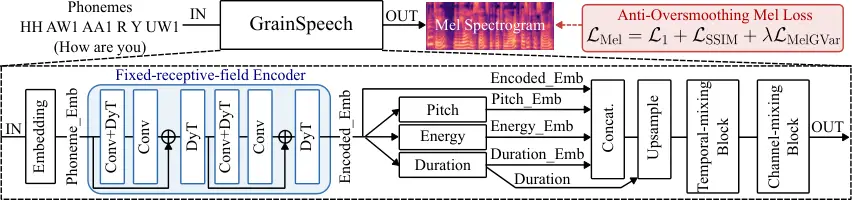
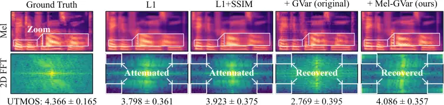

# GrainSpeech: Less Context, More Detail for Compact Speech Synthesis

Zitao
Liang[](https://orcid.org/0009-0009-1802-4215)
   Chang
Gao[](https://orcid.org/0000-0002-3284-4078)\sthanksCorresponding
author: Chang Gao  
Email: zitaoliang@tudelft.nl, Chang.Gao@tudelft.nl

###### Abstract

Compact acoustic models face a challenging quality–capacity trade-off.
We investigate two factors in this regime: encoder context and
Mel-spectrogram supervision. A receptive-field-scaling study shows that
expanding self-attention beyond 15 phonemes provides no consistent gains
in pitch, energy, or duration prediction. Guided by this finding, we
introduce a fixed-receptive-field convolutional encoder that reduces the
respective prediction errors by 36.0%, 17.3%, and 3.4%. We further show
that directly transferring image-domain gradient-variance supervision
restores fine-scale variation but degrades predicted quality, motivating
a Mel-specific formulation with axis-specific gradients, overlapping
local statistics, and log-domain variance matching. GrainSpeech contains
only 264.8K parameters and achieves 17.9$`\times`$ real-time Mel
generation on a microcontroller (MCU), while attaining UTMOS scores
comparable to substantially larger models with less than 1.5% of their
parameters. Source code and demos are available at
[https://github.com/lab-emi/GrainSpeech](https://github.com/lab-emi/GrainSpeech).

###### Index Terms: 

speech synthesis, MCU, context window, oversmoothing, gradient-variance
loss

^(†)^(†)address: Department of Microelectronics, Delft University of
Technology, The Netherlands

## 1 Introduction

A common neural text-to-speech (TTS) system uses an acoustic model to
map text to a Mel spectrogram and a neural vocoder to reconstruct the
waveform \[12, 6\]. However, many high-quality acoustic models contain
millions of parameters, limiting deployment on memory- and
computation-constrained devices \[12, 15, 9\]. EfficientSpeech (ES)
demonstrated a compact acoustic model with approximately 266K
parameters \[2\], showing the feasibility of highly compact acoustic
modeling. Under such tight capacity constraints, maintaining synthesis
quality remains challenging.

We focus on two potential bottlenecks in compact acoustic modeling.
First, the role of encoder context has not been well isolated.
Self-attention encoders commonly provide broad phoneme context  \[12,
2\], while convolutional alternatives have also shown strong performance
in acoustic-feature prediction  \[15, 16\]. However, prior comparisons
typically differ in both encoder architecture and accessible context,
making the contribution of each factor difficult to isolate. Second,
Mel-spectrogram over-smoothing can degrade synthesized speech
quality \[13, 5\]. Pointwise $`L_{1}`$ supervision is prone to this
problem, while structural objectives such as SSIM improve local
reconstruction but do not explicitly supervise fine-grained variation
 \[16, 17\]. Gradient variance (GVar) provides local-variation
supervision \[1\], but its original formulation is designed for spatial
image structure.

To address these issues, we propose GrainSpeech, a 264.8K-parameter
acoustic model with a fixed-receptive-field convolutional encoder and
Mel-adapted GVar supervision. Our main contributions are:

- •
  A receptive-field study separates context from architecture:
  self-attention beyond 15 phonemes gives no consistent gain, and a
  parameter-matched fixed-receptive-field convolutional encoder reduces
  pitch, energy, and duration errors by 36.0%, 17.3%, and 3.4%.
- •
  We propose Mel-GVar, which adapts image-domain gradient-variance
  supervision to Mel spectrograms via axis-specific gradients,
  overlapping local statistics, and log-domain variance matching. Direct
  transfer degrades UTMOS to 2.769, whereas Mel-GVar raises it to 4.086.
- •
  GrainSpeech, having only 264.8K parameters, improves UTMOS by 0.496
  over ES-Tiny at the same budget and is statistically on par with
  MixerTTS with 75.7$`\times`$ fewer parameters, while generating Mel at
  17.9$`\times`$ real time on an STM32H747XI MCU.



Figure 1: GrainSpeech architecture with a fixed-receptive-field encoder,
and an anti-oversmoothing Mel loss.

## 2 PROPOSED METHOD

### 2.1 System Overview

Figure 1 illustrates GrainSpeech, where a fixed-receptive-field
convolutional encoder predicts pitch, energy, and duration from the
phoneme sequence. The predicted features are embedded, concatenated with
the encoder output, and upsampled according to duration before being
processed by dilated temporal mixing \[6\] and a channel-mixing
bottleneck MLP to generate the Mel spectrogram. Training uses the
anti-oversmoothing Mel objective in Section 2.3.

### 2.2 Fixed-Receptive-Field Encoder

To examine the role of encoder receptive field in acoustic-feature
prediction, we construct a single-block self-attention encoder based on
EfficientSpeech \[2\]. We define $`W`$ as the encoder receptive field on
the original phoneme sequence and control it using symmetric attention
masks. Here, $`W`$ refers only to the encoder; downstream
acoustic-feature predictors further expand the context equally across
all variants.

Motivated by this context study, we construct a fixed-receptive-field
convolutional encoder for matched-context comparison and the final
GrainSpeech model. As shown in Fig. 1, it consists of a phoneme
embedding layer followed by stacked residual convolutional blocks, with
dilation schedules chosen to realize different $`W`$ values. This allows
attention and convolutional encoders to be compared under the same
accessible phoneme context. Following prior work, LayerNorm is replaced
with DynamicTanh (DyT) in the convolutional blocks  \[18, 3\].

### 2.3 Anti-Oversmoothing Mel Loss

Mel-spectrogram over-smoothing suppresses fine-grained acoustic
variation and can degrade synthesized speech quality  \[13\]. To
explicitly supervise these local variations, we adapt the
gradient-variance (GVar) objective originally proposed for image
super-resolution \[1\]. The original GVar uses Sobel gradients,
non-overlapping spatial patches, and raw-domain $`L_{2}`$ variance
matching. Since Mel spectrograms represent time and Mel frequency rather
than two spatial dimensions, we retain the local gradient-variance
principle while adapting three components: (1) axis-wise first-order
differences replace Sobel filtering to characterize temporal and
spectral variations; (2) sliding $`11\times 5`$ neighborhoods replace
non-overlapping patches to provide overlapping local statistics; and (3)
log-domain $`L_{1}`$ matching replaces raw-domain $`L_{2}`$ matching to
compare relative rather than absolute variance discrepancies.

Let $`\widehat{\mathbf{M}},\mathbf{M}\in\mathbb{R}^{T\times F}`$ denote
the predicted and reference Mel spectrograms. We define

```math
\displaystyle G_{t}(\mathbf{M})_{t,f} \displaystyle=\mathbf{M}_{t+1,f}-\mathbf{M}_{t,f}, \tag{1}
```

```math
\displaystyle G_{f}(\mathbf{M})_{t,f} \displaystyle=\mathbf{M}_{t,f+1}-\mathbf{M}_{t,f}.
```

Let
$`S_{d}(\mathbf{M})=\log(\operatorname{LVar}_{11\times 5}(G_{d}(\mathbf{M}))+10^{-6})`$,
where $`\operatorname{LVar}_{11\times 5}`$ is population variance over
unit-stride time$`\times`$Mel-frequency windows, excluding padded
elements. We define

```math
\mathcal{L}_{\mathrm{MelGVar}}=\frac{1}{2}\sum_{d\in\{t,f\}}\|S_{d}(\widehat{\mathbf{M}})-S_{d}(\mathbf{M})\|_{1,\Omega}, \tag{2}
```

where $`\Omega`$ denotes valid non-padded positions.

The Mel objective is
$`\mathcal{L}_{\mathrm{Mel}}=\mathcal{L}_{1}+\mathcal{L}_{\mathrm{SSIM}}+\lambda\mathcal{L}_{\mathrm{MelGVar}}`$.

Figure 2: Effects of encoder receptive field and architecture on
acoustic-feature prediction. MSE denotes mean squared error.

## 3 Experiments

### 3.1 Experimental Setup

We use LJSpeech \[4\], with 12,588 utterances for training and the
remaining 512 split into 384 validation and 128 evaluation utterances.
All variants use the same training seed and are evaluated after 5,000
epochs. Phonemes and durations are obtained from forced-alignment
TextGrids \[8\]. WORLD \[10\] pitch and energy are averaged by phoneme
and normalized over the training set. Audio is sampled at 22.05 kHz and
converted to 80-bin Mel spectrograms using a 1,024-point FFT and window,
a hop length of 256, and a 0–8 kHz frequency range. Our models are
trained from scratch using AdamW with batch size 128, learning rate
$`10^{-3}`$, weight decay $`10^{-5}`$, 50 warm-up epochs, and cosine
decay.

All synthesized Mels are vocoded using the same HiFi-GAN-v2 \[6\].
Speech quality is evaluated using UTMOS \[14\]. Intelligibility is
measured by WER using Whisper-large-v3 \[11\] with fixed greedy decoding
and identical English text normalization for all systems. Spectral
distortion is measured by MCD-DTW \[7\] using 24-dimensional
mel-cepstral coefficients ($`c_{1}`$–$`c_{24}`$, $`\alpha=0.455`$)
extracted from WORLD spectral envelopes at a 5-ms frame shift and
aligned by dynamic time warping. WER and MCD-DTW are evaluated on the
same 128 utterances, with 95% confidence intervals obtained from 10,000
shared-index bootstrap replicates.

### 3.2 Encoder Receptive Field and Architecture Study

To separate the effects of encoder context and architecture, we compare
parameter-matched attention and convolutional encoders while keeping all
downstream components and the Mel objective unchanged. For attention, we
evaluate $`W\in\{5,9,11,15,19,25,\infty\}`$, where $`W=\infty`$ denotes
global context; for convolution, we evaluate $`W\in\{9,11,15,19,25\}`$.
The two encoders contain 147,368 and 147,428 parameters, respectively.
$`W=15`$ is selected based on validation acoustic-feature errors and is
used for the final GrainSpeech.

As shown in Fig. 2, expanding the attention receptive field beyond
$`W=15`$ provides no consistent improvement in pitch, energy, or
duration prediction, indicating limited benefit from additional encoder
context under this setting. At matched receptive fields, the
convolutional encoder achieves lower MSE across all three tasks and all
shared $`W`$ values. At $`W=15`$, it reduces pitch, energy, and duration
MSE by 36.0%, 17.3%, and 3.4%, respectively. These results show that the
convolutional encoder provides more effective acoustic-feature
prediction under a matched parameter budget.



Figure 3: Mel spectrograms and normalized 2D Fourier spectra for
GrainSpeech under different Mel losses. Values are mean ± std over 128
evaluation utterances.

### 3.3 Oversmoothing Analysis and Loss Ablation

We use the SSIM formulation and settings of  \[16\]. For the
original-GVar baseline, we use the original Sobel-gradient,
non-overlapping-patch, and raw-domain $`L_{2}`$ formulation  \[1\], with
$`\lambda_{\mathrm{GVar}}=0.01`$ following the official implementation.
Our Mel-GVar uses $`\lambda_{\mathrm{GVar}}=0.5`$.

For visualization, we mean-center each Mel spectrogram, apply a 2D Hann
window, and compute its normalized 2D Fourier power spectrum. Figure 3
compares the same utterance under four Mel objectives. Relative to the
ground truth, $`L_{1}`$ predictions exhibit smoother Mel patterns and
attenuated energy in the corners of the 2D spectrum. Adding SSIM
improves UTMOS from 3.798 to 3.923, but the corner-region attenuation
remains visible.

Directly applying the original image-domain GVar restores substantial
corner-region spectral energy and fine-scale variation, but introduces
visible horizontal discontinuities that perturb the high-energy
structures of the Mel spectrogram and reduces UTMOS to 2.769. This
contrast suggests that recovering fine-scale variation alone is
insufficient; the recovered variation should also preserve coherent
time–frequency structure. In comparison, the proposed Mel-GVar restores
fine-scale variation while maintaining more continuous Mel structures
and increases UTMOS to 4.086, the highest among the evaluated
objectives. These results support adapting the image-domain GVar
formulation to Mel spectrograms.

To examine whether the proposed Mel objective is specific to the
GrainSpeech architecture, we apply it to ES-Tiny. It improves ES-Tiny
UTMOS from 3.591 to 3.945 and MCD-DTW from 6.374 to 6.350, while WER
remains similar (3.08% vs. 3.13%). These gains suggest that its benefit
is not specific to the proposed encoder.

| Model                             | Params. $`\downarrow`$ | Size vs. ours   | UTMOS $`\uparrow`$         | WER (%) $`\downarrow`$ | MCD-DTW (dB) $`\downarrow`$ |
| --------------------------------- | ---------------------- | --------------- | -------------------------- | ---------------------- | --------------------------- |
| GrainSpeech (this work)           | 0.265M                 | 1$`\times`$     | 4.086 \[4.020, 4.148\]     | 3.27 \[2.32, 4.32\]    | 6.314 \[6.255, 6.374\]      |
| ES-Tiny \[2\] + our Mel-GVar loss | 0.266M                 | 1.0$`\times`$   | 3.945 \[3.872, 4.016\]     | 3.13 \[2.11, 4.31\]    | 6.350 \[6.285, 6.419\]      |
| ES-Tiny \[2\]                     | 0.266M                 | 1.0$`\times`$   | 3.591 \[3.522, 3.658\]     | 3.08 \[2.08, 4.23\]    | 6.374 \[6.314, 6.439\]      |
| ES-Small \[2\]                    | 0.952M                 | 3.6$`\times`$   | 3.885 \[3.820, 3.949\]     | 3.13 \[2.23, 4.15\]    | 6.286 \[6.231, 6.344\]      |
| ES-Base \[2\]                     | 3.953M                 | 14.9$`\times`$  | 3.900 \[3.836, 3.963\]     | 3.50 \[2.53, 4.57\]    | 6.183 \[6.120, 6.250\]      |
| SpeedySpeech \[16\]               | 4.306M                 | 16.2$`\times`$  | 3.716 \[3.663, 3.769\]     | 4.19 \[3.18, 5.29\]    | 6.352 \[6.285, 6.421\]      |
| MatchaTTS \[9\]                   | 18.204M                | 68.7$`\times`$  | 4.264 \[4.225, 4.300\]     | 1.98 \[1.31, 2.73\]    | 5.597 \[5.548, 5.653\]      |
| MixerTTS \[15\]                   | 20.060M                | 75.7$`\times`$  | 4.087^(†) \[4.030, 4.142\] | 1.80 \[1.12, 2.59\]    | 5.374 \[5.327, 5.426\]      |
| FastSpeech 2 \[12\]               | 35.159M                | 132.7$`\times`$ | 3.953 \[3.889, 4.015\]     | 2.85 \[1.95, 3.84\]    | 5.935 \[5.867, 6.008\]      |
| Ground Truth                      | –                      | –               | 4.366 \[4.340, 4.389\]     | 1.98 \[1.28, 2.77\]    | –                           |

Table 1: Model size and objective quality on 128 evaluation utterances;
brackets are 95% CIs from 10,000 utterance-level bootstrap replicates.
“Size vs. ours” is the parameter count relative to GrainSpeech.
  GrainSpeech (this work);   ES-Tiny retrained with our Mel-GVar loss
only. ^(†)UTMOS CI overlaps with GrainSpeech at 75.7$`\times`$ the
parameters.

| Model                   | mRTF $`\uparrow`$ | $`\Delta`$UTMOS $`\uparrow`$ | SRAM $`\downarrow`$ |
| ----------------------- | ----------------- | ---------------------------- | ------------------- |
| GrainSpeech (this work) | 17.9              | $`-0.036`$                   | 483.19 KiB          |
| ES-Tiny \[2\]           | 17.2              | $`-0.079`$                   | 478.59 KiB          |
| ES-Small \[2\]          | –                 | $`\mathbf{-0.019}`$          | Out-of-Mem.         |

Table 2: A16W8 MCU deployment on an STM32H747XI. A16W8 denotes 16-bit
activations and 8-bit weights; mRTF is generated duration divided by
acoustic-model inference time; $`\Delta`$UTMOS is the change from FP32;
SRAM is peak usage.

### 3.4 Overall Comparison

Table 1 compares model size and objective quality on the 128 evaluation
utterances with a common vocoder and evaluation pipeline. At the ES-Tiny
parameter budget, GrainSpeech improves UTMOS by 0.496 (paired-bootstrap
95% CI: \[0.431, 0.562\]) with a close WER (3.27% vs. 3.08%) and
slightly lower MCD-DTW (6.314 vs. 6.374). The two shaded rows separate
the sources of this gain: our Mel-GVar loss alone lifts ES-Tiny from
3.591 to 3.945 UTMOS, and the encoder adds a further 0.141 under the
same objective (paired-bootstrap 95% CI: \[0.077, 0.204\]).

GrainSpeech attains the highest UTMOS below 5M parameters and is
statistically indistinguishable from MixerTTS (4.086 vs. 4.087,
overlapping CIs) with 75.7$`\times`$ fewer parameters; only MatchaTTS
scores higher, at 68.7$`\times`$ the size. The 18–35M-parameter models
still obtain lower WER and MCD-DTW.

Table 2 reports A16W8 deployment on an STM32H747XI (480 MHz Cortex-M7,
1 MB SRAM). GrainSpeech generates Mel spectrograms at 17.9$`\times`$
real time within 483.19 KiB peak SRAM, matching the ES-Tiny footprint
within 1% at slightly higher throughput, and loses only 0.036 UTMOS to
quantization versus 0.079 for ES-Tiny. ES-Small already exceeds the
available SRAM, so the quality gain is obtained within the largest ES
footprint that fits this MCU.

## 4 Discussion

Two caveats apply to Table 1: evaluation relies on automatic metrics on
LJSpeech, so listening tests and broader datasets are needed to confirm
the UTMOS gains; and the external checkpoints use their native data
splits, training settings, and frontends, so their rows are reference
points rather than controlled comparisons, whereas the ES-Tiny rows
share our pipeline. The context study is specific to the evaluated
architecture and training setting and does not establish a universal
receptive-field requirement. Mel-GVar constrains local variation
statistics rather than exact detail locations, so recovered details need
not match the reference point by point; its three adaptations are
evaluated jointly, and their individual contributions remain to be
isolated. Finally, Table 2 covers Mel generation only; end-to-end
deployment including vocoding is beyond our scope.

## 5 Conclusion

We presented GrainSpeech, a 264.8K-parameter acoustic model. Under our
experimental setting, additional self-attention encoder context beyond
15 phonemes provides no consistent benefit, while the matched-context
convolutional encoder improves acoustic-feature prediction. Our Mel-GVar
restores fine-grained variation while avoiding the quality degradation
observed with direct transfer of the image-domain objective. At the
ES-Tiny budget, GrainSpeech raises UTMOS from 3.591 to 4.086,
statistically comparable to MixerTTS with 75.7$`\times`$ fewer
parameters, and generates Mel at 17.9$`\times`$ real time within 483 KiB
of SRAM on an STM32H747XI MCU.

## 6 Compliance with Ethical Standards

This study uses the publicly available LJSpeech dataset \[4\]. No
participants were recruited, no new recordings were collected, and no
human listening tests or animal experiments were conducted.

## 7 Acknowledgments

This work was partially supported by the Dutch Research Council (NWO)
under the Talent Programme Veni 2023 scheme in Applied and Engineering
Sciences (AES), Grant No. 21132 (Energy-Efficient Real-Time Edge
Intelligence for Wearable Healthcare Devices). The authors declare no
conflicts of interest.

## References

- \[1\] L. Abrahamyan, A. M. Truong, W. Philips, and N.
  Deligiannis (2022) Gradient variance loss for structure-enhanced image
  super-resolution. In Proc. IEEE Int. Conf. Acoustics, Speech and
  Signal Processing (ICASSP), pp. 3219–3223. External Links:
  [Document](https://dx.doi.org/10.1109/ICASSP43922.2022.9747387) Cited
  by: §1, §2.3, §3.3.
- \[2\] R. Atienza (2023) Efficientspeech: an on-device text to speech
  model. In ICASSP 2023-2023 IEEE International Conference on Acoustics,
  Speech and Signal Processing (ICASSP), pp. 1–5. Cited by: §1, §1,
  §2.2, Table 1, Table 1, Table 1, Table 1, Table 2, Table 2.
- \[3\] A. de Beer and C. Gao (2026) SlimTTS: parameter- and
  compute-efficient neural text-to-speech synthesis for real-time
  inference. In 2026 IEEE International Symposium on Circuits and
  Systems (ISCAS), Vol. , pp. 4588–4592. External Links:
  [Document](https://dx.doi.org/10.1109/ISCAS66217.2026.11561979) Cited
  by: §2.2.
- \[4\] K. Ito and L. Johnson (2017) The lj speech dataset. Note:
  [https://keithito.com/LJ-Speech-Dataset/](https://keithito.com/LJ-Speech-Dataset/)
  Cited by: §3.1, §6.
- \[5\] F. Kögel, B. Nguyen, and F. Cardinaux (2023) Towards robust
  fastspeech 2 by modelling residual multimodality. arXiv preprint
  arXiv:2306.01442. Cited by: §1.
- \[6\] J. Kong, J. Kim, and J. Bae (2020) Hifi-gan: generative
  adversarial networks for efficient and high fidelity speech synthesis.
  Advances in neural information processing systems 33, pp. 17022–17033.
  Cited by: §1, §2.1, §3.1.
- \[7\] R. Kubichek (1993) Mel-cepstral distance measure for objective
  speech quality assessment. In Proceedings of IEEE pacific rim
  conference on communications computers and signal processing, Vol. 1,
  pp. 125–128. Cited by: §3.1.
- \[8\] M. McAuliffe, M. Socolof, S. Mihuc, M. Wagner, and M.
  Sonderegger (2017) Montreal forced aligner: trainable text-speech
  alignment using kaldi. In Proc. Interspeech 2017, pp. 498–502. Cited
  by: §3.1.
- \[9\] S. Mehta, R. Tu, J. Beskow, É. Székely, and G. E. Henter (2024)
  Matcha-tts: a fast tts architecture with conditional flow matching. In
  ICASSP 2024-2024 IEEE International Conference on Acoustics, Speech
  and Signal Processing (ICASSP), pp. 11341–11345. Cited by: §1, Table
  1.
- \[10\] M. Morise, F. Yokomori, and K. Ozawa (2016) WORLD: a
  vocoder-based high-quality speech synthesis system for real-time
  applications. IEICE TRANSACTIONS on Information and Systems 99 (7),
  pp. 1877–1884. Cited by: §3.1.
- \[11\] A. Radford, J. W. Kim, T. Xu, G. Brockman, C. McLeavey, and I.
  Sutskever (2023) Robust speech recognition via large-scale weak
  supervision. In International conference on machine learning,
  pp. 28492–28518. Cited by: §3.1.
- \[12\] Y. Ren, C. Hu, X. Tan, T. Qin, S. Zhao, Z. Zhao, and T.
  Liu (2020) Fastspeech 2: fast and high-quality end-to-end text to
  speech. arXiv preprint arXiv:2006.04558. Cited by: §1, §1, Table 1.
- \[13\] Y. Ren, X. Tan, T. Qin, Z. Zhao, and T. Liu (2022) Revisiting
  over-smoothness in text to speech. In Proceedings of the 60th Annual
  Meeting of the Association for Computational Linguistics (Volume 1:
  Long Papers), pp. 8197–8213. Cited by: §1, §2.3.
- \[14\] T. Saeki, D. Xin, W. Nakata, T. Koriyama, S. Takamichi, and H.
  Saruwatari (2022) Utmos: utokyo-sarulab system for voicemos challenge 2022. arXiv preprint arXiv:2204.02152. Cited by: §3.1.
- \[15\] O. Tatanov, S. Beliaev, and B. Ginsburg (2022) Mixer-tts:
  non-autoregressive, fast and compact text-to-speech model conditioned
  on language model embeddings. In ICASSP 2022-2022 IEEE International
  Conference on Acoustics, Speech and Signal Processing (ICASSP),
  pp. 7482–7486. Cited by: §1, §1, Table 1.
- \[16\] J. Vainer and O. Dušek (2020) Speedyspeech: efficient neural
  speech synthesis. arXiv preprint arXiv:2008.03802. Cited by: §1, §3.3,
  Table 1.
- \[17\] Z. Wang, A. C. Bovik, H. R. Sheikh, and E. P. Simoncelli (2004)
  Image quality assessment: from error visibility to structural
  similarity. IEEE Transactions on Image Processing 13 (4), pp. 600–612.
  External Links: [Document](https://dx.doi.org/10.1109/TIP.2003.819861)
  Cited by: §1.
- \[18\] J. Zhu, X. Chen, K. He, Y. LeCun, and Z. Liu (2025)
  Transformers without normalization. In 2025 IEEE/CVF Conference on
  Computer Vision and Pattern Recognition (CVPR), pp. 14901–14911. Cited
  by: §2.2.
