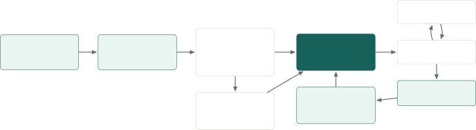
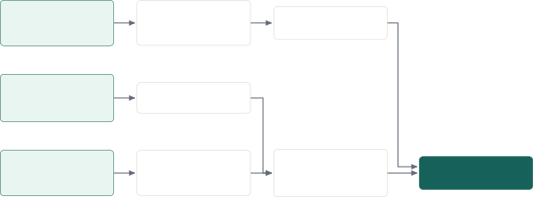
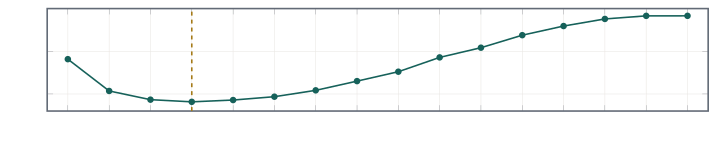
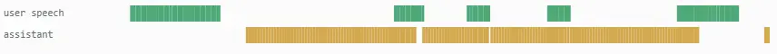

# Voice-Light: A Full-Duplex Cascaded Voice Agent with Causal Turn-Taking and Speculative Generation

Bertil Braun
Email: [](mailto:)[contact@bertil-braun.de](mailto:contact@bertil-braun.de)

###### Abstract

Natural spoken interaction requires more than streaming ASR, language
generation, and speech synthesis: a system must react to overlap without
canceling on every acknowledgment, prepare a response before a turn is
certain, and ensure canceled audio cannot enter conversation history. We
present Voice-Light, a full-duplex cascaded voice agent that combines
immediate acoustic onset, a causal adapter sharing a streaming ASR
encoder, reversible playback control, and private speculative response
generation. Structured tool calls execute concurrently with audible
bridge speech, while browser acknowledgments make rendered audio
authoritative for durable history. Locked evaluation on 1,673
real-conversation silence candidates found that an earlier learned
completion checkpoint preserved a 2.70% false-cutoff rate but reached
only 12.53% end-of-turn recall, compared with 95.60% for a Silero timing
policy. The deployed system therefore retains a hybrid controller rather
than claiming a learned-policy replacement. Across three unscripted
operator-run microphone sessions, 36 measured response turns had a 758
ms median from final VAD endpoint to first server audio; 21 turns were
below 800 ms. These sessions are an instrumented case study, not a
controlled user evaluation. We release the synthetic data, model
artifacts, evaluation code and summaries, source code, and deployment
configuration supporting the result.

Keywords: streaming voice agents, turn-taking, synthetic data, causal
streaming inference, speech synthesis, tool use, deployment

## 1  Introduction

A conventional voice assistant is often drawn as a serial pipeline:
automatic speech recognition (ASR), then a language model, then
text-to-speech (TTS). That abstraction hides the interaction problem. A
usable conversational system must decide whether a silence is a
completed turn or a within-turn hesitation; react immediately when
speech begins during playback without canceling on every short
acknowledgment; ensure canceled audio cannot reappear; and distinguish
generated text from speech that actually reached the listener.

Here, _full duplex_ means that microphone ingestion continues during
assistant playback, playback can react reversibly to detected user
speech, and generation, synthesis, and acknowledged audio are managed
concurrently.

Voice-Light retains a cascaded architecture because its boundaries
expose typed tools, playback state, and cancellation. Its central design
rule is that uncertain work may begin early, but it may become audible
or durable only after explicit causal checks. This rule connects three
otherwise separate problems: turn inference must not inspect future
audio, speculative generation must remain private until promotion, and
conversation history must contain only speech acknowledged by the
listener’s browser.

The study asks three questions. First, can a small causal adapter reuse
features from a persistent streaming ASR encoder and improve turn
commitment over deployable timing baselines? Second, can a reversible
controller exploit uncertain evidence without turning every VAD onset
into cancellation? Third, how much response latency can private
speculation hide in a deployed ASR–LLM–TTS cascade?

The paper makes four scoped contributions:

- •
  a shared-encoder causal turn-taking adapter, together with locked
  evaluations that report both the learned signal and its failure to
  replace stronger timing baselines;
- •
  a typed hybrid controller for reversible ducking, floor-taking
  interruption, backchannel resumption, stale-generation rejection, and
  audible-only history;
- •
  private speculative generation integrated with streaming ASR, Qwen,
  Kyutai TTS, and sequential tool rounds in a public scale-to-zero
  deployment; and
- •
  released synthetic tool-use and turn-taking corpora, trained
  artifacts, evaluation code and result summaries, and an instrumented
  36-turn latency case study.

The contributions are systems and evaluation contributions. The paper
does not claim that the adapter is a new state of the art, that
synthetic evaluation measures general tool competence, or that the
microphone sessions estimate population-level interaction quality.



Figure 1: Production runtime. Immediate acoustic reaction and learned
interaction evidence meet at a typed controller. Tool calls and results
use a structured loop; acknowledged browser playback is authoritative
for durable assistant history.

## 2  Related work

#### Turn-taking and endpointing.

TurnGPT predicts turn completion from text \[3\]; Voice Activity
Projection (VAP) predicts future speaker activity directly from
conversational audio \[4\]; and acoustic–language-model fusion shows
that lexical and prosodic evidence can be complementary \[5\]. Recent
turn benchmarks further emphasize that endpointing, backchannels, and
interruption vary with conversation type \[6, 7\]. Voice-Light does not
propose a general turn-taking architecture. It asks whether a small
causal adapter can share the encoder already used for streaming ASR and
whether its evidence remains useful after a locked comparison with
complete deployable policies.

#### Full-duplex spoken agents.

End-to-end systems such as Moshi jointly model user and assistant speech
and avoid explicit ASR–LLM–TTS boundaries \[8\]. A cascade instead
exposes intermediate text, typed tools, playback state, and component
failures. Voice-Light uses those boundaries to make overlap reversible,
reject stale work, and construct history from acknowledged audio. Its
latency results are system measurements and are not directly comparable
with model-internal latency reported for end-to-end architectures.
Speculative end-turn detection has also combined local and remote
detectors \[9\]; here, _speculation_ means privately preparing
downstream text and PCM before a final turn commitment.

#### Synthetic tool use.

Toolformer and ToolLLM construct supervision for API selection and
multi-step execution \[10, 11\]. The Voice-Light tool branch addresses a
narrower spoken protocol: short audible bridges, causally ordered
call/result records, sequential calls, and suppression of protocol
markup. Its shared-generator holdout measures acquisition of that
protocol, not general tool use or factual retrieval.

## 3  System overview

Figure 1 shows the deployed data path. The browser streams 16 kHz
microphone PCM over one WebSocket and acknowledges rendered audio
ranges. Silero provides the earliest acoustic onset signal. A persistent
Nemotron worker produces streaming transcripts and exposes selected
encoder layers to the causal adapter without loading a second speech
backbone. The controller combines those signals with transcript
revisions, playback state, and conservative deadlines. Qwen generates
speech and typed calls; Kyutai TTS \[17\] synthesizes only text released
by the controller.

Four invariants define the system. All learned turn features are causal
and share the ASR stream. Speech onset may duck or pause playback
immediately, but only stronger lexical, learned, or timeout evidence
commits cancellation. Speculative text and PCM carry generation
identifiers and remain private until transcript and turn checks promote
them. Finally, generated assistant text becomes durable conversation
context only to the extent that browser acknowledgments show it was
audible.

## 4  Training data

The project produced two model-training branches. The language-model
branch generated typed spoken-tool conversations for a Qwen adapter. The
turn-taking branch combined synthetic interaction timelines with
automatically prepared human conversations for a causal speech adapter.
Figure 2 shows where the branches remain separate and where they meet
the deployed system.



Figure 2: Two model-training branches feed one evaluated deployment. The
turn-taking branch combines synthetic interaction timelines with
separately prepared human evidence; the language-model branch uses
synthetic typed conversations.

### 4.1 Synthetic spoken tool use

Spoken tool use was treated as a data and protocol problem rather than a
prompt-only feature. A pinned Qwen3.6-27B-FP8 teacher generated
provider-neutral records for natural conversation, drafting,
brainstorming, search, calculation, time queries, sequential calls, and
correction or recovery. The published corpus contains 3,999
conversations, 11,810 user messages, 15,308 assistant messages, and
3,498 structured calls across search, calculate, and get_time. It is
available through the project collection on Hugging Face \[27\].

Generation used a causal conversation state machine. The teacher
produced a user turn and then either assistant speech or speech followed
by a typed call. The controller executed or synthesized the result,
appended the linked call and result, and only then requested the next
assistant step. Calculator and time results were deterministic.
Synthetic search results came from the teacher, not the live web;
consequently, the corpus teaches call ordering and grounding to supplied
text, not factual retrieval quality.

The canonical JSONL is semantic rather than tokenized. It stores runtime
tool definitions, audible assistant text, typed calls, stable
identifiers, outcomes, later turns, split metadata, provenance, and
hashes. The run pins the teacher revision, prompt revision, source
commit, scenario seeds, quantization, and time anchor. Structural checks
retained schema validity, causal call/result order, deterministic tool
checks, spoken-length limits, and protocol-leak detection. Subjective
teacher-based rejection was disabled after manual review found its false
positives counterproductive.

### 4.2 Synthetic conversational turn-taking audio

The second generator models coherent conversation timelines rather than
isolated completion utterances. Typed plans distinguish five semantic
conditions: genuine user completion, a HOLD pause followed by
continuation, non-floor feedback during assistant speech, a response
after the assistant yields, and deliberate interruption. The plan also
contains ordinary event-free user, assistant, and silence spans.

Only user audio is synthesized. Virtual assistant text keeps the
scenario coherent and estimates assistant duration, but assistant
waveform never becomes an input artifact. The runtime-relevant
assistant-speaking probability is compiled as a causal state curve with
ramps, dips, and bounded noise. This prevents future assistant state or
clean synthetic timing from leaking into the adapter.

The accepted rendering route used Qwen VoiceDesign references to
condition CosyVoice 3 zero-shot voices \[19, 18\]. Each user unit was
rendered and trimmed independently; the compiler then measured its
active speech, assembled the final timeline, and rasterized 20-second
views into 250 frames at 80 ms. A planned pause became HOLD supervision
only if the rendered unit contained at least 500 ms of silence followed
by resumed speech.

The public synthetic repository \[30\] stores lossless speech units and
reconstruction metadata rather than duplicating every composed waveform.
Plans, voice provenance, trim measurements, composition seeds, split
assignments, and checksums allow conversation audio and training crops
to be rebuilt. The retained V4 and V5 manifests contain 1,092 and 1,097
timelines, approximately 21.84 and 21.80 hours of source timeline
respectively. These counts describe retained run manifests, not a claim
that synthetic interaction validation substitutes for natural
conversation.

### 4.3 Automatic preparation of human conversations

The human pipeline separates three artifact layers: authorized source
audio, recording-level evidence, and materialized training windows. Each
complete speaker track is stored once as lossless FLAC. Typed Parquet
rows reference bounded 20-second intervals and contain aligned inputs,
targets, and masks; they do not duplicate the recording.

Ingestion registers and hashes both channels, reuses exact cached
transcripts, transports only missing material, applies a reviewed
inter-speaker offset, and persists a full-duration annotation and
quality result transactionally. Multiple ASR and activity systems
provide independent evidence for consensus alignment, channel-aware
crosstalk filtering, conversation regions, and quality flags. Supplied
TurnBench annotations remain an independent evidence source rather than
being copied into model-output fields to manufacture agreement.

The completed preparation pass accepted eight MagicHub conversations
(about 2.77 hours) \[20\] and 37 Mundo TurnBench conversations (about
7.31 hours) \[6\]; a silent TurnBench recording was excluded. These
additions joined previously prepared authorized conversational material.
The locked corpus manifest records 107 accepted conversations totaling
36.3 hours across conversation-disjoint train, validation, and test
splits. A manual pipeline-validation audit reviewed 12
dataset-stratified recordings and applied targeted exclusions; broader
corpus quality was tracked through the automated evidence pipeline.

| Material                       | Conversations | Hours |
| ------------------------------ | ------------- | ----- |
| MagicHub                       | 8             | 2.77  |
| TurnBench                      | 37            | 7.31  |
| Additional authorized material | 62            | 26.22 |
| Total                          | 107           | 36.30 |

Table 1: Human conversational material in the locked corpus manifest.
Source audio remains subject to its original access terms; only derived
manifests and code are distributed by the project.

## 5  Model adaptation

### 5.1 A language adapter for spoken tools

The tool-use experiment fine-tuned Qwen/Qwen3-1.7B \[13\] with a BF16
rank-16 LoRA \[12\]. Two source records from each combination of eight
behavior families and five speech styles formed a balanced 80-record
validation split; the remaining 3,919 records were training data. Across
16 deterministic passes, every record appeared once per pass. Intact
short segments were regrouped into histories with 8–16 user turns,
producing 14,391 training histories and 17.84 million rendered tokens,
of which 6.86 million were assistant targets.

The native Qwen chat template rendered the canonical records with
thinking disabled. The loss mask retained ordinary assistant speech, the
spoken bridge preceding a call, structured call tokens, post-result
continuation, and later assistant turns. System text, tool definitions,
user messages, tool results, padding, and non-assistant protocol tokens
were masked. The adapter targeted all attention and MLP projections,
trained 17.43 million parameters, and completed 904 optimizer steps in
47 minutes on an RTX 4090.

The public deployment uses Qwen3-4B Instruct \[14\]; the trained 1.7B
LoRA remains a released experimental artifact \[28, 29\]. Section 6
reports why the synthetic protocol result was not treated as evidence of
general conversational quality.

### 5.2 A causal adapter on shared Nemotron features

The turn-taking model attaches approximately 183,000 trainable
parameters to the frozen Nemotron Speech Streaming 0.6B encoder \[16\].
Nemotron is a cache-aware streaming FastConformer-RNNT. Its activation
caches allow new non-overlapping chunks to reuse prior work \[1, 2\].
This property made it possible to share one streaming backbone between
ASR and turn inference rather than re-encoding a rolling waveform or
loading a second 0.6-billion-parameter model.

The adapter taps encoder layers 6, 12, 18, and 24. Each
1,024-dimensional tap is normalized and projected to 32 dimensions; the
streams are fused to 64 dimensions, processed by residual causal
depthwise-separable convolutions, combined with assistant-speaking
state, and passed through a single-layer 64-dimensional unidirectional
GRU. Separate heads emit completion/yield evidence, interaction events
including floor take and non-floor feedback, and future activity.
Convolution and recurrent state persist incrementally and reset with the
ASR stream.

Synthetic pretraining selected step 2,250. Human fine-tuning
warm-started those weights with a fresh optimizer, 15% synthetic replay,
and 1,884 human boundaries: 1,038 HOLD and 846 end-of-turn (EOT)
examples. The resulting 750-step checkpoint was selected on human
validation.

The final adapter-best.pt is step 750, with the pinned Nemotron revision
listed in Table 6, one lookahead token, 80 ms encoder frames, and the
four taps above. Human validation selected it; synthetic validation
could not. At runtime, forward hooks capture the exact features produced
by persistent streaming ASR. A bounded latest-value queue supersedes
stale adapter work, and loading or inference failure degrades the
predictor without stopping ASR or the voice session.

The offline protocols evaluate several checkpoints with different roles.
Section 6 keeps those roles explicit rather than transferring results
between artifacts.

## 6  Offline evaluation

### 6.1 Protocols and checkpoint lineage

The project uses separate evaluation protocols for separate claims.
Tool-use evaluation measures behavior on held-out synthetic conversation
states. Turn completion has two non-comparable protocols: the original
V1 benchmark scores future silence under a yield-oriented target and
opens a locked test split only after policy selection on validation,
whereas V2 scores semantic completion at speech boundaries. V2 stopped
at validation because no detector met its predefined deployment gate, so
its test split remained sealed. Deployment evidence is an operator-run
microphone case study, not a substitute for a controlled conversational
study.

| Checkpoint (step)           | Role and evidence                                   |
| --------------------------- | --------------------------------------------------- |
| Synthetic (2,250)           | Pretraining seed; synthetic and human validation    |
| Historical (3,500)          | V1 locked test and V2 validation                    |
| Human fine-tune (750)       | Deployed adapter; human validation and runtime only |
| Completion challenger (625) | Later experiment; V2 validation only                |

Table 2: Turn-adapter checkpoint lineage. Parenthesized values are
training steps. “Validation” and “test” name distinct locked
inventories; evidence is not transferred between artifacts.

### 6.2 Synthetic tool-protocol results

| Behavior                     | Base  | Fine-tuned |
| ---------------------------- | ----- | ---------- |
| Correct tool decision        | 80.0% | 95.2%      |
| Exact tool name              | 78.6% | 94.3%      |
| Valid argument schema        | 80.0% | 95.2%      |
| Concise 1–12-word bridge     | 7.6%  | 94.3%      |
| Correctly avoided a tool     | 70.0% | 100.0%     |
| Valid post-tool continuation | 98.3% | 100.0%     |

Table 3: Balanced synthetic holdout for Qwen3-1.7B. The same 160 states
were decoded with three seeds. Expected calls, no-tool states, and
continuations contribute 210, 90, and 180 repeated predictions
respectively; percentages therefore do not represent independent tasks.

The final adapter emitted 200/210 expected calls, 198/210 exact tool
names, 200/210 schema-valid arguments, 198/210 concise bridges, 90/90
correct no-tool responses, and 180/180 valid post-result continuations.
These descriptive gains demonstrate acquisition of the generator’s
conversational protocol. They do not establish factual accuracy, robust
web search, or general tool intelligence because evaluation points share
the training generator and schema.



Figure 3: Recorded assistant-token validation loss after each logical
pass. The directly comparable zero-update loss was 4.5398 and is omitted
to preserve resolution. Loss bottomed after pass 4, then rose even while
free-generation protocol metrics improved.

### 6.3 Causal turn-completion results

Synthetic pretraining exposed the transfer problem directly. Completion
AUROC was 0.9260 on 893 held-out synthetic examples but 0.5646 on 789
clean human validation labels. Human fine-tuning raised human AUROC to
0.5972. At its selected validation policy, the deployed step-750
checkpoint reached 65.04% EOT recall (426/655), 3.73% false cutoffs
(5/134 HOLD cases), and 2.0 s p95 commitment latency. These are
validation results, not locked-test results, and the head remained a
poor standalone probability estimator.

For the policy metrics below, a HOLD candidate is a silence followed by
continuation from the same speaker, while EOT denotes a completed user
turn. False cutoff is the fraction of HOLD candidates committed as EOT;
EOT recall counts completed turns committed before the timeout. Latency
measures the causal delay from the candidate boundary to commitment,
capped by the earlier of the timeout or the observed opportunity end.

The locked V1 test contains 1,673 causal silence candidates from 11
conversations, including only 37 HOLD cases. Threshold, minimum delay,
and timeout were selected on validation and frozen before test. Table 4
shows the central negative result: the Voice-Light checkpoint preserved
a low false-cutoff rate but crossed its learned threshold on only 205 of
1,636 EOT cases. Most turns therefore used the 800 ms timeout, and the
learned policy did not beat the Silero or LiveKit timing baselines. This
test evaluates historical step 3,500, not the deployed step-750 adapter.

The detectors do not score after identical amounts of silence.
Voice-Light emits its boundary score at 80 ms, Smart Turn at 240 ms,
LiveKit at 320 ms, and Silero updates a silence proxy on 32 ms chunks.
Comparisons therefore evaluate complete causal policies at their native
gates rather than isolating model quality under identical acoustic
evidence. The implementations are pinned to Silero VAD 6.2.1, Pipecat
Smart Turn v3.2, and LiveKit v1-mini \[21, 22, 23\].

| Metric                 | VL     | Silero | Smart  | LiveKit |
| ---------------------- | ------ | ------ | ------ | ------- |
| False cutoff           | 2.70%  | 2.70%  | 13.51% | 2.70%   |
| HOLD errors ($`n=37`$) | 1      | 1      | 5      | 1       |
| EOT recall             | 12.53% | 95.60% | 20.72% | 91.50%  |
| Mean latency           | 770 ms | 656 ms | 684 ms | 654 ms  |
| Threshold              | 0.90   | 0.05   | 0.95   | 0.15    |
| Minimum delay          | 560 ms | 640 ms | 80 ms  | 640 ms  |
| Timeout                | 800 ms | 800 ms | 800 ms | 800 ms  |

Table 4: Locked real-conversation test under the original V1
yield-target protocol. Mean latency includes timeout actions. VL is
historical Voice-Light step 3,500; policy values are threshold, minimum
delay, and timeout. Possible training-source overlap makes Smart Turn
contextual only.

The V2 semantic-completion validation inventory contains 1,005 soft
targets and 789 clean hard labels: 134 HOLD and 655 EOT examples, with
216 ambiguous cases excluded from hard scoring. Historical step 3,500
achieved AUROC 0.6866, 65.80% recall, 3.73% false cutoffs, and 2.0 s p95
latency. Its BCE of 0.6719 and Brier score of 0.1843 were worse than the
constant soft-prior baseline (0.5847 and 0.1453), despite above-chance
ranking. No swept detector met the joint gate of at most 5% false
cutoff, at least 70% recall, and at most 800 ms p95 latency, so the V2
test split remained sealed. A completion-primary retrain improved
calibration but still missed the gate; longer training reduced recall.

## 7  Streaming controller and deployment

### 7.1 Speculation and cancellation

After 80 ms of low Silero speech probability, the adapter receives
another 80 ms opportunity to open a speculative response candidate. If
learned evidence is not ready, a Silero fallback may start at 160 ms.
Candidate text and PCM remain private until final ASR and
transcript-revision checks permit promotion. Revisions limited to case,
punctuation, whitespace, or apostrophes preserve work; lexical change
invalidates it.

The system uses generation identifiers, cancellation barriers, and
rebased sample positions to reject stale text or PCM. Playback clocks
and boundary acknowledgements return every 80 ms. Durable assistant
history is constructed only from audio ranges that the browser confirms
it rendered; generated but canceled words remain diagnostic evidence
rather than conversation content.

### 7.2 Tool execution and speech boundaries

Structured tools support calculation, current time, and web search,
including sequential rounds. Tool execution can overlap with bridge
audio already buffered in the browser. Kyutai, however, requires text
lookahead. The bridge must therefore be closed before awaiting a tool
result, and the result begins a second TTS utterance within the same
assistant generation. Reusing one uninterrupted TTS session was
implemented and reverted because it could strand the last bridge words
until tool completion, producing a deterministic mid-preamble stall. The
final design avoids that stall but can retain a short acoustic seam at
the semantic boundary. Before synthesis, a narrow text-boundary filter
removes Markdown formatting, quotation marks, and emoji that Kyutai
would otherwise pronounce poorly; the durable generated text remains
unchanged.

A separate Qwen3-0.6B worker \[15\] summarizes web results so provider
output does not occupy the main conversation worker. Tavily latency
varied from approximately 234–408 ms in several calls to roughly
1.98–2.29 seconds in slower observations. External provider time is
therefore reported separately from first-response latency.

### 7.3 Hybrid overlap policy

Silero remains the immediate acoustic authority. When user speech begins
during assistant playback, the browser fades toward -15 dB over 450 ms
and pauses by 500 ms. This response is reversible: onset alone does not
discard generation. A floor-take probability above the configurable 0.82
threshold can commit interruption and cancellation. A non-floor-feedback
probability above 0.82 becomes actionable after the short speech burst
ends and resumes the same generation without adding a user turn.
Explicit stop, repair, question, or meaningful lexical evidence provides
another fast path.

Ambiguous overlap is bounded. Sustained speech commits floor taking
after 900 ms, while a short ended burst resolves conservatively as
non-floor feedback. Empty or slow final ASR receives a 120 ms grace
rather than parking playback indefinitely. Generation and TTS budgets
are held after 350 ms of unresolved overlap, and paused audio remains
resumable for at most 800 ms. A committed interruption rejects new
server PCM immediately and fades no more than 100 ms of already-buffered
audio.

The adapter catches up from bounded pre-roll after Silero detects user
activity, using the same persistent Nemotron stream once active. This
preserves one backbone and strict causality while limiting the acoustic
context available at the earliest overlap decision.

### 7.4 Two GPUs and scale to zero

Production requests a co-located pair of A10 GPUs, with an L40S pair as
the capacity fallback. GPU 0 runs Nemotron, the adapter, Qwen3-4B, and
the small search summarizer. GPU 1 is reserved for Kyutai. Moving
Nemotron beside Kyutai improved Qwen first-delta latency by roughly
25–30 ms but regressed Kyutai first-word-to-PCM in small warm traces:
346–353 ms with dedicated TTS ($`n=3`$) versus 459–486 ms in the
alternate placement ($`n=5`$). Because first audible speech dominates
perceived response time, the dedicated-TTS topology was retained; the
traces are engineering placement checks rather than statistical tests.

Modal \[24\] is a thin wrapper around the provider-neutral compute
application. Model revisions and the adapter are pinned; Hugging Face
and Torch caches live on a persistent volume; serving operates offline
after initialization. Model subprocesses persist inside a warm
container.

The final topology loads Nemotron, Qwen, Kyutai, and the search
summarizer concurrently after the small VAD is ready. Cached weights
prevent downloads but not image scheduling, imports, CUDA
initialization, or framework startup. Observed cold readiness remains
approximately 32–55 seconds. GPU snapshots failed for the multi-process
CUDA layout, and an import-only CPU snapshot added about 30 seconds.
Keeping a container warm was rejected for the expected low visit
frequency and cost.

## 8  End-to-end latency case study

The deployment case study comprises three unscripted microphone sessions
run by one operator from a browser in Germany against the scale-to-zero
service in Modal’s European region. Measurements begin after the service
reported readiness and therefore exclude cold start. Prompts covered
ordinary conversation, longer responses, interruptions, short
acknowledgments, calculations, current information, and sequential tool
use. The final VAD endpoint is the last speech boundary used for turn
commitment; first server audio is the first PCM packet sent for the
response.

Across 36 measured response turns, the median
final-VAD-to-first-server-audio latency was 758 ms; 21/36 turns were
below 800 ms, and the range was 528–1,652 ms. One session exported the
complete telemetry trace for 13 turns. In that subset, median endpoint
commitment was 502 ms, LLM first word 336 ms after generation start, TTS
first PCM 444 ms after its first word, and server-to-browser render 95
ms. These component intervals overlap and must not be added.

Nine of the 13 fully traced turns promoted speculative work. Their
median final-VAD-to-first-server- audio latency was 667 ms, compared
with 1,513 ms for the four turns without promotion. This observational
split is consistent with speculation hiding downstream work, but
candidate success is confounded with transcript stability and turn
difficulty; it is not a causal estimate of an 846 ms speedup. Kyutai’s
fixed first-frame computation remained the largest warm downstream cost.



Figure 4: Observable activity during a 20-second excerpt from an
interactive microphone session. Green spans show detected user speech
and gold spans show acknowledged assistant playback. The session
exercised short backchannels and a floor-taking interruption, but the
lanes intentionally do not assign semantic labels to individual
overlaps.

|                                             |                |
| ------------------------------------------- | -------------- |
| Measurement                                 | Observed value |
| Sessions / measured turns                   | 3 / 36         |
| Final VAD to first server audio, median     | 758 ms         |
| Final VAD to first server audio, mean       | 932 ms         |
| Final VAD to first server audio, range      | 528–1,652 ms   |
| Turns below 800 ms                          | 21 / 36        |
| Fully traced turns                          | 13             |
| Final VAD to endpoint commitment, median    | 502 ms         |
| Generation start to LLM first word, median  | 336 ms         |
| TTS first word to first PCM, median         | 444 ms         |
| Server audio send to browser render, median | 95 ms          |
| Final VAD to browser render, median         | 836 ms         |

Table 5: Deployment case-study measurements. Aggregate response latency
covers three sessions; component medians come from the 13-turn fully
exported trace and overlap in time.

The original 250–600 ms engineering target was not met consistently. The
800 ms line became a practical development reference, not a population
target. The sessions were neither scripted nor blinded, involved one
operator, and omit users, acoustic conditions, accents, and networks
outside the development setting. They do not justify population p50 or
p95 claims or independently quantify interruption, duck, or
backchannel-resume latency.

## 9  Observability and reproducibility

The browser’s diagnostic stream separates model evidence from durable
conversation. Its rolling 20-second view records user-speech and
assistant-audible lanes, raw adapter outputs, Silero state,
applicability, causal audio time, age, inference latency, policy
decisions, and browser acknowledgments. The adapter heads were not
independently calibrated as probabilities of observable conversational
behavior; their values are therefore retained as engineering telemetry
rather than presented as behavioral results. Figure 4 limits the paper
view to directly observable speech and playback activity.

Concrete reproducibility artifacts accompany each boundary: immutable
serialized schemas reject extra fields; manifests retain seeds, input
hashes, configuration, metrics, and checkpoint identity; locked
evaluation files carry content hashes and detector provenance; and build
and test commands are recorded with pinned model revisions. Deployment
packages the final adapter and mounts persistent model caches without
committing credentials. Table 6 identifies the final runtime snapshot
and principal pins.

The public artifacts include the tool-use dataset, LoRA, merged 1.7B
checkpoint, and synthetic turn-taking audio \[27, 28, 29, 30\]. Human
conversational audio remains restricted by its source terms. The source
repository contains generation, preparation, training, and evaluation
code; narrative result summaries; the runtime and browser; and Modal
deployment runbooks. Large prediction inventories and restricted source
audio are not public artifacts.

## 10  Discussion and limitations

The principal result is not a learned endpointer that replaces silence
timing. It is a bounded way to integrate uncertain learned evidence into
a streaming controller. Immediate onset remains acoustic, early
reactions are reversible, private work is discarded safely, and a
deadline provides progress when the learned model is late or
unavailable. This separation allowed the adapter to remain an optional
signal after its standalone completion policy failed the locked gate.

The experiments also expose two transfer failures. Synthetic turn
pretraining produced strong in-domain ranking but transferred weakly to
human completion labels. Synthetic tool fine-tuning improved a
shared-generator protocol holdout but did not establish general
reasoning or retrieval quality. Qwen3-4B was selected for deployment
after an engineering integration review, not a controlled model-quality
comparison. Together, these results argue for measuring learned
components at the boundary where they will be used rather than inferring
deployment value from training-domain metrics.

Several limitations constrain the evidence. The locked V1 turn test
contains 11 conversations and only 37 HOLD cases, so one error changes
false cutoff by 2.70 percentage points and candidates within a
conversation are correlated. Possible training-source overlap prevents a
clean Smart Turn superiority comparison. V2 excludes 216 ambiguous cases
and lacks the planned independent human label audit. Most importantly,
the deployed step-750 adapter was not evaluated on the locked V1 test,
and its floor-take and backchannel heads have not been calibrated
against an independently annotated natural-conversation test set.

The deployment study adds only three unscripted sessions from one
operator. It is not a user study and does not establish naturalness,
interruption accuracy, or latency distributions across users, accents,
noise, echo, networks, or GPU types. The system is English-first, human
audio remains restricted by source terms, and factual generation depends
on a small language model and external retrieval. A stronger evaluation
would use conversation-disjoint human labels, participant-level
confidence intervals, controlled overlap scenarios, and final-topology
action latencies. A learned policy should replace the hybrid controller
only if it improves the latency-versus-false-cancel frontier on that
evidence.

## 11  Conclusion

Voice-Light demonstrates an artifact-backed path from causal
conversational data to a public full-duplex cascaded agent \[25, 26\].
The system shares streaming ASR features with a small turn adapter,
prepares responses speculatively, executes typed tools, controls
playback reversibly, and records only acknowledged audio as durable
assistant history. Its three-session case study shows sub-second median
server response while retaining scale-to-zero deployment.

The negative result is equally central: the historical learned
completion policy did not beat simple deployable timing baselines on the
locked real-conversation test. Instrumentation therefore changed the
design rather than being used to justify the original model. The
resulting contribution is a reproducible hybrid system and a set of
explicit evidence boundaries for future controlled turn-taking
evaluation.

## References

- \[1\] D. Rekesh et al., “Fast Conformer with Linearly Scalable
  Attention for Efficient Speech Recognition,”
  [arXiv:2305.05084](https://arxiv.org/abs/2305.05084), 2023.
- \[2\] V. Noroozi et al., “Stateful Conformer with Cache-based
  Inference for Streaming Automatic Speech Recognition,”
  [arXiv:2312.17279](https://arxiv.org/abs/2312.17279), 2023.
- \[3\] E. Ekstedt and G. Skantze, “TurnGPT: A Transformer-based
  Language Model for Predicting Turn-taking in Spoken Dialog,” [Findings
  of EMNLP](https://doi.org/10.18653/v1/2020.findings-emnlp.268), 2020.
- \[4\] E. Ekstedt and G. Skantze, “Voice Activity Projection:
  Self-supervised Learning of Turn-taking Events,”
  [Interspeech](https://doi.org/10.21437/Interspeech.2022-10955), 2022.
- \[5\] J. Wang et al., “Turn-taking and Backchannel Prediction with
  Acoustic and Large Language Model Fusion,”
  [arXiv:2401.14717](https://arxiv.org/abs/2401.14717), 2024.
- \[6\] A. Jiang et al., “TurnBench: A Benchmark for Turn-Taking in
  Spoken Dialogue Systems,”
  [arXiv:2608.25218](https://arxiv.org/abs/2608.25218), 2026.
- \[7\] G.-T. Lin et al., “Full-Duplex-Bench v1.5: Evaluating Overlap
  Handling for Full-Duplex Speech Models,”
  [arXiv:2507.23159](https://arxiv.org/abs/2507.23159), 2025.
- \[8\] A. Défossez et al., “Moshi: A Speech-Text Foundation Model for
  Real-Time Dialogue,”
  [arXiv:2410.00037](https://arxiv.org/abs/2410.00037), 2024.
- \[9\] H. Ok, S. Yoo, and J. Lee, “Speculative End-Turn Detector for
  Efficient Speech Chatbot Assistant,”
  [ACL](https://doi.org/10.18653/v1/2026.acl-long.2094), 2026.
- \[10\] T. Schick et al., “Toolformer: Language Models Can Teach
  Themselves to Use Tools,”
  [arXiv:2302.04761](https://arxiv.org/abs/2302.04761), 2023.
- \[11\] Y. Qin et al., “ToolLLM: Facilitating Large Language Models to
  Master 16000+ Real-world APIs,”
  [arXiv:2307.16789](https://arxiv.org/abs/2307.16789), 2023.
- \[12\] E. Hu et al., “LoRA: Low-Rank Adaptation of Large Language
  Models,” [arXiv:2106.09685](https://arxiv.org/abs/2106.09685), 2021.
- \[13\] A. Yang et al., “Qwen3 Technical Report,”
  [arXiv:2505.09388](https://arxiv.org/abs/2505.09388), 2025.
- \[14\] Qwen Team,
  [“Qwen3-4B-Instruct-2507,”](https://huggingface.co/Qwen/Qwen3-4B-Instruct-2507)
  model card, 2025.
- \[15\] Qwen Team,
  [“Qwen3-0.6B,”](https://huggingface.co/Qwen/Qwen3-0.6B) model
  card, 2025.
- \[16\] NVIDIA, [“Nemotron Speech Streaming English
  0.6B,”](https://huggingface.co/nvidia/nemotron-speech-streaming-en-0.6b)
  model card, 2026.
- \[17\] Kyutai, [“TTS 1.6B
  English/French,”](https://huggingface.co/kyutai/tts-1.6b-en_fr) model
  card, 2025.
- \[18\] Z. Du et al., “CosyVoice 3: Towards In-the-wild Speech
  Generation via Scaling-up and Post-training,”
  [arXiv:2505.17589](https://arxiv.org/abs/2505.17589), 2025.
- \[19\] H. Hu et al., “Qwen3-TTS Technical Report,”
  [arXiv:2601.15621](https://arxiv.org/abs/2601.15621), 2026.
- \[20\] MagicHub, [“Multi-stream Spontaneous Conversation Training
  Datasets
  (English),”](https://magichub.com/datasets/multi-stream-spontaneous-conversation-training-datasets_english/)
  dataset description.
- \[21\] Silero Team, [“Silero
  VAD,”](https://github.com/snakers4/silero-vad) software and model
  documentation.
- \[22\] Pipecat AI, [“Smart Turn
  v3,”](https://huggingface.co/pipecat-ai/smart-turn-v3) model card.
- \[23\] LiveKit, [“Turn
  Detector,”](https://docs.livekit.io/agents/logic/turns/turn-detector/)
  documentation.
- \[24\] Modal Labs, [“Modal Documentation.”](https://modal.com/docs)
- \[25\] B. Braun, [“Voice-Light live
  demo.”](https://voice.bertil-braun.de)
- \[26\] B. Braun, [“Voice-Light source code, data-generation
  pipelines, evaluation records, and deployment
  documentation,”](https://github.com/BertilBraun/Voice-Light) 2026.
- \[27\] B. Braun, [“Voice-Light synthetic tool-use
  dataset.”](https://huggingface.co/datasets/BertilBraun/voice-light-tool-use-synthetic)
- \[28\] B. Braun, [“Voice-Light Qwen3-1.7B tool-use
  LoRA.”](https://huggingface.co/BertilBraun/qwen3-1.7b-voice-light-tool-use-lora)
- \[29\] B. Braun, [“Voice-Light Qwen3-1.7B merged tool-use
  checkpoint.”](https://huggingface.co/BertilBraun/qwen3-1.7b-voice-light-tool-use-merged)
- \[30\] B. Braun, [“Voice-Light synthetic turn-taking
  audio.”](https://huggingface.co/datasets/BertilBraun/voice-light-synthetic-audio)

## Appendix A Reproducibility snapshot

| Artifact                   | Revision, hash, or recorded result                                                                              |
| -------------------------- | --------------------------------------------------------------------------------------------------------------- |
| Report source              | Committed TeX, figure assets, and build instructions in the source repository                                   |
| Runtime source snapshot    | e2f79adc on master; evaluated two-GPU deployment d78115d2                                                       |
| Qwen3-4B-Instruct-2507     | cdbee75f17c01a7cc42f958dc650907174af0554                                                                        |
| Qwen3-0.6B summarizer      | c1899de289a04d12100db370d81485cdf75e47ca                                                                        |
| Nemotron Streaming 0.6B    | ebe59e5a817142986528bbbee5dba8db7b38ed50                                                                        |
| Kyutai TTS 1.6B            | f65439609986c392cb12df63938abcc550c3fb15                                                                        |
| Deployed adapter step 750  | SHA-256 d5c8e02c61dc9c230eac57992278383b81f14e3b71935b8dc684fe5da4171011                                        |
| Release engineering checks | 630 Python tests (1 skipped, 1 integration deselected), 38 browser tests, Ruff clean; not scientific evaluation |

Table 6: Principal revisions, hashes, and recorded validation for the
final runtime. Full commands and additional hashes are recorded in the
repository runbooks \[26\].

### A.1 Build and validation commands

The release PDF is built from the committed source. From the repository
root on Windows, the recorded validation sequence is:

```ltx_verbatim
.\.venv\Scripts\ruff.exe format --check --exclude .cache .
.\.venv\Scripts\ruff.exe check --exclude .cache .
.\.venv\Scripts\python.exe -m pytest tests\voice_agent tests\training\turn_taking
    -m "not integration" --import-mode=importlib
node --test tests\browser\*.test.mjs
tectonic --outdir output\pdf docs\technical-report\voice-light-technical-report.tex
```

Model-dependent integration tests and the deployed microphone acceptance
session require the documented external services, GPU environment, and
uncommitted credentials; they are not implied by the local command
sequence above.
