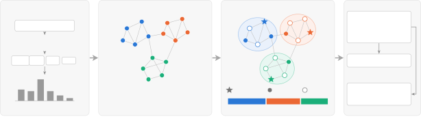
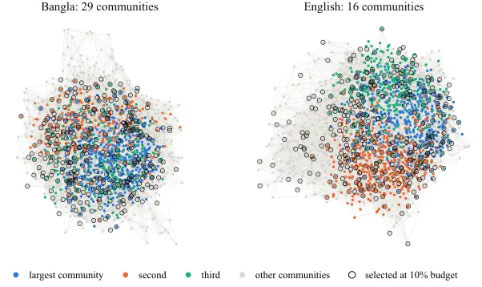

\DeclareCaptionType

algorithm\[Algorithm\]\[List of Algorithms\]

# Structure Before Sampling: Community-Aware Core-Set Selection for Data-Efficient Text-to-Speech

Mizbaul Haque Maruf    Muhammad Nur Yanhaona Affiliation: Department of
Computer Science and Engineering Affiliation: Brac University, Dhaka,
Bangladesh Affiliation: mizbaul.haque.maruf@g.bracu.ac.bd,
nur.yanhaona@bracu.ac.bd

###### Abstract

Text-to-speech (TTS) corpora are costly to record, yet many utterances
add little new phonetic information. Core-set selection reduces this
cost by choosing a small training subset under a fixed audio-duration
budget. We represent a corpus as a phonotactic graph that links each
utterance to its most phonemically similar ones, and we first test
whether this graph has structure. In Bangla and English corpora, its
clustering is 199 and 56 times that of a size-matched random graph, and
its modularity is more than twice that of a degree-preserving random
graph. We then propose Community Representative, a selector that samples
across graph communities and spreads its choices within each one,
starting from utterances rich in rare phonemes. At every budget and in
both languages, it covers more rare phoneme bigrams than random and
entropy-based selection, and this lead holds on held-out utterances. TTS
models trained on its 20% core-sets have a significantly lower character
error rate (CER) than models trained on equal-duration random or
entropy-based subsets in both languages. When all models train for the
same number of epochs, the Bangla core-set model also outperforms
full-corpus training (3.93% vs. 4.47% CER) with $`4.5\times`$ less
training time.

## 1 Introduction

The main cost of building a text-to-speech (TTS) system is its training
corpus. Much of this cost is spent on redundancy: a corpus large enough
to cover the phonotactics of a language contains many utterances that
add little new information for the model. _Core-set selection_ aims to
find a small subset that trains a model nearly as well as the full
corpus.



Figure 1: Overview. (a) Utterances become TF-IDF vectors over IPA
phonemes and within-word bigrams (§3.3). (b) The $`k`$-NN utterance
graph is tested against Erdős–Rényi (ER) and configuration-model nulls
before selection relies on it (§4); colours mark Louvain communities.
(c) Community Representative splits the duration budget across
communities and selects within each in farthest-point order from the
most rare-phoneme-rich utterance (star; §5). (d) Core-sets are scored by
rare-bigram coverage and downstream TTS intelligibility (§6–7).

Existing data selection methods treat a corpus as a set of independent
items. They either choose sentences with balanced phoneme statistics
(Chen et al., 2023; Shamsi et al., 2022) or spread the selection across
a feature space (Sener and Savarese, 2018). This view ignores a
well-documented property of language: linguistic units form networks
with strong community structure and small-world geometry (Ferrer i
Cancho and Solé, 2001; Vitevitch, 2008; Siew, 2013). If a corpus
inherits this organization, a selector that ignores it discards useful
information. If it does not, a graph-based selector is only an elaborate
form of random sampling.

We therefore treat the question empirically and answer it before
building on it (Figure 1). We represent each utterance by its
phonotactic features, connect it to its nearest neighbours, and test the
resulting graph against matched null models. The graph is strongly
clustered and modular, so we derive a selector, Community
Representative, that stratifies the pool by graph community and, within
each community, spends the duration budget on well-spread utterances,
starting from the one richest in rare phonemes. We evaluate the selector
intrinsically, by the coverage of rare phoneme bigrams, and
extrinsically, by the intelligibility of TTS models trained on the
selected subsets.

A single corpus cannot show whether this structure is a property of the
language or of one dataset. We therefore run the full study on two
typologically distant languages, Bangla and English (Ito and Johnson,
2017), and share every hyperparameter of the selection pipeline between
them, so that differences between the two reflect the language and the
corpus rather than tuning. Our contributions are as follows:

- •
  Structure, tested rather than assumed. We build a phonotactic
  $`k`$-nearest-neighbour graph over utterances and show that its
  clustering is $`199\times`$ the Erdős–Rényi value in Bangla and
  $`56\times`$ in English, and that its modularity exceeds a
  degree-preserving configuration model in both (§4).
- •
  A structure-aware selector. Community Representative (§5) covers more
  rare phonotactic patterns than random and entropy-based selection at
  every budget, in both languages, on held-out data, and on a third
  corpus with multiple speakers (§7.1–7.3).
- •
  Controlled downstream evidence in two languages. At an identical
  duration budget, TTS models trained on our core-sets are significantly
  more intelligible than models trained on a random subset or on a
  Phoneme Balance subset, in both Bangla and English. In Bangla, the
  core-set model also outperforms full-corpus training with
  $`4.5\times`$ less training time (§7.4–7.5).

## 2 Related Work

#### Data selection for TTS.

Data selection for TTS has mainly been studied as script selection for
corpus collection. These methods choose candidate sentences so that the
selected set has balanced phonetic content, for example with a genetic
algorithm (Chen et al., 2023) or with dedicated procedures for selecting
phonetically balanced sentences (Shamsi et al., 2022). Our Phoneme
Balance baseline (§6.1) follows the same principle. These methods score
sentences by their phoneme statistics, but they do not model how
utterances relate to one another, which is the information our graph
captures.

#### Core-set and budgeted selection in machine learning.

In computer vision, Sener and Savarese (2018) formulate core-set
selection as a $`k`$-center problem over embeddings. We reuse their
greedy $`k`$-center solver but apply it _within_ communities rather than
over the whole pool, so that the geometric criterion works inside strata
defined by the graph. More broadly, budgeted subset selection is
commonly solved greedily, with approximation guarantees for submodular
objectives (Nemhauser et al., 1978) and extensions to node selection in
networks (Kempe et al., 2003; Leskovec et al., 2007). These methods take
the network as given, whereas we first test whether the graph has
structure worth exploiting.

#### Data pruning and deduplication.

Recent work reduces training cost by pruning large datasets. Sorscher et
al. (2022) show that a good pruning metric can make error fall faster
than the usual power law in dataset size, and Zheng et al. (2023) retain
accuracy at high pruning rates by jointly considering data coverage and
example importance. Maharana et al. (2024) also represent a dataset as a
graph, and they select a core-set by message passing that balances
diversity and difficulty. Deduplication removes near-duplicates from
language-model training data (Lee et al., 2022) and semantic duplicates
from web-scale image–text data (Abbas et al., 2023). For speech, dynamic
data pruning matches full-data ASR performance while training on 70% of
the data (Xiao et al., 2024). These methods score examples with trained
models, training dynamics, or duplicate detection. Our selector needs no
model trained on the data and relies on the phonotactic content of the
transcripts, and, unlike Maharana et al. (2024), we test whether the
graph has non-random structure before selecting on it.

#### Network structure of language.

Word co-occurrence networks are small worlds (Ferrer i Cancho and Solé, 2001) in the sense of Watts and Strogatz (1998). Phonological networks
of the lexicon show community structure (Siew, 2013) and have been used
to study word learning and lexical retrieval (Vitevitch, 2008). We ask
whether a TTS corpus, viewed as a graph of utterances, shares this
organization.

#### Community detection and null models.

We detect communities with Louvain modularity optimization (Blondel et
al., 2008) and assess structure against Erdős–Rényi and
configuration-model nulls (Barabási, 2016). Both are standard tools in
network science. Our contribution is to apply them to TTS corpus design,
to test the graph before relying on it, and to check that both the test
and the downstream result hold across languages.

## 3 Problem Formulation and Graphs

### 3.1 Duration-Budgeted Core-Set Selection

Let $`U`$ be a pool of transcribed utterances, where utterance $`u`$ has
audio duration $`d_{u}`$. Given a budget fraction $`\beta`$, core-set
selection seeks a subset $`S\subseteq U`$ with

```math
\textstyle\sum_{u\in S}d_{u}\;\geq\;B=\beta\sum_{u\in U}d_{u} \tag{1}
```

such that a TTS model trained on $`S`$ performs nearly as well as one
trained on $`U`$. We express budgets in _audio duration_ rather than
utterance count, because training cost scales with duration and a count
budget would reward methods that prefer short utterances. We score
subsets intrinsically by their coverage of rare phoneme bigrams (§6.2)
and extrinsically by the intelligibility of TTS models trained on them
(§6.3–6.4).

### 3.2 Corpora

For Bangla, we use the verified sentences of Common Voice Scripted
Speech 26.0 – Bengali (Ardila et al., 2020), recorded by a single
in-house speaker (40,422 utterances, 48.75 hours). For English, we use
LJSpeech-1.1 (Ito and Johnson, 2017) (13,100 utterances, 23.92 hours, a
single human reader). Both corpora are sampled at 22.05 kHz and contain
one speaker each, so no objective includes a speaker-coverage term. In
each corpus, a seeded 10% split is held out from feature extraction,
graph construction, the rarity signal, and all selectors, and it
supplies the evaluation items. Table 1 describes both corpora and their
graphs. A third, multi-speaker corpus is used only to test transfer
(§7.3).

#### Shared configuration.

All numeric hyperparameters are shared between the two languages:
$`k=15`$, budgets of 10/20/40% of pool duration, five seeds, a 10%
held-out fraction, phoneme unigram and bigram features, and a
bottom-quartile definition of _rare_. None of them was tuned per
language.

|                                            |                |                |
| ------------------------------------------ | -------------- | -------------- |
| quantity                                   | Bangla         | English        |
| utterances / hours                         | 40,422 / 48.75 | 13,100 / 23.92 |
| pool / held-out                            | 36,389 / 4,033 | 11,769 / 1,331 |
| IPA phonemes                               | 37             | 41             |
| within-word bigrams                        | 775            | 1,073          |
| rare bigrams (bottom qu.)                  | 194            | 278            |
| rare share of tokens (%)                   | 0.099          | 0.351          |
| TF-IDF dimension                           | 812            | 1,114          |
| $`G_{u}`$ nodes                            | 36,388         | 11,769         |
| $`G_{u}`$ edges                            | 462,066        | 150,416        |
| $`G_{u}`$ $`\langle k\rangle`$ / $`\ln N`$ | 25.40 / 10.50  | 25.56 / 9.37   |
| $`G_{u}`$ Louvain communities              | 27             | 17             |
| $`G_{p}`$ nodes / edges                    | 37 / 465       | 41 / 653       |

Table 1: Corpus and graph descriptors. Every hyperparameter behind these
numbers is shared across the two languages.

### 3.3 Phonotactic Features

We convert text to IPA. For Bangla, we use epitran (Mortensen et al., 2018) with the ben-Beng-east model after Unicode normalization. For
English, we use a CMUdict (Carnegie Mellon University, 2014) lookup with
a neural grapheme-to-phoneme model for out-of-vocabulary words, and we
map ARPAbet symbols to IPA. We remove English stress digits with one
exception: the unstressed AH0 and ER0 are kept distinct from the
stressed AH1 and ER1, so that schwa and r-coloured schwa remain separate
from the wedge and the stressed r-coloured vowel. CMUdict marks reduced
vowels only through the stress digit. Removing all digits would
therefore merge schwa, the most frequent English phoneme (76,134 tokens
in the pool), into the wedge and distort every distributional metric we
report.

Each utterance is represented as a TF-IDF vector over phoneme unigrams
and bigrams, $`L_{2}`$-normalized so that cosine similarity is a dot
product. Bigrams are counted _within words only_. A word-final $`/k/`$
followed by a word-initial $`/t/`$ is not a cluster in either language,
and counting it would inflate every coverage number. Only 775 phoneme
pairs are attested in Bangla and 1,073 in English, which reflects the
phonotactics of each language. No acoustic embedding is used; audio
contributes only its duration.

### 3.4 Graph Construction

We build two graphs per language. The _utterance graph_ $`G_{u}`$ has as
nodes the pool utterances that contain at least one phoneme, and each
node is joined to its $`k=15`$ exact nearest neighbours by cosine
similarity. The _phoneme graph_ $`G_{p}`$ has phonemes as nodes, which
are joined when they are adjacent within a word and weighted by
co-occurrence. We use $`G_{p}`$ only for analysis (§4.3). For selection,
we score each utterance by the rare phonemes it contains:

```math
r_{u}=\textstyle\sum_{p\in u}1/\log(2+f_{p}), \tag{2}
```

where $`f_{p}`$ is the frequency of phoneme $`p`$ in the pool and the
sum runs over the distinct phonemes of $`u`$. The score depends only on
phoneme frequencies, and it is larger for utterances that contain rarer
phonemes.

We set $`k=15`$ from theory rather than by tuning, since tuning $`k`$ on
the evaluation metric would be circular. A random graph is almost surely
connected once $`\langle k\rangle>\ln N`$ (Barabási, 2016). After
symmetrization, $`\langle k\rangle=25.40`$ against $`\ln N=10.50`$ in
Bangla and $`25.56`$ against $`9.37`$ in English. Both graphs are
therefore in the connected regime, with a giant component that covers
every node. No community is isolated from the rest of the pool, and
every utterance is reachable by the selector.

|                                               |           |         |         |           |         |         |
| --------------------------------------------- | --------- | ------- | ------- | --------- | ------- | ------- |
|                                               | Bangla    |         |         | English   |         |         |
|                                               | $`G_{u}`$ | ER      | config. | $`G_{u}`$ | ER      | config. |
| $`N`$                                         | 36,388    | matched | matched | 11,769    | matched | matched |
| $`L`$                                         | 462,066   | matched | matched | 150,416   | matched | matched |
| $`\langle k\rangle`$                          | 25.4      | 25.4    | 25.4    | 25.6      | 25.6    | 25.5    |
| $`C`$                                         | 0.1401    | 0.0007  | 0.0018  | 0.1211    | 0.0022  | 0.0056  |
| $`Q`$                                         | 0.470     | 0.156   | 0.172   | 0.404     | 0.155   | 0.177   |
| $`\langle k^{2}\rangle/\langle k\rangle^{2}`$ | 1.65      | 1.04    | 1.64    | 1.65      | 1.04    | 1.63    |
| $`k_{\max}`$                                  | 627       | 51      | 618     | 461       | 48      | 447     |
| $`\langle d\rangle`$                          | 3.72      | 3.61    | 3.40    | 3.23      | 3.19    | 3.05    |

Table 2: $`G_{u}`$ against matched nulls in both languages (ER $`=`$
Erdős–Rényi, config. $`=`$ degree-preserving configuration model),
averaged over 5 realizations. Clustering $`C`$ and modularity $`Q`$
exceed both nulls in both languages.

Figure 2: $`G_{u}`$ versus matched nulls (log scale), one panel per
language. Clustering and modularity both exceed the degree-preserving
configuration model in Bangla and in English.

## 4 Structural Analysis: Is the Structure Real?

Before building a selector on $`G_{u}`$, we test whether it differs from
a random graph. If it did not, Louvain stratification would amount to
random sampling, and Phoneme Balance would be the better choice.

Figure 3: Degree distribution and clustering spectrum of $`G_{u}`$
against one realization (seed 13) of each null model. $`P(K\geq k)`$ is
the complementary cumulative degree distribution; $`C(k)`$ is the mean
local clustering coefficient of utterances in logarithmic degree bins.
The configuration model shares $`G_{u}`$’s degree sequence, so it
appears only in the clustering panels.

### 4.1 Null Models

We use two matched null models, each averaged over five realizations: an
Erdős–Rényi graph $`G(N,L)`$ with the same numbers of nodes and edges,
and a _configuration model_ that preserves the exact degree sequence.
The second is the stronger test, because structure that survives it
cannot be explained by degree heterogeneity alone. We compare clustering
$`C`$, Louvain modularity $`Q`$, degree heterogeneity
$`\langle k^{2}\rangle/\langle k\rangle^{2}`$, maximum degree
$`k_{\max}`$, and mean path length $`\langle d\rangle`$.

### 4.2 The Utterance Graph Is Clustered, Modular and Small-World

Table 2 and Figure 2 report the results. The same three findings hold in
both languages.

#### Clustering.

$`C`$ is far above the random value: $`0.140`$ against $`0.0007`$ in
Bangla ($`199\times`$) and $`0.121`$ against $`0.0022`$ in English
($`56\times`$). It remains $`79\times`$ and $`22\times`$ higher than in
the degree-preserving null. Both graphs are therefore strongly triadic,
which makes the coverage of local neighbourhoods a meaningful objective.

#### Modularity.

$`Q`$ exceeds the degree-preserving null in both languages: $`0.470`$
against $`0.172`$ in Bangla and $`0.404`$ against $`0.177`$ in English.
The 27 and 17 detected communities therefore reflect genuine grouping in
phonotactic space rather than a degree artifact. This result motivates
stratifying the selection by community, and it mirrors the finding of
Siew (2013) for phonological networks.

#### Small-world geometry.

Mean path length is close to the random value in both languages
($`3.72`$ against $`3.61`$ in Bangla; $`3.23`$ against $`3.19`$ in
English), while clustering is one to two orders of magnitude higher.
This is the small-world signature of Watts and Strogatz (1998), and it
places both corpora in the same structural family as the word networks
of Ferrer i Cancho and Solé (2001).

#### Hubs and local clustering.

Figure 3 examines these averages node by node. The degree distribution
of $`G_{u}`$ has a heavy tail that the matched random graph lacks. In
both languages, 1.3% of utterances have degree 100 or more, while the
Erdős–Rényi realization has none, and the largest degree is 627 in
Bangla and 461 in English, against 53 and 47 in this realization (51 and
48 on average over the five realizations in Table 2). Clustering
decreases with degree, from 0.154 at $`k\approx 16`$ to 0.014 at
$`k\approx 291`$ in Bangla and from 0.137 to 0.023 in English, so hubs
are the least clustered utterances. The configuration model stays flat
at every degree, and $`G_{u}`$ remains at least $`8\times`$ above it in
Bangla and $`4\times`$ in English across the whole degree range. The
triadic structure is therefore not driven by a few hubs but holds
throughout the graph.

English is weaker than Bangla on every structural measure: its graph is
less clustered and less modular, and its corpus is about half the size
in hours. The small-world signature is nonetheless clear, and §7.1 shows
that the selection advantage it predicts also holds in English.

### 4.3 The Phoneme Graph Is Disassortative

$`G_{p}`$ requires a different test. It is small and nearly complete in
both languages (37 nodes at density $`0.70`$ in Bangla and 41 nodes at
density $`0.80`$ in English), so a comparison with a Poisson degree
distribution is uninformative, and no scale-free claim can be made on so
few nodes. Its structure lies instead in _which_ phonemes connect to
which. Degree assortativity is $`-0.339`$ in Bangla and $`-0.122`$ in
English, against $`-0.048`$ and $`-0.049`$ for matched random graphs.
This disassortativity indicates a hub-and-spoke organization, in which
well-connected phonemes attach preferentially to poorly connected ones
rather than to each other. We report it as a descriptive property of the
phoneme inventory; the selector does not use the edges of $`G_{p}`$.



Figure 4: Communities of $`G_{u}`$ and the utterances Community
Representative selects at a 10% budget. Communities are the Louvain
partition the selector uses on the full similarity-weighted graph.
Because an induced subgraph of $`G_{u}`$ on a sample has almost no
edges, each panel lays out a $`k`$-NN graph ($`k{=}8`$) rebuilt on a
2,500-utterance sample stratified by community; the three largest
communities are coloured and the rest grey. Rings mark selected
utterances.

## 5 Community-Aware Core-Set Selection

Community Representative turns the findings of §4 into design choices.
It and both baselines receive the same input and fill the same duration
budget (Eq. 1), so all selectors are compared at equal audio duration
rather than at equal utterance count.

#### Stratify by community.

Because $`G_{u}`$ is strongly modular (§4.2), we partition it with
weighted Louvain (Blondel et al., 2008), using cosine similarities as
edge weights, and treat each community as a stratum. Sampling _across_
communities spreads the budget over all regions of the graph.

#### Spread within each community.

Within each community, members are ordered by farthest-point sampling
under cosine distance, which is the greedy $`k`$-center solver (Sener
and Savarese, 2018). Farthest-point sampling _within_ a community
provides spread.

#### Seed toward the tail.

The farthest-point order of each community starts from its member with
the highest rarity score $`r_{u}`$ (Eq. 2). Phonotactic frequencies are
highly skewed: the rare bigrams defined in §6.2 make up only 0.099% of
bigram tokens in Bangla and 0.351% in English, so random draws seldom
reach them. Starting each stratum from its rarest utterance places this
tail early in the selection.

#### Allot the budget.

Each community receives a share of the budget proportional to its total
duration, and utterances are drawn round-robin across communities.
Algorithm 5 gives the full procedure, and Figure 4 shows its output.
Louvain on the similarity-weighted graph finds 29 communities in Bangla
and 16 in English (the unweighted partition in §4.2 has 27 and 17). At a
10% budget, every community contributes selected utterances: between
5.7% and 15.1% of its members in Bangla and between 11.1% and 15.9% in
English. The selections are spread across the whole layout, including
its periphery.

{algorithm}

\[t\]

 

Community Representative selection. A community $`c`$ is _open_ while
$`\pi_{c}\neq\emptyset`$ and $`\mathrm{used}_{c}<B_{c}`$.

 

|                                                                                                     |                                                                             |                                                                    |                                                                                                 |
| --------------------------------------------------------------------------------------------------- | --------------------------------------------------------------------------- | ------------------------------------------------------------------ | ----------------------------------------------------------------------------------------------- |
| input: $`G_{u}`$, durations $`d`$, rarity $`r`$, budget $`B`$ (s), $`B\leq\textstyle\sum_{v}d_{v}`$ |                                                                             |                                                                    |                                                                                                 |
| output: $`S`$ with $`\textstyle B\leq\sum_{u\in S}d_{u}<B+\max_{u}d_{u}`$                           |                                                                             |                                                                    |                                                                                                 |
| 1                                                                                                   | $`P\leftarrow\textsc{Louvain}(G_{u})`$, weighted by cosine sim.             |                                                                    |                                                                                                 |
| 2                                                                                                   | for each community $`c\in P`$ do                                            |                                                                    |                                                                                                 |
| 3                                                                                                   |                                                                             | $`s_{c}\leftarrow\arg\max_{u\in c}r_{u}`$ // rare seed             |                                                                                                 |
| 4                                                                                                   |                                                                             | $`\pi_{c}\leftarrow`$ farthest-point order of $`c`$ from $`s_{c}`$ |                                                                                                 |
| 5                                                                                                   |                                                                             | $`B_{c}\leftarrow B\cdot(\sum_{u\in c}d_{u})/(\sum_{v}d_{v})`$     |                                                                                                 |
| 6                                                                                                   | $`S\leftarrow\emptyset`$;   $`\mathrm{used}_{c}\leftarrow 0`$ for all $`c`$ |                                                                    |                                                                                                 |
| 7                                                                                                   | while $`\sum_{u\in S}d_{u}<B`$ and some $`c`$ is open do                    |                                                                    |                                                                                                 |
| 8                                                                                                   |                                                                             | for each open $`c`$, while $`\sum_{u\in S}d_{u}<B`$ do             |                                                                                                 |
| 9                                                                                                   |                                                                             |                                                                    | pop $`u`$ from $`\pi_{c}`$ into $`S`$;   $`\mathrm{used}_{c}\leftarrow\mathrm{used}_{c}+d_{u}`$ |
| 10                                                                                                  | return $`S`$                                                                |                                                                    |                                                                                                 |

 

|                      | Community Representative            | Phoneme Balance | Random       | Full data      |
| -------------------- | ----------------------------------- | --------------- | ------------ | -------------- |
|                      | (20%)                               | (20%)           | (20%)        | (100%)         |
| Bangla utt. / hours  | 9,183 / 8.78                        | 8,872 / 8.78    | 7,299 / 8.78 | 40,422 / 48.75 |
| English utt. / hours | 3,017 / 4.30                        | 2,825 / 4.30    | 2,342 / 4.30 | 11,769 / 21.48 |
| Bangla schedule      | 1500 epochs; batch 128 (Random: 98) |                 |              |                |
| English schedule     | 30,000 gradient steps; batch 256    |                 |              |                |

Table 3: Downstream training arms: utterances / hours per language, and
training schedules. The three 20% subsets have identical duration.

|                                 | Bangla           |                  |                  | English          |                  |                  |
| ------------------------------- | ---------------- | ---------------- | ---------------- | ---------------- | ---------------- | ---------------- |
| method                          | 10%              | 20%              | 40%              | 10%              | 20%              | 40%              |
| Community Representative (ours) | 89.5 $`\pm`$ 0.6 | 96.0 $`\pm`$ 0.8 | 98.5 $`\pm`$ 0.5 | 73.8 $`\pm`$ 1.2 | 86.0 $`\pm`$ 1.1 | 95.7 $`\pm`$ 0.8 |
| Phoneme Balance                 | 73.2             | 82.5             | 93.8             | 55.0             | 71.9             | 86.0             |
| Random                          | 49.9 $`\pm`$ 4.0 | 69.8 $`\pm`$ 1.8 | 83.7 $`\pm`$ 2.1 | 46.3 $`\pm`$ 2.0 | 64.8 $`\pm`$ 3.7 | 80.6 $`\pm`$ 3.9 |

Table 4: Rare-bigram coverage (%) by method, budget and language, mean
$`\pm`$ 95% CI over 5 seeds. Entries without an interval have zero seed
variance (§6.1). Best per column in bold.

Figure 5: Rare-bigram coverage vs. duration budget in both languages;
bands are 95% CIs over 5 seeds. The ranking of methods is the same in
both panels.

## 6 Experimental Setup

### 6.1 Baselines

Both baselines fill the same duration budget as Community
Representative.

#### Phoneme Balance.

This baseline selects for phonetic balance. Let $`\mathbf{c}_{S}`$ be
the phoneme unigram counts of a selection $`S`$, and let
$`H(\mathbf{c})`$ be the entropy of the phoneme distribution with counts
$`\mathbf{c}`$. Starting from one utterance drawn with the run’s seed,
Phoneme Balance repeatedly adds

```math
u^{*}=\textstyle\arg\max_{u\notin S}H(\mathbf{c}_{S}+\mathbf{c}_{u}) \tag{3}
```

until the budget is filled (Seki et al., 2024). It therefore favours
subsets whose phoneme distribution is as uniform as possible. Only its
first pick depends on the seed, and its coverage does not vary across
our five seeds.

#### Random.

Random samples utterances uniformly without replacement, with a fixed
seed, until the budget is filled.

### 6.2 Intrinsic Evaluation

We report the coverage of phoneme _bigram_ types. Unigram coverage is
$`1.0`$ for every method at every budget in both languages and is
therefore uninformative. The main metric is the coverage of _rare_
bigrams, defined as the bottom quartile by frequency: 194 types in
Bangla, which account for only 0.099% of bigram tokens, and 278 types in
English, which account for 0.351%. Random sampling tends to miss exactly
these types. Each method and budget is run with 5 seeds, and we report
the mean and 95% confidence interval (CI).

We add three further measurements. _Held-out coverage_ controls for
circularity: a method could win on pool coverage by exploiting the
statistics it was built from, but it cannot do so on the bigram types of
held-out utterances. This control matters because Community
Representative spreads its selection over phoneme unigram and bigram
features, so coverage on the pool is closely related to what it
optimizes. _Multi-speaker transfer_ repeats the intrinsic evaluation on
OpenSLR SLR37 (1,891 utterances, 2.94 hours, six Bangla speakers),
because both main corpora are single-speaker. _Graph coverage_ measures
selection on $`G_{u}`$ itself: the share of pool utterances that are
selected or are among the $`k{=}15`$ nearest neighbours of a selected
utterance, computed at every 2% of budget. Because Community
Representative selects on this graph and the baselines do not, graph
coverage partly favours it by construction, so we treat it as a
description of the selections rather than as independent evidence.

### 6.3 Downstream TTS Training

In each language, we train a lightweight TTS model, MB-iSTFT-VITS
(Kawamura et al., 2023; Kim et al., 2021), on the Community
Representative core-set at a 20% duration budget and on three controls:
the full training data, a random subset, and a Phoneme Balance subset,
with both subsets at the same duration as the core-set. The random arm
separates the effect of the selection method from the effect of the
budget. The Phoneme Balance arm is the stricter control, since it fixes
the budget and changes only the selection criterion. Table 3 lists the
arms. Equal duration does not imply an equal number of utterances:
Community Representative prefers shorter utterances and therefore
selects about a quarter more of them than Random in both languages.
Duration is still the budget that reflects cost (§3.1). All arms use a
learning rate of $`2\times 10^{-4}`$, seed 1234, and fp16 training.

#### Bangla: equal epochs.

The Bangla arms are matched on epochs, 1500 each. Since an epoch is one
pass over an arm’s own audio, equal epochs make total compute
proportional to the duration budget. This is the source of the cost
saving: the core-set run takes 109,400 steps in 11.3 h and the random
run 110,900 steps in 10.7 h, against 454,400 steps in 50.4 h for the
full corpus, a $`4.5\times`$ reduction in wall-clock time. The Phoneme
Balance arm uses the same schedule and batch size as the core-set arm,
so the two are compared at equal budget _and_ equal compute. One
hyperparameter differs across the Bangla arms: the random arm uses a
batch size of 98 instead of 128. We chose this value so that the
core-set and random arms end within 1.4% of each other in gradient
steps, even though they contain different numbers of utterances.

#### English: equal updates.

All four English arms use a batch size of 256 and are trained for a
fixed 30,000 gradient steps, set in advance. Every arm therefore
receives the same number of updates at the same batch size, so the
English comparison is one of equal compute rather than of equal passes
over data of different sizes. As a result, the two languages answer
related but different questions, which we discuss in §8.2. In both
languages, training loss is computed on each arm’s own training data and
is not comparable across arms, so we compare the arms only through
held-out intelligibility (§6.4).

Figure 6: Graph coverage against the duration budget: the share of pool
utterances that are selected or among the 15 nearest neighbours of a
selected utterance. Community Representative is re-run at every 2%
budget; bands are 95% CIs over 5 seeds.

### 6.4 Downstream Evaluation Protocol

In each language, every system synthesizes a fixed, seeded sample of 500
held-out utterances with identical inference settings. We transcribe the
audio with a wav2vec 2.0 model fine-tuned for that language (Babu et
al., 2022; Conneau et al., 2021) and measure character error rate (CER)
against the front-end-normalized transcript, so that no system is
penalized for its own text normalization. We also transcribe the
_reference_ corpus audio, because a system’s CER can only be interpreted
relative to the recognizer’s error on natural speech. This reference
topline is 3.42% in Bangla and 1.85% in English. For English, synthesis
uses exactly the phoneme strings that the arms were trained on, so the
evaluation front end is identical to the training front end. We compare
systems on the same test items, with paired bootstrap confidence
intervals and paired significance tests.

|                                 | Bangla           |                  | English          |                  |
| ------------------------------- | ---------------- | ---------------- | ---------------- | ---------------- |
| method                          | 10%              | 20%              | 10%              | 20%              |
| Community Representative (ours) | 99.1 $`\pm`$ 0.2 | 99.4 $`\pm`$ 0.1 | 98.0 $`\pm`$ 0.3 | 98.8 $`\pm`$ 0.2 |
| Phoneme Balance                 | 97.3             | 98.5             | 94.8             | 97.7             |
| Random                          | 94.4 $`\pm`$ 0.9 | 97.3 $`\pm`$ 0.5 | 94.1 $`\pm`$ 0.7 | 97.1 $`\pm`$ 0.3 |

Table 5: Held-out bigram coverage (%): the share of the bigram types
occurring in held-out utterances, which no selector could see, that each
selection covers.

## 7 Results

### 7.1 Rare-Phonotactic Coverage

Table 4 and Figure 5 show that Community Representative leads at every
budget in both languages. At the smallest budget (10%), it covers 89.5%
of rare bigrams in Bangla, against 73.2% for Phoneme Balance and 49.9%
for Random, and 73.8% in English, against 55.0% and 46.3%. Its margin
over Phoneme Balance narrows as the budget grows, from $`+16.3`$ to
$`+13.5`$ to $`+4.7`$ points in Bangla and from $`+18.8`$ to $`+14.1`$
to $`+9.7`$ points in English. In both languages, the 95% confidence
intervals separate at every budget.

Absolute coverage is lower in English because the budget is smaller, not
because the methods behave differently. The English pool contains 21.5
hours of audio against 43.9 hours in Bangla, so a 10% budget buys 2.15
hours against 4.39. Reaching the tail of a distribution requires a
certain amount of material, and half as much audio reaches less of it.
What transfers across languages is the ordering of the methods and the
size of the gaps between them.

### 7.2 Coverage of the Utterance Graph

Figure 6 measures selection on the graph itself. At every budget and in
both languages, fewer utterances lie outside the one-hop reach of the
Community Representative core-set than outside the reach of either
baseline. At a 10% budget, its selections are within one hop of 86.1% of
Bangla utterances and 88.7% of English utterances, against 69.7% and
75.7% for Phoneme Balance and 61.5% and 60.2% for Random. The gap
appears early: at 2%, coverage is 42.2% against 28.0% and 23.2% in
Bangla, and 47.7% against 35.6% and 22.6% in English. At 40%, Community
Representative covers 99.8% and 99.9% of the graph, while Random still
misses 7.8% and 8.8%. Part of this lead is expected by construction,
since Community Representative selects on this graph and the baselines
do not, but it shows that its selections reach the whole utterance graph
quickly.

#### Budget across communities.

By construction, Community Representative gives each community of
$`G_{u}`$ a share of the budget proportional to its duration, and the
baselines have no such guarantee. With seed 13 at a 10% budget in
Bangla, every community receives between 0.98 and 1.05 times its
proportional share under Community Representative, whereas Phoneme
Balance gives 3 of the 29 communities less than half of their share and
Random leaves one community unsampled.

### 7.3 Held-Out Coverage and Multi-Speaker Transfer

#### Held-out coverage.

Community Representative also leads on held-out bigram coverage
(Table 5), in both languages and at both budgets, so its advantage is
not confined to the pool statistics it was built from.

| method                          | 10%  | 20%  |
| ------------------------------- | ---- | ---- |
| Community Representative (ours) | 44.7 | 66.0 |
| Phoneme Balance                 | 37.3 | 54.7 |
| Random                          | 22.7 | 43.3 |

Table 6: Rare-bigram coverage (%) on OpenSLR SLR37 (1,891 utterances, 6
speakers). Community Representative leads at both budgets, and the
ordering of the three methods matches both single-speaker corpora.

|                                |                   |        |              |                   |        |              |
| ------------------------------ | ----------------- | ------ | ------------ | ----------------- | ------ | ------------ |
|                                | Bangla            |        |              | English           |        |              |
| System                         | CER (%)           | Median | \#$`{>}0.3`$ | CER (%)           | Median | \#$`{>}0.3`$ |
| Reference (topline)            | 3.42 $`\pm`$ 0.44 | 2.63   | 0            | 1.85 $`\pm`$ 0.21 | 0.83   | 1            |
| Random (20%)                   | 4.90 $`\pm`$ 0.52 | 3.61   | 6            | 3.39 $`\pm`$ 0.38 | 1.57   | 1            |
| Phoneme Balance (20%)          | 4.62 $`\pm`$ 0.63 | 3.28   | 6            | 3.30 $`\pm`$ 0.46 | 1.35   | 1            |
| Community Representative (20%) | 3.93 $`\pm`$ 0.51 | 3.06   | 0            | 2.96 $`\pm`$ 0.33 | 1.24   | 1            |
| Full data (100%)               | 4.47 $`\pm`$ 0.40 | 3.19   | 7            | 2.84 $`\pm`$ 0.41 | 1.11   | 3            |

Table 7: Held-out intelligibility of the TTS models trained on each arm:
character error rate (CER, %) as mean $`\pm`$ 95% CI, median CER, and
the number of catastrophic failures (items with CER$`{>}0.3`$). Bangla
arms are matched on epochs and scored on 496 of the 500 test items;
English arms are matched on gradient steps (30,000 each) and scored on
all 500 items. Bold marks the best trained system per language.

#### Multi-speaker transfer.

On SLR37 (Table 6), Community Representative again outperforms both
baselines by a wide margin. At a 10% budget it covers 44.7% of rare
bigrams, against 37.3% for Phoneme Balance and 22.7% for Random; at 20%
it covers 66.0%, against 54.7% and 43.3%. Its lead over Phoneme Balance,
$`+7.4`$ points at 10% and $`+11.3`$ at 20%, falls within the $`+4.7`$
to $`+18.8`$ range observed on the two single-speaker corpora, and the
ordering of the three methods is the same. The coverage advantage
therefore does not depend on the single-speaker setting. Absolute
coverage is low for every method because the corpus is small: a 10%
budget of 2.94 hours buys less than 18 minutes of audio.

### 7.4 Downstream Intelligibility: Bangla

We score 496 of the 500 test items; the remaining 4 are excluded for
every system and for the reference.

#### Comparison with the full corpus.

The 20% core-set model reaches 3.93% CER, against 4.47% for the model
trained on the full corpus (Table 7). The difference is 0.54 points (95%
CI $`[+0.19,+0.84]`$, $`p=0.011`$), and the median CER is also lower
(3.06% against 3.19%). The core-set model achieves this with
$`4.5\times`$ less training time.

#### Comparison with Random.

At the same budget, the core-set model improves on the random subset by
0.97 CER points (95% CI $`[+0.61,+1.35]`$, $`p<0.001`$), the largest
difference between any two of the 20% arms. Random reaches 4.90% CER,
above the full corpus (4.47%), while the core-set (3.93%) is the closest
of all trained systems to the 3.42% reference topline. Which 20% of the
data is selected therefore matters more than training on five times as
much audio. The systems also differ in the error tail. Like the
reference audio, the core-set model produces _no_ utterance with CER
above 0.3, and its worst case is 29%. Phoneme Balance produces 6 such
failures, Random produces 6 with a worst case of 65%, and the full
corpus produces 7 with a worst case of 67%. Word error rate shows the
same ordering at lower resolution: 21.06% for the core-set, 21.7% for
the full corpus, 22.4% for Phoneme Balance, and 23.3% for Random,
against a 19.5% topline.

#### Comparison with Phoneme Balance.

This arm tests whether graph structure helps beyond an explicit
phonetic-balance criterion, not only beyond chance. Phoneme Balance
falls between the core-set and Random: its CER of 4.62% is lower than
that of Random (4.90%) but higher than those of the core-set and the
full corpus. Its median CER is 3.28%, against 3.06% for the core-set.
The core-set advantage is $`+0.69`$ CER points (95% CI
$`[+0.36,+1.02]`$, Wilcoxon $`p=0.007`$) and $`+1.34`$ WER points
($`p=0.014`$), by paired bootstrap over the same 496 items. Community
Representative therefore outperforms entropy-based selection at an
identical duration budget. This is the comparison that the intrinsic
coverage results predict, and it separates the selection criterion from
the budget.

### 7.5 Downstream Intelligibility: English

No English test item has a corrupt reference, so all 500 items are
scored. The core-set model leads both same-budget controls on the mean
and on the median (Table 7): 2.96% CER against 3.30% for Phoneme Balance
and 3.39% for Random, and 1.24% against 1.35% and 1.57% on the median.
The three selectors are ordered as in Bangla and as the intrinsic
coverage results predict, and both differences are significant:
$`+0.43`$ CER points over Random (95% CI $`[+0.20,+0.68]`$, $`p=0.006`$)
and $`+0.34`$ points over Phoneme Balance (95% CI $`[+0.11,+0.54]`$,
Wilcoxon $`p=0.018`$). The intrinsic advantage therefore converts into a
measurable gain in intelligibility in both languages. The English
margins are about half the size of the Bangla ones (§8.1).

The full pool, trained for the same number of updates as the subsets,
reaches the lowest English CER: 2.84%, against 2.96%, 3.30%, and 3.39%.
It clearly outperforms Random ($`+0.55`$ points, $`p=6\times 10^{-6}`$).
This is the expected outcome when all arms receive the same number of
updates (§8.2).

#### Inference speed.

All systems in both languages run much faster than real time on an Apple
M4 Pro (median real-time factor between 0.040 and 0.053), and their
output durations closely match the references (mean duration ratio 1.00
to 1.02 in Bangla and 0.95 to 0.99 in English).

## 8 Discussion

### 8.1 Why the English Margins Are Smaller

The English gains over Random and Phoneme Balance (0.43 and 0.34 points)
are about half the Bangla gains (0.97 and 0.69 points). The most likely
reason is limited headroom. Every English system lies between 2.8% and
3.4% CER against a 1.85% topline, so only about 1.5 points separate the
worst system from the ceiling, while the 95% confidence intervals of the
individual systems on 500 items have half-widths between 0.21 and 0.46
points. Much of the Bangla margin also comes from the error tail, which
English almost lacks: one item above 30% CER for the reference and for
each 20% arm, and three for the full-pool arm, against 6 for the Bangla
random arm and 7 for the Bangla full corpus. When almost every item is
already intelligible, a selection method has fewer failures left to
prevent, so its margins shrink, although they remain significant.

### 8.2 Equal Epochs Versus Equal Updates

The two training protocols answer related but different questions. In
Bangla, the arms are matched on epochs, so the full-corpus model
receives about four times as many gradient steps as the core-set model
(454,400 against 109,400). Under this protocol, the core-set model is
both $`4.5\times`$ cheaper to train and more intelligible than the
full-corpus model (§7.4). In English, all arms receive the same 30,000
updates, and the full pool keeps a small lead over the core-set (2.84%
against 2.96% CER), as expected when a larger and more varied training
set is trained for the same number of steps. We therefore do not claim
that a core-set outperforms all of the data at equal compute. Our claim
is narrower. At any fixed duration budget, Community Representative
outperforms both random and entropy-based selection, and when training
runs a fixed number of passes over its data, a well-chosen 20% subset
can exceed the quality of the full corpus at a fraction of the cost, as
it does in Bangla.

### 8.3 What Replicates Across Languages

The intrinsic results replicate fully: the graph structure is present in
both corpora, and Community Representative improves coverage over both
baselines in both. The downstream results also replicate. In both
languages, the three same-budget selectors are ordered in the same way
(Community Representative, then Phoneme Balance, then Random), and the
core-set model is significantly more intelligible than both baselines.
Two aspects differ between the languages. First, the margins are about
half as large in English, where every system is close to the
recognizer’s floor (§8.1). Second, the comparison with the full data
depends on the training protocol: the core-set outperforms the full
corpus when the arms are matched on epochs (Bangla), but not when they
are matched on updates (English; §8.2).

## 9 Conclusion

We showed that a TTS corpus, represented as a phonotactic graph of
utterances, has measurable network structure in two typologically
distant languages, and that this structure survives degree-preserving
randomization. A selector that samples within graph communities covers
more rare phonotactic patterns than random and entropy-based selection
at every budget in both languages, on held-out data, and on a third,
multi-speaker corpus, and it reaches the whole utterance graph faster
than either baseline. In downstream TTS training at a 20% budget, its
core-sets produce significantly more intelligible models than random or
entropy-based selection in both Bangla and English. In Bangla, the
core-set model also outperforms full-corpus training by 0.54 CER points
with $`4.5\times`$ less training time. A natural next step is to repeat
the downstream comparison on a multi-speaker corpus with a wider range
of recording quality, where better coverage has more to offer.

## Limitations

Our claims have several limitations. Both main corpora are single
speaker, each read by one person, so speaker and prosodic diversity are
absent by construction, and no objective includes a speaker-coverage
term. §7.3 shows that the intrinsic results transfer to real
multi-speaker data, but this check is intrinsic only; we did not repeat
the downstream comparison there. The G2P is rule-based for Bangla and
dictionary-based for English. Its errors affect every method equally,
which keeps the comparison fair, but absolute coverage numbers inherit
its accuracy. The two downstream protocols differ: the Bangla arms are
matched on epochs and the English arms on gradient steps, so the two
languages answer related but different questions, and the advantage over
the full corpus holds only under the Bangla protocol. One training
hyperparameter also differs across the Bangla arms (§6.3). The English
margins are about half the size of the Bangla ones, and with 500 test
items against a 1.85% recognizer floor, their confidence intervals are
wide relative to the effect sizes. Finally, the heavy degree tail of
$`G_{u}`$ (Figure 3) is partly _hubness_, a known artifact of $`k`$-NN
graphs in high dimensions, and we make no power-law claim.

## Ethics Statement

The Bangla sentences come from Common Voice Scripted Speech 26.0 –
Bengali, released under CC0-1.0, and were recorded by an in-house
speaker who gave consent for their use in this research. The recordings
are in-house and not publicly released, and no synthetic speech was used
in any corpus. LJSpeech is in the public domain, and OpenSLR SLR37 is
distributed under the CC BY-SA 4.0 licence. Core-set selection lowers
the data and compute needed to build a TTS voice. It therefore also
lowers the cost of building a voice without the speaker’s consent, so
core-sets should be drawn only from corpora whose speakers permit
synthesis use.

## References

- Abbas et al. (2023) A. Abbas, K. Tirumala, D. Simig, S. Ganguli,
  and A. S. Morcos SemDeDup: data-efficient learning at web-scale
  through semantic deduplication. Computing Research Repository
  arXiv:2303.09540. External Links:
  [Link](https://arxiv.org/abs/2303.09540) Cited by: §2.
- Ardila et al. (2020) R. Ardila, M. Branson, K. Davis, M. Kohler, J.
  Meyer, M. Henretty, R. Morais, L. Saunders, F. Tyers, and G. Weber
  Common Voice: a massively-multilingual speech corpus. In Proc. LREC,
  pp. 4218–4222. Cited by: §3.2.
- Babu et al. (2022) A. Babu, C. Wang, A. Tjandra, K. Lakhotia, Q.
  Xu, N. Goyal, K. Singh, P. von Platen, Y. Saraf, J. Pino, A.
  Baevski, A. Conneau, and M. Auli XLS-R: self-supervised cross-lingual
  speech representation learning at scale. In Proc. Interspeech,
  pp. 2278–2282. Cited by: §6.4.
- Barabási (2016) A. Barabási Network science. Cambridge University
  Press. Cited by: §2, §3.4.
- Blondel et al. (2008) V. D. Blondel, J. Guillaume, R. Lambiotte,
  and E. Lefebvre Fast unfolding of communities in large networks. J.
  Statistical Mechanics: Theory and Experiment 2008 (10), pp. P10008.
  Cited by: §2, §5.
- Carnegie Mellon University (2014) Carnegie Mellon University The CMU
  pronouncing dictionary, version 0.7b. External Links:
  [Link](http://www.speech.cs.cmu.edu/cgi-bin/cmudict) Cited by: §3.3.
- Chen et al. (2023) Y. Chen, H. Wang, and Y. Tsao BASPRO: a balanced
  script producer for speech corpus collection based on the genetic
  algorithm. APSIPA Transactions on Signal and Information Processing 12
  (3), pp. 1–28. External Links:
  [Document](https://dx.doi.org/10.1561/116.00000155) Cited by: §1, §2.
- Conneau et al. (2021) A. Conneau, A. Baevski, R. Collobert, A.
  Mohamed, and M. Auli Unsupervised cross-lingual representation
  learning for speech recognition. In Proc. Interspeech, pp. 2426–2430.
  Cited by: §6.4.
- Ferrer i Cancho and Solé (2001) R. Ferrer i Cancho and R. V. Solé The
  small world of human language. Proc. Royal Society of London B 268
  (1482), pp. 2261–2265. Cited by: §1, §2, §4.2.
- Ito and Johnson (2017) K. Ito and L. Johnson The LJ speech dataset.
  External Links: [Link](https://keithito.com/LJ-Speech-Dataset/) Cited
  by: §1, §3.2.
- Kawamura et al. (2023) M. Kawamura, Y. Shirahata, R. Yamamoto, and K.
  Tachibana Lightweight and high-fidelity end-to-end text-to-speech with
  multi-band generation and inverse short-time Fourier transform. In
  Proc. IEEE ICASSP, Cited by: §6.3.
- Kempe et al. (2003) D. Kempe, J. Kleinberg, and É. Tardos Maximizing
  the spread of influence through a social network. In Proc. ACM SIGKDD,
  pp. 137–146. Cited by: §2.
- Kim et al. (2021) J. Kim, J. Kong, and J. Son Conditional variational
  autoencoder with adversarial learning for end-to-end text-to-speech.
  In Proc. ICML, pp. 5530–5540. Cited by: §6.3.
- Lee et al. (2022) K. Lee, D. Ippolito, A. Nystrom, C. Zhang, D.
  Eck, C. Callison-Burch, and N. Carlini Deduplicating training data
  makes language models better. In Proc. ACL, pp. 8424–8445. External
  Links: [Document](https://dx.doi.org/10.18653/v1/2022.acl-long.577)
  Cited by: §2.
- Leskovec et al. (2007) J. Leskovec, A. Krause, C. Guestrin, C.
  Faloutsos, J. VanBriesen, and N. Glance Cost-effective outbreak
  detection in networks. In Proc. ACM SIGKDD, pp. 420–429. Cited by: §2.
- Maharana et al. (2024) A. Maharana, P. Yadav, and M. Bansal D2
  pruning: message passing for balancing diversity and difficulty in
  data pruning. In Proc. ICLR, Cited by: §2.
- Mortensen et al. (2018) D. R. Mortensen, S. Dalmia, and P. Littell
  Epitran: precision G2P for many languages. In Proc. LREC, Cited by:
  §3.3.
- Nemhauser et al. (1978) G. L. Nemhauser, L. A. Wolsey, and M. L.
  Fisher An analysis of approximations for maximizing submodular set
  functions—I. Mathematical Programming 14 (1), pp. 265–294. Cited by:
  §2.
- Seki et al. (2024) K. Seki, S. Takamichi, T. Saeki, and H. Saruwatari
  Diversity-based core-set selection for text-to-speech with linguistic
  and acoustic features. In Proc. IEEE ICASSP, pp. 12351–12355. External
  Links:
  [Document](https://dx.doi.org/10.1109/ICASSP48485.2024.10448068) Cited
  by: §6.1.
- Sener and Savarese (2018) O. Sener and S. Savarese Active learning for
  convolutional neural networks: a core-set approach. In Proc. ICLR,
  Cited by: §1, §2, §5.
- Shamsi et al. (2022) M. Shamsi, N. Barbot, D. Lolive, and J. Chevelu A
  method for selection of phonetically balanced sentences. In Proc.
  EUSIPCO, pp. 1136–1140. Cited by: §1, §2.
- Siew (2013) C. S. Q. Siew Community structure in the phonological
  network. Frontiers in Psychology 4, pp. 553. Cited by: §1, §2, §4.2.
- Sorscher et al. (2022) B. Sorscher, R. Geirhos, S. Shekhar, S.
  Ganguli, and A. Morcos Beyond neural scaling laws: beating power law
  scaling via data pruning. In Advances in Neural Information Processing
  Systems, Vol. 35. External Links:
  [Document](https://dx.doi.org/10.52202/068431-1419) Cited by: §2.
- Vitevitch (2008) M. S. Vitevitch What can graph theory tell us about
  word learning and lexical retrieval?. J. Speech, Language, and
  Hearing Research 51 (2), pp. 408–422. Cited by: §1, §2.
- Watts and Strogatz (1998) D. J. Watts and S. H. Strogatz Collective
  dynamics of ‘small-world’ networks. Nature 393 (6684), pp. 440–442.
  Cited by: §2, §4.2.
- Xiao et al. (2024) Q. Xiao, P. Ma, A. Fernandez-Lopez, B. Wu, L.
  Yin, S. Petridis, M. Pechenizkiy, M. Pantic, D. C. Mocanu, and S. Liu
  Dynamic data pruning for automatic speech recognition. In Proc.
  Interspeech, pp. 4488–4492. External Links:
  [Document](https://dx.doi.org/10.21437/Interspeech.2024-1330) Cited
  by: §2.
- Zheng et al. (2023) H. Zheng, R. Liu, F. Lai, and A. Prakash
  Coverage-centric coreset selection for high pruning rates. In Proc.
  ICLR, Cited by: §2.
