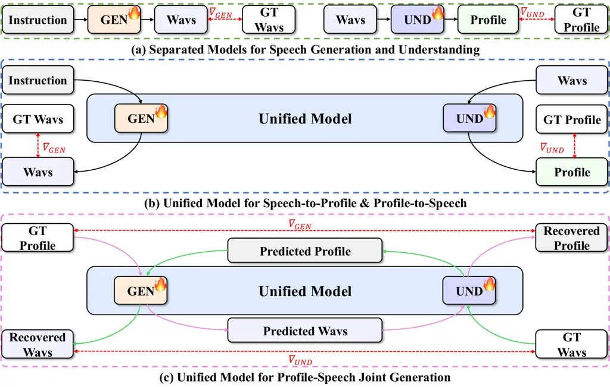
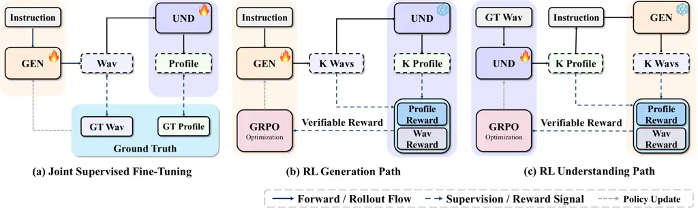
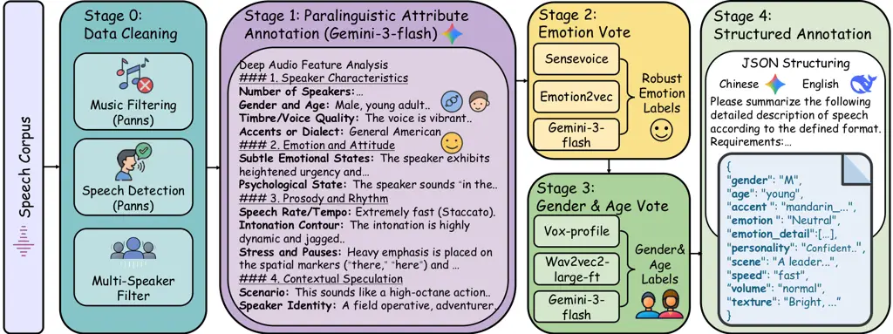
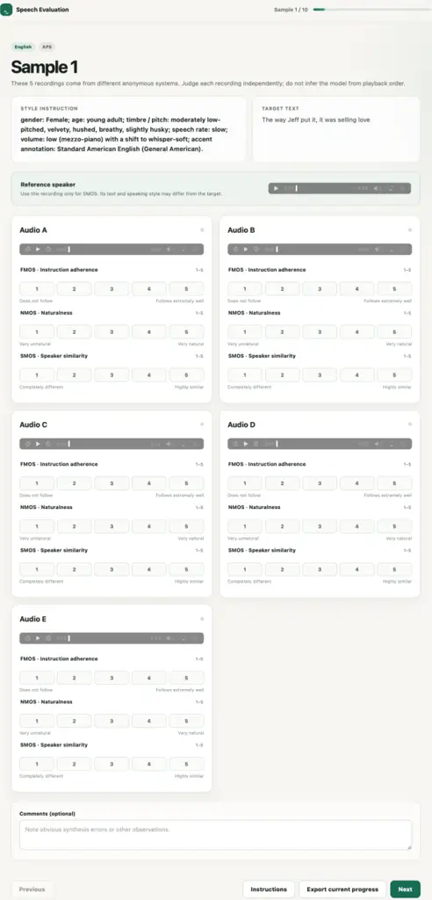

\leftlogo

cuhksz_logo.png \contribution\[†\]Corresponding author. 1\]The Chinese
University of Hong Kong, Shenzhen 2\]Tsinghua University 3\]Amphion
Technology Co., Ltd.

# ![[Uncaptioned image]](arxiv-2609-24771v1--7b4a3ac7c48a.figures/figure-1.webp) CycleSpeech: Reciprocal Alignment for Instruction- Controlled Speech Synthesis and Paralinguistic Understanding

Huan Liao    Haonan Han    Xingwen Han    Dekun Chen    Yuancheng Wang
   Zhizheng Wu Affiliation: \[ Affiliation: \[ Affiliation: \[

###### Abstract

Instruction-controlled speech synthesis and paralinguistic understanding
are often trained independently, leaving reciprocal feedback between the
two tasks underexplored. We introduce CycleSpeech, a framework that
connects generation and understanding through a shared, structured
_voice profile_ that serves as a common target for supervision and
reciprocal feedback. The forward cycle assesses whether synthesized
speech expresses the intended attributes by comparing recovered and
target profiles. The backward cycle evaluates whether profiles inferred
from real speech can guide reconstruction of the source speaking style.
To support both directions, we construct a bilingual dataset of 20,046
examples pairing instructions, target speech, speaker references, and
structured profiles. Building on joint supervised fine-tuning, CycleGRPO
alternates policy updates using reciprocal rewards grounded in profile
consistency and speaking-style reconstruction. Fixed target profiles
anchor feedback from the evolving counterpart. This procedure requires
neither human preference annotations nor an additional
preference-trained reward model. Evaluations on Chinese and English
benchmarks show improved instruction adherence and profile recovery
while maintaining competitive synthesis quality. Compared with
Step-Audio-2-mini, CycleSpeech improves instruction-match accuracy by
4.50 and 10.06 percentage points in Chinese and English, respectively.
Controlled ablations further support the contribution of cycle feedback
to generation control. These results support structured voice profiles
as an interface for reciprocal training between speech generation and
paralinguistic understanding. An online demo is available at
[https://cyclespeech.github.io](https://cyclespeech.github.io).

\makeabstract

## 1 Introduction

Instruction-controlled text-to-speech (TTS) aims to realize
user-specified vocal attributes while preserving naturalness and
intelligibility. Text-based control has expanded from predefined style
descriptions \[8, 35, 11\] to open-ended instructions \[22, 39, 36\],
sometimes combined with speaker references \[1, 12\]. Yet
natural-sounding speech can still miss the requested emotion, vocal
texture, or delivery. The challenge is therefore not only to interpret
an instruction, but also to verify that its attributes are audible in
the output.

Recent approaches make the intended vocal delivery explicit before
synthesis. OV-InstructTTS \[22\] infers emotion labels, acoustic
descriptions, and paralinguistic tags before synthesis. BatonVoice
\[29\] uses an external language model to plan vocal features for a
separate TTS model. Such planning specifies what the synthesizer should
express, but does not by itself require the resulting speech to recover
the intended attributes. Conversely, a description inferred from speech
may match an annotation without preserving enough information to
reproduce the source’s speaking style.

We therefore ask: _Can speech generation and paralinguistic
understanding provide useful training feedback to each other?_ We
introduce CycleSpeech, which uses a structured _voice profile_ as a
common target for understanding supervision and generation verification.
The profile describes speaker traits, prosody, affect, and context in a
canonical schema, making recovered attributes comparable with their
targets. Generation still takes natural-language instructions as input;
the target profile provides training supervision rather than an
additional inference-time requirement.



Figure 1: Generation–understanding paradigms. (a) Separate models
optimize generation and understanding independently. (b) A shared
backbone supports both tasks but still receives one-way supervision. (c)
CycleSpeech closes reciprocal profile–speech cycles, allowing generation
and understanding to verify each other.

The shared profile connects the tasks through two complementary training
checks. In the forward loop, understanding recovers a profile from
generated speech and compares it with the target, supplying feedback on
realized control. In the backward loop, generation reconstructs speech
from an inferred profile, testing whether the description preserves the
source’s speaking style. Together, these loops evaluate profiles through
both agreement with annotations and their consequences for synthesis.
Figure 1 contrasts this reciprocal design with separate and
parameter-shared systems.

Reciprocal training requires a shared representation that links
generation targets to attributes inferred from speech. Existing datasets
pair speech with style attributes or natural-language captions \[11, 13,
5, 26\], but lack a canonical profile aligned with both instructions and
speech for bidirectional supervision. Our dataset comprises 20k
bilingual examples, each aligning a target utterance with its
transcript, speaker reference, instruction, and voice profile. This
profile enables reference-based alignment: generated speech is mapped
back to a profile, and categorical agreement with the target yields a
verifiable optimization signal. It also supervises speech understanding
and guides speaking-style reconstruction.

We first establish a compatible initialization through joint supervised
fine-tuning (Joint SFT), adapting understanding to generated speech
after a generation warm-up. We introduce CycleGRPO, which alternately
optimizes generation and understanding through reciprocal feedback. The
understanding branch provides unified profile-verification feedback
without separate attribute-specific reward classifiers, while training
requires neither human preference annotations nor a separately trained
reward model. Our contributions are:

- •
  We introduce CycleSpeech, connecting instruction-controlled speech
  synthesis and paralinguistic understanding through a shared,
  recoverable voice profile. The forward cycle verifies whether
  generated speech realizes the intended attributes, while the backward
  cycle tests whether inferred profiles support reconstruction of the
  source speaking style.
- •
  We develop CycleGRPO to optimize both cycles through alternating
  policy updates, with evolving counterparts providing feedback and
  fixed profile targets anchoring learning. It preserves
  natural-language generation inputs and requires neither human
  preference annotations nor a separately trained preference reward
  model.
- •
  We construct a bilingual instruction–speech–profile dataset that
  jointly supports understanding supervision and generation
  verification. Bilingual evaluations and controlled ablations
  demonstrate the importance of reciprocal cycle feedback, with improved
  instruction following and categorical profile recovery over no-cycle
  and fixed-feedback baselines.

## 2 Related Works

### 2.1 Instruction-Controlled Speech Generation

PromptTTS \[8\], InstructTTS \[35\], Parler-TTS \[18\], and Audiobox
\[25\] condition synthesis on textual descriptions. ControlSpeech \[12\]
and VoxInstruct \[39\] combine instruction control with zero-shot voice
cloning. Recent methods add open-vocabulary reasoning, vocal-feature
planning, or joint style–timbre control \[22, 29, 38\]. Post-training
further refines synthesis through task-specific rewards: CosyVoice 3
\[6\] uses ASR rewards, while Fish Audio S2 \[15\] uses ASR, quality,
and speaker feedback. FlexiVoice \[1\] progresses from emotion-focused
DPO and GRPO to complex instruction following guided by
audio-language-model rewards. These methods optimize synthesis, whereas
CycleSpeech jointly aligns generation and paralinguistic understanding
through profile verification and speaking-style reconstruction.
Attribute- and caption-based datasets \[11, 12, 13, 5, 26\] provide
descriptive supervision. Our corpus further supplies canonical profiles
as shared targets for understanding supervision and generation
verification.

### 2.2 Verifiable Shared Targets for Speech Generation and Understanding

Connecting generation and understanding requires a shared target that
supports both generation and verification. Structured descriptions
provide such an interface by mapping instructions to explicit
paralinguistic attributes that can be recovered from speech.
SpeakerCard-1M \[20\] organizes speaker and utterance traits into a
typed schema, while UniStyle \[40\] supports both speaking-style
captioning and synthesis through shared text descriptions. However, its
two directions remain independently supervised. CycleSpeech instead uses
a structured voice profile as an auditable interface for understanding
and generation, making reciprocal verification well defined.

### 2.3 Paralinguistic Speech Understanding and Evaluation

External evaluators and understanding models can judge or describe
speaking style. InstructTTSEval \[10\] and audio-aware LLM judges \[3\]
assess instruction–speech consistency, whereas StyleCap \[34\] and
ParaSpeechCLAP \[4\] caption or align broader style semantics.
Speech-chain methods jointly train ASR and TTS by reconstructing speech,
text, or intermediate representations \[24, 9\]. Cycle consistency has
also been used to preserve reference styles during TTS style transfer
\[30, 33\]. Other work introduces speaker-consistency constraints and
staged optimization to prevent TTS from overfitting to the ASR objective
\[19\]. CycleSpeech extends this principle to an explicit, recoverable
voice profile linking instruction-controlled synthesis and
paralinguistic understanding. Attribute verification and speaking-style
reconstruction supply reciprocal feedback for alternating policy updates
in CycleGRPO, while generation retains its natural-language instruction
interface.

## 3 Method



Figure 2: CycleSpeech training framework. (a) Joint SFT initializes
generation (GEN) and understanding (UND) with paired speech–profile
supervision. (b,c) CycleGRPO alternately optimizes generation and
understanding through reciprocal verifiable rewards.

### 3.1 Overview

CycleSpeech couples instruction-controlled generation and paralinguistic
understanding through a structured voice profile (Figure 2). GEN takes
an instruction, transcript, and speaker reference waveform as inputs.
The gold profile provides supervision and verification targets, rather
than an additional conditioning input to GEN. A frozen Step-Audio-2-mini
\[31\] backbone $`\mathcal{M}_{\phi}`$ is shared by two LoRA adapters:
GEN, parameterized by $`\theta_{G}`$, and UND, parameterized by
$`\theta_{U}`$. Training comprises Joint SFT for compatible
bidirectional initialization and CycleGRPO for reciprocal alignment. The
waveform and profile interfaces are discrete, so only the active adapter
receives gradients in each optimization direction.

### 3.2 Training Data Construction

Each training instance contains an instruction $`I`$, transcript $`T`$,
speaker reference $`R`$, target speech $`x^{*}`$ with discrete tokens
$`A^{*}`$, and canonical voice profile $`P^{*}`$. The same profile
serves as the supervision target for UND and the verification target for
GEN, enabling bidirectional training through these aligned annotations.
Following InstructTTSEval \[10\], instructions span three categories:
Acoustic-Parameter Specification (APS) for detailed acoustic control,
Descriptive-Style Directive (DSD) for high-level style descriptions, and
Role-Play (RP) for contextual scenarios and character traits.

##### Profile and prompt construction.

We curate human speech from WenetSpeech, a multi-domain Mandarin corpus
spanning diverse speaking styles, and an internal collection of English
film and television recordings. After filtering music, non-speech, and
multi-speaker segments, Gemini-3-flash \[7\] produces a qualitative
report covering speaker characteristics, vocal texture, prosody,
emotion, and inferred speaking context. DeepSeek-v3 \[16\] for Chinese
and Gemini-3-flash for English then normalize these reports into a
shared JSON schema, shown in Table 2. Attribute-specific models refine
demographics, emotion, accent, and volume. Because the source corpora
lack speaker labels, we cluster WeSpeaker \[27\] embeddings within each
session to obtain pseudo speaker IDs. A separate utterance with the same
pseudo ID is selected as the speaker reference. This pipeline yields
20,046 bilingual examples; model-specific annotation and clustering
settings are provided in the Appendix.

##### Annotation consistency.

Three annotators assessed 1,162 bilingual utterances (Table 2).
Categorical attributes are evaluated against human labels, whereas
descriptive attributes are rated for label–audio consistency on a 1–5
scale, with 5 indicating the closest match.

Table 1: Example of a voice profile. The schema captures speaker,
prosodic, affective, and contextual attributes.


|             |                          |             |                          |
| ----------- | ------------------------ | ----------- | ------------------------ |
| Attribute   | Consistency $`\uparrow`$ | Attribute   | Consistency $`\uparrow`$ |
| Gender      | 96.7                     | Age         | 95.7                     |
| Accent      | 91.6                     | Emotion     | 70.8                     |
| Speed       | 86.7                     | Volume      | 72.5                     |
| Emo. Detail | 4.92                     | Personality | 4.95                     |
| Texture     | 4.87                     | Scene       | 4.79                     |

Table 2: Attribute-level consistency between human and model
annotations. Categorical attributes are reported as accuracy (%), and
descriptive attributes on a 1–5 scale.

### 3.3 Joint Supervised Fine-Tuning

Joint SFT establishes instruction-conditioned generation and
speech-to-profile recovery, providing a supervised initialization for
reciprocal reinforcement learning, as illustrated in Figure 2(a). With
teacher forcing, GEN predicts $`A^{*}`$ from $`(I,T,R)`$, preserving the
inference-time instruction interface. At each joint step, GEN samples
$`\widehat{A}\sim p_{\theta_{G}}(A\mid I,T,R;\phi)`$, which the frozen
token-to-wave decoder converts into $`\widehat{x}`$. UND recovers the
canonical JSON sequence $`Z(P^{*})`$ from this online-generated
waveform. Both branches use length-normalized autoregressive token
negative log-likelihoods:

```math
\displaystyle\mathcal{L}_{\mathrm{Gen}} \displaystyle=-\frac{1}{|A^{*}|}\sum_{t=1}^{|A^{*}|}\log p_{\theta_{G}}\left(a_{t}^{*}\mid I,T,R,a_{<t}^{*};\phi\right), \tag{1}
```

```math
\displaystyle\mathcal{L}_{\mathrm{Und}} \displaystyle=-\frac{1}{|Z(P^{*})|}\sum_{m=1}^{|Z(P^{*})|}\log p_{\theta_{U}}\left(z_{m}^{*}\mid\operatorname{sg}[\widehat{x}],z_{<m}^{*};\phi\right).
```

After the GEN-only warm-up, the joint objective is:

```math
\mathcal{L}_{\mathrm{SFT}}=\mathcal{L}_{\mathrm{Gen}}+\lambda_{\mathrm{und}}\mathcal{L}_{\mathrm{Und}},\qquad\lambda_{\mathrm{und}}=1. \tag{2}
```

where $`\operatorname{sg}`$ stops gradients across the waveform
interface, so $`\mathcal{L}_{\mathrm{Gen}}`$ and
$`\mathcal{L}_{\mathrm{Und}}`$ update only $`\theta_{G}`$ and
$`\theta_{U}`$, respectively. Because UND is trained on the current
generator’s output distribution, unreliable early rollouts would provide
an unstable acoustic input. We therefore optimize GEN alone for the
first 2,000 updates, allowing it to produce usable
instruction-conditioned speech before introducing online UND
supervision. Both adapters are then jointly trained until step 10,000.
This design exposes UND to realistic generation artifacts while avoiding
unstable coupling at initialization.

### 3.4 CycleGRPO Reciprocal Alignment

CycleGRPO links two checks: whether generated speech realizes target
attributes, and whether inferred profiles preserve information that can
guide speaking-style reconstruction. Both adapters are initialized from
Joint SFT before alternating optimization begins. During each update,
the active adapter samples $`M=6`$ candidates while the other supplies
inference-only cycle feedback.

#### 3.4.1 Forward Loop: Synthesizer Alignment

Naturalness alone does not establish that generated speech realizes the
requested vocal attributes. The forward loop assesses attribute
mismatches by recovering a profile from the waveform and comparing it
with $`P^{*}`$. GEN samples $`M=6`$ speech candidates from the
instruction $`I`$, transcript $`T`$, and speaker reference $`R`$,
without conditioning on $`P^{*}`$. The current UND adapter then
deterministically recovers a voice profile from each waveform:

```math
\displaystyle\widehat{A}_{i} \displaystyle\sim\pi_{\theta_{G}}(\cdot\mid I,T,R),\qquad\widehat{x}_{i}=\operatorname{Dec}_{\mathrm{token2wav}}(\widehat{A}_{i};R), \tag{3}
```

```math
\displaystyle\widehat{P}_{i} \displaystyle=\operatorname{UND}_{\theta_{U}}(\widehat{x}_{i}),\qquad i=1,\ldots,M.
```

Profile consistency supplies the attribute-control signal, while content
and quality terms penalize degradation in intelligibility and acoustic
quality. The resulting GEN reward is a weighted combination of these
complementary signals:

```math
R_{i}^{G}=0.70R_{\mathrm{prof}}(\widehat{P}_{i},P^{*})+0.15\widetilde{R}_{\mathrm{con}}(\widehat{x}_{i},T)+0.15R_{\mathrm{mos}}(\widehat{x}_{i}). \tag{4}
```

##### Profile consistency.

The canonical profile contains six categorical fields (gender, age,
accent, emotion, speed, and volume) and four free-text fields (emotion
detail, personality, scene, and vocal texture). List-valued descriptions
are matched before aggregation:

```math
R_{\mathrm{prof}}=\frac{1}{10}\left(\sum_{k\in\mathcal{K}_{\mathrm{cat}}}s_{k}+\sum_{k\in\mathcal{K}_{\mathrm{sem}}}s_{k}\right). \tag{5}
```

Here, $`\mathcal{K}_{\mathrm{cat}}`$ and $`\mathcal{K}_{\mathrm{sem}}`$
index the categorical and free-text fields, respectively. For field
$`k`$, $`s_{k}`$ is an exact-match indicator for categorical attributes
or BGE-M3 \[2\] cosine similarity for free-text attributes. The factor
$`1/10`$ averages the ten paralinguistic fields equally, excluding
language and transcript.

##### Content and quality guards.

English and Chinese candidates are transcribed with Whisper-large-v3
\[21\] and FireRedASR2S \[32\], respectively. Let $`\operatorname{ER}`$
denote WER or CER. The content reward saturates after high recognition
accuracy:

```math
\displaystyle R_{\mathrm{con}}^{\mathrm{raw}} \displaystyle=\operatorname{clip}(1-\operatorname{ER},0,1), \tag{6}
```

```math
\displaystyle\widetilde{R}_{\mathrm{con}} \displaystyle=\min\!\left(R_{\mathrm{con}}^{\mathrm{raw}}/0.95,1\right).
```

This preserves a penalty for genuine content degradation without
over-optimizing small ASR differences. $`R_{\mathrm{mos}}`$ is the
normalized UTMOS \[23\] score and discourages acoustically degraded
solutions.

#### 3.4.2 Backward Loop: Comprehension Alignment

Because profile matching alone does not establish controllability, the
backward loop tests whether inferred attributes support speaking-style
reconstruction. UND samples $`M=6`$ profiles from the gold waveform
$`x^{*}`$ and scores them against the fixed target $`P^{*}`$ to anchor
training. A deterministic bridge $`\mathcal{B}`$ converts each predicted
profile and transcript $`T`$ into a natural-language GEN input
$`\widetilde{I}_{i}`$:

```math
\displaystyle\widehat{P}_{i} \displaystyle\sim\pi_{\theta_{U}}(\cdot\mid x^{*}),\qquad\widetilde{I}_{i}=\mathcal{B}(\widehat{P}_{i},T), \tag{7}
```

```math
\displaystyle\widetilde{A}_{i} \displaystyle\sim\pi_{\theta_{G}}(\cdot\mid\widetilde{I}_{i},R),\qquad\widetilde{x}_{i}=\operatorname{Dec}_{\mathrm{t2w}}(\widetilde{A}_{i};R).
```

GEN receives the predicted profile through $`\widetilde{I}_{i}`$. The
UND reward combines direct profile supervision with content and style
feedback from the reconstructed speech:

```math
R_{i}^{U}=0.60R_{\mathrm{prof}}(\widehat{P}_{i},P^{*})+0.20\widetilde{R}_{\mathrm{con}}(\widetilde{x}_{i},T)+0.20R_{\mathrm{sty}}(\widetilde{x}_{i},x^{*}). \tag{8}
```

The style term tests whether the inferred attributes support faithful
acoustic reconstruction. The content term guards transcript fidelity
during reconstruction, with $`T`$ supplied independently of the inferred
profile.

##### Style reconstruction.

We use a frozen ParaMETA encoder \[17\] to measure the paralinguistic
speaking-style similarity between the GEN-reconstructed waveform
$`\widetilde{x}_{i}`$ and the ground-truth waveform $`x^{*}`$:

```math
R_{\mathrm{sty}}=\operatorname{Sim}_{\mathrm{ParaMETA}}(\widetilde{x}_{i},x^{*}). \tag{9}
```

where $`\operatorname{Sim}_{\mathrm{ParaMETA}}`$ denotes similarity
between the ParaMETA speaking-style representations of the two
waveforms. This reward is used only in the backward loop. During these
updates, UND is the active policy and GEN remains inference-only, so the
discrete profile and waveform interfaces prevent gradients from crossing
between adapters. Further reward normalization details and bridge
templates are provided in the Appendix.

#### 3.4.3 Alternating Optimization

We construct the RL training pool using repeated Joint-SFT rollouts,
discarding invalid, nearly solved, and reward-degenerate groups. The
remaining prompts are stratified by difficulty, using mean reward as a
proxy, and within-group reward variance. This yields 9,962 examples,
comprising 4,976 GEN and 4,986 UND prompts.

On this pool, we alternate five GEN updates with five UND updates using
the direction-specific rewards defined above. For each direction, a
frozen copy of the corresponding Joint-SFT adapter serves as the
reference policy for KL regularization.

Using $`R_{i}^{G}`$ for GEN or $`R_{i}^{U}`$ for UND, we compute a
group-normalized sequence advantage $`A_{i}`$ for each rollout. We
optimize the active adapter using the same clipped GRPO objective:

```math
\displaystyle\mathcal{L}_{\mathrm{GRPO}}=\frac{1}{M}\sum_{i=1}^{M}\frac{1}{T_{i}}\sum_{t=1}^{T_{i}}\big[ \displaystyle-\min\big(r_{i,t}A_{i},\operatorname{clip}(r_{i,t},1-\epsilon,1+\epsilon)A_{i}\big)+\beta\widehat{D}_{i,t}\big]. \tag{10}
```

where $`r_{i,t}`$ is the policy ratio and $`\widehat{D}_{i,t}`$ is the
sampled-action KL penalty to the frozen Joint-SFT policy. The same
$`A_{i}`$ is applied to all $`T_{i}`$ generated tokens in rollout $`i`$.
We use clipping threshold $`\epsilon=0.2`$ and KL coefficient
$`\beta=0.04`$ for both directions. Further implementation details are
provided in the Appendix.

## 4 Experiment

### 4.1 Evaluation Setup and Metrics

Test speech and instructions are held out from the curated dataset. The
GEN evaluation set contains 1,077 prompts, balanced across APS, DSD, and
RP within each language. The UND evaluation set comprises 2,127 source
utterances: 1,144 Chinese and 983 English. We compare
instruction-controlled generation and paralinguistic understanding
baselines (Tables 3 and 4).

##### Automatic generation metrics.

Content accuracy is measured by Chinese CER using FireRedASR2S \[32\]
and English WER using Whisper-large-v3 \[21\]. Speaker verification
(Spk. Ver.) reports the percentage of generated/reference pairs with
CAM++ \[28\] speaker-embedding cosine similarity of at least 0.33. Style
Acc. measures exact-match accuracy over task-specific paralinguistic
attributes including gender, age, accent, emotion, speed, and volume.
Each applicable field receives a binary (0/1) exact-match score,
averaged within each utterance. Style SIM measures cosine similarity
between temporally pooled FACodec \[14\] prosody representations of
generated and ground-truth speech. Instruction Match reports the
percentage of positive instruction–speech consistency judgments from
Gemini-2.5-pro, using the evaluation prompt provided by InstructTTSEval
\[10\].

##### Speech understanding metrics.

PR measures the fraction of outputs parsed into profile objects. For
output $`i`$, the format score $`F_{i}`$ is the fraction of the 11
normalized output fields satisfying the schema; unparseable outputs
receive $`F_{i}=0`$. Schema adherence is reported as
$`\mathrm{SA}=100\,\mathrm{mean}_{i}(F_{i})`$ across all evaluated
outputs. Cat.Avg averages exact-match accuracy over gender, age, accent,
emotion, speed, and volume. Desc.Sim averages BGE-M3 \[2\] cosine
similarity over personality, scene, voice texture, and emotion detail.
TF is clipped transcript accuracy,
$`100\,\mathrm{clip}(1-\mathrm{CER},0,1)`$. Let $`C_{i}`$, $`D_{i}`$,
and $`T_{i}`$ denote per-utterance Cat.Avg, Desc.Sim, and TF on a 0–100
scale. OS averages $`F_{i}(0.42C_{i}+0.28D_{i}+0.30T_{i})`$ over
utterances. Cat.Avg, Desc.Sim, TF, and OS are reported as
utterance-macro percentages.

## 5 Results and Analysis

|                                                            |                             |                           |                            |                       |                                   |
| ---------------------------------------------------------- | --------------------------- | ------------------------- | -------------------------- | --------------------- | --------------------------------- |
| Method / Model                                             | CER / WER(%) $`\downarrow`$ | Spk. Ver.(%) $`\uparrow`$ | Style Acc.(%) $`\uparrow`$ | Style SIM$`\uparrow`$ | Instruction Match(%) $`\uparrow`$ |
| Part I: Chinese Evaluation Benchmark                       |                             |                           |                            |                       |                                   |
| GT Wav (upper reference)                                   | 4.44 \[-0.99, +1.09\]       | 99.00 \[-0.83, +0.67\]    | 62.56 \[-2.59, +2.60\]     | 1.00 \[0.00, 0.00\]   | 81.50 \[-3.17, +3.00\]            |
| VoxInstruct \[39\]                                         | 10.90 \[-1.61, +1.73\]      | 80.17 \[-3.17, +3.17\]    | 58.87 \[-2.37, +2.31\]     | 0.87 \[-0.01, +0.01\] | 73.00 \[-3.50, +3.50\]            |
| CosyVoice3 \[6\]                                           | 2.76 \[-0.87, +1.17\]       | 99.50 \[-0.67, +0.50\]    | 56.28 \[-2.23, +2.21\]     | 0.92 \[-0.01, +0.01\] | 82.17 \[-3.17, +3.00\]            |
| OV-InstructTTS \[22\]                                      | 3.64 \[-0.76, +0.82\]       | 99.00 \[-0.83, +0.67\]    | 58.63 \[-2.21, +2.23\]     | 0.90 \[-0.01, +0.01\] | 79.67 \[-3.33, +3.17\]            |
| MiMo-Audio-Instruct \[37\]                                 | 4.42 \[-0.77, +0.82\]       | 81.83 \[-3.00, +3.00\]    | 58.76 \[-2.13, +2.11\]     | 0.92 \[-0.01, +0.01\] | 80.33 \[-3.17, +3.17\]            |
| Comparison Group A: Optimization Against Base Architecture |                             |                           |                            |                       |                                   |
| Step-Audio-2-mini \[31\]                                   | 1.87 \[-0.53, +0.59\]       | 99.33 \[-0.67, +0.50\]    | 58.07 \[-2.23, +2.23\]     | 0.93 \[-0.01, +0.01\] | 74.50 \[-3.50, +3.50\]            |
| CycleSpeech (Phase 1: Joint SFT)                           | 2.63 \[-0.63, +0.71\]       | 98.83 \[-0.83, +0.83\]    | 60.20 \[-2.30, +2.31\]     | 0.93 \[-0.01, +0.01\] | 77.50 \[-3.33, +3.33\]            |
| CycleSpeech (Phase 2: CycleGRPO)                           | 2.33 \[-0.56, +0.65\]       | 99.50 \[-0.67, +0.50\]    | 60.42 \[-2.30, +2.29\]     | 0.94 \[-0.01, +0.01\] | 79.00 \[-3.33, +3.33\]            |
| Part II: English Evaluation Benchmark                      |                             |                           |                            |                       |                                   |
| GT Wav (upper reference)                                   | 6.47 \[-1.73, +2.00\]       | 100.00 \[0.00, 0.00\]     | 67.91 \[-2.93, +2.87\]     | 1.00 \[0.00, 0.00\]   | 82.39 \[-3.56, +3.35\]            |
| VoxInstruct \[39\]                                         | 12.97 \[-2.30, +2.52\]      | 82.81 \[-3.56, +3.35\]    | 56.75 \[-2.56, +2.66\]     | 0.89 \[-0.01, +0.01\] | 74.42 \[-3.56, +3.35\]            |
| CosyVoice3 \[6\]                                           | 3.42 \[-0.95, +1.07\]       | 99.79 \[-0.42, +0.21\]    | 58.15 \[-2.74, +2.69\]     | 0.93 \[-0.01, 0.00\]  | 80.08 \[-3.56, +3.56\]            |
| OV-InstructTTS \[22\]                                      | 11.02 \[-5.63, +10.12\]     | 93.29 \[-2.31, +2.10\]    | 55.44 \[-2.50, +2.53\]     | 0.89 \[-0.02, +0.01\] | 78.41 \[-3.56, +3.56\]            |
| MiMo-Audio-Instruct \[37\]                                 | 7.00 \[-1.28, +1.42\]       | 72.54 \[-4.19, +3.98\]    | 56.37 \[-2.56, +2.54\]     | 0.91 \[-0.01, +0.01\] | 77.57 \[-3.77, +3.77\]            |
| Comparison Group A: Optimization Against Base Architecture |                             |                           |                            |                       |                                   |
| Step-Audio-2-mini \[31\]                                   | 2.56 \[-0.82, +0.95\]       | 96.86 \[-1.68, +1.46\]    | 58.18 \[-2.74, +2.72\]     | 0.94 \[-0.01, +0.01\] | 75.47 \[-3.77, +3.77\]            |
| CycleSpeech (Phase 1: Joint SFT)                           | 2.74 \[-0.80, +0.96\]       | 98.95 \[-1.05, +0.84\]    | 60.35 \[-2.39, +2.31\]     | 0.92 \[-0.01, +0.01\] | 81.97 \[-3.56, +3.35\]            |
| CycleSpeech (Phase 2: CycleGRPO)                           | 3.08 \[-0.92, +1.07\]       | 98.53 \[-1.26, +1.05\]    | 60.78 \[-2.41, +2.44\]     | 0.92 \[-0.01, +0.01\] | 85.53 \[-3.14, +3.14\]            |

Table 3: Instruction-controlled TTS results. WER/CER and Style Acc. use
the shared evaluation protocol in Section 4.1; brackets give signed 95%
confidence-bound offsets. Best and second-best results are bolded and
underlined.

|                                       |                            |       |                             |                        |                             |                          |
| ------------------------------------- | -------------------------- | ----- | --------------------------- | ---------------------- | --------------------------- | ------------------------ |
| Model                                 | Structure (%) $`\uparrow`$ |       | Attributes (%) $`\uparrow`$ |                        | Transcript (%) $`\uparrow`$ | Overall (%) $`\uparrow`$ |
|                                       | PR                         | SA    | Cat.Avg                     | Desc.Sim               | TF                          | OS                       |
| Part I: Chinese Evaluation Benchmark  |                            |       |                             |                        |                             |                          |
| Qwen2.5-Omni                          | 100.0                      | 93.1  | 58.52 \[-1.03, +1.03\]      | 45.37 \[-0.45, +0.46\] | 85.9 \[-0.82, +0.79\]       | 58.76 \[-0.56, +0.54\]   |
| MiMo-Audio-7B-Instruct                | 99.8                       | 99.6  | 58.10 \[-1.06, +1.02\]      | 61.05 \[-0.36, +0.35\] | 83.0 \[-0.97, +0.93\]       | 66.25 \[-0.60, +0.58\]   |
| Kimi-Audio-7B-Instruct                | 94.4                       | 90.9  | 45.37 \[-1.43, +1.43\]      | 53.54 \[-0.86, +0.84\] | 80.5 \[-1.49, +1.41\]       | 56.26 \[-1.06, +1.06\]   |
| Step-Audio-2-mini                     | 99.0                       | 91.9  | 55.46 \[-1.03, +1.03\]      | 52.12 \[-0.60, +0.62\] | 77.8 \[-1.62, +1.59\]       | 57.00 \[-0.76, +0.74\]   |
| CycleSpeech (Phase 1: Joint SFT)      | 100.0                      | 100.0 | 73.56 \[-1.08, +1.09\]      | 71.90 \[-0.42, +0.40\] | 89.9 \[-0.75, +0.72\]       | 77.98 \[-0.57, +0.56\]   |
| CycleSpeech (Phase 2: CycleGRPO)      | 100.0                      | 100.0 | 74.18 \[-1.06, +1.08\]      | 72.30 \[-0.42, +0.42\] | 89.9 \[-0.75, +0.73\]       | 78.36 \[-0.56, +0.55\]   |
| Part II: English Evaluation Benchmark |                            |       |                             |                        |                             |                          |
| Qwen2.5-Omni                          | 98.9                       | 86.6  | 55.41 \[-1.46, +1.44\]      | 35.40 \[-1.14, +1.10\] | 83.9 \[-1.41, +1.33\]       | 53.06 \[-1.09, +1.05\]   |
| MiMo-Audio-7B-Instruct                | 99.8                       | 97.3  | 65.26 \[-1.19, +1.17\]      | 58.95 \[-0.60, +0.61\] | 87.0 \[-1.00, +0.95\]       | 68.35 \[-0.68, +0.69\]   |
| Kimi-Audio-7B-Instruct                | 99.0                       | 91.2  | 58.44 \[-1.32, +1.34\]      | 47.33 \[-0.77, +0.79\] | 84.2 \[-1.41, +1.38\]       | 58.32 \[-0.82, +0.83\]   |
| Step-Audio-2-mini                     | 99.9                       | 91.7  | 62.83 \[-1.15, +1.15\]      | 43.88 \[-0.51, +0.52\] | 86.9 \[-0.95, +0.93\]       | 59.45 \[-0.57, +0.58\]   |
| CycleSpeech (Phase 1: Joint SFT)      | 100.0                      | 100.0 | 70.19 \[-1.14, +1.14\]      | 71.36 \[-0.42, +0.41\] | 90.3 \[-0.91, +0.89\]       | 76.54 \[-0.59, +0.59\]   |
| CycleSpeech (Phase 2: CycleGRPO)      | 100.0                      | 100.0 | 70.50 \[-1.14, +1.15\]      | 71.94 \[-0.40, +0.40\] | 90.3 \[-0.91, +0.89\]       | 76.84 \[-0.61, +0.60\]   |

Table 4: Speech paralinguistic understanding results. PR: parse rate;
SA: schema adherence; Cat.Avg: six-field categorical accuracy; Desc.Sim:
four-field BGE-M3 cosine similarity; TF: transcription fidelity; OS:
overall score. Best and second-best results are bolded and underlined.

### 5.1 Main Quantitative Results

##### Speech Generation

Table 3 highlights complementary gains from the two training stages.
Joint SFT provides most of the Style Acc. improvement over the backbone.
CycleGRPO further strengthens instruction–speech consistency, improving
English Instruction Match by 3.56 points over Joint SFT. The resulting
model leads the evaluated generation systems in Chinese Style Acc. and
English Instruction Match, while maintaining strong speaker verification
in both languages. Relative to Joint SFT, CycleGRPO improves instruction
following and reduces Chinese CER, with a slight increase in English
WER.

##### Speech Understanding and Profile Recovery

Joint SFT substantially improves profile recovery over
Step-Audio-2-mini, increasing Chinese/English OS by 20.98/17.09 points
(Table 4). CycleGRPO further refines both categorical and descriptive
attributes. CycleGRPO consequently achieves the highest Cat.Avg,
Desc.Sim, and OS among the evaluated systems in both languages. The
higher OS with unchanged TF indicates that the additional gains come
from paralinguistic attribute recovery, not transcription fidelity.
Together with the generation results, this supports improved instruction
control alongside more accurate profile recovery.

### 5.2 Out-of-Domain Generalization

We evaluate cross-dataset generalization on the VccmDataset test set A
\[12\]. As shown in Table 6, CycleSpeech (Phase 1) consistently
outperforms Step-Audio-2-mini across all paralinguistic attributes.
Building upon this, CycleSpeech (Phase 2) achieves the highest
accuracies in speed, volume, and emotion, accompanied by lower WER
relative to Phase 1. Speaker similarity remains competitive across both
phases.

### 5.3 Subjective Evaluation

Five listeners evaluated 50 speech samples per system. Speech samples
were presented in randomized order with system identities concealed. In
the merged evaluation, each system received 100 ratings in total,
corresponding to two ratings per sample on average. The superscripts in
Table 6 indicate the half-widths of the 95% confidence intervals.

CycleSpeech achieves the highest mean subjective ratings across
instruction/style faithfulness, naturalness, and speaker similarity
(Table 6). The gains over Joint SFT, including a 0.18-point increase in
NMOS, indicate that improved perceived style adherence need not
compromise naturalness or speaker similarity.

| Model                | WER$`\downarrow`$ | SIM$`\uparrow`$ | PIT$`\uparrow`$ | SPD$`\uparrow`$ | VOL$`\uparrow`$ | EMO$`\uparrow`$ |
| -------------------- | ----------------- | --------------- | --------------- | --------------- | --------------- | --------------- |
| GT Codec             | 3.47^(±0.35)      | .970^(±.002)    | 90.2^(±1.5)     | 88.7^(±1.6)     | 89.7^(±1.5)     | 72.6^(±6.3)     |
| Step-Audio-2-mini    | 1.93^(±0.40)      | .860^(±.005)    | 69.7^(±2.4)     | 65.6^(±2.4)     | 63.2^(±2.4)     | 33.7^(±6.8)     |
| CycleSpeech (Phase1) | 2.66^(±0.40)      | .852^(±.005)    | 73.1^(±2.2)     | 67.1^(±2.4)     | 65.6^(±2.4)     | 37.4^(±6.8)     |
| CycleSpeech (Phase2) | 2.50^(±0.40)      | .851^(±.006)    | 72.5^(±2.3)     | 68.3^(±2.4)     | 66.0^(±2.4)     | 40.0^(±7.1)     |

Table 5: Out-of-domain generation results across WER (%), Speaker
Similarity (SIM), and Attribute Accuracies (%) for Pitch (PIT), Speed
(SPD), Volume (VOL), and Emotion (EMO).

|                      |                   |                   |                   |
| -------------------- | ----------------- | ----------------- | ----------------- |
| Model                | FMOS $`\uparrow`$ | NMOS $`\uparrow`$ | SMOS $`\uparrow`$ |
| CosyVoice3           | 3.82^(±.24)       | 3.91^(±.21)       | 3.71^(±.19)       |
| Step-Audio-2-mini    | 3.61^(±.20)       | 3.88^(±.17)       | 3.53^(±.18)       |
| CycleSpeech (phase1) | 3.99^(±.21)       | 4.07^(±.21)       | 3.90^(±.22)       |
| CycleSpeech (phase2) | 4.15^(±.21)       | 4.25^(±.17)       | 4.00^(±.20)       |

Table 6: Subjective MOS for instruction/style faithfulness (FMOS),
naturalness (NMOS), and speaker similarity (SMOS).

### 5.4 Efficacy of CycleGRPO Closed-Loop Alignment

|                         | GEN                        |                         | UND                    |                        |                        |
| ----------------------- | -------------------------- | ----------------------- | ---------------------- | ---------------------- | ---------------------- |
| Variant                 | WER/CER (%) $`\downarrow`$ | Style Acc. $`\uparrow`$ | Cat. Avg. $`\uparrow`$ | Desc.Sim $`\uparrow`$  | OS $`\uparrow`$        |
| Chinese Test Set        |                            |                         |                        |                        |                        |
| CycleGRPO (Alt-1)       | 2.47 \[-0.60, +0.67\]      | 58.82 \[-2.30, +2.28\]  | 74.08 \[-1.06, +1.08\] | 72.37 \[-0.41, +0.40\] | 78.36 \[-0.56, +0.55\] |
| CycleGRPO (Alt-10)      | 2.53 \[-0.60, +0.66\]      | 59.69 \[-2.23, +2.21\]  | 74.14 \[-1.08, +1.05\] | 72.29 \[-0.42, +0.40\] | 78.31 \[-0.56, +0.55\] |
| CycleGRPO (Alt-5, Ours) | 2.33 \[-0.56, +0.65\]      | 60.42 \[-2.30, +2.29\]  | 74.18 \[-1.06, +1.08\] | 72.30 \[-0.42, +0.42\] | 78.36 \[-0.56, +0.55\] |
| English Test Set        |                            |                         |                        |                        |                        |
| CycleGRPO (Alt-1)       | 2.85 \[-0.86, +1.01\]      | 61.21 \[-2.50, +2.42\]  | 70.30 \[-1.14, +1.14\] | 71.95 \[-0.41, +0.40\] | 76.74 \[-0.59, +0.58\] |
| CycleGRPO (Alt-10)      | 3.21 \[-0.92, +1.07\]      | 59.55 \[-2.66, +2.60\]  | 70.65 \[-1.14, +1.12\] | 71.79 \[-0.41, +0.40\] | 76.84 \[-0.59, +0.59\] |
| CycleGRPO (Alt-5, Ours) | 3.08 \[-0.92, +1.07\]      | 60.78 \[-2.41, +2.44\]  | 70.50 \[-1.14, +1.15\] | 71.94 \[-0.40, +0.40\] | 76.84 \[-0.61, +0.60\] |

Table 7: Effect of the alternating update interval in CycleGRPO.
Alt-$`k`$ switches the optimized branch every $`k`$ updates.

##### Alternating Optimization Dynamics.

Alt-1/5/10 share reward weights, sampling hyperparameters, and the
training pool. Overall profile recovery varies little across intervals,
whereas generation is more sensitive to the switching frequency (Table
7). Alt-5 delivers the strongest Chinese generation performance and
achieves the joint-highest OS in both languages, offering the best
overall balance across languages and tasks.

|                  | GEN                        |                         | UND                    |                        |                        |
| ---------------- | -------------------------- | ----------------------- | ---------------------- | ---------------------- | ---------------------- |
| Variant          | WER/CER (%) $`\downarrow`$ | Style Acc. $`\uparrow`$ | Cat. Avg. $`\uparrow`$ | Desc.Sim $`\uparrow`$  | OS $`\uparrow`$        |
| Chinese Test Set |                            |                         |                        |                        |                        |
| w/o Cycle        | 2.29 \[-0.56, +0.61\]      | 58.92 \[-2.26, +2.18\]  | 74.01 \[-1.09, +1.09\] | 72.45 \[-0.41, +0.40\] | 78.35 \[-0.56, +0.55\] |
| w/ Frozen FB     | 2.74 \[-0.70, +0.79\]      | 59.66 \[-2.24, +2.24\]  | 74.08 \[-1.08, +1.08\] | 72.36 \[-0.40, +0.40\] | 78.34 \[-0.56, +0.55\] |
| w/o UND Updates  | 2.46 \[-0.58, +0.65\]      | 59.69 \[-2.21, +2.17\]  | 73.56 \[-1.08, +1.09\] | 71.90 \[-0.42, +0.40\] | 77.98 \[-0.57, +0.56\] |
| w/o GEN Updates  | 2.63 \[-0.63, +0.71\]      | 60.20 \[-2.30, +2.31\]  | 73.97 \[-1.06, +1.08\] | 72.26 \[-0.41, +0.40\] | 78.25 \[-0.56, +0.56\] |
| CycleGRPO (Ours) | 2.33 \[-0.56, +0.65\]      | 60.42 \[-2.30, +2.29\]  | 74.18 \[-1.06, +1.08\] | 72.30 \[-0.42, +0.42\] | 78.36 \[-0.56, +0.55\] |
| English Test Set |                            |                         |                        |                        |                        |
| w/o Cycle        | 2.89 \[-0.93, +1.11\]      | 58.96 \[-2.53, +2.42\]  | 70.19 \[-1.14, +1.14\] | 71.91 \[-0.41, +0.40\] | 76.69 \[-0.60, +0.59\] |
| w/ Frozen FB     | 2.91 \[-0.89, +1.06\]      | 60.68 \[-2.55, +2.46\]  | 70.26 \[-1.15, +1.12\] | 71.92 \[-0.43, +0.42\] | 76.72 \[-0.61, +0.60\] |
| w/o UND Updates  | 2.91 \[-0.87, +1.03\]      | 59.53 \[-2.46, +2.46\]  | 70.19 \[-1.14, +1.14\] | 71.36 \[-0.42, +0.41\] | 76.54 \[-0.59, +0.59\] |
| w/o GEN Updates  | 2.74 \[-0.80, +0.96\]      | 60.35 \[-2.39, +2.31\]  | 70.50 \[-1.10, +1.12\] | 71.88 \[-0.41, +0.41\] | 76.81 \[-0.59, +0.58\] |
| CycleGRPO (Ours) | 3.08 \[-0.92, +1.07\]      | 60.78 \[-2.41, +2.44\]  | 70.50 \[-1.14, +1.15\] | 71.94 \[-0.40, +0.40\] | 76.84 \[-0.61, +0.60\] |

Table 8: Effects of reciprocal cycle feedback, evolving feedback models,
and bidirectional adapter updates. w/o Cycle removes both feedback loops
but retains alternating updates ($`k=5`$). w/ Frozen FB retains both
cycles and alternating updates, with feedback from frozen Joint-SFT
counterparts. w/o UND/GEN Updates trains only GEN/UND, respectively,
with the opposite adapter frozen at Joint-SFT.

##### Impact of Reciprocal Cycle Rewards.

The w/o Cycle variant retains alternating GRPO updates for both adapters
but disables both feedback loops. Generated speech is not verified by
UND, and predicted profiles are not used by GEN for reconstruction. GEN
uses equally weighted ASR-based content and UTMOS quality rewards; UND
uses only ground-truth profile matching. w/ Frozen FB retains both
cycles, alternating updates of both adapters, and CycleGRPO’s training
budget, but obtains feedback from frozen Joint-SFT counterparts. The w/o
UND Updates variant updates only GEN with UND frozen at Joint-SFT; w/o
GEN Updates reverses these roles. Each retains the active adapter’s full
reward objective, weights, and KL regularization.

CycleSpeech leads Style Acc. in both languages, attains the highest
Chinese Cat.Avg, and ties the highest English Cat.Avg (Table 8). Against
w/o Cycle, Style Acc. improves by 1.50/1.82 points on Chinese/English,
supporting the contribution of cycle feedback to attribute control. Both
single-direction controls remain below CycleSpeech in Style Acc.; w/o
GEN Updates ties its English Cat.Avg. Comparison with w/ Frozen FB more
directly tests the value of evolving feedback. Frozen counterparts(w/
Frozen FB) already improve Style Acc. over w/o Cycle, but updating them
yields further gains in both Style Acc. and Cat.Avg.

## 6 Conclusion

We presented CycleSpeech, which unifies instruction-controlled speech
synthesis and paralinguistic understanding through a shared, recoverable
voice profile. The forward cycle verifies intended attributes in
generated speech, while the backward cycle tests whether inferred
profiles support speaking-style reconstruction. Building on Joint SFT,
CycleGRPO converts these checks into reciprocal training feedback
without human preference annotations or a separately trained preference
reward model. Our aligned bilingual corpus supports both understanding
supervision and generation verification. Bilingual evaluations and
controlled ablations show improved instruction following and categorical
profile recovery, alongside strong subjective naturalness and speaker
similarity. Together, these findings support reciprocal verification
through recoverable attributes as a practical approach to controllable
speech generation.

## Acknowledgments

We sincerely thank Zhuo Chen, Xiaobin Zhuang, Dongya Jia, and Yuanzhe
Chen from the ByteDance Seed team for their valuable guidance and
constructive feedback. Their suggestions helped us sharpen the research
focus and strengthen the experimental design. We greatly appreciate
their time, expertise, and thoughtful engagement with this work.

## References

- \[1\] D. Chen, X. Zhang, Y. Wang, K. Dai, L. Ma, and Z. Wu (2026)
  FlexiVoice: enabling flexible style control in zero-shot tts with
  natural language instructions. arXiv preprint arXiv:2601.04656. Cited
  by: §1, §2.1.
- \[2\] J. Chen, S. Xiao, P. Zhang, K. Luo, D. Lian, and Z. Liu (2024)
  BGE m3-embedding: multi-lingual, multi-functionality,
  multi-granularity text embeddings through self-knowledge distillation.
  External Links: 2402.03216 Cited by: §3.4.1, §4.1.
- \[3\] C. Chiang, X. Wang, C. Lin, K. Lin, L. Li, R. Kopetz, Y.
  Qian, Z. Wang, Z. Yang, H. Lee, and L. Wang (2025) Audio-aware large
  language models as judges for speaking styles. In Findings of the
  Association for Computational Linguistics: EMNLP 2025, pp. 467–480.
  External Links:
  [Document](https://dx.doi.org/10.18653/v1/2025.findings-emnlp.25),
  [Link](https://aclanthology.org/2025.findings-emnlp.25/) Cited by:
  §2.3.
- \[4\] A. Diwan, E. Choi, and D. Harwath (2026) ParaSpeechCLAP: a
  dual-encoder speech-text model for rich stylistic language-audio
  pretraining. arXiv preprint arXiv:2603.28737. External Links:
  2603.28737, [Link](https://arxiv.org/abs/2603.28737) Cited by: §2.3.
- \[5\] A. Diwan, Z. Zheng, D. Harwath, and E. Choi (2025) Scaling rich
  style-prompted text-to-speech datasets. External Links: 2503.04713,
  [Link](https://arxiv.org/abs/2503.04713) Cited by: §1, §2.1.
- \[6\] Z. Du, C. Gao, Y. Wang, F. Yu, T. Zhao, H. Wang, X. Lv, H.
  Wang, X. Shi, K. An, et al. (2025) CosyVoice 3: towards in-the-wild
  speech generation via scaling-up and post-training. arXiv preprint
  arXiv:2505.17589. Cited by: §2.1, Table 3, Table 3.
- \[7\] Google DeepMind (2025) Gemini 3 Flash: model card. Note:
  [https://deepmind.google/models/model-cards/gemini-3-flash/](https://deepmind.google/models/model-cards/gemini-3-flash/)Accessed:
  2026-07-29 Cited by: §3.2.
- \[8\] Z. Guo, Y. Leng, Y. Wu, S. Zhao, and X. Tan (2023) PromptTTS:
  controllable text-to-speech with text descriptions. In IEEE
  International Conference on Acoustics, Speech and Signal Processing,
  pp. 1–5. External Links:
  [Document](https://dx.doi.org/10.1109/ICASSP49357.2023.10096285),
  [Link](https://arxiv.org/abs/2211.12171) Cited by: §1, §2.1.
- \[9\] T. Hori, R. Astudillo, T. Hayashi, Y. Zhang, S. Watanabe, and J.
  Le Roux (2019) Cycle-consistency training for end-to-end speech
  recognition. In IEEE International Conference on Acoustics, Speech and
  Signal Processing, pp. 6271–6275. External Links:
  [Document](https://dx.doi.org/10.1109/ICASSP.2019.8683307),
  [Link](https://arxiv.org/abs/1811.01690) Cited by: §2.3.
- \[10\] K. Huang, Q. Tu, L. Fan, C. Yang, D. Zhang, S. Li, Z. Fei, Q.
  Cheng, and X. Qiu (2025) InstructTTSEval: benchmarking complex
  natural-language instruction following in text-to-speech systems.
  arXiv preprint arXiv:2506.16381. External Links: 2506.16381,
  [Link](https://arxiv.org/abs/2506.16381) Cited by: §2.3, §3.2, §4.1.
- \[11\] S. Ji, J. Zuo, M. Fang, Z. Jiang, F. Chen, X. Duan, B. Huai,
  and Z. Zhao (2024) TextrolSpeech: a text style control speech corpus
  with codec language text-to-speech models. arXiv preprint
  arXiv:2308.14430. External Links: 2308.14430,
  [Link](https://arxiv.org/abs/2308.14430) Cited by: §1, §1, §2.1.
- \[12\] S. Ji, J. Zuo, W. Wang, M. Fang, S. Zheng, Q. Chen, Z.
  Jiang, H. Huang, Z. Wang, X. Cheng, and Z. Zhao (2024) ControlSpeech:
  towards simultaneous zero-shot speaker cloning and zero-shot language
  style control with decoupled codec. arXiv preprint arXiv:2406.01205.
  External Links: 2406.01205, [Link](https://arxiv.org/abs/2406.01205)
  Cited by: §1, §2.1, §5.2.
- \[13\] Z. Jin, J. Jia, Q. Wang, K. Li, S. Zhou, S. Zhou, X. Qin,
  and Z. Wu (2024) SpeechCraft: a fine-grained expressive speech dataset
  with natural language description. In Proceedings of the 32nd ACM
  International Conference on Multimedia, External Links:
  [Document](https://dx.doi.org/10.1145/3664647.3681674),
  [Link](https://arxiv.org/abs/2408.13608) Cited by: §1, §2.1.
- \[14\] Z. Ju, Y. Wang, K. Shen, X. Tan, D. Xin, D. Yang, E. Liu, Y.
  Leng, K. Song, S. Tang, Z. Wu, T. Qin, X. Li, W. Ye, S. Zhang, J.
  Bian, L. He, J. Li, and S. Zhao (2024) NaturalSpeech 3: zero-shot
  speech synthesis with factorized codec and diffusion models. In
  Proceedings of the 41st International Conference on Machine Learning,
  Proceedings of Machine Learning Research, Vol. 235, pp. 22605–22623.
  External Links: [Link](https://proceedings.mlr.press/v235/ju24b.html)
  Cited by: §4.1.
- \[15\] S. Liao, Y. Wang, S. Liu, Y. Cheng, R. Zhang, T. Li, S. Li, Y.
  Zheng, X. Liu, Q. Wang, Z. Zhou, J. Liu, X. Chen, and D. Han (2026)
  Fish audio s2 technical report. arXiv preprint arXiv:2603.08823.
  External Links: 2603.08823, [Link](https://arxiv.org/abs/2603.08823)
  Cited by: §2.1.
- \[16\] A. Liu, B. Feng, B. Xue, B. Wang, B. Wu, C. Lu, C. Zhao, C.
  Deng, C. Zhang, C. Ruan, et al. (2024) Deepseek-v3 technical report.
  arXiv preprint arXiv:2412.19437. Cited by: §3.2.
- \[17\] H. Lou, H. Paik, W. Hu, and L. Yao (2026) ParaMETA: towards
  learning disentangled paralinguistic speaking styles representations
  from speech. In Proceedings of the AAAI Conference on Artificial
  Intelligence, Vol. 40, pp. 32311–32319. External Links:
  [Document](https://dx.doi.org/10.1609/aaai.v40i38.40505),
  [Link](https://doi.org/10.1609/aaai.v40i38.40505) Cited by: §3.4.2.
- \[18\] D. Lyth and S. King (2024) Natural language guidance of
  high-fidelity text-to-speech with synthetic annotations. External
  Links: 2402.01912, [Link](https://arxiv.org/abs/2402.01912) Cited by:
  §2.1.
- \[19\] N. Makishima, S. Suzuki, A. Ando, and R. Masumura (2022)
  Speaker consistency loss and step-wise optimization for
  semi-supervised joint training of TTS and ASR using unpaired text
  data. In Interspeech 2022, pp. 526–530. External Links:
  [Document](https://dx.doi.org/10.21437/Interspeech.2022-304) Cited by:
  §2.3.
- \[20\] J. Peng, O. Plchot, X. Song, D. Chong, L. Fan, H. Su, T.
  Stafylakis, J. Li, K. A. Lee, S. Wang, J. Luan, and J. Černocký (2026)
  SpeakerCard-1M: an evidence-grounded corpus for in-the-wild speaker
  verification. arXiv preprint arXiv:2606.03283. External Links:
  2606.03283, [Link](https://arxiv.org/abs/2606.03283) Cited by: §2.2.
- \[21\] A. Radford, J. W. Kim, T. Xu, G. Brockman, C. McLeavey, and I.
  Sutskever (2023) Robust speech recognition via large-scale weak
  supervision. In International conference on machine learning,
  pp. 28492–28518. Cited by: §3.4.1, §4.1.
- \[22\] Y. Ren, J. Yi, J. Tao, H. Sun, Z. Wen, H. Gu, L. Xu, and Y.
  Bai (2026) OV-InstructTTS: towards open-vocabulary instruct
  text-to-speech. arXiv preprint arXiv:2601.01459. External Links:
  2601.01459, [Link](https://arxiv.org/abs/2601.01459) Cited by: §1, §1,
  §2.1, Table 3, Table 3.
- \[23\] T. Saeki, D. Xin, W. Nakata, T. Koriyama, S. Takamichi, and H.
  Saruwatari (2022) UTMOS: UTokyo-SaruLab system for VoiceMOS challenge 2022. In Interspeech 2022, pp. 4521–4525. External Links:
  [Document](https://dx.doi.org/10.21437/Interspeech.2022-439), ISSN
  2958-1796 Cited by: §3.4.1.
- \[24\] A. Tjandra, S. Sakti, and S. Nakamura (2017) Listening while
  speaking: speech chain by deep learning. In IEEE Automatic Speech
  Recognition and Understanding Workshop (ASRU), pp. 301–308. External
  Links: [Document](https://dx.doi.org/10.1109/ASRU.2017.8268950),
  [Link](https://arxiv.org/abs/1707.04879) Cited by: §2.3.
- \[25\] A. Vyas, B. Shi, M. Le, A. Tjandra, Y. Wu, B. Guo, J. Zhang, X.
  Zhang, R. Adkins, W. Ngan, et al. (2023) Audiobox: unified audio
  generation with natural language prompts. arXiv preprint
  arXiv:2312.15821. Cited by: §2.1.
- \[26\] H. Wang, J. Hai, D. Chong, K. Thakkar, T. Feng, D. Yang, J.
  Lee, L. M. Velazquez, J. Villalba, Z. Qin, S. Narayanan, M. Elhiali,
  and N. Dehak (2025) CapSpeech: enabling downstream applications in
  style-captioned text-to-speech. External Links: 2506.02863,
  [Link](https://arxiv.org/abs/2506.02863) Cited by: §1, §2.1.
- \[27\] H. Wang, C. Liang, S. Wang, Z. Chen, B. Zhang, X. Xiang, Y.
  Deng, and Y. Qian (2023) Wespeaker: a research and production oriented
  speaker embedding learning toolkit. In IEEE International Conference
  on Acoustics, Speech and Signal Processing (ICASSP), pp. 1–5. Cited
  by: §3.2.
- \[28\] H. Wang, S. Zheng, Y. Chen, L. Cheng, and Q. Chen (2023) Cam++:
  a fast and efficient network for speaker verification using
  context-aware masking. arXiv preprint arXiv:2303.00332. Cited by:
  §4.1.
- \[29\] Y. Wang, R. Ma, X. Chen, Z. Shi, M. Yang, W. Chen, H. Liu, J.
  Yao, X. He, Q. Yang, Q. Jiang, F. Ye, J. Li, Z. Tu, X. Li, L. Bo,
  and M. Zhang (2026) BatonVoice: an operationalist framework for
  enhancing controllable speech synthesis with linguistic intelligence
  from LLMs. In Proceedings of the 64th Annual Meeting of the
  Association for Computational Linguistics, pp. 46683–46697. External
  Links: [Document](https://dx.doi.org/10.18653/v1/2026.acl-long.2165),
  [Link](https://aclanthology.org/2026.acl-long.2165/) Cited by: §1,
  §2.1.
- \[30\] M. Whitehill, S. Ma, D. McDuff, and Y. Song (2020)
  Multi-reference neural TTS stylization with adversarial cycle
  consistency. In Interspeech 2020, pp. 4442–4446. External Links:
  [Document](https://dx.doi.org/10.21437/Interspeech.2020-2985) Cited
  by: §2.3.
- \[31\] B. Wu, C. Yan, C. Hu, C. Yi, C. Feng, F. Tian, F. Shen, G.
  Yu, H. Zhang, J. Li, M. Chen, P. Liu, W. You, X. T. Zhang, X. Li, X.
  Yang, Y. Deng, Y. Huang, Y. Li, Y. Zhang, Z. You, B. Li, C. Wan, H.
  Hu, J. Zhen, S. Chen, S. Yuan, X. Zhang, Y. Jiang, Y. Zhou, Y.
  Yang, B. Li, B. Ma, C. Song, D. Pang, G. Hu, H. Sun, K. An, N.
  Wang, S. Gao, W. Ji, W. Li, W. Sun, X. Wen, Y. Ren, Y. Ma, Y. Lu, B.
  Wang, B. Li, C. Miao, C. Liu, C. Xu, D. Shi, D. Hu, D. Wu, E. Liu, G.
  Huang, G. Yan, H. Zhang, H. Nie, H. Jia, H. Zhou, J. Sun, J. Wu, J.
  Wu, J. Yang, J. Yang, J. Lin, K. Li, L. Yang, L. Shi, L. Zhou, L.
  Gu, M. Li, M. Li, M. Li, N. Wu, Q. Han, Q. Tan, S. Pang, S. Fan, S.
  Liu, T. Cao, W. Lu, W. He, W. Xie, X. Zhao, X. Li, Y. Yu, Y. Yang, Y.
  Liu, Y. Lu, Y. Wang, Y. Ding, Y. Liang, Y. Lu, Y. Luo, Y. Yin, Y.
  Zhan, Y. Zhang, Z. Yang, Z. Zhang, B. Jiao, D. Jiang, H. Shum, J.
  Chen, J. Li, X. Zhang, and Y. Zhu (2025) Step-audio 2 technical
  report. External Links: 2507.16632,
  [Link](https://arxiv.org/abs/2507.16632) Cited by: §3.1, Table 3,
  Table 3.
- \[32\] K. Xu, Y. Jia, K. Huang, J. Chen, W. Li, K. Liu, F. Xie, X.
  Tang, and Y. Hu (2026) Fireredasr2s: a state-of-the-art
  industrial-grade all-in-one automatic speech recognition system. arXiv
  preprint arXiv:2603.10420. Cited by: §3.4.1, §4.1.
- \[33\] L. Xue, S. Pan, L. He, L. Xie, and F. K. Soong (2021) Cycle
  consistent network for end-to-end style transfer TTS training. Neural
  Networks 140, pp. 223–236. External Links:
  [Document](https://dx.doi.org/10.1016/j.neunet.2021.03.005) Cited by:
  §2.3.
- \[34\] K. Yamauchi, Y. Ijima, and Y. Saito (2024) StyleCap: automatic
  speaking-style captioning from speech based on speech and language
  self-supervised learning models. In 2024 IEEE International Conference
  on Acoustics, Speech and Signal Processing (ICASSP), pp. 11261–11265.
  External Links:
  [Document](https://dx.doi.org/10.1109/ICASSP48485.2024.10445977),
  [Link](https://doi.org/10.1109/ICASSP48485.2024.10445977) Cited by:
  §2.3.
- \[35\] D. Yang, S. Liu, R. Huang, C. Weng, and H. Meng (2024)
  InstructTTS: modelling expressive TTS in discrete latent space with
  natural language style prompt. IEEE/ACM Transactions on Audio, Speech,
  and Language Processing 32, pp. 2913–2925. External Links:
  [Document](https://dx.doi.org/10.1109/TASLP.2024.3402088),
  [Link](https://arxiv.org/abs/2301.13662) Cited by: §1, §2.1.
- \[36\] G. Yang, C. Yang, Q. Chen, Z. Ma, W. Chen, W. Wang, T. Wang, Y.
  Yang, Z. Niu, W. Liu, et al. (2025) Emovoice: llm-based emotional
  text-to-speech model with freestyle text prompting. In Proceedings of
  the 33rd ACM International Conference on Multimedia, pp. 10748–10757.
  Cited by: §1.
- \[37\] D. Zhang, G. Wang, J. Xue, K. Fang, L. Zhao, R. Ma, S. Ren, S.
  Liu, T. Guo, W. Zhuang, et al. (2025) MiMo-audio: audio language
  models are few-shot learners. arXiv preprint arXiv:2512.23808. Cited
  by: Table 3, Table 3.
- \[38\] X. Zhang, X. Zhang, K. Peng, Z. Tang, V. Manohar, Y. Liu, J.
  Hwang, D. Li, Y. Wang, J. Chan, Y. Huang, Z. Wu, and M. Ma (2025)
  Vevo: controllable zero-shot voice imitation with self-supervised
  disentanglement. In International Conference on Learning
  Representations, External Links:
  [Link](https://arxiv.org/abs/2502.07243) Cited by: §2.1.
- \[39\] Y. Zhou, X. Qin, Z. Jin, S. Zhou, S. Lei, S. Zhou, Z. Wu,
  and J. Jia (2024) Voxinstruct: expressive human instruction-to-speech
  generation with unified multilingual codec language modelling. In
  Proceedings of the 32nd ACM International Conference on Multimedia,
  pp. 554–563. Cited by: §1, §2.1, Table 3, Table 3.
- \[40\] X. Zhu, W. Tian, X. Wang, L. He, Y. Xiao, X. Wang, X. Tan, S.
  Zhao, and L. Xie (2024) UniStyle: unified style modeling for speaking
  style captioning and stylistic speech synthesis. In Proceedings of the
  32nd ACM International Conference on Multimedia, External Links:
  [Document](https://dx.doi.org/10.1145/3664647.3681465),
  [Link](https://doi.org/10.1145/3664647.3681465) Cited by: §2.2.

## Appendix A Paradigm Comparison

Table S1 compares the functional roles of generation, understanding,
shared targets, and reciprocal optimization across paradigms.

|                                    |      |      |               |            |                               |
| ---------------------------------- | ---- | ---- | ------------- | ---------- | ----------------------------- |
| Method                             | Gen. | Und. | Shared Target | Cycle Opt. | Reward                        |
| RL-aligned generation              |      |      |               |            |                               |
| CosyVoice 3                        | ✓    | ✗    | ✗             | ✗          | ASR/SER scores                |
| Fish Audio S2                      | ✓    | ✗    | ✗             | ✗          | ASR, quality, speaker         |
| FlexiVoice                         | ✓    | ✗    | ✗             | ✗          | Emotion and timbre preference |
| Evaluation and understanding       |      |      |               |            |                               |
| InstructTTSEval                    | ✗    | ✓    | ✗             | ✗          | External audio-LLM            |
| ALLM Judges                        | ✗    | ✓    | ✗             | ✗          | Instruction and style rating  |
| StyleCap                           | ✗    | ✓    | ✗             | ✗          | Free-form caption             |
| ParaSpeechCLAP                     | ✗    | ✓    | ✗             | ✗          | Speech–caption similarity     |
| Joint generation and understanding |      |      |               |            |                               |
| UniStyle                           | ✓    | ✓    | ✓             | ✗          | Free-form caption             |
| CycleSpeech                        | ✓    | ✓    | ✓             | ✓          | Structured profile            |

Table S1: Paradigm comparison across RL-aligned instruction-controlled
generation and paralinguistic evaluation or understanding. Shared Target
denotes a semantic target shared by generation and understanding; Cycle
Opt. denotes reciprocal optimization between them.

## Appendix B Training Data Construction

A paired training instance is
$`\mathcal{D}_{i}=(I_{i},T_{i},R_{i},x_{i}^{*},A_{i}^{*},P_{i}^{*})`$,
containing an instruction, transcript, speaker reference, target
waveform, target speech tokens, and reference voice profile,
respectively. The shared backbone has frozen parameters $`\phi`$;
$`\theta_{G}`$ and $`\theta_{U}`$ parameterize the GEN and UND adapters.
Figure S1 summarizes the annotation pipeline.



Figure S1: Data annotation pipeline.

### B.1 Data Sources, Filtering, and Composition

Chinese speech is drawn from WenetSpeech, and English speech from an
internal collection of film and television recordings. Full-length
English recordings are first segmented using subtitle timestamps, and
the corresponding subtitle text serves as the transcript.

Audio is converted to 16-kHz mono. We use PANNs Cnn14 to filter audio
clips, retaining only those with a predicted speech probability of at
least 0.5 and a predicted music probability below 0.5. We retain only
single-speaker audio clips, excluding those containing multiple
speakers.

The paired SFT set contains 20,046 source utterances. The GRPO pool
contains 9,962 direction-specific records, comprising 4,976 GEN and
4,986 UND prompts. Table S2 summarizes their instruction counts and
session-local pseudo speaker IDs. The observed duration ranges are
1.00–9.98 s for SFT and 1.00–10.152 s for GRPO.

| Stage     | APS   | DSD   | RP    | Total  | Pseudo IDs |
| --------- | ----- | ----- | ----- | ------ | ---------- |
| Joint SFT | 6,047 | 8,266 | 5,733 | 20,046 | 17,043     |
| CycleGRPO | 3,791 | 3,571 | 2,600 | 9,962  | 7,996      |

Table S2: Training-set composition.

### B.2 Profile Annotation and Canonical Fields

Gemini-3-flash produces an auditory report covering speaker
characteristics, affect, prosody, vocal texture, speaking behavior, and
inferred communicative context. DeepSeek-v3 and Gemini-3-flash convert
the Chinese and English reports, respectively, into structured voice
profiles following a shared JSON schema.

##### Attribute refinement.

Gender and age labels are refined by majority voting among predictions
from Gemini-3-flash, WavLM-large-age-sex (Vox-Profile) and
wav2vec2-large-robust-24-ft-age-gender. Emotion predictions from
Gemini-3-flash, SenseVoice, and Emotion2Vec are mapped to seven core
categories plus an ”Other” category. Majority voting combines these
predictions, with ties resolved using the Gemini-3-flash annotation.
FireRedLID supplies Chinese accent or dialect labels, whereas English
accent labels are taken directly from Gemini-3-flash annotations. The
canonical label sets are listed in Table S3.

| Field          | Canonical values                                                                                                                                                                      |
| -------------- | ------------------------------------------------------------------------------------------------------------------------------------------------------------------------------------- |
| Gender         | M, F, unk                                                                                                                                                                             |
| Age            | child, teen, young, middle, senior, unknown                                                                                                                                           |
| Speed          | slow, medium_slow, medium, medium_fast, fast, unknown                                                                                                                                 |
| Volume         | quiet, normal, loud, unknown                                                                                                                                                          |
| Emotion        | Neutral, Happy, Sad, Angry, Surprised, Fearful, Disgusted, Other                                                                                                                      |
| English accent | english_general_american, english_british, english_australian, english_indian, english_mid_atlantic, english_other, unknown                                                           |
| Chinese accent | mandarin; regional\_ followed by northern, beijing, northeast, taiwan, cantonese, southwest, hongkong, shaanxi, hunan, henan, sichuan, shandong, wu, min, other, or shanghai; unknown |

Table S3: Canonical categorical label sets.

##### Profile fields and annotation metadata.

The profile reward scores six categorical fields (gender, age, accent,
emotion, speed, and volume) and four descriptive fields (emotion detail,
personality, scene, and texture). The emotion_detail field is an array
of one to three strings; the other descriptive fields are free text. SA
evaluates 11 normalized fields: these ten paralinguistic fields and the
transcript field. TF evaluates the predicted transcript.

### B.3 Speaker Annotation and Reference Construction

WeSpeaker extracts embeddings using a CnCeleb-trained ResNet34 for
Chinese and a VoxCeleb-trained ResNet34 for English. Utterances of at
most 15 s use one utterance-level embedding. Longer recordings use
sliding-window embeddings with spectral clustering. Embeddings are then
clustered within their source session using cosine-similarity thresholds
of 0.55 for Chinese and 0.65 for English.

For each SFT target, reference selection first searches for another
utterance with the same pseudo ID in the selected dataset. If none
exists, it searches the full speaker mapping. The first eligible
candidate is selected, excluding the target itself; no random, medoid,
or quality-based ranking is applied. Targets without an independent
same-speaker reference are excluded from the paired SFT set. All 20,046
retained SFT pairs have a nonempty reference that differs from the
target and shares its pseudo speaker ID.

### B.4 Instruction Construction and Annotation Validation

APS, DSD, and RP instructions are assembled through deterministic
templates from existing annotations; this assembly step does not invoke
an LLM. The inputs include the annotated acoustic attributes, emotion
summaries, prosodic details, personality descriptions, and role-play
descriptions. APS combines gender, age, pitch or timbre, speaking rate,
volume, and accent. DSD organizes timbre, rhythm, emotion, personality,
and global prosody into a natural-language style directive. RP extracts
a short scenario or role from the role-play description, removing
dialogue and overly specific performance details. Representative
bilingual examples appear in Table S4.

| Source  | Type | Instruction                                                                                                                                                                                                                                                                                                        |
| ------- | ---- | ------------------------------------------------------------------------------------------------------------------------------------------------------------------------------------------------------------------------------------------------------------------------------------------------------------------ |
| Chinese | APS  | 女性，青壮年（20-30岁）；音色与音高偏高、清脆、明亮、金属质感；语速偏快，音量中等偏强；标准普通话。                                                                                                                                                                                                                |
|         | DSD  | 以中等音高为主，音色上体现柔和、纤细、湿润，音量极低，展现出这段语音带有明显的焦虑和紧迫感与秘密感交织的情感层次，性格层面显得紧张、脆弱、警示者，音频中，说话人语速较快，带有宿命般的强调。                                                                                                                       |
|         | RP   | 在古装剧或宫廷题材场景中，一位青年女性角色在私密室内与心腹密探对话，听到的惊人消息后，她眉头微蹙、眼神凝滞，缓慢而沉重地复述这一事实，声音中充满震惊与疑虑，试图确认核实。                                                                                                                                         |
| English | APS  | gender: Female; age: early to mid-twenties; timbre / pitch: Bright and resonant, with a gentle terminal fall, Crystalline, smooth, slightly breathy, with a subtle hint of nasality; speech rate: Moderate and measured; volume: Normal conversational level; accent annotation: Standard General American accent. |
|         | DSD  | Use a bright delivery in a General American accent, in a mid register, with measured pacing, at steady volume. Keep the tone grounded and matter-of-fact, with a relaxed presence.                                                                                                                                 |
|         | RP   | a young female content creator in her early twenties, sitting comfortably in her room, recording a casual vlog update for her followers.                                                                                                                                                                           |

Table S4: Examples of Chinese and English instructions from the APS,
DSD, and RP categories. APS specifies acoustic attributes, DSD describes
speaking style, and RP provides a communicative scenario.

## Appendix C Additional Training and Reward Details

### C.1 Joint SFT Sampling and Warm-Start Schedule

The token-level negative log-likelihoods $`\mathcal{L}_{\mathrm{Gen}}`$
and $`\mathcal{L}_{\mathrm{Und}}`$ are defined in Section 3.3 of the
main paper. $`\mathcal{L}_{\mathrm{Und}}`$ denotes supervision on
online-generated speech, with $`\operatorname{sg}[\widehat{x}]`$ as
input. The frozen token-to-wave decoder converts a GEN rollout into a
waveform:

```math
\widehat{A}\sim p_{\theta_{G}}(A\mid I,T,R;\phi),\qquad\widehat{x}=\operatorname{Dec}_{\mathrm{t2w}}(\widehat{A};R). \tag{S1}
```

The rollout uses temperature 0.7, top-$`p=1.0`$, top-$`k=50`$, and
repetition penalty 1.05. Its token budget depends on transcript length
and is capped at 2,048 new tokens. UND uses the official Step-Audio-2
chat template. GEN first synthesizes $`\widehat{x}`$ without gradient
tracking. UND is trained on the detached waveform
$`\operatorname{sg}[\widehat{x}]`$, so its loss updates only the UND
adapter and does not backpropagate into GEN.

Let $`S_{G}`$ and $`S_{U}`$ denote GEN-only warm-up updates and optional
UND-only warm-up updates on gold speech. At training step $`s`$, the
schedule is

```math
\mathcal{L}_{\mathrm{SFT}}^{(s)}=\begin{cases}\mathcal{L}_{\mathrm{Gen}},&0\leq s<S_{G},\\[2.84526pt]
\lambda_{\mathrm{und}}\mathcal{L}_{\mathrm{Und}}^{\mathrm{gold}},&S_{G}\leq s<S_{G}+S_{U},\\[2.84526pt]
\mathcal{L}_{\mathrm{Gen}}+\lambda_{\mathrm{und}}\mathcal{L}_{\mathrm{Und}},&s\geq S_{G}+S_{U}.\end{cases} \tag{S2}
```

Here, $`\mathcal{L}_{\mathrm{Und}}^{\mathrm{gold}}`$ uses the
ground-truth waveform $`x^{*}`$, rather than the detached GEN waveform
$`\operatorname{sg}[\widehat{x}]`$, as input to UND. The selected
setting is $`S_{G}=2{,}000`$, $`S_{U}=0`$, and
$`\lambda_{\mathrm{und}}=1`$.

Both adapters use LoRA rank 8 and dropout 0.05. GEN targets all linear
layers with LoRA scaling parameter $`\alpha=32`$; UND targets
self-attention $`q/k/v/o`$ projections with $`\alpha=16`$. AdamW uses
learning rate $`2\times 10^{-5}`$, weight decay 0.01, gradient clipping
at 1.0, a 2,000-step linear learning-rate warm-up, and cosine decay.
Learning-rate warm-up and the GEN-only warm-up are distinct schedules,
although both last 2,000 steps. Training uses BF16 on four A800 GPUs
with batch size 1 per worker and global batch size 4. Maximum sequence
lengths are 6,144 for GEN and 2,048 for UND. The selected 10k-step
Joint-SFT checkpoint initializes both CycleGRPO adapters from their
respective weights.

### C.2 CycleGRPO Optimization

During online training, we alternately update GEN and UND, switching
adapters every $`k=5`$ updates. Within each block, only the active
adapter is optimized; the other provides cycle feedback using its latest
weights without parameter updates. When providing feedback to GEN, UND
decodes profiles deterministically. During its own update blocks, UND
instead samples candidate profiles for GRPO. Separate Joint-SFT copies,
$`\pi_{G}^{\mathrm{ref}}`$ and $`\pi_{U}^{\mathrm{ref}}`$, remain frozen
throughout training and are used only for KL regularization.

Each of four data-parallel workers samples $`M=6`$ candidates for one
prompt, giving 24 candidates per synchronized global step. For the
active direction, $`R_{i}`$ denotes $`R_{i}^{G}`$ or $`R_{i}^{U}`$ as
defined in the main paper. Statistics are computed within each
six-candidate prompt group, not across unrelated prompts:

```math
\begin{gathered}\bar{R}=\frac{1}{M}\sum_{i=1}^{M}R_{i},\qquad\sigma_{R}=\sqrt{\frac{1}{M}\sum_{i=1}^{M}(R_{i}-\bar{R})^{2}},\\
\Delta_{R}=\max_{i}R_{i}-\min_{i}R_{i},\qquad A_{i}=\frac{R_{i}-\bar{R}}{\max(\sigma_{R},0.02)}.\end{gathered} \tag{S3}
```

A group is resampled without an optimizer update if $`\sigma_{R}<0.01`$
or $`\Delta_{R}<0.02`$. The standard deviation uses the population
denominator $`M`$; the advantage denominator has a floor of 0.02. The
sequence-level $`A_{i}`$ is shared by all $`T_{i}=|y_{i}|`$ generated
tokens in rollout $`i`$. Here, $`T_{i}`$ is an output length, whereas
$`T`$ denotes the transcript.

The GRPO objective uses the following policy ratio and sampled-action KL
estimator. All token probabilities condition on the direction-specific
input and preceding generated tokens; these conditions are suppressed
for brevity:

```math
\begin{gathered}r_{i,t}=\exp\!\left[\log\pi_{\theta}(y_{i,t})-\log\pi_{\theta}^{\mathrm{old}}(y_{i,t})\right],\\
\delta_{i,t}=\log\pi^{\mathrm{ref}}(y_{i,t})-\log\pi_{\theta}(y_{i,t}),\qquad\widehat{D}_{i,t}=\exp(\delta_{i,t})-\delta_{i,t}-1.\end{gathered} \tag{S4}
```

The parameter $`\theta`$ is $`\theta_{G}`$ or $`\theta_{U}`$ for the
active direction; $`\pi_{\theta}^{\mathrm{old}}`$ is the policy before
the update and $`\pi^{\mathrm{ref}}`$ its frozen Joint-SFT reference. We
use $`\epsilon=0.2`$ and $`\beta=0.04`$ for both directions.

GEN and UND use separate AdamW optimizers. Gradients are averaged across
the four workers and clipped to norm 1 before updating the active
adapter. CycleGRPO uses learning rate $`5\times 10^{-7}`$, shuffled
sampling, one update per accepted group, at most 32 resampling attempts.

### C.3 Reward Implementation and Profile-to-Instruction Bridge

The profile and content reward formulas are given in Section 3.4 of the
main paper. For a categorical field $`k`$, $`s_{k}`$ is the exact-match
indicator between the predicted and reference values. Descriptive fields
use a frozen BGE-M3 encoder, with list-valued descriptions matched
before aggregation. All ten paralinguistic fields have equal weight.

English and Chinese content rewards use Whisper-large-v3 and
FireRedASR2S, respectively. WER and CER enter the reward as fractions.
For raw UTMOS22-Strong prediction $`q`$, quality is normalized as

```math
R_{\mathrm{mos}}=\operatorname{clip}\!\left(\frac{q-1}{4},0,1\right). \tag{S5}
```

The deterministic bridge $`\mathcal{B}`$ renders the predicted profile
as a natural-language instruction and combines it with transcript $`T`$.
Its template is selected by the instruction category; this category
dependence is suppressed in the main-paper notation
$`\widetilde{X}_{i}=\mathcal{B}(\widehat{P}_{i},T)`$. GEN then uses
$`\widetilde{X}_{i}`$ and the original speaker reference $`R`$ to
generate tokens $`\widetilde{A}_{i}`$, which are decoded into the
reconstructed waveform $`\widetilde{x}_{i}`$. The backward-loop
$`R_{\mathrm{sty}}`$ compares $`\widetilde{x}_{i}`$ with $`x^{*}`$ using
the frozen ParaMETA representation.

## Appendix D Evaluation Protocols

### D.1 Style Accuracy Evaluators

For Style Acc., VoxProfile predicts gender and age, while VoxLect and
FireRedLID predict English and Chinese accents, respectively. Emotion is
assessed by a speech emotion recognition (SER) model built on the
Qwen3-Omni Captioner audio encoder and trained on large-scale emotion
data. Speaking rate is estimated using Voice-Taxonomy TEMP, and volume
is measured by mean-frame root-mean-square (RMS) amplitude.

### D.2 Instruction Match Evaluation Prompt

Instruction Match uses Gemini-2.5-pro with the InstructTTSEval-based
evaluation prompt. The prompt is reproduced below to preserve the
evaluation criteria and requested output format.


### D.3 Subjective Evaluation Protocol

Five listeners participated in the subjective evaluation, all with
English proficiency equivalent to IELTS 6.5 or higher. For each system,
we evaluated 50 utterances, evenly split between Chinese and English (25
each), and each utterance received ratings from at least two listeners.
Samples were anonymized and presented in randomized order. Faithfulness
(FMOS), naturalness (NMOS), and speaker similarity (SMOS) were each
rated on a five-point scale. Figure S2 shows the evaluation interface.



Figure S2: Listening-test interface for rating instruction/style
faithfulness, naturalness, and speaker similarity.

## Appendix E Additional Ablations

### E.1 Stage-I SFT Ablation

##### Experimental setup.

We compare Independent SFT (A1), which trains GEN and UND separately,
with three Joint-SFT schedules: GEN0/UND0, GEN2k/UND0, and GEN2k/UND1k.
The notation GENx/UNDy indicates the branch-specific warm-up steps used
before joint training. Across the four configurations, we evaluate
checkpoints between $`1\mathrm{k}`$ and $`10\mathrm{k}`$ steps on a
fixed set, balanced between Chinese and English. For each case, both GEN
and UND produce six candidates under the same reference annotations and
scoring protocol.

Figure S3: Joint-SFT trajectories through $`10\mathrm{k}`$ training
steps.

Figure S4: Comparison of Independent SFT (A1) and GEN2k/UND0 through
$`10\mathrm{k}`$ training steps.

##### Results and GRPO initialization.

As shown in Figures S3 and S4, GEN2k/UND0 achieves the highest GEN Style
Acc. among the four configurations at $`10\mathrm{k}`$ steps
($`64.72\%`$). Compared with Independent SFT, it also reduces Chinese
CER from $`3.70\%`$ to $`3.40\%`$ and English WER from $`2.44\%`$ to
$`1.44\%`$, while its UND OS is slightly lower ($`79.78\%`$ versus
$`80.61\%`$).

Within GEN2k/UND0, the $`10\mathrm{k}`$ checkpoint provides higher Style
Acc. and lower English WER than the $`4\mathrm{k}`$ checkpoint, whereas
the latter performs better on Chinese CER and UND metrics. We therefore
initialize CycleGRPO from GEN2k/UND0 at $`10\mathrm{k}`$, prioritizing
stronger generation control while retaining competitive profile-recovery
performance.
