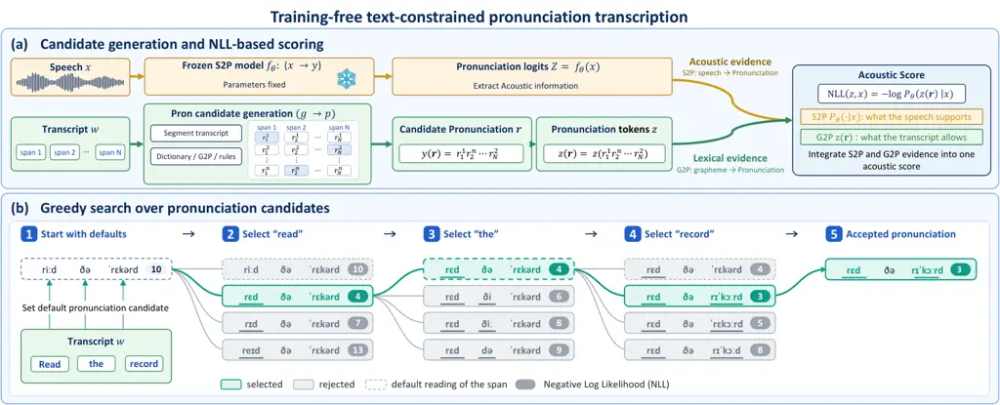

\CJKencfamily

UTF8ipxm\CJK@envStartUTF8

# Training-Free Pronunciation Transcription via Text-Constrained Acoustic RescoringThanks: This work was done during Hikaru Asano’s internship at Sakana AI.

Hikaru Asano    Yotaro Kubo    So Kuroki

###### Abstract

Accurate and efficient pronunciation transcription is essential for
preparing text-to-speech training data at scale. Existing approaches
have different limitations: grapheme-to-pronunciation (G2P) and
speech-to-pronunciation (S2P) methods each capture only partial
information, using only text or only speech, while
speech-and-text-to-pronunciation (ST2P) methods use both but require
costly pronunciation-annotated data. To address this problem, we propose
a training-free ST2P pipeline that integrates both lexical and acoustic
information at inference time. Lexical resources and G2P tools generate
text-constrained candidates, and a left-to-right greedy search selects
the best one using whole-sequence negative log-likelihoods from frozen
pretrained S2P models. On three Japanese corpora, our method reduces
Character Error Rate (CER) from 0.60–1.40% (text-only baseline) to
0.04–0.17% with reference transcripts, and 0.64–1.58% with ASR
transcripts. It outperforms all baselines, including a trained ST2P
model and commercial multimodal LLMs. Our greedy search method is
3–3.5$`\times`$ faster than beam search at similar CER, and the cascade
is 2$`\times`$ faster than direct decoding ensuring the efficiency and
accuracy. In Spanish, French, and preliminary English, it also surpasses
four open multimodal LLMs and the best traditional methods.

###### Index Terms: 

pronunciation transcription, training-free inference, CTC rescoring,
grapheme-to-phoneme conversion

^(†)^(†)address: ¹The University of Tokyo ²Sakana AI

## 1 Introduction

Pronunciation transcription is a technique that recovers pronunciation
symbols from speech signals or transcribed texts \[1, 2\]. It is widely
used in diverse applications including training data preparation for
text-to-speech (TTS) models, language education, and study of
low-resourced languages \[3, 4\]. In particular, keeping pronunciation
transcription inexpensive while maintaining low error rates is crucial
for preparing TTS training data at scale \[5, 6\].

Figure 1: Processing cost versus pronunciation error rates on JVS-dev.
The horizontal axis is the real-time factor (log scale; lower is faster)
and the vertical axis is character error rate (CER) (log scale; lower is
better). The proposed methods (ours) achieves the lowest CER at low
computational cost.

Two conventional approaches address this task using different inputs.
Grapheme-to-pronunciation (G2P) conversion \[7, 8\] predicts a
pronunciation sequence $`y`$ from an orthographic transcript $`w`$.
Speech-to-pronunciation (S2P) conversion \[9, 10\] instead predicts
pronunciation from a speech signal $`x`$. For the application of TTS
data preparation, it is common that both graphemes and speech signals
are available for pronunciation prediction. However, both G2P and S2P
approaches are insufficient because they discard information from the
other clue for pronunciation transcription.

Speech-and-text-to-pronunciation (ST2P) models address this limitation
by jointly using speech and text to predict pronunciation, corresponding
to the mapping $`(x,w)\to y`$. Related approaches incorporate text
through additional text embeddings in an S2P model \[11\] or introduce
textual supervision through multitask training that combines
speech-to-text and S2P objectives \[12\]. Despite their effectiveness,
they require pronunciation-annotated training data, which is typically
more costly than ordinary text transcription and limits
scalability \[13\].

In this paper, we instead explore a “training-free” ST2P pipeline that
leverages existing lexical resources and G2P tools, together with open
pretrained S2P models. The key idea is to generate text-constrained
pronunciation candidates for $`w`$ from lexical resources and G2P tools,
and to select the best one by greedy search using the acoustic scores of
frozen S2P models on $`x`$ (Fig. 2). Both clues are thus integrated
purely at inference time: the pipeline requires neither
audio–text–pronunciation $`(x,w,y)`$ triplets nor any model training,
and is therefore inexpensive while achieving low transcription error
rates.

Our contributions are: (i) We propose a training-free ST2P pipeline that
combines lexical candidates with frozen S2P models (Sec. 3). (ii) On
three Japanese corpora, our method achieves lower character error rates
(CER) than all evaluated baselines, using both reference and ASR
transcripts, while maintaining fast inference as shown in Fig. 1
(Sec. 4.2, 4.3). (iii) We also demonstrate improvements on Spanish,
French, and preliminary English, outperforming four open MLLMs and
text-only specialists with the best configuration for each language
(Sec. 4.4).



Figure 2: Training-free pronunciation transcription. (a) Dictionaries,
G2P, and rules generate readings for transcript spans. Complete
pronunciations $`y(\mathbf{r})`$ are converted to model-specific tokens
and evaluated by a frozen S2P model given speech $`x`$, combining
lexical constraints and acoustic evidence through negative
log-likelihood (NLL). (b) Left-to-right greedy search for “read the
record” ($`P=0`$; illustrative NLLs). Each node represents a complete
pronunciation with earlier choices fixed and later spans at their
defaults. The lowest-NLL candidate (green) is committed; gray nodes are
rejected, and dashed outlines mark span defaults. The final node is the
search output; cascade rescoring and the subsequent margin check are not
shown.

## 2 Task and training-free setting

Task. Given speech $`x`$ and its transcript $`w`$, we estimate the
pronunciation sequence $`y`$ actually realized in $`x`$, rather than its
canonical reading. The transcript may come from reference text or ASR
output; the latter enables an automatic pipeline. The pronunciation
alphabet matches the language and available resources (e.g., kana for
Japanese, IPA otherwise).

## 3 Method

Fig. 2 shows the training-free ST2P pipeline. Candidate pronunciations
$`y`$ for transcript $`w`$ are generated from lexical resources and
scored by frozen S2P models to yield a single acoustic score integrating
acoustic and lexical cues (Fig. 2(a)). The best combination of
pronunciation candidates is found by a left-to-right greedy search
minimizing negative log-likelihood (NLL) under these models given the
speech $`x`$ (Fig. 2(b)).

### 3.1 Candidates and frozen acoustic scores

As in Fig. 2(a), the transcript $`w`$ is segmented into $`N`$ spans,
e.g., by morphological analysis. For each span $`n`$, lexical resources
such as dictionaries, G2P, or rules provide a finite set
$`\mathcal{R}_{n}`$ of candidate readings. One of them, the default
reading $`r_{n}^{0}\in\mathcal{R}_{n}`$, is the most probable reading
predicted from the text alone. Choosing one reading
$`r_{n}\in\mathcal{R}_{n}`$ for every span gives an assignment
$`\mathbf{r}=(r_{1},\ldots,r_{N})\in\mathcal{R}=\prod_{n}\mathcal{R}_{n}`$,
whose complete pronunciation is the concatenation

```math
y(\mathbf{r})=r_{1}\,r_{2}\cdots r_{N}. \tag{1}
```

Instead of scoring each span separately, we evaluate $`y(\mathbf{r})`$
as a whole on the audio $`x`$, jointly judging all readings in context,
and seek

```math
\hat{\mathbf{r}}=\operatorname*{arg\,min}_{\mathbf{r}\in\mathcal{R}}J(\mathbf{r},x),\quad J(\mathbf{r},x)=S(y(\mathbf{r}),x)+P(\mathbf{r}), \tag{2}
```

where $`S`$ is the acoustic score, and the optional penalty $`P`$ favors
more reliable candidates in ambiguous cases. The acoustic score is the
NLL of the candidate under a frozen S2P model,

```math
S(y,x)=-\log p(z(y)\mid x), \tag{3}
```

where $`z`$ renders $`y`$ into the alphabet and tokens of the model.

### 3.2 Greedy search and cascade

As $`|\mathcal{R}|`$ grows exponentially with $`N`$, we approximate the
objective in Eq. (2) by a left-to-right greedy search (Fig. 2(b)),
assuming each span’s acoustic evidence is mostly local. Let
$`\mathbf{r}[n\!\leftarrow\!r]`$ denote $`\mathbf{r}`$ with its $`n`$-th
span replaced by $`r`$. Starting from
$`\hat{\mathbf{r}}^{(0)}=\mathbf{r}^{0}=(r_{1}^{0},\ldots,r_{N}^{0})`$,
we visit each span once. At span $`n`$, we select the best candidate and
commit it:

```math
r_{n}^{\prime}=\operatorname*{arg\min}_{r\in\mathcal{R}_{n}}J(\hat{\mathbf{r}}^{(n-1)}[n\!\leftarrow\!r],x),\;\;\hat{\mathbf{r}}^{(n)}=\hat{\mathbf{r}}^{(n-1)}[n\!\leftarrow\!r_{n}^{\prime}], \tag{4}
```

so that
$`\hat{\mathbf{r}}^{(n)}=(r_{1}^{\prime},\ldots,r_{n}^{\prime},r_{n+1}^{0},\ldots,r_{N}^{0})`$.
Thus, the $`|\mathcal{R}_{n}|`$ candidates are scored as complete
sequences, with earlier choices fixed and later spans at their defaults.
The final assignment is $`\hat{\mathbf{r}}=\hat{\mathbf{r}}^{(N)}`$.

Second scorer and cascade. For added robustness, we can combine two
frozen S2P models using the fused score $`S=L_{1}+\lambda L_{2}`$, where
$`L_{i}`$ is the NLL from model $`i`$ and $`\lambda\geq 0`$ controls the
second model’s weight. To reduce computation, we use a cascade: we first
run the greedy search with $`S=L_{1}`$. If $`\lambda>0`$ and this pass
changes any default reading, we rerun the search from $`\mathbf{r}^{0}`$
with the fused score; otherwise, we retain the first-pass result. We
take the last pass’s output as $`\hat{\mathbf{r}}`$ and use its acoustic
scoring function $`S`$ in the margin check below.

### 3.3 Margin check

The search may still leave the default on weak evidence. We therefore
initialize $`\tilde{\mathbf{r}}=\hat{\mathbf{r}}`$ and revisit the
changed spans from left to right. With a hyperparameter $`\tau\geq 0`$,
at each span $`j`$ we keep the current reading only if its score
advantage over the default meets a length-scaled threshold:

```math
S\big(y(\tilde{\mathbf{r}}[j\!\leftarrow\!r_{j}^{0}]),x\big)-S\big(y(\tilde{\mathbf{r}}),x\big)\geq\tau\,\ell_{j}, \tag{5}
```

where $`\ell_{j}=\max(1,|\tilde{r}_{j}|,|r_{j}^{0}|)`$, with $`|r|`$
counting symbols in the normalized pronunciation alphabet; thus,
$`\tau`$ is the required score gain per symbol. If this condition is not
met, the span is reverted,
$`\tilde{\mathbf{r}}\leftarrow\tilde{\mathbf{r}}[j\!\leftarrow\!r_{j}^{0}]`$,
before the next span is checked. Setting $`\tau=0`$ disables this check.

## 4 Experiments

### 4.1 Japanese resources and protocol

Japanese is a challenging language for acoustic disambiguation: one
orthographic string can have several valid readings (ipxm明日: _asu_,
_ashita_, or _myōnichi_), and the goal is to select the reading actually
spoken in the recording.

Reading candidates. For reading candidate generation, we use Japanese
morphological analyzers and G2P tools such as Sudachi \[14\],
Open JTalk¹¹ 1
[https://open-jtalk.sp.nitech.ac.jp/](https://open-jtalk.sp.nitech.ac.jp/),
MeCab/UniDic \[15\], and rule-based variants. Readings found only by
isolated-span analysis are less reliable, so the penalty $`P`$ in
Eq. (2) is set to $`0.03\,m\,n_{\mathrm{ctc}}`$, where $`m`$ counts
spans switched from the default to such a reading and
$`n_{\mathrm{ctc}}`$ is the utterance length in token count of the main
scorer $`L_{1}`$.

Scorers. We use a 320M-parameter wav2vec2.0 kana CTC model \[16\] as the
first scorer and an 810M-parameter autoregressive kana-whisper \[6\] as
the second. Kana-whisper allows multiple spellings for a pronunciation
(e.g., long vowels, ipxmは/ipxmわ), so $`L_{2}`$ is the negative
logarithm of the teacher-forced likelihoods summed over up to 16
spellings, caching cross-attention per recording.

Hyperparameters. We use second scorer weight $`\lambda=1`$ (from
$`\{0.5,1,2\}`$) and margin check threshold $`\tau=0.6`$ (see Eq. 5),
with the margin check using the final $`S`$ and $`\ell_{j}`$ in
normalized kana. For calibration, we use 1,000 utterances each from JSUT
and JVS-par, transferred to JVS-dev; the spelling limit is set on
JVS-dev. Reading candidate and prompt settings also use these
calibration subsets, which are excluded from evaluation.

Data and transcripts. We use JVS-dev (600 nonparallel utterances, 20
speakers, manual kana) \[17\], JSUT BASIC5000 (5,000 utterances, one
speaker, verified labels) \[18\], and JVS-par (9,997 utterances, 100
speakers, alignment-derived silver labels)²² 2
[https://github.com/r9y9/jvs_r9y9](https://github.com/r9y9/jvs_r9y9),
evaluating all systems on 512 common utterances per corpus. Transcripts
are corpus text (reference) or Whisper large-v3 output \[19\] (ASR).

Baselines and references (Tab. 1). We compare five categories of
baselines: _(A) Text-only G2P:_ Open JTalk, Sudachi + Open JTalk, and
Sudachi + Open JTalk with spoken-form rules (our default, used as the
control for acoustic selection). _(B) Audio-only decoding:_ greedy Kana
CTC and kana-whisper with the same checkpoints as our scorers. _(C)
Same-model text conditioning:_ kana-whisper with a transcript prompt,
and Kana CTC with dictionary-constrained greedy decoding inspired
by \[11\], with and without a long-vowel lattice. _(D) Released ST2P
annotator:_ Furigana Whisper³³ 3
[https://huggingface.co/Parakeet-Inc/furigana_whisper_small_jsut](https://huggingface.co/Parakeet-Inc/furigana_whisper_small_jsut),
a public audio-and-text kana model, with its published decoding and with
the same dictionary constraint over our candidates (not a reproduction
of the unavailable model of \[11\]); JSUT results are omitted because it
was trained on JSUT. _(E) Multimodal LLMs (MLLMs):_ Qwen3-Omni-30B-A3B,
Qwen2.5-Omni-7B, Gemma-3n-E4B, and Phi-4-multimodal \[20, 21, 22\]. We
report Gemini 2.5/3/3.5/3.6 Flash \[23\] as commercial references, which
are not highlighted for best scores due to their high labeling cost. All
MLLMs are given the same audio, transcripts, three fixed examples,
prompt tuned by validation, and one output repair.

Metric. We report corpus-level character error rate (CER, %) after
normalization (katakana, punctuation, long vowels, fixed mappings) to
ignore notational differences. CER is computed on normalized kana, or on
silver labels for JVS-par.

|                                                    |                |       |       |          |       |       |
| -------------------------------------------------- | -------------- | ----- | ----- | -------- | ----- | ----- |
|                                                    | Reference text |       |       | ASR text |       |       |
| System                                             | dev            | JSUT  | par   | dev      | JSUT  | par   |
| _Commercial models (reference only): audio + text_ |                |       |       |          |       |       |
| Gemini 2.5 Flash                                   | 0.62           | 0.84  | 1.29  | 0.98     | 1.14  | 1.95  |
| Gemini 3 Flash                                     | 0.64           | 0.52  | 0.74  | 0.88     | 0.68  | 1.72  |
| Gemini 3.5 Flash                                   | 0.50           | 0.59  | 0.84  | 0.82     | 0.69  | 1.67  |
| Gemini 3.6 Flash                                   | 1.19           | 1.69  | 1.17  | 1.95     | 2.55  | 1.87  |
| _(A) Text only: G2P_                               |                |       |       |          |       |       |
| Open JTalk                                         | 0.98           | 1.52  | 1.35  | 1.64     | 2.12  | 2.82  |
| Sudachi + Open JTalk                               | 1.27           | 1.78  | 0.67  | 2.01     | 2.36  | 2.57  |
|    + spoken-form rules                             | 0.85           | 1.40  | 0.60  | 1.53     | 1.97  | 2.49  |
| _(B) Audio only: same-model decoding_              |                |       |       |          |       |       |
| Kana CTC (greedy)                                  | 5.38           | 5.61  | 13.02 | –        | –     | –     |
| kana-whisper                                       | 0.90           | 0.87  | 2.29  | –        | –     | –     |
| _(C) Audio + text: same-model conditioning_        |                |       |       |          |       |       |
| kana-whisper + prompt                              | 0.71           | 0.79  | 1.64  | 0.79     | 0.81  | 2.06  |
| CTC + dict. constraint^(†)                         | 0.80           | 1.40  | 0.68  | 1.37     | 1.92  | 2.56  |
|    + long-vowel lattice^(†)                        | 0.80           | 1.27  | 0.65  | 1.39     | 1.83  | 2.50  |
| _(D) Audio + text: released ST2P annotator_        |                |       |       |          |       |       |
| Furigana Whisper + prompt                          | 0.90           | –     | 0.63  | 1.21     | –     | 2.05  |
|    + dict. constraint^(†)                          | 0.21           | –     | 0.15  | 0.73     | –     | 1.66  |
| _(E) Audio + text: open MLLMs_                     |                |       |       |          |       |       |
| Qwen3-Omni                                         | 8.13           | 10.31 | 10.03 | 8.47     | 11.31 | 8.09  |
| Qwen2.5-Omni                                       | 16.85          | 23.89 | 25.86 | 17.18    | 25.94 | 27.43 |
| Gemma-3n-E4B                                       | 14.97          | 18.30 | 13.99 | 13.89    | 17.69 | 15.61 |
| Phi-4-multimodal                                   | 61.48          | 65.44 | 68.92 | 58.10    | 64.70 | 74.02 |
| _Audio + text: proposed rescoring_                 |                |       |       |          |       |       |
| Ours (AR-only)                                     | 0.25           | 0.27  | 0.31  | 0.72     | 0.75  | 1.81  |
| Ours (CTC-only)                                    | 0.23           | 0.30  | 0.13  | 0.70     | 0.74  | 1.65  |
| Ours (cascade)                                     | 0.15           | 0.17  | 0.04  | 0.64     | 0.65  | 1.58  |

Table 1: Japanese CER (%, $`\downarrow`$) on 512 common utterances per
corpus. dev/par: JVS-dev/JVS-par. $`\dagger`$: dictionary-constrained
decoding inspired by \[11\]. Furigana Whisper’s JSUT cells are omitted
(training data). Gray: commercial references. Bold: column minima
excluding commercial models.

### 4.2 Japanese results

Main results (Tab. 1). Our cascade outperforms all baselines in both the
reference-text and ASR-text settings, including ST2P Furigana Whisper
with dictionary constraint, which requires pronunciation-labeled speech;
ours uses only frozen components. It also substantially improves over
greedy Kana CTC decoding (5.38/5.61/13.02 to 0.154/0.171/0.042) and the
text-only default (0.85/1.40/0.60), showing that combining S2P scores
and G2P candidates is more effective than either alone. The cascade also
outperforms CTC-only and AR-only rescoring on all corpora.

Ablations (Tab. 2). We validate each component by removing the margin
check (w/o gate, $`\tau=0`$), removing the cascade (w/o cascade, fusing
every utterance), using beam search with width $`B=5`$ (w/ beam), or
replacing the input audio with unrelated or silent audio (other audio,
silent audio). For reference, we also report a greedy oracle that
selects candidates with minimum edit distance to the reference reading,
an approximate oracle within the candidate set.

Tab. 2 shows that removing the gate or cascade raises CER by up to 0.022
and 0.016, indicating that both components are effective. Replacing
audio with other recordings or silence also increases CER to 12.4–16.2%,
confirming that acoustic evidence is necessary. Finally, beam search
performs similarly to greedy search, supporting that each span’s
acoustic evidence is mostly local. We thus prefer greedy search for its
lower cost (Sec. 4.3).

The cascade is only 0.107/0.050/0.042 points above the oracle,
recovering 87–96% of the oracle’s CER reduction over text-only.

|                          |         |         |         |
| ------------------------ | ------- | ------- | ------- |
| Configuration            | JVS-dev | JSUT    | JVS-par |
| _Components_             |         |         |         |
| w/o gate                 | 0.154   | 0.193   | 0.054   |
| w/o cascade              | 0.161   | 0.182   | 0.058   |
| w/ beam                  | 0.167   | 0.160   | 0.042   |
| _Audio substitution_     |         |         |         |
| Proposed w/ other audio  | 15.329  | 16.192  | 12.440  |
| Proposed w/ silent audio | 13.870  | 14.819  | 12.544  |
| _Oracle Reference_       |         |         |         |
| Greedy oracle            | _0.047_ | _0.121_ | _0.000_ |
| Proposed                 | 0.154   | 0.171   | 0.042   |

Table 2: Japanese ablations (CER %, reference text, 512 utterances).
Proposed: cascade, gate ($`\tau=0.6`$), greedy search. w/o gate:
$`\tau=0`$; w/o cascade: fusion every utterance; w/ beam: $`B=5`$.
Other/silent audio: use unrelated or silent audio, keeping
text/candidates.

### 4.3 Cost and accuracy (Fig. 1)

We measured real-time factor (RTF) for all audio-based systems on 512
JVS-dev utterances with reference transcripts, using a single H100 GPU
(batch size one).

Fig. 1 plots RTF against CER: the proposed methods achieve the lowest
CER while remaining comparatively inexpensive. Greedy search is
3–3.5$`\times`$ faster than beam search at comparable CER (Tab. 2). The
cascade method is also twice as fast as kana-whisper decoding because it
runs kana-whisper only on selected spans and scores G2P candidates with
a single forward pass instead of stepwise decoding.

### 4.4 Multilingual evaluation

We test transfer beyond Japanese with reference transcripts, IPA
candidates, and language-specific resources.

Candidates and scorers. Spanish and French candidates come from
CharsiuG2P \[7\] with eSpeak NG and Epitran as fallbacks; English uses
the MFA english_us_arpa dictionary \[24\]. Each pool is extended to up
to 16 candidates with additional G2P outputs and local substitution or
deletion of phonetically similar segments to cover unlisted variants.
PhoneticXeus \[9\] is the main scorer, and fusion adds the POWSM CTC
head \[10\], both scored via Eq. 3.

We reuse the Japanese settings (Sec. 4.1): greedy search, cascade with
$`\lambda=1`$, and the margin check (Sec. 3.3) with $`\ell_{j}`$ counted
in normalized IPA segments. The two main changes are: $`P=0`$, since
these G2P and dictionary candidates contain no isolated-span readings
that the Japanese penalty targets; and $`\tau`$ is set per language (2.0
for Spanish, 1.5 for French, 0 for English) according to each
development set to minimize PFER.

Data. We evaluate Spanish DIMEx100 \[25\], French Rhapsodie \[26\], and
English Buckeye \[27\], sampling 200 utterances per language that
contain at least one variable candidate span (192 for French after
removing utterances without audio). Spanish and French use six speaker
groups each for evaluation and configuration; English uses four groups
each, all drawn from the corpus’s designated development speakers, so
its results are preliminary.

Baselines and references (Tab. 3). _(A) Text-only specialist:_ the
default reading from the language’s dictionary or G2P. _(B) Open MLLMs:_
models from Sec. 4.1, evaluated alongside commercial references with the
same audio, text, and prompting protocol.

Metric. We report phonological feature error rate,
$`\mathrm{PFER}=100\sum\nolimits_{i}w_{i}\,d_{F}(y_{i},\hat{y}_{i})/\sum\nolimits_{i}w_{i}\,|y_{i}|`$,
where $`w_{i}`$ is an inverse-sampling weight (eligible-to-sampled
ratio), and $`d_{F}`$ is an edit distance using PanPhon feature
distances \[28\] for substitutions and unit costs for insertions and
deletions. Fixed IPA mappings align conventions within each language.
PFER scores are not directly comparable across languages.

|                                                    |           |           |           |
| -------------------------------------------------- | --------- | --------- | --------- |
| System                                             | Spanish   | French    | English   |
|                                                    | $`n=200`$ | $`n=192`$ | $`n=200`$ |
| _Commercial models (reference only): audio + text_ |           |           |           |
| Gemini 2.5 Flash                                   | 2.23      | 4.41      | 13.84     |
| Gemini 3 Flash                                     | 2.13      | 2.98      | 13.05     |
| Gemini 3.5 Flash                                   | 2.01      | 4.05      | 13.85     |
| Gemini 3.6 Flash                                   | 2.53      | 3.82      | 13.70     |
| _(A) Text only: dictionary / G2P_                  |           |           |           |
| Specialist default reading                         | 2.47      | 4.39      | 13.76     |
| _(B) Audio + text: open MLLMs_                     |           |           |           |
| Qwen3-Omni                                         | 3.90      | 11.08     | 17.05     |
| Qwen2.5-Omni                                       | 5.99      | 28.56     | 28.60     |
| Gemma-3n-E4B                                       | 7.52      | 20.21     | 25.40     |
| Phi-4-multimodal                                   | 57.32     | 128.35    | 74.38     |
| _Audio + text: proposed rescoring_                 |           |           |           |
| Ours (PhoneticXeus-only)                           | 2.38      | 4.33      | 14.01     |
| Ours (cascade)                                     | 2.52      | 4.11      | 13.21     |

Table 3: PFER (%, $`\downarrow`$) on shared subsets with candidate
variation. (A): reference text only; others: text and audio. Gray:
commercial references. Bold: best (non-commercial).

Results (Tab. 3). With only a change of lexical resources and scorers,
and no training, the pipeline improves on the language-specific
specialist in all three languages (2.47$`\to`$2.38 in Spanish with
PhoneticXeus-only; 4.39$`\to`$4.11 and 13.76$`\to`$13.21 in French and
English with the cascade). Both configurations outperform every open
MLLM. The best configuration is within 0.4 points of the top Gemini
model in Spanish and English. Gains depend on resource and scorer
matching, so choosing resources is key.

## 5 Conclusion

We proposed a training-free ST2P pipeline based on open models and
lexical resources. For Japanese, it is faster and outperforms all
baselines. The method also works for Spanish, French, and English.

## References

- \[1\] A Waibel, T Hanazawa, G Hinton, K Shikano, and K J Lang,
  “Phoneme recognition using time-delay neural networks,” IEEE
  Transactions on Acoustics, Speech, and Signal Processing, 1989.
- \[2\] Alex Graves, Abdel-Rahman Mohamed, and Geoffrey Hinton, “Speech
  recognition with deep recurrent neural networks,” in 2013 IEEE
  International Conference on Acoustics, Speech and Signal Processing
  (ICASSP), 2013.
- \[3\] John Kominek and Alan W. Black, “The CMU Arctic speech
  databases,” in 5th ISCA Workshop on Speech Synthesis (SSW 5), 2004.
- \[4\] Horacio Franco, Leonardo Neumeyer, María Ramos, and Harry Bratt,
  “Automatic detection of phone-level mispronunciation for language
  learning,” in 6th European Conference on Speech Communication and
  Technology, 1999.
- \[5\] Jaehyeon Kim, Jungil Kong, and Juhee Son, “Conditional
  variational autoencoder with adversarial learning for end-to-end
  text-to-speech,” in Proceedings of the 38th International Conference
  on Machine Learning (ICML), 2021.
- \[6\] Lianbo Liu, Shiao Zhu, Kai Washizaki, Reo Yoneyama, Haesung
  Jeon, Mengjie Zhao, Yusuke Fujita, Hao Shi, Nao Yoshida, Yuan Gao,
  Roman Koshkin, Yukiya Hono, and Yui Sudo, “Sarashina2.2-TTS: Tackling
  kanji polyphony in japanese speech generation via data scaling and
  targeted data synthesis,” arXiv \[cs.SD\], 2026.
- \[7\] Jian Zhu, Cong Zhang, and David Jurgens, “ByT5 model for
  massively multilingual grapheme-to-phoneme conversion,” in Proceedings
  of Interspeech, 2022.
- \[8\] Tomoki Koriyama, “Benchmarking large language models for
  grapheme-to-phoneme conversion: A japanese case study,” in Proceedings
  of Interspeech, 2026.
- \[9\] Shikhar Bharadwaj, Chin-Jou Li, Kwanghee Choi, Eunjung Yeo,
  William Chen, Shinji Watanabe, and David R. Mortensen, “An empirical
  recipe for universal phone recognition,” in Proceedings of
  Interspeech, 2026.
- \[10\] Chin-Jou Li, Kalvin Chang, Shikhar Bharadwaj, Eunjung Yeo,
  Kwanghee Choi, Jian Zhu, David R Mortensen, and Shinji Watanabe,
  “POWSM: A phonetic open whisper-style speech foundation model,” in
  Proceedings of the 64th Annual Meeting of the Association for
  Computational Linguistics (Volume 1: Long Papers), 2026.
- \[11\] Hien Ohnaka, Yuma Shirahata, Byeongseon Park, and Ryuichi
  Yamamoto, “Grapheme-Coherent Phonemic and Prosodic Annotation of
  Speech by Implicit and Explicit Grapheme Conditioning,” in Proceedings
  of Interspeech, 2025, pp. 2525–2529.
- \[12\] Yotaro Kubo, Richard Sproat, Chihiro Taguchi, and Llion Jones,
  “Building tailored speech recognizers for Japanese speaking
  assessment,” in Proceedings of Interspeech, 2026.
- \[13\] John S Garofolo, Lori F Lamel, William M Fisher, Jonathan G
  Fiscus, David S Pallett, and Nancy L Dahlgren, “DARPA
  TIMIT::acoustic-phonetic continuous speech corpus CD-ROM, NIST speech
  disc 1-1.1,” Jan. 1993.
- \[14\] Kazuma Takaoka, Sorami Hisamoto, Noriko Kawahara, Miho
  Sakamoto, Yoshitaka Uchida, and Yuji Matsumoto, “Sudachi: a japanese
  tokenizer for business,” in Proceedings of the Eleventh International
  Conference on Language Resources and Evaluation (LREC), 2018.
- \[15\] Taku Kudo, Kaoru Yamamoto, and Yuji Matsumoto, “Applying
  conditional random fields to japanese morphological analysis,” in
  Proceedings of the 2004 Conference on Empirical Methods in Natural
  Language Processing (EMNLP), 2004.
- \[16\] Sakasegawa, “hiragana-asr: Lightweight japanese asr with dual
  ctc,” 2026.
- \[17\] Shinnosuke Takamichi, Kentaro Mitsui, Yuki Saito, Tomoki
  Koriyama, Naoko Tanji, and Hiroshi Saruwatari, “JVS corpus: free
  japanese multi-speaker voice corpus,” arXiv \[cs.SD\], 2019.
- \[18\] Ryosuke Sonobe, Shinnosuke Takamichi, and Hiroshi Saruwatari,
  “JSUT corpus: free large-scale japanese speech corpus for end-to-end
  speech synthesis,” arXiv \[cs.CL\], 2017.
- \[19\] Alec Radford, Jong Wook Kim, Tao Xu, Greg Brockman, Christine
  McLeavey, and Ilya Sutskever, “Robust speech recognition via
  large-scale weak supervision,” in Proceedings of the 40th
  International Conference on Machine Learning (ICML), 2023.
- \[20\] Qwen Team, “Qwen3-omni technical report,” arXiv
  \[cs.CL\], 2025.
- \[21\] Qwen Team, “Qwen2.5-omni technical report,” arXiv
  \[cs.CL\], 2025.
- \[22\] Microsoft, “Phi-4-mini technical report: Compact yet powerful
  multimodal language models via mixture-of-LoRAs,” arXiv
  \[cs.CL\], 2025.
- \[23\] Gemini Team, Google, “Gemini 2.5: Pushing the frontier with
  advanced reasoning, multimodality, long context, and next generation
  agentic capabilities,” arXiv \[cs.CL\], 2025.
- \[24\] Kyle Gorman, Jonathan Howell, and Michael Wagner,
  “Prosodylab-aligner: A tool for forced alignment of laboratory
  speech,” Canadian Acoustics, vol. 39, no. 3, pp. 192–193, 2011.
- \[25\] Luis A Pineda, Luis Villaseñor Pineda, Javier Cuétara, Hayde
  Castellanos, and Ivonne López, “DIMEx100: A new phonetic and speech
  corpus for mexican spanish,” in Advances in Artificial Intelligence –
  IBERAMIA 2004, 2004.
- \[26\] Anne Lacheret, Sylvain Kahane, Julie Beliao, Anne Dister, Kim
  Gerdes, Jean-Philippe Goldman, Nicolas Obin, Paola Pietrandrea, and
  Atanas Tchobanov, “Rhapsodie: a prosodic-syntactic treebank for spoken
  french,” in Proceedings of the Ninth International Conference on
  Language Resources and Evaluation (LREC), 2014.
- \[27\] M.A. Pitt, L. Dilley, K. Johnson, S. Kiesling, W. Raymond,
  E. Hume, and E. Fosler-Lussier, “Buckeye Corpus of Conversational
  Speech (2nd release).,” 2007.
- \[28\] David R Mortensen, Patrick Littell, Akash Bharadwaj, Kartik
  Goyal, Chris Dyer, and Lori Levin, “PanPhon: A resource for mapping
  IPA segments to articulatory feature vectors,” in Proceedings of
  COLING 2016, the 26th International Conference on Computational
  Linguistics: Technical Papers, 2016.

\CJK@envEnd
