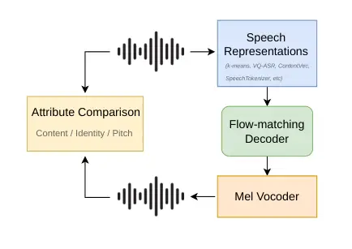

# A Comprehensive Study of Content Representations for Speech Synthesis

Diego Torres    Axel Roebel    Nicolas Obin

###### Abstract

Speech content representations are central to voice conversion,
speech-to-speech translation, and multimodal language models, yet they
are rarely compared under a common generative framework that directly
measures what each representation contains. We address this by training
a generative model conditioned solely on each representation and
evaluating the generated audio along the content, speaker identity, and
prosody axes. Across SSL features, supervised tokens, posteriorgrams,
and neural audio codecs, we find two distinct regimes: representations
that nearly reconstruct the original audio, and representations that
effectively disentangle speaker identity. These results show that
disentanglement depends not on supervision alone, but on the interaction
between the training objective and the representation’s information
capacity: supervised representations only disentangle speaker identity
when their capacity is sufficiently constrained.

###### Index Terms: 

speech synthesis, speech tokenizer, voice conversion, speaker
disentanglement

^(†)^(†)address: STMS Lab  
IRCAM, CNRS, Sorbonne Université  
Paris, France

## 1 Introduction

Content representations of speech (often called ‘‘semantic tokens’’¹¹ 1
We prefer “content representations” as these features encode phonetic
rather than semantic information \[1\], and are not necessarily
discrete.) aim to capture the linguistic content of a speech signal
while discarding speaker, prosodic, and acoustic information. They have
facilitated speech synthesis tasks such as voice conversion \[2, 3\],
style transfer \[4\], and speech-to-speech translation \[5\], and have
also been used as intermediate representations in text-to-speech systems
\[6, 7\]. Moreover, combined with LLMs, they have enabled multimodal
models capable of performing a wide range of speech- and sound-related
tasks \[8, 9, 10\]. Different applications, however, impose different
and sometimes opposing requirements: conventional voice conversion
focuses primarily on timbral information, with prosodic changes
generally being incidental, whereas accent conversion explicitly targets
prosodic characteristics. The relevant question is therefore not whether
a representation is disentangled in some abstract sense, but rather
which aspects of speech it captures, and to what extent.

Prior work has examined this question from several angles. One line of
research has benchmarked a wide range of speech tokenizers on
discriminative and generative tasks \[11, 12, 13\]. However, these
studies place acoustic and content tokenizers in a single ranking
despite their differing objectives, and do not directly assess
disentanglement. Another study \[14\] probes SSL features using
prediction heads, but is limited to k-means and RVQ representations
derived from two HuBERT layers, leaving a broad range of representations
unexplored. Similarly, \[15\] measures the recoverability of accent
information in synthesized speech using ABX testing and a generative
framework. Beyond these benchmarking efforts, Soft-VC \[16\] and Vevo
\[4\] investigate how architectural choices affect disentanglement in
the context of voice conversion: Soft-VC compares discrete and soft
representations, while Vevo examines the effect of codebook size for
discrete representations.

This paper builds on and consolidates these efforts. Existing
evaluations largely group representations according to how they are
produced, focusing primarily on SSL features and their quantized
variants. In contrast, we adopt a broader scope, considering a diverse
range of representations, including clustering-based representations,
supervised tokens, posteriorgrams, and neural audio codecs. Although
these representations arise from fundamentally different approaches,
they can be viewed as alternative ways of encoding linguistic content
for downstream applications. Despite this shared role, they have rarely
been evaluated under a common speech synthesis framework. Our unified
evaluation reveals distinct regimes among these representations, shaped
primarily by the interplay between training objective and information
capacity.

## 2 Methodology

Our methodology builds on the approach used by \[16, 4, 15\], in which a
generative model is trained to synthesize speech from a given
representation, and the generated audio is subsequently evaluated for
the attributes it preserves (Figure 1). Unlike these approaches, our
generative model has no access to speaker identity information, either
in the form of a speaker ID (as in \[15\]) or reference audio (as in
\[4\]). Providing such information introduces a potential confound: even
if the representation contains speaker-specific information, the
generative model may learn to rely on the additional identity channel as
well. In that case, evaluating voice conversion performance does not
provide a reliable estimate of the degree of speaker disentanglement in
the representation itself.²² 2 This does not invalidate their results
for voice conversion, but rather limits their interpretation as a
measure of representation-level disentanglement. Our setup avoids this
confound, as any speaker information present in the generated audio must
necessarily pass through the representation.



Figure 1: Diagram of the evaluation methodology.

Formally, the generative model learns the conditional distribution
$`x_{\text{gen}}\sim p(x|r)`$ given the representation $`r`$. Since
$`r`$ is a deterministic function of the input audio, $`r=f(x)`$,
generation can be viewed as sampling from the set of utterances
compatible with it, $`\mathcal{X}(r)=\{x:f(x)=r\}`$. Attributes that are
invariant within this set are preserved in the generated sample, whereas
those that vary across the set are resampled according to the learned
distribution.

For example, if the representation encodes speaker identity, the
generated speech is expected to preserve the identity of the source
speaker, while other attributes, such as prosody, may be resampled.
Conversely, if speaker identity is only partially encoded, the generated
audio may not reproduce the original speaker exactly, but it may share
coarse attributes with the source, such as gender, accent, or vocal
characteristics, without fully matching the source identity ³³ 3 Audio
samples: https://content-demo.diegotg2000.workers.dev/. In practice, the
expression of an attribute in generated audio depends not only on the
representation but also on the decoder’s capacity to recover it, which
makes the evaluation a lower bound on the true amount of information
inside the representations.

### 2.1 Evaluation metrics

We compare the original and the generated audio along three axes:
linguistic content, speaker identity and prosody. Content is measured by
the differential word error rate (dWER), which is the word error rate
between the ASR transcriptions of the two audios. Evaluation is
restricted to the utterances that the ASR transcribes correctly from the
real audio. We do this to prevent audios of poor quality skewing the
distribution in favor of acoustic features that simply recreate the
audio, even when content is gibberish. Speaker identity is measured with
the VoicePrivacy protocol \[17\]: the equal error rate (EER) of a
speaker verification system asked to verify the generated audio against
the original speaker, scoring each trial by the cosine similarity
between the two embeddings. Target trials pair a generated utterance
with a real utterance of the same speaker, non-target trials with a real
utterance of a different speaker. An EER of $`50\%`$ means the verifier
is at chance and no speaker information was present in the input
representation. We also fit a logistic probe to predict gender on the
speaker embeddings and compute its accuracy against the gender of the
source speaker. The evaluation dataset is almost gender-balanced, with
52.9% of utterances being female, which gives the floor of the probe
accuracy. As for prosody, we decompose the MSE error between the F0
contours (in cents) of the original and generated audio as:

```math
\text{MSE}=(\mu_{\text{og}}-\mu_{\text{gen}})^{2}+(\sigma_{\text{og}}-\sigma_{\text{gen}})^{2}+2\sigma_{\text{og}}\sigma_{\text{gen}}(1-\rho),
```

where $`\mu`$ and $`\sigma`$ denote the mean and standard deviation of
the F0, and $`\rho`$ denotes the correlation between the two contours.
We refer to $`\Delta\mu`$ as the register error and $`\Delta\sigma`$ as
the range error.

Transcriptions are produced by Parakeet⁴⁴ 4
https://huggingface.co/nvidia/parakeet-ctc-0.6b \[18\], speaker
embeddings by ECAPA-TDNN⁵⁵ 5
https://huggingface.co/speechbrain/spkrec-ecapa-voxceleb \[19\] and F0
by PENN⁶⁶ 6 https://github.com/interactiveaudiolab/penn\[20\]. We
additionally report UTMOS⁷⁷ 7 https://github.com/Blinorot/utmos-pytorch
\[21\] as a check that generated audio remains of decent quality without
severely affecting the other metrics.

## 3 Implementation details

### 3.1 Data

We perform our experiments on the LibriTTS dataset \[22\]. Training is
done on the train.clean.100 and train.clean.360 splits, model
checkpoints are chosen by their loss on dev.clean, and the final
evaluation is reported on test.clean. This includes training and
validation of the generative model as well as the representations and
vocoder. Audio is used at 24 kHz for synthesis and resampled to 16 kHz
wherever a self-supervised encoder is involved.

### 3.2 Representations

All representations we study operate at 50 Hz, allowing us to compare
the information encoded per frame directly, and avoid the confounding of
the frame rate.

SSL features. We evaluate HuBERT-base \[23\] and WavLM-base \[24\]
representations, using the sixth layer following related work \[25\]. We
also apply k-means clustering to these features using the FAISS
library \[26\], with 10k randomly sampled utterances from
train.clean.360 and 20 iterations. Since preliminary results showed no
significant difference between the two models, we use HuBERT-base layer
6 for all subsequent experiments where an SSL model is used as backbone.

VQ-VAE. Inspired by Vevo \[4\], we train an autoencoder with a VQ
bottleneck to reconstruct HuBERT features using an L2 loss. The
architecture consists of eight 1D ConvNeXt blocks \[27\] with 512
channels, with the quantizer placed in the middle. The codebook has 256
dimensions and is updated using EMA, while the commitment loss is
weighted by 0.25.

VQ-ASR. Inspired by CosyVoice \[7\], we train an ASR model with a VQ
bottleneck. The model takes frozen HuBERT features as input and uses the
same architecture as VQ-VAE, followed by a linear CTC head over
characters. We additionally consider the continuous latent features
_before_ the VQ module, which allows us to separately study supervision
without quantization.

PPG. We use MFA alignments \[28\] as targets to train a frame-wise
phoneme recognizer on frozen HuBERT features. The model consists of
eight ConvNeXt blocks with 512 channels, with a self-attention layer
inserted every two blocks. Its output is a 40-dimensional posterior
distribution per frame over the 39 ARPAbet phones plus silence. We also
evaluate the argmax variant, which yields a discrete representation over
40 symbols

Soft units. Introduced in Soft-VC \[16\], we fine-tune HuBERT to predict
$`k`$-means indices, enforcing a “semantic” yet continuous
representation. The targets are obtained from the 64-cluster $`k`$-means
model described above. Due to computational constraints the fine-tuning
is done with LoRA \[29\] (rank 16, $`\alpha=32`$, dropout 0.05) on the
attention projections of every layer. Further implementation details can
be found in \[16\].

SpeechTokenizer. Introduced in \[30\], SpeechTokenizer is a neural audio
codec based on RVQ, with its first codebook level distilled from HuBERT
and intended to capture linguistic content. We use the publicly
available checkpoint⁸⁸ 8
https://huggingface.co/OpenMOSS-Team/SpeechTokenizer trained on
LibriSpeech and retain only the first level.

ContentVec. Introduced in \[3\], its training recipe is specifically
designed to derive speaker-independent content representations. We use
the publicly available ‘‘legacy’’ checkpoint trained on LibriSpeech with
100 clusters as targets⁹⁹ 9
https://github.com/auspicious3000/contentvec.

### 3.3 Acoustic model

The same acoustic model is trained on all representations, only the
input dimensionality changes. Content representations are first
upsampled from 50 Hz to 100 Hz, after which a flow-matching
module \[31\] uses them as conditioning to generate 100 Hz
mel-spectrograms (100 mel bands, 1024-point FFT, hop size 240 at
24 kHz). Both components are built from ConvNeXt layers with an
attention layer. The upsampler comprises two blocks of six layers, while
the flow-matching module uses a U-Net architecture with four blocks of
eight layers and $`\sigma_{min}=10^{-4}`$. The resulting model has
approximately 67M parameters and is trained for 800k iterations with a
batch size of 32 on a single RTX 4070, using AdamW with a learning rate
of $`10^{-4}`$. We use classifier-free guidance \[32\], dropping the
conditioning with probability 0.1.

At inference, we solve the flow ODE using a midpoint solver with 10
steps and a guidance scale of $`w=2.0`$, using the same fixed random
seed for all systems. Waveforms are generated with a custom Vocos \[27\]
checkpoint trained for 1M steps.

|            |            |         |          |        |      |         |       |       |
| ---------- | ---------- | ------- | -------- | ------ | ---- | ------- | ----- | ----- |
|            |            | Content | Identity |        |      | Prosody |       |       |
|            | $`K`$      | dWER    | EER      | Gender | Sim. | Reg.    | Range | Corr. |
| Real audio | –          | –       | 0.5      | 96.9   | –    | –       | –     | –     |
| Vocos      | –          | 0.2     | 0.6      | 97.8   | 0.89 | 6       | 8     | 0.98  |
| HuBERT     | $`\infty`$ | 0.5     | 1.3      | 98.7   | 0.61 | 48      | 30    | 0.94  |
|            | 1024       | 1.7     | 32.4     | 91.7   | 0.16 | 181     | 81    | 0.48  |
|            | 256        | 2.3     | 36.1     | 78.4   | 0.14 | 206     | 90    | 0.41  |
|            | 64         | 5.8     | 36.0     | 84.0   | 0.15 | 261     | 108   | 0.40  |
| WavLM      | $`\infty`$ | 0.5     | 2.0      | 99.0   | 0.52 | 71      | 29    | 0.94  |
|            | 256        | 1.9     | 37.4     | 79.8   | 0.14 | 263     | 93    | 0.41  |
| VQ-ASR     | $`\infty`$ | 0.7     | 8.6      | 99.0   | 0.35 | 100     | 54    | 0.83  |
|            | 1024       | 2.2     | 46.3     | 55.0   | 0.11 | 450     | 100   | 0.36  |
|            | 256        | 2.7     | 46.6     | 53.0   | 0.11 | 452     | 99    | 0.33  |
|            | 64         | 3.0     | 48.4     | 49.5   | 0.10 | 505     | 96    | 0.34  |
| VQ-VAE     | 1024       | 0.8     | 12.8     | 99.3   | 0.30 | 117     | 58    | 0.88  |
|            | 256        | 1.1     | 15.7     | 99.2   | 0.27 | 127     | 59    | 0.87  |
|            | 64         | 1.4     | 20.3     | 98.9   | 0.24 | 136     | 71    | 0.84  |
| Soft units | $`\infty`$ | 0.5     | 2.2      | 98.5   | 0.51 | 79      | 42    | 0.92  |
| PPG        | $`\infty`$ | 2.0     | 40.0     | 74.9   | 0.13 | 328     | 90    | 0.31  |
| argmax     | 40         | 2.9     | 43.0     | 68.6   | 0.12 | 455     | 183   | 0.26  |
| ContentVec | $`\infty`$ | 0.6     | 16.3     | 91.0   | 0.28 | 177     | 75    | 0.88  |
| SpeechTok. | 1024       | 3.1     | 28.8     | 92.7   | 0.18 | 204     | 89    | 0.41  |

Table 1: Evaluation results for the considered speech content
representations. dWER, EER and gender accuracy are measured in
percentage. Register and range errors are measured in cents. dWER is
computed corpus-wise, prosody metrics are shown as the median, while
gender and speaker similarity are the mean. $`K`$ indicates the number
of discrete codes, and is set to $`\infty`$ whenever a representation is
continuous.

Figure 2: Scatter plot of EER and pitch correlation versus dWER. Numbers
next to the markers indicate the codebook size, and their absence
indicates that the features are continuous. Bars indicate the 95%
confidence intervals of: the mean of EER, the median of pitch
correlation, and the corpus-wise dWER.

|            | $`K`$      | dWER (%)         | EER (%)           | Gender (%)          | Pitch Corr.         |
| ---------- | ---------- | ---------------- | ----------------- | ------------------- | ------------------- |
| VQ-ASR 8-d | 256        | $`\uparrow`$ 3.2 | 46.8              | 55.9                | $`\downarrow`$ 0.29 |
|            | $`\infty`$ | $`\uparrow`$ 2.4 | $`\uparrow`$ 39.7 | $`\downarrow`$ 71.9 | $`\downarrow`$ 0.35 |

Bold: statistically significant differences with respect to the
equivalent 256-$`d`$ VQ.

Table 2: Evaluation of VQ-ASR when the codebook dimension is decreased
to 8. Both the quantized version with 256 codes and the continuous
version are considered.

|                |       |           |                    |           |                      |           |                   |
| -------------- | ----- | --------- | ------------------ | --------- | -------------------- | --------- | ----------------- |
|                |       | dWER (%)  |                    | EER (%)   |                      | UTMOS     |                   |
| Representation | bit/s | $`w{=}1`$ | $`w{=}2`$          | $`w{=}1`$ | $`w{=}2`$            | $`w{=}1`$ | $`w{=}2`$         |
| Real audio     | –     | –         |                    | 0.5       |                      | 4.14      |                   |
| Vocos          | –     | 0.2       |                    | 0.6       |                      | 3.77      |                   |
| HuBERT         | 1.2 M | 0.5       | 0.5                | 1.3       | 1.3                  | 3.77      | 3.77              |
| ContentVec     | 1.2 M | 1.0       | $`\downarrow`$ 0.6 | 19.6      | $`\downarrow`$ 16.3  | 3.54      | $`\uparrow`$ 3.86 |
| Soft units     | 410 k | 0.5       | 0.5                | 3.2       | $`\downarrow`$   2.2 | 3.74      | $`\uparrow`$ 3.82 |
| PPG            | 64 k  | 3.4       | $`\downarrow`$ 2.0 | 40.5      | 40.0                 | 3.42      | $`\uparrow`$ 4.00 |
| k-means 256    | 400   | 3.1       | $`\downarrow`$ 2.3 | 38.7      | 36.1                 | 3.48      | $`\uparrow`$ 4.02 |
| VQ-VAE 256     | 400   | 1.6       | $`\downarrow`$ 1.1 | 18.8      | $`\downarrow`$ 15.7  | 3.54      | $`\uparrow`$ 3.94 |
| VQ-ASR 256     | 400   | 4.2       | $`\downarrow`$ 2.7 | 46.2      | 46.6                 | 3.24      | $`\uparrow`$ 4.04 |

Bold: statistically significant differences between $`w{=}1.0`$ and
$`w{=}2.0`$.

Table 3: Comparison of metrics when guidance scale is changed ($`w=1.0`$
vs $`w=2.0`$).

|             | $`K`$ | dWER (%)           | EER (%) | Gender (%) | Pitch Corr.       |
| ----------- | ----- | ------------------ | ------- | ---------- | ----------------- |
| $`k`$-means | 256   | 2.3                | 34.8    | 85.0       | $`\uparrow`$ 0.43 |
| VQ-ASR      | 256   | $`\downarrow`$ 2.5 | 47.7    | 50.5       | $`\uparrow`$ 0.37 |

Bold: statistically significant differences with respect to the normal
decoder.

Table 4: Evaluation with a decoder with three times as many parameters.

## 4 Results

Our results reveal that the considered representations span the full
range of disentanglement, from features that nearly preserve the
original audio to those that effectively mask speaker identity. Raw
HuBERT and WavLM features fall in the first group, which is expected
given that neural audio codecs \[33\] and waveform vocoders \[34\] have
been trained to reconstruct audio from such representations, confirming
that they retain sufficient information for high-fidelity
reconstruction. Surprisingly, Soft Units lie close to these
representations, while ContentVec and continuous VQ-ASR also remain
closer to this group than to the more disentangled representations.
These representations share a continuous, high-dimensional structure,
suggesting that supervision promoting linguistic content does not by
itself prevent other acoustic information from being encoded. At the
other extreme, VQ-ASR and PPGs effectively remove speaker information
from the generated audio: VQ-ASR achieves EER values indistinguishable
from chance, while its gender-classification accuracy remains close to
the 52.9% baseline determined by the gender distribution. This suggests
that it is the _combination_ of supervision and a bottleneck that drives
disentanglement \[35\]. Crucially, a bottleneck alone is not sufficient
either. Although VQ-VAE imposes a bottleneck, its sole objective is
feature reconstruction, resulting in effective compression \[33\] but
little disentanglement.

Codebook size has a secondary effect: smaller codebooks tend to reduce
speaker and pitch information, but the effect is insufficient to move a
representation between the two regimes. This contrasts with approaches
such as Vevo \[4\], which use codebook size to differentiate content
from content-style tokens. Within their task’s framework, our results
suggest a natural assignment: VQ-ASR features serve as content tokens,
whereas VQ-VAE features are better categorized as content-style tokens.

We also investigate the effect of reducing the dimensionality of the VQ
module, from 256 to only 8 dimensions. We evaluate both the quantized
and continuous variants, with the results shown in Table 2. The
performance of the quantized version is largely unaffected by this
substantial reduction in dimensionality, with dWER and pitch correlation
being the only metrics showing significant differences. In contrast, the
continuous version exhibits a markedly different behavior: the
8-dimensional variant achieves substantially better disentanglement
performance than its 256-dimensional counterpart, with EER going from
8.6% to 39.7%. Together with the performance of continuous PPGs, these
results support the hypothesis that the main contribution of
quantization is to constrain representational capacity, rather than to
directly induce disentanglement.

Interestingly, the first RVQ level of SpeechTokenizer falls outside of
the two groups. At 1024 codes, VQ-VAE provides substantially better
performance as a “complete” representation, whereas VQ-ASR and even
$`k`$-means perform better as linguistic representations, achieving
lower dWER at comparable or higher EER. One possible explanation is that
SpeechTokenizer’s first level is jointly optimized for signal
reconstruction and HuBERT distillation. These objectives encourage the
representation to retain both acoustic and linguistic information,
resulting in a code that is neither strongly phonetic nor fully
acoustic.

To understand why VQ-ASR and PPGs, which are explicitly trained to
capture linguistic content, exhibit higher dWER, qualitative inspection
suggests that the main source is encoder-level confusion. In fast or
out-of-distribution speech, frames can be assigned to incorrect
linguistic clusters, causing the generator to reconstruct audio that is
plausible but linguistically incorrect. This failure mode is largely
absent for the “complete” representations, which do not attempt to
extract discrete linguistic units and instead preserve sufficient
information for near-complete reconstruction. Regarding prosody, as
measured by pitch correlation, we find that zero correlation is not
attainable: linguistic content inherently constrains the overall shape
of the pitch contour. The correlation observed for PPGs can therefore be
interpreted as a practical lower bound on the amount of pitch
information, which VQ-ASR approaches closely.

### 4.1 Robustness to decoder capacity and sampling parameters

Having established the main findings, we now verify their robustness to
decoder capacity and sampling parameters. First, we train a decoder with
three times as many parameters ($`\sim`$221M) on top of the $`k`$-means
and VQ-ASR features with 256 codes. As shown in Table 4, most of the
metrics show no significant change, and even where differences are
statistically significant, they remain small compared to the gaps
between the representations.

As for sampling parameters, we run inference at guidance scales of
$`w=1.0`$ and $`w=2.0`$ (Table 3). Increasing guidance generally
improves both dWER and UTMOS across all representations, but does not
change their relative ordering: the only pair that swaps, PPGs and
$`k`$-means 256, was statistically indistinguishable at $`w=1.0`$. EER
is mostly unaffected, except for a significant yet small decrease for
the “complete” representations. Interestingly, at $`w=2.0`$,
disentangled representations achieve a UTMOS score even higher than
ground-truth Vocos reconstruction. This is likely because a more
“complete” representation nearly determines the recording, leaving
guidance little room for improvement, whereas a bottlenecked
representation leaves some details unspecified. Guidance can then steer
these details towards a clean, typical realization rather than
reproducing the noise and room characteristics of the original
recording.

## 5 Limitations

Our methodology provides a lower bound on the information present in
each representation: only a perfect decoder and a perfect evaluator
would allow us to measure the true information content. In practice, the
decoder may fail to exploit information that the representation does
contain, and the evaluation metrics are themselves imperfect proxies.
Results with a larger decoder (Table 4) and varying guidance (Table 3)
suggest that the gaps we observe are not driven by these factors, as
they leave the relative ordering of representations largely unchanged,
but the lower-bound interpretation should be kept in mind.

A key advantage of our generative framework is that it produces audio,
which opens the door to perceptual evaluation. The objective metrics we
rely on (UTMOS for quality, or ECAPA-TDNN for speaker identity) are
proxies for human judgment, and may not capture all perceptually
relevant distinctions. Subjective listening tests would provide a
perceptual measure of what is preserved and discarded. We leave this
extension to future work.

## 6 Conclusions

We presented a standardized, reference-free generative framework to
benchmark speech content representations. Our findings offer several
practical guidelines for speech tokenization:  (1) Supervision requires
a bottleneck: ASR objectives get the best disentanglement properties,
but only when an explicit constraint, such as vector quantization or
low-dimensional projection, is used to eliminate identity and prosodic
leakage.  (2) Decouple compression from content: Jointly optimizing
single tokens for reconstruction and distillation (as in
SpeechTokenizer’s first layer) degrades both linguistic accuracy and
disentanglement relative to dedicated content codes.  (3) Codebook size
is secondary: Varying codebook capacity changes the information content
within a regime but does not alter the fundamental disentanglement
profile set by the training objective. Overall, this unified information
space facilitates the choice of representations for downstream tasks and
provides a standardized benchmark for evaluating future representations.

## 7 Acknowledgments

This work was partly performed using HPC resources from GENCI-IDRIS
(Grant 2026-AD011016144R1), and funded by the ANR project EVA
(ANR-23-CE23-0018).

## References

- \[1\] K. Choi, A. Pasad, T. Nakamura, et al. (2024) Self-Supervised
  Speech Representations are More Phonetic than Semantic. In
  Interspeech, Cited by: footnote 1.
- \[2\] L. Sun, K. Li, H. Wang, S. Kang, and H. Meng (2016) Phonetic
  posteriorgrams for many-to-one voice conversion without parallel data
  training. In ICME, Cited by: §1.
- \[3\] K. Qian, Y. Zhang, H. Gao, et al. (2022) ContentVec: an improved
  self-supervised speech representation by disentangling speakers. In
  ICML, Cited by: §1, §3.2.
- \[4\] X. Zhang, X. Zhang, K. Peng, et al. (2025) Vevo: controllable
  zero-shot voice imitation with self-supervised disentanglement. In
  ICLR, Cited by: §1, §1, §2, §3.2, §4.
- \[5\] A. Lee, P. Chen, C. Wang, et al. (2022) Direct speech-to-speech
  translation with discrete units. In ACL, Cited by: §1.
- \[6\] E. Kharitonov, D. Vincent, Z. Borsos, et al. (2023) Speak, read
  and prompt: high-fidelity text-to-speech with minimal supervision.
  Trans. Assoc. Comput. Linguistics. Cited by: §1.
- \[7\] Z. Du, Q. Chen, S. Zhang, et al. (2024) CosyVoice: a scalable
  multilingual zero-shot text-to-speech synthesizer based on supervised
  semantic tokens. arXiv preprint arXiv:2407.05407. Cited by: §1, §3.2.
- \[8\] Z. Borsos, R. Marinier, D. Vincent, et al. (2023) AudioLM: a
  language modeling approach to audio generation. IEEE/ACM Trans. Audio,
  Speech, Lang. Process.. Cited by: §1.
- \[9\] D. Zhang, S. Li, X. Zhang, et al. (2023) SpeechGPT: empowering
  large language models with intrinsic cross-modal conversational
  abilities. In Findings of EMNLP, Cited by: §1.
- \[10\] P. K. Rubenstein, C. Asawaroengchai, D. D. Nguyen, et
  al. (2023) AudioPaLM: a large language model that can speak and
  listen. arXiv preprint arXiv:2306.12925. Cited by: §1.
- \[11\] P. Mousavi, J. Duret, S. Zaiem, L. Della Libera, A.
  Ploujnikov, C. Subakan, and M. Ravanelli (2024) How Should We Extract
  Discrete Audio Tokens from Self-Supervised Models?. In Interspeech,
  Cited by: §1.
- \[12\] P. Mousavi, J. Duret, D. Petermann, et al. (2026) DASB –
  discrete audio and speech benchmark. Trans. Mach. Learn. Res.. Cited
  by: §1.
- \[13\] P. Mousavi, G. Maimon, A. Moumen, et al. (2025) Discrete audio
  tokens: more than a survey!. Trans. Mach. Learn. Res.. Cited by: §1.
- \[14\] S. Yeh and H. Tang (2024) Estimating the completeness of
  discrete speech units. In SLT, Cited by: §1.
- \[15\] J. Zhong, Y. Wang, K. Richmond, and P. Bell (2026) Rethinking
  discrete speech representation tokens for accent generation. arXiv
  preprint arXiv:2601.19786. Cited by: §1, §2.
- \[16\] B. Van Niekerk, M. Carbonneau, J. Zaïdi, et al. (2022) A
  comparison of discrete and soft speech units for improved voice
  conversion. In ICASSP, Cited by: §1, §2, §3.2.
- \[17\] N. Tomashenko, X. Wang, E. Vincent, et al. (2022) The
  VoicePrivacy 2020 challenge: results and findings. Computer Speech &
  Language. Cited by: §2.1.
- \[18\] M. Sekoyan, N. R. Koluguri, N. Tadevosyan, et al. (2025)
  Canary-1b-v2 & parakeet-tdt-0.6b-v3: efficient models for multilingual
  ASR and AST. arXiv preprint arXiv:2509.14128. Cited by: §2.1.
- \[19\] B. Desplanques, J. Thienpondt, and K. Demuynck (2020)
  ECAPA-TDNN: Emphasized Channel Attention, Propagation and Aggregation
  in TDNN Based Speaker Verification. In Interspeech, Cited by: §2.1.
- \[20\] M. Morrison, C. Hsieh, N. Pruyne, and B. Pardo (2023)
  Cross-domain neural pitch and periodicity estimation. arXiv preprint
  arXiv:2301.12258. Cited by: §2.1.
- \[21\] T. Saeki, D. Xin, W. Nakata, et al. (2022) UTMOS:
  UTokyo-SaruLab System for VoiceMOS Challenge 2022. In Interspeech,
  Cited by: §2.1.
- \[22\] H. Zen, V. Dang, R. Clark, et al. (2019) LibriTTS: a corpus
  derived from LibriSpeech for text-to-speech. In Interspeech, Cited by:
  §3.1.
- \[23\] W. Hsu, B. Bolte, Y. H. Tsai, et al. (2021) HuBERT:
  self-supervised speech representation learning by masked prediction of
  hidden units. IEEE/ACM Trans. Audio, Speech, Lang. Process.. Cited by:
  §3.2.
- \[24\] S. Chen, C. Wang, Z. Chen, et al. (2022) WavLM: large-scale
  self-supervised pre-training for full stack speech processing. IEEE J.
  Sel. Topics Signal Process.. Cited by: §3.2.
- \[25\] A. Polyak, Y. Adi, J. Copet, et al. (2021) Speech Resynthesis
  from Discrete Disentangled Self-Supervised Representations. In
  Interspeech, Cited by: §3.2.
- \[26\] J. Johnson, M. Douze, and H. Jégou (2019) Billion-scale
  similarity search with GPUs. IEEE Trans. Big Data. Cited by: §3.2.
- \[27\] H. Siuzdak (2024) Vocos: closing the gap between time-domain
  and fourier-based neural vocoders for high-quality audio synthesis. In
  ICLR, Cited by: §3.2, §3.3.
- \[28\] M. McAuliffe, M. Socolof, S. Mihuc, M. Wagner, and M.
  Sonderegger (2017) Montreal Forced Aligner: trainable text-speech
  alignment using Kaldi. In Interspeech, Cited by: §3.2.
- \[29\] E. J. Hu, Y. Shen, P. Wallis, et al. (2022) LoRA: low-rank
  adaptation of large language models. In ICLR, Cited by: §3.2.
- \[30\] X. Zhang, D. Zhang, S. Li, Y. Zhou, and X. Qiu (2024)
  SpeechTokenizer: unified speech tokenizer for speech language models.
  In ICLR, Cited by: §3.2.
- \[31\] Y. Lipman, R. T. Q. Chen, H. Ben-Hamu, M. Nickel, and M.
  Le (2023) Flow matching for generative modeling. In ICLR, Cited by:
  §3.3.
- \[32\] P. Esser, S. Kulal, A. Blattmann, et al. (2024) Scaling
  rectified flow transformers for high-resolution image synthesis. In
  ICML, Cited by: §3.3.
- \[33\] L. Della Libera, F. Paissan, C. Subakan, and M.
  Ravanelli (2026) FocalCodec: low-bitrate speech coding via focal
  modulation networks. NeurIPS. Cited by: §4.
- \[34\] M. Baas, B. van Niekerk, and H. Kamper (2023) Voice Conversion
  With Just Nearest Neighbors. In Interspeech, Cited by: §4.
- \[35\] D. Torres, A. Roebel, and N. Obin (2026) PitchFlower: a
  flow-based neural audio codec with pitch controllability. In SLT,
  Cited by: §4.
