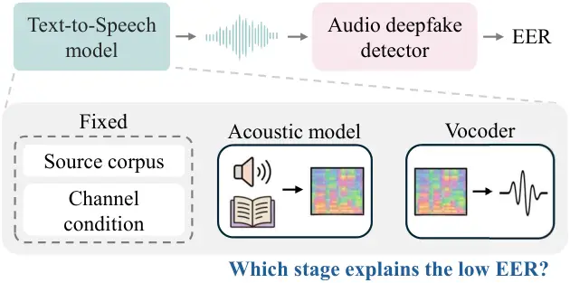
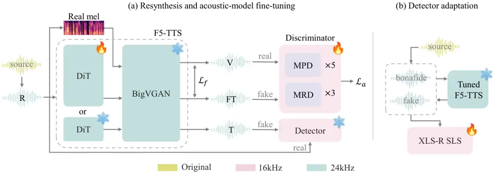

# Tracing and Relearning Detection Evidence in Text-to-Speech Systems

Eunji Shin    Kyudan Jung    Jihwan Kim    Minwoo Lee    Jaegul Choo

###### Abstract

Recent audio deepfake detectors separate bona fide speech from synthetic
speech, yet it remains unclear which stage of a text-to-speech system
supplies the detection evidence. We address this with controlled
resynthesis and detector adaptation in an F5-TTS–BigVGAN pipeline. Since
vocoder reconstruction of a real mel can itself be separable from the
source utterance, we fix the vocoder and trace the larger change in
detector separation to acoustic generation. Adversarially fine-tuning
the acoustic model, with no detector in its objective, raises EER
against fixed detectors at comparable quality. However, adapting a
detector only on the tuned model’s VCTK outputs lowers its LibriSpeech
EER from 19.42% to 7.46% and improves detection of unseen base F5-TTS
outputs. These results suggest that acoustic-model updates can reduce
the detection evidence available to fixed detectors, while detector
adaptation keeps the updated outputs detectable in this pipeline.

###### Index Terms: 

audio deepfake detection, text-to-speech, controlled resynthesis,
detector adaptation

^(†)^(†)address: ¹Ewha W. University, ²KAIST AI

## 1 Introduction

Audio deepfake detectors report low equal error rates (EER) on standard
benchmarks. These benchmarks vary the acoustic model and waveform
generation across spoofing systems, and the source corpus and channel
condition across benchmarks and trials \[16, 21\]. A low EER shows that
a detector separated synthetic from bona fide speech under a protocol,
but not which of these factors it used. Detectors can exploit
silence-duration cues unrelated to synthesis \[10\], and vocoder
reconstruction of a real mel spectrogram can itself be separable from
the source utterance \[15\]. In a TTS output the vocoder receives a mel
generated by the acoustic model rather than extracted from speech, so a
benchmark EER does not attribute the separation to either stage,
motivating controls that isolate which stage of the pipeline a low EER
reflects (Fig. 1).

Modern text-to-speech (TTS) systems split synthesis into two stages, an
acoustic model that generates mel spectrograms and a vocoder that
converts them into waveforms. In F5-TTS \[3\], the acoustic model is a
flow-matching Diffusion Transformer (DiT) \[12\], and its checkpoint
supports BigVGAN \[8\] and Vocos \[14\] as its vocoder. Passing real and
generated mels through the same vocoder removes it as a difference
between a resynthesized real mel and a generated one. We fix BigVGAN,
which leaves the least separation at reconstruction of the two (Table 2)
and whose reconstructions serve as the real target in Sec. 2.2. The
larger part of the remaining separation is then attributable to acoustic
generation. We update the acoustic model alone, fine-tuning it without
any evaluation detector in its objective. These outputs raise EER
against fixed detectors, so acoustic generation is a stage where the
detection evidence can be weakened.

Figure 1: Isolating which TTS stage supplies the detection evidence,
with the source corpus and channel condition fixed.

However, adapting a detector to the updated outputs improves detection
of both these outputs and those from the base model, even though the
latter were not used for adaptation. In this pipeline, a higher EER
against fixed detectors after a generator update therefore need not mean
that the generated speech has become indistinguishable from bona fide
speech.

Our contributions are as follows:

- •
  We use a fixed-vocoder resynthesis comparison to trace the detection
  evidence to acoustic generation under BigVGAN and suggest that the
  share left for this stage depends on the vocoder (Tables 1–2).
- •
  We show that acoustic-model fine-tuning increases EER across fixed
  detectors on LibriSpeech and VCTK beyond RMS gain matching, while
  quality and content measures stay comparable (Tables 1–3).
- •
  We show that detector adaptation learns the tuned outputs and
  transfers to base F5-TTS, while legacy EER differs between adaptation
  corpora (Table 4).

Figure 2: Overview of the experimental framework, with conditions
defined in Sec. 2.1. (a) $`\mathcal{L}_{a}`$ and $`\mathcal{L}_{f}`$
denote the adversarial and feature matching losses. When R itself is
evaluated, the original source serves as bona fide. (b) XLS-R SLS is
adapted on bona fide utterances paired with their tuned F5-TTS
resyntheses.

## 2 Method

### 2.1 Paired resynthesis and controls

Figure 2(a) outlines the resynthesis pipeline and our fine-tuning. We
define five conditions for the same source utterance and target
transcript, prompting every generated evaluation condition with a
held-out utterance of the same speaker rather than the one being
resynthesized. R resamples the source to 24 kHz without synthesis. V
extracts a deterministic real mel from the source utterance and
reconstructs it with BigVGAN, the vocoded spoof construction of \[18\]
used here for evaluation rather than training. T generates a mel
spectrogram with the base F5-TTS DiT and uses the same BigVGAN. FT
replaces the base DiT with one fine-tuned as in Sec. 2.2, and is
otherwise identical to T; the vocoder, text processing, prompts, and
sampling steps remain fixed. TG applies a scalar gain to each T output
to match the RMS amplitude of its paired FT output, a level the
fine-tuning objective does not constrain.

The R–V difference is attributable to BigVGAN reconstruction. V–T keeps
the same vocoder and replaces the source mel with a mel the DiT
generates from text. Because the source mel also carries the prosody and
acoustic realization of the source utterance, V–T covers these
differences as well as any detection evidence from generation. T–TG
isolates the share of the T–FT gap that level alone can produce.

### 2.2 Acoustic-model fine-tuning

We fine-tune all 337.1 million DiT parameters, freezing BigVGAN and the
remaining TTS components. BigVGAN stays differentiable, so the
discriminator loss computed on the waveform reaches the DiT through it.
The jointly trained discriminator starts from random initialization and
combines five multi-period discriminators (periods 2, 3, 5, 7, 11) with
three multi-resolution discriminators (Fourier sizes 2048, 1024,
512) \[7\]. Its real targets are BigVGAN reconstructions of real mels;
its fake inputs are BigVGAN outputs from DiT-generated mels. Sharing the
vocoder removes vocoder identity as a difference between discriminator
inputs, so the only difference is where the mel came from. Following the
least-squares adversarial and feature-matching formulation of
HiFi-GAN \[6\], we weight these losses by one and two, respectively. We
use no mel reconstruction loss, and feature matching uses absolute
activation differences. The evaluation detectors remain outside this
objective.

### 2.3 Detector adaptation

A higher EER on a fixed detector leaves two readings open: the tuned
output may carry no detection evidence left to catch, or it may carry
evidence unseen by the detector. To tell them apart, we start from the
released XLS-R SLS \[22\] checkpoint and keep training it with FT
labeled as synthetic (Fig. 2(b)). In the adaptation set only, each FT
example is paired with the bona fide utterance that supplied its prompt
and transcript, so content and speaker cannot stand in for the label.
Neither adaptation run includes T examples, so transfer to base F5-TTS
is measured rather than trained for. Evaluation covers the held-out
conditions of Sec. 2.1 and legacy ASVspoof 2021 DF/LA \[21\] and
In-the-Wild \[9\] benchmarks.

## 3 Experimental Setup

### 3.1 Datasets

LibriSpeech \[11\] is used for acoustic-model fine-tuning, detector
adaptation, and evaluation. Acoustic-model fine-tuning uses
train-clean-100. The LibriSpeech adaptation run draws 2580 utterances
from 20 speakers of that split; its bona fide speech is resampled via
24 kHz and receives a constant level correction, so loudness cannot
stand in for the label. Evaluation uses 800 test-clean utterances from
40 other speakers.

VCTK \[20\] is used for detector adaptation and evaluation. The VCTK
adaptation run uses 2578 bona fide utterances from 20 speakers of the
ASVspoof 2019 \[16\] training partition, and evaluation uses 1354
segments from 68 speakers that appear in neither that partition nor the
ASVspoof development set, where a segment is two utterances joined to
cover the detector window. Each synthetic condition generates the two
halves separately and joins them, so the join cannot act as a class cue.
Its bona fide and FT levels differ by 0.09 dB, so this run needs no
level correction. VCTK lies within the bona fide domain the detectors
were trained on, since ASVspoof 2019 draws its bona fide speech from it.
An additional 800 English VoxPopuli utterances of parliamentary speech
from 40 speakers \[17\] are used for evaluation only.

### 3.2 Training, detectors, and metrics

The acoustic-model update runs at DiT and discriminator learning rates
of 10⁻⁶ and 10⁻⁵ with 200 warmup updates and a batch size of eight
across four NVIDIA A100 GPUs (40 GB each); the sampler uses 32 unrolled
Euler steps. The reported checkpoint is at 1800 updates. It is the last
of ten saved at 200-update intervals whose UTMOS, speaker similarity,
and WER on LibriSpeech test-clean are no worse than the base model’s.
Detector EER is not part of this criterion. Both adaptation runs train
for 2000 updates with a batch size of 14 on one NVIDIA A100 GPU (40 GB)
and three training seeds, and each adapted detector is evaluated on both
corpora.

We use three fixed detectors trained on ASVspoof 2019 logical access
data. XLS-R SLS (SLS) \[22\] and XLSR-Mamba (Mamba) \[19\] share an
XLS-R 300M \[2\] front end and differ in their back ends, while
AASIST-L \[5\] reads the waveform through a sinc-convolution front end.
EER is reported in percent, and movement toward 50% indicates poorer
separation under the fixed score orientation.

We evaluate UTMOS \[1\], ECAPA-TDNN cosine speaker similarity to the
prompt utterance \[4\], and Whisper large-v3 word error rate
(WER) \[13\], micro-averaged over reference words. T, TG, and FT use
seeds (1234, 42, 913); means and standard deviations summarize three
corpus-level scores, while R and V are deterministic.

## 4 Results and Analysis

### 4.1 Separation emerges after acoustic generation under BigVGAN

| Corpus      | Cond. | SLS            | Mamba          | AASIST-L       |
| ----------- | ----- | -------------- | -------------- | -------------- |
| LibriSpeech | R     | 45.25          | 47.88          | 49.88          |
|             | V     | 38.00          | 38.63          | 50.63          |
|             | T     | 15.46\_(±0.44) | 12.38\_(±0.78) | 28.75\_(±1.11) |
|             | TG    | 17.50\_(±0.45) | 13.46\_(±0.69) | 40.88\_(±0.99) |
|             | FT    | 19.42\_(±1.39) | 16.04\_(±0.81) | 47.67\_(±1.18) |
| VCTK        | R     | 51.26          | 49.93          | 49.93          |
|             | V     | 45.94          | 45.27          | 51.33          |
|             | T     | 3.45\_(±0.19)  | 4.36\_(±0.07)  | 28.95\_(±0.84) |
|             | TG    | 3.32\_(±0.13)  | 4.36\_(±0.15)  | 29.52\_(±0.17) |
|             | FT    | 4.09\_(±0.17)  | 5.96\_(±0.11)  | 31.71\_(±0.83) |

Table 1: EER of fixed detectors per condition. For V, T, TG, and FT, the
bona fide trials are 24 kHz resampled sources.

| Vocoder | LibriSpeech | VCTK  |
| ------- | ----------- | ----- |
| BigVGAN | 38.00       | 45.94 |
| Vocos   | 12.00       | 22.01 |

Table 2: SLS EER for real-mel reconstruction (V) with the two vocoder
configurations the F5-TTS checkpoint supports.

Table 1 reports EER for every condition. R stays near chance on both
corpora, so resampling the source produces little separation by itself.
V lowers EER for SLS and Mamba, and the further decrease from V to T is
roughly 3 times the R–V step on LibriSpeech and 8 to 9 times on VCTK.

AASIST-L reads the waveform through a different front end, so the larger
V–T than R–V contrast does not rest on the XLS-R features that SLS and
Mamba share. For this detector both R and V sit at chance on either
corpus, and its whole decrease appears at T.

The contrast therefore holds across front ends and back ends, while the
amount of separation depends on the detector and the corpus. With
BigVGAN, the separation appears mainly after the DiT generates the mel.
The V–T comparison does not distinguish the prosody and acoustic
realization of the generated utterance from any artifact of generation.

For SLS and Mamba, V reproduces the separation reported for
reconstruction alone \[15\], and its size is vocoder-dependent: for SLS,
Vocos reconstructions are separated far more strongly than BigVGAN’s on
both corpora (Table 2).

### 4.2 Fine-tuning raises EER beyond RMS gain matching

FT increases EER over T in all six detector–corpus pairs in Table 1. The
increase exceeds the spread across generation seeds in every pair,
ranging from 0.64 percentage points for SLS on VCTK to 18.92 points for
AASIST-L on LibriSpeech, where it leaves the detector near chance. The
direction holds for all three detectors, so the acoustic-model update
changes evidence that all of them depend on. At the same time, the low
FT EERs on VCTK for SLS and Mamba show that the tuned outputs remain
detectable.

TG isolates the part of the T–FT increase that output level alone can
produce. On LibriSpeech, RMS gain matching accounts for 52% of the T–FT
gap for SLS and 30% for Mamba. On VCTK, TG leaves SLS and Mamba nearly
unchanged, whereas FT increases both. AASIST-L is more level-sensitive:
on LibriSpeech, TG accounts for 64% of the gap. A residual above TG
remains in all six pairs, although the comparison does not say whether
local amplitude, spectral, or temporal properties account for it.

| Corpus      | Cond. | SLS EER        | UTMOS         | Spk. sim.       | WER           |
| ----------- | ----- | -------------- | ------------- | --------------- | ------------- |
| LibriSpeech | T     | 15.46\_(±0.44) | 3.38\_(±0.02) | 0.724\_(±0.002) | 2.98\_(±0.12) |
|             | FT    | 19.42\_(±1.39) | 3.41\_(±0.01) | 0.725\_(±0.001) | 2.95\_(±0.03) |
| VCTK        | T     | 3.45\_(±0.19)  | 3.37\_(±0.03) | 0.754\_(±0.002) | 0.73\_(±0.02) |
|             | FT    | 4.09\_(±0.17)  | 3.35\_(±0.03) | 0.763\_(±0.004) | 0.68\_(±0.02) |
| VoxPopuli   | T     | 35.33\_(±1.49) | 3.35\_(±0.04) | 0.747\_(±0.000) | 1.41\_(±0.07) |
|             | FT    | 40.75\_(±0.99) | 3.45\_(±0.03) | 0.742\_(±0.004) | 1.46\_(±0.08) |

Table 3: SLS EER alongside quality and content measures for T and FT.
Higher UTMOS and speaker similarity and lower WER (%) are better.

Table 3 places the EER changes alongside quality and content measures.
Across the three corpora, the changes are small in both directions: each
measure improves on some corpora and worsens on others, and the largest
degradation on any measure is within or close to the spread across
generation seeds. The EER increase therefore does not come from
degrading the output, on two corpora that played no part in selecting
the checkpoint. These measures leave open whether acoustic properties
they do not capture changed.

### 4.3 Adaptation learns tuned outputs

Table 4 reports EER after each adaptation run. LibriSpeech adaptation
lowers FT EER from 19.42% to 1.71% on LibriSpeech and from 4.09% to
0.20% on VCTK, and VCTK adaptation lowers it to 7.46% on LibriSpeech and
0.10% on VCTK. T falls to comparable EER in both runs, though adaptation
labels only FT as synthetic. Either corpus therefore teaches the
detector to separate FT, and the FT outputs that raised EER against the
fixed detectors are the ones separated at these rates. The higher EER of
FT against a fixed detector therefore does not mean that nothing was
left to catch.

|             |       |                |                |                |
| ----------- | ----- | -------------- | -------------- | -------------- |
| Eval. set   | Cond. | Baseline       | LS adapt.      | VC adapt.      |
| LibriSpeech | R     | 45.25          | 49.50\_(±0.38) | 46.50\_(±0.33) |
|             | V     | 38.00          | 40.79\_(±0.64) | 35.46\_(±0.88) |
|             | T     | 15.46\_(±0.44) | 1.42\_(±0.44)  | 5.92\_(±0.47)  |
|             | TG    | 17.50\_(±0.45) | 1.75\_(±0.57)  | 6.29\_(±0.07)  |
|             | FT    | 19.42\_(±1.39) | 1.71\_(±0.26)  | 7.46\_(±0.31)  |
| VCTK        | R     | 51.26          | 50.02\_(±0.04) | 50.12\_(±0.21) |
|             | V     | 45.94          | 46.65\_(±0.43) | 36.34\_(±1.79) |
|             | T     | 3.45\_(±0.19)  | 0.15\_(±0.07)  | 0.07\_(±0.00)  |
|             | TG    | 3.32\_(±0.13)  | 0.22\_(±0.15)  | 0.07\_(±0.00)  |
|             | FT    | 4.09\_(±0.17)  | 0.20\_(±0.04)  | 0.10\_(±0.04)  |
| ASV21 DF    | –     | 1.92^(∗)       | 3.20\_(±0.17)  | 1.90\_(±0.10)  |
| ASV21 LA    | –     | 2.87^(∗)       | 8.35\_(±0.19)  | 3.35\_(±0.18)  |
| In-the-Wild | –     | 7.46^(∗)       | 10.66\_(±0.87) | 9.53\_(±0.19)  |

Table 4: SLS adaptation: EER (lower is better for T/TG/FT). LS/VC:
balanced LibriSpeech and VCTK adaptation (3 training seeds). Baseline
T/TG/FT summarize generation seeds. ^(∗)Released checkpoint \[22\]

R and V test whether the adapted detector separates resampling or
vocoding alone. After either adaptation run, R stays near chance and V
stays far above T and FT. The detector therefore does not learn to
separate resampled audio, but VCTK adaptation lowers V EER on both
corpora, so it partly separates BigVGAN output from a real mel.

The two adaptation runs differ in how much of the detector’s performance
on legacy benchmarks they retain. VCTK adaptation stays close to the
released checkpoint on ASVspoof 2021 DF but rises on LA and In-the-Wild.
LibriSpeech adaptation is above the VCTK run on all three benchmarks.
The run that reaches the lower EER on LibriSpeech T and FT therefore
retains less legacy performance. Because both runs use adaptation sets
of nearly equal size and the same number of updates, we attribute this
difference to the adaptation corpus. Of the two corpora, only VCTK lies
within the bona fide domain of the detector’s training data. However,
switching the corpus changes both the bona fide utterances and the
synthetic outputs paired with them, so this experiment cannot
distinguish the effect of the bona fide domain from that of the
synthetic outputs.

Joint interpretation. Tables 1 and 4 record two changes in opposite
directions. On LibriSpeech, fine-tuning the DiT raises SLS EER on its
own outputs, and adapting the detector on VCTK then lowers that EER to
well below where the base outputs started. Read together with the larger
V–T than R–V contrast, these changes suggest that the detection evidence
appearing at acoustic generation changes with an acoustic-model update,
and that a detector can still learn to distinguish the updated outputs
through adaptation.

Scope. This study covers one acoustic model with one vocoder and adapts
one detector architecture. The reported standard deviations reflect
generation and adaptation seeds rather than speaker variation.

## 5 Conclusion

In the F5-TTS–BigVGAN pipeline, our controlled comparisons show that
acoustic generation produces a larger change in detector separation than
real-mel reconstruction. Fine-tuning the acoustic model against a
discriminator that treats real-mel reconstructions as real makes its
outputs harder for fixed detectors to identify, while quality and
content measures stay comparable. To determine whether these outputs
remain distinguishable, we adapt XLS-R SLS to them and find improved
detection of both fine-tuned outputs and base-model outputs unseen
during adaptation. This recovery shows that the reduced effectiveness of
fixed detectors does not imply that detection evidence has disappeared,
supporting adaptation as a way to keep pace with acoustic-model updates.

## References

- \[1\] K. Baba, W. Nakata, Y. Saito, and H. Saruwatari (2024) The t05
  system for the voicemos challenge 2024: transfer learning from deep
  image classifier to naturalness mos prediction of high-quality
  synthetic speech. In SLT, pp. 818–824. Cited by: §3.2.
- \[2\] A. Babu, C. Wang, A. Tjandra, K. Lakhotia, Q. Xu, N. Goyal, K.
  Singh, P. von Platen, Y. Saraf, J. Pino, A. Baevski, A. Conneau,
  and M. Auli (2022) XLS-R: self-supervised cross-lingual speech
  representation learning at scale. In Interspeech, pp. 2278–2282. Cited
  by: §3.2.
- \[3\] Y. Chen, Z. Niu, Z. Ma, K. Deng, C. Wang, J. JianZhao, K. Yu,
  and X. Chen (2025) F5-tts: a fairytaler that fakes fluent and faithful
  speech with flow matching. In ACL, pp. 6255–6271. Cited by: §1.
- \[4\] B. Desplanques, J. Thienpondt, and K. Demuynck (2020)
  ECAPA-TDNN: emphasized channel attention, propagation and aggregation
  in TDNN based speaker verification. In Interspeech, pp. 3830–3834.
  External Links:
  [Document](https://dx.doi.org/10.21437/Interspeech.2020-2650) Cited
  by: §3.2.
- \[5\] J. Jung, H. Heo, H. Tak, H. Shim, J. S. Chung, B. Lee, H. Yu,
  and N. Evans (2022) Aasist: audio anti-spoofing using integrated
  spectro-temporal graph attention networks. In ICASSP, pp. 6367–6371.
  Cited by: §3.2.
- \[6\] J. Kong, J. Kim, and J. Bae (2020) HiFi-GAN: generative
  adversarial networks for efficient and high fidelity speech synthesis.
  In NeurIPS, Vol. 33, pp. 17022–17033. Cited by: §2.2.
- \[7\] R. Kumar, P. Seetharaman, A. Luebs, I. Kumar, and K.
  Kumar (2023) High-fidelity audio compression with improved rvqgan.
  NeurIPS 36, pp. 27980–27993. Cited by: §2.2.
- \[8\] S. Lee, W. Ping, B. Ginsburg, B. Catanzaro, and S. Yoon (2023)
  BigVGAN: a universal neural vocoder with large-scale training. ICLR.
  Cited by: §1.
- \[9\] N. Müller, P. Czempin, F. Diekmann, A. Froghyar, and K.
  Böttinger (2022) Does audio deepfake detection generalize?. In
  Interspeech, pp. 2783–2787. External Links:
  [Document](https://dx.doi.org/10.21437/Interspeech.2022-108) Cited by:
  §2.3.
- \[10\] N. M. Müller, F. Dieckmann, P. Czempin, R. Canals, K.
  Böttinger, and J. Williams (2021) Speech is silver, silence is golden:
  what do ASVspoof-trained models really learn?. In Proc. ASVspoof 2021
  Workshop, pp. 55–60. External Links:
  [Document](https://dx.doi.org/10.21437/ASVSPOOF.2021-9) Cited by: §1.
- \[11\] V. Panayotov, G. Chen, D. Povey, and S. Khudanpur (2015)
  LibriSpeech: an ASR corpus based on public domain audio books. In
  ICASSP, pp. 5206–5210. Cited by: §3.1.
- \[12\] W. Peebles and S. Xie (2023) Scalable diffusion models with
  transformers. In ICCV, pp. 4172–4182. Cited by: §1.
- \[13\] A. Radford, J. W. Kim, T. Xu, G. Brockman, C. McLeavey, and I.
  Sutskever (2023) Robust speech recognition via large-scale weak
  supervision. In ICML, pp. 28492–28518. Cited by: §3.2.
- \[14\] H. Siuzdak (2024) Vocos: closing the gap between time-domain
  and fourier-based neural vocoders for high-quality audio synthesis. In
  ICLR, Cited by: §1.
- \[15\] C. Sun, S. Jia, S. Hou, and S. Lyu (2023) Ai-synthesized voice
  detection using neural vocoder artifacts. In CVPRW, pp. 904–912. Cited
  by: §1, §4.1.
- \[16\] M. Todisco, X. Wang, V. Vestman, M. Sahidullah, H. Delgado, A.
  Nautsch, J. Yamagishi, N. Evans, T. Kinnunen, and K. A. Lee (2019)
  ASVspoof 2019: future horizons in spoofed and fake audio detection. In
  Interspeech, pp. 1008–1012. Cited by: §1, §3.1.
- \[17\] C. Wang, M. Riviere, A. Lee, A. Wu, C. Talnikar, D. Haziza, M.
  Williamson, J. Pino, and E. Dupoux (2021) VoxPopuli: a large-scale
  multilingual speech corpus for representation learning,
  semi-supervised learning and interpretation. In ACL, pp. 993–1003.
  Cited by: §3.1.
- \[18\] X. Wang and J. Yamagishi (2023) Spoofed training data for
  speech spoofing countermeasure can be efficiently created using neural
  vocoders. In ICASSP, pp. 1–5. Cited by: §2.1.
- \[19\] Y. Xiao and R. K. Das (2025) Xlsr-mamba: a dual-column
  bidirectional state space model for spoofing attack detection. IEEE
  Signal Processing Letters 32, pp. 1276–1280. Cited by: §3.2.
- \[20\] J. Yamagishi, C. Veaux, and K. MacDonald (2019) CSTR vctk
  corpus: english multi-speaker corpus for cstr voice cloning toolkit.
  University of Edinburgh, CSTR. External Links:
  [Document](https://dx.doi.org/10.7488/ds/2645) Cited by: §3.1.
- \[21\] J. Yamagishi, X. Wang, M. Todisco, M. Sahidullah, J. Patino, A.
  Nautsch, X. Liu, K. A. Lee, T. Kinnunen, N. Evans, and H.
  Delgado (2021) ASVspoof 2021: accelerating progress in spoofed and
  deepfake speech detection. arXiv preprint arXiv:2109.00537. Cited by:
  §1, §2.3.
- \[22\] Q. Zhang, S. Wen, and T. Hu (2024) Audio deepfake detection
  with self-supervised XLS-R and SLS classifier. In ACM MM,
  pp. 6765–6773. External Links:
  [Document](https://dx.doi.org/10.1145/3664647.3681345) Cited by: §2.3,
  §3.2, Table 4.
