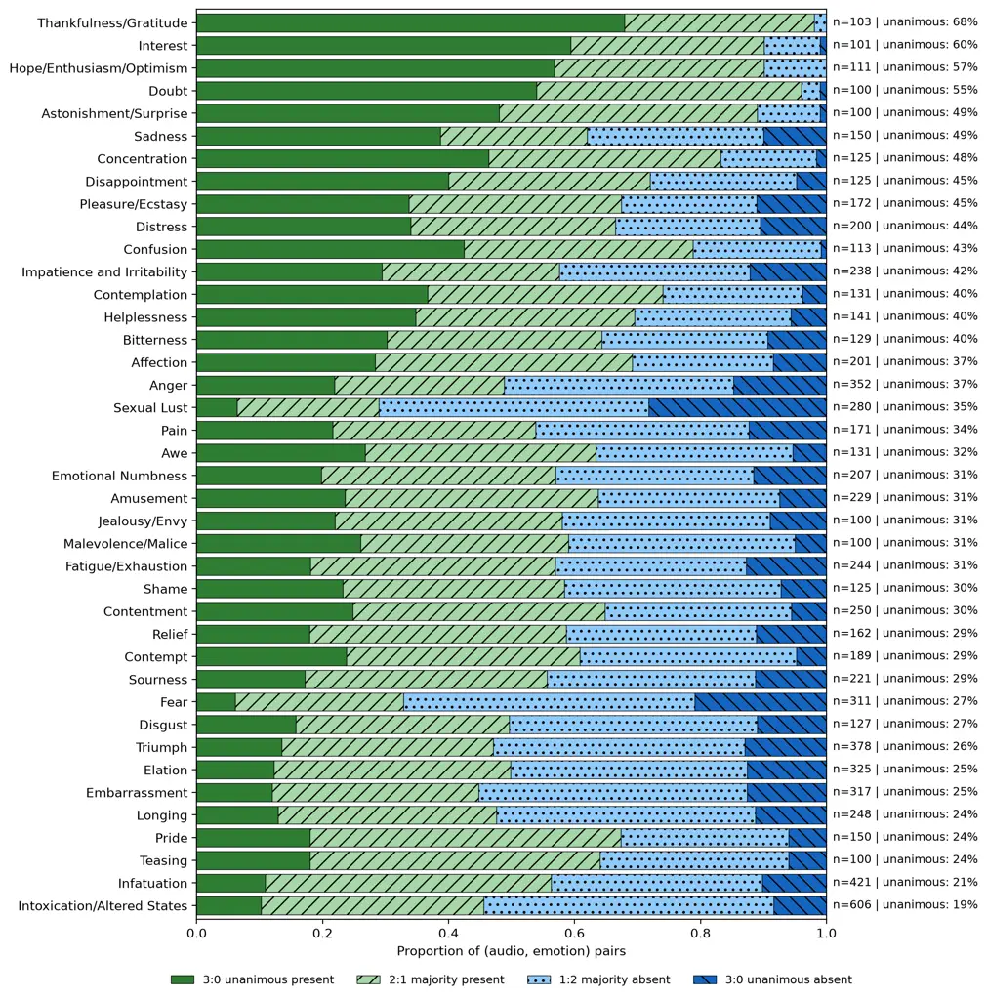
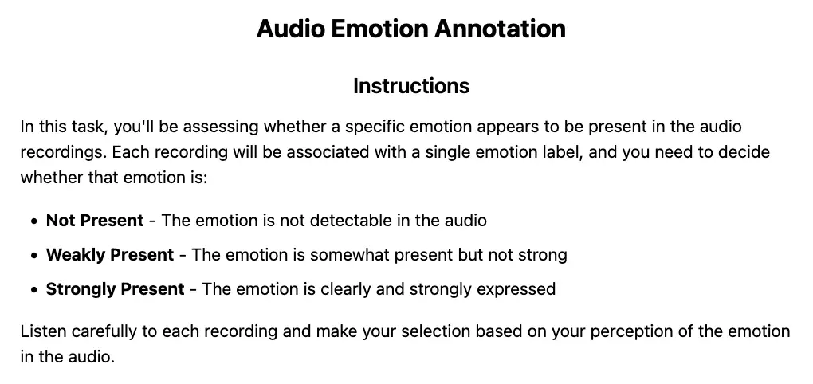
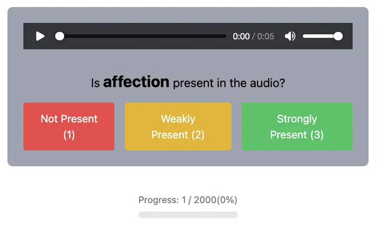
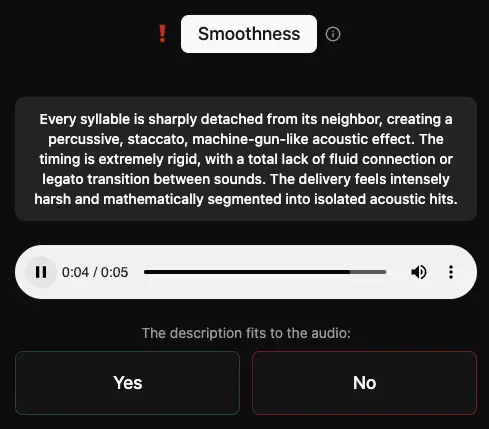
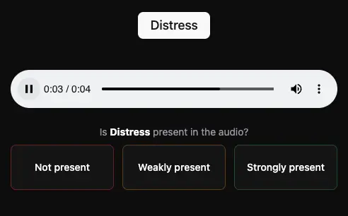

# VoiceNet: Fine-Grained Voice Understanding Beyond Emotion at Scale

Christoph Schuhmann    Robert Kaczmarczyk Affiliation: LAION e.V.
 Scalable Learning & Multi-Purpose AI (SLAMPAI) Lab, Forschungszentrum
Jülich GmbH    Gollam Rabby    Felix Friedrich    Maurice Kraus
Affiliation: L3S Research Center  Black Forest Labs  Computer Science
Department, TU Darmstadt    Gijs Wijngaard Affiliation: LAION e.V.
 Scalable Learning & Multi-Purpose AI (SLAMPAI) Lab, Forschungszentrum
Jülich GmbH    Kourosh Nadi    Huu Nguyen    Kristian Kersting
Affiliation: L3S Research Center  Black Forest Labs  Computer Science
Department, TU Darmstadt Affiliation: Ontocord.AI  German Research
Center for Artificial Intelligence (DFKI)    Sören Auer
Email: [contact@laion.ai^(\*)Equal contribution (shared first
authors)](mailto:) Affiliation: Hessian Center for AI (hessian.AI)
 Leibniz Universität Hannover

###### Abstract

Expressive speech synthesis has outpaced expressive speech perception:
systems now render fine-grained vocal performances that no public
benchmark can score. Most benchmarks for this inverse problem stop at
six to nine basic emotion categories, largely on acted speech. This
paper introduces VoiceNet, a human-annotated representation-level
benchmark for voice performance understanding on permissively-licensed
in-the-wild speech. VoiceNet has two subsets: VoiceNet-Emo applies a
40-emotion taxonomy with three expert ratings per item, and
VoiceNet-Ext, a preliminary subset, scores 57 talking-style attributes
including speaking rate, vocal tension, breathiness, and register. The
paper also releases Emolia, an emotion-annotated version of the Emilia
corpus, with a curated rebalanced subset enriched by dense MOSS-Audio
Thinking annotations. Two voice-text contrastive baselines train on this
data: a 110M-parameter VoiceCLAP-Small for fast large-scale data
filtering and a 7B VoiceCLAP-Large for state-of-the-art performance.
Both outperform existing CLAP baselines, which sit near chance on
VoiceNet-Emo. On VoiceNet-Emo, VoiceCLAP-Large aligns more closely with
the aggregate expert consensus than individual experts agree with one
another: a comparison against the majority label rather than evidence of
surpassing human emotion perception. All systems evaluated here are
voice-text embedding models: VoiceNet scores representation-level
attribute recognition and retrieval, not end-to-end spoken-dialogue
behaviour. Clustering and filtering uncurated speech corpora into
subsets that span diverse talking styles and emotions remains an open
challenge; VoiceCLAP embeddings offer a promising tool for this task.
VoiceNet, Emolia, and VoiceCLAP are publicly available for research use.

## 1 Introduction

Synthetic speech technology generates fluent, expressive speech (OpenAI,
2024; Kirk et al., 2025), but recognizing fine-grained vocal performance
has not kept pace (Cowie et al., 2001; Schuller, 2018); two evaluation
gaps slow progress. First, public speech-emotion benchmarks rely on a
small set of basic emotions (Ekman, 1992; George & Ilyas, 2024): IEMOCAP
(Busso et al., 2008), RAVDESS (Livingstone & Russo, 2018), CREMA-D (Cao
et al., 2014), SAVEE (Jackson & Haq, 2014), and EmoDB (Burkhardt et al., 2005) cover 6 to 9 emotions on studio-acted speech, and aggregation
efforts (Scheidwasser-Clow et al., 2022; Ma et al., 2024; Osman et al., 2024) inherit those limits. Second, no public benchmark scores
talking-style attributes (speaking rate, vocal tension, breathiness,
register, chunking, timbre, recording context) alongside emotion,
despite their established role in paralinguistic perception (Schuller
et al., 2013; Cowie et al., 2001). Synthetic resources such as
EmoNet-Voice (Schuhmann et al., 2025a) address taxonomy granularity but
use text-to-speech audio; whether models trained on dense annotations
transfer to in-the-wild speech is open.

Three observations motivate this paper. The 40-emotion taxonomy grounded
in modern affective science (Barrett, 2017; Russell, 1980; Cowen et al., 2019) has been validated on synthetic EmoNet-Voice audio and applies to
permissively-licensed real-human speech. Existing CLAP (Wu et al., 2023;
Elizalde et al., 2024) and voice-text models (Dinkel et al., 2025; Yang
et al., 2026b) are trained on general-audio captions, not dense
vocal-style descriptions. Open-source audio language models such as
MOSS-Audio-8B-Thinking (Yang et al., 2026a) produce structured per-clip
annotations across emotion, voice quality, and acoustic context at
scale.

This paper contributes: (1) VoiceNet benchmark. A human-annotated
benchmark on permissively-licensed in-the-wild speech with two subsets:
VoiceNet-Emo extends the EmoNet-Voice 40-emotion taxonomy to 7,988
(audio, prompt) pairs over 3,944 clips with three expert raters per
item; VoiceNet-Ext covers 57 talking-style attributes¹¹ 1
[https://projects.laion.ai/emolia-bench/taxonomy/](https://projects.laion.ai/emolia-bench/taxonomy/)
over 18.5k (audio, level) pairs carrying 40,990 ratings from eight
annotators. (2) Emolia, Emolia-Balanced, and the MOSS-Audio annotation
suite. A fully emotion-annotated version of Emilia (71.78M clips with 40
emotion scores, captions, and speaker embeddings), a curated 5.26M-clip
subset (Emolia-Balanced) rebalanced across 40 emotions and 3,000 speaker
clusters, and MOSS-Audio-8B-Thinking annotations on Emolia-Balanced plus
three open voice corpora (8.64M clips, 18 prompt-groups, 61 attribute
values per clip). (3) VoiceCLAP models. VoiceCLAP-Small is a
110M-parameter dual-tower BUD-E-Whisper-Small + all-MiniLM-L6-v2 trained
with SigLIP. VoiceCLAP-Large is a rank-16 LoRA finetune of
LCO-Embedding-Omni-7B (Xiao et al., 2025) trained with InfoNCE.
VoiceCLAP-Large reaches 0.702 per-prompt balanced accuracy on
VoiceNet-Emo (+0.039 over the zero-shot Omni base). (4) Evaluation.
Seven general-audio CLAPs (Wu et al., 2023; Elizalde et al., 2024;
Dinkel et al., 2025; Yang et al., 2026b; Niizumi et al., 2025; Li
et al., 2024; Zhu et al., 2024) sit at chance on VoiceNet-Emo
($`|\rho|<0.1`$); two zero-shot Omni-Embedding bases (Xiao et al., 2025)
reach 0.65 to 0.66.

Scope. VoiceNet is a _representation-level_ benchmark: it measures how
well voice-text embedding models rank fine-grained emotion and
talking-style descriptions against real speech. Every system evaluated
in §4 is an audio-text embedding model; end-to-end voice assistants,
conversational context, response generation, and generative
audio-language models (which require a different scoring interface than
cosine similarity) are out of scope.

Beyond the headline benchmark, clustering and filtering raw uncurated
speech corpora into subsets that span diverse talking styles and
emotions remains an open challenge. VoiceCLAP embeddings provide a
practical handle on this problem: nearest-neighbour search on the
embedding space surfaces clips by emotion, talking-style, and recording
context. An interactive browser of Emolia-Balanced ²² 2
[https://projects.laion.ai/emolia-bench/demo/](https://projects.laion.ai/emolia-bench/demo/)
demonstrates this use case.

## 2 Related Work

Speech emotion benchmarks. Public SER datasets cluster around six to
nine acted emotion classes: IEMOCAP (12h, 9 emotions) (Busso et al.,
2008), RAVDESS (1h, 8) (Livingstone & Russo, 2018), SAVEE (0.8h, 7)
(Jackson & Haq, 2014), EmoDB (German, 7) (Burkhardt et al., 2005), and
CREMA-D (6) (Cao et al., 2014). Their taxonomies derive from
basic-emotion theory (Ekman, 1992; Plutchik, 2001), whereas
vocal-expression studies map a far larger space of distinct emotions
(Cowen et al., 2019); acted prosody overstates cues (Wilting et al.,
2006), and ethical barriers prevent collection of stigmatising emotions
(Schuller et al., 2013). Aggregations such as SERAB (9 corpora, 6
languages) (Scheidwasser-Clow et al., 2022), EmoBox (32 datasets, 14
languages) (Ma et al., 2024), and SER Evals (18 minority-language
corpora) (Osman et al., 2024) broaden coverage but inherit acted speech
and narrow taxonomies; BERSt adds shouted speech from 98 actors (Tuttösí
et al., 2026), and MSP-Podcast (Lotfian & Busso, 2019) is one of few
in-the-wild corpora at scale. The EmoNet-Voice bench (Schuhmann et al.,
2025a) introduces the 40-emotion taxonomy on synthetic audio; VoiceNet
ports it to in-the-wild human speech, adds 57 talking-style attributes,
and uses contrastive cosine-similarity scoring rather than ordinal
regression.

Voice-text contrastive models. Contrastive Language-Audio Pretraining
was first applied to general-audio sound events (Wu et al., 2023;
Elizalde et al., 2024). Subsequent models target singing voice (Yang
et al., 2026b) or unify speech, music, and sound (Dinkel et al., 2025).
Training data for these models comes from AudioCaps and Clotho,
captioned at sound-event level. None target dense vocal-style
annotation. §4 confirms that all general-audio CLAPs sit at chance on
VoiceNet-Emo. Single-tower audio-language embedding models
(LCO-Embedding-Omni-7B (Xiao et al., 2025), LCO-Embedding-Omni-3B (Xiao
et al., 2025)) inherit speech understanding from instruction-tuned
multimodal LLMs, reaching approx. 0.65 on VoiceNet-Emo zero-shot.

Annotation taxonomies and dimensional models. Affective science models
emotions as context-dependent and graded (Barrett, 2017; Lindquist,
2013). Valence-arousal-dominance (Russell, 1980) and multi-label schemes
(Zhang et al., 2020; Cowen et al., 2019) support blended affect. Most
benchmarks still assign a single discrete label per clip. Intensity
annotations show low crowd-source agreement (Kajiwara et al., 2021;
Stappen et al., 2021). VoiceNet-Ext takes a complementary route by
annotating 57 talking-style attributes with binary level rubrics,
broadening the supervision signal beyond emotion categories.

## 3 VoiceNet Suite

The suite has four released components: the 40-emotion + 57-attribute
taxonomy (§3.1); Emolia (the fully annotated Emilia corpus) with
Emolia-Balanced and three sibling MOSS-Audio-annotated training corpora
(§3.2); the VoiceNet human-annotated benchmark with two subsets at
different maturity levels the near-complete, expert-rated VoiceNet-Emo
and the preliminary VoiceNet-Ext, whose inter-rater agreement is at
chance (§3.3); and the two VoiceCLAP contrastive models (§3.4).

### 3.1 Taxonomies

Emotion taxonomy (40 categories). The 40-category emotion taxonomy
originally developed for EmoNet-Face (Schuhmann et al., 2025b) covers
positive emotions (Elation, Contentment, Affection, and Awe), negative
emotions (Distress, Sadness, Bitterness, and Contempt), cognitive states
(Concentration, Confusion, and Doubt), physical states (Pain, Fatigue),
and socially mediated emotions (Embarrassment, Shame, Pride, and
Teasing). The full set of 40 categories with descriptive terms appears
in App. A.3. The literature-extraction and expert-guided refinement
process is detailed in App. A.11.

Talking-style attribute taxonomy (57 attributes). VoiceNet-Ext covers a
parallel 57-attribute taxonomy of talking-style and paralinguistic
descriptors, grouped into perceived speaker traits, affective
dimensions, prosodic delivery, vocal quality, resonance placement,
recording context, and style descriptors (full list with short codes in
App. A.4). The 57 attributes derive from the 61-value MOSS-Audio schema
(§3.2) by dropping vocal-burst presence (BURST, redundant with discrete
event detection), fine-grained categorical emotion (EMO, covered by
VoiceNet-Emo), accent (ACNT, demographic rather than perceptual), and
language (LANG, categorical rather than ordinal). The rubric-level
definitions used for human annotation are available at
[https://projects.laion.ai/emolia-bench/taxonomy/](https://projects.laion.ai/emolia-bench/taxonomy/).

### 3.2 Emolia, Emolia-Balanced, and the MOSS-Audio Annotation Pipeline

Emolia is a fully emotion-annotated version of the open-source Emilia
corpus. The complete Emilia-Large release (71.78M clips, 215,600 hours;
its Emilia portion is licensed CC-BY-NC-4.0 and its Emilia-YODAS portion
CC-BY-4.0) is annotated with 40 emotion scores from the
EmpathicInsight-Voice classifier, emotion captions from BUD-E-Whisper,
and WavLM-based speaker-timbre embeddings. Emolia is released in full as
a large-scale training resource for emotion-aware speech research.

Emolia-Balanced is a curated 5.26M-clip subset of Emolia, rebalanced
across the 40 emotions and 3,000 k-means speaker-embedding clusters
using empathic-voice-classifier logits. Together with 3 additional open
voice corpora (LAION’s Got Talent 1.69M clips, Majestrino 973k clips,
Multilingual In The Wild 721k clips), Emolia-Balanced forms the
MOSS-Audio annotation suite (8.64M clips total; per-corpus counts in
App. A.2, Tab. 4). An internal ablation excluded Multilingual In The
Wild from the training mixture (7.92M clips) without dropping it from
the release.

Annotation pipeline. Each clip is queried with 18 prompt-groups covering
related attribute clusters (resonance placement, prosodic delivery,
recording context, style category, etc.). MOSS-Audio-8B-Thinking (Yang
et al., 2026a) returns a structured response per group; the parser
consumes only the output after the closing `</think>` tag and
regenerates malformed groups. The 18 outputs supply 61 short-code
attribute values per clip, concatenated into one text field for
contrastive training. The chain-of-thought traces emitted before
`</think>` are retained and released alongside the structured
annotations (155.46M traces total) to support future work on
reasoning-supervised voice understanding; they are not used for the
contrastive training in this paper.

Emolia-Balanced construction. The Emilia source corpus is filtered with
_EmpathicVoice_ released with EmoNet-Voice bench (Schuhmann et al.,
2025a), a Whisper-based audio encoder with a 40-dim. linear head trained
on synthetic EmoNet-Voice-Voice to predict per-clip presence logits. The
classifier is used for stratified sampling and benchmark prompt
generation, never as ground truth. Clips are sampled to balance the
40-emotion categories and 3,000 k-means clusters of WavLM speaker
embeddings. Rebalancing softens the source-corpus emotion skew of Emilia
but does not fully remove it.

Training corpora. VoiceCLAP trains on nine voice corpora:
Emolia-Balanced (5.26M), LAION’s Got Talent (1.69M), Majestrino (973k),
two in-house Synthetic Vocal Bursts collections (341k), and four
FCaps-captioned corpora (Yang et al., 2026b): EARS (17k), Expresso
(27k), Voxceleb1 (154k), Voxceleb2 (600k). The smaller six broaden the
contrastive negative distribution; their captions are not part of the
Emolia suite. Full counts in App. A.5, Tab. 5.

### 3.3 VoiceNet: A Human-Annotated In-the-Wild Benchmark

VoiceNet evaluates fine-grained voice understanding on
permissively-licensed in-the-wild human speech. Unlike the prior
EmoNet-Voice bench (Schuhmann et al., 2025a), which evaluates on
synthetic TTS-generated audio, VoiceNet consists exclusively of real
human vocal performances; the VoiceNet-Emo clips come from the
Emilia-YODAS (CC-BY-4.0) and Emilia (CC-BY-NC-4.0) portions of
Emilia-Large, so the benchmark is openly available under CC-BY and
CC-BY-NC research licences. Each clip is paired with a textual prompt.
Raters mark whether the property described by the prompt is present in
the clip. Two subsets share this protocol but differ in prompt
vocabulary, audio source, and rater pool.

VoiceNet-Emo (40 emotions, expert raters). VoiceNet-Emo applies the same
40-emotion taxonomy as EmoNet-Voice but to naturalistic, in-the-wild
human speech rather than synthetic audio. It asks: _is emotion $`E`$
present in clip $`C`$?_ for each of the 40 emotions. The subset contains
7,988 (audio, emotion) pairs over 3,944 unique audio clips and 40
emotion prompts. 7,984 of those pairs received the full three
independent ratings from psychology experts on the three-point scale
used in prior work (Schuhmann et al., 2025a): 0 (not present), 1 (weakly
present), and 2 (strongly present); the remaining 4 pairs received one
or two ratings due to incomplete rater coverage and are excluded from
inter-rater statistics but retained in the released benchmark. Three
experts contributed (user_0, user_1, and user_2). Each (audio, emotion)
pair was rated independently with assignments balanced for rater gender.
Annotators were blinded to one another’s ratings.

Each pair is sampled under one of five task types so that emotion
presence is balanced across the subset. _Affirmative_ (4,000 pairs)
presents an emotion that the empathic voice classifier (§3.2) predicts
is present. _Contrastive 1_ and _contrastive 2_ (1,000 each) present
natural opposites of the predicted emotion (e.g., “anger” and “wrath”
for a clip predicted as “happiness”). _Ultimate_ (995) and _penultimate_
(993) present the lowest- and second-lowest-ranked emotions. Experts
confirm 78.85% of affirmative pairs by majority vote, and 0.349, 0.372,
0.376, and 0.371 of the contrastive and ultimate/penultimate pairs,
consistent with classifier-ranking noise and blended affect; the
aggregate majority-present rate is 0.578. Because the classifier is
trained on synthetic EmoNet-Voice-Voice audio, preselection could bias
which clips and emotions enter the benchmark. The five balanced task
types and the use of the independent expert majority vote, never the
classifier prediction, as the released label mitigate but do not remove
this circularity; the classifier acts as a sampling prior, not as ground
truth. Inter-rater agreement (Fleiss’ binary $`\kappa`$) is 0.086, in
line with the low end reported for fine-grained intensity annotation
(Kajiwara et al., 2021; Stappen et al., 2021); pairwise and
leave-one-out human-consistency references are 0.562 and 0.572 balanced
accuracy. App. A.12 reports per-emotion agreement.

VoiceNet-Ext (57 attributes, eight mixed-background raters;
preliminary). VoiceNet-Ext asks: _does clip $`C`$ exhibit attribute
$`A`$ at level $`L`$?_ for the 57 talking-style attributes of §3.1. The
audio source is distinct from Emolia-Balanced. Each attribute is defined
by a rubric with ordinal levels (seven levels, 0–6, for nearly all
attributes). For each (attribute, level) bucket, Gemini 3 Flash
pre-screens candidate clips, and human annotators confirm or reject the
match for an equal number of positives (clips matching the target level)
and negatives (clips matching a non-adjacent level), so each judgement
is binary rather than a full ordinal rating. The release contains 18.5k
(audio, attribute-level) pairs carrying 40,990 ratings from eight
annotators; four hold psychology degrees and contributed 95.3% of all
ratings. 5,828 pairs carry at least three ratings, 10,338 carry two, and
2,366 carry one. The aggregate majority-yes rate is 0.284. On the 5,583
items with exactly three ratings, Fleiss’ binary $`\kappa=-0.022`$ (95%
CI $`[-0.037,-0.007]`$), an interval that excludes zero, so near-chance
agreement is a property of these rubric-level judgements rather than an
artefact of sparse annotation. Under a reliable-core rule prespecified
before computing per-attribute results (at least 20 three-rater items,
$`\kappa\geq 0.20`$, and a 95% lower bound above zero), no attribute
qualifies; the maximum is $`\kappa{=}0.085`$ for STNC. All VoiceNet-Ext
scores are therefore preliminary and its attributes are exploratory
perceptual probes. App. A.14 gives the full coverage and reliability
analysis.

### 3.4 VoiceCLAP: Voice-Text Contrastive Models

VoiceCLAP-Small. A 110M-parameter dual-tower CLAP (Wu et al., 2023): a
BUD-E-Whisper-Small (Radford et al., 2023) audio encoder (768-d) and an
all-MiniLM-L6-v2 (Reimers & Gurevych, 2019; Wang et al., 2020) text
encoder (384-d, mean-pooled), each linearly projected to a shared 768-d
space and trained for one epoch with the SigLIP sigmoid contrastive loss
(Zhai et al., 2023).

VoiceCLAP-Large. A rank-16 LoRA (Hu et al., 2022) finetune of the
single-tower LCO-Embedding-Omni-7B (Xiao et al., 2025)
(Qwen2.5-Omni-Thinker-7B backbone, 3,584-d output), trained for one
epoch with symmetric InfoNCE (van den Oord et al., 2018). Optimiser
settings, batch sizes, and compute for both models are given in
App. A.13.

## 4 Experiments

Evaluation harness. For each model, embeddings are produced for all
audio clips and all prompts in a subset. Both are L2-normalised.
Pairwise cosine similarity yields a matrix
$`S\in\mathbb{R}^{|\text{audios}|\times|\text{prompts}|}`$. Each row of
the bench’s label table is one (audio, prompt) pair. From $`S`$ this
paper reports four metrics. _Balanced accuracy at threshold 0_ (bal@0)
thresholds raw cosine at 0.0, meaningful only for already-calibrated
models. _Balanced accuracy at the global optimal threshold_ (bal@opt)
sweeps unique similarities for the single threshold that maximises
balanced accuracy. _Per-prompt balanced accuracy_ (bal@per_prompt)
sweeps a separate threshold per prompt (with a 10-row minimum, falling
back to the global threshold), removing per-prompt prior mismatch under
our balanced sampling protocol. These Table 1 thresholds are fitted and
scored on the same labels, so bal@per_prompt is an oracle-calibrated
separability measure; we additionally report five-fold clip-grouped
held-out calibration below. _Per-prompt mean Spearman $`\rho`$_
averages, over prompts, $`\rho`$ between similarity and the
present-vote-share among raters; it is threshold-free and our primary
unbiased ranking statistic. Bal@0 and bal@opt are reported in App. A.7.

Models and baselines. The two finetunes VoiceCLAP-Small and
VoiceCLAP-Large (§3.4) are compared against two zero-shot Omni-Embedding
bases (LCO-Embedding-Omni-7B and LCO-Embedding-Omni-3B (Xiao et al.,
2025); abbreviated LCO-Omni-7B/3B in figure labels) and seven
general-audio CLAPs: LAION-CLAP (Wu et al., 2023), MS-CLAP-23 (Elizalde
et al., 2024), CLSP (Yang et al., 2026b) (SPEAR-XLarge (Yang et al., 2025) + RoBERTa (Liu et al., 2019)), GLAP (Dinkel et al., 2025) (Dasheng
(Dinkel et al., 2024) + SONAR (Duquenne et al., 2023)), M2D-CLAP-2025
(Niizumi et al., 2025), MGA-CLAP (Li et al., 2024), and Cacophony (Zhu
et al., 2024). Loader correctness for the 7 CLAPs is verified against
reference implementations (App. A.6).

|      |                                           |                     |                     |                       |                       |
| ---- | ----------------------------------------- | ------------------- | ------------------- | --------------------- | --------------------- |
|      | Model                                     | VoiceNet-Emo bal@pp | VoiceNet-Ext bal@pp | VoiceNet-Emo $`\rho`$ | VoiceNet-Ext $`\rho`$ |
|      | Cacophony (Zhu et al., 2024)              | 0.5432              | 0.6089              | $`-`$0.0183           | 0.0188                |
|      | LAION-CLAP (Wu et al., 2023)              | 0.5624              | 0.6184              | 0.0310                | 0.0600                |
|      | CLSP (Yang et al., 2026b)                 | 0.5675              | 0.6221              | 0.0610                | 0.0937                |
|      | M2D-CLAP-2025 (Niizumi et al., 2025)      | 0.5681              | 0.6361              | 0.0348                | 0.1003                |
|      | MS-CLAP-2023 (Elizalde et al., 2024)      | 0.5754              | 0.6321              | $`-`$0.0084           | 0.1044                |
|      | GLAP (Dinkel et al., 2025)                | 0.5765              | 0.6254              | 0.0667                | 0.0836                |
|      | MGA-CLAP (Li et al., 2024)                | 0.5897              | 0.6208              | 0.0947                | 0.0819                |
|      | LCO-Embedding-Omni-3B (Xiao et al., 2025) | 0.6547              | 0.6293              | 0.2876                | 0.0873                |
|      | LCO-Embedding-Omni-7B (Xiao et al., 2025) | 0.6632              | 0.6342              | 0.3052                | 0.0977                |
| ours | VoiceCLAP-Small                           | 0.6754              | 0.6367              | 0.3176                | 0.1051                |
|      | VoiceCLAP-Large                           | 0.7021              | 0.6510              | 0.3719                | 0.1475                |

Table 1: Headline results on VoiceNet, grouped by model family and
sorted within each group by VoiceNet-Emo per-prompt balanced accuracy
(bal@pp). $`\rho`$ is the mean per-prompt Spearman correlation between
cosine similarity and human present-vote share. All numbers are computed
on items with at least two human raters (7,986 of 7,988 VoiceNet-Emo
items and 16,166 of 18,532 VoiceNet-Ext non-LANG items) so the labels
reflect a multi-rater majority rather than a single annotator’s call;
per-tag files in App. A.7 report both this filtered cut and the full-set
numbers. Bootstrap CIs are in Tab. 6. Human baselines and consistency
references on the same task are discussed in the text. Best per column
in bold; higher is better.

### 4.1 Where the Speech-Emotion Gap Lives

The 40-emotion ranking task is out of distribution for general-audio
CLAPs (trained on AudioCaps/Clotho sound-event captions) and only
partially in distribution for speech-aware Omni-Embedding bases. Three
tiers on the same harness localise the gap: general-audio CLAPs
(transfer lower bound), zero-shot Omni-Embedding bases (speech-coverage
pretraining alone), and the VoiceCLAP finetunes (dense-caption
contrastive alignment on top).

Table 1 separates the three tiers on VoiceNet-Emo. General-audio CLAPs
cluster at chance ($`|\rho|\lesssim 0.1`$); MS-CLAP and Cacophony post
mildly negative $`\rho`$, the expected failure mode when a sound-event
model ranks speech clips by emotion presence. The Omni bases reach
0.65–0.66 bal@pp. VoiceCLAP-Large tops the table at 0.702 bal@pp,
$`+0.039`$ over its zero-shot base (Xiao et al., 2025). VoiceCLAP-Small
(110M parameters) lands within $`\sim`$0.03 of its 7B sibling and clears
every general-audio CLAP, so the headline is not driven by scale.
VoiceCLAP-Large tops every column on both subsets. A 2,000-replicate
paired clip bootstrap (Tab. 6) supports each top-vs.-runner-up gap:
VoiceNet-Emo differences are $`+0.0267`$ bal@pp (95% CI
$`[0.0167,0.0363]`$) and $`+0.0543`$ $`\rho`$ $`[0.0360,0.0714]`$; the
preliminary VoiceNet-Ext differences are $`+0.0143`$ bal@pp
$`[0.0040,0.0244]`$ and $`+0.0424`$ $`\rho`$ $`[0.0234,0.0593]`$. Most
smaller adjacent baseline gaps overlap zero.

Human baselines and ceilings. Random and always-predict-majority both
give 0.500 balanced accuracy. The pairwise human reference (rater A’s
binary vote scored against rater B’s) is 0.562 on VoiceNet-Emo and 0.533
on VoiceNet-Ext; the leave-one-out (LOO) reference (one rater against
the majority of the others) is 0.572 and 0.479. VoiceCLAP-Large’s 0.7021
bal@pp on VoiceNet-Emo is above the LOO reference, i.e. closer to the
multi-rater consensus than any individual expert is. This is not a
like-for-like comparison, since the model is scored against the
aggregate majority label while each expert is scored against the other
raters; it indicates strong alignment with the expert consensus, not
surpassing human emotion perception. On VoiceNet-Ext the human
references sit at chance (LOO 0.479), so its model scores measure
exploratory separability rather than a validated ceiling comparison.
Vote counts and raw-accuracy baselines are in App. A.15.

Calibration. Because bal@pp fits thresholds on the evaluated labels, we
also report five-fold clip-grouped held-out calibration. On
VoiceNet-Emo, held-out bal@pp is 0.6820 for VoiceCLAP-Large and 0.6412
for its LCO-Omni-7B base (0.7021 and 0.6632 in-sample), a paired
held-out lead of $`+0.0409`$ (95% CI $`[0.0296,0.0518]`$). On
VoiceNet-Ext, held-out scores drop to 0.5596 and 0.5397 while the lead
remains $`+0.0199`$ $`[0.0095,0.0308]`$; this $`\approx`$0.09 optimism
across model families is why current VoiceNet-Ext thresholded scores are
exploratory, while threshold-free $`\rho`$ is unaffected. Threshold-0
and global-threshold results are discussed in App. A.15.

### 4.2 Per-Emotion Performance on VoiceNet-Emo

A wider per-emotion breakdown for VoiceCLAP-Small, VoiceCLAP-Large, the
two Omni-Embedding bases, and all seven general-audio CLAP baselines is
reported in App. A.8, Tab. 7. This appendix view keeps the main text
focused on aggregate behavior while exposing which emotions drive the
VoiceNet-Emo gains in Tab. 1. Three patterns are worth flagging here.
(i) Acoustically concrete categories (_distress_, _anger_, _impatience_,
_sadness_) cross $`\rho{=}0.5`$ for at least one model;
(ii) VoiceCLAP-Large wins or runs second on most rows but _regresses_
below the LCO bases on _Teasing_, _Interest_, and
_Thankfulness/Gratitude_, suggesting that contrastive finetuning on
Emolia-Balanced trades off some categories that the base
instruction-tuned model handled well via lexical priors; (iii) the
lowest-signal categories across all eleven models include _Doubt_,
_Sourness_, _Interest_, _Sexual Lust_, and _Jealousy/Envy_ (best
$`\rho`$ across the table is $`\leq 0.29`$). _Sourness_ is partly
definitional — the taxonomy notes its primarily gustatory origin
(App. A.3) — but _Doubt_ and _Interest_ are mainstream affective
categories whose paralinguistic correlates remain weak in this
benchmark; we view them as open challenges rather than failure modes of
any particular model.

### 4.3 Per-Attribute Performance on VoiceNet-Ext

VoiceNet-Ext is harder than VoiceNet-Emo at every level: mean per-prompt
$`\rho`$ is 0.15 (VoiceCLAP-Large) and 0.11 (VoiceCLAP-Small) versus
0.37 / 0.32 on emo. Two factors compound: prompt density is lower
(VoiceNet-Ext has 18.5k labelled pairs across 399 (attribute, level)
prompts $`\Rightarrow`$ $`\sim`$46 pairs per prompt vs. $`\sim`$200
pairs per emotion on VoiceNet-Emo), and the human consistency reference
is itself at chance (LOO balanced accuracy 0.479 vs. 0.572 for the
expert-rated emo subset). The per-attribute reliability analysis finds
no attribute whose fair-or-better $`\kappa`$ is supported by a 95%
interval above zero, and no attribute reaching $`\kappa\geq 0.20`$ at
all; accordingly, these aggregate model numbers describe exploratory
separability on the current labels, not a finalized benchmark ranking.
Per-attribute model $`\rho`$ and reliability tables are released
alongside the paper; see App. A.9.

Agreement-stratified results. Splitting the emotions and attributes into
lower- and higher-agreement halves before inspecting model scores, none
of the four paired high-minus-low interactions for the VoiceCLAP-Large
advantage over LCO-Embedding-Omni-7B excludes zero (App. A.15); these
data do not show VoiceCLAP’s edge concentrating in higher-agreement
categories.

### 4.4 Cross-Dataset Evaluation on Public Speech-Emotion Benchmarks

Ten of the eleven models (all except LCO-Embedding-Omni-3B) are
evaluated against four established speech-emotion datasets to test
transfer beyond VoiceNet. EmoNet-Voice (Schuhmann et al., 2025a)
provides 12,600 synthetic clips across 40 fine-grained emotion classes
(the synthetic v1 release that motivates VoiceNet’s 40-emotion
taxonomy). IEMOCAP (Busso et al., 2008) contains 10,039 dyadic acted
utterances over nine emotion labels. RAVDESS (Livingstone & Russo, 2018)
contains 1,440 acted speech clips covering eight emotions across
twenty-four professional actors. CREMA-D (Cao et al., 2014) contains
7,442 acted utterances from ninety-one actors over six emotions. Each
clip is encoded with the model’s audio tower, each label is encoded with
an emotion-prompt template, and the prediction is the argmax of cosine
similarity. Top-1 accuracy is reported in Table 2.

On EmoNet-Voice all seven general-audio CLAPs sit at chance
(0.024–0.036, 1/40 = 0.025), confirming that the 40-class fine-grained
taxonomy is out of distribution for sound-event captioning pretraining.
The two voice-aware models lift sharply: LCO-Embedding-Omni-7B reaches
0.167 (best), VoiceCLAP-Large reaches 0.155 (runner-up), and
VoiceCLAP-Small reaches 0.105—each $`\sim`$3.5–7$`\times`$ above the
CLAP baselines. VoiceCLAP-Large ranks first on IEMOCAP Emotion at 0.321
and on CREMA-D Emotion at 0.511, with the CREMA-D margin to the
next-best general-audio CLAP (LAION-CLAP at 0.366) reaching 0.145. On
RAVDESS Emotion VoiceCLAP-Large reaches 0.296, second behind
LCO-Embedding-Omni-7B (Xiao et al., 2025) (0.319). The seven
general-audio CLAPs cluster between 0.105 and 0.259 on RAVDESS and 0.147
to 0.231 on IEMOCAP. The Omni base occupies the top tier on
EmoNet-Voice, RAVDESS and IEMOCAP but drops to 0.21 on CREMA-D, where
six of the seven general-audio CLAPs trained on sound-event captions
reach 0.33 to 0.37. Voice-text contrastive finetuning on Emolia-Balanced
closes the CREMA-D gap left by the Omni base (0.209 $`\rightarrow`$
0.511 from LCO-Embedding-Omni-7B to VoiceCLAP-Large) while keeping
IEMOCAP well above the Omni base (0.321 vs. 0.259). VoiceCLAP-Large
therefore wins two of four external benchmarks and remains within 0.05
of the leader on the other two.

|      |                                           |              |         |         |         |
| ---- | ----------------------------------------- | ------------ | ------- | ------- | ------- |
|      | Model                                     | EmoNet-Voice | IEMOCAP | RAVDESS | CREMA-D |
|      | LAION-CLAP (Wu et al., 2023)              | 0.028        | 0.201   | 0.173   | 0.366   |
|      | MS-CLAP-2023 (Elizalde et al., 2024)      | 0.025        | 0.217   | 0.259   | 0.355   |
|      | CLSP (Yang et al., 2026b)                 | 0.036        | 0.231   | 0.194   | 0.333   |
|      | GLAP (Dinkel et al., 2025)                | 0.025        | 0.147   | 0.115   | 0.198   |
|      | MGA-CLAP (Li et al., 2024)                | 0.029        | 0.183   | 0.105   | 0.349   |
|      | Cacophony (Zhu et al., 2024)              | 0.024        | 0.181   | 0.181   | 0.342   |
|      | M2D-CLAP-2025 (Niizumi et al., 2025)      | 0.030        | 0.200   | 0.184   | 0.336   |
|      | LCO-Embedding-Omni-7B (Xiao et al., 2025) | 0.167        | 0.259   | 0.319   | 0.209   |
| ours | VoiceCLAP-Small                           | 0.105        | 0.180   | 0.210   | 0.323   |
|      | VoiceCLAP-Large                           | 0.155        | 0.321   | 0.296   | 0.511   |

Table 2: Zero-shot emotion classification accuracy on four public
speech-emotion benchmarks. EmoNet-Voice is the synthetic 40-class v1
release (Schuhmann et al., 2025a). VoiceCLAP-Large substantially
outperforms other models on IEMOCAP and CREMA-D and is the runner-up on
EmoNet-Voice and RAVDESS. Best per column in bold, runner-up underlined;
higher is better.

Cross-dataset gap diagnosis. Paired follow-up analyses (App. A.15)
indicate that VoiceCLAP-Large’s deficits against its base on
EmoNet-Voice and RAVDESS are class-specific boundary shifts rather than
a generic acted-versus-naturalistic effect; on RAVDESS, macro F1 rises
from 0.285 to 0.330 despite the lower micro accuracy.

## 5 Discussion

Dense voice-text supervision closes the speech-emotion transfer gap. All
seven CLAP baselines sit at $`|\rho|<0.1`$ on VoiceNet-Emo, including
the speech-specialised CLSP (Yang et al., 2026b) ($`\rho{=}0.061`$,
0.568 bal@pp), which VoiceCLAP-Large surpasses by $`+0.311`$ $`\rho`$
and $`+0.135`$ bal@pp and the 60$`\times`$ smaller VoiceCLAP-Small by
$`+0.257`$ and $`+0.108`$. Neither sound-event captions nor speech-aware
pretraining alone provide dense vocal-style supervision. The
Omni-Embedding bases, pretrained on instruction-tuned multimodal data
with substantial speech coverage, already reach 0.65–0.66 bal@pp
zero-shot; contrastive finetuning on Emolia-Balanced adds $`+0.039`$,
and VoiceCLAP-Small reaches 0.6754 with about 60$`\times`$ fewer
parameters, so the gain is not an artefact of scale.

Annotation ambiguity bounds model performance. With Fleiss’ binary
$`\kappa{=}0.086`$ on VoiceNet-Emo, low expert agreement reflects the
semantic ambiguity of a 40-way taxonomy on naturalistic speech,
consistent with prior fine-grained intensity work (Kajiwara et al.,
2021; Stappen et al., 2021). Emotions with concrete acoustic signatures
(distress, impatience, anger, and sadness) exceed $`\rho{=}0.5`$ for at
least one model, while interest, doubt, and sexual lust are among the
least stable across models; per-emotion expert unanimity does not
predict which categories are hard (App. A.12).

Effect sizes in context. In individual-differences research the 25th,
50th, and 75th percentile correlations are $`r{=}.11`$, $`.19`$, and
$`.29`$ (Gignac & Szodorai, 2016). The general-audio CLAPs fall below
the 25th percentile, the Omni bases ($`\rho{=}0.29`$–$`0.31`$) reach the
75th, and VoiceCLAP-Large ($`\rho{=}0.372`$) exceeds it, with
per-emotion peaks of 0.57–0.63 for distress, impatience, anger, and
sadness. Because perceived emotion has no objective ground truth (Rum &
Perry, 2020; Zaki et al., 2009), these values describe a rank-ordered
signal extracted from inherently subjective ratings (App. A.16).

Talking-style attribution is harder than emotion attribution.
VoiceNet-Ext mean per-prompt $`\rho`$ is 0.15 for VoiceCLAP-Large versus
0.37 on VoiceNet-Emo, reflecting fewer labelled pairs per prompt
($`\sim`$46 vs. $`\sim`$200) and chance-level rater consistency (LOO
0.479). Because agreement stays at chance across 5,583 three-rater
items, the bottleneck is the rubric and the perceptual task rather than
annotation volume; sharper rubric definitions and anchor-example rater
training are the next step. VoiceNet-Emo is therefore the mature
benchmark contribution and VoiceNet-Ext a preliminary extension whose
rankings may change.

Limitations. The evaluation is representation-level: all eleven systems
are voice-text embedding models, and no spoken-dialogue or generative
audio-language system is evaluated. The MOSS-Audio training annotations
are model-generated; an interim prespecified human audit finds that a
rater matches the MOSS level about as often as two raters match each
other (paired difference $`+0.018`$, 95% CI $`[-0.053,+0.102]`$;
App. A.10), which bounds rather than establishes label quality.
VoiceNet-Ext agreement remains at chance and none of its attributes
passes the reliable-core rule, so its scores should not be used for
confirmatory model ranking. The bootstrap CIs condition on the aggregate
labels and fitted thresholds, and seed variance is measured for
VoiceCLAP-Small only. The source corpora have non-uniform geographic,
demographic, and recording-environment coverage. App. A.17 discusses
these points in full.

## 6 Conclusion

This paper introduces VoiceNet, a human-annotated benchmark on
permissively-licensed real human speech that combines a 40-emotion
expert-rated subset (VoiceNet-Emo) with a 57-attribute talking-style
subset (VoiceNet-Ext). It also releases Emolia, an emotion-annotated
version of the Emilia corpus, the curated balanced subset
Emolia-Balanced with dense MOSS-Audio annotations, and three sibling
annotated voice corpora. VoiceCLAP-Small (110M, dual-tower SigLIP) and
VoiceCLAP-Large (7B LoRA finetune of LCO-Embedding-Omni-7B (Xiao et al., 2025) with InfoNCE) reach 0.675 and 0.702 VoiceNet-Emo per-prompt
balanced accuracy, with mean Spearman $`\rho{=}0.318`$ and $`0.372`$.
These correlations exceed the 75th percentile of published psychological
effect sizes and surpass speech-specialised CLSP by over $`+0.31`$
$`\rho`$, while all seven evaluated CLAP baselines remain near chance.
Dense vocal-style supervision delivers emotion- and attribute-ranking
capabilities that neither general-audio pretraining nor speech-aware
encoders provide on their own. Clustering and filtering uncurated speech
corpora into subsets covering diverse talking styles and emotions
remains an open challenge; VoiceCLAP embeddings offer a promising tool,
demonstrated through the interactive Emolia-Balanced browser.

### Acknowledgements

We gratefully acknowledge the support of Intel ([oneAPI Center of
Excellence](https://laion.ai/blog/laion-intel-cooperation/)),
[DFKI](https://www.dfki.de/), [Nous Research](https://nousresearch.com/)
(providing cluster access and compute), [TU
Darmstadt](https://www.tu-darmstadt.de/), [TIB–Leibniz Information
Centre for Science and Technology](https://www.tib.eu/de/), and
[hessian.AI](https://hessian.ai/) (providing compute and helpful
discussions), and the open-source community for contributing to
emotional AI. This work benefited from the ICT-48 Network of AI Research
Excellence Center “TAILOR” (EU Horizon 2020, GA No 952215), the Hessian
research priority program LOEWE within the project WhiteBox, the HMWK
cluster projects “Adaptive Mind” and “Third Wave of AI”, and from the
NHR4CES. Furthermore, this work was partly funded by the Federal
Ministry of Education and Research (BMBF) project “XEI” (FKZ
01IS24079B).

### AI use statement

AI models were used in the following parts of this work. _Synthetic data
and labels._ MOSS-Audio-8B-Thinking (Yang et al., 2026a) generated the
dense per-clip attribute annotations and chain-of-thought traces
released with the four MOSS-annotated corpora (§3.2); a text-only pass
of the same model mapped these free-text annotations onto rubric levels
for the human audit (App. A.10). The 40 emotion scores and emotion
captions in Emolia were produced by the EmpathicInsight-Voice classifier
and BUD-E-Whisper. These labels are model outputs and are never used as
benchmark ground truth; their quality is bounded by the human audit in
App. A.10. _Research execution._ GPT-4 extracted candidate emotion terms
from text segments during the construction of the 40-category taxonomy
(App. A.11), which experts then clustered and refined. Gemini 3 Flash
pre-screened candidate clips for each (attribute, level) bucket of
VoiceNet-Ext before human confirmation (§3.3), and the
EmpathicInsight-Voice classifier pre-selected candidate prompts for
VoiceNet-Emo; every released VoiceNet label is a human rating. LLM-based
coding assistants helped implement evaluation and statistical-analysis
scripts; all reported numbers were regenerated from these scripts and
cross-checked against the released per-tag files. _Retrieval._ Claude
Opus 5.5 was used to check every reference against Crossref and other
public bibliographic databases and to locate the published versions of
cited preprints; the authors verified each resulting reference against
its source. _Writing._ LLMs assisted with grammar, clarity, and
rephrasing of author-written text; no sections were drafted by an LLM.
All text, claims, and numerical results were checked by the authors, who
take full responsibility for the content.

### Ethics statement

VoiceNet, Emolia, Emolia-Balanced, and the three sibling MOSS-annotated
corpora consist exclusively of audio that the source projects (Emilia,
LAION’s Got Talent, Majestrino, and Multilingual In The Wild) collected
and released under open CC-BY or CC-BY-NC research licences; derived
releases inherit the licence of their source clips. No personally
identifiable speaker metadata is added beyond the speaker-embedding
clusters used for Emolia-Balanced balancing. The 40-emotion taxonomy
includes sensitive affective categories (intoxication, sexual lust,
malevolence, pain, and shame); the dense MOSS-Audio supervision and the
preliminary VoiceNet-Ext annotations, whose inter-rater agreement
remains at chance, should be treated as research artefacts rather than
diagnostic instruments. Audio understanding models trained on
Emolia-Balanced could enable affective monitoring with privacy
implications; the VoiceCLAP-Small and VoiceCLAP-Large checkpoints are
released under CC-BY-4.0 for research use and should be paired with
downstream safeguards (Helff et al., 2025; Hintersdorf et al., 2024)
when deployed.

### Reproducibility statement

All evaluation code, training scripts, and corpus manifests are
available at
[https://github.com/LAION-AI/emolia-bench](https://github.com/LAION-AI/emolia-bench)
and
[https://github.com/LAION-AI/voicenet](https://github.com/LAION-AI/voicenet);
the former also hosts the VoiceNet benchmark labels (VoiceNet-Emo,
VoiceNet-Ext) and the per-tag files used for every reported number. The
EmpathicInsight-Voice classifiers that produced the Emolia emotion
scores are available at
[https://huggingface.co/laion/Empathic-Insight-Voice-Small](https://huggingface.co/laion/Empathic-Insight-Voice-Small)
and
[https://huggingface.co/laion/Empathic-Insight-Voice-Plus](https://huggingface.co/laion/Empathic-Insight-Voice-Plus),
together with an annotation and inference toolkit at
[https://github.com/LAION-AI/emotion-annotations](https://github.com/LAION-AI/emotion-annotations).
Predictors for the 57 VoiceNet-Ext dimensions are available at
[https://huggingface.co/laion/voicenet-dimension-predictors-commercial](https://huggingface.co/laion/voicenet-dimension-predictors-commercial),
and Gemini-generated VoiceNet-Ext dimension annotations for 236,613
Emolia clips at
[https://huggingface.co/datasets/laion/emolia-voicenet-gemini-annotations](https://huggingface.co/datasets/laion/emolia-voicenet-gemini-annotations).
The full Emolia corpus (71.78M clips) is available at
[https://huggingface.co/datasets/laion/Emolia](https://huggingface.co/datasets/laion/Emolia)
and Emolia-Balanced at
[https://huggingface.co/datasets/laion/emolia-balanced-5M-subset](https://huggingface.co/datasets/laion/emolia-balanced-5M-subset);
the VoiceCLAP-Small and VoiceCLAP-Large checkpoints are available at
[https://huggingface.co/VoiceNet/voiceclap-small](https://huggingface.co/VoiceNet/voiceclap-small)
and
[https://huggingface.co/VoiceNet/voiceclap-large](https://huggingface.co/VoiceNet/voiceclap-large).
The MOSS-Audio-8B-Thinking annotations of Emolia-Balanced, including the
reasoning traces, are available at
[https://huggingface.co/datasets/VoiceNet/emolia-thinking](https://huggingface.co/datasets/VoiceNet/emolia-thinking);
those of the three sibling corpora will be released for research use.
The VoiceNet-Ext taxonomy and an interactive Emolia-Balanced browser are
available at the links in §1. Training hyperparameters are given in
§3.4, the data mixture in App. A.5, and the evaluation harness in
App. A.6.

## References

- Anvari et al. (2023) Farid Anvari, Rogier Kievit, Daniël Lakens,
  Charlotte R Pennington, Andrew K Przybylski, Leo Tiokhin, Brenton M
  Wiernik, and Amy Orben. Not all effects are indispensable:
  Psychological science requires verifiable lines of reasoning for
  whether an effect matters. _Perspectives on Psychological Science_,
  18(2):503–507, 2023.
- Barrett (2017) Lisa Feldman Barrett. The theory of constructed
  emotion: an active inference account of interoception and
  categorization. _Social Cognitive and Affective Neuroscience_,
  12(1):1–23, 2017. doi: 10.1093/scan/nsw154.
- Burkhardt et al. (2005) Felix Burkhardt, Astrid Paeschke, M. Rolfes,
  Walter F. Sendlmeier, and Benjamin Weiss. A database of german
  emotional speech. In _9th European Conference on Speech Communication
  and Technology, INTERSPEECH-Eurospeech 2005, Lisbon, Portugal,
  September 4-8, 2005_, pp. 1517–1520. ISCA, 2005. doi:
  10.21437/INTERSPEECH.2005-446. URL
  [https://doi.org/10.21437/Interspeech.2005-446](https://doi.org/10.21437/Interspeech.2005-446).
- Busso et al. (2008) Carlos Busso, Murtaza Bulut, Chi-Chun Lee, Abe
  Kazemzadeh, Emily Mower, Samuel Kim, Jeannette N. Chang, Sungbok Lee,
  and Shrikanth S. Narayanan. IEMOCAP: interactive emotional dyadic
  motion capture database. _Lang. Resour. Evaluation_,
  42(4):335–359, 2008. doi: 10.1007/S10579-008-9076-6. URL
  [https://doi.org/10.1007/s10579-008-9076-6](https://doi.org/10.1007/s10579-008-9076-6).
- Cao et al. (2014) Houwei Cao, David G. Cooper, Michael K. Keutmann,
  Ruben C. Gur, Ani Nenkova, and Ragini Verma. CREMA-D: crowd-sourced
  emotional multimodal actors dataset. _IEEE Trans. Affect. Comput._,
  5(4):377–390, 2014. doi: 10.1109/TAFFC.2014.2336244. URL
  [https://doi.org/10.1109/TAFFC.2014.2336244](https://doi.org/10.1109/TAFFC.2014.2336244).
- Cowen et al. (2019) Alan S Cowen, Hillary Anger Elfenbein, Petri
  Laukka, and Dacher Keltner. Mapping 24 emotions conveyed by brief
  human vocalization. _American psychologist_, 74(6):698, 2019.
- Cowie et al. (2001) Roddy Cowie, Ellen Douglas-Cowie, Nicolas
  Tsapatsoulis, George N. Votsis, Stefanos D. Kollias, Winfried A.
  Fellenz, and John G. Taylor. Emotion recognition in human-computer
  interaction. _IEEE Signal Process. Mag._, 18(1):32–80, 2001. doi:
  10.1109/79.911197. URL
  [https://doi.org/10.1109/79.911197](https://doi.org/10.1109/79.911197).
- Dinkel et al. (2024) Heinrich Dinkel, Zhiyong Yan, Yongqing Wang,
  Junbo Zhang, Yujun Wang, and Bin Wang. Scaling up masked audio encoder
  learning for general audio classification. In Itshak Lapidot and
  Sharon Gannot (eds.), _25th Annual Conference of the International
  Speech Communication Association, Interspeech 2024, Kos, Greece,
  September 1-5, 2024_. ISCA, 2024. doi: 10.21437/INTERSPEECH.2024-246.
  URL
  [https://doi.org/10.21437/Interspeech.2024-246](https://doi.org/10.21437/Interspeech.2024-246).
- Dinkel et al. (2025) Heinrich Dinkel, Zhiyong Yan, Tianzi Wang,
  Yongqing Wang, Xingwei Sun, Yadong Niu, Jizhong Liu, Gang Li, Junbo
  Zhang, and Jian Luan. GLAP: general contrastive audio-text pretraining
  across domains and languages. volume abs/2506.11350, 2025. doi:
  10.48550/ARXIV.2506.11350. URL
  [https://doi.org/10.48550/arXiv.2506.11350](https://doi.org/10.48550/arXiv.2506.11350).
- Duquenne et al. (2023) Paul-Ambroise Duquenne, Holger Schwenk, and
  Benoît Sagot. SONAR: sentence-level multimodal and language-agnostic
  representations. _CoRR_, abs/2308.11466, 2023. doi:
  10.48550/ARXIV.2308.11466. URL
  [https://doi.org/10.48550/arXiv.2308.11466](https://doi.org/10.48550/arXiv.2308.11466).
- Ekman (1992) Paul Ekman. An argument for basic emotions. _Cognition &
  emotion_, 6(3-4):169–200, 1992.
- Elizalde et al. (2024) Benjamin Elizalde, Soham Deshmukh, and Huaming
  Wang. Natural language supervision for general-purpose audio
  representations. In _IEEE International Conference on Acoustics,
  Speech and Signal Processing, ICASSP 2024, Seoul, Republic of Korea,
  April 14-19, 2024_, pp. 336–340. IEEE, 2024. doi:
  10.1109/ICASSP48485.2024.10448504. URL
  [https://doi.org/10.1109/ICASSP48485.2024.10448504](https://doi.org/10.1109/ICASSP48485.2024.10448504).
- George & Ilyas (2024) Swapna Mol George and P. Muhamed Ilyas. A review
  on speech emotion recognition: A survey, recent advances, challenges,
  and the influence of noise. _Neurocomputing_, 568:127015, 2024. doi:
  10.1016/J.NEUCOM.2023.127015. URL
  [https://doi.org/10.1016/j.neucom.2023.127015](https://doi.org/10.1016/j.neucom.2023.127015).
- Gignac & Szodorai (2016) Gilles E Gignac and Eva T Szodorai. Effect
  size guidelines for individual differences researchers. _Personality
  and individual differences_, 102:74–78, 2016.
- Helff et al. (2025) Lukas Helff, Felix Friedrich, Manuel Brack,
  Kristian Kersting, and Patrick Schramowski. Llavaguard: An open
  vlm-based framework for safeguarding vision datasets and models. In
  Aarti Singh, Maryam Fazel, Daniel Hsu, Simon Lacoste-Julien, Felix
  Berkenkamp, Tegan Maharaj, Kiri Wagstaff, and Jerry Zhu (eds.),
  _Forty-second International Conference on Machine Learning, ICML 2025,
  Vancouver, BC, Canada, July 13-19, 2025_, volume 267 of _Proceedings
  of Machine Learning Research_. PMLR / OpenReview.net, 2025. URL
  [https://proceedings.mlr.press/v267/helff25a.html](https://proceedings.mlr.press/v267/helff25a.html).
- Hintersdorf et al. (2024) Dominik Hintersdorf, Lukas Struppek, Manuel
  Brack, Felix Friedrich, Patrick Schramowski, and Kristian Kersting.
  Does CLIP know my face? _J. Artif. Intell. Res._, 80:1033–1062, 2024.
  doi: 10.1613/JAIR.1.15461. URL
  [https://doi.org/10.1613/jair.1.15461](https://doi.org/10.1613/jair.1.15461).
- Hu et al. (2022) Edward J. Hu, Yelong Shen, Phillip Wallis, Zeyuan
  Allen-Zhu, Yuanzhi Li, Shean Wang, Lu Wang, and Weizhu Chen. Lora:
  Low-rank adaptation of large language models. In _The Tenth
  International Conference on Learning Representations, ICLR 2022,
  Virtual Event, April 25-29, 2022_. OpenReview.net, 2022. URL
  [https://openreview.net/forum?id=nZeVKeeFYf9](https://openreview.net/forum?id=nZeVKeeFYf9).
- Jackson & Haq (2014) Philip Jackson and SJUoSG Haq. Surrey
  audio-visual expressed emotion (savee) database. _University of
  Surrey: Guildford, UK_, 2014.
- Kajiwara et al. (2021) Tomoyuki Kajiwara, Chenhui Chu, Noriko
  Takemura, Yuta Nakashima, and Hajime Nagahara. WRIME: A new dataset
  for emotional intensity estimation with subjective and objective
  annotations. In Kristina Toutanova, Anna Rumshisky, Luke Zettlemoyer,
  Dilek Hakkani-Tür, Iz Beltagy, Steven Bethard, Ryan Cotterell, Tanmoy
  Chakraborty, and Yichao Zhou (eds.), _Proceedings of the 2021
  Conference of the North American Chapter of the Association for
  Computational Linguistics: Human Language Technologies, NAACL-HLT
  2021, Online, June 6-11, 2021_, pp. 2095–2104. Association for
  Computational Linguistics, 2021. doi: 10.18653/V1/2021.NAACL-MAIN.169.
  URL
  [https://doi.org/10.18653/v1/2021.naacl-main.169](https://doi.org/10.18653/v1/2021.naacl-main.169).
- Kirk et al. (2025) Hannah Rose Kirk, Iason Gabriel, Christopher
  Summerfield, Bertie Vidgen, and Scott A. Hale. Why human-ai
  relationships need socioaffective alignment. _CoRR_,
  abs/2502.02528, 2025. doi: 10.48550/ARXIV.2502.02528. URL
  [https://doi.org/10.48550/arXiv.2502.02528](https://doi.org/10.48550/arXiv.2502.02528).
- Lewis et al. (2010) Michael Lewis, Jeannette M Haviland-Jones, and
  Lisa Feldman Barrett. _Handbook of emotions_. Guilford Press, 2010.
- Li et al. (2024) Yiming Li, Zhifang Guo, Xiangdong Wang, and Hong Liu.
  Advancing multi-grained alignment for contrastive language-audio
  pre-training. In Jianfei Cai, Mohan S. Kankanhalli, Balakrishnan
  Prabhakaran, Susanne Boll, Ramanathan Subramanian, Liang Zheng,
  Vivek K. Singh, Pablo César, Lexing Xie, and Dong Xu (eds.),
  _Proceedings of the 32nd ACM International Conference on Multimedia,
  MM 2024, Melbourne, VIC, Australia, 28 October 2024 - 1 November
  2024_, pp. 7356–7365. ACM, 2024. doi: 10.1145/3664647.3681145. URL
  [https://doi.org/10.1145/3664647.3681145](https://doi.org/10.1145/3664647.3681145).
- Lin et al. (2024) Tong Lin, Jeremy C Simon, and Jennifer N Gutsell.
  The association between emotional expressions and empathic accuracy.
  _Research square_, pp. rs–3, 2024.
- Lindquist (2013) Kristen A Lindquist. Emotions emerge from more basic
  psychological ingredients: A modern psychological constructionist
  model. _Emotion Review_, 5(4):356–368, 2013.
- Liu et al. (2019) Yinhan Liu, Myle Ott, Naman Goyal, Jingfei Du,
  Mandar Joshi, Danqi Chen, Omer Levy, Mike Lewis, Luke Zettlemoyer, and
  Veselin Stoyanov. Roberta: A robustly optimized BERT pretraining
  approach. _CoRR_, abs/1907.11692, 2019. URL
  [http://arxiv.org/abs/1907.11692](http://arxiv.org/abs/1907.11692).
- Livingstone & Russo (2018) Steven R Livingstone and Frank A Russo. The
  ryerson audio-visual database of emotional speech and song (ravdess):
  A dynamic, multimodal set of facial and vocal expressions in north
  american english. _PloS one_, 13(5):e0196391, 2018.
- Lotfian & Busso (2019) Reza Lotfian and Carlos Busso. Building
  naturalistic emotionally balanced speech corpus by retrieving
  emotional speech from existing podcast recordings. _IEEE Trans.
  Affect. Comput._, 10(4):471–483, 2019. doi:
  10.1109/TAFFC.2017.2736999. URL
  [https://doi.org/10.1109/TAFFC.2017.2736999](https://doi.org/10.1109/TAFFC.2017.2736999).
- Ma et al. (2024) Ziyang Ma, Mingjie Chen, Hezhao Zhang, Zhisheng
  Zheng, Wenxi Chen, Xiquan Li, Jiaxin Ye, Xie Chen, and Thomas Hain.
  Emobox: Multilingual multi-corpus speech emotion recognition toolkit
  and benchmark. In Itshak Lapidot and Sharon Gannot (eds.), _25th
  Annual Conference of the International Speech Communication
  Association, Interspeech 2024, Kos, Greece, September 1-5, 2024_.
  ISCA, 2024. doi: 10.21437/INTERSPEECH.2024-788. URL
  [https://doi.org/10.21437/Interspeech.2024-788](https://doi.org/10.21437/Interspeech.2024-788).
- Niizumi et al. (2025) Daisuke Niizumi, Daiki Takeuchi, Masahiro
  Yasuda, Binh Thien Nguyen, Yasunori Ohishi, and Noboru Harada.
  M2D-CLAP: exploring general-purpose audio-language representations
  beyond CLAP. _IEEE Access_, 13:163313–163330, 2025. doi:
  10.1109/ACCESS.2025.3611348. URL
  [https://doi.org/10.1109/ACCESS.2025.3611348](https://doi.org/10.1109/ACCESS.2025.3611348).
- OpenAI (2024) OpenAI. Gpt-4o system card. _CoRR_,
  abs/2410.21276, 2024. doi: 10.48550/ARXIV.2410.21276. URL
  [https://doi.org/10.48550/arXiv.2410.21276](https://doi.org/10.48550/arXiv.2410.21276).
- Osman et al. (2024) Mohamed Osman, Daniel Z. Kaplan, and Tamer Nadeem.
  SER evals: In-domain and out-of-domain benchmarking for speech emotion
  recognition. In Itshak Lapidot and Sharon Gannot (eds.), _25th Annual
  Conference of the International Speech Communication Association,
  Interspeech 2024, Kos, Greece, September 1-5, 2024_. ISCA, 2024. doi:
  10.21437/INTERSPEECH.2024-2440. URL
  [https://doi.org/10.21437/Interspeech.2024-2440](https://doi.org/10.21437/Interspeech.2024-2440).
- Plutchik (2001) Robert Plutchik. The nature of emotions: Human
  emotions have deep evolutionary roots, a fact that may explain their
  complexity and provide tools for clinical practice. _American
  scientist_, 89(4):344–350, 2001.
- Radford et al. (2023) Alec Radford, Jong Wook Kim, Tao Xu, Greg
  Brockman, Christine McLeavey, and Ilya Sutskever. Robust speech
  recognition via large-scale weak supervision. In Andreas Krause, Emma
  Brunskill, Kyunghyun Cho, Barbara Engelhardt, Sivan Sabato, and
  Jonathan Scarlett (eds.), _International Conference on Machine
  Learning, ICML 2023, 23-29 July 2023, Honolulu, Hawaii, USA_, volume
  202 of _Proceedings of Machine Learning Research_, pp. 28492–28518.
  PMLR, 2023. URL
  [https://proceedings.mlr.press/v202/radford23a.html](https://proceedings.mlr.press/v202/radford23a.html).
- Reimers & Gurevych (2019) Nils Reimers and Iryna Gurevych.
  Sentence-bert: Sentence embeddings using siamese bert-networks. In
  Kentaro Inui, Jing Jiang, Vincent Ng, and Xiaojun Wan (eds.),
  _Proceedings of the 2019 Conference on Empirical Methods in Natural
  Language Processing and the 9th International Joint Conference on
  Natural Language Processing, EMNLP-IJCNLP 2019, Hong Kong, China,
  November 3-7, 2019_, pp. 3980–3990. Association for Computational
  Linguistics, 2019. doi: 10.18653/V1/D19-1410. URL
  [https://doi.org/10.18653/v1/D19-1410](https://doi.org/10.18653/v1/D19-1410).
- Rum & Perry (2020) Yonat Rum and Anat Perry. Empathic accuracy in
  clinical populations. _Frontiers in Psychiatry_, 11:457, 2020.
- Russell (1980) James A Russell. A circumplex model of affect. _Journal
  of personality and social psychology_, 39(6):1161, 1980.
- Scheidwasser-Clow et al. (2022) Neil Scheidwasser-Clow, Mikolaj
  Kegler, Pierre Beckmann, and Milos Cernak. SERAB: A multi-lingual
  benchmark for speech emotion recognition. In _IEEE International
  Conference on Acoustics, Speech and Signal Processing, ICASSP 2022,
  Virtual and Singapore, 23-27 May 2022_, pp. 7697–7701. IEEE, 2022.
  doi: 10.1109/ICASSP43922.2022.9747348. URL
  [https://doi.org/10.1109/ICASSP43922.2022.9747348](https://doi.org/10.1109/ICASSP43922.2022.9747348).
- Schuhmann et al. (2025a) Christoph Schuhmann, Robert Kaczmarczyk,
  Gollam Rabby, Felix Friedrich, Maurice Kraus, Kourosh Nadi, Huu
  Nguyen, Kristian Kersting, and Sören Auer. Emonet-voice: A
  fine-grained, expert-verified benchmark for speech emotion detection,
  2025a. URL
  [https://doi.org/10.48550/arXiv.2506.09827](https://doi.org/10.48550/arXiv.2506.09827).
- Schuhmann et al. (2025b) Christoph Schuhmann, Robert Kaczmarczyk,
  Gollam Rabby, Maurice Kraus, Felix Friedrich, Huu Nguyen, Krishna
  Kalyan, Kourosh Nadi, Kristian Kersting, and Sören Auer. Emonet-face:
  An expert-annotated benchmark for synthetic emotion recognition. In
  Danielle Belgrave, Cheng Zhang, Laura N. Montoya, Hsuan-Tien Lin,
  Razvan Pascanu, Piotr Koniusz, Marzyeh Ghassemi, Nancy Chen, Iván
  Vladimir Meza Ruíz, and Arturo Loaiza-Bonilla (eds.), _Advances in
  Neural Information Processing Systems 38: Annual Conference on Neural
  Information Processing Systems 2025, NeurIPS 2025, San Diego, CA, USA,
  December 2-7, 2025 / Mexico City, Mexico, November 30 - December 5,
  2025_, 2025b. URL
  [http://papers.nips.cc/paper_files/paper/2025/hash/8b2dd02001e72f65091115fb7f39d8c7-Abstract-Datasets_and_Benchmarks_Track.html](http://papers.nips.cc/paper_files/paper/2025/hash/8b2dd02001e72f65091115fb7f39d8c7-Abstract-Datasets_and_Benchmarks_Track.html).
- Schuller (2018) Björn W. Schuller. Speech emotion recognition: two
  decades in a nutshell, benchmarks, and ongoing trends. _Commun. ACM_,
  61(5):90–99, 2018. doi: 10.1145/3129340. URL
  [https://doi.org/10.1145/3129340](https://doi.org/10.1145/3129340).
- Schuller et al. (2013) Björn W. Schuller, Stefan Steidl, Anton
  Batliner, Alessandro Vinciarelli, Klaus R. Scherer, Fabien Ringeval,
  Mohamed Chetouani, Felix Weninger, Florian Eyben, Erik Marchi,
  Marcello Mortillaro, Hugues Salamin, Anna Polychroniou, Fabio Valente,
  and Samuel Kim. The INTERSPEECH 2013 computational paralinguistics
  challenge: social signals, conflict, emotion, autism. In Frédéric
  Bimbot, Christophe Cerisara, Cécile Fougeron, Guillaume Gravier, Lori
  Lamel, François Pellegrino, and Pascal Perrier (eds.), _14th Annual
  Conference of the International Speech Communication Association,
  INTERSPEECH 2013, Lyon, France, August 25-29, 2013_, pp. 148–152.
  ISCA, 2013. doi: 10.21437/INTERSPEECH.2013-56. URL
  [https://doi.org/10.21437/Interspeech.2013-56](https://doi.org/10.21437/Interspeech.2013-56).
- Stappen et al. (2021) Lukas Stappen, Alice Baird, Lukas Christ, Lea
  Schumann, Benjamin Sertolli, Eva-Maria Meßner, Erik Cambria, Guoying
  Zhao, and Björn W. Schuller. The muse 2021 multimodal sentiment
  analysis challenge: Sentiment, emotion, physiological-emotion, and
  stress. In Björn W. Schuller, Lukas Stappen, Eva-Maria Meßner, Erik
  Cambria, and Guoying Zhao (eds.), _MuSe ’21: Proceedings of the 2nd on
  Multimodal Sentiment Analysis Challenge, Virtual Event, China, 24
  October 2021_, pp. 5–14. ACM, 2021. doi: 10.1145/3475957.3484450. URL
  [https://doi.org/10.1145/3475957.3484450](https://doi.org/10.1145/3475957.3484450).
- Tuttösí et al. (2026) Paige Tuttösí, Mantaj Dhillon, Luna Sang, Shane
  Eastwood, Poorvi Bhatia, Quang Minh Dinh, Avni Kapoor, Yewon Jin, and
  Angelica Lim. Bersting at the screams: A benchmark for distanced,
  emotional and shouted speech recognition. _Comput. Speech Lang._,
  95:101815, 2026. doi: 10.1016/J.CSL.2025.101815. URL
  [https://doi.org/10.1016/j.csl.2025.101815](https://doi.org/10.1016/j.csl.2025.101815).
- van den Oord et al. (2018) Aäron van den Oord, Yazhe Li, and Oriol
  Vinyals. Representation learning with contrastive predictive coding.
  _CoRR_, abs/1807.03748, 2018. URL
  [http://arxiv.org/abs/1807.03748](http://arxiv.org/abs/1807.03748).
- Wang et al. (2020) Wenhui Wang, Furu Wei, Li Dong, Hangbo Bao, Nan
  Yang, and Ming Zhou. Minilm: Deep self-attention distillation for
  task-agnostic compression of pre-trained transformers. 2020. URL
  [https://proceedings.neurips.cc/paper/2020/hash/3f5ee243547dee91fbd053c1c4a845aa-Abstract.html](https://proceedings.neurips.cc/paper/2020/hash/3f5ee243547dee91fbd053c1c4a845aa-Abstract.html).
- Wilting et al. (2006) Janneke Wilting, Emiel Krahmer, and Marc Swerts.
  Real vs. acted emotional speech. In _Ninth International Conference on
  Spoken Language Processing, INTERSPEECH-ICSLP 2006, Pittsburgh, PA,
  USA, September 17-21, 2006_. ISCA, 2006. doi:
  10.21437/INTERSPEECH.2006-276. URL
  [https://doi.org/10.21437/Interspeech.2006-276](https://doi.org/10.21437/Interspeech.2006-276).
- Wu et al. (2023) Yusong Wu, Ke Chen, Tianyu Zhang, Yuchen Hui, Taylor
  Berg-Kirkpatrick, and Shlomo Dubnov. Large-scale contrastive
  language-audio pretraining with feature fusion and keyword-to-caption
  augmentation. In _IEEE International Conference on Acoustics, Speech
  and Signal Processing ICASSP 2023, Rhodes Island, Greece, June 4-10,
  2023_, pp. 1–5. IEEE, 2023. doi: 10.1109/ICASSP49357.2023.10095969.
  URL
  [https://doi.org/10.1109/ICASSP49357.2023.10095969](https://doi.org/10.1109/ICASSP49357.2023.10095969).
- Xiao et al. (2025) Chenghao Xiao, Hou Pong Chan, Hao Zhang, Weiwen Xu,
  Mahani Aljunied, and Yu Rong. Scaling language-centric omnimodal
  representation learning. In Danielle Belgrave, Cheng Zhang, Laura N.
  Montoya, Hsuan-Tien Lin, Razvan Pascanu, Piotr Koniusz, Marzyeh
  Ghassemi, Nancy Chen, Iván Vladimir Meza Ruíz, and Arturo
  Loaiza-Bonilla (eds.), _Advances in Neural Information Processing
  Systems 38: Annual Conference on Neural Information Processing Systems
  2025, NeurIPS 2025, San Diego, CA, USA, December 2-7, 2025 / Mexico
  City, Mexico, November 30 - December 5, 2025_, 2025. URL
  [http://papers.nips.cc/paper_files/paper/2025/hash/e839f274b3d3d682a0a82e5129d2cc4a-Abstract-Conference.html](http://papers.nips.cc/paper_files/paper/2025/hash/e839f274b3d3d682a0a82e5129d2cc4a-Abstract-Conference.html).
- Yang et al. (2026a) Chen Yang, Chufan Yu, Hanfu Chen, Jie Zhu, Jingqi
  Chen, Ke Chen, Wenxuan Wang, Yang Wang, Yaozhou Jiang, Yi Jiang,
  Zhengyuan Lin, Ziqi Chen, Zhaoye Fei, Chenghao Liu, Donghua Yu, Jun
  Zhan, Kang Yu, Kexin Huang, Liwei Fan, Mingshu Chen, Qinyuan Cheng,
  Ruixiao Li, Shimin Li, Songlin Wang, Xingjian Zhao, Yang Gao, Yitian
  Gong, Yiyang Zhang, Zhe Xu, and Xipeng Qiu. Moss-audio technical
  report, 2026a. URL
  [https://doi.org/10.48550/arXiv.2606.01802](https://doi.org/10.48550/arXiv.2606.01802).
- Yang et al. (2025) Xiaoyu Yang, Yifan Yang, Zengrui Jin, Ziyun Cui,
  Wen Wu, Baoxiang Li, Chao Zhang, and Phil Woodland. Spear: A unified
  ssl framework for learning speech and audio representations. 2025.
- Yang et al. (2026b) Yifan Yang, Bing Han, Hui Wang, Wei Wang, Ziyang
  Ma, Long Zhou, Zengrui Jin, Guanrou Yang, Tianrui Wang, Xu Tan, and
  Xie Chen. Towards fine-grained and multi-granular contrastive
  language-speech pre-training. In Maria Liakata, Viviane P. Moreira,
  Jiajun Zhang, and David Jurgens (eds.), _Proceedings of the 64th
  Annual Meeting of the Association for Computational Linguistics
  (Volume 1: Long Papers), ACL 2026, San Diego, California, United
  States, July 2-7, 2026_, pp. 4217–4235. Association for Computational
  Linguistics, 2026b. doi: 10.18653/V1/2026.ACL-LONG.194. URL
  [https://doi.org/10.18653/v1/2026.acl-long.194](https://doi.org/10.18653/v1/2026.acl-long.194).
- Zaki et al. (2009) Jamil Zaki, Niall Bolger, and Kevin Ochsner.
  Unpacking the informational bases of empathic accuracy. _Emotion_,
  9(4):478, 2009.
- Zhai et al. (2023) Xiaohua Zhai, Basil Mustafa, Alexander Kolesnikov,
  and Lucas Beyer. Sigmoid loss for language image pre-training. In
  _IEEE/CVF International Conference on Computer Vision, ICCV 2023,
  Paris, France, October 1-6, 2023_, pp. 11941–11952. IEEE, 2023. doi:
  10.1109/ICCV51070.2023.01100. URL
  [https://doi.org/10.1109/ICCV51070.2023.01100](https://doi.org/10.1109/ICCV51070.2023.01100).
- Zhang et al. (2020) Dong Zhang, Xincheng Ju, Junhui Li, Shoushan Li,
  Qiaoming Zhu, and Guodong Zhou. Multi-modal multi-label emotion
  detection with modality and label dependence. In Bonnie Webber, Trevor
  Cohn, Yulan He, and Yang Liu (eds.), _Proceedings of the 2020
  Conference on Empirical Methods in Natural Language Processing, EMNLP
  2020, Online, November 16-20, 2020_, pp. 3584–3593. Association for
  Computational Linguistics, 2020. doi: 10.18653/V1/2020.EMNLP-MAIN.291.
  URL
  [https://doi.org/10.18653/v1/2020.emnlp-main.291](https://doi.org/10.18653/v1/2020.emnlp-main.291).
- Zhu et al. (2024) Ge Zhu, Jordan Darefsky, and Zhiyao Duan. Cacophony:
  An improved contrastive audio-text model. _IEEE ACM Trans. Audio
  Speech Lang. Process._, 32:4867–4879, 2024. doi:
  10.1109/TASLP.2024.3485170. URL
  [https://doi.org/10.1109/TASLP.2024.3485170](https://doi.org/10.1109/TASLP.2024.3485170).

## Appendix A Appendices

### A.1 Comparison to Prior Speech-Emotion Benchmarks

Table 3 situates VoiceNet-Emo and VoiceNet-Ext against prior
speech-emotion benchmarks. The table covers benchmarks only; the
MOSS-Audio-annotated training corpora (Emolia-Balanced, LAION’s Got
Talent, Majestrino, Multilingual In The Wild) are summarised separately
in App. A.2.

|      |                                              |              |                             |           |              |                |           |
| ---- | -------------------------------------------- | ------------ | --------------------------- | --------- | ------------ | -------------- | --------- |
|      | Dataset                                      | Open Licence | Size (#Utts/Hours)          | \#Labels  | \#Spk.       | Real / In-wild | Multilin. |
|      | IEMOCAP (Busso et al., 2008)                 | ✗            | 10k / $`\sim`$12h           | $`\leq`$9 | 10 (5M/5F)   | R / ✗          | ✗         |
|      | RAVDESS (Livingstone & Russo, 2018)          | ✓            | 1.4k / $`\sim`$1h           | $`\leq`$8 | 24 (12M/12F) | R / ✗          | ✗         |
|      | SAVEE (Jackson & Haq, 2014)                  | ✗            | 480 / $`<`$1h               | $`\leq`$7 | 4 (Male)     | R / ✗          | ✗         |
|      | EmoDB (Burkhardt et al., 2005)               | ✗            | 535 / $`<`$1h               | $`\leq`$7 | 10 (5M/5F)   | R / ✗          | ✗         |
|      | CREMA-D (Cao et al., 2014)                   | ✓            | 7.4k / $`\sim`$6h           | $`\leq`$6 | 91 (48M/43F) | R / ✗          | ✗         |
|      | SERAB (Scheidwasser-Clow et al., 2022)       | ✗            | 9 corpora / var.            | $`\leq`$6 | var.         | R / ✗          | ✓         |
|      | EmoBox (Ma et al., 2024)                     | ✗            | 32 corpora / var.           | $`\leq`$8 | var.         | R / partial    | ✓         |
|      | SER Evals (Osman et al., 2024)               | ✗            | 18 corpora / var.           | $`\leq`$8 | var.         | R / partial    | ✓         |
|      | MSP-Podcast (Lotfian & Busso, 2019)          | ✓            | $`\sim`$100k / $`\sim`$100h | 4         | var.         | R / ✓          | ✗         |
|      | BERSt (Tuttösí et al., 2026)                 | ✓            | $`\sim`$4h                  | $`\leq`$6 | 98           | R / ✗          | ✗         |
|      | EmoNet-Voice Bench (Schuhmann et al., 2025a) | ✓            | $`\sim`$12k / $`\sim`$36h   | 40        | 11 (Synth)   | Synth / ✗      | ✓         |
| ours | VoiceNet-Emo (bench)                         | ✓            | 7,988 pairs / 3,944 clips   | 40        | var.         | R / ✓          | ✓         |
|      | VoiceNet-Ext (bench)                         | ✓            | 18.5k pairs                 | 57        | var.         | R / ✓          | ✓         |

Table 3: Comparison of speech-emotion benchmarks. \#Labels count the
size of the label set: emotion or affect categories for prior benchmarks
and VoiceNet-Emo, talking-style attributes for VoiceNet-Ext. Real =
recorded human speech; In-the-wild = unscripted, naturalistic. Open
license means CC-BY or CC-BY-NC 4.0 or equivalent; var. means varies
across pooled corpora.

### A.2 Emolia and Emolia-Balanced Corpora

Emolia is the fully emotion-annotated version of the Emilia-Large corpus
(71.78M clips, 215,600 hours; Emilia portion CC-BY-NC-4.0, Emilia-YODAS
portion CC-BY-4.0), annotated with 40 emotion scores, emotion captions,
and speaker-timbre embeddings. Emolia-Balanced is a 5.26M-clip balanced
subset derived from Emolia. Table 4 lists the four corpora that received
dense MOSS-Audio annotations.

|                                             |       |                                  |
| ------------------------------------------- | ----- | -------------------------------- |
| Source dataset                              | Clips | Annotation calls (18 $`\times`$) |
| Multilingual In The Wild                    | 721k  | 12.98M                           |
| Majestrino                                  | 973k  | 17.51M                           |
| LAION’s Got Talent                          | 1.69M | 30.34M                           |
| Emolia-Balanced (balanced subset of Emolia) | 5.26M | 94.62M                           |
| Total                                       | 8.64M | 155.46M                          |

Table 4: The four MOSS-Audio-annotated voice corpora. Each clip is
queried with 18 prompt-groups; the per-corpus annotation-call counts
follow.

### A.3 EmoNet-Voice Taxonomy

The 40 emotion categories used in EmoNet-Voice, adapted from EmoNet-Face
(Schuhmann et al., 2025b), are listed below with associated descriptive
terms used during conceptualization and prompting:

- •
  Amusement: ‘lighthearted fun’, ‘amusement’, ‘mirth’, ‘joviality’,
  ‘laughter’, ‘playfulness’, ‘silliness’, and ‘jesting’
- •
  Elation: ‘happiness’, ‘excitement’, ‘joy’, ‘exhilaration’, ‘delight’,
  ‘jubilation’, ‘bliss’, and ‘Cheerfulness’
- •
  Pleasure/Ecstasy: ‘ecstasy’, ‘pleasure’, ‘bliss’, ‘rapture’, and
  ‘Beatitude’
- •
  Contentment: ‘contentment’, ‘relaxation’, ‘peacefulness’, ‘calmness’,
  ‘satisfaction’, ‘Ease’, ‘Serenity’, ‘fulfillment’, ‘gladness’,
  ‘lightness’, ‘serenity’, and ‘tranquility’
- •
  Thankfulness/Gratitude: ‘thankfulness’, ‘gratitude’, ‘appreciation’,
  and ‘gratefulness’
- •
  Affection: ‘sympathy’, ‘compassion’, ‘warmth’, ‘trust’, ‘caring’,
  ‘Clemency’, ‘forgiveness’, ‘Devotion’, ‘Tenderness’, and ‘Reverence’
- •
  Infatuation: ‘infatuation’, ‘having a crush’, ‘romantic desire’,
  ‘fondness’, ‘butterflies in the stomach’, and ‘adoration’
- •
  Hope/Enthusiasm/Optimism: ‘hope’, ‘enthusiasm’, ‘optimism’,
  ‘Anticipation’, ‘Courage’, ‘Encouragement’, ‘Zeal’, ‘fervor’,
  ‘inspiration’, and ‘Determination’
- •
  Triumph: ‘triumph’, ‘superiority’
- •
  Pride: ‘pride’, ‘dignity’, ‘self-confidently’, ‘honor’, and
  ‘self-consciousness’
- •
  Interest: ‘interest’, ‘fascination’, ‘curiosity’, and ‘intrigue’
- •
  Awe: ‘awe’, ‘awestruck’, and ‘wonder’
- •
  Astonishment/Surprise: ‘astonishment’, ‘surprise’, ‘amazement’,
  ‘shock’, and ‘startlement’
- •
  Concentration: ‘concentration’, ‘deep focus’, ‘engrossment’,
  ‘absorption’, and ‘attention’
- •
  Contemplation: ‘contemplation’, ‘thoughtfulness’, ‘pondering’,
  ‘reflection’, ‘meditation’, ‘Brooding’, and ‘Pensiveness’
- •
  Relief: ‘relief’, ‘respite’, ‘alleviation’, ‘solace’, ‘comfort’, and
  ‘liberation’
- •
  Longing: ‘yearning’, ‘longing’, ‘pining’, ‘wistfulness’, ‘nostalgia’,
  ‘Craving’, ‘desire’, ‘Envy’, ‘homesickness’, and ‘saudade’
- •
  Teasing: ‘teasing’, ‘bantering’, ‘mocking playfully’, ‘ribbing’, and
  ‘provoking lightly’
- •
  Impatience and Irritability: ‘impatience’, ‘irritability’,
  ‘irritation’, ‘restlessness’, ‘short-temperedness’, and ‘exasperation’
- •
  Sexual Lust: ‘sexual lust’, ‘carnal desire’, ‘lust’, ‘feeling horny’,
  and ‘feeling turned on’
- •
  Doubt: ‘doubt’, ‘distrust’, ‘suspicion’, ‘skepticism’, ‘uncertainty’,
  and ‘Pessimism’
- •
  Fear: ‘fear’, ‘terror’, ‘dread’, ‘apprehension’, ‘alarm’, ‘horror’,
  ‘panic’, and ‘nervousness’
- •
  Distress: ‘worry’, ‘anxiety’, ‘unease’, ‘anguish’, ‘trepidation’,
  ‘Concern’, ‘Upset’, ‘pessimism’, and ‘foreboding’
- •
  Confusion: ‘confusion’, ‘bewilderment’, ‘flabbergasted’,
  ‘disorientation’, and ‘Perplexity’
- •
  Embarrassment: ‘embarrassment’, ‘shyness’, ‘mortification’,
  ‘discomfiture’, ‘awkwardness’, and ‘Self-Consciousness’
- •
  Shame: ‘shame’, ‘guilt’, ‘remorse’, ‘humiliation’, and ‘contrition’
- •
  Disappointment: ‘disappointment’, ‘regret’, ‘dismay’, ‘letdown’, and
  ‘chagrin’
- •
  Sadness: ‘sadness’, ‘sorrow’, ‘grief’, ‘melancholy’, ‘Dejection’,
  ‘Despair’, ‘Self-Pity’, ‘Sullenness’, ‘heartache’, ‘mournfulness’, and
  ‘misery’
- •
  Bitterness: ‘resentment’, ‘acrimony’, ‘bitterness’, ‘cynicism’, and
  ‘rancor’
- •
  Contempt: ‘contempt’, ‘disapproval’, ‘scorn’, ‘disdain’, ‘loathing’,
  and ‘Detestation’
- •
  Disgust: ‘disgust’, ‘revulsion’, ‘repulsion’, ‘abhorrence’, and
  ‘loathing’
- •
  Anger: ‘anger’, ‘rage’, ‘fury’, ‘hate’, ‘irascibility’, ‘enragement’,
  ‘Vexation’, ‘Wrath’, ‘Peevishness’, and ‘Annoyance’
- •
  Malevolence/Malice: ‘spite’, ‘sadism’, ‘malevolence’, ‘malice’,
  ‘desire to harm’, and ‘schadenfreude’
- •
  Sourness: ‘sourness’, ‘tartness’, ‘acidity’, ‘acerbity’, and
  ‘sharpness’ (Note: Primarily gustatory, vocal correlates might be
  subtle reactions)
- •
  Pain: ‘physical pain’, ‘suffering’, ‘torment’, ‘ache’, and ‘agony’
- •
  Helplessness: ‘helplessness’, ‘powerlessness’, ‘desperation’, and
  ‘submission’
- •
  Fatigue/Exhaustion: ‘fatigue’, ‘exhaustion’, ‘weariness’, ‘lethargy’,
  ‘burnout’, and ‘Weariness’
- •
  Emotional Numbness: ‘numbness’, ‘detachment’, ‘insensitivity’,
  ‘emotional blunting’, ‘apathy’, ‘existential void’, ‘boredom’,
  ‘stoicism’, and ‘indifference’
- •
  Intoxication/Altered States of Consciousness: ‘being drunk’, ‘stupor’,
  ‘intoxication’, ‘disorientation’, and ‘altered perception’
- •
  Jealousy & Envy: ‘jealousy’, ‘envy’, and ‘covetousness’

### A.4 VoiceNet-Ext Attribute List

The 57 talking-style attributes annotated in VoiceNet-Ext are listed
below in groups. Each attribute is shown with its MOSS-Audio short code
in typewriter (4-letter, with an R\_ prefix for resonance placement and
an S\_ prefix for style descriptors) followed by a plain-text
description in parentheses; this is the schema used internally by the
annotation pipeline (§3.2).

Perceived speaker. GEND (gender presentation) and AGEV (age range).

Affective dimensions. VALN (valence), AROU (arousal), VOLT (volatility),
VALS (valence sharpness), TENS (vocal tension), ARSH (acoustic
harshness), and VULN (vulnerability).

Prosodic delivery. TEMP (speaking rate), ATCK (attack), CHNK (chunking),
RANG (melodic range), VFLX (vocal flexibility), STNC (vocal stance),
EMPH (emphasis), DFLU (disfluency), CLRT (clarity), STRU (discourse
structure), COGL (cognitive load), and FOCS (focus).

Vocal quality. ROUG (roughness), SMTH (smoothness), BRGT (brightness),
WARM (warmth), FULL (fullness), HARM (harmonicity), METL (metalicity),
ESTH (esthetics), REGS (register), RESP (respiration), DARC
(dark/light), and RCQL (recording quality).

Resonance placement. R_CHST (chest), R_THRT (throat), R_ORAL (oral),
R_HEAD (head), R_MASK (mask), R_MIXD (mixed), and R_NASL (nasal).

Recording context. BKGN (background noise), EXPL (expletive content).

Style descriptors. S_CONV (conversational), S_CASU (casual), S_PLAY
(playful), S_CART (cartoonish), S_FORM (formal), S_AUTH (authoritative),
S_TECH (teacher/didactic), S_MONO (monologue), S_DRAM (dramatic), S_NARR
(narrator), S_STRY (storytelling), S_NEWS (newsreader), S_RANT
(ranting), S_WHIS (whisper-talk), and S_ASMR (ASMR).

The MOSS-Audio schema additionally produces BURST (vocal-burst
presence), EMO (fine-grained emotion category), ACNT (accent), and LANG
(language), all dropped from VoiceNet-Ext because either redundant with
VoiceNet-Emo, demographic rather than perceptual, or categorical rather
than ordinal. The full rubric-level definitions used for human
annotation are available at
[https://projects.laion.ai/emolia-bench/taxonomy/](https://projects.laion.ai/emolia-bench/taxonomy/).

### A.5 Dataset configuration

Both VoiceCLAP-Small and VoiceCLAP-Large are trained on the same
9-corpus mixture. Each line of Tab. 5 is one WebDataset entry with clip
count and caption-key. Emolia-Balanced, LAION’s Got Talent, and
Majestrino supply vocal-style captions; the four FCaps corpora (EARS,
Expresso, Voxceleb1, and Voxceleb2) retain their prior FCaps-style
captions (Yang et al., 2026b); the two Synthetic Vocal Bursts
collections are sourced in-house and carry the same simpler caption
schema. Multilingual In The Wild is annotated and released as part of
the Emolia suite but excluded from the training mixture; an internal
ablation showed it did not improve downstream VoiceNet-Emo or MAEB-voice
scores.

|                                 |           |                          |
| ------------------------------- | --------- | ------------------------ |
| Corpus                          | Clips     | Caption key              |
| LAION’s Got Talent              | 1,685,809 | detailed_caption         |
| Emolia-Balanced                 | 5,256,683 | emotion_caption          |
| Majestrino                      | 972,658   | caption                  |
| Synthetic Vocal Bursts          | 325,548   | text (in-house, YouTube) |
| Improved Synthetic Vocal Bursts | 15,680    | text (in-house, YouTube) |
| EARS                            | 17,227    | text (FCaps)             |
| Expresso                        | 27,056    | text (FCaps)             |
| Voxceleb1                       | 153,516   | text (FCaps)             |
| Voxceleb2                       | 600,064   | text (FCaps)             |

Table 5: VoiceCLAP Data training corpus manifest (Multilingual In The
Wild is annotated and released as part of the Emolia suite but excluded
from training after ablation). Caption-key indicates which JSON field is
used as the contrastive text.

### A.6 Evaluation Harness and Loader Audit

The harness implementation lives in
open_clap_scaling/eval_emolia_current\_{clap,ensemble,baselines}.py. The
function evaluate_subset (eval_emolia_current_ensemble.py) computes the
similarity matrix, sweeps thresholds, and emits per-tag files alongside
per-prompt and per-task-type CSVs. Per-prompt thresholds
(find_per_prompt_thresholds) require at least 10 rows per prompt;
otherwise the global threshold is used.

### A.7 Per-tag Summary Files

Full per-tag files (with bal@0, bal@opt, bal@per_prompt, mean per-prompt
$`\rho`$, similarity-distribution stats, and per-prompt thresholds) are
released alongside the paper. Numbers reported in this paper match those
files exactly. Per-tag files additionally contain the per-(audio,
prompt) cosine similarities and binary labels used for Tab. 6. We draw
2,000 paired bootstrap samples with audio clip as the cluster, using the
same sampled clips for every model. The 40 emotion and 395 retained
attribute-level prompts are fixed; $`\rho`$ is recomputed within each
prompt and then averaged. For bal@pp, the Tab. 1 thresholds are locked,
so these intervals isolate clip-sampling uncertainty rather than
refitting an oracle threshold in every replicate. The released script
records the seed and input checksums and also emits paired intervals for
every point-sorted adjacent model difference.

|                       |                           |                           |                                     |                           |
| --------------------- | ------------------------- | ------------------------- | ----------------------------------- | ------------------------- |
| Model                 | VoiceNet-Emo bal@pp       | VoiceNet-Ext bal@pp       | VoiceNet-Emo $`\rho`$               | VoiceNet-Ext $`\rho`$     |
| LAION-CLAP            | 0.5624 \[0.5511, 0.5727\] | 0.6184 \[0.6104, 0.6268\] | 0.0310 \[0.0071, 0.0537\]           | 0.0600 \[0.0421, 0.0753\] |
| MGA-CLAP              | 0.5897 \[0.5789, 0.5998\] | 0.6208 \[0.6128, 0.6287\] | 0.0947 \[0.0717, 0.1186\]           | 0.0819 \[0.0653, 0.0962\] |
| GLAP                  | 0.5765 \[0.5661, 0.5877\] | 0.6254 \[0.6171, 0.6341\] | 0.0667 \[0.0425, 0.0907\]           | 0.0836 \[0.0655, 0.0992\] |
| M2D-CLAP-2025         | 0.5681 \[0.5571, 0.5787\] | 0.6361 \[0.6273, 0.6444\] | 0.0348 \[0.0121, 0.0582\]           | 0.1003 \[0.0822, 0.1142\] |
| CLSP                  | 0.5675 \[0.5563, 0.5791\] | 0.6221 \[0.6140, 0.6303\] | 0.0610 \[0.0380, 0.0840\]           | 0.0937 \[0.0763, 0.1072\] |
| MS-CLAP-2023          | 0.5754 \[0.5646, 0.5858\] | 0.6321 \[0.6243, 0.6403\] | $`-`$0.0084 \[$`-`$0.0303, 0.0153\] | 0.1044 \[0.0867, 0.1186\] |
| Cacophony             | 0.5432 \[0.5329, 0.5535\] | 0.6089 \[0.6005, 0.6173\] | $`-`$0.0183 \[$`-`$0.0414, 0.0034\] | 0.0188 \[0.0021, 0.0350\] |
| LCO-Embedding-Omni-7B | 0.6632 \[0.6525, 0.6740\] | 0.6342 \[0.6259, 0.6419\] | 0.3052 \[0.2824, 0.3266\]           | 0.0977 \[0.0800, 0.1121\] |
| LCO-Embedding-Omni-3B | 0.6547 \[0.6435, 0.6656\] | 0.6293 \[0.6210, 0.6375\] | 0.2876 \[0.2646, 0.3082\]           | 0.0873 \[0.0703, 0.1018\] |
| VoiceCLAP-Small       | 0.6754 \[0.6648, 0.6860\] | 0.6367 \[0.6289, 0.6453\] | 0.3176 \[0.2932, 0.3391\]           | 0.1051 \[0.0867, 0.1189\] |
| VoiceCLAP-Large       | 0.7021 \[0.6914, 0.7118\] | 0.6510 \[0.6431, 0.6588\] | 0.3719 \[0.3487, 0.3923\]           | 0.1475 \[0.1292, 0.1599\] |

Table 6: Paired clip-bootstrap 95% CIs for Tab. 1 (2,000 replicates).
Entries are point estimate $`[\mathrm{lo},\mathrm{hi}]`$. Per-prompt
thresholds are held fixed; intervals therefore do not correct their
same-set fitting. VoiceNet-Ext remains preliminary because this
resampling also does not propagate annotation uncertainty.

### A.8 VoiceNet-Emo Per-Emotion $`\rho`$

|                             |                 |                 |             |             |            |              |            |            |            |            |            |
| --------------------------- | --------------- | --------------- | ----------- | ----------- | ---------- | ------------ | ---------- | ---------- | ---------- | ---------- | ---------- |
| emotion                     | VoiceCLAP Small | VoiceCLAP Large | LCO Omni-3B | LCO Omni-7B | LAION CLAP | MS-CLAP 2023 | CLSP       | GLAP       | M2D CLAP   | MGA CLAP   | Cacophony  |
| Anger                       | 0.555           | 0.577           | 0.455       | 0.524       | 0.310      | 0.348        | 0.486      | 0.389      | 0.228      | 0.448      | 0.054      |
| Impatience and Irritability | 0.638           | 0.581           | 0.524       | 0.544       | 0.212      | $`-`$0.086   | 0.149      | 0.375      | $`-`$0.132 | 0.489      | 0.092      |
| Contempt                    | 0.398           | 0.441           | 0.433       | 0.497       | 0.230      | $`-`$0.008   | 0.149      | 0.254      | 0.186      | 0.394      | 0.007      |
| Amusement                   | 0.518           | 0.500           | 0.509       | 0.530       | 0.283      | $`-`$0.281   | $`-`$0.351 | 0.530      | 0.062      | 0.526      | 0.154      |
| Distress                    | 0.627           | 0.626           | 0.538       | 0.575       | $`-`$0.030 | $`-`$0.255   | 0.226      | 0.226      | 0.325      | 0.382      | $`-`$0.318 |
| Contemplation               | 0.449           | 0.464           | 0.437       | 0.423       | 0.022      | 0.312        | 0.161      | $`-`$0.022 | 0.138      | 0.161      | 0.185      |
| Disgust                     | 0.313           | 0.513           | 0.497       | 0.528       | $`-`$0.031 | 0.135        | 0.172      | 0.077      | 0.165      | 0.278      | $`-`$0.027 |
| Helplessness                | 0.444           | 0.508           | 0.382       | 0.418       | $`-`$0.262 | $`-`$0.015   | 0.257      | 0.250      | 0.240      | 0.351      | $`-`$0.214 |
| Malevolence/Malice          | 0.512           | 0.506           | 0.424       | 0.482       | 0.153      | $`-`$0.015   | $`-`$0.109 | 0.179      | 0.075      | 0.063      | $`-`$0.146 |
| Sadness                     | 0.533           | 0.569           | 0.381       | 0.443       | $`-`$0.083 | 0.212        | 0.150      | $`-`$0.167 | 0.206      | $`-`$0.042 | $`-`$0.194 |
| Confusion                   | 0.365           | 0.429           | 0.386       | 0.391       | $`-`$0.063 | $`-`$0.190   | $`-`$0.017 | 0.276      | $`-`$0.004 | 0.215      | 0.105      |
| Teasing                     | 0.132           | 0.370           | 0.413       | 0.501       | 0.265      | $`-`$0.276   | $`-`$0.150 | 0.031      | $`-`$0.049 | 0.369      | 0.228      |
| Bitterness                  | 0.361           | 0.314           | 0.158       | 0.255       | 0.234      | 0.166        | 0.171      | $`-`$0.002 | 0.169      | 0.175      | $`-`$0.198 |
| Embarrassment               | 0.320           | 0.325           | 0.265       | 0.240       | 0.053      | $`-`$0.049   | 0.178      | 0.187      | $`-`$0.002 | 0.192      | 0.042      |
| Triumph                     | 0.292           | 0.363           | 0.291       | 0.271       | 0.149      | 0.065        | $`-`$0.108 | 0.138      | $`-`$0.030 | 0.205      | 0.087      |
| Relief                      | 0.279           | 0.415           | 0.279       | 0.328       | $`-`$0.122 | 0.083        | 0.251      | $`-`$0.056 | 0.133      | 0.046      | 0.046      |
| Disappointment              | 0.321           | 0.377           | 0.386       | 0.368       | $`-`$0.071 | 0.180        | 0.116      | 0.058      | 0.166      | $`-`$0.147 | $`-`$0.093 |
| Fatigue/Exhaustion          | 0.489           | 0.505           | 0.362       | 0.347       | $`-`$0.135 | $`-`$0.054   | $`-`$0.028 | 0.082      | 0.155      | 0.009      | $`-`$0.083 |
| Thankfulness/Gratitude      | 0.068           | 0.252           | 0.351       | 0.307       | $`-`$0.003 | 0.020        | 0.135      | 0.136      | 0.164      | 0.119      | 0.010      |
| Pride                       | 0.268           | 0.279           | 0.190       | 0.179       | $`-`$0.024 | 0.057        | 0.171      | 0.108      | 0.070      | 0.145      | $`-`$0.029 |
| Affection                   | 0.523           | 0.501           | 0.462       | 0.473       | $`-`$0.047 | $`-`$0.069   | 0.109      | $`-`$0.024 | $`-`$0.113 | $`-`$0.259 | $`-`$0.157 |
| Pleasure/Ecstasy            | 0.411           | 0.516           | 0.298       | 0.399       | 0.062      | $`-`$0.388   | 0.195      | 0.069      | $`-`$0.096 | $`-`$0.059 | $`-`$0.037 |
| Pain                        | 0.358           | 0.364           | 0.316       | 0.326       | $`-`$0.164 | 0.087        | 0.115      | 0.048      | 0.118      | $`-`$0.043 | $`-`$0.194 |
| Awe                         | 0.434           | 0.472           | 0.436       | 0.378       | $`-`$0.143 | 0.097        | $`-`$0.112 | $`-`$0.159 | $`-`$0.025 | $`-`$0.134 | $`-`$0.054 |
| Intoxication/Altered States | 0.178           | 0.243           | 0.238       | 0.227       | $`-`$0.008 | $`-`$0.177   | 0.095      | 0.144      | 0.151      | 0.061      | 0.017      |
| Longing                     | 0.455           | 0.400           | 0.370       | 0.324       | 0.022      | $`-`$0.218   | $`-`$0.014 | $`-`$0.028 | $`-`$0.067 | $`-`$0.140 | 0.025      |
| Concentration               | 0.271           | 0.094           | $`-`$0.041  | $`-`$0.013  | 0.122      | 0.235        | 0.092      | 0.095      | $`-`$0.175 | 0.229      | 0.061      |
| Elation                     | 0.347           | 0.408           | 0.406       | 0.407       | 0.136      | $`-`$0.372   | $`-`$0.205 | 0.136      | $`-`$0.290 | $`-`$0.224 | 0.157      |
| Doubt                       | $`-`$0.038      | 0.132           | 0.047       | 0.064       | 0.136      | $`-`$0.051   | $`-`$0.026 | 0.141      | 0.287      | 0.169      | 0.014      |
| Sourness                    | $`-`$0.028      | 0.187           | 0.093       | 0.149       | 0.048      | 0.051        | 0.113      | $`-`$0.060 | 0.047      | 0.200      | 0.017      |
| Fear                        | 0.200           | 0.251           | 0.133       | 0.165       | $`-`$0.095 | 0.102        | 0.037      | $`-`$0.071 | $`-`$0.060 | 0.128      | $`-`$0.044 |
| Contentment                 | 0.295           | 0.401           | 0.286       | 0.305       | 0.017      | 0.068        | $`-`$0.120 | $`-`$0.239 | $`-`$0.285 | $`-`$0.181 | 0.161      |
| Hope/Enthusiasm/Optimism    | 0.255           | 0.263           | 0.268       | 0.221       | $`-`$0.156 | $`-`$0.157   | $`-`$0.158 | 0.030      | $`-`$0.042 | $`-`$0.023 | 0.181      |
| Infatuation                 | 0.150           | 0.286           | 0.137       | 0.114       | $`-`$0.071 | $`-`$0.016   | 0.109      | $`-`$0.041 | $`-`$0.018 | 0.012      | $`-`$0.022 |
| Interest                    | 0.046           | 0.057           | 0.124       | 0.163       | $`-`$0.105 | 0.002        | $`-`$0.059 | 0.094      | 0.074      | 0.154      | 0.037      |
| Shame                       | 0.004           | 0.285           | 0.249       | 0.260       | 0.055      | $`-`$0.127   | $`-`$0.028 | 0.122      | $`-`$0.147 | $`-`$0.043 | $`-`$0.122 |
| Jealousy/Envy               | 0.137           | 0.239           | 0.093       | 0.168       | 0.091      | $`-`$0.079   | $`-`$0.064 | $`-`$0.093 | 0.075      | $`-`$0.067 | $`-`$0.095 |
| Emotional Numbness          | 0.459           | 0.476           | $`-`$0.233  | $`-`$0.198  | 0.322      | 0.472        | 0.234      | $`-`$0.430 | $`-`$0.180 | $`-`$0.278 | $`-`$0.300 |
| Sexual Lust                 | 0.109           | 0.187           | 0.143       | 0.128       | $`-`$0.071 | 0.046        | 0.035      | $`-`$0.037 | $`-`$0.018 | $`-`$0.076 | $`-`$0.107 |
| Astonishment/Surprise       | 0.258           | 0.200           | 0.017       | $`-`$0.001  | $`-`$0.001 | $`-`$0.189   | 0.083      | $`-`$0.082 | $`-`$0.105 | $`-`$0.018 | 0.023      |

Table 7: Per-emotion Spearman $`\rho`$ on VoiceNet-Emo for VoiceCLAP,
the Omni-Embedding bases, and all seven general-audio CLAP baselines.
Rows are sorted by the mean $`\rho`$ across the displayed model columns;
the mean is used only for ordering and is not shown. Best per row is
bold, runner-up underlined. Cells are coloured by $`\rho`$.

### A.9 VoiceNet-Ext Per-Attribute $`\rho`$

Per-attribute Spearman $`\rho`$ for VoiceNet-Ext covers 57 attributes
$`\times`$ 7 levels (399 (attribute, level) prompts). The full
per-attribute $`\rho`$ table is released alongside the paper rather than
reproduced here, because the averages quoted in the main text
($`\rho{=}0.15`$ for VoiceCLAP-Large, $`\rho{=}0.11`$ for
VoiceCLAP-Small) summarise the signal adequately: per-attribute values
are noisy at $`\sim`$46 audios per (attribute, level) prompt. We
additionally release per_attribute_reliability.csv, containing one row
per attribute with total and per-rater-count coverage, majority-yes
prevalence and Wilson interval, strict three-rater observed agreement
and Fleiss $`\kappa`$, item-bootstrap 95% intervals, and reliable-core
membership. Its aggregate exact estimate is $`\kappa=-0.0218`$ with a
95% item-bootstrap interval $`[-0.0367,-0.0066]`$, which excludes zero.
The accompanying script fixes the bootstrap seed and records the
source-annotation SHA-256. Tab. 8 records the underlying coverage that
each released $`\rho`$ value is computed from — the per-attribute pair
count $`n`$ and the human-vote distribution — so readers can see at a
glance which attributes are well-sampled (e.g. S_RANT, ARSH, S_DRAM at
$`n{=}350`$) and which are sparser (FULL at 273 pairs, EXPL at 144).

|                          |                     |        |         |              |
| ------------------------ | ------------------- | ------ | ------- | ------------ |
| Code                     | Description         | $`n`$  | maj-yes | polar. match |
| Perceived speaker (2)    |                     |        |         |              |
| GEND                     | gender presentation | 350    | 0.237   | 0.594        |
| AGEV                     | age range           | 349    | 0.284   | 0.564        |
| Affective dimensions (7) |                     |        |         |              |
| VALN                     | valence             | 343    | 0.315   | 0.624        |
| AROU                     | arousal             | 343    | 0.280   | 0.618        |
| VOLT                     | volatility          | 318    | 0.343   | 0.566        |
| VALS                     | valence sharpness   | 328    | 0.216   | 0.573        |
| TENS                     | vocal tension       | 302    | 0.288   | 0.583        |
| ARSH                     | acoustic harshness  | 350    | 0.206   | 0.574        |
| VULN                     | vulnerability       | 350    | 0.294   | 0.571        |
| Prosodic delivery (12)   |                     |        |         |              |
| TEMP                     | speaking rate       | 318    | 0.236   | 0.531        |
| ATCK                     | attack              | 350    | 0.357   | 0.623        |
| CHNK                     | chunking            | 321    | 0.280   | 0.523        |
| RANG                     | melodic range       | 302    | 0.288   | 0.540        |
| VFLX                     | vocal flexibility   | 350    | 0.174   | 0.531        |
| STNC                     | vocal stance        | 342    | 0.310   | 0.640        |
| EMPH                     | emphasis            | 313    | 0.339   | 0.607        |
| DFLU                     | disfluency          | 340    | 0.332   | 0.647        |
| CLRT                     | clarity             | 332    | 0.310   | 0.572        |
| STRU                     | discourse structure | 305    | 0.334   | 0.626        |
| COGL                     | cognitive load      | 320    | 0.328   | 0.600        |
| FOCS                     | focus               | 341    | 0.238   | 0.560        |
| Vocal quality (12)       |                     |        |         |              |
| ROUG                     | roughness           | 303    | 0.267   | 0.587        |
| SMTH                     | smoothness          | 314    | 0.287   | 0.564        |
| BRGT                     | brightness          | 320    | 0.291   | 0.569        |
| WARM                     | warmth              | 314    | 0.255   | 0.599        |
| FULL                     | fullness            | 273    | 0.245   | 0.560        |
| HARM                     | harmonicity         | 313    | 0.198   | 0.556        |
| METL                     | metalicity          | 322    | 0.261   | 0.581        |
| ESTH                     | esthetics           | 317    | 0.322   | 0.590        |
| REGS                     | register            | 350    | 0.211   | 0.574        |
| RESP                     | respiration         | 344    | 0.334   | 0.616        |
| DARC                     | dark/light          | 329    | 0.216   | 0.568        |
| RCQL                     | recording quality   | 286    | 0.329   | 0.451        |
| Resonance placement (7)  |                     |        |         |              |
| R_CHST                   | chest               | 320    | 0.316   | 0.537        |
| R_THRT                   | throat              | 336    | 0.271   | 0.583        |
| R_ORAL                   | oral                | 311    | 0.280   | 0.566        |
| R_HEAD                   | head                | 340    | 0.271   | 0.503        |
| R_MASK                   | mask                | 332    | 0.304   | 0.596        |
| R_MIXD                   | mixed               | 318    | 0.252   | 0.560        |
| R_NASL                   | nasal               | 279    | 0.226   | 0.595        |
| Recording context (2)    |                     |        |         |              |
| BKGN                     | background noise    | 315    | 0.273   | 0.546        |
| EXPL                     | expletive content   | 144    | 0.361   | 0.660        |
| Style descriptors (15)   |                     |        |         |              |
| S_CONV                   | conversational      | 333    | 0.288   | 0.643        |
| S_CASU                   | casual              | 316    | 0.282   | 0.620        |
| S_PLAY                   | playful             | 350    | 0.254   | 0.594        |
| S_CART                   | cartoonish          | 347    | 0.303   | 0.631        |
| S_FORM                   | formal              | 342    | 0.319   | 0.643        |
| S_AUTH                   | authoritative       | 338    | 0.302   | 0.660        |
| S_TECH                   | teacher/didactic    | 322    | 0.323   | 0.575        |
| S_MONO                   | monologue           | 350    | 0.371   | 0.609        |
| S_DRAM                   | dramatic            | 350    | 0.260   | 0.640        |
| S_NARR                   | narrator            | 329    | 0.307   | 0.614        |
| S_STRY                   | storytelling        | 335    | 0.346   | 0.648        |
| S_NEWS                   | newsreader          | 340    | 0.315   | 0.647        |
| S_RANT                   | ranting             | 350    | 0.266   | 0.640        |
| S_WHIS                   | whisper-talk        | 350    | 0.300   | 0.651        |
| S_ASMR                   | ASMR                | 333    | 0.255   | 0.625        |
| Total / mean             | 57 attributes       | 18,532 | 0.284   | 0.591        |

Table 8: Per-attribute coverage and majority-vote statistics on
VoiceNet-Ext. $`n`$ is the number of (audio, attribute-level) pairs
released for that attribute, aggregated across the seven rubric levels;
per-(attribute, level) prompt counts are therefore roughly $`n/7`$.
_maj-yes_ is the fraction of items where the rater majority voted
“present”; _polar. match_ is the fraction of items where the majority
vote agrees with the prompt’s intended affirmative-vs.-contrastive
polarity. Per-attribute Spearman $`\rho`$ for each model is computed
over the same $`n`$ items per attribute and is released alongside the
paper as a data artifact. Attribute codes follow the schema in App. A.4;
rows are ordered to match that grouping.

### A.10 Human Audit of the MOSS-Audio Labels (Interim)

Because the dense MOSS-Audio annotations that supervise VoiceCLAP are
model-generated, we run a prespecified audit of how closely a human
rater reproduces them. The design was fixed in advance: 300 items, 75
English clips drawn from each of the four MOSS-annotated corpora, one
attribute per clip, all 59 prompt-group attributes represented, plus 24
hidden checks that pair a clip with a genuine MOSS sentence written for
a different clip at a distant level of the same attribute. The rater
first selects a rubric level independently, and only then is the
candidate MOSS label revealed and judged for fit, so the exact-level
statistic cannot be anchored on the machine’s answer. The sample is
English-only so that every attribute is answerable and comprehension
never confounds the judgement; it therefore measures annotation quality
on the English portion of corpora that ship multilingual. Since the
corpora store one free-text sentence per (clip, attribute) and no
numeric level, each sentence was mapped back onto its rubric by a
text-only pass run with the anchors in both directions, and only items
on which both directions agree carry a level and enter the level-match
statistic.

The audit is not finished. Five raters have contributed 310 judgements
covering 97 of the 300 items, and no rater has completed a full pass, so
intervals resample items rather than judgements and the result below is
interim. Raters chose the same rubric level as MOSS on $`0.257`$ of
mapped judgements (95% CI $`[0.191,0.325]`$) against a permutation
baseline of $`0.169`$, and within one level on $`0.563`$ (95% CI
$`[0.485,0.646]`$) against $`0.473`$. Because several raters judged the
same items, the identical statistic is computable between raters: two
raters chose the same level on $`0.275`$ (95% CI $`[0.220,0.337]`$). The
paired difference between human–human and human–MOSS agreement is
$`+0.018`$ (95% CI $`[-0.053,+0.102]`$) for exact match and $`+0.087`$
(95% CI $`[-0.010,+0.192]`$) within one level; both contain zero. The
rank correlation between the MOSS level and the rater level is
$`0.237`$, which falls between the 50th and 75th percentile of the
effect-size scale discussed in §5 (Gignac & Szodorai, 2016).

Two properties of the instrument belong alongside those numbers. Raters
were also asked whether the MOSS sentence fits the clip and accepted it
in $`0.732`$ of judgements, but only 2 of 12 hidden checks were
rejected, while on those checks their own level choice sat $`2.2`$
levels from the planted label against $`1.5`$ on real items. Raters
located the discrepancy and then declined to call it a mismatch, so the
fit judgement is too permissive to serve as the primary measure and
exact level match is used instead. The sample supports overall
statements only, not per-attribute ones. The audit set, the per-item
judgements, and the analysis script are available at
[https://github.com/LAION-AI/emolia-bench](https://github.com/LAION-AI/emolia-bench);
the completed audit will be reported whatever it shows.

### A.11 Detailed Taxonomy Construction Methodology

The 40-category emotion taxonomy utilized in both the EmoNet-Voice
foundation and benchmark datasets was originally developed for the
EmoNet-Face Benchmark (Schuhmann et al., 2025b).

The taxonomy aims to support fine-grained understanding of affective
states beyond basic-emotion models, drawing on the Theory of Constructed
Emotion (TCE) (Barrett, 2017).

The taxonomy spans positive and negative emotions, social emotions
(Embarrassment, Shame, and Pride), cognitive states (Concentration,
Doubt, and Confusion), bodily states (Pain, Fatigue, and Intoxication),
and less common categories such as Sourness and Helplessness. The full
list of 40 categories with descriptive word clusters appears in
App. A.3; the same list is used in the prior EmoNet-Face paper.

The construction process involved several key stages:

1.  1.  Literature-Driven Candidate Extraction: The comprehensive "Handbook
        of Emotions" (946 pages) (Lewis et al., 2010) was digitized using
        Optical Character Recognition (OCR). The digitized text was then
        divided into manageable 500-word segments.
2.  2.  AI-Assisted Term Identification: GPT-4 was employed to analyze these
        text segments and extract potential nouns representing emotion
        concepts.
3.  3.  Refinement and Deduplication: The initially extracted terms were
        aggregated, and duplicates were removed, resulting in a candidate
        list of approximately 170 unique emotion-related nouns.
4.  4.  Expert-Guided Clustering and Categorization: This refined list of
        terms underwent an iterative process of clustering. This involved
        independent categorization efforts by the taxonomy authors, followed
        by critical reviews and discussions. Psychologists and researchers
        in affective computing provided expert guidance throughout this
        phase to ensure the semantic coherence and psychological relevance
        of the emerging categories. Each of the final 40 categories
        represents a cluster of these semantically related emotion words.

In line with the Theory of Constructed Emotion, this taxonomy does not
presuppose the biological universality or fixedness of these emotional
categories. Instead, it is intended to facilitate context-aware and
socially informed interpretations of affective expressions by AI
systems. Recognizing the inherent ambiguity in perceiving emotions
(e.g., a high-arousal vocal expression might be interpreted as
amusement, elation, or excitement depending on context and observer),
the taxonomy was specifically designed to support plausible multi-label
annotations rather than forcing rigid, single-label classifications.
This approach aims to enable richer and more contextually sensitive
representations of emotion in AI.

### A.12 Per-Emotion Annotator Agreement on VoiceNet-Emo

Fig. 1 reports the distribution of binary (present vs. absent)
three-rater outcomes per emotion on the 7,984 fully rated VoiceNet-Emo
pairs. For each emotion, the stacked bar shows the fraction of pairs on
which all three experts mark the emotion present (3:0 unanimous
present), two of three mark it present (2:1), one of three marks it
present (1:2), or none does (3:0 unanimous absent). Across all pairs,
the three experts are unanimous on 32.7% of items. Unanimity is highest
for _Thankfulness/Gratitude_ (68%), _Interest_ (60%),
_Hope/Enthusiasm/Optimism_ (57%), and _Doubt_ (55%), almost entirely
through unanimous-present votes, and lowest for _Intoxication/Altered
States_ (19%), _Infatuation_ (21%), and _Teasing_, _Pride_, and
_Longing_ (24% each). Per-emotion unanimity is unrelated to per-emotion
model performance in Tab. 7: across the 40 emotions its Spearman
correlation with VoiceCLAP-Large $`\rho`$ is $`0.02`$, and _Interest_
and _Doubt_ combine high unanimity with some of the weakest model
signal. This matches the agreement-stratified analysis in §4.3, which
finds no concentration of model gains in higher-agreement emotions.

Figure 1: Expert agreement on emotion presence for VoiceNet-Emo, per
emotion, on the 7,984 pairs with three ratings. Stacked bars show the
proportion of (audio, emotion) pairs by the number of experts who marked
the emotion present (weakly or strongly): three (3:0 unanimous present),
two (2:1), one (1:2), or none (3:0 unanimous absent). The text to the
right of each bar gives the number of pairs $`n`$ and the share of
unanimous pairs. Rows are sorted by unanimity.

### A.13 VoiceCLAP Training Details

VoiceCLAP-Small. A 110M-parameter dual-tower CLAP (Wu et al., 2023):
BUD-E-Whisper-Small (Radford et al., 2023) (768-d audio output) and
all-MiniLM-L6-v2 (Reimers & Gurevych, 2019; Wang et al., 2020) with
mean-pooling (384-d text output), each with a learnable linear
projection to a shared 768-d space. Training uses SigLIP sigmoid
contrastive loss (Zhai et al., 2023), AdamW ($`\beta_{1}{=}0.9`$,
$`\beta_{2}{=}0.95`$, weight decay 0.2), LR $`10^{-4}`$ with 200-step
warmup and cosine decay, gradient clip 1.0, per-GPU batch 128 on 4
GH200s (effective batch 512 with all-gather), one epoch ($`\sim`$0.5h).

VoiceCLAP-Large. A single-tower rank-16 LoRA (Hu et al., 2022) (alpha
32, dropout 0.05) finetune of LCO-Embedding-Omni-7B (Xiao et al., 2025)
(Qwen2.5-Omni-Thinker-7B backbone with sentence-transformer head,
3,584-d output). Training uses symmetric InfoNCE (van den Oord et al., 2018) on cosine similarities at fixed logit scale $`\log(1/0.07)`$ with
all-gather negatives, AdamW ($`\beta_{2}{=}0.95`$, weight decay 0.01),
LR $`10^{-4}`$ (200-step warmup, cosine decay), gradient clip 1.0. On
four GH200s, micro-batch 2 with 16-step accumulation gives a 128
optimizer-step batch and an effective contrastive batch of 8;
accumulation reduces noise but does not enlarge the InfoNCE negative
pool. One epoch ($`\sim`$2h).

### A.14 VoiceNet-Ext Annotation Coverage and Reliability

VoiceNet-Ext asks: _does clip $`C`$ exhibit attribute $`A`$ at level
$`L`$?_ for the 57 talking-style attributes of §3.1. The audio source is
distinct from Emolia-Balanced. Each of the 57 dimensions is defined by a
rubric with ordinal levels (seven levels, 0–6, for nearly all
attributes); the full rubric definitions are available at
[https://projects.laion.ai/emolia-bench/taxonomy/](https://projects.laion.ai/emolia-bench/taxonomy/).
For each (dimension, level) bucket, the annotation task is reduced to a
binary confirmation: candidate audio clips are pre-screened by
Gemini 3 Flash, which confirms whether each clip matches the target
level description. An equal number of positives (clips confirmed to
match the target level) and negatives (clips confirmed to match a
non-adjacent level of the same dimension) are presented to human
annotators, who listen and confirm or reject the match. This design
ensures that annotators perform a focused binary judgement rather than a
full ordinal rating. The release contains 18.5k (audio, attribute-level)
pairs carrying 40,990 ratings from eight annotators; four hold
psychology degrees (BSc to MSc, including clinical psychology) and
contributed 95.3% of all ratings, while the remaining four come from
law, translation, computer science, and environmental-science
backgrounds. 5,828 pairs carry at least three ratings (5,583 with
exactly three, 241 with four, and 4 with five), 10,338 carry two, and
2,366 carry one. Aggregate majority-yes rate is 0.284. On the 5,583
non-LANG items with exactly three ratings, Fleiss’ binary
$`\kappa=-0.022`$ (95% item-bootstrap CI $`[-0.037,-0.007]`$) and
observed rater-pair agreement is 0.494 $`[0.486,0.501]`$; pairwise and
leave-one-out balanced-accuracy references are 0.533 and 0.479 (the
pairwise figure averages over rater pairs; weighting instead by the
28,573 paired votes gives 0.484). With 5,583 three-rater items the
$`\kappa`$ interval excludes zero, so near-chance agreement on
VoiceNet-Ext is a stable property of these fine-grained rubric-level
judgements as currently operationalised, not an artefact of sparse
annotation. We prespecified a reliable-core rule before computing the
per-attribute results: at least 20 three-rater items,
$`\kappa\geq 0.20`$, and a 95% lower bound above zero. Every attribute
clears the sample-size bar (all 57 have $`n\geq 20`$ strict three-rater
items, median $`n{=}98`$), but none reaches $`\kappa\geq 0.20`$: the
maximum is STNC at $`\kappa{=}0.085`$ $`[-0.043,0.211]`$, only 17 of 57
attributes have $`\kappa>0`$, and the median is $`-0.031`$. No attribute
therefore enters the uncertainty-supported core. We therefore label all
current VoiceNet-Ext scores preliminary and treat its attributes as
exploratory perceptual probes. Per-attribute prevalence, coverage,
agreement, $`\kappa`$, uncertainty, and model $`\rho`$ files are
released alongside the benchmark (App. A.9).

### A.15 Additional Results

Human baselines and ceilings. Four reference points anchor the model
numbers. Random and always-predict-majority both give 0.500 balanced
accuracy by construction (with always-predict-majority reaching 0.578
raw accuracy on VoiceNet-Emo and 0.716 on VoiceNet-Ext due to the
present/absent class skew). The pairwise human ceiling scores rater A’s
binary vote against rater B’s on items with $`\geq 2`$ raters: 0.562
balanced accuracy on VoiceNet-Emo (24.0k paired votes) and 0.533 on
VoiceNet-Ext (averaged over rater pairs; 0.484 if weighted by the 28.6k
paired votes instead). The leave-one-out ceiling scores one rater
against the majority of the others on items with at least three ratings:
0.572 on VoiceNet-Emo (13.2k comparisons) and 0.479 on VoiceNet-Ext
(9,246 LOO comparisons across the 5,828 items with three or more
ratings). On VoiceNet-Emo, VoiceCLAP-Large’s 0.7021 bal@pp is above the
0.572 LOO reference, i.e. closer to the multi-rater consensus than any
individual expert is. This is not a like-for-like comparison—the model
is scored against the aggregate majority label while each expert is
scored against the other raters—so it should be read as strong alignment
with the expert consensus, not as surpassing human emotion perception.
On VoiceNet-Ext the human ceilings sit at chance level, below our model
scores, reflecting both the harder rubric task and the more
heterogeneous rater pool. Human consistency on VoiceNet-Ext is therefore
at chance on the current rubric, which is why we treat its model scores
as exploratory separability rather than a validated ceiling comparison.

Calibration. Per-prompt thresholding most benefits models whose
similarity distribution is biased away from zero. VoiceCLAP-Large has
$`\textit{bal@0}=0.580`$, $`\textit{bal@opt}=0.673`$ at
$`\theta{=}0.136`$, and $`\textit{bal@pp}=0.702`$. The 12-pp gap from
bal@0 to bal@pp reflects a positive similarity bias (mean cosine
$`\approx 0.14`$) and would be largely closed by post-hoc mean-centring.
VoiceCLAP-Small has $`\textit{bal@0}=0.659`$, $`\textit{bal@opt}=0.661`$
at $`\theta{=}{-}0.020`$, and $`\textit{bal@pp}=0.675`$. Its similarity
distribution is well-centred and offers almost no calibration headroom:
the bal@pp lead over LCO-Omni-7B (0.6754 vs. 0.6632) shrinks to a
near-tie under bal@0. The headline ordering between the four families
(general-audio CLAPs $`<`$ Omni bases $`\approx`$ VoiceCLAP-Small $`<`$
VoiceCLAP-Large) is preserved under bal@opt and per-prompt $`\rho`$, but
readers comparing two models within the same family should consult
App. A.7 for both metrics.

Agreement-stratified results. We split the 40 emotions and 57 non-LANG
attributes into equal-size lower- and higher-agreement ranks using
observed annotator-pair agreement on strict three-rater items, before
inspecting model scores. On VoiceNet-Emo, the VoiceCLAP-Large minus
LCO-Embedding-Omni-7B advantage is $`+0.0436`$ versus $`+0.0306`$ bal@pp
and $`+0.0787`$ versus $`+0.0548`$ $`\rho`$ in the lower- versus
higher-agreement halves. The corresponding high-minus-low interactions
are $`-0.0130`$ (95% CI $`[-0.0350,0.0076]`$) and $`-0.0239`$
$`[-0.0628,0.0159]`$. On preliminary VoiceNet-Ext, the advantages are
$`+0.0210`$ versus $`+0.0130`$ bal@pp and $`+0.0453`$ versus $`+0.0541`$
$`\rho`$; interactions are $`-0.0080`$ $`[-0.0270,0.0121]`$ and
$`+0.0088`$ $`[-0.0274,0.0481]`$. Thus none of the four paired
interactions excludes zero: these data do not show that VoiceCLAP’s edge
is concentrated in the relatively higher-agreement categories. Here
“higher” is only a within-VoiceNet-Ext rank, not evidence that those
attributes are reliably annotated.

Cross-dataset gap diagnosis. A paired follow-up analysis clarifies the
two columns where VoiceCLAP-Large trails its 7B base. On synthetic
EmoNet-Voice, the same-runtime Large-minus-base gap is $`-0.0115`$ (95%
clip-bootstrap CI $`[-0.0172,-0.0058]`$), with gains and losses
distributed unevenly across emotion classes rather than a uniform
regression. On RAVDESS, the micro-accuracy gap is $`-0.0139`$, but its
actor-clustered interval includes zero ($`[-0.0368,0.0104]`$); Large
simultaneously raises macro F1 from 0.285 to 0.330 and macro recall from
0.300 to 0.348, with the micro loss dominated by a calm/neutral boundary
shift. Because IEMOCAP, RAVDESS, and CREMA-D all contain acted speech
while Large improves on two of them, these results do not support a
generic acted-versus-naturalistic explanation. They instead indicate
dataset- and taxonomy-specific boundary changes that micro accuracy
alone can hide.

Scaling view. Fig. 2 plots the average bal@pp of Tab. 1 against model
size.

Figure 2: Scaling view of VoiceNet performance. Each point is one model.
The y-axis is the unweighted mean of VoiceNet-Emo and VoiceNet-Ext
per-prompt balanced accuracy from Table 1. The red step line tracks the
best score reached by any model up to each parameter count.
VoiceCLAP-Small (110M) sits above the general-audio CLAP cluster and is
competitive with the larger Omni bases, while the 7B VoiceCLAP-Large
reaches the highest average score. Parameter counts are approximate
(audio + text encoder, before LoRA adapters). Averages match Tab. 1.

### A.16 Effect Sizes in Psychological Context

Interpreting the correlations in psychological context. To contextualise
the $`\rho`$ values in Tab. 1, we draw on modern benchmarks for effect
sizes in psychological research. A large-scale meta-analysis finds that
the 25th, 50th, and 75th percentiles for correlations in
individual-differences research are $`r{=}.11`$, $`.19`$, and $`.29`$,
respectively (Gignac & Szodorai, 2016). By these standards, the seven
general-audio CLAPs (all $`|\rho|<0.1`$ on VoiceNet-Emo) fall below even
the 25th percentile—they carry essentially no emotion-ranking signal.
Notably, this includes CLSP (Yang et al., 2026b), a speech-specialised
contrastive model built on the SPEAR-XLarge speech encoder (Yang et al.,
2025), which achieves only $`\rho{=}0.061`$ on VoiceNet-Emo despite
being explicitly designed for speech rather than general audio;
speech-aware pretraining alone is insufficient without dense vocal-style
supervision. The two Omni-Embedding bases ($`\rho{=}0.29`$–$`0.31`$)
approach the 75th percentile of published psychological effect sizes.
VoiceCLAP-Large ($`\rho{=}0.372`$) surpasses this further, and its
per-emotion peaks—distress ($`0.63`$), impatience ($`0.58`$), anger
($`0.58`$), sadness ($`0.57`$)—reach correlations that are exceedingly
rare in psychological research.

These numbers must be read against the fundamental limits of _empathic
accuracy_—the ability to correctly judge the thoughts and feelings of
others—which is “inherently an interpersonal process that requires
active engagement of the emotional systems of both interaction partners”
(Lin et al., 2024). Because there is no perfect objective ground truth
for perceived emotion intensity, human raters naturally disagree on both
category and degree (Rum & Perry, 2020; Zaki et al., 2009). A model
achieving $`\rho{=}0.37`$ against aggregated expert ratings on a
40-class taxonomy of naturalistic in-the-wild speech has therefore
extracted a robust rank-ordered signal from inherently subjective human
data. Modern methodological work further cautions against “heuristically
dismissing ‘small’ effects as unimportant” (Anvari et al., 2023), since
even moderate correlations carry substantial predictive value in complex
real-world dynamics. By these standards, VoiceCLAP-Large’s
emotion-ranking performance is not merely competitive—it represents a
strong effect size that substantially exceeds what is typical in
published psychological research.

### A.17 Extended Limitations

The evaluation is representation-level throughout. All eleven systems
are voice-text embedding models scored by cosine similarity, so the
results characterise how well such models rank vocal-attribute
descriptions; they do not establish that better VoiceNet scores
translate into better end-to-end voice assistants, conversational
turn-taking, or response generation, and no spoken-dialogue system is
evaluated here. Generative audio-language models are likewise out of
scope, as prompting them for graded attribute presence requires a
scoring interface that is not comparable to the contrastive protocol
used here. Emolia and the three sibling voice corpora carry the
source-bias of the open Emilia, LAION’s Got Talent, Majestrino, and
Multilingual In The Wild collections. Geographic, demographic, and
recording-environment coverage are non-uniform. The released
18-prompt-group MOSS-Audio annotations are themselves model-generated;
they reflect one model’s interpretation of vocal style and are not
validated against human ratings at scale. A prespecified human audit of
these labels is underway and reported as an interim result in App. A.10:
raters select a rubric level independently before the MOSS label is
revealed, and they match it exactly on $`0.257`$ of mapped judgements
(95% CI $`[0.191,0.325]`$) against a permutation baseline of $`0.169`$.
On the same items two raters match each other on $`0.275`$ (95% CI
$`[0.220,0.337]`$), so the paired human–MOSS versus human–human
difference is $`+0.018`$ (95% CI $`[-0.053,+0.102]`$) and contains zero.
A rater therefore agrees with the MOSS level about as closely as two
raters agree with one another, which bounds the annotation bias rather
than establishing that the labels are correct; the audit covers 97 of
300 items with no complete rater pass, and the completed result will be
reported whatever it shows. VoiceNet-Ext is rated by a heterogeneous
eight-person pool (four with psychology degrees, contributing 95.3% of
ratings). 5,828 of its 18.5k items carry at least three ratings, but its
aggregate $`\kappa`$ is $`-0.022`$ with a 95% interval
$`[-0.037,-0.007]`$ that now excludes zero from below, and none of the
57 attributes passes our reliable-core rule. Its present model scores
are therefore preliminary and should not be used for confirmatory model
ranking. Because agreement is at chance even at this coverage,
additional ratings alone are unlikely to stabilise the VoiceNet-Ext
rankings; a rubric revision with anchor-example rater training is
required, and until then the subset is best read as an exploratory
probe. Within the 40-emotion taxonomy itself, several categories elicit
only weak model signal across all eleven evaluated systems — _Sourness_
(taxonomy notes its primarily gustatory origin), _Jealousy/Envy_,
_Doubt_, _Interest_, and _Sexual Lust_ stay at $`|\rho|\leq 0.29`$ for
the best column. We retain them in the released benchmark because
removing them would silently shrink the taxonomy, but downstream users
may wish to mask them when computing aggregate scores. The bootstrap CIs
in Tab. 6 quantify clip-sampling uncertainty conditional on the
aggregate labels and the per-prompt thresholds fitted for Tab. 1; they
neither correct the same-set threshold optimism nor propagate rater
uncertainty. Although VoiceCLAP-Large’s paired lead is robust on all
four columns, most smaller adjacent-model differences overlap zero. Four
same-runtime VoiceCLAP-Small runs (the original seed and three
exact-recipe replications) give VoiceNet-Emo bal@pp $`0.6701\pm 0.0081`$
and $`\rho`$ $`0.3122\pm 0.0058`$, and preliminary VoiceNet-Ext bal@pp
$`0.6327\pm 0.0079`$ and $`\rho`$ $`0.0986\pm 0.0303`$ (mean $`\pm`$
sample standard deviation); this is a descriptive variance proxy for
Small, not evidence of seed stability for VoiceCLAP-Large, whose
7B-scale retraining remains infeasible within our compute budget.
VoiceCLAP-Small and VoiceCLAP-Large are trained on a mixture of nine
voice corpora: Emolia-Balanced, LAION’s Got Talent, Majestrino, two
in-house Synthetic Vocal Bursts collections, and four FCaps-captioned
corpora (EARS, Expresso, Voxceleb1, and Voxceleb2). Multilingual In The
Wild is annotated and released as part of the Emolia suite, but did not
improve downstream scores in an internal ablation and is therefore
excluded from the released training mixture. Finally, two in-house
Synthetic Vocal Bursts collections (341k clips) were curated from
Creative Commons-licensed YouTube uploads; we will honour all takedown
requests against the released bundle.

## Appendix B Annotation Platform Instructions and UI

Annotation platform screenshots for both benchmark subsets are shown
below. The first annotation interface (Figs. 3–4) was used for the
expert annotation of VoiceNet-Emo (40-emotion rating). The second
annotation interface (Figs. 5–6) was used for the binary level
confirmation task on VoiceNet-Emo and VoiceNet-Ext, respectively.

Figure 3: Instructions given to the human annotator for the expert
annotation of VoiceNet-Emo.

Figure 4: UI of our expert annotation tool for VoiceNet-Emo.

Figure 5: UI of the second annotation interface, used for the
emotion-presence binary confirmation task on VoiceNet-Emo. Annotators
listen to a clip and confirm or reject whether the target emotion is
present.

Figure 6: UI of the second annotation interface, used for the
talking-style attribute binary confirmation task on VoiceNet-Ext. For
each (dimension, level) bucket, annotators confirm or reject whether the
audio matches the target rubric-level description.
