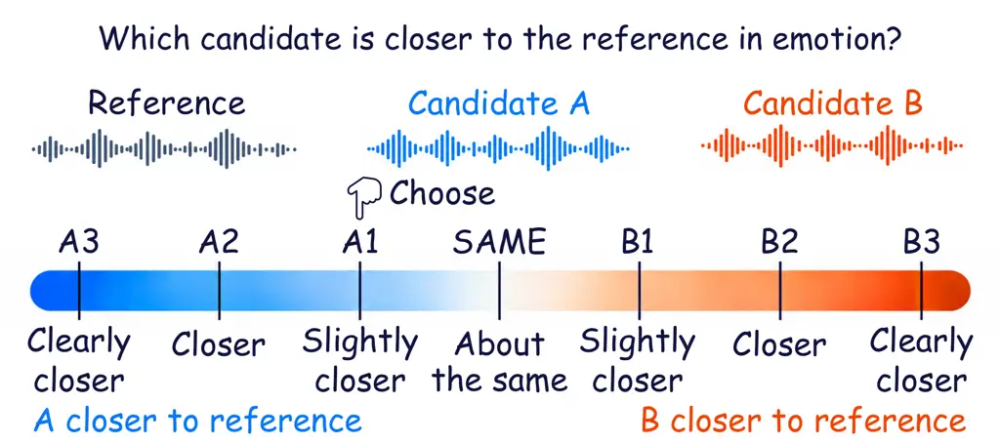

# Toward Human-Aligned Judgement of Speech Emotion Similarity

Yun-Shao Tsai¹, Yi-Cheng Lin^(1,∗), Chih-Kai Yang^(1,∗), Ho-Jung Cheng²,
Tsun-Yi Chang³, Sheng-Wei Wu⁴, Yi-Shan Chen⁴, Hsiang-Chun Chang³,
Liang-Chieh Lee³, Hung-yi Lee^(1,3,5) ^(†)^(†)thanks: ^(\*)Equal
second-author contribution.

###### Abstract

Evaluating emotion preservation in expressive speech generation involves
assessing how closely generated speech matches a reference in emotion.
Human listening tests assess this similarity, but their cost motivates
automatic measures aligned with human judgments. To support the
development and evaluation of such measures, we introduce SES-Bench, a
speech emotion similarity benchmark built from human comparisons of two
candidate utterances against a shared reference. These comparisons
record which candidate listeners find emotionally closer to the
reference and the strength of their preference. Using these annotations,
we train SES-Judge to score emotion similarity between two utterances.
SES-Judge significantly outperforms embedding cosine similarity and
prompted large audio-language models in preference accuracy and
correlation with human ratings that capture both preference direction
and strength.

###### Index Terms: 

Emotional similarity, expressive speech generation, perceptual
evaluation

^(†)^(†)address: ¹Graduate Institute of Communication Engineering,
National Taiwan University, Taiwan  
²Independent Researcher   ³National Taiwan University, Taiwan  
⁴National Taiwan University of Science and Technology, Taiwan  
⁵NTU Artificial Intelligence Center of Research Excellence (NTU
AI-CoRE), Taiwan

## 1 Introduction

Recent advances in speech generation have enabled increasingly
expressive outputs in text-to-speech (TTS), voice conversion (VC), and
speech-to-speech translation (ST) \[29, 20, 5\]. Evaluating these
systems requires assessing how well outputs convey intended emotion. For
systems using a reference utterance to guide emotional expression, this
means assessing how closely each output matches the reference in
emotion. Human listening tests assess this similarity, but their cost
makes repeated evaluation during model development difficult \[21\].
This motivates automatic measures to assess emotion similarity at scale
while remaining aligned with human perception \[19, 18\].

A common approach is EMO SIM, which computes cosine similarity between
reference and generated speech embeddings, commonly extracted using
emotion2vec \[17, 24\]. However, these scores do not consistently agree
with human choices \[21\]. To learn and evaluate measures aligned with
human perception, we need comparisons that capture both which candidate
sounds emotionally closer to a reference and how strongly listeners
prefer it.

To support this approach, we introduce SES-Bench, a Speech Emotion
Similarity Benchmark for evaluating how well automatic similarity
measures agree with human judgments. Each sample is a triplet comprising
one reference utterance and two generated candidate utterances. Five
annotators independently compare the candidates against the reference,
using a seven-level scale to indicate which candidate sounds emotionally
closer and how strongly they prefer it. These annotations support
learning a similarity measure and evaluating agreement with human
perception. We use these annotations to train SES-Judge as a Speech
Emotion Similarity Judge that assesses how similar two utterances sound
in emotional expression. Our evaluation measures agreement with human
choices and correlation between its score differences and human ratings.
SES-Judge significantly improves both measures over embedding similarity
and judgments from large audio-language models (LALMs).

- •
  We introduce SES-Bench¹¹ 1
  [https://github.com/danielqwer/Speech-Emotion-Similarity.git](https://github.com/danielqwer/Speech-Emotion-Similarity.git),
  a dataset and benchmark for human-perceived speech emotion similarity.
  It provides graded human comparisons for model training and a shared
  test set for evaluating agreement with human judgments.
- •
  We develop SES-Judge, which learns from these graded comparisons to
  assess emotional similarity between two utterances. It significantly
  outperforms pretrained embedding similarity and LALM judges in both
  preference accuracy and correlation with human ratings.

## 2 Related Work

### 2.1 Speech Emotion Datasets

Speech emotion and expressive speech datasets describe utterances
through categorical or dimensional labels \[2, 3\], or natural-language
descriptions of speaking style that extend beyond fixed labels \[12\].
However, similarity rankings derived from categorical or dimensional
emotion labels can disagree with annotators’ choices \[10\]. For
generated speech, prior work asks listeners to judge _which_ candidate
is emotionally closer to a reference, but does not record _how much_
closer they perceive it to be \[21\]. To capture this degree of
perceived difference, SES-Bench uses a graded comparison scale that
distinguishes a slight similarity advantage from a large one, providing
annotations for both training and evaluation.

### 2.2 Emotion Similarity Evaluation Methods

Emotion similarity is commonly measured using cosine similarity between
utterance embeddings \[24\]. Beyond using pretrained embeddings,
similarity functions can be learned from triplets constructed using
emotion labels \[10\]. Human ratings also provide supervision for
AutoPCP, which predicts overall prosodic similarity between speech
pairs \[1\]. Speech judge models also learn from human feedback,
although they assess naturalness and overall quality rather than
emotional similarity to a reference \[27, 23\]. In concurrent work, STEB
evaluates emotion preservation in speech translation using an LLM to
compare emotion descriptions generated from the source and translated
speech \[7\]. SES-Judge learns a reference–candidate emotion similarity
score from SES-Bench’s graded human comparisons. These comparisons
supervise the score differences, encouraging them to reflect both
annotators’ preferred candidate and the perceived degree of difference.

## 3 SES-Bench

### 3.1 Task Definition

We define perceived emotion similarity as the degree to which two
utterances resemble each other in emotional expression. In speech
generation evaluation, we treat the utterance providing the desired
expression as a reference $`r`$ and a generated utterance as a candidate
$`x`$. A judge assigns a score $`s(r,x)\in\mathbb{R}`$, where higher
values indicate closer emotion matches.

SES-Bench collects relative similarity judgments using triplets
comprising one reference $`r`$ and two candidates $`x_{A}`$ and
$`x_{B}`$. Each reference–candidate pair is scored independently, and
the difference between the two scores represents the candidates’
relative similarity to the reference:

```math
\Delta(r,x_{A},x_{B})=s(r,x_{A})-s(r,x_{B}). \tag{1}
```

Positive values of $`\Delta`$ favor A, while negative values favor B.
The magnitude $`|\Delta|`$ represents the predicted strength of this
difference.

### 3.2 Data Construction

Candidate utterances are generated using zero-shot TTS and VC, with each
triplet pairing outputs from either two TTS systems or two VC systems.
To evaluate expressive speech generation, we exclude references labeled
solely as neutral from both partitions. For TTS, the two systems receive
the same reference utterance and target text. We generate this text
using Claude Opus 5.²² 2
[https://www.anthropic.com/news/claude-opus-5](https://www.anthropic.com/news/claude-opus-5)
For VC, the source utterance serves as the reference, and the systems
convert its speaker identity while retaining its linguistic content.
Both systems use the same target speaker prompt to specify the speaker
identity.

The training set uses MSP-Podcast utterances \[2\] as references. We
generate TTS candidates using CosyVoice 3 \[8\],
Step-Audio-EditX \[26\], F5-TTS \[6\], and IndexTTS2 \[29\], and VC
candidates using AdaptVC \[14\], EZ-VC \[13\], Vevo2 \[28\], and
FreeVC \[15\]. The TTS systems include autoregressive and
non-autoregressive models, while the VC systems include VITS-based and
flow-matching architectures. We randomly sample candidate pairs from
these outputs, keeping each system approximately equally represented.

The test set uses CREMA-D utterances \[3\] as references to evaluate on
a different corpus. To test generalization to unseen generation systems,
we use Qwen3-TTS \[11\] for TTS and Seed-VC \[16\] for VC exclusively in
the test set. Each test triplet pairs an output from one of these
systems with an output from a randomly selected system used to generate
training candidates for the same task.



Figure 1: Annotation schematic. An annotator compares two candidates
with a reference and rates their relative emotional similarity on a
seven-point scale.

### 3.3 Annotation and Dataset Statistics

As shown in Fig. 1, five annotators independently listen to each triplet
and select one of the seven ordered responses A3, A2, A1, SAME, B1, B2,
and B3. A1, A2, and A3 mean that A is “slightly closer,” “closer,” and
“clearly closer” to the reference in emotion, respectively, with
corresponding meanings for B. The numbered levels indicate the strength
of this preference rather than emotional intensity. SAME indicates
approximately equal similarity to the reference, even if neither
candidate matches it closely.

We remove any triplet flagged by at least one annotator as containing
corrupted or unplayable audio. This leaves 2,974 training comparisons
(1,491 TTS and 1,483 VC) and 848 test comparisons (417 TTS and 431 VC).
The reference utterances cover 973 speakers in training (54.0% male,
46.0% female) and 91 in testing (52.7% male, 47.3% female). The 11,466
reference and candidate utterances total 10.97 hours, with 8.86 hours in
training and 2.11 hours in testing. We summarize agreement among
annotators by grouping A1–A3 as A and B1–B3 as B, with SAME as a third
category. The proportion of annotators supporting the most frequent
category defines Unanimous Agreement ($`5/5`$), Strong Majority
($`4/5`$), Simple Majority ($`3/5`$), or No Majority ($`2/5`$). Figure 2
summarizes distributions of agreement levels, reference emotions, and
generation systems for the training and test sets. After removing
comparisons flagged for corrupted or unplayable audio, more test
comparisons have A as the majority answer than B. To reduce this
imbalance, we randomly select some comparisons with answer A and
exchange candidates A and B, updating the annotations accordingly. Among
comparisons with Simple Majority or higher agreement, the resulting
answer distribution is 318 A, 317 B, and 37 SAME. This changes only
candidate positions, preserving the audio pairs and human judgments.

Figure 2: Distributions of agreement, reference emotion labels, and
generation systems in SES-Bench, with Train and Test shown side by side
for each group. System proportions count candidate occurrences
separately for TTS and VC.

|                             |                                             |                                      |                               |                                                      |
| --------------------------- | ------------------------------------------- | ------------------------------------ | ----------------------------- | ---------------------------------------------------- |
| Model / Encoder             | Training data                               | Training task / loss                 | Scoring input                 | Scoring rule                                         |
| EmotionRankCLAP             | —                                           | —                                    | Projected audio embedding     | Cosine similarity                                    |
| WavLM-SER                   | —                                           | —                                    | SER head-hidden embedding     | Cosine similarity                                    |
| emotion2vec                 | —                                           | —                                    | Final encoder-layer embedding | Cosine similarity                                    |
| WavLM-SER emotion2vec       | MSP-Podcast with / without synthetic speech | Emotion classification Cross-entropy | Fused embedding               | Cosine similarity                                    |
|                             |                                             |                                      | Head-hidden embedding         | Cosine similarity                                    |
|                             |                                             |                                      | Class probabilities           | Negative KL divergence                               |
| WavLM-SER emotion2vec       | MSP-Podcast                                 | VAD regression MSE                   | Fused embedding               | Cosine similarity                                    |
|                             |                                             |                                      | Head-hidden embedding         | Cosine similarity                                    |
|                             |                                             |                                      | Predicted VAD values          | Negative Euclidean distance                          |
| WavLM-SER emotion2vec       | MSP-Podcast                                 | VAD-based similarity Triplet loss    | Learned embedding             | Cosine similarity                                    |
| Qwen3-Omni Gemini 3.8 Flash | —                                           | —                                    | Seven-option responses        | Mean signed rating / Most frequent A/B/SAME category |

Table 1: Baseline configurations. Training data and objectives refer to
additional training in this work. Each listed scoring input defines a
separate evaluation. Fused embeddings combine layer representations;
head-hidden embeddings are taken after the downstream hidden layer.
Classification is trained separately with and without synthetic speech.

## 4 SES-Judge

We use a pretrained, frozen WavLM-based dimensional speech emotion
recognition model (WavLM-SER) \[9\] as our audio encoder.³³ 3
[https://huggingface.co/3loi/SER-Odyssey-Baseline-WavLM-Multi-Attributes](https://huggingface.co/3loi/SER-Odyssey-Baseline-WavLM-Multi-Attributes)
We temporally average frame-level features to obtain utterance
representations, apply a separate trainable linear projection \[22\] and
normalization to each layer representation, and combine them through a
learnable weighted sum. A final linear projection produces a
1024-dimensional embedding, and we use cosine similarity to score each
reference–candidate pair.

We train the model on SES-Bench’s graded comparisons using cumulative
logit ordinal regression. The difference between the two similarity
scores is mapped to probabilities over seven responses ordered from B3
through SAME to A3 using a learned positive scale and ordered
thresholds. We constrain the thresholds to be symmetric about zero so
that exchanging A and B reverses the predicted response distribution. We
minimize cross-entropy against the empirical distribution of all five
annotators’ responses:

```math
\mathcal{L}_{\mathrm{ord}}=-\frac{1}{N}\sum_{i=1}^{N}\sum_{k=1}^{7}q_{ik}\log p_{ik}, \tag{2}
```

where $`N`$ is the number of triplets, $`q_{ik}`$ is the fraction of
annotators selecting response $`k`$ for triplet $`i`$, and $`p_{ik}`$ is
its predicted probability.

|                                   |                                   |                                  |
| --------------------------------- | --------------------------------- | -------------------------------- |
| Method                            | Spearman                          | Accuracy (%)                     |
| SES-Judge                         | $`\mathbf{0.5297}^{\phantom{*}}`$ | $`\mathbf{74.96}^{\phantom{*}}`$ |
| Embedding cosine similarity       |                                   |                                  |
| EmotionRankCLAP                   | $`0.3537^{*}`$                    | $`63.46^{*}`$                    |
| WavLM-SER                         | $`0.3591^{*}`$                    | $`64.25^{*}`$                    |
| emotion2vec                       | $`0.3064^{*}`$                    | $`65.51^{*}`$                    |
| WavLM-SER + downstream training   |                                   |                                  |
| VAD reg. / Fused cosine           | $`0.4820^{*}`$                    | $`71.65^{*}`$                    |
| VAD reg. / Hidden cosine          | $`0.3660^{*}`$                    | $`64.72^{*}`$                    |
| VAD reg. / VAD distance           | $`0.3655^{*}`$                    | $`66.30^{*}`$                    |
| Classification / Fused cosine     | $`0.4594^{*}`$                    | $`70.55^{*}`$                    |
| Classification / Hidden cosine    | $`0.3360^{*}`$                    | $`61.57^{*}`$                    |
| Classification / Negative KL      | $`0.3227^{*}`$                    | $`59.53^{*}`$                    |
| VAD triplet / Cosine              | $`0.4736^{*}`$                    | $`68.35^{*}`$                    |
| emotion2vec + downstream training |                                   |                                  |
| VAD reg. / Fused cosine           | $`0.4258^{*}`$                    | $`68.82^{*}`$                    |
| VAD reg. / Hidden cosine          | $`0.3399^{*}`$                    | $`66.93^{*}`$                    |
| VAD reg. / VAD distance           | $`0.3174^{*}`$                    | $`64.72^{*}`$                    |
| Classification / Fused cosine     | $`0.4124^{*}`$                    | $`66.46^{*}`$                    |
| Classification / Hidden cosine    | $`0.3063^{*}`$                    | $`62.20^{*}`$                    |
| Classification / Negative KL      | $`0.2903^{*}`$                    | $`62.20^{*}`$                    |
| VAD triplet / Cosine              | $`0.3671^{*}`$                    | $`67.09^{*}`$                    |
| LALMs as judges                   |                                   |                                  |
| Gemini 3.8 Flash                  | $`0.3813^{*}`$                    | $`60.63^{*}`$                    |
| Qwen3-Omni                        | $`0.0739^{*}`$                    | $`3.15^{*}`$                     |

Table 2: Baselines grouped by encoder and training objective. Fused and
hidden cosine use embeddings before and after the downstream hidden
layer. VAD distance is the negative Euclidean distance between predicted
VAD vectors. ^(∗) indicates a significant difference from SES-Judge
(paired triplet bootstrap for Spearman; exact two-sided McNemar for
accuracy, $`\alpha=0.05`$).

|                                   |                                   |                                  |
| --------------------------------- | --------------------------------- | -------------------------------- |
| Method                            | Spearman                          | Accuracy (%)                     |
| SES-Judge                         | $`\mathbf{0.5297}^{\phantom{*}}`$ | $`\mathbf{74.96}^{\phantom{*}}`$ |
| WavLM-SER + downstream training   |                                   |                                  |
| Classification / Fused cosine     | $`0.3559^{*}`$                    | $`66.61^{*}`$                    |
| Classification / Hidden cosine    | $`0.1783^{*}`$                    | $`57.80^{*}`$                    |
| Classification / Negative KL      | $`0.1330^{*}`$                    | $`56.38^{*}`$                    |
| emotion2vec + downstream training |                                   |                                  |
| Classification / Fused cosine     | $`0.3936^{*}`$                    | $`66.14^{*}`$                    |
| Classification / Hidden cosine    | $`0.2257^{*}`$                    | $`59.53^{*}`$                    |
| Classification / Negative KL      | $`0.1557^{*}`$                    | $`56.85^{*}`$                    |

Table 3: Comparison with classification baselines trained on MSP-Podcast
and synthetic speech from SES-Bench Train. Fused and hidden cosine use
embeddings before and after the downstream hidden layer. ^(∗) indicates
a significant difference from SES-Judge (paired triplet bootstrap for
Spearman; exact two-sided McNemar for accuracy, $`\alpha=0.05`$).

## 5 Experiment

### 5.1 Setup

We train SES-Judge on all SES-Bench Train comparisons, regardless of
agreement among annotators (Section 3.3). For evaluation, we map A3, A2,
A1, SAME, B1, B2, and B3 to the discrete scores $`3,2,1,0,-1,-2,-3`$,
respectively. Positive scores favor A, while negative scores favor B. We
compute Spearman correlation between model predictions and mean human
ratings over all 848 test comparisons. These ratings capture both
preference direction and strength.

We also report accuracy on a simplified A/B choice task using 635
comparisons, excluding comparisons with majority SAME responses or No
Majority. Score-based methods select the candidate with the higher
similarity score, while LALM predictions follow the response aggregation
described in Section 5.2. Tied similarity scores and LALM predictions of
SAME are counted as incorrect.

### 5.2 Baselines

Table 1 summarizes models, training objectives, and scoring methods. We
evaluate cosine similarity using pretrained embeddings from
EmotionRankCLAP \[4\], WavLM-SER, and emotion2vec \[17\]. For emotion
classification and methods based on valence, arousal, and dominance
(VAD), we use frozen WavLM-SER and emotion2vec base encoders with the
same per-layer projection, normalization, and learnable weighted sum as
SES-Judge, producing a fused representation. These models are trained on
MSP-Podcast’s official training split. For emotion classification only,
we exclude utterances with emotion-category labels O (other) or X (no
agreement among annotators). We train classifiers on MSP-Podcast plus
all synthetic candidates from SES-Bench Train, assigning each candidate
its reference’s emotion category. With both methods using these
synthetic utterances, we compare supervision from emotion categories and
human similarity judgments. Following emotion2vec’s downstream head
design \[17\], we use a 256-unit linear layer with ReLU followed by an
eight-class output layer. For VAD regression, we retain the hidden layer
and use three sigmoid outputs for VAD ratings scaled to $`[0,1]`$.
Triplet learning uses VAD distances to select positive and negative
utterances and trains a final linear projection of the fused
representation, using normalized embeddings.

For Qwen3-Omni \[25\] and Gemini 3.8 Flash⁴⁴ 4
[https://ai.google.dev/gemini-api/docs/models/gemini-3.8-flash](https://ai.google.dev/gemini-api/docs/models/gemini-3.8-flash),
we ask “Which of A and B is closer to the REFERENCE in emotion?” with
the seven human annotation options. Each model answers ten times per
triplet, with five presentations in each A/B order. We restore candidate
identities and average signed responses for Spearman correlation. For
accuracy, we group responses into A, B, or SAME and take the most
frequent category, assigning SAME when the highest vote counts are tied.

### 5.3 Experimental Results

Table 2 compares SES-Judge with methods trained without SES-Bench’s
comparison labels. SES-Judge achieves a Spearman correlation of 0.5297,
significantly outperforming all baselines, and the highest accuracy of
74.96%. The correlation advantage extends across embedding metrics,
models trained with emotion labels, and prompted LALMs. Qwen3-Omni’s low
accuracy primarily reflects frequent SAME predictions, which account for
94.96% of its aggregated predictions on the A/B evaluation subset.
Together, these results support using SES-Bench’s comparisons to learn a
metric aligned with human judgments of preference direction and
strength.

Across both encoders, VAD regression yields higher Spearman correlation
and accuracy than emotion classification across the three readouts. For
both training objectives, cosine similarity between fused
representations performs best, outperforming hidden-layer cosine
similarity and output-space distances. These results suggest that
representations trained with emotion labels retain similarity
information that is less accessible through their downstream heads.

Table 3 shows that SES-Judge retains its advantage when classifiers also
receive the synthetic utterances used in its training. SES-Judge
significantly outperforms the classifiers using either encoder across
three readouts on both metrics. Thus, even with the same synthetic
utterances, classifiers trained with emotion category labels do not
match SES-Judge’s agreement with human judgments. This finding
highlights the value of SES-Bench as a source of human similarity
supervision, beyond providing synthetic training speech.

## 6 Conclusion

We introduced SES-Bench, a benchmark for evaluating perceived emotion
similarity through graded human comparisons. Its annotations capture
both preference direction and relative strength and can be used to train
and evaluate emotion similarity models. Trained on these comparisons,
SES-Judge shows stronger agreement with human judgments than embedding
cosine similarity and prompted LALMs. Future work will explore using
SES-Judge as a reward model to guide expressive speech generation toward
closer emotional similarity to a reference utterance.

## References

- \[1\] L. Barrault et al. (2023) Seamless: multilingual expressive and
  streaming speech translation. arXiv preprint arXiv:2312.05187. Cited
  by: §2.2.
- \[2\] C. Busso et al. (2026) The msp-podcast corpus. IEEE Transactions
  on Affective Computing. Cited by: §2.1, §3.2.
- \[3\] H. Cao et al. (2014) CREMA-d: crowd-sourced emotional multimodal
  actors dataset. IEEE Transactions on Affective Computing. Cited by:
  §2.1, §3.2.
- \[4\] S. S. Chandra et al. (2025) EmotionRankCLAP: Bridging Natural
  Language Speaking Styles and Ordinal Speech Emotion via
  Rank-N-Contrast. In Interspeech 2025, Cited by: §5.2.
- \[5\] S. Chen et al. (2026) Move: translating laughter and tears via
  mixture of vocalization experts in speech-to-speech translation. arXiv
  preprint arXiv:2604.17435. Cited by: §1.
- \[6\] Y. Chen et al. (2025) F5-TTS: a fairytaler that fakes fluent and
  faithful speech with flow matching. In Proceedings of the 63rd Annual
  Meeting of the Association for Computational Linguistics (Volume 1:
  Long Papers), Cited by: §3.2.
- \[7\] S. Cheng et al. (2026) STEB: a speech-to-speech translation
  expressiveness benchmark for evaluating beyond translation fidelity.
  arXiv preprint arXiv:2606.25529. Cited by: §2.2.
- \[8\] Z. Du et al. (2025) Cosyvoice 3: towards in-the-wild speech
  generation via scaling-up and post-training. arXiv preprint
  arXiv:2505.17589. Cited by: §3.2.
- \[9\] L. Goncalves et al. (2024) Odyssey 2024 - Speech Emotion
  Recognition Challenge: Dataset, Baseline Framework, and Results. In
  The Speaker and Language Recognition Workshop (Odyssey 2024), Cited
  by: §4.
- \[10\] J. Harvill et al. (2023) Quantifying emotional similarity in
  speech. IEEE Transactions on Affective Computing. Cited by: §2.1,
  §2.2.
- \[11\] H. Hu et al. (2026) Qwen3-tts technical report. arXiv preprint
  arXiv:2601.15621. Cited by: §3.2.
- \[12\] Z. Jin et al. (2024) Speechcraft: a fine-grained expressive
  speech dataset with natural language description. In Proceedings of
  the 32nd ACM International Conference on Multimedia, Cited by: §2.1.
- \[13\] A. Joglekar et al. (2025) EZ-VC: easy zero-shot any-to-any
  voice conversion. In Findings of the Association for Computational
  Linguistics: EMNLP 2025, Cited by: §3.2.
- \[14\] J. Kim et al. (2025) AdaptVC: high quality voice conversion
  with adaptive learning. In ICASSP 2025 - 2025 IEEE International
  Conference on Acoustics, Speech and Signal Processing (ICASSP), Cited
  by: §3.2.
- \[15\] J. Li et al. (2023) Freevc: towards high-quality text-free
  one-shot voice conversion. In ICASSP 2023 - 2023 IEEE International
  Conference on Acoustics, Speech and Signal Processing (ICASSP), Cited
  by: §3.2.
- \[16\] S. Liu (2024) Zero-shot voice conversion with diffusion
  transformers. arXiv preprint arXiv:2411.09943. Cited by: §3.2.
- \[17\] Z. Ma et al. (2024) Emotion2vec: self-supervised pre-training
  for speech emotion representation. In Findings of the Association for
  Computational Linguistics: ACL 2024, Cited by: §1, §5.2.
- \[18\] W. Ren et al. (2025) HighRateMOS: sampling-rate aware modeling
  for speech quality assessment. In 2025 IEEE Automatic Speech
  Recognition and Understanding Workshop (ASRU), Cited by: §1.
- \[19\] T. Saeki et al. (2022) UTMOS: UTokyo-SaruLab System for
  VoiceMOS Challenge 2022. In Interspeech 2022, Cited by: §1.
- \[20\] X. Su et al. (2025) DiffEmotionVC: A Dual-Granularity
  Disentangled Diffusion Framework for Any-to-Any Emotional Voice
  Conversion. In Interspeech 2025, Cited by: §1.
- \[21\] Y. Tsai et al. (2026) The false resonance: a critical
  examination of emotion embedding similarity for speech generation
  evaluation. arXiv preprint arXiv:2604.26347. Cited by: §1, §1, §2.1.
- \[22\] H. Wang et al. (2024) No-Reference Speech Intelligibility
  Prediction Leveraging a Noisy-Speech ASR Pre-Trained Model. In
  Interspeech 2024, Cited by: §4.
- \[23\] H. Wang et al. (2026) SpeechLLM-as-judges: towards general and
  interpretable speech quality evaluation. In Proceedings of the 64th
  Annual Meeting of the Association for Computational Linguistics
  (Volume 1: Long Papers), Cited by: §2.2.
- \[24\] S. Wang et al. (2026) Beyond global emotion: fine-grained
  emotional speech synthesis with dynamic word-level modulation. In
  ICASSP 2026 - 2026 IEEE International Conference on Acoustics, Speech
  and Signal Processing (ICASSP), Cited by: §1, §2.2.
- \[25\] J. Xu et al. (2025) Qwen3-omni technical report. arXiv preprint
  arXiv:2509.17765. Cited by: §5.2.
- \[26\] C. Yan et al. (2025) Step-audio-editx technical report. arXiv
  preprint arXiv:2511.03601. Cited by: §3.2.
- \[27\] X. Zhang et al. (2026) SpeechJudge: towards human-level
  judgment for speech naturalness. In International Conference on
  Learning Representations, Cited by: §2.2.
- \[28\] X. Zhang et al. (2026) Vevo2: a unified and controllable
  framework for speech and singing voice generation. IEEE Transactions
  on Audio, Speech and Language Processing. Cited by: §3.2.
- \[29\] S. Zhou et al. (2026) Indextts2: a breakthrough in emotionally
  expressive and duration-controlled auto-regressive zero-shot
  text-to-speech. In Proceedings of the AAAI Conference on Artificial
  Intelligence, Cited by: §1, §3.2.
