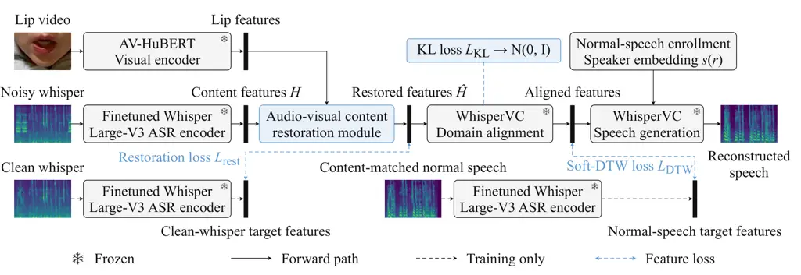

# WhisperVC-AV: Audio-Visual Content Restoration for Noise-Robust Whisper-to-Normal Voice Conversion

Ziyue Yin    Dong Liu    Ming Li\sthanksCorresponding author: Ming Li
(email: mingli369@cuhk.edu.cn)

###### Abstract

Environmental noise obscures the content cues needed for
whisper-to-normal conversion. We propose WhisperVC-AV, which restores
acoustic content features while leaving the original WhisperVC
conversion module unchanged. Its context-guided restoration module
combines temporal acoustic context with synchronized lip features
through attention and gated residual correction. Experiments on
AISHELL6-Whisper show lower character error rates (CERs) than WhisperVC
across three ASR systems, on clean speech and under all six
signal-to-noise ratio (SNR) conditions with MUSAN noise. The largest
gains occur at 0 dB SNR, where Qwen3-ASR CER falls from 36.29% to
28.88%. WhisperVC-AV also improves predicted speech quality while
maintaining speaker similarity. The CER gains extend to unseen
background noise without retraining, while visual controls support the
use of utterance-specific lip cues. Audio examples are available on our
demo page.²² 2 Demo page:
[larry-ziyue-yin.github.io/demo-whispervc-av/](https://larry-ziyue-yin.github.io/demo-whispervc-av/).

###### Index Terms: 

Whisper-to-normal voice conversion, audio-visual speech processing,
content restoration, noise robustness

^(†)^(†)address: ¹Digital Innovation Research Center, Duke Kunshan
University, Kunshan, China  
²Department of Computer Science, Johns Hopkins University, Baltimore,
MD, USA  
³School of Computer Science, Wuhan University, Wuhan, China  
⁴School of Artificial Intelligence, The Chinese University of Hong Kong,
Shenzhen, China



Figure 1: Overview of WhisperVC-AV. Acoustic and visual cues restore
content features while the original WhisperVC conversion module remains
unchanged. All speech branches share the same frozen ASR encoder. Dashed
paths and feature-loss connections are used only during training.

Figure 2: Context-guided content restoration. Acoustic queries attend to
projected lip features $`z`$ within $`\mathcal{N}(t)`$. Acoustic context
$`u_{t}`$ and visual context $`c_{t}`$ jointly determine the gated
residual, which the identity path adds to content features $`H`$ to
obtain restored features $`\hat{H}`$.

## 1 Introduction

Whisper-to-normal (W2N) conversion converts whispered speech into normal
speech while preserving linguistic content and speaker identity. A
speaker may whisper to avoid disturbing others, yet ventilation,
household activity, or passing vehicles can remain audible. Whispered
speech lacks periodic vocal-fold excitation \[14\], and noise further
obscures its acoustic content cues. Therefore, W2N conversion must
address both cross-phonation differences and noisy input.

Earlier W2N methods learn adversarial mappings \[7\], use variational
autoencoders \[20\], or model source–filter synthesis \[14\]. More
recently, WESPER and DistillW2N leverage self-supervised speech
representations \[16, 25\], while WhispEar expands training data with
pseudo-parallel whispered speech \[6\]. WhisperVC instead separates
cross-phonation alignment from speech generation \[11\]. When noise
corrupts its input features, the converter receives less reliable
content information. This motivates us to restore the input
representation while retaining the learned conversion mapping.

Synchronized lip motion is a useful source of complementary information
because additive acoustic noise does not directly corrupt the video.
This complementarity has been exploited in audio-visual speech
enhancement \[5\], resynthesis \[28\], and representation learning \[21,
22\]. For speech recognition, V-CAFE uses visual-context attention and
mask-plus-residual acoustic enhancement \[9\]. Similarly, gated visual
attention incorporates lip information into Whisper \[10\]. These
approaches use visual evidence to strengthen acoustic representations
for recognition.

Lip information has also been integrated directly into W2N conversion:
W2N-AVSC trains a conditional VAE with a video-conditioned prior and
sums acoustic and visual latent representations for decoding \[19\]. It
evaluates audiovisual conversion with both clean and noisy whispered
input. Rather than jointly learning audiovisual conversion, we use lip
information to restore the acoustic representation supplied to a
pretrained converter, preserving its learned conversion mapping. Our
contributions are:

- •
  We formulate noise-robust W2N conversion as input-side content
  restoration, reusing a pretrained converter without updating its
  conversion backbone.
- •
  We develop a context-guided audio-visual restoration module that uses
  acoustic context to select nearby lip information and predicts a gated
  residual correction.

By restoring content at the converter’s input, we separate noise
robustness from the learned whisper-to-normal mapping. This design
enables us to reuse WhisperVC’s conversion capability while exploiting
synchronized lip cues when acoustic evidence is degraded.

## 2 Method

### 2.1 Overview

Fig. 1 shows how we separate input restoration from conversion. For
noisy whispered speech $`\tilde{x}`$, a frozen Whisper Large-V3 encoder
finetuned on AISHELL6-Whisper \[10\] extracts acoustic content features
$`H`$. Each utterance is instance-normalized over time per feature
channel, with frozen affine parameters inherited from WhisperVC. Clean
training targets are normalized independently. Our module combines $`H`$
with synchronized lip features to produce $`\hat{H}`$ in the same
acoustic space. WhisperVC’s alignment network maps $`\hat{H}`$ to
normal-speech content features; its generator and vocoder reconstruct
speech $`\hat{y}`$, conditioned on embedding $`s(r)`$ from same-speaker
normal-speech enrollment $`r`$ \[11\]. Only the restoration module is
trained; the feature encoders and conversion backbone remain frozen.

### 2.2 Context-guided audio-visual restoration

In Fig. 2, a projection maps 1280-dimensional $`H`$ to 256 dimensions.
Three residual temporal convolutional layers, with kernel size 5 and
dilations 1, 2, and 4, form acoustic context $`u`$. Frozen noise-robust
AV-HuBERT \[22\], with audio disabled, extracts 1024-dimensional lip
features from 25-fps video. Layer normalization and a learned projection
map them to 256 dimensions; linear interpolation aligns them with the
50-Hz acoustic sequence, yielding $`z`$. Single-head scaled dot-product
attention takes $`u`$ as queries and $`z`$ as both keys and values. Each
query attends to $`\mathcal{N}(t)=\{t-4,\ldots,t+4\}`$, spanning
approximately $`\pm 80`$ ms; invalid boundary positions are masked.
Acoustic context $`u_{t}`$ and visual context $`c_{t}`$ jointly
determine a scalar sigmoid gate $`g_{t}`$ and the residual correction,

```math
\displaystyle c_{t} \displaystyle=\mathrm{Attn}\bigl(u_{t},\{z_{j}:j\in\mathcal{N}(t)\}\bigr), \tag{1}
```

```math
\displaystyle g_{t} \displaystyle=\sigma\bigl(W_{g}[u_{t};c_{t}]+b_{g}\bigr),\quad\hat{H}_{t}=H_{t}+g_{t}R(u_{t}+c_{t}).
```

Here $`[u_{t};c_{t}]`$ denotes concatenation, and $`R`$ projects back to
the input feature space. Zero-initializing $`R`$ preserves the identity
output.

| ASR                  | System                   | Clean | 0 dB  | 5 dB  | 10 dB | 15 dB | 20 dB | 25 dB | Noisy avg. |
| -------------------- | ------------------------ | ----- | ----- | ----- | ----- | ----- | ----- | ----- | ---------- |
| Qwen3-ASR            | WhisperVC \[11\]         | 11.47 | 36.29 | 26.23 | 18.91 | 15.40 | 13.43 | 12.34 | 20.43      |
|                      | MP-SENet-DNS + WhisperVC | 24.42 | 43.13 | 34.31 | 26.97 | 22.57 | 19.72 | 17.90 | 27.43      |
|                      | SEMamba + WhisperVC      | 25.34 | 61.63 | 52.04 | 43.18 | 35.67 | 31.63 | 28.71 | 42.14      |
|                      | Direct AV adaptation     | 10.40 | 29.99 | 21.51 | 16.18 | 13.20 | 11.65 | 11.05 | 17.26      |
|                      | WhisperVC-A              | 10.11 | 30.92 | 21.76 | 16.08 | 13.27 | 11.66 | 10.87 | 17.43      |
|                      | WhisperVC-AV (ours)      | 9.86  | 28.88 | 20.60 | 15.31 | 12.77 | 11.36 | 10.57 | 16.58      |
| Finetuned Whisper    | WhisperVC \[11\]         | 13.68 | 52.97 | 36.36 | 23.92 | 17.70 | 15.99 | 14.55 | 26.92      |
| (Large-V3) in \[10\] | MP-SENet-DNS + WhisperVC | 33.18 | 65.47 | 47.08 | 34.03 | 27.76 | 24.44 | 22.76 | 36.92      |
|                      | SEMamba + WhisperVC      | 30.11 | 92.71 | 80.30 | 57.61 | 44.15 | 36.79 | 35.86 | 57.90      |
|                      | Direct AV adaptation     | 12.24 | 41.36 | 26.28 | 18.31 | 15.18 | 14.17 | 12.85 | 21.36      |
|                      | WhisperVC-A              | 11.46 | 33.46 | 23.15 | 17.36 | 14.52 | 12.94 | 12.28 | 18.95      |
|                      | WhisperVC-AV (ours)      | 11.27 | 30.43 | 21.45 | 16.83 | 13.97 | 12.52 | 11.90 | 17.85      |
| Paraformer           | WhisperVC \[11\]         | 14.01 | 39.98 | 29.81 | 22.27 | 18.63 | 16.44 | 15.20 | 23.72      |
|                      | MP-SENet-DNS + WhisperVC | 28.13 | 46.68 | 38.16 | 31.04 | 26.25 | 23.22 | 21.27 | 31.10      |
|                      | SEMamba + WhisperVC      | 29.57 | 64.10 | 55.21 | 47.25 | 39.71 | 35.72 | 32.81 | 45.80      |
|                      | Direct AV adaptation     | 12.96 | 34.00 | 25.56 | 19.50 | 16.30 | 14.70 | 13.70 | 20.63      |
|                      | WhisperVC-A              | 12.68 | 35.14 | 25.60 | 19.61 | 16.29 | 14.41 | 13.57 | 20.77      |
|                      | WhisperVC-AV (ours)      | 12.33 | 33.20 | 24.73 | 19.10 | 15.80 | 14.10 | 13.23 | 20.03      |

Table 1: Character error rates (CER, %) on clean speech and under six
SNR conditions with MUSAN noise. The cascades enhance waveforms before
WhisperVC. WhisperVC-A is the separately trained audio-only ablation.
Noisy avg. averages the six noisy conditions; lower is better, with each
condition’s best result in bold.

### 2.3 Training and inference

Training pairs noisy whispered speech with its clean counterpart $`x`$.
Noisy training inputs undergo waveform time masking with probability 0.5
before feature extraction; clean inputs are unmasked. We zero randomly
placed spans of 0.2–0.6 s until 20% of waveform samples are masked,
merging overlaps and truncating spans to the remaining budget. One
masked variant is cached per noisy input. Feature-frame masks sample the
waveform mask at 20-ms intervals to match the acoustic sequence.
Restoration loss $`\mathcal{L}_{\mathrm{rest}}`$ weights mean Smooth-L1
errors on masked and unmasked frames by 0.75 and 0.25, respectively,
against clean features from the shared frozen encoder and normalization.
Without masked frames, it uses the overall mean. Masks guide the loss
but are not module inputs. For downstream compatibility, we retain
WhisperVC’s alignment and latent objectives \[11\]. Soft-DTW \[4\]
compares aligned features with content-matched normal-speech targets
without assuming identical timing. KL regularization constrains the
whisper-path posterior toward $`\mathcal{N}(0,I)`$. Figure 1 shows the
loss paths for the objective

```math
\mathcal{L}=\mathcal{L}_{\mathrm{DTW}}+\lambda_{\mathrm{KL}}\mathcal{L}_{\mathrm{KL}}+\lambda_{\mathrm{rest}}\mathcal{L}_{\mathrm{rest}}. \tag{2}
```

We set $`\lambda_{\mathrm{KL}}=0.1`$ to keep KL regularization modest
and $`\lambda_{\mathrm{rest}}=50`$ to give the smaller, frame-averaged
restoration loss an effective contribution alongside Soft-DTW. Although
the alignment network is frozen, it remains differentiable: gradients
from its Soft-DTW and KL losses pass through $`\hat{H}`$ to update the
restoration module, while its own weights remain fixed. At inference,
only noisy speech, lip video, and speaker enrollment are needed
(Fig. 1).

## 3 Experimental results

### 3.1 Experimental setup

We retain AISHELL6-Whisper’s original partition boundaries \[10\] and
use its video-covered subsets: 9,494 training utterances from 81
speakers, 2,235 validation utterances from 19 speakers, and the same
2,248 test utterances from 20 speakers, under clean input and each noisy
condition. The utterance lists are available on our demo page.

All WhisperVC baseline metrics are recomputed on this subset; the
original paper used a broader test set and Whisper-large-v3-turbo for
CER \[11\]. FreeSound and SoundBible recordings from MUSAN’s _noise_
subset \[24\] are mixed at 0, 5, 10, 15, 20, and 25 dB SNR, including
environmental sounds such as crowd noise, dial tones, and squeaking
doors. Music and speech subsets are excluded, and noise files are
disjoint across partitions. Noise files and starting offsets are sampled
separately for each SNR. Within each condition, all evaluated pipelines
start from the same noisy recording of each test utterance. We also
evaluate clean input.

Content-matched normal recordings from the same speaker provide training
targets without frame-level alignment. The enrollment speech, however,
uses a different sentence spoken normally by the same speaker, during
both training and inference. For evaluation, each test utterance uses
the same enrollment recording across systems and SNR conditions. Targets
and enrollment remain clean.

### 3.2 Evaluation metrics

Character error rate (CER) measures intelligibility and content
preservation. Three ASR systems are used to assess the consistency of
CER findings: Qwen3-ASR \[23\], Finetuned Whisper (Large-V3) in \[10\],
and Paraformer \[8\]. For each condition, we sum character
substitutions, deletions, and insertions over all test utterances and
divide by the total number of reference characters.

Predicted output quality is assessed with DNSMOS P.835 \[15\],
UTMOS \[18\], WVMOS \[1\], and NISQA \[13\]. Resemblyzer SECS,
WeSpeaker \[27\], and WavLM \[3\] measure similarity to content-matched
normal recordings; SpeechBERTScore \[17\] evaluates consistency with the
same references.

| ASR                  | Compared with        | Reduction \[95% CI\] |
| -------------------- | -------------------- | -------------------- |
| Qwen3-ASR            | WhisperVC            | 3.85 \[3.57, 4.13\]  |
|                      | Direct AV adaptation | 0.68 \[0.48, 0.88\]  |
|                      | WhisperVC-A          | 0.85 \[0.73, 0.97\]  |
| Finetuned Whisper    | WhisperVC            | 9.07 \[7.76, 10.46\] |
| (Large-V3) in \[10\] | Direct AV adaptation | 3.51 \[2.64, 4.47\]  |
|                      | WhisperVC-A          | 1.10 \[0.69, 1.54\]  |
| Paraformer           | WhisperVC            | 3.69 \[3.44, 3.95\]  |
|                      | Direct AV adaptation | 0.60 \[0.40, 0.80\]  |
|                      | WhisperVC-A          | 0.74 \[0.64, 0.85\]  |

Table 2: Mean CER reductions of WhisperVC-AV over six SNR conditions
with MUSAN noise (percentage points), with pointwise 95% confidence
intervals (CIs). All nine two-sided paired tests yield raw
$`p=0.000005`$ (199,999 label swaps; plus-one correction) and
Holm-adjusted $`p=0.000045`$.

|                      |            | DNSMOS $`\uparrow`$ |      |      |      | MOS predictors $`\uparrow`$ |       |       | Speaker/reference similarity $`\uparrow`$ |       |       |       |
| -------------------- | ---------- | ------------------- | ---- | ---- | ---- | --------------------------- | ----- | ----- | ----------------------------------------- | ----- | ----- | ----- |
| System               | Set        | OVRL                | SIG  | BAK  | P808 | UTMOS                       | WVMOS | NISQA | SECS                                      | WeSpk | WavLM | SBERT |
| WhisperVC \[11\]     | Clean      | 3.07                | 3.51 | 3.72 | 3.58 | 2.83                        | 3.29  | 3.13  | 0.83                                      | 0.68  | 0.94  | 0.78  |
|                      | Noisy avg. | 3.05                | 3.48 | 3.71 | 3.54 | 2.76                        | 3.22  | 3.11  | 0.82                                      | 0.67  | 0.94  | 0.77  |
| Direct AV adaptation | Clean      | 3.09                | 3.52 | 3.73 | 3.59 | 2.85                        | 3.30  | 3.15  | 0.84                                      | 0.69  | 0.95  | 0.79  |
|                      | Noisy avg. | 3.08                | 3.52 | 3.73 | 3.58 | 2.82                        | 3.28  | 3.14  | 0.83                                      | 0.68  | 0.94  | 0.78  |
| WhisperVC-A          | Clean      | 3.17                | 3.55 | 3.84 | 3.67 | 2.90                        | 3.28  | 3.18  | 0.84                                      | 0.69  | 0.95  | 0.79  |
|                      | Noisy avg. | 3.16                | 3.55 | 3.84 | 3.67 | 2.89                        | 3.28  | 3.18  | 0.83                                      | 0.69  | 0.94  | 0.78  |
| WhisperVC-AV (ours)  | Clean      | 3.16                | 3.55 | 3.83 | 3.67 | 2.90                        | 3.28  | 3.18  | 0.84                                      | 0.69  | 0.95  | 0.79  |
|                      | Noisy avg. | 3.16                | 3.55 | 3.84 | 3.67 | 2.89                        | 3.27  | 3.18  | 0.83                                      | 0.69  | 0.94  | 0.78  |

|                     | Qwen3-ASR |       |       | Finetuned Whisper (Large-V3) in \[10\] |       |       |
| ------------------- | --------- | ----- | ----- | -------------------------------------- | ----- | ----- |
| System              | 0 dB      | 5 dB  | 10 dB | 0 dB                                   | 5 dB  | 10 dB |
| WhisperVC \[11\]    | 24.72     | 17.26 | 13.78 | 30.80                                  | 23.61 | 18.24 |
| WhisperVC-A         | 20.80     | 14.75 | 12.06 | 21.78                                  | 15.88 | 13.22 |
| WhisperVC-AV (ours) | 19.71     | 14.22 | 11.90 | 20.43                                  | 15.39 | 13.17 |

Table 4: W2N CER (%) with unseen background noise from DEMAND at three
SNR levels. Lower is better.

| WhisperVC-AV (ours) |       |       |       |       |       |       |       |
| ------------------- | ----- | ----- | ----- | ----- | ----- | ----- | ----- |
| Video               | Clean | 0 dB  | 5 dB  | 10 dB | 15 dB | 20 dB | 25 dB |
| Correct             | 9.86  | 28.88 | 20.60 | 15.31 | 12.77 | 11.36 | 10.57 |
| Disabled            | 10.22 | 31.12 | 22.14 | 16.27 | 13.37 | 11.54 | 10.69 |
| Mismatch            | 10.15 | 31.78 | 22.63 | 16.70 | 13.57 | 11.78 | 10.81 |
| Shift $`-10`$       | 10.29 | 31.34 | 22.25 | 16.50 | 13.59 | 11.52 | 10.92 |
| Shift $`+10`$       | 10.25 | 31.59 | 22.06 | 16.33 | 13.44 | 11.70 | 10.89 |

Table 5: Qwen3-ASR CER (%) for visual controls on clean speech and under
six SNR conditions with MUSAN noise. Lower is better.

Table 3: Predicted speech quality, speaker similarity, and reference
consistency for clean input and the average over six SNR conditions with
MUSAN noise. Higher values are better; bold indicates the best rounded
score within each condition.

### 3.3 W2N results and ablation analysis

We evaluate WhisperVC-AV against original WhisperVC \[11\] and examine
waveform enhancement, direct visual adaptation, and the contribution of
the visual branch (Table 1). For the last comparison, we separately
train an audio-only ablation, denoted WhisperVC-A. It removes the visual
projection and attention paths in Fig. 2, so that the gated residual
depends solely on acoustic context $`u_{t}`$. The acoustic network,
supervision, and training schedule are retained.

The enhancement cascades apply magnitude–phase MP-SENet-DNS \[12\] or
Mamba-based SEMamba \[2\] before WhisperVC, using official pretrained
weights without task-specific fine-tuning. Both yield higher CER than
WhisperVC on clean speech and under all six SNR conditions.
MP-SENet-DNS, the stronger cascade, increases noisy-average Qwen3-ASR
CER from 20.43% to 27.43%, whereas WhisperVC-AV reduces it to 16.58%.
For these off-the-shelf enhancement cascades, waveform preprocessing
does not improve W2N content preservation; task-specific feature
restoration produces lower CER across the tested conditions.

W2N-AVSC’s trained model and audiovisual test data were unavailable to
us for matched evaluation. Motivated by its audiovisual fusion
strategy \[19\], we implement Direct AV adaptation within WhisperVC.
This baseline trains gated visual fusion and the whispered-speech
alignment branch with Soft-DTW and KL, using the same training subset
and visual features; other modules remain frozen. It improves on
WhisperVC, but WhisperVC-AV achieves lower CER on clean speech and at
every tested SNR under all three scorers. This system-level comparison
supports the effectiveness of restoring acoustic content while retaining
the pretrained conversion module.

The WhisperVC-A ablation tests whether visual information improves on
audio-only restoration. Adding the visual branch lowers noisy-average
Qwen3-ASR CER from 17.43% to 16.58% and clean CER from 10.11% to 9.86%.
Its largest gain occurs at 0 dB SNR, from 30.92% to 28.88%, compared
with 10.87% to 10.57% at 25 dB SNR. Finetuned Whisper and Paraformer
show the same A-to-AV improvement in every condition. Thus, synchronized
lip cues contribute beyond the acoustic context, especially when noise
makes the speech signal least reliable.

We assess six-SNR average CER gains using paired label-swap tests and
5,000 paired bootstrap draws, grouping each utterance’s six conditions.
As shown in Table 2, gains over WhisperVC, Direct AV, and WhisperVC-A
are significant under all three scorers after Holm correction. The
positive 95% confidence intervals (CIs) support consistent gains; the
Qwen3-ASR visual gain is 0.85 percentage points, with a CI of \[0.73,
0.97\]. WhisperVC-AV improves on WhisperVC-A for 20, 19, and 20 of the
20 test speakers under the respective scorers. Resampling speakers gives
95% CIs of \[0.59, 1.12\], \[0.63, 1.64\], and \[0.53, 0.98\] percentage
points. All remain positive, indicating that the visual benefit is not
driven by only a few speakers.

Table 5 shows that the CER gains are accompanied by improved predicted
speech quality. Relative to WhisperVC, WhisperVC-AV raises noisy-average
DNSMOS OVRL from 3.05 to 3.16 and UTMOS from 2.76 to 2.89. DNSMOS,
UTMOS, and NISQA also improve on clean input, while speaker/reference
similarity scores are maintained or slightly higher. WhisperVC-A and
WhisperVC-AV achieve comparable quality and similarity scores, while
WhisperVC-AV further reduces CER. Thus, visual cues improve content
preservation while retaining the quality gains of audio-only
restoration.

### 3.4 Zero-shot noise generalization

Without retraining or adaptation, we evaluate the W2N performance of
WhisperVC, the WhisperVC-A ablation, and WhisperVC-AV on whispered
speech mixed with unseen background noise from DEMAND \[26\]. We use
kitchen (DKITCHEN), subway-station (PSTATION), and bus (TBUS) recordings
at 0, 5, and 10 dB SNR, following the same noise-mixing protocol as
MUSAN. WhisperVC-AV outperforms WhisperVC at all three SNRs under both
ASR scorers (Table 5). Qwen3-ASR CER falls from 24.72% to 19.71% at 0 dB
SNR and from 13.78% to 11.90% at 10 dB SNR. WhisperVC-AV also improves
on the audio-only ablation at every SNR under both scorers, reducing
three-SNR mean CER by 0.59 and 0.63 percentage points for Qwen3-ASR and
Finetuned Whisper, respectively. These visual gains extend to unseen
noise and are largest at 0 dB SNR, where acoustic evidence is most
degraded.

### 3.5 Visual-input controls

We probe WhisperVC-AV’s use of visual information with parameters and
acoustic input fixed. Same-speaker mismatch preserves identity but
replaces the utterance’s lip movements, while shifts of $`\pm 10`$
native frames (approximately $`\pm 400`$ ms), with boundary padding,
alter temporal correspondence. Unlike the separately trained WhisperVC-A
ablation, the disabled-context control retains WhisperVC-AV’s trained
parameters and sets $`c_{t}=0`$ only at inference.

Every control increases Qwen3-ASR CER for clean speech and all six SNR
conditions (Table 5). At 0 dB SNR, CER rises from 28.88% to 31.12%
without visual context and to 31.78% with same-speaker mismatch.
Mismatch is also worse in every other noisy condition: incorrect lip
content can be more harmful than no visual context. Both temporal shifts
also increase CER across conditions. Together, these controls show that
useful visual input must carry the utterance’s articulatory content:
retaining the correct speaker alone is insufficient. The separately
trained audio-only ablation establishes the benefit of adding vision,
while these fixed-model controls establish the importance of the
supplied lip content. Their agreement supports the use of synchronized
visual evidence to complement acoustic restoration, especially when
noise obscures speech cues.

## 4 Conclusion

In this paper, we propose WhisperVC-AV to restore acoustic content while
leaving the original W2N conversion module unchanged. It achieves the
lowest CER among evaluated systems, with consistent gains across three
ASR scorers on clean speech and under all six SNR conditions with MUSAN
noise. The model also improves predicted speech quality over WhisperVC
while maintaining speaker similarity. Visual cues significantly reduce
noisy-average CER over the audio-only ablation. The full system also
generalizes to unseen noise without retraining. These findings motivate
low-volume and assistive communication applications using synchronized
lip video and clean enrollment. Future work includes uncontrolled video,
reverberation, noisy enrollment, other languages, and human listening
tests.

## 5 Acknowledgement

This research is funded in part by the National Natural Science
Foundation of China (62571223). The authors declare no conflicts of
interest. Large language models were used solely to polish the language
of this manuscript. All scientific content was developed and verified by
the authors.

## 6 Compliance with Ethical Standards

This study uses existing AISHELL6-Whisper recordings in accordance with
the data provider’s authorization. No new participants were recruited or
human-subject data collected for this study. No additional ethical
approval was required for this secondary analysis.

## References

- \[1\] P. Andreev, A. Alanov, O. Ivanov, and D. P. Vetrov (2023)
  HiFi++: a unified framework for bandwidth extension and speech
  enhancement. In Proc. IEEE ICASSP, pp. 1–5. External Links:
  [Document](https://dx.doi.org/10.1109/ICASSP49357.2023.10097255),
  [Link](https://doi.org/10.1109/ICASSP49357.2023.10097255) Cited by:
  §3.2.
- \[2\] R. Chao, W.-H. Cheng, M. L. Quatra, S. M. Siniscalchi, C.-H. H.
  Yang, S.-W. Fu, and Y. Tsao (2024) An investigation of incorporating
  Mamba for speech enhancement. In Proc. IEEE SLT, pp. 302–308. External
  Links: [Document](https://dx.doi.org/10.1109/SLT61566.2024.10832332),
  [Link](https://doi.org/10.1109/SLT61566.2024.10832332) Cited by: §3.3.
- \[3\] S. Chen et al. (2022) WavLM: large-scale self-supervised
  pre-training for full stack speech processing. IEEE J. Sel. Topics
  Signal Process. 16 (6), pp. 1505–1518. External Links:
  [Document](https://dx.doi.org/10.1109/JSTSP.2022.3188113),
  [Link](https://doi.org/10.1109/JSTSP.2022.3188113) Cited by: §3.2.
- \[4\] M. Cuturi and M. Blondel (2017) Soft-DTW: a differentiable loss
  function for time-series. In Proc. ICML, Vol. 70, pp. 894–903.
  External Links:
  [Link](https://proceedings.mlr.press/v70/cuturi17a.html) Cited by:
  §2.3.
- \[5\] A. Ephrat et al. (2018) Looking to listen at the cocktail party:
  a speaker-independent audio-visual model for speech separation. ACM
  Trans. Graph. 37 (4), pp. 112:1–112:11. External Links:
  [Document](https://dx.doi.org/10.1145/3197517.3201357),
  [Link](https://doi.org/10.1145/3197517.3201357) Cited by: §1.
- \[6\] Z. Fang, Y. Shen, Z. Guan, T. Song, Z. Liu, and Z. Wu (2026)
  WhispEar: a bi-directional framework for scaling whispered speech
  conversion via pseudo-parallel whisper generation. Note:
  arXiv:2603.08046 External Links:
  [Link](https://arxiv.org/abs/2603.08046) Cited by: §1.
- \[7\] T. Gao, Q. Pan, J. Zhou, H. Wang, L. Tao, and H. K. Kwan (2023)
  A novel attention-guided generative adversarial network for
  whisper-to-normal speech conversion. Cognitive Computation 15 (2),
  pp. 778–792. External Links:
  [Document](https://dx.doi.org/10.1007/s12559-023-10108-9),
  [Link](https://doi.org/10.1007/s12559-023-10108-9) Cited by: §1.
- \[8\] Z. Gao, S. Zhang, I. McLoughlin, and Z. Yan (2022) Paraformer:
  fast and accurate parallel transformer for non-autoregressive
  end-to-end speech recognition. In Proc. Interspeech, pp. 2063–2067.
  External Links:
  [Document](https://dx.doi.org/10.21437/Interspeech.2022-9996),
  [Link](https://www.isca-archive.org/interspeech_2022/gao22b_interspeech.html)
  Cited by: §3.2.
- \[9\] J. Hong, M. Kim, D. Yoo, and Y. M. Ro (2022) Visual
  context-driven audio feature enhancement for robust end-to-end
  audio-visual speech recognition. In Proc. Interspeech, pp. 2838–2842.
  External Links:
  [Document](https://dx.doi.org/10.21437/Interspeech.2022-11311),
  [Link](https://www.isca-archive.org/interspeech_2022/hong22_interspeech.html)
  Cited by: §1.
- \[10\] C. Li et al. (2026) AISHELL6-Whisper: a Chinese Mandarin
  audio-visual whisper speech dataset with speech recognition baselines.
  In Proc. IEEE ICASSP, pp. 17927–17931. External Links:
  [Document](https://dx.doi.org/10.1109/ICASSP55912.2026.11462272),
  [Link](https://ieeexplore.ieee.org/document/11462272) Cited by: §1,
  §2.1, Table 1, §3.1, §3.2, Table 2, Table 5.
- \[11\] D. Liu, J. Liu, W. Ju, Y. Tian, and M. Li (2026) WhisperVC:
  decoupled cross-domain alignment and speech generation for
  low-resource whisper-to-normal conversion. In Proc. Interspeech,
  pp. 4827–4831. External Links:
  [Document](https://dx.doi.org/10.21437/Interspeech.2026-2002),
  [Link](https://www.isca-archive.org/interspeech_2026/liu26o_interspeech.html)
  Cited by: §1, §2.1, §2.3, Table 1, Table 1, Table 1, §3.1, §3.3, Table
  5, Table 5.
- \[12\] Y.-X. Lu, Y. Ai, and Z.-H. Ling (2025) Explicit estimation of
  magnitude and phase spectra in parallel for high-quality speech
  enhancement. Neural Networks 189, pp. 107562. External Links:
  [Document](https://dx.doi.org/10.1016/j.neunet.2025.107562),
  [Link](https://doi.org/10.1016/j.neunet.2025.107562) Cited by: §3.3.
- \[13\] G. Mittag, B. Naderi, A. Chehadi, and S. Möller (2021) NISQA: a
  deep CNN-self-attention model for multidimensional speech quality
  prediction with crowdsourced datasets. In Proc. Interspeech,
  pp. 2127–2131. External Links:
  [Document](https://dx.doi.org/10.21437/Interspeech.2021-299),
  [Link](https://www.isca-archive.org/interspeech_2021/mittag21_interspeech.html)
  Cited by: §3.2.
- \[14\] O. Perrotin and I. V. McLoughlin (2020) Glottal flow synthesis
  for whisper-to-speech conversion. IEEE/ACM Trans. Audio Speech Lang.
  Process. 28, pp. 889–900. External Links:
  [Document](https://dx.doi.org/10.1109/TASLP.2020.2971417),
  [Link](https://doi.org/10.1109/TASLP.2020.2971417) Cited by: §1, §1.
- \[15\] C. K. A. Reddy, V. Gopal, and R. Cutler (2022) DNSMOS P.835: a
  non-intrusive perceptual objective speech quality metric to evaluate
  noise suppressors. In Proc. IEEE ICASSP, pp. 886–890. External Links:
  [Document](https://dx.doi.org/10.1109/ICASSP43922.2022.9746108),
  [Link](https://doi.org/10.1109/ICASSP43922.2022.9746108) Cited by:
  §3.2.
- \[16\] J. Rekimoto (2023) WESPER: zero-shot and realtime whisper to
  normal voice conversion for whisper-based speech interactions. In
  Proc. CHI, pp. 1–12. External Links:
  [Document](https://dx.doi.org/10.1145/3544548.3580706),
  [Link](https://doi.org/10.1145/3544548.3580706) Cited by: §1.
- \[17\] T. Saeki, S. Maiti, S. Takamichi, S. Watanabe, and H.
  Saruwatari (2024) SpeechBERTScore: reference-aware automatic
  evaluation of speech generation leveraging NLP evaluation metrics. In
  Proc. Interspeech, pp. 4943–4947. External Links:
  [Document](https://dx.doi.org/10.21437/Interspeech.2024-1508),
  [Link](https://www.isca-archive.org/interspeech_2024/saeki24_interspeech.html)
  Cited by: §3.2.
- \[18\] T. Saeki, D. Xin, W. Nakata, T. Koriyama, S. Takamichi, and H.
  Saruwatari (2022) UTMOS: UTokyo-SaruLab system for VoiceMOS challenge 2022. In Proc. Interspeech, pp. 4521–4525. External Links:
  [Document](https://dx.doi.org/10.21437/Interspeech.2022-439),
  [Link](https://www.isca-archive.org/interspeech_2022/saeki22c_interspeech.html)
  Cited by: §3.2.
- \[19\] S. Seki, K. Imamura, H. Kameoka, T. Kaneko, K. Tanaka, and N.
  Harada (2023) W2N-AVSC: audiovisual extension for whisper-to-normal
  speech conversion. In Proc. EUSIPCO, pp. 296–300. External Links:
  [Link](https://eurasip.org/Proceedings/Eusipco/Eusipco2023/pdfs/0000296.pdf)
  Cited by: §1, §3.3.
- \[20\] S. Seki, H. Kameoka, T. Kaneko, and K. Tanaka (2023)
  Non-parallel whisper-to-normal speaking style conversion using
  auxiliary classifier variational autoencoder. IEEE Access 11,
  pp. 44590–44599. External Links:
  [Document](https://dx.doi.org/10.1109/ACCESS.2023.3270699),
  [Link](https://doi.org/10.1109/ACCESS.2023.3270699) Cited by: §1.
- \[21\] B. Shi, W.-N. Hsu, K. Lakhotia, and A. Mohamed (2022) Learning
  audio-visual speech representation by masked multimodal cluster
  prediction. In Proc. ICLR, External Links:
  [Link](https://openreview.net/forum?id=Z1Qlm11uOM) Cited by: §1.
- \[22\] B. Shi, W.-N. Hsu, and A. Mohamed (2022) Robust self-supervised
  audio-visual speech recognition. In Proc. Interspeech, pp. 2118–2122.
  External Links:
  [Document](https://dx.doi.org/10.21437/Interspeech.2022-99),
  [Link](https://www.isca-archive.org/interspeech_2022/shi22_interspeech.html)
  Cited by: §1, §2.2.
- \[23\] X. Shi et al. (2026) Qwen3-ASR technical report. arXiv preprint
  arXiv:2601.21337. External Links:
  [Link](https://arxiv.org/abs/2601.21337) Cited by: §3.2.
- \[24\] D. Snyder, G. Chen, and D. Povey (2015) MUSAN: a music, speech,
  and noise corpus. Note: arXiv:1510.08484 External Links:
  [Link](https://arxiv.org/abs/1510.08484) Cited by: §3.1.
- \[25\] T. Tan, H. Ruan, X. Chen, K. Chen, Z. Lin, and J. Lu (2025)
  DistillW2N: a lightweight one-shot whisper to normal voice conversion
  model using distillation of self-supervised features. In Proc. IEEE
  ICASSP, pp. 1–5. External Links:
  [Document](https://dx.doi.org/10.1109/ICASSP49660.2025.10888480),
  [Link](https://doi.org/10.1109/ICASSP49660.2025.10888480) Cited by:
  §1.
- \[26\] J. Thiemann, N. Ito, and E. Vincent (2013) DEMAND: a collection
  of multi-channel recordings of acoustic noise in diverse environments.
  Note: Zenodo External Links:
  [Document](https://dx.doi.org/10.5281/zenodo.1227121),
  [Link](https://zenodo.org/records/1227121) Cited by: §3.4.
- \[27\] S. Wang et al. (2024) Advancing speaker embedding learning:
  WeSpeaker toolkit for research and production. Speech Communication
  162, pp. 103104. External Links:
  [Document](https://dx.doi.org/10.1016/j.specom.2024.103104),
  [Link](https://doi.org/10.1016/j.specom.2024.103104) Cited by: §3.2.
- \[28\] K. Yang, D. Marković, S. Krenn, V. Agrawal, and A.
  Richard (2022) Audio-visual speech codecs: rethinking audio-visual
  speech enhancement by re-synthesis. In Proc. IEEE/CVF CVPR,
  pp. 8227–8237. External Links:
  [Link](https://openaccess.thecvf.com/content/CVPR2022/html/Yang_Audio-Visual_Speech_Codecs_Rethinking_Audio-Visual_Speech_Enhancement_by_Re-Synthesis_CVPR_2022_paper.html)
  Cited by: §1.
