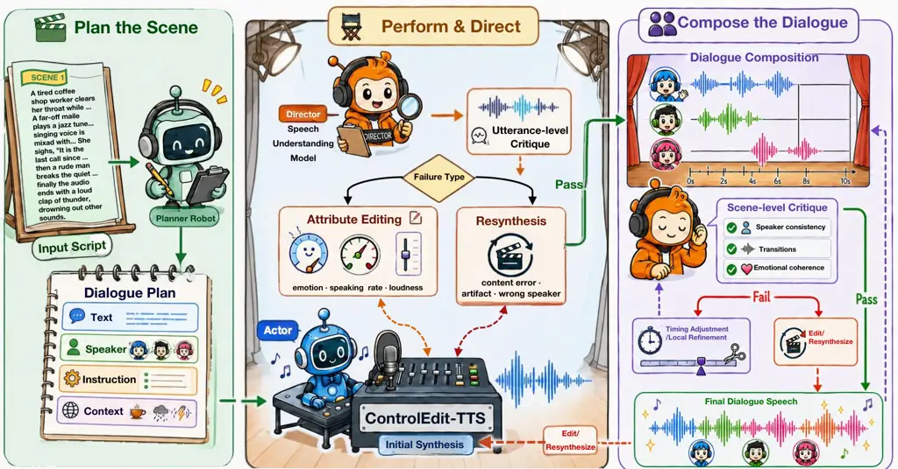
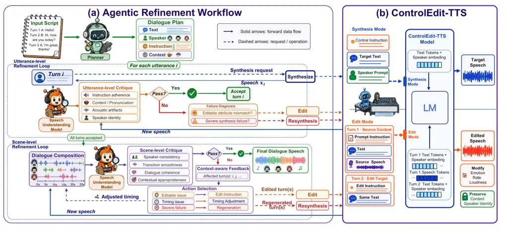

# From Script to Drama: An Agentic Framework for Controllable Multi-Speaker Dialogue TTS

Kangxiang Xia    Xinfa Zhu    HangRui Hu    Kexin Huang    Wenjie Tian
   Ziyue Jiang    Bingshen Mu    Jingbin Hu    Ting He    Lei
Xie\corresponding    Jin Xu

###### Abstract

Multi-speaker dialogue TTS requires natural speech generation,
consistent speaker identity, coherent cross-turn transitions, and
fine-grained control of expressive attributes such as emotion, speaking
rate, and loudness. These requirements are difficult to satisfy reliably
with one-shot generation, especially in long-form dialogue. We propose a
controllable multi-speaker dialogue TTS framework that formulates
synthesis as critique-driven iterative refinement. Its speech backbone,
ControlEdit-TTS, unifies instruction-following synthesis and
natural-language-guided attribute editing, enabling correction of
expressive errors without full regeneration. The framework further
performs hierarchical utterance-level and scene-level critique, routing
detected issues to editing, resynthesis, or timing adjustment.
Experiments on a bilingual Chinese–English dialogue benchmark show
improved utterance-level instruction following, better dialogue-level
preference than direct dialogue models and agentic baselines, and more
effective refinement than regeneration-only alternatives while
preserving speaker identity. Ablations further confirm the benefits of
scene-level critique and edit-based correction.

¹Audio, Speech and Language Processing Group (ASLP@NPU), Northwestern
Polytechnical University, Xi’an

²Independent Researcher

xkx@mail.nwpu.edu.cn, lxie@nwpu.edu.cn

Demo page: https://xkx-hub.github.io/FStD-demo/

## Introduction

Recent advances in neural text-to-speech (TTS) have greatly improved the
naturalness and expressiveness of synthetic speech (Chen et al. 2025;
Shen et al. 2024; Wang et al. 2023; Xia et al. 2026; Hu et al. 2026a; Du
et al. 2024). Beyond single-speaker reading-style synthesis, there is
growing interest in multi-speaker dialogue generation for applications
such as dubbing, audiobooks, podcasts, and audio drama (Xie et al. 2025;
Peng et al. 2025; Ren et al. 2026a; Rong et al. 2025). In these
settings, a system must do more than generate intelligible speech for
multiple characters. It must preserve speaker identity across turns,
produce coherent transitions between speakers, and realize
utterance-level expressive intent through attributes such as emotion,
speaking rate, and loudness. These requirements are especially demanding
in long-form dialogue, where both utterance quality and scene-level
coherence must be maintained.



Figure 1: Overview of our method.

Existing work addresses these requirements only partially. Direct
multi-speaker dialogue systems can model long-form conversations and
multiple roles (Zhang et al. 2024; Zhang et al. 2025; Peng et al. 2025;
Zhou, Zhao, and Wang 2025; Ren et al. 2026a), often producing globally
coherent multi-turn outputs, but they typically provide limited or
inflexible control over how each utterance should be performed. In
parallel, instruction-following TTS models (Zhou et al. 2026; Hu et al.
2026a; Hu et al. 2026b; Du et al. 2025; Ren et al. 2026b) can follow
natural language descriptions of speaking style, such as emotion,
pacing, and vocal energy, for arbitrary prompt voices, enabling much
finer utterance-level expressiveness. However, they are primarily
designed for isolated utterances and do not explicitly address
dialogue-level consistency, cross-turn coherence, or context-aware
correction in multi-character settings. As a result, current systems
still struggle to provide both fine-grained utterance-level
controllability and robust dialogue-level quality within a unified
generation framework.

We argue that this limitation stems in part from how the problem is
formulated. Controllable dialogue TTS is still treated largely as a
one-shot generation task: given a script and style requirement, the
model produces each utterance once and hopes the result is correct. In
practice, however, many failures are local rather than global. An
utterance may preserve the correct text and speaker identity yet
under-express the requested emotion, sound slightly too fast, or exhibit
loudness that is inconsistent with the dramatic context. Full
resynthesis is a coarse remedy for such errors, and repeated resynthesis
becomes increasingly inefficient and unstable in long-form production
workflows (Duan et al. 2026). Moreover, utterances that are individually
acceptable may still produce abrupt transitions or inconsistent
expressive progression once assembled into a dialogue. These
observations suggest two requirements for controllable dialogue
synthesis: the system should be able to revise local expressive errors
without unnecessarily discarding acceptable speech, and it should
evaluate not only individual utterances but also the composed scene.

Based on this view, we formulate controllable multi-speaker dialogue TTS
as a critique-driven iterative refinement problem rather than one-shot
generation. We propose an agentic framework that decomposes dialogue
synthesis into four stages: planning, synthesis, critique, and targeted
revision. Given a script, character information, and utterance-level
control instructions, the framework first constructs a structured
dialogue plan and synthesizes the dialogue turn by turn. It then
performs hierarchical critique at both the utterance and scene levels,
checking local instruction adherence and synthesis quality as well as
cross-turn consistency and contextual appropriateness over the composed
dialogue. Crucially, the resulting feedback is converted into executable
actions: editable expressive mismatches are corrected through speech
editing, severe failures trigger selective resynthesis, and temporal
discontinuities are handled through timing adjustment. This
action-oriented design allows the system to refine only problematic
regions while preserving acceptable speech elsewhere.

At the core of the framework is ControlEdit-TTS, a unified speech model
that supports both instruction-following synthesis and
natural-language-guided expressive editing within the same
autoregressive architecture. Given an existing utterance and corrective
feedback, ControlEdit-TTS can modify three practically important
attributes—emotion, speaking rate, and loudness—while preserving
linguistic content and speaker identity as much as possible. This
unified design is important for iterative dialogue refinement: many
failures in controllable dialogue synthesis are not complete synthesis
breakdowns, but localized expressive mismatches that are better handled
through editing than through full resynthesis. By supporting both
initial generation and targeted correction within the same model,
ControlEdit-TTS provides a natural backbone for critique-guided dialogue
refinement.

To support systematic evaluation, we further construct a bilingual
Chinese–English benchmark for controllable multi-speaker dialogue TTS
and establish a multi-level evaluation protocol covering utterance-level
instruction adherence and speaker preservation, dialogue-level
preference, and refinement efficiency. Experiments show that the
proposed approach improves utterance-level controllability while
preserving speaker identity, achieves stronger dialogue-level preference
than both direct dialogue models and agentic baselines, and reduces
residual errors more effectively than resynthesis-only refinement. These
results highlight the value of combining hierarchical dialogue-aware
critique with a unified speech model for synthesis and editing.

In summary, our contributions are threefold. First, we formulate
controllable multi-speaker dialogue TTS as an iterative refinement
problem and propose a hierarchical plan–synthesize–critique–refine
framework with both utterance-level and scene-level quality control.
Second, we develop ControlEdit-TTS, a unified model for
instruction-following synthesis and attribute-level editing of emotion,
speaking rate, and loudness. Third, we construct a bilingual benchmark
and a multi-level evaluation protocol for controllable dialogue speech
generation. Experiments show improved controllability, stronger
dialogue-level preference, and more effective refinement than
resynthesis-only alternatives.

## Related Work

### Instruction-following and Editable TTS

Controllable TTS has evolved from predefined style labels and reference
speech toward natural-language descriptions. PromptTTS (Guo et al.
2023), InstructTTS (Yang et al. 2024), VoxInstruct (Zhou et al. 2024),
ControlSpeech (Ji et al. 2025), Qwen3-TTS (Hu et al. 2026a), and
VoiceSculptor (Hu et al. 2026b) substantially improve the flexibility of
language-based style control. However, most of these systems still
formulate instruction-following synthesis as one-shot generation, so
local expressive failures are typically handled by full resynthesis.

A related line of work studies unified speech generation and editing.
Voicebox (Le et al. 2023), SpeechX (Wang et al. 2024), and
VoiceCraft (Peng et al. 2024) show that synthesis and editing can be
supported within general speech generation models. However, existing
editing methods mainly focus on content replacement, restoration, or
independently specified transformations, rather than
natural-language-guided expressive correction within an automatic
critique-and-refine loop. In contrast, our ControlEdit-TTS unifies
instruction-following synthesis and expressive attribute editing in the
same model for iterative dialogue refinement.

### Agentic Systems for Audio Generation

Agentic systems improve complex tasks through planning, feedback, and
revision. ReAct (Yao et al. 2022), Self-Refine (Madaan et al. 2023), and
Reflexion (Shinn et al. 2023) establish these mechanisms in language
tasks, but applying them to speech generation additionally requires
interpreting acoustic failures and mapping them to executable synthesis
operations.

Several studies extend LLM orchestration to speech and audio generation.
AudioGPT (Huang et al. 2024), WavJourney (Liu et al. 2025),
PodAgent (Xiao et al. 2025), Dopamine Audiobook (Rong et al. 2025),
AuDirector (Ren et al. 2026a), and Audio-Oscar (Duan et al. 2026)
demonstrate the value of planning and feedback in long-form audio
production. However, their refinement typically operates at the
workflow, prompt, event, or mix level, rather than diagnosing
utterance-level expressive errors and routing them to editing or
resynthesis within a unified TTS model. Our framework instead performs
hierarchical critique over utterances and composed dialogues, and
converts the diagnosed failure type into executable editing,
resynthesis, or timing-adjustment actions.

## Method



Figure 2: Overview of the proposed method. (a) The agentic refinement
framework converts an input script into a structured dialogue plan and
iteratively applies utterance- and scene-level critique to trigger
attribute editing, selective resynthesis, or timing adjustment. (b)
ControlEdit-TTS unifies instruction-following synthesis and
attribute-level editing within a shared autoregressive model, enabling
targeted correction of emotion, speaking rate, and energy/loudness while
preserving linguistic content and speaker identity.

Our method formulates controllable multi-speaker dialogue TTS as a
closed-loop refinement process. Given a script, the framework constructs
a structured dialogue plan, synthesizes each turn, critiques both
utterance-level instruction adherence and scene-level consistency, and
maps detected issues to editing, resynthesis, or timing adjustment. At
the core of the framework is ControlEdit-TTS, a unified model built on
Qwen3-TTS-12Hz-1.7B-CustomVoice (Hu et al. 2026a) that supports both
instruction-following synthesis and attribute-level editing of emotion,
speaking rate, and loudness. The following sections describe the unified
synthesis-edit model and the hierarchical refinement framework.

### ControlEdit-TTS: Unified Synthesis and Editing

ControlEdit-TTS is a unified autoregressive speech model for both
instruction-following synthesis and attribute-level editing. As
illustrated in Figure 2(b), the two modes share the same backbone and
speaker-conditioning mechanism and differ only in their input
organization. We focus on three expressive attributes—emotion, speaking
rate, and loudness—and perform targeted modification of these attributes
while preserving linguistic content and speaker identity.

#### Task Formulation

Let $`G_{\theta}`$ denote ControlEdit-TTS, $`t`$ the target text, $`c`$
a natural-language control instruction, and $`s`$ the speaker condition
derived from a reference voice. In synthesis mode, the model directly
generates speech according to the text, speaker identity, and expressive
instruction:

```math
x=G_{\theta}(t,c,s;\mathrm{syn}), \tag{1}
```

where $`x`$ denotes the synthesized speech and $`c`$ specifies the
target expressive condition, e.g., angry, slower, or quieter.

In edit mode, the model additionally receives a source speech segment
$`x`$, its original control condition $`c_{\mathrm{src}}`$, and a target
edit instruction $`c_{\mathrm{edit}}`$. The operation is formulated as

```math
x^{\prime}=G_{\theta}(x,t,c_{\mathrm{src}},c_{\mathrm{edit}},s;\mathrm{edit}), \tag{2}
```

where $`x^{\prime}`$ is the edited speech. Here $`t`$ and $`s`$ remain
unchanged, while $`c_{\mathrm{edit}}`$ specifies the desired expressive
modification, such as making the utterance more angry, slightly faster,
or quieter. The current formulation is restricted to
expressive-attribute editing and does not perform content modification
or speaker-identity conversion.

#### Unified Autoregressive Modeling

ControlEdit-TTS is initialized from Qwen3-TTS-12Hz-1.7B-CustomVoice (Hu
et al. 2026a). We retain its architecture, speech tokenizer, and
autoregressive audio-token modeling formulation, and extend the training
task to support both synthesis and editing. In synthesis mode, the model
predicts target speech tokens from the control instruction, text, and
speaker condition. In edit mode, it receives a two-turn sequence
consisting of the source instruction, text, and speech tokens, followed
by the target edit instruction and repeated text under the same speaker
condition. The edit context is

```math
\mathcal{C}_{\mathrm{edit}}=\bigl((c_{\mathrm{src}},t,x),(c_{\mathrm{edit}},t),s\bigr), \tag{3}
```

from which the model predicts the edited speech
$`x^{\prime}=G_{\theta}(\mathcal{C}_{\mathrm{edit}})`$. Repeating the
text enforces content preservation, while the shared speaker condition
encourages identity consistency. During refinement, the model is invoked
in synthesis mode for initial generation or severe failures, and in edit
mode for correctable expressive mismatches.

#### Training Data and Objective

Because naturally paired speech samples that share identical content and
speaker identity but differ in specific expressive attributes are
scarce, we adopt a two-stage training procedure. In the first stage, we
continue training Qwen3-TTS-12Hz-1.7B-CustomVoice to strengthen
instruction-following synthesis for emotion, speaking rate, and loudness
at different intensity levels. We observe that the original model
exhibits nontrivial controllability for out-of-domain speaker. We
therefore randomly sample speaker conditions and synthesize speech using
diverse control instructions. Each generated sample is screened to
verify that the requested control is reflected in the resulting speech,
and only successful samples are retained. This procedure yields
approximately 2,000 hours of instruction-following synthesis data for
the first-stage control model.

In the second stage, we construct paired examples for attribute editing.
For each text and speaker condition, we sample different control
instructions and intensity levels to produce distinct expressive
realizations. Two samples that share the same text and speaker identity
but differ in their target attributes are organized into a source–target
pair. The source speech and its original instruction form the first-turn
context, whereas the target instruction and corresponding target speech
provide supervision for the second turn. We construct approximately
1,400 hours of such edit-training data and supplement it with
approximately 300 hours of recorded speech to improve acoustic
diversity.

To prevent the model from losing its original synthesis capability while
learning to edit, the second-stage training corpus also includes
synthesis examples randomly sampled from the first-stage data. Synthesis
examples retain the original autoregressive audio-token prediction
objective, whereas edit examples are supervised only on the target audio
tokens in the second turn. Let $`\mathcal{I}_{2}`$ denote the
target-token positions of an edit example. The edit objective is

```math
\mathcal{L}_{\mathrm{edit}}=-\sum_{n\in\mathcal{I}_{2}}\log p_{\theta}\left(y_{n}\mid y_{<n},\mathcal{C}_{\mathrm{edit}}\right). \tag{4}
```

where $`y_{n}`$ is the target audio token at position $`n`$. The first
turn serves exclusively as source context and is excluded from the
prediction loss. By interleaving synthesis and edit examples during this
stage, the model learns to generate the target realization from the
source speech and edit instruction while retaining its
instruction-following synthesis capability.

### Agentic Refinement Framework

High-quality multi-speaker dialogue synthesis requires both
utterance-level instruction following and dialogue-level consistency. An
utterance may sound satisfactory in isolation but become inconsistent
when placed in context. For example, two adjacent turns in an argument
may both convey anger, yet differ sharply in intensity or speaking
manner, resulting in an unnatural expressive transition. Such failures
cannot be reliably addressed by independently synthesizing and
concatenating individual utterances.

We therefore formulate dialogue synthesis as a closed-loop agentic
refinement process consisting of structured planning, initial synthesis,
hierarchical critique, and targeted revision. As illustrated in
Figure 2(a), the framework evaluates generated speech at both utterance
and scene levels and translates critique feedback into executable
refinement actions.

#### Structured Planning and Initial Synthesis

Given an input script, Gemini 2.5 Flash (Comanici et al. 2025) serves as
the planning model and converts the unstructured content into a dialogue
plan. For each turn, the plan specifies the utterance text, speaker
identity, expressive instruction, and contextual information. The
context summarizes character and scene states that may influence how an
utterance should be realized. This structured representation makes
implicit requirements in story-like inputs explicit and provides a
shared conditioning interface for synthesis and critique.

The framework then processes the dialogue turn by turn. For each turn
$`i`$, the text, speaker prompt, and control instruction are passed to
the synthesis mode of ControlEdit-TTS to produce an initial speech
segment $`x_{i}`$. The generated segment remains associated with its
dialogue-plan metadata, allowing subsequent critique to evaluate it
against both its local instruction and its role in the surrounding
dialogue.

#### Hierarchical Critique and Targeted Refinement

The hierarchical critique mechanism operates first at the utterance
level and then at the scene level. At the utterance level, Gemini 2.5
Pro (Comanici et al. 2025) evaluates instruction adherence, linguistic
content and pronunciation, acoustic artifacts, and speaker identity. An
utterance that satisfies these criteria is accepted. Otherwise, the
critique module diagnoses the failure and determines an appropriate
refinement action.

Failures involving editable expressive attributes, such as emotion,
speaking rate, or loudness, are handled by invoking the edit mode of
ControlEdit-TTS on the existing speech. Failures involving incorrect
content, pronunciation errors, severe acoustic artifacts, or an
incorrect speaker instead trigger resynthesis. The revised speech is
returned to the utterance-level critique loop until it is accepted or
the maximum number of refinement rounds is reached. Both actions are
performed by the same ControlEdit-TTS model; the framework changes the
task mode and input context rather than switching between separate
generation and editing models.

After all turns pass the utterance-level critique, they are composed
into a complete dialogue timeline. Gemini 3.1 Pro Preview then performs
scene-level critique of speaker consistency across turns, transition
smoothness, dialogue coherence, and contextual appropriateness.
Scene-level critique instead evaluates the composed dialogue and
identifies turns or boundaries responsible for cross-turn
inconsistencies.

The resulting context-aware feedback is mapped to targeted operations.
Temporal discontinuities are addressed by adjusting inter-utterance
gaps, local expressive inconsistencies are corrected through editing,
and severe or non-editable failures trigger selective resynthesis of the
affected turns. The updated dialogue is recomposed and evaluated again,
allowing the framework to refine only the problematic regions while
preserving accepted speech elsewhere. To prevent cyclic correction, the
refinement process is terminated after at most 10 rounds if unresolved
issues remain.

Through this action-oriented critique policy, feedback from the speech
understanding model is converted into concrete synthesis operations
rather than serving only as an acceptance score. The resulting
planning–synthesis–critique–refinement loop augments the underlying
speech generator with dialogue-aware quality control, improving
instruction adherence and cross-turn consistency in long-form
multi-speaker dialogue synthesis.

## Experiments

|                                      |                                |       |                       |          |                   |                        |
| ------------------------------------ | ------------------------------ | ----- | --------------------- | -------- | ----------------- | ---------------------- |
| Model                                | Speaker similarity$`\uparrow`$ |       | Instruction following |          |                   |                        |
|                                      | ZH                             | EN    | Yes%$`\uparrow`$      | Partial% | No%$`\downarrow`$ | Avg. score$`\uparrow`$ |
| Proposed system and ablations        |                                |       |                       |          |                   |                        |
| ControlEdit-TTS (full)               | 0.776                          | 0.791 | 95.5                  | 4.2      | 0.3               | 4.819                  |
| ControlEdit-TTS (edit disabled)      | 0.777                          | 0.791 | 87.0                  | 12.3     | 0.7               | 4.639                  |
| ControlEdit-TTS (one-shot)           | 0.752                          | 0.776 | 85.2                  | 13.8     | 1.0               | 4.592                  |
| Agentic baselines with our framework |                                |       |                       |          |                   |                        |
| Higgs-Audio v3                       | 0.709                          | 0.790 | 88.8                  | 10.5     | 0.7               | 4.689                  |
| VoxCPM2                              | 0.696                          | 0.761 | 83.3                  | 15.3     | 1.4               | 4.544                  |
| Direct dialogue models               |                                |       |                       |          |                   |                        |
| SoulX-Podcast                        | 0.827                          | 0.861 | 75.0                  | 22.6     | 2.5               | 4.321                  |
| Fish Audio S2                        | 0.736                          | 0.780 | 78.2                  | 19.7     | 2.1               | 4.404                  |
| VibeVoice-7B                         | 0.763                          | 0.790 | 81.1                  | 17.2     | 1.8               | 4.484                  |
| VibeVoice-1.5B                       | 0.748                          | 0.782 | 78.5                  | 19.5     | 2.0               | 4.408                  |
| Any2Speech                           | 0.620                          | 0.695 | 75.7                  | 22.0     | 2.3               | 4.345                  |

Table 1: Utterance-level instruction following and speaker preservation.
The automatic judge assigns Yes, Partial, or No and a score from 1 to 5.
One-shot denotes the shared initial synthesis before critique-guided
refinement.

### Experimental Setup

##### Evaluation benchmark.

We construct a bilingual benchmark for controllable multi-speaker
dialogue synthesis with 58 Chinese and 60 English stories. It covers
short stories, scene scripts, and dialogue excerpts with diversity in
genre, length, speaker count, and speaker age. Each story is converted
into a structured sequence of speaker identity, expressive instruction,
and utterance text. For each character, we create a global description
and use Qwen3-TTS-12Hz-1.7B-VoiceDesign (Hu et al. 2026a) to generate
the reference voice.

##### Compared systems.

We compare with five direct multi-speaker dialogue systems:
SoulX-Podcast (Xie et al. 2025), Fish Audio S2 (Liao et al. 2026),
VibeVoice-1.5B, VibeVoice-7B (Peng et al. 2025), and Any2Speech (Song
et al. 2026). SoulX-Podcast and VibeVoice directly synthesize
multi-speaker dialogue but do not support natural-language
utterance-level style control. Fish Audio S2 supports inline tag-based
control, and Any2Speech accepts structured dialogue scripts with speaker
references through a commercial API. We use official checkpoints or APIs
with default inference settings. We further build two agentic baselines
by replacing our backbone with Higgs-Audio v3 (AI 2026) and
VoxCPM2 (Zhou et al. 2026). Since these models do not support attribute
editing, all editable failures are handled by resynthesis.

We evaluate four variants of ControlEdit-TTS: Full, the complete
framework; Edit disabled, which replaces editing with resynthesis;
One-shot, the shared initial synthesis before refinement; and
Utterance-level only, which omits scene-level critique and refinement.

For direct dialogue baselines, we evaluate whether the generated
utterance matches the target expressive requirement implied by the
utterance semantics and dialogue context. For systems without explicit
utterance-level controls, this requirement is assessed only from the
generated output. For Fish Audio S2, which supports inline tag-based
control, we express the target requirement using its inline control
tags.

##### Implementation details.

ControlEdit-TTS is initialized from Qwen3-TTS-12Hz-1.7B-CustomVoice and
trained in two stages. In stage 1, we continue training on the
2,000-hour instruction-following corpus to strengthen controllable
synthesis of emotion, speaking rate, and loudness. In stage 2, we
further train the same model on a mixture of stage-1 synthesis data, the
1,400-hour synthetic edit corpus, and 300 hours of recorded speech to
preserve synthesis capability while learning attribute editing. We use
the AdamW optimizer with a peak learning rate of $`1\times 10^{-5}`$ on
32 A100 GPUs, and train each stage until convergence.

At inference time, the planning module uses Gemini 2.5 Flash, while
utterance-level and scene-level critique are performed by Gemini 2.5 Pro
and Gemini 3.1 Pro Preview, respectively. All prompts are fixed across
experiments. The refinement loop is capped at 10 rounds. Utterance-level
refinement is performed turn by turn, and accepted utterances are then
composed for scene-level critique. Expressive mismatches in emotion,
speaking rate, or loudness are routed to edit mode, while content
errors, pronunciation failures, severe artifacts, or speaker mismatches
trigger resynthesis. Timing adjustment modifies only inter-utterance
silence duration.

##### Evaluation protocol.

We evaluate systems at both utterance and dialogue levels. At the
utterance level, Gemini 2.5 Pro judges whether each utterance matches
its target expressive requirement and returns a yes, partial, or no
label together with a 1–5 score. For controllable systems, this
requirement is given by the utterance-level instruction; for direct
dialogue systems, it is treated as the desired expressive style implied
by the utterance and its context. Following recent work (Huang et al.
2025; Chen et al. 2026), we use Gemini-based judgments as an automatic
proxy for instruction adherence. For direct dialogue baselines that
synthesize a whole dialogue in one pass, we first align the generated
waveform to the target script with the open-source
Qwen3-ForceAligner (Shi et al. 2026; Mu et al. 2026) and extract
utterance-level clips from the aligned boundaries. Speaker preservation
is then measured as cosine similarity between Res2Net speaker
embeddings (Chen et al. 2023) extracted from each utterance clip and the
corresponding character reference voice.

At the dialogue level, Gemini 3.1 Pro Preview and human raters conduct
pairwise preference evaluation on continuous multi-turn clips,
considering role continuity, cross-turn expressive coherence, and
overall listening quality. We also analyze residual voice and style
issues across refinement rounds; agreement between Gemini-based and
human dialogue judgments is reported in the appendix.

### Utterance-level Control and Speaker Preservation

We first evaluate whether each synthesis configuration follows
utterance-level expressive instructions while preserving the target
speaker identity. Gemini 2.5 Pro evaluates every utterance in the
bilingual test set using the utterance text and target instruction.
Speaker similarity is computed against the reference voice assigned to
the corresponding role. The one-shot output serves as the shared initial
state, while the two refined configurations differ only in whether
editable failures are corrected through attribute editing or
resynthesis.

As shown in Table 1, one-shot synthesis achieves an 85.2% Yes rate and a
4.592 average score. Critique-guided refinement with resynthesis alone
improves these values modestly to 87.0% and 4.639, while the full system
further reaches 95.5% and 4.819. These comparisons separate the
contributions of iterative refinement and edit-based correction: the
one-shot baseline shows the quality of initial generation, the
edit-disabled variant shows the effect of critique-guided resynthesis,
and the full system shows the additional benefit of targeted editing.

Relative to one-shot synthesis, the full framework improves the Yes rate
by 10.3 percentage points and slightly increases speaker similarity in
both languages. This SIM improvement is consistent with the critique
loop, which can also detect speaker mismatches and trigger corrective
resynthesis. In contrast, the full and edit-disabled variants exhibit
nearly identical speaker similarity but differ by 8.5 percentage points
in Yes rate, indicating that targeted editing is the main source of
additional instruction-following gain beyond initial synthesis and
resynthesis alone. Among all compared systems, ControlEdit-TTS (full)
achieves the highest Yes rate and average score. Although SoulX-Podcast
attains the highest reference-voice similarity, its much lower
instruction-following performance suggests that preserving voice
identity alone is insufficient for controllable dialogue generation.
Fish Audio S2 improves over other direct dialogue baselines in
expressive control, likely due to its inline control interface, but
remains clearly below the proposed system.

### Dialogue-Level Preference

|                                      |                    |       |                    |       |
| ------------------------------------ | ------------------ | ----- | ------------------ | ----- |
| Opponent                             | Chinese ($`N=93`$) |       | English ($`N=94`$) |       |
|                                      | W/L/T              | WR    | W/L/T              | WR    |
| Direct dialogue systems              |                    |       |                    |       |
| SoulX-Podcast                        | 81/12/0            | 0.871 | 71/19/4            | 0.755 |
| Fish Audio S2                        | 73/19/1            | 0.785 | 67/18/9            | 0.713 |
| VibeVoice-7B                         | 56/36/1            | 0.602 | 59/26/9            | 0.628 |
| VibeVoice-1.5B                       | 76/17/0            | 0.817 | 63/19/12           | 0.670 |
| Any2Speech                           | 68/25/0            | 0.731 | 66/26/2            | 0.702 |
| Agentic baselines with our framework |                    |       |                    |       |
| Higgs-Audio v3                       | 67/25/1            | 0.720 | 64/30/0            | 0.681 |
| VoxCPM2                              | 52/41/0            | 0.559 | 70/23/1            | 0.745 |
| Ablation                             |                    |       |                    |       |
| Ours (utterance only)                | 79/3/11            | 0.849 | 82/4/8             | 0.872 |

Table 2: Gemini pairwise preference for ControlEdit-TTS (full). W/L/T
denote our wins/losses/ties, and
$`\mathrm{WR}=\mathrm{W}/(\mathrm{W}+\mathrm{L}+\mathrm{T})`$. The
utterance-only variant omits scene-level critique and refinement.

Utterance-level scores do not fully capture role continuity, expressive
progression, or transition quality across turns. We therefore conduct
pairwise evaluation on continuous clips sampled from the generated
dialogues. Each clip contains at least six turns and three distinct
speakers, with a total duration below one minute. The same sampling
protocol is used for the Gemini-based and human evaluations.

##### Gemini-based pairwise evaluation.

Table 2 reports the pairwise preference of ControlEdit-TTS (full)
against every baseline on the Chinese and English test sets. Table 2
shows that ControlEdit-TTS (full) is preferred over every external
baseline in both languages, with win proportions ranging from 0.559 to
0.871 in Chinese and from 0.628 to 0.755 in English. The consistently
positive margins indicate that the proposed framework improves overall
dialogue quality not only against direct multi-speaker systems, but also
against strong controllable TTS backbones embedded in the same
refinement framework. Among direct dialogue baselines, Fish Audio S2 is
more competitive than SoulX-Podcast and Any2Speech in
controllability-oriented comparisons, but remains consistently behind
the proposed system.

The scene-level ablation further reveals a substantial contribution from
contextual refinement. Compared with the utterance-level-only variant,
the full system achieves win proportions of 0.849 in Chinese and 0.872
in English. Since the two configurations are identical through planning,
initial synthesis, and utterance-level refinement, this comparison
isolates the value of scene-level critique and its subsequent
context-aware editing, resynthesis, and timing adjustment. The result
shows that dialogue-level consistency cannot be recovered reliably from
utterance-level correction alone.

##### Human subjective evaluation.

To complement the automatic evaluation, we conduct a human pairwise
preference test with five raters. For each opponent, 30 dialogue pairs
are evaluated, and each pair is independently rated by three raters,
yielding 90 individual judgments per comparison. The presentation order
of the two systems is randomized for every trial. Raters compare the
complete multi-turn clips in terms of role continuity, cross-turn
expressive coherence, transition naturalness, and overall listening
quality. A tie is allowed when neither system is clearly preferred.

Figure 3: Human pairwise preference results for ControlEdit-TTS (full).
Each horizontal bar shows the proportions of wins, ties, and losses
against one opponent, sorted by win ratio. “Ours (utterance only)”
denotes the ablation without scene-level critique and refinement.

As shown in Figure 3, ControlEdit-TTS (full) is preferred over every
external baseline, with win proportions ranging from 57.8% against
VoxCPM2 to 87.8% against Higgs-Audio v3. The largest human preference
margins are observed against Higgs-Audio v3 and Any2Speech, while
VoxCPM2 remains the closest external competitor. Fish Audio S2 is more
competitive than most direct dialogue baselines, likely due to its
inline tag-based control, but the proposed system is still preferred in
76.9% of judgments. Importantly, the full system is also preferred over
the utterance-level-only ablation, receiving 81.1% wins against only
6.7% losses. Because the two variants differ only in the presence of
scene-level critique and refinement, this result provides direct human
evidence that dialogue-level contextual correction improves multi-turn
listening quality beyond utterance-level control alone. The overall
preference trend is consistent with the Gemini-based evaluation.

### Effectiveness of Edit-based Refinement

We isolate the effect of editing within the refinement process.
ControlEdit-TTS (full) resolves editable attribute mismatches through
editing, whereas ControlEdit-TTS (edit disabled) handles the same cases
with resynthesis; severe failures trigger resynthesis in both settings.
We select 17 challenging benchmark cases that exhibit frequent
refinement problems and are therefore harder than average to synthesize
reliably, using them to stress-test correction dynamics. For each case,
we record the shared initial state and then perform five refinement
rounds. After the initial state and each round, the critique module
counts remaining voice issues, defined as within-role speaker
inconsistencies, and style issues, defined as mismatches with the target
expressive instruction. Results are averaged per dialogue, and the total
count is their sum.

Figure 4: Average number of remaining issues per dialogue. The first
point is the shared initial state before correction, followed by five
refinement rounds. Solid lines with filled circles denote
ControlEdit-TTS (full), whereas dashed lines with open squares denote
ControlEdit-TTS (edit disabled). Lower is better.

Figure 4 shows that edit-based refinement reduces residual issues more
rapidly than regeneration alone. By round 4, ControlEdit-TTS (full)
reduces the average total issue count from 9.74 to 5.30, corresponding
to a 45.6% reduction, whereas the edit-disabled configuration reaches
7.16 issues, corresponding to a 26.5% reduction. At the final round, the
full system also retains fewer style and voice issues. The larger
improvement in style correction supports the use of localized editing
for resolving expressive mismatches without regenerating the complete
utterance.

Both configurations exhibit a small rebound in total and voice issue
counts from round 4 to round 5. For the full system, the total count
increases from 5.30 to 5.55 as the voice issue count rises from 3.74 to
4.04. Case-level analysis suggests that this rebound often reflects a
trade-off between style correction and voice consistency: improving
style alignment may introduce speaker inconsistency, whereas correcting
speaker-related issues may weaken style alignment. This seesaw behavior
indicates that the current synthesis/editing model still has limited
capacity to jointly satisfy these constraints under repeated correction.
It also suggests diminishing returns from prolonged refinement and
motivates stronger backbone modeling and adaptive stopping strategies.
Overall, edit-based correction achieves faster convergence and
consistently fewer residual issues than regeneration alone.

## Conclusion

We presented a framework for controllable multi-speaker dialogue TTS
that formulates synthesis as a critique-driven iterative refinement
process rather than one-shot generation. The system combines structured
planning, turn-level synthesis, hierarchical utterance- and scene-level
critique, and targeted revision. Its speech backbone, ControlEdit-TTS,
unifies instruction-following synthesis and attribute-level editing of
emotion, speaking rate, and loudness within a single autoregressive
model. Experiments on a bilingual Chinese–English benchmark show
improved utterance-level instruction following, stronger dialogue-level
preference, and more effective refinement than regeneration-only
alternatives, while preserving speaker identity. Our results suggest
that controllable dialogue speech generation benefits from tightly
integrating speech generation and speech understanding in a closed-loop
process. Future work will extend the editable attribute space, improve
robustness in longer and more complex scenes, and develop stronger
critique and stopping strategies for more efficient refinement.

## References

- AI (2026) AI, B. 2026. Higgs Audio v3 TTS: Conversational Speech for
  Voice AI from Boson AI.
  https://huggingface.co/bosonai/higgs-audio-v3-tts-4b.
- Chen et al. (2026) Chen, H.; Hu, J.; Xue, L.; Zhan, Q.; Li, W.; Ma,
  G.; Xie, H.; Guo, D.; Ma, L.; Jiang, Y.; et al. 2026. MINT-Bench: A
  Comprehensive Multilingual Benchmark for Instruction-Following
  Text-to-Speech. _arXiv preprint arXiv:2604.17958_.
- Chen et al. (2025) Chen, Y.; Niu, Z.; Ma, Z.; Deng, K.; Wang, C.;
  Zhao, J.; Yu, K.; and Chen, X. 2025. F5-TTS: A Fairytaler that Fakes
  Fluent and Faithful Speech with Flow Matching. In _ACL (1)_,
  6255–6271. Association for Computational Linguistics.
- Chen et al. (2023) Chen, Y.; Zheng, S.; Wang, H.; Cheng, L.; Chen, Q.;
  and Qi, J. 2023. An enhanced res2net with local and global feature
  fusion for speaker verification. _arXiv preprint arXiv:2305.12838_.
- Comanici et al. (2025) Comanici, G.; Bieber, E.; Schaekermann, M.;
  Pasupat, I.; Sachdeva, N.; Dhillon, I.; Blistein, M.; Ram, O.; Zhang,
  D.; Rosen, E.; et al. 2025. Gemini 2.5: Pushing the frontier with
  advanced reasoning, multimodality, long context, and next generation
  agentic capabilities. _arXiv preprint arXiv:2507.06261_.
- Du et al. (2025) Du, Z.; Gao, C.; Wang, Y.; Yu, F.; Zhao, T.; Wang,
  H.; Lv, X.; Wang, H.; Ni, C.; Shi, X.; et al. 2025. Cosyvoice 3:
  Towards in-the-wild speech generation via scaling-up and
  post-training. _arXiv preprint arXiv:2505.17589_.
- Du et al. (2024) Du, Z.; Wang, Y.; Chen, Q.; Shi, X.; Lv, X.; Zhao,
  T.; Gao, Z.; Yang, Y.; Gao, C.; Wang, H.; et al. 2024. Cosyvoice 2:
  Scalable streaming speech synthesis with large language models. _arXiv
  preprint arXiv:2412.10117_.
- Duan et al. (2026) Duan, Y.; Xu, Q.; Wu, H.; Liu, Z.; Guan, W.; Liu,
  J.; Ma, Z.; Xu, K.; and Chen, X. 2026. Audio-Oscar: A Multi-Agent
  System for Complex Audio Scene Generation, Orchestration, and
  Refinement. _arXiv preprint arXiv:2606.07397_.
- Guo et al. (2023) Guo, Z.; Leng, Y.; Wu, Y.; Zhao, S.; and
  Tan, X. 2023. Prompttts: Controllable Text-To-Speech With Text
  Descriptions. In _ICASSP_, 1–5. IEEE.
- Hu et al. (2026a) Hu, H.; Zhu, X.; He, T.; Guo, D.; Zhang, B.; Wang,
  X.; Guo, Z.; Jiang, Z.; Hao, H.; Guo, Z.; and et al. 2026a. Qwen3-TTS
  Technical Report. _arXiv preprint arXiv:2601.15621_.
- Hu et al. (2026b) Hu, J.; Chen, H.; Ma, L.; Guo, D.; Zhan, Q.; Li, W.;
  Zhang, H.; Xia, K.; Zhang, Z.; Tian, W.; et al. 2026b. Voicesculptor:
  Your voice, designed by you. _arXiv preprint arXiv:2601.10629_.
- Huang et al. (2025) Huang, K.; Tu, Q.; Fan, L.; Yang, C.; Zhang, D.;
  Li, S.; Fei, Z.; Cheng, Q.; and Qiu, X. 2025. Instructttseval:
  Benchmarking complex natural-language instruction following in
  text-to-speech systems. _arXiv preprint arXiv:2506.16381_.
- Huang et al. (2024) Huang, R.; Li, M.; Yang, D.; Shi, J.; Chang, X.;
  Ye, Z.; Wu, Y.; Hong, Z.; Huang, J.; Liu, J.; et al. 2024. Audiogpt:
  Understanding and generating speech, music, sound, and talking head.
  In _Proceedings of the AAAI Conference on Artificial Intelligence_,
  volume 38, 23802–23804.
- Ji et al. (2025) Ji, S.; Chen, Q.; Wang, W.; Zuo, J.; Fang, M.; Jiang,
  Z.; Huang, H.; Wang, Z.; Cheng, X.; Zheng, S.; et al. 2025.
  Controlspeech: Towards simultaneous and independent zero-shot speaker
  cloning and zero-shot language style control. In _Proceedings of the
  63rd Annual Meeting of the Association for Computational Linguistics
  (Volume 1: Long Papers)_, 6966–6981.
- Le et al. (2023) Le, M.; Vyas, A.; Shi, B.; Karrer, B.; Sari, L.;
  Moritz, R.; Williamson, M.; Manohar, V.; Adi, Y.; Mahadeokar, J.; and
  Hsu, W. 2023. Voicebox: Text-Guided Multilingual Universal Speech
  Generation at Scale. In _NeurIPS_.
- Liao et al. (2026) Liao, S.; Wang, Y.; Liu, S.; Cheng, Y.; Zhang, R.;
  Li, T.; Li, S.; Zheng, Y.; Liu, X.; Wang, Q.; et al. 2026. Fish audio
  s2 technical report. _arXiv preprint arXiv:2603.08823_.
- Liu et al. (2025) Liu, X.; Zhu, Z.; Liu, H.; Yuan, Y.; Huang, Q.; Cui,
  M.; Liang, J.; Cao, Y.; Kong, Q.; Plumbley, M. D.; et al. 2025.
  Wavjourney: Compositional audio creation with large language models.
  _IEEE Transactions on Audio, Speech and Language Processing_.
- Madaan et al. (2023) Madaan, A.; Tandon, N.; Gupta, P.; Hallinan, S.;
  Gao, L.; Wiegreffe, S.; Alon, U.; Dziri, N.; Prabhumoye, S.; Yang, Y.;
  et al. 2023. Self-refine: Iterative refinement with self-feedback.
  _Advances in neural information processing systems_, 36: 46534–46594.
- Mu et al. (2026) Mu, B.; Shi, X.; Wang, X.; Liu, H.; Xu, J.; and
  Xie, L. 2026. LLM-ForcedAligner: A Non-Autoregressive and Accurate
  LLM-Based Forced Aligner for Multilingual and Long-Form Speech. In
  _ACL (1)_, 25627–25638. Association for Computational Linguistics.
- Peng et al. (2024) Peng, P.; Huang, P.; Li, S.; Mohamed, A.; and
  Harwath, D. 2024. VoiceCraft: Zero-Shot Speech Editing and
  Text-to-Speech in the Wild. In _ACL (1)_, 12442–12462. Association for
  Computational Linguistics.
- Peng et al. (2025) Peng, Z.; Yu, J.; Wang, W.; Chang, Y.; Sun, Y.;
  Dong, L.; Zhu, Y.; Xu, W.; Bao, H.; Wang, Z.; Huang, S.; Xia, Y.; and
  Wei, F. 2025. VibeVoice Technical Report. _CoRR_, abs/2508.19205.
- Ren et al. (2026a) Ren, Y.; Xu, X.; Zhang, Z.; Wu, W.; Li, B.; and
  Zhang, C. 2026a. AuDirector: A Self-Reflective Closed-Loop Framework
  for Immersive Audio Storytelling. _arXiv preprint arXiv:2605.11866_.
- Ren et al. (2026b) Ren, Y.; Yi, J.; Tao, J.; Sun, H.; Wen, Z.; Gu, H.;
  Xu, L.; and Bai, Y. 2026b. OV-InstructTTS: Towards Open-Vocabulary
  Instruct Text-to-Speech. _arXiv preprint arXiv:2601.01459_.
- Rong et al. (2025) Rong, Y.; Yang, S.; Lei, G.; and Liu, L. 2025.
  Dopamine audiobook: A training-free MLLM agent for emotional and
  human-like audiobook generation. _arXiv e-prints_, arXiv–2504.
- Shen et al. (2024) Shen, K.; Ju, Z.; Tan, X.; Liu, E.; Leng, Y.; He,
  L.; Qin, T.; Zhao, S.; and Bian, J. 2024. NaturalSpeech 2: Latent
  Diffusion Models are Natural and Zero-Shot Speech and Singing
  Synthesizers. In _The Twelfth International Conference on Learning
  Representations, ICLR 2024, Vienna, Austria, May 7-11, 2024_.
  OpenReview.net.
- Shi et al. (2026) Shi, X.; Wang, X.; Guo, Z.; Wang, Y.; Zhang, P.;
  Zhang, X.; Guo, Z.; Hao, H.; Xi, Y.; Yang, B.; et al. 2026. Qwen3-ASR
  Technical Report. _arXiv preprint arXiv:2601.21337_.
- Shinn et al. (2023) Shinn, N.; Cassano, F.; Gopinath, A.; Narasimhan,
  K.; and Yao, S. 2023. Reflexion: Language agents with verbal
  reinforcement learning. _Advances in neural information processing
  systems_, 36: 8634–8652.
- Song et al. (2026) Song, X.; Wu, D.; Zhou, D.; Cheng, P.; Ding, H.;
  He, Y.; Wang, J.; Shen, S.; Lv, S.; Fan, L.; et al. 2026. Borderless
  long speech synthesis. _arXiv preprint arXiv:2603.19798_.
- Wang et al. (2023) Wang, C.; Chen, S.; Wu, Y.; Zhang, Z.; Zhou, L.;
  Liu, S.; Chen, Z.; Liu, Y.; Wang, H.; Li, J.; He, L.; Zhao, S.; and
  Wei, F. 2023. Neural Codec Language Models are Zero-Shot Text to
  Speech Synthesizers. _CoRR_, abs/2301.02111.
- Wang et al. (2024) Wang, X.; Thakker, M.; Chen, Z.; Kanda, N.;
  Eskimez, S. E.; Chen, S.; Tang, M.; Liu, S.; Li, J.; and
  Yoshioka, T. 2024. SpeechX: Neural Codec Language Model as a Versatile
  Speech Transformer. _IEEE ACM Trans. Audio Speech Lang. Process._, 32:
  3355–3364.
- Xia et al. (2026) Xia, K.; Zhu, X.; Yao, J.; Tian, W.; Li, W.; and
  Xie, L. 2026. KALL-E: Autoregressive Speech Synthesis with
  Next-Distribution Prediction. In _AAAI_, 34016–34024. AAAI Press.
- Xiao et al. (2025) Xiao, Y.; He, L.; Guo, H.; Xie, F.-L.; and
  Lee, T. 2025. Podagent: A comprehensive framework for podcast
  generation. In _Findings of the Association for Computational
  Linguistics: ACL 2025_, 23923–23937.
- Xie et al. (2025) Xie, H.; Lin, H.; Cao, W.; Guo, D.; Tian, W.; Wu,
  J.; Wen, H.; Shang, R.; Liu, H.; Jiang, Z.; Jiang, Y.; Chen, W.; Yan,
  R.; Qian, J.; Yan, Y.; Yin, S.; Tao, M.; Chen, X.; Xie, L.; and
  Wang, X. 2025. SoulX-Podcast: Towards Realistic Long-form Podcasts
  with Dialectal and Paralinguistic Diversity. _CoRR_, abs/2510.23541.
- Yang et al. (2024) Yang, D.; Liu, S.; Huang, R.; Weng, C.; and
  Meng, H. 2024. InstructTTS: Modelling Expressive TTS in Discrete
  Latent Space With Natural Language Style Prompt. _IEEE ACM Trans.
  Audio Speech Lang. Process._, 32: 2913–2925.
- Yao et al. (2022) Yao, S.; Zhao, J.; Yu, D.; Shafran, I.; Narasimhan,
  K. R.; and Cao, Y. 2022. React: Synergizing reasoning and acting in
  language models. In _NeurIPS 2022 Foundation Models for Decision
  Making Workshop_.
- Zhang et al. (2025) Zhang, L.; Qian, Y.; Wang, X.; Thakker, M.; Wang,
  D.; Yu, J.; Wu, H.; Hu, Y.; Li, J.; Qian, Y.; and Zhao, S. 2025.
  CoVoMix2: Advancing Zero-Shot Dialogue Generation with Fully
  Non-Autoregressive Flow Matching. In _NeurIPS_.
- Zhang et al. (2024) Zhang, L.; Qian, Y.; Zhou, L.; Liu, S.; Wang, D.;
  Wang, X.; Yousefi, M.; Qian, Y.; Li, J.; He, L.; Zhao, S.; and
  Zeng, M. 2024. CoVoMix: Advancing Zero-Shot Speech Generation for
  Human-like Multi-talker Conversations. In _NeurIPS_.
- Zhou, Zhao, and Wang (2025) Zhou, F.; Zhao, J.; and Wang, G. 2025.
  JoyTTS: LLM-based Spoken Chatbot With Voice Cloning. _arXiv preprint
  arXiv:2507.02380_.
- Zhou et al. (2024) Zhou, Y.; Qin, X.; Jin, Z.; Zhou, S.; Lei, S.;
  Zhou, S.; Wu, Z.; and Jia, J. 2024. VoxInstruct: Expressive Human
  Instruction-to-Speech Generation with Unified Multilingual Codec
  Language Modelling. In _ACM Multimedia_, 554–563. ACM.
- Zhou et al. (2026) Zhou, Y.; Zeng, G.; Liu, X.; Li, X.; Yu, R.; Gui,
  J.; Wu, J.; Wang, Z.; Shen, X.; Ye, R.; Zhang, Z.; Zhou, J.; Bai, B.;
  Sun, W.; Deng, M.; Shi, Q.; Wu, Z.; and Liu, Z. 2026. VoxCPM2
  Technical Report. _CoRR_, abs/2606.06928.

Supplementary Material for

From Script to Drama: An Agentic Framework for Controllable
Multi-Speaker Dialogue TTS

Kangxiang Xia et al.

This supplementary material provides additional dataset, pipeline,
evaluation, and baseline details omitted from the main paper because of
space constraints. We first describe the construction of the bilingual
controllable dialogue TTS benchmark, including its sampling procedure,
structured annotations, and distributional statistics. We then summarize
the multi-stage synthesis pipeline and the prompts used in script
parsing, single-utterance quality control, scene-level critique, and
instruction mapping. Finally, we provide additional human-evaluation
details and raw counts used in the main paper.

## S1 Benchmark Construction Details

We construct a bilingual benchmark for controllable multi-speaker
dialogue TTS, consisting of 57 Chinese stories and 60 English stories.
The benchmark is designed for multi-character long-form dialogue
generation with voice cloning and utterance-level expressive control. It
contains short stories, scene scripts, and dialogue-centered narrative
excerpts, and explicitly evaluates both local utterance realization and
dialogue-level coherence.

Unless otherwise stated, all statistics and prompt descriptions in this
appendix follow the speaker-only dialogue-line protocol: only spoken
dialogue lines and their associated speaking characters are considered.

### S1.1 Construction Pipeline

The Chinese and English test sets are built using a mirrored
construction pipeline, differing only in language and localized genre
definitions. The overall procedure consists of four stages: (1) sampling
narrative seeds under controlled distributions of genre, speaker count,
target length, emotional intensity, and character demographics; (2)
generating candidate scripts from multiple large language models and
selecting one candidate per seed; (3) parsing the selected story into a
structured dialogue script with line-level expressive annotations; and
(4) assigning reference voices to all speaking characters.

For both languages, we define 15 genre categories and impose balancing
constraints so that the benchmark covers a diverse range of narrative
situations while preventing a small number of difficult genres from
dominating the test set.

### S1.2 Seed Sampling

We first sample 60 narrative seeds for each language. Each seed
specifies a genre, target speaker count, target story length, emotional
intensity, and character demographic configuration.

The sampling rules are as follows. Genres are drawn from 15 predefined
categories, with upper bounds imposed on several difficult genres so
that they do not dominate the benchmark. In Chinese, these capped
categories are historical-period, wuxia/xianxia, sci-fi/future, and
supernatural/ghost-story scenarios; in English, they are Historical,
High Fantasy, Sci-Fi, and Horror. Target speaker count follows a quota
distribution of 30% two-speaker cases, 30% three-speaker cases, 20%
four-speaker cases, and 20% five-speaker cases. Target length follows a
quota distribution of 40% short, 40% medium, and 20% long cases.
Emotional intensity is sampled between relatively flat and strongly
varying scenes at approximately equal proportions. Character gender and
age are diversified through a biasing scheme that first covers all six
gender–age groups before reusing them.

### S1.3 Story Generation and Selection

For each sampled seed, two large language models independently generate
a candidate story script: Gemini 2.5 Pro and GPT-5.4. We then select the
version with fewer dialogue turns; ties are further broken by the total
number of dialogue lines, and remaining ties are resolved in favor of
Gemini. This procedure controls test-set length while preserving diverse
narrative structure. Because GPT-5.4 tends to produce longer scripts on
average, the final selected pool is Gemini-dominant in both languages.

### S1.4 Structured Dialogue Scripts

Each selected story is converted into a structured dialogue script
stored as script.json. The script contains two components: a set of
character entries and a sequence of dialogue lines. Each character entry
includes a character identifier, a name, a voice description, a
reference waveform, and the corresponding reference transcript. Each
dialogue line includes its speaker identity, utterance text, and a set
of expressive-control fields, including emotion, speaking rate,
loudness, post-utterance pause, instruction text, and scene description.

More concretely, the parser produces:

- •
  characters\[\]: one entry per speaking character, including id, name,
  voice_description, reference_wav, reference_text, and
  voice_mode=clone;
- •
  lines\[\]: one entry per dialogue line, including index, character_id,
  text, and structured control labels such as emotion, pace, volume,
  instruct, pause_after, and scene_desc.

Each speaking character is paired with one reference recording of
approximately 8 seconds at 24 kHz, together with its transcript, for
zero-shot voice cloning.

### S1.5 Directory Structure

The benchmark follows the directory organization below:

```ltx_verbatim
testset/
|-- manifest.jsonl / manifest.md
|-- runs/
|   ‘-- seed_XXX/
|       |-- script.json
|       |-- voices/<id>_ref.wav
|       |-- stitch_manifest.json
|       ‘-- ...
‘-- runs_<engine>/
```

Here, manifest.jsonl and manifest.md store case-level metadata such as
dialogue-turn counts, speaker counts, genre, target length, and source
model. Each case directory contains the parsed script, one reference
waveform per speaker, and synthesis artifacts such as
stitch_manifest.json and the final rendered waveform. The runs/
directory corresponds to the main synthesis pipeline, whereas
runs\_\<engine\> stores outputs of other TTS engines on the same scripts
and reference voices for horizontal comparison.

### S1.6 Benchmark Statistics

Table S1 summarizes the benchmark at the case level. The English set
contains more dialogue lines overall and denser dialogue per case,
whereas the Chinese set contains slightly more speakers per case and
longer target story length in terms of raw text.

Table S1: Overall benchmark statistics under the speaker-only
dialogue-line protocol.

|                                 |                 |                |
| ------------------------------- | --------------- | -------------- |
| Statistic                       | Chinese         | English        |
| \# cases                        | 57              | 60             |
| Dialogue lines                  | 2,309           | 3,196          |
| Dialogue lines / case           | 40.5 (18–87)    | 53.3 (10–152)  |
| Speakers / case                 | 3.6 (2–7)       | 3.4 (2–5)      |
| Reference voice recordings      | 206             | 201            |
| Mean reference duration         | 8.0 s           | 7.9 s          |
| Reference duration range        | 3.7–14.7 s      | 3.6–13.3 s     |
| Sampling rate                   | 24 kHz          | 24 kHz         |
| Target length                   | 1500–6000 chars | 600–2500 words |
| Source model (Gemini / GPT-5.4) | 51 / 6          | 57 / 3         |

Table S2 reports per-case scale statistics. Chinese cases contain fewer
dialogue lines on average than English cases, but slightly more
speakers.

Table S2: Per-case scale statistics.

| Statistic             | Chinese                           | English                              |
| --------------------- | --------------------------------- | ------------------------------------ |
| Dialogue lines / case | mean 40.5, median 39, range 18–87 | mean 53.3, median 45.5, range 10–152 |
| Speakers / case       | mean 3.6, median 4, range 2–7     | mean 3.4, median 3, range 2–5        |

Table S3 reports the distribution of _actual_ speaker counts observed in
the generated scripts. The num_speakers field in manifest.jsonl records
the sampling target (2–5 speakers), whereas the statistics below are
computed from the actual parsed script and may be larger when additional
side characters are introduced by the generation model.

Table S3: Distribution of actual speaker counts in the structured
scripts.

|               |         |         |
| ------------- | ------- | ------- |
| Speaker count | Chinese | English |
| 2             | 10      | 16      |
| 3             | 17      | 19      |
| 4             | 18      | 13      |
| 5             | 10      | 12      |
| 6             | 1       | 0       |
| 7             | 1       | 0       |

Table S4 reports the target length distribution.

Table S4: Target length distribution.

| Length | Chinese | English |
| ------ | ------- | ------- |
| Short  | 24      | 24      |
| Medium | 24      | 24      |
| Long   | 9       | 12      |

Table S5 shows the genre distribution. The two sets use mirrored genre
definitions with localized naming, and both maintain a broad spread over
everyday, dramatic, speculative, and high-difficulty narrative
categories.

Table S5: Genre distributions for the Chinese and English test sets.

| Chinese genre              | Count | English genre           | Count |
| -------------------------- | ----- | ----------------------- | ----- |
| Urban workplace            | 6     | Workplace / Corporate   | 7     |
| Mystery / Detective        | 6     | Coming-of-Age / Campus  | 7     |
| School / Youth             | 6     | Mystery / Detective     | 6     |
| Business negotiation       | 4     | Medical Drama           | 5     |
| Medical emergency          | 4     | Business / Negotiation  | 4     |
| Romance                    | 4     | Romance                 | 4     |
| Supernatural / Ghost story | 4     | Horror / Supernatural   | 4     |
| Historical period          | 4     | Historical Period Drama | 4     |
| Travel encounter           | 4     | Travel / Strangers      | 4     |
| Sci-fi / Future            | 4     | Sci-Fi / Future         | 4     |
| Family drama               | 3     | Family Drama            | 3     |
| Food / Daily life          | 3     | Food / Culinary         | 3     |
| Street / Slice of life     | 2     | Slice of Life           | 2     |
| Legal / Courtroom          | 2     | Legal / Courtroom       | 2     |
| Wuxia / Xianxia            | 1     | High Fantasy            | 1     |

### S1.7 Line-Level Expressive Annotations

The benchmark includes dense line-level expressive annotations. Every
dialogue line is assigned an instruction field and a scene description,
together with structured labels for speaking rate, loudness,
post-utterance pause, and emotion. The Chinese and English sets both
contain 11 emotion categories.

Table S6 summarizes the distributions of speaking rate, loudness, and
post-utterance pause over the dialogue lines under the speaker-only
dialogue-line protocol.

Table S6: Distribution of structured line-level control annotations over
dialogue lines.

|               |              |         |         |
| ------------- | ------------ | ------- | ------- |
| Field         | Label        | Chinese | English |
| Speaking rate | medium       | 1,166   | 1,794   |
|               | slow         | 842     | 977     |
|               | fast         | 301     | 425     |
| Loudness      | normal       | 1,622   | 2,074   |
|               | quiet        | 455     | 883     |
|               | loud         | 213     | 239     |
| Pause after   | short        | 968     | 2,080   |
|               | medium       | 909     | 409     |
|               | long         | 399     | 688     |
|               | scene change | 33      | 19      |

Both languages also provide near-complete free-form instruction and
scene description annotations: instruct is present for 100% of Chinese
dialogue lines and 99.97% of English dialogue lines, while scene_desc is
present for 99.96% of Chinese dialogue lines and 100% of English
dialogue lines.

The emotion distributions are as follows. In Chinese, the 11 emotion
categories are distributed as: calm 556, gravity 315, tenderness 300,
tension 205, coldness 182, anger 177, sadness 175, ease 145, joy 123,
surprise 79, and fear 52. In English, the 11 categories are distributed
as: gravity 549, calm 547, coldness 423, anger 357, sadness 356,
tenderness 278, ease 198, tension 195, fear 129, joy 92, and surprise 72.

These distributions ensure that the benchmark evaluates not only
multi-speaker alternation but also fine-grained utterance-level
expressive control under diverse dialogue conditions.

### S1.8 Cross-Lingual Comparison

The Chinese and English subsets are structurally parallel: both follow
the same pipeline, the same speaker-count and length sampling rules,
mirrored genre taxonomies, and the same line-level control schema for
zero-shot cloned dialogue TTS. The main differences are that the English
set contains more cases and denser dialogue per case, while the Chinese
set contains slightly more speakers per case and higher target story
length in raw text. English pause_after labels are dominated by short
pauses, whereas the Chinese set shows a more balanced distribution
between short and medium pauses.

## S2 Synthesis Pipeline and Prompt Templates

This section summarizes the multi-stage synthesis pipeline and the
prompts used by the LLM-based components. The pipeline consists of five
stages: script parsing, utterance synthesis, single-utterance quality
control, signal processing for stitching, and scene-level quality
control with targeted revision.

### S2.1 Pipeline Overview

Table S7 summarizes the stages and their associated prompts.

Table S7: Pipeline stages and associated LLM prompts.

| Stage   | Role                                                 | LLM prompt(s)                                                  |
| ------- | ---------------------------------------------------- | -------------------------------------------------------------- |
| Stage 1 | Story text $`\rightarrow`$ structured script.json    | Character extraction; line parsing                             |
| Stage 2 | Utterance-level TTS synthesis                        | No direct LLM prompt; uses instruction mappers                 |
| Stage 3 | Single-utterance acoustic QC and candidate selection | Single-utterance QC prompt                                     |
| Stage 4 | Audio stitching, pause insertion, normalization      | No prompt (signal processing only)                             |
| Stage 5 | Scene-level QC and targeted re-synthesis             | Scene-level QC prompt; suggestion-to-key classification prompt |

### S2.2 Stage 1: Character Extraction Prompt

The first Stage-1 prompt reads the source story and extracts the set of
characters, together with one voice description and one reference-text
snippet for each character. The English version of the prompt is
reproduced below.

> You are a professional audiobook producer. Please read the following
> audiobook text and extract all characters that appear, including the
> narrator.
>
> Text:
>
> {text\[:6000\]}
>
> Please output a JSON array. Each element should contain:
>
> \- id: a unique English identifier for the character. The narrator
> must use “narrator”. Other characters should use pinyin or an
> English-style short identifier (e.g., “lin_mo”, “gu_ning”)
>
> \- name: the character’s name in Chinese; for the narrator, use
> “Narrator”
>
> \- voice_description: a voice description suitable for this character
> (gender, perceived age, timbre characteristics), for use in TTS voice
> design mode; within 20 words
>
> \- voice_mode: always set to “design”
>
> \- reference_wav: always set to null
>
> \- reference_text: write a sample text snippet for generating this
> character’s reference audio (1–2 sentences, 20–40 Chinese characters).
> The content should fit the character’s personality, sound natural, and
> clearly reveal the intended vocal qualities. For the narrator, use
> descriptive narrative text. For dialogue characters, use
> conversational wording that matches the character’s personality.
>
> Return only the JSON array. Do not provide any additional explanation.

This prompt is used only during benchmark/script construction and does
not directly participate in inference-time synthesis.

### S2.3 Stage 1: Line Parsing Prompt

The second Stage-1 prompt parses one story chunk into structured
dialogue-line records and assigns line-level control fields such as
emotion, pace, volume, instruct, pause_after, and scene_desc. The
English version of the prompt is reproduced below.

> You are a professional audiobook script editor. Please parse the
> following audiobook text segment (chunk {chunk_no}/{total_chunks})
> into a sequence of lines.
>
> Known character list:
>
> {char_list_str}
>
> Text segment:
>
> {chunk_text}
>
> Please parse every line of dialogue or narration in the text into one
> record. Rules:
>
> 1\. Narrative text (non-direct speech) should be assigned to narrator.
>
> 2\. Direct speech inside quotation marks should be assigned to the
> speaking character.
>
> 3\. Each record must contain the following fields:
>
> \- scene_desc: a short description of the scene/context for this line
> (optional, within 10 words); do not include speaking style
>
> \- emotion: choose exactly one from the following labels: calm, joy,
> sadness, anger, fear, tension, tenderness, coldness, surprise,
> gravity, ease
>
> \- pace: choose one of: slow, medium, fast
>
> \- volume: choose one of: quiet, normal, loud
>
> \- instruct: a TTS reading instruction (within 15 words) that only
> describes how the line should be spoken, such as “low and slow, gently
> narrative” or “angry challenge, firm articulation”. Do not include
> scene description.
>
> 4\. Choose pause_after according to context: short (continuous lines
> in the same scene), medium (topic shift), long (end of paragraph),
> scene_change (scene or time transition)
>
> 5\. The line index should start from {start_index} and increase
> incrementally.
>
> 6\. If the text contains a speaker who has already appeared but is not
> in the character list, assign a suitable id following the naming style
> of the existing characters.
>
> Return only a JSON array. Do not provide any additional explanation.

### S2.4 Stage 3: Single-Utterance QC Prompt

Stage 3 evaluates one synthesized utterance at a time and checks whether
it follows the expected speaking style, sounds natural, and has
acceptable audio quality. The English version of the prompt is
reproduced below.

> You are a professional speech synthesis quality reviewer. Please
> carefully listen to this synthesized speech and evaluate the following
> three aspects from an acoustic perspective.
>
> Expected speaking style: “{instruct}”
>
> 1\. style_followed: Does the speaking style of the audio (speed,
> emotion, tone) follow the instruction above?
>
> 2\. naturalness_ok: Does the audio sound natural and fluent? (No
> obvious robotic quality, stuttering, unnatural phrasing, incomplete
> sentence, or abnormal truncation.)
>
> 3\. audio_quality_ok: Is the audio quality acceptable? (No obvious
> noise, popping, clipping, abnormal silence, or overly short duration.)
>
> Output JSON only. Do not provide any additional explanation:
>
> {"style_followed": true, "naturalness_ok": true, "audio_quality_ok":
> true, "issues": \["briefly describe issues if any"\], "suggestion":
> "if re-synthesis is needed, describe a revised speaking-style
> instruction"}

### S2.5 Stage 5: Scene-Level QC Prompt

Stage 5 evaluates stitched multi-speaker audio segments together with
the corresponding numbered dialogue lines. It identifies content, voice,
style, and pause issues, and localizes them to specific line indices.
The English version of the prompt is reproduced below.

> You are a professional audiobook production director. Please listen to
> this multi-speaker dialogue audio. The corresponding lines are:
>
> {lines_text}
>
> The numbers in square brackets are the line indices. When reporting
> problems, you must use these indices to specify which lines are
> problematic.
>
> Please evaluate the following aspects and identify the problematic
> lines:
>
> 1\. Content accuracy: missing words, incorrect words, repetition, or
> mispronunciation
>
> 2\. Whether speaker transitions are clear and natural
>
> 3\. Whether the pause rhythm is appropriate (too short or too long)
>
> 4\. Whether the same character’s voice remains consistent across lines
>
> 5\. Whether the emotional expression matches the line content
>
> Important: only mark problems that clearly affect the listening
> experience. Minor and natural variation in timbre or tone is part of
> normal performance. Do not over-label—a high-quality audio segment may
> have no problems at all (output an empty array).
>
> For each detected issue, output one record. The seq field must use the
> line index shown in square brackets above. If there are no problems,
> output an empty array.
>
> Issues are divided into four types:
>
> \- type “re_synthesize” + issue_category “content”: content errors.
> Leave suggestion empty.
>
> \- type “re_synthesize” + issue_category “voice”: timbre / audio
> quality / pitch problems. Leave suggestion empty.
>
> \- type “re_synthesize” + issue_category “style”: emotion / speaking
> rate / loudness / tone problems. Write suggestion as one progressive
> English instruction.
>
> \- type “adjust_pause”: inter-line pause is too short or too long. Use
> new_pause to specify the revised pause.
>
> Output JSON only. Do not provide any additional explanation.

### S2.6 Suggestion-to-Key Classification Prompt

For edit-based targeted refinement, Stage 5 maps free-form English style
suggestions into one closed-set control key. The English version of the
prompt is as follows:

> Classify the following English “speaking style suggestion” into the
> single best-matching control key. You must choose only from the
> provided list. If no key matches well, output neutral.
>
> Available keys: {\_PROG_KEYS}, neutral
>
> Output exactly one key and nothing else.
>
> Suggestion: “{suggestion}”

The candidate key set is drawn from the closed set of progressive
control keys, including emotion, speaking-rate, and loudness adjustment
keys, plus neutral.

### S2.7 Non-LLM Stages

Several pipeline stages do not involve direct LLM prompting. Stage 2
performs utterance-level synthesis using the selected TTS backend.
VoxCPM2 directly consumes the Chinese instruct field, whereas other
backends may use backend-specific instruction preprocessing. Stage 4
performs only signal processing, including clip stitching, pause
insertion based on pause_after, and peak normalization. Finally, the
story-generation prompts used to write the underlying novel scripts
belong to benchmark construction rather than synthesis-time inference,
and are therefore not part of the online synthesis pipeline summarized
here.

## S3 Additional Experimental Results

### S3.1 Human Preference Raw Counts

Table S8 reports the raw human pairwise preference counts corresponding
to the human pairwise preference figure in the main paper. Each
comparison aggregates 90 individual judgments, obtained from 30 dialogue
pairs with 3 raters per pair.

Table S8: Raw human pairwise preference counts for ControlEdit-TTS
(full).

| Opponent              | Win | Tie | Loss |
| --------------------- | --- | --- | ---- |
| SoulX-Podcast         | 63  | 12  | 15   |
| VibeVoice-7B          | 55  | 18  | 17   |
| VibeVoice-1.5B        | 69  | 9   | 12   |
| Any2Speech            | 75  | 4   | 11   |
| Higgs-Audio v3        | 79  | 7   | 4    |
| VoxCPM2               | 52  | 15  | 23   |
| Ours (utterance only) | 73  | 11  | 6    |
| Fish Audio S2         | 70  | 8   | 13   |

## S4 Human Evaluation Details and Agreement

### S4.1 Human Preference Evaluation Protocol

Five raters participated in the human pairwise preference evaluation.
For each opponent, we sample 30 dialogue pairs, and each pair is
independently rated by 3 raters, resulting in 90 individual judgments
per comparison. The order of the two systems is randomized in every
trial. Raters compare complete multi-turn clips and select the preferred
system based on role continuity, cross-turn expressive coherence,
transition naturalness, and overall listening quality. A tie is allowed
when neither system is clearly preferred.

For reporting in the main paper, pairwise results are aggregated as win,
tie, and loss counts over all individual judgments. The main paper
visualizes the corresponding proportions, and Table S8 reports the raw
counts.

### S4.2 Agreement Between Automatic Issue Detection and Human Verification

To assess the reliability of the automatic critique used in refinement
analysis, we compare automatically detected issues with human
verification on a sampled set of cases. We separately evaluate three
categories: voice issues, style issues (emotion, speaking rate, and
loudness), and pause issues. For each category, we count automatically
flagged instances that are confirmed by human inspection, false
positives, and the resulting agreement rate.

Table S9 shows that agreement is high across all categories, reaching
0.902 for voice issues, 0.919 for style issues, and 0.841 for pause
issues, with an overall agreement rate of 0.895. These results support
the use of the automatic critique module for issue counting in the
refinement analysis reported in the main paper.

Table S9: Agreement between automatic issue detection and human
verification.

| Issue type                    | Confirmed issues | False positives | Agreement |
| ----------------------------- | ---------------- | --------------- | --------- |
| Voice                         | 222              | 24              | 0.902     |
| Style (emotion/rate/loudness) | 79               | 7               | 0.919     |
| Pause                         | 58               | 11              | 0.841     |
| Overall                       | 359              | 42              | 0.895     |
