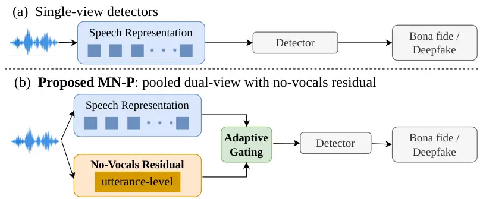
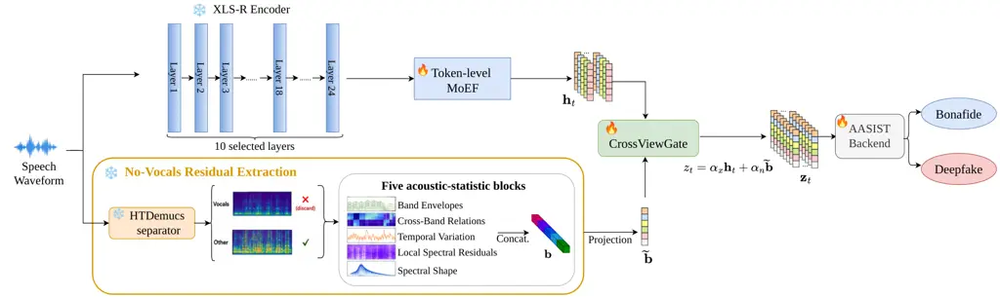

# What survives the codec shift: Pooled no-vocals residuals for speech deepfake detection

Jiajun Xu^(\*)Department of Engineering PhysicsTsinghua
UniversityBeijing, China Email: <jiajunx.cv@gmail.com>    Menglu Li^(\*)
Email: <menglu.li@sz.tsinghua.edu.cn>    Xiao-Ping ZhangTsinghua
Shenzhen International Graduate SchoolTsinghua UniversityShenzhen, China
Email: <xpzhang@ieee.org>

###### Abstract

The transition from vocoder-based to neural-codec speech synthesis makes
generalization more difficult for speech deepfake detectors,
particularly those relying on speech-oriented representations. It
remains unclear which acoustic representations retain discriminative
information when the generation mechanism changes. We therefore compare
12 acoustic representations using a shared low-capacity linear
classifier to identify effective evidence under codec shift. The
analysis shows that hierarchical XLS-R leads on the pooled test set,
while pooled no-vocals residual statistics perform best on the
unseen-codec condition, revealing complementary behavior across
generation conditions. Building on this finding, we propose MN-P, a
dual-view detector that integrates an utterance-level pooled no-vocals
representation with token-level XLS-R features through adaptive gating.
The proposed MN-P reduces EER by 54.2% overall and by 60.9% on the
codec-unseen condition relative to the best-performing retrained
state-of-the-art system, with consistent gains across different detector
backends. These results indicate that pooled no-vocals residual
statistics provide effective complementary evidence for cross-generation
speech deepfake detection.

###### Index Terms: 

deepfake speech detection, codec-unseen generalization, dual-view
fusion, anti-spoofing, residual

## 1 Introduction

Speech deepfake detection was initially developed mainly against
vocoder-based text-to-speech and voice-conversion systems \[1, 2\]. With
the rapid development of neural audio codecs, codec-based synthesis has
become an increasingly important generation paradigm \[3, 4\]. Its
high-fidelity outputs and substantially different synthesis mechanism
make unseen codec-based attacks a difficult generalization setting.
^(†)^(†) \* These authors contributed equally.^(†)^(†) $`\dagger`$
Corresponding author: Xiao-Ping Zhang



Figure 1: Speech-centric single-view detection versus the proposed MN-P.
(a) A conventional detector relies on a single speech representation.
(b) The proposed MN-P detector complements token-level speech features
with an utterance-level pooled no-vocals residual obtained after vocal
separation, and integrates the two through adaptive gating.

Most detectors derive their evidence from the speech-bearing signal,
using either handcrafted spectral and phase cues \[5, 6\] or pretrained
self-supervised representations \[7, 8, 9\]. As codec-based synthesis
narrows the perceptual gap to real speech, that evidence becomes harder
to separate. Improving the speech representation alone may therefore be
insufficient, and robust detection may require complementary evidence
beyond the dominant speech content that remains informative across
generation shifts.

We therefore begin with a controlled analysis of 12 acoustic
representations spanning spectral, codec-residual, non-vocal, and
hierarchical self-supervised features, all evaluated with the same
low-capacity linear classifier. The analysis reveals a key
representation pattern: hierarchical XLS-R provides the strongest
overall discrimination, whereas the pooled no-vocals residual is most
effective when the codec is unseen and carries less linearly decodable
source identity. This finding shifts the design focus from further
strengthening the speech representation to exploiting complementary
evidence at a different representational granularity, directly
motivating the dual-view formulation in Fig. 1.

Building on this observation, we develop a dual-view detector, named
MN-P, in which a Mixture-of-Experts Fusion (MoEF)-based speech branch is
complemented by a No-vocals view represented in Pooled form. The speech
branch uses a frozen self-supervised XLS-R encoder and fuses its
hierarchical hidden states through MoEF. In contrast to treating
residual information as a parallel frame-level stream, the auxiliary
branch summarizes the no-vocals residual into a single utterance-level
vector. Adaptive gating then integrates this global residual context
with the token-level speech representation without requiring temporal
alignment between the two views. This asymmetric design preserves local
temporal evidence in the speech representation while introducing
utterance-level residual statistics as complementary context. MN-P
outperforms retrained state-of-the-art systems on a test set spanning
unseen vocoders and an unseen neural codec, with consistent gains across
detector backends. Together, these results establish pooled no-vocals
residual statistics as an effective complementary representation for
cross-generation speech deepfake detection.

## 2 Related Work

Speech deepfake detection has evolved from handcrafted spectral and
phase cues \[10, 11\] to raw-waveform, graph-based, and self-supervised
detectors \[7, 12\], with recent work further exploiting intermediate
self-supervised learning layers \[8, 13\]. Most systems nevertheless
remain speech-centric, deriving detection evidence primarily from
speech-oriented representations, which leaves open whether such evidence
alone remains sufficient when the synthesis mechanism changes
substantially.

Complementary evidence outside the dominant verbal content has also been
explored, including silence, breathing, background, and environmental
components \[14, 15, 16, 17, 18, 19\]. However, these cues have mainly
been studied without explicitly considering the vocoder-to-neural-codec
shift, so their robustness under codec shift remains unclear.

Generalization to unseen datasets and generators remains challenging
\[20, 21, 22, 23\]. CodecFake and subsequent codec-aware methods address
the vocoder-to-neural-codec shift mainly through new training data and
learning objectives \[3, 24\], leaving the representation question less
explored.

These limitations motivate us to move beyond strengthening the speech
representation alone and identify complementary evidence that remains
informative under generation shift. We compare multiple acoustic
representations and find pooled no-vocals residual statistics to be the
most effective under the unseen-codec condition while complementing
hierarchical XLS-R. Building on this finding, we propose MN-P, which
integrates an utterance-level pooled no-vocals representation with
token-level XLS-R features through adaptive gating. Rather than modeling
the residual as another frame-level stream, this formulation aggregates
residual statistics that remain stable over the entire utterance.

## 3 Representation Analysis

We perform a representation analysis to identify which acoustic
representations remain informative when the synthesis condition shifts
from vocoder-based to neural-codec-based generation. To isolate
representation quality from classifier capacity, we evaluate 12
candidate representations under the same data protocol and a common
low-capacity linear classifier, reporting both overall detection
performance and performance on codec-unseen (CU) samples.

The candidates span six feature families. B1 uses LFCC \[10\], B3 uses
phase and group-delay cues, B5 uses EnCodec quantization residuals
\[25\], and B6 uses hierarchical XLS-R hidden states \[26\], each
contributing one candidate. B2 contains four spectrotemporal-statistic
representations derived from different waveform views, namely the
original signal, the HTDemucs-estimated \[27\] vocals (V) and no-vocals
(NV) components, and their cross-view relation (XV). The no-vocals
representation is detailed in Section 4.1. B4 contributes four
candidates obtained by WORLD source–filter analysis \[28\] from pooled
WORLD statistics and cross-view relations across the original, V, and NV
views.

Vocoder-based samples are drawn from ASVspoof2019-LA \[29\], and
codec-based samples from Codecfake \[24\]. Following the official corpus
splits, the merged protocol contains 273,027 training, 55,269
development, and 190,845 test samples. The training and development sets
cover A01–A06 vocoders and F01–F06 codecs, whereas the test set
additionally contains unseen vocoders A07–A19, seen codecs F01–F06, and
the held-out DAC codec F07. F07 is absent from both training and
development and serves as the CU condition. We report EER over the full
test set and CU EER over F07 only. Analysis training uses AdamW with
batch size 4,096, at most 30 epochs, patience 5, learning rate
$`10^{-3}`$, and weight decay $`10^{-4}`$. On the same fixed
representations, we additionally train a linear probe to predict
fake-source identity. The probe is evaluated in a closed-set setting
under the same protocol for all candidates, and its macro-F1 is denoted
Source F1. It measures how much source-specific information is linearly
decodable from each representation. High Source F1 suggests that
separability may rest on cues identifying the generating system, which
need not transfer to an unseen generator, so lower values are preferable
here.

| Candidates | EER(%) $`\downarrow`$  | CU EER(%) $`\downarrow`$ | Source F1 $`\downarrow`$ |
| ---------- | ---------------------- | ------------------------ | ------------------------ |
| B6         | 4.843                  | $`\underline{9.291}`$    | 0.726                    |
| B2-XV      | $`\underline{13.448}`$ | 21.935                   | 0.656                    |
| B2-NV      | 13.859                 | 8.619                    | 0.539                    |
| B2-V       | 25.999                 | 41.201                   | $`\underline{0.588}`$    |
| B3         | 26.766                 | 34.606                   | 0.628                    |
| B1         | 26.956                 | 34.204                   | 0.620                    |

Table 1: Six candidate representations with the lowest overall test-set
EER. Source F1 is the closed-set macro-F1 of a linear probe for
fake-source identity, where lower values indicate less linearly
decodable source information. Bold and underlined denote the best and
second-best results.

Table 1 lists the six candidates with the lowest overall EER on the test
set. B6 achieves the lowest overall EER at 4.843%, while B2-NV achieves
the lowest CU EER at 8.619%, compared with 9.291% for B6. This
establishes B2-NV as the strongest screened representation when the
generating codec is unseen. The within-B2 comparison makes this contrast
direct. Replacing the vocals view with the no-vocals view reduces EER
from 25.999% to 13.859% and CU EER from 41.201% to 8.619%, and B2-XV
reaches a comparable overall EER of 13.448% but a substantially higher
CU EER of 21.935%. The codec-unseen advantage is therefore specific to
the no-vocals view rather than a general property of the B2 statistic
family. B2-NV also yields the lowest Source F1 at 0.539, against 0.726
for B6, so its codec-unseen margin comes with less rather than more
linearly decodable source information. The non-vocal residual thus
carries evidence that is distinct from what the speech-bearing
representation encodes and that remains accessible when the generating
codec is unseen. We therefore use B6 as the primary representation and
B2-NV as a complementary residual view in Section 4.



Figure 2: Architecture of the proposed MN-P detector. A frozen XLS-R
branch produces a token-level speech representation, while the no-vocals
branch, highlighted in the orange box, aggregates residual statistics
over the whole utterance into a single vector. CrossViewGate fuses the
two views before the AASIST backend. Frozen and trainable modules are
marked by distinct icons.

## 4 Proposed Method

Motivated by the complementary behavior identified in Section 3, we
construct MN-P by combining the MoEF-fused hierarchical XLS-R
representation with the pooled no-vocals representation. A central
design choice is to represent the no-vocals residual as an
utterance-level auxiliary vector rather than as a second temporal
stream, so that residual statistics are aggregated over the whole
utterance without requiring frame-level alignment with the XLS-R
sequence. Fig.  2 summarizes the architecture.

### 4.1 Pooled No-Vocals Residual

For a 4-s waveform $`x`$, HTDemucs \[27\] separates the 44.1-kHz
resampled signal into components $`D_{c}(\mathcal{R}_{44.1}(x))`$, where
$`c\in\mathcal{S}=\{\mathrm{vocals},\mathrm{drums},\mathrm{bass},\mathrm{other}\}`$.
We discard the vocals component, sum the remaining sources, downmix, and
resample to 16 kHz:

```math
\mathbf{n}=\mathcal{R}_{16}\!\left(\operatorname{Downmix}\!\left[\sum_{c\in\mathcal{S}\setminus\{\mathrm{vocals}\}}D_{c}(\mathcal{R}_{44.1}(x))\right]\right). \tag{1}
```

We refer to $`\mathbf{n}`$ as the Demucs-estimated no-vocals residual.
Rather than treating it as an isolated background source, we use the
full residual as a detection representation. It contains background
content together with separation artifacts and residual speech energy,
all of which can preserve traces introduced by the synthesis pipeline
beyond the dominant verbal content.

We characterize this residual through utterance-level spectrotemporal
statistics. A center-free STFT with a 512-point DFT, a 400-sample Hann
window, and a 160-sample hop is converted to log power and divided into
0–2, 2–4, and 4–8 kHz bands. Each trajectory is summarized by eight
operators: mean, standard deviation, minimum, maximum, the 25th, 50th,
and 75th percentiles, and mean absolute first difference. These
statistics form five feature blocks capturing band envelopes, cross-band
relations, temporal variation, local spectral residuals over a
$`5\times 5`$ smoothed surface, and spectral shape. The five blocks
contain 24, 35, 27, 24, and 17 dimensions, respectively, and are
concatenated as

```math
\mathbf{b}=[\phi_{1}(\mathbf{n});\ldots;\phi_{5}(\mathbf{n})]\in\mathbb{R}^{127}. \tag{2}
```

The resulting no-vocals residual representation is a single 127-D vector
per utterance, rather than a frame-level residual stream, and provides
the auxiliary view fused with XLS-R. Column-wise median imputation and
standardization are fitted on the training set only and then fixed for
development and test data.

### 4.2 Dual-View Integration

The primary branch uses the frozen XLS-R-300M encoder \[26\]. Following
MoEF \[13\], we select ten hidden states spanning shallow to deep layers
and assign four feed-forward experts to each. A shared router uses the
layer-24 token to score all 40 experts, and global Top-2 routing selects
two layer-expert pairs at each token position. The resulting sequence
$`\{\mathbf{h}_{t}\}_{t=1}^{T}`$ retains the XLS-R temporal grid with
1024-D features.

The pooled residual vector is projected to the XLS-R feature dimension
by a two-layer network with a 256-D GELU hidden layer and layer
normalization, giving
$`\widetilde{\mathbf{b}}=Project(\mathbf{b})\in\mathbb{R}^{1024}`$. We
summarize the XLS-R sequence as
$`\overline{\mathbf{h}}=T^{-1}\sum_{t}\mathbf{h}_{t}`$ and use an
utterance-conditioned two-view gate, as CrossViewGate, to estimate the
relative contribution of the two representations:

```math
[\alpha_{x},\alpha_{n}]^{\mathsf{T}}=\operatorname{softmax}G([\overline{\mathbf{h}};\widetilde{\mathbf{b}}]). \tag{3}
```

The utterance-level residual vector is then broadcast over the XLS-R
token grid:

```math
\mathbf{z}_{t}=\alpha_{x}\mathbf{h}_{t}+\alpha_{n}\widetilde{\mathbf{b}},\qquad t=1,\ldots,T. \tag{4}
```

Unlike the sparse MoEF router, CrossViewGate is dense over the two
views, allowing both to contribute while adapting their relative weights
to each utterance. The fused sequence is classified by an AASIST backend
\[12\].

|                              |                        |                        |                              |                           |                                 |
| ---------------------------- | ---------------------- | ---------------------- | ---------------------------- | ------------------------- | ------------------------------- |
| System                       | AUC $`\uparrow`$       | EER (%) $`\downarrow`$ | Fake miss (%) $`\downarrow`$ | CU EER (%) $`\downarrow`$ | CU fake miss (%) $`\downarrow`$ |
| MN-P-AASIST (Ours)           | 99.638                 | 2.744                  | 6.890                        | 6.136                     | 27.903                          |
| MN-P-Nes2Net                 | $`\underline{99.583}`$ | $`\underline{2.927}`$  | $`\underline{9.068}`$        | $`\underline{6.706}`$     | $`\underline{40.182}`$          |
| M0-AASIST                    | 98.118                 | 7.010                  | 14.702                       | 18.639                    | 68.729                          |
| M0-Nes2Net                   | 98.630                 | 5.869                  | 14.499                       | 15.632                    | 68.092                          |
| FAD \[13\]                   | 98.507                 | 6.246                  | 14.876                       | 16.562                    | 70.012                          |
| W2V2-AASIST with CSAM \[24\] | 98.647                 | 5.986                  | 15.444                       | 15.692                    | 74.325                          |
| XLS-R-SLS \[8\]              | 96.068                 | 10.716                 | 18.228                       | 28.180                    | 79.290                          |
| W2V2-Nes2Net \[30\]          | 98.389                 | 6.569                  | 15.756                       | 17.597                    | 72.120                          |

Table 2: Performance comparison on the merged test set (%). MN-P is
evaluated with AASIST and Nes2Net backends; M0 removes the pooled
no-vocals view and CrossViewGate. Selected state-of-the-art systems are
retrained under the same protocol. Bold and underlined denote the best
and second-best results.

## 5 Experimental Setup

### 5.1 Datasets and Metrics

We combine two English corpora. ASVspoof 2019 LA \[29\] provides
vocoder-based fakes and Codecfake \[24\] provides neural-codec fakes,
with bona fide speech from both. We retain mono 16-kHz, 64,000-sample
waveforms with RMS at least $`10^{-2}`$ and peak amplitude at least
$`3\times 10^{-2}`$.

Training and development use the A01–A06 vocoders and F01–F06 codecs,
balanced by corpus and label to 50,758 and 49,678 utterances,
respectively. The 39,996-utterance test set is balanced across
evaluation conditions, covering bona fide speech, seen and unseen
ASVspoof vocoders, the seen codecs F01–F06, the held-out DAC codec F07,
and unseen audio language model (ALM)-based deepfake samples from
Codecfake \[24\], so that no single condition dominates the evaluation.
F07 is excluded from training and development. Its 4,444 fake and 4,444
bona fide utterances define the codec-unseen (CU) subset.

We report AUC, EER, and fake miss on the full test set, and EER and fake
miss on the CU subset. AUC and EER are computed from test scores, while
fake miss uses the EER threshold selected on the development set.

### 5.2 Implementation Details

Main-model experiments use seeds 3407, 3411, and 3417, and the reported
main-model and ablation results are averaged over the three seeds.
Trainable modules are optimized with AdamW using batch size 8, learning
rate $`10^{-4}`$, weight decay $`10^{-4}`$, at most 10 epochs, and
patience 5. The checkpoint with the minimum development loss is used for
evaluation. XLS-R remains frozen throughout training, and HTDemucs is
applied offline so that the 127-D residual vectors are precomputed once
and reused across seeds and systems. All comparison systems share the
same data, waveform preprocessing, and evaluation protocol.

## 6 Results and Discussion

### 6.1 Main Comparison

Table 2 reports the protocol-matched comparison. The first four rows
provide a controlled comparison between MN-P and the corresponding M0
baseline across two detector backends. M0 retains the same hierarchical
XLS-R with MoEF branch and detector backend as MN-P, but removes the
pooled no-vocals branch and CrossViewGate. With AASIST, MN-P reduces EER
from 7.010% to 2.744% and CU EER from 18.639% to 6.136%. The larger
reduction on the unseen-codec subset shows that the pooled residual view
is particularly effective under codec shift. The same trend holds with
the Nes2Net backend, where CU EER decreases from 15.632% to 6.706%.
MN-P-Nes2Net ranks second across all reported metrics, indicating that
the gain from the pooled no-vocals representation is not specific to a
particular detector backend.

The last four rows in Table 2 report state-of-the-art detection systems
retrained under the same protocol. Both MN-P variants outperform all
retrained systems across the reported metrics, with the largest
advantage under codec shift. The strongest of them, W2V2-AASIST with
CSAM, reaches 5.986% EER and 15.692% CU EER through codec-aware
co-training. MN-P-AASIST reduces these by 54.2% and 60.9% relative,
without any codec-specific training signal. The difference is even
larger in CU miss, where retrained systems miss 70–79% of codec-unseen
fakes, compared with 27.903% and 40.182% for the two MN-P variants.

### 6.2 Ablation on Model Structure

Table 3 indicates the contribution of the no-vocals view and its
representation form using an independent set of 2,000 training, 1,000
development, and 2,000 test samples over the same three seeds. M0 omits
the no-vocals residual view, MN-S retains a frame-level residual
sequence, whereas MN-P summarizes the residual as an utterance-level
vector.

The ablation reveals a two-stage gain. Adding the no-vocals sequence
reduces CU EER from 34.830% for M0 to 18.168%, showing that the residual
itself contains useful codec-unseen evidence. Pooling it at utterance
level further reduces CU EER to 8.709% and CU miss from 57.808% to
14.865%. This further improvement shows that the no-vocals residual is
more effective when summarized at utterance level than when retained as
a frame-level sequence, while avoiding explicit alignment with the XLS-R
sequence.

|      | CU EER (%) $`\downarrow`$ | CU fake miss (%) $`\downarrow`$ |
| ---- | ------------------------- | ------------------------------- |
| M0   | 34.830                    | 80.180                          |
| MN-S | $`\underline{18.168}`$    | $`\underline{57.808}`$          |
| MN-P | 8.709                     | 14.865                          |

Table 3: Ablation on model structure (%), on an independent
train/development/test split. M0 uses XLS-R alone and MN-S feeds the
no-vocals residual as a frame-level sequence. Bold and underlined denote
the best and second-best results.

## 7 Conclusion

The shift from vocoder-based to neural-codec speech synthesis makes
generalization increasingly difficult for detectors that rely mainly on
speech-oriented representations. In this work, we first compared
multiple acoustic representations under a shared protocol and found that
the representation performing best overall is not necessarily the most
effective under unseen-codec conditions. In particular, pooled no-vocals
residual statistics outperform hierarchical XLS-R in that condition.
Based on this finding, we proposed MN-P, which combines token-level
XLS-R features with an utterance-level pooled no-vocals representation
through adaptive gating.

Experimental results show that MN-P more than halves the codec-unseen
EER of the best-performing retrained state-of-the-art system, with the
gain retained across different detector backends. A structural ablation
further demonstrates that the no-vocals residual is more effective when
represented by utterance-level pooled statistics than as a frame-level
stream. Together, these results indicate that complementary evidence
beyond the speech representation can provide substantial generalization
gains under changes in the generation mechanism. Future work will
disentangle the contributions of background content and separation
artifacts within the residual, and extend the evaluation to more diverse
conditions.

## References

- \[1\] H. Tak, J. Patino, M. Todisco, A. Nautsch, N. Evans, and
  A. Larcher, “End-to-end anti-spoofing with rawnet2,” in Proc. ICASSP,
  2021, pp. 6369--6373.
- \[2\] M. Li, Y. Ahmadiadli, and X.-P. Zhang, “Robust deepfake audio
  detection via bi-level optimization,” in 2023 IEEE 25th International
  Workshop on Multimedia Signal Processing (MMSP), 2023, pp. 1–6.
- \[3\] H. Wu, Y. Tseng, and H.-y. Lee, “CodecFake: Enhancing
  anti-spoofing models against deepfake audios from codec-based speech
  synthesis systems,” in Proc. Interspeech, 2024, pp. 1770–1774.
- \[4\] S. Chen et al., “Neural codec language models are zero-shot text
  to speech synthesizers,” IEEE Transactions on Audio, Speech and
  Language Processing, vol. 33, pp. 705–718, 2025.
- \[5\] M. Li, Y. Ahmadiadli, and X.-P. Zhang, “A comparative study on
  physical and perceptual features for deepfake audio detection,” in
  Proceedings of the 1st International Workshop on Deepfake Detection
  for Audio Multimedia, 2022, pp. 35–41.
- \[6\] C. Wang, J. Yi, J. Tao, C. Zhang, S. Zhang, and X. Chen,
  “Detection of cross-dataset fake audio based on prosodic and
  pronunciation features,” INTERSPEECH 2023, Aug 2023.
- \[7\] O. Pascu, A. Stan, D. Oneata, E. Oneata, and H. Cucu, “Towards
  generalisable and calibrated audio deepfake detection with
  self-supervised representations,” in Proc. Interspeech, 2024, pp.
  4828–4832.
- \[8\] Q. Zhang, S. Wen, and T. Hu, “Audio deepfake detection with
  self-supervised XLS-R and SLS classifier,” in Proc. ACM MM, 2024, pp.
  6765–6773.
- \[9\] M. Li and X.-P. Zhang, “Interpretable temporal class activation
  representation for audio spoofing detection,” in Interspeech 2024,
  2024, pp. 1120–1124.
- \[10\] M. Sahidullah, T. Kinnunen, and C. Hanilçi, “A comparison of
  features for synthetic speech detection,” in Proc. Interspeech, 2015,
  pp. 2087–2091.
- \[11\] M. Todisco, H. Delgado, and N. Evans, “Constant q cepstral
  coefficients: A spoofing countermeasure for automatic speaker
  verification,” Comput. Speech Lang., vol. 45, pp. 516–535, 2017.
- \[12\] J.-w. Jung et al., “AASIST: Audio anti-spoofing using
  integrated spectro-temporal graph attention networks,” in Proc.
  ICASSP, 2022, pp. 6367–6371.
- \[13\] Z. Wang et al., “Mixture of experts fusion for fake audio
  detection using frozen wav2vec 2.0,” in Proc. ICASSP, 2025, pp. 1–5.
- \[14\] N. Müller, F. Dieckmann, P. Czempin, R. Canals, K. Böttinger,
  and J. Williams, “Speech is silver, silence is golden: What do
  asvspoof-trained models really learn?,” in Proc. ASVspoof 2021
  Challenge, 2021, pp. 55–60.
- \[15\] Y. Zhang, W. Wang, and P. Zhang, “The effect of silence and
  dual-band fusion in anti-spoofing system,” in Proc. Interspeech, 2021,
  pp. 4279–4283.
- \[16\] T.-P. Doan, L. Nguyen-Vu, S. Jung, and K. Hong, “Bts-e: Audio
  deepfake detection using breathing-talking-silence encoder,” in Proc.
  ICASSP, 2023, pp. 1–5.
- \[17\] M. Li and X.-P. Zhang, “Robust audio anti-spoofing system based
  on low-frequency sub-band information,” in 2023 IEEE Workshop on
  Applications of Signal Processing to Audio and Acoustics (WASPAA).
  IEEE, 2023, pp. 1–5.
- \[18\] D. Salvi, T. S. Balcha, P. Bestagini, and S. Tubaro, “Listening
  between the lines: Synthetic speech detection disregarding verbal
  content,” in Proc. ICASSPW, 2024, pp. 883–887.
- \[19\] X. Zhang, Y. Wang, L. Li, L. Jin, and M. Li, “Compspoof: A
  dataset and joint learning framework for component-level audio
  anti-spoofing countermeasures,” in Proc. ICASSP, 2026, pp.
  18067–18071.
- \[20\] D. Paul, M. Sahidullah, and G. Saha, “Generalization of
  spoofing countermeasures: A case study with asvspoof 2015 and btas
  2016 corpora,” in Proc. ICASSP, 2017, pp. 2047–2051.
- \[21\] N. Müller, P. Czempin, F. Diekmann, A. Froghyar, and
  K. Böttinger, “Does audio deepfake detection generalize?,” in Proc.
  Interspeech, 2022, pp. 2783–2787.
- \[22\] R. K. Das, J. Yang, and H. Li, “Assessing the scope of
  generalized countermeasures for anti-spoofing,” in Proc. ICASSP, 2020,
  pp. 6589–6593.
- \[23\] Y. Li et al., “Cross-domain audio deepfake detection: Dataset
  and analysis,” in Proc. EMNLP, 2024, pp. 4977–4983.
- \[24\] Y. Xie et al., “The codecfake dataset and countermeasures for
  the universally detection of deepfake audio,” IEEE Trans. Audio,
  Speech, Lang. Process., vol. 33, pp. 386–400, 2025.
- \[25\] A. Défossez, J. Copet, G. Synnaeve, and Y. Adi, “High fidelity
  neural audio compression,” Trans. Mach. Learn. Res., vol. 2023, 2023.
- \[26\] A. Babu et al., “XLS-R: Self-supervised cross-lingual speech
  representation learning at scale,” in Proc. Interspeech, 2022, pp.
  2278–2282.
- \[27\] S. Rouard, F. Massa, and A. Défossez, “Hybrid transformers for
  music source separation,” in Proc. ICASSP, 2023, pp. 1–5.
- \[28\] M. Morise, F. Yokomori, and K. Ozawa, “WORLD: A vocoder-based
  high-quality speech synthesis system for real-time applications,”
  IEICE Trans. Inf. Syst., vol. E99.D, no. 7, pp. 1877–1884, 2016.
- \[29\] M. Todisco et al., “ASVspoof 2019: Future horizons in spoofed
  and fake audio detection,” in Proc. Interspeech, 2019, pp. 1008–1012.
- \[30\] T. Liu, D.-T. Truong, R. K. Das, K. A. Lee, and H. Li,
  “Nes2Net: A lightweight nested architecture for foundation model
  driven speech anti-spoofing,” IEEE Trans. Inf. Forensics Security,
  vol. 20, pp. 12005–12018, 2025.
