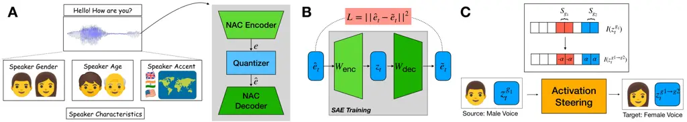
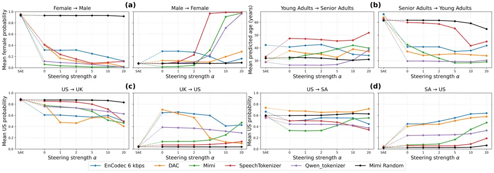
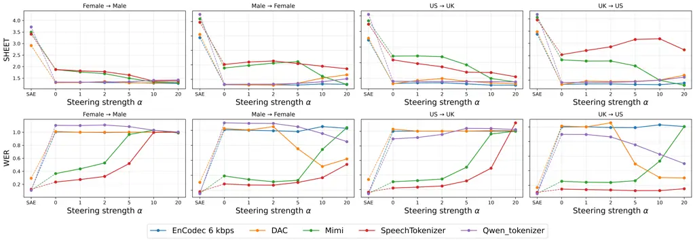

# Towards Interpretable Framework for Neural Audio Codecs via Sparse Autoencoders: Exploration toward Age, Gender, and Accent Steering

Shih-Heng Wang, Tiantian Feng, Aditya Kommineni, Huang-Cheng Chou, Bowen
Yi, Xuan Shi, Shrikanth Narayanan

###### Abstract

Neural audio codecs (NACs) are widely used in speech generation and
audio-language modeling, yet how they encode speaker-trait information
remains poorly understood. Prior work applied sparse autoencoders (SAEs)
to investigate accent information in NACs through task-level analysis.
Here, we extend this analysis to the waveform level and to age, gender,
and accent, using SAE steering to probe trait-related information in
sparse activations. We identify trait-associated dimensions, modify
their activations, and evaluate the resulting reconstructed speech.
Across five NACs, steering the selected dimensions induces
target-directed shifts in speaker-trait predictions. A random-dimension
baseline on Mimi produces smaller shifts, supporting the relevance of
the selected dimensions. However, responses vary across codecs, traits,
and steering directions, and increasing steering strength does not
consistently amplify the intended shifts. Steering also generally
increases word error rates and lowers predicted perceptual quality.
These findings suggest that SAEs capture speaker-trait information in
steerable activations, while the accompanying quality degradation
highlights the need to better separate trait-related information from
other information.

###### Index Terms: 

Interpretability, Sparse Autoencoders, Neural Audio Codec, Speaker Trait

^(†)^(†)address: University of Southern California, USA

## 1 Introduction

Neural Audio Codec (NAC) representations \[35, 7, 16, 36, 13, 33, 32, 8,
23, 31, 19\] have become a fundamental component of modern
text-to-speech (TTS) \[28, 6, 37\] and speech foundation models \[8, 3,
4\]. Consequently, substantial effort has been devoted to benchmarking
NACs \[31, 19, 23, 20\], primarily by evaluating the effectiveness of
NAC representations on downstream speech understanding and generation
tasks. However, considerably less attention has been paid to
understanding how these representations encode and organize information
internally. This limited interpretability constrains our ability to
explain and verify the behavior of NAC-based systems, particularly when
they are deployed in sensitive or accountability-critical applications
such as healthcare.

To address this gap, our prior work \[29\] used sparse autoencoders
(SAEs) \[15, 27, 17, 12, 10, 34\] to investigate the task-level
interpretability of NACs for speaker accent. SAEs have been widely
adopted in interpretability analysis of foundation models as they
transform dense and polysemantic representations into sparse,
monosemantic activations, where individual activations may correspond to
human-interpretable attributes. By decomposing NAC representations using
SAE, our previous study provided an initial view into how accent-related
information is encoded within NAC representations. However, this
analysis was limited to task-level evidence without waveform-level
analysis and considered only accent, leaving its generalizability to
other speaker traits unclear.

To address the first limitation, we combine SAEs with activation
steering \[30, 18, 26\], modifying selected SAE activations and
examining the resulting changes in NAC-reconstructed speech. If
modifying certain activation dimensions shifts attribute predictions for
the reconstructed speech in the intended direction, it suggests that
attribute-related information is decomposed into those dimensions. Prior
studies have demonstrated such control in speech, audio, and music
generation systems \[9, 21, 25, 1\]. For example, researchers have
identified steerable concepts in music generation models \[25\] and
manipulated emotion-associated SAE features to induce corresponding
changes in generated speech \[9\].

Motivated by these findings, we use SAE steering as a proxy to assess
whether speaker-related information in NAC representations can be
decomposed into interpretable sparse activations. Note that our
objective is to study the interpretability of NAC representations,
rather than to develop an attribute-conversion system. To address the
second limitation, we extend our analysis beyond accent to include age
and gender. Together, these extensions broaden our understanding of how
NAC representations encode different speaker traits.



Figure 1: Overview of the SAE steering framework. (A) Illustration of
NAC encoding speech utterance into quantized frame-level
representations. (B) A SAE decomposes each frame into sparse activations
and reconstructs it. (C) Trait-associated activation dimensions are
identified and modified to steer reconstructed speech from a source
trait $`g_{1}`$ toward a target trait $`g_{2}`$.

To achieve these goals, we first extract NAC representations (Sec. 2.1)
and train SAEs to obtain sparse and interpretable activations
(Sec. 2.2). Given these sparse activations, we apply an
activation-frequency-based algorithm to identify activations associated
with specific speaker traits and perform steering on the corresponding
activations (Sec. 2.3). We use Vox-Profile \[11\], which aggregates 11
open-source datasets with consistent speaker-trait labels (Sec. 3.1),
and evaluate five NACs (Sec. 3.2). To evaluate steering effectiveness,
we use speaker-trait classification models to assess whether the
predicted trait probabilities of waveforms reconstructed from the
steered representations shift in the intended direction (see Sec. 3.4).
Our results (Sec. 4) reveal three key findings:

1. SAE steering induces speaker-trait shifts, with the most consistent
   bidirectional control for gender and more variable responses for accent
   and age (Sec. 4.1).

2. Increasing steering strength can amplify these shifts, although
   plateaus and reversals indicate limited controllability (Sec. 4.2).

3. Steering generally degrades speech content and quality, suggesting
   that the selected activations and steering procedure do not fully
   isolate speaker-trait information (Sec. 4.3).

## 2 SAE Steering Framework

Figure 1 summarizes our framework for identifying and steering
speaker-trait-associated SAE features in NAC representations.

### 2.1 Neural Audio Codec Representations

As depicted in Figure 1(A), NACs typically consist of an encoder
$`\mathcal{E}`$, one or more vector quantizers \[22\], collectively
denoted by $`\mathcal{V}`$, and a decoder $`\mathcal{D}`$. Given a
waveform $`x`$, the encoder produces $`\mathbf{e}=\mathcal{E}(x)`$, and
quantization yields discrete codes and their embeddings:
$`(\mathbf{c},\hat{\mathbf{e}})=\mathcal{V}(\mathbf{e})`$. Here,
$`\hat{\mathbf{e}}=\left[\hat{\mathbf{e}}_{1},\ldots,\hat{\mathbf{e}}_{T_{\text{codec}}}\right]^{\top}\in\mathbb{R}^{T_{\text{codec}}\times d_{\text{codec}}}`$
contains $`T_{\text{codec}}`$ frames. The reconstructed waveform is
$`\hat{x}=\mathcal{D}(\hat{\mathbf{e}})`$.

### 2.2 Sparse Autoencoders (SAEs)

As illustrated in Figure 1(B), SAEs decompose dense frame-level
representations $`\hat{\mathbf{e}}_{t}`$ into sparse activations
$`\mathbf{z}_{t}`$. The SAE aims to learn sparse representations whose
individual dimensions may correspond to human-interpretable attributes.

Following our prior work, we adopt Top-$`k`$ SAE \[12\], which controls
sparsity by retaining the $`k`$ largest activations and setting the
remaining activations to zero. The SAE consists of a linear encoder and
a linear decoder with weight matrices
$`W_{\text{enc}}\in\mathbb{R}^{d_{z}\times d_{\text{codec}}}`$ and
$`W_{\text{dec}}\in\mathbb{R}^{d_{\text{codec}}\times d_{z}}`$,
respectively, together with a shared preprocessing bias
$`\mathbf{b}_{\text{pre}}\in\mathbb{R}^{d_{\text{codec}}}`$. No
additional bias terms are used in either linear transformation. We train
the SAE model on
$`\hat{\mathbf{e}}_{t}\in\mathbb{R}^{d_{\text{codec}}}`$, treating each
frame independently rather than using temporally mean-pooled utterance
representations as in our prior work. Given $`\hat{\mathbf{e}}_{t}`$,
its activation $`\mathbf{z}_{t}\in\mathbb{R}^{d_{z}}`$ and SAE
reconstruction $`\tilde{\mathbf{e}}_{t}`$ are computed as

```math
\displaystyle\mathbf{z}_{t} \displaystyle=\operatorname{TopK}\left(W_{\text{enc}}\left(\hat{\mathbf{e}}_{t}-\mathbf{b}_{\text{pre}}\right),k\right), \tag{1}
```

```math
\displaystyle\tilde{\mathbf{e}}_{t} \displaystyle=W_{\text{dec}}\mathbf{z}_{t}+\mathbf{b}_{\text{pre}}, \tag{2}
```

where $`d_{z}>d_{\text{codec}}`$. The SAE is optimized using the mean
squared reconstruction error
$`\mathcal{L}_{\text{MSE}}=\lVert\hat{\mathbf{e}}_{t}-\tilde{\mathbf{e}}_{t}\rVert_{2}^{2}`$.
Additional implementation details are provided in \[12\]. Stacking the
reconstructed frames yields $`\tilde{\mathbf{e}}`$, which is decoded
into $`\tilde{x}=\mathcal{D}(\tilde{\mathbf{e}})`$.



Figure 2: Steering results across five NACs for (a) gender, (b) age, (c)
US–UK accent, and (d) US–SA accent. US, UK, and SA denote North
American, British Isles, and Southern Asian accents, respectively.
Diamonds indicate unsteered SAE reconstruction baselines; circles
indicate steering results at steering strength $`\alpha`$. Mimi Random
uses randomly selected SAE dimensions from Mimi’s representation.

### 2.3 SAE Steering

As shown in Figure 1(C), if certain dimensions of the sparse activation
$`\mathbf{z}_{t}`$ capture speaker-trait information, steering those
dimensions may induce corresponding changes in the SAE-reconstructed
representation $`\tilde{\mathbf{e}}`$ and, consequently, the
reconstructed waveform $`\tilde{x}`$. We therefore use steering as a
proxy for assessing how well the SAE decomposes such information. To
perform targeted steering, we first identify trait-associated dimensions
using the activation-frequency-based algorithm below:

Activation-frequency-based algorithm. Following \[9\], we identify
trait-associated SAE dimensions through activation frequency. Let
$`\mathbf{X}_{g}`$ denote the set of waveforms labeled with speaker
trait $`g`$. The activation frequency $`r_{i}^{(g)}`$ of dimension $`i`$
is defined as:

```math
r_{i}^{(g)}=\frac{1}{|\mathbf{X}_{g}|}\sum_{x\in\mathbf{X}_{g}}\sum_{t=1}^{T_{\text{codec}}^{x}}\mathbb{I}\!\left[i\in\mathcal{I}(\mathbf{z}_{t}^{x})\right], \tag{3}
```

where $`\mathbf{z}_{t}^{x}`$ is the SAE activation at frame $`t`$ of
waveform $`x`$, $`\mathcal{I}(\cdot)`$ returns its active indices,
$`\mathbb{I}[\cdot]`$ is the indicator function, and
$`T_{\text{codec}}^{x}`$ is its frame count. Unlike the utterance-level
occurrence indicator in \[9\], $`r_{i}^{(g)}`$ counts repeated
frame-level activations.

However, a high activation frequency $`r_{i}^{(g)}`$ at dimension $`i`$
alone does not establish trait specificity, as it may reflect linguistic
or acoustic information shared across traits. Prior work \[9\] addresses
this by comparing synthesized emotional and neutral speech while holding
text and speaker identity fixed. In our setting, speaker traits lack a
natural neutral baseline, and real recordings do not offer the same
control over content and speaker characteristics.

Therefore, we formulate a comparison between source and target trait
groups, $`g_{1}`$ and $`g_{2}`$, using each group as a reference for the
other to identify relative trait associations. Given their activation
frequencies, we compute the normalized comparison score:

```math
s_{i}^{(g_{1},g_{2})}=\frac{r_{i}^{(g_{1})}-r_{i}^{(g_{2})}}{r_{i}^{(g_{1})}+r_{i}^{(g_{2})}+\lambda\cdot\tau}. \tag{4}
```

Here, $`\tau`$ is the median of the nonzero values in
$`\{r_{j}^{(g_{1})}+r_{j}^{(g_{2})}\}_{j=1}^{d_{z}}`$, and $`\lambda`$
controls stabilization to avoid small or zero denominators. To suppress
rarely activated or dead latents, we additionally set
$`r_{i}^{(g_{1})}`$=$`r_{i}^{(g_{2})}`$=0 for dimensions satisfying
$`r_{i}^{(g_{1})}+r_{i}^{(g_{2})}\leq 0.1\cdot\operatorname{mean}\{r_{j}^{(g_{1})}+r_{j}^{(g_{2})}\}_{j=1}^{d_{z}}`$.

A positive $`s_{i}^{(g_{1},g_{2})}`$ indicates that dimension $`i`$ is
activated more frequently under $`g_{1}`$ than under $`g_{2}`$, and
negative scores indicate the reverse. We rank dimensions in descending
order of $`s_{i}^{(g_{1},g_{2})}`$ and $`-s_{i}^{(g_{1},g_{2})}`$,
retaining the top $`M`$ from each ranking as $`g_{1}`$- and
$`g_{2}`$-associated candidates for steering, respectively.

Activation steering. Let $`\mathcal{S}_{g_{1}}`$ and
$`\mathcal{S}_{g_{2}}`$ denote the index sets of the $`g_{1}`$- and
$`g_{2}`$-associated dimensions selected above. To steer from $`g_{1}`$
toward $`g_{2}`$, we assign $`-\alpha`$ and $`+\alpha`$ to source- and
target-associated dimensions, respectively, restricting changes to the
original Top-$`k`$ active set:

```math
z_{t,i}^{g1\rightarrow g2}=\begin{cases}+\alpha,&i\in\mathcal{S}_{g_{2}}\cap\mathcal{I}(\mathbf{z}_{t}),\\
-\alpha,&i\in\mathcal{S}_{g_{1}}\cap\mathcal{I}(\mathbf{z}_{t}),\\
z_{t,i},&\text{otherwise}.\end{cases} \tag{5}
```

We pass the modified activations through the SAE decoder to obtain
$`\tilde{\mathbf{e}}^{g1\rightarrow g2}`$ and reconstruct the waveform
as
$`\tilde{x}^{g1\rightarrow g2}=\mathcal{D}(\tilde{\mathbf{e}}^{g1\rightarrow g2})`$.
We perform reverse steering by exchanging $`g_{1}`$ and $`g_{2}`$, and
vary $`\alpha`$ to assess the effect of various steering strengths.

## 3 Experimental setup

### 3.1 Dataset

Vox-Profile. Following our prior work \[29\], we use Vox-Profile \[11\]
for all experiments. This benchmark aggregates 11 open-source datasets
of English speech from speakers with self-reported ages, genders, and
accents, covering more than 16 English accents across regions. Its broad
coverage and consistent accent annotations across sources support a
comparable evaluation across speaker groups.

Speaker traits. We explore age, gender and accent as the speaker traits
of interest. Specifically, we include all waveforms labeled with the
following accents: North America, English, Welsh, Scottish, Northern
Irish, and Southern Asia, together with their corresponding
speaker-trait annotations. We define source–target trait pairs
$`(g_{1},g_{2})`$ as follows: young adult (18–30 years) vs senior adult
(over 60 years) for age, and female vs male for gender. For accent, we
examine two pairs, US vs UK and US vs Southern Asia (SA) , to assess
whether our findings generalize across accent distinctions. Here, US
denotes Vox-Profile’s North America, UK denotes its British Isles group
excluding Irish, and SA follows the corresponding Vox-Profile label.

Data Splits. We use Vox-Profile’s predefined speaker-disjoint training,
validation, and test splits. The training split is used to train the
SAE, and the validation split to monitor convergence. Activation
analysis and steering are performed on the test split. Under our setup,
selecting steering dimensions using test waveforms and their
speaker-trait labels does not constitute data leakage, as both are
assumed to be available to the steering procedure. The activation
frequencies $`r_{i}^{(g)}`$ can be updated as new labeled data become
available.

### 3.2 Neural audio codecs

Aside from EnCodec \[7\] (24 kHz, 6 kbps, $`d_{\text{codec}}`$=128),
DAC \[16\] (24 kHz, $`d_{\text{codec}}`$=1024), SpeechTokenizer \[36\]
(16 kHz, $`d_{\text{codec}}`$=1024), and Mimi \[8\] (24 kHz,
$`d_{\text{codec}}`$=512) used in our prior work, we include
Qwen3-TTS-Tokenizer-12Hz  \[13\] (24 kHz, $`d_{\text{codec}}`$=512).

### 3.3 Training & Hyperparameters

For SAE training, official OpenAI TopK SAE implementation \[12\] was
used. Following our prior work, we set the latent dimension to
$`d_{\text{z}}=10d_{\text{codec}}`$ and the sparsity level to
$`k=\lceil 0.1\cdot d_{\text{codec}}\rceil`$, as task-level
interpretability of NAC representations was observed to largely converge
around these settings \[29\].

Since NACs have different $`d_{\text{codec}}`$, we therefore scale
$`d_{\text{z}}`$ and $`k`$ with $`d_{\text{codec}}`$, rather than fixing
them across NACs. This preserves a consistent SAE expansion ratio and
relative sparsity level across NACs. Consequently, a smaller
$`d_{\text{codec}}`$ results in smaller $`d_{\text{z}}`$ and $`k`$. This
design allows the analysis to reflect differences inherent to each
representation space, where encoding reconstruction-relevant information
in fewer dimensions may increase feature entanglement.

We train SAE models with batch size =64 for 300 epochs. Adam optimizer
with a learning rate of $`1e{-5}`$ and $`\epsilon=6.25e{-10}`$ is used.
All SAE Steering experiments use $`\lambda`$=100 and $`M`$=30.

### 3.4 Speaker Trait Classifiers and Baselines

To quantify steering effectiveness, we assess whether predicted speaker
traits of steered waveforms shift toward intended targets. For age and
gender, we use the 24-layer Wav2Vec 2.0 \[2\] model from \[5\], which
jointly performs continuous age regression and gender classification and
shows strong performance on Vox-Profile. For accent, we use the
Vox-Profile broad-accent classifier, whose US, UK, and Other categories
align with our evaluation groups; SA accents are mapped to Other. We
report predicted age, female probability, and pairwise US probability
for age, gender, and accent steering, respectively. To accommodate our
source–target setup, we compute accent probabilities by applying softmax
over the logits of the corresponding source and target classes. Table 1
reports these predictions for original and NAC-reconstructed waveforms,
establishing reconstruction-induced differences before steering. Each
entry is averaged over the test samples in the group specified by its
column header; for example, the male-group entry is the mean female
probability across male test samples. We use the same convention for the
steering results.

To further assess steering effectiveness, we introduce a baseline using
Mimi with random selection of $`M`$ SAE dimensions instead of applying
our algorithm. If speaker-trait information is decomposed into specific
dimensions, steering randomly selected dimensions should produce smaller
trait shifts. This comparison tests whether the algorithm identifies
dimensions associated with speaker traits more effectively than random
selection.

| Waveform        | Gender        | Age            | US–UK      | US–SA      |
| --------------- | ------------- | -------------- | ---------- | ---------- |
|                 | Female / Male | Young / Senior | US / UK    | US / SA    |
| Original        | 95.9 / 7.6    | 27.8 / 63.1    | 89.6 / 3.2 | 57.3 / 1.7 |
| EnCodec 6 kbps  | 94.9 / 7.8    | 36.7 / 65.0    | 89.3 / 3.8 | 67.4 / 2.4 |
| DAC             | 96.0 / 7.2    | 28.7 / 63.7    | 88.2 / 5.0 | 73.7 / 4.4 |
| Mimi            | 95.3 / 8.0    | 31.5 / 62.0    | 88.9 / 3.6 | 60.6 / 1.8 |
| SpeechTokenizer | 93.9 / 7.9    | 33.1 / 62.7    | 86.8 / 4.8 | 57.8 / 3.4 |
| Qwen_tokenizer  | 95.1 / 7.6    | 28.7 / 62.0    | 89.3 / 3.9 | 56.1 / 2.3 |

Table 1: Speaker-trait predictions before steering. Gender and accent
scores are mean female and pairwise US probabilities (%), respectively;
age is reported in years.



Figure 3: Speech quality after steering across NACs. The top row reports
SHEET quality scores ($`\uparrow`$), and the bottom row reports WER
($`\downarrow`$).

## 4 Result & Analysis

### 4.1 Steering Results

We evaluate whether SAE steering induces speaker-trait shifts in steered
speech by comparing speaker-trait predictions (Sec. 3.4) with those for
the unsteered speech. We vary $`\alpha`$ from 0 to 20 to assess the
direction and strength of these shifts. Note that even at $`\alpha=0`$,
steering zeros out the selected active SAE dimensions.

Gender. The Figure 2 (a) shows clear target-directed shifts. For
female-to-male steering, female probability decreases sharply across all
NACs at $`\alpha`$=0 and approaches close to zero as $`\alpha`$
increases. Mimi, SpeechTokenizer, and Qwen_tokenizer also show strong
male-to-female steering, reaching female probabilities close to 1 at
$`\alpha`$=20. DAC and EnCodec show weaker responses in this direction.
These results support the decomposition of gender information.

Age. The Figure 2 (b) shows contrasting results for steering age.
Senior-to-young steering reduces predicted age across all NACs, with
sharp decreases at $`\alpha`$=0 for all except SpeechTokenizer.
Young-to-senior steering is less consistent. SpeechTokenizer shows the
largest increase, reaching 52 years at $`\alpha`$=20. DAC, Mimi, and
Qwen_tokenizer also exceed their SAE baselines at this strength,
although their trajectories differ: Mimi rises mainly through
$`\alpha`$=10, Qwen_tokenizer initially shifts younger before
increasing, and DAC fluctuates. EnCodec remains below its baseline
throughout.

US–UK accent. The Figure 2 (c) shows target-directed shifts in both
directions. For US-to-UK steering, probability of US speaker decreases
across all NACs, with the lower probabilities observed at $`\alpha`$=20.
However, DAC and EnCodec exhibit non-monotonic shifts as $`\alpha`$
increases. For UK-to-US steering, EnCodec, DAC, and Qwen_tokenizer show
large increase in probability of US accent at $`\alpha`$=0, followed by
slight decreases as $`\alpha`$ increases, particularly for DAC. Mimi
instead shows progressively stronger shifts at higher steering
strengths, while SpeechTokenizer shows slight probability increase at
large steering strengths. Thus, increasing $`\alpha`$ does not
consistently improve accent steering.

US–SA accent. The Figure 2 (d) shows asymmetric steering, with US-to-SA
steering being less successful than SA-to-US steering. For US-to-SA
steering, all NACs modestly reduce US probability at $`\alpha`$=0, but
increasing $`\alpha`$ does not consistently strengthen this shift.
SpeechTokenizer and Qwen_tokenizer show further reductions, whereas Mimi
partially reverses its initial decrease, and EnCodec and DAC respond
non-monotonically. In contrast, SA-to-US steering shows more consistent
control, with US probabilities generally increasing or plateauing as
$`\alpha`$ rises across all NACs.

### 4.2 Dimension Selection and Steering Strength

Validation of activation-frequency-based algorithm. As shown in Fig. 2,
steering randomly selected SAE dimensions in Mimi produces smaller
target-directed shifts than steering dimensions selected by our
activation-frequency-based algorithm. The contrast is clearest for
gender, where random steering leaves predictions close to the SAE
baseline. Random steering also yields smaller shifts for age and accent.
These results suggest that the algorithm effectively identifies
speaker-trait-related dimensions.

Steering strength. Frequently, increasing $`\alpha`$ produces a stronger
target-directed shift. However, the optimal value of $`\alpha`$ for
steering effectiveness vary across NACs and speaker traits, and keep
increasing $`\alpha`$ does not always strengthen the shift. These
results provide an initial assessment of how steering strength affects
SAE-based control of speaker traits in NAC representations.

### 4.3 Steering Quality Analysis

To assess whether steering modifies only speaker traits, we examine
content preservation and perceptual quality after steering. Although our
goal is not to develop a high-quality trait-conversion system, these
metrics help assess how well the SAE separates speaker-trait information
from other information. Specifically, we evaluate gender and US–UK
accent steering across $`\alpha`$ using WER from Qwen-ASR 1.7B \[24\]
(lower is better) and predicted perceptual quality scores from
SHEET \[14\] (higher is better).

Figure 3 shows that steering generally increases WER and lowers SHEET
scores relative to the unsteered SAE reconstruction. Larger trait shifts
often coincide with greater degradation, but the relationship varies
across NACs. For example, in female-to-male steering at $`\alpha`$=0,
Mimi and Qwen_tokenizer produce comparable shifts in female probability,
while Mimi achieves lower WER and higher SHEET scores. A similar pattern
appears in US-to-UK steering. These comparisons suggest that Mimi’s
selected SAE features may separate trait-related information from other
speech information more effectively. In general, Mimi and
SpeechTokenizer preserve content and perceptual quality comparatively
well in several settings, although their trait shifts are sometimes
modest.

Overall, the degradation suggests that the selected SAE features do not
fully isolate speaker traits from other speech information.

## 5 Conclusion

In this work, we use SAE steering as a proxy to investigate how NAC
representations encode speaker-trait information. Extending our prior
task-level analysis of accent to waveform-level analysis of age, gender,
and accent, we examine whether SAEs decompose speaker-trait information
into interpretable sparse activations. Across five NACs, steering
dimensions identified by our activation-frequency-based algorithm
produces target-directed shifts in speaker-trait predictions.
Comparisons with randomly selected dimensions in Mimi further support
the relevance of the identified dimensions.

The results also reveal limits to this decomposition. Responses vary
across NACs, traits, and steering directions, and increasing steering
strength does not consistently amplify the intended shifts. Steering
also degrades speech content and perceptual quality, suggesting that the
SAE does not fully isolate speaker traits from other speech information.
Future work should improve SAE optimization to better decompose
information.

## 6 Compliance with Ethical Standards

This study uses existing datasets from Vox-Profile \[11\]. Ethical
approval was not required under the applicable institutional policies.

## References

- \[1\] G. Aparin et al. (2026) AudioSAE: towards understanding of
  audio-processing models with sparse AutoEncoders. In Proceedings of
  the 19th Conference of the European Chapter of the Association for
  Computational Linguistics (Volume 1: Long Papers), pp. 3221–3254.
  External Links:
  [Document](https://dx.doi.org/10.18653/v1/2026.eacl-long.149) Cited
  by: §1.
- \[2\] A. Baevski et al. (2020) Wav2vec 2.0: a framework for
  self-supervised learning of speech representations. In Advances in
  Neural Information Processing Systems, Vol. 33, pp. 12449–12460.
  External Links:
  [Link](https://proceedings.neurips.cc/paper_files/paper/2020/file/92d1e1eb1cd6f9fba3227870bb6d7f07-Paper.pdf)
  Cited by: §3.4.
- \[3\] Z. Borsos et al. (2023) AudioLM: a language modeling approach to
  audio generation. External Links: 2209.03143,
  [Link](https://arxiv.org/abs/2209.03143) Cited by: §1.
- \[4\] Z. Borsos et al. (2023) Soundstorm: efficient parallel audio
  generation. arXiv preprint arXiv:2305.09636. Cited by: §1.
- \[5\] F. Burkhardt et al. (2023) Speech-based age and gender
  prediction with transformers. In Speech Communication; 15th ITG
  Conference, Vol. , pp. 46–50. External Links:
  [Document](https://dx.doi.org/10.30420/456164008) Cited by: §3.4.
- \[6\] S. Chen et al. (2024) VALL-E 2: Neural Codec Language Models are
  Human Parity Zero-Shot Text to Speech Synthesizers. External Links:
  2406.05370, [Link](https://arxiv.org/abs/2406.05370) Cited by: §1.
- \[7\] A. Défossez et al. (2023) High Fidelity Neural Audio
  Compression. Transactions on Machine Learning Research. Note: Featured
  Certification, Reproducibility Certification External Links: ISSN
  2835-8856, [Link](https://openreview.net/forum?id=ivCd8z8zR2) Cited
  by: §1, §3.2.
- \[8\] A. Défossez et al. (2024) Moshi: a speech-text foundation model
  for real-time dialogue. External Links: 2410.00037,
  [Link](https://arxiv.org/abs/2410.00037) Cited by: §1, §3.2.
- \[9\] H. Du et al. (2026) Sparse autoencoders for interpretable
  emotion control in text-to-speech. In Forty-third International
  Conference on Machine Learning, External Links:
  [Link](https://openreview.net/forum?id=Hbt2ryJgz2) Cited by: §1, §2.3,
  §2.3, §2.3.
- \[10\] N. Elhage et al. (2022) Toy models of superposition. External
  Links: 2209.10652, [Link](https://arxiv.org/abs/2209.10652) Cited by:
  §1.
- \[11\] T. Feng et al. (2025) Vox-profile: a speech foundation model
  benchmark for characterizing diverse speaker and speech traits.
  External Links: 2505.14648, [Link](https://arxiv.org/abs/2505.14648)
  Cited by: §1, §3.1, §6.
- \[12\] L. Gao et al. (2025) Scaling and evaluating sparse
  autoencoders. In The Thirteenth International Conference on Learning
  Representations, External Links:
  [Link](https://openreview.net/forum?id=tcsZt9ZNKD) Cited by: §1, §2.2,
  §2.2, §3.3.
- \[13\] H. Hu et al. (2026) Qwen3-tts technical report. External Links:
  2601.15621, [Link](https://arxiv.org/abs/2601.15621) Cited by: §1,
  §3.2.
- \[14\] W. Huang et al. (2025) SHEET: A Multi-purpose Open-source
  Speech Human Evaluation Estimation Toolkit. In Proc. Interspeech,
  pp. 2355–2359. Cited by: §4.3.
- \[15\] R. Huben et al. (2024) Sparse autoencoders find highly
  interpretable features in language models. In The Twelfth
  International Conference on Learning Representations, External Links:
  [Link](https://openreview.net/forum?id=F76bwRSLeK) Cited by: §1.
- \[16\] R. Kumar et al. (2023) High-Fidelity Audio Compression with
  Improved RVQGAN. In Advances in Neural Information Processing Systems,
  Vol. 36, pp. 27980–27993. Cited by: §1, §3.2.
- \[17\] T. Lieberum et al. (2024) Gemma scope: open sparse autoencoders
  everywhere all at once on gemma 2. In Proceedings of the 7th
  BlackboxNLP Workshop: Analyzing and Interpreting Neural Networks for
  NLP, pp. 278–300. External Links:
  [Document](https://dx.doi.org/10.18653/v1/2024.blackboxnlp-1.19) Cited
  by: §1.
- \[18\] S. Liu et al. (2024) In-context vectors: making in context
  learning more effective and controllable through latent space
  steering. In Proceedings of the 41st International Conference on
  Machine Learning, ICML’24. Cited by: §1.
- \[19\] P. Mousavi et al. (2024) DASB - Discrete Audio and Speech
  Benchmark. External Links: 2406.14294,
  [Link](https://arxiv.org/abs/2406.14294) Cited by: §1.
- \[20\] P. Mousavi et al. (2025) Discrete audio tokens: more than a
  survey!. External Links: 2506.10274,
  [Link](https://arxiv.org/abs/2506.10274) Cited by: §1.
- \[21\] N. Paek et al. (2025) Learning interpretable features in audio
  latent spaces via sparse autoencoders. In Mechanistic Interpretability
  Workshop at NeurIPS 2025, External Links:
  [Link](https://openreview.net/forum?id=5fsYFQzzMX) Cited by: §1.
- \[22\] A. Razavi et al. (2019) Generating Diverse High-Fidelity Images
  with VQ-VAE-2. In Advances in Neural Information Processing Systems,
  Vol. 32, pp. . Cited by: §2.1.
- \[23\] J. Shi et al. (2024) ESPnet-Codec: Comprehensive Training and
  Evaluation of Neural Codecs for Audio, Music, and Speech. External
  Links: 2409.15897, [Link](https://arxiv.org/abs/2409.15897) Cited by:
  §1.
- \[24\] X. Shi et al. (2026) Qwen3-asr technical report. External
  Links: 2601.21337, [Link](https://arxiv.org/abs/2601.21337) Cited by:
  §4.3.
- \[25\] N. Singh et al. (2025) Discovering and steering interpretable
  concepts in large generative music models. In AI for Music Workshop,
  External Links: [Link](https://openreview.net/forum?id=jVSlJk5qNA)
  Cited by: §1.
- \[26\] N. Subramani et al. Extracting latent steering vectors from
  pretrained language models. In Findings of the Association for
  Computational Linguistics: ACL 2022, pp. 566–581. External Links:
  [Document](https://dx.doi.org/10.18653/v1/2022.findings-acl.48) Cited
  by: §1.
- \[27\] A. Templeton et al. (2024) Scaling monosemanticity: extracting
  interpretable features from claude 3 sonnet. Transformer Circuits
  Thread. External Links:
  [Link](https://transformer-circuits.pub/2024/scaling-monosemanticity/index.html)
  Cited by: §1.
- \[28\] C. Wang et al. (2023) Neural Codec Language Models are
  Zero-Shot Text to Speech Synthesizers. External Links: 2301.02111,
  [Link](https://arxiv.org/abs/2301.02111) Cited by: §1.
- \[29\] S. Wang et al. (2026) Towards interpretable framework for
  neural audio codecs via sparse autoencoders: a case study on accent
  information. External Links: 2603.18359,
  [Link](https://arxiv.org/abs/2603.18359) Cited by: §1, §3.1, §3.3.
- \[30\] T. Wang et al. (2025) Adaptive activation steering: a
  tuning-free llm truthfulness improvement method for diverse
  hallucinations categories. In Proceedings of the ACM on Web Conference
  2025, WWW ’25, pp. 2562–2578. External Links:
  [Document](https://dx.doi.org/10.1145/3696410.3714640) Cited by: §1.
- \[31\] H. Wu et al. Codec-SUPERB: an in-depth analysis of sound codec
  models. In Findings of the Association for Computational Linguistics
  ACL 2024, pp. 10330–10348. External Links:
  [Document](https://dx.doi.org/10.18653/v1/2024.findings-acl.616) Cited
  by: §1.
- \[32\] H. Wu et al. (2024) TS3-codec: transformer-based simple
  streaming single codec. arXiv preprint arXiv:2411.18803. Cited by: §1.
- \[33\] D. Yang et al. (2023) HiFi-Codec: Group-residual Vector
  quantization for High Fidelity Audio Codec. ArXiv abs/2305.02765.
  Cited by: §1.
- \[34\] C. Yu et al. (2026) Tracing moral foundations in large language
  models. External Links: 2601.05437,
  [Link](https://arxiv.org/abs/2601.05437) Cited by: §1.
- \[35\] N. Zeghidour et al. (2022) SoundStream: An End-to-End Neural
  Audio Codec. IEEE/ACM Transactions on Audio, Speech, and Language
  Processing 30 (), pp. 495–507. External Links:
  [Document](https://dx.doi.org/10.1109/TASLP.2021.3129994) Cited by:
  §1.
- \[36\] X. Zhang et al. (2024) SpeechTokenizer: Unified Speech
  Tokenizer for Speech Language Models. In The Twelfth International
  Conference on Learning Representations, External Links:
  [Link](https://openreview.net/forum?id=AF9Q8Vip84) Cited by: §1, §3.2.
- \[37\] Z. Zhang et al. (2023) Speak Foreign Languages with Your Own
  Voice: Cross-Lingual Neural Codec Language Modeling. External Links:
  2303.03926, [Link](https://arxiv.org/abs/2303.03926) Cited by: §1.
