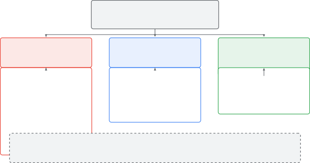
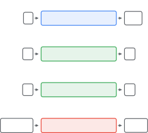
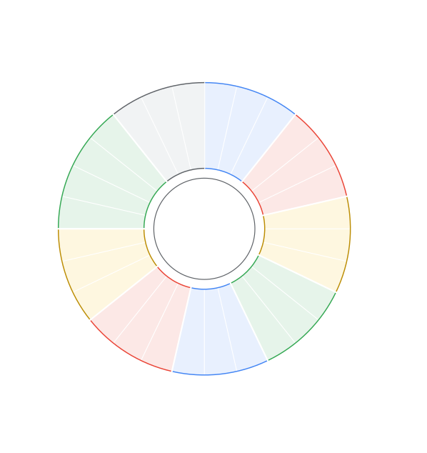

# Joint and Cross-Modal Video-Audio Generation and Editing: A Unified Formulation and Design Taxonomy

Abhinav Sharma, Sai Karthik Navuluru, Wang Wei, Daksh Dangi,
Xiangbo Gao, Li Li, Bo Ni, Vardhan Dongre, Junda Wu, Xiyang Hu,
Jiuxiang Gu, Seunghyun Yoon, Tong Yu, Chien Van Nguyen,
Mohamed Elmoghany, Nedim Lipka, Hoda Eldardiry, Hongjie Chen,
Tyler Derr, Thien Huu Nguyen, Zhengzhong Tu, Nesreen K. Ahmed,
Franck Dernoncourt, Ryan A. Rossi University of Massachusetts Amherst
 University of Texas at Dallas  Virginia Tech  Texas A&M University
 University of Southern California  Vanderbilt University
 University of Illinois Urbana-Champaign  Adobe Research
 Arizona State University  University of Oregon  Stanford University
 Dolby Laboratories  Cisco

###### Abstract

Video and audio are perceived together, yet most generative models treat
them in isolation. We examine methods that model the two modalities
jointly, generate one from the other, or edit them in a coupled manner,
organized around a single question: how is the output kept coherent
across modalities in time and semantics? A unified formulation casts
joint generation, cross-modal generation, and joint editing as three
problems defined on a single distribution over audio-visual pairs, and a
taxonomy compares methods along five design axes. To our knowledge, this
is the first overview to systematically taxonomize joint audio-visual
_editing_, which we map as nine edit categories spanning 28 edit types.
We describe methods, datasets, and metrics for each setting and close
with the open problems we view as most consequential.

## 1 Introduction

Sound and picture are perceived as a single percept: a door closing and
its impact sound coincide, and even a small offset reads as an error.
Generative models of video and audio, however, developed largely in
isolation, so two strong unimodal capabilities, combined naively,
produce streams that do not agree. A growing body of work instead treats
the pair as coupled, in three settings grouped by _output_: (i) both
modalities generated together; (ii) one generated from the other, as in
soundtracking a silent video; and (iii) an existing pair edited so a
change in one modality propagates to the other. All three share one
demand—coherence across modalities in time and semantics—which we take
as our organizing principle.

##### Contributions.

Existing overviews treat video generation, audio generation, or
audio-visual understanding in isolation Qin et al. (2026). This work
covers generation and editing of the two streams as a coupled pair. Our
contributions are summarized as follows:

- •
  First systematic taxonomy of joint audio-visual editing. To our
  knowledge, this is the first overview to systematically taxonomize the
  editing of video and audio as a coupled pair, in which an edit
  specified in one modality must propagate to the other; we map this
  space as a taxonomy of nine categories and 28 edit types, each with
  representative operations and use cases (Table 4, Section 5).
- •
  A unified formulation and five-axis design taxonomy. Section 2 casts
  joint generation, cross-modal generation, and joint editing as three
  problems over one distribution on audio-visual pairs, and Table 1
  organizes the literature along five design axes.
- •
  Open problems grounded in the formulation. Section 13 states the open
  problems—long-horizon coherence, fine-grained control, physical
  plausibility, and evaluation—as instances of one underlying challenge:
  raising cross-modal alignment while preserving per-stream quality.

##### Scope.

A method is in scope when at least one of video or audio is among its
outputs and the other appears in its pipeline; single-modality
generation and audio-visual understanding without a generative or
editing component are excluded. The closest overlapping overview, a
concurrent review of audio-visual intelligence in foundation models Qin
et al. (2026), treats neither editing nor our organizing device.
Figure 1 maps the organization.



Figure 1: Roadmap of this work. Methods are grouped by the _output_ they
produce (Section 2): joint editing outputs a modified pair, joint
generation outputs both streams, and cross-modal generation exactly
one—the signals a method consumes vary freely within each family. The
listed subsections cover each family; the gray strip collects the
cross-cutting sections that apply to all three. Color marks the family
(red editing, blue joint, green cross-modal) and is redundant with
position and headings. Notation follows Table 2.

[TABLE]

Table 1: Complementary taxonomy of joint audio-video methods along five
complementary design axes: generation strategy (§4.1) captures how the
two modalities are produced; audio representation (§4.2) describes the
latent space in which audio is generated; video representation (§4.3)
describes the latent space in which video is generated; alignment
enforcement (§4.4) identifies the stage at which audio-video alignment
is imposed; and pretraining reuse (§4.5) characterizes the source of
model weights. A check mark (✓) indicates that a method falls under the
corresponding category within each axis. For the partially closed system
Wan 2.5, the axes whose design is not publicly disclosed (alignment
enforcement and pretraining reuse) are left without a mark.

## 2 Problem Formulation and Notation

##### Notation.

A video is $`v\in\mathbb{R}^{T_{v}\times H\times W\times 3}`$, where
$`T_{v}`$ is the number of frames and $`H,W`$ are the spatial
dimensions. An audio signal is $`a\in\mathbb{R}^{T_{a}}`$, where
$`T_{a}`$ is the number of audio samples. A condition is $`c`$, with
subscripts for specific modalities: $`c_{t}`$ for text, $`c_{i}`$ for an
image, $`c_{s}`$ for speech, and $`c_{m}`$ for music. A generative model
is $`p_{\theta}`$ with parameters $`\theta`$. Generated outputs are
written $`\hat{v},\hat{a}`$, and edited outputs
$`v^{\prime},a^{\prime}`$. We write $`v^{(t)}`$ for the $`t`$-th frame
and use $`\phi_{v}`$ and $`\phi_{a}`$ for encoders that map video and
audio into latent or shared representation spaces, with
$`z_{v}=\phi_{v}(v)`$ and $`z_{a}=\phi_{a}(a)`$. Table 2 collects the
symbols used throughout this work.

|                                                    |                                                     |
| -------------------------------------------------- | --------------------------------------------------- |
| Symbol                                             | Meaning                                             |
| $`v\in\mathbb{R}^{T_{v}\times H\times W\times 3}`$ | video, $`T_{v}`$ frames of size $`H\times W`$       |
| $`a\in\mathbb{R}^{T_{a}}`$                         | audio signal of $`T_{a}`$ samples                   |
| $`x=(v,a)`$                                        | audio-visual clip                                   |
| $`\mathcal{X}=\mathcal{V}\times\mathcal{A}`$       | space of audio-visual clips                         |
| $`\mathrm{fps},\mathrm{sr}`$                       | frame rate, audio sampling rate                     |
| $`\tau`$                                           | shared clip duration                                |
| $`c`$                                              | condition signal                                    |
| $`c_{t},c_{i},c_{s},c_{m}`$                        | text, image, speech, music                          |
| $`p_{\theta}`$                                     | generative model with parameters $`\theta`$         |
| $`\theta_{v},\theta_{a},\theta_{\times}`$          | modality-specific and cross-modal parameters (§4.1) |
| $`\Gamma`$                                         | sampling procedure (§4)                             |
| $`\lambda`$                                        | guidance weight (§4.1.5)                            |
| $`\hat{v},\hat{a}`$                                | generated video, audio                              |
| $`v^{\prime},a^{\prime}`$                          | edited video, audio                                 |
| $`\phi_{v},\phi_{a}`$                              | video, audio encoders                               |
| $`z_{v},z_{a}`$                                    | video, audio latents (Def. 2)                       |
| $`\psi_{v},\psi_{a}`$                              | video, audio decoders                               |
| $`\mathcal{S}(v,a)`$                               | alignment score (Def. 1)                            |
| $`\delta`$                                         | synchronization tolerance (Def. 3)                  |
| $`e`$                                              | edit instruction                                    |
| $`\mathcal{D}`$                                    | dataset (Def. 4)                                    |
| $`v^{(t)}`$                                        | $`t`$-th video frame                                |

Table 2: Notation. We summarize the symbols used throughout this work.
Subscripts denote modality and primes denote edited outputs.

An audio-visual clip is a pair $`x=(v,a)`$ with
$`v\in\mathbb{R}^{T_{v}\times H\times W\times 3}`$ and
$`a\in\mathbb{R}^{T_{a}}`$ sharing a time interval $`[0,\tau]`$, so
frame and sample index refer to the same physical time;
$`\mathcal{X}=\mathcal{V}\times\mathcal{A}`$ is the space of such pairs.

###### Definition 1 (Audio-visual correspondence).

$`(v,a)`$ corresponds when the streams agree _semantically_—the sources
visible are the sources audible—and _temporally_—each acoustic event is
localized to the frames of its visual cause: for an alignment score
$`\mathcal{S}:\mathcal{X}\to\mathbb{R}`$, natural clips satisfy
$`\mathcal{S}(v,a)\geq\mathcal{S}(v,\tilde{a})`$ for mismatched or
time-shifted $`\tilde{a}`$.

Definition 1 is what separates the joint and cross-modal setting from
two independent unimodal problems. A model that produces a high-quality
$`\hat{v}`$ and a high-quality $`\hat{a}`$ but assigns them low
$`\mathcal{S}(\hat{v},\hat{a})`$ is perceived as broken, even when each
stream is convincing on its own. The methods in Sections 5 through 7
differ primarily in how they raise $`\mathcal{S}`$ while keeping the
per-modality quality high.

###### Definition 2 (Latent representations).

Methods typically operate on $`z_{v}=\phi_{v}(v)`$ and
$`z_{a}=\phi_{a}(a)`$ with decoders $`\psi_{v},\psi_{a}`$;
$`p_{\theta}`$ is defined over $`(z_{v},z_{a})`$, and
$`\phi_{v},\phi_{a}`$ fix the coupling space.

###### Problem 1 (Joint audio-visual generation).

Given $`c`$ (possibly $`\emptyset`$), learn $`p_{\theta}(v,a\mid c)`$
whose samples are faithful to $`c`$, of high per-modality quality, and
of high $`\mathcal{S}(\hat{v},\hat{a})`$.

The defining requirement in Problem 1 is that the parameterization of
$`p_{\theta}(v,a\mid c)`$ encode the dependency between $`v`$ and $`a`$.
A model that factorizes as $`p_{\theta}(v\mid c)\,p_{\theta}(a\mid c)`$
with no further coupling treats the two modalities as conditionally
independent given $`c`$ and cannot, in general, raise $`\mathcal{S}`$
beyond what $`c`$ already determines. Joint methods therefore introduce
coupling either in the architecture, through shared parameters or
cross-modal attention, or in the objective, through a term that rewards
correspondence.

###### Problem 2 (Cross-modal generation).

Given one modality, generate the other so that the pair corresponds:
video-to-audio learns $`p_{\theta}(a\mid v)`$, audio-to-video learns
$`p_{\theta}(v\mid a)`$.

Problem 2 differs from Problem 1 in what is given. In the joint setting
both modalities are outputs of a single distribution; in the cross-modal
setting one of them is the condition. The contrast is concrete: a joint
text-to-audio-visual model given $`c_{t}=`$ “footsteps on gravel”
synthesizes both the visual scene and the footstep sounds, whereas a
cross-modal video-to-audio model given a silent video $`v`$ of a person
walking on gravel synthesizes only $`\hat{a}`$, with the footstep sounds
aligned to the frames in which the foot contacts the ground.

###### Problem 3 (Joint audio-visual editing).

Given $`(v,a)`$ and an instruction $`e`$ (text, mask, style, or
identity), sample
$`(v^{\prime},a^{\prime})\sim p_{\theta}(v^{\prime},a^{\prime}\mid v,a,e)`$
such that the edit is applied, reflected in both modalities so
$`\mathcal{S}(v^{\prime},a^{\prime})`$ stays high, and content outside
the targeted region is preserved.

Problem 3 adds two constraints absent from generation: the propagation
of an edit across modalities, and the preservation of untouched content.
As an example, given a clip of a person speaking and the instruction
$`e=`$ “change the speaker’s voice to a child’s voice,” the model must
produce $`a^{\prime}`$ with the new voice and $`v^{\prime}`$ in which
the lip motion is consistent with $`a^{\prime}`$, while leaving the
background and identity intact. Editing thus inherits the correspondence
requirement of generation and adds a fidelity-to-input requirement on
top of it. Figure 2 summarizes the three problems as mappings from
inputs to outputs, Table 3 instantiates them task by task, and Table 2
collects the notation.



Figure 2: The three problem settings as input-to-output mappings, in the
notation of Table 2: what varies across rows is only which signals are
given (left) and which are generated (right). Joint generation outputs
both streams from a condition $`c`$ (which may be empty, text $`c_{t}`$,
an image $`c_{i}`$, speech $`c_{s}`$, or music $`c_{m}`$); cross-modal
generation outputs exactly one stream given the other; joint editing
outputs a modified pair given a clip and an edit instruction $`e`$. Row
color marks the family as in Figure 1. Every setting must satisfy the
correspondence requirement of Definition 1.

|                              |                 |                           |                                                 |                          |         |
| ---------------------------- | --------------- | ------------------------- | ----------------------------------------------- | ------------------------ | ------- |
| Task                         | Given           | Generated                 | Learned Distribution                            | Primary Correspondence   | Section |
| Unconditional joint          | $`\emptyset`$   | $`v,a`$                   | $`p_{\theta}(v,a)`$                             | semantic $`+`$ temporal  | §6.1    |
| Text-to-audio-video          | $`c_{t}`$       | $`v,a`$                   | $`p_{\theta}(v,a\mid c_{t})`$                   | semantic $`+`$ temporal  | §6.2    |
| Image-to-audio-video         | $`c_{i}`$       | $`v,a`$                   | $`p_{\theta}(v,a\mid c_{i})`$                   | semantic $`+`$ temporal  | §6.3    |
| Talking-head / speech-driven | $`c_{i},c_{s}`$ | $`v,a^{\dagger}`$         | $`p_{\theta}(v,a\mid c_{i},c_{s})`$             | lip-sync                 | §6.4    |
| Music-driven video           | $`c_{m}`$       | $`v`$                     | $`p_{\theta}(v\mid c_{m})`$                     | beat / rhythm            | §7.2    |
| Video-to-audio / Foley       | $`v`$           | $`a`$                     | $`p_{\theta}(a\mid v)`$                         | temporal (onset)         | §7.1    |
| Audio-to-video               | $`a`$           | $`v`$                     | $`p_{\theta}(v\mid a)`$                         | temporal                 | §7.2    |
| Speech-to-video              | $`c_{s}`$       | $`v`$                     | $`p_{\theta}(v\mid c_{s})`$                     | lip-sync                 | §7.3    |
| Joint editing                | $`v,a,e`$       | $`v^{\prime},a^{\prime}`$ | $`p_{\theta}(v^{\prime},a^{\prime}\mid v,a,e)`$ | preserve $`+`$ propagate | §5      |
| Dubbing / re-voicing         | $`v,a,e`$       | $`v^{\prime},a^{\prime}`$ | $`p_{\theta}(v^{\prime},a^{\prime}\mid v,a,e)`$ | lip-sync                 | §5.2    |

Table 3: A unified view of the tasks covered. Each task is an instance
of Problems 1 through 3: it models the joint distribution over
audio-visual pairs or one of its conditionals. Given lists the observed
signals, Generated the produced signals, and Primary Correspondence the
form of audio-visual agreement (Def. 1) that dominates evaluation. The
table doubles as a map from a task to the section that treats it.
^(†)For talking-head generation the model re-synthesizes the speech
track: $`c_{s}`$ conditions the output and $`\hat{a}`$ is emitted
synchronized to $`\hat{v}`$, so speech appears as both condition and
output.

## 3 Background and Preliminaries

This section introduces the building blocks that joint and cross-modal
methods inherit from the unimodal setting: the generative model families
that instantiate $`p_{\theta}`$, the representations that realize
Definition 2 for each modality, and the conditioning mechanisms that
inject $`c`$.

### 3.1 Generative Modeling Foundations

The methods we cover instantiate a generative model $`p_{\theta}`$ that
approximates a target distribution over video, audio, or both. Four
families recur: variational autoencoders Kingma and Welling (2014),
generative adversarial networks Goodfellow et al. (2014), autoregressive
models van den Oord et al. (2016), and diffusion and flow-matching
models Ho et al. (2020); Lipman et al. (2023). Each corresponds to a
different parameterization of $`p_{\theta}`$ and a different training
objective, and each has been adapted to the joint and cross-modal
setting in its own way. Recent work has converged on diffusion and
flow-matching backbones for both video and audio synthesis, and a large
fraction of the methods in later sections build directly on top of one.
We therefore use the denoising formulation as the running example: a
forward process gradually corrupts a clean latent $`z_{0}`$ into noise,
and the model learns to reverse it, optionally conditioned on $`c`$, by
predicting the noise or the velocity at each step.

### 3.2 Video Representations

Several representational spaces realize $`\phi_{v}`$ in Definition 2,
and the choice has direct consequences for the design of $`p_{\theta}`$.
Pixel-space models operate on $`v`$ directly. Latent-space models,
following the latent diffusion recipe Rombach et al. (2022), first
encode $`v`$ into a lower-dimensional latent $`z_{v}=\phi_{v}(v)`$ and
model the distribution over $`z_{v}`$ rather than over raw pixels, using
either a 2D autoencoder applied per frame with a separate temporal
module, or a 3D autoencoder that compresses space and time jointly.
Token-based representations take a further step and discretize $`v`$
into a sequence of tokens, which is what enables autoregressive
modeling. The three representations trade off fidelity, computational
cost, and compatibility with the audio representation used alongside
them, with the last factor mattering most in joint models that couple
$`v`$ and $`a`$ in a shared space.

### 3.3 Audio Representations

An audio signal admits an analogous set of choices for $`\phi_{a}`$.
Waveform-domain models operate on $`a`$ directly. Spectrogram-domain
models first transform $`a`$ into a time-frequency representation such
as a mel spectrogram and model that image-like array, relying on a
neural vocoder to recover the waveform Kong et al. (2020). Latent audio
codecs Défossez et al. (2022) encode $`a`$ into a sequence of discrete
or continuous tokens and decode back to the waveform, playing a role
analogous to latent video encoders. As with video, the representation
chosen for audio interacts with the one chosen for video in joint
models, since the two streams must be aligned in time and, for unified
backbones, processed by a shared network. A recurring difficulty is the
mismatch in native rate between the two modalities, since audio is
sampled far more densely in time than video is, and the latent rates
must be reconciled for the streams to be coupled frame by frame.

### 3.4 Conditioning Mechanisms

Once the representations are fixed, a conditioning signal $`c`$ enters
the generative model through one of several mechanisms. Cross-attention
injects $`c`$ into intermediate features of the network, giving
fine-grained, position-dependent control. Adaptive normalization
modulates feature statistics based on $`c`$, providing a lighter and
coarser form of control. Concatenation appends an encoded $`c`$ to the
input or to intermediate features. Classifier-free guidance Ho and
Salimans (2022) steers samples toward $`c`$ at inference time by mixing
conditional and unconditional predictions. The form of $`c`$ together
with the mechanism through which it is injected determines how tightly
the output follows the condition, and in the joint setting the same
mechanisms are reused to let one modality condition the other.

### 3.5 Audio-Visual Correspondence in Practice

Definition 1 states correspondence as an abstract property; in practice
it is operationalized through learned encoders that map a clip to a
score $`\mathcal{S}(v,a)`$. Contrastive audio-visual encoders trained to
pull matched pairs together and push mismatched pairs apart, of which
ImageBind Girdhar et al. (2023) is a widely reused instance, provide
such a score—temporally focused variants additionally treat time-shifted
pairs as negatives Luo et al. (2023)—and several methods reuse these
encoders either as a training signal or as a guidance term at inference.
The remainder of this work is structured around how methods raise
$`\mathcal{S}`$ while keeping per-modality quality high, since this is
the property that distinguishes the joint and cross-modal problem from
two unimodal ones.

## 4 A Five-Axis Design Taxonomy

Methods that solve Problems 1 through 3 differ along a small number of
design axes that, taken together, account for most of the variation in
the literature. We propose a taxonomy that categorizes methods along
five such axes, summarized in Table 1: the generation strategy, the
audio representation, the video representation, the
alignment-enforcement mechanism, and the reuse of pretrained weights.

Formally, a method is characterized by a tuple
$`(\phi,\theta,\mathcal{L},\Gamma)`$: the encoders
$`\phi=(\phi_{v},\phi_{a})`$ of Definition 2, which fix the spaces
$`\mathcal{Z}_{v},\mathcal{Z}_{a}`$ in which generation occurs; the
parameters $`\theta`$ of the model $`p_{\theta}`$ acting on those
spaces; the training objective $`\mathcal{L}`$ used to train $`\theta`$;
and the sampling procedure $`\Gamma`$ that draws
$`(\hat{z}_{v},\hat{z}_{a})`$ from $`p_{\theta}`$. The five axes
constrain different components of this tuple. The generation strategy
(§4.1) constrains how $`\theta`$ decomposes across the two streams; the
audio and video representations (§4.2, §4.3) constrain the codomains of
$`\phi_{a}`$ and $`\phi_{v}`$; the alignment-enforcement mechanism
(§4.4) constrains the stage at which correspondence pressure is applied,
which may be in $`\theta`$, in the training objective $`\mathcal{L}`$,
or in $`\Gamma`$; and pretraining reuse (§4.5) constrains the
initialization of $`\theta`$. Because the axes constrain different
components, a method makes a choice on each, and two choices on
different axes are not alternatives to one another.

The axes are complementary rather than orthogonal. Each constrains a
different component, so a method makes a choice along every axis, but
the choices are not fully independent: a guidance-based strategy
requires two frozen unimodal models and therefore entails dual
pretraining, and pretraining reuse interacts with the representation
axes in turn—every method covered here that reuses one or two pretrained
backbones inherits its representation from them, and the backbones
reused are without exception continuous-latent diffusion models, so the
discrete-token cells can be filled only by training from scratch, the
cost of Section 13, or by coupling token-based unimodal generators, a
route no method we cover takes. Nor is every combination occupied—the
empty and near-empty cells of Table 1 are themselves informative, and we
return to them in Section 13. We treat each axis in turn.

### 4.1 Generation Strategy

The generation strategy is how the two modalities are produced relative
to each other, that is, how the dependency required by Problem 1 is
realized in the computation graph.

#### 4.1.1 Single-Tower

Formally $`\theta_{v}=\theta_{a}=\theta_{\times}=\theta`$: one network
is applied to the concatenated sequence $`[z_{v};z_{a}]`$, so every
parameter sees both streams and the dependency is carried by the
parameters themselves. A single network processes both modalities
through shared parameters, with the two streams concatenated or
interleaved into one sequence. Coupling is automatic, since every layer
sees both modalities, at the cost of a representation that must serve
both. Single-tower designs are the basis of AV-DiT Wang et al. (2024b)
and MM-LDM Sun et al. (2024), and of recent open systems such as
MOVA SII-OpenMOSS Team (2026), Apollo (formerly Klear) Wang et al.
(2026), and 3MDiT Li et al. (2025).

#### 4.1.2 Dual-Tower

Formally $`\theta=(\theta_{v},\theta_{a},\theta_{\times})`$ with
$`\theta_{v}\cap\theta_{a}=\emptyset`$: each stream is processed by its
own tower, and information is exchanged only through the cross-modal
parameters $`\theta_{\times}`$, so the dependency between $`v`$ and
$`a`$ is carried by $`\theta_{\times}`$ alone. Two modality-specific
towers run in parallel and exchange information through cross-modal
connections such as cross-attention or bridge layers. The towers retain
modality-specific inductive biases while the connections carry the
dependency between $`v`$ and $`a`$. This is the most common choice in
the literature, adopted by MM-Diffusion Ruan et al. (2023), JavisDiT Liu
et al. (2026a), BridgeDiT Guan et al. (2025), Ovi Low et al. (2025),
UniAVGen Zhang et al. (2025), and LTX-2 HaCohen et al. (2026), among
others.

#### 4.1.3 Cascaded

Formally
$`p_{\theta}(v,a\mid c)=p_{\theta_{1}}(v\mid c)\,p_{\theta_{2}}(a\mid v,c)`$,
or the symmetric factorization, with disjoint $`\theta_{1},\theta_{2}`$
and sequential sampling; the coupling is carried by the conditioning
path rather than by shared parameters. The modalities are produced in
sequence, with the second conditioned on the first, which reduces joint
generation to a generation step followed by a cross-modal step. Movie
Gen Polyak et al. (2024) is the representative instance, generating
video from text and then audio from the generated video.

#### 4.1.4 Unified-Token

Formally $`\phi_{v},\phi_{a}`$ are quantizers into finite vocabularies,
the pair is serialized into a single sequence $`s=\pi(z_{v},z_{a})`$,
and $`p_{\theta}(s)=\prod_{t}p_{\theta}(s_{t}\mid s_{<t})`$ or a masked
variant. Both modalities are discretized into tokens and modeled as a
single sequence by an autoregressive or masked transformer, so the
dependency is captured by the sequence model and the same backbone can
serve multiple tasks by reordering inputs and outputs. No joint method
covered here adopts this strategy. UniForm Zhao et al. (2025) comes
closest—it serializes the two modalities into one sequence and shares a
denoiser across tasks distinguished by task tokens—but it does so over
continuous VAE latents with a diffusion objective rather than over
discrete vocabularies, which places it in the single-tower category. The
unified-token cell is thus unoccupied among joint models, in contrast to
the unimodal literature where token-based video and audio generation are
established, an asymmetry we return to in Section 13.

#### 4.1.5 Guidance-Based

Formally the two frozen models are coupled only in the sampler
$`\Gamma`$, for example by adjusting the score of the pair
$`z=(z_{v},z_{a})`$ as
$`\nabla_{z}\log p_{\theta}(z\mid c)+\lambda\,\nabla_{z}\mathcal{S}\big(\psi_{v}(z_{v}),\psi_{a}(z_{a})\big)`$
with guidance weight $`\lambda`$; $`\theta`$ is never updated jointly.
Two pretrained unimodal models are frozen and coupled only at inference,
through a guidance term such as a classifier or an alignment score that
nudges the two samples toward mutual consistency. No joint training is
required, which trades fidelity for flexibility. Seeing-and-Hearing Xing
et al. (2024a) couples two frozen generators through an
ImageBind Girdhar et al. (2023) alignment score, and MMDisCo Hayakawa
et al. (2025) through a trained discriminator applied as sampling
guidance.

### 4.2 Audio Representation

The audio representation is the realization of $`\phi_{a}`$ in
Definition 2, and it fixes the space in which audio is generated. We
discuss each choice in turn.

#### 4.2.1 Continuous Latent

A neural audio autoencoder maps the waveform to a compact continuous
latent in which a diffusion or flow model is trained. Writing the
encoder as $`\phi_{a}`$ and its decoder as $`\psi_{a}`$ (Table 2), the
autoencoder is trained so that

```math
z_{a}=\phi_{a}(a)\in\mathbb{R}^{T_{z}\times d},\qquad\psi_{a}(z_{a})\approx a, \tag{1}
```

with a reconstruction loss plus, in the variational form Kingma and
Welling (2014), a KL regularizer on the encoder’s posterior over
$`z_{a}`$; here $`T_{z}\ll T_{a}`$ is the compressed length and $`d`$
the channel width. Generation then follows latent diffusion Ho et al.
(2020); Rombach et al. (2022): at diffusion step $`u`$, noised latents
$`z_{u}=\sqrt{\bar{\alpha}_{u}}\,z_{a}+\sqrt{1-\bar{\alpha}_{u}}\,\epsilon`$
with $`\epsilon\sim\mathcal{N}(0,I)`$ are drawn along a noise schedule
$`\bar{\alpha}_{u}`$, a network $`\epsilon_{\theta}`$ is trained to
minimize

```math
\mathcal{L}\;=\;\mathbb{E}_{z_{a},\,u,\,\epsilon}\,\big\lVert\epsilon-\epsilon_{\theta}(z_{u},u,c)\big\rVert_{2}^{2}, \tag{2}
```

and sampling denoises from pure noise to $`\hat{z}_{a}`$, decoded as
$`\hat{a}=\psi_{a}(\hat{z}_{a})`$. This is the dominant choice in recent
joint models: it is used by twenty-eight of the twenty-nine methods in
Table 1, spanning early dual-tower models such as CoDi Tang et al.
(2023) through recent systems including LTX-2 HaCohen et al. (2026) and
MOVA SII-OpenMOSS Team (2026).

#### 4.2.2 Discrete Tokens

A neural codec instead quantizes the latent: a codebook
$`\mathcal{C}=\{e_{1},\dots,e_{K}\}\subset\mathbb{R}^{d}`$ replaces each
latent frame $`z_{a}^{(i)}`$ by its nearest entry,

```math
q\big(z_{a}^{(i)}\big)=e_{k^{\ast}},\qquad k^{\ast}=\arg\min\nolimits_{k}\big\lVert z_{a}^{(i)}-e_{k}\big\rVert_{2}, \tag{3}
```

trained with codebook and commitment terms
$`\lVert\mathrm{sg}[z_{a}^{(i)}]-e_{k^{\ast}}\rVert_{2}^{2}+\beta\,\lVert z_{a}^{(i)}-\mathrm{sg}[e_{k^{\ast}}]\rVert_{2}^{2}`$
under a straight-through gradient, where $`\mathrm{sg}[\cdot]`$ denotes
stop-gradient van den Oord et al. (2017); practical audio codecs
quantize residually over a stack of such codebooks, typically replacing
the codebook term with an exponential-moving-average update of the
selected entries Défossez et al. (2022). The resulting index sequence
supports autoregressive or masked modeling and a shared treatment with
tokenized video. No joint method covered here, however, generates audio
as codec tokens—UniForm Zhao et al. (2025) serializes the modalities
into one sequence but over continuous latents (§4.2.1)—leaving this
cell, like the waveform, unoccupied.

#### 4.2.3 Mel-Spectrogram

Audio is represented as a mel spectrogram, obtained from the short-time
Fourier transform through a mel filterbank $`M`$,

```math
m\;=\;\log\big(M\,\lvert\mathrm{STFT}(a)\rvert^{2}\big)\in\mathbb{R}^{F\times T_{m}}, \tag{4}
```

with $`F`$ mel bins and $`T_{m}`$ spectral frames, and treated as an
image-like array, which makes image generative machinery directly
applicable but requires a separate vocoder to recover the waveform from
a generated $`\hat{m}`$. MM-Diffusion Ruan et al. (2023) is the
representative instance among joint models.

#### 4.2.4 Waveform

The model operates on the raw waveform $`a\in\mathbb{R}^{T_{a}}`$
directly, preserving full fidelity at the cost of modeling a very long
and densely sampled sequence. No method we cover generates audio
directly in the waveform domain, a consequence of the sequence lengths
involved at audio sampling rates, an unoccupied corner we return to in
Section 13.

### 4.3 Video Representation

The video representation is the realization of $`\phi_{v}`$, with the
same fidelity, cost, and compatibility trade-offs; the constructions
mirror Equations 1–3 with $`v`$ in place of $`a`$, and we discuss each
choice in turn.

#### 4.3.1 3D-VAE

A 3D autoencoder compresses space and time jointly,

```math
z_{v}=\phi_{v}(v)\in\mathbb{R}^{\,T_{v}/s_{t}\,\times\,H/s_{s}\,\times\,W/s_{s}\,\times\,d_{v}}, \tag{5}
```

with temporal stride $`s_{t}`$, spatial stride $`s_{s}`$, and channel
width $`d_{v}`$, producing a spatio-temporal latent in which a single
backbone models the whole clip under the objective of Equation 2. This
is the dominant choice in recent video and joint models. Nineteen of the
methods in Table 1 use it, including Movie Gen Polyak et al. (2024),
JavisDiT Liu et al. (2026a), Ovi Low et al. (2025), LTX-2 HaCohen et al.
(2026), Apollo Wang et al. (2026), and—through the pretrained Open-Sora
autoencoder—UniForm Zhao et al. (2025).

#### 4.3.2 2D-VAE plus Temporal

A per-frame 2D autoencoder compresses each frame independently,
$`z_{v}^{(t)}=\phi_{v,\mathrm{2D}}\big(v^{(t)}\big)`$ for
$`t=1,\dots,T_{v}`$, and a separate temporal module models motion across
the stacked latent frames
$`\big(z_{v}^{(1)},\dots,z_{v}^{(T_{v})}\big)`$. CoDi Tang et al.
(2023), AV-DiT Wang et al. (2024b), SVG Ishii et al. (2024), and
Animate-and-Sound Wang et al. (2025c) take this route.

#### 4.3.3 Discrete Tokens

Video is quantized into discrete tokens by the construction of
Equation 3 applied to spatio-temporal patches, enabling autoregressive
or masked modeling and a shared sequence with tokenized audio. No joint
method covered here takes this route—UniForm Zhao et al. (2025) fuses
the streams as continuous latent tokens (§4.3.1)—mirroring the
unoccupied discrete-audio cell.

#### 4.3.4 Pixel

The model operates directly on pixels
$`v\in\mathbb{R}^{T_{v}\times H\times W\times 3}`$, with no learned
compression of the visual stream. MM-Diffusion Ruan et al. (2023) is the
sole pixel-space instance, reflecting the resolutions feasible when the
work appeared.

### 4.4 Alignment Enforcement

Alignment enforcement is how a method raises the alignment score
$`\mathcal{S}`$ of Definition 1, that is, the stage of the pipeline at
which correspondence between the two streams is imposed (see Section 8).

#### 4.4.1 Cross-Attention

Cross-attention layers let the audio stream attend to the video stream
and vice versa, carrying alignment information between the two towers or
branches—an architectural mechanism. It is the dominant mechanism, used
by nineteen methods including MM-Diffusion Ruan et al. (2023),
BridgeDiT Guan et al. (2025), Ovi Low et al. (2025), and OmniForcing Su
et al. (2026).

#### 4.4.2 Shared Positional Encoding

A shared positional or rotary encoding Su et al. (2021) ties the two
streams to a common time axis, so that tokens at the same physical time
are forced into correspondence at the level of position—likewise an
architectural mechanism. ALIVE Guo et al. (2026b) and JavisDiT++ Liu
et al. (2026b) use temporally aligned rotary encodings for frame-level
correspondence; AV-DiT Wang et al. (2024b), Apollo Wang et al. (2026),
and 3MDiT Li et al. (2025) share positional information across streams.

#### 4.4.3 Discriminator

An auxiliary joint discriminator is trained to score whether a pair is
jointly real, and its gradient is applied as guidance at sampling time
while the base generators stay frozen—an inference-time mechanism rather
than a training objective for the generators. MMDisCo Hayakawa et al.
(2025), a trained discriminator applied as sampling guidance, is the
only instance we cover.

#### 4.4.4 Classifier Guidance

An external classifier or alignment model guides sampling toward
consistent pairs at inference, in the manner of classifier guidance for
diffusion models Dhariwal and Nichol (2021), without changing the
generator’s weights—an inference-time mechanism. Seeing-and-Hearing Xing
et al. (2024a) is the representative case.

#### 4.4.5 Explicit Prior

A separately estimated spatio-temporal prior is injected to align the
streams, decoupling the synchronization signal from the generators—an
architectural or an external mechanism, depending on whether the prior
is learned jointly or estimated separately. JavisDiT Liu et al. (2026a)
estimates a hierarchical spatio-temporal prior for this purpose,
retained in JavisDiT++ Liu et al. (2026b).

### 4.5 Pretraining Reuse

The final axis is the source of the model’s weights, which strongly
affects data and compute cost (see Section 13).

#### 4.5.1 From-Scratch

The model is trained from random initialization on paired audio-visual
data. Twelve methods train this way, including MM-Diffusion Ruan et al.
(2023), Movie Gen Polyak et al. (2024), JavisDiT Liu et al. (2026a),
Ovi Low et al. (2025), LTX-2 HaCohen et al. (2026), and
MOVA SII-OpenMOSS Team (2026).

#### 4.5.2 Single Pretrained

One pretrained backbone, typically a video model, is reused and the
other modality is added on top. ALIVE Guo et al. (2026b), Hallo-Live Li
et al. (2026), and OmniForcing Su et al. (2026) build on one pretrained
backbone.

#### 4.5.3 Dual Pretrained

Two pretrained backbones, one per modality, are reused and coupled, so
that joint training only learns the connections. CoDi Tang et al.
(2023), Seeing-and-Hearing Xing et al. (2024a), SVG Ishii et al. (2024),
BridgeDiT Guan et al. (2025), and CCL Ma et al. (2026) couple two
pretrained models.

## 5 Joint Audio-Visual Editing

Joint editing outputs a modified pair,
$`(v^{\prime},a^{\prime})\sim p_{\theta}(v^{\prime},a^{\prime}\mid v,a,e)`$
(Problem 3), propagating the edit across modalities while preserving
untouched content.

### 5.1 The Space of Audio-Visual Edits

This section mirrors Table 4 one to one: nine categories of edit types
with representative operations and use cases (rendered radially in
Figure 3). One-stream edits retain the other stream unchanged.
Development concentrates in joint content, synchronization, and
text-driven control; the empty cells are the research agenda.



Figure 3: The edit-type taxonomy as a wheel. The nine categories of
Table 4 with their edit types arranged radially, in the same order and
colors as the table; sector size is proportional to the number of edit
types. Representative operations and example use cases for each type are
enumerated in Table 4.

|                       |                      |                   |                                                            |                                               |
| --------------------- | -------------------- | ----------------- | ---------------------------------------------------------- | --------------------------------------------- |
| Category              | Edit/Gen. Type       | Modality          | Representative Edits                                       | Example Use Case                              |
| Synchronization       | Lip Sync             | A+V               | Lip sync correction, dubbing alignment, viseme generation  | Aligning dubbed audio to mouth motion         |
|                       | AV Alignment         | A+V               | Foley alignment, beat alignment, event sync                | Matching footsteps to visual steps            |
|                       | Re-timing            | A+V               | Joint time stretch, slow motion, speed ramping             | Slowing a scene with pitch-preserved audio    |
| Joint Content         | Joint Insertion      | A+V               | Object with sound, character with voice, ambience addition | Adding a passing car with engine noise        |
|                       | Joint Removal        | A+V               | Object removal with sound suppression, character removal   | Removing a person and their voice             |
|                       | Joint Replacement    | A+V               | Object swap, scene swap, character swap                    | Replacing a dog with a cat (visual + sound)   |
| Cross-Modal Transfer  | Audio to Video       | A$`\rightarrow`$V | Talking head from speech, music-driven video               | Animating a portrait from voice               |
|                       | Video to Audio       | V$`\rightarrow`$A | Foley from video, ambience from scene, music from mood     | Generating sound effects from silent video    |
|                       | Bidirectional        | A+V               | AV style transfer, joint enhancement, coupled denoising    | Stylizing both modalities to a reference      |
| Identity & Perf.      | Character Identity   | A+V               | Face swap with voice swap, aging, full replacement         | Replacing an actor in face and voice          |
|                       | Performance Transfer | A+V               | Facial reenactment, gesture transfer, puppetry             | Driving an avatar with a real performance     |
|                       | Expression           | A+V               | Emotion editing across face and voice, energy, persona     | Making a sad scene appear joyful              |
| Scene & Environment   | Setting              | A+V               | Location transfer, time-of-day, weather                    | Changing day to night with night ambience     |
|                       | Acoustic Coupling    | V$`\rightarrow`$A | Reverb to visual space, occlusion, acoustic shadows        | Matching reverb to a depicted cathedral       |
|                       | Crowd & Background   | A+V               | Crowd density with noise, traffic with engines             | Adding a crowd with crowd noise               |
| Narrative             | Cut & Splice         | A+V               | AV cut detection, J-cuts, L-cuts, montage                  | Editing dialogue with overlapping audio       |
|                       | Reordering           | A+V               | Scene reordering, dialogue reordering, chronology          | Rearranging scenes while preserving audio     |
|                       | Length               | A+V               | Summarization, expansion, highlight extraction             | Producing a 30s highlight from a long clip    |
| Generative            | Text-to-AV           | A+V               | Text-to-video with audio, music video, talking head        | Generating a music video from a prompt        |
|                       | AV Inpainting        | A+V               | Masked region inpainting, occlusion, gap filling           | Filling a missing segment in a clip           |
|                       | AV Outpainting       | A+V               | Temporal extension, spatial extension, continuation        | Extending a clip beyond its original duration |
| Quality & Restoration | Joint Restoration    | A+V               | Joint denoising, archival restoration                      | Restoring old film with audio                 |
|                       | Visual Restoration   | V                 | Super-resolution, deblurring, color correction             | Upscaling old footage                         |
|                       | Audio Restoration    | A                 | Denoising, dereverberation, click removal                  | Cleaning a noisy dialogue track               |
|                       | Sync Repair          | A+V               | Drift correction, lip sync repair, AV offset               | Fixing audio that drifts out of sync          |
| Cross-Cutting         | Granularity          | A+V               | Frame, shot, scene, clip, with paired audio scales         | Editing one frame vs the entire clip          |
|                       | Control Modality     | A+V               | Text, reference clip, storyboard, parametric, trajectory   | Prompting via natural language                |
|                       | Consistency          | A+V               | Cross-modal, temporal, identity, stylistic                 | Maintaining identity across an edit           |

Table 4: A taxonomy of audio-visual edits: nine categories broken into
28 edit types, each with representative edits and an example use case.
Each type is additionally annotated by its dominant modality coupling:
A+V denotes a genuinely joint edit that requires reasoning over both
modalities; V$`\rightarrow`$A denotes a video-driven edit with an audio
consequence (or audio derived from video); A$`\rightarrow`$V denotes the
reverse; V and A denote edits that are primarily single-modality, with
the other modality passive or unchanged. Categories are color-coded for
clarity.

### 5.2 Synchronization

Synchronization edits alter timing rather than content: lip-sync
correction, alignment, re-timing. Dubbing is the developed instance:
EdiDub Manela et al. (2025) re-synchronizes lips by content-aware
mouth-region editing, JUST-DUB-IT Chen et al. (2026) jointly generates
translated audio and synchronized facial motion via a low-rank adapter,
and EditYourself Flynn et al. (2026) targets identity-preserving
re-voicing; alignment and re-timing have no dedicated methods.

### 5.3 Joint Content

Insertion, removal, and replacement in both streams is the prototypical
joint edit—a passing car arrives with its engine sound. AV-Edit Guo
et al. (2026a) gates a masked-autoencoder-plus-DiT pipeline by
audio-visual correlation; Object-AVEdit Fu et al. (2025) reaches the
same operations by inversion and regeneration. Still object-scoped:
scene swaps and ambience-level insertions remain undemonstrated.

### 5.4 Cross-Modal Transfer

Deriving one stream from the other—re-voicing a portrait,
re-soundtracking an edited video, stylizing both to a reference—runs the
problems of Section 7 inside an editing pipeline; editing-specific is
_propagation_, an edit in one modality inducing the consistent change in
the other automatically, and the bidirectional type is unrealized.

### 5.5 Identity & Performance

Coupled face-and-voice swaps, performance transfer, and joint emotion
edits are reached today only through dubbing (JUST-DUB-IT Chen et al.
(2026), EditYourself Flynn et al. (2026)); the unimodal ingredients are
mature, missing only the coupling that keeps a swapped face and
converted voice the same person (cf. §13).

### 5.6 Scene & Environment

Relocation, time-of-day and weather shifts, crowd changes, and acoustic
coupling (reverberation inferred from depicted geometry) require audio
edits proportional to the visual change; no method covered here targets
these, the nearest machinery being ambience generation (§7.1).

### 5.7 Narrative

Cut-level edits—J- and L-cut splicing, reordering, summarization—are
what professional editors do most, and no model covered here supports
them: current methods edit within a shot, while narrative editing
reasons across shots and modalities at once—the clearest open
opportunity the taxonomy exposes.

### 5.8 Generative

Joint inpainting and outpainting sit on the editing-generation boundary:
the machinery is that of Section 6, but fidelity to input binds outside
the synthesized region; neither has a dedicated method in the literature
we cover.

### 5.9 Quality & Restoration

Joint denoising, per-stream restoration, and drift repair raise fidelity
while changing nothing else; independent restoration can break
correspondence, and sync repair after such processing has no learned
joint treatment—well posed, demanded, unclaimed.

### 5.10 Cross-Cutting

Granularity, control modality, and consistency cut across all
categories; control differentiates current methods. The most general
instruction is text: language-guided joint editing Liang et al. (2024b)
adapts a joint model to a single example so a textual edit propagates,
and AvED Lin et al. (2026) obtains it zero-shot by delta-denoising both
streams under frozen unimodal models.

## 6 Joint Audio-Visual Generation

Joint generation outputs both streams,
$`(\hat{v},\hat{a})\sim p_{\theta}(v,a\mid c)`$ (Problem 1); _joint_
names what is generated, not how. Table 5 organizes the methods we
cover, with the cross-modal and editing families, grouped by output.

|                                                                                                              |         |         |         |                             |                                  |                                    |                                 |       |      |
| ------------------------------------------------------------------------------------------------------------ | ------- | ------- | ------- | --------------------------- | -------------------------------- | ---------------------------------- | ------------------------------- | ----- | ---- |
| Method                                                                                                       | Task    | Inputs  | Output  | Backbone                    | Architecture                     | Conditioning                       | Alignment                       | Train | Code |
| Joint Audio-Video Generation (Sec. 6) — output both streams: $`(\hat{v},\hat{a})\sim p_{\theta}(v,a\mid c)`$ |         |         |         |                             |                                  |                                    |                                 |       |      |
| MM-Diffusion Ruan et al. (2023)                                                                              | Uncond. | –       | V$`+`$A | Coupled UNet                | Sequential dual UNet             | Random-shift cross-attn            | Joint denoising                 | SC    | ✓    |
| CoDi Tang et al. (2023)                                                                                      | Any2AV  | T,V,A,I | V$`+`$A | Latent UNet                 | Composable diffusion             | Bridging encoders                  | Cross-modal latents             | Adp   | ✓    |
| Seeing-and-Hearing Xing et al. (2024a)                                                                       | T2AV    | T,V,A   | V$`+`$A | Frozen UNets                | Two single-modal models          | ImageBind aligner                  | Latent classifier guidance      | ZS    | ✓    |
| AV-DiT Wang et al. (2024b)                                                                                   | T2AV    | T       | V$`+`$A | Shared DiT                  | Single DiT, two heads            | Lightweight adapters               | Shared self-attn                | FT    | ✗    |
| MM-LDM Sun et al. (2024)                                                                                     | T2AV    | T       | V$`+`$A | Latent UNet                 | Hierarchical latent              | Hierarchical multi-modal           | Shared latent                   | SC    | ✗    |
| Movie Gen Polyak et al. (2024)                                                                               | T2AV    | T,I     | V$`+`$A | DiT (Flow)                  | Cascaded T2V$`\to`$V2A           | Cascaded conditioning              | Cascaded                        | SC    | ✗    |
| SVG Ishii et al. (2024)                                                                                      | T2AV    | T       | V$`+`$A | Two pretrained DiTs         | Adapted dual-tower               | Lightweight bridging               | Cross-modal exchange            | FT    | ✗    |
| MMDisCo Hayakawa et al. (2025)                                                                               | T2AV    | T       | V$`+`$A | Two UNets                   | Frozen $`+`$ joint discriminator | Discriminator guidance             | Adversarial alignment           | FT    | ✓    |
| SyncFlow Liu et al. (2024b)                                                                                  | T2AV    | T       | V$`+`$A | Dual DiT (Flow)             | d-DiT, decoupled multi-stage     | Text on both branches              | Joint fine-tune                 | SC    | ✗    |
| JavisDiT Liu et al. (2026a)                                                                                  | T2AV    | T       | V$`+`$A | Joint DiT                   | AV-DiT with ST cross-attn        | HiST-Sypo prior                    | Hierarchical ST attn            | SC    | ✓    |
| JavisDiT++ Liu et al. (2026b)                                                                                | T2AV    | T       | V$`+`$A | Joint DiT (MS-MoE)          | Dual-branch with MS-MoE          | HiST prior $`+`$ TA-RoPE           | Frame-level TA-RoPE, AV-DPO     | SC    | ✓    |
| BridgeDiT Guan et al. (2025)                                                                                 | T2AV    | T       | V$`+`$A | DiT                         | Dual-tower with bridge           | Decoupled $`T_{V}/T_{A}`$ captions | Bidirectional bridge            | FT    | ✓    |
| ALIVE Guo et al. (2026b)                                                                                     | T2AV    | T,I     | V$`+`$A | DiT                         | Dual$`+`$single stream           | TA-CrossAttn $`+`$ UniTemp-RoPE    | Strict temporal RoPE            | FT    | ✗    |
| Ovi Low et al. (2025)                                                                                        | T2AV    | T       | V$`+`$A | Twin DiT                    | Twin backbones, cross fusion     | Cross-modal fusion                 | Symmetric fusion                | SC    | ✓    |
| UniAVGen Zhang et al. (2025)                                                                                 | T2AV    | T       | V$`+`$A | Joint DiT                   | Dual-branch parallel DiT         | Asym. cross-modal interaction      | Face-aware modulation, MA-CFG   | SC    | ✓    |
| Animate-and-Sound Wang et al. (2025c)                                                                        | I2AV    | I       | V$`+`$A | Dual-tower DiT              | Decompose $`+`$ expert blocks    | Image-conditioned                  | Mutual influence                | FT    | ✗    |
| CCL Ma et al. (2026)                                                                                         | T2AV    | T       | V$`+`$A | Dual-stream DiT             | Cross-modal context learning     | Decoupled cross-modal context      | Context alignment               | FT    | ✗    |
| Hallo-Live Li et al. (2026)                                                                                  | I2AV    | I,A     | V$`+`$A | Dual-stream DiT             | Async. dual-stream, streaming    | Future-expanding attn              | Streaming lip-sync, HP-DMD      | FT    | ✓    |
| UniForm Zhao et al. (2025)                                                                                   | Any2AV  | T,V,A   | V$`+`$A | Multi-task DiT              | Shared denoiser, task tokens     | Task tokens                        | Shared latent                   | SC    | ✗    |
| Wan 2.5 Alibaba (2025)                                                                                       | T2AV    | T,I,A   | V$`+`$A | DiT                         | Multilingual joint               | T5 $`+`$ audio $`+`$ image         | –                               | –     | ✗    |
| LTX-2 HaCohen et al. (2026)                                                                                  | T2AV    | T       | V$`+`$A | Asym. dual DiT (14B$`+`$5B) | Bidir. cross-attn                | Modality-CFG, AdaLN                | Bidir. cross-attn               | SC    | ✓    |
| MOVA SII-OpenMOSS Team (2026)                                                                                | T2AV    | T       | V$`+`$A | DiT                         | Open joint model                 | Multi-track conditioning           | End-to-end joint                | SC    | ✓    |
| Apollo Wang et al. (2026)                                                                                    | T2AV    | T       | V$`+`$A | Single-tower MM-DiT         | Omni-Full Attention              | Progressive multi-task             | Tight AV alignment              | SC    | ✗    |
| 3MDiT Li et al. (2025)                                                                                       | T2AV    | T       | V$`+`$A | Tri-modal DiT               | Isomorphic A/V branches          | Trimodal omni-blocks               | Dynamic text $`+`$ AV co-evolve | SC/FT | ✗    |
| OmniForcing Su et al. (2026)                                                                                 | T2AV    | T       | V$`+`$A | Streaming DiT               | Causal AR distilled from LTX-2   | Distilled bidirectional            | Streaming sync                  | FT    | ✓    |

Table 5: Taxonomy of methods for joint audio-video generation and
editing. Approaches are categorized by their _output_: the first group
outputs both modalities together, V$`+`$A (Sec. 6); the second outputs a
single modality conditioned on the other, A from V or V from A (Sec. 7);
and the third outputs a modified version of an existing pair,
V$`{}^{\prime}+`$A^(′) (Sec. 5). Task: Uncond. $`=`$ unconditional joint
generation, T2AV $`=`$ text-to-audio-video, I2AV $`=`$
image-to-audio-video, Any2AV $`=`$ any-modality input, V2A $`=`$
video-to-audio, A2V $`=`$ audio-to-video, AVE $`=`$ joint audio-video
editing, Dub $`=`$ joint dubbing. Inputs: T (text), V (video), A
(audio), I (image), A-ref (reference audio), instr. (instruction),
trans. (translated transcript). Output: V$`+`$A jointly generated,
V$`{}^{\prime}+`$A^(′) jointly edited. Backbone: UNet, DiT (diffusion
transformer Peebles and Xie (2023)), Flow (rectified flow / flow
matching). Train: ZS (zero-shot), OS (one-shot), FT (fine-tune), SC
(from-scratch), Adp (adapter-only), LoRA. Code: ✓ open-source, ✗ not
released. – marks entries not applicable or not publicly disclosed
(Google V2A, Wan 2.5).

|                                                                                                                                                 |         |              |                        |                            |                                       |                               |                                   |         |      |
| ----------------------------------------------------------------------------------------------------------------------------------------------- | ------- | ------------ | ---------------------- | -------------------------- | ------------------------------------- | ----------------------------- | --------------------------------- | ------- | ---- |
| Method                                                                                                                                          | Task    | Inputs       | Output                 | Backbone                   | Architecture                          | Conditioning                  | Alignment                         | Train   | Code |
| Cross-Modal Generation (Sec. 7) — output one stream given the other: $`\hat{a}\sim p_{\theta}(a\mid v)`$ or $`\hat{v}\sim p_{\theta}(v\mid a)`$ |         |              |                        |                            |                                       |                               |                                   |         |      |
| Diff-Foley Luo et al. (2023)                                                                                                                    | V2A     | V            | A                      | Latent UNet                | CAVP $`+`$ latent diffusion           | –                             | Contrastive AV pretraining        | SC      | ✓    |
| Foley Analogies Du et al. (2023)                                                                                                                | V2A     | V,A-ref      | A                      | Latent diffusion           | Reference-conditioned Foley           | Audio reference               | Onset transfer from exemplar      | SC      | ✓    |
| V2A-Mapper Wang et al. (2024a)                                                                                                                  | V2A     | V            | A                      | Frozen foundation          | Lightweight vision-audio mapper       | –                             | Foundation-model embedding match  | Adp     | ✗    |
| Video-Foley Lee et al. (2025)                                                                                                                   | V2A     | V,T,A-ref    | A                      | Latent UNet                | RMS two-stage control                 | Text $`+`$ audio ref          | RMS envelope conditioning         | Adp     | ✓    |
| FoleyCrafter Zhang et al. (2026)                                                                                                                | V2A     | V,T          | A                      | Latent UNet                | Semantic adapter $`+`$ temporal ctrl. | Text                          | Temporal controller               | Adp     | ✓    |
| Frieren Wang et al. (2024d)                                                                                                                     | V2A     | V            | A                      | Flow (RF)                  | Rectified flow matching               | –                             | Onset-aligned flow                | FT      | ✓    |
| MaskVAT Pascual et al. (2024)                                                                                                                   | V2A     | V            | A                      | Masked transformer         | Masked generative transformer         | –                             | Enhanced synchronicity            | SC      | ✗    |
| STA-V2A Ren et al. (2024b)                                                                                                                      | V2A     | V,T          | A                      | Latent UNet                | Local $`+`$ global visual features    | Text                          | Semantic $`+`$ temporal alignment | FT      | ✓    |
| VATT Liu et al. (2024d)                                                                                                                         | V2A     | V,T          | A                      | Latent UNet                | Caption-mediated generation           | Text                          | Caption-level semantic match      | SC/LoRA | ✓    |
| Google V2A Google DeepMind (2024)                                                                                                               | V2A     | V,T          | A                      | Latent diffusion           | Prompt-conditioned diffusion          | Text                          | Onset conditioning                | –       | ✗    |
| MMAudio Cheng et al. (2025)                                                                                                                     | V2A     | V,T          | A                      | Flow (RF)                  | Multimodal joint training             | Text                          | Dedicated synchronization module  | SC      | ✓    |
| Mel-QCD Wang et al. (2025a)                                                                                                                     | V2A     | V,T          | A                      | Latent UNet                | Mel decomposition $`+`$ ControlNet    | Text                          | Mel quantization-continuum        | Adp     | ✓    |
| VAFlow Wang et al. (2025b)                                                                                                                      | V2A     | V            | A                      | Flow (RF)                  | Cross-modality flow matching          | –                             | Cross-modal flow coupling         | SC      | ✗    |
| Foley-Flow Mo and Song (2025)                                                                                                                   | V2A     | V            | A                      | Flow (RF)                  | Masked AV align $`+`$ dynamic flow    | –                             | Masked audio-visual alignment     | SC      | ✗    |
| MultiFoley Chen et al. (2025)                                                                                                                   | V2A     | V,T,A-ref    | A                      | DiT                        | Multi-conditional training            | Text $`+`$ audio ref          | Onset alignment                   | SC      | ✗    |
| TARO Ton et al. (2025)                                                                                                                          | V2A     | V            | A                      | DiT                        | Timestep-adaptive repr. alignment     | –                             | Onset-aware conditioning          | SC      | ✓    |
| ThinkSound Liu et al. (2025)                                                                                                                    | V2A     | V,T,mask     | A                      | DiT                        | MLLM chain-of-thought                 | Text $`+`$ click/mask         | Reasoned event placement          | FT      | ✓    |
| Hear-Your-Click Liang et al. (2025)                                                                                                             | V2A     | V,T,click    | A                      | DiT                        | Object-centric conditioning           | Click/mask                    | Object-level onset                | FT      | ✓    |
| SelVA Lee et al. (2026)                                                                                                                         | V2A     | V,T          | A                      | DiT                        | Text-conditioned selective V2A        | Text                          | Selective source onset            | FT      | ✓    |
| SoundReactor Saito et al. (2025)                                                                                                                | V2A     | V            | A                      | Causal AR $`+`$ diff. head | Frame-level online generation         | –                             | Streaming frame-level sync        | SC      | ✗    |
| Foley-Omni Tao et al. (2026)                                                                                                                    | V2A     | V,T          | A                      | DiT                        | Unified task $`\to`$ full soundtrack  | Text                          | Multi-track soundtrack alignment  | SC      | ✓    |
| AV-Link Haji-Ali et al. (2025)                                                                                                                  | V2A/A2V | V _or_ A     | A _or_ V               | Flow (frozen)              | Frozen backbones $`+`$ feature links  | Text $`+`$ audio ref          | Temporally-aligned diff. features | Adp     | ✗    |
| Joint Audio-Video Editing (Sec. 5) — output a modified pair: $`(v^{\prime},a^{\prime})\sim p_{\theta}(v^{\prime},a^{\prime}\mid v,a,e)`$        |         |              |                        |                            |                                       |                               |                                   |         |      |
| Lang.-Guided AV Edit Liang et al. (2024b)                                                                                                       | AVE     | V,A,T        | V$`{}^{\prime}+`$A^(′) | Joint AV diffusion         | One-shot LoRA adaptation              | Text $`+`$ paired AV          | Cross-modal sem. enhancement      | OS      | ✗    |
| AvED Lin et al. (2026)                                                                                                                          | AVE     | V,A,T        | V$`{}^{\prime}+`$A^(′) | Frozen latent UNets        | Cross-modal delta denoising           | Text prompts                  | Patch-level AV delta align.       | ZS      | ✓    |
| EdiDub Manela et al. (2025)                                                                                                                     | Dub     | V,A,mask     | V^(′)                  | 3D UNet (diff.)            | Two-stage content-aware edit          | Quantized HuBERT audio        | AdaIN audio modulation            | SC      | ✗    |
| Object-AVEdit Fu et al. (2025)                                                                                                                  | AVE     | V,A,T        | V$`{}^{\prime}+`$A^(′) | Mochi-1 $`+`$ audio DiT    | Inversion-regeneration                | Source/target prompts         | –                                 | SC/ZS   | ✗    |
| AV-Edit Guo et al. (2026a)                                                                                                                      | AVE     | V,A,T-instr. | A^(′)                  | MM-DiT                     | CAV-MAE-Edit $`+`$ MM-DiT             | AV semantic control           | AV correlation gating             | FT      | ✗    |
| JUST-DUB-IT Chen et al. (2026)                                                                                                                  | Dub     | V,A,T-trans. | V$`{}^{\prime}+`$A^(′) | Joint AV diffusion         | LoRA on AV foundation                 | Audio $`+`$ video joint cond. | Joint AV prior                    | LoRA    | ✓    |
| EditYourself Flynn et al. (2026)                                                                                                                | AVE     | V,A,script   | V^(′)                  | DiT                        | Audio-conditioned V2V                 | Audio $`+`$ region masks      | Identity-preserving lip-sync      | FT      | ✗    |

Table 6: Taxonomy of methods for joint audio-video generation and
editing (continued).

### 6.1 Unconditional Joint Generation

The case $`c=\emptyset`$ exposes the dependency most directly; coupled
diffusion over a paired latent, as in MM-Diffusion Ruan et al. (2023),
is the canonical instance.

### 6.2 Text-to-Audio-Visual Generation

Text-to-audio-visual generation samples
$`(\hat{v},\hat{a})\sim p_{\theta}(v,a\mid c_{t})`$ depicting the prompt
in both streams. Methods span the taxonomy: dual-tower DiTs coupled
through cross-attention (JavisDiT Liu et al. (2026a), extended with
modality-specific experts and aligned rotary encodings Liu et al.
(2026b)); cross-modal context learning Ma et al. (2026); twin-backbone
fusion (Ovi Low et al. (2025)) and asymmetric interaction
(UniAVGen Zhang et al. (2025)) for lip sync and timbre; open systems
scaling joint training (MOVA SII-OpenMOSS Team (2026), Apollo Wang
et al. (2026)); and partially documented systems (Wan 2.5 Alibaba
(2025)), left unmarked on undisclosed axes in Table 1.

### 6.3 Image-to-Audio-Visual Generation

Conditioning on an image pins identity and layout, shifting the
difficulty to motion and sound consistent with a fixed first frame;
sharing an expert block between video and audio branches, as in
Animate-and-Sound Wang et al. (2025c), is representative.

### 6.4 Talking-Head and Speech-Driven Generation

Talking-head generation outputs a speaking face with its speech track
from an identity image and driving speech; correspondence reduces to
single-frame lip synchronization. Hallo-Live Li et al. (2026) reaches
streaming avatars by attending to a short horizon of future phonetic
cues.

### 6.5 Long-Form Joint Generation

Long-form generation adds coherence over minutes—errors accumulate, and
identity, scene, and the audio-visual relationship must not drift;
streaming formulations such as OmniForcing Su et al. (2026) generate in
causal blocks while distilling from a bidirectional teacher.

## 7 Cross-Modal Generation

Cross-modal generation outputs exactly one modality given the other
(Problem 2): the input is observed and fixed, and the output must be
made consistent with it.

### 7.1 Video-to-Audio Generation

Video-to-audio, $`\hat{a}\sim p_{\theta}(a\mid v)`$, is by far the most
developed cross-modal setting: onsets must land at the exact frames of
visual contact. One durable strategy learns correspondence before
generating (Diff-Foley’s contrastive pretraining Luo et al. (2023),
STA-V2A Ren et al. (2024b), VATT’s caption route Liu et al. (2024d),
V2A-Mapper’s frozen-model bridge Wang et al. (2024a)); a second adopts
flow matching for faster sampling and tighter synchronization
(Frieren Wang et al. (2024d), VAFlow Wang et al. (2025b), Foley-Flow Mo
and Song (2025), MMAudio Cheng et al. (2025)), with masked and causal
token models alongside (MaskVAT Pascual et al. (2024),
SoundReactor Saito et al. (2025)); a third attaches control to a fixed
generator (FoleyCrafter Zhang et al. (2026), Video-Foley Lee et al.
(2025), Mel-QCD Wang et al. (2025a), MultiFoley Chen et al. (2025),
TARO Ton et al. (2025)). Control has lately moved to instructions
(ThinkSound Liu et al. (2025), Hear-Your-Click Liang et al. (2025),
SelVA Lee et al. (2026)); Foley-Omni Tao et al. (2026) folds speech,
effects, and music into one generator, and closed systems such as
Google’s V2A Google DeepMind (2024) disclose little.

### 7.2 Audio-to-Video Generation

Audio-to-video, $`\hat{v}\sim p_{\theta}(v\mid a)`$, is structurally
harder: one track licenses many videos. Dedicated attempts are isolated
(Yariv et al. (2024) adapt a frozen text-to-video model and introduce
AV-Align); otherwise the direction is supported only incidentally, by
MM-Diffusion’s joint distribution Ruan et al. (2023),
Seeing-and-Hearing’s direction-indifferent aligner Xing et al. (2024a),
UniAVGen’s task list Zhang et al. (2025), and AV-Link’s bidirectional
linking Haji-Ali et al. (2025); even video-to-music (§8.4) runs almost
entirely the other way (§13).

### 7.3 Speech-to-Video Generation

Speech-to-video outputs only the visual stream from speech and an
identity image; correspondence reduces to the viseme-phoneme match.
Portrait animation dominates—speech-to-gesture Ginosar et al. (2019),
animators predicting 3D coefficients Zhang et al. (2023a) or denoising
video directly Tian et al. (2024); Xu et al. (2024a), extended to full
figures Corona et al. (2025); Lin et al. (2025)—while beyond the
portrait the mapping is radically one-to-many and largely untouched
(§13).

### 7.4 Foley and Sound-Effect Generation from Video

Foley narrows video-to-audio to the diegetic sound of visible actions,
where timing is tightest—a footstep a few frames off is wrong, not
degraded—and where practice demands control over which sources sound,
when, and how loud: exemplar transfer Du et al. (2023), envelope
control Lee et al. (2025), multi-signal conditioning Chen et al. (2025),
and user selection Liang et al. (2025); Lee et al. (2026).

## 8 Alignment and Synchronization

Alignment is the property that ties together every setting in this work,
and we treat it once here rather than repeating it in each section. It
is the operational form of Definition 1: a pair $`(v,a)`$ is aligned
when embeddings from a contrastively trained encoder pair
$`f_{v}:\mathcal{V}\to\mathbb{R}^{d_{e}}`$ and
$`f_{a}:\mathcal{A}\to\mathbb{R}^{d_{e}}`$—distinct from the generative
encoders $`(\phi_{v},\phi_{a})`$ of Definition 2—are close under cosine
similarity, either globally or per time step.

###### Definition 3 (Temporal synchronization).

A pair $`(v,a)`$ is temporally synchronized at tolerance $`\delta`$
when, for each time index $`t`$, the visual event at frame $`v^{(t)}`$
corresponds to an audio event within $`[t-\delta,t+\delta]`$ of $`a`$;
lip sync (mouth shape vs. phoneme) and beat alignment (motion peak vs.
beat) are its special cases.

Definition 3 makes precise the temporal component of correspondence
(Definition 1); the score $`\mathcal{S}`$ itself is operationalized by
the learned encoders above, and the subsections below organize methods
by the kind of event they align and the tolerance they target.

### 8.1 Temporal Synchronization

General temporal synchronization places arbitrary acoustic events at the
frames of their visual cause, the requirement underlying video-to-audio
and joint generation alike, and the tolerance $`\delta`$ of Definition 3
that a method achieves is the primary measure of its temporal quality.
Methods reach it in three broadly different places. Some supply
alignment through a representation learned in advance, as in the
contrastive audio-visual pretraining of Diff-Foley Luo et al. (2023), so
that the generator inherits correspondence rather than enforcing it.
Others add machinery dedicated to timing: MMAudio Cheng et al. (2025)
attaches an explicit synchronization module, TARO Ton et al. (2025)
conditions on onsets while adapting representation alignment across
timesteps, and MaskVAT Pascual et al. (2024) targets synchronicity
directly in a masked token model. A third group builds it into the
architecture, either through cross-attention between the two streams—the
dominant choice, adopted by nineteen of the methods in Table 1—or
through a shared temporal encoding that forces tokens at the same
physical time into correspondence, as in JavisDiT++ Liu et al. (2026b)
and ALIVE Guo et al. (2026b). Approaches that impose alignment only at
inference, whether by discriminator Hayakawa et al. (2025) or by
classifier guidance Xing et al. (2024a), are now the exception, which is
itself evidence that synchronization has migrated from a post-hoc
correction into the model.

### 8.2 Semantic Alignment

Semantic alignment is the weaker, global property that the sources in
$`v`$ and $`a`$ match in identity even when their timing is loose. It is
necessary but not sufficient for correspondence: a clip whose sources
agree but whose events are misplaced still feels out of step. In
practice it is operationalized through contrastive audio-visual
embeddings, which several methods reuse directly as a guidance
term—Seeing-and-Hearing Xing et al. (2024a) steers two frozen unimodal
generators toward agreement using an ImageBind Girdhar et al. (2023)
aligner—or as a training signal. An alternative is to route the
alignment through language: VATT Liu et al. (2024d) captions the video
and generates audio from the caption, which makes the semantic link
explicit and controllable at the cost of the temporal precision that a
direct visual conditioning path preserves. Recent benchmarks suggest
this is where current models are weakest, with AVGen-Bench Zhou et al.
(2026) reporting a gap between strong audio-visual aesthetics and
unreliable semantic grounding.

### 8.3 Lip-Sync and Phoneme-Level Alignment

Lip synchronization is the most demanding instance of Definition 3: the
tolerance is on the order of a single frame, and viewers detect
phoneme-to-viseme mismatch far more readily than any other misalignment.
It is the binding constraint in talking-head generation,
speech-to-video, and dubbing, and methods in those families are
organized around it rather than merely evaluated on it. UniAVGen Zhang
et al. (2025) introduces face-aware modulation for exactly this purpose;
Hallo-Live Li et al. (2026) lets each generated video block attend to a
short horizon of future phonetic cues so that streaming generation does
not sacrifice lip accuracy; and in the editing setting, JUST-DUB-IT Chen
et al. (2026) and EditYourself Flynn et al. (2026) must satisfy the same
constraint while preserving speaker identity and the untouched regions
of the source clip. Because human sensitivity here is unusually sharp,
this is also the sub-problem with the most established automatic
metrics, and the one where they agree best with human judgment.

### 8.4 Rhythmic and Beat-Level Alignment

For music, alignment is rhythmic rather than phonetic: motion peaks
should coincide with musical beats. The relevant event is periodic,
which makes the alignment both easier to measure and easier to violate
in a way that is immediately noticeable. Most work in this setting runs
from video to music rather than the reverse, generating a soundtrack
whose beat structure follows observed motion. Early approaches tie note
onsets to body movement in instrument performance Gan et al. (2020); Su
et al. (2020) and to human motion more generally Gan et al. (2021),
while later work targets background music for arbitrary video with
explicit rhythmic control Di et al. (2021); Zhuo et al. (2023) and
extends the horizon over which rhythm must remain coherent Yu et al.
(2023). Dance video, where the motion is already organized around a
beat, is the most constrained instance Zhu et al. (2022), and the paired
dance-and-music corpora built for it Li et al. (2021) are the standard
evaluation setting. The reverse direction, generating video whose motion
follows a given piece of music, remains comparatively unexplored, an
instance of the broader asymmetry discussed in Section 7.2.

### 8.5 Consistency Across Long Sequences

Over long horizons, alignment must be maintained as well as achieved,
since small per-step errors accumulate into visible and audible drift.
This makes long-form coherence a distinct problem rather than an
extension of short-clip synchronization, and it connects this section to
the long-form generation problem of Section 6.5. Two families of
solution have emerged. Streaming and causal formulations generate in
blocks while distilling from a bidirectional teacher, as in
OmniForcing Su et al. (2026), or attach a diffusion head to a causal
transformer to produce audio frame by frame under an online latency
budget, as in SoundReactor Saito et al. (2025). Alternatively, methods
extend the generation window directly, whether through the long-form
conditioning of MultiFoley Chen et al. (2025) and Movie Gen’s audio
branch Polyak et al. (2024) or through architectures aimed at unbounded
generation Ergasti et al. (2025). Both remain evaluated on horizons far
shorter than the minutes-long content the applications of Section 12
assume, which we return to in Section 13.

## 9 Architectures and Training Strategies

Having defined the tasks, we turn to the model families used to
instantiate $`p_{\theta}`$. A cascaded model factorizes the joint
distribution as
$`p_{\theta}(v,a\mid c)=p_{\theta_{1}}(v\mid c)\,p_{\theta_{2}}(a\mid v,c)`$,
or the reverse, producing one modality first and the other conditioned
on it (§4.1.3); a two-tower model instead parameterizes
$`p_{\theta}(v,a\mid c)`$ jointly, denoising both streams in parallel
with the coupling carried by $`\theta_{\times}`$ (§4.1.2). A unified
backbone learns $`p_{\theta}(v,a\mid c)`$ directly with a single network
that processes both modalities through shared parameters. Within any of
these, diffusion and flow-matching approaches parameterize
$`p_{\theta}`$ through a denoising process applied to $`v`$, $`a`$, or
both, while autoregressive approaches tokenize the two modalities and
model them as a single sequence. Architecture and task interact in
predictable ways: cascaded models are common in cross-modal generation,
where one modality is observed and the other is conditioned on it,
whereas unified backbones are more common in joint generation, where
both modalities are outputs of a shared distribution. Autoregressive
discrete-token modeling, natural for streaming, remains unoccupied
(§4.1).

### 9.1 Two-Tower and Cascaded Models

Two-tower and cascaded models keep the modalities in separate networks
and couple them through cross-modal connections or through a generation
order. They can reuse strong unimodal backbones and add only the
coupling, which makes them data-efficient at the cost of a coordination
burden between the towers.

### 9.2 Unified Multimodal Backbones

Unified backbones process both modalities with shared parameters, either
as one fused sequence or as a single network with modality-specific
heads. They capture the dependency between $`v`$ and $`a`$ most directly
and are the basis of most recent joint models, at the cost of a
representation that must serve both modalities at once.

### 9.3 Diffusion-Based Approaches

Diffusion and flow-matching approaches dominate both modalities. Joint
variants apply the denoising process to a paired latent, with the
coupling realized through shared layers or cross-attention, and they
inherit the controllability of classifier-free guidance directly.

### 9.4 Autoregressive and Token-Based Approaches

Autoregressive and masked token models treat the two modalities as one
sequence of discrete tokens, which makes streaming and variable-length
generation natural and supports a single backbone across multiple tasks
through input reordering.

### 9.5 Training Objectives and Losses

Beyond the per-modality reconstruction or denoising loss, joint methods
add objectives that target correspondence directly, including
contrastive alignment losses, adversarial joint-realism losses, and
preference objectives that reward synchronization. The choice of
objective is the training-time counterpart of the alignment-enforcement
axis of Section 4.4.

## 10 Datasets and Benchmarks

Progress in the area is driven by the data used to train and evaluate
the methods of the previous sections.

###### Definition 4 (Audio-visual dataset).

A generation dataset is a collection
$`\mathcal{D}=\{(v_{n},a_{n},c_{n})\}_{n=1}^{N}`$ of paired video,
audio, and optional conditioning signals, where $`c_{n}`$ is typically a
caption describing both modalities for joint generation and is empty for
cross-modal generation. An editing dataset takes the richer form
$`\mathcal{D}=\{(v_{n},a_{n},e_{n},v^{\prime}_{n},a^{\prime}_{n})\}_{n=1}^{N}`$,
where $`e_{n}`$ is an edit instruction and
$`(v^{\prime}_{n},a^{\prime}_{n})`$ is the target pair.

|                                   |      |                            |                                  |      |                              |
| --------------------------------- | ---- | -------------------------- | -------------------------------- | ---- | ---------------------------- |
| Dataset                           | Year | Domain                     | Approx. Scale                    | Cap. | Primary Task                 |
| AudioSet Gemmeke et al. (2017)    | 2017 | in-the-wild events         | $`\sim`$2M clips, 10s each       | ✗    | AV pretraining, V2A          |
| VGGSound Chen et al. (2020a)      | 2020 | in-the-wild events         | $`\sim`$200k clips, 10s each     | ✗    | V2A, joint generation        |
| Kinetics Kay et al. (2017)        | 2017 | human actions              | $`\sim`$650k clips               | ✗    | AV pretraining               |
| Greatest Hits Owens et al. (2016) | 2016 | object impacts             | $`\sim`$1k videos                | ✗    | Foley / impacts              |
| MUSIC Zhao et al. (2018)          | 2018 | instrument solos/duets     | 714 videos                       | ✗    | music V2A, separation        |
| URMP Li et al. (2019)             | 2019 | classical ensembles        | 44 multi-track pieces            | ✗    | music V2A, separation        |
| AIST++ Li et al. (2021)           | 2021 | dance with music           | 1408 seq., 1.1M frames           | ✗    | music-to-motion/video        |
| AVSpeech Ephrat et al. (2018)     | 2018 | talking faces              | thousands of hours               | ✗    | speech-driven, separation    |
| VoxCeleb2 Chung et al. (2018)     | 2018 | talking faces              | $`>`$1M utterances               | ✗    | talking-head, identity       |
| TAVGBench Mao et al. (2024)       | 2024 | in-the-wild audible video  | $`\sim`$1.7M clips, 11.8k h      | ✓    | T2AV training and evaluation |
| MMTrail Chi et al. (2024)         | 2024 | trailers with music        | $`>`$20M clips (2M mm-captioned) | ✓    | music-video generation       |
| JavisBench Liu et al. (2026a)     | 2025 | open-domain sounding video | 10,140 captioned clips           | ✓    | T2AV evaluation              |

Table 7: Representative datasets for joint and cross-modal audio-visual
generation. We group datasets by domain and report approximate scale and
whether text captions are available (Cap.). The rightmost column lists
the task each dataset most directly supports. Scales are approximate and
refer to the commonly used release.

|                                 |            |                                                                    |
| ------------------------------- | ---------- | ------------------------------------------------------------------ |
| Benchmark                       | Task       | Property Tested                                                    |
| JavisBench Liu et al. (2026a)   | T2AV       | quality and synchronization in diverse scenes                      |
| SAVGBench Shimada et al. (2026) | joint gen. | spatial alignment between first-order-ambisonics audio and video   |
| AVGen-Bench Zhou et al. (2026)  | T2AV       | aesthetics vs. semantic reliability (text, speech, physics, music) |
| AV-Phys Bench Cui et al. (2026) | joint gen. | physical commonsense across steady and transition scenes           |

Table 8: Recent benchmarks for joint audio-visual generation. Each
benchmark fixes a prompt set and an evaluation protocol; the columns
name the task targeted and the property tested.

### 10.1 Audio-Visual Generation Datasets

Generation datasets pair video with audio and, increasingly, with
captions that describe both streams; Table 7 lists representative
instances. The scale, domain, and caption quality of $`\mathcal{D}`$
bound what a model can learn about correspondence, and recent
collections emphasize captions that describe the audio-visual
relationship rather than either stream alone.

### 10.2 Audio-Visual Generation Benchmarks

Benchmarks fix a prompt set and an evaluation protocol so that methods
can be compared on the same footing; Table 8 summarizes recent ones.
Recent task-driven benchmarks such as AVGen-Bench Zhou et al. (2026)
evaluate text-to-audio-video generation at multiple granularities and
expose a gap between strong audio-visual aesthetics and weak semantic
reliability, while physically grounded benchmarks such as AV-Phys
Bench Cui et al. (2026) probe whether joint models respect the physics
linking a visual event to its sound. No shared benchmark for joint
audio-visual editing exists: each editing method covered here evaluates
on data it assembled or repurposed itself, and none of these sets
provides the $`(v,a,e,v^{\prime},a^{\prime})`$ supervision that
Definition 4 defines for an editing dataset—a gap that makes editing
results mutually incomparable today.

## 11 Evaluation Metrics

Assessing the outputs of joint and cross-modal models requires measures
that capture both per-modality quality and cross-modal consistency. For
a generated video $`\hat{v}`$, a quality metric $`Q_{v}(\hat{v})`$, or
$`Q_{v}(\hat{v},v)`$ when a reference is available, scores visual
fidelity. For a generated audio $`\hat{a}`$, a metric $`Q_{a}(\hat{a})`$
scores audio fidelity. For a generated pair, an alignment metric
$`A(\hat{v},\hat{a})`$ scores cross-modal consistency, which neither
$`Q_{v}`$ nor $`Q_{a}`$ alone captures. Edited pairs require two further
measures: a faithfulness metric that assesses whether the edit
instruction $`e`$ was applied, and a preservation metric that assesses
whether content outside the edit region was left intact. Table 9
organizes the metrics in use by what they measure.

|                                                         |                                         |          |                               |
| ------------------------------------------------------- | --------------------------------------- | -------- | ----------------------------- |
| Metric                                                  | Measures                                | Modality | Better                        |
| Per-modality quality                                    |                                         |          |                               |
| FID Heusel et al. (2017), FVD Unterthiner et al. (2018) | visual fidelity (distribution distance) | V        | $`\downarrow`$                |
| Inception Score Salimans et al. (2016)                  | visual quality and diversity            | V        | $`\uparrow`$                  |
| FAD Kilgour et al. (2019)                               | audio fidelity (distribution distance)  | A        | $`\downarrow`$                |
| KL (audio classifier)                                   | audio semantic match                    | A        | $`\downarrow`$                |
| Condition alignment                                     |                                         |          |                               |
| CLIPScore Radford et al. (2021); Hessel et al. (2021)   | text-to-visual agreement                | V/T      | $`\uparrow`$                  |
| CLAP score Wu et al. (2023b)                            | text-to-audio agreement                 | A/T      | $`\uparrow`$                  |
| Cross-modal alignment ($`\mathcal{S}`$, Def. 1)         |                                         |          |                               |
| ImageBind AV score Girdhar et al. (2023)                | audio-visual semantic agreement         | V/A      | $`\uparrow`$                  |
| AV-Align Yariv et al. (2024) / onset accuracy           | temporal event synchronization          | V/A      | $`\uparrow`$                  |
| LSE-C / LSE-D (SyncNet) Chung and Zisserman (2016)      | lip-sync confidence / distance          | V/A      | $`\uparrow`$ / $`\downarrow`$ |
| Beat alignment                                          | rhythmic synchronization                | V/A      | $`\uparrow`$                  |
| Editing (Problem 3)                                     |                                         |          |                               |
| Directional faithfulness                                | whether the edit $`e`$ was applied      | V / A    | $`\uparrow`$                  |
| Masked PSNR / LPIPS Zhang et al. (2018)                 | preservation outside the edit region    | V        | $`\uparrow`$ / $`\downarrow`$ |

Table 9: Evaluation metrics organized by what they measure. Per-modality
quality metrics score one stream in isolation; condition-alignment
metrics score agreement with the input $`c`$; cross-modal alignment
metrics realize the score $`\mathcal{S}`$ of Def. 1; and editing metrics
score the two competing requirements of Problem 3. Modality indicates
the streams compared (V video, A audio, T text), and Better the
preferred direction.

### 11.1 Video Quality and Fidelity

Visual quality metrics score the realism and prompt-faithfulness of
$`\hat{v}`$, typically through distances between feature distributions
of generated and real clips. They are necessary but insufficient, since
a model can score well while ignoring the audio entirely.

### 11.2 Audio Quality and Fidelity

Audio quality metrics score the realism and prompt-faithfulness of
$`\hat{a}`$, again through distributional distances or learned
predictors. As with video, a high audio score does not imply
correspondence with the visual stream.

### 11.3 Cross-Modal Alignment Metrics

Alignment metrics realize the score $`\mathcal{S}`$ of Definition 1,
measuring either semantic agreement through contrastive audio-visual
embeddings or temporal agreement through onset and beat distances. They
are the metrics that distinguish joint and cross-modal evaluation from
unimodal evaluation.

### 11.4 Editing Faithfulness and Preservation

Editing metrics pair a faithfulness measure, which checks that the
change named by $`e`$ was applied, with a preservation measure, which
checks that untouched regions are unchanged. The two are in tension, and
reporting one without the other is misleading.

### 11.5 Human Evaluation Protocols

Because correspondence is ultimately a perceptual property, human
evaluation remains the reference standard, typically through
forced-choice comparisons on quality and synchronization. Automatic
metrics are validated by their agreement with these judgments.

## 12 Applications

Joint and cross-modal models are deployed across a range of settings,
each placing its own constraints on $`p_{\theta}`$. Every application
can be characterized by four elements: the input modalities, the output
modalities, the underlying task of generation or editing, and the
operational constraints such as latency, controllability, and identity
preservation. Content creation, dubbing and accessibility, real-time
avatars, and personalization each constrain $`p_{\theta}`$
differently—controllability, identity-preserving propagation, a hard
latency budget, and subject consistency, respectively.

### 12.1 Film, Animation, and Content Creation

In content creation the priority is controllability and quality, and the
task spans both joint generation of new clips and editing of existing
footage, often with a soundtrack composed of speech, effects, and music
together.

### 12.2 Dubbing, Translation, and Accessibility

Dubbing and translation are editing applications in which audio and
video must change together while identity is preserved, which makes them
the clearest instance of the propagation requirement of Problem 3.
JUST-DUB-IT Chen et al. (2026) generates translated speech and matching
facial motion jointly while holding speaker identity fixed, and
EditYourself Flynn et al. (2026) addresses the related re-voicing case.
Accessibility uses the same machinery in the other direction, adding or
adapting content for different audiences, and shares the preservation
constraint: source-preserving methods such as MMAudioSep Takahashi
et al. (2026) and the audio-follows-video-edit setting of
CoherentAVEdit Ishii et al. (2025) are the research counterparts. What
distinguishes this family operationally is that a wrong edit is worse
than no edit, since the input is real footage a user already has.

### 12.3 Virtual Avatars and Telepresence

Avatars and telepresence impose the only hard latency constraint in this
work: generation must keep pace with speech, which rules out the
bidirectional sampling that every other application takes for granted.
Streaming formulations are therefore central. Hallo-Live Li et al.
(2026) generates avatar video in causal blocks that attend to a short
horizon of future phonetic cues, OmniForcing Su et al. (2026) distills a
causal student from a bidirectional teacher to reach real-time joint
generation, and SoundReactor Saito et al. (2025) is the only method in
Table 11 marked as online, producing audio frame by frame. The
constraint compounds with lip synchronization, whose tolerance is
roughly a single frame, so this setting demands the tightest alignment
under the least favourable sampling budget.

### 12.4 Personalization

Personalization conditions $`p_{\theta}`$ on a specific identity, voice,
or style, so that generated or edited content matches a target while
remaining coherent across modalities. It cuts across the other three
applications rather than standing apart from them: the identity
preservation that dubbing requires, the speaker consistency that avatars
require, and the style control that content creation requires are the
same constraint applied at different points. UniAVGen Zhang et al.
(2025) addresses it during generation through face-aware modulation that
holds appearance and timbre consistent, while the editing methods of
Section 5 address it as a preservation requirement on an existing
subject. Personalization is also where the ethical exposure of
Section 13 is sharpest, since the capability that makes a legitimate
avatar convincing is the capability that makes an impersonation
convincing.

## 13 Open Problems and Future Directions

##### Scaling joint models.

Reaching the best unimodal quality on both streams without
multiplicative data and compute cost is open; pretraining reuse is the
main lever.

##### Long-horizon coherence.

Maintaining correspondence over minutes is unsolved: errors accumulate
and identity and scene drift—a problem distinct from short-clip
synchronization.

##### Fine-grained cross-modal control.

Controlling which source sounds, when, and how loud—per event, not per
clip—is the controllability counterpart of raising $`\mathcal{S}`$ at a
fine temporal scale.

##### Physical plausibility.

A clip can be synchronized yet physically wrong—sound mismatching the
material or force of its visual event—and joint models often fail
physical-commonsense benchmarks Cui et al. (2026).

##### Under-explored design space.

The empty cells of Table 1 mark directions untried rather than failed:
no joint method covered here generates either stream as discrete tokens
(§4.1), and audio-to-video generation has only isolated dedicated
attempts (§7.2, §7.3); each gap has a structural cause and is a reason
to study the problem.

##### Evaluation gaps.

Metrics measure per-modality quality well and correspondence poorly; one
tracking human judgment of correspondence as reliably as quality metrics
do is missing Zhou et al. (2026).

##### Ethics, safety, and watermarking.

Synchronized speech-and-face generation lowers the barrier to
impersonation, making provenance, watermarking, and detection integral;
defenses must treat both streams together.

## 14 Conclusion

We examined generation and editing of video and audio as three problems
over one distribution on audio-visual pairs, organized by a five-axis
design taxonomy; the trajectory toward unified backbones reduces the
remaining open problems to raising cross-modal alignment while keeping
per-stream quality high. The empty cells of our taxonomies are as
informative as the occupied ones: token-based joint generation,
dedicated audio-to-video methods, and learned narrative and restoration
editing are absent or nearly so for structural reasons, each a concrete
opening for future work.

## Limitations

This work makes several scoping decisions that bound what it can claim.
First, we cover only methods in which at least one of video or audio is
an output and the other appears in the pipeline as an input or output;
single-modality generation (for example, text-to-video without sound or
text-to-audio alone), and audio-visual representation learning,
retrieval, and understanding without a generative or editing component,
are out of scope except as background. Second, we exclude fully closed
commercial systems from the taxonomy of Section 4: systems such as
Veo 3 Google DeepMind (2025) and Sora 2 OpenAI (2025) generate
synchronized audio-visual content at or beyond the state of the art, but
they disclose neither their representations nor their synchronization
mechanisms, so placing them on the design axes would amount to guessing;
we instead list user-facing capabilities of commercial systems in
Appendix A, and mark partially documented systems (for example, Wan 2.5)
only on the axes their reports support. The reader should therefore
treat the taxonomy as a map of the _documented_ literature, and remember
that some of the strongest current systems are absent from it by
construction. Third, the field is moving quickly: our coverage reflects
the literature through mid-2026, several of the systems covered here are
described only in preprints or technical reports whose details may
change, and empty regions of our taxonomy may fill rapidly. Finally, the
five design axes are complementary rather than mutually exclusive, and
assigning a method to a category occasionally requires judgment where
papers are ambiguous; the per-method tables record our reading, and the
cited sources remain authoritative.

## References

- Adobe (2025) Adobe. 2025. Generate sound effects with Adobe Firefly.
  [https://www.adobe.com/products/firefly/features/ai-sound-effect-generator.html](https://www.adobe.com/products/firefly/features/ai-sound-effect-generator.html).
- Alibaba (2025) Alibaba. 2025. Wan 2.5: Multilingual joint audio-visual
  generation. Alibaba product release.
- Bai et al. (2024) Jianhong Bai, Tianyu He, Yuchi Wang, Junliang Guo,
  Haoji Hu, Zuozhu Liu, and Jiang Bian. 2024. [UniEdit: A unified
  tuning-free framework for video motion and appearance
  editing](http://arxiv.org/abs/2402.13185). _arXiv preprint
  arXiv:2402.13185_.
- Bian et al. (2025) Yuxuan Bian, Zhaoyang Zhang, Xuan Ju, Mingdeng Cao,
  Liangbin Xie, Ying Shan, and Qiang Xu. 2025. [VideoPainter: Any-length
  video inpainting and editing with plug-and-play context
  control](https://doi.org/10.1145/3721238.3730673). _ACM Transactions
  on Graphics_, 44(4).
- ByteDance Seed (2026) ByteDance Seed. 2026. Seedance 2.0: Audio-native
  video generation.
  [https://seed.bytedance.com/](https://seed.bytedance.com/).
- Ceylan et al. (2023) Duygu Ceylan, Chun-Hao P. Huang, and Niloy J.
  Mitra. 2023. Pix2Video: Video editing using image diffusion. In
  _Proceedings of the IEEE/CVF International Conference on Computer
  Vision_, pages 23149–23160.
- Chai et al. (2023) Wenhao Chai, Xun Guo, Gaoang Wang, and Yan
  Lu. 2023. StableVideo: Text-driven consistency-aware diffusion video
  editing. In _Proceedings of the IEEE/CVF International Conference on
  Computer Vision_, pages 23040–23050.
- Chang et al. (2024) Di Chang, Yichun Shi, Quankai Gao, Jessica Fu,
  Hongyi Xu, Guoxian Song, Qing Yan, Yizhe Zhu, Xiao Yang, and Mohammad
  Soleymani. 2024. MagicPose: Realistic human poses and facial
  expressions retargeting with identity-aware diffusion. In _Proceedings
  of the 41st International Conference on Machine Learning_.
- Chang et al. (2023) Shao-Yu Chang, Hwann-Tzong Chen, and Tyng-Luh
  Liu. 2023. [DiffusionAtlas: High-fidelity consistent diffusion video
  editing](http://arxiv.org/abs/2312.03772). _arXiv preprint
  arXiv:2312.03772_.
- Chen et al. (2026) Anthony Chen, Naomi Ken Korem, Gal Zeevi, Tavi
  Halperin, Matan Ben Yosef, Urska Jelercic, Ofir Bibi, Or Patashnik,
  and Daniel Cohen-Or. 2026. [JUST-DUB-IT: Video dubbing via joint
  audio-visual diffusion](http://arxiv.org/abs/2601.22143). _arXiv
  preprint arXiv:2601.22143_.
- Chen et al. (2020a) Honglie Chen, Weidi Xie, Andrea Vedaldi, and
  Andrew Zisserman. 2020a. VGGSound: A large-scale audio-visual dataset.
  In _IEEE International Conference on Acoustics, Speech and Signal
  Processing (ICASSP)_.
- Chen et al. (2020b) Peihao Chen, Yang Zhang, Mingkui Tan, Hongdong
  Xiao, Deng Huang, and Chuang Gan. 2020b. Generating visually aligned
  sound from videos. _IEEE Transactions on Image Processing_.
- Chen et al. (2024) Weifeng Chen, Yatai Ji, Jie Wu, Hefeng Wu, Pan Xie,
  Jiashi Li, Xin Xia, Xuefeng Xiao, and Liang Lin. 2024.
  [Control-A-Video: Controllable Text-to-Video Diffusion Models with
  Motion Prior and Reward Feedback
  Learning](http://arxiv.org/abs/2305.13840). _arXiv preprint
  arXiv:2305.13840_.
- Chen et al. (2025) Ziyang Chen, Prem Seetharaman, Bryan Russell, Oriol
  Nieto, David Bourgin, Andrew Owens, and Justin Salamon. 2025.
  Video-guided foley sound generation with multimodal controls. In
  _Proceedings of the IEEE/CVF Conference on Computer Vision and Pattern
  Recognition_, pages 18770–18781.
- Cheng et al. (2025) Ho Kei Cheng, Masato Ishii, Akio Hayakawa, Takashi
  Shibuya, Alexander Schwing, and Yuki Mitsufuji. 2025. MMAudio: Taming
  multimodal joint training for high-quality video-to-audio synthesis.
  In _CVPR_.
- Cheng et al. (2024) Jiaxin Cheng, Tianjun Xiao, and Tong He. 2024.
  Consistent video-to-video transfer using synthetic dataset. In
  _International Conference on Learning Representations_.
- Chhatre et al. (2026) Kiran Chhatre, Hyeonho Jeong, Yulia
  Gryaditskaya, Christopher E. Peters, Chun-Hao Paul Huang, and Paul
  Guerrero. 2026. [TrajectoryMover: Generative movement of object
  trajectories in videos](http://arxiv.org/abs/2603.29092). _arXiv
  preprint arXiv:2603.29092_.
- Chi et al. (2024) Xiaowei Chi, Yatian Wang, Aosong Cheng, Pengjun
  Fang, Zeyue Tian, Yingqing He, Zhaoyang Liu, Xingqun Qi, Jiahao Pan,
  Rongyu Zhang, Mengfei Li, Ruibin Yuan, Yanbing Jiang, Wei Xue, Wenhan
  Luo, Qifeng Chen, Shanghang Zhang, Qifeng Liu, and Yike Guo. 2024.
  [MMTrail: A multimodal trailer video dataset with language and music
  descriptions](http://arxiv.org/abs/2407.20962). _arXiv preprint
  arXiv:2407.20962_.
- Chu et al. (2023) Ernie Chu, Shuo-Yen Lin, and Jun-Cheng Chen. 2023.
  [Video ControlNet: Towards temporally consistent synthetic-to-real
  video translation using conditional image diffusion
  models](http://arxiv.org/abs/2305.19193). _arXiv preprint
  arXiv:2305.19193_.
- Chung et al. (2018) Joon Son Chung, Arsha Nagrani, and Andrew
  Zisserman. 2018. VoxCeleb2: Deep speaker recognition. In
  _Interspeech_.
- Chung and Zisserman (2016) Joon Son Chung and Andrew Zisserman. 2016.
  Out of time: Automated lip sync in the wild. In _ACCV 2016 Workshops_.
- Cohen et al. (2024) Nathaniel Cohen, Vladimir Kulikov, Matan Kleiner,
  Inbar Huberman-Spiegelglas, and Tomer Michaeli. 2024. Slicedit:
  Zero-shot video editing with text-to-image diffusion models using
  spatio-temporal slices. In _Proceedings of the 41st International
  Conference on Machine Learning_.
- Cong et al. (2024) Yuren Cong, Mengmeng Xu, Christian Simon, Shoufa
  Chen, Jiawei Ren, Yanping Xie, Juan-Manuel Perez-Rua, Bodo Rosenhahn,
  Tao Xiang, and Sen He. 2024. FLATTEN: Optical FLow-guided ATTENtion
  for consistent text-to-video editing. In _International Conference on
  Learning Representations_.
- Corona et al. (2025) Enric Corona, Andrei Zanfir, Eduard Gabriel
  Bazavan, Nikos Kolotouros, Thiemo Alldieck, and Cristian
  Sminchisescu. 2025. VLOGGER: Multimodal diffusion for embodied avatar
  synthesis. In _IEEE/CVF Conference on Computer Vision and Pattern
  Recognition (CVPR)_.
- Couairon et al. (2024) Paul Couairon, Clément Rambour, Jean-Emmanuel
  Haugeard, and Nicolas Thome. 2024. VidEdit: Zero-shot and spatially
  aware text-driven video editing. _Transactions on Machine Learning
  Research_.
- Cui et al. (2026) Zijun Cui, Xiulong Liu, Hao Fang, Mingwei Xu,
  Jiageng Liu, Zexin Xu, Weiguo Pian, Shijian Deng, Feiyu Du, Chenming
  Ge, and Yapeng Tian. 2026. [Do joint audio-video generation models
  understand physics?](http://arxiv.org/abs/2605.07061) _arXiv preprint
  arXiv:2605.07061_.
- Défossez et al. (2022) Alexandre Défossez, Jade Copet, Gabriel
  Synnaeve, and Yossi Adi. 2022. High fidelity neural audio compression.
  arXiv:2210.13438.
- Deng et al. (2024) Yufan Deng, Ruida Wang, Yuhao Zhang, Yu-Wing Tai,
  and Chi-Keung Tang. 2024. DragVideo: Interactive drag-style video
  editing. In _Computer Vision – ECCV 2024_, pages 183–199. Springer.
- Dhariwal and Nichol (2021) Prafulla Dhariwal and Alex Nichol. 2021.
  Diffusion models beat GANs on image synthesis. In _Advances in Neural
  Information Processing Systems (NeurIPS)_.
- Di et al. (2021) Shangzhe Di, Zhiqiang Jiang, Si Liu, Zeyu Wang, Leyan
  Zhu, Zhipeng He, Hongyan Liu, and Shuicheng Yan. 2021. Video
  background music generation with controllable music transformer. In
  _ACM Multimedia_.
- Du et al. (2023) Yuexi Du, Ziyang Chen, Justin Salamon, Bryan Russell,
  and Andrew Owens. 2023. Conditional generation of audio from video via
  foley analogies. In _Proceedings of the IEEE/CVF Conference on
  Computer Vision and Pattern Recognition_, pages 2426–2436.
- Duan et al. (2024a) Zhongjie Duan, Chengyu Wang, Cen Chen, Weining
  Qian, and Jun Huang. 2024a. Diffutoon: High-resolution editable toon
  shading via diffusion models. In _Proceedings of the Thirty-Third
  International Joint Conference on Artificial Intelligence_.
- Duan et al. (2024b) Zhongjie Duan, Lizhou You, Chengyu Wang, Cen Chen,
  Ziheng Wu, Weining Qian, and Jun Huang. 2024b. DiffSynth: Latent
  in-iteration deflickering for realistic video synthesis. In _Computer
  Vision – ECCV 2024_.
- Ephrat et al. (2018) Ariel Ephrat, Inbar Mosseri, Oran Lang, Tali
  Dekel, Kevin Wilson, Avinatan Hassidim, William T. Freeman, and
  Michael Rubinstein. 2018. Looking to listen at the cocktail party: A
  speaker-independent audio-visual model for speech separation. _ACM
  Transactions on Graphics (SIGGRAPH)_.
- Ergasti et al. (2025) Alex Ergasti, Giuseppe Gabriele Tarollo, Filippo
  Botti, Tomaso Fontanini, Claudio Ferrari, Massimo Bertozzi, and Andrea
  Prati. 2025. [RFLAV: Rolling Flow matching for infinite Audio Video
  generation](http://arxiv.org/abs/2503.08307). _arXiv preprint
  arXiv:2503.08307_.
- Esser et al. (2023) Patrick Esser, Johnathan Chiu, Parmida
  Atighehchian, Jonathan Granskog, and Anastasis Germanidis. 2023.
  Structure and content-guided video synthesis with diffusion models. In
  _Proceedings of the IEEE/CVF International Conference on Computer
  Vision_, pages 7312–7322.
- Feng et al. (2024) Ruoyu Feng, Wenming Weng, Yanhui Wang, Yuhui Yuan,
  Jianmin Bao, Chong Luo, Zhibo Chen, and Baining Guo. 2024. CCEdit:
  Creative and controllable video editing via diffusion models. In
  _Proceedings of the IEEE/CVF Conference on Computer Vision and Pattern
  Recognition_.
- Flynn et al. (2026) John Flynn, Wolfgang Paier, Dimitar Dinev,
  Sam Nhut Nguyen, Hayk Poghosyan, Manuel Toribio, Sandipan Banerjee,
  and Guy Gafni. 2026. [EditYourself: Audio-driven generation and
  manipulation of talking head videos with diffusion
  transformers](http://arxiv.org/abs/2601.22127). _arXiv preprint
  arXiv:2601.22127_.
- Fu et al. (2025) Youquan Fu, Ruiyang Si, Hongfa Wang, Dongzhan Zhou,
  Jiacheng Sun, Ping Luo, Di Hu, Hongyuan Zhang, and Xuelong Li. 2025.
  [Object-AVEdit: An object-level audio-visual editing
  model](http://arxiv.org/abs/2510.00050). _arXiv preprint
  arXiv:2510.00050_.
- Gan et al. (2020) Chuang Gan, Deng Huang, Peihao Chen, Joshua B.
  Tenenbaum, and Antonio Torralba. 2020. Foley music: Learning to
  generate music from videos. In _Computer Vision – ECCV 2020_, pages
  758–775. Springer.
- Gan et al. (2021) Chuang Gan, Deng Huang, Peihao Chen, Joshua B.
  Tenenbaum, and Antonio Torralba. 2021. How does it sound? Generation
  of rhythmic soundtracks for human movement videos. In _NeurIPS_.
- Gemmeke et al. (2017) Jort F. Gemmeke, Daniel P. W. Ellis, Dylan
  Freedman, Aren Jansen, Wade Lawrence, R. Channing Moore, Manoj Plakal,
  and Marvin Ritter. 2017. Audio set: An ontology and human-labeled
  dataset for audio events. In _IEEE International Conference on
  Acoustics, Speech and Signal Processing (ICASSP)_.
- Geyer et al. (2024) Michal Geyer, Omer Bar-Tal, Shai Bagon, and Tali
  Dekel. 2024. TokenFlow: Consistent diffusion features for consistent
  video editing. In _International Conference on Learning
  Representations_.
- Ginosar et al. (2019) Shiry Ginosar, Amir Bar, Gefen Kohavi, Caroline
  Chan, Andrew Owens, and Jitendra Malik. 2019. Learning individual
  styles of conversational gesture. In _IEEE/CVF Conference on Computer
  Vision and Pattern Recognition (CVPR)_.
- Girdhar et al. (2023) Rohit Girdhar, Alaaeldin El-Nouby, Zhuang Liu,
  Mannat Singh, Kalyan Vasudev Alwala, Armand Joulin, and Ishan
  Misra. 2023. ImageBind: One embedding space to bind them all. In
  _IEEE/CVF Conference on Computer Vision and Pattern Recognition
  (CVPR)_.
- Goodfellow et al. (2014) Ian J. Goodfellow, Jean Pouget-Abadie, Mehdi
  Mirza, Bing Xu, David Warde-Farley, Sherjil Ozair, Aaron Courville,
  and Yoshua Bengio. 2014. Generative adversarial networks. In _Advances
  in Neural Information Processing Systems (NeurIPS)_.
- Google DeepMind (2024) Google DeepMind. 2024. Generating audio for
  video.
  [https://deepmind.google/blog/generating-audio-for-video/](https://deepmind.google/blog/generating-audio-for-video/).
- Google DeepMind (2025) Google DeepMind. 2025. Veo 3.
  [https://deepmind.google/models/veo/](https://deepmind.google/models/veo/).
- Gu et al. (2024a) Jing Gu, Yuwei Fang, Ivan Skorokhodov, Peter Wonka,
  Xinya Du, Sergey Tulyakov, and Xin Eric Wang. 2024a. [VIA: A
  spatiotemporal video adaptation framework for global and local video
  editing](http://arxiv.org/abs/2406.12831). _arXiv preprint
  arXiv:2406.12831_.
- Gu et al. (2024b) Yuchao Gu, Yipin Zhou, Bichen Wu, Licheng Yu,
  Jia-Wei Liu, Rui Zhao, Jay Zhangjie Wu, David Junhao Zhang, Mike Zheng
  Shou, and Kevin Tang. 2024b. VideoSwap: Customized video subject
  swapping with interactive semantic point correspondence. In
  _Proceedings of the IEEE/CVF Conference on Computer Vision and Pattern
  Recognition_.
- Guan et al. (2025) Kaisi Guan, Xihua Wang, Zhengfeng Lai, Xin Cheng,
  Peng Zhang, XiaoJiang Liu, Ruihua Song, and Meng Cao. 2025. [Taming
  text-to-sounding video generation via advanced modality condition and
  interaction](http://arxiv.org/abs/2510.03117). _arXiv preprint
  arXiv:2510.03117_.
- Guo et al. (2026a) Xinyue Guo, Xiaoran Yang, Lipan Zhang, Jianxuan
  Yang, Zhao Wang, and Jian Luan. 2026a. AV-Edit: Multimodal generative
  sound effect editing via audio-visual semantic joint control. In
  _AAAI_.
- Guo et al. (2026b) Ying Guo, Qijun Gan, Yifu Zhang, Jinlai Liu, Yifei
  Hu, Pan Xie, Dongjun Qian, Yu Zhang, Ruiqi Li, Yuqi Zhang, Ruibiao Lu,
  Xiaofeng Mei, Bo Han, Xiang Yin, Bingyue Peng, and Zehuan Yuan. 2026b.
  [ALIVE: Animate your world with lifelike audio-video
  generation](http://arxiv.org/abs/2602.08682). _arXiv preprint
  arXiv:2602.08682_.
- HaCohen et al. (2026) Yoav HaCohen, Benny Brazowski, Nisan Chiprut,
  Yaki Bitterman, Andrew Kvochko, Avishai Berkowitz, Daniel Shalem,
  Daphna Lifschitz, Dudu Moshe, Eitan Porat, et al. 2026. [LTX-2:
  Efficient joint audio-visual foundation
  model](http://arxiv.org/abs/2601.03233). _arXiv preprint
  arXiv:2601.03233_.
- Haji-Ali et al. (2025) Moayed Haji-Ali, Willi Menapace, Aliaksandr
  Siarohin, Ivan Skorokhodov, Alper Canberk, Kwot Sin Lee, Vicente
  Ordonez, and Sergey Tulyakov. 2025. AV-link: Temporally-aligned
  diffusion features for cross-modal audio-video generation. In
  _Proceedings of the IEEE/CVF International Conference on Computer
  Vision_.
- Harsha et al. (2024) Sai Sree Harsha, Ambareesh Revanur, Dhwanit
  Agarwal, and Shradha Agrawal. 2024. GenVideo: One-shot target-image
  and shape aware video editing using T2I diffusion models. In
  _Proceedings of the IEEE/CVF Conference on Computer Vision and Pattern
  Recognition Workshops_, pages 7559–7568.
- Hayakawa et al. (2025) Akio Hayakawa, Masato Ishii, Takashi Shibuya,
  and Yuki Mitsufuji. 2025. MMDisCo: Multi-modal discriminator-guided
  cooperative diffusion for joint audio and video generation. In _ICLR_.
- Hessel et al. (2021) Jack Hessel, Ari Holtzman, Maxwell Forbes, Ronan
  Le Bras, and Yejin Choi. 2021. CLIPScore: A reference-free evaluation
  metric for image captioning. In _Proceedings of the 2021 Conference on
  Empirical Methods in Natural Language Processing (EMNLP)_.
- Heusel et al. (2017) Martin Heusel, Hubert Ramsauer, Thomas
  Unterthiner, Bernhard Nessler, and Sepp Hochreiter. 2017. GANs trained
  by a two time-scale update rule converge to a local Nash equilibrium.
  In _Advances in Neural Information Processing Systems (NeurIPS)_.
- Ho et al. (2020) Jonathan Ho, Ajay Jain, and Pieter Abbeel. 2020.
  Denoising diffusion probabilistic models. In _Advances in Neural
  Information Processing Systems (NeurIPS)_.
- Ho and Salimans (2022) Jonathan Ho and Tim Salimans. 2022.
  Classifier-free diffusion guidance. arXiv:2207.12598.
- Hu et al. (2024) Li Hu, Xin Gao, Peng Zhang, Ke Sun, Bang Zhang, and
  Liefeng Bo. 2024. Animate anyone: Consistent and controllable
  image-to-video synthesis for character animation. In _Proceedings of
  the IEEE/CVF Conference on Computer Vision and Pattern Recognition_.
- Hu and Xu (2023) Zhihao Hu and Dong Xu. 2023. [VideoControlNet: A
  motion-guided video-to-video translation framework by using diffusion
  model with ControlNet](http://arxiv.org/abs/2307.14073). _arXiv
  preprint arXiv:2307.14073_.
- Ishii et al. (2024) Masato Ishii, Akio Hayakawa, Takashi Shibuya, and
  Yuki Mitsufuji. 2024. [A simple but strong baseline for sounding video
  generation: Effective adaptation of audio and video diffusion models
  for joint generation](http://arxiv.org/abs/2409.17550). _arXiv
  preprint arXiv:2409.17550_.
- Ishii et al. (2025) Masato Ishii, Akio Hayakawa, Takashi Shibuya, and
  Yuki Mitsufuji. 2025. [Coherent audio-visual editing via conditional
  audio generation following video
  edits](http://arxiv.org/abs/2512.07209). _arXiv preprint
  arXiv:2512.07209_.
- Jeong et al. (2024) Hyeonho Jeong, Geon Yeong Park, and Jong Chul
  Ye. 2024. [VMC: Video motion customization using temporal attention
  adaption for text-to-video diffusion
  models](https://doi.org/10.1109/CVPR52733.2024.00880). In _Proceedings
  of the IEEE/CVF Conference on Computer Vision and Pattern
  Recognition_, pages 9212–9221.
- Jeong and Ye (2024) Hyeonho Jeong and Jong Chul Ye. 2024.
  Ground-a-video: Zero-shot grounded video editing using text-to-image
  diffusion models. In _International Conference on Learning
  Representations_.
- Jiang et al. (2025) Zeyinzi Jiang, Zhen Han, Chaojie Mao, Jingfeng
  Zhang, Yulin Pan, and Yu Liu. 2025. VACE: All-in-one video creation
  and editing. In _Proceedings of the IEEE/CVF International Conference
  on Computer Vision_.
- Kahatapitiya et al. (2024) Kumara Kahatapitiya, Adil Karjauv, Davide
  Abati, Fatih Porikli, Yuki M. Asano, and Amirhossein Habibian. 2024.
  [Object-centric diffusion for efficient video
  editing](https://doi.org/10.1007/978-3-031-72998-0_6). In _Computer
  Vision – ECCV 2024_, pages 91–108. Springer.
- Kara et al. (2024) Ozgur Kara, Bariscan Kurtkaya, Hidir Yesiltepe,
  James M. Rehg, and Pinar Yanardag. 2024. RAVE: Randomized noise
  shuffling for fast and consistent video editing with diffusion models.
  In _Proceedings of the IEEE/CVF Conference on Computer Vision and
  Pattern Recognition_.
- Karras et al. (2023) Johanna Karras, Aleksander Holynski, Ting-Chun
  Wang, and Ira Kemelmacher-Shlizerman. 2023. DreamPose: Fashion
  image-to-video synthesis via stable diffusion. In _Proceedings of the
  IEEE/CVF International Conference on Computer Vision_, pages
  22623–22633.
- Karras et al. (2024) Johanna Karras, Yingwei Li, Nan Liu, Luyang Zhu,
  Innfarn Yoo, Andreas Lugmayr, Chris Lee, and Ira
  Kemelmacher-Shlizerman. 2024. Fashion-VDM: Video diffusion model for
  virtual try-on. In _SIGGRAPH Asia_.
- Kasten et al. (2021) Yoni Kasten, Dolev Ofri, Oliver Wang, and Tali
  Dekel. 2021. [Layered neural atlases for consistent video
  editing](https://doi.org/10.1145/3478513.3480546). _ACM Transactions
  on Graphics_, 40(6).
- Kay et al. (2017) Will Kay, Joao Carreira, Karen Simonyan, Brian
  Zhang, Chloe Hillier, Sudheendra Vijayanarasimhan, Fabio Viola, Tim
  Green, Trevor Back, Paul Natsev, Mustafa Suleyman, and Andrew
  Zisserman. 2017. [The kinetics human action video
  dataset](http://arxiv.org/abs/1705.06950). _arXiv preprint
  arXiv:1705.06950_.
- Khachatryan et al. (2023) Levon Khachatryan, Andranik Movsisyan,
  Vahram Tadevosyan, Roberto Henschel, Zhangyang Wang, Shant
  Navasardyan, and Humphrey Shi. 2023. Text2Video-zero: Text-to-image
  diffusion models are zero-shot video generators. In _Proceedings of
  the IEEE/CVF International Conference on Computer Vision_.
- Kilgour et al. (2019) Kevin Kilgour, Mauricio Zuluaga, Dominik Roblek,
  and Matthew Sharifi. 2019. Fréchet audio distance: A reference-free
  metric for evaluating music enhancement algorithms. In _Proceedings of
  Interspeech_, pages 2350–2354.
- Kingma and Welling (2014) Diederik P. Kingma and Max Welling. 2014.
  Auto-encoding variational Bayes. In _International Conference on
  Learning Representations (ICLR)_. ArXiv:1312.6114.
- Kong et al. (2020) Jungil Kong, Jaehyeon Kim, and Jaekyoung Bae. 2020.
  HiFi-GAN: Generative adversarial networks for efficient and high
  fidelity speech synthesis. In _Advances in Neural Information
  Processing Systems (NeurIPS)_.
- Ku et al. (2024) Max Ku, Cong Wei, Weiming Ren, Harry Yang, and Wenhu
  Chen. 2024. AnyV2V: A tuning-free framework for any video-to-video
  editing tasks. _Transactions on Machine Learning Research_.
- Kushwaha and Tian (2025) Saksham Singh Kushwaha and Yapeng Tian. 2025.
  VinTAGe: Joint video and text conditioning for holistic audio
  generation. In _Proceedings of the IEEE/CVF Conference on Computer
  Vision and Pattern Recognition_, pages 13529–13539.
- Lee et al. (2025) Junwon Lee, Jaekwon Im, Dabin Kim, and Juhan
  Nam. 2025. Video-foley: Two-stage video-to-sound generation via
  temporal event condition for foley sound. _IEEE Transactions on Audio,
  Speech and Language Processing_.
- Lee et al. (2026) Junwon Lee, Juhan Nam, and Jiyoung Lee. 2026.
  [SelVA: Hear what matters! text-conditioned selective video-to-audio
  generation](http://arxiv.org/abs/2512.02650). In _Proceedings of the
  IEEE/CVF Conference on Computer Vision and Pattern Recognition_.
- Lei et al. (2023) Chenyang Lei, Xuanchi Ren, Zhaoxiang Zhang, and
  Qifeng Chen. 2023. Blind video deflickering by neural filtering with a
  flawed atlas. In _Proceedings of the IEEE/CVF Conference on Computer
  Vision and Pattern Recognition_.
- Li et al. (2019) Bochen Li, Xinzhao Liu, Karthik Dinesh, Zhiyao Duan,
  and Gaurav Sharma. 2019. Creating a multi-track classical music
  performance dataset for multimodal music analysis: Challenges,
  insights, and applications. _IEEE Transactions on Multimedia_.
- Li et al. (2026) Chunyu Li, Jiaye Li, Ruiqiao Mei, Haoyuan Xia, Hao
  Zhu, Jingdong Wang, and Siyu Zhu. 2026. [Hallo-live: Real-time
  streaming joint audio-video avatar generation with asynchronous
  dual-stream and human-centric preference
  distillation](http://arxiv.org/abs/2604.23632). _arXiv preprint
  arXiv:2604.23632_.
- Li et al. (2024a) Maomao Li, Yu Li, Tianyu Yang, Yunfei Liu, Dongxu
  Yue, Zhihui Lin, and Dong Xu. 2024a. A video is worth 256 bases:
  Spatial-Temporal Expectation-Maximization inversion for zero-shot
  video editing. In _Proceedings of the IEEE/CVF Conference on Computer
  Vision and Pattern Recognition_, pages 7528–7537.
- Li et al. (2021) Ruilong Li, Shan Yang, David A. Ross, and Angjoo
  Kanazawa. 2021. AI choreographer: Music conditioned 3D dance
  generation with AIST++. In _IEEE/CVF International Conference on
  Computer Vision (ICCV)_.
- Li et al. (2024b) Xirui Li, Chao Ma, Xiaokang Yang, and Ming-Hsuan
  Yang. 2024b. VidToMe: Video token merging for zero-shot video editing.
  In _Proceedings of the IEEE/CVF Conference on Computer Vision and
  Pattern Recognition_, pages 7486–7495.
- Li et al. (2025) Yaoru Li, Heyu Si, Federico Landi, Pilar
  Oplustil Gallegos, Ioannis Koutsoumpas, O. Ricardo Cortez Vazquez,
  Ruiju Fu, Qi Guo, Xin Jin, Shunyu Liu, and Mingli Song. 2025. [3MDiT:
  Unified tri-modal diffusion transformer for text-driven synchronized
  audio-video generation](http://arxiv.org/abs/2511.21780). _arXiv
  preprint arXiv:2511.21780_.
- Liang et al. (2024a) Feng Liang, Bichen Wu, Jialiang Wang, Licheng Yu,
  Kunpeng Li, Yinan Zhao, Ishan Misra, Jia-Bin Huang, Peizhao Zhang,
  Peter Vajda, and Diana Marculescu. 2024a. FlowVid: Taming imperfect
  optical flows for consistent video-to-video synthesis. In _Proceedings
  of the IEEE/CVF Conference on Computer Vision and Pattern
  Recognition_, pages 8207–8216.
- Liang et al. (2024b) Susan Liang, Chao Huang, Yapeng Tian, Anurag
  Kumar, and Chenliang Xu. 2024b. Language-guided joint audio-visual
  editing via one-shot adaptation. In _ACCV_.
- Liang et al. (2025) Yingshan Liang, Keyu Fan, Zhicheng Du, Yiran Wang,
  Qingyang Shi, Xinyu Zhang, Jiasheng Lu, and Peiwu Qin. 2025.
  [Hear-your-click: Interactive object-specific video-to-audio
  generation](http://arxiv.org/abs/2507.04959). _arXiv preprint
  arXiv:2507.04959_.
- Liew et al. (2023) Jun Hao Liew, Hanshu Yan, Jianfeng Zhang, Zhongcong
  Xu, and Jiashi Feng. 2023. [MagicEdit: High-Fidelity and temporally
  coherent video editing](http://arxiv.org/abs/2308.14749). _arXiv
  preprint arXiv:2308.14749_.
- Lin et al. (2025) Gaojie Lin, Jianwen Jiang, Jiaqi Yang, Zerong Zheng,
  and Chao Liang. 2025. OmniHuman-1: Rethinking the scaling-up of
  one-stage conditioned human animation models. In _IEEE/CVF
  International Conference on Computer Vision (ICCV)_.
- Lin et al. (2026) Yan-Bo Lin, Kevin Lin, Zhengyuan Yang, Linjie Li,
  Jianfeng Wang, Chung-Ching Lin, Xiaofei Wang, Gedas Bertasius, and
  Lijuan Wang. 2026. Zero-shot audio-visual editing via cross-modal
  delta denoising. In _Proceedings of the IEEE/CVF Winter Conference on
  Applications of Computer Vision_.
- Ling et al. (2025) Pengyang Ling, Jiazi Bu, Pan Zhang, Xiaoyi Dong,
  Yuhang Zang, Tong Wu, Huaian Chen, Jiaqi Wang, and Yi Jin. 2025.
  MotionClone: Training-free motion cloning for controllable video
  generation. In _International Conference on Learning Representations_.
- Lipman et al. (2023) Yaron Lipman, Ricky T. Q. Chen, Heli Ben-Hamu,
  Maximilian Nickel, and Matt Le. 2023. Flow matching for generative
  modeling. In _International Conference on Learning Representations
  (ICLR)_.
- Liu et al. (2024a) Chang Liu, Rui Li, Kaidong Zhang, Yunwei Lan, and
  Dong Liu. 2024a. [StableV2V: Stablizing shape consistency in
  video-to-video editing](http://arxiv.org/abs/2411.11045). _arXiv
  preprint arXiv:2411.11045_.
- Liu et al. (2024b) Haohe Liu, Gael Le Lan, Xinhao Mei, Zhaoheng Ni,
  Anurag Kumar, Varun Nagaraja, Wenwu Wang, Mark D. Plumbley, Yangyang
  Shi, and Vikas Chandra. 2024b. [SyncFlow: Toward temporally aligned
  joint audio-video generation from
  text](http://arxiv.org/abs/2412.15220). _arXiv preprint
  arXiv:2412.15220_.
- Liu et al. (2025) Huadai Liu, Kaicheng Luo, Jialei Wang, Wen Wang,
  Qian Chen, Zhou Zhao, and Wei Xue. 2025. ThinkSound: Chain-of-thought
  reasoning in multimodal large language models for audio generation and
  editing. In _Advances in Neural Information Processing Systems_.
- Liu et al. (2026a) Kai Liu, Wei Li, Lai Chen, Shengqiong Wu, Yanhao
  Zheng, Jiayi Ji, Fan Zhou, Jiebo Luo, Ziwei Liu, Hao Fei, and Tat-Seng
  Chua. 2026a. JavisDiT: Joint audio-video diffusion transformer with
  hierarchical spatio-temporal prior synchronization. In _ICLR_.
- Liu et al. (2026b) Kai Liu, Yanhao Zheng, Kai Wang, Shengqiong Wu,
  Rongjunchen Zhang, Jiebo Luo, Dimitrios Hatzinakos, Ziwei Liu, Hao
  Fei, and Tat-Seng Chua. 2026b. JavisDiT++: Unified modeling and
  optimization for joint audio-video generation. In _ICLR_.
- Liu et al. (2024c) Shaoteng Liu, Yuechen Zhang, Wenbo Li, Zhe Lin, and
  Jiaya Jia. 2024c. Video-P2P: Video editing with cross-attention
  control. In _Proceedings of the IEEE/CVF Conference on Computer Vision
  and Pattern Recognition_, pages 8599–8608.
- Liu et al. (2024d) Xiulong Liu, Kun Su, and Eli Shlizerman. 2024d.
  Tell what you hear from what you see: Video to audio generation
  through text. In _NeurIPS_.
- Low et al. (2025) Chetwin Low, Weimin Wang, and Calder Katyal. 2025.
  [Ovi: Twin backbone cross-modal fusion for audio-video
  generation](http://arxiv.org/abs/2510.01284). _arXiv preprint
  arXiv:2510.01284_.
- Luo et al. (2023) Simian Luo, Chuanhao Yan, Chenxu Hu, and Hang
  Zhao. 2023. Diff-foley: Synchronized video-to-audio synthesis with
  latent diffusion models. In _NeurIPS_.
- Ma et al. (2026) Bingqi Ma, Linlong Lang, Ming Zhang, Dailan He,
  Xingtong Ge, Yi Zhang, Guanglu Song, and Yu Liu. 2026. [Improving
  joint audio-video generation with cross-modal context
  learning](http://arxiv.org/abs/2603.18600). _arXiv preprint
  arXiv:2603.18600_.
- Ma et al. (2024) Haoyu Ma, Shahin Mahdizadehaghdam, Bichen Wu, Zhipeng
  Fan, Yuchao Gu, Wenliang Zhao, Lior Shapira, and Xiaohui Xie. 2024.
  MaskINT: Video editing via interpolative non-autoregressive masked
  transformers. In _Proceedings of the IEEE/CVF Conference on Computer
  Vision and Pattern Recognition_.
- Manela et al. (2025) Binyamin Manela, Sharon Gannot, and Ethan
  Fetyaya. 2025. [Video editing for audio-visual
  dubbing](http://arxiv.org/abs/2505.23406). _arXiv preprint
  arXiv:2505.23406_.
- Mao et al. (2024) Yuxin Mao, Xuyang Shen, Jing Zhang, Zhen Qin,
  Jinxing Zhou, Mochu Xiang, Yiran Zhong, and Yuchao Dai. 2024.
  [TAVGBench: Benchmarking text to audible-video
  generation](http://arxiv.org/abs/2404.14381). In _Proceedings of the
  32nd ACM International Conference on Multimedia_.
- Materzyńska et al. (2024) Joanna Materzyńska, Josef Sivic, Eli
  Shechtman, Antonio Torralba, Richard Zhang, and Bryan Russell. 2024.
  Customizing motion in text-to-video diffusion models. In _Proceedings
  of the Asian Conference on Computer Vision_.
- Mo and Song (2025) Shentong Mo and Yibing Song. 2025. Foley-flow:
  Coordinated video-to-audio generation with masked audio-visual
  alignment and dynamic conditional flows. In _CVPR_.
- Molad et al. (2023) Eyal Molad, Eliahu Horwitz, Dani Valevski, Alex
  Rav-Acha, Yossi Matias, Yael Pritch, Yaniv Leviathan, and Yedid
  Hoshen. 2023. [Dreamix: Video diffusion models are general video
  editors](http://arxiv.org/abs/2302.01329). _arXiv preprint
  arXiv:2302.01329_.
- OpenAI (2025) OpenAI. 2025. Sora 2 is here.
  [https://openai.com/index/sora-2/](https://openai.com/index/sora-2/).
- Ouyang et al. (2024) Hao Ouyang, Qiuyu Wang, Yuxi Xiao, Qingyan Bai,
  Juntao Zhang, Kecheng Zheng, Xiaowei Zhou, Qifeng Chen, and Yujun
  Shen. 2024. CoDeF: Content deformation fields for temporally
  consistent video processing. In _Proceedings of the IEEE/CVF
  Conference on Computer Vision and Pattern Recognition_.
- Owens et al. (2016) Andrew Owens, Phillip Isola, Josh McDermott,
  Antonio Torralba, Edward H. Adelson, and William T. Freeman. 2016.
  Visually indicated sounds. In _CVPR_.
- Pascual et al. (2024) Santiago Pascual, Chunghsin Yeh, Ioannis
  Tsiamas, and Joan Serrà. 2024. [Masked generative video-to-audio
  transformers with enhanced
  synchronicity](https://doi.org/10.1007/978-3-031-73021-4_15). In
  _Computer Vision – ECCV 2024_, pages 247–264. Springer.
- Peebles and Xie (2023) William Peebles and Saining Xie. 2023. Scalable
  diffusion models with transformers. In _Proceedings of the IEEE/CVF
  International Conference on Computer Vision_.
- Peruzzo et al. (2024) Elia Peruzzo, Vidit Goel, Dejia Xu, Xingqian Xu,
  Yifan Jiang, Zhangyang Wang, Humphrey Shi, and Nicu Sebe. 2024. [VASE:
  Object-centric appearance and shape manipulation of real
  videos](http://arxiv.org/abs/2401.02473). _arXiv preprint
  arXiv:2401.02473_.
- Polyak et al. (2024) Adam Polyak, Amit Zohar, Andrew Brown, Andros
  Tjandra, Animesh Sinha, Ann Lee, Apoorv Vyas, Bowen Shi, Chih-Yao Ma,
  Ching-Yao Chuang, et al. 2024. [Movie gen: A cast of media foundation
  models](http://arxiv.org/abs/2410.13720). _arXiv preprint
  arXiv:2410.13720_.
- Qi et al. (2023) Chenyang Qi, Xiaodong Cun, Yong Zhang, Chenyang Lei,
  Xintao Wang, Ying Shan, and Qifeng Chen. 2023. FateZero: Fusing
  attentions for zero-shot text-based video editing. In _Proceedings of
  the IEEE/CVF International Conference on Computer Vision_.
- Qin et al. (2024) Bosheng Qin, Juncheng Li, Siliang Tang, Tat-Seng
  Chua, and Yueting Zhuang. 2024. InstructVid2Vid: Controllable video
  editing with natural language instructions. In _ICME_.
- Qin et al. (2026) You Qin, Kai Liu, Shengqiong Wu, Kai Wang, Shijian
  Deng, Yapeng Tian, Junbin Xiao, Yazhou Xing, Yinghao Ma, Bobo Li,
  Roger Zimmermann, Lei Cui, Furu Wei, Jiebo Luo, and Hao Fei. 2026.
  [Audio-visual intelligence in large foundation
  models](http://arxiv.org/abs/2605.04045). _arXiv preprint
  arXiv:2605.04045_.
- Radford et al. (2021) Alec Radford, Jong Wook Kim, Chris Hallacy,
  Aditya Ramesh, Gabriel Goh, Sandhini Agarwal, Girish Sastry, Amanda
  Askell, Pamela Mishkin, Jack Clark, Gretchen Krueger, and Ilya
  Sutskever. 2021. Learning transferable visual models from natural
  language supervision. In _Proceedings of the 38th International
  Conference on Machine Learning_, pages 8748–8763.
- Ren et al. (2024a) Yixuan Ren, Yang Zhou, Jimei Yang, Jing Shi, Difan
  Liu, Feng Liu, Mingi Kwon, and Abhinav Shrivastava. 2024a.
  Customize-a-video: One-shot motion customization of text-to-video
  diffusion models. In _Computer Vision – ECCV 2024_, pages 332–349.
  Springer.
- Ren et al. (2024b) Yong Ren, Chenxing Li, Manjie Xu, Wei Liang, Yu Gu,
  Rilin Chen, and Dong Yu. 2024b. [STA-V2A: Video-to-audio generation
  with semantic and temporal
  alignment](http://arxiv.org/abs/2409.08601). _arXiv preprint
  arXiv:2409.08601_.
- Rombach et al. (2022) Robin Rombach, Andreas Blattmann, Dominik
  Lorenz, Patrick Esser, and Björn Ommer. 2022. High-resolution image
  synthesis with latent diffusion models. In _IEEE/CVF Conference on
  Computer Vision and Pattern Recognition (CVPR)_.
- Ruan et al. (2023) Ludan Ruan, Yiyang Ma, Huan Yang, Huiguo He, Bei
  Liu, Jianlong Fu, Nicholas Jing Yuan, Qin Jin, and Baining Guo. 2023.
  MM-Diffusion: Learning multi-modal diffusion models for joint audio
  and video generation. In _CVPR_.
- Saito et al. (2025) Koichi Saito, Julian Tanke, Christian Simon,
  Masato Ishii, Kazuki Shimada, Zachary Novack, Zhi Zhong, Akio
  Hayakawa, Takashi Shibuya, and Yuki Mitsufuji. 2025. [SoundReactor:
  Frame-level online video-to-audio
  generation](http://arxiv.org/abs/2510.02110). _arXiv preprint
  arXiv:2510.02110_.
- Salimans et al. (2016) Tim Salimans, Ian Goodfellow, Wojciech Zaremba,
  Vicki Cheung, Alec Radford, and Xi Chen. 2016. Improved techniques for
  training GANs. In _Advances in Neural Information Processing Systems
  (NeurIPS)_.
- Shimada et al. (2026) Kazuki Shimada, Christian Simon, Takashi
  Shibuya, Shusuke Takahashi, and Yuki Mitsufuji. 2026. SAVGBench:
  Benchmarking spatially aligned audio-video generation. In _ICASSP 2026
  – IEEE International Conference on Acoustics, Speech and Signal
  Processing_, pages 11977–11981.
- Shin et al. (2023) Chaehun Shin, Heeseung Kim, Che Hyun Lee, Sang-gil
  Lee, and Sungroh Yoon. 2023. [Edit-a-video: Single video editing with
  object-aware consistency](http://arxiv.org/abs/2303.07945). _arXiv
  preprint arXiv:2303.07945_.
- SII-OpenMOSS Team (2026) SII-OpenMOSS Team. 2026. [MOVA: Towards
  scalable and synchronized video-audio
  generation](http://arxiv.org/abs/2602.08794). _arXiv preprint
  arXiv:2602.08794_.
- Singer et al. (2024) Uriel Singer, Amit Zohar, Yuval Kirstain, Shelly
  Sheynin, Adam Polyak, Devi Parikh, and Yaniv Taigman. 2024. [Video
  editing via factorized diffusion
  distillation](https://doi.org/10.1007/978-3-031-73116-7_26). In
  _Computer Vision – ECCV 2024_, pages 450–466. Springer.
- Song et al. (2024) Yeji Song, Wonsik Shin, Junsoo Lee, Jeesoo Kim, and
  Nojun Kwak. 2024. SAVE: Protagonist diversification with structure
  agnostic video editing. In _Computer Vision – ECCV 2024_, pages 41–57.
  Springer.
- Su et al. (2021) Jianlin Su, Yu Lu, Shengfeng Pan, Ahmed Murtadha,
  Bo Wen, and Yunfeng Liu. 2021. RoFormer: Enhanced transformer with
  rotary position embedding. arXiv:2104.09864.
- Su et al. (2020) Kun Su, Xiulong Liu, and Eli Shlizerman. 2020. Audeo:
  Audio generation for a silent performance video. In _Advances in
  Neural Information Processing Systems_, volume 33, pages 3325–3337.
- Su et al. (2026) Yaofeng Su, Yuming Li, Zeyue Xue, Jie Huang, Siming
  Fu, Haoran Li, Ying Li, Zezhong Qian, Haoyang Huang, and Nan
  Duan. 2026. [OmniForcing: Unleashing real-time joint audio-visual
  generation](http://arxiv.org/abs/2603.11647). _arXiv preprint
  arXiv:2603.11647_.
- Sun et al. (2024) Mingzhen Sun, Weining Wang, Yanyuan Qiao, Jiahui
  Sun, Zihan Qin, Longteng Guo, Xinxin Zhu, and Jing Liu. 2024. [MM-LDM:
  Multi-modal latent diffusion model for sounding video
  generation](https://doi.org/10.1145/3664647.3680889). In _Proceedings
  of the 32nd ACM International Conference on Multimedia_, pages
  10853–10861.
- Takahashi et al. (2026) Akira Takahashi, Shusuke Takahashi, and Yuki
  Mitsufuji. 2026. MMAudioSep: Taming video-to-audio generative model
  towards video/text-queried sound separation. In _ICASSP 2026 – IEEE
  International Conference on Acoustics, Speech and Signal Processing_.
- Tan et al. (2025) Shuai Tan, Biao Gong, Xiang Wang, Shiwei Zhang,
  Dandan Zheng, Ruobing Zheng, Kecheng Zheng, Jingdong Chen, and Ming
  Yang. 2025. Animate-x: Universal character image animation with
  enhanced motion representation. In _International Conference on
  Learning Representations_.
- Tang et al. (2023) Zineng Tang, Ziyi Yang, Chenguang Zhu, Michael
  Zeng, and Mohit Bansal. 2023. Any-to-any generation via composable
  diffusion. In _NeurIPS_.
- Tao et al. (2026) Ye Tao, Lupeng Liu, Xuenan Xu, Jiasun Feng, Jiarui
  Wang, Ying Qin, Shuiyang Mao, Wei Liu, and Shuai Wang. 2026.
  [Foley-omni: A unified multimodal generation model from task-level
  audio synthesis to complete video soundtrack
  generation](http://arxiv.org/abs/2606.03672). _arXiv preprint
  arXiv:2606.03672_.
- Teng et al. (2023) Yao Teng, Enze Xie, Yue Wu, Haoyu Han, Zhenguo Li,
  and Xihui Liu. 2023. [Drag-a-video: Non-rigid video editing with
  point-based interaction](http://arxiv.org/abs/2312.02936). _arXiv
  preprint arXiv:2312.02936_.
- Tian et al. (2024) Linrui Tian, Qi Wang, Bang Zhang, and Liefeng
  Bo. 2024. EMO: Emote portrait alive – generating expressive portrait
  videos with Audio2Video diffusion model under weak conditions.
  arXiv:2402.17485.
- Ton et al. (2025) Tri Ton, Ji Woo Hong, and Chang D. Yoo. 2025. [TARO:
  Timestep-adaptive representation alignment with onset-aware
  conditioning for synchronized video-to-audio
  synthesis](https://doi.org/10.1109/ICCV51701.2025.01320). In
  _Proceedings of the IEEE/CVF International Conference on Computer
  Vision_.
- Tu et al. (2025) Shuyuan Tu, Zhen Xing, Xintong Han, Zhi-Qi Cheng,
  Qi Dai, Chong Luo, and Zuxuan Wu. 2025. StableAnimator: High-quality
  identity-preserving human image animation. In _Proceedings of the
  IEEE/CVF Conference on Computer Vision and Pattern Recognition_.
- Unterthiner et al. (2018) Thomas Unterthiner, Sjoerd van Steenkiste,
  Karol Kurach, Raphael Marinier, Marcin Michalski, and Sylvain
  Gelly. 2018. Towards accurate generative models of video: A new metric
  & challenges. arXiv:1812.01717.
- van den Oord et al. (2016) Aäron van den Oord, Nal Kalchbrenner, and
  Koray Kavukcuoglu. 2016. Pixel recurrent neural networks. In
  _Proceedings of the 33rd International Conference on Machine
  Learning_, pages 1747–1756.
- van den Oord et al. (2017) Aaron van den Oord, Oriol Vinyals, and
  Koray Kavukcuoglu. 2017. Neural discrete representation learning. In
  _Advances in Neural Information Processing Systems_.
- Wang et al. (2024a) Heng Wang, Jianbo Ma, Santiago Pascual, Richard
  Cartwright, and Weidong Cai. 2024a. [V2A-mapper: A lightweight
  solution for vision-to-audio generation by connecting foundation
  models](https://doi.org/10.1609/aaai.v38i14.29475). In _Proceedings of
  the AAAI Conference on Artificial Intelligence_, volume 38, pages
  15492–15501.
- Wang et al. (2026) Jun Wang, Chunyu Qiang, Yuxin Guo, Yiran Wang,
  Xijuan Zeng, and Feng Deng. 2026. [Apollo: Unified Multi-Task
  Audio-Video Joint Generation](http://arxiv.org/abs/2601.04151). _arXiv
  preprint arXiv:2601.04151_.
- Wang et al. (2025a) Juncheng Wang, Chao Xu, Cheng Yu, Lei Shang, Zhe
  Hu, Shujun Wang, and Liefeng Bo. 2025a. Synchronized video-to-audio
  generation via mel quantization-continuum decomposition. In _CVPR_.
- Wang et al. (2024b) Kai Wang, Shijian Deng, Jing Shi, Dimitrios
  Hatzinakos, and Yapeng Tian. 2024b. AV-DiT: Efficient audio-visual
  diffusion transformer for joint audio and video generation. In
  _NeurIPS Workshop on Audio Imagination_.
- Wang et al. (2024c) Tan Wang, Linjie Li, Kevin Lin, Yuanhao Zhai,
  Chung-Ching Lin, Zhengyuan Yang, Hanwang Zhang, Zicheng Liu, and
  Lijuan Wang. 2024c. DisCo: Disentangled control for referring human
  dance generation in real world. In _Proceedings of the IEEE/CVF
  Conference on Computer Vision and Pattern Recognition_.
- Wang et al. (2023a) Wen Wang, Yan Jiang, Kangyang Xie, Zide Liu, Hao
  Chen, Yue Cao, Xinlong Wang, and Chunhua Shen. 2023a. [Zero-shot video
  editing using off-the-shelf image diffusion
  models](http://arxiv.org/abs/2303.17599). _arXiv preprint
  arXiv:2303.17599_.
- Wang et al. (2023b) Xiang Wang, Hangjie Yuan, Shiwei Zhang, Dayou
  Chen, Jiuniu Wang, Yingya Zhang, Yujun Shen, Deli Zhao, and Jingren
  Zhou. 2023b. VideoComposer: Compositional video synthesis with motion
  controllability. In _Advances in Neural Information Processing
  Systems_.
- Wang et al. (2025b) Xihua Wang, Xin Cheng, Yuyue Wang, Ruihua Song,
  and Yunfeng Wang. 2025b. VAFlow: Video-to-audio generation with
  cross-modality flow matching. In _Proceedings of the IEEE/CVF
  International Conference on Computer Vision_, pages 11777–11786.
- Wang et al. (2025c) Xihua Wang, Ruihua Song, Chongxuan Li, Xin Cheng,
  Boyuan Li, Yihan Wu, Yuyue Wang, Hongteng Xu, and Yunfeng Wang. 2025c.
  Animate and sound an image. In _CVPR_.
- Wang et al. (2024d) Yongqi Wang, Wenxiang Guo, Rongjie Huang, Jiawei
  Huang, Zehan Wang, Fuming You, Ruiqi Li, and Zhou Zhao. 2024d.
  Frieren: Efficient video-to-audio generation network with rectified
  flow matching. _Advances in Neural Information Processing Systems_,
  37:128118–128138.
- Wang et al. (2024e) Zhouxia Wang, Ziyang Yuan, Xintao Wang, Yaowei Li,
  Tianshui Chen, Menghan Xia, Ping Luo, and Ying Shan. 2024e.
  [MotionCtrl: A unified and flexible motion controller for video
  generation](https://doi.org/10.1145/3641519.3657518). In _ACM SIGGRAPH
  2024 Conference Papers_, pages 1–11.
- Wei et al. (2024) Yujie Wei, Shiwei Zhang, Zhiwu Qing, Hangjie Yuan,
  Zhiheng Liu, Yu Liu, Yingya Zhang, Jingren Zhou, and Hongming
  Shan. 2024. DreamVideo: Composing your dream videos with customized
  subject and motion. In _Proceedings of the IEEE/CVF Conference on
  Computer Vision and Pattern Recognition_.
- Wu et al. (2024a) Bichen Wu, Ching-Yao Chuang, Xiaoyan Wang, Yichen
  Jia, Kapil Krishnakumar, Tong Xiao, Feng Liang, Licheng Yu, and Peter
  Vajda. 2024a. Fairy: Fast parallelized instruction-guided
  video-to-video synthesis. In _Proceedings of the IEEE/CVF Conference
  on Computer Vision and Pattern Recognition_, pages 8261–8270.
- Wu et al. (2023a) Jay Zhangjie Wu, Yixiao Ge, Xintao Wang, Weixian
  Lei, Yuchao Gu, Yufei Shi, Wynne Hsu, Ying Shan, Xiaohu Qie, and
  Mike Zheng Shou. 2023a. Tune-a-video: One-shot tuning of image
  diffusion models for text-to-video generation. In _Proceedings of the
  IEEE/CVF International Conference on Computer Vision_.
- Wu et al. (2024b) Ruiqi Wu, Liangyu Chen, Tong Yang, Chunle Guo,
  Chongyi Li, and Xiangyu Zhang. 2024b. LAMP: Learn a motion pattern for
  few-shot video generation. In _Proceedings of the IEEE/CVF Conference
  on Computer Vision and Pattern Recognition_.
- Wu et al. (2023b) Yusong Wu, Ke Chen, Tianyu Zhang, Yuchen Hui,
  Marianna Nezhurina, Taylor Berg-Kirkpatrick, and Shlomo Dubnov. 2023b.
  Large-scale contrastive language-audio pretraining with feature fusion
  and keyword-to-caption augmentation. In _IEEE International Conference
  on Acoustics, Speech and Signal Processing (ICASSP)_.
- Xie et al. (2024) Zhifeng Xie, Shengye Yu, Qile He, and Mengtian
  Li. 2024. [SonicVisionLM: Playing sound with vision language
  models](https://doi.org/10.1109/CVPR52733.2024.02537). In _Proceedings
  of the IEEE/CVF Conference on Computer Vision and Pattern
  Recognition_, pages 26866–26875.
- Xing et al. (2024a) Yazhou Xing, Yingqing He, Zeyue Tian, Xintao Wang,
  and Qifeng Chen. 2024a. Seeing and hearing: Open-domain visual-audio
  generation with diffusion latent aligners. In _CVPR_.
- Xing et al. (2024b) Zhen Xing, Qi Dai, Han Hu, Zuxuan Wu, and Yu-Gang
  Jiang. 2024b. SimDA: Simple diffusion adapter for efficient video
  generation. In _Proceedings of the IEEE/CVF Conference on Computer
  Vision and Pattern Recognition_.
- Xing et al. (2023) Zhen Xing, Qi Dai, Zihao Zhang, Hui Zhang, Han Hu,
  Zuxuan Wu, and Yu-Gang Jiang. 2023. [VIDiff: Translating videos via
  multi-modal instructions with diffusion
  models](http://arxiv.org/abs/2311.18837). _arXiv preprint
  arXiv:2311.18837_.
- Xu et al. (2024a) Mingwang Xu, Hui Li, Qingkun Su, Hanlin Shang, Liwei
  Zhang, Ce Liu, Jingdong Wang, Yao Yao, and Siyu Zhu. 2024a. Hallo:
  Hierarchical audio-driven visual synthesis for portrait image
  animation. arXiv:2406.08801.
- Xu et al. (2024b) Zhongcong Xu, Jianfeng Zhang, Jun Hao Liew, Hanshu
  Yan, Jia-Wei Liu, Chenxu Zhang, Jiashi Feng, and Mike Zheng Shou.
  2024b. MagicAnimate: Temporally consistent human image animation using
  diffusion model. In _Proceedings of the IEEE/CVF Conference on
  Computer Vision and Pattern Recognition_.
- Xu et al. (2024c) Ziyi Xu, Ziyao Huang, Juan Cao, Yong Zhang, Xiaodong
  Cun, Qing Shuai, Yuchen Wang, Linchao Bao, Jintao Li, and Fan Tang.
  2024c. [AnchorCrafter: Animate Cyber-Anchors selling your products via
  human-object interacting video
  generation](http://arxiv.org/abs/2411.17383). _arXiv preprint
  arXiv:2411.17383_.
- Yan et al. (2023) Wilson Yan, Andrew Brown, Pieter Abbeel, Rohit
  Girdhar, and Samaneh Azadi. 2023. [Motion-conditioned image animation
  for video editing](http://arxiv.org/abs/2311.18827). _arXiv preprint
  arXiv:2311.18827_.
- Yang et al. (2023a) Shuai Yang, Yifan Zhou, Ziwei Liu, and Chen Change
  Loy. 2023a. [Rerender a video: Zero-shot text-guided video-to-video
  translation](https://doi.org/10.1145/3610548.3618160). In _ACM
  SIGGRAPH Asia 2023 Conference Papers_.
- Yang et al. (2024a) Shuai Yang, Yifan Zhou, Ziwei Liu, and Chen Change
  Loy. 2024a. [FRESCO: Spatial-temporal correspondence for zero-shot
  video translation](https://doi.org/10.1109/CVPR52733.2024.00831). In
  _Proceedings of the IEEE/CVF Conference on Computer Vision and Pattern
  Recognition_.
- Yang et al. (2023b) Shuzhou Yang, Chong Mou, Jiwen Yu, Yuhan Wang,
  Xiandong Meng, and Jian Zhang. 2023b. [Neural video fields
  editing](http://arxiv.org/abs/2312.08882). _arXiv preprint
  arXiv:2312.08882_.
- Yang et al. (2024b) Xiangpeng Yang, Linchao Zhu, Hehe Fan, and
  Yi Yang. 2024b. [EVA: Zero-shot accurate attributes and multi-object
  video editing](http://arxiv.org/abs/2403.16111). _arXiv preprint
  arXiv:2403.16111_.
- Yang et al. (2025) Xiangpeng Yang, Linchao Zhu, Hehe Fan, and
  Yi Yang. 2025. VideoGrain: Modulating space-time attention for
  multi-grained video editing. In _International Conference on Learning
  Representations_.
- Yariv et al. (2024) Guy Yariv, Itai Gat, Sagie Benaim, Lior Wolf, Idan
  Schwartz, and Yossi Adi. 2024. [Diverse and aligned audio-to-video
  generation via text-to-video model
  adaptation](https://doi.org/10.1609/aaai.v38i7.28486). In _Proceedings
  of the AAAI Conference on Artificial Intelligence_, volume 38, pages
  6639–6647.
- Yatim et al. (2024) Danah Yatim, Rafail Fridman, Omer Bar-Tal, Yoni
  Kasten, and Tali Dekel. 2024. Space-time diffusion features for
  zero-shot text-driven motion transfer. In _Proceedings of the IEEE/CVF
  Conference on Computer Vision and Pattern Recognition_, pages
  8466–8476.
- Yoon et al. (2024) Sunjae Yoon, Gwanhyeong Koo, Geonwoo Kim, and
  Chang D. Yoo. 2024. FRAG: Frequency adapting group for diffusion video
  editing. In _Proceedings of the 41st International Conference on
  Machine Learning_, volume 235, pages 57315–57330.
- Yu et al. (2023) Jiashuo Yu, Yaohui Wang, Xinyuan Chen, Xiao Sun, and
  Yu Qiao. 2023. Long-term rhythmic video soundtracker. In _Proceedings
  of the 40th International Conference on Machine Learning_.
- Zhang et al. (2025) Guozhen Zhang, Zixiang Zhou, Teng Hu, Ziqiao Peng,
  Youliang Zhang, Yi Chen, Yuan Zhou, Qinglin Lu, and Limin Wang. 2025.
  [UniAVGen: Unified audio and video generation with asymmetric
  cross-modal interactions](http://arxiv.org/abs/2511.03334). _arXiv
  preprint arXiv:2511.03334_.
- Zhang et al. (2018) Richard Zhang, Phillip Isola, Alexei A. Efros, Eli
  Shechtman, and Oliver Wang. 2018. The unreasonable effectiveness of
  deep features as a perceptual metric. In _IEEE/CVF Conference on
  Computer Vision and Pattern Recognition (CVPR)_.
- Zhang et al. (2023a) Wenxuan Zhang, Xiaodong Cun, Xuan Wang, Yong
  Zhang, Xi Shen, Yu Guo, Ying Shan, and Fei Wang. 2023a. SadTalker:
  Learning realistic 3D motion coefficients for stylized audio-driven
  single image talking face animation. In _IEEE/CVF Conference on
  Computer Vision and Pattern Recognition (CVPR)_.
- Zhang et al. (2026) Yiming Zhang, Yicheng Gu, Yanhong Zeng, Zhening
  Xing, Yuancheng Wang, Zhizheng Wu, Bin Liu, and Kai Chen. 2026.
  [FoleyCrafter: Bring silent videos to life with lifelike and
  synchronized sounds](https://doi.org/10.1007/s11263-025-02649-3).
  _International Journal of Computer Vision_.
- Zhang et al. (2024a) Zhenghao Zhang, Zuozhuo Dai, Long Qin, and Weizhi
  Wang. 2024a. [EffiVED: Efficient video editing via text-instruction
  diffusion models](http://arxiv.org/abs/2403.11568). _arXiv preprint
  arXiv:2403.11568_.
- Zhang et al. (2024b) Zhixing Zhang, Bichen Wu, Xiaoyan Wang, Yaqiao
  Luo, Luxin Zhang, Yinan Zhao, Peter Vajda, Dimitris Metaxas, and
  Licheng Yu. 2024b. [AVID: Any-length video inpainting with diffusion
  model](https://doi.org/10.1109/CVPR52733.2024.00684). In _Proceedings
  of the IEEE/CVF Conference on Computer Vision and Pattern
  Recognition_.
- Zhang et al. (2023b) Zicheng Zhang, Bonan Li, Xuecheng Nie, Congying
  Han, Tiande Guo, and Luoqi Liu. 2023b. Towards consistent video
  editing with text-to-image diffusion models. In _Advances in Neural
  Information Processing Systems_, volume 36, pages 58508–58519.
- Zhao et al. (2018) Hang Zhao, Chuang Gan, Andrew Rouditchenko, Carl
  Vondrick, Josh McDermott, and Antonio Torralba. 2018. The sound of
  pixels. In _European Conference on Computer Vision (ECCV)_.
- Zhao et al. (2025) Lei Zhao, Linfeng Feng, Dongxu Ge, Rujin Chen,
  Fangqiu Yi, Chi Zhang, Xiao-Lei Zhang, and Xuelong Li. 2025. [UniForm:
  A unified multi-task diffusion transformer for audio-video
  generation](http://arxiv.org/abs/2502.03897). _arXiv preprint
  arXiv:2502.03897_.
- Zhao et al. (2023a) Min Zhao, Rongzhen Wang, Fan Bao, Chongxuan Li,
  and Jun Zhu. 2023a. [ControlVideo: Conditional control for one-shot
  text-driven video editing and
  beyond](http://arxiv.org/abs/2305.17098). _arXiv preprint
  arXiv:2305.17098_.
- Zhao et al. (2024) Rui Zhao, Yuchao Gu, Jay Zhangjie Wu, David Junhao
  Zhang, Jia-Wei Liu, Weijia Wu, Jussi Keppo, and Mike Zheng Shou. 2024.
  MotionDirector: Motion customization of text-to-video diffusion
  models. In _Computer Vision – ECCV 2024_.
- Zhao et al. (2023b) Yuyang Zhao, Enze Xie, Lanqing Hong, Zhenguo Li,
  and Gim Hee Lee. 2023b. [Make-a-protagonist: Generic video editing
  with an ensemble of experts](http://arxiv.org/abs/2305.08850). _arXiv
  preprint arXiv:2305.08850_.
- Zhou et al. (2018) Yipin Zhou, Zhaowen Wang, Chen Fang, Trung Bui, and
  Tamara L. Berg. 2018. Visual to sound: Generating natural sound for
  videos in the wild. In _CVPR_.
- Zhou et al. (2026) Ziwei Zhou, Zeyuan Lai, Rui Wang, Yifan Yang, Zhen
  Xing, Yuqing Yang, Qi Dai, Lili Qiu, and Chong Luo. 2026.
  [AVGen-bench: A task-driven benchmark for multi-granular evaluation of
  text-to-audio-video generation](http://arxiv.org/abs/2604.08540).
  _arXiv preprint arXiv:2604.08540_.
- Zhu et al. (2022) Ye Zhu, Kyle Olszewski, Yu Wu, Panos Achlioptas,
  Menglei Chai, Yan Yan, and Sergey Tulyakov. 2022. Quantized GAN for
  complex music generation from dance videos. In _ECCV_.
- Zhuo et al. (2023) Le Zhuo, Zhaokai Wang, Baisen Wang, Yue Liao,
  Chenxi Bao, Stanley Peng, Songhao Han, Aixi Zhang, Fei Fang, and
  Si Liu. 2023. Video background music generation: Dataset, method and
  evaluation. In _Proceedings of the IEEE/CVF International Conference
  on Computer Vision_, pages 15637–15647.
- Zi et al. (2025) Bojia Zi, Shihao Zhao, Xianbiao Qi, Jianan Wang,
  Yukai Shi, Qianyu Chen, Bin Liang, Rong Xiao, Kam-Fai Wong, and Lei
  Zhang. 2025. [CoCoCo: Improving text-guided video inpainting for
  better consistency, controllability and
  compatibility](https://doi.org/10.1609/aaai.v39i10.33203).
  _Proceedings of the AAAI Conference on Artificial Intelligence_,
  39(10):11067–11076.

## Appendix A Other Taxonomies

This appendix collects the per-method taxonomies that support the main
text. Table 10 organizes generation and editing methods by task,
conditioning signal, and audio target; Table 11 details controls,
deployment constraints, and modeling mechanisms for the video-to-audio
and Foley family; Table 12 summarizes the dominant modeling mechanism
per method; Tables 13 and 14 cover the video-editing methods most
relevant to audio-video pipelines; Table 15 lists user-facing
capabilities of commercial and foundation systems; and Table 16 records
per-method code availability with repository links, each verified
individually in July 2026.

[TABLE]

Table 10: Unified taxonomy of video-audio generation and editing
methods. tasks distinguish whether a method generates audio-video from
text (T2AV), synthesizes audio for a given video (V2A/Foley),
synthesizes video from audio (A2V), generates video and audio jointly
(Joint), or supports editing. conditioning signals capture the
user/model inputs used to steer generation. audio targets indicate what
acoustic layers are explicitly modeled. A check mark indicates that the
method supports the corresponding capability.

[TABLE]

Table 11: Fine-grained taxonomy of video-to-audio, Foley, and
audio-following-video-edit methods. controls summarize how a user or
upstream system steers the generated soundtrack. deployment / editing
constraints distinguish long-form, stereo/spatial, online, and
source-preserving settings. modeling mechanisms summarize the dominant
generator or alignment mechanism.

[TABLE]

Table 12: Modeling-mechanism taxonomy for representative audio-video
generation and editing methods. The table bridges the task-level
taxonomies and method sections: it identifies whether a method primarily
uses GAN/VQ, autoregression, latent diffusion, flow/rectified-flow,
masked modeling, AV alignment losses, joint denoising, frozen-model
guidance/adapters, or MLLM/agent-style reasoning.

[TABLE]

Table 13: Video editing methods most relevant to audio-video generation
pipelines: temporal-adaptation, training-modification, and
conditioning-branch families. These methods edit the visual stream;
audio-video systems such as CoherentAVEdit can subsequently regenerate
or adapt the soundtrack to match the edited result. The columns separate
the user control signal, edit target, and implementation strategy.

[TABLE]

Table 14: Video editing methods most relevant to audio-video generation
pipelines: attention/latent/canonical/interactive families. This
continuation covers the attention-injection, motion-feature-injection,
latent-manipulation, canonical-representation, point/pose-conditioning,
and human(-object)-animation families.

[TABLE]

Table 15: Commercial and foundation-system capabilities for video
generation with audio and audio-for-video editing. These systems are
included because they materially define current user-facing
capabilities, even when model details or weights are not fully released.

|                                           |             |      |                                                                                                                                      |
| ----------------------------------------- | ----------- | ---- | ------------------------------------------------------------------------------------------------------------------------------------ |
| Method                                    | Family      | Code | Repository / Weights                                                                                                                 |
| MM-Diffusion Ruan et al. (2023)           | Joint gen.  | ✓    | [https://github.com/researchmm/MM-Diffusion](https://github.com/researchmm/MM-Diffusion)                                             |
| CoDi Tang et al. (2023)                   | Joint gen.  | ✓    | [https://github.com/microsoft/i-Code](https://github.com/microsoft/i-Code) (i-Code-V3)                                               |
| Seeing-and-Hearing Xing et al. (2024a)    | Joint gen.  | ✓    | [https://github.com/yzxing87/Seeing-and-Hearing](https://github.com/yzxing87/Seeing-and-Hearing) (V2A released; other tasks pending) |
| AV-DiT Wang et al. (2024b)                | Joint gen.  | ✗    | —                                                                                                                                    |
| MM-LDM Sun et al. (2024)                  | Joint gen.  | ✗    | placeholder repository only (no code or weights released)                                                                            |
| Movie Gen Polyak et al. (2024)            | Joint gen.  | ✗    | — (benchmark data only)                                                                                                              |
| SVG Ishii et al. (2024)                   | Joint gen.  | ✗    | —                                                                                                                                    |
| MMDisCo Hayakawa et al. (2025)            | Joint gen.  | ✓    | [https://github.com/SonyResearch/MMDisCo](https://github.com/SonyResearch/MMDisCo)                                                   |
| SyncFlow Liu et al. (2024b)               | Joint gen.  | ✗    | —                                                                                                                                    |
| JavisDiT Liu et al. (2026a)               | Joint gen.  | ✓    | [https://github.com/JavisVerse/JavisDiT](https://github.com/JavisVerse/JavisDiT)                                                     |
| JavisDiT++ Liu et al. (2026b)             | Joint gen.  | ✓    | [https://github.com/JavisVerse/JavisDiT](https://github.com/JavisVerse/JavisDiT) (shared repository)                                 |
| BridgeDiT Guan et al. (2025)              | Joint gen.  | ✓    | [https://github.com/guankaisi/BridgeDiT](https://github.com/guankaisi/BridgeDiT)                                                     |
| ALIVE Guo et al. (2026b)                  | Joint gen.  | ✗    | placeholder repository only (no code or weights released)                                                                            |
| Ovi Low et al. (2025)                     | Joint gen.  | ✓    | [https://github.com/character-ai/Ovi](https://github.com/character-ai/Ovi) (inference and weights)                                   |
| UniAVGen Zhang et al. (2025)              | Joint gen.  | ✓    | [https://github.com/MCG-NJU/Sora2-mini](https://github.com/MCG-NJU/Sora2-mini)                                                       |
| Animate-and-Sound Wang et al. (2025c)     | Joint gen.  | ✗    | —                                                                                                                                    |
| CCL Ma et al. (2026)                      | Joint gen.  | ✗    | —                                                                                                                                    |
| Hallo-Live Li et al. (2026)               | Joint gen.  | ✓    | [https://github.com/fudan-generative-vision/Hallo-Live](https://github.com/fudan-generative-vision/Hallo-Live)                       |
| UniForm Zhao et al. (2025)                | Joint gen.  | ✗    | —                                                                                                                                    |
| Wan 2.5 Alibaba (2025)                    | Joint gen.  | ✗    | API-only; no public weights (Wan 2.1/2.2 repositories exclude 2.5)                                                                   |
| LTX-2 HaCohen et al. (2026)               | Joint gen.  | ✓    | [https://github.com/Lightricks/LTX-2](https://github.com/Lightricks/LTX-2)                                                           |
| MOVA SII-OpenMOSS Team (2026)             | Joint gen.  | ✓    | [https://github.com/OpenMOSS/MOVA](https://github.com/OpenMOSS/MOVA)                                                                 |
| Apollo Wang et al. (2026)                 | Joint gen.  | ✗    | —                                                                                                                                    |
| 3MDiT Li et al. (2025)                    | Joint gen.  | ✗    | —                                                                                                                                    |
| OmniForcing Su et al. (2026)              | Joint gen.  | ✓    | [https://github.com/OmniForcing/OmniForcing](https://github.com/OmniForcing/OmniForcing)                                             |
| Diff-Foley Luo et al. (2023)              | Cross-modal | ✓    | [https://github.com/luosiallen/Diff-Foley](https://github.com/luosiallen/Diff-Foley)                                                 |
| Foley Analogies Du et al. (2023)          | Cross-modal | ✓    | [https://github.com/XYPB/CondFoleyGen](https://github.com/XYPB/CondFoleyGen)                                                         |
| V2A-Mapper Wang et al. (2024a)            | Cross-modal | ✗    | samples-only repository (no model code)                                                                                              |
| Video-Foley Lee et al. (2025)             | Cross-modal | ✓    | [https://github.com/jnwnlee/video-foley](https://github.com/jnwnlee/video-foley)                                                     |
| FoleyCrafter Zhang et al. (2026)          | Cross-modal | ✓    | [https://github.com/open-mmlab/FoleyCrafter](https://github.com/open-mmlab/FoleyCrafter)                                             |
| Frieren Wang et al. (2024d)               | Cross-modal | ✓    | [https://github.com/cyanbx/Frieren-V2A](https://github.com/cyanbx/Frieren-V2A)                                                       |
| MaskVAT Pascual et al. (2024)             | Cross-modal | ✗    | —                                                                                                                                    |
| STA-V2A Ren et al. (2024b)                | Cross-modal | ✓    | [https://github.com/PolyPerceiver-Lab/STAV2A](https://github.com/PolyPerceiver-Lab/STAV2A)                                           |
| VATT Liu et al. (2024d)                   | Cross-modal | ✓    | [https://github.com/DragonLiu1995/video-to-audio-through-text](https://github.com/DragonLiu1995/video-to-audio-through-text)         |
| Google V2A Google DeepMind (2024)         | Cross-modal | ✗    | — (closed research system)                                                                                                           |
| MMAudio Cheng et al. (2025)               | Cross-modal | ✓    | [https://github.com/hkchengrex/MMAudio](https://github.com/hkchengrex/MMAudio)                                                       |
| Mel-QCD Wang et al. (2025a)               | Cross-modal | ✓    | [https://github.com/wjc2830/MelQCD-main](https://github.com/wjc2830/MelQCD-main) (training code pending)                             |
| VAFlow Wang et al. (2025b)                | Cross-modal | ✗    | —                                                                                                                                    |
| Foley-Flow Mo and Song (2025)             | Cross-modal | ✗    | —                                                                                                                                    |
| MultiFoley Chen et al. (2025)             | Cross-modal | ✗    | —                                                                                                                                    |
| TARO Ton et al. (2025)                    | Cross-modal | ✓    | [https://github.com/triton99/TARO](https://github.com/triton99/TARO)                                                                 |
| ThinkSound Liu et al. (2025)              | Cross-modal | ✓    | [https://github.com/FunAudioLLM/ThinkSound](https://github.com/FunAudioLLM/ThinkSound)                                               |
| Hear-Your-Click Liang et al. (2025)       | Cross-modal | ✓    | [https://github.com/SynapGrid/Hear-Your-Click](https://github.com/SynapGrid/Hear-Your-Click)                                         |
| SelVA Lee et al. (2026)                   | Cross-modal | ✓    | [https://github.com/jnwnlee/selva](https://github.com/jnwnlee/selva) (training code pending)                                         |
| SoundReactor Saito et al. (2025)          | Cross-modal | ✗    | main model unreleased (official eval toolkit and VAE repositories only)                                                              |
| Foley-Omni Tao et al. (2026)              | Cross-modal | ✓    | [https://github.com/NJU-Speech/Foley-Omni](https://github.com/NJU-Speech/Foley-Omni)                                                 |
| AV-Link Haji-Ali et al. (2025)            | Cross-modal | ✗    | repository is a project-page template (no model code)                                                                                |
| Lang.-Guided AV Edit Liang et al. (2024b) | Editing     | ✗    | dataset-only repository (no implementation code)                                                                                     |
| AvED Lin et al. (2026)                    | Editing     | ✓    | [https://github.com/GenjiB/AVED](https://github.com/GenjiB/AVED)                                                                     |
| EdiDub Manela et al. (2025)               | Editing     | ✗    | results-only repository (no model code)                                                                                              |
| Object-AVEdit Fu et al. (2025)            | Editing     | ✗    | — (project page only)                                                                                                                |
| AV-Edit Guo et al. (2026a)                | Editing     | ✗    | placeholder repository only (no code or weights released)                                                                            |
| JUST-DUB-IT Chen et al. (2026)            | Editing     | ✓    | [https://github.com/justdubit/just-dub-it](https://github.com/justdubit/just-dub-it) (archived; folded into LTX-2 pipeline)          |
| EditYourself Flynn et al. (2026)          | Editing     | ✗    | —                                                                                                                                    |

Table 16: Code and artifact availability for the methods we cover
(checked July 2026). ✓: official code released, repository listed; ✗: no
functional official release — repositories that exist but hold no code
or weights (announcement placeholders, samples-only or dataset-only
repositories) count as ✗ and are annotated. Availability changes
quickly; each row was checked individually at the date above.
