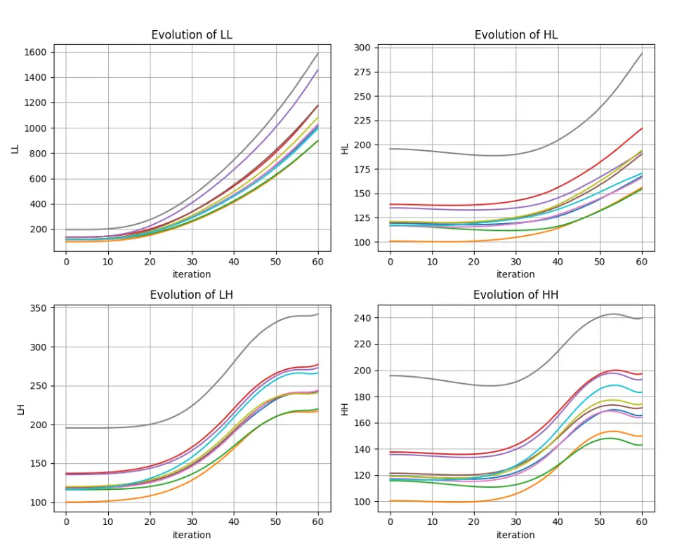
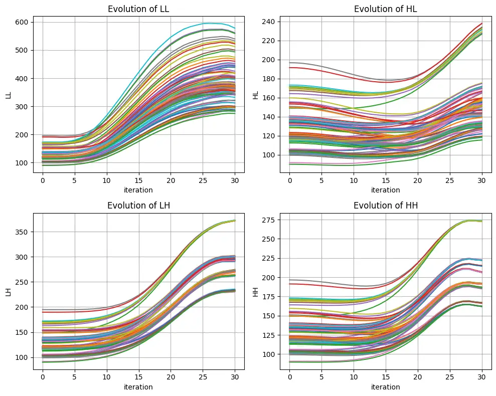
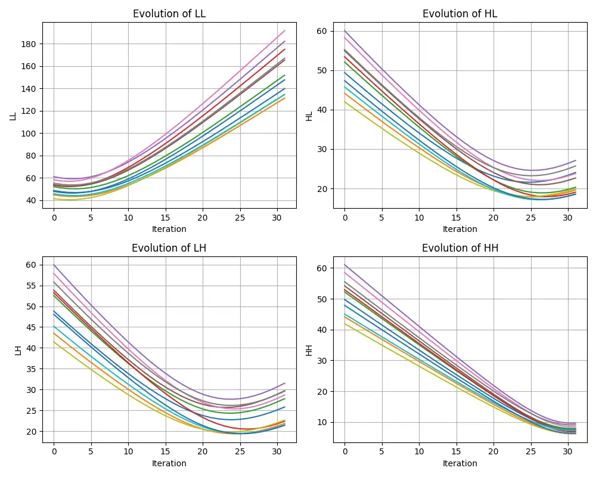
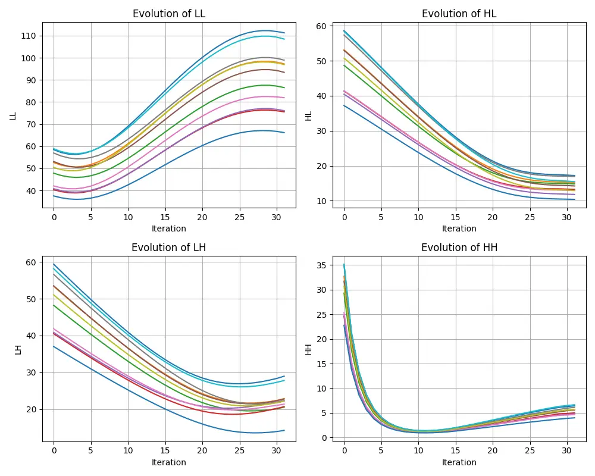
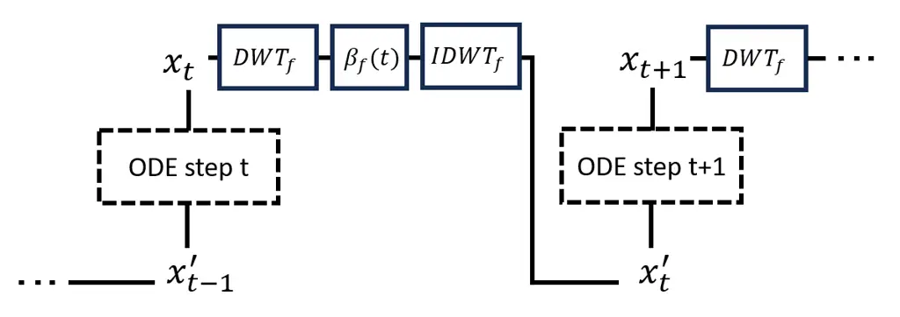

# Harmonizing Spectral Evolution in Conditional Flow Matching for TTS

Isha Pandey^(⋆)    Varad Deshpande^(⋆)    Abhijat Bharadwaj^(⋆)   
Ganesh Ramakrishnan ^(†)^(†)thanks: ^(⋆) These authors contributed
equally to this work.

###### Abstract

Conditional Flow Matching (CFM) models for text-to-speech (TTS) suffer
from incoherent frequency evolution during inference. While similar
spectral imbalances are addressed in diffusion models for other domains,
those generic solutions fail to generalize to the inherently
uncoordinated acoustic dynamics of CFM. We demonstrate that this issue
can be effectively mitigated by introducing a novel training-free
frequency-selective boosting strategy. Using the Discrete Wavelet
Transform (DWT), our method dynamically modulates mel-spectrogram
sub-bands during ODE integration, synchronizing spectral development by
penalizing aggressive low-frequency growth and boosting lagging
high-frequency details. Validated across diverse architectures
(Matcha-TTS, F5-TTS, IndicF5), our approach reduces the required Number
of Function Evaluations (NFE) from 32 to 26 and improves Fréchet Audio
Distance (FAD) by up to 61%, all without compromising mean opinion
scores, speaker similarity, and speech intelligibility.

###### Index Terms: 

CFM, Wavelet, Reweighting, Training-Free, Text-to-Speech

^(†)^(†)address: _Indian Institute of Technology Bombay_  
{iishapandey, varadspd, bharadwaj.abhijat, ganramkr}@iitb.ac.in

## 1 Introduction

Conditional Flow Matching (CFM) \[10\] has emerged as a powerful
framework for text-to-speech (TTS) synthesis. It learns a vector field
$`v_{\theta}`$ that transports samples from a simple prior
$`\mathbf{x}_{0}\sim p_{0}`$ to the data distribution by solving the
ordinary differential equation (ODE)
$`\frac{d\mathbf{x}(t)}{dt}=v_{\theta}(x_{t},t)`$ \[2\], commonly along
efficient Optimal-Transport paths. At inference, the ODE is discretized
into a finite number of function evaluations (NFEs). Existing systems
use different integration strategies: Voicebox \[9\] relies on mid-point
ODE solvers, Matcha-TTS \[11\] employs fixed-step Euler integration,
whereas F5-TTS \[3\] uses Sway Sampling to allocate steps non-uniformly
along the trajectory. These approaches primarily optimize temporal
discretization; comparatively little attention has been paid to how
acoustic frequency components develop during integration.



Figure 1: Evolution of DWT sub-band energy ($`\ell_{2}`$-norm) across
F5-TTS inference steps.

Despite recent innovations, we identify a shared limitation of CFM-based
acoustic models: the incoherent evolution of frequency components during
ODE integration. As established by \[19\], continuous-time generative
models are expected to exhibit a frequency evolution property,
recovering broad low-frequency structures before transitioning to
high-frequency details. However, neural networks possess an intrinsic
frequency bias \[14, 19\]: parameter-constrained networks fail to follow
this spectral trajectory, leaving them unable to adequately recover
high-frequency components towards the end of generation. Following prior
spectral analyses \[19, 12\], we apply the Discrete Wavelet Transform
(DWT) \[5\] to intermediate mel-spectrograms $`\mathbf{x}_{t}`$. Across
both fixed-step Matcha-TTS and Sway-sampled F5-TTS, the approximation
sub-band continues to grow while detail sub-bands develop more slowly
(Figures 1 and 2(b)), revealing a persistent imbalance not resolved by
the choice of ODE time grid alone.



(a) F5-TTS with FSB.



(b) Matcha-TTS baseline.



(c) Matcha-TTS with FSB.

Figure 2: DWT sub-band norm evolution: (a) reweighted F5-TTS, (b)
baseline Matcha-TTS, and (c) reweighted Matcha-TTS.

To address this imbalance, we introduce Frequency-Selective Boosting
(FSB), a lightweight, training-free inference strategy that decomposes
each intermediate mel-spectrogram into DWT sub-bands and applies
step-dependent reweighting. FSB suppresses excessive approximation-band
growth while boosting lagging detail components, effectively acting as a
corrective for the known frequency bias of neural networks rather than
an arbitrary spectral intervention. Unlike constant spectral
corrections, its modulation strength adapts to the integration stage;
moreover, linear schedules from image-generation methods such as
MASF \[12\] do not consistently transfer to CFM-based TTS (Table 4). The
schedules require a one-time calibration analogous to standard inference
hyperparameters (NFE count, guidance scale) and can transfer across
related architectures and languages. Audio samples are available on our
anonymized demo page.¹¹ 1
[https://anonymous.4open.science/w/boosed-cfm-demo/](https://anonymous.4open.science/w/boosed-cfm-demo/)

This work lays the analytical and empirical foundations for
spectral-aware ODE integration in CFM-TTS, establishing that principled
sub-band coordination yields consistent gains across architectures and
languages. Our contributions are: (1) we identify and quantify
incoherent DWT sub-band evolution in CFM-TTS, showing that generic
constant-strength or linearly scheduled interventions fail to correct
it; and (2) we propose FSB, a training-free reweighting strategy that
improves spectral convergence, quality, and efficiency across
architectures and languages.

## 2 Methodology

### 2.1 Sub-band Evolution in CFM-based TTS

At each ODE evaluation, we apply a two-dimensional DWT to the
intermediate mel-spectrogram $`\mathbf{x}_{t}`$. This produces an
approximation sub-band, LL, and three detail sub-bands, LH, HL, and HH.
We analyze their trajectories using the $`\ell^{2}`$-norm of the
corresponding DWT coefficients.

Figures 1 and 2(b) show that these sub-bands do not develop
synchronously. In F5-TTS, LL grows rapidly throughout inference.
Although LH and HH begin to stabilize near the end of the trajectory, LL
and HL continue to increase. Matcha-TTS exhibits a different profile,
characterized by near-linear LL growth and delayed development of the
detail sub-bands. Thus, the imbalance persists across both adaptive Sway
Sampling and fixed-step Euler integration.

We refer to this behavior as _incoherent sub-band evolution_: the
approximation and detail components develop at different rates, with
dominant components continuing to grow after other bands have largely
stabilized. Our experiments in Section 4 show that coordinating sub-band
development improves synthesis quality and allows perceptual convergence
with fewer function evaluations.

### 2.2 Frequency-Selective Boosting

To address incoherent sub-band evolution, FSB dynamically redistributes
the relative contribution of DWT sub-bands as ODE integration
progresses. Let $`c_{f}(t)`$ denote the observed norm trajectory of
sub-band $`f`$. We define its reweighting coefficient as a clipped,
scaled inverse of this trajectory:

```math
\begin{split}\beta_{f}(t;c)=\min\left(\delta_{clip},\frac{1}{\delta_{p}+\delta_{q}c_{f}(t)}\right).\end{split} \tag{1}
```

At each ODE evaluation, the intermediate mel-spectrogram $`x_{t}`$ is
decomposed into its DWT sub-bands, each selected component is scaled by
$`\beta_{f}(t)`$, and the modified state is reconstructed using the
inverse DWT (see Figure 3):

```math
x^{\prime}_{t}=\mathrm{IDWT}\left(\left(\beta_{f}(t)\,\mathrm{DWT}_{f}(x_{t})\right)_{f\in\mathcal{F}}\right). \tag{2}
```

Here,
$`\mathcal{F}=\{\mathrm{LL},\mathrm{HL},\mathrm{LH},\mathrm{HH}\}`$,
$`\delta_{p}`$ stabilizes the denominator, $`\delta_{q}`$ controls the
sensitivity of the correction to the observed sub-band energy, and
$`\delta_{clip}`$ prevents excessively large reweighting coefficients.
Equation 1 therefore suppresses aggressively growing components while
increasing the relative contribution of energy-deficient components. The
smooth schedules and clipping operation also prevent abrupt
perturbations of the learned ODE trajectory.

For each model, the norm trajectory $`c_{f}(t)`$ is represented using a
compact family of exponential, linear, or polynomial functions. The
corresponding model-specific schedules presented below are
low-dimensional approximations to the general inverse reweighting in
Equation 1.



Figure 3: Frequency-selective reweighting process.

Schedule calibration. The schedules are calibrated once from aggregate
statistics: we estimate average sub-band growth curves from a small
calibration set, select a matching function family, and grid-search
$`2`$–$`4`$ scalar parameters per modulated sub-band on validation FAD
and WER. The schedule is then fixed for all inference—a burden
comparable to tuning NFE count or guidance scale. Crucially, IndicF5
reuses the F5-TTS schedule unchanged for Tamil and Bengali
(Section 4.4).

F5-TTS reweighting. The LL sub-band in F5-TTS grows super-linearly
(Figure 1). We attenuate it using an exponential schedule:

```math
\begin{split}\beta_{LL}^{N}(t)=\exp\left(-\alpha(N)t\right),\qquad\alpha(N)=\frac{\alpha_{0}}{q(N)}.\end{split} \tag{3}
```

Here, $`N`$ denotes the total NFE and $`\alpha(N)`$ controls the
attenuation rate. Because the step index $`t\in{1,\ldots,N}`$ spans
different ranges for different $`N`$, $`q(N)`$ compensates for this
variation. We calibrate $`\alpha(N)`$ at
$`\mathcal{S}={10,20,30,45,60}`$ and fit a quadratic $`q(N)`$ across
these points, producing an NFE-dependent parameterization that
generalizes without a separate search for every $`N`$. Since HL also
continues growing during the final evaluations, it is modulated using
the same functional form. LH and HH remain stable and are left
unchanged.

Matcha-TTS reweighting. Matcha-TTS exhibits a milder, approximately
linear imbalance (Figure 2(b)). Small linear corrections to LH and HL
suffice:

```math
\begin{split}\beta_{LH}(t)=1-b_{LH}\frac{t}{N},\qquad\beta_{HL}(t)=1-b_{HL}\frac{t}{N}.\end{split} \tag{4}
```

Here, $`b_{LH}`$ and $`b_{HL}`$ control the correction strengths. LL and
HH are left unchanged. The resulting trajectories are shown in
Figures 2(a) and 2(c).

Overall, FSB retains the same DWT-based mechanism across architectures
while adapting only its low-dimensional schedule to the observed
trajectory profile. Once calibrated, the schedule remains fixed across
utterances, requires no model retraining, and introduces only DWT and
inverse-DWT operations during inference.

## 3 Experimental Setup

Model Specifications. We use the F5-TTS checkpoint²² 2
[https://github.com/SWivid/F5-TTS](https://github.com/SWivid/F5-TTS) for
English and IndicF5 \[18\] for Indic languages, both $`\approx`$350M
parameters. For Matcha-TTS, we use its checkpoint³³ 3
[https://github.com/shivammehta25/Matcha-TTS](https://github.com/shivammehta25/Matcha-TTS)
trained on the single-speaker LJSpeech dataset \[7\].

Evaluation Datasets. F5-TTS is evaluated on LibriTTS-clean and -other
($`\approx`$5k samples each) \[20\]. Bengali and Tamil are drawn from
IndicVoices-r \[16\] ($`\approx`$300 samples). Matcha-TTS is evaluated
on LibriSpeech test text ($`\approx`$400 samples).

Evaluation Metrics. Intelligibility: WER and CER using Whisper Large
v3 \[13\] for English and Indic Whisper \[1\] for Tamil and Bengali.
Quality: Fréchet Audio Distance (FAD) \[8\] over VGGish
embeddings \[6\], UTMOS \[15\] for English, IndicMOS \[17\] for Indic
languages, and subjective MOS. Speaker Similarity Score (SSS):
ECAPA-TDNN \[4\]. Efficiency: average runtime and Real-Time Factor
(RTF).

## 4 Results and Analysis

### 4.1 Quality–Efficiency Trade-off

With FSB, DWT sub-band norms begin to plateau around the 26th evaluation
of a 32-step trajectory (Figures 2(a), 2(c)), suggesting diminishing
spectral changes during the remaining steps. Table 1 evaluates whether
26 NFEs with FSB can match 32-NFE quality on 1,000 LibriTTS-clean
utterances on F5-TTS. We also report cutoff-26/32 (the intermediate
state at step 26 of a 32-step run) as a convergence diagnostic.

Full 26-NFE FSB reduces FAD from 1.04 to 0.51 relative to the 26-NFE
baseline and outperforms the 32-NFE baseline on all metrics. Extending
FSB to 32 NFE yields only marginal further gains, supporting 26 NFE as
the preferred operating point. We include Mel-EQ as a non-wavelet
baseline: its modest gains confirm that static spectral normalization
does not replace time-dependent sub-band coordination. On an NVIDIA
H200, 26-NFE FSB reduces average runtime by 16.4% (1.119 s vs. 1.339 s)
and RTF by 15.9%.

| Trajectory   | Method     | WER $`\downarrow`$ | CER $`\downarrow`$ | FAD $`\downarrow`$ |
| ------------ | ---------- | ------------------ | ------------------ | ------------------ |
| Full 32 NFE  | Baseline   | 17.45              | 6.32               | 1.10               |
|              | Mel-EQ     | 17.31              | 6.28               | 1.08               |
|              | FSB (ours) | 15.05              | 5.91               | 0.93               |
| Full 26 NFE  | Baseline   | 18.40              | 7.02               | 1.04               |
|              | Mel-EQ     | 17.34              | 6.33               | 0.98               |
|              | FSB (ours) | 15.50              | 6.01               | 0.51               |
| Cutoff-26/32 | Baseline   | 18.08              | 7.24               | 7.59               |
|              | Mel-EQ     | 16.59              | 7.01               | 7.32               |
|              | FSB (ours) | 16.00              | 6.14               | 4.66               |

Table 1: Frequency-domain interventions on F5-TTS.

### 4.2 Cross-model and Perceptual Evaluation

Table 2 evaluates complete trajectories on full LibriTTS splits for
F5-TTS and on LibriSpeech for Matcha-TTS. Relative to matched 26-NFE
baselines, FSB reduces FAD by 48% on LibriTTS-clean, 52% on
LibriTTS-other, and 61% on Matcha-TTS, while WER/CER and speaker
similarity remain close to the 32-NFE references. Predicted MOS recovers
most of the degradation from ordinary 26-NFE inference, exceeding the
32-NFE Matcha-TTS score (4.37 vs. 4.31).

A human MOS pilot on Matcha-TTS (Table 3; 16 raters, 24 samples each
using total of 100 samples) corroborates the objective metrics: 26-step
FSB leads on Intelligibility and Perceptual Quality and is tied with the
32-step baseline on Naturalness (3.80 vs. 3.81).

|                           |     |                    |                    |                    |                    |                  |
| ------------------------- | --- | ------------------ | ------------------ | ------------------ | ------------------ | ---------------- |
| Method                    | NFE | FAD $`\downarrow`$ | WER $`\downarrow`$ | CER $`\downarrow`$ | UTMOS $`\uparrow`$ | SSS $`\uparrow`$ |
| F5-TTS on LibriTTS-clean  |     |                    |                    |                    |                    |                  |
| Baseline                  | 32  | 0.99               | 6.63               | 3.76               | 3.93               | 0.76             |
| Baseline                  | 26  | 0.98               | 6.71               | 3.80               | 3.05               | 0.74             |
| FSB (ours)                | 26  | 0.51               | 6.70               | 3.80               | 3.76               | 0.77             |
| F5-TTS on LibriTTS-other  |     |                    |                    |                    |                    |                  |
| Baseline                  | 32  | 1.48               | 6.61               | 3.28               | 3.64               | 0.72             |
| Baseline                  | 26  | 1.49               | 6.78               | 3.45               | 2.69               | 0.71             |
| FSB (ours)                | 26  | 0.72               | 6.60               | 3.30               | 3.54               | 0.73             |
| Matcha-TTS on LibriSpeech |     |                    |                    |                    |                    |                  |
| Baseline                  | 32  | 0.49               | 1.90               | 0.70               | 4.31               | –                |
| Baseline                  | 26  | 1.15               | 2.30               | 0.92               | 3.63               | –                |
| FSB (ours)                | 26  | 0.45               | 2.13               | 0.84               | 4.37               | –                |

Table 2: Cross-model evaluation on full ODE trajectories.

| Setting                | Naturalness | Intelligibility | Perceptual quality |
| ---------------------- | ----------- | --------------- | ------------------ |
| Baseline, full 32      | 3.81        | 4.43            | 4.34               |
| Baseline, cutoff-26/32 | 3.51        | 4.09            | 3.69               |
| FSB, full 26 (ours)    | 3.80        | 4.45            | 4.50               |

Table 3: Matcha-TTS human evaluation.

| Dataset        | LL schedule | FAD $`\downarrow`$ | WER $`\downarrow`$ | CER $`\downarrow`$ |
| -------------- | ----------- | ------------------ | ------------------ | ------------------ |
| LibriTTS-clean | Baseline    | 12.93              | 6.7                | 3.7                |
|                | Exponential | 10.78              | 7.2                | 4.7                |
|                | Linear      | 13.15              | 8.1                | 5.3                |
|                | Polynomial  | 17.29              | 19.8               | 13.3               |
| LibriTTS-other | Baseline    | 9.03               | 8.3                | 5.1                |
|                | Exponential | 8.82               | 8.2                | 4.9                |
|                | Linear      | 10.78              | 8.3                | 5.0                |
|                | Polynomial  | 14.36              | 43.1               | 30.4               |

Table 4: Ablation of LL-subband reweighting schedule (cutoff-26/32).
Other subband coefficients held fixed.

### 4.3 Ablation: Reweighting Schedules

Table 4 compares exponential, linear, and degree-3 polynomial schedules
for the LL sub-band under the cutoff-26/32 diagnostic. The exponential
schedule achieves the lowest FAD on both splits; the linear schedule is
competitive, indicating robustness to minor schedule variations; the
polynomial schedule fails catastrophically, confirming that the
exponential form best counteracts super-linear low-frequency growth.

### 4.4 Ablation: Cross-lingual Transfer

Using the cutoff-26/32 diagnostic on IndicF5, FSB halves FAD for both
Tamil (7.58$`\to`$4.37) and Bengali (9.30$`\to`$4.32) while improving
predicted MOS (2.24$`\to`$2.30 and 2.07$`\to`$2.26) and speaker
similarity (0.78$`\to`$0.81 and 0.75$`\to`$0.78). ASR metrics are mixed,
though the ground-truth recordings themselves produce WER of 62–65%,
making ASR unreliable here; the distributional and perceptual metrics
consistently favor FSB. Crucially, IndicF5 reuses the F5-TTS schedule
without modification, demonstrating cross-lingual transfer within the
same architecture family.

### 4.5 Trajectory Stability

Modifying the state between ODE evaluations risks abrupt corrections or
compounding drift. We diagnose this using finite-difference acceleration
$`\hat{a}_{i}`$ and the log-linear divergence rate $`r`$ from fitting
$`\log\|x_{t}^{\mathrm{mod}}-x_{t}^{\mathrm{base}}\|_{2}=rt+c`$. As
shown in Table 5, FSB (LL+HL) maintains baseline-level mean acceleration
($`1.01\times`$) while _reducing_ peak acceleration to $`0.80\times`$,
confirming that reweighting does not introduce corrective spikes.
LL-only modulation has slightly lower acceleration but higher divergence
($`r{=}0.089`$ vs. $`0.049`$), indicating that co-modulating HL
stabilizes the trajectory by keeping detail sub-bands synchronized with
the attenuated approximation band. In contrast, Pre-Emphasis increases
acceleration by $`>`$6$`\times`$ with strongly exponential divergence
($`R^{2}{=}0.971`$), consistent with its severe intelligibility
degradation.

| Method       | Mean $`\|\hat{a}\|`$ | Max $`\|\hat{a}\|`$ | $`\boldsymbol{r\;(R^{2})}`$ |
| ------------ | -------------------- | ------------------- | --------------------------- |
| Baseline     | $`1.00{\times}`$     | $`1.00{\times}`$    | –                           |
| FSB: LL+HL   | $`1.01{\times}`$     | $`0.80{\times}`$    | $`0.049\;(0.787)`$          |
| DWT: LL only | $`0.93{\times}`$     | $`0.77{\times}`$    | $`0.089\;(0.698)`$          |
| Mel-EQ       | $`1.03{\times}`$     | $`1.03{\times}`$    | $`0.042\;(0.786)`$          |
| Pre-Emphasis | $`6.62{\times}`$     | $`6.35{\times}`$    | $`0.087\;(0.971)`$          |

Table 5: Trajectory-stability diagnostics (100 LibriTTS-clean samples).
Acceleration normalized by baseline; $`r`$ is the log-linear divergence
rate.

## 5 Conclusion

We identified incoherent DWT sub-band evolution as a shared limitation
of CFM-based TTS models and proposed Frequency-Selective Boosting (FSB),
a training-free, step-dependent reweighting strategy that coordinates
spectral development during ODE integration. FSB reduces the required
NFE from 32 to 26 and improves FAD by up to 61% across F5-TTS,
Matcha-TTS, and IndicF5, without degrading intelligibility and
perceptual quality. Its low-dimensional schedules require only a
one-time calibration and transfer across languages. Future work includes
automatic schedule estimation and extension to waveform-domain flow
models.

## References

- \[1\] K. S. Bhogale, S. Sundaresan, A. Raman, T. Javed, M. M. Khapra,
  and P. Kumar (2023) Vistaar: diverse benchmarks and training sets for
  indian language asr. arXiv preprint arXiv:2305.15386. Cited by: §3.
- \[2\] R. T. Q. Chen, Y. Rubanova, J. Bettencourt, and D.
  Duvenaud (2018) Neural ordinary differential equations. In Proceedings
  of the 32nd International Conference on Neural Information Processing
  Systems, NIPS’18, Red Hook, NY, USA, pp. 6572–6583. Cited by: §1.
- \[3\] Y. Chen, Z. Niu, Z. Ma, K. Deng, C. Wang, J. Zhao, K. Yu, and X.
  Chen (2024) F5-tts: a fairytaler that fakes fluent and faithful speech
  with flow matching. External Links: 2410.06885,
  [Link](https://arxiv.org/abs/2410.06885) Cited by: §1.
- \[4\] B. Desplanques, J. Thienpondt, and K. Demuynck (2020)
  ECAPA-tdnn: emphasized channel attention, propagation and aggregation
  in time delay neural network. In Proc. Interspeech 2020, Cited by: §3.
- \[5\] A. Graps (1995) An introduction to wavelets. IEEE Computational
  Science and Engineering 2 (2), pp. 50–61. External Links:
  [Document](https://dx.doi.org/10.1109/99.388960) Cited by: §1.
- \[6\] S. Hershey, S. Chaudhuri, D. P. W. Ellis, J. F. Gemmeke, A.
  Jansen, R. C. Moore, M. Plakal, D. Platt, R. A. Saurous, B.
  Seybold, M. Slaney, R. J. Weiss, and K. Wilson (2017) CNN
  architectures for large-scale audio classification. In 2017 IEEE
  International Conference on Acoustics, Speech and Signal Processing
  (ICASSP), Vol. , pp. 131–135. External Links:
  [Document](https://dx.doi.org/10.1109/ICASSP.2017.7952132) Cited by:
  §3.
- \[7\] K. Ito and L. Johnson (2017) The lj speech dataset. Note:
  [https://keithito.com/LJ-Speech-Dataset/](https://keithito.com/LJ-Speech-Dataset/)
  Cited by: §3.
- \[8\] K. Kilgour, M. Zuluaga, D. Roblek, and M. Sharifi (2019) Fréchet
  audio distance: a metric for evaluating music enhancement algorithms.
  External Links: 1812.08466, [Link](https://arxiv.org/abs/1812.08466)
  Cited by: §3.
- \[9\] M. Le, A. Vyas, B. Shi, B. Karrer, L. Sari, R. Moritz, M.
  Williamson, V. Manohar, Y. Adi, J. Mahadeokar, and W. Hsu (2023)
  Voicebox: text-guided multilingual universal speech generation at
  scale. In Thirty-seventh Conference on Neural Information Processing
  Systems, External Links:
  [Link](https://openreview.net/forum?id=gzCS252hCO) Cited by: §1.
- \[10\] Y. Lipman, R. T. Q. Chen, H. Ben-Hamu, M. Nickel, and M.
  Le (2023) Flow matching for generative modeling. In The Eleventh
  International Conference on Learning Representations, External Links:
  [Link](https://openreview.net/forum?id=PqvMRDCJT9t) Cited by: §1.
- \[11\] S. Mehta, R. Tu, J. Beskow, É. Székely, and G. E. Henter (2024)
  Matcha-tts: a fast tts architecture with conditional flow matching. In
  ICASSP 2024-2024 IEEE International Conference on Acoustics, Speech
  and Signal Processing (ICASSP), pp. 11341–11345. Cited by: §1.
- \[12\] Y. Qian, Q. Cai, Y. Pan, Y. Li, T. Yao, Q. Sun, and T.
  Mei (2024) Boosting diffusion models with moving average sampling in
  frequency domain. In Proceedings of the IEEE/CVF Conference on
  Computer Vision and Pattern Recognition (CVPR), pp. 8911–8920. Cited
  by: §1, §1.
- \[13\] A. Radford, J. W. Kim, T. Xu, G. Brockman, C. McLeavey, and I.
  Sutskever (2022) Robust speech recognition via large-scale weak
  supervision. arXiv. External Links:
  [Document](https://dx.doi.org/10.48550/ARXIV.2212.04356),
  [Link](https://arxiv.org/abs/2212.04356) Cited by: §3.
- \[14\] N. Rahaman, A. Baratin, D. Arpit, F. Draxler, M. Lin, F.
  Hamprecht, Y. Bengio, and A. Courville (2019) On the spectral bias of
  neural networks. In International conference on machine learning,
  pp. 5301–5310. Cited by: §1.
- \[15\] T. Saeki et al. (2022) UTMOS: utokyo-sarulab system for
  voicemos challenge 2022. In Proc. Interspeech 2022, Cited by: §3.
- \[16\] A. Sankar, S. Anand, P. S. Varadhan, S. Thomas, M. Singal, S.
  Kumar, D. Mehendale, A. Krishana, G. Raju, and M. Khapra (2024)
  IndicVoices-r: unlocking a massive multilingual multi-speaker speech
  corpus for scaling indian tts. NeurIPS 2024 Datasets and Benchmarks.
  Cited by: §3.
- \[17\] S. Udupa et al. (2024) IndicMOS: multilingual mos prediction
  for 7 indian languages. In Proc. Interspeech 2024, Cited by: §3.
- \[18\] P. S. V, S. Anand, S. Siddhartha, and M. M. Khapra (2025)
  IndicF5: high-quality text-to-speech for indian languages. External
  Links: [Link](https://github.com/AI4Bharat/IndicF5) Cited by: §3.
- \[19\] X. Yang, D. Zhou, J. Feng, and X. Wang (2023) Diffusion
  probabilistic model made slim. In 2023 IEEE/CVF Conference on Computer
  Vision and Pattern Recognition (CVPR), Vol. , pp. 22552–22562.
  External Links:
  [Document](https://dx.doi.org/10.1109/CVPR52729.2023.02160) Cited by:
  §1.
- \[20\] H. Zen, V. Dang, R. Clark, Y. Zhang, R. J. Weiss, Y. Jia, Z.
  Chen, and Y. Wu (2019) LibriTTS: a corpus derived from librispeech for
  text‐to‐speech. In Proc. Interspeech, External Links:
  [Document](https://dx.doi.org/10.21437/Interspeech.2019-2441) Cited
  by: §3.
