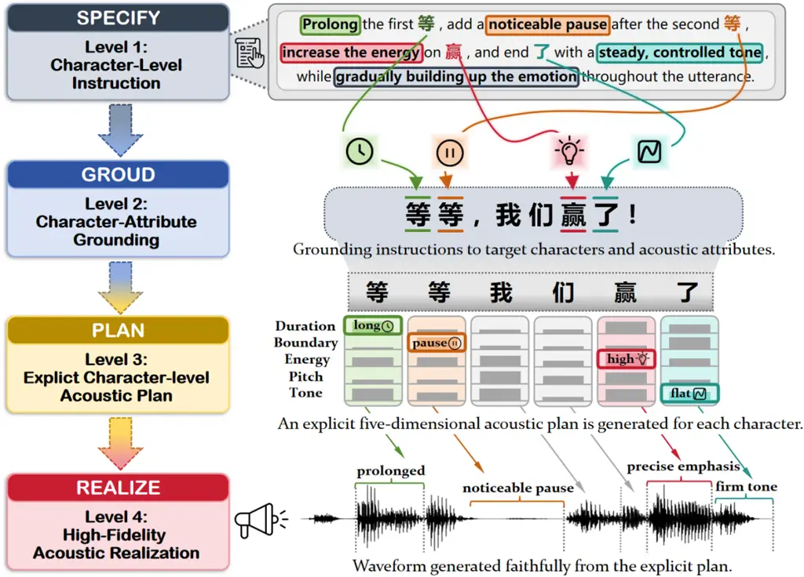
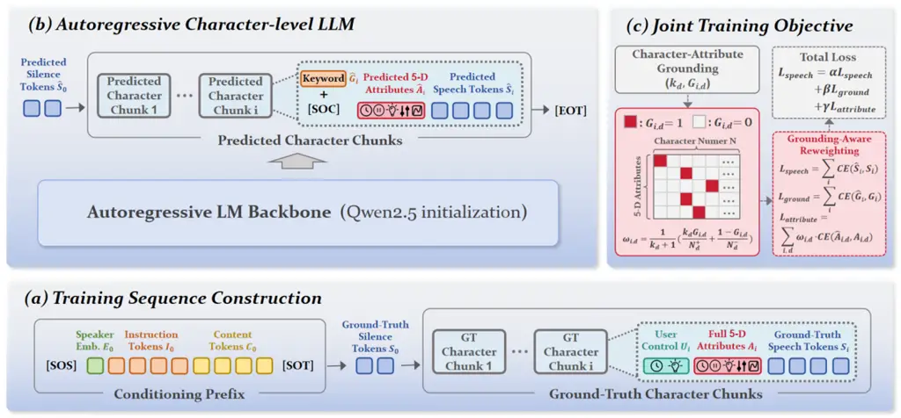
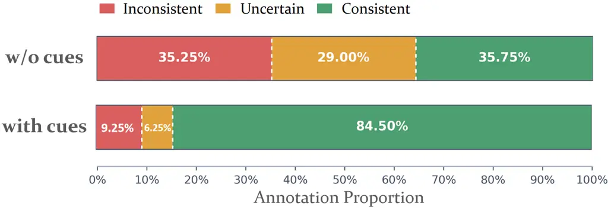

# InstCharVoice: Grounding Natural-Language Instructions for Character-Level Control in Text-to-Speech

Sihang Nie\sthanksWork conducted when the author was intern at Huya Inc.
   Xueru Li    Xiaofen Xing\sthanksCorresponding author.    Deyi Tuo   
Cheng-Bin Jin    Jingyuan Xing    Jinxin Ji

###### Abstract

Instruction-based text-to-speech (ITTS) systems enable natural-language
control of expressive speech generation, but often offer limited
transparency and fine-grained control over individual text units.
Character-level controllable TTS systems provide explicit acoustic
control, yet typically rely on user-specified acoustic attributes. To
bridge this gap, we propose InstCharVoice, a unified framework that
grounds natural-language instructions in character-level acoustic
control. We first construct grounded instruction annotations on the
WordVoice-5A-zh corpus using Qwen3-Omni. With this supervision, we train
an autoregressive model to identify instruction-relevant characters and
predict their acoustic attributes before generating the corresponding
speech tokens. Keyword prediction and grounding-aware loss weighting
help the model focus on instruction-relevant characters and attributes.
Experiments show improved instruction following and keyword-level
acoustic control over representative ITTS systems, with competitive
speech naturalness and explicit character-level controllability. Audio
samples are available
at [https://xxh333.github.io/instcharvoice-demo/](https://xxh333.github.io/instcharvoice-demo/).

###### Index Terms: 

Instruction-based TTS, instruction grounding, character-level control

^(†)^(†)address: ¹South China University of Technology, ²Huya Inc., ³The
Hongkong Polytechnic University

## 1 Introduction

Neural text-to-speech (TTS) systems have achieved impressive
expressiveness in zero-shot voice cloning. Benefiting from large-scale
speech data and generative modeling, these systems can synthesize speech
with high naturalness and speaker similarity \[4, 2, 8, 20\]. This
progress has increasingly shifted research attention toward expressive
instruction-based speech generation \[22, 13, 16, 6, 17\].

Despite this progress, existing instruction-based TTS (ITTS) systems
often provide limited transparency and fine-grained control. Many
systems directly generate speech from text and instructions without
explicitly identifying which text units should be modified or which
acoustic attributes should realize the requested changes \[16, 11\].
Consequently, the correspondence among instruction phrases, target text
units, and acoustic variations remains implicit. Moreover, existing ITTS
systems typically emphasize utterance-level or segment-level
characteristics, leaving precise control over individual characters less
explored \[24, 12\].

Fine-grained controllable TTS offers a complementary solution by
representing local acoustic variations with explicit character-level
attributes \[12, 10\]. Such representations enable precise and
inspectable control over individual text units. However, these methods
typically rely on user-specified acoustic attributes, which can become
cumbersome to configure as the utterance length and the number of
controllable attributes increase. This attribute-based interface is less
intuitive than expressing the desired changes in natural language. An
important gap therefore remains between natural-language instruction
control and explicit character-level acoustic realization.



Figure 1: Motivation and overview of InstCharVoice. The framework
bridges natural-language instructions and explicit character-level
acoustic control through instruction grounding and acoustic planning.

To bridge this gap, we propose InstCharVoice, an ITTS framework for
fine-grained character-level control. As illustrated in Fig. 1,
InstCharVoice connects instruction specification, character-level
grounding, acoustic planning, and speech realization. It identifies
instruction-relevant characters and predicts five acoustic
attributes—duration, boundary, energy, pitch, and tone—for each
character before generating its corresponding speech tokens. To provide
supervision for this grounded modeling process, we develop an
LLM-assisted annotation pipeline that leverages an open-source
multimodal language model to generate natural-language instructions and
character-level grounding labels from text, speech, and acoustic
attributes.



Figure 2: Model architecture of InstCharVoice, including (a) training
sequence construction, (b) autoregressive modeling of character-level
speech chunks, and (c) grounding-aware training objective.

Our contributions are summarized as follows. 1) We develop an
LLM-assisted annotation pipeline that links natural-language
instructions to target characters and acoustic attributes, providing
explicit supervision for instruction grounding. 2) We propose
InstCharVoice, a unified framework that bridges natural-language
instructions and speech generation through character-level acoustic
planning, with keyword prediction and grounding-aware loss weighting to
strengthen localized control. 3) Experiments show improved instruction
following and keyword-level acoustic control over representative ITTS
systems, while maintaining competitive speech naturalness and
character-level controllability.

|           |            |          |      |       |       |      |      |
| --------- | ---------- | -------- | ---- | ----- | ----- | ---- | ---- |
| Statistic | Utterances | Keywords | Dur  | Bnd   | Eng   | Pit  | Ton  |
| Count     | 2143k      | 5978k    | 609k | 3882k | 2830k | 202k | 901k |

Table 1: Statistics of the character-level grounded instruction
annotations. Dur, Bnd, Eng, Pit, and Ton denote duration, boundary,
energy, pitch, and tone, respectively.

## 2 Methodology

### 2.1 Character-Level Grounded Instruction Annotation

We construct character-level grounded instruction annotations on
WordVoice-5A-zh \[12\], a corpus derived from LEMAS \[23\]. The dataset
contains approximately 2,546 hours of Chinese speech, with
transcriptions and character-level annotations for duration, energy,
pitch, boundary, and tone. We develop a three-stage annotation pipeline
based on Qwen3-Omni-30B-A3B \[21\] ¹¹ 1
https://www.modelscope.cn/models/Qwen/Qwen3-Omni-30B-A3B-Instruct.

First, Qwen3-Omni generates natural-language instructions from each
speech-text pair to describe utterance-level expressive and acoustic
characteristics. We then provide the character-level acoustic attributes
as explicit cues to refine the descriptions and correct inconsistencies.
Finally, salient local acoustic patterns, such as prolonged duration or
prominent energy, are extracted from the character-level annotations.
Guided by these patterns, the model further revises and supplements the
instructions with localized acoustic requirements and assigns grounding
labels to the corresponding character-attribute pairs. Only pairs
addressed by the final instructions are labeled as grounded. The
resulting annotations support both utterance-level instruction following
and character-level acoustic grounding. Table 1 summarizes the
annotation statistics.

### 2.2 Character-Level Instruction-to-Speech Modeling

As illustrated in Fig. 2, InstCharVoice models instruction-based speech
synthesis as autoregressive generation over character-level speech
chunks. For each character, the model predicts its grounding label and
acoustic attributes before generating the aligned speech tokens. This
formulation supports keyword-aware instruction grounding, interpretable
acoustic planning, and optional character-level user control.

Let $`\mathbf{I}_{0}`$, $`\mathbf{C}_{0}`$, and $`E_{0}`$ denote the
instruction-token sequence, content-token sequence, and speaker
embedding, respectively. The speaker embedding is extracted from the
reference speech using a pre-trained voiceprint model \[1\] ²² 2
https://www.modelscope.cn/models/iic/speech_campplus_sv_zh-cn_3dspeaker_16k.
The conditioning prefix is constructed as
$`\mathbf{P}=[\texttt{[SOS]},E_{0},\mathbf{I}_{0},\mathbf{C}_{0},\texttt{[SOT]}]`$.
It is followed by the leading silence tokens $`\mathbf{S}_{0}`$ and the
ground-truth character chunks. For the $`i`$-th character, the chunk is
represented as
$`\mathbf{X}^{\mathrm{gt}}_{i}=[U_{i},A_{i},\mathbf{S}_{i}]`$, where
$`U_{i}`$ contains the user-specified acoustic attributes, $`A_{i}`$ is
the combined embedding of all five acoustic attributes, and
$`\mathbf{S}_{i}`$ is the speech-token sequence segmented according to
the character duration. During training, attributes in $`U_{i}`$ are
randomly provided or masked, allowing the model to predict the complete
five-dimensional attributes from partial user specifications. Thus, the
training sequence is
$`\mathbf{X}^{\mathrm{gt}}=[\mathbf{P},\mathbf{S}_{0},\mathbf{X}^{\mathrm{gt}}_{1},\ldots,\mathbf{X}^{\mathrm{gt}}_{N},\texttt{[EOT]}]`$.

During inference, the model autoregressively predicts the leading
silence tokens $`\mathbf{\hat{S}}_{0}`$ and character-level speech
chunks. The speech-token head predicts \[SOC\] to mark the transition to
a new character chunk, while an auxiliary grounding head predicts
$`\hat{G}_{i}`$ from the same hidden state, indicating whether the
character belongs to an instruction-grounded keyword. Grounding
prediction provides auxiliary supervision during training and is not fed
back into the generation sequence. For each character, five
attribute-specific heads predict the complete acoustic attributes
$`\hat{A}_{i}`$ in parallel from a shared hidden state, conditioned on
any attributes provided in $`U_{i}`$. Unspecified attributes are
inferred from the instruction and generation context. The model then
autoregressively generates the aligned speech tokens
$`\mathbf{\hat{S}}_{i}`$ until the next \[SOC\] or the sequence-ending
token \[EOT\]. The generated attributes and speech tokens are fed into
WordVoice-FM \[12\] to synthesize the output waveform.

|                    |                     |                    |                       |                       |                       |                       |                       |
| ------------------ | ------------------- | ------------------ | --------------------- | --------------------- | --------------------- | --------------------- | --------------------- |
| Model              | DNSMOS $`\uparrow`$ | CER $`\downarrow`$ | kD-MAE $`\downarrow`$ | kE-MAE $`\downarrow`$ | kP-MAE $`\downarrow`$ | kB-RER $`\downarrow`$ | kT-RER $`\downarrow`$ |
| GroundTruth        | 3.616               | —                  | 0.0182                | 0.0133                | 0.0094                | 5.26%                 | 8.95%                 |
| FireRedTTS3        | 3.599               | 2.89%              | 0.1162                | 0.1409                | 0.2326                | 31.29%                | 47.02%                |
| Qwen3-TTS          | 3.642               | 2.99%              | 0.1057                | 0.1930                | 0.2291                | 28.36%                | 44.56%                |
| CosyVoice3         | 3.583               | 3.12%              | 0.1126                | 0.1411                | 0.2383                | 24.27%                | 47.84%                |
| InstCharVoice      | 3.686               | 3.58%              | 0.0769                | 0.1271                | 0.1857                | 14.04%                | 37.05%                |
| \- w/o Instruction | 3.560               | 2.91%              | 0.0965                | 0.1431                | 0.2401                | 23.10%                | 44.08%                |

Table 2: Objective comparison of different systems.

### 2.3 Training Objectives

As illustrated in Fig. 2(c), InstCharVoice-LLM is jointly trained with
three cross-entropy objectives: speech-token prediction, character-level
grounding prediction, and five-dimensional acoustic attribute
prediction. We adopt uncertainty-based loss weighting \[7\] to balance
these objectives using learnable task uncertainties.

Let $`\mathcal{D}`$ denote the five acoustic attributes: duration,
boundary, energy, pitch, and tone. For classification-based prediction,
duration is represented by the number of aligned speech tokens, while
energy and pitch are each uniformly quantized into 20 bins over their
respective ranges. Boundary and tone use five and seven categories,
respectively, following WordVoice-5A \[12\]. For the $`i`$-th character
and attribute $`d\in\mathcal{D}`$, the grounding-aware attribute loss is
defined as

```math
\displaystyle\mathcal{L}_{\mathrm{attribute}} \displaystyle=\sum_{i=1}^{N}\sum_{d\in\mathcal{D}}\omega_{i,d}\,\mathrm{CE}\!\left(\hat{A}_{i,d},A_{i,d}\right), \tag{1}
```

```math
\displaystyle\omega_{i,d} \displaystyle=\frac{1}{k_{d}+1}\left(\frac{k_{d}G_{i,d}}{N_{d}^{+}}+\frac{1-G_{i,d}}{N_{d}^{-}}\right). \tag{2}
```

Here, $`A_{i,d}`$ and $`\hat{A}_{i,d}`$ denote the ground-truth label
and predicted distribution, respectively; $`G_{i,d}\in\{0,1\}`$
indicates whether the character-attribute pair is grounded by the
instruction; and $`N_{d}^{+}`$ and $`N_{d}^{-}`$ count the grounded and
non-grounded pairs for attribute $`d`$ within the utterance. Attributes
with no grounded pairs are trained without grounding-aware reweighting.
The factor $`k_{d}`$ controls the relative contribution of grounded and
non-grounded pairs after group-wise normalization. We set $`k_{d}=5`$
for boundary and energy, and $`k_{d}=3`$ for the remaining attributes.

We initialize the model from Qwen2.5-0.5B \[14\] and use the
CosyVoice3 \[3\] tokenizer to extract speech tokens. The model is
trained with Adam at a fixed learning rate of $`2\times 10^{-5}`$ on 8
NVIDIA A800 GPUs. Training consists of two stages: the model is first
trained for five epochs without grounding-aware reweighting, focusing on
global instruction-to-speech modeling and character-level acoustic
attribute modeling for speech generation; the reweighting scheme is then
enabled, and training continues for three additional epochs to further
emphasize instruction-relevant acoustic attributes.

## 3 Experiments



Figure 3: Blind evaluation of instruction annotation consistency.

| Model         | NMOS $`\uparrow`$ | IMOS $`\uparrow`$ | SMOS $`\uparrow`$ |
| ------------- | ----------------- | ----------------- | ----------------- |
| FireRedTTS3   | 3.331 ± 0.266     | 3.036 ± 0.306     | 3.533 ± 0.212     |
| Qwen3-TTS     | 3.277 ± 0.276     | 3.357 ± 0.230     | 3.124 ± 0.246     |
| CosyVoice3    | 3.297 ± 0.264     | 3.402 ± 0.253     | 3.374 ± 0.227     |
| InstCharVoice | 3.528 ± 0.219     | 3.602 ± 0.212     | 3.173 ± 0.260     |

Table 3: Subjective evaluation results.

### 3.1 Evaluation of Grounded Instruction Annotations

We conduct a blind human evaluation to assess instruction-speech
consistency and the benefit of character-level acoustic cues. Ten native
Chinese speakers each evaluate 40 randomly sampled utterances from
WordVoice-5A-zh \[12\]. For each utterance, the same listener evaluates
two instruction annotations: w/o cues, generated from the speech-text
pair in the first annotation stage, and with cues, refined using
character-level acoustic measurements in the second stage. Listeners
judge whether the acoustic characteristics described in each instruction
are supported by the speech, using three categories: inconsistent,
uncertain, and consistent.

As shown in Fig. 3, adding character-level acoustic cues increases
consistent judgments from 35.75% to 84.50%, while reducing inconsistent
judgments from 35.25% to 9.25% and uncertain judgments from 29.00% to
6.25%. These results indicate that explicit acoustic measurements help
the multimodal model produce descriptions that better match the speech,
providing a more reliable instruction basis for subsequent local
grounding.

### 3.2 Main Comparison

We evaluate InstCharVoice against three representative ITTS systems:
FireRedTTS3 \[17\], Qwen3-TTS \[5\], and CosyVoice3 \[3\]. We follow the
data split of WordVoice-5A and use the same evaluation texts and
reference speech across the main comparison, ablation study, and
explicit character-level control comparison.

For subjective evaluation, we randomly select 14 instruction-text pairs
from the test set and one reference speech sample for each pair. All
systems use the same instruction-text pairs and reference speech. Since
the selected Qwen3-TTS and FireRedTTS3 models do not support voice
cloning in instruction mode, we convert their outputs to the target
speaker using Seed-VC \[9\]. A total of 27 native listeners rate the
synthesized speech on a 5-point scale for naturalness (NMOS),
instruction following (IMOS), and speaker similarity (SMOS). We report
MOS \[19\] with 95% confidence intervals.

For objective evaluation, we use the first 30% of each ground-truth
utterance as reference speech and compare the synthesized speech with
the corresponding ground truth. We also include the ground-truth
condition and an InstCharVoice variant without instruction input,
denoted as w/o Instruction. Speech quality and intelligibility are
measured using DNSMOS \[15\] and character error rate (CER) measured by
Qwen3-ASR \[18\]. To assess localized acoustic control, we extract
character-level attributes using the WordVoice-5A annotation
pipeline \[12\] and compare them with the ground-truth annotations. Each
metric is computed only on character-attribute pairs grounded by the
instruction. We use the prefix “k” to denote keyword-level evaluation,
followed by D, E, P, B, or T for duration, energy, pitch, boundary, or
tone. Mean absolute error (MAE) is computed for duration, energy, and
pitch using the normalized values from the original pipeline. Boundary
comprises five pause-duration categories, while tone comprises seven
categories derived from quadratic fits to within-character pitch
contours. For both boundary and tone, we use a relaxed error rate (RER),
which treats a prediction within one category of the target as correct.
The nonzero acoustic errors in the GroundTruth condition arise from
slight differences in timestamp extraction between the evaluation
pipeline and the original annotation pipeline.

As shown in Tables 2 and 3, InstCharVoice achieves the highest mean NMOS
and IMOS, the highest DNSMOS, and the lowest errors across all five
keyword-level acoustic metrics among the compared systems. These results
demonstrate its strong performance in both speech naturalness and
character-level instruction following. In contrast, the other ITTS
systems obtain keyword-level acoustic results close to those of the w/o
Instruction variant, suggesting limited ability to translate
natural-language instructions into precise character-level acoustic
changes. InstCharVoice obtains lower SMOS than FireRedTTS3 and
CosyVoice3, suggesting a potential trade-off between speaker similarity
and fine-grained acoustic control. This comparison is also influenced by
the additional Seed-VC conversion applied to Qwen3-TTS and FireRedTTS3.
Although its CER is slightly higher, the gap from the best result of
2.89% is only 0.69 percentage points, indicating that speech
intelligibility remains competitive. Overall, InstCharVoice improves
naturalness and localized instruction following while largely preserving
intelligibility, with speaker similarity remaining an area for
improvement.

| Model       | kD-MAE $`\downarrow`$ | kE-MAE $`\downarrow`$ | kP-MAE $`\downarrow`$ | kB-RER $`\downarrow`$ | kT-RER $`\downarrow`$ |
| ----------- | --------------------- | --------------------- | --------------------- | --------------------- | --------------------- |
| Full        | 0.0769                | 0.1271                | 0.1857                | 14.04%                | 37.05%                |
| \- w/o KP   | 0.0805                | 0.1383                | 0.1899                | 16.37%                | 37.82%                |
| \- w/o GLW  | 0.0859                | 0.1389                | 0.2019                | 20.76%                | 41.82%                |
| \- w/o Both | 0.0906                | 0.1583                | 0.2132                | 21.54%                | 42.58%                |

Table 4: Ablation study results.

### 3.3 Ablation Study

We investigate the contributions of keyword prediction (KP) and
grounding-aware loss weighting (GLW). The w/o KP variant removes the
auxiliary keyword prediction head, while w/o GLW disables
grounding-aware attribute loss weighting. The w/o Both variant removes
both components while retaining instruction conditioning and
five-dimensional acoustic attribute prediction. For each variant, we
select the checkpoint with the lowest validation loss .

As shown in Table 4, removing either component degrades keyword-level
acoustic control across all five attributes. Removing GLW causes a
larger degradation than removing KP, indicating that grounding-aware
loss weighting has a greater impact on localized control. w/o Both
yields the highest errors across all metrics, supporting the
contribution of both components to the full model.

| Model         | D-MAE $`\downarrow`$ | E-MAE $`\downarrow`$ | P-MAE $`\downarrow`$ | B-ER $`\downarrow`$ | T-RER $`\downarrow`$ |
| ------------- | -------------------- | -------------------- | -------------------- | ------------------- | -------------------- |
| WordVoice     | 0.0348               | 0.0484               | 0.1093               | 12.72%              | 24.29%               |
| InstCharVoice | 0.0393               | 0.0544               | 0.1065               | 12.14%              | 21.87%               |

Table 5: Character-level control results.

### 3.4 Character-Level Control Comparison

We further compare InstCharVoice with WordVoice under explicit
character-level control. Natural-language instructions are removed, and
both models receive the same text, reference speech, and complete
character-level acoustic attributes. The remaining settings follow the
main comparison. Acoustic errors are computed over all characters using
the same attribute-specific metrics, except that boundary is evaluated
with strict ER rather than RER because its target categories are
explicitly provided.

As shown in Table 5, InstCharVoice achieves overall character-level
control performance comparable to WordVoice, with slightly higher errors
for duration and energy but lower errors for pitch, boundary, and tone.
These differences may reflect trade-offs among the attribute-specific
training objectives rather than an overall loss of controllability. The
results indicate that incorporating natural-language instruction control
largely preserves the original character-level acoustic control
capability.

## 4 Conclusion

We presented InstCharVoice, a unified TTS framework that bridges
natural-language instructions and explicit character-level acoustic
control. An LLM-assisted annotation pipeline constructs instructions
grounded in character-level acoustic evidence, while an autoregressive
model predicts instruction-relevant characters and acoustic attributes
before generating the corresponding speech tokens. Keyword prediction
and grounding-aware loss weighting further improve localized control.
Experiments demonstrate improved instruction following and keyword-level
acoustic accuracy over representative ITTS systems, together with higher
naturalness scores. The framework also retains character-level control
performance comparable to WordVoice under explicit attribute
conditioning.

The current framework focuses on five measurable acoustic attributes and
does not explicitly model abstract factors such as emotion or speaking
style. Although localized control is improved, gaps remain in acoustic
realization accuracy, intelligibility, and speaker similarity.
Evaluation under partial attribute specifications and more complex
instructions also remains to be explored. Future work will investigate
broader expressive representations and preference-based optimization,
including reinforcement learning, to further improve instruction
following and perceptual quality.

## References

- \[1\] Y. Chen, S. Zheng, H. Wang, L. Cheng, T. Zhu, R. Huang, C.
  Deng, Q. Chen, S. Zhang, W. Wang, et al. (2025) 3d-speaker-toolkit: an
  open-source toolkit for multimodal speaker verification and
  diarization. In ICASSP 2025-2025 IEEE International Conference on
  Acoustics, Speech and Signal Processing (ICASSP), pp. 1–5. Cited by:
  §2.2.
- \[2\] Y. Chen, Z. Niu, Z. Ma, K. Deng, C. Wang, J. Zhao, K. Yu, and X.
  Chen (2025) F5-tts: a fairytaler that fakes fluent and faithful speech
  with flow matching. In Proceedings of the 63rd Annual Meeting of the
  Association for Computational Linguistics (Volume 1: Long Papers),
  pp. 6255–6271. Cited by: §1.
- \[3\] Z. Du, C. Gao, Y. Wang, F. Yu, T. Zhao, H. Wang, X. Lv, H.
  Wang, C. Ni, X. Shi, et al. (2025) Cosyvoice 3: towards in-the-wild
  speech generation via scaling-up and post-training. arXiv preprint
  arXiv:2505.17589. Cited by: §2.3, §3.2.
- \[4\] Z. Du, Y. Wang, Q. Chen, X. Shi, X. Lv, T. Zhao, Z. Gao, Y.
  Yang, C. Gao, H. Wang, et al. (2024) Cosyvoice 2: scalable streaming
  speech synthesis with large language models. arXiv preprint
  arXiv:2412.10117. Cited by: §1.
- \[5\] H. Hu, X. Zhu, T. He, D. Guo, B. Zhang, X. Wang, Z. Guo, Z.
  Jiang, H. Hao, Z. Guo, et al. (2026) Qwen3-tts technical report. arXiv
  preprint arXiv:2601.15621. Cited by: §3.2.
- \[6\] J. Hu, H. Chen, L. Ma, D. Guo, Q. Zhan, W. Li, H. Zhang, K.
  Xia, Z. Zhang, W. Tian, et al. (2026) Voicesculptor: your voice,
  designed by you. arXiv preprint arXiv:2601.10629. Cited by: §1.
- \[7\] A. Kendall, Y. Gal, and R. Cipolla (2018) Multi-task learning
  using uncertainty to weigh losses for scene geometry and semantics. In
  Proceedings of the IEEE conference on computer vision and pattern
  recognition, pp. 7482–7491. Cited by: §2.3.
- \[8\] X. Li, J. Xing, X. Xing, Z. Li, and X. Xu (2025) SA-ras:
  speaker-aware style retrieval augmented generation for expressive
  zero-shot text-to-speech synthesis. In Proc. Interspeech 2025,
  pp. 4388–4392. Cited by: §1.
- \[9\] S. Liu (2024) Zero-shot voice conversion with diffusion
  transformers. arXiv preprint arXiv:2411.09943. Cited by: §3.2.
- \[10\] J. Mai, X. Xing, and X. Xu (2026) Magic-tts: fine-grained
  controllable speech synthesis with explicit local duration and pause
  control. arXiv preprint arXiv:2604.21164. Cited by: §1.
- \[11\] N. Mathur, H. Sayed, W. Madha, A. Singh, S. Khurana, A.
  Mandloi, and S. Kamath (2026) How do instructions shape speech?
  cross-attention attribution for style-captioned text-to-speech. arXiv
  preprint arXiv:2606.20532. Cited by: §1.
- \[12\] S. Nie, J. Ji, X. Xing, D. Tuo, C. Jin, J. Mai, and X.
  Xu (2026) WordVoice: explicit and decoupled multi-dimensional
  word-level control for llm-based tts. arXiv preprint arXiv:2607.06461.
  Cited by: §1, §1, §2.1, §2.2, §2.3, §3.1, §3.2.
- \[13\] S. Nie, X. Xing, J. Xing, B. Liu, and X. Xu (2026) HD-ppt:
  hierarchical decoding of content-and prompt-preference tokens for
  instruction-based tts. In ICASSP 2026-2026 IEEE International
  Conference on Acoustics, Speech and Signal Processing (ICASSP),
  pp. 16487–16491. Cited by: §1.
- \[14\] Qwen, A. Yang, B. Yang, B. Zhang, B. Hui, B. Zheng, B. Yu, C.
  Li, D. Liu, F. Huang, et al. (2025) Qwen2.5 technical report. arXiv
  preprint arXiv:2412.15115. Cited by: §2.3.
- \[15\] C. K. Reddy, V. Gopal, and R. Cutler (2022) DNSMOS p. 835: a
  non-intrusive perceptual objective speech quality metric to evaluate
  noise suppressors. In ICASSP 2022-2022 IEEE international conference
  on acoustics, speech and signal processing (ICASSP), pp. 886–890.
  Cited by: §3.2.
- \[16\] Y. Ren, J. Yi, J. Tao, H. Sun, Z. Wen, H. Gu, L. Xu, and Y.
  Bai (2026) Ov-instructtts: towards open-vocabulary instruct
  text-to-speech. In ICASSP 2026-2026 IEEE International Conference on
  Acoustics, Speech and Signal Processing (ICASSP), pp. 16482–16486.
  Cited by: §1, §1.
- \[17\] F. Shen, K. Xie, Y. Wu, Z. Dai, Y. Han, J. Li, X. Geng, F.
  Xie, L. Xie, X. Tang, et al. (2026) FireRedTTS3: unified speech
  generation and editing with semantically enriched speech
  representations. arXiv preprint arXiv:2608.17492. Cited by: §1, §3.2.
- \[18\] X. Shi, X. Wang, Z. Guo, Y. Wang, P. Zhang, X. Zhang, Z.
  Guo, H. Hao, Y. Xi, B. Yang, et al. (2026) Qwen3-asr technical report.
  arXiv preprint arXiv:2601.21337. Cited by: §3.2.
- \[19\] B. Sisman, J. Yamagishi, S. King, and H. Li (2020) An overview
  of voice conversion and its challenges: from statistical modeling to
  deep learning. IEEE/ACM transactions on audio, speech, and language
  processing 29, pp. 132–157. Cited by: §3.2.
- \[20\] B. Xiang, C. Wen, H. Zhao, H. Wang, H. Wang, J. Jin, J. Cui, J.
  Chen, M. Nie, T. Zhao, et al. (2026) Qwen-audio-3.0-tts: freely
  controllable and highly robust speech synthesis with multi-stage
  training paradigm. arXiv preprint arXiv:2607.23938. Cited by: §1.
- \[21\] J. Xu, Z. Guo, H. Hu, Y. Chu, X. Wang, J. He, Y. Wang, X.
  Shi, T. He, X. Zhu, et al. (2025) Qwen3-omni technical report. arXiv
  preprint arXiv:2509.17765. Cited by: §2.1.
- \[22\] G. Yang, C. Yang, Q. Chen, Z. Ma, W. Chen, W. Wang, T. Wang, Y.
  Yang, Z. Niu, W. Liu, et al. (2025) Emovoice: llm-based emotional
  text-to-speech model with freestyle text prompting. In Proceedings of
  the 33rd ACM International Conference on Multimedia, pp. 10748–10757.
  Cited by: §1.
- \[23\] Z. Zhao, L. Lin, Y. Zhu, K. Xie, Y. Liu, and Y. Li (2026)
  LEMAS: large a 150k-hour large-scale extensible multilingual audio
  suite with generative speech models. arXiv preprint arXiv:2601.04233.
  Cited by: §2.1.
- \[24\] Y. Zhou, X. Qin, Z. Jin, S. Zhou, S. Lei, S. Zhou, Z. Wu,
  and J. Jia (2024) Voxinstruct: expressive human instruction-to-speech
  generation with unified multilingual codec language modelling. In
  Proceedings of the 32nd ACM International Conference on Multimedia,
  pp. 554–563. Cited by: §1.
