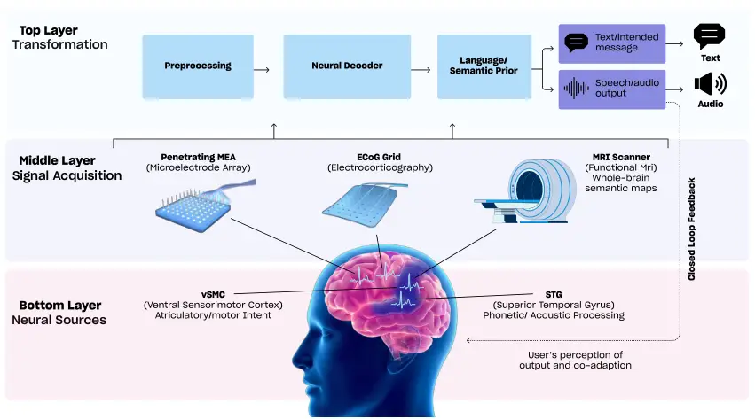
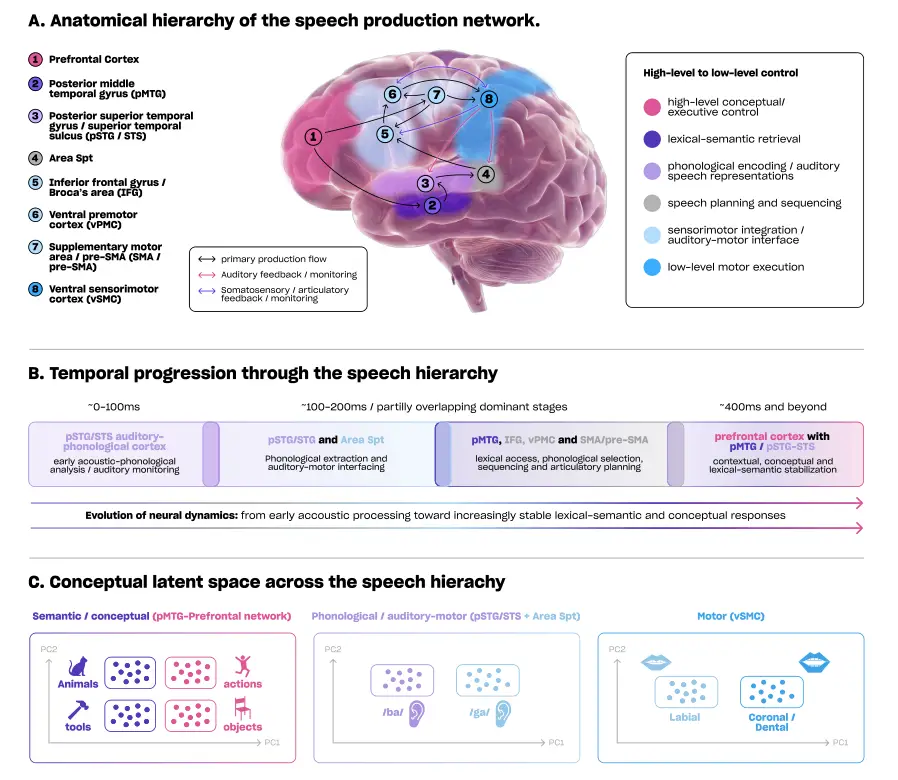

## \sharpfont1  \sharpfontIntroduction

### \sharpfont1.1  \sharpfontMotivation and clinical need

Speech enables rapid, flexible, and context-sensitive communication.
Neurological conditions that disrupt speech production or articulation,
including amyotrophic lateral sclerosis, brainstem stroke, spinal cord
injury, and advanced neurodegenerative disease, can therefore cause
profound loss of autonomy and quality of life despite largely preserved
cognition \[1, 2\]. Restoring communication is consequently a central
goal of brain–computer interface (BCI) research.

A speech BCI records neural activity, extracts task-relevant
information, and translates it into text, synthesized voice, avatar
control, or another communicative output, thereby bypassing impaired
peripheral motor pathways. Its objective is not merely neural
classification, but restoration of a communication channel that is
sufficiently rapid, reliable, and controllable for functional use.
Earlier BCIs established communication through cursor control or
letter-by-letter selection, but generally remained limited in rate and
usability \[3, 4\]. By accessing neural processes underlying speech
planning and production, speech BCIs could support more fluent and
naturalistic communication, particularly when high-resolution invasive
recordings are clinically justified \[5, 6\]. Recent word-, sentence-,
and continuous-text decoding studies demonstrate this potential \[7,
8\], while also exposing persistent barriers: performance can degrade
across time, require substantial training or recalibration, and
generalize poorly across sessions and individuals \[9, 10\]. Speech BCIs
therefore serve both as prospective clinical tools and as experimental
systems for studying speech, language, intention, and feedback-based
learning.

### \sharpfont1.2  \sharpfontWhat constitutes ”speech” for BCI?

Speech is not represented by a single neural variable, but by
distributed and temporally organized processes spanning articulatory
motor plans, acoustic features, phonological units, lexical
representations, semantics, prosody, and pragmatics \[11, 12\]. Speech
BCI studies target different levels of this hierarchy: some reconstruct
acoustic features or waveforms \[13, 14\]; others decode phonemes,
syllables, or words \[5, 15\]; and others map neural activity directly
to text or semantic representations \[16, 17\]. These choices are not
merely technical: they embody different assumptions about how speech is
represented and which representations are accessible, stable, and useful
for communication. They also determine the temporal resolution,
vocabulary constraints, training labels, output flexibility, and error
modes of the resulting system, with direct consequences for model
design, interpretation, and generalization.

The term also encompasses overt, attempted, silently mouthed, imagined,
and internally planned speech \[6, 18\]. These paradigms differ in
peripheral movement, motor intention, auditory–phonological imagery, and
higher-level linguistic planning. Explicitly defining the behaviour and
representational level being decoded is therefore essential for
comparing studies and designing clinically meaningful systems.

### \sharpfont1.3  \sharpfontWhy now: data scale, deep learning, chronic interfaces

Recent progress reflects three converging developments. First, invasive
recording technologies now provide higher-resolution cortical signals
over longer periods, including chronic recordings and richer
longitudinal datasets in clinical populations \[19\]. Second,
convolutional, recurrent, and attention-based sequence models have
improved the extraction of high-dimensional spatiotemporal structure
relative to earlier linear approaches \[20, 21\]; self-supervised
learning and speech- and text-pretrained foundation models further
enable representation learning and transfer across tasks and users \[22,
23\]. Third, closed-loop experiments show that users adapt their neural
strategies in response to decoder behaviour, causing neural
representations to evolve in ways that can improve decoder performance
over time \[24, 25\].

These developments motivate a systems-level view in which neural
representations, recording hardware, decoding models, language priors,
outputs, and feedback jointly determine performance. Figure 1 summarizes
this stack and the feedback processes through which communication
becomes adaptive rather than purely feedforward.



Figure 1: \sharpfontSpeech BCI system stack: from neural sources to
closed-loop communication. Speech BCIs can be viewed as a layered system
linking neural sources, recording interfaces, decoding models, and user
feedback. Bottom layer: neural sources and speech-related
representations. Speech-related activity is distributed across cortical
regions including ventral sensorimotor cortex (vSMC), associated with
articulatory and motor-intent representations, and superior temporal
gyrus (STG), associated with phonetic and acoustic processing. Middle
layer: signal acquisition. Neural activity can be captured using
recording technologies with different spatial, temporal, and clinical
trade-offs, including penetrating microelectrode arrays (MEAs),
electrocorticography (ECoG) grids, and non-invasive neuroimaging such as
fMRI for whole-brain semantic mapping. Top layer: computational
transformation. Recorded signals are preprocessed and passed through
neural decoders, often combined with language or semantic priors, to
generate communication outputs such as intended text or synthesized
speech/audio. The dashed feedback pathway illustrates closed-loop
operation, in which the user perceives the decoded output and adapts
subsequent neural activity, strategy, and control over time.

### \sharpfont1.4  \sharpfontScope and organization of this Review

This Review synthesizes speech BCI research through a system-level
framework integrating speech and language neuroscience, neural
engineering, and contemporary machine learning. Rather than organizing
the literature only by recording modality or decoding target, we focus
on the common scientific and technical challenges that cut across speech
BCI systems, including the hierarchical organization of speech, dynamic
neural representations, mismatches between neural activity and decoding
targets, and mutual adaptation between users and decoders.

We first examine the neural substrates and recording modalities that
determine what information is available to a BCI, followed by
representational targets and decoding paradigms ranging from linear
methods to foundation models. We then consider closed-loop
co-adaptation, evaluation, generalization, robustness, clinical
translation, and ethical implications. Across these topics, we examine
recurring trade-offs between signal resolution and invasiveness,
low-level motor and higher-level linguistic targets, language-model
fluency and fidelity to neural evidence, and decoder accuracy and user
agency. We treat learning, stability, and failure as properties of the
complete communication system rather than of the decoder alone. Box 1.4
summarizes how this framing extends prior reviews.


## \sharpfont2  \sharpfontNeural substrates of speech and language relevant to BCI

Speech emerges from coordinated cortical and subcortical systems
operating across multiple spatial and temporal scales rather than from a
single locus or static code. A useful BCI account must therefore connect
anatomy, representational level, population dynamics, and feedback
instead of assigning speech to an isolated region. This organization
constrains which variables can be decoded, how targets and labels should
be defined, how neural signals should be interpreted, and why
performance may fail to generalize across tasks, sessions, and
individuals.

### \sharpfont2.1  \sharpfontHierarchical organization of speech processing

Speech processing is hierarchical, although the direction of information
flow depends on behaviour. Perception generally progresses from acoustic
analysis toward phonological, lexical, and semantic representations,
whereas production transforms communicative intent into lexical,
phonological, articulatory, and motor commands \[28, 29, 30, 31, 32\].
Inner speech engages parts of this hierarchy without full muscular
execution or sensory consequences. Accordingly, no single region
represents “speech” in its entirety; different areas preferentially
encode different levels of the speech-processing hierarchy \[11, 12\].

Ventral sensorimotor and premotor cortices encode articulatory gestures
and motor plans \[33, 34\], whereas auditory cortex and superior
temporal gyrus represent acoustic and phonetic structure, with
increasing abstraction along temporal cortex \[35, 36, 29\]. Inferior
frontal and temporoparietal regions contribute to phonological
sequencing, lexical access, and semantic integration \[37, 38, 29\].
Speech BCIs therefore sample different points in the hierarchy:
reconstruction approaches often exploit auditory or sensorimotor
representations \[13, 14\], while text decoders increasingly use
higher-level linguistic structure \[7, 8, 2, 39\]. These targets span
articulatory and acoustic features, phonemes, syllables, words, and
sentence- or meaning-level representations. They differ in abstraction,
dimensionality, temporal granularity, stability, and task dependence,
and may form distinct geometries in neural population activity. Choosing
among them is therefore a substantive modelling decision rather than a
simple change of output vocabulary. Figure 2 summarizes the
corresponding anatomical, temporal, and representational landscape.



Figure 2: \sharpfontNeuroanatomical, temporal, and representational
structure of speech processing relevant to BCI. A. Schematic anatomical
hierarchy of the speech production network. Speech-related processing
spans high-level conceptual and executive control, lexical–semantic
retrieval, phonological and auditory speech representations, speech
planning and sequencing, sensorimotor integration, and low-level
articulatory motor execution. Numbered regions include prefrontal
cortex, posterior middle temporal gyrus (pMTG), posterior superior
temporal gyrus/superior temporal sulcus (pSTG/STS), Area Spt, inferior
frontal gyrus/Broca’s area (IFG), ventral premotor cortex (vPMC),
supplementary and pre-supplementary motor areas (SMA/pre-SMA), and
ventral sensorimotor cortex (vSMC). Arrows indicate primary production
flow together with auditory and somatosensory/articulatory feedback
pathways. B. Temporal progression through the speech hierarchy.
Speech-related neural dynamics evolve from early acoustic–phonological
analysis and auditory monitoring toward partially overlapping stages of
auditory–motor interfacing, lexical access, phonological selection,
sequencing, articulatory planning, and later contextual or conceptual
stabilization. The schematic timeline emphasizes that these stages
overlap rather than forming a strictly serial cascade. C. Conceptual
latent spaces across the speech hierarchy. Different representational
levels may support distinct decodable geometries in neural population
activity: semantic/conceptual representations may separate categories
such as animals versus tools or actions versus objects;
phonological/auditory–motor representations may separate speech sounds
such as /ba/ and /ga/; and motor representations in vSMC may separate
articulatory classes such as labial versus coronal/dental gestures.
These latent spaces are schematic rather than data-derived and are
intended to illustrate how the choice of decoding target selects
different levels of the speech hierarchy.

### \sharpfont2.2  \sharpfontSensorimotor integration and internal models

Speech production is inherently sensorimotor. Neural systems responsible
for generating speech movements are tightly coupled to those that
process auditory and somatosensory feedback, forming internal models
that predict the sensory consequences of motor commands \[40, 41\].
These predictive mechanisms enable rapid error correction and fluent
speech, even in the presence of noise or perturbation.

Evidence from neurophysiology and neuroimaging indicates that motor
regions encode not only outgoing articulatory commands but also
predicted sensory outcomes \[42, 34\]. Discrepancies between predicted
and actual feedback generate error signals that drive adaptive updates
to motor plans \[43\]. This tight coupling challenges simplistic
interpretations of neural activity as purely motor or sensory and
complicates the assignment of decoding targets in speech BCIs.

For BCIs, sensorimotor integration implies that neural signals used for
decoding are shaped by both intended speech and the feedback context
provided by the interface. Altering feedback modalities, latency, or
accuracy can therefore change the underlying neural representations
themselves, even when the overt task remains unchanged \[25, 24\]. This
observation foreshadows the importance of closed-loop co-adaptation,
discussed in later sections, and cautions against assuming a stationary
mapping between neural activity and speech targets.

### \sharpfont2.3  \sharpfontDistributed versus localized representations

Speech information is distributed across sensorimotor, temporal, and
frontal populations, with redundancy and overlap across regions \[36,
44\]. Individual neurons and electrodes can multiplex several features
depending on context \[35, 33\]. Pooling across populations can
therefore improve robustness and compensate for local variability, as
demonstrated with high-density ECoG and intracortical arrays \[5, 8\],
but distributed codes also complicate functional localization, electrode
selection, and the transfer of fixed feature sets across users and
sessions \[9, 10\]. Spatial organization also depends on the level of
the speech-processing hierarchy: articulatory and acoustic features
often show more localized and structured cortical organization, whereas
lexical and semantic information is represented more broadly across
distributed cortical regions \[45, 38\].

### \sharpfont2.4  \sharpfontTemporal dynamics, prediction, and feedback loops

Neural activity during speech reflects planning, execution, monitoring,
and correction on overlapping timescales \[46, 47\]. Predictive-coding
accounts propose that cortical systems continuously anticipate upcoming
sensory input and motor states \[48\], motivating sequence models that
capture temporal dependencies rather than decoding time points
independently \[20, 21\]. Speech BCIs also require alignment between
continuous neural dynamics and discrete, hierarchically organized
linguistic units whose boundaries may be variable, overlapping, or
unobserved. Unlike continuous kinematic targets in many motor BCIs,
phonemes, words, and sentences unfold at different rates and may lack
directly observed onset times. Decoding must therefore jointly infer
representation, segmentation, and sequence structure. Because delayed or
inconsistent feedback can perturb predictive loops and degrade control
\[43, 25\], temporal alignment and system latency are fundamental design
constraints.

### \sharpfont2.5  \sharpfontImplications for designing targets and labels

Decoding targets implicitly select a representational level and
assumptions about neural stability. Low-level targets may be vulnerable
to noise and drift, whereas high-level targets may allow language priors
to dominate neural evidence \[14, 8\]. Target selection should therefore
reflect the intended function of the interface, whether intelligible
speech synthesis, rapid text communication, or naturalistic interaction,
as well as the available neural coverage and supervision. Hybrid
neural–linguistic models, self-supervised objectives, and explicit
uncertainty estimation may improve transfer and robustness \[17, 23,
49\]. More broadly, labels should be treated as design choices within an
adaptive communication system rather than immutable ground truth. Their
value depends not only on offline decodability, but also on
interpretability, calibration burden, real-time controllability, and
compatibility with user feedback.

## \sharpfont3  \sharpfontRecording modalities and hardware considerations

Speech BCIs require recording interfaces that balance spatial
resolution, temporal fidelity, cortical coverage, long-term stability,
and clinical feasibility. No modality optimizes all of these dimensions.
Surface systems sample population activity across broader cortical
territories, penetrating arrays provide finer access to spiking and
local field potentials, and endovascular interfaces reduce implantation
burden at the cost of signal strength and spatial specificity. This
diversity is reflected in Utah-style arrays \[50, 51\], Neuralink’s
flexible-thread N1 \[52, 53\], Synchron’s Stentrode \[54\], and
Precision Neuroscience’s conformable Layer 7 surface interface \[55\].
Non-invasive methods avoid implantation but generally sacrifice some
combination of spatial resolution, signal-to-noise ratio, or real-time
practicality. Device geometry, channel count, materials, and
implantation strategy therefore constrain both decodable information and
longitudinal reliability \[51, 54, 56\].

### \sharpfont3.1  \sharpfontSurface, depth, and endovascular intracranial recordings

#### Electrocorticography (ECoG).

ECoG combines millisecond-scale temporal resolution, relatively high
signal quality, and broad cortical coverage with less tissue penetration
than intracortical arrays. Standard subdural grids use millimetre-scale
contacts, while newer high-density and thin-film systems improve
sampling over speech-relevant cortex \[57, 58\]. ECoG is particularly
sensitive to high-gamma activity
($`70\text{\,}\mathrm{H}\mathrm{z}150\text{\,}\mathrm{H}\mathrm{z}`$), a
population-level signal associated with local firing and articulatory
and phonetic representations \[59, 33\], and high-gamma features have
supported phoneme decoding, word classification, and continuous speech
reconstruction \[5, 13, 7\]. However, surface recordings do not resolve
single neurons, primarily sample exposed gyral cortex, and are often
placed according to clinical priorities. Coverage therefore varies
across individuals, while electrode impedance, physiology, and
behavioural context contribute to non-stationarity \[9\].

#### Stereoelectroencephalography (sEEG).

sEEG complements surface recordings by sampling deep and sulcal
structures, including medial temporal, insular, and inferior frontal
regions involved in speech and language \[60\]. Depth leads typically
contain roughly 5–18 cylindrical contacts along three-dimensional
trajectories \[61, 62\]. These recordings contain phonetic and lexical
information during speech perception and production \[63, 64\], and
permit investigation of hierarchical and cross-regional processing
consistent with the distributed organization described in Section 2.
Their sparse, individualized, clinically determined trajectories
nevertheless limit standardization and cross-subject transfer.

#### Endovascular recording.

Endovascular interfaces place electrodes within cerebral vessels near
cortical targets, providing neural access without open-brain
implantation. Their principal appeal is reduced procedural burden,
although current systems trade this advantage for lower spatial
specificity and signal amplitude.

### \sharpfont3.2  \sharpfontIntracortical microelectrode arrays

Intracortical arrays provide the highest spatial and temporal resolution
available in human BCIs by recording action potentials and local field
potentials from small neuronal populations \[50\]. Classical Utah
arrays, including NeuroPort, contain up to 96 penetrating silicon
electrodes and underpin many landmark studies \[50, 51\]. Newer designs
expand channel count and coverage; Neuralink’s N1, for example, uses 64
flexible threads carrying 1,024 electrodes \[52\].

Motor-cortical recordings have enabled rapid word and sentence decoding
at communication rates approaching natural speech under constrained
conditions \[65, 8\]. This bandwidth comes with greater invasiveness and
uncertain chronic reliability: tissue responses, micromotion, and
electrode failures can degrade signal quality over months or years \[10,
66\]. Translation therefore depends not only on decoder performance but
also on durable materials, surgical safety, and models that remain
useful despite changing recorded units.

### \sharpfont3.3  \sharpfontNon-invasive modalities

#### EEG, MEG, and fNIRS.

EEG, MEG, and fNIRS avoid implantation and may suit users for whom
surgery is inappropriate \[6\]. EEG and MEG offer high temporal
resolution but limited spatial specificity and sensitivity to
physiological and environmental artifacts \[67\]; fNIRS provides
somewhat better localization but its slow hemodynamic response is poorly
suited to rapid speech control \[68\]. MEG studies have demonstrated
constrained word decoding and speech-segment retrieval, while
naturalistic datasets such as MEG-MASC and LibriBrain have expanded
opportunities for studying speech and language processing \[22, 69, 70,
71\]. EEG language decoding has likewise expanded through datasets such
as ZuCo, although open-vocabulary EEG-to-text remains disputed because
apparent performance may partly reflect language-model priors, teacher
forcing, memorization, or dataset artefacts \[72, 73\]. These modalities
remain valuable for studying language representations and
lower-bandwidth applications, but currently lag invasive systems for
reliable, high-rate communication.

#### Functional MRI (fMRI).

fMRI provides whole-brain spatial coverage but measures neural activity
indirectly through slow hemodynamic responses. It is therefore
unsuitable for low-latency speech prostheses, yet important for mapping
distributed lexical, semantic, and discourse-level representations.
Continuous natural language produces widespread semantic maps across
temporal, parietal, and frontal cortex \[45\]. Large language models and
encoding–decoding frameworks have extended this work to reconstruction
of words, phrases, and narrative content from prolonged listening or
reading \[74, 17\]. These outputs primarily recover semantic gist and
depend on long integration windows and strong contextual priors. fMRI
consequently emphasizes higher-level representations, whereas invasive
systems more often target sensorimotor or phonetic signals for rapid
control (Sections 4 and 5); abstract representations may be more
distributed but are further from moment-to-moment intent and more
vulnerable to linguistic priors (Section 4).

fMRI has also supported representational similarity analysis, semantic
embedding alignment, self-supervised learning, and multimodal
neural–language modelling \[45, 17\]. These ideas increasingly influence
electrophysiological speech BCIs and foundation-model approaches
(Section 5.6), although prolonged data collection and strong model
dependence can encourage overstatement of the fidelity with which
internal speech or intent is recovered \[17\]. This concern connects
directly to mental privacy, agency, and the boundary between neural
evidence and model inference (Sections 9 and 11). fMRI is therefore
primarily a representational and methodological modality rather than a
direct clinical communication interface.

### \sharpfont3.4  \sharpfontDatasets, preprocessing pipelines, and feature extraction standards

Dataset construction and preprocessing often shape performance as
strongly as model architecture. Invasive datasets generally arise from
temporary presurgical ECoG/sEEG monitoring or dedicated chronic implants
in paralysis and ALS \[75, 8\]. ECoG studies commonly include fewer than
15 participants and tens of minutes to several hours of recording \[7,
5\], while intracortical studies involve very few implanted users and
intensive within-user training \[8\]. By contrast, fMRI semantic
decoding often requires hours of naturalistic exposure per participant
\[45, 17\], exemplifying the “deep neuroimaging paradigm” \[76\].
Performance across these regimes is therefore not directly comparable.

ECoG pipelines commonly combine filtering, re-referencing, and
standardized high-gamma envelopes \[59\]. Intracortical features may use
sorted spikes or threshold crossings, with multiunit measures
potentially more robust to chronic unit turnover \[10\]. Non-invasive
preprocessing emphasizes artifact suppression and weak-signal recovery:
EEG commonly removes ocular and muscle artifacts and applies spatial or
band-limited filtering \[67\], whereas fMRI requires motion correction,
normalization, temporal filtering, and explicit modelling of hemodynamic
delay \[45\]. Semantic decoding then estimates mappings between
contextual word or sentence embeddings extracted from language models
and BOLD responses for reconstruction \[17\].

Across modalities, neural time series must also be aligned to uncertain
linguistic labels without leakage. Forced alignment can estimate phoneme
or word timing, while continuous models often use context windows that
include preparatory activity. Naturalistic speech increases boundary
uncertainty, and fMRI adds temporal blurring. Because performance can
vary with referencing, normalization, windowing, artifact rejection,
alignment, and data splitting, reproducible studies should report
participants, recording duration and coverage, preprocessing and
features, label generation, alignment, and train/validation/test splits.

### \sharpfont3.5  \sharpfontLongitudinal stability and clinical constraints

Long-term recordings change with electrode encapsulation, neural
plasticity, cognitive state, and task context \[9\]. Representational
drift can be substantial even when behaviour remains stable \[10\].
Adaptive decoders, co-adaptive training, and robust representational
targets may mitigate this variability \[25, 77\], making adaptation a
core requirement for chronic use.

Recording choices must also account for fatigue, cognitive load,
comorbidities, and limited experimental tolerance in people with severe
speech impairment \[78, 79\]. Surgical risk, maintenance, and regulatory
demands further constrain chronic systems, while lesion extent, neural
reorganization, and compensatory strategies limit straightforward model
transfer \[78\]. Hardware and decoding strategies must therefore be
matched to realistic communication goals and designed for sustained,
individualized adaptation.

In the next section, we examine how choices of speech representation and
decoding target interact with these recording constraints.

## \sharpfont4  \sharpfontSpeech representations: what can (and should) be decoded?

The choice of representation determines what information a speech BCI
must extract, which errors it can tolerate, and how strongly it depends
on downstream priors. As discussed in Sections 2 and 3, neural
recordings provide partial access to a hierarchical and dynamic speech
system. Articulatory, acoustic, phonological, lexical, semantic, and
pragmatic targets therefore differ in their neural accessibility,
temporal granularity, interpretability, generalization, and clinical
utility.

- •
  Articulatory representations

  Articulatory representations describe configurations and movements of
  the lips, tongue, jaw, and larynx. They align closely with ventral
  sensorimotor and premotor activity, making them natural targets for
  invasive BCIs \[33, 34\]. ECoG and intracortical studies have inferred
  articulatory kinematics and converted them to intelligible speech
  through articulatory-to-acoustic synthesis \[80, 81\]. These targets
  can be interpretable and less speaker-specific than raw acoustics, but
  require assumptions and auxiliary models linking neural activity,
  kinematics, and sound, and may be less applicable to imagined speech
  without overt execution \[18\].

- •
  Acoustic representations

  Acoustic targets, including spectrograms and mel-frequency features,
  support direct reconstruction of audible speech from neural activity
  \[13, 14\]. Their physical structure relates to activity in auditory
  and sensorimotor cortex \[35\], and neural vocoders can transform
  decoded features into intelligible, natural-sounding output \[81\].
  However, acoustic decoding is sensitive to timing errors and noise,
  often requires substantial post-processing, and can entangle intended
  production with auditory feedback \[42\], limiting interpretation,
  generalization, and closed-loop control.

- •
  Phonetic and phonological units

  Phonetic and phonological units provide an intermediate representation
  between gestures and words. Superior temporal and sensorimotor
  populations encode features such as place and manner of articulation
  \[35, 36\], motivating phoneme and phoneme-sequence decoders \[5,
  82\]. Phonemes reduce output dimensionality and integrate naturally
  with language models \[15\], but externally defined inventories may
  not match neural organization, differ across languages and speakers,
  and require uncertain temporal alignment. Errors can also propagate
  when noisy phoneme sequences are converted into words.

- •
  Lexical, semantic, and pragmatic representations

  Word-, sentence-, and semantic-level decoders bypass lower-level
  representations and can support rapid text communication under
  constrained conditions \[7, 8\]. Such targets may be less sensitive to
  acoustic variability and potentially more stable across sessions
  \[45\]. Their central risk is that strong language models can produce
  fluent output weakly constrained by neural evidence, obscuring user
  intent and agency \[17\]. Pragmatic information—including
  conversational goals, context, and intended social action—remains
  largely unexplored despite being essential to natural communication
  and will require richer models of user state and interaction.

Beyond these primary representational targets, prosody conveys emphasis,
emotion, uncertainty, turn structure, and speaker identity through
intonation, rhythm, stress, rate, and intensity. Its correlates in
auditory and motor regions suggest that these features are decodable in
principle \[83, 46\]. Yet most BCIs optimize lexical accuracy and
intelligibility, leaving output flattened or monotonic even when the
words are correct. Prosody is difficult to model because it is variable,
subtle, and distributed across timescales, and conventional metrics such
as word error rate do not measure its preservation. Naturalistic systems
will therefore need to treat affect and prosody as both decoding targets
and evaluation dimensions.

In addition to what is decoded, representational accessibility also
depends on how speech is produced. Overt speech provides strong motor
and sensory signals but is unavailable to many intended users; mouthed
speech retains articulation without sound and has been decoded
successfully \[5\]. Imagined speech is clinically attractive because it
requires no overt movement, but its neural correlates are weaker, more
variable, and not necessarily equivalent to overt articulatory or
acoustic representations \[18, 68\]. Robust decoding may therefore
require distinct targets and training paradigms rather than
straightforward transfer from overt speech.

Across both representational targets and behavioural modes, externally
imposed labels may not align with the representations encoded by neural
populations \[11\]. This mismatch can produce brittle models, uncertain
alignment, and poor transfer even when within-dataset accuracy is high.
Adaptive targets, self-supervised objectives, and hybrid models may
instead allow useful representations to emerge from paired or unlabelled
data \[22, 23\]. What should be decoded is therefore inseparable from
how the system is trained, evaluated, and used: the optimal
representation is not simply the most decodable offline, but the one
that best supports accurate, controllable, and generalizable
communication.

In the next section, we examine how decoding paradigms and model
families operationalize these representational choices.

## \sharpfont5  \sharpfontDecoding paradigms and model families

The choice of decoding paradigm determines not only how neural activity
is translated into speech-related outputs, but also what assumptions are
made about temporal alignment, representational level, supervision, and
uncertainty. Sections 2–4 emphasized that speech-related neural activity
is hierarchical, distributed, and dynamic, and that recording modalities
provide incomplete and non-stationary access to this space. Decoders
therefore operate under fundamental constraints: they must map
high-dimensional, noisy, and drifting neural signals onto speech
representations whose appropriate level may itself be uncertain.

Figure 3.A summarizes speech BCI decoding along three complementary
axes: classical machine-learning and probabilistic decoders, deep
learning architectures, and training or inference strategies that
address alignment, uncertainty, adaptation, and linguistic priors.

Figure 3: \sharpfontMethods and evolution of speech BCI decoding. A.
Taxonomy of decoding models and training strategies. Speech BCI
pipelines span three complementary levels. Machine-learning and
probabilistic approaches provide feature-based mappings from neural
activity to speech-related targets, including regression and
classification models, Bayesian decoders, HMMs and state-space models,
and Kalman filters. Deep learning approaches learn representations
directly from neural time series using CNNs, recurrent and temporal
convolutional networks, transformers or conformers, and encoder–decoder
architectures. Training and inference strategies determine how neural
activity is aligned with speech outputs and how prior information is
incorporated, including frame-wise supervision, CTC,
sequence-to-sequence or autoregressive decoding, language-model fusion,
Bayesian inference, and transfer or self-supervised learning.
Importantly, these strategies are distinct from the underlying model
architecture; for example, CTC and language-model fusion specify
alignment or inference mechanisms rather than decoder architectures. B.
Evolving landscape of speech BCI research. Representative studies are
positioned by approximate publication year and recording modality,
including electrocorticography (ECoG), intracortical
microelectrode-array systems (MEA), and non-invasive approaches such as
fMRI, EEG, and MEG. The timeline highlights major methodological and
decoding milestones, from articulatory, phonetic, acoustic, and semantic
mapping to speech synthesis, large-vocabulary text decoding, rapid
calibration, streaming speech or audio generation, and
foundation-model-based approaches. Background shading distinguishes an
earlier _mapping and feasibility_ period from the more recent _LLM and
foundation-model era_, reflecting a broader shift toward
high-throughput, clinically oriented, scalable, and language-aware
communication systems. The timeline is selective rather than exhaustive
and summarizes major trends across the field.

At its most general, speech decoding can be framed as conditional
sequence modeling:

```math
\mathbf{y}_{1:T}\sim p_{\theta}(\mathbf{y}_{1:T}\mid\mathbf{x}_{1:U}),
```

where $`\mathbf{x}_{1:U}`$ denotes a multichannel neural time series and
$`\mathbf{y}_{1:T}`$ denotes an output sequence (articulatory
trajectories, acoustic features, phonemes, characters, or words). The
parameters $`\theta`$ define the decoder architecture. Different model
families correspond to different structural assumptions about this
conditional distribution — including how time is modeled, how alignment
is handled, and how uncertainty is represented.

### \sharpfont5.1  \sharpfontClassical pipelines and linear decoders

Early BCIs often relied on modular pipelines consisting of neural
feature extraction followed by a linear mapping to a behavioural or
speech target \[59, 57\]. Linear models remain particularly effective
for relatively low-dimensional motor-control tasks, such as decoding
reaching kinematics, where neural population activity can often be
mapped reliably to continuous movement variables. In speech BCIs,
linear, regularized linear, and logistic regression remain widely used
as strong and interpretable baselines \[5, 82\].

In its simplest form, regularized linear regression decoding can be
written as

```math
\hat{\mathbf{y}}=W\mathbf{x}+b,
```

with parameters estimated by minimizing

```math
\mathcal{L}_{\text{MSE}}=\|\mathbf{y}-W\mathbf{x}\|_{2}^{2}+\lambda\|W\|_{2}^{2}.
```

Here, $`\mathbf{x}\in\mathbb{R}^{d}`$ denotes a neural feature vector
extracted from a time window (e.g., high-gamma power across electrodes),
$`\mathbf{y}\in\mathbb{R}^{k}`$ denotes the corresponding speech target
(e.g., acoustic features or one-hot phoneme labels), and
$`\hat{\mathbf{y}}`$ is the model prediction. In practice,
$`\mathbf{x}`$ is often constructed from multichannel neural activity
over a fixed time window, implicitly assuming a predefined alignment
between neural activity and the corresponding speech target.

The appeal of this formulation lies in its bias–variance balance. With
limited data — common in invasive BCI studies — strong regularization
can yield stable generalization. Moreover, high-gamma power correlates
approximately linearly with local firing rates \[59, 33\], making linear
models surprisingly competitive within-session.

However, linear mappings cannot capture nonlinear population codes,
long-range dependencies, or hierarchical linguistic structure. They also
assume fixed alignment between neural features and output labels, an
assumption often violated in continuous speech tasks.

### \sharpfont5.2  \sharpfontState-space and probabilistic models

Speech unfolds dynamically, and neural signals often reflect latent
articulatory or planning processes. State-space models introduce
explicit latent dynamics:

```math
\displaystyle\mathbf{z}_{t} \displaystyle=A\mathbf{z}_{t-1}+\mathbf{w}_{t}, \tag{1}
```

```math
\displaystyle\mathbf{x}_{t} \displaystyle=C\mathbf{z}_{t}+\mathbf{v}_{t}, \tag{2}
```

where $`\mathbf{z}_{t}`$ represents latent speech states, and
$`\mathbf{w}_{t}\sim\mathcal{N}(0,Q)`$ and
$`\mathbf{v}_{t}\sim\mathcal{N}(0,R)`$ are typically modeled as
zero-mean Gaussian process and observation noise, respectively.

Inference computes

```math
p(\mathbf{z}_{t}\mid\mathbf{x}_{1:t}),
```

which, in decoding settings, is obtained by inverting this generative
model to estimate latent speech states from observed neural activity,
typically via Kalman filtering \[84, 85\]

The advantage is principled temporal smoothing and uncertainty
propagation. The limitation is that linear-Gaussian assumptions may
mismatch nonlinear cortical dynamics and complex phonetic transitions.

Hidden Markov models (HMMs) extend this idea to discrete sequences
\[86\], modeling phoneme transitions probabilistically. These models
encode discrete latent states and probabilistic transitions, enabling
explicit modeling of phoneme-level alignment via dynamic programming,
but require carefully designed state structures and sufficient labeled
data.

### \sharpfont5.3  \sharpfontDeep neural architectures: CNNs, RNNs, and TCNs

Deep learning reduces reliance on hand-engineered features by learning
hierarchical representations directly from neural signals. Convolutional
neural networks (CNNs) exploit local spatiotemporal structure across
electrode grids \[87, 88\].

Recurrent neural networks (RNNs) model temporal dependencies via hidden
states:

```math
\mathbf{h}_{t}=f_{\theta}(\mathbf{x}_{t},\mathbf{h}_{t-1}).
```

Here, $`f_{\theta}`$ denotes a nonlinear transition function
parameterized by $`\theta`$, and $`\mathbf{h}_{t}`$ represents the
hidden state summarizing past neural activity.

Vanilla RNNs suffer from vanishing gradients. Gated architectures such
as LSTMs \[89\] and GRUs introduce update mechanisms:

```math
\mathbf{h}_{t}=(1-\mathbf{z}_{t})\odot\mathbf{h}_{t-1}+\mathbf{z}_{t}\odot\tilde{\mathbf{h}}_{t}.
```

Here, $`\mathbf{z}_{t}`$ denotes a learned update gate (not to be
confused with the latent state in Section 5), $`\tilde{\mathbf{h}}_{t}`$
denotes the candidate hidden state proposed from the current input and
previous hidden state, and $`\odot`$ denotes element-wise
multiplication.

Intuitively, gates allow the network to retain long-range information
while filtering noise. GRUs are often preferred in BCI settings due to
fewer parameters and greater data efficiency, whereas LSTMs may provide
greater flexibility at the cost of increased sample complexity.

Temporal convolutional networks (TCNs) use dilated causal convolutions
to achieve large receptive fields without recurrence \[90\], enabling
stable gradient propagation and low-latency streaming
inference—properties particularly valuable for real-time BCIs.

### \sharpfont5.4  \sharpfontAlignment and sequence objectives: CTC and encoder–decoder models

A central challenge in neural-to-text decoding is unknown temporal
alignment between neural activity and linguistic units. Connectionist
Temporal Classification (CTC) addresses this by marginalizing over
monotonic alignments \[91\]:

```math
\mathcal{L}_{\text{CTC}}=-\log\sum_{\pi\in\mathcal{A}(\mathbf{y})}p_{\theta}(\pi\mid\mathbf{x}),
```

where $`\pi`$ denotes a path (frame-level labeling including blank
symbols), $`\mathbf{x}`$ represents the input neural sequence, and
$`\mathcal{A}(\mathbf{y})`$ denotes valid alignments.

CTC avoids requiring frame-level phoneme labels and supports streaming
inference. However, CTC assumes conditional independence between output
symbols given the encoder representations, which can limit modeling of
long-range linguistic dependencies and often motivates integration with
external language models.

Encoder–decoder models instead directly optimize:

```math
\mathcal{L}_{\text{CE}}=-\sum_{t=1}^{T}\log p_{\theta}(y_{t}\mid y_{<t},\mathbf{x}),
```

which corresponds to an autoregressive factorization of the output
sequence, where each token is conditioned on previously generated
outputs. This allows output tokens to condition on prior outputs,
improving linguistic coherence but increasing reliance on learned
priors, intensifying the need for calibration and ablation analysis.

### \sharpfont5.5  \sharpfontTransformers and attention mechanisms

Transformers replace recurrence with self-attention:

```math
\text{Attention}(Q,K,V)=\text{softmax}\!\left(\frac{QK^{\top}}{\sqrt{d_{k}}}\right)V
```

Here, $`Q`$, $`K`$, and $`V`$ denote learned query, key, and value
projections computed from the input neural sequence $`\mathbf{x}`$, and
$`d_{k}`$ is the key dimensionality.

Self-attention enables flexible integration over long temporal windows
and selective weighting of informative neural segments \[92\]. In speech
BCIs, this can improve robustness to local noise and facilitate sequence
modeling.

However, high-capacity attention models risk overfitting in small
datasets, and when combined with strong external language priors (e.g.,
via rescoring or constrained decoding), they can blur the boundary
between neural evidence and model-driven inference.

### \sharpfont5.6  \sharpfontSelf-supervised and contrastive objectives

Limited labeled data has motivated self-supervised learning (SSL),
including contrastive, reconstruction-based, and predictive objectives.
These approaches can exploit large unlabelled neural datasets to learn
more transferable representations, or leverage representations learned
from data-rich modalities such as speech audio to provide useful
structure for neural decoding \[93\]. Contrastive objectives such as
InfoNCE encourage alignment between neural and speech embeddings:

```math
\mathcal{L}_{\text{InfoNCE}}=-\log\frac{\exp(\mathbf{z}_{i}\cdot\mathbf{z}_{i}^{+}/\tau)}{\sum_{j}\exp(\mathbf{z}_{i}\cdot\mathbf{z}_{j}/\tau)}.
```

Here, $`\mathbf{z}_{i}`$ denotes an anchor embedding (e.g., neural),
$`\mathbf{z}_{i}^{+}`$ its matched positive (e.g., paired speech),
$`\{\mathbf{z}_{j}\}`$ are candidate embeddings (including negatives),
and $`\tau>0`$ is a temperature parameter.

Geometrically, matched neural–speech pairs are pulled together in
embedding space, while mismatched pairs are pushed apart. However,
contrastive learning depends critically on defining meaningful positive
and negative pairs. This is difficult when neural activity and speech
targets are not explicitly aligned, as in continuous, imagined, or
naturalistic speech paradigms. In such cases, models may learn shortcuts
based on stimulus timing, task structure, session identity, or other
non-speech covariates rather than communicative intent.

Other SSL objectives may partly mitigate this problem. Reconstruction
losses train models to recover masked or corrupted neural or speech
features from context, whereas predictive approaches such as joint
embedding predictive architectures (JEPAs) aim to predict abstract
target embeddings rather than reconstructing low-level inputs \[94,
95\]. These objectives may improve data efficiency and cross-session
robustness, but their success depends on designing pretext tasks that
capture speech-relevant neural structure rather than artefacts of the
experimental protocol.

### \sharpfont5.7  \sharpfontMultimodal alignment and foundation models

Multimodal models connect neural activity with acoustic, articulatory,
speech-model, or language-model representations. Contrastive alignment
between MEG or EEG and self-supervised speech embeddings has enabled
retrieval of perceived speech segments \[22\]. In invasive BCIs, related
systems first infer articulatory or acoustic representations and then
synthesize speech or text \[81, 96, 97\].

Foundation models contribute pretrained acoustic spaces and vocoders,
language priors for large-vocabulary decoding, and transferable neural
representations. Language models can correct noisy phoneme or subword
sequences \[7, 8, 17\], but fluent output may exceed what is supported
by the neural signal. Emerging neural foundation models instead seek
transfer across subjects, tasks, and recording modalities through
large-scale self-supervised pretraining \[16\]. Their value depends on
genuine transfer, robustness to distribution shift, and separation of
neural evidence from pretrained priors.

### \sharpfont5.8  \sharpfontUncertainty estimation and calibration

Reliable clinical deployment requires calibrated uncertainty. Predictive
variance can be decomposed as:

```math
\text{Var}(y\mid x)=\mathbb{E}_{\theta}[\text{Var}(y\mid x,\theta)]+\text{Var}_{\theta}[\mathbb{E}(y\mid x,\theta)].
```

Here, the expectations are taken with respect to uncertainty over model
parameters $`\theta`$ (e.g., an approximate posterior), separating
aleatoric uncertainty
$`\mathbb{E}_{\theta}[\mathrm{Var}(y\mid x,\theta)]`$ from epistemic
uncertainty $`\mathrm{Var}_{\theta}[\mathbb{E}(y\mid x,\theta)]`$.

Monte Carlo dropout approximates Bayesian model averaging by sampling
different dropout masks at inference:

```math
\hat{p}(y\mid x)\approx\frac{1}{M}\sum_{m=1}^{M}p_{\theta}^{(m)}(y\mid x),
```

where $`p_{\theta}^{(m)}`$ denotes the predictive distribution under the
$`m`$-th dropout sample.

Well-calibrated uncertainty enables abstention, fallback strategies, and
user-in-the-loop correction. This is particularly important when
language models amplify fluency despite weak neural evidence.

Across model families, architectural sophistication alone does not
guarantee meaningful decoding. Objective functions encode assumptions
about alignment and independence; model capacity shapes reliance on
priors; supervision regime determines generalization limits. As speech
BCIs evolve toward interactive, real-world systems, decoding must be
understood not merely as function approximation, but as probabilistic
inference under uncertainty within a closed-loop adaptive system. The
next section therefore turns to closed-loop learning and co-adaptation,
outlining why interactive dynamics are central to stability,
generalization, and clinical viability.

## \sharpfont6  \sharpfontEmpirical landscape of speech BCI studies: paradigms, modalities, and models

Encoding studies identify which speech features are represented in
neural activity, where they occur, and over what timescales; decoding
studies ask whether those signals can be transformed into useful outputs
such as phonemes, words, text, synthesized speech, or communication
actions. The two are complementary: encoding identifies candidate
regions, representations, and temporal windows, whereas decoding tests
whether they are sufficiently robust for communication. Their
progression across modalities is summarized in Figure 3.B.

This distinction matters because speech BCIs target multiple
representational levels. Ventral sensorimotor cortex contains
articulatory structure relevant to production, whereas superior temporal
cortex carries phonetic and acoustic information relevant to perception
\[33, 35\]; distributed fMRI responses can additionally support semantic
reconstruction when low-level articulatory detail is inaccessible
\[17\]. Intracranial studies further show that speech information is
distributed across motor, premotor, temporal, and association regions
\[98, 33, 99, 100\]. Recording site, target representation, and model
family should therefore be considered jointly: implantation strategy is
effectively a hypothesis about which level of the speech hierarchy can
best support the intended communication goal.

### \sharpfont6.1  \sharpfontEmpirical landscape across recording modalities

#### Intracortical and MEA studies.

Intracortical and microelectrode-array (MEA) systems provide temporally
precise, fine-grained access to motor-cortical population activity.
Early studies established that these signals contain phoneme- and
word-related information in people with paralysis \[101, 102\], building
on BrainGate demonstrations that useful neural ensembles can be recorded
over years \[103, 104\]. Their principal advantage is high-bandwidth,
low-latency access to attempted motor speech, although stability and
calibration remain central constraints.

The empirical trajectory has moved from structured motor communication
toward direct speech. Attempted handwriting showed that high-rate
communication can be restored through any expressive and reliably
decodable motor sequence, not only speech itself \[65\]. Subsequent
systems decoded attempted phonemes from ventral precentral cortex and
combined them with language models for large-vocabulary text output
\[8\]. Rapid calibration and sustained performance in ALS further moved
intracortical speech BCIs toward practical deployment \[2\]. In
particular, large-vocabulary accuracy with only brief daily calibration
\[2\] suggests that the bottleneck is shifting from signal availability
toward longitudinal stability. Across studies, the strongest results
generally combine low-level motor or subword targets, sequential neural
encoders, and language priors rather than unconstrained end-to-end
sentence generation.

#### ECoG and sEEG studies.

ECoG has generated the broadest speech BCI literature because it
balances cortical coverage, temporal resolution, and signal quality over
ventral sensorimotor and temporal regions. Foundational mapping studies
established distributed articulatory organization in sensorimotor cortex
and phonetic feature coding in superior temporal gyrus \[33, 35\]. Early
decoders then classified phonemes or mapped phone-level activity to
words \[82, 5\], establishing the value of intermediate speech units and
structured language models.

ECoG systems subsequently expanded from text to speech synthesis and
multimodal output. Articulatory intermediate representations improved
cortical speech synthesis \[81\]; attempted-speech decoding enabled
clinically useful communication in anarthria \[7\]; and later systems
supported silent spelling \[39\] as well as integrated text,
personalized audio, and avatar control \[97\]. These studies position
ECoG as a versatile substrate for restoring more than lexical content.

More recent systems target continuous, low-latency, and expressive
output, combining text, streaming audio, facial animation, and
conversational timing \[97, 105, 106\], while emphasizing prosody and
vocal identity as clinically meaningful dimensions \[106\].
High-fidelity vocoders have begun to recover person-specific tone and
prosodic characteristics \[106\] alongside multimodal communication
\[97\]. Performance comparisons should therefore extend beyond word
error rate to latency, intelligibility, expressivity, and preservation
of social identity. Depth and mixed intracranial recordings provide
complementary access to silent and imagined speech, including low- and
cross-frequency features that may differ from overt articulatory signals
\[107\]; although sEEG has produced fewer high-throughput prostheses, it
remains valuable for sampling distributed and deeper language networks.

#### Non-invasive and peripheral approaches.

Non-invasive methods occupy a different empirical niche. Large-scale
contrastive learning has enabled retrieval of perceived speech
representations from MEG and EEG \[22\], while earlier MEG studies found
decodable information in imagined and spoken phrases at substantially
lower performance than invasive systems \[108\]. fMRI is unsuitable for
real-time prosthetic control but has demonstrated reconstruction of
semantic and narrative content through language-model-based encoding and
decoding \[17\], shifting attention toward distributed high-level
representations and contextual priors.

Peripheral silent-speech systems provide an informative boundary case.
EMG decodes articulatory muscle activity rather than cortical signals,
yet shares problems of sequence alignment, speaker variability, and
absent acoustic output \[109\]. Surface EMG can support recognition and
synthesis when residual muscle activity remains \[110\], making it a
useful comparator for determining when invasive access provides
clinically meaningful gains. Semantic fMRI mapping further shows that
word meanings occupy reproducible distributed cortical spaces \[45\];
although not a direct communication technology, these maps inform
hypotheses about where higher-level intent may be accessible.

### \sharpfont6.2  \sharpfontEvolution of communication paradigms

Across modalities, communication BCIs have progressed from indirect
selection, through structured motor-sequence decoding, toward direct
speech restoration. Early P300 spelling used discrete, time-locked
choices that were straightforward to train and evaluate \[4, 111\];
intracortical cursor systems improved throughput but retained
point-and-click interaction \[112\]. Attempted handwriting then
demonstrated that an expressive motor alphabet could support rapid
communication without reconstructing speech itself \[65\].

Direct speech is more naturalistic but introduces variable timing,
larger output spaces, and stronger dependence on linguistic priors.
Imagined speech is additionally uncertain because the engaged production
stages and available signals differ across individuals \[107\].
High-performing clinical systems have therefore concentrated on
attempted speech in anarthria or severe dysarthria, where articulatory
intent may persist despite absent acoustic output \[7, 8, 2\]. The
appropriate paradigm should therefore be selected according to the
user’s residual neural and motor capacities rather than a universal
hierarchy of interfaces.

### \sharpfont6.3  \sharpfontFrom laboratory performance to user-centred utility

Three trends complicate direct comparison across the empirical
literature. First, sensor design is diversifying from penetrating arrays
toward surface, depth, endovascular, and minimally invasive systems,
making the relevant question not simply which decoder performs best, but
which interface best matches the communication target, surgical
constraints, and desired longevity. Second, effectors now span cursor
control, typing, handwriting, text, synthesized voice, and avatars, each
imposing different requirements for latency, vocabulary, calibration,
and effort. Third, studies vary substantially in recording sites,
channel counts, vocabularies, preprocessing, and predominantly
single-participant protocols. An apparent gain may therefore reflect
more favourable cortical coverage, a narrower task, additional training
data, or stronger linguistic post-processing rather than a superior
neural decoder.

Comparisons should accordingly report anatomical coverage, recording
duration, vocabulary and behavioural paradigm, alignment method,
calibration schedule, and the contribution of downstream priors. Neural
foundation models offer one possible route toward shared representations
by pretraining on larger non-invasive datasets and adapting to scarce
invasive data \[22\]. Lightweight test-time adaptation and temporally
masked architectures likewise aim to maintain performance across days
while reducing computation and recalibration \[113\]. Whether these
approaches genuinely improve transfer requires standardized reporting,
participant-independent tests where feasible, and leakage-resistant
benchmarks.

These concerns become more important as evaluation shifts from peak
laboratory accuracy toward reliability, independence, and sustainable
use. Early home-use studies showed that long-term value depends on
maintenance, electrode stability, and operation outside
researcher-controlled settings \[114, 115, 116, 54\]. More recent work
emphasizes digital participation and clinically meaningful functional
outcomes \[117, 118, 119, 120\], yet standardized patient-centred
measures remain limited \[120\]. Word error rate and communication speed
remain necessary, but do not capture whether users can initiate
interaction independently, recover from errors, communicate across
partners and contexts, or sustain use without excessive researcher or
caregiver support. Clinical utility therefore depends on minimizing
calibration, fatigue, cognitive load, and correction cost while
considering the complete system—including setup, feedback, user
interface, technical support, and fallback modes.

### \sharpfont6.4  \sharpfontFrom neural decoding to ASR-inspired pipelines

Alongside these shifts, contemporary neural speech decoders increasingly
resemble automatic speech recognition (ASR) systems: neural activity is
mapped to phonemes, characters, articulatory states, or acoustic
embeddings, which are then converted to text or synthesized speech
through language models and vocoders \[121, 81, 7, 8\]. CTC handles
unknown monotonic alignments between continuous neural streams and
symbol sequences \[91\]; recurrent transducers and sequence-to-sequence
models support streaming and broader temporal context \[122, 123, 124\].
Cross-task and cross-species pretraining extends this approach by
aligning attempted and imagined speech with audio-language
representations \[93\].

The analogy is nevertheless incomplete. Neural datasets are far smaller
than acoustic corpora, recordings drift over time, and the mapping from
neural activity to linguistic intent is less direct than that from sound
to text. Neural systems therefore require modality-specific inductive
biases, self-supervised objectives, and multi-task supervision \[96\].
Streaming also imposes causal constraints often hidden by offline
decoding, while strong language models can conceal neural errors through
plausible continuations. Systems therefore require ablations separating
neural evidence from gains due to linguistic priors, alongside tests of
latency, calibration, and stability. Without such controls, laboratory
and participant heterogeneity makes it difficult to attribute
improvements to modelling rather than recording conditions or
post-processing.

Collectively, the literature supports three conclusions. Speech
representations are distributed across cortical levels \[33, 35, 17\];
intermediate targets such as phonemes, articulatory gestures, and
handwriting strokes are often robust in data-limited settings \[82, 65,
8\]; and invasive systems currently provide the highest-throughput
communication, whereas non-invasive methods remain important for
perceptual and semantic modelling \[7, 22, 17\]. Language priors are now
integral to performance, but their contribution must be distinguished
from neural information. Table 1 summarizes representative studies,
methods, and outcomes. The central challenge is no longer demonstrating
that speech-related information is decodable, but matching interfaces,
representations, and models to the clinical and communicative needs of
individual users.


Table 1: Comprehensive Empirical Landscape: Anatomical Targets,
Modalities, and Data Granularity

## \sharpfont7  \sharpfontClosed-loop speech BCIs and co-adaptation

Speech-related activity is hierarchical and dynamic (Section 2),
recording interfaces drift (Section 3), and representational choices
trade off decodability, robustness, and agency (Section 4). These
constraints become most consequential in real-time use, where the
decoder enters the user’s sensorimotor and cognitive loop. Users
perceive outputs and errors, alter their strategy and neural activity,
and may co-adapt with the model. This interaction can improve control,
but can also destabilize performance, amplify bias, and obscure what the
system is decoding.

Closed-loop learning is fundamental to BCI operation \[3, 24, 25, 127\].
Speech adds strong internal models, predictive mechanisms, and
context-dependent feedback (Section 2); real-time inner-speech decoding
further raises questions about intention, privacy, and control over when
decoding occurs \[128\]. Figure 4 summarizes how brain adaptation,
decoder adaptation, feedback, and drift jointly shape stability and
long-term performance.

Figure 4: \sharpfontClosed-loop co-adaptation in speech BCIs. A.
Conventional one-way decoding treats the decoder as a feedforward
mapping from neural activity to speech output, with the user reacting
only after the output is produced. In contrast, interactive closed-loop
speech BCIs embed decoding within a feedback loop: decoded text or
synthesized speech is perceived by the user and can shape subsequent
neural activity, behavior, and control strategy. B. Co-adaptive
operation arises from coupled brain/user adaptation and decoder
adaptation. Brain/user adaptation includes neural plasticity, strategy
adaptation, reinforcement-driven learning, and neural re-tuning, whereas
decoder adaptation includes online learning, recalibration, drift
tracking, uncertainty-aware updates, and pseudo-labeling/self-training.
These processes interact through a shared system state defined by
latency, feedback modality, decoder uncertainty, user burden, and
stability. C. Feedback latency and feedback quality/modality richness
shape distinct operating regimes. Low-latency, informative feedback
supports stable and learnable interaction, shown as the green region.
High-quality but delayed feedback can create high-burden regimes, shown
in yellow, because rich feedback may still be difficult to use when
temporal credit assignment is disrupted. Delayed and low-quality
feedback can produce unstable regimes, shown in red, where control
becomes unreliable and learning may degrade. The blank lower-left region
represents fast but low-richness feedback: such feedback may be usable
for simple correction or coarse control, but is not assumed to provide
sufficient information for robust, stable speech learning. D. Across
longer timescales, neural drift, electrode degradation, and biological
signal changes can degrade performance when decoders remain fixed.
Periodic recalibration and co-adaptive updating can help maintain
performance during long-term or lifelong BCI operation.

### \sharpfont7.1  \sharpfontUser, decoder, and mutual adaptation

#### Brain adaptation to the decoder.

Users can learn to modulate neural activity even with a fixed decoder
through reinforcement, error-based learning, and reorganization of
population dynamics \[24, 25, 129\]. This learning is constrained by the
neural manifold accessible to the decoder \[129\]. In speech BCIs, users
may alter timing, exaggerate decodable features, or shift between
attempted articulation and phonological imagery. Such strategies can
improve control without reproducing canonical speech representations,
particularly when feedback reinforces a narrow neural control channel
\[127\]. Imagined-speech studies further show that continuous feedback
can improve controllability and reshape spectral and spatial tuning
\[130\]. Brain adaptation should therefore be measured and leveraged
rather than treated as nuisance variability.

#### Decoder adaptation to the brain.

Adaptation also occurs in the opposite direction. Decoders must track
changes caused by recording drift, fatigue, medication, motivation, and
user strategy (Section 3); otherwise performance often declines across
sessions \[9, 10\]. Supervised recalibration uses periodically collected
labelled data \[131\], whereas semi-supervised approaches update from
high-confidence pseudo-labels \[77\]. State-space methods can instead
model gradual changes in neural tuning explicitly \[85\].

Speech introduces ambiguous natural-language labels, cascading errors
from language priors, and the risk that rapid model updates destabilize
a learned user policy. Conservative, uncertainty-aware adaptation
(Section 5.8) can mitigate these risks \[132, 49, 133\]. Longitudinal
independent use further demonstrates that low calibration burden,
maintenance, and robust updating are practical requirements rather than
optional refinements \[134\].

#### Mutual co-adaptation.

In practice, brain and decoder usually adapt together. This can
accelerate learning, but also create unstable feedback loops and make
improvements difficult to attribute to neural control, decoder updates,
or stronger priors \[127\]. Mutual adaptation can be viewed as a coupled
dynamical system in which neural activity and model parameters evolve
under reward, error, and prediction signals \[48\]. Because speech
production is itself predictive and feedback-driven (Section 2), a
decoder changes the feedback environment and may reshape the processes
it measures. Computational models of user–decoder interaction therefore
argue that the best decoder is not necessarily the most accurate
offline, but the one that supports stable, learnable, low-burden control
\[135\].

Evaluation should consequently report learning curves and within-session
change, distinguish user-driven from model-driven improvement, and
separate neural evidence from language-model contributions \[17, 128\].
These distinctions are central to agency and interpretability.

### \sharpfont7.2  \sharpfontFeedback design: sensory channels, latency, and user burden

Feedback provides the link through which this co-adaptation occurs and
may be auditory, textual, phoneme-level, confidence-based, or
multimodal. Its latency and informativeness determine learning,
correction, workload, and conversational usability. Delays of even a few
hundred milliseconds can disrupt speech flow and sensorimotor prediction
\[43, 42\]. Streaming neuroprostheses reduce this gap and make
interaction feel more like speaking than typing \[7, 105\], although
causal decoding and short context windows can reduce accuracy.

Auditory feedback is naturalistic but may increase cognitive load when
errors are frequent; text is easier to inspect and correct but less
conversational. Imagined- and inner-speech systems also require explicit
control over when decoding is active \[128, 130\].Calibration time,
fatigue, attention, and the burden associated with errors should
therefore be treated as primary outcomes \[2, 78\], as discussed further
in Section 8.

### \sharpfont7.3  \sharpfontStability, drift correction, and lifelong operation

Over longer timescales, successful use must withstand electrode changes,
neural plasticity, cognitive-state variation, and context shifts \[10,
9\]. Speech strategy adds another source of drift because overt attempt
and imagery can differ in signal strength and representational structure
(Section 4) \[18, 128\].

Correction can occur at several levels: adaptive filtering and
normalization at the signal level; more invariant targets at the
representation level (Section 4) \[81, 45\]; recalibration and
uncertainty-aware updating at the model level \[77, 49, 133\]; and
feedback designs that prevent user and decoder from continually
“chasing” one another \[127, 135\]. Lifelong systems additionally
require safe update mechanisms, monitoring for unintended decoding, and
user-controlled gating, especially when inner speech is accessible
\[128\]. These requirements connect technical stability to the clinical
infrastructure considered in Section 10.

Closed-loop co-adaptation is thus a defining property of speech BCIs,
shaping learning, stability, generalization, and user experience. It
must be evaluated together with representational choice (Section 4) and
model design (Section 5), rather than as an afterthought to offline
accuracy.

## \sharpfont8  \sharpfontEvaluation, benchmarking, and reporting standards

Progress in speech BCI decoding reflects advances in model capacity
(Section 5) and neural recording (Section 3), but offline accuracy
captures only part of clinical utility. Closed-loop co-adaptation
(Section 7), non-stationarity (Section 3), and representation mismatch
(Section 4) can all separate benchmark performance from lived use.
Evaluation must therefore address fidelity, latency, throughput,
robustness, generalization, uncertainty, and user burden. Table 2A
summarizes the principal evaluation dimensions and their common
pitfalls.


Table 2: \sharpfontEvaluation and clinical translation considerations
for speech BCIs

### \sharpfont8.1  \sharpfontMetrics beyond accuracy: latency, information rate, and usability

Phoneme or word accuracy, character error rate, word error rate, and
sentence correctness remain essential measures of decoding fidelity \[5,
7, 8\], but they should not stand alone. Conversational use depends on
end-to-end latency because delays disrupt turn-taking, sensorimotor
prediction, and learning (Section 7.2) \[43, 42\]. Studies should
therefore decompose delay into acquisition, preprocessing, inference,
language-model integration, and rendering rather than report only
per-window computation \[105\].

Throughput should likewise be reported as words or characters per
minute, ideally after accounting for correction and error costs \[3\].
Aggregate rates can conceal severe semantic failures: a phonetic
substitution may be recoverable, whereas a plausible but unintended
semantic substitution can alter agency and safety \[17, 136\]. Error
analyses should therefore distinguish phonetic, lexical, and semantic
consequences and quantify the contribution of downstream priors.

Usability and workload are primary clinical outcomes, not ancillary
observations. Instruments such as the NASA Task Load Index and System
Usability Scale, together with structured interviews, can assess
fatigue, frustration, perceived control, and sustained acceptability
\[137, 138\]. Calibration time, attention demands, correction effort,
and the emotional cost of mis-decoding should be reported alongside
accuracy \[78, 2\].

### \sharpfont8.2  \sharpfontOffline versus online performance

Offline analyses can overestimate closed-loop performance because they
often use segmented trials, stable task structure, future context, or
non-causal processing \[127\]. Online operation adds strict latency
constraints, variable cognitive state, and reciprocal adaptation between
user and decoder \[25, 9\]. Clinically meaningful evaluation should
therefore prioritize online communication, including learning curves,
stability under drift, correction behaviour, and naturalistic
interaction. When full closed-loop testing is infeasible, evaluation
should approximate deployment through causal decoding, realistic
buffering, and interactive correction \[7, 8\].

Offline studies should also document segmentation, preprocessing
statistics, validation procedures, and participant-specific
language-model adaptation. Leakage can arise when test data influence
normalization, alignment, hyperparameter selection, or prior tuning;
confidence and calibration analyses do not repair an invalid split
\[133\].

### \sharpfont8.3  \sharpfontGeneralization across sessions, tasks, and subjects

Generalization is a defining challenge because neural features and user
strategies change across days \[10, 9\], while electrode coverage
(Section 3) and representational mismatch (Section 4) vary across users.
Longitudinal studies should report performance without recalibration,
after minimal recalibration, and the time and data required for
recovery. Where online adaptation is used (Section 7.1), its update
rules and stability safeguards should be specified.

Task generalization should include shifts from prompted to spontaneous
speech, words to sentences, and overt to imagined production (Section
4), with explicit analysis of failure modes \[18, 68\]. Cross-subject
transfer is harder because anatomy, pathology, language background, and
electrode placement differ. Anatomical or functional normalization,
shared latent spaces, and alignment to higher-level representations may
reduce this mismatch \[45, 139, 140, 141\]. Studies should state whether
training is subject-specific, pooled, or transfer-based and report
participant-level dispersion rather than cohort averages alone.

### \sharpfont8.4  \sharpfontRobustness to noise, artifacts, and non-stationarity

Robustness should cover measurement noise, channel loss, movement and
muscle artifacts, impedance changes, fatigue, and cognitive-state
variation. Speech tasks are especially vulnerable to facial, jaw, and
auditory confounds, particularly in non-invasive recordings \[67\].
Studies should document filtering, referencing, rejection criteria, and
controls for non-neural signals, including EMG contamination and
auditory-feedback timing \[42\].

Claims of robustness are stronger when supported by stress tests such as
channel removal, additive noise, temporal jitter, and cross-session
distribution shifts \[77\]. Calibration and uncertainty (Section 5.8)
should be evaluated under these perturbations so that confidence tracks
correctness and enables abstention or fallback modes \[49, 133, 142\].

### \sharpfont8.5  \sharpfontDatasets, benchmarks, and reproducibility checklists

Shared benchmarks remain limited by small cohorts, heterogeneous
protocols, privacy constraints, and clinically determined electrode
placement. Nevertheless, benchmark tasks should emphasize cross-session
decoding, limited supervision, causal streaming, and realistic
calibration rather than only within-session accuracy. Where data cannot
be shared, structured dataset documentation can still expose participant
characteristics, recording coverage, task design, annotations,
preprocessing, and known limitations.

At minimum, reports should describe diagnosis, severity, inclusion
criteria, medication, and relevant cognitive status \[143\]; modality,
electrode geometry and coverage, sampling, referencing, and signal
quality \[57, 10\]; and whether speech was prompted, spontaneous, overt,
mouthed, or imagined, including alignment and label uncertainty \[18\].
Model reports should specify architecture, preprocessing, splits,
hyperparameter selection, and leakage prevention. For systems using
language priors, authors should disclose training data, participant
adaptation, and ablations separating prior-driven from neurally
supported performance \[17, 8\]. Evaluation should additionally cover
online and offline performance, latency, calibration, stress tests,
workload, and usability \[137, 138\], together with code, data-access
conditions, environments, and licensing where feasible. Box 8.5A
summarizes these elements.


Evaluation practices determine what the field optimizes. Benchmarks
centred on constrained offline accuracy can overstate progress, whereas
metrics that incorporate latency, robustness, generalization,
uncertainty, and user burden better reflect clinical viability. The next
section considers how these requirements extend to naturalistic
communication, including conversation, context, personalization, and
multilingual use.

## \sharpfont9  \sharpfontToward naturalistic communication

Most speech BCI demonstrations still use prompted vocabularies, short
utterances, fixed timing, and structured laboratory tasks. Naturalistic
communication instead requires fluid, expressive, context-sensitive
interaction that supports real conversational goals with low burden and
preserved agency. This depends jointly on interactive speech
neuroscience (Section 2), long-term recording constraints (Section 3),
representational choices (Section 4), sequence models and priors
(Section 5), and closed-loop adaptation (Section 7). The studies
reviewed in Section 6 show progress toward attempted speech, synthesis,
and expressive output, but dialogue remains a central unmet goal. Moving
from decoding to communication therefore requires treating the interface
as an adaptive human–machine system rather than a one-way transcription
tool.

### \sharpfont9.1  \sharpfontConversational dynamics, context, and memory

Natural conversation relies on cooperative turn-taking, with response
gaps often lasting only a few hundred milliseconds despite substantial
planning demands \[144, 145, 146\]. Speech BCIs must therefore operate
incrementally, updating partial hypotheses rather than waiting for
complete sentences. End-to-end latency should be treated as a primary
outcome (Section 8.1), because even modest delays can disrupt turn
transitions and conversational synchrony \[144, 146\].

Incremental output also requires controlled commitment: uncertain words
should remain revisable until sufficient evidence accumulates.
Calibration, abstention, and confidence-aware display or speech (Section
5.8) can reduce severe semantic errors without eliminating
conversational flow \[133, 49\]. Streaming neuroprostheses already
produce words continuously rather than in delayed batches \[7, 105\],
but natural dialogue additionally depends on hesitation, repair,
backchannels, timing, and prosody. These interactive signals remain
largely absent from current evaluations despite their importance for
signalling attention, uncertainty, repair, and willingness to yield or
retain the conversational floor.

Beyond timing, natural communication depends on dialogue history, shared
knowledge, and pragmatic context. Language models can resolve ambiguity
in low-level neural outputs, but may also generate fluent text weakly
supported by neural evidence (Sections 5.6–5.8) \[7, 8\]. A useful
architecture separates three components: a streaming neural likelihood
over candidate units; a contextual language prior incorporating dialogue
history, user-specific style, and only explicitly permitted external
context; and a calibrated decision policy governing emission, revision,
or abstention. This separation makes each contribution auditable and
motivates prior ablations and counterfactual tests (Section 8.5)
\[133\].

Context also creates a memory-governance problem. Conversation history
may be useful over minutes, personal vocabulary over days, and stable
preferences over months, but persistence should be explicit, consented,
auditable, and user-editable. Inner-speech decoding further requires
user-controlled gating and clear transitions between active and inactive
decoding states \[128\]. Conversational memory should therefore not
emerge opaquely from continual updates, and users should be able to
inspect, correct, delete, or disable stored information.

### \sharpfont9.2  \sharpfontPersonalization and multilingual communication

#### Personalization and transfer.

High-performing invasive BCIs are currently personalized because
anatomy, electrode placement, and neural mappings vary substantially
across individuals (Section 5.6; Section 3) \[9\]. Personalization also
supports co-adaptation between user and decoder (Section 7) \[127, 25\],
but imposes substantial calibration and maintenance costs.

Cross-user pretraining seeks to capture shared neural–behavioural
structure and reduce this burden. Emerging intracortical results suggest
that cross-brain transfer may be feasible with appropriate alignment and
adaptation \[147\], while non-invasive systems such as Brain2Qwerty
illustrate how larger healthy-participant datasets may support scalable
pretraining \[148\]. A plausible compromise is hybrid personalization: a
general pretrained backbone with lightweight user-specific adapters,
updated conservatively under uncertainty (Sections 5.6–5.8, 7.1) \[77,
49\]. Such systems should be judged by reduced calibration, robustness
under longitudinal drift, and durable transfer, not merely by pretrained
scale or average cross-user accuracy.

#### Multilingual communication.

Personalization must also accommodate linguistic diversity. Most speech
BCI research has focused on English, although phoneme inventories,
syllable structure, morphology, orthography, and prosody vary widely
across languages (Section 4). Tonal languages add lexical pitch and
dense homophony, increasing demands on laryngeal control and contextual
disambiguation \[149, 126\]. Intracranial studies have nevertheless
decoded tonal speech and tone for brain-to-text and brain-to-speech
pipelines \[149, 126, 150, 150\].

Bilingual neuroprostheses indicate that shared articulatory
representations can support more than one language while output mappings
remain language-specific \[151\]. Multilingual decoding frameworks
further suggest that shared semantic spaces may support cross-lingual
transfer, including for low-resource languages \[152\]. Evaluation
should therefore include code-switching, tone contrasts, morphologically
diverse languages, and participant-level analysis across linguistic
backgrounds. Language priors should remain configurable, with their
training data, adaptation, and safeguards reported explicitly (Sections
8, 10).

### \sharpfont9.3  \sharpfontHuman–AI co-expression and interface design

Communication conveys prosody, emphasis, affect, timing, and identity as
well as words. Expressive neural speech, including intonation and pitch
control, demonstrates that these dimensions are technically accessible
\[106\] and supports treating prosody and affect as primary targets
(Section 4).

Greater expressivity also blurs the boundary between decoding and
generation. When an AI system selects prosody, paraphrases, or predicts
continuations, it becomes a co-author. Interfaces should therefore
provide rapid correction and rollback, distinguish neurally supported
content from model inference, and offer granular control over activation
and permitted outputs, particularly for inner speech \[128\].
Personalization should preserve the user’s vocabulary, tone, and
self-presentation rather than impose a generic voice. Because users
learn not only to control the decoder but also to communicate through
this coupled channel (Section 7.1) \[127\], transparency and agency are
integral to learning and trust, not merely ethical add-ons.

Naturalistic speech BCIs must therefore optimize interactive dialogue
rather than offline transcription alone: low-latency incremental
decoding, calibrated contextual fusion, efficient personalization,
multilingual robustness, expressive output, and explicit agency
safeguards. The next section considers the ethical, legal, and societal
implications of increasingly naturalistic and continuously available
communication systems.

## \sharpfont10  \sharpfontClinical translation and deployment

The scientific questions that animate speech BCI research—what can be
decoded, from where, and with what models (Sections 2–5)—ultimately
converge on whether these systems can restore communication safely,
reliably, and equitably in daily life. Translation requires clinically
meaningful endpoints, low-burden training and support, maintainability
under drift (Section 7), and regulatory oversight of both implantable
hardware and its software stack \[3, 143, 153\].

Deployment is shaped by heterogeneous clinical presentations, caregiver
involvement, long-term maintenance, data governance, cybersecurity, and
failure handling—constraints often underrepresented in academic
evaluation (Section 8). Recent communication neuroprostheses show that
practical success depends as much on system integration and operational
reliability as on decoder accuracy \[7, 8\]. Across implantable BCIs,
inconsistent and weakly standardized clinical outcomes remain a major
barrier to comparison and regulatory translation \[120\]. Table 2B
summarizes representative target populations, feasible recording
modalities, communication outputs, and deployment constraints.

### \sharpfont10.1  \sharpfontTarget populations and clinical endpoints

Speech BCIs primarily target people with preserved communicative intent
but severely impaired motor output, including ALS, brainstem stroke,
spinal cord injury, advanced cerebral palsy, and near locked-in states
\[2\]. Disease progression, residual movement, cognition, and home
support differ substantially across these groups and determine feasible
interfaces and training schedules.

Endpoints should therefore measure functional communication rather than
idealized offline accuracy alone. Beyond WER or CER (Section 8), studies
should quantify reliability across days, correction and breakdown
recovery, and real-world communication efficiency \[79\]. Autonomy
should include independent setup, calibration, and use, together with
reduced caregiver dependence \[134\]; patient-reported communication
participation and quality of life are also important. Safety assessment
must cover perioperative risk and long-term device complications
\[143\]. Priorities should match the intended use: progressive disease
may demand rapid onboarding and minimal recalibration, whereas stable
injury may permit longer training; synthesized speech emphasizes latency
and intelligibility, while brain-to-text additionally requires efficient
correction, privacy controls, and sustained home use \[7, 8\]. Endpoint
heterogeneity across implantable BCI studies reinforces the need for
population- and function-specific standards \[120\].

### \sharpfont10.2  \sharpfontDeployment burden, reliability, and accessibility

Training and calibration consume limited clinical resources and compete
with fatigue, attention, and caregiver availability. Even accurate
systems may be impractical if they require frequent, lengthy
recalibration \[2\]; home systems must also accommodate daily changes in
medication, sleep, and cognitive state (Section 7).

Caregiver burden also differs by modality. Non-invasive systems may
require cap placement, electrode preparation, and troubleshooting
\[79\], whereas implants shift burden toward charging, device
management, software updates, and technical support. Accessibility
further depends on surgical eligibility, specialist centres, cost and
reimbursement, literacy, language support, and assistive-technology
training. English-centric language models can compound these inequities
(Section 9.2). Multilingual interfaces, adaptable controls, and
caregiver-inclusive training should therefore be designed from the
outset.

Beyond initial training and access, sustained deployment requires
reliable operation under changing signals and real-world conditions.
Because long-term drift is expected (Section 7.3), the relevant
criterion is stable communication under realistic maintenance schedules
rather than invariant signals \[10, 9\]. Sustained use also requires a
service model for consented remote monitoring, clinical follow-up, safe
updates, and troubleshooting. Long-term independent use demonstrates
feasibility, but also the importance of engineering and support beyond
the offline decoder \[134, 79\].

Systems should also fail predictably: abstain when uncertain (Section
5.8), offer low-bandwidth fallback modes, and provide user-controlled
activation, particularly as inner-speech decoding improves \[49, 133,
128\]. Deployment favours streaming-capable, channel-robust, monitorable
models that can be updated within regulated software lifecycles \[153\],
rather than computationally intensive models dependent on non-causal
context or sensitive external data.

### \sharpfont10.3  \sharpfontRegulatory pathways and safety considerations

In the United States, implantable BCIs are regulated as medical devices,
and early human studies typically proceed under an Investigational
Device Exemption, including early feasibility pathways for
significant-risk devices \[154, 143\]. Dedicated FDA guidance addresses
preclinical testing, biocompatibility, electromagnetic compatibility,
packaging, human factors, and risk analysis \[143\]; recent
speech-restoration IDE clearances indicate accelerating translation
\[155, 156\].

Safety extends beyond implantation. Output safety requires preventing
unintended or misattributed communication, enabling user-controlled
activation, and displaying confidence and revision states (Sections 5.8
and 9.3) \[128, 133\]. Human-factors engineering must reduce workload
and error cascades \[143\], while cybersecurity and data protection are
essential for connected systems handling sensitive neural data \[157\].

Because many risks arise from software updates, translation also
requires lifecycle governance. ISO 14971 and IMDRF
software-as-a-medical-device frameworks provide structures for hazard
identification, clinical evaluation, risk control, and post-deployment
monitoring \[158, 153, 159\]. A central unresolved issue is how
continual adaptation (Section 7) can coexist with regulated change
control. Near-term systems may therefore favour conservative updates,
locked versions, and explicit recalibration protocols over autonomous
continual learning.

Clinical translation requires rebalancing priorities from peak accuracy
toward safe, reliable, equitable, and low-burden operation under
realistic constraints. The next section addresses the ethical, legal,
and societal implications of cognitive privacy, consent, agency, and
access as speech BCIs move into everyday communication.

## \sharpfont11  \sharpfontEthical, legal, and societal implications

As speech BCIs move toward clinical deployment (Section 10) and
naturalistic communication (Section 9), ethical, legal, and societal
questions become part of system design. These interfaces may access
internally generated language and increasingly combine neural evidence
with adaptive language models, complicating agency, authorship,
accountability, and bias (Sections 5–8). Emerging governance frameworks
therefore emphasize mental privacy, freedom of thought, and lifecycle
responsibility \[160, 161, 162, 163\]. The practical challenge is to
translate these principles into user control, transparent model
behaviour, equitable development, and accountable deployment. Box 8.5B
summarizes core design requirements.

### \sharpfont11.1  \sharpfontPrivacy of neural data and inner speech

Neural recordings may reveal information beyond intended communication,
including attention, affect, and internally generated language. This
sensitivity will increase with higher-channel-count implants, continuous
monitoring, and stronger models (Sections 3 and 5). Neural data should
therefore be treated as highly sensitive throughout collection, storage,
processing, and sharing \[160, 161, 164\].

Empirical decoding of covert or inner speech sharpens concerns about
mental privacy and the boundary between thought and communication \[128,
165\]. Outputs must remain _user-authorized_: decoding should occur only
when the user intends to communicate, with reliable activation and
deactivation \[128\]. Layered controls may combine a voluntary
“push-to-talk” signal with confirmation for low-confidence or
high-impact outputs (Section 5.8). Privacy-by-design should additionally
minimize collection and retention, secure storage and processing, and
restrict access \[160, 161\].

Consent must also persist across the system lifecycle. Users should be
able to review and revise permissions as models, interfaces, and
downstream uses evolve, including separate choices for attempted versus
covert speech, text versus audio output, conversational memory, and
cloud processing \[161\]. Researchers should clearly state what is and
is not being decoded to avoid both exaggerating capabilities and
understating risks \[165\].

### \sharpfont11.2  \sharpfontAgency, authorship, and responsibility

When speech BCIs fuse neural evidence with language-model priors
(Sections 5 and 9), fluent output may be partly inferred rather than
directly decoded. Interfaces should preserve authorship by exposing
confidence and revision states, enabling rapid rollback, and allowing
users to limit model-driven completion (Section 9.3). Systems that
paraphrase, summarize, or predict continuations should be described as
_co-expression_, not literal transcription, with clear provenance and
opt-out controls.

Accountability becomes difficult when erroneous output causes
reputational, relational, or legal harm. Although responsibility may be
distributed across users, clinicians, developers, and institutions,
systems can reduce risk through calibrated uncertainty, abstention, and
conservative defaults (Section 5.8) \[160, 161\]. Studies should
characterize phonetic and semantic errors, distinguish benign from
high-impact failures, quantify whether language models amplify or
conceal them, and test confirmation and veto mechanisms (Section 8.1)
\[133, 8, 17\].

### \sharpfont11.3  \sharpfontBias, fairness, and representativeness

Speech BCI bias can arise from small, clinically selected datasets;
English-dominant language models; heterogeneous disease and device
characteristics; and group-dependent calibration or confidence errors
\[133\]. Because participation depends on implant eligibility,
specialist access, and tolerance for long studies, datasets may not
represent the populations that could benefit. Studies should therefore
report clinical and demographic context, stratify performance by
relevant factors, and audit differential errors (Sections 8 and 9),
including across languages and dialects (Section 9.2). Clinical
heterogeneity—including lesion location, disease progression,
medication, fatigue, and cognitive state—can further produce systematic
performance differences (Section 10). Evaluation should also examine
whether thresholds, confidence estimates, and correction mechanisms work
comparably across groups (Section 8). When data cannot be shared,
datasheets and model cards can still document assumptions, exclusions,
and limitations \[166, 167\].

Fairness also concerns access. Cost, surgical availability, caregiver
training, multilingual support, and concentration in specialist centres
may widen existing health disparities \[161, 160\]. Benchmark design
should therefore include heterogeneous clinical cohorts and multilingual
tasks rather than optimizing only on highly curated English datasets
(Section 8).

### \sharpfont11.4  \sharpfontNeuro-rights and governance

The neurorights movement argues that existing human-rights frameworks
may not fully address threats to mental privacy, identity, and autonomy
\[162, 163\]. Chile has become a prominent case through constitutional,
legislative, and judicial developments concerning neurorights and mental
privacy \[168, 169\]. Internationally, the OECD Recommendation on
Responsible Innovation in Neurotechnology emphasizes stewardship,
safety, privacy, trust, and inclusive deliberation \[160\], while
UNESCO’s 2025 Recommendation foregrounds dignity, freedom of thought,
privacy, accountability, and lifecycle safeguards \[161\]. Together,
these initiatives imply stronger expectations for consent, data
governance, and constraints on sensitive or non-therapeutic uses \[164,
161\].

For speech BCIs, governance should translate into user-controlled
activation, minimized continuous recording, auditable logs, secure
processing, and restricted retention \[160, 161\]. Developers should
disclose language-model training and adaptation, and quantify how much
output derives from priors rather than neural evidence \[8, 17, 7\].
Lifecycle accountability should additionally govern software updates,
model adaptation, and post-deployment monitoring as regulated medical
software (Section 10) \[153\].

Ethical and societal considerations are therefore not peripheral
constraints: they determine what systems should decode, how outputs
should be represented, and which deployment pathways are acceptable. The
concluding section synthesizes the field’s scientific and translational
bottlenecks and identifies priorities for progress that preserve agency,
privacy, and equitable benefit.

## \sharpfont12  \sharpfontOpen challenges and future directions

Speech BCIs aim to restore communication by transforming neural activity
related to speech, language, or communicative intent into text,
synthesized speech, or another controllable output. Their progress must
be judged both by clinical utility and by the scientific insight they
provide into speech and language. Yet the properties that make these
systems powerful also make them difficult to deploy: invasive interfaces
offer high-bandwidth signals but require surgery and long-term
maintenance, whereas non-invasive systems are more accessible but remain
limited in specificity, bandwidth, and real-time reliability. The major
open challenges therefore concern which neural representations to
decode, how to maintain robust and flexible models, and how to build
sufficiently large and comparable datasets without compromising agency
or privacy.

- •
  Scientific bottlenecks. There is no single neural representation of
  communication to decode. Speech-related activity varies across time,
  cortical space, behavioural context, and individuals. At short
  timescales, neural signals mix planning, articulatory execution,
  sensory prediction, feedback, and error monitoring; over longer
  periods, they change with electrode properties, plasticity, fatigue,
  cognitive state, and user strategy \[9, 10\]. Different regions also
  emphasize different levels of the hierarchy: ventral sensorimotor and
  premotor areas often carry articulatory and motor-intent information,
  superior temporal regions represent acoustic and phonetic structure,
  and distributed temporal, parietal, and frontal networks support
  lexical, semantic, and contextual representations \[33, 35, 45\].
  These mappings vary further with anatomy, pathology, electrode
  placement, language, and compensatory strategies.

  A central question is therefore which representation, or combination
  of representations, best supports communication. Low-level
  articulatory and phonetic targets can enable fast, constrained
  decoding and have supported high-performance attempted-speech
  neuroprostheses \[8, 2\]. Higher-level semantic representations may be
  more distributed and potentially more stable, but are further removed
  from moment-to-moment intent and more susceptible to interpretation by
  language-model priors \[17\]. Future systems may need hierarchical
  models that combine low-level evidence with higher-level context while
  preserving traceability between neural signals and emitted content.
  Accordingly, future implantation strategies should be
  representation-driven, using functional mapping to identify the
  distributed—and where relevant bilateral—neural populations best
  matched to the intended communication function.

  Communication is also multimodal. People convey intent through speech,
  handwriting, typing, facial expression, prosody, gesture, gaze, and
  contextual cues. BCIs should therefore move beyond text transcription
  toward flexible communication repertoires that include synthesized
  voice, expressive prosody, avatar control, spelling, handwriting-like
  sequences, and other assistive outputs \[65, 97, 106\]. The ultimate
  target is communication rather than literal speech reconstruction: the
  optimal interface may exploit whichever neural representation or
  expressive channel provides the most reliable, controllable, and
  personally meaningful route from communicative intent to interaction.

  Intent is the final defining scientific challenge. As decoders become
  sensitive to inner or imagined speech, they must distinguish activity
  intended for communication from internal monologue. Possible
  approaches include deliberate activation signals, intent detection
  integrated into the decoder, and confirmation before releasing
  uncertain or high-impact outputs \[128\]. These mechanisms must be
  robust to false activation and remain easy to use under fatigue or
  limited motor control. Understanding how communicative intent is
  represented and changes during closed-loop use is therefore essential
  to building systems that are both powerful and trustworthy.

- •
  Technical bottlenecks. The foremost technical challenge is maintaining
  performance under neural non-stationarity. Even with fixed hardware,
  mappings between neural features and intended outputs change across
  hours, days, and months because of drift, fatigue, medication,
  plasticity, impedance changes, and evolving strategies \[9, 10\].
  Future systems will require adaptive normalization, robustness to
  channel loss, uncertainty-aware updates, and online learning that
  tracks change without catastrophic forgetting or destabilizing the
  user’s learned control policy.

  Rapid self-calibration is closely related. Participant-specific
  retraining can become burdensome for users and caregivers, so
  practical systems should minimize daily labelled data through
  supervised micro-calibration, semi-supervised learning from
  high-confidence predictions, drift-aware state-space models, or
  lightweight user-specific adapters on pretrained encoders \[131, 77,
  85\]. Adaptation must remain conservative, because erroneous
  pseudo-labels can reinforce mistakes and cause the brain and decoder
  to chase one another.

  Generalization across tasks is another unmet requirement. Current
  systems are usually optimized for prompted speech, phoneme
  classification, sentence reading, imagined speech, or another narrow
  paradigm. Everyday use requires transitions across spontaneous and
  prompted communication, vocabularies, output formats, languages, and
  cognitive strategies. Multi-task learning, task-conditioned decoders,
  shared latent spaces, and modular output heads may help, but must be
  evaluated under explicit task shifts rather than inferred from
  within-task accuracy.

  Finally, language models must support rather than override neural
  evidence. They improve fluency and large-vocabulary decoding but can
  mask weak signals and bias output toward statistically common phrases
  \[17, 8\]. This becomes especially problematic for unusual names,
  passwords, jokes, poetry, code-switching, or other low-probability
  content. Their influence should therefore be measurable, exposed, and
  adjustable through ablations, calibrated confidence, alternative
  hypotheses, and user-controlled correction. Technical progress should
  be assessed by sustained performance under drift, low calibration
  burden, cross-task flexibility, and transparent separation of neural
  evidence from linguistic priors rather than peak offline accuracy
  alone.

- •
  Data and benchmarking bottlenecks. Speech BCI research remains
  constrained by data scarcity. Invasive datasets depend on rare
  clinical opportunities, individualized electrode placement,
  participant fatigue, and limited recording time, while high-capacity
  models may require thousands of labelled trials from a single
  participant. This mismatch encourages overfitting to user identity,
  task structure, or recording conditions and limits transfer across
  sessions, participants, and communication contexts.

  Self-supervised and weakly supervised learning may reduce reliance on
  dense labels. Masked autoencoding, contrastive learning, predictive
  objectives, and joint embedding predictive architectures could learn
  reusable neural representations from unlabelled or weakly aligned
  recordings before task-specific fine-tuning \[22, 23\]. However,
  neural pretraining objectives can exploit shortcuts based on timing,
  stimulus identity, session structure, or artifacts. Positive and
  negative pairs, masking policies, context windows, and augmentations
  must therefore be designed around neural and behavioural structure and
  validated through stringent controls.

  Combining heterogeneous datasets presents an additional problem.
  Participants differ in anatomy, pathology, language, and implant
  location; channels do not correspond naturally across individuals; and
  tasks may involve overt, attempted, imagined, or perceived speech.
  Naive pooling may erase meaningful distinctions rather than produce
  general representations. Promising directions include anatomical or
  functional alignment, shared latent spaces, subject- and site-specific
  adapters, task conditioning, models that tolerate missing channels,
  and privacy-preserving multi-site learning. Foundation models will be
  useful only if they demonstrably reduce calibration and improve
  transfer under these sources of heterogeneity, rather than merely
  increasing model scale.

  Benchmarking must likewise move beyond heterogeneous within-session
  scores. Studies differ in vocabulary, recording duration,
  preprocessing, language-model use, latency, and whether evaluation is
  offline or online. Common benchmarks should test cross-session
  stability, low-calibration adaptation, channel loss, task transfer,
  causal streaming, closed-loop use, and separation of neural evidence
  from language priors. Participant-level results, calibration burden,
  and failure modes should accompany aggregate accuracy.

  A long-term priority is to make progress cumulative rather than
  study-specific. Where raw neural data cannot be openly shared,
  standardized reporting, common protocols, model cards, dataset
  datasheets, and federated or multi-site frameworks can still improve
  comparison and reuse \[166, 167\]. Larger datasets alone will not
  solve speech BCI decoding; they must be paired with inductive biases
  that reflect neural dynamics, speech hierarchy, communicative intent,
  and closed-loop interaction.

## \sharpfont13  \sharpfontConclusion

Speech BCIs have progressed from proof-of-concept demonstrations toward
increasingly high-performance systems capable of decoding attempted
speech, text, and synthesized voice. These advances show that neural
activity can support meaningful restoration of communication for people
with severe speech and motor impairments. Yet they also reveal that
speech BCIs are not simply a problem of mapping neural signals to words.
They are complex, adaptive systems in which neural representations,
recording hardware, decoding architectures, language priors, feedback,
and user learning interact over time.

A central message of this Review is that the future of speech BCIs
depends on aligning decoding targets with the neural representations
that are actually accessible, stable, and useful for communication.
Articulatory, phonetic, acoustic, lexical, semantic, and pragmatic
representations each offer different advantages and limitations.
Similarly, invasive and non-invasive modalities occupy different
positions in the trade-off between signal quality, clinical burden,
spatial coverage, temporal resolution, and long-term feasibility. No
single representation, model, or device will solve the problem in
isolation; progress will require system-level designs that explicitly
account for hierarchy, distribution, temporal dynamics,
non-stationarity, and closed-loop co-adaptation.

The next generation of speech BCIs will therefore need to move beyond
peak offline accuracy as the primary marker of progress. Clinically
meaningful systems must be robust across sessions, rapidly calibratable,
uncertainty-aware, low latency, and usable under the cognitive and
practical constraints of daily life. They must also make the
contribution of language models transparent, preserve the user’s ability
to communicate atypical or low-probability messages, and provide
safeguards against unintended decoding. As speech BCIs approach inner
speech, naturalistic dialogue, expressive synthesis, and multimodal
communication, questions of agency, authorship, privacy, and equity
become central design requirements rather than peripheral ethical
concerns.

Speech BCIs now sit at a pivotal point: the field has demonstrated that
restoring communication from brain activity is possible, but translating
this possibility into reliable, scalable, and user-controlled
communication remains an open scientific, technical, and clinical
challenge. Meeting this challenge will require closer integration
between speech neuroscience, neural engineering, machine learning,
clinical practice, and neuroethics. If these strands are developed
together, speech BCIs may not only restore a lost channel of
communication, but also reshape our understanding of how intentions,
language, and interaction are represented in the human brain.

## References

- \[1\] N. Birbaumer, “Breaking the silence: brain–computer interfaces
  (bci) for communication and motor control,” Psychophysiology, vol. 43,
  no. 6, pp. 517–532, 2006.
- \[2\] N. S. Card, M. Wairagkar, C. Iacobacci, X. Hou, T.
  Singer-Clark, F. R. Willett, E. M. Kunz, C. Fan, M. Vahdati Nia, D. R.
  Deo, et al., “An accurate and rapidly calibrating speech
  neuroprosthesis,” New England Journal of Medicine, vol. 391, no. 7,
  pp. 609–618, 2024.
- \[3\] J. R. Wolpaw, N. Birbaumer, D. J. McFarland, G. Pfurtscheller,
  and T. M. Vaughan, “Brain–computer interfaces for communication and
  control,” Clinical Neurophysiology, vol. 113, pp. 767–791, 2002.
- \[4\] L. A. Farwell and E. Donchin, “Talking off the top of your
  head: Toward a mental prosthesis utilizing event-related brain
  potentials,” Electroencephalography and Clinical Neurophysiology, vol.
  70, pp. 510–523, 1988.
- \[5\] C. Herff, D. Heger, A. De Pesters, D. Telaar, P. Brunner, G.
  Schalk, and T. Schultz, “Brain-to-text: decoding spoken phrases from
  phone representations in the brain,” Frontiers in neuroscience, vol.
  9, p. 217, 2015.
- \[6\] J. S. Brumberg, A. Nieto-Castanon, P. R. Kennedy, and F. H.
  Guenther, “Brain–computer interfaces for speech communication,” Speech
  communication, vol. 52, no. 4, pp. 367–379, 2010.
- \[7\] D. A. Moses, S. L. Metzger, J. R. Liu, G. K.
  Anumanchipalli, J. G. Makin, P. F. Sun, J. Chartier, M. E.
  Dougherty, P. M. Liu, G. M. Abrams, et al., “Neuroprosthesis for
  decoding speech in a paralyzed person with anarthria,” New England
  Journal of Medicine, vol. 385, no. 3, pp. 217–227, 2021.
- \[8\] F. R. Willett, E. M. Kunz, C. Fan, D. T. Avansino, G. H.
  Wilson, E. Y. Choi, F. Kamdar, M. F. Glasser, L. R. Hochberg, J. M.
  Henderson, and K. V. Shenoy, “A high-performance speech
  neuroprosthesis,” Nature, vol. 620, pp. 103–111, 2023.
- \[9\] D. Sussillo, M. M. Churchland, M. T. Kaufman, and K. V. Shenoy,
  “A neural network that finds a naturalistic solution for the
  production of muscle activity,” Nature Neuroscience, vol. 18, pp.
  1025–1033, 2015.
- \[10\] J. A. Perge, S. Zhang, W. Q. Malik, M. L. Homer, S. Cash, G.
  Friehs, E. N. Eskandar, J. P. Donoghue, and L. R. Hochberg,
  “Reliability of directional information in unsorted spikes and local
  field potentials recorded in human motor cortex,” Journal of neural
  engineering, vol. 11, no. 4, p. 046007, 2014.
- \[11\] G. Hickok and D. Poeppel, “The cortical organization of speech
  processing,” Nature Reviews Neuroscience, vol. 8, pp. 393–402, 2007.
- \[12\] C. J. Price, “A review and synthesis of the first 20 years of
  pet and fmri studies of heard speech, spoken language and reading,”
  NeuroImage, vol. 62, pp. 816–847, 2012.
- \[13\] B. N. Pasley, S. V. David, N. Mesgarani, A. Flinker, S. A.
  Shamma, N. E. Crone, R. T. Knight, and E. F. Chang, “Reconstructing
  speech from human auditory cortex,” PLoS Biology, vol. 10, p.
  e1001251, 2012.
- \[14\] H. Akbari, B. Khalighinejad, J. L. Herrero, A. D. Mehta,
  and N. Mesgarani, “Towards reconstructing intelligible speech from the
  human auditory cortex,” Scientific Reports, vol. 9, p. 874, 2019.
- \[15\] D. A. Moses, M. K. Leonard, J. G. Makin, and E. F. Chang,
  “Real-time decoding of question-and-answer speech dialogue using human
  cortical activity,” Nature communications, vol. 10, no. 1, p.
  3096, 2019.
- \[16\] Y. Zhang, L. He, C. Fan, T. Liu, H. Yu, T. Le, J. Li, S.
  Linderman, L. Duncker, F. R. Willett, et al., “Decoding inner speech
  with an end-to-end brain-to-text neural interface,” arXiv preprint
  arXiv:2511.21740, 2025.
- \[17\] J. Tang, A. LeBel, S. Jain, and A. G. Huth, “Semantic
  reconstruction of continuous language from non-invasive brain
  recordings,” Nature Neuroscience, vol. 26, no. 5, pp. 858–866, 2023.
- \[18\] S. Martin, I. Iturrate, J. d. R. Millán, R. T. Knight,
  and B. N. Pasley, “Decoding inner speech using electrocorticography:
  Progress and challenges toward a speech prosthesis,” Frontiers in
  neuroscience, vol. 12, p. 422, 2018.
- \[19\] J. L. Collinger, B. Wodlinger, J. E. Downey, W. Wang, E. C.
  Tyler-Kabara, D. J. Weber, A. J. C. McMorland, M. Velliste, M. L.
  Boninger, and A. B. Schwartz, “High-performance neuroprosthetic
  control by an individual with tetraplegia,” The Lancet, vol. 381, pp.
  557–564, 2013.
- \[20\] D. Sussillo, S. D. Stavisky, J. C. Kao, S. I. Ryu, and K. V.
  Shenoy, “Making brain–machine interfaces robust to future neural
  variability,” Nature Communications, vol. 7, p. 13749, 2016.
- \[21\] J. I. Glaser, A. S. Benjamin, R. H. Chowdhury, M. G.
  Perich, L. E. Miller, and K. P. Kording, “Machine learning for neural
  decoding,” eneuro, vol. 7, no. 4, pp. ENEURO–0506, 2020.
- \[22\] A. Défossez, C. Caucheteux, J. Rapin, O. Kabeli, and J.-R.
  King, “Decoding speech perception from non-invasive brain recordings,”
  Nature Machine Intelligence, vol. 5, no. 10, pp. 1097–1107, 2023.
- \[23\] D. Jayalath, G. Landau, B. Shillingford, M. Woolrich,
  and O. P. Jones, “The brain’s bitter lesson: Scaling speech decoding
  with self-supervised learning,” arXiv preprint arXiv:2406.04328, 2024.
- \[24\] D. M. Taylor, S. I. H. Tillery, and A. B. Schwartz, “Direct
  cortical control of 3d neuroprosthetic devices,” Science, vol. 296,
  pp. 1829–1832, 2002.
- \[25\] K. Ganguly and J. M. Carmena, “Emergence of a stable cortical
  map for neuroprosthetic control,” PLoS Biology, vol. 7, p.
  e1000153, 2009.
- \[26\] S. Luo, Q. Rabbani, and N. E. Crone, “Brain-computer
  interface: applications to speech decoding and synthesis to augment
  communication,” Neurotherapeutics, vol. 19, no. 1, pp. 263–273, 2022.
- \[27\] A. B. Silva, K. T. Littlejohn, J. R. Liu, D. A. Moses,
  and E. F. Chang, “The speech neuroprosthesis,” Nature Reviews
  Neuroscience, vol. 25, no. 7, pp. 473–492, 2024.
- \[28\] A. Goldstein, Z. Zada, E. Buchnik, M. Schain, A. Price, B.
  Aubrey, A. Flinker, W. Doyle, D. Friedman, P. Dugan, L. Melloni, R.
  Reichart, S. Devore, A. Flinker, O. Devinsky, and U. Hasson, “Shared
  computational principles for language processing in humans and deep
  language models,” Nature Neuroscience, vol. 25, pp. 369–380, Mar 2022.
- \[29\] A. Goldstein, H. Wang, L. Niekerken, M. Schain, Z. Zada, B.
  Aubrey, T. Sheffer, S. A. Nastase, H. Gazula, A. Singh, et al., “A
  unified acoustic-to-speech-to-language embedding space captures the
  neural basis of natural language processing in everyday
  conversations,” Nature human behaviour, vol. 9, no. 5, pp.
  1041–1055, 2025.
- \[30\] L. Evanson, C. Bulteau, M. Chipaux, G. Dorfmüller, S.
  Ferrand-Sorbets, E. Raffo, S. Rosenberg, P. Bourdillon, and J.-R.
  King, “Emergence of language in the developing brain,” arXiv preprint
  arXiv:2512.05718, 2025.
- \[31\] J. Gadonneix, M. Zhang, J. Rapin, L. Evanson, P. Bourdillon,
  and J.-R. King, “Temporal structure of the language hierarchy within
  small cortical patches,” arXiv preprint arXiv:2604.03021, 2026.
- \[32\] M. Zhang, J. Lévy, S. d’Ascoli, J. Rapin, F. Alario, P.
  Bourdillon, S. Pinet, J.-R. King, et al., “From thought to action: How
  a hierarchy of neural dynamics supports language production,” arXiv
  preprint arXiv:2502.07429, 2025.
- \[33\] K. E. Bouchard, N. Mesgarani, K. Johnson, and E. F. Chang,
  “Functional organization of human sensorimotor cortex for speech
  articulation,” Nature, vol. 495, no. 7441, pp. 327–332, 2013.
- \[34\] C. Cheung, L. S. Hamilton, K. Johnson, and E. F. Chang, “The
  auditory representation of speech sounds in human motor cortex,”
  eLife, vol. 5, p. e12577, 2016.
- \[35\] N. Mesgarani, C. Cheung, K. Johnson, and E. F. Chang,
  “Phonetic feature encoding in human superior temporal gyrus,” Science,
  vol. 343, no. 6174, pp. 1006–1010, 2014.
- \[36\] E. F. Chang, J. W. Rieger, K. Johnson, M. S. Berger, N. M.
  Barbaro, and R. T. Knight, “Categorical speech representation in human
  superior temporal gyrus,” Nature Neuroscience, vol. 13, no. 11, pp.
  1428–1432, 2010.
- \[37\] A. D. Friederici, “The brain basis of language processing:
  from structure to function,” Physiological Reviews, vol. 91, no. 4,
  pp. 1357–1392, 2011.
- \[38\] I. Blank, Z. Balewski, K. Mahowald, and E. Fedorenko,
  “Syntactic processing is distributed across the language system,”
  Neuroimage, vol. 127, pp. 307–323, 2016.
- \[39\] S. L. Metzger, J. R. Liu, D. A. Moses, M. E. Dougherty, M. P.
  Seaton, K. T. Littlejohn, J. Chartier, G. K. Anumanchipalli, A.
  Tu-Chan, K. Ganguly, et al., “Generalizable spelling using a speech
  neuroprosthesis in an individual with severe limb and vocal
  paralysis,” Nature communications, vol. 13, no. 1, p. 6510, 2022.
- \[40\] G. Hickok, J. Houde, and F. Rong, “Sensorimotor integration in
  speech processing: computational basis and neural organization,”
  Neuron, vol. 69, no. 3, pp. 407–422, 2011.
- \[41\] F. H. Guenther, Neural Control of Speech. Cambridge, MA: MIT
  Press, 2016.
- \[42\] J. A. Tourville, K. J. Reilly, and F. H. Guenther, “Neural
  mechanisms underlying auditory feedback control of speech,”
  Neuroimage, vol. 39, no. 3, pp. 1429–1443, 2008.
- \[43\] J. F. Houde and M. I. Jordan, “Sensorimotor adaptation in
  speech production,” Science, vol. 279, no. 5354, pp. 1213–1216, 1998.
- \[44\] M. K. Leonard, M. O. Baud, M. J. Sjerps, and E. F. Chang,
  “Perceptual restoration of masked speech in human cortex,” Nature
  Communications, vol. 7, p. 13619, 2016.
- \[45\] A. G. Huth, W. A. de Heer, T. L. Griffiths, F. E. Theunissen,
  and J. L. Gallant, “Natural speech reveals the semantic maps that tile
  human cerebral cortex,” Nature, vol. 532, no. 7600, pp. 453–458, 2016.
- \[46\] G. B. Cogan, T. Thesen, C. Carlson, W. Doyle, O. Devinsky,
  and B. Pesaran, “Sensory-motor transformations for speech occur
  bilaterally,” Nature, vol. 507, no. 7490, pp. 94–98, 2014.
- \[47\] D. R. Euston, A. J. Gruber, and B. L. McNaughton, “The role of
  medial prefrontal cortex in memory and decision making,” Neuron, vol.
  76, no. 6, pp. 1057–1070, 2012.
- \[48\] K. Friston, “The free-energy principle: a unified brain
  theory?,” Nature Reviews Neuroscience, vol. 11, no. 2, pp.
  127–138, 2010.
- \[49\] Y. Gal and Z. Ghahramani, “Dropout as a bayesian
  approximation: Representing model uncertainty in deep learning,” in
  International Conference on Machine Learning (ICML), pp.
  1050–1059, 2016.
- \[50\] L. R. Hochberg, D. Bacher, B. Jarosiewicz, N. Y. Masse, J. D.
  Simeral, J. Vogel, S. Haddadin, J. Liu, S. S. Cash, P. van der Smagt,
  and J. P. Donoghue, “Reach and grasp by people with tetraplegia using
  a neurally controlled robotic arm,” Nature, vol. 485, no. 7398, pp.
  372–375, 2012.
- \[51\] E. J. Davidoff, “Agency and accountability: ethical
  considerations for brain-computer interfaces,” The Rutgers journal of
  bioethics, vol. 11, p. 9, 2020.
- \[52\] E. Musk et al., “An integrated brain-machine interface
  platform with thousands of channels,” Journal of medical Internet
  research, vol. 21, no. 10, p. e16194, 2019.
- \[53\] Neuralink, “Prime study progress update,” Apr. 2024. Published
  April 12, 2024.
- \[54\] P. Mitchell, S. C. Lee, P. E. Yoo, A. Morokoff, R. P.
  Sharma, D. L. Williams, C. MacIsaac, M. E. Howard, L. Irving, I.
  Vrljic, et al., “Assessment of safety of a fully implanted
  endovascular brain-computer interface for severe paralysis in 4
  patients: the stentrode with thought-controlled digital switch
  (switch) study,” JAMA neurology, vol. 80, no. 3, pp. 270–278, 2023.
- \[55\] M. Hettick, E. Ho, A. J. Poole, M. Monge, D. Papageorgiou, et
  al., “Minimally invasive implantation of scalable high-density
  cortical microelectrode arrays for multimodal neural decoding and
  stimulation,” Nature Biomedical Engineering, 2025.
- \[56\] M. Schröter, F. Cardes, C.-V. H. Bui, L. D. Dodi, T.
  Gänswein, J. Bartram, L. Sadiraj, P. Hornauer, S. Kumar, M.
  Pascual-Garcia, et al., “Advances in large-scale electrophysiology
  with high-density microelectrode arrays,” Lab on a Chip, vol. 25, no.
  19, pp. 4844–4885, 2025.
- \[57\] E. C. Leuthardt, G. Schalk, J. R. Wolpaw, J. G. Ojemann,
  and D. W. Moran, “A brain–computer interface using
  electrocorticographic signals in humans,” Journal of Neural
  Engineering, vol. 1, no. 2, pp. 63–71, 2004.
- \[58\] M. S. Fifer, G. Hotson, B. A. Wester, D. P. McMullen, Y.
  Wang, M. S. Johannes, K. D. Katyal, J. B. Helder, M. P. Para, R. J.
  Vogelstein, et al., “Simultaneous neural control of simple reaching
  and grasping with the modular prosthetic limb using intracranial eeg,”
  IEEE transactions on neural systems and rehabilitation engineering,
  vol. 22, no. 3, pp. 695–705, 2013.
- \[59\] N. E. Crone, D. L. Miglioretti, B. Gordon, and R. P. Lesser,
  “Functional mapping of human sensorimotor cortex with
  electrocorticographic spectral analysis. ii. event-related
  synchronization in the gamma band,” Brain, vol. 121, no. 12, pp.
  2301–2315, 1998.
- \[60\] G. Buzsáki, C. A. Anastassiou, and C. Koch, “The origin of
  extracellular fields and currents — eeg, ecog, lfp and spikes,” Nature
  Reviews Neuroscience, vol. 13, no. 6, pp. 407–420, 2012.
- \[61\] G. Li, S. Jiang, S. E. Paraskevopoulou, M. Wang, Y. Xu, Z.
  Wu, L. Chen, D. Zhang, and G. Schalk, “Optimal referencing for
  stereo-electroencephalographic (seeg) recordings,” NeuroImage, vol.
  183, pp. 327–335, 2018.
- \[62\] H. M. Khoo, J. A. Hall, F. Dubeau, N. Tani, S. Oshino, Y.
  Fujita, J. Gotman, and H. Kishima, “Technical aspects of seeg and its
  interpretation in the delineation of the epileptogenic zone,”
  Neurologia medico-chirurgica, vol. 60, no. 12, pp. 565–580, 2020.
- \[63\] A. Flinker, A. Korzeniewska, A. Y. Shestyuk, P. J.
  Franaszczuk, N. F. Dronkers, R. T. Knight, and N. E. Crone,
  “Redefining the role of broca’s area in speech,” Proceedings of the
  National Academy of Sciences, vol. 112, no. 9, pp. 2871–2875, 2015.
- \[64\] J. Chartier, G. K. Anumanchipalli, K. Johnson, and E. F.
  Chang, “Encoding of articulatory kinematic trajectories in human
  speech sensorimotor cortex,” Neuron, vol. 98, no. 5, pp.
  1042–1054, 2018.
- \[65\] F. R. Willett, D. T. Avansino, L. R. Hochberg, J. M.
  Henderson, and K. V. Shenoy, “High-performance brain-to-text
  communication via handwriting,” Nature, vol. 593, no. 7858, pp.
  249–254, 2021.
- \[66\] J. C. Barrese, N. Rao, K. Paroo, C. Triebwasser, C.
  Vargas-Irwin, L. Franquemont, and J. P. Donoghue, “Failure mode
  analysis of silicon-based intracortical microelectrode arrays in
  non-human primates,” Journal of Neural Engineering, vol. 10, no. 6, p.
  066014, 2013.
- \[67\] E. C. Lalor, A. J. Power, R. B. Reilly, and J. J. Foxe,
  “Resolving precise temporal processing properties of the auditory
  system using continuous stimuli,” Journal of Neurophysiology, vol.
  102, no. 1, pp. 349–359, 2009.
- \[68\] C. Cooney, R. Folli, and D. Coyle, “A bimodal deep learning
  architecture for eeg-fnirs decoding of overt and imagined speech,”
  IEEE Transactions on Biomedical Engineering, vol. 69, no. 6, pp.
  1983–1994, 2021.
- \[69\] L. Gwilliams, G. Flick, A. Marantz, L. Pylkkänen, D. Poeppel,
  and J.-R. King, “Introducing meg-masc a high-quality
  magneto-encephalography dataset for evaluating natural speech
  processing,” Scientific data, vol. 10, no. 1, p. 862, 2023.
- \[70\] S. d’Ascoli, C. Bel, J. Rapin, H. Banville, Y. Benchetrit, C.
  Pallier, and J.-R. King, “Towards decoding individual words from
  non-invasive brain recordings,” Nature Communications, vol. 16, no.
  1, p. 10521, 2025.
- \[71\] M. Özdogan, G. Landau, G. Elvers, D. Jayalath, P. Somaiya, F.
  Mantegna, M. Woolrich, and O. Parker Jones, “Libribrain: Over 50 hours
  of within-subject meg to improve speech decoding methods at scale,”
  Advances in Neural Information Processing Systems, vol. 38, 2026.
- \[72\] N. Hollenstein, J. Rotsztejn, M. Troendle, A. Pedroni, C.
  Zhang, and N. Langer, “Zuco, a simultaneous eeg and eye-tracking
  resource for natural sentence reading,” Scientific data, vol. 5, no.
  1, p. 180291, 2018.
- \[73\] H. Jo, Y. Yang, J. Han, Y. Duan, H. Xiong, and W. H. Lee,
  “Evaluating eeg-to-text models through noise-based performance
  analysis,” Scientific Reports, 2025.
- \[74\] R. Antonello and E. Cheng, “Evidence from fmri supports a
  two-phase abstraction process in language models,” in UniReps: 2nd
  Edition of the Workshop on Unifying Representations in Neural
  Models, 2024.
- \[75\] C. Herff, D. J. Krusienski, and P. Kubben, “The potential of
  stereotactic-eeg for brain-computer interfaces: current progress and
  future directions,” Frontiers in neuroscience, vol. 14, p. 123, 2020.
- \[76\] E. R. Kupers, T. Knapen, E. P. Merriam, and K. N. Kay,
  “Principles of intensive human neuroimaging,” Trends in Neurosciences,
  vol. 47, pp. 856–864, Nov 2024. Epub 2024 Oct 24.
- \[77\] A. D. Degenhart, W. E. Bishop, E. R. Oby, E. C.
  Tyler-Kabara, S. M. Chase, A. P. Batista, and B. M. Yu, “Stabilization
  of a brain–computer interface via the alignment of low-dimensional
  spaces of neural activity,” Nature Biomedical Engineering, vol. 4, no.
  7, pp. 672–685, 2020.
- \[78\] E. A. Felton, J. C. Williams, G. C. Vanderheiden, and R. G.
  Radwin, “Mental workload during brain–computer interface training,”
  Ergonomics, vol. 55, no. 5, pp. 526–537, 2012.
- \[79\] J. R. Wolpaw, R. S. Bedlack, D. J. Reda, R. J. Ringer, P. G.
  Banks, T. M. Vaughan, S. M. Heckman, L. M. McCane, C. S. Carmack, S.
  Winden, et al., “Independent home use of a brain-computer interface by
  people with amyotrophic lateral sclerosis,” Neurology, vol. 91, no. 3,
  pp. e258–e267, 2018.
- \[80\] J. Chartier, G. K. Anumanchipalli, K. Johnson, and E. F.
  Chang, “Encoding of articulatory kinematic trajectories in human
  speech sensorimotor cortex,” Neuron, vol. 98, no. 5, pp.
  1042–1054, 2018.
- \[81\] G. K. Anumanchipalli, J. Chartier, and E. F. Chang, “Speech
  synthesis from neural decoding of spoken sentences,” Nature, vol. 568,
  no. 7753, pp. 493–498, 2019.
- \[82\] E. M. Mugler, J. L. Patton, R. D. Flint, Z. A. Wright, S. U.
  Schuele, J. Rosenow, J. J. Shih, D. J. Krusienski, and M. W. Slutzky,
  “Direct classification of all american english phonemes using signals
  from functional speech motor cortex,” Journal of Neural Engineering,
  vol. 11, no. 3, p. 035015, 2014.
- \[83\] C. Tang, L. S. Hamilton, and E. F. Chang, “Intonational speech
  prosody encoding in the human auditory cortex,” Science, vol. 357, no.
  6353, pp. 797–801, 2017.
- \[84\] W. Wu, M. Black, Y. Gao, M. Serruya, A. Shaikhouni, J.
  Donoghue, and E. Bienenstock, “Neural decoding of cursor motion using
  a kalman filter,” Advances in neural information processing systems,
  vol. 15, 2002.
- \[85\] K. V. Shenoy, M. Sahani, and M. M. Churchland, “Cortical
  control of arm movements: a dynamical systems perspective,” Annual
  Review of Neuroscience, vol. 36, pp. 337–359, 2013.
- \[86\] L. R. Rabiner, “A tutorial on hidden markov models and
  selected applications in speech recognition,” Proceedings of the IEEE,
  vol. 77, no. 2, pp. 257–286, 1989.
- \[87\] R. T. Schirrmeister, J. T. Springenberg, L. D. J. Fiederer, M.
  Glasstetter, K. Eggensperger, M. Tangermann, F. Hutter, W. Burgard,
  and T. Ball, “Deep learning with convolutional neural networks for eeg
  decoding and visualization,” Human Brain Mapping, vol. 38, no. 11, pp.
  5391–5420, 2017.
- \[88\] V. J. Lawhern, A. J. Solon, N. R. Waytowich, S. M.
  Gordon, C. P. Hung, and B. J. Lance, “EEGNet: a compact convolutional
  neural network for eeg-based brain–computer interfaces,” Journal of
  Neural Engineering, vol. 15, no. 5, p. 056013, 2018.
- \[89\] S. Hochreiter and J. Schmidhuber, “Long short-term memory,”
  Neural Computation, vol. 9, no. 8, pp. 1735–1780, 1997.
- \[90\] S. Bai, J. Z. Kolter, and V. Koltun, “An empirical evaluation
  of generic convolutional and recurrent networks for sequence
  modeling,” in International Conference on Learning Representations
  (ICLR), 2018.
- \[91\] A. Graves, S. Fernández, F. Gomez, and J. Schmidhuber,
  “Connectionist temporal classification: labelling unsegmented sequence
  data with recurrent neural networks,” in Proceedings of the 23rd
  international conference on Machine learning, pp. 369–376, 2006.
- \[92\] A. Vaswani, N. Shazeer, N. Parmar, J. Uszkoreit, L.
  Jones, A. N. Gomez, Ł. Kaiser, and I. Polosukhin, “Attention is all
  you need,” in Advances in Neural Information Processing Systems, vol.
  30, 2017.
- \[93\] Y. Zhang, L. He, C. Fan, T. Liu, H. Yu, T. Le, J. Li, S.
  Linderman, L. Duncker, F. R. Willett, et al., “A cross-species neural
  foundation model for end-to-end speech decoding,” in The Fourteenth
  International Conference on Learning Representations, 2026.
- \[94\] Y. LeCun, “A path towards autonomous machine intelligence,”
  OpenReview, 2022.
- \[95\] M. Assran, Q. Duval, I. Misra, P. Bojanowski, P. Vincent, M.
  Rabbat, Y. LeCun, and N. Ballas, “Self-supervised learning from images
  with a joint-embedding predictive architecture,” in Proceedings of the
  IEEE/CVF Conference on Computer Vision and Pattern Recognition, pp.
  15619–15629, 2023.
- \[96\] X. Chen, R. Wang, A. Khalilian-Gourtani, L. Yu, P. Dugan, D.
  Friedman, W. Doyle, O. Devinsky, Y. Wang, and A. Flinker, “A neural
  speech decoding framework leveraging deep learning and speech
  synthesis,” Nature Machine Intelligence, vol. 6, no. 4, pp.
  467–480, 2024.
- \[97\] S. L. Metzger, K. T. Littlejohn, A. B. Silva, D. A.
  Moses, M. P. Seaton, R. Wang, M. E. Dougherty, J. R. Liu, P. Wu, M. A.
  Berger, et al., “A high-performance neuroprosthesis for speech
  decoding and avatar control,” Nature, vol. 620, no. 7976, pp.
  1037–1046, 2023.
- \[98\] S. Kellis, K. Miller, K. Thomson, R. Brown, P. House, and B.
  Greger, “Decoding spoken words using local field potentials recorded
  from the cortical surface,” Journal of neural engineering, vol. 7, no.
  5, p. 056007, 2010.
- \[99\] D. F. Conant, K. E. Bouchard, M. K. Leonard, and E. F. Chang,
  “Human sensorimotor cortex control of directly measured vocal tract
  movements during vowel production,” Journal of Neuroscience, vol. 38,
  no. 12, pp. 2955–2966, 2018.
- \[100\] M. Jamali, B. Grannan, J. Cai, A. R. Khanna, W. Muñoz, I.
  Caprara, A. C. Paulk, S. S. Cash, E. Fedorenko, and Z. M. Williams,
  “Semantic encoding during language comprehension at single-cell
  resolution,” Nature, vol. 631, no. 8021, pp. 610–616, 2024.
- \[101\] S. D. Stavisky, F. R. Willett, G. H. Wilson, B. A. Murphy, P.
  Rezaii, D. T. Avansino, W. D. Memberg, J. P. Miller, R. F.
  Kirsch, L. R. Hochberg, et al., “Neural ensemble dynamics in dorsal
  motor cortex during speech in people with paralysis,” Elife, vol.
  8, p. e46015, 2019.
- \[102\] G. H. Wilson, S. D. Stavisky, F. R. Willett, D. T.
  Avansino, J. N. Kelemen, L. R. Hochberg, J. M. Henderson, S.
  Druckmann, and K. V. Shenoy, “Decoding spoken english from
  intracortical electrode arrays in dorsal precentral gyrus,” Journal of
  neural engineering, vol. 17, no. 6, p. 066007, 2020.
- \[103\] L. R. Hochberg, M. D. Serruya, G. M. Friehs, J. A. Mukand, M.
  Saleh, A. H. Caplan, A. Branner, D. Chen, R. D. Penn, and J. P.
  Donoghue, “Neuronal ensemble control of prosthetic devices by a human
  with tetraplegia,” Nature, vol. 442, no. 7099, pp. 164–171, 2006.
- \[104\] J. Simeral, S.-P. Kim, M. Black, J. Donoghue, and L.
  Hochberg, “Neural control of cursor trajectory and click by a human
  with tetraplegia 1000 days after implant of an intracortical
  microelectrode array,” Journal of neural engineering, vol. 8, no.
  2, p. 025027, 2011.
- \[105\] K. T. Littlejohn, C. J. Cho, J. R. Liu, A. B. Silva, B.
  Yu, V. R. Anderson, C. M. Kurtz-Miott, S. Brosler, A. P.
  Kashyap, I. P. Hallinan, A. Shah, A. Tu-Chan, K. Ganguly, D. A.
  Moses, E. F. Chang, and G. K. Anumanchipalli, “A streaming
  brain-to-voice neuroprosthesis to restore naturalistic communication,”
  Nature Neuroscience, 2025.
- \[106\] M. Wairagkar, N. S. Card, T. Singer-Clark, X. Hou, C.
  Iacobacci, L. M. Miller, L. R. Hochberg, D. M. Brandman, and S. D.
  Stavisky, “An instantaneous voice-synthesis neuroprosthesis,” Nature,
  vol. 644, no. 8075, pp. 145–152, 2025.
- \[107\] T. Proix, J. Delgado Saa, A. Christen, S. Martin, B. N.
  Pasley, R. T. Knight, X. Tian, D. Poeppel, W. K. Doyle, O. Devinsky,
  et al., “Imagined speech can be decoded from low-and cross-frequency
  intracranial eeg features,” Nature communications, vol. 13, no. 1, p.
  48, 2022.
- \[108\] D. Dash, P. Ferrari, and J. Wang, “Decoding imagined and
  spoken phrases from non-invasive neural (meg) signals,” Frontiers in
  neuroscience, vol. 14, p. 290, 2020.
- \[109\] B. Denby, T. Schultz, K. Honda, T. Hueber, J. M. Gilbert,
  and J. S. Brumberg, “Silent speech interfaces,” Speech Communication,
  vol. 52, no. 4, pp. 270–287, 2010.
- \[110\] J. M. Vojtech, M. D. Chan, B. Shiwani, S. H. Roy, J. T.
  Heaton, G. S. Meltzner, P. Contessa, G. De Luca, R. Patel, and J. C.
  Kline, “Surface electromyography–based recognition, synthesis, and
  perception of prosodic subvocal speech,” Journal of Speech, Language,
  and Hearing Research, vol. 64, no. 6S, pp. 2134–2153, 2021.
- \[111\] A. Kübler, A. Furdea, S. Halder, E. M. Hammer, F. Nijboer,
  and B. Kotchoubey, “A brain–computer interface controlled auditory
  event-related potential (p300) spelling system for locked-in
  patients,” Annals of the New York Academy of Sciences, vol. 1157, no.
  1, pp. 90–100, 2009.
- \[112\] C. Pandarinath, P. Nuyujukian, C. H. Blabe, B. L. Sorice, J.
  Saab, F. R. Willett, L. R. Hochberg, K. V. Shenoy, and J. M.
  Henderson, “High performance communication by people with paralysis
  using an intracortical brain-computer interface,” elife, vol. 6, p.
  e18554, 2017.
- \[113\] E. Feghhi, S. Kaasyap, N. Hadidi, and J. Kao, “Time-masked
  transformers with lightweight test-time adaptation for neural speech
  decoding,” Advances in Neural Information Processing Systems, vol. 38,
  pp. 93047–93072, 2026.
- \[114\] M. J. Vansteensel, E. G. Pels, M. G. Bleichner, M. P.
  Branco, T. Denison, Z. V. Freudenburg, P. Gosselaar, S.
  Leinders, T. H. Ottens, M. A. Van Den Boom, et al., “Fully implanted
  brain–computer interface in a locked-in patient with als,” New England
  Journal of Medicine, vol. 375, no. 21, pp. 2060–2066, 2016.
- \[115\] M. J. Vansteensel, S. Leinders, M. P. Branco, N. E. Crone, T.
  Denison, Z. V. Freudenburg, S. H. Geukes, P. H. Gosselaar, M.
  Raemaekers, A. Schippers, et al., “Longevity of a brain–computer
  interface for amyotrophic lateral sclerosis,” New England Journal of
  Medicine, vol. 391, no. 7, pp. 619–626, 2024.
- \[116\] T. J. Oxley, P. E. Yoo, G. S. Rind, S. M. Ronayne, C. S.
  Lee, C. Bird, V. Hampshire, R. P. Sharma, A. Morokoff, D. L. Williams,
  et al., “Motor neuroprosthesis implanted with neurointerventional
  surgery improves capacity for activities of daily living tasks in
  severe paralysis: first in-human experience,” Journal of
  neurointerventional surgery, vol. 13, no. 2, pp. 102–108, 2021.
- \[117\] A. Fry, H. W. Chan, N. Y. Harel, L. A. Spielman, M. X.
  Escalon, and D. F. Putrino, “Evaluating the clinical benefit of
  brain-computer interfaces for control of a personal computer,” Journal
  of Neural Engineering, vol. 19, no. 2, p. 021001, 2022.
- \[118\] A. Sawyer, L. Cooke, N. F. Ramsey, and D. Putrino, “The
  digital motor output: a conceptual framework for a meaningful clinical
  performance metric for a motor neuroprosthesis,” Journal of
  NeuroInterventional Surgery, vol. 16, no. 5, pp. 443–446, 2024.
- \[119\] J. F. Brannigan, K. Liyanage, H. L. Horsfall, L. Bashford, W.
  Muirhead, and A. Fry, “Brain–computer interfaces patient preferences:
  a systematic review,” Journal of neural engineering, vol. 21, no.
  6, p. 061005, 2024.
- \[120\] E. Dohle, E. Swanson, L. Jovanovic, S. Yusuf, L.
  Thompson, H. L. Horsfall, W. Muirhead, L. Bashford, and J. Brannigan,
  “Toward the clinical translation of implantable brain–computer
  interfaces for motor impairment: research trends and outcome
  measures,” Advanced Science, vol. 12, no. 32, p. e01912, 2025.
- \[121\] C. Herff and T. Schultz, “Automatic speech recognition from
  neural signals: a focused review,” Frontiers in neuroscience, vol.
  10, p. 429, 2016.
- \[122\] A. Graves, “Sequence transduction with recurrent neural
  networks,” in Proceedings of the 29th International Conference on
  Machine Learning (ICML) Workshop on Representation Learning, 2012.
- \[123\] W. Chan, N. Jaitly, Q. Le, and O. Vinyals, “Listen, attend
  and spell: A neural network for large vocabulary conversational speech
  recognition,” in 2016 IEEE international conference on acoustics,
  speech and signal processing (ICASSP), pp. 4960–4964, IEEE, 2016.
- \[124\] M. Olak, T. Boccato, and M. Ferrante, “Decoding the decoder:
  Contextual sequence-to-sequence modeling for intracortical speech
  decoding,” arXiv preprint arXiv:2603.20246, 2026.
- \[125\] Z. M. Fogg, N. S. Card, M. Wairagkar, A. Srinivasan, T.
  Singer-Clark, X. Hou, E. Okorokova, H. Peracha, C. Iacobacci, T.
  Brailow, J. Jude, H. Levi-Aharoni, T. Le, D. Mifsud, P. I.
  Deevi, S. R. Nason-Tomaszewski, A. L. Pritchard, Y. Zhang, B.
  Richards, P. Bechefsky, L. R. Hochberg, Z. Williams, K. Shahlaie, N.
  AuYong, D. B. Rubin, C. Pandarinath, D. M. Brandman, and S. D.
  Stavisky, “A generalizable speech neuroprosthesis,” bioRxiv, 2026.
- \[126\] D. Zhang, Z. Wang, Y. Qian, Z. Zhao, Y. Liu, X. Hao, W.
  Li, S. Lu, H. Zhu, L. Chen, et al., “A brain-to-text framework for
  decoding natural tonal sentences,” Cell Reports, vol. 43, no.
  11, 2024.
- \[127\] A. L. Orsborn, S. Dangi, H. G. Moorman, and J. M. Carmena,
  “Closed-loop decoder adaptation on intermediate time-scales
  facilitates rapid bmi performance improvements independent of decoder
  initialization conditions,” IEEE Transactions on Neural Systems and
  Rehabilitation Engineering, vol. 20, no. 4, pp. 468–477, 2012.
- \[128\] E. M. Kunz, B. A. Krasa, F. Kamdar, D. T. Avansino, N.
  Hahn, S. Yoon, A. Singh, S. R. Nason-Tomaszewski, N. S. Card, J. J.
  Jude, et al., “Inner speech in motor cortex and implications for
  speech neuroprostheses,” Cell, vol. 188, no. 17, pp. 4658–4673, 2025.
- \[129\] P. T. Sadtler, K. M. Quick, M. D. Golub, S. M. Chase, S. I.
  Ryu, E. C. Tyler-Kabara, B. M. Yu, and A. P. Batista, “Neural
  constraints on learning,” Nature, vol. 512, no. 7515, pp.
  423–426, 2014.
- \[130\] K. Bhadra, A.-L. Giraud, and S. Marchesotti, “Learning to
  operate an imagined speech brain-computer interface involves the
  spatial and frequency tuning of neural activity,” Communications
  Biology, vol. 8, no. 1, p. 271, 2025.
- \[131\] V. Gilja, P. Nuyujukian, C. A. Chestek, J. P.
  Cunningham, B. M. Yu, J. M. Fan, M. M. Churchland, M. T.
  Kaufman, J. C. Kao, S. I. Ryu, and K. V. Shenoy, “A high-performance
  neural prosthesis enabled by control algorithm design,” Nature
  Neuroscience, vol. 15, no. 12, pp. 1752–1757, 2012.
- \[132\] J. Y. Lee, S. Lee, A. Mishra, X. Yan, B. McMahan, B.
  Gaisford, C. Kobashigawa, M. Qu, C. Xie, and J. C. Kao,
  “Brain–computer interface control with artificial intelligence
  copilots,” Nature machine intelligence, vol. 7, no. 9, pp.
  1510–1523, 2025.
- \[133\] C. Guo, G. Pleiss, Y. Sun, and K. Q. Weinberger, “On
  calibration of modern neural networks,” in International Conference on
  Machine Learning (ICML), pp. 1321–1330, 2017.
- \[134\] N. S. Card, T. Singer-Clark, H. Peracha, C. Iacobacci, X.
  Hou, M. Wairagkar, Z. Fogg, E. C. Offenberg, L. R. Hochberg, S. D.
  Stavisky, et al., “Long-term independent use of an intracortical
  brain–computer interface for speech and cursor control,” Nature
  medicine, pp. 1–7, 2026.
- \[135\] M. M. Madduri, Modeling and Shaping Human-Machine
  Interactions in Closed-loop, Co-adaptive Neural Interfaces. University
  of Washington, 2024.
- \[136\] N. Sankaran, D. Moses, W. Chiong, and E. F. Chang,
  “Recommendations for promoting user agency in the design of speech
  neuroprostheses,” Frontiers in Human Neuroscience, vol. 17, p.
  1298129, 2023.
- \[137\] S. G. Hart and L. E. Staveland, “Development of nasa-tlx
  (task load index): Results of empirical and theoretical research,”
  Advances in Psychology, vol. 52, pp. 139–183, 1988.
- \[138\] J. Brooke, “Sus: A quick and dirty usability scale,”
  Usability Evaluation in Industry, pp. 189–194, 1996.
- \[139\] J. A. Perge, M. L. Homer, W. Q. Malik, S. Cash, E.
  Eskandar, G. Friehs, J. P. Donoghue, and L. R. Hochberg, “Intra-day
  signal instabilities affect decoding performance in an intracortical
  neural interface system,” Journal of neural engineering, vol. 10, no.
  3, p. 036004, 2013.
- \[140\] D. Sussillo, S. D. Stavisky, J. C. Kao, S. I. Ryu, and K. V.
  Shenoy, “Making brain–machine interfaces robust to future neural
  variability,” Nature communications, vol. 7, no. 1, p. 13749, 2016.
- \[141\] A. Singh, T. Thomas, J. Li, G. Hickok, X. Pitkow, and N.
  Tandon, “Transfer learning via distributed brain recordings enables
  reliable speech decoding,” Nature communications, vol. 16, no. 1, p.
  8749, 2025.
- \[142\] A. N. Angelopoulos and S. Bates, “Conformal prediction: A
  gentle introduction,” Foundations and Trends in Machine Learning, vol.
  16, no. 4, pp. 494–591, 2023.
- \[143\] U.S. Food and Drug Administration, “Implanted brain–computer
  interface (bci) devices for patients with paralysis or
  amputation,” 2021.
- \[144\] S. C. Levinson, “Turn-taking in human communication—origins
  and implications for language processing,” Trends in Cognitive
  Sciences, vol. 20, pp. 6–14, 2016.
- \[145\] S. C. Levinson and F. Torreira, “Timing in turn-taking and
  its implications for processing models of language,” Frontiers in
  psychology, vol. 6, p. 731, 2015.
- \[146\] A. S. Meyer, “Timing in conversation,” Journal of Cognition,
  vol. 6, no. 1, pp. 20–20, 2023.
- \[147\] A. D. Levin, D. T. Avansino, F. B. Kamdar, N. S. Card, M.
  Wairagkar, B. G. Jacques, J. J. Jude, C. Iacobacci, B. E.
  Lacayo, P. H. Bechefsky, et al., “Cross-brain transfer of
  high-performance intracortical speech and handwriting bcis,” bioRxiv,
  pp. 2026–01, 2026.
- \[148\] J. Lévy, M. Zhang, S. Pinet, J. Rapin, H. Banville, S.
  d’Ascoli, and J.-R. King, “Brain-to-text decoding: A non-invasive
  approach via typing,” arXiv preprint, 2025.
- \[149\] Y. Liu, Z. Zhao, M. Xu, H. Yu, Y. Zhu, J. Zhang, L. Bu, X.
  Zhang, J. Lu, Y. Li, et al., “Decoding and synthesizing tonal language
  speech from brain activity,” Science Advances, vol. 9, no. 23, p.
  eadh0478, 2023.
- \[150\] Y. Qian, C. Liu, P. Yu, X. Ran, S. Li, Q. Yang, Y. Liu, L.
  Xia, Y. Wang, J. Qi, et al., “Real-time decoding of full-spectrum
  chinese using brain-computer interface,” Science Advances, vol. 11,
  no. 45, p. eadz9968, 2025.
- \[151\] A. B. Silva, J. R. Liu, S. L. Metzger, I.
  Bhaya-Grossman, M. E. Dougherty, M. P. Seaton, K. T. Littlejohn, A.
  Tu-Chan, K. Ganguly, D. A. Moses, et al., “A bilingual speech
  neuroprosthesis driven by cortical articulatory representations shared
  between languages,” Nature Biomedical Engineering, vol. 8, no. 8, pp.
  977–991, 2024.
- \[152\] Y. Guo, Y. Dong, M. K.-P. Ng, and S. Wang, “A pre-trained
  framework for multilingual brain decoding using non-invasive
  recordings,” arXiv preprint arXiv:2506.03214, 2025.
- \[153\] International Medical Device Regulators Forum, “Software as a
  medical device (samd): Clinical evaluation.”
  [https://www.imdrf.org](https://www.imdrf.org), 2017. IMDRF SaMD N41.
- \[154\] U.S. Food and Drug Administration, “Investigational device
  exemptions (ides) for early feasibility medical device clinical
  studies,” 2018.
- \[155\] Paradromics, “Paradromics receives fda approval for the
  connect-one clinical study with the connexus^(®) brain-computer
  interface,” Nov. 2025.
- \[156\] M. Webb, “Paradromics joins neurotech race with fda nod to
  test bci for restoring speech,” Dec. 2025.
- \[157\] U.S. Food and Drug Administration, “Cybersecurity in medical
  devices,” 2025.
- \[158\] International Organization for Standardization, “Medical
  devices — application of risk management to medical devices,” 2019.
- \[159\] International Medical Device Regulators Forum, “Software as a
  medical device (samd): Application of quality management system,”
  Tech. Rep. IMDRF/SaMD WG/N23FINAL:2015, International Medical Device
  Regulators Forum, Oct. 2015.
- \[160\] Organisation for Economic Co-operation and Development,
  “Recommendation of the council on responsible innovation in
  neurotechnology.”
  [https://legalinstruments.oecd.org](https://legalinstruments.oecd.org), 2019.
  OECD/LEGAL/0457.
- \[161\] UNESCO, “Recommendation on the ethics of neurotechnology.”
  [https://www.unesco.org](https://www.unesco.org), 2025. Adopted
  November 2025.
- \[162\] S. Ruiz, L. Valera, P. Ramos, and R. Sitaram, “Neurorights in
  the constitution: from neurotechnology to ethics and politics,”
  Philosophical Transactions of the Royal Society B: Biological
  Sciences, vol. 379, no. 1915, p. 20230098, 2024.
- \[163\] S. Spichak, “The controversial push for new brain and
  neurorights,” J Med Internet Res, vol. 27, p. e72270, 2025.
- \[164\] Organisation for Economic Co-operation and Development,
  “Neurotechnology toolkit.”
  [https://www.oecd.org/sti/neurotechnology.htm](https://www.oecd.org/sti/neurotechnology.htm), 2024.
  Policy toolkit and governance resources.
- \[165\] M. F. Almufareh, S. Kausar, M. Humayun, S. Tehsin, and A.
  Farooq, “Inner speech decoding: a comprehensive review,” Wiley
  Interdisciplinary Reviews: Cognitive Science, vol. 16, no. 6, p.
  e70016, 2025.
- \[166\] T. Gebru, J. Morgenstern, B. Vecchione, J. W. Vaughan, H.
  Wallach, H. Daumé III, and K. Crawford, “Datasheets for datasets,”
  Communications of the ACM, vol. 64, no. 12, pp. 86–92, 2021.
- \[167\] M. Mitchell, S. Wu, A. Zaldivar, P. Barnes, L. Vasserman, B.
  Hutchinson, E. Spitzer, I. Raji, and T. Gebru, “Model cards for model
  reporting,” Proceedings of the Conference on Fairness, Accountability,
  and Transparency, pp. 220–229, 2019.
- \[168\] L. Guzmán, “Chile: Pioneering the protection of neurorights,”
  The UNESCO Courier, vol. 2022, no. 1, pp. 13–14, 2022.
- \[169\] I. Cornejo-Plaza, “Chilean neurorights legislation and its
  relevance for mental health: Criticisms and outlook,” Salud mental,
  vol. 46, no. 5, pp. 269–273, 2023.
