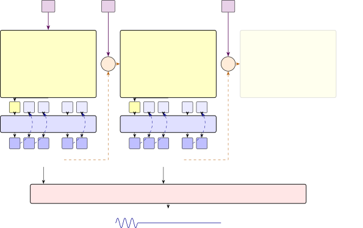
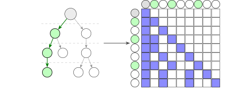
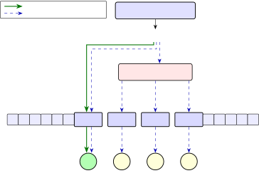
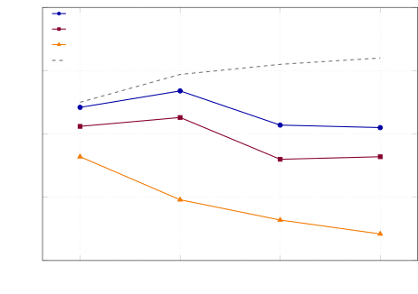

# RVQ Position Aware Speculative Decoding for On Device Text to Speech

Berkin Durmus    Eduardo Pacheco    Zach Nagengast    Atila Orhon

###### Abstract

Autoregressive decoding (AR) with Transformer models is memory bandwidth
bound at single stream inference, the typical deployment regime for on
device text to speech (TTS). Real time streaming with Qwen3-TTS \[16\]
requires $`\geq 200`$ sequential model calls per second, dominated by
the inner loop MultiCodeDecoder that emits the $`15`$ residual vector
quantization (RVQ) codes per $`80`$ ms audio frame. We propose _RVQ
position aware speculative decoding_ for the MultiCodeDecoder, attaining
$`2.47`$ accepted tokens per model call at $`5{\times}10^{-4}\%`$ added
parameters and $`10`$–$`20\%`$ per round speculation/verification
overhead, reducing real time synthesis from $`200`$ to $`{\approx}88`$
sequential model calls per second. The scheme is distributionally
lossless under the deployed top-$`k`$ sampling \[17, 7\], and WER parity
with the original system is consistent with this guarantee. We deliver
$`2`$–$`2.2\times`$ speedup for RVQ token generation with Qwen3-TTS-0.6B
on recent iPhone and Apple Silicon Mac devices.

###### Index Terms: 

text to speech, speculative decoding, on device inference, inference
speedup

^(†)^(†)address: Argmax, Inc., USA

## 1 Introduction

Speech waveforms carry complex timbre and prosodic information in
addition to the underlying linguistic content. As a result, state of the
art text to speech (TTS) systems, e.g. Qwen3-TTS \[16\],
CosyVoice 3 \[12\], and CaT-TTS \[6\], are designed to emit many more
tokens per second of audio than per character of input text. As shown in
Figure 1, Qwen3-TTS uses two nested loops over residual vector
quantization (RVQ) codes \[29, 11\]: the outer loop runs a text
conditioned CodeDecoder once per $`80`$ ms audio frame to emit the
coarse code $`c_{0}`$, and the inner loop runs the MultiCodeDecoder
$`15`$ times _autoregressively_ to emit the $`15`$ residual codes
$`c_{1},\dots,c_{15}`$ that complete the embedding of that frame. In
total, $`{\sim}1`$ s of audio is represented with $`{\sim}200`$ tokens:
$`13`$ outer loop CodeDecoder calls and $`187`$ inner loop
MultiCodeDecoder calls.

Figure 1: Qwen3-TTS autoregressive audio generation. A forced text-token
sequence $`t_{0},t_{1},t_{2},\dots`$ (violet) is fed into the model:
each $`t_{i}`$ is an input text token consumed by frame $`i`$. $`t_{0}`$
conditions the first _CodeDecoder_; for $`i\!>\!0`$, $`t_{i}`$ is summed
with the $`16`$ RVQ codes of frame $`i\!-\!1`$ inside $`\Sigma`$ to
condition the next _CodeDecoder_. At each frame the _CodeDecoder_ is
called once and emits the seed code $`c_{0}`$ (yellow); the
_MultiCodeDecoder_ is then called autoregressively $`15`$ times: at
inner step $`k`$ it consumes $`c_{k-1}`$ and emits $`c_{k}`$, with each
output fed back as the next-step input, completing the $`16`$-code RVQ
frame embedding $`\{c_{0},\dots,c_{15}\}`$, which is then summed with
$`t_{i}`$ in $`\Sigma`$. _Speech Decoder_ consumes the resulting RVQ
code stream and renders the audio waveform. Real-time synthesis requires
$`12.5\,\text{frames/s}\times 16\,\text{codes/frame}=200`$ tokens/s.

Real time streaming generation therefore requires a minimum of $`200`$
tokens per second of inference throughput, and, because every token is
produced by a sequential model call, this translates into $`\geq 200`$
sequential model calls per second. The additional throughput required by
the audio token to waveform decoder is negligible relative to that of
token generation. On single stream on device inference, the inner
MultiCodeDecoder loop dominates per frame latency, because kernel launch
overhead and KV cache management amortize poorly across so many
sequential calls.

Speculative decoding \[17, 7\] is a natural fit: a cheap drafter
proposes $`k`$ candidate tokens that the target verifies in one parallel
model call; when on average $`\bar{k}`$ candidates are accepted, the
inner loop emits $`\bar{k}{+}1`$ tokens per model call instead of $`1`$.
We propose RVQ position aware speculative decoding, which extends
Medusa \[5\] with a position aware hidden state offset and a sparse tree
attention mask so that drafter and verifier fuse into a single compiled
MultiCodeDecoder model call (Figure 3). The method adds $`{<}0.001\%`$
parameters and $`10`$–$`20\%`$ per round speculation/verification
overhead, and is distributionally lossless under the deployed top-$`k`$
sampling \[15\], inheriting the guarantee of speculative sampling \[17,
7\]; WER parity with the original system is consistent with this
guarantee. Putting it together, real time generation still emits $`200`$
tokens per second but now requires only $`{\approx}88`$ sequential model
calls per second ($`12.5`$ outer plus $`{\approx}76`$ inner at $`2.47`$
tokens/step), and we demonstrate $`2`$–$`2.2\times`$ practical speedup
for RVQ token generation on recent iPhone and Apple Silicon Mac devices.
Concretely, our method:

- •
  extends the Medusa framework \[5\] with an RVQ position aware offset
  that fuses drafter and verifier into a single compiled
  MultiCodeDecoder model call (§2, Figure 3),
- •
  achieves WER parity with the autoregressive baseline across six
  languages, with no audible differences in manual review or production
  use, in line with the lossless guarantee of speculative sampling \[17,
  7\] (§3.2),
- •
  delivers $`2.47`$ accepted tokens per MultiCodeDecoder model call
  (§3.3) and $`2`$–$`2.2\times`$ measured RVQ token generation speedup
  on recent devices such as iPhone 17 and MacBook M3 (§3.4), unlocking
  reliable real time TTS on older hardware such as iPhone 12.

#### Related work.

Codec language models \[27\] cast TTS as autoregressive token generation
over RVQ codes. In this setting, VADUSA \[18\] and Nguyen et al. \[21\]
apply Medusa style \[5\] multihead drafting to AR speech synthesis, but
both accelerate the temporal token loop, train new multimillion
parameter draft heads, verify with relaxed or heuristic acceptance rules
that alter the output distribution, and report GPU only results; general
purpose drafters such as EAGLE \[19\] and ReDrafter \[8\] likewise train
new draft networks on top of the backbone. On device, these designs
carry material overhead: a separate draft model or tens of millions of
added parameters increase asset size, memory footprint, and per call
compute, which mobile hardware can ill afford. Principled coarse grained
acceptance \[28\] instead relaxes exact token matching to acoustic
similarity groups, trading token level exactness for acceptance; we
preserve the exact token level distribution. Non speculative
alternatives such as delay pattern interleaving \[10\] and masked
parallel generation \[4\] also reduce sequential RVQ calls, but require
retraining the backbone and change its output distribution, which is
undesirable for an already deployed model. We instead target the RVQ
depth inner loop and exploit the MultiCodeDecoder’s native per position
multihead structure, which Medusa style methods must otherwise train
from scratch: drafting adds only $`3{,}072`$ trained offset parameters
and no new heads, verification preserves the deployed top-$`k`$ sampling
distribution, and, extending our WhisperKit inference stack \[14\],
drafter and verifier fuse into a single static shape model call; to our
knowledge this is the first speculative decoding for TTS demonstrated on
the Apple Neural Engine.

## 2 System

### 2.1 Medusa as the natural baseline

Medusa \[5\] attaches $`K`$ extra Language Model Heads (LMHs) to a
target backbone so that one model call on hidden state $`h`$ produces a
draft of the next $`K`$ tokens. Unlike conventional transformer
decoders, the Qwen3-TTS MultiCodeDecoder is multiheaded by construction:
each of the $`15`$ residual codebook positions has its own dedicated
input embedding table and its own LM head, so the previously committed
code at position $`i`$ is looked up in table $`i`$ and the hidden state
at position $`i`$ is projected by $`\mathrm{LMH}_{i}`$. This is a
natural basis for Medusa style drafting. A direct application of Medusa
would attach $`K`$ _additional_ drafter heads, but the existing per
position heads already cover the tokens we want to speculate on. Reusing
them is preferable: it adds no parameters, requires no extra asset
variants, and leaves the output distribution unchanged.

### 2.2 Achieving higher tokens per step

The MultiCodeDecoder is multiheaded by construction and so requires no
architectural changes to support Medusa style speculative decoding, but
it was not _trained_ for it: each existing LMH expects the hidden state
at its own codebook position. A direct application of Medusa style
speculative decoding therefore works but yields low tokens/step. We
propose two changes to recover the gain:

#### Tree attention increases acceptance rate.

Instead of drafting a single token per position, the drafter can emit
the top $`m`$ candidates at each of the $`K`$ drafted codebook positions
and arrange them as a tree of depth $`K`$ \[5\]: every node is a draft
token, and every root to leaf _path_ is a candidate continuation of
length $`K`$. Taking the Cartesian product yields up to $`m^{K}`$ such
paths (the number of candidate sequences grows exponentially in draft
depth), while the tree itself has only $`N`$ distinct nodes. These $`N`$
tokens are packed, together with the committed prefix, into a single
query of length $`q{=}N{+}1`$ and verified in one MultiCodeDecoder model
call, masked so that each token attends only to its ancestors \[5, 20\]
(Figure 2). Verification uses the standard speculative acceptance rule
with residual resampling, applied along the tree \[17, 7, 5\]. With the
original heads this alone raises tokens/step, but the gain materialises
only at large $`q`$, at which point the verify model call itself becomes
compute bound and erodes the end to end speedup on older hardware.

Figure 2: Efficient verification with sparse tree attention packing. The
tree of $`N`$ candidate tokens (left) is packed, together with the
committed prefix (grey), into a verify query of length $`q{=}N{+}1{=}9`$
(column headers, top right) and processed in one MultiCodeDecoder model
call under the sparse tree attention mask shown below it (blue: query
token $`i`$ attends to key position $`j`$, i.e. $`j`$ is an ancestor of
$`i`$ or $`i`$ itself). Row and column headers share the same token
ordering. The longest verified speculation path (green) is committed to
the KV cache; larger $`N`$ raises both the expected accepted prefix and
the verify cost.

#### RVQ position aware offsets with sparse tree attention.

Because each LMH expects the hidden state at its own codebook position,
projecting a position-$`k`$ hidden state through LMH*(k+j) does not, on
its own, produce strong drafts. A small per position residual offset on
the hidden state recovers the lost signal (Figure 3): at runtime
position $`k`$, LMH*(k) runs without an offset and emits the accepted
token, while LMH*(k+j) receives an additively offset hidden state
$`h*{k}{+}b*{j}`$, where $`b*{1},\dots,b\_{K}`$ ($`K{=}3`$) are trained
per offset residual vectors, and emits one of the $`K`$ drafts. The same
$`K`$ offset vectors are shared across all starting positions $`k`$.
Combined with tree attention drafting, this delivers most of the
tokens/step uplift; to keep the verify model call’s query length small
enough to stay bandwidth bound, we further prune the full tree to a
sparse subset of paths (*sparse tree attention*), retaining most of the
acceptance gain while remaining deployable on older devices. The sparse
tree is calibrated offline: using per depth and per rank acceptance
statistics measured on the calibration set (Table 1), the tree is grown
greedily, at each step adding the node with the largest expected
contribution to the accepted prefix length \[5\], until the node budget
$`N`$ is reached; tree depth is capped at $`K`$. The budget $`N`$ is
then chosen per device (§3.4).

#### Training the offsets.

The backbone, the per position embedding tables, and all LM heads remain
frozen; only the residual offset vectors $`b_{1},\dots,b_{K}`$
($`3{,}072`$ parameters in total; Table 2) are trained. We run the
frozen model with teacher forcing over the VoxPopuli \[26\] training
split to obtain, at every inner loop position $`k`$, the hidden state
$`h_{k}`$ together with the ground truth codes of the subsequent
positions. Each offset state $`h_{k}{+}b_{j}`$ is projected through the
frozen LMH*(k+j) and trained with a cross entropy loss against the
ground truth code $`c*{k{+}j}`$, summed over draft depths $`j\leq K`$
and all valid positions, following the Medusa head training
recipe \[5\]. Training uses Adam with a learning rate of $`10^{-3}`$ and
a batch size of $`32`$ on a single NVIDIA Tesla P100 GPU. The verifier
stream never consumes an offset state, so training the offsets leaves
the deployed output distribution untouched. The offsets are trained on
English data only; at test time we evaluate on six languages and observe
no loss in acceptance (§3.3, Table 3), so no multilingual training is
required.

Figure 3: Comparison of baseline AR and our speculation inside a single
_MultiCodeDecoder_ model call (Fig. 1 inner loop). All LM heads are
original frozen Qwen3-TTS heads. Solid green arrows denote the baseline
autoregressive path: at runtime position $`k`$, LMH*(k) consumes
$`h*{k}`$ and emits the *accepted* code (green). Because this
first-token path is identical to baseline AR, the code is guaranteed to
be accepted. Dashed blue arrows denote our speculative path in the same
model call: $`h*{k}`$ is fed into a small Position-aware Offset block
whose three outputs $`h*{k}{+}b*{1},h*{k}{+}b*{2},h*{k}{+}b*{3}`$ drive
LMH*(k+1)–LMH\_(k+3) to emit _drafted_ codes (blue) for the next
$`K{=}3`$ RVQ positions ahead of time.

## 3 Results

### 3.1 Dataset

Table 1 summarizes the dataset specifications used across training,
calibration, and evaluation. The residual offsets are trained and
validated on disjoint subsets of the English VoxPopuli train split. The
sparse tree configuration is then selected on a LibriSpeech test clean
calibration set, following the Medusa tree construction recipe \[5\]: we
measure per depth and per rank acceptance statistics on this set and
grow trees greedily under each node budget $`N`$ and depth cap $`K`$,
keeping the shape with the highest expected accepted length (§2.2).
Finally, acceptance and WER are measured on the Fleurs train split in
six languages, of which only English overlaps with the training and
calibration language. All experiments use the $`0.6`$B CustomVoice
variant with the original sampling configuration \[16\]; WER is averaged
over ten seeds per system.

|             |             |          |         |             |        |
| ----------- | ----------- | -------- | ------- | ----------- | ------ |
| Stage       | Dataset     | Language | Samples | Hours       | Frames |
| Training    | VoxPopuli   | English  | 155,513 | $`\sim`$462 | 20.8M  |
| Validation  | VoxPopuli   | English  | 17,200  | $`\sim`$56  | 2.53M  |
| Calibration | LibriSpeech | English  | 1,804   | $`\sim`$4.4 | 200K   |
| Evaluation  | Fleurs      | English  | 1,242   | $`\sim`$3.0 | 135K   |
|             |             | German   | 874     | $`\sim`$2.5 | 112K   |
|             |             | Spanish  | 1,216   | $`\sim`$4.3 | 192K   |
|             |             | Russian  | 810     | $`\sim`$2.3 | 105K   |
|             |             | Japanese | 810     | $`\sim`$2.3 | 102K   |
|             |             | Mandarin | 842     | $`\sim`$2.4 | 106K   |

Table 1: Dataset specifications. Stage-wise corpora used to train the
position-aware residual offsets, calibrate the sparse tree, and measure
acceptance. English VoxPopuli \[26\] is split into training and
validation; LibriSpeech \[24\] provides the held-out set on which the
sparse tree configuration is selected; Fleurs \[9\] supplies
multilingual evaluation across six languages. Frames count CodeDecoder
steps at $`80`$ ms/frame, each frame with 15 MultiCodeDecoder steps.

### 3.2 Accuracy: WER parity

Speculative decoding is _distributionally lossless_ via the modified
rejection sampling rule \[17, 7\], which preserves the target
distribution. Our residual offsets enter only the drafter stream
(Figure 3), so the verifier LMH outputs are identical to the AR baseline
and the guarantee applies unchanged. Table 3 reports the transcription
error of the synthesised audio.

The AR and speculative WER columns in Table 3 are close but not
numerically identical: both systems _sample_ from the same top-$`k`$
distribution, so any two runs, speculative or not, differ utterance by
utterance, and the reported WER additionally passes through an ASR
transcription step (WhisperKit \[14\]) that contributes measurement
noise of its own. The speculative WER is no higher than the AR WER in
any language; the differences are small and share a direction, which we
leave uncharacterised. Beyond WER, we manually reviewed synthesised
audio from both decoders and heard no differences in voice, prosody, or
artifacts, and the speculative decoder is deployed in production in the
Argmax SDK \[14, 3\] with no observed quality regressions.

### 3.3 Theoretical acceleration: tokens/step

All acceptance rates are measured on free running synthesis, with the
model consuming its own generated codes as in deployment. Table 2
compares three Medusa style drafter designs. Reusing the neighbouring LM
heads as drafters costs no parameters but lower acceptance rate. Medusa
increases that, at the cost of $`\sim 94`$M new parameters ($`+16\%`$ on
a $`0.6`$B backbone). Our position aware offsets match Medusa acceptance
while adding almost no parameters on top of the original model.
Acceptance is also stable across languages (Table 3): although the
offsets are trained on English VoxPopuli \[26\] and calibrated on
English LibriSpeech \[24\], they deliver $`2.44`$–$`2.46`$ tokens/step
on all six Fleurs \[9\] evaluation subsets.

Table 2 isolates the effect of the drafter. Naive reuse of the frozen
heads (i) yields only $`1.70`$ tokens/step because of positional
mismatch: each frozen LMH\_(k+j) was trained to read the hidden state at
its _own_ codebook position, so a position-$`k`$ hidden state is out of
distribution for it. Dedicated Medusa heads (ii) remove this mismatch at
the cost of $`{\sim}94`$M added parameters. Our offsets (iii) achieve
the same effect with a single learned translation of the hidden state
per lookahead distance, matching the acceptance of Medusa heads
($`2.47`$ vs. $`2.60`$ tokens/step) while adding only $`3{,}072`$
parameters to the frozen backbone. We attribute the cross lingual
stability to the same mechanism: the offsets model the position
conditional geometry of the RVQ hierarchy (the codebook to codebook
statistics of the frozen audio codec) rather than the lexical content of
the English training data, and this structure is largely language
agnostic. Finally, Medusa’s $`{\sim}16\%`$ added parameters would also
add asset size and memory on device, which the offsets avoid.

| Drafter             | Toks/step | Added params                                         |
| ------------------- | --------- | ---------------------------------------------------- |
| Reused LM heads     | 1.70      | —                                                    |
| Medusa heads \[5\]  | 2.60      | $`\sim 94`$M ($`\sim{+}16\%`$)                       |
| Ours (pos. offsets) | 2.47      | $`\mathbf{3{,}072}`$ ($`\sim{+}5{\times}10^{-4}\%`$) |

Table 2: Medusa-style drafter ablation. Three drafter choices on top of
the frozen Qwen3-TTS-0.6B backbone. (i) _Reused LM heads_: the $`K{=}3`$
neighbouring codebook heads
$`\text{LMH}_{k{+}1},\dots,\text{LMH}_{k{+}3}`$ draft from the
position-$`k`$ hidden state; no new parameters. (ii) *Medusa
heads* \[5\]: $`K{=}3`$ fresh Medusa heads per codebook position ($`45`$
new heads total). (iii) _Position-aware offsets_ (ours): $`K{=}3`$
residual bias vectors $`b_{1},\dots,b_{K}`$ added to the hidden state;
LM heads frozen and reused as drafters.

| Language | Audio (min) | Autoregressive |         | Speculative |         |
| -------- | ----------- | -------------- | ------- | ----------- | ------- |
|          |             | Toks/step      | WER/CER | Toks/step   | WER/CER |
| English  | 180.2       | 1.00           | 4.25    | 2.45        | 3.99    |
| German   | 149.0       | 1.00           | 6.4     | 2.46        | 5.58    |
| Spanish  | 255.6       | 1.00           | 7.28    | 2.44        | 5.98    |
| Russian  | 139.8       | 1.00           | 9.55    | 2.46        | 8.26    |
| Japanese | 136.2       | 1.00           | 8.55    | 2.46        | 7.71    |
| Mandarin | 141.7       | 1.00           | 7.43    | 2.45        | 7.18    |

Table 3: Per-language performance on Fleurs. Acceptance rate
(_Toks/step_) and WER (CER for Mandarin and Japanese), in percent, of
the generated audio for the autoregressive baseline and our speculative
decoder, evaluated on Fleurs subsets in six languages. WER is computed
via WhisperKit \[14\], using whisper-large-v3-turbo \[25\] for Mandarin
and Japanese and parakeet-v3 \[22\] otherwise. Transcription and WER
evaluation use our open source OpenBench suite \[2, 13\]. As shown in
prior work \[17, 7\], speculative decoding is distributionally lossless;
the WER columns are consistent with this.

### 3.4 Practical acceleration: per device wall time latency

Acceptance rate (_Toks/step_) is the ceiling for the practical speedup;
the realised speedup is always lower because the verify call runs at
query length $`q{=}N`$ rather than $`q{=}1`$; as $`N`$ grows this pushes
the MultiCodeDecoder from memory bandwidth bound toward compute bound.
Figure 4 sweeps $`N`$ across three Apple devices and exposes the per
device optimum.

Figure 4: Practical speedup vs sparse tree size across hardware. The
grey dashed curve is the device independent acceptance (_Toks/step_) and
is the theoretical ceiling on the speedup. Coloured curves are the per
device MultiCodeDecoder speedup,
$`(\text{Toks/step})/(1+\text{verify overhead})`$; the gap below the
ceiling is the verify-step overhead introduced when the query length
grows from $`q{=}1`$ (AR, memory bound) to $`q{=}N`$ (compute bound).
The selected operating point is $`N{=}32`$ on iPhone 17 Pro Max and
MacBook M3 Pro, and $`N{=}16`$ on iPhone 12.

Figure 4 quantifies this tradeoff (all latencies are p50 over $`200`$
steady state iterations on the Apple Neural Engine, W8A16, with $`20`$
warmup calls excluded). W8A16 (8 bit weights, 16 bit activations) \[14\]
is used for all reported results. The acceptance ceiling (grey dashed)
rises monotonically with sparse tree size but saturates (from $`2.25`$
tokens/step at $`N{=}16`$ to $`2.60`$ at $`N{=}64`$), whereas the verify
cost grows steadily with the query length $`q{=}N`$, so the net speedup
peaks where the marginal accepted token no longer pays for the marginal
verify cost. On recent hardware the verify call stays close to memory
bandwidth bound through $`N{=}32`$: one AR MultiCodeDecoder call costs
$`2.05`$ ms on iPhone 17 Pro Max and $`2.2`$ ms on MacBook M3 Pro, and
the speculative call at $`N{=}32`$ adds only $`+5.3\%`$ and $`+13.6\%`$
respectively, so the optimum sits at $`N{=}32`$ with $`2.34\times`$ and
$`2.13\times`$ speedup. On iPhone 12 the crossover into the compute
bound regime occurs almost immediately: the optimum is $`N{=}16`$
($`1.82\times`$), and larger trees erode the gain, degrading to
$`1.21\times`$ at $`N{=}64`$. $`N`$ can therefore be calibrated once per
device class, offline: acceptance (the numerator) is device independent,
so only the denominator, the verify overhead, needs profiling on new
hardware.

The overhead in Figure 4 isolates the model call ($`+5.3\%`$ and
$`+13.6\%`$ at $`N{=}32`$); host side work outside the model call brings
the total per round overhead to an estimated $`10`$–$`20\%`$, consistent
with the $`2`$–$`2.2\times`$ deployed speedup range.

The absolute latencies show that speculation is most beneficial on older
devices. At $`187.5`$ inner loop calls per second of audio,
autoregressive token generation alone costs $`{\sim}894`$ ms of inner
loop compute per second of synthesised speech on iPhone 12 ($`4.77`$ ms
per call), nearly the entire real time budget before the $`28`$-layer
CodeDecoder and the speech decoder are accounted for. Speculation at the
selected operating point roughly halves this cost, leaving headroom for
the unaccelerated components. On recent devices the same reduction cuts
this cost from $`{\sim}384`$ ms per second of audio (iPhone 17 Pro Max)
to $`{\sim}164`$ ms, after which token generation accounts for a
minority of the single stream compute budget.

## 4 Conclusion

We presented RVQ position aware speculative decoding for on device TTS,
which reuses the frozen per position LM heads of the Qwen3-TTS
MultiCodeDecoder as drafters: $`3{,}072`$ trained residual offset
parameters let each head draft ahead of its own codebook position, while
sparse tree attention fuses drafting and verification into a single
compiled model call that leaves the verifier stream untouched and
remains distributionally lossless under top-$`k`$ sampling. The method
sustains $`2.44`$–$`2.46`$ accepted tokens per model call across the six
Fleurs evaluation languages with WER parity against the autoregressive
baseline, and delivers $`2`$–$`2.2\times`$ RVQ token generation speedup
on recent iPhone and Apple Silicon Mac devices in the single stream
regime. On recent devices this adds headroom; on older hardware such as
iPhone 12, where autoregressive decoding alone nearly exhausts the real
time budget, it unlocks comfortable real time synthesis. The
unaccelerated $`28`$-layer CodeDecoder is a natural next target for
speculation across frames, alongside dynamic per device selection of the
sparse tree size $`N`$. The method assumes only an autoregressive
codebook depth decoder with reusable per position heads, a structure
shared by systems such as CaT-TTS \[6\]; evaluating such transfer is
left for future work.

## 5 Acknowledgments

This work was funded by Argmax, Inc. All authors are employees of
Argmax, Inc. The authors have no other relevant financial or
non-financial interests to disclose. Anthropic’s Claude \[1\] was used
to draft and edit the manuscript text, and OpenAI’s GPT-6 \[23\] was
used to review and critique earlier drafts. All content was reviewed and
verified by the authors, who take full responsibility for it.

## 6 Compliance with Ethical Standards

This study uses only the publicly released VoxPopuli \[26\],
LibriSpeech \[24\], and Fleurs \[9\] datasets under their respective
licenses and collects no new human subjects data, so no ethical approval
was required.

## References

- \[1\] Anthropic (2026) Claude. Note:
  [https://www.anthropic.com/claude](https://www.anthropic.com/claude)
  Cited by: §5.
- \[2\] Argmax, Inc. (2025) OpenBench: open source reproducible
  benchmarks for speech processing. Note:
  [https://github.com/argmaxinc/OpenBench](https://github.com/argmaxinc/OpenBench)
  Cited by: Table 3.
- \[3\] Argmax, Inc. (2026) Argmax SDK: on device speech AI for apple
  silicon. Note:
  [https://github.com/argmaxinc/argmax-oss-swift](https://github.com/argmaxinc/argmax-oss-swift)
  Cited by: §3.2.
- \[4\] Z. Borsos, M. Sharifi, D. Vincent, E. Kharitonov, N. Zeghidour,
  and M. Tagliasacchi (2023) SoundStorm: efficient parallel audio
  generation. arXiv:2305.09636. Cited by: §1.
- \[5\] T. Cai, Y. Li, Z. Geng, H. Peng, J. D. Lee, D. Chen, and T.
  Dao (2024) Medusa: simple LLM inference acceleration framework with
  multiple decoding heads. In Proc. ICML, Cited by: 1st item, §1, §1,
  §2.1, §2.2, §2.2, §2.2, §3.1, Table 2, Table 2.
- \[6\] J. Cao, Y. Han, R. Zhang, X. Hao, H. Li, S. Zhao, Y. Liu, and X.
  Zhang (2025) Comprehend and talk: text to speech synthesis via dual
  language modeling. arXiv:2509.22062. Cited by: §1, §4.
- \[7\] C. Chen, S. Borgeaud, G. Irving, J. Lespiau, L. Sifre, and J.
  Jumper (2023) Accelerating large language model decoding with
  speculative sampling. arXiv:2302.01318. Cited by: 2nd item, §1, §2.2,
  §3.2, Table 3, Abstract.
- \[8\] Y. Cheng, A. Zhang, X. Zhang, C. Wang, and Y. Wang (2024)
  Recurrent drafter for fast speculative decoding in large language
  models. arXiv:2403.09919. Cited by: §1.
- \[9\] A. Conneau, M. Ma, S. Khanuja, Y. Zhang, V. Axelrod, S.
  Dalmia, J. Riesa, C. Rivera, and A. Bapna (2022) FLEURS: few-shot
  learning evaluation of universal representations of speech. In Proc.
  IEEE SLT, Cited by: §3.3, Table 1, §6.
- \[10\] J. Copet, F. Kreuk, I. Gat, T. Remez, D. Kant, G. Synnaeve, Y.
  Adi, and A. Défossez (2023) Simple and controllable music generation.
  In Proc. NeurIPS, Cited by: §1.
- \[11\] A. Défossez, J. Copet, G. Synnaeve, and Y. Adi (2023) High
  fidelity neural audio compression. Trans. Mach. Learn. Res.. Cited by:
  §1.
- \[12\] Z. Du, C. Gao, Y. Wang, F. Yu, T. Zhao, H. Wang, X. Lv, H.
  Wang, X. Shi, K. An, et al. (2025) CosyVoice 3: towards in-the-wild
  speech generation via scaling-up and post-training. arXiv:2505.17589.
  Cited by: §1.
- \[13\] B. Durmus, B. Munyampirwa, E. Pacheco, A. Orhon, and A.
  Leonov (2025) SDBench: a comprehensive benchmark suite for speaker
  diarization. In Proc. Interspeech, Cited by: Table 3.
- \[14\] B. Durmus, A. Okan, E. Pacheco, Z. Nagengast, and A.
  Orhon (2025) WhisperKit: on-device real-time ASR with billion-scale
  transformers. In Proc. ICML Workshop TTODLer-FM, Note:
  [https://openreview.net/forum?id=6lC3MPFbVg](https://openreview.net/forum?id=6lC3MPFbVg)
  Cited by: §1, §3.2, §3.4, Table 3.
- \[15\] A. Fan, M. Lewis, and Y. Dauphin (2018) Hierarchical neural
  story generation. In Proc. ACL, Cited by: §1.
- \[16\] H. Hu, X. Zhu, T. He, et al. (2026) Qwen3-TTS technical report.
  arXiv:2601.15621. Cited by: §1, §3.1, Abstract.
- \[17\] Y. Leviathan, M. Kalman, and Y. Matias (2023) Fast inference
  from transformers via speculative decoding. Proc. ICML. Cited by: 2nd
  item, §1, §2.2, §3.2, Table 3, Abstract.
- \[18\] B. Li, H. Wang, S. Zhang, Y. Guo, and K. Yu (2025) Fast and
  high-quality auto-regressive speech synthesis via speculative
  decoding. In Proc. ICASSP, Cited by: §1.
- \[19\] Y. Li, F. Wei, C. Zhang, and H. Zhang (2024) EAGLE: speculative
  sampling requires rethinking feature uncertainty. In Proc. ICML, Cited
  by: §1.
- \[20\] X. Miao, G. Oliaro, Z. Zhang, X. Cheng, Z. Wang, Z.
  Zhang, R. Y. Y. Wong, A. Zhu, L. Yang, X. Shi, C. Shi, Z. Chen, D.
  Arfeen, R. Abhyankar, and Z. Jia (2024) SpecInfer: accelerating large
  language model serving with tree-based speculative inference and
  verification. In Proc. ASPLOS, Cited by: §2.2.
- \[21\] T. D. Nguyen, J. Kim, J. Choi, S. Choi, J. Park, Y. Lee,
  and J. S. Chung (2025) Accelerating codec-based speech synthesis with
  multi-token prediction and speculative decoding. In Proc. ICASSP,
  Cited by: §1.
- \[22\] NVIDIA NeMo Team (2025) Parakeet tdt 0.6b v3. Note:
  [https://huggingface.co/nvidia/parakeet-tdt-0.6b-v3](https://huggingface.co/nvidia/parakeet-tdt-0.6b-v3)
  Cited by: Table 3.
- \[23\] OpenAI (2026) GPT-6. Note:
  [https://openai.com](https://openai.com) Cited by: §5.
- \[24\] V. Panayotov, G. Chen, D. Povey, and S. Khudanpur (2015)
  LibriSpeech: an ASR corpus based on public domain audio books. In
  Proc. ICASSP, Cited by: §3.3, Table 1, §6.
- \[25\] A. Radford, J. W. Kim, T. Xu, G. Brockman, C. McLeavey, and I.
  Sutskever (2023) Robust speech recognition via large-scale weak
  supervision. In Proc. ICML, Cited by: Table 3.
- \[26\] C. Wang, M. Rivière, A. Lee, A. Wu, C. Talnikar, D. Haziza, M.
  Williamson, J. Pino, and E. Dupoux (2021) VoxPopuli: a large-scale
  multilingual speech corpus for representation learning,
  semi-supervised learning and interpretation. In Proc. ACL, Cited by:
  §2.2, §3.3, Table 1, §6.
- \[27\] C. Wang, S. Chen, Y. Wu, Z. Zhang, L. Zhou, S. Liu, Z. Chen, Y.
  Liu, H. Wang, J. Li, L. He, S. Zhao, and F. Wei (2023) Neural codec
  language models are zero-shot text to speech synthesizers.
  arXiv:2301.02111. Cited by: §1.
- \[28\] M. Yanuka, P. Dixon, E. Finkelshtein, D. Rotman, and R.
  Giryes (2026) Principled coarse-grained acceptance for speculative
  decoding in speech. In Proc. ICASSP, Cited by: §1.
- \[29\] N. Zeghidour, A. Luebs, A. Omran, J. Skoglund, and M.
  Tagliasacchi (2021) SoundStream: an end-to-end neural audio codec.
  IEEE/ACM Trans. Audio, Speech, Lang. Process. 30, pp. 495–507. Cited
  by: §1.
