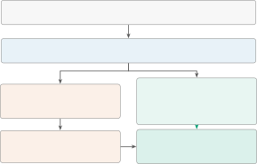
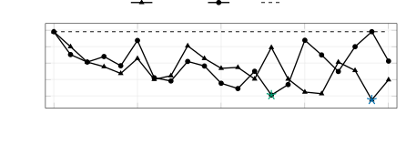
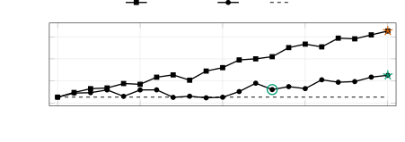

# RAWD-TTS: RATIO-FREE REWARD ALIGNMENT FOR DISCRETE-DIFFUSION VOICE CLONING

Maxim Maslov    Kirill Borodin    Vasilii Kudryavtsev    Nikita Vasiliev
   Grach Mkrtchian

###### Abstract

Zero-shot text-to-speech synthesizes new utterances in a speaker’s voice
from a short reference recording. Voice cloning requires accurate
content and preserved speaker identity, but supervised acoustic-token
prediction does not directly optimize these waveform-level properties.
Reward-based post-training addresses this mismatch, but in discrete
diffusion, token choices and reveal positions jointly define the
sampling trajectory, complicating alignment. We introduce RAWD-TTS
(Ratio-free Advantage-Weighted Denoising), which scores decoded samples
with recognition and speaker rewards and uses group-relative advantages
to weight masked-token reconstruction of those samples, without
reverse-trajectory likelihoods or target audio. On 500 Russian CV3-Eval
voice-cloning prompts, joint alignment reduces word error rate from
3.18% to 2.42% at the reward-selected checkpoint (24.0% relative) and to
2.58% at the final checkpoint (19.0%), while WavLM speaker cosine rises
from 0.733 to 0.748 and 0.755. Controlled experiments characterize
recognition–identity trade-offs and the effects of corruption count,
group composition, and weighting.

###### Index Terms: 

text-to-speech, discrete diffusion, voice cloning, reward alignment,
advantage-weighted denoising

^(†)^(†)address: ¹lab260, Yerevan, Armenia   ²BitmanagerAI, Dubai, UAE
  ³MTUCI, Moscow, Russia  
kborodin.research@gmail.com

## 1 Introduction

Zero-shot text-to-speech (TTS) must reproduce both the requested words
and the identity of an unseen reference speaker. Supervised token
prediction provides indirect supervision for these goals: a low
acoustic-token loss does not directly measure intelligibility or speaker
preservation in a decoded waveform. Reward-based post-training addresses
this mismatch by evaluating generated speech with task-specific models.
Recent flow-matching TTS alignment methods optimize recognition and
speaker rewards through denoising trajectories \[16, 18\].

Discrete-diffusion TTS introduces a different optimization interface.
OmniVoice generates multiple acoustic codebooks through iterative masked
prediction, conditioned on target text and reference speech \[25\].
Token choices and the order of revealing positions jointly determine a
decoding path. A final waveform therefore cannot simply be assigned the
product of autoregressive token probabilities. Trajectory-based
diffusion policy optimization can explicitly model transitions \[1\],
but requires an appropriate likelihood for the actual sampling process.

RAWD-TTS (Ratio-free Advantage-Weighted Denoising)¹¹ 1 Training code and
configuration are available at https://github.com/lab260ru/RAWD-TTS.
uses final generated samples as reward-weighted supervision. For each
prompt, it reconstructs forward-masked acoustic tokens with
group-relative weights: positive for above-average samples and negative
for below-average samples. This decouples learning from the reverse
trajectory. Training needs only reference speech and target text, not
target audio.

Building on ratio-free weighted diffusion optimization, we make three
contributions: (i) an adaptation of signed final-sample denoising to
conditional multi-codebook TTS that preserves voice-cloning conditioning
and normalizes reconstruction across codebooks and utterances; (ii) a
controlled study on a fixed backbone of reward composition, corruption
count, group allocation, and the weighting rule, scored by both training
and independent evaluators; and (iii) released training code.



Figure 1: RAWD-TTS connects final-sample rewards to masked-token
learning. Generated tokens provide both waveform rewards and
reconstruction targets. Advantages weight reconstruction losses; only
this path updates the policy.

## 2 Related Work

Reward alignment for speech. F5R-TTS applies group-relative policy
optimization to flow-matching speech synthesis \[16\]. Multi-objective
waveform rewards are studied in FlowTTS-GRPO \[18\], and Koel-TTS aligns
an autoregressive TTS model with recognition and speaker-verification
preferences \[9\]. These works motivate our comparison of recognition
and speaker rewards, but continuous flow and autoregressive transitions
differ from categorical masked-token updates. Masked generative codec
models such as MaskGCT \[20\] and OmniVoice \[25\] share this interface.

Weighted diffusion training. Ratio-free weighted denoising in wd1 \[17\]
and Advantage Weighted Matching \[21\] are close methodological
precedents. UDM-GRPO also constructs forward-corrupted states from final
samples, while retaining a ratio-based objective \[19\]. SEPO derives
policy gradients for discrete diffusion from score entropy \[23\], d1
applies GRPO to masked diffusion language models with an approximate
sequence likelihood \[24\], and MaskGRPO estimates importance weights
for discrete diffusion \[10\]. The weighting principle itself follows
wd1 and AWM; our contribution is its adaptation to multi-codebook speech
with waveform rewards and the resulting empirical study.

## 3 Method

### 3.1 Voice-cloning rollouts and terminal rewards

A prompt $`q=(y,a^{\rm ref},y^{\rm ref})`$ consists of target text,
reference audio, and its transcript. The native voice-cloning sampler
generates acoustic tokens $`x_{0}\in\mathcal{V}^{C\times L}`$ for $`C`$
codebooks and $`L`$ target frames; codec decoding gives waveform
$`a=D(x_{0})`$. The reference and text conditioning are fixed within a
group, and target duration follows the native estimator.

Each iteration samples $`B`$ prompts and $`G`$ independent stochastic
rollouts per prompt from the current, pre-update model. Let $`a_{bi}`$
denote rollout $`i`$ for prompt $`b`$. A frozen recognizer produces
transcript $`\hat{y}_{bi}`$, and a frozen speaker encoder $`e`$ embeds
the generated and reference audio. We define

```math
\displaystyle r^{\rm asr}_{bi} \displaystyle=\exp\!\left[-2.5\,\mathrm{WER}(N(y_{b}),N(\hat{y}_{bi}))\right], \tag{1}
```

```math
\displaystyle r^{\rm spk}_{bi} \displaystyle=\frac{1+\cos(e(a_{bi}),e(a_{b}^{\rm ref}))}{2}, \tag{2}
```

```math
\displaystyle r_{bi} \displaystyle=\lambda_{\rm asr}r^{\rm asr}_{bi}+\lambda_{\rm spk}r^{\rm spk}_{bi}, \tag{3}
```

where $`N`$ applies the same Russian normalization to both texts and the
coefficient 2.5 is an empirical choice. Each component is in $`[0,1]`$.
Joint training uses $`(\lambda_{\rm asr},\lambda_{\rm spk})=(1,1)`$, so
its reward is in $`[0,2]`$; single-reward runs set one coefficient to
zero. We do not standardize reward components separately.

For each prompt, we compute detached advantages

```math
\bar{r}_{b}=\frac{1}{G}\sum_{i}r_{bi},\qquad A_{bi}=\frac{r_{bi}-\bar{r}_{b}}{\sqrt{G^{-1}\sum_{i}(r_{bi}-\bar{r}_{b})^{2}}+\epsilon}, \tag{4}
```

with $`\epsilon=10^{-6}`$ and population standard deviation. Thus
$`\sum_{i}A_{bi}=0`$: comparisons are prompt-local, while
standardization also rescales each group’s contribution. Constant-reward
groups contribute zero to the surrogate gradient.

### 3.2 Final-sample denoising surrogate

We detach the final tokens and draw $`K`$ forward corruptions for each
rollout. For state $`k`$, one ratio $`\rho_{bk}\sim\mathcal{U}(0,1)`$ is
shared within prompt group $`b`$; target-token masks are independent
Bernoulli draws with that ratio. The shared ratio acts as common random
numbers: rollouts of one prompt are compared at the same corruption
level, so advantage-weighted differences reflect rewards rather than
mask-ratio variation. Text, reference tokens, and padding are never
masked. Empty target masks are redrawn up to eight times at the same
ratio; if still empty, one uniformly chosen target token is masked. This
nonempty safeguard slightly modifies the unconditional Bernoulli
corruption law.

Let $`\tilde{x}_{bik}`$ be the corrupted input, $`M_{bikc}`$ its masked
positions in codebook $`c`$, and $`\mathcal{C}_{bik}`$ the codebooks
with nonempty masks. With the base model’s codebook weights renormalized
over $`\mathcal{C}_{bik}`$, denoted $`\tilde{w}_{bikc}`$, the
reconstruction loss is

```math
\ell_{bik}(\theta)=-\sum_{c\in\mathcal{C}_{bik}}\frac{\tilde{w}_{bikc}}{|M_{bikc}|}\sum_{j\in M_{bikc}}\log p_{\theta}(x_{0,bcj}^{i}\mid\tilde{x}_{bik},q_{b}). \tag{5}
```

This reduction first averages masked tokens within each codebook, then
combines codebooks. Longer utterances therefore do not receive larger
weights merely because they contain more tokens. The update minimizes

```math
\mathcal{L}(\theta)=\frac{1}{BGK}\sum_{b=1}^{B}\sum_{i=1}^{G}\sum_{k=1}^{K}\operatorname{stopgrad}(A_{bi})\,\ell_{bik}(\theta). \tag{6}
```

Gradients accumulate over all groups and corruption states before a
single optimizer step, followed by fresh rollout collection. We use
neither KL regularization nor a supervised anchor loss.

1: Current policy $`p_{\theta}`$; batch dimensions $`B,G,K`$

2: Collect samples and scores without gradients

3: Sample $`B`$ prompts $`q_{b}`$.

4: Draw $`G`$ native rollouts $`x^{i}_{0,b}`$ per prompt.

5: Decode $`a_{bi}=D(x^{i}_{0,b})`$ with the frozen codec.

6: Compute $`r_{bi}`$ using frozen scorers, Eq. (3).

7: Compute group advantages $`A_{bi}`$, Eq. (4).

8: Differentiate masked-token reconstruction

9: Initialize accumulated gradient $`g\leftarrow 0`$.

10: for $`k=1,\ldots,K`$ do

11:  Sample group ratios $`\rho_{bk}\sim\mathcal{U}(0,1)`$.

12:  Corrupt detached targets as in Section 3.2.

13:  Compute $`\ell_{bik}(\theta)`$ using Eq. (5).

14:
 $`g\leftarrow g+\frac{1}{BGK}\sum_{b,i}A_{bi}\nabla_{\theta}\ell_{bik}(\theta)`$.

15: end for

16: Clip $`g`$; update $`\theta`$ with one AdamW step.

Algorithm 1 One RAWD-TTS update

### 3.3 Interpretation and weighting control

Equation (6) transfers relative reward through reconstruction of final
samples. Because $`\rho_{bk}`$ is uniform on $`(0,1)`$ and
$`|M_{bikc}|\approx\rho_{bk}L`$, each term in Eq. (5) is, up to the
codebook weights and the nonempty safeguard, a length-normalized
single-sample estimate of the masked-diffusion evidence lower bound
(ELBO) with the $`1/t`$ weighting of MDLM, MD4, and LLaDA \[13, 14,
11\]. The objective is therefore a group-baselined REINFORCE surrogate
in which a variational bound on $`\log p_{\theta}(x_{0}\mid q)`$
replaces the intractable likelihood of the native sampler. The parameter
$`K`$ controls Monte Carlo estimation over forward corruptions,
independently of the number of reverse decoding steps. Because a bound
replaces the trajectory likelihood, the objective is a signed surrogate
rather than an unbiased policy-gradient estimator. It imposes no
likelihood-ratio constraint on native position selection.

Our wd1-style control uses the alternative coefficients

```math
\omega_{bi}=\frac{e^{A_{bi}}}{\sum_{j}e^{A_{bj}}}-\frac{e^{-A_{bi}}}{\sum_{j}e^{-A_{bj}}}. \tag{7}
```

This wd1-inspired weighting control \[17\] retains the reduction in
Eq. (6) without rescaling $`\omega`$, changing both the relative
coefficients and their gradient scale.

## 4 Experimental Setup

### 4.1 Training data and implementation

We use 8,000 Russian voice-cloning prompts from the YouTube partition
processed by Balalaika \[2\].²² 2
https://huggingface.co/datasets/lab260/youtube_balalaika References are
filtered for single-speaker segments lasting 2–8 s with ASR consistency
scores of at least 80. They comprise 10.96 h of audio, with mean
duration 4.93 s. Each reference audio/transcript is paired with target
text from a different eligible record, restricted to 20–120 characters.
Target-record audio is not used for training or rewards.

All trained systems initialize from base OmniVoice (0.6B), which
predicts $`C=8`$ Higgs-audio codebooks per frame \[25\], using LoRA
\[7\] with rank 16, alpha 32, and zero dropout; the codec is frozen.
Controlled reward and weighting comparisons use $`B=4`$, $`G=8`$, and
$`K=3`$. Joint $`K=5`$ retains these training settings except for the
corruption count. AdamW uses learning rate $`10^{-5}`$ after 10 linear
warmup updates, zero weight decay, and gradient-norm clipping at 1.
Training rollouts use 32 denoising steps, no classifier-free guidance
(CFG), token temperature 1, and position temperature 5, which is applied
to token confidences when sampling the positions to reveal \[25\].

On one NVIDIA RTX 6000 Ada Generation GPU with co-located reward models,
the $`K=5`$ run took 9.25 GPU-hours for 2,000 training iterations
(16.65 s/update), excluding evaluations.

### 4.2 Evaluation protocol

Evaluation uses all 500 prompts of the Russian subset of CV3-Eval
Multilingual Voice Cloning, introduced with CosyVoice 3 \[6\]. OmniVoice
variants use the native reference-audio/transcript prompt path, native
duration estimation, 32 decoding steps, CFG 2, greedy token selection,
position temperature 5, and decoding seed 12345. Metrics are mean
per-utterance WER from faster-whisper with Whisper-large-v3 \[12\], and
mean cosine similarity between WavLM-ECAPA embeddings \[3, 5\] of
generated and reference audio; the training reward applies the mapping
of Eq. (2) to the same cosine. WER is computed after the same
normalization of reference text and ASR predictions and is reported as a
percentage. These scorers also supply training rewards. For an
independent assessment, Table 1 additionally reports WER from
Qwen3-ASR-1.7B \[15\], raw speaker cosine from ERes2Net \[4\], and
predicted quality from DistilMOS \[22\] with its WavLM backbone (raw
predicted MOS, not a listening-test score); none participates in
training or checkpoint selection. Qwen uses greedy decoding with Russian
specified and no transcript hint; all three process 16-kHz audio. Two
non-terminating Qwen3-TTS outputs receive WER $`=1`$; outputs over 60 s
are scored in 30-s chunks with concatenated transcripts and
duration-weighted speaker and MOS scores.

Primary runs use 2,000 updates for recognition-only, speaker-only, and
joint rewards. Table 1 reports checkpoints selected by joint
training-scorer reward on the reported prompts; final checkpoints, which
involve no selection, are labeled separately. Corruption and group-size
ablations use 1,000-update budgets. The weighting comparison and
extended $`K=5`$ run use 2,000 updates. Primary $`K=3`$ runs are
evaluated every 100 updates and $`K=5`$ every 250, so the coarser
$`K=5`$ grid offers fewer selection opportunities. Ablation checkpoints
maximize joint evaluation reward within the stated budget. We conduct
one training run per configuration.

The SFT control uses the same 8,000 source recordings paired with their
real transcripts, not the randomized RL target texts. It reconstructs
masked real tokens with a visible 0–30% audio prefix, using 32
utterances per update and the same LoRA and optimizer settings. Rewards
only select its checkpoint. Thus SFT matches source data and update
budget, but receives real target audio rather than generated
supervision. Controlled alignment comparisons hold the backbone fixed.
For context, we also evaluate released CosyVoice3-0.5B-2512 \[6\] and
Qwen3-TTS-12Hz-1.7B-Base \[8\], with native sampling and the same
reference pairs.





Figure 2: Evaluation WER (top) and WavLM speaker cosine (bottom) on all
500 prompts, measured every 100 updates (21 points per curve, without
smoothing). These $`K=3`$ runs show each single-reward model’s optimized
metric and both Joint metrics. Dashed: base model. Stars: metric optima;
open circle: the reward-selected Joint checkpoint.

## 5 Results and Discussion

### 5.1 Recognition and speaker-identity trade-off

|                          |                   |                 |                   |                 |                 |
| ------------------------ | ----------------- | --------------- | ----------------- | --------------- | --------------- |
|                          | Training scorers  |                 | Independent       |                 | Quality         |
| System                   | WER$`\downarrow`$ | Cos$`\uparrow`$ | WER$`\downarrow`$ | Cos$`\uparrow`$ | MOS$`\uparrow`$ |
| CosyVoice3               | 5.34              | 0.738           | 7.87              | 0.770           | 3.41            |
| Qwen3-TTS                | 4.69              | 0.734           | 6.18              | 0.701           | 3.67            |
| OmniVoice                | 3.18              | 0.733           | 4.38              | 0.704           | 3.18            |
| OmniVoice+SFT            | 2.94              | 0.765           | 4.11              | 0.726           | 3.20            |
| ASR-only                 | 2.35              | 0.705           | 3.72              | 0.688           | 3.29            |
| Speaker-only             | 3.34              | 0.763           | 4.52              | 0.734           | 3.21            |
| Joint $`K=3`$ (selected) | 2.41              | 0.736           | 3.90              | 0.713           | 3.24            |
| Joint $`K=3`$ (final)    | 2.82              | 0.743           | –                 | –               | –               |
| Joint (wd1) $`K=3`$      | 2.61              | 0.732           | 3.89              | 0.708           | 3.35            |
| Joint $`K=5`$ (selected) | 2.42              | 0.748           | 3.76              | 0.724           | 3.25            |
| Joint $`K=5`$ (final)    | 2.58              | 0.755           | 3.97              | 0.727           | 3.22            |

Table 1: CV3-Eval Multilingual Voice Cloning (Russian, 500 prompts).
Adapters use 2,000 updates; the lower block contains RAWD-TTS variants.
Cos: raw cosine. Adapter rows not marked final are checkpoints selected
by joint training-scorer reward on these prompts (updates 1,300 for
Joint $`K=3`$, 1,500 for $`K=5`$); final rows use update 2,000 without
selection. Dashes: not scored. Bold: column optimum; shading: highest
joint training-scorer reward.

Within RAWD-TTS, Table 1 shows that each single-reward objective
improves its target metric while degrading the complementary attribute.
Recognition-only alignment reduces WER from 3.18% to 2.35%, but
decreases speaker cosine from 0.733 to 0.705. Speaker-only alignment
attains cosine 0.763, while WER increases to 3.34%.

Joint $`K=3`$ reduces WER to 2.41% and increases cosine to 0.736,
preserving most of the ASR-only gain without its loss in speaker
scoring.

Selected Joint $`K=5`$ attains 2.42% Whisper WER and 0.748 WavLM cosine.
It matches $`K=3`$ in WER and gives slightly higher similarity. Its
final checkpoint, which involves no selection, retains most of the gain:
2.58% WER (19.0% relative) and 0.755 cosine, above base on every metric
in Table 1.

Independent assessment. Qwen3-ASR gives a 14.0% relative WER reduction
for Joint $`K=5`$ (4.38% to 3.76%), while ERes2Net cosine rises from
0.704 to 0.724. ASR-only attains Qwen WER 3.72% but reduces speaker
cosine to 0.688; speaker-only increases cosine to 0.734 but increases
WER to 4.52%. Thus the recognition–identity trade-off transfers beyond
the training scorers, although the recognition gain is smaller than
measured by Whisper. All aligned variants also have DistilMOS at or
above base (3.18), so alignment does not reduce predicted quality.

External TTS systems. On Russian voice cloning, base OmniVoice already
attains lower recognition error than CosyVoice3 and Qwen3-TTS under both
ASR evaluators, and Joint $`K=5`$ widens this margin. CosyVoice3 attains
the highest independent speaker cosine (0.770), while Qwen3-TTS has the
highest DistilMOS (3.67). The external comparison therefore mainly
reflects backbone strength on Russian, with different recognition,
identity, and quality trade-offs across systems.

Supervised adaptation. SFT attains 2.94% Whisper WER and 0.765 WavLM
cosine, compared with 2.42% and 0.748 for Joint $`K=5`$. Independent
scores give the same trade-off: SFT has higher Qwen WER (4.11% versus
3.76%) and slightly higher ERes2Net cosine (0.726 versus 0.724). Joint
$`K=5`$ has higher DistilMOS (3.25 versus 3.20). SFT is therefore a
strong speaker-preservation baseline; reward alignment improves
recognition, not every metric. SFT, however, requires paired target
speech, whereas reward alignment uses only reference audio and arbitrary
target text.

Weighting rule. With the same joint rewards, $`K=3`$, and 2,000-update
budget, wd1-style weighting yields 2.61% WER and 0.732 cosine, compared
with 2.41% and 0.736 for linear signed weighting. It therefore improves
neither training metric in this comparison, but has higher DistilMOS
(3.35 versus 3.24). This quality-score difference cautions against
ranking models by training rewards alone. The comparison changes both
weighting shape and scale.

Figure 2 shows non-monotonic joint improvement: after the selected
update 1,300, WER rises from 2.41% to 2.82% at update 2,000, while
cosine improves from 0.736 to 0.743. The ASR-only run ends at 2.60%
after its optimum of 2.35% at update 1,900. Both training-batch rewards
rise steadily over the same run, so rising training reward does not
imply monotonic benchmark improvement.

### 5.2 Hyperparameter ablations

| $`K`$ | $`B`$ | $`G`$ | WER$`\downarrow`$ | Cos$`\uparrow`$ |
| ----- | ----- | ----- | ----------------- | --------------- |
| 1     | 4     | 8     | 2.82              | 0.736           |
| 3     | 4     | 8     | 2.55              | 0.733           |
| 5     | 4     | 8     | 2.47              | 0.738           |
| 3     | 8     | 4     | 2.72              | 0.733           |
| 3     | 2     | 16    | 2.59              | 0.725           |

Table 2: Joint-reward ablations: 1,000 updates, 500 evaluation prompts,
and $`BG=32`$. The shared control uses $`K=3`$, $`B=4`$, and $`G=8`$.
Checkpoint selection and highlighting follow Table 1.

Corruption count. At 1,000 updates, $`K=5`$ improves both metrics over
$`K=1`$ and $`K=3`$ (Table 2), motivating the extended run in Table 1.
WER decreases with $`K`$, but similarity is non-monotonic. One run per
setting does not establish the reliability of these differences.

Group composition. At fixed $`BG=32`$ and $`K=3`$, $`(B,G)=(4,8)`$ gives
lower WER than $`(8,4)`$ or $`(2,16)`$. The $`G=4`$ setting matches the
control in similarity, whereas $`G=16`$ degrades both metrics. More
alternatives per prompt do not uniformly improve alignment: group
composition trades prompt diversity against within-prompt comparisons.

### 5.3 Limitations

The signed surrogate provides neither a likelihood-ratio trust region
nor a monotonic reward-improvement guarantee. Group standardization can
amplify small reward-model differences, and equal component coefficients
do not ensure equal gradient contributions when their within-group
variations differ. Reported checkpoints, including the SFT control, are
selected by evaluation reward on the reported prompts, which favors them
relative to base and external systems; the final-checkpoint rows are
free of this selection. Training uses stochastic rollouts without CFG,
whereas evaluation uses CFG 2 and greedy tokens, so our gains show
transfer to the guided evaluator rather than direct optimization of
guided generation; a guidance sweep would be needed to separate these
effects. Independent recognition and speaker models indicate transfer of
average gains, but automatic scores do not establish human-perceived
quality or freedom from reward exploitation. Evidence is limited to one
backbone, Russian speech, and one training run per configuration. Voice
cloning poses impersonation risks; releases require appropriate consent
and safeguards.

## 6 Conclusion

RAWD-TTS adapts signed final-sample denoising to discrete-diffusion
voice cloning. On CV3-Eval Russian, joint alignment with five corruption
views reduces WER by 24.0% at the reward-selected checkpoint and by
19.0% at the final checkpoint, while improving speaker similarity over
base OmniVoice. Independent evaluators are consistent with both gains.
Single-reward and supervised controls reveal recognition–identity
trade-offs, supporting joint waveform rewards as a practical alignment
objective for discrete TTS.

## 7 Compliance with Ethical Standards

This study used only publicly available, previously collected speech
recordings (Balalaika and CV3-Eval) and collected no new data from human
subjects, so no ethical approval was required. The authors declare no
conflicts of interest.

## 8 Acknowledgements

Claude Fable 5 (Anthropic) was used to polish the text of this paper.
All ideas and experiments are the authors’ own.

## References

- \[1\] K. Black, M. Janner, Y. Du, I. Kostrikov, and S. Levine (2024)
  Training diffusion models with reinforcement learning. In
  International Conference on Learning Representations, External Links:
  [Link](https://openreview.net/forum?id=YCWjhGrJFD) Cited by: §1.
- \[2\] K. Borodin, N. Vasiliev, V. Kudryavtsev, M. Maslov, M.
  Gorodnichev, O. Rogov, and G. Mkrtchian (2026) Balalaika:
  data-centric, prosody-aware annotation pipeline for Russian speech. In
  Proc. Interspeech, Note: arXiv:2507.13563 External Links:
  [Link](https://arxiv.org/abs/2507.13563) Cited by: §4.1.
- \[3\] S. Chen, C. Wang, Z. Chen, Y. Wu, S. Liu, et al. (2022) WavLM:
  large-scale self-supervised pre-training for full stack speech
  processing. IEEE Journal of Selected Topics in Signal Processing 16
  (6), pp. 1505–1518. Cited by: §4.2.
- \[4\] Y. Chen, S. Zheng, H. Wang, L. Cheng, Q. Chen, and J. Qi (2023)
  An enhanced Res2Net with local and global feature fusion for speaker
  verification. In Proc. Interspeech, pp. 2228–2232. External Links:
  [Document](https://dx.doi.org/10.21437/Interspeech.2023-1294) Cited
  by: §4.2.
- \[5\] B. Desplanques, J. Thienpondt, and K. Demuynck (2020)
  ECAPA-TDNN: emphasized channel attention, propagation and aggregation
  in TDNN based speaker verification. In Proc. Interspeech,
  pp. 3830–3834. Cited by: §4.2.
- \[6\] Z. Du, C. Gao, Y. Wang, F. Yu, T. Zhao, H. Wang, et al. (2025)
  CosyVoice 3: towards in-the-wild speech generation via scaling-up and
  post-training. Note: arXiv:2505.17589 External Links:
  [Document](https://dx.doi.org/10.48550/arXiv.2505.17589),
  [Link](https://arxiv.org/abs/2505.17589) Cited by: §4.2, §4.2.
- \[7\] E. J. Hu, Y. Shen, P. Wallis, Z. Allen-Zhu, Y. Li, S. Wang, L.
  Wang, and W. Chen (2022) LoRA: low-rank adaptation of large language
  models. In International Conference on Learning Representations,
  External Links: [Link](https://openreview.net/forum?id=nZeVKeeFYf9)
  Cited by: §4.1.
- \[8\] H. Hu, X. Zhu, T. He, D. Guo, B. Zhang, X. Wang, et al. (2026)
  Qwen3-TTS technical report. arXiv preprint arXiv:2601.15621. Cited by:
  §4.2.
- \[9\] S. Hussain, P. Neekhara, X. Yang, E. Casanova, S. Ghosh, M. T.
  Desta, R. Fejgin, R. Valle, and J. Li (2025) Koel-TTS: enhancing LLM
  based speech generation with preference alignment and classifier free
  guidance. arXiv preprint arXiv:2502.05236. Cited by: §2.
- \[10\] T. Ma, M. Zhang, Y. Wang, and Q. Ye (2025) Consolidating
  reinforcement learning for multimodal discrete diffusion models. arXiv
  preprint arXiv:2510.02880. Cited by: §2.
- \[11\] S. Nie, F. Zhu, Z. You, X. Zhang, J. Ou, J. Hu, J. Zhou, Y.
  Lin, J. Wen, and C. Li (2025) Large language diffusion models. arXiv
  preprint arXiv:2502.09992. Cited by: §3.3.
- \[12\] A. Radford, J. W. Kim, T. Xu, G. Brockman, C. McLeavey, and I.
  Sutskever (2023) Robust speech recognition via large-scale weak
  supervision. In International Conference on Machine Learning, Note:
  arXiv:2212.04356 Cited by: §4.2.
- \[13\] S. S. Sahoo, M. Arriola, Y. Schiff, A. Gokaslan, E.
  Marroquin, J. T. Chiu, A. Rush, and V. Kuleshov (2024) Simple and
  effective masked diffusion language models. In Advances in Neural
  Information Processing Systems, Note: arXiv:2406.07524 Cited by: §3.3.
- \[14\] J. Shi, K. Han, Z. Wang, A. Doucet, and M. K. Titsias (2024)
  Simplified and generalized masked diffusion for discrete data. In
  Advances in Neural Information Processing Systems, Note:
  arXiv:2406.04329 Cited by: §3.3.
- \[15\] X. Shi, X. Wang, Z. Guo, Y. Wang, P. Zhang, X. Zhang, et
  al. (2026) Qwen3-ASR technical report. arXiv preprint
  arXiv:2601.21337. Cited by: §4.2.
- \[16\] X. Sun, R. Xiao, J. Mo, B. Wu, Q. Yu, and B. Wang (2025)
  F5R-TTS: improving flow-matching based text-to-speech with group
  relative policy optimization. arXiv preprint arXiv:2504.02407. Cited
  by: §1, §2.
- \[17\] X. Tang, R. Dolga, S. Yoon, and I. Bogunovic (2026) wd1:
  weighted policy optimization for reasoning in diffusion language
  models. In International Conference on Learning Representations,
  External Links: [Link](https://openreview.net/forum?id=L2rfd2Czbj)
  Cited by: §2, §3.3.
- \[18\] H. Wang, B. Tian, W. Li, X. Lv, H. Zhao, and X. Li (2026)
  FlowTTS-GRPO: online reinforcement learning with multi-objective
  reward optimization for flow-matching based text-to-speech. arXiv
  preprint arXiv:2606.23190. Cited by: §1, §2.
- \[19\] J. Wang, H. Deng, T. Pan, Y. Liu, C. Wang, F. Zhang, Y. Qi,
  and X. Wang (2026) UDM-GRPO: stable and efficient group relative
  policy optimization for uniform discrete diffusion models. In
  International Conference on Machine Learning, Note: arXiv:2604.18518
  External Links: [Link](https://arxiv.org/abs/2604.18518) Cited by: §2.
- \[20\] Y. Wang, H. Zhan, L. Liu, R. Zeng, H. Guo, J. Zheng, Q.
  Zhang, X. Zhang, S. Zhang, and Z. Wu (2025) MaskGCT: zero-shot
  text-to-speech with masked generative codec transformer. In
  International Conference on Learning Representations, Note:
  arXiv:2409.00750 Cited by: §2.
- \[21\] S. Xue, C. Ge, S. Zhang, Y. Li, and Z. Ma (2026) Advantage
  weighted matching: aligning RL with pretraining in diffusion models.
  In International Conference on Machine Learning, Note:
  arXiv:2509.25050 External Links:
  [Link](https://arxiv.org/abs/2509.25050) Cited by: §2.
- \[22\] J. Yang, W. Nakata, Y. Saito, and H. Saruwatari (2026)
  DistilMOS: layer-wise self-distillation for self-supervised learning
  model-based MOS prediction. arXiv preprint arXiv:2601.13700. Cited by:
  §4.2.
- \[23\] O. Zekri and N. Boullé (2025) Fine-tuning discrete diffusion
  models with policy gradient methods. In Advances in Neural Information
  Processing Systems, External Links:
  [Link](https://openreview.net/forum?id=rXFzVRZsbt) Cited by: §2.
- \[24\] S. Zhao, D. Gupta, Q. Zheng, and A. Grover (2025) d1: scaling
  reasoning in diffusion large language models via reinforcement
  learning. arXiv preprint arXiv:2504.12216. Cited by: §2.
- \[25\] H. Zhu, L. Ye, W. Kang, Z. Yao, L. Guo, F. Kuang, Z. Han, W.
  Zhuang, L. Lin, and D. Povey (2026) OmniVoice: towards omnilingual
  zero-shot text-to-speech with diffusion language models. arXiv
  preprint arXiv:2604.00688. Cited by: §1, §2, §4.1.
