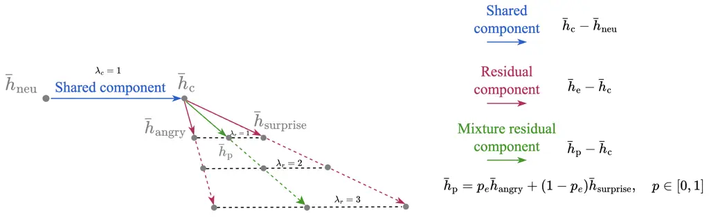

# EmoRES-TTS: Residual-Enhanced Vector Steering for Emotional Speech Generation

Kuan-Po Huang Affiliation: Reality Labs at Meta Affiliation: National
Taiwan University Work done at Meta    Haohe Liu Affiliation: FAIR at
Meta    Puyuan Peng Affiliation: FAIR at Meta    Haibin Wu
Affiliation: Reality Labs at Meta    Zhaoheng Ni Affiliation: Reality
Labs at Meta    Hung-yi Lee Affiliation: National Taiwan University   
Jinwon Lee Affiliation: Reality Labs at Meta    Neha Chachra
Affiliation: Reality Labs at Meta

###### Abstract

Emotion-conditioned text-to-speech (TTS) models may fail to express the
requested emotion reliably, and improving controllability by additional
training is costly in both computation and emotion-labeled speech
training data. We therefore study vector steering, a training-free
approach that modifies the internal representations of a frozen model.
CoCoEmo, a conventional vector steering method for emotion TTS, treats
each emotion vector as an indivisible direction controlled by a single
global strength, limiting adherence to the requested emotion. In this
work, we first discover that an emotion vector can be decomposed into a
shared component that moves speech away from neutral expression and a
residual component that directs generation toward the requested emotion.
Building on this finding, we propose Emotion Residual-Enhanced Steering
for TTS (EmoRES), a novel method that controls the two components
without retraining the backbone. On IEMOCAP, EmoRES outperforms CoCoEmo
across all four objective emotion metrics on the IndexTTS-2 and
CosyVoice2 backbones. Rank correlation improves by 26.13 and 12.97
percentage points, corresponding to relative gains of 118.8% and 33.1%,
while emotion hit rate improves by 12.95 and 6.92 points, corresponding
to relative gains of 20.1% and 9.8%. Human evaluation further shows a
relative improvement up to 35.0% in the rate at which listeners
correctly identified the dominant requested emotion and up to a 17.3%
improvement in fidelity, while listeners prefer EmoRES for naturalness
in up to 63.8% of pairwise comparisons. Component ablations further
demonstrate that effective control benefits from preserving the shared
component while strengthening the residual of the emotion steering
vectors.

^(†)^(†)date: September 2026^(†)^(†)Code:
[https://github.com/facebookresearch/EmoRES-TTS](https://github.com/facebookresearch/EmoRES-TTS)

## 1 Introduction

Emotional expression is an important dimension of speech
synthesis (Triantafyllopoulos et al., 2023). Since the same sentence may
be spoken with different emotions, TTS systems need to control emotional
expression while producing accurate linguistic content. This capability
is important for conversational agents (Chiba et al., 2018),
narration (Liu et al., 2024), accessibility (Fiannaca et al., 2018), and
dubbing (Cong et al., 2025), where the requested emotion must be
conveyed without compromising too much naturalness, intelligibility, or
speaker identity (Xie et al., 2025).

Existing emotional TTS systems commonly provide control through native
conditioning inputs, such as natural-language instructions (Guo et al.,
2023; Yang et al., 2025; Du et al., 2024) or emotion embeddings (Zhou et
al., 2026). These interfaces rely on emotion-aware training or
specialized conditioning modules. However, we observe that native
emotion conditioning alone does not always generate speech that strongly
matches the requested emotion.

Vector steering (Subramani et al., 2022), a form of activation steering,
is an alternative that does not require retraining the model or relying
solely on the model’s native conditioning interface. It identifies
directions associated with desired behaviors in a model’s internal
representations and adds them to the activations during inference, while
leaving the model parameters unchanged (Turner et al., 2023; Zou et al.,
2023; Rimsky et al., 2024). Recent work extends this approach to
emotional TTS by extracting directions from the activation differences
between emotional and neutral speech (Xie et al., 2025; Wang et al.,
2026b). These directions can strengthen emotional expression when the
embedding or instruction conditioning produces a weak response, while a
continuous steering strength controls the steering magnitude.
CoCoEmo (Wang et al., 2026b) establishes this approach for modern
language-model (LM)-based TTS systems (Zhou et al., 2026; Du et al.,
2024). It extracts mean-difference emotion vectors from selected speech
LM layers and injects the requested direction at inference time.
However, CoCoEmo treats each emotion vector as a single unit governed by
one global steering strength. This leaves the structure shared across
the emotion vectors unexamined.

In our work, we observe that every categorical emotion vector contains
two components: a shared component pointing from the neutral mean toward
the centroid of emotional activations, and a residual component pointing
from the centroid toward the requested emotion. Conventional steering
scales these two components together. This is restrictive because moving
speech away from neutral expression and directing it toward a particular
emotion need not require the same strength. When stronger
category-specific control is needed, increasing the global steering
strength also amplifies the shared component. Conventional steering
therefore cannot adjust the relative contributions of the two
components, which may be suboptimal when they require different
strengths.

In this work, we hypothesize that the shared component primarily moves
generated speech away from neutral expression, whereas the residual
directs generation toward the requested emotion. Based on this
hypothesis, we propose Emotion Residual-Enhanced Steering for TTS, or
EmoRES-TTS (abbreviated as EmoRES), a novel training-free method that
controls the two components independently and enhances the residual
steering strength relative to the shared component. In Section 5.1, we
evaluate EmoRES on IndexTTS-2 (Zhou et al., 2026) and CosyVoice2 (Du et
al., 2024), which use different native emotion-conditioning interfaces.
On IEMOCAP, EmoRES strengthens the correlation between the requested
emotion proportions and the speech emotion recognizer’s response by
26.13 percentage points for IndexTTS-2 and 12.97 points for CosyVoice2.
The rate at which the dominant target emotion receives the largest
posterior increase improves by 12.95 and 6.92 points, respectively.
Human evaluation shows the same trend. The percentage of clips whose
most frequent listener annotation matches the dominant target emotion
increases from 54.72% to 73.89% for IndexTTS-2 and from 58.18% to 77.88%
for CosyVoice2. EmoRES also obtains statistically significant
naturalness preference scores of 63.80% and 60.32% over CoCoEmo on the
two backbones. The component ablations in Section 5.2 further support
our hypothesis that the shared component primarily moves speech away
from neutral expression, while the residual directs generation toward
the requested emotion. Finally, our contributions are as follows:

- •
  To our knowledge, we conduct the first functional analysis of the
  shared component and category-specific residuals in emotion steering
  vectors for LM-based TTS.
- •
  We introduce EmoRES, a training-free generalization of conventional
  steering that reweights the shared and residual components without
  learning new subspaces or updating parameters of TTS models.
  Experiments across multiple TTS backbones, held-out evaluation, and
  human judgments consistently demonstrate improved emotional control.

## 2 Related Work

Emotion-controllable text-to-speech. Emotion-controllable TTS commonly
uses categorical labels, continuous emotion embeddings, natural-language
instructions, or expressive reference speech. Label-based approaches
such as EmoSphere++ (Cho et al., 2025) represent emotion type and
intensity in a continuous affective space, while PromptTTS (Guo et al., 2023) and EmoVoice (Yang et al., 2025) use textual descriptions to
specify speaking style. Recent zero-shot systems provide similar
controls through explicit emotion embeddings, as in IndexTTS-2 (Zhou et
al., 2026), or natural-language instructions, as in CosyVoice2 (Du et
al., 2024). Mixed-emotion synthesis (Zhou et al., 2022b) has also been
studied using models trained specifically for compound emotional
expression. These approaches provide useful control interfaces, but
generally depend on emotion-aware training, specialized conditioning
modules, or expressive reference signals.

Vector steering for speech generation. Vector steering modifies
intermediate representations at inference time without updating model
parameters. Early work in language models constructs directions from
contrasting examples and adds them to internal activations to control
high-level behavior (Turner et al., 2023; Zou et al., 2023; Rimsky et
al., 2024). Related approaches manipulate parameter, speaker, or style
embeddings to transfer emotional characteristics in TTS (Chen et al.,
2024; de Brito and Junior, 2026). EmoSteer-TTS applies
difference-of-means vectors within flow-matching TTS models and supports
emotion conversion, intensity control, erasure, and vector
composition (Xie et al., 2025). CoCoEmo instead identifies the speech
language model as an effective steering site and combines categorical
directions to produce quantitative mixed-emotion speech (Wang et al.,
2026b). Subsequent geometric (Wang et al., 2026a) analysis finds that
speech language model representations provide more separable and
speaker-invariant emotion directions than flow-matching representations.
Our work adopts this established extraction and inference-time vector
steering framework of CoCoEmo (Wang et al., 2026b), but instead examines
how categorical directions of emotions are composed and separates the
shared displacement from the request-dependent residual.

Composition and representation structure. Existing TTS steering methods
construct compound emotions by taking weighted sums of categorical
directions (Xie et al., 2025; Wang et al., 2026b). This approach treats
each direction as an indivisible unit and does not account for structure
shared across the emotional vectors. Related work on multi-attribute
language-model steering has addressed interference among directions
through orthogonal constraints and learned shared and attribute-specific
subspaces (Jiang et al., 2025). Such methods require learning or
optimizing new steering subspaces and do not examine the common
displacement present in mean-difference emotion vectors. Our proposed
EmoRES method instead uses an exact decomposition around the centroid of
the emotion-specific mean activations. Under convex composition, the
shared component retains a fixed coefficient, while only the residual
changes with the requested proportions. EmoRES exposes separate controls
for these two components without learning a new subspace or modifying
the weights of the TTS backbone.

## 3 Method

In this work, emotional speech is generated by intervening on the
internal activations of a frozen text-to-speech backbone. The procedure
is composed of two parts, the emotion vector extraction phase and the
vector steering phase. The remainder of this section specifies the two
stages, and then examines the structure of the injected vectors, which
admits a decomposition that CoCoEmo (Wang et al., 2026b) leaves
unexploited and that motivates the proposed method.

Steering vector extraction. In this phase, a set of emotion vectors is
extracted offline from expressive emotional corpora by contrasting the
model activations of emotional and neutral speech recordings. This is a
one-time computation and these vectors are then reused across all
utterances for generation during inference. Let $`\bar{h}_{e}`$ denote
that activation averaged over all recordings for each non-neutral
emotion $`e`$, and $`\bar{h}_{\mathrm{neu}}`$ the mean of the neutral
reference activations. The vector for an emotion is the difference of
the two means,

```math
v_{e}\;=\;\bar{h}_{e}-\bar{h}_{\mathrm{neu}}, \tag{1}
```

so that $`v_{e}`$ is the average displacement in activation space that
separates speech carrying emotion from neutral speech. Extraction
requires no gradient computation and no model weight updates.

Steering. During inference, the emotion vector is added back into the
activation at the same site it was extracted. The activation $`h`$ is
displaced along the requested steering direction:

```math
h\;\leftarrow\;h+\alpha v, \tag{2}
```

where $`v`$ is the steering vector for the requested emotion and
$`\alpha`$ a scalar for controlling the steering strength. Applied
directly, Eq. (2) alters the magnitude of the hidden state as well as
its direction, and large steering magnitudes may move activations
outside the distribution encountered during training. The magnitude of
each position is therefore restored after the addition, and the update
actually applied is

```math
h\;\leftarrow\;\lVert h\rVert\cdot\frac{h+\alpha v}{\lVert h+\alpha v\rVert}, \tag{3}
```

where $`\lVert\cdot\rVert`$ denotes the Euclidean norm over the hidden
dimension. The direction of the hidden state carries the emotional
content, while its norm is left untouched. The backbone parameters
remain frozen throughout, and generation requires no target-emotion
reference recording.

Shared and residual components. The central observation of this work is
that the emotion vector $`v_{e}=\bar{h}_{e}-\bar{h}_{\mathrm{neu}}`$ can
be decomposed into two functionally distinct components. Let
$`\mathcal{E}`$ denote the set of non-neutral emotion categories. We
define
$`\bar{h}_{c}=\frac{1}{|\mathcal{E}|}\sum_{e\in\mathcal{E}}\bar{h}_{e}`$
as the unweighted centroid of the mean activations of emotional speech.
Inserting $`\bar{h}_{c}`$ into Eq. (1) splits the vector into two parts,

```math
v_{e}=\bar{h}_{e}-\bar{h}_{\mathrm{neu}}\;=\;\underbrace{\bar{h}_{c}-\bar{h}_{\mathrm{neu}}}_{\text{shared}}\;+\;\underbrace{\bar{h}_{e}-\bar{h}_{c}}_{\text{residual}}. \tag{4}
```

The two parts are interpreted differently. The shared component
$`\bar{h}_{c}-\bar{h}_{\mathrm{neu}}`$ is the same vector for every
request, and it carries the activation away from neutral speech and
toward the centroid of emotional activations. It determines whether the
speech sounds emotional, but not which emotion it conveys. The
categorical residual component $`\bar{h}_{e}-\bar{h}_{c}`$ is the part
that depends on the requested emotion, and therefore carries the
information distinguishing one emotion from another.

EmoRES (Emotion residual-enhanced steering). In the setting of
CoCoEmo (Wang et al., 2026b), steering with $`v_{e}`$ couples the shared
shift and categorical residual. The single steering strength $`\alpha`$
scales both components by the same factor, fixing their relative
weighting. We propose to break this coupling by assigning an independent
coefficient to each component, resulting in the residual-enhanced
steering vector $`v_{\mathrm{RES}}`$:

```math
v_{\mathrm{RES}}\;=\;\lambda_{c}\big(\bar{h}_{c}-\bar{h}_{\mathrm{neu}}\big)\;+\;\lambda_{r}\big(\bar{h}_{e}-\bar{h}_{c}\big), \tag{5}
```

where $`\lambda_{c}`$ and $`\lambda_{r}`$ control the shared and
residual components, respectively. This formulation allows the
neutral-to-centroid shift and the category-specific contrast to be
adjusted independently. We denote this rule by
$`\mathrm{RES}(\lambda_{c},\lambda_{r})`$ and refer to it as
residual-enhanced steering. At $`\lambda_{c}=\lambda_{r}=1`$ the
centroid cancels and Eq. (5) reduces exactly to $`v_{e}`$, so CoCoEmo’s
conventional steering is a special case of the proposed family rather
than a distinct rule.

Mixture targets. Human speech can express multiple emotions
simultaneously, so the steering rule should support mixed-emotion
targets. Let $`p_{e}\geq 0`$ denote the requested proportion of emotion
$`e\in\mathcal{E}`$, with $`\sum_{e\in\mathcal{E}}p_{e}=1`$. Using these
proportions, the activation mixtures and steering vectors are

```math
\bar{h}_{p}=\sum_{e\in\mathcal{E}}p_{e}\bar{h}_{e},\qquad v_{\mathrm{mixRES}}=\lambda_{c}\big(\bar{h}_{c}-\bar{h}_{\mathrm{neu}}\big)+\lambda_{r}\big(\bar{h}_{p}-\bar{h}_{c}\big). \tag{6}
```

At inference time, $`v_{\mathrm{mixRES}}`$ is used as the steering
vector $`v`$ in Eq. (2). The shared shift remains constant across
requested emotions, while the requested proportions determine the
emotional residual. See Appendix A for a geometric interpretation of
EmoRES.

## 4 Experimental Setup

### 4.1 Datasets

Steering vector extraction. Following the procedure of CoCoEmo (Wang et
al., 2026b), all steering directions are extracted from a fixed library
of neutral–emotional utterance pairs drawn from three corpora: ESD (Zhou
et al., 2022a), CREMA-D (Cao et al., 2014) and RAVDESS (Livingstone and
Russo, 2018). Within a pair the two utterances share both speaker and
lexical content, so that the difference between them isolates emotional
variation from speaker identity and text content. Both sides of every
pair are screened by a speech-emotion-recognition gate and a
signal-quality gate, and a pair is discarded whole if either side fails.
Partial pairs are never used, since a difference taken between two
different sets of utterances would not be a paired contrast. The library
spans the four emotions evaluated in this work, namely _angry_, _happy_,
_sad_ and _surprise_, with _neutral_ as the reference pole. More
experimental details on steering vector extraction can be found in
Appendix C.

Evaluation sets. We employ a corpus-level development–test split for
evaluation. CREMA-D (Cao et al., 2014) serves as the development set,
annotated with per-utterance emotion mixtures over the emotions _angry_,
_happy_, and _sad_. All hyperparameter tuning and design choices,
including steering coefficients, are conducted exclusively on this
corpus. To evaluate out-of-distribution transferability, IEMOCAP (Busso
et al., 2008) is strictly held out as the test set, contributing no
speakers or recordings to steering vector construction. Annotated with
per-utterance mixtures over the emotions _angry_, _happy_, _surprise_,
and _sad_, IEMOCAP assesses whether parameters optimized on the
development set transfer effectively across domains.

### 4.2 Model steering

We evaluate two frozen zero-shot TTS backbones chosen to differ in how
emotion is conditioned during inference. IndexTTS-2 (Zhou et al., 2026)
is an embedding-conditioned model that takes an explicit emotion
embedding as a conditioning input. For IndexTTS-2, we steer layers
$`1`$, $`6`$ and $`8`$ of its semantic language model. CosyVoice 2 (Du
et al., 2024) is an instruction-based model that conditions on a
natural-language style prompt. For CosyVoice 2, we steer layers $`14`$
and $`17`$ of its text-to-token language model. Both layer sets are the
top-$`K`$ most emotion-separable layers published by CoCoEmo (Wang et
al., 2026b) for these backbones. In both cases, steering is applied at
the attention output, which is also the site at which the steering
vectors are extracted. No weights are updated and each model’s native
emotion conditioning is left at its default, so any measured effect is
attributable to the steering vector alone.

In the experiments of this work, to separate improvements from overall
steering magnitude, the vector produced by each method before steering
is rescaled to the mean Euclidean norm of the original emotion vectors
in Eq. (1) at the corresponding layer. Consequently, at a fixed steering
strength $`\alpha`$, all steered conditions inject vectors with the same
norm and differ only in direction.

### 4.3 Evaluation Metrics

#### 4.3.1 Objective evaluation

We assess emotional expression using target emotion probability (TEP)
and weighted anchored emotion similarity (E-SIM), speaker preservation
using speaker similarity (S-SIM), and intelligibility using word error
rate (WER). For mixed-emotion requests, we additionally report Spearman
rank correlation ($`\bm{\rho}`$) and hit rate (H-Rate) to measure
whether changes in the speech emotion recognizer posteriors follow the
requested ordering and dominant emotion. Full definitions and evaluation
details are provided in Appendix B.1.

#### 4.3.2 Subjective evaluation

We conduct two human evaluations on IEMOCAP, emotion labeling and
naturalness preference. For emotion labeling, annotators listen to one
clip at a time and assign the emotion they perceive. The labels
collected for each clip form an empirical emotion distribution, from
which Dom-hit and Fidelity are computed. For naturalness, annotators
listen to outputs from CoCoEmo and our proposed EmoRES method for the
same sentence in randomized order and choose whether EmoRES is more
natural, CoCoEmo is more natural, or the two sound about the same. For
each subjective evaluation task, each sample received at least 9
annotations from different annotators. We briefly describe each metric
below, with complete definitions and evaluation details provided in
Appendix B.2.

Dom-hit (Dominant emotion hit rate): The fraction of clips whose most
frequent annotated emotion label is the utterance’s dominant target
emotion. Fidelity: The agreement between the distribution of the
annotated emotion labels over a clip and the target emotion mixture.
Fidelity is sensitive to the whole mixture and therefore penalizes a
generated clip that reaches the dominant emotion while suppressing the
rest of the requested emotions. Naturalness preference: The tie-adjusted
fraction of blind pairwise comparisons in which listeners judged the
proposed system more natural than the CoCoEmo baseline. It is an ordinal
comparison of two systems rather than an absolute quality score, and it
detects a loss of naturalness paid for emotional control.

### 4.4 Baselines

We compare against three baselines, all decoded with the same manifests,
prompts and frozen backbones. _No-steer_ is the unmodified TTS backbone
for emotional speech generation without steering. By default, generation
uses each backbone’s native emotion-conditioning interface, namely
emotion embeddings for IndexTTS-2 and natural-language instructions for
CosyVoice2, unless otherwise specified. This baseline fixes the
intelligibility and speaker-identity operating point, and is the
reference against which metrics $`\rho`$ and H-Rate are computed.
*CoCoEmo* (Wang et al., 2026b) serves as the emotion vector steering
baseline and is recovered exactly at $`\lambda_{c}=\lambda_{r}=1`$.
_Random steer_ injects an isotropic Gaussian direction at the same
layers and site, rescaled to the norm of the vector it replaces, so only
the direction changes. It isolates the contribution of the extracted
direction from that of the injected magnitude alone, and thus
establishes the lower bound that any direction-specific claim must
exceed. Results for random steering are provided in Appendix D due to
page limitations.

## 5 Results and Discussion

We evaluate EmoRES through objective and subjective comparisons in
Section 5.1, component ablations in Section 5.2, and visualization of
speech emotion embeddings in Section 5.3. Additional experiments examine
random-direction controls in Appendix D, single-emotion requests for
emotional speech prompts in Appendix E, steering without native emotion
conditioning in Appendix F, and evaluating with different speech emotion
recognizers in Appendix G.

Figure 1: Residual weight against steering strength $`\alpha`$ on
IEMOCAP (OOD) with IndexTTS-2 for each objective metric. Each curve is
fixed at $`\lambda_{c}=1`$ with $`\lambda_{r}`$ ablated. Every arm is
norm-matched, so at a given $`\alpha`$, all arms inject the same
steering vector norm and differ only in the direction. $`\lambda_{r}=1`$
is CoCoEmo’s steering method. Shaded bands are $`\pm`$ one standard
deviation over five different runs.

### 5.1 Residual-Enhanced Vectors

Figure 1 plots each metric across steering strengths
$`\alpha\in\{1,\ldots,6\}`$ for various residual strengths
$`\lambda_{r}\in\{0,\ldots,5\}`$ with IndexTTS-2, evaluated on the
IEMOCAP evaluation set. With the residual strength set to
$`\lambda_{r}=2`$, shown in green, increasing $`\alpha`$ monotonically
improves all four emotion metrics. Compared with CoCoEmo
($`\lambda_{r}=1`$), it achieves higher TEP, $`\rho`$, H-Rate, E-SIM,
and S-SIM across all evaluated steering strengths while generally
yielding lower WER. Increasing the residual strength to
$`\lambda_{r}=3`$, shown by the red curve, outperforms CoCoEmo
($`\lambda_{r}=1`$) on every reported metric across all evaluated
steering strengths while consistently yielding lower WER than CoCoEmo.
In contrast, shared-only steering ($`\lambda_{r}=0`$) generally
deteriorates across all metrics as $`\alpha`$ increases. CoCoEmo largely
saturates beyond $`\alpha=3`$ on emotion metrics, while S-SIM decreases
and WER increases. Increasing $`\lambda_{r}`$ beyond 3 provides smaller
additional gains, suggesting diminishing returns.

|                                                 |                   |                  |                  |                    |                   |                   |
| ----------------------------------------------- | ----------------- | ---------------- | ---------------- | ------------------ | ----------------- | ----------------- |
| Method                                          | E-SIM$`\uparrow`$ | TEP$`\uparrow`$  | $`\rho\uparrow`$ | H-Rate$`\uparrow`$ | S-SIM$`\uparrow`$ | WER$`\downarrow`$ |
| In-distribution evaluation on CREMA-D (dev)     |                   |                  |                  |                    |                   |                   |
| Ground Truth                                    | 72.56             | 55.51            | –                | –                  | 87.86             | 1.08              |
| IndexTTS-2                                      |                   |                  |                  |                    |                   |                   |
| No-steer                                        | 55.00$`\pm`$0.36  | 16.83$`\pm`$1.39 | –                | –                  | 87.18$`\pm`$0.16  | 6.30$`\pm`$0.05   |
| CoCoEmo                                         | 64.46$`\pm`$0.40  | 38.69$`\pm`$1.21 | 25.24$`\pm`$4.52 | 76.00$`\pm`$1.78   | 85.77$`\pm`$0.22  | 7.60$`\pm`$0.14   |
| EmoRES, $`\lambda_{r}=3`$                       | 64.80$`\pm`$0.25  | 39.98$`\pm`$0.88 | 45.87$`\pm`$6.99 | 82.49$`\pm`$2.34   | 86.90$`\pm`$0.21  | 6.78$`\pm`$0.16   |
| CosyVoice2                                      |                   |                  |                  |                    |                   |                   |
| No-steer                                        | 59.70$`\pm`$0.36  | 34.01$`\pm`$0.96 | –                | –                  | 87.36$`\pm`$0.21  | 0.53$`\pm`$0.06   |
| CoCoEmo                                         | 74.16$`\pm`$0.09  | 67.43$`\pm`$0.40 | 32.48$`\pm`$2.17 | 78.92$`\pm`$0.54   | 86.30$`\pm`$0.12  | 1.21$`\pm`$0.17   |
| EmoRES, $`\lambda_{r}=3`$                       | 74.71$`\pm`$0.24  | 68.80$`\pm`$0.56 | 51.94$`\pm`$6.30 | 84.76$`\pm`$2.07   | 86.73$`\pm`$0.18  | 1.30$`\pm`$0.10   |
| Out-of-distribution evaluation on IEMOCAP (OOD) |                   |                  |                  |                    |                   |                   |
| Ground Truth                                    | 60.68             | 39.82            | –                | –                  | 87.06             | 11.95             |
| IndexTTS-2                                      |                   |                  |                  |                    |                   |                   |
| No-steer                                        | 61.69$`\pm`$0.23  | 30.76$`\pm`$0.44 | –                | –                  | 85.09$`\pm`$0.16  | 5.69$`\pm`$0.20   |
| CoCoEmo                                         | 65.32$`\pm`$0.35  | 36.22$`\pm`$0.80 | 22.00$`\pm`$4.83 | 64.34$`\pm`$2.39   | 83.11$`\pm`$0.24  | 6.61$`\pm`$0.28   |
| EmoRES, $`\lambda_{r}=3`$                       | 67.67$`\pm`$0.23  | 41.11$`\pm`$0.39 | 48.13$`\pm`$2.44 | 77.29$`\pm`$1.67   | 84.52$`\pm`$0.25  | 5.94$`\pm`$0.31   |
| CosyVoice2                                      |                   |                  |                  |                    |                   |                   |
| No-steer                                        | 56.74$`\pm`$0.21  | 28.92$`\pm`$0.17 | –                | –                  | 87.49$`\pm`$0.14  | 3.21$`\pm`$0.22   |
| CoCoEmo                                         | 63.43$`\pm`$0.22  | 37.44$`\pm`$0.36 | 39.13$`\pm`$1.56 | 70.90$`\pm`$0.81   | 86.42$`\pm`$0.14  | 4.51$`\pm`$0.17   |
| EmoRES, $`\lambda_{r}=3`$                       | 65.34$`\pm`$0.22  | 40.12$`\pm`$0.29 | 52.10$`\pm`$1.05 | 77.82$`\pm`$0.68   | 86.81$`\pm`$0.13  | 3.61$`\pm`$0.12   |

Table 1: Mixed-emotion evaluation on CREMA-D (dev) and IEMOCAP (OOD).
All steered rows use $`\alpha=5`$ and $`\lambda_{c}=1`$. CoCoEmo is the
$`\lambda_{r}=1`$ special case. Values are percentages, reported as mean
$`\pm`$ standard deviation over five replicates. Best results among the
synthesis rows are bold, second-best are underlined.

Table 1 shows the emotional speech generation results for IndexTTS-2 and
CosyVoice2 on the in-distribution CREMA-D development set and the
out-of-distribution IEMOCAP set, comparing EmoRES with CoCoEmo and no
steering. All steered rows share $`\lambda_{c}=1`$, with the steering
vectors normalized to the average length of $`v_{e}`$, and vary only in
the residual steering strength $`\lambda_{r}`$. Consequently,
performance differences cannot be attributed to unequal steering
magnitudes.

The no-steer baseline uses each original model’s native conditioning,
with emotion embeddings for IndexTTS-2 and emotion instructions for
CosyVoice2, but without vector steering. Despite this conditioning, its
lower TEP and E-SIM relative to the steered systems indicate that native
conditioning alone provides weaker alignment with the requested
emotions. Compared with CoCoEmo, EmoRES yields its largest improvements
in $`\rho`$ and H-Rate. On CREMA-D, $`\rho`$ increases from 25.24% to
45.87% for IndexTTS-2 and from 32.48% to 51.94% for CosyVoice2, while
H-Rate increases from 76.00% to 82.49% and from 78.92% to 84.76%,
respectively. On IEMOCAP, $`\rho`$ increases from 22.00% to 48.13% for
IndexTTS-2 and from 39.13% to 52.10% for CosyVoice2, while H-Rate
increases from 64.34% to 77.29% and from 70.90% to 77.82%, respectively.
These results show that changes in the speech emotion recognizer’s
posterior more closely follow the requested rank ordering and more often
assign the largest increase to the dominant target emotion. TEP and
E-SIM also improve in every comparison, indicating higher average
posterior mass on the requested emotion set and stronger similarity to
the target-weighted emotion anchors. EmoRES further improves S-SIM in
every comparison and reduces WER under most settings.

Table 2(a) reports the subjective emotion labeling results on IEMOCAP.
Without vector steering, the native controls provide weak agreement with
the requested emotions, particularly for IndexTTS-2, which obtains a
Dom-hit of 17.78% and a Fidelity of 25.04%. Compared with CoCoEmo,
EmoRES raises Dom-hit from 54.72% to 73.89% for IndexTTS-2 and from
58.18% to 77.88% for CosyVoice2. Thus, the emotion most frequently
identified by listeners matches the dominant target emotion more often
under EmoRES. Fidelity increases from 60.05% to 66.32% for IndexTTS-2
and from 50.80% to 59.60% for CosyVoice2. The improvements in both
Dom-hit and Fidelity are statistically significant for both backbones,
with paired 95% confidence intervals for the differences between EmoRES
and CoCoEmo excluding zero. The simultaneous improvement in Fidelity
shows that the gain in Dom-hit is accompanied by better agreement with
the complete target mixture, rather than only stronger expression of its
dominant emotion. These subjective trends align with Table 1, where
EmoRES also improves H-Rate and $`\rho`$ over CoCoEmo for both models on
IEMOCAP.

Table 2(b) reports the naturalness comparison between CoCoEmo and
EmoRES. EmoRES obtains preference scores of 63.80% for IndexTTS-2 and
60.32% for CosyVoice2. Both scores are significantly above the 50%
indifference point, with 95% confidence intervals of $`[61.70,65.91]`$
and $`[58.08,62.56]`$, respectively. Overall, the subjective evaluation
results indicate that, relative to CoCoEmo, EmoRES improves emotional
control while better preserving perceived naturalness.

(a) Emotion labeling

|                      |                      |                       |                      |                       |
| -------------------- | -------------------- | --------------------- | -------------------- | --------------------- |
|                      | IndexTTS-2           |                       | CosyVoice2           |                       |
| Method               | Dom-hit $`\uparrow`$ | Fidelity $`\uparrow`$ | Dom-hit $`\uparrow`$ | Fidelity $`\uparrow`$ |
| No-steer             | 17.78 %              | 25.04 %               | 32.42 %              | 33.28 %               |
| CoCoEmo              | 54.72 %              | 60.05 %               | 58.18 %              | 50.80 %               |
| EmoRES               | 73.89 %              | 66.32 %               | 77.88 %              | 59.60 %               |
| $`\Delta`$           | $`+`$19.17 ^(∗)      | $`+`$6.27 ^(∗)        | $`+`$19.70 ^(∗)      | $`+`$8.80 ^(∗)        |
| 95% CI of $`\Delta`$ | \[13.06, 25.56\]     | \[3.44, 8.94\]        | \[13.33, 26.07\]     | \[5.91, 11.81\]       |

(b) Naturalness A/B

|                                      | IndexTTS-2       | CosyVoice2       |
| ------------------------------------ | ---------------- | ---------------- |
| EmoRES preference score $`\uparrow`$ | 63.80 %^(∗)      | 60.32 %^(∗)      |
| 95% CI                               | \[61.70, 65.91\] | \[58.08, 62.56\] |
| Choose EmoRES                        | 50.83 %          | 41.78 %          |
| About the same                       | 25.93 %          | 37.07 %          |
| Choose CoCoEmo                       | 23.24 %          | 21.14 %          |

Table 2: Subjective evaluation on IEMOCAP, comparing CoCoEmo
($`\lambda_{r}=1`$) against EmoRES ($`\lambda_{r}=3`$). $`\Delta`$ is
the difference between EmoRES and CoCoEmo. ^(∗) denotes statistical
significance.

### 5.2 Shared and Residual Components

|                   |                 |                 |                    |                  |                       |                     |                    |                    |
| ----------------- | --------------- | --------------- | ------------------ | ---------------- | --------------------- | ------------------- | ------------------ | ------------------ |
| Method            | $`\lambda_{c}`$ | $`\lambda_{r}`$ | E-SIM $`\uparrow`$ | TEP $`\uparrow`$ | $`\rho`$ $`\uparrow`$ | H-Rate $`\uparrow`$ | S-SIM $`\uparrow`$ | WER $`\downarrow`$ |
| Ground Truth      | –               | –               | 72.56              | 55.51            | –                     | –                   | 87.86              | 1.08               |
| IndexTTS-2        |                 |                 |                    |                  |                       |                     |                    |                    |
| No-steer          | –               | –               | 55.00$`\pm`$0.36   | 16.83$`\pm`$1.39 | –                     | –                   | 87.18$`\pm`$0.16   | 6.30$`\pm`$0.05    |
| Residual only     | $`0`$           | $`1`$           | 63.05$`\pm`$0.29   | 35.88$`\pm`$0.77 | 45.16$`\pm`$5.92      | 82.16$`\pm`$2.06    | 87.64$`\pm`$0.18   | 6.36$`\pm`$0.06    |
| Shared & Residual | $`1`$           | $`1`$           | 64.46$`\pm`$0.40   | 38.69$`\pm`$1.21 | 25.24$`\pm`$4.52      | 76.00$`\pm`$1.78    | 85.77$`\pm`$0.22   | 7.60$`\pm`$0.14    |
| Shared only       | $`1`$           | $`0`$           | 59.51$`\pm`$0.33   | 26.64$`\pm`$1.18 | 5.30$`\pm`$7.86       | 69.62$`\pm`$2.21    | 85.13$`\pm`$0.22   | 6.69$`\pm`$0.26    |
| Shared & Residual | $`1`$           | $`3`$           | 64.80$`\pm`$0.25   | 39.98$`\pm`$0.88 | 45.87$`\pm`$6.99      | 82.49$`\pm`$2.34    | 86.90$`\pm`$0.21   | 6.78$`\pm`$0.16    |
| CosyVoice2        |                 |                 |                    |                  |                       |                     |                    |                    |
| No-steer          | –               | –               | 59.70$`\pm`$0.36   | 34.01$`\pm`$0.96 | –                     | –                   | 87.36$`\pm`$0.21   | 0.53$`\pm`$0.06    |
| Residual only     | $`0`$           | $`1`$           | 72.21$`\pm`$0.27   | 63.82$`\pm`$0.56 | 39.94$`\pm`$5.04      | 80.54$`\pm`$1.53    | 87.21$`\pm`$0.16   | 1.14$`\pm`$0.15    |
| Shared & Residual | $`1`$           | $`1`$           | 74.16$`\pm`$0.09   | 67.43$`\pm`$0.40 | 32.48$`\pm`$2.17      | 78.92$`\pm`$0.54    | 86.30$`\pm`$0.12   | 1.21$`\pm`$0.17    |
| Shared only       | $`1`$           | $`0`$           | 65.92$`\pm`$0.26   | 47.53$`\pm`$0.68 | 7.20$`\pm`$5.03       | 70.16$`\pm`$2.14    | 85.77$`\pm`$0.13   | 2.30$`\pm`$0.19    |
| Shared & Residual | $`1`$           | $`3`$           | 74.71$`\pm`$0.24   | 68.80$`\pm`$0.56 | 51.94$`\pm`$6.30      | 84.76$`\pm`$2.07    | 86.73$`\pm`$0.18   | 1.30$`\pm`$0.10    |

Table 3: Component ablation on CREMA-D in the mixed setting. Every
steered row uses steering strength $`\alpha=5`$, norm-matched to the
same steering vector norm and differs from the others only in how that
norm is split between the shared and residual components and in the
direction each component points. Mean $`\pm`$ one standard deviation
over five speaker-prompt runs. Best per column and backbone in bold. See
Appendix D for the design and for the row contrasts.

Table 3 isolates the roles of the shared and residual components by
holding $`\alpha`$ and the steering-vector norm fixed while varying only
$`\lambda_{c}`$ and $`\lambda_{r}`$. Shared-only steering improves E-SIM
and TEP over no steering, but produces the lowest $`\rho`$ and H-Rate
among the steered conditions for both models. In particular, $`\rho`$
falls to 5.30% for IndexTTS-2 and 7.20% for CosyVoice2. As a separate
diagnostic, we find that shared-only steering reduces the speech emotion
recognizer’s neutral posterior from 36.51% to 7.49% for IndexTTS-2.
Together, these results show that the shared component moves the output
away from neutral, but provides imprecise information about the
requested emotion mixture.

Residual-only steering exhibits the opposite pattern. Relative to the
conventional setting of CoCoEmo at $`\lambda_{c}=\lambda_{r}=1`$, it
improves $`\rho`$ and H-Rate but reduces E-SIM and TEP for both models.
Thus, neither component is sufficient alone. The shared component
increases posterior mass on the requested emotion set and similarity to
the emotion anchors, but carries little information about the requested
mixture. The residual provides category-specific contrast, but when used
alone yields lower TEP and E-SIM than the combined direction. Moreover,
simply including both components with equal weights remains suboptimal.
Retaining the shared component while increasing the relative residual
strength to $`\lambda_{r}=3`$ produces the best emotion-control results
in the table. Since all conditions are norm-matched, this improvement
arises from rebalancing the two components rather than increasing the
overall steering magnitude.

### 5.3 Visualization of speech emotion embeddings

Figure 2: Emotion2vec embedding t-SNE plots for utterances generated by
IndexTTS-2 on the single-emotion CREMA-D subset ($`n=486`$). Each point
is colored by its requested emotion. Values above each panel report the
accuracy of probing and the mean cosine silhouette score.

The t-SNE plot (van der Maaten and Hinton, 2008) in Figure 2 illustrates
how vector steering changes the distribution of generated utterances in
the emotion2vec (Ma et al., 2024) embedding space. To quantify
emotion-specific organization, we report two complementary measures
computed from the emotion2vec embeddings. Probe accuracy is the balanced
accuracy of a logistic regression classifier trained to predict the
requested emotion, and therefore measures how emotion identity can be
recovered from the embeddings. The cosine silhouette score measures
within-emotion cohesion relative to separation from other emotions.
Values near one indicate compact, well-separated groups, values near
zero indicate overlapping groups, and negative values indicate that
samples are often closer to another emotion than to their own.

The no-steer embeddings in panel (b) exhibit substantial overlap among
the requested emotions. Although native conditioning makes emotion
identity partially recoverable, as reflected by a probe accuracy of
56.9%, the slightly negative silhouette score indicates that it does not
form compact emotion-specific clusters. Shared-only steering in panel
(c) produces similar results, with 57.6% probe accuracy and a silhouette
score near zero. In contrast, residual-only steering in panel (d) forms
substantially more distinct clusters, achieving 81.4% probe accuracy and
a silhouette score of 0.379. This supports the interpretation that the
residual component carries the category-specific contrasts between
emotions.

CoCoEmo in panel (e) combines both components but retains some overlap
between the emotion clusters. Our EmoRES method in panel (f) strengthens
the residual while retaining the shared component, producing the highest
probe accuracy of 86.9% and silhouette score of 0.460. Compared with
CoCoEmo in panel (e), EmoRES in panel (f) produces more compact and
distinct emotion-dependent clusters. In particular, the sad and happy
clusters are more clearly separated under EmoRES. This visual pattern is
consistent with the higher probe accuracy and cosine silhouette score
achieved by EmoRES, indicating that the requested emotions are more
distinguishable and that utterances sharing the same target are grouped
more closely. These results suggest that strengthening the residual
component improves category-specific emotion structure in embedding
space.

## 6 Conclusions and Future Work

This work shows that emotion steering vectors contain shared and
residual components with distinct functions. EmoRES controls these
components independently and strengthens the residual relative to the
shared component without fine-tuning. Norm-matched experiments on
IndexTTS-2 and CosyVoice2 demonstrate improved emotion control on both
CREMA-D and IEMOCAP, with component ablations and human evaluations
supporting the proposed interpretation. Future work will extend EmoRES
to token-level or segment-level control for emotions that vary within an
utterance and test whether the shared-residual decomposition generalizes
across additional emotions, languages, speech corpora, and TTS
architectures.

## References

- Busso et al. (2008) C. Busso, M. Bulut, C. Lee, A. Kazemzadeh, E.
  Mower, S. Kim, J. N. Chang, S. Lee, and S. S. Narayanan IEMOCAP:
  interactive emotional dyadic motion capture database. Language
  resources and evaluation 42 (4), pp. 335–359. Cited by: §4.1.
- Cao et al. (2014) H. Cao, D. G. Cooper, M. K. Keutmann, R. C. Gur, A.
  Nenkova, and R. Verma Crema-d: crowd-sourced emotional multimodal
  actors dataset. IEEE transactions on affective computing 5 (4),
  pp. 377–390. Cited by: §C.1, §4.1, §4.1.
- Chen et al. (2024) H. Chen, R. Chen, and J. Hirschberg EmoKnob:
  enhance voice cloning with fine-grained emotion control. In
  Proceedings of the 2024 Conference on Empirical Methods in Natural
  Language Processing, pp. 8170–8180. Cited by: §2.
- Chen et al. (2022) S. Chen, C. Wang, Z. Chen, Y. Wu, S. Liu, Z.
  Chen, J. Li, N. Kanda, T. Yoshioka, X. Xiao, et al. Wavlm: large-scale
  self-supervised pre-training for full stack speech processing. IEEE
  Journal of Selected Topics in Signal Processing 16 (6), pp. 1505–1518.
  Cited by: §B.1.
- Chiba et al. (2018) Y. Chiba, T. Nose, T. Kase, M. Yamanaka, and A.
  Ito An analysis of the effect of emotional speech synthesis on
  non-task-oriented dialogue system. In Proceedings of the 19th annual
  SIGdial meeting on discourse and dialogue, pp. 371–375. Cited by: §1.
- Cho et al. (2025) D. Cho, H. Oh, S. Kim, and S. Lee EmoSphere++:
  emotion-controllable zero-shot text-to-speech via emotion-adaptive
  spherical vector. IEEE Transactions on Affective Computing 16 (3),
  pp. 2365–2380. Cited by: §2.
- Cong et al. (2025) G. Cong, J. Pan, L. Li, Y. Qi, Y. Peng, A. Van Den
  Hengel, J. Yang, and Q. Huang Emodubber: towards high quality and
  emotion controllable movie dubbing. In 2025 IEEE/CVF Conference on
  Computer Vision and Pattern Recognition (CVPR), pp. 15863–15873. Cited
  by: §1.
- de Brito and Junior (2026) D. O. de Brito and A. C. Junior Task-vector
  arithmetic for emotional expressivity control in language-model-based
  text-to-speech. arXiv preprint arXiv:2606.05367. Cited by: §2.
- Du et al. (2024) Z. Du, Y. Wang, Q. Chen, X. Shi, X. Lv, T. Zhao, Z.
  Gao, Y. Yang, C. Gao, H. Wang, et al. Cosyvoice 2: scalable streaming
  speech synthesis with large language models. arXiv preprint
  arXiv:2412.10117. Cited by: §1, §1, §1, §2, §4.2.
- Fiannaca et al. (2018) A. J. Fiannaca, A. Paradiso, J. Campbell,
  and M. R. Morris Voicesetting: voice authoring uis for improved
  expressivity in augmentative communication. In Proceedings of the 2018
  CHI Conference on Human Factors in Computing Systems, pp. 1–12. Cited
  by: §1.
- Goncalves et al. (2024) L. Goncalves, A. N. Salman, A. R. Naini, L.
  Moro-Velázquez, T. Thebaud, P. Garcia, N. Dehak, B. Sisman, and C.
  Busso Odyssey 2024 - Speech Emotion Recognition Challenge: Dataset,
  Baseline Framework, and Results. In The Speaker and Language
  Recognition Workshop (Odyssey 2024), pp. 247–254. External Links:
  [Document](https://dx.doi.org/10.21437/odyssey.2024-35) Cited by:
  Appendix G.
- Guo et al. (2023) Z. Guo, Y. Leng, Y. Wu, S. Zhao, and X. Tan
  Prompttts: controllable text-to-speech with text descriptions. In
  ICASSP 2023-2023 IEEE International Conference on Acoustics, Speech
  and Signal Processing (ICASSP), pp. 1–5. Cited by: §1, §2.
- Jiang et al. (2025) X. Jiang, L. Zhang, J. Zhang, Q. Yang, G. Hu, D.
  Wang, and L. Hu Adaptive multi-subspace representation steering for
  attribute alignment in large language models. arXiv preprint
  arXiv:2508.10599. Cited by: §2.
- Liu et al. (2024) S. Liu, Y. Guo, X. Chen, and K. Yu Storytts: a
  highly expressive text-to-speech dataset with rich textual
  expressiveness annotations. In ICASSP 2024-2024 IEEE International
  Conference on Acoustics, Speech and Signal Processing (ICASSP),
  pp. 11521–11525. Cited by: §1.
- Livingstone and Russo (2018) S. R. Livingstone and F. A. Russo The
  ryerson audio-visual database of emotional speech and song (ravdess):
  a dynamic, multimodal set of facial and vocal expressions in north
  american english. PloS one 13 (5), pp. e0196391. Cited by: §C.1, §4.1.
- Ma et al. (2024) Z. Ma, Z. Zheng, J. Ye, J. Li, Z. Gao, S. Zhang,
  and X. Chen Emotion2vec: self-supervised pre-training for speech
  emotion representation. In Findings of the Association for
  Computational Linguistics: ACL 2024, pp. 15747–15760. Cited by: §B.1,
  §B.1, Appendix G, §5.3.
- Radford et al. (2023) A. Radford, J. W. Kim, T. Xu, G. Brockman, C.
  McLeavey, and I. Sutskever Robust speech recognition via large-scale
  weak supervision. In International conference on machine learning,
  pp. 28492–28518. Cited by: §B.1.
- Rimsky et al. (2024) N. Rimsky, N. Gabrieli, J. Schulz, M. Tong, E.
  Hubinger, and A. Turner Steering llama 2 via contrastive activation
  addition. In Proceedings of the 62nd Annual Meeting of the Association
  for Computational Linguistics (Volume 1: Long Papers),
  pp. 15504–15522. Cited by: §1, §2.
- Subramani et al. (2022) N. Subramani, N. Suresh, and M. E. Peters
  Extracting latent steering vectors from pretrained language models. In
  Findings of the Association for Computational Linguistics: ACL 2022,
  pp. 566–581. Cited by: §1.
- Triantafyllopoulos et al. (2023) A. Triantafyllopoulos, B. W.
  Schuller, G. İymen, M. Sezgin, X. He, Z. Yang, P. Tzirakis, S. Liu, S.
  Mertes, E. André, et al. An overview of affective speech synthesis and
  conversion in the deep learning era. Proceedings of the IEEE 111 (10),
  pp. 1355–1381. Cited by: §1.
- Turner et al. (2023) A. M. Turner, L. Thiergart, G. Leech, D.
  Udell, J. J. Vazquez, U. Mini, and M. MacDiarmid Steering language
  models with activation engineering. arXiv preprint arXiv:2308.10248.
  Cited by: §1, §2.
- van der Maaten and Hinton (2008) L. van der Maaten and G. Hinton
  Visualizing data using t-sne. Journal of Machine Learning Research 9
  (86), pp. 2579–2605. External Links:
  [Link](http://jmlr.org/papers/v9/vandermaaten08a.html) Cited by: §5.3.
- Wang et al. (2026a) S. Wang, J. Bailey, and T. Dang A geometric
  perspective on composable emotion steering in text-to-speech models.
  arXiv preprint arXiv:2607.00946. Cited by: §2.
- Wang et al. (2026b) S. Wang, S. Tan, S. Liu, H. Jia, G. Huang, J.
  Bailey, and T. Dang CoCoEmo: composable and controllable human-like
  emotional tts via activation steering. In Proceedings of the 43rd
  International Conference on Machine Learning, Cited by: §C.1, §C.3,
  §1, §2, §2, §3, §3, §4.1, §4.2, §4.4.
- Xie et al. (2025) T. Xie, S. Yang, C. Li, D. Yu, and L. Liu
  Emosteer-tts: fine-grained and training-free emotion-controllable
  text-to-speech via activation steering. arXiv preprint
  arXiv:2508.03543. Cited by: §B.1, §1, §1, §2, §2.
- Xu et al. (2025) J. Xu, Z. Guo, H. Hu, Y. Chu, X. Wang, J. He, Y.
  Wang, X. Shi, T. He, X. Zhu, et al. Qwen3-omni technical report. arXiv
  preprint arXiv:2509.17765. Cited by: Appendix G.
- Yang et al. (2025) G. Yang, C. Yang, Q. Chen, Z. Ma, W. Chen, W.
  Wang, T. Wang, Y. Yang, Z. Niu, W. Liu, et al. Emovoice: llm-based
  emotional text-to-speech model with freestyle text prompting. In
  Proceedings of the 33rd ACM International Conference on Multimedia,
  pp. 10748–10757. Cited by: §1, §2.
- Zhou et al. (2022a) K. Zhou, B. Sisman, R. Liu, and H. Li Emotional
  voice conversion: theory, databases and esd. Speech communication 137,
  pp. 1–18. Cited by: §B.1, §C.1, §4.1.
- Zhou et al. (2022b) K. Zhou, B. Sisman, R. Rana, B. W. Schuller,
  and H. Li Speech synthesis with mixed emotions. IEEE Transactions on
  Affective Computing 14 (4), pp. 3120–3134. Cited by: §2.
- Zhou et al. (2026) S. Zhou, Y. Zhou, Y. He, X. Zhou, J. Wang, W. Deng,
  and J. Shu Indextts2: a breakthrough in emotionally expressive and
  duration-controlled auto-regressive zero-shot text-to-speech. In
  Proceedings of the AAAI Conference on Artificial Intelligence, Vol.
  40, pp. 35139–35148. Cited by: §1, §1, §1, §2, §4.2.
- Zou et al. (2023) A. Zou, L. Phan, S. Chen, J. Campbell, P. Guo, R.
  Ren, A. Pan, X. Yin, M. Mazeika, A. Dombrowski, et al. Representation
  engineering: a top-down approach to ai transparency. arXiv preprint
  arXiv:2310.01405. Cited by: §1, §2.

## Appendix A Geometric illustration of EmoRES



Figure 3: Geometric illustration of EmoRES in a two-dimensional
projection with an example of two emotions.

Figure 3 provides a geometric interpretation of the shared and residual
components introduced in Section 3. The illustration fixes
$`\lambda_{c}=1`$, so the shared component first moves from the neutral
mean $`\bar{h}_{\mathrm{neu}}`$ to the centroid of the emotional means
$`\bar{h}_{c}`$. Each categorical residual

```math
r_{e}=\bar{h}_{e}-\bar{h}_{c}
```

then points from this centroid toward an emotion-specific mean.

Consider a mixture of angry and surprise:

```math
\bar{h}_{p}=p_{e}\bar{h}_{\mathrm{angry}}+(1-p_{e})\bar{h}_{\mathrm{surprise}},\qquad p_{e}\in[0,1]. \tag{7}
```

Its residual can be written as

```math
\bar{h}_{p}-\bar{h}_{c}=p_{e}\big(\bar{h}_{\mathrm{angry}}-\bar{h}_{c}\big)+(1-p_{e})\big(\bar{h}_{\mathrm{surprise}}-\bar{h}_{c}\big). \tag{8}
```

The mixture residual is therefore a convex combination of the two
categorical residuals. As $`p_{e}`$ varies, its endpoint traces the line
segment between the angry and surprise endpoints shown in Figure 3.

For a fixed residual strength $`\lambda_{r}`$, the scaled mixture
endpoint is

```math
\displaystyle\bar{h}_{c}+\lambda_{r}(\bar{h}_{p}-\bar{h}_{c}) \displaystyle=p_{e}\left[\bar{h}_{c}+\lambda_{r}\big(\bar{h}_{\mathrm{angry}}-\bar{h}_{c}\big)\right]
```

```math
\displaystyle\quad+(1-p_{e})\left[\bar{h}_{c}+\lambda_{r}\big(\bar{h}_{\mathrm{surprise}}-\bar{h}_{c}\big)\right]. \tag{9}
```

Consequently, every value of $`\lambda_{r}`$ defines a line segment
containing all mixtures between the scaled emotion-specific endpoints.
At $`\lambda_{r}=1`$, this segment connects the original emotion means,
and the complete direction reduces to

```math
\big(\bar{h}_{c}-\bar{h}_{\mathrm{neu}}\big)+\big(\bar{h}_{p}-\bar{h}_{c}\big)=\bar{h}_{p}-\bar{h}_{\mathrm{neu}},
```

which recovers CoCoEmo. Increasing $`\lambda_{r}`$ expands the mixture
segment about $`\bar{h}_{c}`$ and increases the relative contribution of
the emotion-specific residual. In this work, EmoRES uses
$`\lambda_{r}=3`$ in our main experiments.

The figure depicts the unnormalized construction in activation space.
Before injection, the complete steering vector is rescaled to the common
reference norm described in Section 4. This rescaling preserves each
vector’s direction, so the experimental differences arise from
rebalancing the shared and residual components rather than merely
increasing the injected norm.

## Appendix B Metrics

### B.1 Objective metrics

All six metrics are defined per utterance and reported as the average
over utterances, so the utterance index is suppressed below. Let
$`\mathcal{E}`$ be the emotion set of the evaluation corpus, with
$`|\mathcal{E}|=3`$ for CREMA-D and $`|\mathcal{E}|=4`$ for IEMOCAP. An
utterance carries a target mixture $`p_{e}\geq 0`$ with
$`\sum_{e\in\mathcal{E}}p_{e}=1`$, taken from the corpus rater
proportions, and a target set $`\mathcal{T}=\{e:p_{e}>0\}`$. We write
$`P(e)`$ for the posterior that emotion2vec+ large assigns to $`e`$ on
the generated utterance, $`P_{0}(e)`$ for the same quantity on the
unsteered baseline generated from the identical text and speaker prompt,
and $`z`$ for the unit-norm emotion2vec+ large (Ma et al., 2024)
embedding of the generated utterance.

TEP (Target emotion probability). TEP is the emotion posterior that a
speech-emotion recognizer assigns to an utterance’s target emotions,

```math
\mathrm{TEP}=\frac{1}{|\mathcal{T}|}\sum_{e\in\mathcal{T}}P(e), \tag{10}
```

averaged over those targets. It measures the average posterior
probability that the recognizer assigns to the requested emotions. In
this work, we adopt emotion2vec+ large¹¹ 1
[emotion2vec/emotion2vec_plus_large](https://huggingface.co/emotion2vec/emotion2vec_plus_large) (Ma
et al., 2024) as the speech emotion recognizer to extract probabilities
for each emotion.

E-SIM (Weighted anchored emotion similarity). E-SIM measures how
emotionally similar the generated speech is to real recordings in
embedding space. In this work, to calculate E-SIM, we follow the
procedure of EmoSteer-TTS (Xie et al., 2025) by curating a set of
emotional speech clips for each emotion serving as anchors. Let
$`\mathcal{A}(e)`$ be the anchor bank for $`e`$, consisting of $`100`$
emotion2vec+ large embeddings of ESD recordings (Zhou et al., 2022a).
Anchor embeddings $`a`$ and the utterance embedding $`z`$ are both
normalized to unit length, so their inner product
$`\langle z,\,a\rangle`$ is the cosine similarity between them. The
similarity score for an emotion is the mean cosine between the generated
utterance and that emotion’s anchors, and E-SIM is the mixture-weighted
sum of these scores,

```math
S(e)=\frac{1}{|\mathcal{A}(e)|}\sum_{a\in\mathcal{A}(e)}\langle z,\,a\rangle,\qquad\mathrm{E\text{-}SIM}=\sum_{e\in\mathcal{E}}p_{e}\,S(e). \tag{11}
```

Rank correlation $`\rho`$. Let $`\Delta(e)=P(e)-P_{0}(e)`$ be the
increase in an emotion’s posterior caused by steering. For an utterance
with at least two target emotions, its targets can be ranked two ways:
by how strongly each was requested, $`p_{e}`$, and by how much each
actually rose, $`\Delta(e)`$. The metric is the Spearman rank
correlation between these two orderings,

```math
\rho=\mathrm{Spearman}\Big[\ \big\{\,p_{e},\ \Delta(e)\,\big\}_{e\in\mathcal{T}}\ \Big]. \tag{12}
```

An utterance requesting sad more strongly than angry scores $`\rho=1`$
when sad’s posterior rises more than angry’s, and $`\rho=-1`$ when
angry’s rises more.

H-Rate (Hit rate). H-Rate is the coarser companion to $`\rho`$: instead
of the full ordering, it compares only the top of the two rankings. An
utterance’s dominant emotion is the one requested most strongly, and the
utterance counts as a hit when that same emotion also shows the largest
increase,

```math
\mathrm{hit}=\mathbf{1}\Big[\ \arg\max_{e\in\mathcal{T}}\Delta(e)\ =\ \arg\max_{e\in\mathcal{T}}p_{e}\ \Big]. \tag{13}
```

H-Rate is the fraction of hits over the utterances on which it is
defined, namely those with at least two target emotions. Because the
comparison is made on increases rather than on raw posteriors, a hit
reflects what steering changed rather than what the recognizer would
have reported anyway. Rater proportions can produce exact ties for the
dominant emotion. In this case, an utterance is scored as a hit when any
tied dominant emotion also attains the largest posterior increase.

S-SIM (Speaker similarity). S-SIM is the cosine similarity between
WavLM-base-sv (Chen et al., 2022) speaker-verification embeddings of the
generated utterance and its reference prompt. It detects the failure
mode in which an injected direction alters the voice rather than the
emotion.

WER (Word error rate). Each generated utterance is transcribed using
Whisper large-v3 (Radford et al., 2023), and the recognized words are
compared with the prompted transcript.

### B.2 Subjective metrics

Each of $`K`$ listeners assigns exactly one emotion from $`\mathcal{E}`$
to a clip. Write $`c_{k}\in\mathcal{E}`$ for the label given by listener
$`k`$, and let

```math
\hat{p}_{e}=\frac{1}{K}\sum_{k=1}^{K}\mathbf{1}\big[\,c_{k}=e\,\big] \tag{14}
```

be the annotator distribution over the clip, which is non-negative and
sums to one over $`\mathcal{E}`$.

Dom-hit (Dominant emotion hit rate). The clip counts as a hit when the
annotated label is the dominant target emotion,

```math
\mathrm{dom\text{-}hit}=\mathbf{1}\Big[\ \arg\max_{e\in\mathcal{E}}\hat{p}_{e}\ =\ \arg\max_{e\in\mathcal{T}}p_{e}\ \Big], \tag{15}
```

and dom-hit is the fraction of hits over clips. The listener argmax
ranges over all of $`\mathcal{E}`$ rather than over $`\mathcal{T}`$, so
a clip heard as an emotion that was never requested is a miss.

Fidelity. Fidelity is one minus the total variation distance between the
annotator and target mixtures,

```math
\mathrm{Fidelity}=1-\tfrac{1}{2}\sum_{e\in\mathcal{E}}\big|\,\hat{p}_{e}-p_{e}\,\big|, \tag{16}
```

which is one when the two distributions coincide and zero when their
supports are disjoint.

Naturalness preference. A trial presents one sentence rendered by two
systems, $`A`$ and $`B`$, and returns one of three responses. Scoring
the response $`r`$ as

```math
u(r)=\begin{cases}1,&r=\text{$A$ more natural},\\[2.0pt]
\tfrac{1}{2},&r=\text{about the same},\\[2.0pt]
0,&r=\text{$B$ more natural},\end{cases} \tag{17}
```

the preference for $`A`$ is the mean of $`u`$ over observations, so that
a panel with no systematic preference scores $`\tfrac{1}{2}`$ regardless
of how often it declines to choose.

## Appendix C Experimental details

### C.1 Emotion vector construction

We construct the emotion-vector library using the extraction procedure
introduced by CoCoEmo (Wang et al., 2026b). We retain CoCoEmo’s
preprocessing, activation pooling, and steering layers (elaborated in
Appendix C.2) to ensure that differences between CoCoEmo and EmoRES
arise only from the steering rule. The extraction library contains
paired neutral and emotional utterances from ESD (Zhou et al., 2022a),
CREMA-D (Cao et al., 2014), and RAVDESS (Livingstone and Russo, 2018).
Within each pair, the two recordings have the same speaker and
linguistic content but differ in emotion. Each recording is checked
using the emotion-recognition and signal-quality filters adopted from
CoCoEmo. If either recording fails a filter, the complete pair is
removed. IEMOCAP is excluded from vector construction and remains held
out for evaluation. For each frozen TTS backbone, we pass every retained
recording through the model and cache the activation at the attention
output of each selected steering layer. Let $`\phi_{\ell}(x)`$ denote
the utterance-level activation obtained from recording $`x`$ at layer
$`\ell`$ using CoCoEmo’s pooling procedure. For emotion $`e`$, the
corresponding emotional and neutral means are

```math
\bar{h}_{e}^{(\ell)}=\frac{1}{N_{e}}\sum_{i=1}^{N_{e}}\phi_{\ell}(x_{i,e}),\qquad\bar{h}_{\mathrm{neu},e}^{(\ell)}=\frac{1}{N_{e}}\sum_{i=1}^{N_{e}}\phi_{\ell}(x_{i,\mathrm{neu}}), \tag{18}
```

where $`(x_{i,e},x_{i,\mathrm{neu}})`$ denotes a matched emotional and
neutral pair with identical linguistic content spoken by the same
speaker. Because a pair is discarded whole whenever either side fails a
filter, the surviving pairs differ across emotions, so $`N_{e}`$ is
emotion-dependent and each emotion is contrasted against its own neutral
partners, written $`\bar{h}_{\mathrm{neu},e}^{(\ell)}`$. The emotion
vector at layer $`\ell`$ is then

```math
v_{e}^{(\ell)}=\bar{h}_{e}^{(\ell)}-\bar{h}_{\mathrm{neu,e}}^{(\ell)}=\frac{1}{N_{e}}\sum_{i=1}^{N_{e}}\left[\phi_{\ell}(x_{i,e})-\phi_{\ell}(x_{i,\mathrm{neu}})\right], \tag{19}
```

a mean of within-pair differences. The symbol $`\bar{h}_{\mathrm{neu}}`$
in Section 3 denotes a common neutral reference, and
$`\bar{h}_{e}=\bar{h}_{\mathrm{neu}}+v_{e}`$ the corresponding
neutral-referenced emotional mean, so that Eq. 1 holds by construction.
Both terms of the decomposition of the shared and residual components in
Eq. 4 are differences and are therefore invariant to that reference, and
the emotion-dependent pairing does not introduce distinct neutral means
into the shared component.

A separate vector is extracted for every emotion, selected layer, and
TTS backbone because their activation spaces are not shared. Extraction
is performed once with frozen model parameters and requires neither
gradient computation nor weight updates. CoCoEmo uses these vectors
directly. EmoRES decomposes the same vectors into shared and residual
components without constructing a new vector library.

The emotion vectors are estimated from 8,050 paired emotional–neutral
utterances, approximately 12.6 hours of speech counting both sides of
every pair, drawn from the three public corpora listed above. EmoRES is
training-free rather than label-free because it uses labeled emotional
speech but requires no gradient-based adaptation. For each backbone,
extraction requires one inference pass over the corpus and produces a
small set of backbone-specific vectors that is reused for all subsequent
generations and evaluation corpora. In contrast, fine-tuning requires
separate optimization and storage of an adapted checkpoint for each
backbone.

### C.2 Steering layers

In this work, to conduct controlled comparisons between CoCoEmo and our
EmoRES method, we adopted CoCoEmo’s configuration of steering layers 1,
6, and 8 for IndexTTS-2 and layers 14 and 17 for CosyVoice2.

Figure 4: Layer-wise emotion separability and causal steering
performance for CosyVoice2 on CREMA-D. The left plot shows the accuracy
of logistic regression and nearest-centroid emotion probes. The right
plot shows TEP when EmoRES is applied to one layer at a time using
$`\lambda_{c}=1`$, $`\lambda_{r}=3`$, and $`\alpha=5`$. Stars mark the
two layers with the highest probe accuracy, while shading marks the two
layers with the highest TEP.

Probe accuracy against steering response. Figure 4 examines whether
emotion separability at a layer is associated with its response to
vector steering. For each layer, we compare the accuracy of logistic
regression and nearest-centroid emotion probes with the TEP obtained
when EmoRES is applied only at that layer. Probe accuracy is positively
correlated with TEP across the 24 layers, with Spearman correlations of
$`0.673`$ for logistic regression and $`0.594`$ for nearest centroid.
The two layers with the highest probe accuracy are also the two
highest-TEP admissible layers. These results suggest that emotion probes
can provide a useful signal for identifying candidate steering layers,
although probe accuracy and steering performance measure distinct
properties.

### C.3 Input conditions

Unless otherwise specified, every steered row in this paper receives two
emotion signals. The backbone’s native interface supplies the first, and
vector steering adds the second on top of it. We follow Appendix E.1 of
CoCoEmo (Wang et al., 2026b) for both interfaces to ensure fair
comparisons.

Speaker prompt. Unless otherwise specified, every arm clones its voice
from a neutral reference recording. The reference is spoken by the
target speaker but carries different content. Neutrality ensures that
emotion in the output originates in the model rather than in the prompt.

Emotion-vector conditioning (IndexTTS-2). IndexTTS-2 exposes a
continuous emotion-vector interface, which we set from the requested
emotion distribution following CoCoEmo’s configuration. We leave that
configuration unchanged, so conditioning is held constant across the
composition rules we compare.

Instruction conditioning (CosyVoice2). CosyVoice2 uses natural-language
instructions for emotion control. The instruction names the requested
emotions in descending order of weight and omits their proportions: “Say
it in a happy tone.” for a single target, and “Say it in a blend of
happy, sad, and angry emotions.” for a mixture. We drop emotions of zero
weight, because naming one at zero still requests it.

### C.4 Subjective evaluation

For quality control, we included a small set of samples with unambiguous
gold-standard labels and discarded all responses from annotators who
failed these checks. We evaluated 360 IndexTTS-2 samples and 330
CosyVoice2 samples in both the emotion-labeling and
naturalness-preference tasks. Each sample received at least nine
independent annotations per task. Table 2 reports results computed from
the retained annotations.

We estimate 95% confidence intervals with bootstrap replicates at the
sample level. For emotion labeling, the matched CoCoEmo and EmoRES
outputs for each sample are resampled together, and the mean paired
difference is recomputed for every resample. For naturalness, each
comparison and all its retained judgments are resampled as one unit,
after which the preference score is recomputed. The reported bounds are
the 2.5th and 97.5th percentiles of the resulting bootstrap
distributions.

## Appendix D Component ablation and random-direction controls

|            |                     |                      |                      |                    |                  |                       |                     |                    |                    |
| ---------- | ------------------- | -------------------- | -------------------- | ------------------ | ---------------- | --------------------- | ------------------- | ------------------ | ------------------ |
|            | Method              | $`\lambda_{c}`$      | $`\lambda_{r}`$      | E-SIM $`\uparrow`$ | TEP $`\uparrow`$ | $`\rho`$ $`\uparrow`$ | H-Rate $`\uparrow`$ | S-SIM $`\uparrow`$ | WER $`\downarrow`$ |
| (a)        | Ground Truth        | –                    | –                    | 72.56              | 55.51            | –                     | –                   | 87.86              | 1.08               |
| IndexTTS-2 |                     |                      |                      |                    |                  |                       |                     |                    |                    |
| (b)        | No-steer            | –                    | –                    | 55.00$`\pm`$0.36   | 16.83$`\pm`$1.39 | –                     | –                   | 87.18$`\pm`$0.16   | 6.30$`\pm`$0.05    |
| (c)        | Residual only       | $`0`$                | $`1`$                | 63.05$`\pm`$0.29   | 35.88$`\pm`$0.77 | 45.16$`\pm`$5.92      | 82.16$`\pm`$2.06    | 87.64$`\pm`$0.18   | 6.36$`\pm`$0.06    |
| (d)        | Shared randomized   | $`1\,\mathrm{rand}`$ | $`1`$                | 59.55$`\pm`$0.42   | 28.50$`\pm`$1.21 | 21.52$`\pm`$5.27      | 74.49$`\pm`$2.04    | 87.74$`\pm`$0.15   | 6.62$`\pm`$0.09    |
| (e)        | Shared & Residual   | $`1`$                | $`1`$                | 64.46$`\pm`$0.40   | 38.69$`\pm`$1.21 | 25.24$`\pm`$4.52      | 76.00$`\pm`$1.78    | 85.77$`\pm`$0.22   | 7.60$`\pm`$0.14    |
| (f)        | Residual randomized | $`1`$                | $`1\,\mathrm{rand}`$ | 58.94$`\pm`$0.31   | 25.38$`\pm`$1.01 | 5.62$`\pm`$8.43       | 69.51$`\pm`$2.69    | 85.71$`\pm`$0.08   | 6.98$`\pm`$0.20    |
| (g)        | Shared only         | $`1`$                | $`0`$                | 59.51$`\pm`$0.33   | 26.64$`\pm`$1.18 | 5.30$`\pm`$7.86       | 69.62$`\pm`$2.21    | 85.13$`\pm`$0.22   | 6.69$`\pm`$0.26    |
| (h)        | Both randomized     | $`\mathrm{rand}`$    | $`\mathrm{rand}`$    | 54.42$`\pm`$0.39   | 15.65$`\pm`$1.64 | -0.50$`\pm`$10.42     | 67.14$`\pm`$3.45    | 87.62$`\pm`$0.18   | 6.60$`\pm`$0.19    |
| (i)        | Shared randomized   | $`1\,\mathrm{rand}`$ | $`3`$                | 62.36$`\pm`$0.16   | 34.59$`\pm`$0.43 | 41.72$`\pm`$6.95      | 81.08$`\pm`$2.51    | 87.55$`\pm`$0.18   | 6.41$`\pm`$0.05    |
| (j)        | Shared & Residual   | $`1`$                | $`3`$                | 64.80$`\pm`$0.25   | 39.98$`\pm`$0.88 | 45.87$`\pm`$6.99      | 82.49$`\pm`$2.34    | 86.90$`\pm`$0.21   | 6.78$`\pm`$0.16    |
| (k)        | Residual randomized | $`1`$                | $`3\,\mathrm{rand}`$ | 57.00$`\pm`$0.23   | 21.50$`\pm`$0.92 | 0.58$`\pm`$8.96       | 67.57$`\pm`$3.08    | 86.70$`\pm`$0.19   | 6.92$`\pm`$0.17    |
| CosyVoice2 |                     |                      |                      |                    |                  |                       |                     |                    |                    |
| (l)        | No-steer            | –                    | –                    | 59.70$`\pm`$0.36   | 34.01$`\pm`$0.96 | –                     | –                   | 87.36$`\pm`$0.21   | 0.53$`\pm`$0.06    |
| (m)        | Residual only       | $`0`$                | $`1`$                | 72.21$`\pm`$0.27   | 63.82$`\pm`$0.56 | 39.94$`\pm`$5.04      | 80.54$`\pm`$1.53    | 87.21$`\pm`$0.16   | 1.14$`\pm`$0.15    |
| (n)        | Shared randomized   | $`1\,\mathrm{rand}`$ | $`1`$                | 67.65$`\pm`$0.21   | 53.83$`\pm`$0.86 | 19.14$`\pm`$4.74      | 73.41$`\pm`$1.17    | 87.22$`\pm`$0.14   | 0.70$`\pm`$0.08    |
| (o)        | Shared & Residual   | $`1`$                | $`1`$                | 74.16$`\pm`$0.09   | 67.43$`\pm`$0.40 | 32.48$`\pm`$2.17      | 78.92$`\pm`$0.54    | 86.30$`\pm`$0.12   | 1.21$`\pm`$0.17    |
| (p)        | Residual randomized | $`1`$                | $`1\,\mathrm{rand}`$ | 65.30$`\pm`$0.40   | 45.79$`\pm`$0.77 | 0.78$`\pm`$6.92       | 67.57$`\pm`$1.99    | 86.47$`\pm`$0.13   | 1.18$`\pm`$0.05    |
| (q)        | Shared only         | $`1`$                | $`0`$                | 65.92$`\pm`$0.26   | 47.53$`\pm`$0.68 | 7.20$`\pm`$5.03       | 70.16$`\pm`$2.14    | 85.77$`\pm`$0.13   | 2.30$`\pm`$0.19    |
| (r)        | Both randomized     | $`\mathrm{rand}`$    | $`\mathrm{rand}`$    | 59.20$`\pm`$0.35   | 32.34$`\pm`$1.01 | -0.94$`\pm`$2.98      | 67.57$`\pm`$1.15    | 87.46$`\pm`$0.17   | 0.62$`\pm`$0.07    |
| (s)        | Shared randomized   | $`1\,\mathrm{rand}`$ | $`3`$                | 71.09$`\pm`$0.49   | 61.63$`\pm`$0.59 | 44.32$`\pm`$1.58      | 81.84$`\pm`$0.48    | 87.17$`\pm`$0.12   | 0.86$`\pm`$0.12    |
| (t)        | Shared & Residual   | $`1`$                | $`3`$                | 74.71$`\pm`$0.24   | 68.80$`\pm`$0.56 | 51.94$`\pm`$6.30      | 84.76$`\pm`$2.07    | 86.73$`\pm`$0.18   | 1.30$`\pm`$0.10    |
| (u)        | Residual randomized | $`1`$                | $`3\,\mathrm{rand}`$ | 63.41$`\pm`$0.24   | 42.35$`\pm`$1.37 | 4.12$`\pm`$4.68       | 68.65$`\pm`$1.48    | 86.85$`\pm`$0.07   | 0.92$`\pm`$0.09    |

Table 4: Component ablation on CREMA-D in the mixed-emotion setting with
steering strength $`\alpha=5`$. Every steered row is norm-matched to the
same steering vector magnitude and differs from the others only in how
that norm is split between the shared and residual components and in the
direction each component points. A coefficient written
“$`b\,\mathrm{rand}`$” marks a component replaced by a Gaussian at its
own norm. Such rows are controls and are excluded from the bold
comparison. Mean $`\pm`$ one standard deviation over five runs. Best per
column and backbone among the unrandomized settings in bold. See
Section D for the design and for the row contrasts.

Table 4 evaluates each steering component under three conditions:
removed, replaced by a Gaussian control vector, or retained in its
measured direction. Before injection, every nonzero steering vector is
rescaled to a common reference norm given by the mean norm of the
original emotion vector set. This reference is independent of
$`\lambda_{c}`$ and $`\lambda_{r}`$, ensuring that differences between
rows reflect component composition and direction rather than total
steering magnitude. Consequently, the shared-only and residual-only rows
are norm-matched endpoints of the same experimental design rather than
lower-dose conditions. Randomization is indicated directly in the
coefficient columns. A coefficient written as $`b\,\mathrm{rand}`$
replaces the corresponding component with a Gaussian vector matched to
that component’s per-clip, per-layer norm and then scaled by $`b`$. For
example, the condition $`\lambda_{c}=1`$ and
$`\lambda_{r}=``3\,\mathrm{rand}`$” is magnitude-matched to its
unrandomized counterpart ($`\lambda_{c}=1,\lambda_{r}=3`$) and differs
only in the residual direction. When both columns are marked
$`\mathrm{rand}`$, the complete steering vector is replaced by a single
Gaussian vector with the same final norm.

### D.1 Residual randomization

Replacing the residual component with a norm-matched Gaussian vector
substantially degrades all four emotion-control metrics. At
$`\lambda_{r}=1`$, residual randomization reduces $`\rho`$ from 25.24%
to 5.62% for IndexTTS-2 and from 32.48% to 0.78% for CosyVoice2. H-Rate
decreases from 76.00% to 69.51% and from 78.92% to 67.57%, respectively,
with corresponding reductions in E-SIM and TEP. The contrast becomes
larger at $`\lambda_{r}=3`$. For IndexTTS-2, randomizing the residual
reduces $`\rho`$ from 45.87% to 0.58% and H-Rate from 82.49% to 67.57%.
For CosyVoice2, $`\rho`$ decreases from 51.94% to 4.12% and H-Rate from
84.76% to 68.65%. Because these pairs have the same residual allocation
and final steering norm, the gains from residual enhancement cannot be
reproduced by an arbitrary direction with the same magnitude.

### D.2 Shared component randomization

The shared component also cannot be replaced by a norm-matched Gaussian.
Across both residual strengths and backbones, shared randomization
consistently reduces E-SIM and TEP. At $`\lambda_{r}=3`$, replacing the
shared component lowers E-SIM from 64.80% to 62.36% and TEP from 39.98%
to 34.59% for IndexTTS-2. For CosyVoice2, E-SIM decreases from 74.71% to
71.09% and TEP from 68.80% to 61.63%. The same replacement also reduces
$`\rho`$ and H-Rate at $`\lambda_{r}=3`$ for both backbones.

### D.3 Complete randomization

Replacing the complete steering vector with a norm-matched Gaussian
vector fails to recover targeted emotion control. For IndexTTS-2,
complete randomization produces a $`\rho`$ of $`-0.50\%`$ and an H-Rate
of 67.14%. For CosyVoice2, the corresponding values are $`-0.94\%`$ and
67.57%. For both backbones, complete randomization yields E-SIM and TEP
at or below the no-steer baseline, while its low $`\rho`$ and H-Rate
show that the perturbation does not follow the requested emotion.
Together, the randomized controls demonstrate that the performance of
EmoRES depends on the measured directions of both components. Neither
the residual gain nor the shared contribution can be explained by
steering magnitude, energy allocation, or an arbitrary perturbation of
the hidden state.

## Appendix E Steering with emotional speech prompts

Table 5 examines whether EmoRES remains effective when the speaker
prompt already expresses the requested emotion. A target-emotion prompt
is a recording by the same speaker, on different content, that raters
heard as the requested emotion. Replacing the neutral prompt with a
target-emotion prompt substantially improves the E-SIM and TEP of the
no-steer condition for both backbones and datasets, confirming that the
emotional content of the reference recording provides a useful control
signal.

EmoRES nevertheless outperforms CoCoEmo in E-SIM and TEP for every
backbone, dataset, and prompt type. With target-emotion prompts, EmoRES
raises E-SIM from 75.66% to 80.33% and TEP from 66.40% to 82.24% for
IndexTTS-2 on CREMA-D. On IEMOCAP, the corresponding improvements are
from 79.36% to 84.54% and from 78.02% to 89.17%. The same pattern holds
for CosyVoice2. EmoRES raises E-SIM from 82.10% to 85.54% and TEP from
84.54% to 92.40% on CREMA-D, and from 79.40% to 82.82% and from 80.04%
to 87.63% on IEMOCAP. These results show that residual enhancement
complements an emotional reference signal rather than merely
compensating for a neutral prompt.

|                                                 |                   |                  |                   |                   |
| ----------------------------------------------- | ----------------- | ---------------- | ----------------- | ----------------- |
| Method                                          | E-SIM$`\uparrow`$ | TEP$`\uparrow`$  | S-SIM$`\uparrow`$ | WER$`\downarrow`$ |
| In-distribution evaluation on CREMA-D (dev)     |                   |                  |                   |                   |
| IndexTTS-2                                      |                   |                  |                   |                   |
|   neutral prompt                                |                   |                  |                   |                   |
|   No-steer                                      | 59.21$`\pm`$0.38  | 30.16$`\pm`$1.37 | 88.63$`\pm`$0.16  | 6.54$`\pm`$0.10   |
|   CoCoEmo                                       | 68.08$`\pm`$0.45  | 50.95$`\pm`$1.78 | 84.82$`\pm`$0.09  | 6.73$`\pm`$0.12   |
|   EmoRES, $`\lambda_{r}=3`$                     | 71.86$`\pm`$0.40  | 62.27$`\pm`$1.39 | 85.09$`\pm`$0.22  | 8.47$`\pm`$0.47   |
|   target-emotion prompt                         |                   |                  |                   |                   |
|   No-steer                                      | 74.90$`\pm`$0.45  | 70.89$`\pm`$1.17 | 86.21$`\pm`$0.26  | 7.25$`\pm`$0.11   |
|   CoCoEmo                                       | 75.66$`\pm`$0.24  | 66.40$`\pm`$1.31 | 84.16$`\pm`$0.18  | 8.42$`\pm`$0.20   |
|   EmoRES, $`\lambda_{r}=3`$                     | 80.33$`\pm`$0.24  | 82.24$`\pm`$0.99 | 84.15$`\pm`$0.19  | 8.86$`\pm`$0.36   |
| CosyVoice2                                      |                   |                  |                   |                   |
|   neutral prompt                                |                   |                  |                   |                   |
|   No-steer                                      | 58.48$`\pm`$0.14  | 32.19$`\pm`$0.80 | 87.47$`\pm`$0.21  | 0.32$`\pm`$0.09   |
|   CoCoEmo                                       | 73.21$`\pm`$0.33  | 68.60$`\pm`$0.78 | 86.62$`\pm`$0.15  | 0.68$`\pm`$0.07   |
|   EmoRES, $`\lambda_{r}=3`$                     | 77.42$`\pm`$0.39  | 80.01$`\pm`$1.27 | 86.40$`\pm`$0.18  | 0.77$`\pm`$0.09   |
|   target-emotion prompt                         |                   |                  |                   |                   |
|   No-steer                                      | 69.48$`\pm`$0.33  | 60.93$`\pm`$0.61 | 86.46$`\pm`$0.16  | 0.16$`\pm`$0.09   |
|   CoCoEmo                                       | 82.10$`\pm`$0.17  | 84.54$`\pm`$0.44 | 85.85$`\pm`$0.24  | 0.68$`\pm`$0.07   |
|   EmoRES, $`\lambda_{r}=3`$                     | 85.54$`\pm`$0.36  | 92.40$`\pm`$0.93 | 85.48$`\pm`$0.13  | 0.67$`\pm`$0.13   |
| Out-of-distribution evaluation on IEMOCAP (OOD) |                   |                  |                   |                   |
| IndexTTS-2                                      |                   |                  |                   |                   |
|   neutral prompt                                |                   |                  |                   |                   |
|   No-steer                                      | 65.36$`\pm`$0.43  | 52.22$`\pm`$0.56 | 89.61$`\pm`$0.26  | 6.06$`\pm`$0.06   |
|   CoCoEmo                                       | 76.00$`\pm`$0.14  | 71.10$`\pm`$1.21 | 83.48$`\pm`$0.27  | 7.22$`\pm`$0.40   |
|   EmoRES, $`\lambda_{r}=3`$                     | 81.45$`\pm`$0.45  | 85.33$`\pm`$1.09 | 84.40$`\pm`$0.14  | 7.47$`\pm`$0.59   |
|   target-emotion prompt                         |                   |                  |                   |                   |
|   No-steer                                      | 76.09$`\pm`$0.21  | 75.86$`\pm`$0.44 | 88.99$`\pm`$0.32  | 6.61$`\pm`$0.16   |
|   CoCoEmo                                       | 79.36$`\pm`$0.24  | 78.02$`\pm`$0.63 | 84.26$`\pm`$0.22  | 8.25$`\pm`$0.42   |
|   EmoRES, $`\lambda_{r}=3`$                     | 84.54$`\pm`$0.15  | 89.17$`\pm`$0.24 | 84.96$`\pm`$0.38  | 8.52$`\pm`$0.32   |
| CosyVoice2                                      |                   |                  |                   |                   |
|   neutral prompt                                |                   |                  |                   |                   |
|   No-steer                                      | 62.85$`\pm`$0.17  | 47.35$`\pm`$0.96 | 88.06$`\pm`$0.23  | 2.41$`\pm`$0.25   |
|   CoCoEmo                                       | 73.49$`\pm`$0.32  | 69.65$`\pm`$0.83 | 87.43$`\pm`$0.30  | 3.07$`\pm`$0.14   |
|   EmoRES, $`\lambda_{r}=3`$                     | 78.02$`\pm`$0.27  | 79.79$`\pm`$0.67 | 87.37$`\pm`$0.24  | 3.06$`\pm`$0.15   |
|   target-emotion prompt                         |                   |                  |                   |                   |
|   No-steer                                      | 70.08$`\pm`$0.42  | 62.74$`\pm`$1.03 | 87.77$`\pm`$0.19  | 2.26$`\pm`$0.09   |
|   CoCoEmo                                       | 79.40$`\pm`$0.28  | 80.04$`\pm`$0.85 | 87.40$`\pm`$0.10  | 2.81$`\pm`$0.09   |
|   EmoRES, $`\lambda_{r}=3`$                     | 82.82$`\pm`$0.33  | 87.63$`\pm`$0.37 | 87.41$`\pm`$0.20  | 2.95$`\pm`$0.24   |

Table 5: Single-emotion evaluation with neutral and target-emotion
speaker prompts. All steered rows use $`\alpha=5`$ and
$`\lambda_{c}=1`$. CoCoEmo is the $`\lambda_{r}=1`$ special case. Best
among the synthesis rows is bold, second-best underlined.

## Appendix F Steering Without Native Emotion Conditioning

Table 6 evaluates whether residual enhancement depends on the native
emotion-conditioning interface of each backbone. Without emotion
embeddings or instructions, the no-steer systems obtain substantially
lower TEP and E-SIM than the steered systems. Both CoCoEmo and EmoRES
improve these metrics, demonstrating that the extracted directions can
provide emotion control without assistance from native conditioning.

EmoRES improves E-SIM, TEP, $`\rho`$, and H-Rate over CoCoEmo for both
backbones and datasets. On CREMA-D, $`\rho`$ increases from 11.43% to
32.37% for IndexTTS-2 and from 13.93% to 44.62% for CosyVoice2, while
H-Rate increases from 70.92% to 78.27% and from 72.11% to 82.05%,
respectively. On IEMOCAP, $`\rho`$ increases from 23.14% to 44.76% for
IndexTTS-2 and from 22.08% to 45.45% for CosyVoice2, while H-Rate
increases from 62.99% to 73.65% and from 61.98% to 73.39%. These results
show that residual enhancement improves alignment with the requested
emotion mixture even when steering provides the only explicit emotion
control.

|                                                 |                   |                  |                  |                    |                   |                   |
| ----------------------------------------------- | ----------------- | ---------------- | ---------------- | ------------------ | ----------------- | ----------------- |
| Method                                          | E-SIM$`\uparrow`$ | TEP$`\uparrow`$  | $`\rho\uparrow`$ | H-Rate$`\uparrow`$ | S-SIM$`\uparrow`$ | WER$`\downarrow`$ |
| In-distribution evaluation on CREMA-D (dev)     |                   |                  |                  |                    |                   |                   |
| Ground Truth                                    | 72.56             | 55.51            | –                | –                  | 87.86             | 1.08              |
| IndexTTS-2                                      |                   |                  |                  |                    |                   |                   |
| No-steer                                        | 47.84$`\pm`$0.10  | 2.58$`\pm`$0.27  | –                | –                  | 89.38$`\pm`$0.16  | 6.44$`\pm`$0.02   |
| CoCoEmo                                         | 52.77$`\pm`$0.29  | 12.87$`\pm`$0.95 | 11.43$`\pm`$5.87 | 70.92$`\pm`$1.93   | 89.85$`\pm`$0.14  | 6.32$`\pm`$0.08   |
| EmoRES, $`\lambda_{r}=3`$                       | 56.18$`\pm`$0.23  | 20.51$`\pm`$0.67 | 32.37$`\pm`$6.39 | 78.27$`\pm`$2.37   | 90.12$`\pm`$0.13  | 7.13$`\pm`$0.10   |
| CosyVoice2                                      |                   |                  |                  |                    |                   |                   |
| No-steer                                        | 48.80$`\pm`$0.30  | 4.69$`\pm`$0.65  | –                | –                  | 89.71$`\pm`$0.16  | 1.04$`\pm`$0.48   |
| CoCoEmo                                         | 57.54$`\pm`$0.41  | 25.71$`\pm`$1.82 | 13.93$`\pm`$3.48 | 72.11$`\pm`$1.69   | 89.45$`\pm`$0.06  | 1.51$`\pm`$0.40   |
| EmoRES, $`\lambda_{r}=3`$                       | 67.83$`\pm`$0.54  | 55.35$`\pm`$0.69 | 44.62$`\pm`$7.03 | 82.05$`\pm`$2.52   | 88.03$`\pm`$0.28  | 1.59$`\pm`$0.53   |
| Out-of-distribution evaluation on IEMOCAP (OOD) |                   |                  |                  |                    |                   |                   |
| Ground Truth                                    | 60.68             | 39.82            | –                | –                  | 87.06             | 11.95             |
| IndexTTS-2                                      |                   |                  |                  |                    |                   |                   |
| No-steer                                        | 52.48$`\pm`$0.15  | 20.39$`\pm`$0.49 | –                | –                  | 90.21$`\pm`$0.06  | 6.04$`\pm`$0.23   |
| CoCoEmo                                         | 56.14$`\pm`$0.22  | 26.57$`\pm`$0.21 | 23.14$`\pm`$4.94 | 62.99$`\pm`$2.37   | 89.83$`\pm`$0.21  | 6.12$`\pm`$0.25   |
| EmoRES, $`\lambda_{r}=3`$                       | 58.88$`\pm`$0.22  | 29.95$`\pm`$0.18 | 44.76$`\pm`$3.38 | 73.65$`\pm`$1.83   | 89.91$`\pm`$0.10  | 6.52$`\pm`$0.38   |
| CosyVoice2                                      |                   |                  |                  |                    |                   |                   |
| No-steer                                        | 51.53$`\pm`$0.19  | 20.88$`\pm`$0.28 | –                | –                  | 89.54$`\pm`$0.16  | 9.56$`\pm`$0.41   |
| CoCoEmo                                         | 55.16$`\pm`$0.09  | 26.98$`\pm`$0.24 | 22.08$`\pm`$2.71 | 61.98$`\pm`$1.29   | 89.12$`\pm`$0.23  | 9.22$`\pm`$0.93   |
| EmoRES, $`\lambda_{r}=3`$                       | 59.92$`\pm`$0.33  | 33.72$`\pm`$0.41 | 45.45$`\pm`$1.19 | 73.39$`\pm`$0.50   | 88.70$`\pm`$0.21  | 9.72$`\pm`$0.57   |

Table 6: Mixed-emotion evaluation without native emotion conditioning:
IndexTTS-2 runs with no emotion embeddings and CosyVoice2 without the
instructions, so the injected steering vectors are the only explicit
emotion-control signal. CoCoEmo is the $`\lambda_{r}=1`$ special case.
Mean $`\pm`$ standard deviation over five replicates. Best among the
synthesis rows is bold, second-best underlined.

## Appendix G Different speech emotion recognizers

|                    |                           |                  |                  |                    |
| ------------------ | ------------------------- | ---------------- | ---------------- | ------------------ |
| SER judge          | Method                    | TEP$`\uparrow`$  | $`\rho\uparrow`$ | H-Rate$`\uparrow`$ |
| IndexTTS-2         |                           |                  |                  |                    |
| emotion2vec+ large | No-steer                  | 30.76$`\pm`$0.44 | –                | –                  |
|                    | CoCoEmo                   | 36.22$`\pm`$0.80 | 22.00$`\pm`$4.83 | 64.34$`\pm`$2.39   |
|                    | EmoRES, $`\lambda_{r}=3`$ | 41.11$`\pm`$0.39 | 48.13$`\pm`$2.44 | 77.29$`\pm`$1.67   |
| Qwen3-Omni         | No-steer                  | 37.08$`\pm`$0.22 | –                | –                  |
|                    | CoCoEmo                   | 39.79$`\pm`$0.43 | 31.60$`\pm`$3.24 | 66.33$`\pm`$1.63   |
|                    | EmoRES, $`\lambda_{r}=3`$ | 40.70$`\pm`$0.17 | 48.95$`\pm`$0.71 | 74.88$`\pm`$0.25   |
| Odyssey-WavLM      | No-steer                  | 27.92$`\pm`$0.08 | –                | –                  |
|                    | CoCoEmo                   | 30.82$`\pm`$0.23 | 18.51$`\pm`$4.10 | 59.87$`\pm`$2.05   |
|                    | EmoRES, $`\lambda_{r}=3`$ | 34.14$`\pm`$0.15 | 46.11$`\pm`$1.56 | 73.52$`\pm`$0.72   |
| CosyVoice2         |                           |                  |                  |                    |
| emotion2vec+ large | No-steer                  | 28.92$`\pm`$0.17 | –                | –                  |
|                    | CoCoEmo                   | 37.44$`\pm`$0.36 | 39.13$`\pm`$1.56 | 70.90$`\pm`$0.81   |
|                    | EmoRES, $`\lambda_{r}=3`$ | 40.12$`\pm`$0.29 | 52.10$`\pm`$1.05 | 77.82$`\pm`$0.68   |
| Qwen3-Omni         | No-steer                  | 32.69$`\pm`$0.18 | –                | –                  |
|                    | CoCoEmo                   | 37.72$`\pm`$0.12 | 31.96$`\pm`$1.21 | 66.35$`\pm`$0.62   |
|                    | EmoRES, $`\lambda_{r}=3`$ | 37.95$`\pm`$0.24 | 35.20$`\pm`$1.59 | 68.16$`\pm`$0.80   |
| Odyssey-WavLM      | No-steer                  | 24.58$`\pm`$0.08 | –                | –                  |
|                    | CoCoEmo                   | 25.62$`\pm`$0.15 | 14.47$`\pm`$0.86 | 57.97$`\pm`$0.45   |
|                    | EmoRES, $`\lambda_{r}=3`$ | 27.23$`\pm`$0.15 | 23.66$`\pm`$2.23 | 62.35$`\pm`$1.09   |

Table 7: Mixed-emotion evaluation on IEMOCAP (OOD) under three different
speech emotion recognizers. All steered rows use $`\lambda_{c}=1`$.
Values are percentages, mean $`\pm`$ standard deviation over five
replicates. Recognizers differ in calibration, so absolute levels are
not comparable across blocks. Best values per block are marked bold.

Table 7 reports the held-out IEMOCAP evaluation scored by three
different speech emotion recognizers: emotion2vec+ large (Ma et al.,
2024), which is the recognizer used throughout the paper, Qwen3-Omni (Xu
et al., 2025), and the Odyssey 2024 WavLM (Goncalves et al., 2024)
model. The comparison holds everything fixed except the recognizer. We
reuse the audio already generated for Table 1, so the arms, the steering
coefficients, the speaker prompts and the five prompt-resample
replicates are identical.

Across both backbones, EmoRES outperforms CoCoEmo on TEP, $`\rho`$, and
H-Rate under every recognizer, yielding improvements in all 18
comparisons. Despite their different absolute score ranges, all three
recognizers produce the same ordering between CoCoEmo and EmoRES.
Because the generated audio and all generation conditions are unchanged
across recognizers, this agreement indicates that the improvements in
emotional control are not specific to emotion2vec+ large.
