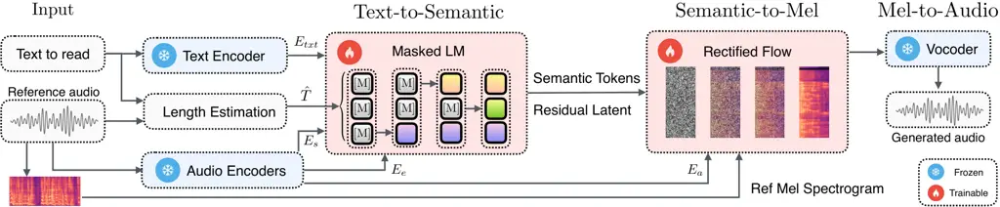
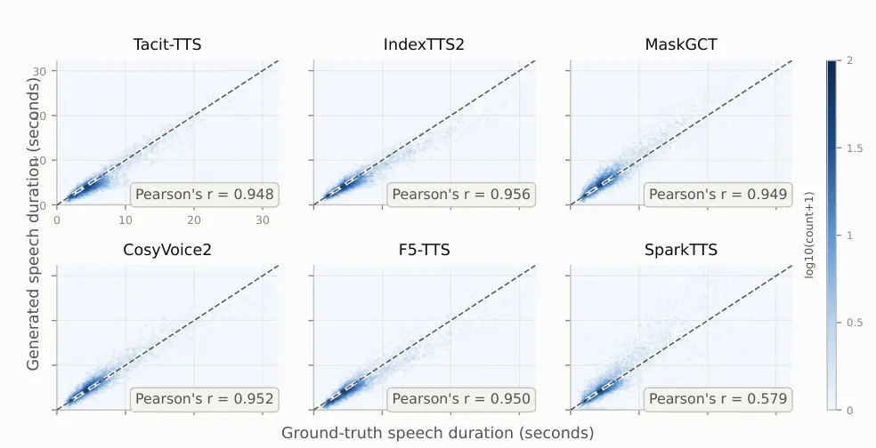

# Tacit-TTS: From Autoregressive Decoding to Masked Prediction for Efficient Transcript-Free Voice Cloning

Jian Chen Affiliation: Dolby Laboratories
Email: [Jian.Chen@dolby.com](mailto:)    You Zhang Affiliation: Dolby
Laboratories Email: [Neil.Zhang@dolby.com](mailto:)    Mark Vinton
Affiliation: Dolby Laboratories Email: [Mark.Vinton@dolby.com](mailto:)

###### Abstract

TTS systems with autoregressive semantic modeling have demonstrated
strong zero-shot voice cloning performance and rich expressive
variation, but their sequential decoding incurs substantial latency.
Non-autoregressive alternatives offer much faster generation, yet often
rely on more restrictive reference conditioning, such as requiring
transcripts of the reference speech during inference. We present
Tacit-TTS, an efficient transcript-free zero-shot voice cloning system
distilled from IndexTTS2. Tacit-TTS replaces autoregressive
text-to-semantic decoding with masked non-autoregressive generation,
introduces training-free acoustic length estimation, and accelerates the
flow-matching renderer through ReFlow distillation. Across two English
and two Mandarin datasets, Tacit-TTS achieves competitive zero-shot
quality while generating speech over 10$`\times`$ faster than IndexTTS2
for utterances longer than 5 seconds. Its transcript-free conditioning
further supports cross-lingual and non-lexical references. We validate
this capability using references from eight other languages, infant
babble, and synthetic gibberish, where transcript-dependent systems
often degrade or fail due to unreliable ASR transcripts.

## 1 Introduction

Figure 1: Efficiency–speaker similarity trade-off of Tacit-TTS and
baselines. Marker size indicates the number of generation-module
parameters.

As generative AI increasingly interacts with users through speech, the
ability to generate a convincing and personalized voice has become an
important part of human-AI interaction. Modern voice cloning systems can
reproduce the identity and expressive characteristics of an unseen
speaker from only a short reference recording, enabling applications
such as multilingual speech translation and dubbing (Barrault et al.,
2023), personalized virtual agents (Casanova et al., 2022), and
healthcare and assistive applications (Jreige et al., 2009). Beyond
intelligibility, preserving speaker identity and emotion makes
synthesized speech more natural and engaging (Ju et al., 2024; Zhou
et al., 2026a), bringing AI-generated voices closer to human
communication.

Achieving this level of fidelity, however, remains expensive in both
training and inference. High-quality speaker reproduction and expressive
control benefit from large and diverse speech corpora covering many
speakers, linguistic content, and speaking styles. Industrial-scale
systems such as IndexTTS2 (Zhou et al., 2026b), trained on tens of
thousands of hours of speech, demonstrate strong zero-shot quality but
rely on autoregressive (AR) semantic generation, whose sequential
decoding introduces substantial latency. Non-autoregressive (NAR)
systems alleviate this bottleneck through parallel generation (Wang
et al., 2025b; Chen et al., 2025; Eskimez et al., 2024), but typically
require large-scale training and often depend on transcripts of the
reference speech. Transcript dependence limits voice cloning when the
reference language is unsupported by automatic speech recognition (ASR)
or when meaningful lexical content is unavailable. Fixed-length NAR
decoding introduces a separate constraint, requiring the target duration
to be determined before generation. These limitations leave a practical
gap between high-quality voice cloning and voice cloning that is
efficient, transcript-free, and free of upfront duration constraints.

To address these challenges, we propose Tacit-TTS, an efficient
transcript-free zero-shot voice cloning system distilled from IndexTTS2.
We replace the teacher’s autoregressive text-to-semantic (T2S) model
with a smaller masked non-autoregressive generator trained on
teacher-synthesized data, while retaining its pretrained speaker and
emotion conditioning. To enable transcript-free NAR decoding, we
introduce a training-free length-control strategy that estimates
speaking pace directly from the reference audio and combines it with the
syllable count of the target text. We further recover the teacher’s
continuous latent representation and accelerate the downstream
flow-matching S2Mel renderer through ReFlow distillation.

We evaluate Tacit-TTS on two English and two Mandarin datasets, together
with perceptual-quality, duration-fidelity, and efficiency analyses.
Tacit-TTS achieves competitive zero-shot quality and the highest speaker
similarity among the evaluated non-teacher baselines on both English
datasets, while maintaining perceptual quality close to IndexTTS2 and
generating durations that correlate closely with ground truth. It also
generates speech over 10$`\times`$ faster than IndexTTS2 for utterances
longer than 5 seconds. We further evaluate transcript-free conditioning
with cross-lingual references from eight languages and non-lexical
references including infant babble and synthetic gibberish. In these
settings, transcript-dependent systems often degrade or fail because of
unreliable ASR transcripts, while Tacit-TTS remains effective across all
references.

Our main contributions are summarized as follows:

- •
  We replace the autoregressive T2S stage of IndexTTS2 with masked
  non-autoregressive generation, accelerating the T2S stage by
  26.5$`\times`$, and further accelerate the downstream flow-matching
  renderer through ReFlow distillation.
- •
  We enable transcript-free NAR generation through training-free
  acoustic length estimation and distillation of both discrete semantic
  codes and continuous latent representations, without access to the
  teacher’s original large-scale training corpus.
- •
  Tacit-TTS achieves competitive zero-shot quality while supporting
  cross-lingual and non-lexical references where transcript-dependent
  systems often degrade or fail.

## 2 Related Work

##### Autoregressive and masked generation.

Zero-shot voice cloning synthesizes speech for unseen speakers from a
short reference recording. YourTTS (Casanova et al., 2022), built on the
end-to-end VITS backbone (Kim et al., 2021), clones voices from a
speaker embedding alone. Most later systems instead adopt a two-stage
generation scheme, first mapping text to semantic tokens and then
semantic tokens to audio. VALL-E (Wang et al., 2023a) generates codec
tokens with an autoregressive language model conditioned on phoneme and
acoustic prompt tokens. Seed-TTS (Anastassiou et al., 2024) scales this
autoregressive scheme, and CosyVoice (Du et al., 2024a) and
Spark-TTS (Wang et al., 2025a) decode semantic tokens with language
models. IndexTTS2 (Zhou et al., 2026b; Deng et al., 2025), our
distillation teacher, conditions its autoregressive model on w2v-BERT
features compressed by a Perceiver into speaker and emotion embeddings.
On the non-autoregressive side, masked prediction descends from
BERT-style bidirectional language modeling (Devlin et al., 2019):
MaskGIT (Chang et al., 2022) generates tokens in parallel by iteratively
unmasking confident predictions, a scheme formalized as discrete
diffusion (Austin et al., 2021). MaskGCT (Wang et al., 2025b) applies
this decoding scheme to the text-to-semantic stage of zero-shot TTS. Our
model adopts MaskGCT’s masked architecture. However, instead of training
the text-to-semantic model on text-audio pairs, we distill it from an
autoregressive teacher, and instead of phone-proportional scaling or
learned duration predictors (Ren et al., 2019; Ren et al., 2020), we
estimate the target length from a learning-free acoustic pace (De Jong &
Wempe, 2009).

##### Audio generation.

The semantic-to-audio stage turns the semantic representation into
audio: most systems synthesize acoustic features such as mel
spectrograms and apply a vocoder, while others predict discrete codec
tokens for a codec decoder. Flow matching (Lipman et al., 2022) and
rectified flow (Liu et al., 2022) learn velocity fields over straight
paths. Voicebox (Le et al., 2023) generates acoustic features with flow
matching, and NaturalSpeech 2 (Shen et al., 2024) pursues latent
diffusion in a codec feature space. E2 TTS and F5-TTS (Eskimez et al.,
2024; Chen et al., 2025) forgo the two-stage split and synthesize mel
spectrograms directly from text, without an intermediate semantic
representation. SoundStorm (Borsos et al., 2023) and MaskGCT instead
generate discrete codec tokens. IndexTTS2’s renderer is a flow-matching
model requiring roughly 25 Euler steps. Instead of generic knowledge
distillation (Hinton et al., 2015), we fine-tune the renderer on the
outputs of our text-to-semantic model and apply reflow (Liu et al.,
2022), integrating the straightened trajectories in 4 to 8 Euler steps.
Together with the masked decoder, this yields the efficiency numbers in
Section 4.5.

##### Transcript dependence.

Most zero-shot systems, including the non-autoregressive ones, depend on
the reference transcript. F5-TTS transcribes the reference with an
internal Whisper model. E2 TTS concatenates the reference text into its
conditioning. Voicebox requires the prompt’s phoneme sequence. MaskGCT
and CosyVoice 2 (Du et al., 2024b) require the prompt text directly.
When a reliable transcript is unavailable, for unsupported languages,
non-lexical vocalizations, or speech impairments (Hartman et al., 2017),
these systems degrade at their input stage, conditioning on empty or
hallucinated text. Conditioning on self-supervised representations
instead, w2v-BERT (Chung et al., 2021) features compressed by a
Perceiver (Jaegle et al., 2021) as in IndexTTS2, removes this
dependence. Our evaluations with cross-lingual and non-lexical
references in Section 4.3 and 4.4 show that transcript-free conditioning
remains effective where transcript-dependent baselines degrade or fail.

## 3 Method

Tacit-TTS follows the two-stage generation paradigm adopted by recent
zero-shot voice cloning systems, as illustrated in Figure 2. A text to
semantic (T2S) module first predicts a sequence of semantic tokens from
the reference speech and target text, followed by a semantic to audio
(S2A) module that synthesizes the final speech waveform. In the T2S
stage, we retain the disentangled conditioning mechanism of IndexTTS2
for speaker identity and emotion control while replacing the
autoregressive (AR) semantic decoder with a non-autoregressive (NAR)
Transformer. Unlike existing transcript-based NAR systems such as
MaskGCT, our model does not require transcripts of the reference speech,
eliminating the additional computational overhead of ASR transcription.
In the S2A stage, we adopt the flow-matching speech renderer from
IndexTTS2 and further accelerate it through reflow distillation,
improving inference efficiency while preserving synthesis quality.



Figure 2: Overview of the Tacit-TTS pipeline. Given a reference audio
and target text, the encoders extract the conditioning representations,
the text-to-semantic model generates semantic tokens via masked-LM
generation, and the semantic-to-mel model converts them into a mel
spectrogram for waveform synthesis by the vocoder.

### 3.1 Text-to-Semantic Generation

The proposed T2S model is implemented as a bidirectional DiT conditioned
on masked semantic tokens, text embeddings, and reference-speech
embeddings extracted by pretrained encoders (Appendix A). The reference
conditioning consists of a fixed-length speaker embedding sequence
$`E_{s}\in\mathbb{R}^{32\times d}`$ and an emotion embedding
$`E_{e}\in\mathbb{R}^{d}`$, which are prepended as prefix tokens to the
Transformer. The target text is embedded as $`E_{\mathrm{txt}}`$,
upsampled to the target semantic length $`T`$, and fused with the
semantic token embeddings through concatenation followed by a linear
projection. This keeps the Transformer sequence length at $`T`$ rather
than $`T+N_{\mathrm{text}}`$ and provides an explicit text-to-semantic
alignment prior, following the length-regulation principle used in NAR
TTS (Ren et al., 2019; Ren et al., 2020). Specifically, starting from a
fully masked semantic sequence $`\mathbf{y}^{0}`$
($`\mathbf{y}^{0}_{i}=\textsc{mask},\forall i`$), the model predicts
semantic tokens over a fixed number of decoding iterations. At iteration
$`m`$, it computes
$`\hat{\mathbf{y}}^{m}=f_{\text{t2s}}\!\left(\mathbf{y}^{m-1},E_{\mathrm{txt}},E_{s},E_{e}\right)`$
for all masked positions in parallel. After each iteration, the most
confident predictions are committed and the remaining masked positions
are refined until all tokens are determined. The number of forward
passes is therefore fixed and independent of output length, unlike AR
decoding, which scales linearly with semantic sequence length.

#### 3.1.1 Training-Free Length Control

Unlike AR T2S models that generate until a stopping token, our NAR T2S
model requires the target semantic length $`T`$ before decoding. In
zero-shot synthesis, $`T`$ depends on both the amount of linguistic
content in the target text and the speaking pace of the reference
speech. Existing length estimation strategies typically rely on the
reference transcript or a learned duration model. To preserve
transcript-free inference, we instead estimate content from the target
text and the speaking pace directly from the reference waveform.

Specifically, let $`D_{r}`$ denote the reference duration after trimming
leading and trailing silence while preserving internal pauses, and let
$`f`$ be the semantic codec frame rate, giving $`T_{r}=D_{r}f`$ semantic
positions. Let $`N_{r}^{a}`$ and $`N_{x}^{t}`$ denote the syllable
counts estimated from the reference audio and target text, respectively.
We define the reference pace factor as
$`\rho_{r}=T_{r}/(\kappa N_{r}^{a})`$. To prevent excessively long or
short generations caused by noisy syllable estimates or atypical
reference speech, we constrain it as
$`\tilde{\rho}_{r}=\mathrm{clip}(\rho_{r},\rho_{\min},\rho_{\max})`$.
The target semantic length is then estimated as
$`\hat{T}=\mathrm{round}(N_{x}^{t}\tilde{\rho}_{r})`$, with a minimum
length of 8 enforced to avoid degenerate cases. We use $`\kappa=0.92`$
for Mandarin targets and $`\kappa=1`$ otherwise to compensate for the
systematic mismatch between acoustic and text-based syllable estimates.

##### Acoustic Syllable Estimation.

To estimate $`N_{r}^{a}`$ without a reference transcript, we use
prominent energy peaks within voiced regions as an acoustic proxy for
syllables. Given a reference waveform $`y`$, we compute frame-level RMS
energy using a 30-ms window and 10-ms hop, convert it to the dB scale as
$`e_{m}=20\log_{10}(E_{m}+\epsilon)`$, and use YIN (De Cheveigné &
Kawahara, 2002) to identify voiced frames. We suppress the energy of
unvoiced frames and retain peaks that exceed an adaptive energy
threshold, have sufficient local prominence, and are separated from
neighboring peaks by at least 100 ms. The number of retained peaks,
$`N_{r}^{a}=|\mathcal{P}|`$, serves as the acoustic syllable-count
estimate. The resulting pace is then clamped to $`[7,12]`$ to mitigate
the effect of outliers.

##### Textual Syllable Estimation.

We estimate the target syllable count $`N_{x}^{t}`$ directly from text.
For Mandarin, each Chinese character is treated as one syllable. For
English, we use the rule-based syllable estimator provided by textstat¹¹
1 textstat:
[https://github.com/textstat/textstat](https://github.com/textstat/textstat).
For mixed language text, the estimates from the two components are
summed.

#### 3.1.2 Text-to-Semantic Distillation

To replace the AR T2S stage of IndexTTS2 with a substantially faster NAR
architecture while preserving the downstream rendering pipeline, we
train our T2S model through knowledge distillation from the original
IndexTTS2 teacher rather than directly from raw speech corpora.
Specifically, reference voices are paired with content-independent
target text and passed through the teacher to synthesize the training
data required by our model. This allows us to isolate the architectural
change in T2S while retaining the teacher’s semantic and acoustic
representation spaces.

Training jointly optimizes two heads that share the same Transformer
trunk: a masked-prediction head for semantic-code generation and a
residual-recovery head that reconstructs the continuous representation
expected by the downstream S2Mel renderer. The overall T2S objective is

```math
\mathcal{L}_{\text{T2S}}=\mathcal{L}_{\text{mask}}+\lambda\mathcal{L}_{\text{res}}. \tag{1}
```

##### Masked-prediction loss.

For each training example, we sample a mask ratio $`r=\cos(u)`$, where
$`u\sim\mathcal{U}(0,\tfrac{\pi}{2})`$. We then randomly replace
$`\lceil rT\rceil`$ positions in the clean semantic-code sequence
$`\mathbf{y}`$ with a \[mask\] token, yielding $`\mathbf{y}^{(m)}`$, and
optimize cross-entropy only over the masked positions:

```math
\mathcal{L}_{\text{mask}}=-\,\mathbb{E}\Big[\textstyle\sum_{i:\,y_{i}^{(m)}=\textsc{mask}}\log f_{\text{t2s}}^{\text{mask}}\big(y_{i}\mid\mathbf{y}^{(m)},E_{\text{txt}},E_{s},E_{e}\big)\Big]. \tag{2}
```

Here, $`f_{\text{t2s}}^{\text{mask}}`$ denotes the masked-prediction
head over semantic codes. We quantize the mask ratio into $`16`$ buckets
and use the corresponding embedding as a timestep-like conditioning
signal, which modulates every Transformer block through adaptive layer
normalization (AdaLN) (Peebles & Xie, 2023).

##### Residual-recovery loss.

IndexTTS2 improves its S2Mel renderer by augmenting the discrete
semantic-code embeddings with continuous GPT latent features extracted
from the T2S model. We preserve this enhancement in our NAR T2S model by
decomposing the teacher representation as
$`S=\text{vq2emb}(\mathbf{y})+\Delta`$, where $`\Delta`$ denotes the
additional continuous information beyond the discrete code embeddings. A
residual head $`f_{\text{t2s}}^{\text{res}}`$, sharing the T2S
Transformer backbone, is trained to recover $`\Delta`$ from the clean
semantic sequence. Excluding the eos/pad tail, the residual-recovery
loss is defined as:

```math
\mathcal{L}_{\text{res}}=\left\|f_{\text{t2s}}^{\text{res}}(\mathbf{y},E_{\text{txt}},E_{s},E_{e})-\Delta\right\|_{2}^{2},\qquad\Delta=S-\text{vq2emb}(\mathbf{y}). \tag{3}
```

### 3.2 Semantic-to-Audio Generation

The second stage converts the T2S output into waveform audio. We retain
the S2Mel renderer architecture and conditioning interface of IndexTTS2,
including its conditional flow-matching DiT and BigVGAN vocoder (Lee
et al., 2022). Our contribution in this stage is to reduce the
renderer’s inference cost: while the original model requires
approximately $`25`$ Euler steps for high-quality synthesis, we reduce
this to $`4`$–$`8`$ steps through reflow distillation.

#### 3.2.1 Semantic-to-Mel Reflow

We first fine-tune the pretrained IndexTTS2 renderer on the conditioning
distribution produced by our T2S model, since its predicted semantic
representation differs slightly from that of the original teacher. We
then apply reflow (Liu et al., 2022) to straighten the renderer’s
generation trajectories. Specifically, we run the fine-tuned renderer
with its original multi-step solver and record the realized pairs
between the initial Gaussian noise and the final generated mel
spectrogram. The renderer is subsequently trained on these model-induced
couplings, encouraging a straighter transport path that can be
integrated accurately with substantially fewer Euler steps.

Both stages optimize the standard flow-matching velocity objective on
the non-prompt mel region. For an interpolated state $`y_{t}`$ between
noise $`z`$ and target mel $`x_{1}`$, the flow-matching DiT
$`g_{\text{s2mel}}`$ predicts the velocity, and we minimize its mismatch
with the target velocity $`u_{t}`$:

```math
\mathcal{L}_{\mathrm{flow}}=\mathbb{E}\left[\left\|g_{\text{s2mel}}(y_{t},t,S,\cdot)_{[\ell,L)}-u_{t}{}_{[\ell,L)}\right\|_{1}\right]. \tag{4}
```

Here, $`\ell`$ and $`L`$ denote the prompt length and the total mel
length in frames, so the loss covers only the non-prompt region
$`[\ell,L)`$. The fine-tuning stage uses fresh random noise and adapts
the renderer to our T2S outputs, whereas the reflow stage uses the
noise–output couplings recorded from the fine-tuned renderer itself.
After reflow, the renderer achieves comparable synthesis quality using
only $`4`$–$`8`$ Euler steps instead of approximately $`25`$.

### 3.3 Training Data

We construct separate training sets for T2S and S2A distillation using
IndexTTS2 as the teacher. For T2S, each sample pairs reference speech
with a content-independent target sentence. A single teacher forward
pass provides the semantic-code sequence $`\mathbf{y}`$, the latent
features, the speaker, and emotion conditioning features. The dataset
contains $`874`$k samples, about $`2`$k hours of speech from $`2739`$
unique reference speakers ($`2342`$ English speakers, $`397`$ Chinese),
with target text decoupled from the reference content and approximately
length-matched. Only the semantic token and latent features are stored
since the loss function doesn’t need the audio. For S2A, we build a
separate coupling set using the fine-tuned renderer with its 25-step
solver, conditioned on semantic representations from the trained T2S
model. Each initial-noise/final-mel pair is stored as one coupling. The
set contains $`8`$k pairs, corresponding to about $`36`$ hours of
speech. Details are provided in Appendix E.

The training data is substantially smaller than the 55k hours used by
IndexTTS2. Our goal is not to train a stronger model from scratch, but
to improve inference efficiency while preserving as much of the
teacher’s performance as possible under a much smaller distillation
budget. Despite this, Tacit-TTS outperforms several baselines and
achieves speaker similarity comparable to IndexTTS2 on English speech,
which we attribute in part to our loss design that transfers both
discrete semantic targets and continuous latent features from the
teacher.

## 4 Experiments

### 4.1 Experiment Setup

##### Datasets.

We evaluate on the four zero-shot test sets used by IndexTTS2 (Zhou
et al., 2026b): LibriSpeech (Panayotov et al., 2015) test-clean
(English, $`n{=}2544`$), SeedTTS (Anastassiou et al., 2024) test-en
($`n{=}1088`$) and test-zh ($`n{=}2020`$), and AISHELL-1 (Bu et al., 2017) test (Mandarin, $`n{=}1000`$). We use the full sets without
subsampling; each item pairs a reference clip with a content-independent
target sentence, so the reference voice must be reproduced on unseen
text. In addition, we demonstrate application scenarios of
transcript-free models using three datasets: cross-lingual references in
eight languages from FLEURS (Conneau et al., 2023), an infant-babble
dataset of 70 audio recordings²² 2 Hugging Face Dataset:
[Babies_weeping_and_happy_babbling_sounds](https://huggingface.co/datasets/Manisha12Researcher/Babies-weeping-and-happy-babbling-sounds),
and a synthetic-gibberish set of 10 references. More details are in
Appendices G and B.

##### Evaluation Metrics.

Following the IndexTTS2 evaluation protocol, we measure
_intelligibility_ using word error rate (WER) for English with
Whisper (Radford et al., 2023) and character error rate (CER) for
Mandarin with FunASR (Gao et al., 2023). We measure _speaker similarity_
(SS) as the cosine similarity between FunASR/CAM++ (Wang et al., 2023b)
speaker embeddings of the generated and reference speech. For
_perceptual quality_, we use two no-reference MOS predictors:
UTMOS (Saeki et al., 2022) and DNSMOS (Reddy et al., 2022), we report
its overall quality component. For _efficiency_, we report the
generation speed in $`\times`$ real-time, measured as seconds of
generated audio per second of computation. All inference experiments are
conducted on a single NVIDIA A100 GPU.

##### Baselines.

We compare against the open zero-shot systems evaluated by
IndexTTS2—CosyVoice2 (Du et al., 2024b), SparkTTS (Wang et al., 2025a),
MaskGCT (Wang et al., 2025b), and F5-TTS (Chen et al., 2025)—and against
IndexTTS2 itself, our distillation teacher, shown together with its
w/o-latent ablation as a reference upper bound rather than as a
competitor. Quality numbers for all baselines on the four test sets are
taken from the IndexTTS2 paper under identical metrics, while for the
cross-lingual and non-lexical experiments we run all baselines
ourselves, with each transcript-dependent baseline using the reference
transcript produced by its own ASR front end; latency is measured by us
in a common environment (SparkTTS omitted from timing, as it lacks a
runnable release here). Throughout, Tacit-TTS uses our default
configuration: $`12`$ T2S unmasking steps, $`8`$ reflow S2Mel steps, and
the transcript-free DSP length estimator (clamp $`12`$ codes/syllable).

### 4.2 Main Results

|                                 |                        |                   |                 |                   |                 |                   |                |                   |
| ------------------------------- | ---------------------- | ----------------- | --------------- | ----------------- | --------------- | ----------------- | -------------- | ----------------- |
|                                 | LibriSpeech test-clean |                   | SeedTTS test-en |                   | SeedTTS test-zh |                   | AISHELL-1 test |                   |
| Model                           | SS$`\uparrow`$         | WER$`\downarrow`$ | SS$`\uparrow`$  | WER$`\downarrow`$ | SS$`\uparrow`$  | CER$`\downarrow`$ | SS$`\uparrow`$ | CER$`\downarrow`$ |
| Autoregressive                  |                        |                   |                 |                   |                 |                   |                |                   |
| CosyVoice2                      | 0.843                  | 5.999             | 0.794           | 3.277             | 0.846           | 1.451             | 0.834          | 1.967             |
| SparkTTS                        | 0.756                  | 8.843             | 0.755           | 1.543             | 0.683           | 2.636             | 0.593          | 1.743             |
| Non-autoregressive              |                        |                   |                 |                   |                 |                   |                |                   |
| MaskGCT                         | 0.790                  | 7.759             | 0.824           | 2.530             | 0.807           | 2.447             | 0.598          | 4.930             |
| F5-TTS                          | 0.821                  | 8.044             | 0.803           | 1.937             | 0.844           | 1.514             | 0.831          | 3.671             |
| Tacit-TTS                       | 0.875                  | 5.54              | 0.849           | 2.34              | 0.829           | 1.71              | 0.804          | 2.21              |
| Teacher (reference upper bound) |                        |                   |                 |                   |                 |                   |                |                   |
| IndexTTS2                       | 0.870                  | 3.115             | 0.860           | 1.521             | 0.865           | 1.008             | 0.843          | 1.516             |
| IndexTTS2 w/o latent            | 0.887                  | 3.334             | 0.879           | 1.616             | 0.890           | 1.261             | 0.868          | 1.791             |
| Ground Truth                    | 0.833                  | 3.405             | 0.820           | 1.897             | 0.776           | 1.254             | 0.847          | 1.840             |

Table 1: Zero-shot performance on the four datasets in speaker
similarity (SS) and WER/CER. Bold: best per column among deployable
systems (teacher and Ground Truth excluded). Results of all baselines
are taken from the IndexTTS2 paper (Zhou et al., 2026b).

We evaluate zero-shot voice cloning on four English and Mandarin test
sets, covering speaker similarity and intelligibility. Table 1
summarizes the results. Despite being distilled from IndexTTS2 and using
a substantially simplified generation pipeline, Tacit-TTS retains strong
performance across both languages. The weaker Mandarin results may
partly reflect the imbalance in speaker coverage ($`2342`$ English,
$`397`$ Chinese). In particular, Tacit-TTS achieves the best English
speaker similarity among deployable systems and remains competitive with
the strongest baselines on content accuracy. Overall, the results show
that the distilled model preserves much of the teacher’s zero-shot
cloning capability while removing autoregressive decoding and
reference-transcript dependence. We further evaluate perceptual quality
using UTMOS and DNSMOS in Appendix C, where Tacit-TTS remains close to
IndexTTS2 across all four test sets.

### 4.3 Cloning from Cross-Lingual References

We evaluate cross-lingual voice cloning, where the reference speech is
in a language different from the target language and the reference
transcript may be unreliable due to limited ASR support. We select
speech samples in eight languages from the FLEURS dataset (Conneau
et al., 2023): Japanese, Korean, German, Spanish, Russian, Arabic,
Hindi, and Yoruba. For each language, we select three reference
utterances from three different speakers. Each reference is used to
generate speech for 10 English and 10 Chinese target sentences selected
from the SeedTTS dataset. Table 2 reports the results averaged across
the eight reference languages, while the per-language results are
provided in Appendix G. As shown in Table 2, Tacit-TTS achieves an SS of
$`0.789`$ with $`0.10\%`$ WER on English targets, and an SS of $`0.692`$
with $`1.90\%`$ CER on Chinese targets, close to IndexTTS2. Its error
rate remains below $`3.4\%`$ across all eight languages. In contrast,
transcript-dependent baselines degrade substantially when the ASR front
end does not support the reference language well, sometimes producing
repeated or unrelated content or failing to generate speech. These
results show that transcript-free conditioning enables more reliable
cross-lingual voice cloning.

|                      |                   |                   |                    |                   |                   |                    |
| -------------------- | ----------------- | ----------------- | ------------------ | ----------------- | ----------------- | ------------------ |
|                      | English targets   |                   |                    | Chinese targets   |                   |                    |
| Model                | SS$`\uparrow`$    | WER$`\downarrow`$ | Fail$`\downarrow`$ | SS$`\uparrow`$    | CER$`\downarrow`$ | Fail$`\downarrow`$ |
| Transcript-dependent |                   |                   |                    |                   |                   |                    |
| F5-TTS               | 0.663$`\pm`$0.120 | 24.56$`\pm`$22.28 | 0.0$`\pm`$0.0      | 0.622$`\pm`$0.100 | 25.01$`\pm`$20.89 | 0.0$`\pm`$0.0      |
| MaskGCT^(†)          | 0.701$`\pm`$0.065 | 20.16$`\pm`$14.68 | 33.3$`\pm`$47.1    | 0.700$`\pm`$0.033 | 28.26$`\pm`$14.32 | 33.3$`\pm`$47.1    |
| CosyVoice2           | 0.692$`\pm`$0.081 | 45.95$`\pm`$42.64 | 0.0$`\pm`$0.0      | 0.680$`\pm`$0.093 | 62.41$`\pm`$47.33 | 0.0$`\pm`$0.0      |
| SparkTTS             | 0.611$`\pm`$0.091 | 47.27$`\pm`$42.23 | 20.0$`\pm`$21.5    | 0.578$`\pm`$0.092 | 60.42$`\pm`$48.06 | 12.9$`\pm`$16.9    |
| Transcript-free      |                   |                   |                    |                   |                   |                    |
| IndexTTS2            | 0.807$`\pm`$0.036 | 0.19$`\pm`$0.28   | 0.0$`\pm`$0.0      | 0.712$`\pm`$0.065 | 1.40$`\pm`$0.50   | 0.0$`\pm`$0.0      |
| Tacit-TTS            | 0.789$`\pm`$0.041 | 0.10$`\pm`$0.19   | 0.0$`\pm`$0.0      | 0.692$`\pm`$0.073 | 1.90$`\pm`$0.65   | 0.0$`\pm`$0.0      |

Table 2: Results of 6 methods using cross-lingual references, reading
English and Chinese targets. Results are averaged over eight reference
languages, with $`\pm`$ indicating the standard deviation across
languages. $`\dagger`$ MaskGCT fails on all Russian and Arabic
references, so we report averages over the six languages with successful
generation.

### 4.4 Cloning from Non-Lexical References

|                      |                 |                   |     |                 |                   |     |                     |                   |     |                 |                   |
| -------------------- | --------------- | ----------------- | --- | --------------- | ----------------- | --- | ------------------- | ----------------- | --- | --------------- | ----------------- |
|                      | Infant babble   |                   |     |                 |                   |     | Synthetic gibberish |                   |     |                 |                   |
|                      | English targets |                   |     | Chinese targets |                   |     | English targets     |                   |     | Chinese targets |                   |
| Model                | SS$`\uparrow`$  | WER$`\downarrow`$ |     | SS$`\uparrow`$  | CER$`\downarrow`$ |     | SS$`\uparrow`$      | WER$`\downarrow`$ |     | SS$`\uparrow`$  | CER$`\downarrow`$ |
| Transcript-dependent |                 |                   |     |                 |                   |     |                     |                   |     |                 |                   |
| SparkTTS             | 0.278           | 99.00             |     | 0.310           | 96.00             |     | 0.648               | 18.00             |     | 0.639           | 20.30             |
| CosyVoice2           | 0.442           | 31.03             |     | 0.441           | 87.53             |     | 0.721               | 49.24             |     | 0.792           | 86.94             |
| MaskGCT^(†)          | 0.184           | 75.63             |     | 0.217           | 45.67             |     | 0.743               | 46.84             |     | 0.729           | 32.81             |
| F5-TTS               | 0.315           | 43.36             |     | 0.347           | 60.30             |     | 0.699               | 17.33             |     | 0.735           | 17.67             |
| Transcript-free      |                 |                   |     |                 |                   |     |                     |                   |     |                 |                   |
| IndexTTS2            | 0.484           | 4.76              |     | 0.425           | 1.34              |     | 0.810               | 0.14              |     | 0.880           | 1.23              |
| Tacit-TTS            | 0.603           | 3.24              |     | 0.595           | 5.79              |     | 0.781               | 1.07              |     | 0.846           | 1.82              |

Table 3: Results of 6 methods using non-lexical references, reading
English and Chinese targets. ^(†)MaskGCT results are averaged over the
10 utterances that completed.

We further evaluate a more extreme setting where no meaningful reference
transcript exists. We use infant babble and synthetic gibberish (e.g.,
“kalene kuguva ge yu mu nola vi pesa”, see Table B.1) as non-lexical
references. Each reference is used to generate speech for 10 English and
10 Chinese target sentences selected from SeedTTS test-en and test-zh.
Results are shown in Table 3. Transcript-dependent baselines are
affected by unreliable or empty ASR transcripts, sometimes resulting in
unstable or failed generation. In contrast, both transcript-free systems
generate speech for all references. Tacit-TTS achieves higher speaker
similarity than IndexTTS2 on infant babble for both English and Chinese
targets, while both systems perform well on synthetic gibberish. These
results show that transcript-free conditioning enables reliable voice
cloning even when the reference contains no lexical content.

### 4.5 Efficiency Analysis

Beyond wall-clock speed, the redesign also reduces the size of the
generative model. Tacit-TTS retains the teacher’s conditioning encoder
and BigVGAN vocoder, replaces the $`527`$M autoregressive T2S
Transformer with a $`269`$M non-autoregressive masked generator, and
further adapts the pretrained S2Mel renderer through fine-tuning and
reflow. The T2S replacement therefore accounts for the model-size
reduction and the majority of the latency improvement, while reflow
provides additional acceleration in the S2A stage.

|                      |              |     |      |      |       |                                          |      |           |
| -------------------- | ------------ | --- | ---- | ---- | ----- | ---------------------------------------- | ---- | --------- |
|                      | Latency (ms) |     |      |      |       | Speed ($`\times`$ real-time)$`\uparrow`$ |      |           |
| Model                | Cond.        | ASR | T2S  | S2A  | Total | Cond.                                    | Gen. | Total     |
| Transcript-dependent |              |     |      |      |       |                                          |      |           |
| CosyVoice2           | 1082         | 918 | 3214 | 604  | 5818  | 3.03                                     | 1.56 | $`1.03`$  |
| MaskGCT              | 125          | 918 | 2428 | 2359 | 5830  | 5.88                                     | 1.27 | $`1.04`$  |
| SparkTTS ^(‡)        | 57           | 918 | 7041 | 32   | 8049  | 6.67                                     | 0.92 | $`0.806`$ |
| F5-TTS ^(†)          | 599          | 315 | 1122 |      | 2036  | 5.88                                     | 4.76 | $`2.63`$  |
| Transcript-free      |              |     |      |      |       |                                          |      |           |
| IndexTTS2            | 483          | \-  | 5274 | 875  | 6632  | 11.1                                     | 0.88 | $`0.813`$ |
| Tacit-TTS            | 468          | \-  | 199  | 310  | 977   | 11.1                                     | 9.09 | 4.76      |

Table 4: Per-stage latency (ms) and speed in seconds of audio generated
per second of compute (s/s, the inverse of real-time factor) for
condition computation, ASR, generation (T2S$`+`$S2A), and the overall
pipeline. ^(†)F5-TTS is single-stage; its T2S/S2A are not separable.
^(‡)SparkTTS means are over the 31/32 items that generated audio—on one
AISHELL item its decoder emitted no semantic tokens.

We time every system on the same $`32`$ utterances ($`8`$ per test set,
sampled to match each test set’s mean length), on a single GPU with a
global warm-up; outputs average about $`5`$ s. Table 4 breaks
per-utterance latency into three stages. Reference conditioning
($`\sim`$470 ms) is a one-time cost that Tacit-TTS inherits from the
teacher unchanged, so the decisive difference lies in the T2S stage,
where the autoregressive-to-non-autoregressive swap cuts latency from
$`5274`$ to $`199`$ ms, a $`26.5\times`$ reduction. Reflow distillation
further trims S2A from 875 to 310 ms, so that generation, the sum of T2S
and S2A, falls from 6149 to 509 ms, a 12.1× speedup that comes largely
from the T2S replacement.

##### Speedup vs. utterance length.

The speedup of Tacit-TTS over IndexTTS2 is not constant across
generation duration (Figure 3). IndexTTS2’s real-time factor is roughly
flat ($`\approx`$1.1) because autoregressive cost is linear in output
tokens. The speedup *grows* from $`9.0\times`$ at four seconds to a peak
of $`14.9\times`$ around thirty seconds, as the fixed per-utterance
costs of both pipelines amortize over longer outputs. Past a minute it
narrows again ($`13.8\times`$ at $`62`$ s, $`11.8\times`$ at $`125`$ s),
as the full self-attention in the non-autoregressive stages
($`O(n^{2})`$) begins to catch up. In practice, Tacit-TTS generates
roughly an order of magnitude faster than the teacher across the useful
range, most of all at paragraph length, the regime where
non-autoregressive generation helps most.

Figure 3: End-to-end generation time (including reference conditioning)
vs. output duration for IndexTTS2 and Tacit-TTS, using one reference
clip with a fixed passage repeated to lengthen the output. Dashed line:
real time. Numbers above the Tacit-TTS curve are its speedup over the
teacher; the inset zooms in on Tacit-TTS.

##### Generation Step Ablation

We perform a grid search over the number of T2S unmasking steps and
reflow S2Mel sampling steps, with T2S steps varied over $`{8,12,16}`$
and S2Mel steps over $`{1,4,8}`$; full results are provided in
Table D.1. We select 12 T2S steps because increasing from 8 to 12
consistently improves content accuracy across datasets, while further
increasing to 16 provides only marginal gains. For S2Mel, 8 steps are
used because speaker similarity continues to improve from 4 to 8 steps,
whereas fewer steps noticeably degrade speaker similarity. We therefore
use the $`12/8`$ configuration as the default setting in all subsequent
experiments.

### 4.6 Duration Estimation

Our transcript-free length estimator determines the semantic length used
for generation, so we evaluate whether it produces reasonable speech
durations. Since natural speech inherently varies in duration even for
the same utterance, we use Pearson correlation between generated and
ground-truth durations rather than exact duration error. Tacit-TTS
achieves a correlation comparable to the other systems. Unlike learned
duration predictors, our estimator is training-free and transcript-free,
enabling generalization to out-of-distribution use cases (Sections 4.3
and 4.4). Detailed results are in Appendix F.

## 5 Conclusion

We presented Tacit-TTS, an efficient transcript-free zero-shot voice
cloning system distilled from IndexTTS2. By combining masked
non-autoregressive semantic generation, training-free length control,
and an accelerated flow-matching renderer, Tacit-TTS removes
reference-transcript dependence while substantially improving inference
efficiency. Across two English and two Mandarin datasets, it achieves
competitive zero-shot voice cloning quality at a fraction of the
teacher’s generation cost. Beyond standard evaluation settings,
Tacit-TTS also remains effective with cross-lingual and non-lexical
references, demonstrating the practical advantages of transcript-free
conditioning. These results suggest that efficient zero-shot voice
cloning can be achieved without relying on reference transcripts,
opening new opportunities for voice cloning in scenarios where reliable
transcripts are unavailable.

## Ethics Statement

Zero-shot voice cloning can be misused for impersonation, fraud, or the
creation of non-consensual synthetic speech, and transcript-free cloning
further lowers the barrier to cloning a voice from arbitrary recordings.
Our work targets the efficiency of an existing publicly available voice
cloning system and does not aim to extend what such systems can clone;
nevertheless, we encourage any deployment of Tacit-TTS to require
consent from the cloned speaker and to be paired with safeguards such as
audio watermarking and synthetic-speech detection. All speech used in
this work comes from publicly released research datasets (LibriSpeech,
AISHELL-1, ESD, the SeedTTS evaluation sets, FLEURS, and a public
infant-vocalization collection), used under their respective licenses.
We did not collect new recordings, and we make no attempt to identify
any speaker.

## Language Model Usage Statement

In preparing this manuscript, we used a large language model only for
grammar checking and minor language polishing. The authors reviewed and
edited all suggestions. All scientific content, system design,
experiments, analysis, and conclusions are entirely the work of the
authors.

## References

- Anastassiou et al. (2024) Philip Anastassiou, Jiawei Chen, Jitong
  Chen, Yuanzhe Chen, Zhuo Chen, Ziyi Chen, Jian Cong, Lelai Deng,
  Chuang Ding, Lu Gao, et al. Seed-tts: A family of high-quality
  versatile speech generation models. _arXiv preprint
  arXiv:2406.02430_, 2024.
- Austin et al. (2021) Jacob Austin, Daniel D Johnson, Jonathan Ho,
  Daniel Tarlow, and Rianne Van Den Berg. Structured denoising diffusion
  models in discrete state-spaces. _Advances in neural information
  processing systems_, 34:17981–17993, 2021.
- Barrault et al. (2023) Loïc Barrault, Yu-An Chung, Mariano Coria
  Meglioli, David Dale, Ning Dong, Mark Duppenthaler, Paul-Ambroise
  Duquenne, Brian Ellis, Hady Elsahar, Justin Haaheim, et al. Seamless:
  Multilingual expressive and streaming speech translation. _arXiv
  preprint arXiv:2312.05187_, 2023.
- Borsos et al. (2023) Zalán Borsos, Matt Sharifi, Damien Vincent,
  Eugene Kharitonov, Neil Zeghidour, and Marco Tagliasacchi. Soundstorm:
  Efficient parallel audio generation. _arXiv preprint
  arXiv:2305.09636_, 2023.
- Bu et al. (2017) Hui Bu, Jiayu Du, Xingyu Na, Bengu Wu, and Hao Zheng.
  Aishell-1: An open-source mandarin speech corpus and a speech
  recognition baseline. In _2017 20th conference of the oriental chapter
  of the international coordinating committee on speech databases and
  speech I/O systems and assessment (O-COCOSDA)_, pp. 1–5. IEEE, 2017.
- Casanova et al. (2022) Edresson Casanova, Julian Weber, Christopher D
  Shulby, Arnaldo Candido Junior, Eren Gölge, and Moacir A Ponti.
  Yourtts: Towards zero-shot multi-speaker tts and zero-shot voice
  conversion for everyone. In _International conference on machine
  learning_, pp. 2709–2720. PMLR, 2022.
- Chang et al. (2022) Huiwen Chang, Han Zhang, Lu Jiang, Ce Liu, and
  William T Freeman. Maskgit: Masked generative image transformer. In
  _2022 IEEE/CVF Conference on Computer Vision and Pattern Recognition
  (CVPR)_, pp. 11305–11315. IEEE, 2022.
- Chen et al. (2025) Yushen Chen, Zhikang Niu, Ziyang Ma, Keqi Deng,
  Chunhui Wang, JianZhao JianZhao, Kai Yu, and Xie Chen. F5-tts: A
  fairytaler that fakes fluent and faithful speech with flow matching.
  In _Proceedings of the 63rd Annual Meeting of the Association for
  Computational Linguistics (Volume 1: Long Papers)_, pp.
  6255–6271, 2025.
- Chung et al. (2021) Yu-An Chung, Yu Zhang, Wei Han, Chung-Cheng Chiu,
  James Qin, Ruoming Pang, and Yonghui Wu. W2v-bert: Combining
  contrastive learning and masked language modeling for self-supervised
  speech pre-training. In _2021 IEEE Automatic Speech Recognition and
  Understanding Workshop (ASRU)_, pp. 244–250. IEEE, 2021.
- Conneau et al. (2023) Alexis Conneau, Min Ma, Simran Khanuja,
  Yu Zhang, Vera Axelrod, Siddharth Dalmia, Jason Riesa, Clara Rivera,
  and Ankur Bapna. Fleurs: Few-shot learning evaluation of universal
  representations of speech. In _2022 IEEE Spoken Language Technology
  Workshop (SLT)_, pp. 798–805. IEEE, 2023.
- De Cheveigné & Kawahara (2002) Alain De Cheveigné and Hideki Kawahara.
  Yin, a fundamental frequency estimator for speech and music. _The
  Journal of the Acoustical Society of America_, 111(4):1917–1930, 2002.
- De Jong & Wempe (2009) Nivja H De Jong and Ton Wempe. Praat script to
  detect syllable nuclei and measure speech rate automatically.
  _Behavior research methods_, 41(2):385–390, 2009.
- Deng et al. (2025) Wei Deng, Siyi Zhou, Jingchen Shu, Jinchao Wang,
  and Lu Wang. Indextts: An industrial-level controllable and efficient
  zero-shot text-to-speech system. _arXiv preprint
  arXiv:2502.05512_, 2025.
- Devlin et al. (2019) Jacob Devlin, Ming-Wei Chang, Kenton Lee, and
  Kristina Toutanova. Bert: Pre-training of deep bidirectional
  transformers for language understanding. In _Proceedings of the 2019
  conference of the North American chapter of the association for
  computational linguistics: human language technologies, volume 1 (long
  and short papers)_, pp. 4171–4186, 2019.
- Du et al. (2024a) Zhihao Du, Qian Chen, Shiliang Zhang, Kai Hu, Heng
  Lu, Yexin Yang, Hangrui Hu, Siqi Zheng, Yue Gu, Ziyang Ma, Zhifu Gao,
  and Zhijie Yan. Cosyvoice: A scalable multilingual zero-shot
  text-to-speech synthesizer based on supervised semantic tokens, 2024a.
  URL
  [https://arxiv.org/abs/2407.05407](https://arxiv.org/abs/2407.05407).
- Du et al. (2024b) Zhihao Du, Yuxuan Wang, Qian Chen, Xian Shi, Xiang
  Lv, Tianyu Zhao, Zhifu Gao, Yexin Yang, Changfeng Gao, Hui Wang, Fan
  Yu, Huadai Liu, Zhengyan Sheng, Yue Gu, Chong Deng, Wen Wang, Shiliang
  Zhang, Zhijie Yan, and Jingren Zhou. Cosyvoice 2: Scalable streaming
  speech synthesis with large language models, 2024b. URL
  [https://arxiv.org/abs/2412.10117](https://arxiv.org/abs/2412.10117).
- Eskimez et al. (2024) Sefik Emre Eskimez, Xiaofei Wang, Manthan
  Thakker, Canrun Li, Chung-Hsien Tsai, Zhen Xiao, Hemin Yang, Zirun
  Zhu, Min Tang, Xu Tan, et al. E2 tts: Embarrassingly easy fully
  non-autoregressive zero-shot tts. In _2024 IEEE spoken language
  technology workshop (SLT)_, pp. 682–689. IEEE, 2024.
- Gao et al. (2023) Zhifu Gao, Zerui Li, Jiaming Wang, Haoneng Luo, Xian
  Shi, Mengzhe Chen, Yabin Li, Lingyun Zuo, Zhihao Du, Zhangyu Xiao,
  et al. Funasr: A fundamental end-to-end speech recognition toolkit.
  _arXiv preprint arXiv:2305.11013_, 2023.
- Hartman et al. (2017) Kasondra Hartman, Amanda Peluzzo, Sharon
  Shadani, Ian Chellquist, Samuel Weprin, Halley Hunt, Sarah
  Smith-Benjamin, and Eric L Altschuler. Devising a method to study if
  wernicke’s aphasia patients are aware that they do not comprehend
  language or speak it understandably. _Journal of Undergraduate
  Neuroscience Education_, 16(1):E5, 2017.
- Hinton et al. (2015) Geoffrey Hinton, Oriol Vinyals, and Jeff Dean.
  Distilling the knowledge in a neural network. _arXiv preprint
  arXiv:1503.02531_, 2015.
- Jaegle et al. (2021) Andrew Jaegle, Felix Gimeno, Andy Brock, Oriol
  Vinyals, Andrew Zisserman, and Joao Carreira. Perceiver: General
  perception with iterative attention. In _International conference on
  machine learning_, pp. 4651–4664. PMLR, 2021.
- Jreige et al. (2009) Camil Jreige, Rupal Patel, and H Timothy Bunnell.
  Vocalid: Personalizing text-to-speech synthesis for individuals with
  severe speech impairment. In _Proceedings of the 11th international
  ACM SIGACCESS conference on Computers and accessibility_, pp.
  259–260, 2009.
- Ju et al. (2024) Zeqian Ju, Yuancheng Wang, Kai Shen, Xu Tan, Detai
  Xin, Dongchao Yang, Yanqing Liu, Yichong Leng, Kaitao Song, Siliang
  Tang, Zhizheng Wu, Tao Qin, Xiang-Yang Li, Wei Ye, Shikun Zhang, Jiang
  Bian, Lei He, Jinyu Li, and Sheng Zhao. NaturalSpeech 3: zero-shot
  speech synthesis with factorized codec and diffusion models. In
  _Proceedings of the 41st International Conference on Machine
  Learning_, ICML’24. JMLR.org, 2024.
- Kim et al. (2021) Jaehyeon Kim, Jungil Kong, and Juhee Son.
  Conditional variational autoencoder with adversarial learning for
  end-to-end text-to-speech. In _International Conference on Machine
  Learning_, pp. 5530–5540. PMLR, 2021.
- Le et al. (2023) Matthew Le, Apoorv Vyas, Bowen Shi, Brian Karrer,
  Leda Sari, Rashel Moritz, Mary Williamson, Vimal Manohar, Yossi Adi,
  Jay Mahadeokar, et al. Voicebox: Text-guided multilingual universal
  speech generation at scale. _Advances in neural information processing
  systems_, 36:14005–14034, 2023.
- Lee et al. (2022) Sang-gil Lee, Wei Ping, Boris Ginsburg, Bryan
  Catanzaro, and Sungroh Yoon. Bigvgan: A universal neural vocoder with
  large-scale training. _arXiv preprint arXiv:2206.04658_, 2022.
- Lipman et al. (2022) Yaron Lipman, Ricky TQ Chen, Heli Ben-Hamu,
  Maximilian Nickel, and Matt Le. Flow matching for generative modeling.
  _arXiv preprint arXiv:2210.02747_, 2022.
- Liu et al. (2022) Xingchao Liu, Chengyue Gong, and Qiang Liu. Flow
  straight and fast: Learning to generate and transfer data with
  rectified flow. _arXiv preprint arXiv:2209.03003_, 2022.
- Panayotov et al. (2015) Vassil Panayotov, Guoguo Chen, Daniel Povey,
  and Sanjeev Khudanpur. Librispeech: an asr corpus based on public
  domain audio books. In _2015 IEEE international conference on
  acoustics, speech and signal processing (ICASSP)_, pp. 5206–5210.
  IEEE, 2015.
- Peebles & Xie (2023) William Peebles and Saining Xie. Scalable
  diffusion models with transformers. In _2023 IEEE/CVF International
  Conference on Computer Vision (ICCV)_, pp. 4172–4182. IEEE, 2023.
- Radford et al. (2023) Alec Radford, Jong Wook Kim, Tao Xu, Greg
  Brockman, Christine McLeavey, and Ilya Sutskever. Robust speech
  recognition via large-scale weak supervision. In _International
  conference on machine learning_, pp. 28492–28518. PMLR, 2023.
- Reddy et al. (2022) Chandan KA Reddy, Vishak Gopal, and Ross Cutler.
  Dnsmos p. 835: A non-intrusive perceptual objective speech quality
  metric to evaluate noise suppressors. In _ICASSP 2022-2022 IEEE
  international conference on acoustics, speech and signal processing
  (ICASSP)_, pp. 886–890. IEEE, 2022.
- Ren et al. (2019) Yi Ren, Yangjun Ruan, Xu Tan, Tao Qin, Sheng Zhao,
  Zhou Zhao, and Tie-Yan Liu. Fastspeech: Fast, robust and controllable
  text to speech. _Advances in neural information processing systems_,
  32, 2019.
- Ren et al. (2020) Yi Ren, Chenxu Hu, Xu Tan, Tao Qin, Sheng Zhao, Zhou
  Zhao, and Tie-Yan Liu. Fastspeech 2: Fast and high-quality end-to-end
  text to speech. _arXiv preprint arXiv:2006.04558_, 2020.
- Saeki et al. (2022) Takaaki Saeki, Detai Xin, Wataru Nakata, Tomoki
  Koriyama, Shinnosuke Takamichi, and Hiroshi Saruwatari. Utmos:
  Utokyo-sarulab system for voicemos challenge 2022. _arXiv preprint
  arXiv:2204.02152_, 2022.
- Shen et al. (2024) Kai Shen, Zeqian Ju, Xu Tan, Eric Liu, Yichong
  Leng, Lei He, Tao Qin, Jiang Bian, et al. Naturalspeech 2: Latent
  diffusion models are natural and zero-shot speech and singing
  synthesizers. In _International conference on learning
  representations_, volume 2024, pp. 698–722, 2024.
- Wang et al. (2023a) Chengyi Wang, Sanyuan Chen, Yu Wu, Ziqiang Zhang,
  Long Zhou, Shujie Liu, Zhuo Chen, Yanqing Liu, Huaming Wang, Jinyu Li,
  et al. Neural codec language models are zero-shot text to speech
  synthesizers. _arXiv preprint arXiv:2301.02111_, 2023a.
- Wang et al. (2023b) Hui Wang, Siqi Zheng, Yafeng Chen, Luyao Cheng,
  and Qian Chen. Cam++: A fast and efficient network for speaker
  verification using context-aware masking. _arXiv preprint
  arXiv:2303.00332_, 2023b.
- Wang et al. (2025a) Xinsheng Wang, Mingqi Jiang, Ziyang Ma, Ziyu
  Zhang, Songxiang Liu, Linqin Li, Zheng Liang, Qixi Zheng, Rui Wang,
  Xiaoqin Feng, Weizhen Bian, Zhen Ye, Sitong Cheng, Ruibin Yuan,
  Zhixian Zhao, Xinfa Zhu, Jiahao Pan, Liumeng Xue, Pengcheng Zhu,
  Yunlin Chen, Zhifei Li, Xie Chen, Lei Xie, Yike Guo, and Wei Xue.
  Spark-tts: An efficient llm-based text-to-speech model with
  single-stream decoupled speech tokens, 2025a. URL
  [https://arxiv.org/abs/2503.01710](https://arxiv.org/abs/2503.01710).
- Wang et al. (2025b) Yuancheng Wang, Haoyue Zhan, Liwei Liu, Ruihong
  Zeng, Haotian Guo, Jiachen Zheng, Qiang Zhang, Xueyao Zhang, Shunsi
  Zhang, and Zhizheng Wu. Maskgct: Zero-shot text-to-speech with masked
  generative codec transformer. In _International Conference on Learning
  Representations_, volume 2025, pp. 47127–47150, 2025b.
- Zhou et al. (2021) Kun Zhou, Berrak Sisman, Rui Liu, and Haizhou Li.
  Seen and unseen emotional style transfer for voice conversion with a
  new emotional speech dataset. In _ICASSP 2021-2021 IEEE International
  Conference on Acoustics, Speech and Signal Processing (ICASSP)_, pp.
  920–924. IEEE, 2021.
- Zhou et al. (2026a) Kun Zhou, You Zhang, Dianwen Ng, Shengkui Zhao,
  Hao Wang, and Bin Ma. Emotional dimension control in language
  model-based text-to-speech: Spanning a broad spectrum of human
  emotions. In _ICASSP 2026 - 2026 IEEE International Conference on
  Acoustics, Speech and Signal Processing (ICASSP)_, pp. 17257–17261,
  2026a. doi: 10.1109/ICASSP55912.2026.11462862.
- Zhou et al. (2026b) Siyi Zhou, Yiquan Zhou, Yi He, Xun Zhou, Jinchao
  Wang, Wei Deng, and Jingchen Shu. Indextts2: A breakthrough in
  emotionally expressive and duration-controlled auto-regressive
  zero-shot text-to-speech. In _Proceedings of the AAAI Conference on
  Artificial Intelligence_, volume 40, pp. 35139–35148, 2026b.

## Appendix

## Appendix A Speaker and Emotion Conditioning Encoders

$`E_{s}`$ and $`E_{e}`$ are both extracted from the reference speech by
IndexTTS2’s own encoders, reused frozen, and both start from the same
w2v-BERT-2.0 (Barrault et al., 2023) features. $`E_{s}`$ is produced by
a self-attention Conditioning Encoder followed by a Perceiver resampler
(Jaegle et al., 2021) with $`32`$ learned latent queries, which
cross-attends over the (projected) w2v-BERT-2.0 features to pool them
into $`32`$ fixed-length latent tokens regardless of the reference
clip’s duration. $`E_{e}`$ is produced by a Conformer encoder followed
by a single-latent Perceiver resampler (the same architecture, with only
$`1`$ latent query instead of $`32`$) and two linear projection layers
that map its native width back up to the shared conditioning width
$`d`$.

## Appendix B Non-Lexical Reference Set Construction

##### Infant-babble references.

The infant-babble dataset contains 70 audio recordings of infant babble
from the collection footnoted in Section 4 (recordings of pre-linguistic
infants vocalizing, $`\sim`$1 min each, no accompanying text), from
which we select 3 representative references as follows. Vocalization in
these recordings occurs in short bursts, so we apply energy-based voice
activity detection (RMS energy on $`2048`$-sample frames with a
$`512`$-sample hop at 16 kHz, a frame counting as voiced if its energy
is within $`30`$ dB of the audio’s peak RMS frame) and keep only the
longest continuous voiced region per recording; voiced region shorter
than $`3`$ s are dropped, leaving 24 segments. We embed each segment
with the CAM++ speaker encoder, run $`k`$-means on the embeddings,
choosing $`k{=}3`$ because it maximizes the silhouette coefficient
($`0.55`$ versus $`\leq 0.12`$ for $`k{=}4,5,6`$), and select the
segment closest to each cluster center.

##### Synthetic-gibberish references.

We first build 10 pseudo-word sequences, shown in Table B.1: each word
is a string of $`1`$–$`3`$ syllables, each syllable formed by drawing
one consonant and one vowel at random from 18 consonants and 5 vowels,
with a fixed random seed, for $`\sim`$28 syllables per sequence. The
sequences are pronounceable but contain no real word of any language, so
no valid transcript exists. Each sequence is then fed as the target text
to the teacher (IndexTTS2, 25 diffusion steps), conditioned on one of
the 10 reference voice utterances in the official IndexTTS2 repo³³ 3
[https://github.com/index-tts/index-tts/tree/prepare_files/examples](https://github.com/index-tts/index-tts/tree/prepare_files/examples).
Table B.1 lists the 10 (prompt recording, pseudo-word sequence) pairs.

| Prompt recording | Pseudo-word sequence (target text)                                           |
| ---------------- | ---------------------------------------------------------------------------- |
| voice_01         | kalene kuguva ge yu mu nola vi pesa fa zula hukogu zuma ni na loze zela      |
| voice_02         | tuneho nide so gese wohele lu fine wadape vugofu yiba likive biye kiyume     |
| voice_03         | tuya sobazi de gawape wutiyu mumi zoyo ne sa nunaga ga guni wepuwe veka      |
| voice_04         | vivoha kafike mu poti nahu du ge vo mode bolo vuwe re di du yuta geguge      |
| voice_05         | kunu dugoyi mini pihi bo kamule gezi hu ruyara la pi mimi widavi bi le       |
| voice_06         | huvuba pu zu popari ze nazuvu peteva so nitafa nehi nebe sigi yosa le        |
| voice_07         | lakuvi soyafu la vayumi gisa ruroso rupevo turobi moso heyo tarusa           |
| voice_08         | re pa no govumo fepa ve yo na poyu soyohe wolelu niha relisu pe fe mavosu    |
| voice_09         | vamo bufo zi vuno lo boso topubo bavehe lo mosi lola budi ga ne pe wa molitu |
| voice_10         | kerabi fomana rukudi vigusa wavi heveyi wovuli gi nofi wi we lilu lubuma     |

Table B.1: The 10 synthetic-gibberish text prompt.

## Appendix C Perceptual Quality Evaluation

We report UTMOS and DNSMOS as reference measures of perceptual quality.
Since IndexTTS2 is the teacher used for distillation, its scores serve
as the main reference rather than a target to surpass. Tacit-TTS remains
close to the teacher across all four test sets, indicating that the
distilled model largely preserves its perceptual quality. These
automatic MOS predictors should be interpreted with caution. Some
systems receive scores higher than the ground-truth recordings,
suggesting that the predictors may favor speech distributions similar to
their training data. We therefore use UTMOS and DNSMOS as supportive
metrics rather than as definitive perceptual rankings.

|                                 |                        |                    |                   |                    |                   |                    |                   |                    |
| ------------------------------- | ---------------------- | ------------------ | ----------------- | ------------------ | ----------------- | ------------------ | ----------------- | ------------------ |
|                                 | LibriSpeech test-clean |                    | SeedTTS test-en   |                    | SeedTTS test-zh   |                    | AISHELL-1 test    |                    |
| Model                           | UTMOS$`\uparrow`$      | DNSMOS$`\uparrow`$ | UTMOS$`\uparrow`$ | DNSMOS$`\uparrow`$ | UTMOS$`\uparrow`$ | DNSMOS$`\uparrow`$ | UTMOS$`\uparrow`$ | DNSMOS$`\uparrow`$ |
| Autoregressive                  |                        |                    |                   |                    |                   |                    |                   |                    |
| CosyVoice2                      | 4.344                  | 3.348              | 4.115             | 3.253              | 3.395             | 3.382              | 2.980             | 3.251              |
| SparkTTS                        | 4.017                  | 3.065              | 3.903             | 3.133              | 3.271             | 3.266              | 2.864             | 3.081              |
| Non-autoregressive              |                        |                    |                   |                    |                   |                    |                   |                    |
| MaskGCT                         | 3.903                  | 3.296              | 3.484             | 3.106              | 2.549             | 3.241              | 2.343             | 3.218              |
| F5-TTS                          | 3.102                  | 3.304              | 3.592             | 3.235              | 2.864             | 3.353              | 2.069             | 3.162              |
| Tacit-TTS                       | 4.009                  | 3.289              | 3.578             | 3.072              | 2.890             | 3.297              | 2.419             | 3.159              |
| Teacher (reference upper bound) |                        |                    |                   |                    |                   |                    |                   |                    |
| IndexTTS2                       | 4.051                  | 3.319              | 3.572             | 3.077              | 2.926             | 3.303              | 2.486             | 3.285              |
| Ground Truth                    | 4.087                  | 3.275              | 3.457             | 3.073              | 2.690             | 3.214              | 2.337             | 3.207              |

Table C.1: Zero-shot performance on the four datasets in UTMOS and
DNSMOS.

## Appendix D Generation Step Ablation

|     |       |                        |                   |                 |                   |                 |                   |                |                   |                                |
| --- | ----- | ---------------------- | ----------------- | --------------- | ----------------- | --------------- | ----------------- | -------------- | ----------------- | ------------------------------ |
|     |       | English                |                   |                 |                   | Chinese         |                   |                |                   | $`1/\mathrm{RTF}`$$`\uparrow`$ |
|     |       | LibriSpeech test-clean |                   | SeedTTS test-en |                   | SeedTTS test-zh |                   | AISHELL-1 test |                   |                                |
| T2S | S2Mel | SS$`\uparrow`$         | WER$`\downarrow`$ | SS$`\uparrow`$  | WER$`\downarrow`$ | SS$`\uparrow`$  | CER$`\downarrow`$ | SS$`\uparrow`$ | CER$`\downarrow`$ |                                |
| 8   | 1     | 0.710                  | 7.11              | 0.682           | 2.32              | 0.570           | 3.25              | 0.530          | 3.37              | 17.9                           |
| 8   | 4     | 0.860                  | 6.56              | 0.837           | 2.05              | 0.800           | 3.12              | 0.784          | 3.24              | 18.5                           |
| 8   | 8     | 0.872                  | 6.64              | 0.849           | 2.13              | 0.825           | 3.14              | 0.799          | 3.17              | 14.3                           |
| 12  | 1     | 0.711                  | 5.78              | 0.684           | 2.36              | 0.575           | 1.81              | 0.535          | 2.39              | 19.2                           |
| 12  | 4     | 0.863                  | 5.63              | 0.838           | 2.25              | 0.804           | 1.69              | 0.789          | 2.26              | 15.6                           |
| 12  | 8     | 0.875                  | 5.54              | 0.849           | 2.34              | 0.829           | 1.71              | 0.804          | 2.21              | 12.5                           |
| 16  | 4     | 0.863                  | 5.14              | 0.838           | 2.10              | 0.805           | 1.70              | 0.790          | 2.18              | 13.3                           |
| 16  | 8     | 0.874                  | 5.32              | 0.850           | 2.04              | 0.829           | 1.70              | 0.805          | 2.23              | 10.9                           |

Table D.1: SS, WER/CER, and efficiency on LibriSpeech test-clean (mean
duration: $`7.1`$,s) across T2S/S2Mel sampling steps. The gray row
denotes the default configuration. Efficiency is $`1/\mathrm{RTF}`$
($`1\times`$ = real time), excluding one-time conditioning computation.

## Appendix E Training Data Construction

Each T2S training sample is generated by a single IndexTTS2 teacher
forward pass, without synthesizing a waveform. We pair reference speech
with a content-independent target sentence whose estimated syllable
count is matched to the reference duration using corpus-specific
speaking rates ($`4.3`$ syllables/s for English and $`4.5`$ for
Mandarin). We store the teacher semantic codes, continuous latent $`S`$,
speaker and emotion conditioning latents, and text tokens.

Reference speech is drawn from $`2{,}334`$ LibriSpeech (Panayotov
et al., 2015) training speakers, $`389`$ AISHELL-1 (Bu et al., 2017)
speakers, and $`16`$ ESD (Zhou et al., 2021) speakers ($`8`$ English and
$`8`$ Mandarin), excluding the four voices reserved for evaluation.
Emotion coverage is further expanded using one-hot emotion conditioning.
English target text consists of LibriSpeech training transcripts plus
$`6{,}000`$ commentary-style sentences generated from hand-authored
templates: sentence schemas over slot banks of players, teams, and match
actions are composed at random, with exact-string deduplication ensuring
no repeated sentence. Mandarin targets are assembled from AISHELL text
fragments, randomly paired and joined into passages targeting a
$`2`$–$`15`$ s duration bucket at $`4.5`$ characters per second and
capped at $`70`$ characters. Targeted supplements add (i) rare-word
sentences: LibriSpeech transcript sentences containing words that failed
in earlier evaluations, and Mandarin sentences built around such words;
only samples the teacher pronounces correctly are kept, yielding $`548`$
English and $`123`$ Mandarin samples; (ii) $`22{,}500`$ ad-style
commentary lines generated by combining hand-authored sentence templates
with vocabularies of brand and athlete/team names, including known
failure words ($`1{,}940`$ unique sentences); and (iii) $`53{,}516`$
extreme-length sentences built by inverting the main corpus length
filter, spanning short content spans and long concatenations of
LibriSpeech transcripts for English and of AISHELL fragments for
Mandarin.

The final dataset contains $`874{,}000`$ samples, corresponding to about
$`1{,}960`$ hours of semantic-code speech and $`2{,}090`$ hours per
epoch after oversampling the rare-word and extreme-length subsets. It
covers $`2{,}739`$ unique reference voices.

##### S2A coupling set.

The reflow coupling set contains $`8{,}000`$ utterances generated in
four parallel shards of $`2{,}000`$. Each utterance pairs a reference
speaker, drawn from $`400`$ LibriSpeech and AISHELL-1 training speakers
with an equal English/Chinese split, with a target sentence from the
corresponding text pool. The trained T2S model produces the semantic
representation, and the fine-tuned renderer integrates it from a
recorded Gaussian noise sample with its 25-step Euler solver; each
(initial noise, final mel) pair is stored as one coupling.

## Appendix F Duration Fidelity Details



Figure F.1: Generated vs. ground-truth speech duration across the four
zero-shot test sets. Each panel reports the pooled Pearson correlation
$`r`$ for one model.

We compute Pearson’s $`r`$ between the generated and ground-truth speech
durations. The reported pooled result is computed over all utterances
from the four test sets, jointly including both English and Mandarin
samples. Figure F.1 shows the corresponding scatter plots and
per-test-set results.

## Appendix G Cloning From Multi-lingual References

|                      |                |                   |       |                |                   |       |                |                   |       |                |                   |       |
| -------------------- | -------------- | ----------------- | ----- | -------------- | ----------------- | ----- | -------------- | ----------------- | ----- | -------------- | ----------------- | ----- |
|                      | Japanese       |                   |       |                |                   |       | Korean         |                   |       |                |                   |       |
|                      | EN             |                   |       | ZH             |                   |       | EN             |                   |       | ZH             |                   |       |
| Model                | SS$`\uparrow`$ | WER$`\downarrow`$ | Fail  | SS$`\uparrow`$ | CER$`\downarrow`$ | Fail  | SS$`\uparrow`$ | WER$`\downarrow`$ | Fail  | SS$`\uparrow`$ | CER$`\downarrow`$ | Fail  |
| Transcript-dependent |                |                   |       |                |                   |       |                |                   |       |                |                   |       |
| F5-TTS               | 0.408          | 38.86             | 0.0   | 0.406          | 40.99             | 0.0   | 0.648          | 31.33             | 0.0   | 0.643          | 23.59             | 0.0   |
| MaskGCT              | 0.635          | 30.07             | 0.0   | 0.656          | 30.27             | 0.0   | 0.637          | 25.28             | 0.0   | 0.677          | 30.01             | 0.0   |
| CosyVoice2           | 0.629          | 25.04             | 0.0   | 0.603          | 78.62             | 0.0   | 0.746          | 3.81              | 0.0   | 0.819          | 8.21              | 0.0   |
| SparkTTS             | 0.540          | 50.45             | 0.0   | 0.562          | 121.15            | 0.0   | 0.670          | 16.64             | 6.7   | 0.698          | 11.82             | 0.0   |
| Transcript-free      |                |                   |       |                |                   |       |                |                   |       |                |                   |       |
| IndexTTS2            | 0.804          | 0.42              | 0.0   | 0.779          | 1.90              | 0.0   | 0.743          | 0.00              | 0.0   | 0.781          | 0.84              | 0.0   |
| Tacit-TTS            | 0.772          | 0.00              | 0.0   | 0.761          | 3.35              | 0.0   | 0.728          | 0.00              | 0.0   | 0.784          | 1.84              | 0.0   |
|                      | German         |                   |       |                |                   |       | Spanish        |                   |       |                |                   |       |
|                      | EN             |                   |       | ZH             |                   |       | EN             |                   |       | ZH             |                   |       |
| Model                | SS$`\uparrow`$ | WER$`\downarrow`$ | Fail  | SS$`\uparrow`$ | CER$`\downarrow`$ | Fail  | SS$`\uparrow`$ | WER$`\downarrow`$ | Fail  | SS$`\uparrow`$ | CER$`\downarrow`$ | Fail  |
| Transcript-dependent |                |                   |       |                |                   |       |                |                   |       |                |                   |       |
| F5-TTS               | 0.750          | 1.58              | 0.0   | 0.679          | 5.54              | 0.0   | 0.768          | 2.17              | 0.0   | 0.678          | 4.12              | 0.0   |
| MaskGCT              | 0.791          | 7.94              | 0.0   | 0.747          | 48.53             | 0.0   | 0.764          | 15.35             | 0.0   | 0.713          | 27.06             | 0.0   |
| CosyVoice2           | 0.781          | 34.52             | 0.0   | 0.729          | 30.19             | 0.0   | 0.798          | 22.30             | 0.0   | 0.679          | 66.88             | 0.0   |
| SparkTTS             | 0.686          | 12.11             | 33.3  | 0.588          | 3.07              | 33.3  | 0.729          | 21.38             | 0.0   | 0.677          | 51.77             | 0.0   |
| Transcript-free      |                |                   |       |                |                   |       |                |                   |       |                |                   |       |
| IndexTTS2            | 0.800          | 0.00              | 0.0   | 0.689          | 1.22              | 0.0   | 0.844          | 0.67              | 0.0   | 0.689          | 0.96              | 0.0   |
| Tacit-TTS            | 0.784          | 0.00              | 0.0   | 0.678          | 2.09              | 0.0   | 0.830          | 0.42              | 0.0   | 0.692          | 1.27              | 0.0   |
|                      | Russian        |                   |       |                |                   |       | Arabic         |                   |       |                |                   |       |
|                      | EN             |                   |       | ZH             |                   |       | EN             |                   |       | ZH             |                   |       |
| Model                | SS$`\uparrow`$ | WER$`\downarrow`$ | Fail  | SS$`\uparrow`$ | CER$`\downarrow`$ | Fail  | SS$`\uparrow`$ | WER$`\downarrow`$ | Fail  | SS$`\uparrow`$ | CER$`\downarrow`$ | Fail  |
| Transcript-dependent |                |                   |       |                |                   |       |                |                   |       |                |                   |       |
| F5-TTS               | 0.653          | 57.31             | 0.0   | 0.632          | 64.80             | 0.0   | 0.767          | 14.99             | 0.0   | 0.622          | 11.33             | 0.0   |
| MaskGCT              | \-             | \-                | 100.0 | \-             | \-                | 100.0 | \-             | \-                | 100.0 | \-             | \-                | 100.0 |
| CosyVoice2           | 0.609          | 67.05             | 0.0   | 0.581          | 89.64             | 0.0   | 0.581          | 82.40             | 0.0   | 0.568          | 66.67             | 0.0   |
| SparkTTS             | 0.660          | 54.56             | 36.7  | 0.543          | 112.12            | 33.3  | 0.453          | 81.55             | 56.7  | 0.401          | 82.89             | 33.3  |
| Transcript-free      |                |                   |       |                |                   |       |                |                   |       |                |                   |       |
| IndexTTS2            | 0.825          | 0.00              | 0.0   | 0.639          | 1.82              | 0.0   | 0.858          | 0.00              | 0.0   | 0.663          | 1.34              | 0.0   |
| Tacit-TTS            | 0.829          | 0.00              | 0.0   | 0.622          | 1.66              | 0.0   | 0.833          | 0.42              | 0.0   | 0.594          | 1.55              | 0.0   |
|                      | Hindi          |                   |       |                |                   |       | Yoruba         |                   |       |                |                   |       |
|                      | EN             |                   |       | ZH             |                   |       | EN             |                   |       | ZH             |                   |       |
| Model                | SS$`\uparrow`$ | WER$`\downarrow`$ | Fail  | SS$`\uparrow`$ | CER$`\downarrow`$ | Fail  | SS$`\uparrow`$ | WER$`\downarrow`$ | Fail  | SS$`\uparrow`$ | CER$`\downarrow`$ | Fail  |
| Transcript-dependent |                |                   |       |                |                   |       |                |                   |       |                |                   |       |
| F5-TTS               | 0.603          | 47.82             | 0.0   | 0.575          | 35.10             | 0.0   | 0.705          | 2.40              | 0.0   | 0.742          | 14.58             | 0.0   |
| MaskGCT              | 0.698          | 40.87             | 66.7  | 0.688          | 30.00             | 66.7  | 0.679          | 1.42              | 0.0   | 0.720          | 3.72              | 0.0   |
| CosyVoice2           | 0.675          | 126.34            | 0.0   | 0.680          | 150.52            | 0.0   | 0.714          | 6.11              | 0.0   | 0.784          | 8.54              | 0.0   |
| SparkTTS             | 0.567          | 131.13            | 0.0   | 0.542          | 91.32             | 0.0   | 0.580          | 10.31             | 26.7  | 0.611          | 9.23              | 3.3   |
| Transcript-free      |                |                   |       |                |                   |       |                |                   |       |                |                   |       |
| IndexTTS2            | 0.798          | 0.48              | 0.0   | 0.656          | 2.17              | 0.0   | 0.785          | 0.00              | 0.0   | 0.803          | 0.95              | 0.0   |
| Tacit-TTS            | 0.798          | 0.00              | 0.0   | 0.633          | 2.04              | 0.0   | 0.740          | 0.00              | 0.0   | 0.772          | 1.38              | 0.0   |

Table G.1: Per-language results of 6 methods using cross-lingual
references, reading English (EN) and Chinese (ZH) targets. Fail:
percentage of utterances with no generated speech. $`\times`$: no speech
generated for that language. Bold: best SS and WER/CER per column.

##### Reference set.

References come from FLEURS (Conneau et al., 2023), a multilingual
read-speech corpus recorded under a common protocol. None of the eight
selected languages is a synthesis language of Tacit-TTS or its teacher,
both of which generate Chinese and English only. For each language we
take three references of 6–12 s, each from a different speaker: two of
one gender and one of the other, alternating the majority gender across
languages so that the set contains 12 male and 12 female speakers.
Because FLEURS provides gender but not speaker identity, we follow the
infant-babble procedure (Appendix B): within each (language, gender)
pool we run $`k`$-means on CAM++ speaker embeddings with $`k`$ equal to
the number of references needed and take the clip closest to each
centroid, further requiring a CAM++ cosine similarity below $`0.6`$
between any two references of the same language. References are taken
from the FLEURS test split, except where it contains a single gender
(German, Arabic, and Yoruba), in which case the other gender is taken
from the training split.

##### Transcripts for transcript-dependent baselines.

F5-TTS transcribes each reference with its built-in
Whisper-large-v3-turbo model, while MaskGCT, CosyVoice2, and SparkTTS
use Whisper-large-v3 transcripts with automatic language identification.
MaskGCT additionally requires the prompt language; we pass the detected
language when MaskGCT supports it (Japanese, Korean, and German here)
and English otherwise, the only option available to a user of an
unsupported language.
