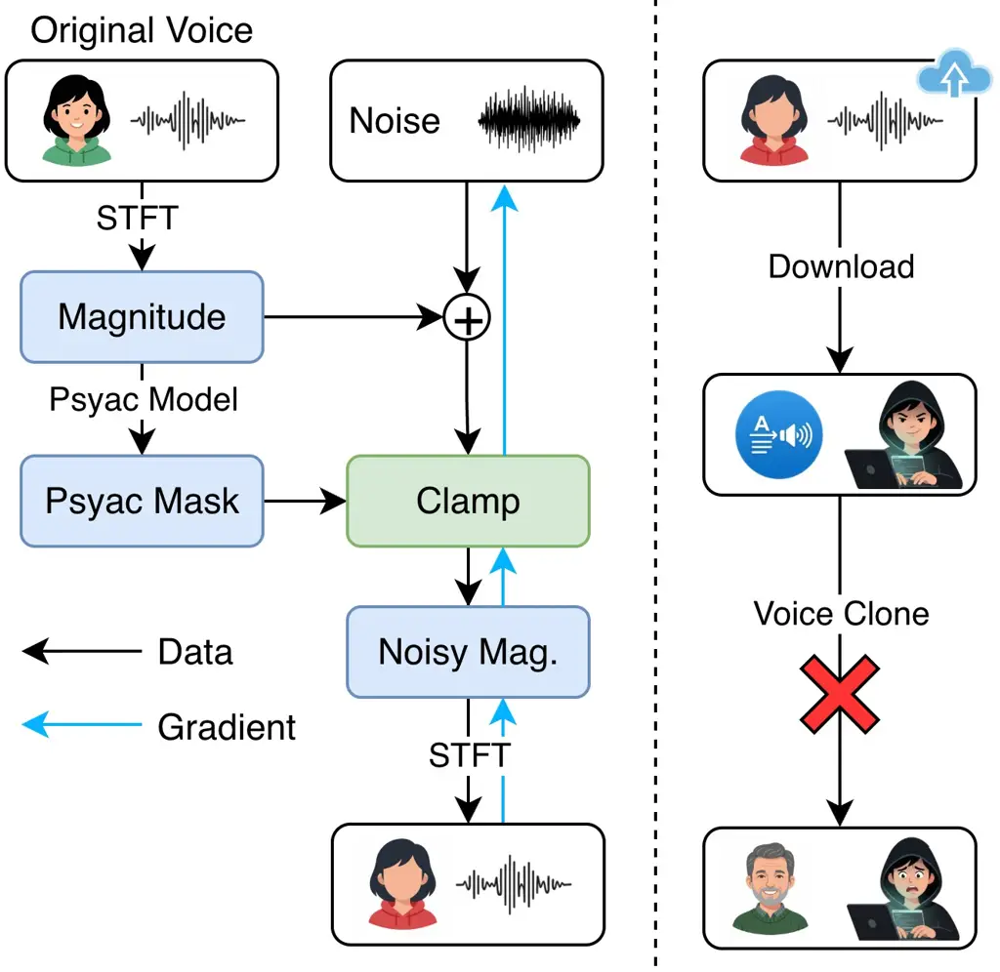

# Silence-the-Mimic: Accelerating Imperceptible Perturbation Generation Against Voice Cloning

Runqiu Xu Affiliation: Data Science Institute, The University of
Chicago, Chicago, IL, USA.  
xurunqiu@uchicago.edu

###### Abstract

Deep neural network–based Voice Conversion (VC) and Text-to-Speech (TTS)
models have rapidly advanced, enabling realistic voice cloning with
minimal input data. Such capabilities raise serious concerns over
unauthorized cloning of speaker identities and the associated privacy
and security risks. Current imperceptible adversarial protection methods
rely on quality control losses that are highly sensitive to
hyperparameter tuning and computationally expensive due to lengthy
optimization. To address these limitations, we propose a fast protection
method that generates perceptually constrained perturbations in the
frequency domain under a psychoacoustic masking–based constraint. Our
approach strictly enforces perceptibility bounds during adversarial
training, eliminating the need for iterative quality balancing and
significantly reducing computational cost. Experiments on multiple
state-of-the-art VC and TTS models show that STM achieves competitive or
superior protection performance with substantially better perceptual
quality and up to 45.3× speedup over existing white-box baselines. These
results demonstrate the effectiveness of frequency-domain perturbations
with perceptual constraints as a practical paradigm for protecting
against voice cloning.

###### Index Terms: 

adversarial defense, audio security, voice cloning, voice conversion,
text-to-speech.

## I Introduction

Recent Voice Conversion (VC) and Text-to-Speech (TTS) models require
only a few seconds of a target speaker’s audio to generate high-fidelity
synthetic speech while allowing arbitrary linguistic content \[1, 2\].
Despite their beneficial applications, highly realistic synthesized
speech, commonly referred to as deepfake audio, poses serious threats to
individuals’ privacy, property, and reputation.

In response to these threats, existing research has explored methods to
defend against unauthorized deepfake audio \[3, 4\]. These approaches
can be broadly categorized into two groups: _detection_ and
_protection_. Deepfake audio detection focuses on distinguishing
machine-generated speech from human speech. This can be achieved by
examining artifacts present in synthesized audio (passive detection)
\[5\] or by extracting watermarks embedded in the audio beforehand
(active detection)\[6\]. However, detection operates only after an
attack has occurred. In contrast, protection methods add imperceptible
perturbations before publication to disrupt speaker-identity extraction
and prevent unauthorized cloning \[7\].

This paper proposes a new methodology that is significantly faster than
existing imperceptible white-box adversarial-perturbation-based
protection methods. Existing adversarial protection methods typically
combine the attack objective with auxiliary waveform-, spectral-, or
perception-based quality losses. However, their performance is sensitive
to the relative quality-loss weight, and hundreds or thousands of
iterations are often required to balance protection and audio
quality \[8, 9\], limiting practical deployment.

Our proposed method addresses these limitations by introducing
imperceptible perturbations in the frequency domain. Specifically, we
first convert the speech signal into a spectrogram in the frequency
domain using the Short-Time Fourier Transform (STFT), under the Constant
Overlap Add (COLA) condition to ensure stable inverse STFT (iSTFT)
reconstruction. A psychoacoustic model is then applied to the
spectrogram to estimate the masking threshold of each time-frequency bin
in every STFT frame. This threshold is combined with a predefined
tolerance to establish a strictly enforced human perceptibility
constraint, ensuring that the injected perturbations remain within the
allowable range. In this manner, gradient updates are directed solely
toward the perturbations, which accelerates adversarial training while
preserving strong protection performance.

We conduct extensive experiments on multiple state-of-the-art VC and TTS
models and compare our approach with leading white-box defense
baselines. The results demonstrate that the proposed method achieves
comparable or superior protection performance while substantially
accelerating perturbation generation across all evaluated settings.

## II Related Work

Voice Cloning Models.   Voice cloning refers to generating speech with
arbitrary linguistic content that mimics the vocal characteristics of a
specific individual. Recent approaches mainly fall into two paradigms:
VC \[10, 11, 12, 13, 14, 15, 16\] and TTS \[17, 18, 19, 20, 21, 22, 2\].
VC models take utterances from two speakers: one provides linguistic
content (what to say), and the other provides speaker identity (how to
say it). The model then combines these inputs to synthesize speech that
carries the content of the former while preserving the vocal traits of
the latter. TTS models, on the other hand, generate acoustic features
from input text conditioned on a short reference audio that provides
speaker information. These features are then passed to a vocoder to
synthesize speech that preserves the vocal characteristics of the
reference speaker.

Detection-based Protection.   To mitigate the risks posed by
unauthorized voice cloning, researchers have developed proactive
algorithms that embed stealth identifiers into audio files to enable
post-cloning tracking, a technique commonly referred to as audio
watermarking \[23, 24, 6, 25\]. Audio watermarking methods typically
involve a generator–detector framework: the generator embeds
imperceptible patterns into speech, which tend to remain intact even
after processing or cloning by VC or TTS models, while the detector
recovers or verifies these patterns to trace the audio’s origin and
assess its authenticity.

Another approach to detecting deepfake audio is to analyze intrinsic
artifacts in model synthesized speech \[5\]. These passive methods
identify acoustic, spectral, or temporal inconsistencies introduced
during synthesis and use statistical models or deep neural networks to
distinguish synthetic speech from genuine recordings.

Adversarial Perturbation Protection.   Another promising defense
strategy is to embed imperceptible or minimally perceptible noise into
speech audio \[26, 8, 9, 27, 28, 29\]. Such noise is specifically
designed to disrupt the cloning process, particularly the speaker
encoder, thereby preventing voice cloning models from synthesizing
accurate outputs. Adversarial-perturbation-based defenses can be
categorized along two binary dimensions: how the perturbations are
generated and where they are applied. With respect to generation, some
methods produce perturbations through adversarial training, while others
employ a pretrained perturbation generator that does not require
gradient information during inference. With respect to application,
perturbations are either injected directly into the audio waveform or
introduced by biasing latent representations within a vocoder.

## III Methodology

In this section, we present the proposed protection algorithm,
Silence-the-Mimic (STM). Unlike prior approaches that rely on perceptual
loss functions to regulate the audibility of perturbations, STM employs
a psychoacoustic-based hard-clamping strategy to enforce strict control
over perceptual distortion in the frequency domain. This design enables
direct control over the perceptual quality of protected speech while
simultaneously accelerating the perturbation process by eliminating the
need for additional audio refinement steps.

We begin this section by formulating the protection problem, followed by
a detailed description of our methodology.

### III-A Problem Setup

Our problem scenario involves three entities: (i) a victim who publishes
publicly available content containing their speech samples, denoted by
the set $`{\mathbb{X}}_{u}`$, (ii) an attacker who seeks to exploit
these samples to generate deepfake audio, and (iii) a legitimate
verifier authorized to authenticate the victim.

The attacker is modeled as a third-party adversary without the
capability to directly capture the victim’s speech. Instead, the
attacker collects publicly available speech samples of the victim. To
generate spoofed speech, the attacker employs a speech synthesis model
$`G:{\mathbb{R}}^{d_{enc}}\times\mathcal{C}\rightarrow{\mathbb{R}}^{*}`$,
which synthesizes an utterance $`G(enc_{\mathrm{spk}}({\bm{x}}),c)`$
containing linguistic content $`c`$ while mimicking the vocal
characteristics of the target utterance $`{\bm{x}}\in{\mathbb{X}}_{u}`$.
Here, $`{\bm{x}}\in{\mathbb{R}}^{*}`$ denotes a variable-length sequence
representing the audio waveform, where the symbol $`*`$ indicates that
the sequence length may vary. $`c\in\mathcal{C}`$ denotes arbitrary
content selected by an attacker to facilitate misuse, and
$`enc_{\mathrm{spk}}:{\mathbb{R}}^{*}\rightarrow{\mathbb{R}}^{d_{enc}}`$
denotes the speaker encoder.

The verifier relies on a speaker verification (SV) model
$`SV:{\mathbb{R}}^{*}\times{\mathbb{R}}^{*}\rightarrow[0,1]`$ to compute
the similarity between an enrollment utterance from the victim and a
trial utterance. The verifier accepts the trial utterance as authentic
if the similarity score exceeds a predefined threshold, thereby serving
as the ultimate gatekeeper in controlling access to victim-authorized
interactions.

To safeguard the victim’s voice identity from unauthorized replication,
a protection algorithm perturbs each utterance
$`{\bm{x}}\in{\mathbb{X}}_{u}`$ before publication, so that any speech
cloned from the protected utterance $`{\bm{x}}+\Delta{\bm{x}}`$ is
rejected by the SV model when compared with the victim’s enrollment
utterance $`{\bm{x}}_{\mathrm{enr}}`$. At the same time, the
perturbation is constrained to remain perceptually unobtrusive, ensuring
that the protected utterance remains intelligible and usable. This
process can be formulated as:

```math
\displaystyle\min_{\mathbf{\Delta}_{\bm{x}}} \displaystyle SV\big({\bm{x}}_{\mathrm{enr}},G\big(enc_{\mathrm{spk}}({\bm{x}}+\mathbf{\Delta}_{\bm{x}}),c\big)\big) \tag{1}
```

```math
\displaystyle\mathrm{s.t.} \displaystyle H({\bm{x}}+\mathbf{\Delta}_{\bm{x}},{\bm{x}})\leq{\bm{\mathsfit{H}}}_{\mathrm{limit}},
```

where
$`H:{\mathbb{R}}^{*}\times{\mathbb{R}}^{*}\rightarrow{\mathbb{R}}^{d}`$
denotes a human perceptual function that quantifies the dissimilarity
between two inputs, and the output dimensionality $`d`$ may correspond
to a scalar or a high-dimensional tensor depending on the granularity of
perceptual constraints (e.g., time–frequency bins). The parameter
$`{\bm{\mathsfit{H}}}_{\mathrm{limit}}`$ specifies the maximum allowable
distortion and enables fine-grained control across different feature
channels. In practice, directly optimizing Equation 1 is often
infeasible. Instead, we modify the speaker identity perceived by the
synthesizer to achieve a similar outcome, as discussed in a later
section.

### III-B Method Formulation

Our proposed method, STM, begins by converting the victim’s speech audio
into a frequency-domain representation, i.e., a spectrogram. A
psychoacoustic model is then applied to constrain the maximum allowable
distortion of the protected audio. Finally, the optimization problem in
Equation 1 is reformulated into an empirical form suitable for
adversarial training, resulting in the generation of the protected
output. The overall STM pipeline is shown in Figure 1.



Fig. 1: Pipeline of STM.

Frequency-domain Perturbation.   We perform adversarial protection by
introducing perturbations in the frequency domain. The raw speech
waveform is converted into a spectrogram using STFT. In particular, we
employ a Hann window with a $`50\%`$ overlap between consecutive frames.
This configuration satisfies the COLA condition, ensuring that the sum
of overlapping windows remains constant over time. The COLA property
guarantees that the signal can be reliably reconstructed through iSTFT,
which is critical for our framework, as perturbed spectrograms must be
transformed back into time-domain waveforms without introducing
additional artifacts.

We denote the STFT and iSTFT operations by
$`STFT:{\mathbb{R}}^{*}\rightarrow{\mathbb{R}}^{*\times*}`$ and
$`iSTFT:{\mathbb{R}}^{*\times*}\rightarrow{\mathbb{R}}^{*}`$,
respectively, and write the spectrogram of
$`{\bm{x}}\in{\mathbb{X}}_{u}`$ as
$`{\bm{Y}}_{\mathrm{spec}}=STFT({\bm{x}})`$. Here for notational
simplicity, we retain only the magnitude component and omit the phase,
which remains unchanged throughout the algorithm. We denote the
corresponding frequency-domain perturbation as
$`\mathbf{\Delta}_{\mathrm{spec}}`$, which shares the same shape as
$`{\bm{Y}}_{\mathrm{spec}}`$.

Approximate Perceptibility Constraint.   To directly control the
audibility of added noise, it is essential to quantitatively approximate
the distortion perceived by humans between the raw speech audio and its
protected version. In STM, we employ a psychoacoustic model, denoted as
$`Psyac({\bm{Y}}_{\mathrm{spec}}):{\mathbb{R}}^{*\times*}\rightarrow{\mathbb{R}}^{*\times*}`$,
to estimate the masking threshold. This threshold, combined with
predefined tolerance margins, provides an approximate representation of
the human perceptual constraint in Equation 1.

Specifically, let
$`{\bm{Y}}_{\mathrm{mask}}=Psyac({\bm{Y}}_{\mathrm{spec}})`$ denote the
masking threshold of the spectrogram $`{\bm{Y}}_{\mathrm{spec}}`$. We
then identify audible and inaudible time-frequency bins in the original
utterance as follows:

```math
\displaystyle\begin{aligned} &\bm{1}_{\mathrm{audible}}&=\bm{1}_{\geq{\bm{Y}}_{\mathrm{mask}}}({\bm{Y}}_{\mathrm{spec}}),\quad&\bm{1}_{\mathrm{inaudible}}&=\bm{1}_{<{\bm{Y}}_{\mathrm{mask}}}({\bm{Y}}_{\mathrm{spec}}),\end{aligned}
```

where $`\bm{1}_{\mathrm{condition}}(\cdot)`$ is an element-wise
indicator function. We then impose the approximate perceptibility
constraint on the protected audio as:

```math
\displaystyle\begin{aligned} {\bm{Y}}_{\mathrm{spec}}^{\mathrm{adv}}&\leq{\bm{Y}}_{\mathrm{spec}}+\bm{1}_{\mathrm{audible}}\odot h_{\mathrm{audible}}^{\mathrm{head}}+\bm{1}_{\mathrm{inaudible}}\odot h_{\mathrm{inaudible}}^{\mathrm{head}}:={\bm{H}}^{\mathrm{head}},\\
{\bm{Y}}_{\mathrm{spec}}^{\mathrm{adv}}&\geq{\bm{Y}}_{\mathrm{spec}}+\bm{1}_{\mathrm{audible}}\odot h_{\mathrm{audible}}^{\mathrm{floor}}+\bm{1}_{\mathrm{inaudible}}\odot h_{\mathrm{inaudible}}^{\mathrm{floor}}:={\bm{H}}^{\mathrm{floor}},\end{aligned} \tag{2}
```

where
$`{\bm{Y}}_{\mathrm{spec}}^{\mathrm{adv}}={\bm{Y}}_{\mathrm{spec}}+\mathbf{\Delta}_{\mathrm{spec}}`$
denotes the spectrogram of the protected utterance, $`\odot`$ represents
element-wise multiplication, and
$`h_{\{\mathrm{audible},\mathrm{inaudible}\}}^{\{\mathrm{head},\mathrm{floor}\}}`$
correspond to the headroom and floorroom (lower-bound) tolerances for
audible and inaudible time-frequency bins, respectively. These tolerance
values are tunable parameters of STM that explicitly control the
trade-off between audio quality and protection strength. For instance,
by setting

```math
\displaystyle h_{\mathrm{audible}}^{\mathrm{floor}}=0,\quad h_{\mathrm{audible}}^{\mathrm{head}}=0,\quad h_{\mathrm{inaudible}}^{\mathrm{floor}}=-\infty,\quad h_{\mathrm{inaudible}}^{\mathrm{head}}={\bm{Y}}_{\mathrm{mask}}-{\bm{Y}}_{\mathrm{spec}},
```

STM enforces a fully masked perturbation under the adopted
psychoacoustic model, where audible bins remain unchanged and inaudible
bins are constrained strictly below the masking threshold.

Alternatively, by allowing controlled distortion through:

```math
\displaystyle h_{\mathrm{audible}}^{\mathrm{floor}}=-c,\quad h_{\mathrm{audible}}^{\mathrm{head}}=c,\quad h_{\mathrm{inaudible}}^{\mathrm{floor}}=-\infty,\quad h_{\mathrm{inaudible}}^{\mathrm{head}}={\bm{Y}}_{\mathrm{mask}}-{\bm{Y}}_{\mathrm{spec}}+c,
```

STM relaxes the constraint on audible bins by a margin $`c>0`$, thereby
increasing the protection strength at the cost of a small, controlled
reduction in perceptual quality.

Hard Clamping.   An effective approach used in this study to enforce the
perceptibility constraint in Equation 2 is to hard clamp excessive
values of $`{\bm{Y}}_{\mathrm{spec}}^{\mathrm{adv}}`$ (and thus of
$`\mathbf{\Delta_{\mathrm{spec}}}`$) back within the headroom and
floorroom tolerances at the end of each training iteration:

```math
Clamp({\bm{Y}}_{\mathrm{spec}}^{\mathrm{adv}})=\min\!\big(\max({\bm{Y}}_{\mathrm{spec}}^{\mathrm{adv}},{\bm{H}}^{\mathrm{floor}}),\,{\bm{H}}^{\mathrm{head}}\big),
```

where $`\min`$ and $`\max`$ are applied element-wise, returning the
smaller or larger value of their two operands, respectively.

Targeted Embedding Shift.   The ultimate objective of our problem is to
reduce the confidence score produced by the SV model. However, directly
optimizing the objective function in Equation 1 is inefficient and, in
the case of autoregressive voice cloning models, often infeasible.
Instead, we optimize the perturbation
$`\mathbf{\Delta}_{\mathrm{spec}}`$ to alter the output of the speaker
encoder, thereby lowering the SV confidence score.

In prior work on white-box adversarial protection methods, two primary
objectives have been employed to deviate the output of the speaker
encoder: _threshold-based_ and _target-based_. The threshold-based
approach trains the perturbation to push the speaker encoder’s output a
sufficient distance away from the original speaker embedding under a
chosen distance metric, with the protection rate controlled by a
predefined threshold. In contrast, the target-based approach forces the
perturbed embedding to resemble that of another speaker selected from an
embedding bank. In STM, we adopt the target-based approach, as guiding
perturbations toward a valid subspace of real speech embeddings
consistently yields higher audio quality in the protected outputs.
Additional analysis of this effect is presented in Section IV-F.

Multi-Step Total Variation Loss.   To further enhance the temporal
smoothness of perturbations and thereby improve audio quality, we
incorporate a _multi-step_ one-dimensional total variation (TV) loss
into the optimization objective. Rather than penalizing only differences
between adjacent time frames, this formulation considers multiple step
sizes to capture variations across different temporal scales. Formally,
the multi-step TV loss is defined as:

```math
Loss_{\mathrm{MTV}}=\sum_{k\in\mathcal{K}}\;\frac{1}{T-k}\sum_{t=1}^{T-k}\big|\,\mathbf{\Delta}_{\mathrm{spec}}[:,t+k]-\mathbf{\Delta}_{\mathrm{spec}}[:,t]\,\big|,
```

where $`\mathcal{K}`$ is the set of step sizes, and $`T`$ denotes the
length of $`\mathbf{\Delta}_{\mathrm{spec}}`$ along the time axis. By
enforcing smoothness across both short- and long-range time intervals,
this regularization reduces rapid oscillations and stabilizes the
perturbation structure.

The complete STM protection procedure is summarized in Algorithm 1.

Require: speaker encoder $`enc_{\mathrm{spk}}`$; STFT $`STFT`$; inverse
STFT $`iSTFT`$; psychoacoustic model $`Psyac`$; clamp function
$`Clamp`$; params
$`h_{\{\mathrm{audible},\mathrm{inaudible}\}}^{\{\mathrm{head},\mathrm{floor}\}}`$;
loss $`Loss`$

Input: victim utterance $`{\bm{x}}`$

Output: protected utterance $`{\bm{x}}_{\mathrm{adv}}`$

3: $`{\bm{Y}}_{\mathrm{spec}}\leftarrow STFT({\bm{x}})`$,
$`{\bm{Y}}_{\mathrm{mask}}\leftarrow Psyac({\bm{Y}}_{\mathrm{spec}})`$

4:
$`emb_{\mathrm{spk}}^{\mathrm{orig}}\leftarrow enc_{\mathrm{spk}}({\bm{x}})`$

5: Choose $`emb_{\mathrm{spk}}^{\mathrm{trg}}`$ from bank using
$`emb_{\mathrm{spk}}^{\mathrm{orig}}`$

6: Compute $`{\bm{H}}^{\mathrm{head}},{\bm{H}}^{\mathrm{floor}}`$ via
Equation 2

7: Initialize $`\mathbf{\Delta}_{\mathrm{spec}}`$; initialize optimizer
$`\mathcal{O}`$

8: for _$`t\leftarrow 1`$ to $`T_{\mathrm{iter}}`$_ do

    9:
$`{\bm{Y}}_{\mathrm{spec}}^{\mathrm{adv}}\leftarrow{\bm{Y}}_{\mathrm{spec}}+\mathbf{\Delta}_{\mathrm{spec}}`$

    10:
$`{\bm{x}}_{\mathrm{adv}}\leftarrow iSTFT({\bm{Y}}_{\mathrm{spec}}^{\mathrm{adv}})`$

    11: $`emb\leftarrow enc_{\mathrm{spk}}({\bm{x}}_{\mathrm{adv}})`$,  
$`loss\leftarrow Loss(emb,\,emb_{\mathrm{spk}}^{\mathrm{trg}})`$,  
$`\nabla_{\mathbf{\Delta}_{\mathrm{spec}}}\leftarrow\partial loss/\partial\mathbf{\Delta}_{\mathrm{spec}}`$

    12:
$`\mathbf{\Delta}_{\mathrm{spec}}\leftarrow\mathcal{O}\text{-update}(\mathbf{\Delta}_{\mathrm{spec}},\nabla_{\mathbf{\Delta}_{\mathrm{spec}}})`$

    13:
$`\mathbf{\Delta}_{\mathrm{spec}}\leftarrow Clamp(\mathbf{\Delta}_{\mathrm{spec}};\,{\bm{Y}}_{\mathrm{spec}},{\bm{Y}}_{\mathrm{mask}},{\bm{H}}^{\mathrm{head}},{\bm{H}}^{\mathrm{floor}})`$

15:
$`{\bm{x}}_{\mathrm{adv}}\leftarrow iSTFT({\bm{Y}}_{\mathrm{spec}}+\mathbf{\Delta}_{\mathrm{spec}})`$

16: return $`x_{\mathrm{adv}}`$

Algorithm 1 Silence-the-Mimic (STM)

## IV Experiments

### IV-A Dataset

We evaluate our proposed protection method and baseline methods on the
CSTR VCTK Corpus \[30\]. For preprocessing, we first discard utterances
without transcripts, and then randomly select 100 speakers, with 5
utterances randomly chosen from each, resulting in a total of 500
utterances. From the remaining utterances, we select the longest one
from each speaker to construct the embedding bank for target-based
adversarial training. All audio files are downsampled to 16 kHz prior to
training or inference with any model.

### IV-B Target Models and Baselines

To best resemble a powerful attacker trying to clone the voice identity
of the victim, we select four popular open-source DNN-based voice
synthesis models with state-of-the-art zero-shot or few-shot voice
cloning capabilities. The selected models are: GPT-SoVITS (GSV \[22\]),
FreeVC \[14\], QuickVC \[15\] and TriAAN-VC \[16\].

We evaluate the defense performance of our proposed method on the models
described above, comparing it with two baselines: AntiFake \[8\] and
VoiceGuard \[9\]. Both methods are widely recognized and continue to
serve as baselines in recent studies \[7, 31\], underscoring their
status as current leading approaches. They operate under a white-box
setting and employ adversarial training to generate perturbations in the
time domain, combined with loss-based audio quality control. The key
distinction lies in their strategies for quality control: AntiFake
integrates the loss terms directly into the perturbation process,
whereas VoiceGuard performs audio refinement as a separate stage
following adversarial training, with the optimal weight determined via
binary search.

### IV-C Evaluation Metrics

We evaluate the protection effectiveness of STM and the baseline methods
using three widely adopted SV models: TitaNet \[32\], ECAPA-TDNN \[33\],
and Pyannote.audio \[34, 35\]. For TitaNet and ECAPA-TDNN, we employ the
implementations provided in NVIDIA’s NeMo library, while for
Pyannote.audio, we use the implementation from its official repository.

Following prior work, we evaluate the audio quality of protected
utterances using the Mean Opinion Score (MOS) and the Noisiness metric.
NISQA-predicted MOS provides an overall measure of perceived speech
quality, while the Noisiness metric quantifies degradation due to
additive noise, capturing the extent to which an audio sample is
perceived as “not noisy” \[36, 37\]. In addition, we incorporate the
Perceptual Evaluation of Speech Quality (PESQ) \[38\] to assess
perceptual speech quality, and the Short-Time Objective Intelligibility
(STOI) \[39\] to evaluate speech intelligibility. Together, these
metrics provide a comprehensive evaluation by capturing complementary
aspects of perceptual quality, ranging from naturalness to
intelligibility and noise robustness. MOS and Noisiness are obtained
using NISQA \[37\], an open-source DNN-based model for multidimensional
speech quality prediction. For PESQ and STOI, we adopt the pesq¹¹ 1
[https://github.com/ludlows/PESQ](https://github.com/ludlows/PESQ) and
pystoi²² 2
[https://github.com/mpariente/pystoi](https://github.com/mpariente/pystoi)
libraries, respectively.

### IV-D Training Details

For our proposed method, we configure the STFT with an FFT size of 512
and a hop size of 256 to satisfy the COLA condition. The resulting
spectrograms are subsequently converted to a logarithmic scale. The
psychoacoustic model is adopted from \[40\]. We extract the speaker
encoder components from GSV, FreeVC, QuickVC, and TriAAN-VC, and employ
them as $`enc_{\mathrm{spk}}`$ in Algorithm 1. The target speaker
embedding, $`emb_{\mathrm{spk}}^{\mathrm{trg}}`$, is selected as the
embedding corresponding to the fifth-largest distance from the original
speaker embedding, $`emb_{\mathrm{spk}}^{\mathrm{orig}}`$, in the entire
speaker bank. Perceptibility control parameters are set as follows:

```math
\displaystyle h_{\mathrm{audible}}^{\mathrm{floor}}=-0.15,\quad h_{\mathrm{audible}}^{\mathrm{head}}=0.15,\quad h_{\mathrm{inaudible}}^{\mathrm{floor}}=-\infty,\quad h_{\mathrm{inaudible}}^{\mathrm{head}}={\bm{Y}}_{\mathrm{mask}}-{\bm{Y}}_{\mathrm{spec}}.
```

We use the Adam optimizer with a learning rate of 1 and parameters
$`\beta_{1}=0.9`$ and $`\beta_{2}=0.999`$. $`T_{\mathrm{iter}}`$ is set
to 80. For the loss function, we use a combination of L1 loss and cosine
similarity loss as shown in Equation 3:

```math
\displaystyle Loss(emb,\,emb_{\mathrm{spk}}^{\mathrm{trg}})=\left\lVert emb-emb_{\mathrm{spk}}^{\mathrm{trg}}\right\rVert_{1} \tag{3}
```

```math
\displaystyle+\left(1-\operatorname{CosineSimilarity}(emb,emb_{\mathrm{spk}}^{\mathrm{trg}})\right).
```

TV loss is incorporated into Equation 3 for defense against FreeVC and
QuickVC.

For the baselines, we evaluate AntiFake under three configurations: 80,
500 and 1000 iterations. The 1000-iteration configuration corresponds to
its official setting, while the 80-iteration configuration matches STM’s
optimization budget for a fair comparison. We also manually adjust the
weight ratio between the speaker loss and the quality control loss to
balance audio fidelity and defense robustness. Additional evaluations of
AntiFake with different quality control loss weights are provided in
Section IV-F. For VoiceGuard, we adopt the configuration from the
original paper, consisting of 3000 adversarial training steps followed
by 1500 refinement steps.

For the three SV models, the thresholds of normalized cosine similarity
are set to 0.7318, 0.6466, and 0.7507 for ECAPA-TDNN, Pyannote, and
TitaNet, respectively. These thresholds are determined by their Equal
Error Rates (EER) on the VCTK dataset.

All methods are evaluated on a single NVIDIA A100 80GB PCIe GPU.
Training time is averaged over the entire sampled dataset, accounting
only for perturbation iterations and excluding data I/O.

### IV-E Main Results

Table I reports the comparative SV rejection rates and audio quality
metrics. TitaNet, E-TDNN, and Pyannote denote the rejection rates
obtained from the TitaNet, ECAPA-TDNN, and Pyannote.audio SV systems,
respectively. F-VC, Q-VC, and T-VC denote the target models FreeVC,
QuickVC, and TriAAN-VC, respectively. STM denotes our proposed method,
AF-80, AF-500 and AF-1000 correspond to AntiFake with 80, 500 and 1000
iterations, and VG represents VoiceGuard. Confidence intervals are
reported at the 95% level. The symbol $`\uparrow`$ indicates that higher
values are preferable. The best results are shown in bold, and the
second best results are underlined.

Across all VC and TTS models, STM consistently demonstrates competitive
protection performance. It achieves the highest or second-highest
rejection rates on nearly all SV systems, frequently surpassing
VoiceGuard and AntiFake by large margins. With protection performance
comparable to or exceeding that of the baselines, STM preserves superior
perceptual quality in the protected audio. It achieves competitive MOS
and PESQ scores, while its STOI and Noisiness results are consistently
higher than those of the baselines, indicating more effective perceptual
masking of perturbations.

As shown in Table II, STM consistently achieves the lowest protection
runtime across all target models. At the matched 80-iteration budget,
STM is still 1.59$`\times`$ faster than AntiFake on average (2.19 vs.
3.48 s/utterance), while substantially larger speedups are observed
against AntiFake under its official 1000-iteration setting, as well as
against VoiceGuard. This demonstrates that STM’s runtime advantage
persists even when controlling for the optimization budget.

(a) SV rejection rates and MOS.

| Model | Method  | TitaNet $`\uparrow`$ | E-TDNN $`\uparrow`$ | Pyannote $`\uparrow`$ | MOS $`\uparrow`$          |
| ----- | ------- | -------------------- | ------------------- | --------------------- | ------------------------- |
| GSV   | STM     | 96.00%               | 95.40%              | 68.80%                | $`\mathbf{3.26\pm 0.06}`$ |
|       | AF-80   | 93.20%               | 91.20%              | 80.00%                | $`2.80\pm 0.06`$          |
|       | AF-500  | 83.20%               | 86.40%              | 66.80%                | $`2.98\pm 0.04`$          |
|       | AF-1000 | 80.00%               | 72.60%              | 48.40%                | $`3.25\pm 0.06`$          |
|       | VG      | 94.00%               | 95.20%              | 81.40%                | $`2.82\pm 0.05`$          |
| F-VC  | STM     | 98.40%               | 98.80%              | 94.40%                | $`\mathbf{3.80\pm 0.07}`$ |
|       | AF-80   | 89.20%               | 88.00%              | 78.60%                | $`2.88\pm 0.06`$          |
|       | AF-500  | 76.80%               | 77.60%              | 70.40%                | $`3.22\pm 0.05`$          |
|       | AF-1000 | 76.20%               | 77.20%              | 69.40%                | $`3.26\pm 0.11`$          |
|       | VG      | 83.20%               | 84.40%              | 76.00%                | $`2.99\pm 0.04`$          |
| Q-VC  | STM     | 99.60%               | 99.60%              | 98.80%                | $`\mathbf{3.64\pm 0.08}`$ |
|       | AF-80   | 91.60%               | 92.20%              | 87.20%                | $`2.91\pm 0.08`$          |
|       | AF-500  | 57.20%               | 56.80%              | 51.60%                | $`3.22\pm 0.04`$          |
|       | AF-1000 | 51.00%               | 51.20%              | 41.20%                | $`3.55\pm 0.04`$          |
|       | VG      | 97.80%               | 97.80%              | 95.40%                | $`2.90\pm 0.04`$          |
| T-VC  | STM     | 67.80%               | 65.60%              | 43.40%                | $`2.86\pm 0.06`$          |
|       | AF-80   | 74.40%               | 71.80%              | 39.40%                | $`2.86\pm 0.09`$          |
|       | AF-500  | 67.40%               | 68.00%              | 46.00%                | $`2.86\pm 0.04`$          |
|       | AF-1000 | 67.40%               | 67.20%              | 46.00%                | $`\mathbf{2.98\pm 0.03}`$ |
|       | VG      | 69.20%               | 67.60%              | 42.80%                | $`2.89\pm 0.04`$          |

(b) Audio quality metrics.

|       |         |                           |                           |                           |
| ----- | ------- | ------------------------- | ------------------------- | ------------------------- |
| Model | Method  | Noisiness $`\uparrow`$    | PESQ $`\uparrow`$         | STOI $`\uparrow`$         |
| GSV   | STM     | $`\mathbf{3.65\pm 0.04}`$ | $`\mathbf{2.54\pm 0.03}`$ | $`\mathbf{0.91\pm 0.00}`$ |
|       | AF-80   | $`1.73\pm 0.02`$          | $`1.81\pm 0.05`$          | $`0.81\pm 0.02`$          |
|       | AF-500  | $`1.89\pm 0.02`$          | $`1.86\pm 0.03`$          | $`0.79\pm 0.01`$          |
|       | AF-1000 | $`2.03\pm 0.04`$          | $`2.00\pm 0.04`$          | $`0.82\pm 0.01`$          |
|       | VG      | $`1.78\pm 0.02`$          | $`1.72\pm 0.02`$          | $`0.78\pm 0.01`$          |
| F-VC  | STM     | $`\mathbf{3.82\pm 0.05}`$ | $`\mathbf{2.86\pm 0.03}`$ | $`\mathbf{0.94\pm 0.00}`$ |
|       | AF-80   | $`1.91\pm 0.02`$          | $`1.67\pm 0.05`$          | $`0.78\pm 0.03`$          |
|       | AF-500  | $`2.12\pm 0.03`$          | $`1.95\pm 0.03`$          | $`0.81\pm 0.01`$          |
|       | AF-1000 | $`2.30\pm 0.09`$          | $`2.04\pm 0.06`$          | $`0.80\pm 0.03`$          |
|       | VG      | $`1.93\pm 0.02`$          | $`1.79\pm 0.02`$          | $`0.78\pm 0.01`$          |
| Q-VC  | STM     | $`\mathbf{3.67\pm 0.06}`$ | $`\mathbf{2.59\pm 0.03}`$ | $`\mathbf{0.95\pm 0.00}`$ |
|       | AF-80   | $`1.76\pm 0.01`$          | $`1.63\pm 0.05`$          | $`0.80\pm 0.02`$          |
|       | AF-500  | $`2.15\pm 0.01`$          | $`2.20\pm 0.03`$          | $`0.83\pm 0.01`$          |
|       | AF-1000 | $`2.45\pm 0.02`$          | $`2.58\pm 0.03`$          | $`0.86\pm 0.01`$          |
|       | VG      | $`1.74\pm 0.01`$          | $`1.73\pm 0.02`$          | $`0.77\pm 0.01`$          |
| T-VC  | STM     | $`\mathbf{3.54\pm 0.03}`$ | $`\mathbf{2.36\pm 0.03}`$ | $`\mathbf{0.89\pm 0.01}`$ |
|       | AF-80   | $`1.76\pm 0.01`$          | $`1.80\pm 0.05`$          | $`0.81\pm 0.03`$          |
|       | AF-500  | $`1.81\pm 0.01`$          | $`1.87\pm 0.03`$          | $`0.79\pm 0.01`$          |
|       | AF-1000 | $`1.91\pm 0.01`$          | $`2.03\pm 0.03`$          | $`0.80\pm 0.01`$          |
|       | VG      | $`1.92\pm 0.01`$          | $`1.97\pm 0.03`$          | $`0.83\pm 0.01`$          |

TABLE I: Comparison of SV rejection rates and audio quality metrics
between the proposed method and the baseline methods.

|       |                                      |       |        |         |        |
| ----- | ------------------------------------ | ----- | ------ | ------- | ------ |
| Model | Runtime $`\downarrow`$ (s/utterance) |       |        |         |        |
|       | STM                                  | AF-80 | AF-500 | AF-1000 | VG     |
| GSV   | 1.02                                 | 2.60  | 18.35  | 38.34   | 30.87  |
| F-VC  | 2.01                                 | 3.09  | 20.10  | 43.38   | 56.80  |
| Q-VC  | 1.76                                 | 3.12  | 21.02  | 42.55   | 79.72  |
| T-VC  | 3.96                                 | 5.09  | 27.85  | 57.53   | 156.27 |

TABLE II: Protection runtime across target models and methods.

### IV-F Further Experiments

Robustness Against Purification Attacks. We evaluate whether common
audio purification operations can remove STM perturbations before voice
conversion. Following AntiFake \[8\], we apply four representative
preprocessing operations to protected reference utterances before FreeVC
inference: 8-bit quantization-dequantization, 8 kHz down/up-sampling,
frequency filtering, and Griffin–Lim mel-spectrogram inversion. These
operations cover both mild waveform-level transformations and stronger
spectral-domain reconstruction attacks. The converted speech is then
evaluated using the same ECAPA-TDNN verifier. For frequency filtering,
we use shelf filters to attenuate frequencies below $`0.1C`$ and above
$`1.5C`$ by 30 dB, where $`C`$ is the utterance-level median spectral
centroid.

As shown in Table III, STM remains robust to all purification
operations, maintaining rejection rates above 90% even under the
stronger frequency-filtering and Griffin–Lim reconstruction attacks.
These results indicate that standard purification can attenuate STM
perturbations but does not reliably remove the protection in this
setting.

| Metric                      | None   | Quant. | Resamp. | Freq. Filtering | Mel Inversion |
| --------------------------- | ------ | ------ | ------- | --------------- | ------------- |
| Rejection Rate $`\uparrow`$ | 98.80% | 99.60% | 96.20%  | 91.60%          | 91.20%        |

TABLE III: Robustness against purification attacks on FreeVC.

Black-box Transferability.   We evaluate the transferability of our
method following the black-box protocol provided in AntiFake’s official
implementation. Specifically, we optimize perturbations against three
surrogate models, SV2TTS (RTVC) \[41\], AdaptiveVC \[11\], and
YourTTS \[42\], using the same evaluation set as in our main
experiments, and test their effectiveness on the unseen closed-source
commercial system ElevenLabs. STM achieves an average SV rejection rate
of 71.50%, a NISQA-predicted MOS of 3.37, and a PESQ of 2.47, compared
with 81.80%, 2.30, and 1.22 for AntiFake, respectively. Although
AntiFake achieves a higher rejection rate, STM retains substantial
black-box protection while providing considerably better audio quality.

Effect of Quality Control Loss Weight in AntiFake.   In Table I,
AntiFake is reported under the manually selected quality control loss
weights used for the main comparison. To better characterize the
sensitivity of AntiFake to this hyperparameter, we further evaluate
AntiFake-500 across a broader range of loss weight ratios, with the
corresponding results presented in Table IV. Column _QC Weight_
specifies the applied adjustment to the quality control loss. The
notation $`\times\mathrm{c}`$ indicates that the loss weight is scaled
by the factor $`c`$, while a value of 1 denotes direct substitution of
the target model’s speaker encoder in AntiFake. For FreeVC, a QC weight
of $`\times 0.5`$ is equivalent to drop-in and is therefore not
reported.

|       |                |                      |                     |                       |                  |                        |                   |                   |
| ----- | -------------- | -------------------- | ------------------- | --------------------- | ---------------- | ---------------------- | ----------------- | ----------------- |
| Model | QC weight      | TitaNet $`\uparrow`$ | E-TDNN $`\uparrow`$ | Pyannote $`\uparrow`$ | MOS $`\uparrow`$ | Noisiness $`\uparrow`$ | PESQ $`\uparrow`$ | STOI $`\uparrow`$ |
| GSV   | $`\times 2`$   | 68.60%               | 73.40%              | 47.80%                | $`2.95\pm 0.04`$ | $`1.99\pm 0.02`$       | $`2.07\pm 0.03`$  | $`0.82\pm 0.01`$  |
|       | $`\times 0.5`$ | 96.40%               | 96.60%              | 89.60%                | $`2.85\pm 0.04`$ | $`1.69\pm 0.02`$       | $`1.59\pm 0.02`$  | $`0.75\pm 0.01`$  |
|       | 1 (drop-in)    | 100.00%              | 100.00%             | 99.60%                | $`2.02\pm 0.03`$ | $`1.46\pm 0.01`$       | $`1.09\pm 0.00`$  | $`0.60\pm 0.01`$  |
| F-VC  | $`\times 5`$   | 2.76%                | 3.31%               | 5.52%                 | $`3.80\pm 0.05`$ | $`2.86\pm 0.06`$       | $`2.99\pm 0.05`$  | $`0.89\pm 0.01`$  |
|       | $`\times 2`$   | 54.60%               | 55.20%              | 47.00%                | $`3.32\pm 0.04`$ | $`2.41\pm 0.02`$       | $`2.30\pm 0.04`$  | $`0.84\pm 0.01`$  |
|       | $`\times 0.5`$ | —                    | —                   | —                     | —                | —                      | —                 | —                 |
|       | 1 (drop-in)    | 95.80%               | 95.00%              | 90.60%                | $`1.57\pm 0.03`$ | $`1.37\pm 0.01`$       | $`1.22\pm 0.01`$  | $`0.69\pm 0.01`$  |
| Q-VC  | $`\times 2`$   | 53.00%               | 54.00%              | 46.40%                | $`3.22\pm 0.04`$ | $`2.17\pm 0.01`$       | $`2.23\pm 0.03`$  | $`0.83\pm 0.01`$  |
|       | $`\times 0.5`$ | 63.00%               | 62.40%              | 55.20%                | $`3.26\pm 0.04`$ | $`2.10\pm 0.01`$       | $`2.15\pm 0.03`$  | $`0.83\pm 0.01`$  |
|       | 1 (drop-in)    | 97.00%               | 97.20%              | 93.20%                | $`2.02\pm 0.03`$ | $`1.46\pm 0.01`$       | $`1.09\pm 0.00`$  | $`0.60\pm 0.01`$  |
| T-VC  | $`\times 2`$   | 99.60%               | 99.80%              | 98.00%                | $`1.49\pm 0.02`$ | $`1.42\pm 0.01`$       | $`1.13\pm 0.01`$  | $`0.66\pm 0.01`$  |
|       | $`\times 0.5`$ | 90.20%               | 90.60%              | 76.60%                | $`2.60\pm 0.04`$ | $`1.72\pm 0.01`$       | $`1.70\pm 0.02`$  | $`0.76\pm 0.01`$  |
|       | 1 (drop-in)    | 100.00%              | 99.80%              | 100.00%               | $`1.12\pm 0.01`$ | $`1.47\pm 0.01`$       | $`1.07\pm 0.00`$  | $`0.58\pm 0.01`$  |

TABLE IV: Effect of varying the quality control loss weight in AntiFake.

| Model | TitaNet $`\uparrow`$ | E-TDNN $`\uparrow`$ | Pyannote $`\uparrow`$ | MOS $`\uparrow`$ | Noisiness $`\uparrow`$ | PESQ $`\uparrow`$ | STOI $`\uparrow`$ |
| ----- | -------------------- | ------------------- | --------------------- | ---------------- | ---------------------- | ----------------- | ----------------- |
| GSV   | 97.40%               | 97.80%              | 67.20%                | $`2.68\pm 0.06`$ | $`3.50\pm 0.04`$       | $`2.22\pm 0.03`$  | $`0.88\pm 0.00`$  |
| F-VC  | 99.80%               | 99.20%              | 97.40%                | $`3.38\pm 0.06`$ | $`2.72\pm 0.06`$       | $`2.22\pm 0.02`$  | $`0.91\pm 0.00`$  |
| Q-VC  | 99.40%               | 99.00%              | 97.40%                | $`3.42\pm 0.06`$ | $`2.88\pm 0.07`$       | $`2.22\pm 0.02`$  | $`0.93\pm 0.00`$  |
| T-VC  | 51.60%               | 51.60%              | 20.40%                | $`2.84\pm 0.06`$ | $`3.54\pm 0.04`$       | $`2.52\pm 0.03`$  | $`0.86\pm 0.01`$  |

TABLE V: Evaluation of STM without directed embedding shift.

As shown in the table, for GSV, FreeVC, and QuickVC, when AntiFake’s
protection rate approaches that of STM, its audio quality degrades
substantially compared to STM. Moreover, as the weight of the quality
control loss increases, the protection rate decreases even further
relative to STM, underscoring the effectiveness of our approach. For
TriAAN-VC, however, adjusting the quality control weight has the
opposite effect. This may be attributed to the distinct nature of the
TriAAN-VC speaker encoder, which produces variable-length speaker
embeddings. Such representations make loss-based quality control less
effective, thereby highlighting STM’s superiority in enforcing audio
distortion tolerance.

Effect of Targeted Embedding Shift.   To examine the effect of targeted
embedding shift on audio quality and model performance, we modify the
loss function in Equation 3 by replacing
$`emb_{\mathrm{spk}}^{\mathrm{trg}}`$ with
$`emb_{\mathrm{spk}}^{\mathrm{orig}}`$ and reversing the sign of each
term. Table V reports the STM evaluation results with the modified loss
function, showing a substantial degradation in audio quality for GSV,
FreeVC, and QuickVC compared with the targeted embedding shift. This
demonstrates that under our perceptibility control method, guiding
perturbations toward a valid subspace of speaker embeddings improves the
quality of the generated audio.

Effect of Multi-Step TV Loss.   We remove the multi-step TV losses from
the objective function, and the corresponding evaluation results are
reported in Table VI. As shown, without TV loss the protected utterances
contain abruptly varying noise. These less smooth perturbations produce
noticeable artifacts in the audio, thereby reducing the practicality of
the protection.

| Model | TitaNet $`\uparrow`$ | E-TDNN $`\uparrow`$ | Pyannote $`\uparrow`$ | MOS $`\uparrow`$ | Noisiness $`\uparrow`$ | PESQ $`\uparrow`$ | STOI $`\uparrow`$ |
| ----- | -------------------- | ------------------- | --------------------- | ---------------- | ---------------------- | ----------------- | ----------------- |
| F-VC  | 99.40%               | 99.60%              | 95.80%                | $`2.74\pm 0.07`$ | $`3.04\pm 0.07`$       | $`2.34\pm 0.02`$  | $`0.92\pm 0.00`$  |
| Q-VC  | 99.80%               | 99.60%              | 98.20%                | $`2.83\pm 0.07`$ | $`3.00\pm 0.07`$       | $`2.24\pm 0.02`$  | $`0.93\pm 0.00`$  |

TABLE VI: Evaluation of STM without TV loss.

## V Conclusion

In this paper, we introduced a fast and effective method for protecting
speech from voice cloning attacks. By perturbing audio in the frequency
domain under the guidance of a psychoacoustic model, our approach
enforces strict perceptual limits while greatly accelerating adversarial
perturbation generation. Experiments on state-of-the-art voice cloning
models show that our method delivers competitive protection with higher
audio quality and substantially reduced processing time.

## References

- \[1\] A. R. Bargum, S. Serafin, and C. Erkut (2024) Reimagining
  speech: a scoping review of deep learning-based methods for
  non-parallel voice conversion. Frontiers in Signal Processing 4,
  pp. 1339159. Cited by: §I.
- \[2\] W. Deng, S. Zhou, J. Shu, J. Wang, and L. Wang (2025) IndexTTS:
  an industrial-level controllable and efficient zero-shot
  text-to-speech system. arXiv preprint arXiv:2502.05512. Cited by: §I,
  §II.
- \[3\] C. Wu, W. Ge, X. Wang, J. Yamagishi, Y. Tsao, and H. Wang (2025)
  A comparative study on proactive and passive detection of deepfake
  speech. arXiv preprint arXiv:2506.14398. Cited by: §I.
- \[4\] H. Nguyen-Le, V. Tran, D. Nguyen, and N. Le-Khac (2025) A survey
  on proactive deepfake defense: disruption and watermarking. Authorea
  Preprints. Cited by: §I.
- \[5\] C. Sun, S. Jia, S. Hou, and S. Lyu (2023) AI-Synthesized voice
  detection using neural vocoder artifacts. In Proceedings of the
  IEEE/CVF Conference on Computer Vision and Pattern Recognition,
  pp. 904–912. Cited by: §I, §II.
- \[6\] R. S. Roman, P. Fernandez, A. Défossez, T. Furon, T. Tran,
  and H. Elsahar (2024) Proactive detection of voice cloning with
  localized watermarking. arXiv preprint arXiv:2401.17264. Cited by: §I,
  §II.
- \[7\] J. Gao, H. Li, Z. Zhang, and Z. Wu (2025) Black-box adversarial
  defense against voice conversion using latent space perturbation. In
  2025 IEEE International Conference on Acoustics, Speech and Signal
  Processing (ICASSP), pp. 1–5. Cited by: §I, §IV-B.
- \[8\] Z. Yu, S. Zhai, and N. Zhang (2023) Antifake: using adversarial
  audio to prevent unauthorized speech synthesis. In Proceedings of the
  2023 ACM SIGSAC Conference on Computer and Communications Security,
  pp. 460–474. Cited by: §I, §II, §IV-B, §IV-F.
- \[9\] J. Li, D. Ye, L. Tang, C. Chen, and S. Hu (2023) Voice Guard:
  protecting voice privacy with strong and imperceptible adversarial
  perturbation in the time domain.. In IJCAI, pp. 4812–4820. Cited by:
  §I, §II, §IV-B.
- \[10\] K. Qian, Y. Zhang, S. Chang, X. Yang, and M.
  Hasegawa-Johnson (2019) AutoVC: zero-shot voice style transfer with
  only autoencoder loss. In International Conference on Machine
  Learning, pp. 5210–5219. Cited by: §II.
- \[11\] J. Chou and H. Lee (2019) One-shot voice conversion by
  separating speaker and content representations with instance
  normalization. In Proc. Interspeech 2019, pp. 664–668. External Links:
  [Document](https://dx.doi.org/10.21437/Interspeech.2019-2663) Cited
  by: §II, §IV-F.
- \[12\] D. Wang, L. Deng, Y. T. Yeung, X. Chen, X. Liu, and H.
  Meng (2021) VQMIVC: vector quantization and mutual information-based
  unsupervised speech representation disentanglement for one-shot voice
  conversion. arXiv preprint arXiv:2106.10132. Cited by: §II.
- \[13\] Y. A. Li, A. Zare, and N. Mesgarani (2021) StarGANv2-VC: a
  diverse, unsupervised, non-parallel framework for natural-sounding
  voice conversion. arXiv preprint arXiv:2107.10394. Cited by: §II.
- \[14\] J. Li, W. Tu, and L. Xiao (2023) FreeVC: towards high-quality
  text-free one-shot voice conversion. In 2023 IEEE International
  Conference on Acoustics, Speech and Signal Processing (ICASSP),
  pp. 1–5. Cited by: §II, §IV-B.
- \[15\] H. Guo, C. Liu, C. T. Ishi, and H. Ishiguro (2023) QuickVC:
  any-to-many voice conversion using inverse short-time fourier
  transform for faster conversion. arXiv preprint arXiv:2302.08296.
  Cited by: §II, §IV-B.
- \[16\] H. J. Park, S. W. Yang, J. S. Kim, W. Shin, and S. W.
  Han (2023) TriAAN-VC: triple adaptive attention normalization for
  any-to-any voice conversion. In 2023 IEEE International Conference on
  Acoustics, Speech and Signal Processing (ICASSP), pp. 1–5. Cited by:
  §II, §IV-B.
- \[17\] E. Casanova, K. Davis, E. Gölge, G. Göknar, I. Gulea, L.
  Hart, A. Aljafari, J. Meyer, R. Morais, S. Olayemi, et al. (2024)
  XTTS: a massively multilingual zero-shot text-to-speech model. arXiv
  preprint arXiv:2406.04904. Cited by: §II.
- \[18\] S. Liao, Y. Wang, T. Li, Y. Cheng, R. Zhang, R. Zhou, and Y.
  Xing (2024) Fish-speech: leveraging large language models for advanced
  multilingual text-to-speech synthesis. arXiv preprint
  arXiv:2411.01156. Cited by: §II.
- \[19\] Z. Du, Q. Chen, S. Zhang, K. Hu, H. Lu, Y. Yang, H. Hu, S.
  Zheng, Y. Gu, Z. Ma, et al. (2024) CosyVoice: a scalable multilingual
  zero-shot text-to-speech synthesizer based on supervised semantic
  tokens. arXiv preprint arXiv:2407.05407. Cited by: §II.
- \[20\] H. Guo, Y. Hu, K. Liu, F. Shen, X. Tang, Y. Wu, F. Xie, K. Xie,
  and K. Xu (2024) FireRedTTS: a foundation text-to-speech framework for
  industry-level generative speech applications. arXiv preprint
  arXiv:2409.03283. Cited by: §II.
- \[21\] Y. Chen, Z. Niu, Z. Ma, K. Deng, C. Wang, J. Zhao, K. Yu,
  and X. Chen (2024) F5-TTS: a fairytaler that fakes fluent and faithful
  speech with flow matching. arXiv preprint arXiv:2410.06885. Cited by:
  §II.
- \[22\] RVC-Boss (2025) GPT-SoVITS: few-shot voice cloning from
  1-minute speech data. Note:
  [https://github.com/RVC-Boss/GPT-SoVITS](https://github.com/RVC-Boss/GPT-SoVITS)GitHub
  repository, accessed 15 September 2025 Cited by: §II, §IV-B.
- \[23\] G. Chen, Y. Wu, S. Liu, T. Liu, X. Du, and F. Wei (2023)
  Wavmark: watermarking for audio generation. arXiv preprint
  arXiv:2308.12770. Cited by: §II.
- \[24\] C. Liu, J. Zhang, T. Zhang, X. Yang, W. Zhang, and N. Yu (2023)
  Detecting voice cloning attacks via timbre watermarking. arXiv
  preprint arXiv:2312.03410. Cited by: §II.
- \[25\] W. Liu, Y. Li, D. Lin, H. Tian, and H. Li (2024) Groot:
  generating robust watermark for diffusion-model-based audio synthesis.
  In Proceedings of the 32nd ACM International Conference on Multimedia,
  pp. 3294–3302. Cited by: §II.
- \[26\] C. Huang, Y. Y. Lin, H. Lee, and L. Lee (2021) Defending your
  voice: adversarial attack on voice conversion. In 2021 IEEE Spoken
  Language Technology Workshop (SLT), pp. 552–559. Cited by: §II.
- \[27\] Y. Wang, H. Guo, G. Wang, B. Chen, and Q. Yan (2023) VSMask:
  defending against voice synthesis attack via real-time predictive
  perturbation. In Proceedings of the 16th ACM Conference on Security
  and Privacy in Wireless and Mobile Networks, pp. 239–250. Cited by:
  §II.
- \[28\] S. Dong, B. Chen, K. Ma, and G. Zhao (2024) Active defense
  against voice conversion through generative adversarial network. IEEE
  Signal Processing Letters 31, pp. 706–710. Cited by: §II.
- \[29\] C. Yang, S. G. Upadhyay, Y. Wu, B. Su, and C. Lee (2024)
  RW-VoiceShield: raw waveform-based adversarial attack on one-shot
  voice conversion. In Proc. Interspeech 2024, pp. 2730–2734. Cited by:
  §II.
- \[30\] J. Yamagishi, C. Veaux, and K. MacDonald (2019) CSTR VCTK
  Corpus: English Multi-speaker Corpus for CSTR Voice Cloning Toolkit
  (version 0.92). Note:
  [https://doi.org/10.7488/ds/2645](https://doi.org/10.7488/ds/2645)Sound.
  University of Edinburgh, The Centre for Speech Technology Research
  (CSTR) Cited by: §IV-A.
- \[31\] W. Fan, K. Chen, C. Liu, W. Zhang, and N. Yu (2025)
  De-AntiFake: rethinking the protective perturbations against voice
  cloning attacks. arXiv preprint arXiv:2507.02606. Cited by: §IV-B.
- \[32\] N. R. Koluguri, T. Park, and B. Ginsburg (2022) TitaNet: neural
  model for speaker representation with 1d depth-wise separable
  convolutions and global context. In 2022 IEEE International Conference
  on Acoustics, Speech and Signal Processing (ICASSP), pp. 8102–8106.
  Cited by: §IV-C.
- \[33\] B. Desplanques, J. Thienpondt, and K. Demuynck (2020)
  ECAPA-TDNN: emphasized channel attention, propagation and aggregation
  in TDNN based speaker verification. arXiv preprint arXiv:2005.07143.
  Cited by: §IV-C.
- \[34\] A. Plaquet and H. Bredin (2023) Powerset multi-class cross
  entropy loss for neural speaker diarization. In Proc. INTERSPEECH
  2023, Cited by: §IV-C.
- \[35\] H. Bredin (2023) pyannote.audio 2.1 speaker diarization
  pipeline: principle, benchmark, and recipe. In Proc. INTERSPEECH 2023,
  Cited by: §IV-C.
- \[36\] M. Wältermann (2013) Dimension-based quality modeling of
  transmitted speech. Springer Science & Business Media. Cited by:
  §IV-C.
- \[37\] G. Mittag, B. Naderi, A. Chehadi, and S. Möller (2021) NISQA: a
  deep CNN-self-attention model for multidimensional speech quality
  prediction with crowdsourced datasets. arXiv preprint
  arXiv:2104.09494. Cited by: §IV-C.
- \[38\] A. W. Rix, J. G. Beerends, M. P. Hollier, and A. P.
  Hekstra (2001) Perceptual evaluation of speech quality (PESQ)-a new
  method for speech quality assessment of telephone networks and codecs.
  In 2001 IEEE International Conference on Acoustics, Speech and Signal
  Processing (ICASSP), Vol. 2, pp. 749–752. Cited by: §IV-C.
- \[39\] C. H. Taal, R. C. Hendriks, R. Heusdens, and J. Jensen (2010) A
  short-time objective intelligibility measure for time-frequency
  weighted noisy speech. In 2010 IEEE International Conference on
  Acoustics, Speech and Signal Processing (ICASSP), pp. 4214–4217. Cited
  by: §IV-C.
- \[40\] G. Schuller (2020) Filter banks and audio coding: compressing
  audio signals using python. Springer, Cham. External Links:
  [Document](https://dx.doi.org/10.1007/978-3-030-51249-1), ISBN
  978-3-030-51248-4 Cited by: §IV-D.
- \[41\] C. Jemine (2019) Real-Time Voice Cloning. Note: GitHub
  repository External Links:
  [Link](https://github.com/CorentinJ/Real-Time-Voice-Cloning) Cited by:
  §IV-F.
- \[42\] E. Casanova, J. Weber, C. D. Shulby, A. Candido Junior, E.
  Gölge, and M. A. Ponti (2022) YourTTS: towards zero-shot multi-speaker
  tts and zero-shot voice conversion for everyone. In Proceedings of the
  39th International Conference on Machine Learning, Proceedings of
  Machine Learning Research, Vol. 162, pp. 2709–2720. Cited by: §IV-F.
