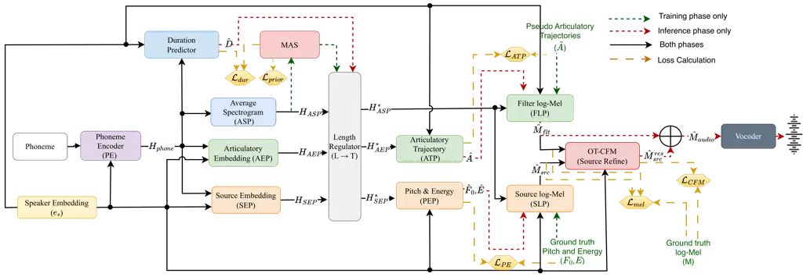

# Articulatory Source-Filter TTS: Physically Grounded Control through Vocal Tract Kinematics

Jesuraj Bandekar    Shinji Watanabe    and Prasanta Kumar Ghosh
^(†)^(†)thanks: Jesuraj Bandekar and Prasanta Kumar Ghosh are with the
SPIRE Lab, Department of Electrical Engineering, Indian Institute of
Science (IISc), Bangalore 560012, India (e-mail:
jesurajbandekar@gmail.com; prasantg@iisc.ac.in).^(†)^(†)thanks: Shinji
Watanabe is with the Language Technologies Institute, Carnegie Mellon
University, Pittsburgh, PA 15213, USA (e-mail: shinjiw@ieee.org).

###### Abstract

Modern neural text-to-speech (TTS) systems achieve remarkable acoustic
fidelity but operate as opaque black boxes, offering limited
interpretable control over the physical speech production process. While
some models allow prosodic manipulation, explicit control over the vocal
tract filter remains largely inaccessible. In this paper, we propose a
novel, controllable source-filter TTS architecture that grounds the
synthesis process in physical articulatory kinematics. Our approach
utilises an Acoustic-to-Articulatory Inversion (AAI) model, enhanced by
large-scale pretrained representations, to generate kinematic
pseudo-trajectories for a large TTS corpus. These trajectories
explicitly condition the filter response, while predicted pitch and
energy contours parameterise the glottal source. The source and filter
are predicted independently, and the source is refined by an Optimal
Transport Conditional Flow Matching (OT-CFM) module before recombination
with the filter to form the final spectrogram. Experimental results
demonstrate that our model achieves intelligibility and naturalness
competitive with similarly sized baselines, incurring only a modest
spectral fidelity cost from constraining the output to an explicit
source-filter decomposition, in exchange for control unavailable to
black-box systems. Furthermore, quantitative and qualitative evaluations
reveal explicit source-filter disentanglement, allowing for stable
prosodic scaling and cross-speaker source/filter recombination. In this
recombination, prosodic source attributes, notably F0, remain tied to
the source speaker while vocal-tract spectral characteristics
consistently follow the filter speaker. Finally, we demonstrate that the
model enables explicit, fine-grained articulatory control, such as
accent modification through direct spatial manipulation of articulatory
trajectories, offering a new direction for interpretable speech
synthesis. Audio samples are available at
https://coding-phoenix-12.github.io/ArticulatorySFTTS/.

###### Index Terms: 

Text-to-speech, source-filter model, acoustic-to-articulatory inversion,
articulatory kinematics, interpretable speech synthesis.

## I Introduction

Modern text-to-speech (TTS) systems generate audio of very high
naturalness and acoustic quality. Recent methods based on flow-matching,
neural audio codecs, and Large Language Models (LLMs) \[1, 2, 3\] use
large architectures and vast training data to produce zero-shot
synthesis that is nearly indistinguishable from natural human speech.
This progress, however, comes at the cost of interpretability, as these
systems function largely as black boxes. Despite their strong
performance, they offer little control or insight for downstream tasks
such as dialect understanding, accent modification, voice conversion,
and clinical and pathological speech modelling, all of which require
fine-grained, disentangled control. Such applications benefit from
physically interpretable control: an articulatory handle on the vocal
tract allows dialectal variation to be edited in gesture space,
vocal-tract identity to be separated from prosody, and atypical
articulation to be probed in physical terms, none of which is accessible
in a black-box latent space.

As summarised in Table I, recent controllable models expose prosodic
attributes such as pitch and energy \[4, 5, 6\], and source–filter
approaches go further by separating source and filter spectrograms \[7,
8\], yet none provides an explicit, physically grounded handle on the
vocal tract response, nor any connection to well-established speech
production theory. In this work, we argue that recovering physically
grounded control while preserving high-quality synthesis requires a
glottal-source and articulation-based decomposition, which would in turn
enable explicit physical control.

The source–filter model of speech production \[9\] provides the
theoretical foundation for this decomposition, separating speech into a
glottal source that carries pitch and energy, and a vocal-tract filter
that shapes the final spectral output. Early formant synthesisers \[10\]
modelled both explicitly, yielding fully interpretable but mechanical
speech, and more recent physical synthesisers such as
VocalTractLab \[11, 12\] improve quality but remain driven by
hand-designed gestures or recorded audio rather than text. Subsequent
neural approaches \[13, 14, 15, 16, 17, 18, 19\] abandoned this physical
grounding in favour of acoustic fidelity, mapping text directly to
acoustics through opaque latent representations (Table I).

While some systems expose pitch and energy to control the glottal source
(Table I), the vocal tract filter lacks a comparable physical
parameterisation in TTS. Real-time MRI (rtMRI) \[20, 21\] captures full
articulatory data for synthesis \[22, 23\], but its high cost and
acoustic reverberation make it a poor training target, whereas
Electromagnetic Articulography (EMA) offers a tractable alternative.
Because EMA corpora are small, extensive work has leveraged
Self-Supervised Learning (SSL) representations and auxiliary-task
pretraining to build robust Acoustic-to-Articulatory Inversion (AAI)
models \[24, 25, 26, 27\], though their pseudo-targets are mostly
applied in speech-to-speech resynthesis or coding frameworks \[28, 29\].
We instead integrate articulatory trajectories into a TTS architecture,
explicitly grounding the filter of a source-filter decomposition in the
physical kinematics of the vocal tract.

Building on this, we propose a controllable source-filter TTS
architecture whose filter is grounded in AAI-supervised articulatory
trajectories, with the following contributions:

1.  1.  A controllable source–filter TTS architecture in which the filter is
        conditioned on predicted articulatory trajectories, providing, to
        our knowledge, the first text-driven TTS with physically grounded,
        kinematic-level control over the vocal-tract response.
2.  2.  A two-stage AAI-based pseudo-labelling pipeline using multilingual
        speech-model features that scales articulatory supervision from a
        small EMA corpus to hundreds of hours of unpaired TTS speech.
3.  3.  Competitive synthesis quality, showing that the explicit
        source–filter decomposition retains intelligibility and naturalness
        competitive with comparably-sized baselines at only a modest
        spectral-fidelity cost.
4.  4.  Quantitative source–filter disentanglement through (a) pitch/energy
        scaling, where filter-side properties (formants, spectral envelope)
        remain stable under source perturbation, and (b) cross-speaker
        swapping, where pitch stays tied to the source speaker while
        spectral characteristics follow the filter speaker.
5.  5.  Qualitative physical interpretability through articulatory–acoustic
        analyses, including articulator decoupling across minimal pairs and
        recovery of the canonical American rhotic posture in post-vocalic
        /r/.
6.  6.  Interpretable accent modification, converting a rhotic American /r/
        to its non-rhotic realisation by flattening the tongue-tip and
        tongue-body gestures, with the corresponding $`F3`$ shift in the
        synthesised audio control unavailable in black-box neural TTS.

The remainder of the paper covers related work (Section II), the
proposed methodology including the AAI backend and TTS architecture
(Section III), the experimental setup (Section IV), the evaluation
framework (Section V), and results with analysis (Section VI).

|                                   |          |              |          |
| --------------------------------- | -------- | ------------ | -------- |
| Model                             | Input    | Interp.      | Control  |
| Black-box neural TTS              |          |              |          |
| Tacotron \[15\]                   | Text     | –            | –        |
| FastSpeech \[16\]                 | Text     | –            | –        |
| Glow-TTS \[17\]                   | Text     | –            | –        |
| VITS \[18\]                       | Text     | –            | –        |
| VALL-E \[19\]                     | Text     | –            | –        |
| StyleTTS2 \[4\]                   | Text     | P, E         | P, E     |
| HierSpeech++ \[5\]                | Text     | P            | P        |
| NaturalSpeech 3 \[6\]             | Text     | AC           | P, T     |
| Source–filter TTS                 |          |              |          |
| FastPitch \[30\]                  | Text     | P, E         | P, E     |
| FastSpeech 2 \[31\]               | Text     | P, E         | P, E     |
| FastPitchFormant \[7\]            | Text     | SF, P        | P        |
| StableForm-TTS \[8\]              | Text     | SF, P, E     | P, E     |
| Physical / articulatory synthesis |          |              |          |
| VocalTractLab \[11\]              | Gestures | VT           | AG       |
| ACS \[12\]                        | Audio    | VT           | AG       |
| Proposed                          | Text     | P, E, AT, SF | P, E, AT |

P: pitch; E: energy; AT: articulatory trajectories; SF: source/filter
spectrograms; VT: vocal-tract geometry/parameters; AG: articulatory
gestures; AC: attribute codes; T: timbre.

TABLE I: Comparison of representative speech synthesis approaches by
input modality, exposed interpretable representations, and controllable
aspects. Only the proposed model is text-driven with an explicit
source/filter decomposition and articulatory filter control. Legend
below the table.



Fig. 1: Overview of the proposed controllable source-filter TTS
architecture. Solid lines denote data flow active during both training
and inference. Green dashed lines indicate paths exclusive to the
training phase (e.g., MAS alignment, AAI pseudo-target supervision),
while red dashed lines represent the inference-only generative paths.
Optimisation pathways for the multi-task objective are highlighted in
yellow.

## II Background and Related Work

### II-A Flow Matching based TTS

Flow Matching (FM) considers a prior noise distribution
$`x_{0}\sim q_{0}`$ (typically a standard Gaussian) and a target data
distribution $`x_{1}\sim p_{\text{data}}`$, learning a time-dependent
neural vector field that transports samples from $`q_{0}`$ to
$`p_{\text{data}}`$ over $`\tau\in[0,1]`$. Since marginalising over the
full data distribution is intractable, Conditional Flow Matching (CFM)
conditions the vector field on individual samples $`x_{1}`$. Optimal
Transport CFM (OT-CFM) further constrains the conditional path between
noise and data to a deterministic straight line,
$`\phi_{\tau}(x)=(1-\tau)x_{0}+\tau x_{1}`$, yielding a constant
conditional vector field $`u_{\tau}(x\mid x_{1})=x_{1}-x_{0}`$ (see
\[32\] for the full derivation). For conditional generative tasks such
as TTS, the neural vector field is further conditioned on auxiliary
variables $`c`$ (e.g., linguistic features, prosodic cues, or
articulatory representations). The resulting training objective is

```math
\mathcal{L}_{\text{OT-CFM}}(\theta)=\mathbb{E}_{\tau,x_{0},x_{1}}\!\left[\,\|(x_{1}-x_{0})-v_{\tau}(\phi_{\tau}(x);\theta,c)\|^{2}\,\right]. \tag{1}
```

where $`v_{\tau}`$ is the neural vector field and $`\theta`$ the
learnable parameters.

Models such as Matcha-TTS \[33\], Voicebox \[34\], and P-Flow \[35\]
apply this framework to TTS, mapping prior noise to acoustic features
(typically Mel-spectrograms) conditioned on linguistic encodings,
durations, and speaker embeddings, achieving strong zero-shot
naturalness with simulation-free training.

### II-B Controllable and Interpretable Source-Filter TTS

Beyond black-box mapping, several architectures expose source-filter
attributes for interpretable control. Early non-autoregressive models
such as FastPitch \[30\] and FastSpeech 2 \[31\] introduced explicit
pitch and energy predictors. More recent systems \[36, 5, 37\] combine
these with style or prosodic embeddings for finer control. A
complementary direction generates source and filter spectrograms
separately and combines them. FastPitchFormant \[7\] couples a
pitch-driven excitation generator with a formant generator, and \[8\]
extends this with a diffusion-based source decoder and energy
prediction. While these approaches provide interpretable control over
source attributes, they treat the filter as an abstract spectral object
with no physical correspondence to the articulators.

### II-C Acoustic-to-Articulatory Inversion and Articulatory Speech Synthesis

Acoustic-to-articulatory inversion (AAI) is the task of estimating the
physical movements of the vocal tract articulators from a recorded
speech signal. This data of the articulator movement is collected using
an Electromagnetic Articulograph (EMA). While AAI solves the inverse
problem of uncovering physical states from acoustics, Articulatory
Speech Synthesis or forward mapping, focuses on the generation of
high-fidelity speech directly from these articulatory trajectories. Both
these allow for a comprehensive modelling of the relationship between
vocal tract biomechanics and the resulting acoustic output.

Deep learning-based methods for AAI include Convolutional Neural
Networks (CNN), Recurrent Neural Networks (RNN) based
sequence-to-sequence modeling \[24, 38, 39\], and Transformer-based
networks \[25, 40, 41\]. These models use audio representations, such as
spectrograms and Mel-frequency cepstral coefficients (MFCCs), to predict
EMA trajectories. However, the scarcity of EMA data poses a considerable
bottleneck for achieving high-level performance, especially for unseen
speakers. To tackle this, recent methods such as utilising
self-supervised learning (SSL) representations instead of standard audio
features \[42, 43, 26, 44, 45\] and employing auxiliary task pretraining
\[27\] have been shown to significantly improve performance. Notably,
SSL representations have been shown to implicitly encode articulatory
information \[44, 45\], which contributes to their strong AAI
performance.

Similar models have been explored for articulatory speech synthesis.
\[46, 47, 48\] use phoneme-based losses, multimodal training, and
GAN-based architectures, while \[49\] achieves highly efficient
synthesis using differentiable digital signal processing (DDSP).
Additionally, \[28\] and \[29\] use articulatory trajectories as
intermediate controls for pronunciation modification and voice
conversion, respectively.

## III Proposed Methodology

We use a two-stage setup. First, an AAI model is trained on parallel
EMA-speech data to map acoustics to the physical kinematics of the
vocal-tract articulators (the lips, jaw, and tongue), later detailed as
12-channel midsagittal trajectories in Section IV-A1. Second, it
generates articulatory pseudo-trajectories over a large TTS corpus,
which then serve as ground truth to train our source-filter
explicit-control TTS model.

### III-A Articulatory Pseudo-Target Generation via AAI

For the AAI model, we adopt the Transformer-based architecture of
\[25\]. Recent literature has extensively demonstrated that utilising
representations from large-scale pretrained models significantly
enhances AAI performance. We extract acoustic features using the
massively multilingual MMS-1B model \[50\]. Because this model is
pre-trained on over a thousand languages, it encapsulates vast phonetic
variability, which has been shown to substantially improve inversion
performance, particularly in cross-lingual scenarios \[26\].

Furthermore, acoustic and phonetic properties are distributed
heterogeneously across the depth of large pre-trained speech models
\[51\]. Therefore, rather than relying on a single hidden state, we
extract representations from three distinct depths of the MMS-1B model,
specifically layers 6, 24, and 36. These extracted states are
concatenated along the feature dimension to form the final composite
acoustic input. Given a 16 kHz audio input, the MMS-1B model yields
feature frames at a rate of 50 Hz.

Given an input acoustic feature sequence,
$`\mathbf{M}=[\mathbf{m}_{1},\dots,\mathbf{m}_{T}]`$ with
$`\mathbf{m}_{t}\in\mathbb{R}^{D}`$ the $`D`$-dimensional composite MMS
feature, and the corresponding ground-truth articulatory trajectories
$`\mathbf{A}=[\mathbf{a}_{1},\dots,\mathbf{a}_{T}]`$, with
$`\mathbf{a}_{t}\in\mathbb{R}^{K}`$ the $`K`$-dimensional articulatory
frame, both of frame length $`T`$ (so that
$`\mathbf{M}\in\mathbb{R}^{D\times T}`$ and
$`\mathbf{A}\in\mathbb{R}^{K\times T}`$), the estimated kinematic
sequence is predicted as

```math
\tilde{\mathbf{A}}=\mathcal{F}_{\text{AAI}}(\mathbf{M}) \tag{2}
```

where $`\mathcal{F}_{\text{AAI}}`$ denotes the AAI model, and
$`\tilde{\mathbf{A}}=[\tilde{\mathbf{a}}_{1},\dots,\tilde{\mathbf{a}}_{T}]`$
represents the generated pseudo-trajectories. These pseudo-trajectories
subsequently serve as the supervisory training targets for the
Articulatory Trajectory Predictor (ATP), which we detail in III-B.

The model $`\mathcal{F}_{\text{AAI}}`$ is optimised using two losses.
First, the absolute positional error is measured using the Mean Squared
Error (MSE) loss, averaged over all $`T`$ frames and $`K`$ channels:

```math
\mathcal{L}_{\text{MSE}}=\frac{1}{TK}\sum_{t=1}^{T}\sum_{k=1}^{K}\left(a_{t,k}-\tilde{a}_{t,k}\right)^{2} \tag{3}
```

where $`a_{t,k}`$ and $`\tilde{a}_{t,k}`$ represent the ground-truth and
predicted values of the $`k`$-th articulator at time step $`t`$,
respectively.

Second, to capture the shape and dynamic movement of the articulators
over time, a Pearson Correlation Coefficient (PCC) loss is used. For two
length-$`T`$ sequences $`\mathbf{u},\mathbf{v}\in\mathbb{R}^{T}`$ with
temporal means $`\bar{u},\bar{v}`$, the Pearson correlation is

```math
\rho(\mathbf{u},\mathbf{v})=\frac{\sum_{t=1}^{T}(u_{t}-\bar{u})(v_{t}-\bar{v})}{\sqrt{\sum_{t=1}^{T}(u_{t}-\bar{u})^{2}\;\sum_{t=1}^{T}(v_{t}-\bar{v})^{2}}}. \tag{4}
```

The PCC loss averages $`1-\rho`$ over the $`K`$ articulator channels:

```math
\mathcal{L}_{\text{PCC}}=\frac{1}{K}\sum_{k=1}^{K}\bigl(1-\rho(\mathbf{a}_{k},\tilde{\mathbf{a}}_{k})\bigr), \tag{5}
```

where $`\mathbf{a}_{k},\tilde{\mathbf{a}}_{k}\in\mathbb{R}^{T}`$ are the
ground-truth and predicted trajectories of channel $`k`$.

The final training objective for the AAI model is computed as the direct
sum of the two penalty terms:

```math
\mathcal{L}_{\text{AAI}}=\mathcal{L}_{\text{MSE}}+\mathcal{L}_{\text{PCC}} \tag{6}
```

Once training is done, we use this model to generate pseudo-trajectories
for the target TTS dataset.

### III-B Controllable Source-Filter TTS Architecture

To realise the explicit source-filter-based disentanglement of the
speech signal, our core Text-to-Speech (TTS) architecture builds upon
the structural foundations of the FastPitchFormant framework \[7\] and
\[8\]. Throughout, $`\hat{(\cdot)}`$ denotes a prediction, un-hatted
symbols denote ground truth, $`\tilde{(\cdot)}`$ an AAI pseudo-target
from Section III-A, and $`*`$ a length-regulated sequence upsampled to
$`T`$.
$`\mathbf{M}^{\text{res}}_{\text{src}}=\mathbf{M}-\hat{\mathbf{M}}_{\text{flt}}`$
is the residual source target for OT-CFM training which is employed in
Section III-B3.

The model relies on a pre-trained speaker embedding module that extracts
a global speaker vector,
$`\mathbf{e}_{s}\in\mathbb{R}^{d_{\text{spk}}}`$, per utterance where
$`d_{\text{spk}}`$ denotes the dimension of the speaker embedding
vector. This embedding is explicitly injected into every subsequent
block to provide consistent speaker (Fig. 1). The speaker embedding is
injected into every block rather than only at the input so that speaker
identity conditions each stage consistently. This is essential for the
cross-speaker routing experiments, where source and filter blocks must
be driven by different speaker embeddings independently

#### III-B1 Linguistic Encoding and Length Regulation

Given an input phoneme sequence $`\mathbf{P}=[p_{1},\dots,p_{L}]`$ of
length $`L`$, where each $`p_{i}`$ denotes a phoneme token, the Phoneme
Encoder (PE) (Fig. 1), parameterised by learnable weights
$`\theta_{\text{PE}}`$, predicts the linguistic hidden representation
sequence,
$`\mathbf{H}_{\text{phone}}\in\mathbb{R}^{d_{\text{hidden}}\times L}`$,
as:

```math
\mathbf{H}_{\text{phone}}=\mathcal{F}_{\theta_{\text{PE}}}(\mathbf{P},\mathbf{e}_{s}) \tag{7}
```

where $`d_{\text{hidden}}`$ is the dimension of the encoder’s hidden
state. This phoneme representation is subsequently projected into three
distinct intermediate representation streams: the Articulatory Embedding
Predictor (AEP), the Source Embedding Predictor (SEP), and the Average
Spectrogram Projection (ASP) (all shown in Fig. 1), parameterised by
learnable weights $`\theta_{\text{AEP}}`$, $`\theta_{\text{SEP}}`$, and
$`\theta_{\text{ASP}}`$, resulting in the sequences
$`\mathbf{H}_{\text{AEP}},\mathbf{H}_{\text{SEP}}\in\mathbb{R}^{d_{\text{hidden}}\times L}`$,
and $`\mathbf{H}_{\text{ASP}}\in\mathbb{R}^{d_{\text{mel}}\times L}`$,
respectively:

```math
\mathbf{H}_{\text{AEP}}=\mathcal{F}_{\theta_{\text{AEP}}}(\mathbf{H}_{\text{phone}},\mathbf{e}_{s}) \tag{8}
```

```math
\mathbf{H}_{\text{SEP}}=\mathcal{F}_{\theta_{\text{SEP}}}(\mathbf{H}_{\text{phone}},\mathbf{e}_{s}) \tag{9}
```

```math
\mathbf{H}_{\text{ASP}}=\mathcal{F}_{\theta_{\text{ASP}}}(\mathbf{H}_{\text{phone}},\mathbf{e}_{s}) \tag{10}
```

We project into three separate streams rather than a shared
representation so that the source and filter can be predicted
independently for the explicit disentanglement. This branch structure
follows the decomposed design of FastPitchFormant \[7\]. To resolve the
length mismatch between the linguistic representations of length $`L`$
and the acoustic frames of length $`T`$, the $`\mathbf{H}_{\text{ASP}}`$
sequence is utilized along with the Monotonic Alignment Search (MAS)
\[17\] (the Length Regulator in Fig. 1) to quickly learn to align the
linguistic representation with the output frames by using the prior loss
($`\mathcal{L}_{\text{prior}}`$), defined as the negative log-likelihood
of the acoustic features given the text prior under the optimal MAS
alignment. We route the coarse average spectrogram stream (rather than
the source or filter-specific streams) into alignment so that a single,
decomposition-agnostic target provides a stable monotonic prior \[17\].
Using these extracted alignments, we obtain the phoneme durations
$`\mathbf{D}=[d_{1},\dots,d_{L}]\in\mathbb{Z}_{\geq 0}^{L}`$ which we
use as ground truth to train the Duration Predictor network (Fig. 1),
parameterised by learnable weights $`\theta_{\text{dur}}`$, which
estimates the predicted durations $`\hat{\mathbf{D}}`$, and is optimised
using a logarithmic Mean Squared Error (MSE) loss.

```math
\hat{\mathbf{D}}=\mathcal{F}_{\theta_{\text{dur}}}(\mathbf{H}_{\text{phone}},\mathbf{e}_{s}) \tag{11}
```

```math
\mathcal{L}_{\text{dur}}=\frac{1}{L}\sum_{i=1}^{L}\left(\log d_{i}-\log\hat{d}_{i}\right)^{2} \tag{12}
```

The ground-truth durations $`\mathbf{D}`$ are then used to expand
$`\mathbf{H}_{\text{AEP}}`$, $`\mathbf{H}_{\text{SEP}}`$, and
$`\mathbf{H}_{\text{ASP}}`$ via discrete frame replication to match the
target frame length $`T`$, resulting in the upsampled sequences
$`\mathbf{H}^{*}_{\text{AEP}},\mathbf{H}^{*}_{\text{SEP}}\in\mathbb{R}^{d_{\text{hidden}}\times T}`$
and
$`\mathbf{H}^{*}_{\text{ASP}}\in\mathbb{R}^{d_{\text{mel}}\times T}`$

#### III-B2 Source and Filter Prediction

Following length regulation, the upsampled sequences are routed to their
respective physical predictors. The Pitch and Energy Predictor
(PEP) (Fig. 1), parameterised by learnable weights
$`\theta_{\text{PEP}}`$, estimates the fundamental frequency
($`\hat{\mathbf{F}}_{0}\in\mathbb{R}^{T}`$) and energy
($`\hat{\mathbf{E}}\in\mathbb{R}^{T}`$) contours:

```math
[\hat{\mathbf{F}}_{0},\hat{\mathbf{E}}]=\mathcal{F}_{\theta_{\text{PEP}}}(\mathbf{H}^{*}_{\text{SEP}},\mathbf{e}_{s}) \tag{13}
```

Predicting pitch and energy explicitly exposes the glottal source as a
directly controllable signal \[30, 31\]. The PEP is supervised against
the ground-truth pitch ($`\mathbf{F}_{0}\in\mathbb{R}^{T}`$) and energy
($`\mathbf{E}\in\mathbb{R}^{T}`$) using a combined MSE and Pearson
Correlation Coefficient (PCC) objective:

```math
\displaystyle\mathcal{L}_{\text{PE}} \displaystyle=\frac{1}{T}\left(\|\mathbf{F}_{0}-\hat{\mathbf{F}}_{0}\|_{2}^{2}+\|\mathbf{E}-\hat{\mathbf{E}}\|_{2}^{2}\right) \tag{14}
```

```math
\displaystyle+\Big(2-\rho(\mathbf{F}_{0},\hat{\mathbf{F}}_{0})-\rho(\mathbf{E},\hat{\mathbf{E}})\Big)
```

where $`\rho(\cdot,\cdot)`$ denotes the Pearson Correlation Coefficient
computed over the sequence length $`T`$ established in Eq. (4).

Concurrently, the Articulatory Trajectory Predictor (ATP) (Fig. 1),
parameterised by learnable weights $`\theta_{\text{ATP}}`$, processes
$`\mathbf{H}^{*}_{\text{AEP}}`$ to estimate the continuous kinematic
sequence

```math
\hat{\mathbf{A}}=\mathcal{F}_{\theta_{\text{ATP}}}(\mathbf{H}^{*}_{\text{AEP}},\mathbf{e}_{s}) \tag{15}
```

These predicted trajectories are subsequently supervised against the
pseudo-articulatory targets $`\tilde{\mathbf{A}}`$, which are derived
using the AAI model in Section III-A (Eq. 2). Mirroring the PEP
objective, we apply the combined MSE loss (Eq. 3) and PCC loss (Eq. 5)
established in III-A:

```math
\mathcal{L}_{\text{ATP}}=\frac{1}{T}\|\tilde{\mathbf{A}}-\hat{\mathbf{A}}\|_{F}^{2}+\Big(1-\rho(\tilde{\mathbf{A}},\hat{\mathbf{A}})\Big) \tag{16}
```

The explicit source-filter disentanglement is achieved during the
log-Mel spectrogram generation phase. During training, the Source
log-Mel Predictor (SLP) (Fig. 1), parameterised by learnable weights
$`\theta_{\text{SLP}}`$, utilises the ground-truth pitch and energy to
predict the glottal excitation log-Mel spectrogram,
$`\hat{\mathbf{M}}_{\text{src}}\in\mathbb{R}^{T\times{d_{\text{mel}}}}`$:

```math
\hat{\mathbf{M}}_{\text{src}}=\mathcal{F}_{\theta_{\text{SLP}}}(\mathbf{F}_{0},\mathbf{E},\mathbf{H}^{*}_{\text{ASP}},\mathbf{e}_{s}) \tag{17}
```

The SLP is conditioned on the ground-truth pitch and energy so that the
source spectrogram is explicitly tied to the controllable prosodic
contours, while the shared average-spectrogram stream
$`\mathbf{H}^{*}_{\text{ASP}}`$ supplies the linguistic context needed
to render a coherent excitation. Conversely, the Filter log-Mel
Predictor (FLP) (Fig. 1), parameterised by learnable weights
$`\theta_{\text{FLP}}`$, models the impulse response of the vocal tract
by utilising the AAI-generated pseudo-articulatory trajectories to
predict the filter spectrogram,
$`\hat{\mathbf{M}}_{\text{flt}}\in\mathbb{R}^{T\times d_{\text{mel}}}`$:

```math
\hat{\mathbf{M}}_{\text{flt}}=\mathcal{F}_{\theta_{\text{FLP}}}(\tilde{\mathbf{A}},\mathbf{H}^{*}_{\text{ASP}},\mathbf{e}_{s}) \tag{18}
```

The FLP receives the articulatory trajectories, but not the pitch or
energy contours. Withholding the source attributes biases the filter to
depend only on vocal-tract kinematics, structurally encouraging the
source-filter separation. Since the Source log-Mel Predictor (SLP) and
Filter log-Mel Predictor (FLP) are explicitly driven by their respective
decoupled physical components, pitch and energy for the source, and
articulatory trajectories for the filter, they independently estimate
the isolated source and filter log-Mel spectrograms. Because
multiplication in the linear amplitude domain corresponds to addition in
the logarithmic domain, the final synthesised audio log-Mel spectrogram
$`\hat{\mathbf{M}}_{\text{audio}}\in\mathbb{R}^{T\times d_{\text{mel}}}`$
is computed as the direct sum of the source and filter components:

```math
\hat{\mathbf{M}}_{\text{audio}}=\hat{\mathbf{M}}_{\text{src}}+\hat{\mathbf{M}}_{\text{flt}} \tag{19}
```

This combined prediction is optimised against the ground-truth audio
log-Mel spectrogram $`\mathbf{M}\in\mathbb{R}^{T\times d_{\text{mel}}}`$
using an MSE loss:

```math
\mathcal{L}_{\text{mel}}=\frac{1}{T}\|\mathbf{M}-\hat{\mathbf{M}}_{\text{audio}}\|_{F}^{2} \tag{20}
```

#### III-B3 Source Refinement via OT-CFM

Recent work \[8\], has demonstrated that explicitly improving the source
excitation component is critical for achieving higher-quality
synthesised audio compared to the baseline \[7\]. Motivated by this, to
further refine the spectral resolution and temporal dynamics of the
glottal excitation, we integrate an Optimal Transport Conditional Flow
Matching (OT-CFM) module (Fig. 1). The MSE-trained source predictor
tends to produce over-smoothed spectra. The OT-CFM module restores fine
spectral and temporal detail by learning a generative refinement of the
source excitation \[32, 33\]. To isolate the target source
representation for CFM training, we subtract the predicted filter
response from the ground-truth audio spectrogram to obtain
$`\mathbf{M}^{\text{res}}_{\text{src}}=\mathbf{M}-\hat{\mathbf{M}}_{\text{flt}}`$.

Let $`\mathbf{x}_{1}=\mathbf{M}^{\text{res}}_{\text{src}}`$ denote the
target data sample, and
$`\mathbf{x}_{0}\sim\mathcal{N}(\mathbf{0},\mathbf{I})`$ denote a sample
from the prior noise distribution. We define the aggregated conditioning
vector as
$`\mathbf{c}=[\hat{\mathbf{M}}_{\text{src}};\hat{\mathbf{M}}_{\text{flt}};\mathbf{e}_{s}]`$.
The refinement network is conditioned on the predicted components
($`\hat{\mathbf{M}}_{\text{src}},\hat{\mathbf{M}}_{\text{flt}}`$) so
that it refines the source consistently with the already-predicted
filter and content rather than in isolation, $`\mathbf{e}_{s}`$
preserves speaker identity through the generative step. The OT-CFM
module learns to predict the optimal vector field mapping the noise to
the target over a continuous time step $`\tau\in[0,1]`$. The flow
matching loss is formulated as a regression against the target vector
field $`(\mathbf{x}_{1}-\mathbf{x}_{0})`$:

```math
\mathcal{L}_{\text{CFM}}=\mathbb{E}_{\tau\sim\mathcal{U}(0,1),\mathbf{x}_{0},\mathbf{x}_{1}}\left[\left\|\mathcal{F}_{\theta_{\text{CFM}}}(\mathbf{x}_{\tau},\tau,\mathbf{c})-(\mathbf{x}_{1}-\mathbf{x}_{0})\right\|_{2}^{2}\right] \tag{21}
```

where $`\mathcal{F}_{\theta_{\text{CFM}}}`$ is the flow-prediction
network with learnable parameters $`\theta_{\text{CFM}}`$, and
$`\mathbf{x}_{\tau}=\tau\mathbf{x}_{1}+(1-\tau)\mathbf{x}_{0}`$
represents the interpolated state at time $`\tau`$.

#### III-B4 Training Objective and Inference

The entire controllable TTS architecture is optimised end-to-end. The
final multi-task training objective is formulated as the direct sum of
all individual component penalties:

```math
\mathcal{L}_{\text{total}}=\mathcal{L}_{\text{dur}}+\mathcal{L}_{\text{prior}}+\mathcal{L}_{\text{PE}}+\mathcal{L}_{\text{ATP}}+\mathcal{L}_{\text{mel}}+\mathcal{L}_{\text{CFM}} \tag{22}
```

where $`\mathcal{L}_{\text{dur}}`$, $`\mathcal{L}_{\text{PE}}`$,
$`\mathcal{L}_{\text{ATP}}`$, $`\mathcal{L}_{\text{mel}}`$, and
$`\mathcal{L}_{\text{CFM}}`$ are defined in Eqs. (12), (14), (16), (20),
and (21), respectively, and $`\mathcal{L}_{\text{prior}}`$ is the MAS
alignment prior loss \[17\] introduced earlier in III-B1.

At inference, ground-truth acoustic and articulatory targets are
unavailable, so the model operates entirely in prediction mode (the red
dashed inference-only paths in Fig. 1). The intermediate linguistic
representations are upsampled using the predicted durations
$`\hat{\mathbf{D}}`$ from Eq. (11). The vocal tract filter response
$`\hat{\mathbf{M}}_{\text{flt}}`$ (Eq. (18)) is generated by the FLP
conditioned exclusively on the predicted articulatory kinematics
$`\hat{\mathbf{A}}`$ from Eq. (15), in place of the pseudo-targets
$`\tilde{\mathbf{A}}`$ used during training. Correspondingly, the source
path is driven by the predicted pitch and energy contours
$`\hat{\mathbf{F}}_{0}`$ and $`\hat{\mathbf{E}}`$ from Eq. (13), in
place of the ground-truth contours used during training. To reconstruct
the glottal excitation, the OT-CFM module samples prior noise
$`\mathbf{x}_{0}\sim\mathcal{N}(\mathbf{0},\mathbf{I})`$ and solves the
learned Ordinary Differential Equation (ODE) using an Euler solver,
conditioned on the aggregated vector $`\mathbf{c}`$ defined in Eq. (21),
to generate the refined source spectrogram
$`\hat{\mathbf{M}}^{\text{res}}_{\text{src}}`$. Finally, mirroring the
training-phase combination in Eq. (19), the synthesised audio log-Mel
spectrogram is obtained via element-wise addition of the two predicted
components (the $`\oplus`$ node in Fig. 1):

```math
\hat{\mathbf{M}}_{\text{audio}}=\hat{\mathbf{M}}^{\text{res}}_{\text{src}}+\hat{\mathbf{M}}_{\text{flt}} \tag{23}
```

This combined spectrogram is subsequently passed to a pre-trained
vocoder for final waveform reconstruction.

Overall, the conditioning is asymmetric by design: source-side blocks
receive prosodic attributes and filter-side blocks receive articulatory
attributes, with only the speaker embedding and a shared linguistic
context common to both. This routing encourages the source-filter
separation evaluated in Section VI-E, and we found it to yield stable
training and strong synthesis quality in practice.

## IV Experimental Setup

This section details the experimental setup, including the datasets,
model architecture, training parameters, and the baseline models used
for comparison.

### IV-A Datasets

#### IV-A1 AAI

To ensure the model generalises across diverse phonetic profiles,
speaking styles, and languages, we utilise a combination of six distinct
Electromagnetic Articulography (EMA) datasets. All datasets provide
synchronised acoustic waveforms and 12-channel kinematic trajectories,
capturing the 2D midsagittal coordinates ($`x,y`$) of six key
articulators: Upper Lip (UL), Lower Lip (LL), Jaw (JAW), Tongue Tip
(TT), Tongue Body (TB), and Tongue Dorsum (TD). A comprehensive
breakdown of the training corpus, including language demographics,
speaker counts, and subset durations, is detailed in Table II.

To assess generalisation, we construct two test sets exclusively from
the HPRC dataset: one for intra-speaker performance (seen speakers,
unseen utterances) and another for zero-shot inter-speaker evaluation
(held-out speakers). Restricting this to HPRC isolates American English,
aligning the AAI evaluation with the target dialect of our downstream
TTS architecture.

|                  |                             |       |         |                                      |
| ---------------- | --------------------------- | ----- | ------- | ------------------------------------ |
| Dataset          | Language (Accent)           | Spks. | Dur.    | Description                          |
| SpireEMA \[46\]  | English (Indian)            | 32    | 9h 28m  | 460 MOCHA-TIMIT sentences.           |
| EMA-MAE \[52\]   | English (American/Mandarin) | 37    | 17h 34m | L1 American & L2 Mandarin.           |
| HPRC \[53\]      | English (American)          | 6     | 5h 34m  | Kinematics of speech rate variation. |
| USC-TIMIT \[54\] | English (American)          | 2     | 1h 29m  | Synchronous core TIMIT sentences.    |
| MSPKA \[55\]     | Italian (Italian)           | 2     | 1h 31m  | Hyperarticulated read speech.        |
| DKU \[56\]       | Cantonese & Mandarin        | 7     | 0h 18m  | Native cross-linguistic kinematics.  |
| Total            |                             | 86    | 35h 55m |                                      |

TABLE II: Datasets used for training the AAI model. L1 and L2 denote
first (native) and second language, respectively.

#### IV-A2 TTS

For the downstream controllable Text-to-Speech (TTS) framework we use
the LibriTTS corpus. Training is conducted using the train-clean-460
subset. All audio signals are resampled to a uniform sampling rate of
22.05 kHz.To establish the ground-truth acoustic targets for the model,
we compute 80-band log Mel-spectrograms ($`d_{\text{mel}}=80`$) as done
in \[33\] with a hop length of 256 and a window length of 1024. The
fundamental frequency ($`F_{0}`$) and energy contours are extracted
using the PyWORLD vocoder toolkit ¹¹ 1
https://github.com/JeremyCCHsu/Python-Wrapper-for-World-Vocoder,
specifically configured with a matching 256-sample hop length to ensure
temporal synchronisation with the Mel-spectrogram acoustic frames.

For objective evaluation, we report results on the LibriTTS test-clean
and test-other subsets. Furthermore, to validate the source-filter-based
controllability of the proposed architecture, we utilise the VCTK
dataset \[57\], leveraging parallel utterances spoken by different
speakers to demonstrate cross-speaker control.

### IV-B Model architecture and Training

#### IV-B1 AAI

The AAI backend ($`\mathcal{F}_{\text{AAI}}`$, Eq. (2)) adopts a
non-autoregressive encoder-decoder architecture, following the
configuration established in \[25\]. An initial linear projection layer
maps input features into a shared hidden dimension of 256. The core
architecture consists of an input encoder and a decoder, each comprising
four Feed-Forward Transformer (FFT) blocks that refine the acoustic
features and project them into the latent articulatory space. Each FFT
block is configured with a single attention head of dimension 32, a
convolutional kernel size of 7, a filter size of 256, and a dropout rate
of 0.1. A final linear output projection layer maps these hidden states
to the 12-channel midsagittal EMA representation. The total parameter
count is about 7.3M.

For the acoustic inputs, we investigate contextualised representations
extracted from three pre-trained speech models: TERA \[58\] as a
self-supervised baseline, MMS-SSL (the base Massively Multilingual
Speech model), and MMS-FT (the MMS model fine-tuned for ASR) \[50\]. As
the different datasets originally sampled articulatory trajectories at
varying rates, we downsample all kinematics to a unified 100 Hz. While
TERA, which has been used in previous works \[25, 27\] naturally outputs
representations at 100 Hz, the architecture of the MMS models inherently
constrains their continuous representations to a 50 Hz sampling rate due
to the cumulative stride of their convolutional front-ends. To
temporally align these 50 Hz MMS acoustic features with the 100 Hz
kinematic data, we apply a discrete frame-duplication strategy,
effectively upsampling the acoustic sequence by a factor of two.
Finally, each of the 12 kinematic channels is independently normalised
using the global mean and standard deviation computed across all
utterances within the combined AAI training set.

The model is trained using the Adam optimiser with a fixed learning rate
of $`1\times 10^{-4}`$. To prevent overfitting during the training
process, we implement early stopping monitored against the validation
loss. We restrict the maximum audio duration to 30 seconds and train the
model with a batch size of 8.

#### IV-B2 TTS

The proposed non-autoregressive encoder-decoder framework utilises a
text encoder ($`\mathcal{F}_{\theta_{\text{PE}}}`$, Eq. (7)) and
duration predictor ($`\mathcal{F}_{\theta_{\text{dur}}}`$, Eq. (11))
based on Matcha-TTS \[33\]. For consistent speaker conditioning, we use
the pre-trained speaker embedding module \[59\], following the
configuration of YourTTS \[60\]. The AEP and SEP streams
($`\mathcal{F}_{\theta_{\text{AEP}}}`$ and
$`\mathcal{F}_{\theta_{\text{SEP}}}`$, Eqs. (8) and (9)) project
linguistic representations to a 256-dimensional hidden space
($`d_{\text{hidden}}=256`$) via two sequential 1D-convolutional layers
with layer normalisation and ReLU activations. After duplicating these
embeddings to the target acoustic length $`T`$, they are routed to the
Pitch and Energy Predictor (PEP) ($`\mathcal{F}_{\theta_{\text{PEP}}}`$,
Eq. (13)) and the Articulatory Trajectory Predictor
(ATP) ($`\mathcal{F}_{\theta_{\text{ATP}}}`$, Eq. (15)). Both predictors
employ 1D-convolutional residual networks with layer normalisation,
ReLU, and dropout. To temporally align the modalities, the
pseudo-articulatory trajectories are downsampled to match the target
temporal length of the mel-spectrogram. The SLP and FLP
modules ($`\mathcal{F}_{\theta_{\text{SLP}}}`$ and
$`\mathcal{F}_{\theta_{\text{FLP}}}`$, Eqs. (17) and (18)) then process
these representations using a Transformer architecture adapted from
\[7\], consisting of two Feed-Forward Transformer (FFT) blocks. Within
these blocks, hidden states are modulated by $`\mathbf{e}_{s}`$ via
Style-Adaptive Layer Normalisation (SALN) applied after the attention
and feed-forward sub-layers.

For acoustic refinement, the OT-CFM flow-prediction
network ($`\mathcal{F}_{\theta_{\text{CFM}}}`$, Eq. (21)) employs a
conditional 1D U-Net adapted from \[33\]. To estimate the target vector
field, it processes a concatenated input comprising the interpolated
state $`\mathbf{x}_{\tau}`$, predicted source
($`\hat{\mathbf{M}}_{\text{src}}`$) and filter
($`\hat{\mathbf{M}}_{\text{flt}}`$) log-Mel spectrograms, and
$`\mathbf{e}_{s}`$. The continuous time step $`\tau`$ is encoded via
sinusoidal embeddings and dynamically injected into the U-Net. The
symmetric down/up-sampling paths use 1D residual networks with Group
Normalisation, Mish activations, snake-activated self-attention blocks,
and skip connections. A terminal 1D convolution projects these
representations to output the predicted vector field, enabling an Euler
ODE solver to iteratively transform prior noise into the high-fidelity
source spectrogram $`\hat{\mathbf{M}}^{\text{res}}_{\text{src}}`$. At
inference, the OT-CFM source is generated using a Euler ODE solver with
10 steps (NFE = 10), consistent with prior flow-matching TTS
systems \[33\], which report high-quality synthesis at comparable step
counts. This refined source is element-wise summed with the predicted
filter $`\hat{\mathbf{M}}_{\text{flt}}`$, and a pre-trained HiFi-GAN
vocoder \[61\] is employed to synthesise the final time-domain audio
waveform. The complete TTS architecture comprises approximately 33M
parameters and is trained using the Adam optimiser for 1M steps with a
batch size of 8, distributed across two 24GB GPUs.

### IV-C Baseline Models

To rigorously evaluate the proposed AAI-integrated, source-filter
architecture, we benchmark its performance against a diverse set of
models targeting both articulatory prediction and speech synthesis:

- •
  Self-Supervised AAI Baselines: To evaluate the efficacy of our
  kinematic prediction frontend, we include the TERA SSL \[58\] model as
  a baseline for Acoustic-to-Articulatory Inversion (AAI), as it has
  been used before in previous works like \[42, 27\]
- •
  End-to-End TTS: We compare against YourTTS \[60\] and XTTS \[62\],
  which represent highly robust, zero-shot capable, and widely adopted
  end-to-end architectures. These serve as the standard benchmark for
  overall speech quality and intelligibility. For both, we use the
  publicly available open-source code and pre-trained checkpoints.
- •
  Flow-Matching Models: Because our acoustic decoder utilises Optimal
  Transport Conditional Flow Matching (OT-CFM), we include Matcha-TTS
  \[33\] as a direct comparative baseline. To ensure a fair evaluation
  within our experimental framework, we adapted the standard Matcha-TTS
  architecture for multi-speaker synthesis by incorporating global
  speaker embedding conditioning used in YourTTS \[60\]. This adapted
  baseline was trained for 500,000 updates, allowing us to accurately
  evaluate the specific impact of our source-filter disentanglement
  against a rigorously matched, state-of-the-art generative backend.
- •
  Controllable and Prosodic TTS: To benchmark our model’s explicit
  prosodic controllability, we compare against StyleTTS2 \[4\] and
  HierSpeech++ \[5\]. Both models offer prosodic manipulation and style
  transfer capabilities, making them the most rigorous competitors for
  evaluating $`F_{0}`$ and energy tracking during our explicit
  manipulation experiments. For both, we use the publicly available
  open-source code and pre-trained checkpoints as well.
- •
  Vanilla Source-Filter Baseline: To isolate the contribution of
  articulatory conditioning, we include an ablation of the proposed
  architecture with the entire articulatory branch removed (the AEP,
  ATP, and Filter log-Mel Predictor’s articulatory input). The resulting
  baseline retains the source-side components (SEP, PEP, Source log-Mel
  Predictor, OT-CFM) and predicts the filter log-Mel from
  $`\mathbf{H}^{*}_{\text{ASP}}`$ and the speaker embedding alone,
  mirroring the source-filter decomposition of \[8\] but adapted to use
  an OT-CFM source decoder for fair comparison. This isolates the
  contribution of physical articulatory grounding from the rest of the
  architectural choices.
- •
  No-OT-CFM Ablation: To quantify the contribution of the flow-matching
  refinement, we evaluate a variant of the proposed model in which the
  OT-CFM module is removed and the source spectrogram is taken directly
  from the MSE-trained source predictor. All other components are
  unchanged. We report objective metrics for this ablation; subjective
  MOS was not collected for this condition.

|      |                   |               |                 |
| ---- | ----------------- | ------------- | --------------- |
| Type | Model             | Seen Speakers | Unseen Speakers |
| AAI  | TERA              | 0.9153        | 0.7226          |
|      | MMS-SSL           | 0.9450        | 0.7749          |
|      | MMS-FT            | 0.9542        | 0.7711          |
| TTS  | Proposed (MMS-FT) | 0.6673        | 0.6922          |

TABLE III: CC for articulatory trajectory prediction on the HPRC test
set. The proposed TTS model is zero-shot for both speaker subsets. Best
values bolded.

|                   |                           |                    |                   |                           |       |                    |        |                    |       |
| ----------------- | ------------------------- | ------------------ | ----------------- | ------------------------- | ----- | ------------------ | ------ | ------------------ | ----- |
| Model             | Params (M) $`\downarrow`$ | Ctrl. $`\uparrow`$ | Int. $`\uparrow`$ | Log F0 MSE $`\downarrow`$ |       | F0 CC $`\uparrow`$ |        | MCD $`\downarrow`$ |       |
|                   |                           | (/3)               | (/5)              | clean                     | other | clean              | other  | clean              | other |
| Matcha-TTS        | 20.9                      | 0                  | 0                 | 1.15                      | 1.62  | 0.8797             | 0.8013 | 5.67               | 5.99  |
| StyleTTS2         | 129.5                     | 2                  | 2                 | 1.05                      | 1.36  | 0.8954             | 0.8221 | 4.52               | 4.80  |
| YourTTS           | 22.0                      | 0                  | 0                 | 1.36                      | 1.90  | 0.8718             | 0.7881 | 5.69               | 5.77  |
| XTTS              | 466.9                     | 0                  | 0                 | 1.38                      | 2.01  | 0.8730             | 0.7908 | 5.67               | 5.77  |
| HierSpeech++      | 205.6                     | 1                  | 1                 | 0.96                      | 1.22  | 0.9071             | 0.8429 | 4.91               | 5.35  |
| Source-Filter     | 30.0                      | 2                  | 4                 | 1.17                      | 1.61  | 0.8815             | 0.7993 | 5.73               | 6.07  |
| Proposed (MMS-FT) | 33.0                      | 3                  | 5                 | 1.19                      | 1.63  | 0.8841             | 0.8004 | 5.89               | 6.36  |
| w/o OT-CFM        | 33.0                      | 3                  | 5                 | 1.76                      | 2.25  | 0.8351             | 0.7392 | 6.72               | 7.49  |

TABLE IV: Prosodic tracking and spectral fidelity on the LibriTTS test
sets. Params is the inference-time count (excluding vocoder and
speaker-embedding modules). Ctrl. and Int. are additive scores over
exposed controllable and interpretable representations; see Section V-B
for definitions. Best values per column in bold.

|                                                                                                        |                           |                    |                   |                      |       |                      |       |                                   |        |                    |                   |                      |                    |
| ------------------------------------------------------------------------------------------------------ | ------------------------- | ------------------ | ----------------- | -------------------- | ----- | -------------------- | ----- | --------------------------------- | ------ | ------------------ | ----------------- | -------------------- | ------------------ |
| Model                                                                                                  | Params (M) $`\downarrow`$ | Ctrl. $`\uparrow`$ | Int. $`\uparrow`$ | WER ($`\downarrow`$) |       | CER ($`\downarrow`$) |       | Speaker Similarity ($`\uparrow`$) |        | MOS ($`\uparrow`$) |                   | UTMOS ($`\uparrow`$) |                    |
|                                                                                                        |                           | (/3)               | (/5)              | clean                | other | clean                | other | clean                             | other  | clean              | other             | clean                | other              |
| Matcha TTS                                                                                             | 20.9                      | 0                  | 0                 | 4.28                 | 5.39  | 1.63                 | 2.25  | 0.9418                            | 0.9089 | 3.93 $`\pm`$ 0.14  | 3.85 $`\pm`$ 0.14 | 3.66 $`\pm`$ 0.012   | 3.44 $`\pm`$ 0.012 |
| StyleTTS2                                                                                              | 129.5                     | 2                  | 2                 | 4.17                 | 5.40  | 2.43                 | 3.98  | 0.9408                            | 0.9081 | 4.17 $`\pm`$ 0.13  | 4.16 $`\pm`$ 0.12 | 4.09 $`\pm`$ 0.010   | 3.84 $`\pm`$ 0.013 |
| YourTTS                                                                                                | 22.0                      | 0                  | 0                 | 8.51                 | 10.20 | 3.74                 | 4.74  | 0.9383                            | 0.8861 | 3.63 $`\pm`$ 0.15  | 3.59 $`\pm`$ 0.16 | 3.59 $`\pm`$ 0.012   | 3.48 $`\pm`$ 0.013 |
| XTTS                                                                                                   | 466.9                     | 0                  | 0                 | 5.52                 | 8.35  | 2.93                 | 4.79  | 0.9257                            | 0.9049 | 3.93 $`\pm`$ 0.15  | 3.45 $`\pm`$ 0.17 | 3.65 $`\pm`$ 0.016   | 3.27 $`\pm`$ 0.018 |
| HierSpeech++                                                                                           | 205.6                     | 1                  | 1                 | 4.65                 | 6.13  | 1.92                 | 2.72  | 0.9489                            | 0.9103 | 4.16 $`\pm`$ 0.14  | 4.31 $`\pm`$ 0.13 | 4.23 $`\pm`$ 0.009   | 4.09 $`\pm`$ 0.011 |
| Source-Filter                                                                                          | 30.0                      | 2                  | 4                 | 5.96                 | 7.96  | 2.66                 | 3.76  | 0.9333                            | 0.9006 | 3.74 $`\pm`$ 0.15  | 3.77 $`\pm`$ 0.16 | 3.75 $`\pm`$ 0.011   | 3.56 $`\pm`$ 0.012 |
| Proposed (MMS-FT)                                                                                      | 33.0                      | 3                  | 5                 | 5.53                 | 7.33  | 2.29                 | 3.35  | 0.9366                            | 0.8989 | 3.76 $`\pm`$ 0.15  | 3.65 $`\pm`$ 0.16 | 3.71 $`\pm`$ 0.011   | 3.53 $`\pm`$ 0.012 |
| w/o OT-CFM                                                                                             | 33.0                      | 3                  | 5                 | 4.77                 | 6.40  | 1.91                 | 2.87  | 0.9309                            | 0.8875 | –^(†)              | –^(†)             | 2.26 $`\pm`$ 0.014   | 1.99 $`\pm`$ 0.014 |
| ^(†) Subjective MOS was not collected for the no-OT-CFM ablation; only objective metrics are reported. |                           |                    |                   |                      |       |                      |       |                                   |        |                    |                   |                      |                    |

TABLE V: Objective and subjective evaluation of speech intelligibility,
speaker similarity, and naturalness on the LibriTTS test sets. Params is
the inference-time count (excluding vocoder and speaker-embedding
modules); Ctrl. and Int. are additive controllability/interpretability
scores (see Section V-B). Best performing values per column are in bold.

## V Evaluation Metrics

To comprehensively evaluate the proposed source-filter based
architecture, we employ a diverse set of objective and subjective
metrics targeting articulatory precision, acoustic quality, physical
interpretability and controllability.

### V-A Articulatory Trajectory Prediction Performance

To validate the physical accuracy of the kinematic representations
throughout the pipeline, we conduct evaluations using ground-truth EMA
data from the HPRC test set with both seen and unseen speakers. We
quantify precision using the Pearson Correlation Coefficient (CC) as
done in previous AAI works. This evaluation is performed at two critical
stages of the framework:

- •
  Acoustic-to-Articulatory Inversion (AAI): We benchmark the inversion
  accuracy across three contextualised acoustic representations (TERA,
  MMS-SSL, and MMS-FT) to determine the optimal input feature space for
  kinematic prediction.
- •
  Text-to-Articulatory Prediction: To ensure the downstream TTS model
  learns valid human articulatory behaviour rather than just overfitting
  to pseudo-targets, we explicitly evaluate the zero-shot physical
  accuracy of the text-predicted trajectories against the HPRC test
  data.

### V-B Speech Synthesis and Model Evaluation

The downstream TTS performance is evaluated across several dimensions:

- •
  Intelligibility: WER and CER via a pre-trained whisper-medium ASR²² 2
  https://huggingface.co/openai/whisper-medium.
- •
  Spectral and Prosodic Fidelity: MCD for spectra; log-MSE and CC for F0
  and energy contours.
- •
  Speaker Similarity: Cosine similarity of WavLM speaker embeddings³³ 3
  https://huggingface.co/microsoft/wavlm-base-sv.
- •
  Naturalness: Subjective naturalness is evaluated via MOS listening
  tests: 20 listeners⁴⁴ 4 Informed consent was obtained from all
  participants involved in the subjective listening evaluations. rated
  20 utterances per system (10 test-clean, 10 test-other) on a 5-point
  scale from 1 (completely unnatural) to 5 (very natural). To complement
  these subjective human evaluations with a scalable, automated measure,
  we additionally employ UTMOS \[63\], a neural network-based
  naturalness predictor, computed over the full LibriTTS test-clean and
  test-other sets.
- •
  Controllability and Interpretability Scores: We quantify each model as
  additive scores. The controllability score (max 3) adds one point per
  explicitly manipulable attribute (pitch, energy, articulatory
  trajectories); the interpretability score (max 5) adds one point per
  exposed intermediate representation (pitch, energy, articulatory
  contours, and source and filter spectrograms).

|                                                                                                      |       |         |        |         |        |         |        |         |        |         |        |        |
| ---------------------------------------------------------------------------------------------------- | ----- | ------- | ------ | ------- | ------ | ------- | ------ | ------- | ------ | ------- | ------ | ------ |
| Model                                                                                                | Scale | F0      |        | Energy  |        | F1      |        | F2      |        | F3      |        | MCD    |
|                                                                                                      |       | Log MSE | CC     | Log MSE | CC     | Log MSE | CC     | Log MSE | CC     | Log MSE | CC     |        |
| Proposed (33.0M)                                                                                     | 0.7   | 2.2393  | 0.7498 | 0.0287  | 0.9859 | 0.0848  | 0.8839 | 0.0173  | 0.8930 | 0.0068  | 0.8605 | 5.0352 |
|                                                                                                      | 0.8   | 2.1528  | 0.7424 | 0.0256  | 0.9852 | 0.0778  | 0.8807 | 0.0179  | 0.8911 | 0.0074  | 0.8555 | 4.8292 |
|                                                                                                      | 0.9   | 2.2279  | 0.7673 | 0.0245  | 0.9890 | 0.0781  | 0.8849 | 0.0175  | 0.8971 | 0.0130  | 0.8583 | 4.6688 |
|                                                                                                      | 1.1   | 2.1807  | 0.7484 | 0.0255  | 0.9875 | 0.0768  | 0.8827 | 0.0171  | 0.8960 | 0.0078  | 0.8557 | 4.6850 |
|                                                                                                      | 1.2   | 2.2844  | 0.7500 | 0.0258  | 0.9869 | 0.0747  | 0.8890 | 0.0165  | 0.8995 | 0.0073  | 0.8669 | 4.9371 |
|                                                                                                      | 1.3   | 2.1259  | 0.7425 | 0.0284  | 0.9849 | 0.0742  | 0.8772 | 0.0182  | 0.8928 | 0.0076  | 0.8559 | 5.0993 |
| StyleTTS2 (129.5M)                                                                                   | 0.7   | 1.9301  | 0.8175 | 0.2289  | 0.8212 | 0.0795  | 0.8760 | 0.0165  | 0.9052 | 0.0081  | 0.8796 | 3.5431 |
|                                                                                                      | 0.8   | 1.8092  | 0.8143 | 0.1016  | 0.9111 | 0.0672  | 0.8901 | 0.0146  | 0.9191 | 0.0065  | 0.8960 | 2.8277 |
|                                                                                                      | 0.9   | 1.8747  | 0.8374 | 0.0735  | 0.9551 | 0.0637  | 0.8944 | 0.0140  | 0.9180 | 0.0069  | 0.8984 | 2.7099 |
|                                                                                                      | 1.1   | 1.8007  | 0.8443 | 0.0643  | 0.9603 | 0.0580  | 0.8883 | 0.0135  | 0.9220 | 0.0066  | 0.8998 | 2.4724 |
|                                                                                                      | 1.2   | 1.8420  | 0.8289 | 0.0692  | 0.9529 | 0.0635  | 0.8785 | 0.0146  | 0.9104 | 0.0058  | 0.8853 | 3.2053 |
|                                                                                                      | 1.3   | 1.8571  | 0.8173 | 0.0789  | 0.9454 | 0.0666  | 0.8567 | 0.0150  | 0.9096 | 0.0062  | 0.8818 | 3.2337 |
| HierSpeech++ (205.6M)                                                                                | 0.7   | 3.2795  | 0.7584 | –^(†)   | –^(†)  | 0.0930  | 0.8753 | 0.0182  | 0.8759 | 0.0062  | 0.8543 | 3.6290 |
|                                                                                                      | 0.8   | 2.9639  | 0.7630 | –       | –      | 0.0853  | 0.8867 | 0.0174  | 0.8782 | 0.0064  | 0.8587 | 3.1209 |
|                                                                                                      | 0.9   | 2.9638  | 0.7614 | –       | –      | 0.0939  | 0.8710 | 0.0189  | 0.8659 | 0.0065  | 0.8506 | 3.1049 |
|                                                                                                      | 1.1   | 2.9711  | 0.7643 | –       | –      | 0.0825  | 0.8848 | 0.0175  | 0.8783 | 0.0065  | 0.8619 | 2.8088 |
|                                                                                                      | 1.2   | 2.9124  | 0.7639 | –       | –      | 0.0884  | 0.8812 | 0.0181  | 0.8747 | 0.0067  | 0.8553 | 3.3561 |
|                                                                                                      | 1.3   | 3.0763  | 0.7440 | –       | –      | 0.0874  | 0.8796 | 0.0181  | 0.8745 | 0.0064  | 0.8578 | 3.2784 |
| ^(†) Energy manipulation is not applicable to HierSpeech++, which supports only explicit F0 control. |       |         |        |         |        |         |        |         |        |         |        |        |

TABLE VI: Performance of explicit source attribute manipulation across
various scaling factors. Params (M) denotes the inference-time parameter
count (excluding vocoder and speaker-embedding modules). Metrics report
the deviation and correlation against ground-truth manipulated contours.
Best performing values per scale are in bold.

|                      |                   |         |        |         |        |         |        |         |        |         |        |        |
| -------------------- | ----------------- | ------- | ------ | ------- | ------ | ------- | ------ | ------- | ------ | ------- | ------ | ------ |
| Scenario             | Evaluation Target | F0      |        | Energy  |        | F1      |        | F2      |        | F3      |        | MCD    |
|                      |                   | Log MSE | CC     | Log MSE | CC     | Log MSE | CC     | Log MSE | CC     | Log MSE | CC     |        |
| A-B (Cross-Speaker)  | Speaker A         | 1.5988  | 0.7587 | 0.4259  | 0.8414 | 0.1602  | 0.7777 | 0.0327  | 0.7938 | 0.0146  | 0.7650 | 5.8321 |
|                      | Speaker B         | 1.9843  | 0.6850 | 0.4597  | 0.8349 | 0.1578  | 0.7791 | 0.0303  | 0.8004 | 0.0134  | 0.7769 | 5.4694 |
| A-A (Speaker A Only) | Speaker A         | 1.5757  | 0.7663 | 0.4189  | 0.8457 | 0.1551  | 0.7883 | 0.0312  | 0.8052 | 0.0133  | 0.7837 | 5.4056 |
|                      | Speaker B         | 1.9569  | 0.6872 | 0.4636  | 0.8319 | 0.1642  | 0.7756 | 0.0333  | 0.7890 | 0.0144  | 0.7649 | 5.7776 |
| B-B (Speaker B Only) | Speaker A         | 1.8584  | 0.6922 | 0.4359  | 0.8349 | 0.1646  | 0.7705 | 0.0340  | 0.7885 | 0.0154  | 0.7610 | 6.1317 |
|                      | Speaker B         | 1.6522  | 0.7602 | 0.4371  | 0.8392 | 0.1556  | 0.7783 | 0.0305  | 0.8024 | 0.0135  | 0.7811 | 5.2231 |

TABLE VII: Cross-speaker disentanglement evaluation. The table reports
acoustic tracking metrics when generating speech using varying
combinations of source excitations and vocal tract kinematic filters
from Speaker A and Speaker B.

### V-C Explicit Control and Disentanglement Analysis

To quantify explicit controllability and structural disentanglement, we
perform prosodic manipulation on the VCTK dataset. We artificially scale
the predicted pitch and energy contours by multipliers ranging from 0.7
to 1.3 during synthesis. We evaluate the generated $`F_{0}`$, energy,
and formants ($`F_{1}`$, $`F_{2}`$, $`F_{3}`$) against equivalently
scaled ground-truths using log-MSE, Pearson Correlation (CC), and Mel
Cepstral Distortion (MCD)⁵⁵ 5 In MCD calculations, the zeroth
coefficient ($`c_{0}`$) is excluded to decouple overall frame energy
from the spectral envelope evaluation.. A perfectly disentangled model
tracks the scaled source parameters while leaving filter characteristics
($`F_{1-3}`$) unperturbed. We benchmark this explicit control against
StyleTTS2 and HierSpeech++.

To further validate physical interpretability, we conduct a
cross-speaker source-filter disentanglement analysis using identical
utterances from two speakers (A and B). We explicitly divide the speaker
embedding routing: Speaker A’s embedding is injected into all source and
temporal modules, while Speaker B’s drives all filter blocks (the A-B
setup). Effective disentanglement is demonstrated if the A-B synthesis
strongly tracks Speaker A’s prosody ($`F_{0}`$, energy) and Speaker B’s
vocal-tract resonances ($`F_{1-3}`$). To rigorously verify parameter
isolation, we benchmark these cross-speaker correlations against
self-reconstructed (A-A and B-B) baselines.

Furthermore, we conduct a qualitative graphical analysis of the
articulatory-acoustic relationship to prove physical grounding:

- •
  Kinematic Disentanglement in Minimal Pairs: We analyse predicted
  articulatory trajectories for the minimal pair “pat” and “cat” to
  verify the model’s ability to correctly isolate primary articulators
  (lips vs. tongue dorsum) while preserving shared coarticulatory
  trends.
- •
  Acoustic-Kinematic Realisation: We evaluate the natural mapping of
  acoustic signals to complex physical postures by tracing the
  anticipatory retroflex gesture and the simultaneous $`F3`$ lowering
  characteristic of the American rhotic /r/ in the word “cart”.
- •
  Controllability via Trajectory Modification: We demonstrate
  fine-grained dialectal control by manually flattening the tongue
  elevation trajectories in the word “bird”. This direct physical
  intervention suppresses acoustic rhoticity.

## VI Results and Discussion

In this section, we present the results of the evaluations detailed in
Section V⁶⁶ 6 Audio samples, source/filter decompositions, and the
articulatory-edit examples are available at
https://coding-phoenix-12.github.io/ArticulatorySFTTS/.

### VI-A AAI Backend Performance

Table III reports the Pearson Correlation Coefficient (CC) on the HPRC
test set for both seen and unseen speakers. We evaluate three
feature-extraction configurations of our AAI backend (TERA, MMS-SSL, and
ASR-finetuned MMS, MMS-FT). MMS-FT achieves the highest correlation for
seen speakers (0.9542), while MMS-SSL marginally leads on unseen
speakers (0.7749). We adopt MMS-FT as the feature extractor for
downstream pseudo-labelling, as preliminary experiments showed it
yielded better downstream TTS performance than MMS-SSL under matched
training conditions.

The bottom row of Table III reports the Text-to-Articulatory Trajectory
Evaluation: the zero-shot articulatory accuracy of the proposed TTS
model’s ATP block on the HPRC test set. The proposed TTS model is
trained on MMS-FT pseudo-labels using only LibriTTS, without any
exposure to HPRC. Since every HPRC speaker is effectively unseen from
the TTS model’s perspective, the relevant comparison is against the
unseen-speaker performance of the dedicated AAI baselines. Under this
comparison, the proposed TTS achieves a CC of 0.6922 on unseen speakers,
close to the dedicated MMS-FT baseline’s unseen-speaker performance
(0.7711) despite the added challenges of pseudo-label supervision,
phoneme rather than acoustic input, and cross-corpus generalisation,
indicating that the model learns valid articulatory dynamics from text
under indirect supervision.

### VI-B TTS Quality and Model Capabilities

Table V details downstream performance on the LibriTTS subsets. The
proposed kinematic-conditioned model (MMS-FT) achieves intelligibility
comparable to or slightly better than the Vanilla Source-Filter baseline
across both sets (WER 5.53 vs. 5.96 on test-clean), while maintaining
competitive naturalness (MOS 3.76, UTMOS 3.71), suggesting that
articulatory conditioning provides useful structure beyond what is
captured by speaker embedding and pitch/energy contours alone. Although
removing the OT-CFM refinement yields marginally better intelligibility
(WER 4.77 vs. 5.53, CER 1.91 vs. 2.29 on test-clean), it severely
degrades naturalness and spectral fidelity (UTMOS 3.71 to 2.26, MCD 5.89
to 6.72), confirming that the MSE-trained source alone is over-smoothed
and that the flow-matching step is essential for restoring perceptual
quality.

These results must be contextualised by model capacity. While massive,
unconstrained models like StyleTTS2 and HierSpeech++ achieve higher raw
MOS and speaker similarity, they utilise significantly larger
architectures. Despite its smaller footprint, our model matches the far
larger XTTS in intelligibility (WER 5.53 vs. 5.52), outperforms the
comparably sized YourTTS across all perceptual metrics, and is highly
competitive with Matcha-TTS. This confirms that the explicit
source-filter decomposition delivers competitive quality while providing
interpretability and disentanglement that black-box baselines lack as
summarised by the controllability and interpretability scores in
Tables V and IV. The proposed model is the only system to attain the
maximum on both, exposing all three controllable attributes and both
spectral decompositions, whereas the black-box baselines score zero.

### VI-C Prosodic and Spectral Fidelity

Table IV details prosodic tracking and spectral fidelity. The proposed
architecture achieves competitive F0 reconstruction (CC 0.8841 on
test-clean), exceeding both XTTS (0.8730) and YourTTS (0.8718), with the
trend consistent on test-other. Its MCD (5.89) is higher than the much
larger StyleTTS2 (4.52) and HierSpeech++ (4.91), an expected consequence
of constraining the output to the strict source-filter decomposition.

Fig. 2: Kinematic trajectory comparison for the minimal pair “pat”
(bilabial stop) and “cat” (velar stop), showing generated vertical
displacement of the lower lip, jaw, tongue body, and tongue dorsum.
Dashed lines mark phoneme boundaries for the stop closure, the vowel
/æ/, and the final /t/.

Fig. 3: Acoustic and kinematic trajectories for the word “cart”
(/k’a:rt/). The acoustic panel (bottom) shows the characteristic F3
lowering at 0.20–0.30s; the kinematic panels show the corresponding
retroflex gesture via simultaneous tongue-tip elevation ($`TT_{y}`$) and
retraction ($`TT_{x}`$) decoupled from the lowered jaw ($`Jaw_{y}`$)

Fig. 4: Kinematic and acoustic effects of modifying the rhotic vowel in
“bird”. Top two rows: Tongue Tip ($`TT_{y}`$) and Tongue Body
($`TB_{y}`$) elevation. Flattening the original bunched/retroflex
gesture (dashed$`\rightarrow`$solid) shifts the acoustic synthesis
(bottom) from a suppressed rhotic $`F3`$ (left) to a non-rhotic $`F3`$
plateau (right), preventing $`F2`$–$`F3`$ convergence.

### VI-D Explicit Source Attributes Controllability

To evaluate the robustness and disentanglement of the proposed
architecture, we conducted explicit manipulation of the source
attributes. Specifically, the fundamental frequency ($`F_{0}`$) and
energy contours were uniformly scaled by factors ranging from 0.7 to 1.3
during inference. It is important to note that HierSpeech++ natively
supports only explicit $`F_{0}`$ manipulation; therefore, energy
manipulation results are not reported for HierSpeech++. The generated
audio was then analysed to determine how accurately the synthesised
pitch and energy tracked the target scaled contours, and to measure the
unintended degradation on the vocal tract filter response, quantified by
formant tracking ($`F_{1},F_{2},F_{3}`$) and Mel-Cepstral Distortion
(MCD). The results are detailed in Table VI.

The proposed model demonstrates better stability and precision in
explicit energy manipulation. Across all scaling factors it maintains a
near-perfect Energy CC (0.9849–0.9890) and the lowest Log MSE. By
contrast, StyleTTS2 performs well near the neutral scale but degrades as
scaling moves further from the training distribution, showing that the
proposed architecture provides granular prosodic control with greater
stability under extreme scaling.

For pitch, the larger StyleTTS2 baseline achieves the best raw F0
correlation, while the proposed model trails StyleTTS2 but exceeds
HierSpeech++ across all scales, indicating that the gap reflects model
capacity rather than a disentanglement failure. However, the formant
tracking remains on par with the baselines ($`F_{1}`$ CC $`\approx`$
0.88), indicating that the manipulated source passes through the
kinematic-conditioned filter without disturbing the predicted
vocal-tract resonances.

### VI-E Cross-Speaker Disentanglement

Table VII shows that the proposed architecture largely isolates the
excitation source from the kinematic vocal tract filter.

The clearest evidence of disentanglement is in the pitch contour. In the
cross-speaker (A-B) setup, the generated audio correlates strongly with
Speaker A’s ground-truth F0 (CC: 0.7587), closely approaching the A-A
self-reconstruction ceiling (0.7663). Its correlation with Speaker B’s
F0 (0.6850) is comparable to the B-B → Speaker A baseline (0.6922),
confirming that no spurious pitch tracking occurs and that the F0
contour remains strictly tied to the source embedding. This tracking
behaviour inverts cleanly for spectral characteristics, with A-B output
formants (F1, F2, F3) aligning more closely with Speaker B than Speaker
A. Mel-Cepstral Distortion (MCD), which evaluates the spectral envelope
independently of excitation, further confirms this structural transfer:
the A-B synthesis achieves a lower (better) MCD against Speaker B
(5.4694) than against Speaker A (5.8321), a gap comparable to the A-A
self-reconstruction’s spectral preference, indicating partial but
consistent transfer of Speaker B’s spectral characteristics through the
filter routing. Energy follows the same direction (A-B → Speaker A:
0.8414, close to the A-A ceiling of 0.8457), though the speakers’ energy
contours are similar enough across all conditions (CC 0.83–0.85) that
this metric is less diagnostic on its own.

### VI-F Physical Interpretability and Articulatory Control

To validate physical interpretability, we analysed the mapping between
generated articulatory trajectories and the acoustic spectrum. Unlike
opaque standard TTS, grounding our synthesis in human kinematics enables
explicit, interpretable articulatory and accent modifications that are
unavailable in opaque systems.

#### VI-F1 Evaluation of Articulatory Independence in Minimal Pairs

To probe physical interpretability, we evaluated the model’s ability to
distinguish place of articulation while maintaining coarticulatory
consistency. Figure 2 illustrates the generated vertical trajectories
for the minimal pair “pat” (bilabial stop /p/ onset) and “cat” (velar
stop /k/ onset). In natural speech, independent articulatory gestures
coordinate to produce sound \[64\]. Physiologically, /p/ requires active
labial constriction with a neutral tongue, whereas /k/ elevates the
tongue dorsum toward the velum with minimal labial involvement \[65\].
The generated traces successfully capture this biological reality.
During the onset of “pat”, the lower lip trajectory ($`LL_{y}`$) starts
significantly higher to achieve bilabial closure compared to its neutral
position in “cat”. Conversely, for “cat”, primary motor activity
correctly shifts backwards: the tongue dorsum trajectory ($`TD_{y}`$)
originates at a notably higher elevation for velar closure, positioned
well above its resting state seen during “pat”. Furthermore, the model
demonstrates robust physical consistency throughout the shared rhyme
sequence (/-æt/). In the shared rhyme (Fig. 2, second row), the jaw
($`\text{Jaw}_{y}`$) drops for the open vowel /æ/ before elevating for
the final /t/ closure. Despite minor spatial variations typical of
natural speech, these intermediate representations reliably capture
expected physiological kinematics.

#### VI-F2 Acoustic-Kinematic Realisation of the American Rhotic

To evaluate the model’s mapping of continuous acoustic signals to
complex kinematics, we analysed the generated trajectories for “cart”
(/k’a:rt/). Because the reference speaker is American, the model is
expected to realise the post-vocalic /r/ through a distinct rhotic
gesture, universally characterised by the third formant (F3) lowering
toward F2 \[66, 67\].

Figure 3 illustrates this precise acoustic-kinematic mapping. In the
acoustic panel, the generated F3 predictably plunges, reaching its
maximum lowering around 0.30s. Concurrently, the kinematics exhibit a
highly accurate physical response. To execute the retroflex rhotic
posture, the tongue tip simultaneously elevates ($`TT_{y}`$) and
retracts ($`TT_{x}`$). This apical gesture is supported by concurrent
retraction of the tongue dorsum ($`\text{TD}_{x}`$) and body
($`\text{TB}_{x}`$), capturing the secondary posterior constriction of
the American /r/, while the lowered jaw ($`\text{Jaw}_{y}`$) confirms
decoupling of tongue shaping from the jaw cycle.

For the final /t/, $`F3`$ rises as the tongue tip exits the retroflex
posture and advances ($`TT_{x}`$) toward the alveolar closure,
consistent with acoustic generation grounded in coherent kinematics.

#### VI-F3 Controllability Using Articulatory Trajectory Modification

To demonstrate the model’s capacity for fine-grained, interpretable
control, we performed targeted kinematic manipulations to alter the
dialectal realisation of the word “bird”. The baseline American
synthesis exhibits a rhotic gesture during the central vowel, Tongue Tip
($`\text{TT}_{y}`$) and Tongue Body ($`\text{TB}_{y}`$) elevation
acoustically marked by an $`F_{3}`$ plunge toward $`F_{2}`$, the
signature of English rhoticity \[67, 66\]. To synthesise a non-rhotic
variant, we flatten the articulatory trajectories across the duration of
the vowel tokens, overriding the rhotic gesture and forcing a relaxed,
neutral tongue posture. As shown in Figure 4, flattening the tongue
elevation removes the $`F3`$ drop in the synthesised audio. $`F3`$
remains elevated and distinctly separated from $`F2`$, consistent with
standard non-rhotic phonology \[65\], demonstrating that the model has
learned to associate this gesture with its expected acoustic correlates.

## VII Conclusion

We presented a controllable source–filter TTS architecture that exposes
both sides of speech production as explicit, physically grounded
intermediate representations. By conditioning the filter spectrogram on
predicted articulatory trajectories supervised via pseudo-targets
generated by a multilingual AAI model, we obtain a text-driven synthesis
pipeline in which the vocal tract response is anchored in the kinematics
of the human articulators. Experiments demonstrate that this physical
grounding incurs only a modest spectral-fidelity cost, achieving
intelligibility, prosodic fidelity, and naturalness comparable to
baselines of similar model capacity. More importantly, the architecture
provides quantitative and qualitative evidence of source-filter
disentanglement: prosodic manipulation leaves the filter stable,
cross-speaker swapping ties pitch to the source speaker and spectral
characteristics to the filter speaker, and the predicted trajectories
follow known physiological patterns including the American rhotic
gesture. We further demonstrate that direct intervention on these
trajectories enables interpretable accent modification, converting a
rhotic American token into a non-rhotic variant through articulatory
trajectory editing alone, with no acoustic post-processing, a form of
control unavailable in opaque neural TTS systems. While the proposed
architecture trades some raw spectral fidelity for explicit structural
disentanglement, this trade-off opens a direction for TTS research in
which speech can be generated, manipulated, and analysed through the
same physical primitives that govern human speech production. Future
work will explore enforcing inter-articulator correlations to respect
physical constraints, scaling the model toward state-of-the-art audio
quality, and extending the framework to further use cases such as voice
conversion and atypical speech.

## References

- \[1\] Y. Chen Z. Niu et al. (2025) F5-TTS: a fairytaler that fakes
  fluent and faithful speech with flow matching. In Proc. Annual Meeting
  of the Association for Computational Linguistics (ACL), pp. 6255–6271.
  Cited by: §I.
- \[2\] Y. Wang H. Zhan et al. (2025) MaskGCT: zero-shot text-to-speech
  with masked generative codec transformer. In Proc. International
  Conference on Learning Representations (ICLR), pp. 47127–47150. Cited
  by: §I.
- \[3\] Z. Liu S. Wang et al. (2025) E1 TTS: simple and fast
  non-autoregressive TTS. In Proc. IEEE International Conference on
  Acoustics, Speech, and Signal Processing (ICASSP), pp. 1–5. Cited by:
  §I.
- \[4\] Y. A. Li C. Han et al. (2023) StyleTTS 2: towards human-level
  text-to-speech through style diffusion and adversarial training with
  large speech language models. In Advances in Neural Information
  Processing Systems (NeurIPS), Vol. 36, pp. 19594–19621. Cited by:
  TABLE I, §I, 4th item.
- \[5\] S. H. Lee H. Y. Choi et al. (2025) HierSpeech++: bridging the
  gap between semantic and acoustic representation of speech by
  hierarchical variational inference for zero-shot speech synthesis.
  IEEE Transactions on Neural Networks and Learning Systems. Cited by:
  TABLE I, §I, §II-B, 4th item.
- \[6\] Z. Ju Y. Wang et al. (2024) NaturalSpeech 3: zero-shot speech
  synthesis with factorized codec and diffusion models. In Proc.
  International Conference on Machine Learning (ICML), pp. 22605–22623.
  Cited by: TABLE I, §I.
- \[7\] T. Bak J. Bae et al. (2021) FastPitchFormant: source-filter
  based decomposed modeling for speech synthesis. In Proc. Interspeech,
  pp. 116–120. Cited by: TABLE I, §I, §II-B, §III-B1, §III-B3, §III-B,
  §IV-B2.
- \[8\] C. Han S. Lee et al. (2025) Improving robustness of
  diffusion-based zero-shot speech synthesis via stable formant
  generation. In Proc. IEEE International Conference on Acoustics,
  Speech, and Signal Processing (ICASSP), pp. 1–5. Cited by: TABLE I,
  §I, §II-B, §III-B3, §III-B.
- \[9\] G. Fant (1971) Acoustic theory of speech production: with
  calculations based on X-ray studies of Russian articulations. Walter
  de Gruyter. Cited by: §I.
- \[10\] D. H. Klatt (1980) Software for a cascade/parallel formant
  synthesizer. The Journal of the Acoustical Society of America 67 (3),
  pp. 971–995. Cited by: §I.
- \[11\] P. Birkholz (2013) Modeling consonant-vowel coarticulation for
  articulatory speech synthesis. PloS one 8 (4), pp. e60603. Cited by:
  TABLE I, §I.
- \[12\] Y. Gao P. Birkholz et al. (2024) Articulatory copy synthesis
  based on the speech synthesizer VocalTractLab and convolutional
  recurrent neural networks. IEEE/ACM Transactions on Audio, Speech, and
  Language Processing 32, pp. 1845–1858. Cited by: TABLE I, §I.
- \[13\] A. J. Hunt and A. W. Black (1996) Unit selection in a
  concatenative speech synthesis system using a large speech database.
  In Proc. IEEE International Conference on Acoustics, Speech, and
  Signal Processing (ICASSP), Vol. 1, pp. 373–376. Cited by: §I.
- \[14\] H. Zen K. Tokuda et al. (2009) Statistical parametric speech
  synthesis. Speech Communication 51 (11), pp. 1039–1064. Cited by: §I.
- \[15\] Y. Wang R. Skerry-Ryan et al. (2017) Tacotron: towards
  end-to-end speech synthesis. In Proc. Interspeech, pp. 4006–4010.
  Cited by: TABLE I, §I.
- \[16\] Y. Ren Y. Ruan et al. (2019) FastSpeech: fast, robust and
  controllable text to speech. In Advances in Neural Information
  Processing Systems (NeurIPS), Vol. 32. Cited by: TABLE I, §I.
- \[17\] J. Kim S. Kim et al. (2020) Glow-TTS: a generative flow for
  text-to-speech via monotonic alignment search. In Advances in Neural
  Information Processing Systems (NeurIPS), Vol. 33, pp. 8067–8077.
  Cited by: TABLE I, §I, §III-B1, §III-B4.
- \[18\] J. Kim J. Kong et al. (2021) Conditional variational
  autoencoder with adversarial learning for end-to-end text-to-speech.
  In Proc. International Conference on Machine Learning (ICML),
  pp. 5530–5540. Cited by: TABLE I, §I.
- \[19\] C. Wang S. Chen et al. (2023) Neural codec language models are
  zero-shot text to speech synthesizers. arXiv preprint
  arXiv:2301.02111. Cited by: TABLE I, §I.
- \[20\] S. Narayanan K. Nayak et al. (2004) An approach to real-time
  magnetic resonance imaging for speech production. The Journal of the
  Acoustical Society of America 115 (4), pp. 1771–1776. Cited by: §I.
- \[21\] S. Narayanan A. Toutios et al. (2014) Real-time magnetic
  resonance imaging and electromagnetic articulography database for
  speech production research (TC). The Journal of the Acoustical Society
  of America 136 (3), pp. 1307–1311. Cited by: §I.
- \[22\] A. Toutios T. Sorensen et al. (2016) Articulatory synthesis
  based on real-time magnetic resonance imaging data. In Proc.
  Interspeech, pp. 1492–1496. Cited by: §I.
- \[23\] Y. Otani S. Sawada et al. (2023) Speech synthesis from
  articulatory movements recorded by real-time MRI. In Proc.
  Interspeech, pp. 127–131. Cited by: §I.
- \[24\] A. Illa and P. K. Ghosh (2018) Low resource
  acoustic-to-articulatory inversion using bi-directional long short
  term memory. In Proc. Interspeech, pp. 3122–3126. Cited by: §I, §II-C.
- \[25\] S. Udupa A. Roy et al. (2021) Estimating articulatory movements
  in speech production with transformer networks. In Proc. Interspeech,
  pp. 1154–1158. Cited by: §I, §II-C, §III-A, §IV-B1, §IV-B1.
- \[26\] Y. Hao R. Amooie et al. (2024) Exploring self-supervised speech
  representations for cross-lingual acoustic-to-articulatory inversion.
  In Proc. Interspeech, pp. 4603–4607. Cited by: §I, §II-C, §III-A.
- \[27\] J. Bandekar and P. K. Ghosh (2025) Enhancing
  acoustic-to-articulatory inversion with multi-target pretraining for
  low-resource settings. In Proc. Interspeech, pp. 5588–5592. Cited by:
  §I, §II-C, 1st item, §IV-B1.
- \[28\] C. J. Cho P. Wu et al. (2024) Coding speech through vocal tract
  kinematics. IEEE Journal of Selected Topics in Signal Processing 18
  (8), pp. 1427–1440. Cited by: §I, §II-C.
- \[29\] Y. Liu C. Wang et al. (2025) RT-VC: real-time zero-shot voice
  conversion with speech articulatory coding. In Proc. Annual Meeting of
  the Association for Computational Linguistics (ACL): System
  Demonstrations, pp. 385–393. Cited by: §I, §II-C.
- \[30\] A. Łańcucki (2021) FastPitch: parallel text-to-speech with
  pitch prediction. In Proc. IEEE International Conference on Acoustics,
  Speech, and Signal Processing (ICASSP), pp. 6588–6592. Cited by: TABLE
  I, §II-B, §III-B2.
- \[31\] Y. Ren C. Hu et al. (2021) FastSpeech 2: fast and high-quality
  end-to-end text to speech. In Proc. International Conference on
  Learning Representations (ICLR), Cited by: TABLE I, §II-B, §III-B2.
- \[32\] Y. Lipman R. T. Chen et al. (2023) Flow matching for generative
  modeling. In Proc. International Conference on Learning
  Representations (ICLR), Cited by: §II-A, §III-B3.
- \[33\] S. Mehta R. Tu et al. (2024) Matcha-TTS: a fast TTS
  architecture with conditional flow matching. In Proc. IEEE
  International Conference on Acoustics, Speech, and Signal Processing
  (ICASSP), pp. 11341–11345. Cited by: §II-A, §III-B3, 3rd item, §IV-A2,
  §IV-B2, §IV-B2.
- \[34\] M. Le A. Vyas et al. (2023) Voicebox: text-guided multilingual
  universal speech generation at scale. In Advances in Neural
  Information Processing Systems (NeurIPS), Vol. 36, pp. 14005–14034.
  Cited by: §II-A.
- \[35\] S. Kim K. Shih et al. (2023) P-Flow: a fast and data-efficient
  zero-shot TTS through speech prompting. In Advances in Neural
  Information Processing Systems (NeurIPS), Vol. 36, pp. 74213–74228.
  Cited by: §II-A.
- \[36\] Y. A. Li C. Han et al. (2025) StyleTTS: a style-based
  generative model for natural and diverse text-to-speech synthesis.
  IEEE Journal of Selected Topics in Signal Processing 19 (1),
  pp. 283–296. Cited by: §II-B.
- \[37\] N. Ellinas M. Christidou et al. (2023) Controllable speech
  synthesis by learning discrete phoneme-level prosodic representations.
  Speech Communication 146, pp. 22–31. Cited by: §II-B.
- \[38\] N. Bozorg and M. T. Johnson (2020) Acoustic-to-articulatory
  inversion with deep autoregressive Articulatory-WaveNet. In Proc.
  Interspeech, pp. 3725–3729. Cited by: §II-C.
- \[39\] A. Illa and P. K. Ghosh (2019) Representation learning using
  convolution neural network for acoustic-to-articulatory inversion. In
  Proc. IEEE International Conference on Acoustics, Speech, and Signal
  Processing (ICASSP), pp. 5931–5935. Cited by: §II-C.
- \[40\] S. Udupa A. Illa et al. (2022) Streaming model for acoustic to
  articulatory inversion with transformer networks. In Proc.
  Interspeech, pp. 625–629. Cited by: §II-C.
- \[41\] W. J. Chung and H. G. Kang (2024) Speaker-independent
  acoustic-to-articulatory inversion through multi-channel attention
  discriminator. In Proc. Interspeech, pp. 1540–1544. Cited by: §II-C.
- \[42\] S. Udupa C. Siddarth et al. (2023) Improved
  acoustic-to-articulatory inversion using representations from
  pretrained self-supervised learning models. In Proc. IEEE
  International Conference on Acoustics, Speech, and Signal Processing
  (ICASSP), pp. 1–5. Cited by: §II-C, 1st item.
- \[43\] S. K. Maharana K. K. Adidam et al. (2024)
  Acoustic-to-articulatory inversion for dysarthric speech: are
  pre-trained self-supervised representations favorable?. In Proc. IEEE
  International Conference on Acoustics, Speech, and Signal Processing
  Workshops (ICASSPW), pp. 408–412. Cited by: §II-C.
- \[44\] C. J. Cho A. Mohamed et al. (2024) Self-supervised models of
  speech infer universal articulatory kinematics. In Proc. IEEE
  International Conference on Acoustics, Speech, and Signal Processing
  (ICASSP), pp. 12061–12065. Cited by: §II-C.
- \[45\] C. Cho, Jun, P. Wu, et al. (2023) Evidence of vocal tract
  articulation in self-supervised learning of speech. In Proc. IEEE
  International Conference on Acoustics, Speech, and Signal Processing
  (ICASSP), pp. 1–5. Cited by: §II-C.
- \[46\] J. Bandekar S. Udupa et al. (2024) Articulatory synthesis using
  representations learnt through phonetic label-aware contrastive loss.
  In Proc. Interspeech, Cited by: §II-C, TABLE II.
- \[47\] Y. Chen K. Hung et al. (2021) EMA2S: an end-to-end multimodal
  articulatory-to-speech system. In Proc. IEEE International Symposium
  on Circuits and Systems (ISCAS), pp. 1–5. Cited by: §II-C.
- \[48\] P. Wu S. Watanabe et al. (2022) Deep speech synthesis from
  articulatory representations. In Proc. Interspeech, pp. 779–783. Cited
  by: §II-C.
- \[49\] Y. Liu B. Yu et al. (2024) Fast, high-quality and
  parameter-efficient articulatory synthesis using differentiable dsp.
  In IEEE Spoken Language Technology Workshop (SLT), pp. 711–718. Cited
  by: §II-C.
- \[50\] V. Pratap A. Tjandra et al. (2024) Scaling speech technology to
  1,000+ languages. Journal of Machine Learning Research 25 (97),
  pp. 1–52. Cited by: §III-A, §IV-B1.
- \[51\] A. Pasad J. Chou et al. (2021) Layer-wise analysis of a
  self-supervised speech representation model. In Proc. IEEE Automatic
  Speech Recognition and Understanding Workshop (ASRU), pp. 914–921.
  Cited by: §III-A.
- \[52\] A. Ji J. J. Berry et al. (2014) The electromagnetic
  articulography Mandarin accented English (EMA-MAE) corpus of acoustic
  and 3D articulatory kinematic data. In Proc. IEEE International
  Conference on Acoustics, Speech, and Signal Processing (ICASSP),
  pp. 7719–7723. Cited by: TABLE II.
- \[53\] M. Tiede C. Y. Espy-Wilson et al. (2017) Quantifying kinematic
  aspects of reduction in a contrasting rate production task. The
  Journal of the Acoustical Society of America 141 (5_Supplement),
  pp. 3580–3580. Cited by: TABLE II.
- \[54\] S. Narayanan A. Toutios et al. USC-timit: a database of
  multimodal speech production data. Cited by: TABLE II.
- \[55\] C. Canevari L. Badino et al. (2015) A new Italian dataset of
  parallel acoustic and articulatory data. In Proc. Interspeech,
  pp. 2152–2156. Cited by: TABLE II.
- \[56\] Z. Cai X. Qin et al. (2018) The DKU-JNU-EMA electromagnetic
  articulography database on Mandarin and Chinese dialects with tandem
  feature based acoustic-to-articulatory inversion. In Proc.
  International Symposium on Chinese Spoken Language Processing
  (ISCSLP), pp. 235–239. Cited by: TABLE II.
- \[57\] J. Yamagishi C. Veaux et al. (2019) CSTR VCTK Corpus: English
  multi-speaker corpus for CSTR voice cloning toolkit (version 0.92).
  University of Edinburgh, The Centre for Speech Technology Research
  (CSTR). External Links: [Document](https://dx.doi.org/10.7488/ds/2645)
  Cited by: §IV-A2.
- \[58\] A. T. Liu S. Li et al. (2021) TERA: self-supervised learning of
  transformer encoder representation for speech. IEEE/ACM Transactions
  on Audio, Speech, and Language Processing 29, pp. 2351–2366. Cited by:
  1st item, §IV-B1.
- \[59\] H. S. Heo B. J. Lee et al. (2020) Clova baseline system for the
  VoxCeleb speaker recognition challenge 2020. arXiv preprint
  arXiv:2009.14153. Cited by: §IV-B2.
- \[60\] E. Casanova J. Weber et al. (2022) YourTTS: towards zero-shot
  multi-speaker TTS and zero-shot voice conversion for everyone. In
  Proc. International Conference on Machine Learning (ICML),
  pp. 2709–2720. Cited by: 2nd item, 3rd item, §IV-B2.
- \[61\] J. Kong J. Kim et al. (2020) HiFi-GAN: generative adversarial
  networks for efficient and high fidelity speech synthesis. In Advances
  in Neural Information Processing Systems (NeurIPS), Vol. 33,
  pp. 17022–17033. Cited by: §IV-B2.
- \[62\] E. Casanova K. Davis et al. (2024) XTTS: a massively
  multilingual zero-shot text-to-speech model. In Proc. Interspeech,
  pp. 4978–4982. Cited by: 2nd item.
- \[63\] T. Saeki D. Xin et al. (2022) UTMOS: UTokyo-SaruLab system for
  VoiceMOS challenge 2022. In Proc. Interspeech, Cited by: 4th item.
- \[64\] C. P. Browman and L. Goldstein (1992) Articulatory phonology:
  an overview. Phonetica 49 (3-4), pp. 155–180. Cited by: §VI-F1.
- \[65\] P. Ladefoged and I. Maddieson (1996) The sounds of the world’s
  languages. Blackwell, Malden, MA. Cited by: §VI-F1, §VI-F3.
- \[66\] K. N. Stevens and G. Weismer (2001) Acoustic phonetics. The
  Journal of the Acoustical Society of America 109 (1), pp. 17–18. Cited
  by: §VI-F2, §VI-F3.
- \[67\] P. Delattre and D. C. Freeman (1968) A dialect study of
  American r’s by X-ray motion picture. Linguistics 6 (44). Cited by:
  §VI-F2, §VI-F3.
