Watch your speech

# Watch Your Speech: Text-aware Video-to-Speech Synthesis with Textual Conditioning

Gunwoo Lee    Yoori Oh    Yoseob Han    ^(∗)Equal contribution.

###### Abstract

Video-to-speech synthesis aims to generate natural-sounding speech from
silent talking-face videos while ensuring phonetic accuracy. A
fundamental challenge in this task is the inherent one-to-many mapping
problem, where visual dynamics often lack sufficient information to
uniquely determine the corresponding utterance. To address this, we
propose Watch Your Speech (WYS), a video-to-speech synthesis framework
that incorporates textual conditioning as an explicit linguistic cue to
mitigate visual ambiguity. Our framework features an attention-based
embedding fusion module that synergistically integrates textual context
with video sequences, coupled with a conditional flow matching objective
for high-fidelity speech generation. Extensive experiments on the LRS2
and LRS3 datasets demonstrate that WYS achieves superior performance,
establishing new state-of-the-art results in audio-visual
synchronization (LSE-C/D) while maintaining highly competitive textual
accuracy (WER). Subjective evaluations further confirm that our model
generates speech with near-human naturalness, validating the
effectiveness of textual conditioning in content-controlled
video-to-speech synthesis.

Project page:
[https://github.com/gunwoo5034/Watch-your-Speech](https://github.com/gunwoo5034/Watch-your-Speech)

^(†)^(†)email: gunwoo@soongsil.ac.kr^(†)^(†)email:
yoori0203@snu.ac.kr^(†)^(†)email:
yoseob.han@ssu.ac.kr^(†)^(†)affiliation: Department of Information and
Telecommunication Engineering  
Soongsil University  
Seoul, Republic of Korea ^(†)^(†)affiliation: Graduate School of Data
Science  
Seoul National University  
Seoul, Republic of Korea ^(†)^(†)affiliation: Department of Electronic
Engineering  
Soongsil University  
Seoul, Republic of Korea

## 1 Introduction

In various real-world scenarios, such as low-quality video recordings,
real-time video calls, or interactions with individuals who have speech
impediments, audio can often become unintelligible or misaligned with
the corresponding video. Such degradation can result in a substantial
loss of intelligibility and semantic content. To mitigate these
challenges, the field of video-to-speech (V2S) synthesis has emerged.
The primary goal of V2S is to generate clear and natural-sounding speech
from visual input alone, thereby restoring the intended sentence
context.

Previous approaches to synthesize realistic speech from silent
talking-face video have leveraged the speaker’s lip movements and facial
expressions. However, these methods are fundamentally limited by the
one-to-many mapping problem, where visually similar lip shapes can
correspond to multiple distinct phonemes \[Fernandez-Lopez and
Sukno(2018), Fisher(1968)\]. This visual ambiguity makes it difficult
for the synthesized speech to achieve high content accuracy. For
instance, the lip movements for bilabial phonemes such as /b/ and /m/—as
in “bat” and “mat”—are often visually indistinguishable, as shown in
Fig. 1.

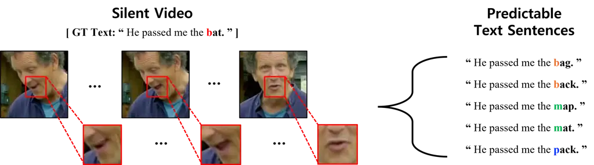

Figure 1: The one-to-many mapping problem: visually similar lip
movements for bilabial phonemes (/b/, /m/, /p/) lead to ambiguous speech
predictions.

To address this limitation, recent methods have sought to integrate
richer contextual information into the generation process. SVTS \[Mira
et al.(2022)Mira, Haliassos, Petridis, Schuller, and Pantic\] and
DiffV2S \[Choi et al.(2023a)Choi, Hong, and Ro\] leverage audio-visual
pre-trained representations to synthesize speech, yet the generated
audio still lacks accurate content due to insufficient utilization of
textual information, which can leave the one-to-many ambiguity
insufficiently addressed. A more recent approach, LipVoicer \[Yemini
et al.(2024)Yemini, Shamsian, Bracha, Gannot, and Fetaya\], injects
textual context via classifier guidance from a lip-reading model during
inference. However, since text information is absent during training,
the model has limited opportunity to learn audio-textual alignments
within the generation process, and its reliance on an external
classifier can affect speech naturalness.

To mitigate this problem, we propose Watch Your Speech (WYS), a V2S
synthesis framework that incorporates explicit textual conditioning from
the training phase. By integrating Ground-Truth (GT) text during
training and leveraging a pre-trained lip-reading model \[Ma
et al.(2023)Ma, Haliassos, Fernandez-Lopez, Chen, Petridis, and Pantic\]
to estimate text during inference, WYS substantially narrows the mapping
space, alleviating the one-to-many ambiguity. To synergistically fuse
this textual conditioning with visual features, WYS employs an
attention-based embedding fusion module that computes a modality-aligned
representation, which then serves as the conditional input for a
Conditional Flow Matching (CFM) objective, enabling the generation of
high-fidelity speech that faithfully reflects the spoken content.

Experiments on the LRS2 \[Afouras et al.(2018a)Afouras, Chung, Senior,
Vinyals, and Zisserman\] and LRS3 \[Afouras et al.(2018b)Afouras, Chung,
and Zisserman\] benchmarks demonstrate that WYS improves audio-visual
synchronization \[Chung and Zisserman(2016)\] and perceptual quality
while maintaining competitive textual accuracy. Subjective evaluations
further indicate improved perceived naturalness compared with baseline
methods.

The main contributions of the proposed WYS framework are as follows:

- •
  A V2S framework that directly integrates textual conditioning from the
  training phase onward, utilizing GT text during training and text
  predicted by a lip-reading model during inference, without relying on
  external classifier guidance.
- •
  An effective attention-based fusion module that explicitly aligns
  video and text features, coupled with a CFM objective for
  high-fidelity speech generation, thereby significantly alleviating the
  inherent one-to-many ambiguity of the V2S task.
- •
  Demonstration of improved audio-visual synchronization (LSE-C/D) and
  perceptual quality on the LRS2 and LRS3 benchmarks while maintaining
  competitive textual accuracy (WER).

## 2 Related Work

The objective of V2S synthesis is to generate intelligible,
natural-sounding speech that remains tightly synchronized with silent
talking-face video. Early research in this field primarily leveraged
convolutional neural networks to extract and map visual features to
acoustic representations, such as in Vid2Speech \[Ephrat and
Peleg(2017)\] and LTBS \[Kim et al.(2024)Kim, Kim, and Chung\].
Subsequently, generative adversarial networks, such as VCA-GAN \[Kim
et al.(2021)Kim, Hong, and Ro\], were introduced to enhance realism of
the synthesized audio.

Recently, diffusion models \[Choi et al.(2023a)Choi, Hong, and Ro, Choi
et al.(2025a)Choi, Kim, Li, Chung, and Liu, Yemini et al.(2024)Yemini,
Shamsian, Bracha, Gannot, and Fetaya\] have emerged as a powerful method
for high-fidelity speech generation. However, while these generative
models have significantly improved audio fidelity, ensuring precise
textual content remains a persistent challenge. Some methods \[Choi
et al.(2023a)Choi, Hong, and Ro, Choi et al.(2025a)Choi, Kim, Li, Chung,
and Liu\] incorporate vision-guided speaker embeddings but lack explicit
textual conditioning, thus failing to sufficiently mitigate the inherent
one-to-many ambiguity. More recent work, such as LipVoicer \[Yemini
et al.(2024)Yemini, Shamsian, Bracha, Gannot, and Fetaya\], employs
classifier guidance derived from lip-reading during the inference phase
of the diffusion process to provide textual context. Critically,
LipVoicer does not integrate text information during its training phase
and relies on external classifier guidance for content correction. This
approach necessitates an auxiliary classifier and, while achieving
better textual alignment, often correlates with a loss of speech
naturalness, which may partly stem from the external classifier’s
interference with the generative process. To overcome these limitations,
it is essential to develop a robust, Classifier-Free Guidance (CFG)
framework that effectively fuses textual and visual information from the
training phase onward to ensure both high content accuracy and superior
speech audio quality.

Our work builds on this direction by proposing a novel attention-based
fusion module designed to explicitly align text and video features from
the training phase onward. Furthermore, our proposed framework adopts a
CFG strategy, eliminating the need for an auxiliary classifier and
simplifying the overall architecture. This direct and persistent use of
explicit textual conditioning, combined with our effective fusion
strategy, effectively alleviates the inherent one-to-many ambiguity of
the V2S task by constraining the mapping space. This approach aims to
simultaneously improve the intelligibility, naturalness, and
audio-visual synchronization of the generated speech.

## 3 Methodology

Our WYS framework is designed to generate high-fidelity mel-spectrograms
that accurately preserve textual content while remaining tightly
synchronized with the corresponding video sequences. By leveraging
explicit textual conditioning and a novel embedding fusion module, WYS
effectively alleviates the inherent one-to-many ambiguity of the V2S
task, ensuring a more constrained mapping from visual-textual inputs to
the target speech. As illustrated in Fig. 2, the overall architecture
comprises four key components: (1) a lip-reading module for textual
conditioning, (2) feature extraction modules for multimodal
representation, (3) an attention-based embedding fusion module for
cross-modal alignment, and (4) a flow-matching-based model for speech
synthesis.

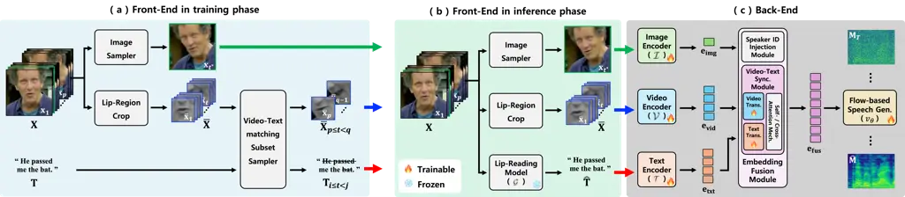

Figure 2: Overview of the proposed WYS framework: (a) training front-end
using GT text $`\mathbf{T}`$, (b) inference front-end predicting text
$`\hat{\mathbf{T}}`$ via a lip-reading model, and (c) shared back-end
that encodes and fuses text, video, and speaker identity features to
guide flow-based speech synthesis.

### 3.1 Linguistic Information via Lip-Reading

The WYS framework leverages textual sentences,
$`\mathbf{T}=(\mathbf{t}_{1},\cdots,\mathbf{t}_{N})`$, to provide
explicit linguistic conditioning during both training and inference.

#### Training.

As shown in Fig. 2(a), the module is provided with GT text sentences,
$`\mathbf{T}_{i\leq t<j}`$, corresponding to the sub-sampled video
clips, $`\mathbf{X}_{p\leq t<q}`$. This pairing allows the model to
learn a robust representation that integrates visual and textual cues,
thereby narrowing down the mapping space toward the target speech
$`\mathbf{M}`$. Details of the sampling pipeline are provided in the
supplementary material.

#### Inference.

Since GT text is unavailable during inference, a pre-trained lip-reading
model \[Ma et al.(2023)Ma, Haliassos, Fernandez-Lopez, Chen, Petridis,
and Pantic\], denoted as $`\mathcal{G}`$, is employed to estimate a text
sentence $`\hat{\mathbf{T}}`$ from the input silent videos
$`\mathbf{X}`$. This process is formulated as
$`\hat{\mathbf{T}}=\mathcal{G}(\mathbf{X})`$, as shown in Fig. 2(b).

The resulting text $`\tilde{\mathbf{T}}`$—comprising either the GT text
$`\mathbf{T}_{i\leq t<j}`$ during training or the predicted text
$`\hat{\mathbf{T}}`$ during inference—is subsequently processed by a
text encoder $`\mathcal{T}`$ to generate textual embeddings
$`\mathbf{e}_{\text{txt}}`$. The detailed methodology for generating
$`\mathbf{e}_{\text{txt}}`$ is further elaborated in the Text Encoder
part of . 3.2.

### 3.2 Multimodal Representation via Feature Extraction

The WYS framework receives a silent talking-face video as input,
represented by a tensor
$`\mathbf{X}\in\mathbb{R}^{M\times H_{\mathbf{x}}\times W_{\mathbf{x}}\times C_{\mathbf{x}}}`$,
where $`M`$ is the number of frames, and $`H_{\mathbf{x}}`$,
$`W_{\mathbf{x}}`$, and $`C_{\mathbf{x}}`$ are the height, width, and
number of channels, respectively. From this raw input, three distinct
streams are derived via preprocessing to provide comprehensive
conditioning: (i) a text sentence for linguistic context, (ii) a
reference face frame for speaker identity, and (iii) a lip-region
sequence for temporal visual dynamics. A dedicated encoder subsequently
processes each component to generate a representative feature embedding,
as detailed in the following subsections.

#### Text Encoder.

To extract robust linguistic representations from the input text, we
utilize a pre-trained BERT \[Devlin et al.(2019)Devlin, Chang, Lee, and
Toutanova\] as the backbone of our text encoder. The input to the
encoder is a text sentence $`\tilde{\mathbf{T}}`$, which represents the
GT text $`\mathbf{T}_{i\leq t<j}`$ during training and the estimated
text $`\hat{\mathbf{T}}`$ during inference. To facilitate efficient
domain adaptation to the V2S task while preserving the pre-trained
knowledge, we keep the BERT parameters
$`\mathbf{\theta}_{\text{BERT}}^{*}`$ frozen and employ Low-Rank
Adaptation (LoRA) \[Hu et al.(2022)Hu, Shen, Wallis, Allen-Zhu, Li,
Wang, Wang, Chen, et al.\] for parameter-efficient fine-tuning. The
architecture of the text encoder, denoted as
$`\mathcal{T}(\mathbf{\theta}_{\text{BERT}}^{*},\mathbf{\theta}_{\text{LoRA}})`$,
is shown in Fig. 3(a). The process is formulated as:

```math
\mathbf{e}_{\text{txt}}=\mathcal{T}(\tilde{\mathbf{T}};~\mathbf{\theta}_{\text{BERT}}^{*},\mathbf{\theta}_{\text{LoRA}}), \tag{1}
```

where $`\mathbf{e}_{\text{txt}}\in\mathbb{R}^{L\times d_{\text{txt}}}`$
is the resulting text embedding with sequence length $`L`$ and dimension
$`d_{\text{txt}}`$. Here, $`\mathbf{\theta}`$ denotes the trainable
weights, while $`\mathbf{\theta}^{*}`$ indicates the frozen parameters.

#### Image Encoder.

To capture the speaker’s identity, an image embedding
$`\mathbf{e}_{\text{img}}`$ is extracted from a representative face
frame
$`\mathbf{x}_{t^{*}}\in\mathbb{R}^{H_{\mathbf{x}}\times W_{\mathbf{x}}\times C_{\mathbf{x}}}`$
sampled from the input video. As shown in Fig. 3(b), a ResNet18 \[He
et al.(2016)He, Zhang, Ren, and Sun\] is employed as the image encoder
$`\mathcal{I}(\theta_{\text{img}})`$ to derive a global speaker
representation. The process is formulated as:

```math
\mathbf{e}_{\text{img}}=\mathcal{I}({\mathbf{x}_{t^{*}}};~\mathbf{\theta}_{\text{img}}), \tag{2}
```

where $`\mathbf{e}_{\text{img}}\in\mathbb{R}^{1\times d_{\text{img}}}`$
is the speaker embedding, with $`d_{\text{img}}`$ representing the
feature dimension of the image embedding.

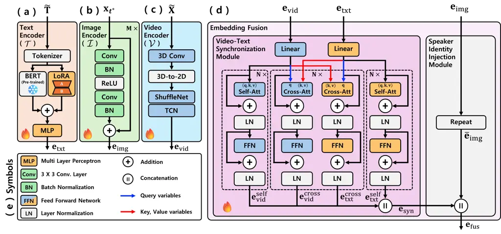

Figure 3: Details of the back-end components: (a) Text Encoder, (b)
Image Encoder for speaker identity, (c) Video Encoder for lip movements,
(d) embedding fusion module that aligns video and text features via
attention and injects speaker identity to produce
$`\mathbf{e}_{\text{fus}}`$, and (e) legend.

#### Video Encoder.

To capture the temporal dynamics of speech articulation, we first
isolate the lip-region from the full face video $`\mathbf{X}`$ as
follows:

```math
\hat{\mathbf{X}}=\text{LipCrop}(\mathbf{X}), \tag{3}
```

where $`\hat{\mathbf{X}}`$ is a localized lip-region video tensor,
representing the primary visual stream for speech synthesis. To generate
the video embedding $`\mathbf{e}_{\text{vid}}`$, we employ a video
encoder $`\mathcal{V}(\theta_{\text{vid}})`$ based on a 3D CNN
architecture \[Gao and Grauman(2021)\], which is specifically designed
to extract spatio-temporal features from facial movements. As shown in
Fig. 3(c), this module consists of a 3D convolutional layer for local
spatial-temporal processing, followed by a ShuffleNet \[Ma
et al.(2018)Ma, Zhang, Zheng, and Sun\] and a Temporal Convolutional
Network (TCN) \[Lea et al.(2017)Lea, Flynn, Vidal, Reiter, and Hager\]
to capture long-range temporal dependencies. The input
$`\tilde{\mathbf{X}}`$ corresponds to a randomly sub-sampled clip
$`\hat{\mathbf{X}}_{i\leq t<j}`$ during training and the full sequence
$`\hat{\mathbf{X}}`$ during inference. The encoding process is
formulated as:

```math
\mathbf{e}_{\text{vid}}=\mathcal{V}(\tilde{\mathbf{X}};~\mathbf{\theta}_{\text{vid}}), \tag{4}
```

where $`\mathbf{e}_{\text{vid}}\in\mathbb{R}^{L\times d_{\text{vid}}}`$
is the resulting video embedding, with $`L`$ and $`d_{\text{vid}}`$
denoting the sequence length and feature dimension, respectively.

### 3.3 Cross-modal Alignment via Attention-based Embedding Fusion

Once the textual context $`\mathbf{e}_{\text{txt}}`$, speaker identity
$`\mathbf{e}_{\text{img}}`$, and visual dynamics
$`\mathbf{e}_{\text{vid}}`$ are extracted, they are integrated into a
unified representation to guide the speech synthesis process. The
primary objective of the Attention-based Fusion Module is to explicitly
align these multimodal features, thereby effectively mitigating the
inherent one-to-many ambiguity by constraining the mapping space. As
illustrated in Fig. 3(d), the module comprises two specialized
components: (i) a Video-Text Alignment module for cross-modal
synchronization and (ii) a Speaker Identity Injection module for global
voice conditioning.

#### Video-Text Alignment Module.

The core of the fusion strategy is the video-text alignment module,
which is engineered to produce a unified representation by synergizing
video dynamics $`\mathbf{e}_{\text{vid}}`$ and text context
$`\mathbf{e}_{\text{txt}}`$. This module employs a dual-stage attention
mechanism to ensure that the linguistic constraints effectively resolve
the visual ambiguities of lip movements.

Initially, to capture intra-modal dependencies, both embeddings are
processed through $`N`$ self-attention blocks. Each block consists of a
multi-head self-attention layer followed by a Feed-Forward Network
(FFN), incorporating residual connections and layer normalization:

```math
\displaystyle\bar{\mathbf{e}}^{n}_{m}~~~~=~\text{LayerNorm}(\mathbf{e}_{m}^{n}+\text{Att}^{\text{self}}_{m}(\mathbf{e}_{m}^{n})),
```

```math
\displaystyle{\mathbf{e}}^{n+1}_{m}~=~\text{LayerNorm}(\bar{\mathbf{e}}^{n}_{m}+\text{FFN}(\bar{\mathbf{e}}^{n}_{m})), \tag{5}
```

where $`\mathbf{e}_{m}^{n}\in\mathbb{R}^{L\times d_{\text{self}}}`$
denotes the embedding at the $`n`$-th block for modality
$`m\in\{\text{vid},\text{txt}\}`$, and $`d_{\text{self}}`$ is the model
dimension. This stage yields contextually enriched embeddings,
$`{\mathbf{e}}_{\text{vid}}^{\text{self}}`$ and
$`{\mathbf{e}}_{\text{txt}}^{\text{self}}`$.

Subsequently, to facilitate inter-modal interaction, $`N`$
cross-attention blocks are applied. In these blocks, one modality serves
as the query while the other acts as the key and value, enabling
bidirectional information exchange:

```math
\displaystyle\bar{\mathbf{e}}^{n}_{m}~~~~=~\text{LayerNorm}(\mathbf{e}_{m}^{n}+\text{Att}^{\text{cross}}_{m\to w}(\mathbf{e}_{m}^{n},\mathbf{e}_{w}^{n})),
```

```math
\displaystyle{\mathbf{e}}^{n+1}_{m}~=~\text{LayerNorm}(\bar{\mathbf{e}}^{n}_{m}+\text{FFN}(\bar{\mathbf{e}}^{n}_{m})), \tag{6}
```

where $`w`$ represents the providing modality (i.e., if $`m`$ is video,
$`w`$ is text, and vice versa). This results in two cross-modal
embeddings, $`{\mathbf{e}}_{\text{txt}\to\text{vid}}^{\text{cross}}`$
and $`{\mathbf{e}}_{\text{vid}\to\text{txt}}^{\text{cross}}`$, which
encode the mutual alignment between visual and linguistic tokens.

Finally, these four feature representations are concatenated to form the
synchronized alignment embedding
$`\mathbf{e}_{\text{syn}}\in\mathbb{R}^{L\times d_{\text{syn}}}`$:

```math
\mathbf{e}_{\text{syn}}=\left[~{\mathbf{e}}_{\text{vid}}^{\text{self}}\parallel{\mathbf{e}}_{\text{txt}}^{\text{self}}\parallel{\mathbf{e}}_{\text{vid}\to\text{txt}}^{\text{cross}}\parallel{\mathbf{e}}_{\text{txt}\to\text{vid}}^{\text{cross}}~\right], \tag{7}
```

where $`\parallel`$ is the concatenation and the dimension is
$`d_{\text{syn}}=2\cdot d_{\text{self}}+2\cdot d_{\text{cross}}`$.

#### Speaker Identity Injection Module.

Since the speaker identity embedding
$`\mathbf{e}_{\text{img}}\in\mathbb{R}^{1\times d_{\text{img}}}`$ is
extracted from a single reference frame, it possesses a sequence length
of one. To integrate this static representation with the temporal
synchronized embedding
$`\mathbf{e}_{\text{syn}}\in\mathbb{R}^{L\times d_{\text{syn}}}`$, a
sequence-matching process is required. We perform a temporal expansion
of the identity embedding by broadcasting it across $`L`$ time steps,
yielding
$`\bar{\mathbf{e}}_{\text{img}}\in\mathbb{R}^{L\times d_{\text{img}}}`$.
This expanded representation is then concatenated with
$`\mathbf{e}_{\text{syn}}`$ to produce the final fused embedding
$`\mathbf{e}_{\text{fus}}\in\mathbb{R}^{L\times d_{\text{fus}}}`$:

```math
\displaystyle\bar{\mathbf{e}}_{\text{img}}~=\text{Repeat}(\mathbf{e}_{\text{img}},L), \tag{8}
```

```math
\displaystyle\mathbf{e}_{\text{fus}}~~=\left[~\bar{\mathbf{e}}_{\text{img}}~\parallel~\mathbf{e}_{\text{syn}}~\right], \tag{9}
```

where the fused embedding $`\mathbf{e}_{\text{fus}}`$ has a total
dimension of $`d_{\text{fus}}=d_{\text{syn}}+d_{\text{img}}`$.

### 3.4 Speech Synthesis via Conditional Flow Matching with Classifier-Free Guidance

The final fused embedding $`\mathbf{e}_{\text{fus}}`$ serves as the
conditional guidance for generating the target mel-spectrogram
$`\hat{\mathbf{M}}`$. We adapt a CFM framework, which learns a vector
field to transform a prior noise distribution into the target data
distribution. We employ a DiffWave \[Kong et al.(2021)Kong, Ping, Huang,
Zhao, and Catanzaro\] as the backbone to estimate the velocity field
$`v_{\theta}`$.

To enhance the model’s adherence to textual and visual constraints
without requiring an external classifier, we incorporate CFG \[Ho and
Salimans(2022)\] during both training and inference. The CFM objective
with CFG is defined as:

```math
\displaystyle\mathcal{L}_{\text{CFM}}=~ \displaystyle\mathbb{E}_{t,\mathbf{M}_{0},\mathbf{e}_{\text{fus}},\mathbf{x}_{0},\mathbf{x}_{1}}\left[\left\|v_{\theta}\left({\mathbf{M}_{t},t,\mathbf{e}_{\text{fus}}}\right)-(\mathbf{x}_{1}-\mathbf{x}_{0})\right\|^{2}\right]
```

```math
\displaystyle~+\mathbb{E}_{t,\mathbf{M}_{0},\mathbf{x}_{0},\mathbf{x}_{1}}\left[\left\|v_{\theta}\left({\mathbf{M}_{t},t,\emptyset}\right)-(\mathbf{x}_{1}-\mathbf{x}_{0})\right\|^{2}\right], \tag{10}
```

where $`\mathbf{x}_{1}`$ is the GT mel-spectrogram,
$`\mathbf{x}_{0}\sim\mathcal{N}(0,\mathbf{I})`$ is the Gaussian noise,
and $`\mathbf{M}_{t}=(1-t)~\mathbf{x}_{0}+t~\mathbf{x}_{1}`$ denotes the
probability path at time $`t\in[0,1]`$. During training, the condition
$`\mathbf{e}_{\text{fus}}`$ is randomly replaced with a null token
$`\emptyset`$, allowing the model to learn both conditional and
unconditional distributions simultaneously.

During inference, we compute the guided velocity $`\bar{v}_{\theta}`$ by
interpolating between the conditional and unconditional predictions:

```math
\bar{v}_{\theta}(\mathbf{M}_{t},t)=(1+\omega)\cdot v_{\theta}(\mathbf{M}_{t},t,\textbf{e}_{\text{fus}})-\omega\cdot v_{\theta}(\mathbf{M}_{t},t,\emptyset), \tag{11}
```

where $`\omega`$ denotes the guidance scale. The mel-spectrogram is
synthesized by solving the Ordinary Differential Equation (ODE) starting
from $`\textbf{M}_{0}\sim\mathcal{N}(0,\mathbf{I})`$:

```math
\textbf{M}_{t-\Delta t}=\textbf{M}_{t}-\Delta t\cdot\bar{v}_{\theta}(\textbf{M}_{t},t). \tag{12}
```

The final generated mel-spectrogram $`\hat{\textbf{M}}=\textbf{M}_{1}`$
is then converted into the speech waveform $`\hat{\textbf{Y}}`$ using a
pre-trained HiFi-GAN vocoder \[Kong et al.(2020)Kong, Kim, and Bae\]:

```math
\hat{\mathbf{Y}}=\text{Vocoder}(\hat{\mathbf{M}}). \tag{13}
```

## 4 Experimental Setup

### 4.1 Datasets

We evaluate the proposed framework on two large-scale audio-visual
benchmarks: LRS2 \[Afouras et al.(2018a)Afouras, Chung, Senior, Vinyals,
and Zisserman\], sourced from BBC broadcasts (144K clips, 224 hours,
$`>`$13K vocabulary), and LRS3 \[Afouras et al.(2018b)Afouras, Chung,
and Zisserman\], derived from TED talks (151K clips, 475 hours, $`>`$40K
vocabulary) with significantly higher variability in speaker
demographics, accents, and recording conditions. All videos are
processed at 25 frame per second (fps) with audio sampled at 16 kHz.
Details of the preprocessing pipeline and dataset splits are provided in
the supplementary material.

### 4.2 Implementation Details

The textual and visual embedding dimensions are set to
$`d_{\text{txt}}=d_{\text{vid}}=512`$, while the image encoder produces
$`d_{\text{img}}=128`$. The fusion module uses $`\textbf{N}=6`$,
attention blocks with $`h=8`$ heads, and hidden dimensions
$`d_{\text{self}}=d_{\text{cross}}=512`$. The model was trained on a
single NVIDIA RTX PRO 6000 GPU using the Adam optimizer
($`\text{lr}=2\times 10^{-4}`$, batch size 64) for 1,000,000 iterations
with a null-conditioning probability of 0.1 for CFG. During inference,
we use a first-order Euler ODE solver with $`T=100`$ steps and guidance
scale $`\omega=2.0`$.

### 4.3 Evaluation Metrics

To provide a comprehensive evaluation, we assess the proposed framework
using both objective quantitative metrics and subjective qualitative
analysis.

#### Quantitative Metrics.

We evaluate the performance of the WYS framework across three primary
dimensions: content accuracy, audio-visual synchronization, and speech
quality. To assess content accuracy, we compute the Word Error Rate
(WER) by transcribing the generated audio via a pre-trained Automatic
Speech Recognition (ASR) model \[Ma et al.(2023)Ma, Haliassos,
Fernandez-Lopez, Chen, Petridis, and Pantic\] and comparing the
transcript against the GT text. Audio-visual synchronization is
quantified using the LSE-C (Confidence) and LSE-D (Distance) metrics
from a pre-trained SyncNet \[Chung and Zisserman(2016)\], which measure
the temporal alignment between the input lip movements and the
synthesized speech. Finally, we evaluate the perceptual quality and
intelligibility of the audio signals using STOI-Net \[Zezario
et al.(2020)Zezario, Fu, Fuh, Tsao, and Wang\] and DNSMOS \[Reddy
et al.(2022)Reddy, Gopal, and Cutler\], providing an objective measure
of the clarity and human-likeness of the generated utterances.

#### Qualitative Analysis.

For qualitative assessment, we conducted human listening tests via
Amazon Mechanical Turk. A total of 100 participants evaluated 10
randomly selected samples from each dataset across the proposed and four
baseline models. Raters provided scores on a 5-point Mean Opinion Score
(MOS) scale based on five criteria: (1) Audio Quality (overall acoustic
fidelity), (2) Content Accuracy (correspondence with the intended text),
(3) Intelligibility (clarity of the spoken words), (4) Lip-sync
(audio-visual synchronization), and (5) Naturalness (the human-likeness
of the synthesized voice). The specific questionnaire and survey
interface utilized for the Amazon Mechanical Turk evaluations are
provided in the supplementary material.

## 5 Experimental Results

To validate the effectiveness of the proposed WYS framework, we conduct
extensive comparative experiments against various baselines encompassing
a broad spectrum of generative paradigms in the video-to-speech field:
VCA-GAN \[Kim et al.(2021)Kim, Hong, and Ro\] (GAN-based model),
SVTS \[Mira et al.(2022)Mira, Haliassos, Petridis, Schuller, and
Pantic\] (Conformer-based model), and IntelligibleL2S \[Choi
et al.(2023b)Choi, Kim, and Ro\] (Speech Unit-based model). Furthermore,
we compare our work with recent high-performance generative models:
DiffV2S \[Choi et al.(2023a)Choi, Hong, and Ro\] (Diffusion model
without text guidance), LipVoicer \[Yemini et al.(2024)Yemini, Shamsian,
Bracha, Gannot, and Fetaya\] (Diffusion model with inference-time text
guidance), V2SFlow \[Choi et al.(2025a)Choi, Kim, Li, Chung, and Liu\]
(Rectified flow matching model)¹¹ 1 We use V2SFlow-V (video-derived
embeddings) for fair comparison, as reference audio is unavailable in
the silent V2S setting., FTV \[Kim et al.(2025)Kim, Choi, Kim, Jung, and
Chung\] (Hierachical representation model), and AlignDiT \[Choi
et al.(2025b)Choi, Kim, Sung-Bin, Oh, and Chung\] (Diffusion transformer
based model).

Through these comparisons, we demonstrate the superiority of our
integrated textual conditioning and CFG strategy in producing
intelligible and natural speech. Additional visualizations of the
generated mel-spectrograms are provided in the supplementary material
for further qualitative inspection.

### 5.1 Main Results

#### Quantitative Results.

As summarized in Tab. 1, the WYS framework demonstrates highly
competitive performance across all evaluation dimensions. A critical
observation arises from the comparison with LipVoicer \[Yemini
et al.(2024)Yemini, Shamsian, Bracha, Gannot, and Fetaya\]. While
LipVoicer achieves slightly lower WER scores (18.8991% vs. 20.1321% on
LRS2; 22.2423% vs. 23.7349% on LRS3), the proposed framework
consistently outperforms LipVoicer across all other metrics, including
synchronization (LSE-C/D) and perceptual quality (STOI-Net, DNSMOS).

This strategic trade-off highlights a fundamental difference in
methodology. LipVoicer’s marginal lead in WER can be attributed to its
reliance on external classifier guidance during inference, which acts as
a rigid content-correction tool. While this mechanism forces the output
to align with the text, it appears to do so at the expense of
audio-visual integrity and naturalness. Such discriminative intervention
during the generative process likely disrupts the synchronization
between lip movements and speech (as reflected in poorer LSE-C/D scores)
and degrades the overall acoustic fidelity (indicated by lower DNSMOS
results).

In contrast, our results underscore the effectiveness of an integrated
training-time fusion strategy. By embedding textual constraints directly
into the model’s training phase, the WYS framework achieves a refined
balance between linguistic fidelity and high-fidelity synthesis. These
findings demonstrate that our approach provides a more robust solution
for V2S, effectively constraining the ill-posed mapping space between
visual cues and acoustic features without compromising the inherent
naturalness of the synthesized speech.

| Method          | LRS2-BBC                 |                    |                      |                       |                     | LRS3-TED                 |                    |                      |                       |                     |
| --------------- | ------------------------ | ------------------ | -------------------- | --------------------- | ------------------- | ------------------------ | ------------------ | -------------------- | --------------------- | ------------------- |
|                 | WER \[%\] $`\downarrow`$ | LSE-C $`\uparrow`$ | LSE-D $`\downarrow`$ | STOI-Net $`\uparrow`$ | DNSMOS $`\uparrow`$ | WER \[%\] $`\downarrow`$ | LSE-C $`\uparrow`$ | LSE-D $`\downarrow`$ | STOI-Net $`\uparrow`$ | DNSMOS $`\uparrow`$ |
| Ground Truth    | 1.4773                   | 6.9788             | 7.1891               | 0.9063                | 3.1384              | 1.0096                   | 7.3393             | 6.9002               | 0.9307                | 3.2988              |
| VCA-GAN         | 100.7812                 | 2.3960             | 11.7631              | 0.5107                | 2.2573              | 90.6827                  | 4.5511             | 9.1256               | 0.6325                | 2.2672              |
| SVTS            | –                        | –                  | –                    | –                     | –                   | 75.6552                  | 6.2841             | 7.9446               | 0.7070                | 2.4203              |
| DiffV2S         | 50.7801                  | 6.4320             | 7.6540               | 0.8923                | 2.9230              | 38.0897                  | 6.2841             | 7.9403               | 0.9214                | 3.2169              |
| IntelligibleL2S | 44.2286                  | 7.1280             | 7.0210               | 0.8588                | 2.7063              | 50.0105                  | 6.7813             | 7.3754               | 0.8838                | 2.8678              |
| LipVoicer       | 18.8991                  | 6.5512             | 7.8622               | 0.9034                | 3.0352              | 22.2423                  | 5.7035             | 8.4518               | 0.9207                | 3.1846              |
| V2SFlow-V       | 36.1311                  | 7.1897             | 7.2642               | 0.9225                | 3.1131              | 29.6079                  | 7.0084             | 7.4493               | 0.9328                | 3.2851              |
| FTV             | –                        | –                  | –                    | –                     | –                   | 29.1370                  | 7.0996             | 7.2633               | 0.9348                | 3.1685              |
| AlignDiT        | –                        | –                  | –                    | –                     | –                   | 29.6671                  | 6.9625             | 7.3483               | 0.9331                | 3.1959              |
| Ours (WYS)      | 20.1321                  | 7.5032             | 6.8118               | 0.9144                | 3.0927              | 23.7349                  | 7.0148             | 7.2586               | 0.9373                | 3.2414              |

Table 1: Quantitative results on LRS2-BBC and LRS3-TED. Best and
second-best scores are highlighted. $`\downarrow`$/$`\uparrow`$ denote
lower/higher is better.

|                 |                    |                     |                     |                    |                       |                    |                     |                     |                    |                       |
| --------------- | ------------------ | ------------------- | ------------------- | ------------------ | --------------------- | ------------------ | ------------------- | ------------------- | ------------------ | --------------------- |
| Method          | LRS2-BBC           |                     |                     |                    |                       | LRS3-TED           |                     |                     |                    |                       |
|                 | Qual. $`\uparrow`$ | Align. $`\uparrow`$ | Intel. $`\uparrow`$ | Sync. $`\uparrow`$ | Natural. $`\uparrow`$ | Qual. $`\uparrow`$ | Align. $`\uparrow`$ | Intel. $`\uparrow`$ | Sync. $`\uparrow`$ | Natural. $`\uparrow`$ |
| Ground Truth    | 4.26 $`\pm`$ 0.15  | 4.36 $`\pm`$ 0.11   | 4.31 $`\pm`$ 0.13   | 4.26 $`\pm`$ 0.14  | 4.27 $`\pm`$ 0.10     | 4.25 $`\pm`$ 0.12  | 4.33 $`\pm`$ 0.10   | 4.23 $`\pm`$ 0.11   | 4.23 $`\pm`$ 0.11  | 4.28 $`\pm`$ 0.01     |
| IntelligibleL2S | 2.77 $`\pm`$ 0.23  | 3.06 $`\pm`$ 0.25   | 3.00 $`\pm`$ 0.24   | 3.36 $`\pm`$ 0.22  | 2.87 $`\pm`$ 0.24     | 2.59 $`\pm`$ 0.23  | 3.02 $`\pm`$ 0.26   | 2.85 $`\pm`$ 0.24   | 3.08 $`\pm`$ 0.23  | 2.82 $`\pm`$ 0.24     |
| DiffV2S         | 3.24 $`\pm`$ 0.21  | 3.13 $`\pm`$ 0.24   | 3.24 $`\pm`$ 0.23   | 3.51 $`\pm`$ 0.19  | 3.27 $`\pm`$ 0.21     | 3.56 $`\pm`$ 0.20  | 3.55 $`\pm`$ 0.23   | 3.48 $`\pm`$ 0.23   | 3.70 $`\pm`$ 0.20  | 3.64 $`\pm`$ 0.20     |
| LipVoicer       | 3.49 $`\pm`$ 0.21  | 3.83 $`\pm`$ 0.16   | 3.64 $`\pm`$ 0.17   | 3.73 $`\pm`$ 0.18  | 3.56 $`\pm`$ 0.19     | 3.71 $`\pm`$ 0.21  | 3.87 $`\pm`$ 0.19   | 3.77 $`\pm`$ 0.21   | 3.90 $`\pm`$ 0.18  | 3.65 $`\pm`$ 0.20     |
| V2SFlow-V       | 3.73 $`\pm`$ 0.19  | 3.42 $`\pm`$ 0.24   | 3.69 $`\pm`$ 0.18   | 3.83 $`\pm`$ 0.19  | 3.85 $`\pm`$ 0.19     | 3.86 $`\pm`$ 0.22  | 3.77 $`\pm`$ 0.22   | 3.78 $`\pm`$ 0.22   | 3.83 $`\pm`$ 0.23  | 3.77 $`\pm`$ 0.20     |
| Ours (WYS)      | 3.92 $`\pm`$ 0.19  | 3.99 $`\pm`$ 0.19   | 3.97 $`\pm`$ 0.18   | 4.03 $`\pm`$ 0.18  | 4.00 $`\pm`$ 0.10     | 3.93 $`\pm`$ 0.18  | 4.03 $`\pm`$ 0.18   | 4.02 $`\pm`$ 0.19   | 4.01 $`\pm`$ 0.17  | 3.93 $`\pm`$ 0.18     |

Table 2: Subjective evaluation (MOS) on LRS2-BBC and LRS3-TED. Best and
second-best scores are highlighted. $`\uparrow`$ denotes higher is
better.

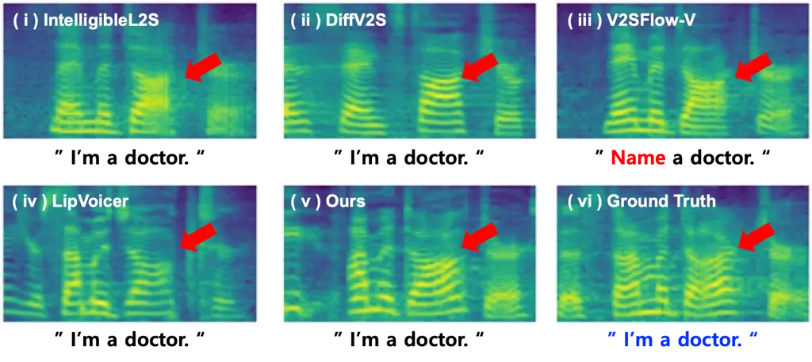

Figure 4: Qualitative comparison of mel-spectrograms on LRS2. The text
below each spectrogram is predicted by an ASR model, where GT text is
shown in blue and incorrectly predicted words are highlighted in red.

#### Qualitative Results.

The results of the subjective evaluation are summarized in Tab. 2,
including the 95% confidence intervals for each score. In contrast to
the subtle differences observed in some quantitative results, the
proposed WYS framework significantly outperforms all baseline methods
across every perceptual criterion on both datasets.

This perceptual superiority is further substantiated by the visual
analysis of synthesized mel-spectrograms in Fig. 4. Our model in
Fig. 4(v) not only demonstrates high acoustic structural fidelity
compared to the GT text (see Fig. 4(vi)) but also maintains precise
linguistic integrity. In contrast, V2SFlow-V (see Fig. 4(iii))
frequently fails to recover the correct textual content, resulting in
phonetic mismatches. While other baselines, such as IntelligibleL2S and
LipVoicer, achieve better content alignment, they exhibit noticeable
structural distortions and a lack of fine-grained acoustic details as
shown in Fig. 4(i, ii).

These findings indicate that the WYS framework generates intelligible
and realistic speech while maintaining alignment with the intended
textual context. By bridging linguistic cues and visual dynamics, our
model achieves improved naturalness and synchronization compared with
baseline methods.

| Attention Mechanisms                                                                                                |   Textual Acc.            |  A-V Sync.          |                       |  Audio Qual.           |                      |
| ------------------------------------------------------------------------------------------------------------------- | ------------------------- | ------------------- | --------------------- | ---------------------- | -------------------- |
|                                                                                                                     |  WER \[%\] $`\downarrow`$ |  LSE-C $`\uparrow`$ |  LSE-D $`\downarrow`$ |  STOI-Net $`\uparrow`$ |  DNSMOS $`\uparrow`$ |
| $`\mathbf{e}_{\text{txt}}\parallel\mathbf{e}_{\text{vid}}`$                                                         | 50.6510                   | 7.6259              | 6.7147                | 0.9093                 | 3.0811               |
| $`\mathbf{e}_{\text{txt}}^{\text{self}}\parallel\mathbf{e}_{\text{vid}}^{\text{self}}`$                             | 52.3977                   | 7.6127              | 6.7217                | 0.9128                 | 3.0581               |
| $`\mathbf{e}_{\text{txt}\to\text{vid}}^{\text{cross}}`$                                                             | 80.8254                   | 5.5675              | 8.6043                | 0.8982                 | 3.0389               |
| $`\mathbf{e}_{\text{vid}\to\text{txt}}^{\text{cross}}`$                                                             | 21.0629                   | 7.5863              | 6.7593                | 0.9101                 | 3.0888               |
| $`\mathbf{e}_{\text{txt}\to\text{vid}}^{\text{cross}}\parallel\mathbf{e}_{\text{vid}\to\text{txt}}^{\text{cross}}`$ | 20.8882                   | 7.5219              | 6.7984                | 0.9113                 | 3.0902               |
| Ours ($`\mathbf{e}_{\text{syn}}`$)                                                                                  | 20.1321                   | 7.5032              | 6.8118                | 0.9144                 | 3.0927               |

Table 3: Ablation study on the attention mechanism (LRS2).
$`\mathbf{e}_{\text{m}}^{\text{self}}`$: Self-attention embedding;
$`\mathbf{e}_{m\to w}^{\text{cross}}`$: Cross-attention embedding w/
$`m`$ as query; $`\mathbf{e}_{\text{syn}}`$: Our fused embedding.

### 5.2 Ablation Studies

To evaluate our design choices and the individual contributions of each
component, we conduct four ablation studies on the LRS2 dataset.
Specifically, we investigate the impact of the attention-based fusion,
the speaker identity module, the guidance scale factor, and the sampling
step count. These experiments justify our architectural configuration
and demonstrate the framework’s robustness in balancing linguistic
precision with acoustic naturalness.

#### Effect of Attention Mechanism.

To verify the synergy between multimodal components, we compared our
proposed fusion embedding $`\mathbf{e}_{\text{syn}}`$ with simpler
variants in Tab. 3. A baseline using only feature concatenation
($`\mathbf{e}_{\text{txt}}\parallel\mathbf{e}_{\text{vid}}`$) yielded a
high WER of 50.6510%, proving that raw merging is insufficient for
content recovery despite maintaining decent audio-visual
synchronization. Similarly, incorporating only self-attention
($`\mathbf{e}_{\text{txt}}^{\text{self}}\parallel\mathbf{e}_{\text{vid}}^{\text{self}}`$)
independently refines each modality but still fails to integrate correct
context, resulting in a high WER of 52.3977%.

The most critical gain in content accuracy stems from the direction of
cross-attention. Using video features as the query to attend to text
($`\mathbf{e}_{\text{vid}\to\text{txt}}^{\text{cross}}`$) dramatically
lowers the WER to 21.0629%, confirming that the temporal structure of
the video must drive the extraction of linguistic content. In contrast,
using text as the query
($`\mathbf{e}_{\text{txt}\to\text{vid}}^{\text{cross}}`$) fails to
ground the content in the visual timeline, leading to a WER of 80.8254%.
Furthermore, while incorporating both cross-attention directions
($`\mathbf{e}_{\text{txt}\to\text{vid}}^{\text{cross}}\parallel\mathbf{e}_{\text{vid}\to\text{txt}}^{\text{cross}}`$)
causes a slight degradation in LSE-C/D compared to the single
$`(\text{vid}\to\text{txt})`$ model, it achieves a further WER reduction
to 20.8882%. This indicates that although the
$`(\text{txt}\to\text{vid})`$ direction is less effective in isolation,
it provides a valuable synergistic effect for content accuracy when
integrated.

Our final fusion strategy, $`\mathbf{e}_{\text{syn}}`$, achieves the
optimal balance by combining contextually refined self-attention
features with dual cross-attention. This holistic approach yields the
lowest overall WER (20.1321%) and maximizes audio quality (STOI-Net:
0.9144, DNSMOS: 3.0927) while maintaining highly competitive
synchronization (LSE-C: 7.5032, LSE-D: 6.8118), effectively bridging the
gap between linguistic precision and acoustic naturalness.

| Configuration                                 | WER \[%\] $`\downarrow`$ | LSE-C $`\uparrow`$ | LSE-D $`\downarrow`$ | STOI-Net $`\uparrow`$ | DNSMOS $`\uparrow`$ | spkSIM $`\uparrow`$ |
| --------------------------------------------- | ------------------------ | ------------------ | -------------------- | --------------------- | ------------------- | ------------------- |
| Ours ($`\mathbf{e}_{\text{img}}=\mathbf{0}`$) | 20.5793                  | 7.5023             | 6.8248               | 0.9130                | 3.0783              | 0.6198              |
| Ours (WYS)                                    | 20.1321                  | 7.5032             | 6.8118               | 0.9144                | 3.0927              | 0.6823              |
| Relative Change \[%\]                         | 2.2213                   | 0.0119             | 0.0498               | 0.1533                | 0.4677              | 10.0839             |

Table 4: Ablation study on the speaker identity module (LRS2).

|   $`\omega`$ |  Textual Acc.             |  A-V Sync.          |                       |  Audio Qual.           |                      |
| ------------ | ------------------------- | ------------------- | --------------------- | ---------------------- | -------------------- |
|              |  WER \[%\] $`\downarrow`$ |  LSE-C $`\uparrow`$ |  LSE-D $`\downarrow`$ |  STOI-Net $`\uparrow`$ |  DNSMOS $`\uparrow`$ |
| -1           | 103.8737                  | 2.3689              | 11.7148               | 0.8890                 | 2.8528               |
| 0.0          | 28.0110                   | 6.4583              | 7.6201                | 0.8946                 | 2.9162               |
| 1.0          | 21.0289                   | 7.4421              | 6.8604                | 0.9111                 | 3.0711               |
| 2.0          | 20.1321                   | 7.5032              | 6.8118                | 0.9144                 | 3.0927               |
| 3.0          | 20.5699                   | 7.4031              | 6.8713                | 0.9120                 | 3.0720               |

Table 5: Ablation study on the guidance scale factor $`\omega`$ (LRS2).

#### Effect of Speaker Identity Module.

The contribution of the identity encoder is evaluated by zeroing out the
image input ($`\mathbf{e}_{\text{img}}=\mathbf{0}`$), with the results
summarized in Tab. 4. A quantitative analysis reveals a striking
disparity in how the removal of identity embeddings affects the model.
While core performance metrics exhibit only marginal fluctuations, the
speaker similarity score (spkSIM) undergoes a significant drop of
10.0839%. This phenomenon confirms that the speaker identity module
specifically governs the preservation of individual voice
characteristics without interfering with linguistic intelligibility or
audio-visual synchronization. These findings suggest a clear functional
separation between the identity injection and cross-modal fusion
modules, demonstrating that each component focuses on its designated
role.

#### Effect of Guidance Scale Factor.

We investigated the impact of the CFG scale factor $`\omega`$, which
modulates the balance between conditional and unconditional predictions.
As shown in Tab. 5, the guidance mechanism is fundamental to the model’s
performance. Disabling conditioning entirely ($`\omega=-1`$) leads to a
catastrophic collapse in all metrics, with the WER exceeding 100%.
Performance consistently improves as $`\omega`$ approaches 2.0, where
the model reaches its optimal peak across all evaluation dimensions,
including Textual accuracy, A-V synchronization, and Audio quality.
Beyond this point, as seen with $`\omega=3.0`$, the scores begin to
marginally decline. Accordingly, we adopt $`\omega=2.0`$ as the default
for all experiments to ensure the best balance between linguistic
precision and acoustic quality.

|   Steps |  Textual Acc.             |  A-V Sync.          |                       |  Audio Qual.           |                      |  Sampling Time |
| ------- | ------------------------- | ------------------- | --------------------- | ---------------------- | -------------------- | -------------- |
|         |  WER \[%\] $`\downarrow`$ |  LSE-C $`\uparrow`$ |  LSE-D $`\downarrow`$ |  STOI-Net $`\uparrow`$ |  DNSMOS $`\uparrow`$ |  (sec/sample)  |
| 10      | 20.5293                   | 7.5808              | 6.7572                | 0.9130                 | 3.0783               | 0.7            |
| 100     | 20.1321                   | 7.5032              | 6.8118                | 0.9144                 | 3.0927               | 8.8            |
| 1000    | 20.6555                   | 7.4850              | 6.8194                | 0.9127                 | 3.0468               | 84.2           |

Table 6: Ablation study on the number of sampling steps (LRS2).

#### Effect of Sampling Step.

We analyzed the trade-off between inference efficiency and synthesis
quality by varying the number of sampling steps $`T`$, as summarized in
Tab. 6. While $`T=100`$ provides the most refined balance across all
metrics, extending the process to $`T=1000`$ yields negligible
improvements while significantly increasing latency to 84.2 sec per
sample. Notably, a minimal configuration of $`T=10`$ maintains
surprisingly robust performance, drastically accelerating inference to
0.7 sec per sample. These results demonstrate the high sampling
efficiency of our rectified flow matching framework, suggesting that a
low-step configuration is highly effective for real-time applications
where low latency is prioritized without substantial loss in speech
quality.

|                                         |                           |                     |                       |                        |                      |
| --------------------------------------- | ------------------------- | ------------------- | --------------------- | ---------------------- | -------------------- |
| Method                                  |   Textual Acc.            |  A-V Sync.          |                       |  Audio Qual.           |                      |
|                                         |  WER \[%\] $`\downarrow`$ |  LSE-C $`\uparrow`$ |  LSE-D $`\downarrow`$ |  STOI-Net $`\uparrow`$ |  DNSMOS $`\uparrow`$ |
| _(a) LRS2-BBC: inference-text source_   |                           |                     |                       |                        |                      |
| Ours (w/ GT Text)                       | 9.9784                    | 7.4889              | 6.8198                | 0.9136                 | 3.0901               |
| Ours (w/ Pred. Text)                    | 20.1321                   | 7.5032              | 6.8118                | 0.9144                 | 3.0927               |
| _(b) LRS2-BBC: training-text source_    |                           |                     |                       |                        |                      |
| Ours (w/ Pred. Text)                    | 40.8559                   | 7.7031              | 6.6299                | 0.9173                 | 3.0908               |
| Ours (w/ GT Text)                       | 20.1321                   | 7.5032              | 6.8118                | 0.9144                 | 3.0927               |
| _(c) LRS2-BBC: Lipreading+TTS pipeline_ |                           |                     |                       |                        |                      |
| XTTS-V2                                 | 31.4021                   | 3.1225              | 11.3694               | 0.8060                 | 3.3773               |
| CosyVoice                               | 29.4339                   | 3.7121              | 10.9601               | 0.9093                 | 3.2531               |
| Ours                                    | 20.1321                   | 7.5032              | 6.8118                | 0.9144                 | 3.0927               |
| _(d) LRS3$`\to`$LRS2: cross-dataset_    |                           |                     |                       |                        |                      |
| LipVoicer                               | 39.9212                   | 5.6128              | 8.6038                | 0.9142                 | 3.0505               |
| V2SFlow-V                               | 46.1765                   | 7.2292              | 7.2685                | 0.9356                 | 3.0865               |
| Ours                                    | 34.8539                   | 7.3421              | 7.0123                | 0.9299                 | 3.1383               |

Table 7: Results of additional experiments. (a) inference-text source on
LRS2, (b) training-text source on LRS2, (c) Lipreading+TTS on LRS2, (d)
cross-dataset LRS3$`\to`$LRS2.

### 5.3 Additional Experiments

#### Performance Upper Bound and Linguistic Sensitivity Analysis.

We established the performance upper bound of the WYS framework by
comparing predicted lip-read text against GT text conditioning. As
summarized in Tab. 7 (a), providing GT text substantially reduces the
WER from 20.1321% to 9.9784%, nearly doubling the speech
intelligibility. Essentially, as lip-reading technology matures, the WYS
framework is perfectly poised to “scale up” its performance, directly
translating future linguistic accuracy into superior acoustic synthesis.

#### Training with Predicted Text.

In Tab. 7(b), training with GT text halves the WER (20.1 vs. 40.9),while
the other four metrics remain comparable. This suggests that noisy
predicted text mainly degrades linguistic supervision rather than A-V
synchronization or audio quality. Training with unreliable pseudo-text
can encourage the model to ignore or distrust textual conditioning,
degrading its ability to generate accurate speech content. We therefore
use GT text during training and predicted text only at inference.

#### Lipreading + TTS baseline.

We provide the same predicted text to strong zero-shot TTS models \[Du
et al.(2024), Casanova et al.(2024)\] to isolate the effect of video
conditioning. Tab. 7(c) shows that the Lipreading + TTS pipeline is
clearly worse than our method in synchronization (LSE-C 3.1/3.7 vs. 7.5;
LSE-D 11.4/11.0 vs. 6.8) and content accuracy (WER 31.4/29.4 vs. 20.1),
despite competitive audio quality. This is because it generates speech
from text alone without using visual dynamics for temporal alignment,
further distinguishing our task from conventional TTS.

#### Cross Dataset Validation.

Trained on LRS3 and evaluated on the unseen LRS2 in Tab. 7(d), our
method achieves the best performance on four of five metrics, including
WER (34.9 vs. 39.9) and both synchronization metrics, while ranking
second on STOI-Net. These results indicate that our model generalizes
more robustly across datasets, preserving both linguistic accuracy and
audio-visual synchronization under a domain shift.

#### Robustness of Imperfect Text.

Tab. 8 evaluates the framework’s resilience against varying levels of
textual corruption on the LRS2 dataset. The test set is stratified into
three categories based on the lip-reading WER: accurate (WER = 0%),
moderately corrupted ($`0\%<\text{WER}\leq 50\%`$), and severely
corrupted ($`\text{WER}>50\%`$).

In terms of textual accuracy (WER), when the auxiliary text is accurate,
text-guided models significantly outperform text-free baselines,
underscoring the definitive advantage of explicit linguistic
conditioning for precise content recovery. More importantly, even under
moderate corruption, the WYS framework maintains a substantial WER
reduction compared to text-free models. This indicates that our model
effectively distills relevant phonetic cues from partially correct text
to maintain speech intelligibility, rather than being vulnerable to
textual noise that would otherwise lead to a significant increase in
WER.

While performance naturally scales with text quality, the LSE-C and
DNSMOS scores reveal that our model consistently maintains superior
audio-visual synchronization and perceptual quality across all
conditions. This confirms that textual conditioning in WYS does not
compromise lip-sync fidelity or acoustic naturalness, even when the
linguistic guidance is unreliable.

| WER \[%\]        |   Ratio |  Metric                  | Text-free Models |         |           | Text-guided Models |            |
| ---------------- | ------- | ------------------------ | ---------------- | ------- | --------- | ------------------ | ---------- |
| (in Lip-reading) |         |                          | IntelligibleL2S  | DiffV2S | V2SFlow-V | LipVoicer          | Ours (WYS) |
| = 0              | 0.61    | WER \[%\] $`\downarrow`$ | 25.1919          | 40.6489 | 26.8763   | 4.2358             | 6.0624     |
|                  |         | LSE-C $`\uparrow`$       | 7.1005           | 6.7143  | 7.2917    | 5.9842             | 7.5834     |
|                  |         | DNSMOS $`\uparrow`$      | 2.6625           | 3.0750  | 3.0750    | 3.0529             | 3.0948     |
| (0, 50\]         | 0.26    | WER \[%\] $`\downarrow`$ | 40.5635          | 58.6261 | 40.9356   | 26.4752            | 28.7612    |
|                  |         | LSE-C $`\uparrow`$       | 7.0715           | 6.3118  | 7.2191    | 5.8798             | 7.5483     |
|                  |         | DNSMOS $`\uparrow`$      | 2.6683           | 2.9444  | 3.1376    | 3.0912             | 3.1134     |
| $`>`$ 50         | 0.13    | WER \[%\] $`\downarrow`$ | 75.2857          | 89.4285 | 78.0021   | 78.5714            | 78.7142    |
|                  |         | LSE-C $`\uparrow`$       | 6.4737           | 5.6688  | 6.5750    | 5.0511             | 6.9790     |
|                  |         | DNSMOS $`\uparrow`$      | 2.5776           | 2.8641  | 3.0398    | 2.9945             | 3.0273     |

Table 8: Robustness evaluation under imperfect text conditions (LRS2).
Additional metrics (LSE-D, STOI-Net) are provided in the supplementary
material.

## 6 Conclusion

We proposed Watch Your Speech (WYS), a text-aware video-to-speech
framework that addresses the inherent one-to-many mapping problem by
incorporating explicit textual conditioning from the training phase
onward, integrating linguistic constraints through an attention-based
embedding fusion module coupled with a conditional flow matching
objective for high-fidelity speech generation. Extensive experiments on
the LRS2 and LRS3 benchmarks demonstrate that WYS improves audio-visual
synchronization (LSE-C/D) while maintaining highly competitive textual
accuracy (WER), with subjective evaluations further indicating improved
perceived naturalness. A current limitation is the reliance on
lip-reading accuracy at inference. Future work will explore training
strategies robust to noisy text and leverage advances in lip-reading
models to further improve synthesis quality.

## Acknowledgements

This research was supported by G-LAMP Program of the National Research
Foundation of Korea (NRF) grant funded by the Ministry of Education (No.
RS-2025-25441317), by the IITP(Institute of Information & Communications
Technology Planning & Evaluation)-ITRC(Information Technology Research
Center) grant funded by the Korea government(Ministry of Science and
ICT)(IITP-2026-RS-2020-II201602) and by the National Research Foundation
of Korea(NRF) grant funded by the Korea government(MSIT)
(RS-2025-24533373), by the Cyber Investigation Support Technology
Development Program (No. RS-2025-02304983) of the Korea Institute of
Police Technology (KIPoT), funded by the Korean National Police Agency.

## References

- \[Afouras et al.(2018a)Afouras, Chung, Senior, Vinyals, and
  Zisserman\] Triantafyllos Afouras, Joon Son Chung, A. Senior,
  O. Vinyals, and Andrew Zisserman. Deep audio-visual speech
  recognition. In _IEEE Transactions on Pattern Analysis and Machine
  Intelligence_, 2018a.
  [10.1109/TPAMI.2018.2889052](https://doi.org/10.1109/TPAMI.2018.2889052).
- \[Afouras et al.(2018b)Afouras, Chung, and Zisserman\] Triantafyllos
  Afouras, Joon Son Chung, and Andrew Zisserman. Lrs3-ted: a large-scale
  dataset for visual speech recognition. In _arXiv.org_, 2018b.
- \[Casanova et al.(2024)\] Edresson Casanova et al. Xtts. _arXiv
  preprint_, 2024.
- \[Choi et al.(2023a)Choi, Hong, and Ro\] Jeongsoo Choi, Joanna Hong,
  and Yong Man Ro. Diffv2s: Diffusion-based video-to-speech synthesis
  with vision-guided speaker embedding. In _Proceedings of the IEEE/CVF
  International Conference on Computer Vision (ICCV)_, pages 7812–7821,
  October 2023a.
- \[Choi et al.(2023b)Choi, Kim, and Ro\] Jeongsoo Choi, Minsu Kim, and
  Yong Man Ro. Intelligible lip-to-speech synthesis with speech units.
  In _Interspeech_, pages 4349–4353, 2023b.
- \[Choi et al.(2025a)Choi, Kim, Li, Chung, and Liu\] Jeongsoo Choi,
  Ji-Hoon Kim, Jinyu Li, Joon Son Chung, and Shujie Liu. V2sflow:
  Video-to-speech generation with speech decomposition and rectified
  flow. In _ICASSP 2025-2025 IEEE International Conference on Acoustics,
  Speech and Signal Processing (ICASSP)_, pages 1–5. IEEE, 2025a.
- \[Choi et al.(2025b)Choi, Kim, Sung-Bin, Oh, and Chung\] Jeongsoo
  Choi, Ji-Hoon Kim, Kim Sung-Bin, Tae-Hyun Oh, and Joon Son Chung.
  Aligndit: Multimodal aligned diffusion transformer for synchronized
  speech generation. In _Proceedings of the 33rd ACM International
  Conference on Multimedia_, pages 10758–10767, 2025b.
- \[Chung and Zisserman(2016)\] Joon Son Chung and Andrew Zisserman. Out
  of time: Automated lip sync in the wild. In _ACCV Workshops_, 2016.
  [10.1007/978-3-319-54427-4_19](https://doi.org/10.1007/978-3-319-54427-4_19).
- \[Devlin et al.(2019)Devlin, Chang, Lee, and Toutanova\] Jacob Devlin,
  Ming-Wei Chang, Kenton Lee, and Kristina Toutanova. Bert: Pre-training
  of deep bidirectional transformers for language understanding. In
  _Proceedings of the 2019 conference of the North American chapter of
  the association for computational linguistics: human language
  technologies, volume 1 (long and short papers)_, pages
  4171–4186, 2019.
- \[Du et al.(2024)\] Zhihao Du et al. Cosyvoice. _arXiv
  preprint_, 2024.
- \[Ephrat and Peleg(2017)\] Ariel Ephrat and Shmuel Peleg. Vid2speech:
  speech reconstruction from silent video. In _2017 IEEE International
  Conference on Acoustics, Speech and Signal Processing (ICASSP)_, pages
  5095–5099. IEEE, 2017.
- \[Fernandez-Lopez and Sukno(2018)\] Adriana Fernandez-Lopez and
  Federico M Sukno. Survey on automatic lip-reading in the era of deep
  learning. _Image and Vision Computing_, 78:53–72, 2018.
- \[Fisher(1968)\] Cletus G Fisher. Confusions among visually perceived
  consonants. _Journal of speech and hearing research_,
  11(4):796–804, 1968.
- \[Gao and Grauman(2021)\] Ruohan Gao and Kristen Grauman. Visualvoice:
  Audio-visual speech separation with cross-modal consistency. In _2021
  IEEE/CVF Conference on Computer Vision and Pattern Recognition
  (CVPR)_, pages 15490–15500. IEEE, 2021.
- \[Griffin and Lim(1984)\] Daniel Griffin and Jae Lim. Signal
  estimation from modified short-time fourier transform. _IEEE
  Transactions on acoustics, speech, and signal processing_,
  32(2):236–243, 1984.
- \[He et al.(2016)He, Zhang, Ren, and Sun\] Kaiming He, Xiangyu Zhang,
  Shaoqing Ren, and Jian Sun. Deep residual learning for image
  recognition. In _Proceedings of the IEEE conference on computer vision
  and pattern recognition_, pages 770–778, 2016.
- \[Ho and Salimans(2022)\] Jonathan Ho and Tim Salimans.
  Classifier-free diffusion guidance. _arXiv preprint
  arXiv:2207.12598_, 2022.
- \[Hu et al.(2022)Hu, Shen, Wallis, Allen-Zhu, Li, Wang, Wang, Chen,
  et al.\] Edward J Hu, Yelong Shen, Phillip Wallis, Zeyuan Allen-Zhu,
  Yuanzhi Li, Shean Wang, Lu Wang, Weizhu Chen, et al. Lora: Low-rank
  adaptation of large language models. _ICLR_, 1(2):3, 2022.
- \[Kim et al.(2024)Kim, Kim, and Chung\] Ji-Hoon Kim, Jaehun Kim, and
  Joon Son Chung. Let there be sound: reconstructing high quality speech
  from silent videos. In _Proceedings of the AAAI Conference on
  Artificial Intelligence_, volume 38, pages 2759–2767, 2024.
- \[Kim et al.(2025)Kim, Choi, Kim, Jung, and Chung\] Ji-Hoon Kim,
  Jeongsoo Choi, Jaehun Kim, Chaeyoung Jung, and Joon Son Chung. From
  faces to voices: Learning hierarchical representations for
  high-quality video-to-speech. In _2025 IEEE/CVF Conference on Computer
  Vision and Pattern Recognition (CVPR)_, pages 15874–15884. IEEE, 2025.
- \[Kim et al.(2021)Kim, Hong, and Ro\] Minsu Kim, Joanna Hong, and
  Yong Man Ro. Lip to speech synthesis with visual context attentional
  gan. _Advances in Neural Information Processing Systems_,
  34:2758–2770, 2021.
- \[Kong et al.(2020)Kong, Kim, and Bae\] Jungil Kong, Jaehyeon Kim, and
  Jaekyoung Bae. Hifi-gan: Generative adversarial networks for efficient
  and high fidelity speech synthesis. _Advances in neural information
  processing systems_, 33:17022–17033, 2020.
- \[Kong et al.(2021)Kong, Ping, Huang, Zhao, and Catanzaro\] Zhifeng
  Kong, Wei Ping, Jiaji Huang, Kexin Zhao, and Bryan Catanzaro.
  Diffwave: A versatile diffusion model for audio synthesis. In
  _ICLR_, 2021.
- \[Lea et al.(2017)Lea, Flynn, Vidal, Reiter, and Hager\] Colin Lea,
  Michael D Flynn, Rene Vidal, Austin Reiter, and Gregory D Hager.
  Temporal convolutional networks for action segmentation and detection.
  In _proceedings of the IEEE Conference on Computer Vision and Pattern
  Recognition_, pages 156–165, 2017.
- \[Ma et al.(2018)Ma, Zhang, Zheng, and Sun\] Ningning Ma, Xiangyu
  Zhang, Hai-Tao Zheng, and Jian Sun. Shufflenet v2: Practical
  guidelines for efficient cnn architecture design. In _Proceedings of
  the European conference on computer vision (ECCV)_, pages
  116–131, 2018.
- \[Ma et al.(2023)Ma, Haliassos, Fernandez-Lopez, Chen, Petridis, and
  Pantic\] Pingchuan Ma, Alexandros Haliassos, Adriana Fernandez-Lopez,
  Honglie Chen, Stavros Petridis, and Maja Pantic. Auto-avsr:
  Audio-visual speech recognition with automatic labels. In _ICASSP
  2023-2023 IEEE International Conference on Acoustics, Speech and
  Signal Processing (ICASSP)_, pages 1–5. IEEE, 2023.
- \[Mira et al.(2022)Mira, Haliassos, Petridis, Schuller, and Pantic\]
  Rodrigo Mira, Alexandros Haliassos, Stavros Petridis, Björn W
  Schuller, and Maja Pantic. Svts: scalable video-to-speech synthesis.
  In _Interspeech_, pages 1836–1840, 2022.
- \[Reddy et al.(2022)Reddy, Gopal, and Cutler\] Chandan K. Reddy,
  Vishak Gopal, and Ross Cutler. Dnsmos p.835: A non-intrusive
  perceptual objective speech quality metric to evaluate noise
  suppressors. _ICASSP 2022 - 2022 IEEE International Conference on
  Acoustics, Speech and Signal Processing (ICASSP)_, 2022.
- \[Shi et al.(2022)Shi, Hsu, Lakhotia, and Mohamed\] Bowen Shi,
  Wei-Ning Hsu, Kushal Lakhotia, and Abdelrahman Mohamed. Learning
  audio-visual speech representation by masked multimodal cluster
  prediction. _arXiv preprint arXiv:2201.02184_, 2022.
- \[Yamamoto et al.(2020)Yamamoto, Song, and Kim\] Ryuichi Yamamoto,
  Eunwoo Song, and Jae-Min Kim. Parallel wavegan: A fast waveform
  generation model based on generative adversarial networks with
  multi-resolution spectrogram. In _ICASSP 2020-2020 IEEE International
  Conference on Acoustics, Speech and Signal Processing (ICASSP)_, pages
  6199–6203. IEEE, 2020.
- \[Yemini et al.(2024)Yemini, Shamsian, Bracha, Gannot, and Fetaya\]
  Yochai Yemini, Aviv Shamsian, Lior Bracha, Sharon Gannot, and Ethan
  Fetaya. Lipvoicer: Generating speech from silent videos guided by lip
  reading. In _ICLR_, 2024.
- \[Zezario et al.(2020)Zezario, Fu, Fuh, Tsao, and Wang\] Ryandhimas E.
  Zezario, Szu-Wei Fu, C. Fuh, Yu Tsao, and Hsin-Min Wang. Stoi-net: A
  deep learning based non-intrusive speech intelligibility assessment
  model. In _Asia-Pacific Signal and Information Processing Association
  Annual Summit and Conference_, 2020.

Supplementary Material

Watch Your Speech: Text-aware Video-to-Speech Synthesis with Textual
Conditioning

## Appendix A Algorithm

Algorithm S1 and Algorithm S2 present the training and inference phases
of the proposed model in detail. During training phase, given a full
face video $`\mathbf{X}`$, a preprocessing step is first performed.
Specifically, a lip-region cropped video, denoted as
$`\bar{\mathbf{X}}`$, is extracted from $`\mathbf{X}`$. In addition, a
single frame $`\mathbf{x}_{t^{*}}`$ is sampled from $`\mathbf{X}`$. The
corresponding ground-truth text $`\mathbf{T}_{i\leq t\leq j}`$ is also
extracted from the sub-sampled video sequence
$`\mathbf{X}_{p\leq t\leq q}`$. Following preprocessing, the model is
trained iteratively until the loss converges. At each iteration, an
$`v`$ is sampled from a normal distribution $`\mathcal{N}`$, and the
fused embedding $`\mathbf{e}_{\text{fus}}`$ is computed through the
back-end module, which incorporates both video-text aligned information
and visual information. The training objective is optimized using
classifier-free guidance loss $`\mathcal{L}_{\text{CFG}}`$. Unlike
training, the inference phase begins with a full face video
$`\mathbf{X}`$ without speech. The cropped video $`\bar{\mathbf{X}}`$
and the single frame image $`\mathbf{x}_{t^{*}}`$ are obtained in the
same manner as in the training phase. However, the corresponding text
$`\hat{\text{T}}`$ is not explicitly given, but is derived from
$`\mathbf{X}`$ through a lip-reading model $`\mathcal{G}`$. The
inference process proceeds in $`T`$ time steps. The latent variable
$`\hat{\text{M}}_{T}`$ is initialized by sampling from a normal
distribution $`\mathcal{N}`$. Then, the fused embedding
$`\mathbf{e}_{\text{fus}}`$ is computed using the back-end module. Based
on this embedding, the velocity field $`v_{\theta}`$ is estimated using
classifier-free guidance. Through iterative denoising steps, a mel
spectrogram is generated. Finally, a vocoder converts the mel
spectrogram into a waveform.

## Appendix B Configuration Details

We investigate the configuration details of the comparative models used
in the main paper with those of our proposed methods. As shown in
Tab. S1, most models adopt a fixed learning rate, whereas SVTS \[Mira
et al.(2022)Mira, Haliassos, Petridis, Schuller, and Pantic\] employs a
scheduling strategy ranging from $`1\times 10^{-3}`$ to
$`7\times 10^{-3}`$. The optimizers used across models are either Adam
or AdamW. All methods use a consistent sampling rate of 16kHz. Regarding
GPU usage, all models are trained on a single GPU, except for
V2SFlow \[Choi et al.(2025a)Choi, Kim, Li, Chung, and Liu\], which
utilizes 8 GPUs, and LipVoicer \[Yemini et al.(2024)Yemini, Shamsian,
Bracha, Gannot, and Fetaya\], which utilizes 4 GPUs. For vocoders,
VCA-GAN \[Kim et al.(2021)Kim, Hong, and Ro\] applies the traditional
method Griffin-Lim \[Griffin and Lim(1984)\], while SVTS \[Mira
et al.(2022)Mira, Haliassos, Petridis, Schuller, and Pantic\] uses
WaveGAN \[Yamamoto et al.(2020)Yamamoto, Song, and Kim\].
IntelligibleL2S \[Choi et al.(2023b)Choi, Kim, and Ro\] follows an
end-to-end structure that generates mel spectrograms and employs an
internal vocoder. DiffV2S \[Choi et al.(2023a)Choi, Hong, and Ro\],
V2SFlow \[Choi et al.(2025a)Choi, Kim, Li, Chung, and Liu\], and the
proposed method leverage HiFi-GAN \[Kong et al.(2020)Kong, Kim, and
Bae\].

1:  Given the full face video $`\mathbf{X}`$

2:  $`\bar{\mathbf{X}}\leftarrow`$ Lip-region cropped video from
$`\mathbf{X}`$

3:  $`\mathbf{x}_{t^{*}}\leftarrow`$ Single-frame image sampled from
$`\mathbf{X}`$

4:  $`\mathbf{T}_{i\leq t\leq j}\leftarrow`$ Ground-truth (GT) text
aligned with the sub-sampled video $`\mathbf{X}_{p\leq t\leq q}`$

5:  repeat

6:   $`\epsilon\sim\mathcal{N}(0,\mathbf{I})`$

7:   $`\mathbf{e}_{\text{fus}}\leftarrow`$ Output generated via the
backend module

8:   Classifier-free guided training:
$`\mathcal{L}_{\text{CFG}}~=~\mathbb{E}_{t,\mathbf{M}_{0},\mathbf{e}_{\text{fus}},\mathbf{x}_{0},\mathbf{x}_{1}}\left[\left\|v_{\theta}\left({\mathbf{M}_{t},t,\mathbf{e}_{\text{fus}}}\right)-(\mathbf{x}_{1}-\mathbf{x}_{0})\right\|^{2}\right]`$
$`~~~~~~~~~~~~~~~~~+~\mathbb{E}_{t,\mathbf{M}_{0},v,\mathbf{x}_{0},\mathbf{x}_{1}}\left[\left\|v_{\theta}\left({\mathbf{M}_{t},t,\emptyset}\right)-(\mathbf{x}_{1}-\mathbf{x}_{0})\right\|^{2}\right]`$

9:  until converged

Algorithm S1 Train with Watch Your Speech

1:  Given a full face video $`\mathbf{X}`$ without speech

2:  $`\bar{\mathbf{X}}\leftarrow`$ Lip-region cropped video from
$`\mathbf{X}`$

3:  $`\mathbf{x}_{t^{*}}\leftarrow`$ Single-frame image sampled from
$`\mathbf{X}`$

4:  $`\hat{\mathbf{T}}\leftarrow`$ Predicted text from $`\mathbf{X}`$ by
lip-reading : $`\hat{\mathbf{T}}=\mathcal{G}(\mathbf{X})`$

5:  Initialize $`\hat{\mathbf{M}}_{T}\sim\mathcal{N}(0,\mathbf{I})`$

6:  for $`t=T`$ to $`1`$ do

7:   Compute
$`v_{\theta}(\hat{\mathbf{M}}_{t},t,\mathbf{e}_{\text{fus}})`$
$`~~~~~~~=(1+w)\cdot v_{\theta}(\hat{\mathbf{M}}_{t},t,\mathbf{e}_{\text{fus}})-w\cdot v_{\theta}(\hat{\mathbf{M}}_{t},t,\emptyset)`$

8:   $`\mathbf{z}_{T}\sim\mathcal{N}(0,\mathbf{I})`$ if $`t>1,`$ else
$`\mathbf{z}=0`$

9:   $`x_{t-\Delta t}=x_{t}-v_{\theta}(x_{t},t)\Delta t.`$

10:  end for

11:  Convert mel spectrogram to waveform:
$`\hat{\mathbf{Y}}=\text{Vocoder}(\hat{\mathbf{M}})`$

12:  return $`\hat{\mathbf{Y}}`$

Algorithm S2 Inference with Watch Your Speech

| Method                                                                        | Learning Rate       | Optimizer | Sampling Rate | Vocoder        | GPUs   | Params  |
| ----------------------------------------------------------------------------- | ------------------- | --------- | ------------- | -------------- | ------ | ------- |
| VCA-GAN \[Kim et al.(2021)Kim, Hong, and Ro\]                                 | $`1\times 10^{-4}`$ | Adam      | 16kHz         | Griffin-Lim    | Single | 50.06M  |
| SVTS \[Mira et al.(2022)Mira, Haliassos, Petridis, Schuller, and Pantic\]     | $`1\times 10^{-3}`$ | Adam      | 16kHz         | WaveGAN        | Single | 87.63M  |
| DiffV2S \[Choi et al.(2023a)Choi, Hong, and Ro\]                              | $`1\times 10^{-4}`$ | AdamW     | 16kHz         | HiFi-GAN       | Single | 37.54M  |
| IntelligibleL2S \[Choi et al.(2023b)Choi, Kim, and Ro\]                       | $`1\times 10^{-3}`$ | Adam      | 16kHz         | End - to - End | Single | 143.79M |
| LipVoicer \[Yemini et al.(2024)Yemini, Shamsian, Bracha, Gannot, and Fetaya\] | $`2\times 10^{-4}`$ | Adam      | 16kHz         | HiFi-GAN       | 4      | 57.24M  |
| V2SFlow \[Choi et al.(2025a)Choi, Kim, Li, Chung, and Liu\]                   | $`1\times 10^{-3}`$ | AdamW     | 16kHz         | HiFi-GAN       | 8      | 264.97M |
| WYS (Proposed)                                                                | $`2\times 10^{-4}`$ | Adam      | 16kHz         | HiFi-GAN       | Single | 153.15M |

Table S1: Implementation details of the proposed WYS and compared
baseline methods.

|                     |                 |         |           |           |            |
| ------------------- | --------------- | ------- | --------- | --------- | ---------- |
| Models              | IntelligibleL2S | DiffV2S | V2SFlow-V | LipVoicer | Ours (WYS) |
| spkSIM $`\uparrow`$ | 0.7089          | 0.5822  | 0.5732    | 0.5713    | 0.6823     |

Table S2: Speaker similarity evaluation on LRS2.

## Appendix C Data preprocessing

The data preprocessing involves preparing two types of visual inputs
from the original face video $`\mathbf{X}`$: the Lip-Region Video
$`\bar{\mathbf{X}}`$ and the Speaker Identity Frame
$`\mathbf{x}_{t^{*}}`$.

Lip-Region Video. To isolate the lip movements, 68 facial landmarks are
first extracted from each frame using the FaceAlignment²² 2
https://github.com/1adrianb/face-alignment tool. Based on these
landmarks, a $`96\times 96`$ pixel region centered on the lips is
cropped and converted to grayscale. This results in the lip-region video
tensor
$`\bar{\mathbf{X}}\in\mathbb{R}^{M\times H_{\bar{\mathbf{x}}}\times W_{\bar{\mathbf{x}}}\times C_{\bar{\mathbf{x}}}}`$,
where $`M`$ is the number of frames,
$`H_{\bar{\mathbf{x}}}=W_{\bar{\mathbf{x}}}=96`$, and
$`C_{\bar{\mathbf{x}}}=1`$.

Speaker Identity Frame. For speaker identity, a single frame is randomly
sampled from the video. This frame,
$`\mathbf{x}_{t^{*}}\in\mathbb{R}^{1\times H_{{\mathbf{x}}}\times W_{{\mathbf{x}}}\times C_{{\mathbf{x}}}}`$,
is resized and maintained in its RGB format, where
$`H_{\mathbf{x}}=W_{\mathbf{x}}=224`$ and $`C_{{\mathbf{x}}}=3`$.

Temporal Synchronization. To synchronize video frames with text, we
utilize the word-level timestamps provided in the LRS datasets. Fig. S1
illustrates the process of constructing the text corresponding to given
video segment. During training, the words spoken within the temporal
range of video frames are selected based on timestamps. If a frame
timestamp falls within the duration of a word, the corresponding word is
included with a small margin to ensure that the word is fully captured.
This process allows the video segment and the text segment to remain
temporally aligned. During inference, the entire sentence is used as
input without applying this temporal selection process.

## Appendix D Compare Speaker Similarity

The speaker identity is evaluated using Speaker Similarity (spkSIM). As
shown in Tab. S2, WYS achieves a similarity score of 0.6823,
outperforming all other baselines except IntelligibleL2S. Although our
method does not achieve the highest score, it demonstrates competitive
performance compared to prior approaches. This indicates that the
proposed model maintains a reasonable level of speaker identity while
focusing primarily on generating natural speech from visual inputs.

## Appendix E Lip-Reading Backbone Selection

Tab. S3 shows the WER comparison on the LRS2 and LRS3 datasets.
Auto-AVSR \[Ma et al.(2023)Ma, Haliassos, Fernandez-Lopez, Chen,
Petridis, and Pantic\] achieves lower WER than AV-Hubert \[Shi
et al.(2022)Shi, Hsu, Lakhotia, and Mohamed\] on both datasets,
demonstrating strong lip-reading performance. Therefore, we select
Auto-AVSR as the backbone for our experiments.

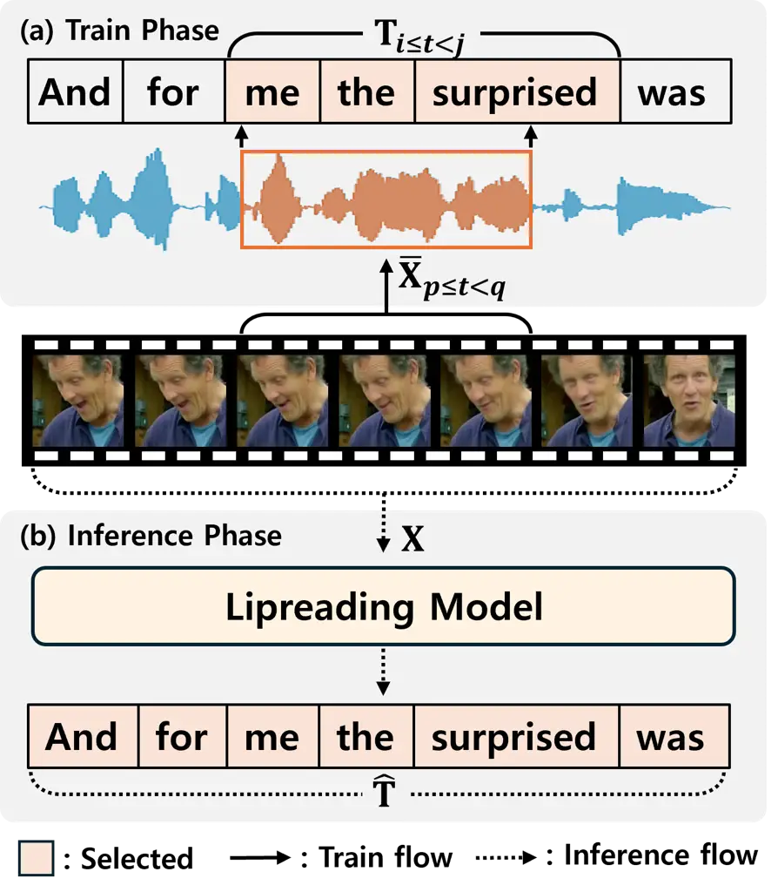

Figure S1: Illustration of video–text synchronization using word-level
timestamps. During training, text segments aligned with the video frames
are selected with a small temporal margin. During inference, the full
transcript is used as input.

|             |               |               |
| ----------- | ------------- | ------------- |
| Models      | Auto-AVSR     | AV-Hubert     |
| LRS2 / LRS3 | 14.60 / 19.10 | 23.82 / 25.51 |

Table S3: WER results for lip-reading backbone benchmarks.

| WER \[%\]        |   Ratio |  Metric                  | Text-free Models |         |           | Text-guided Models |            |
| ---------------- | ------- | ------------------------ | ---------------- | ------- | --------- | ------------------ | ---------- |
| (in Lip-reading) |         |                          | IntelligibleL2S  | DiffV2S | V2SFlow-V | LipVoicer          | Ours (WYS) |
| = 0              | 0.61    | WER \[%\] $`\downarrow`$ | 25.1919          | 40.6489 | 26.8763   | 4.2358             | 6.0624     |
|                  |         | LSE-C $`\uparrow`$       | 7.1005           | 6.7143  | 7.2917    | 5.9842             | 7.5834     |
|                  |         | LSE-D $`\downarrow`$     | 7.0827           | 7.5199  | 7.1889    | 8.2879             | 6.7649     |
|                  |         | STOI-Net $`\uparrow`$    | 0.8594           | 0.8931  | 0.9210    | 0.9048             | 0.9137     |
|                  |         | DNSMOS $`\uparrow`$      | 2.6625           | 3.0750  | 3.0750    | 3.0529             | 3.0948     |
| (0, 50\]         | 0.26    | WER \[%\] $`\downarrow`$ | 40.5635          | 58.6261 | 40.9356   | 26.4752            | 28.7612    |
|                  |         | LSE-C $`\uparrow`$       | 7.0715           | 6.3118  | 7.2191    | 5.8798             | 7.5483     |
|                  |         | LSE-D $`\downarrow`$     | 7.1249           | 7.7609  | 7.3305    | 8.4246             | 6.8357     |
|                  |         | STOI-Net $`\uparrow`$    | 0.8550           | 0.8912  | 0.9227    | 0.9073             | 0.9136     |
|                  |         | DNSMOS $`\uparrow`$      | 2.6683           | 2.9444  | 3.1376    | 3.0912             | 3.1134     |
| $`>`$ 50         | 0.13    | WER \[%\] $`\downarrow`$ | 75.2857          | 89.4285 | 78.0021   | 78.5714            | 78.7142    |
|                  |         | LSE-C $`\uparrow`$       | 6.4737           | 5.6688  | 6.5750    | 5.0511             | 6.9790     |
|                  |         | LSE-D $`\downarrow`$     | 7.2273           | 8.2211  | 7.5075    | 8.7748             | 6.9457     |
|                  |         | STOI-Net $`\uparrow`$    | 0.8397           | 0.8903  | 0.9233    | 0.8998             | 0.9126     |
|                  |         | DNSMOS $`\uparrow`$      | 2.5776           | 2.8641  | 3.0398    | 2.9945             | 3.0273     |

Table S4: Robustness evaluation under imperfect text conditions (LRS2).

## Appendix F Robustness to Imperfect Text

Tab. S4 provides a more detailed analysis under imperfect textual
conditions on the LRS2 dataset, reporting LSE-D and STOI-Net in addition
to the metrics discussed in the main paper. The additional metrics
exhibit trends consistent with the main results. In particular, WYS
maintains low LSE-D values across all text corruption levels, indicating
stable audio–visual synchronization. For STOI-Net, text-free models
achieve slightly higher scores in some conditions, while WYS remains
competitive overall. We also observe that as text corruption increases,
WER increases significantly across all models, whereas STOI-Net and
DNSMOS change more gradually. Overall, WYS maintains a balanced
performance between linguistic accuracy and perceptual speech quality
under varying levels of textual reliability.

## Appendix G Qualitative Comparison of Mel Spectrograms

### G.1 Comparison with Other Models

We present a qualitative comparison of the mel spectrograms generated by
the comparative models and our proposed method. As illustrated in
Fig. S2 and Fig. S3, our method generates mel spectrograms that closely
match the ground-truth, capturing detailed acoustic features and
harmonic patterns across diverse samples from the LRS2 and LRS3 dataset.
In contrast, VCA-GAN \[Kim et al.(2021)Kim, Hong, and Ro\], SVTS \[Mira
et al.(2022)Mira, Haliassos, Petridis, Schuller, and Pantic\], and
DiffV2S \[Choi et al.(2023a)Choi, Hong, and Ro\] generate blurred mel
spectrograms compared to ground-truth (GT), which often results in
inaccurate speech generation. IntelligibleL2S \[Choi et al.(2023b)Choi,
Kim, and Ro\] and V2SFlow \[Choi et al.(2025a)Choi, Kim, Li, Chung, and
Liu\] show closer approximations, but still exhibit differences in fine
details compared to ground truth (GT). On the other hand, our proposed
model accurately preserves subtle spectral features and visually aligns
best with the original mel spectrograms. This fidelity in mel
spectrograms contributes to the generation of speech that is both
intelligible and natural. We further validate this observation through
Automatic-Speech-Recognition(ASR) evaluation, which confirms that our
proposed model consistently achieves the most stable performance across
samples.

### G.2 Failure Case

Fig. S4 presents failure cases where the original audio is not
accurately reconstructed on LRS2 and LRS3. Although the proposed model
achieves superior performance in terms of Word Error Rate (WER) compared
to comparative models, it still fails to fully capture the correct
textual content in certain instances. This limitation arises from the
use of pseudo-text generated by the lip-reading model during inference,
which imposes an upper bound on performance. Since the quality of the
guided embedding depends on the accuracy of the lipreading output,
errors in the pseudo-text can lead to suboptimal reconstructions.

### G.3 Effect of Attention Mechanism

Fig. S5 compares the mel spectrograms generated under different
configurations of the attention mechanism. $`\mathbf{e}_{\text{m}}`$ and
$`\mathbf{e}_{\text{m}}^{\text{self}}`$ denote the encoder output and
the self-attention output, respectively, where
$`m\in\{\text{txt},\text{vid}\}`$ indicates the modality (i.e., text or
video). $`\mathbf{e}_{m\to w}^{\text{cross}}`$ is the cross-attention
output when modality $`m`$ serves as the query.
$`\mathbf{e}_{\text{syn}}`$ is the proposed embedding. As shown in
Fig. S5 (i-iii), the resulting mel spectrograms fail to properly reflect
the underlying text information, indicating the limitations of these
configurations. In contrast, Fig. S5 (iv-vi), which incorporate
attention mechanisms, demonstrate more accurate guidance from attention
mechanism. Notably, our proposed model in Fig. S5 (vi) yields a mel
spectrogram that most closely resembles the ground truth, particularly
in the low-frequency regions. These results substantiate the
effectiveness of the proposed approach.

### G.4 Effect of Lip-Reading Model

We compare mel spectrograms generated using different text inputs during
inference. In Fig. S6 (i), the proposed method utilizes pseudo-text
generated by lipreading model as the input. In contrast, Fig. S6 (ii)
shows the result when the GT text is provided instead. A comparison of
the text outputs reveals that using GT text as input yields higher text
accuracy. Furthermore, mel spectrogram with GT text input exhibits
greater similarity to the GT mel spectrogram, compared to that generated
using lipreading based pseudo-text.

### G.5 Effect of Guidance Scale Factor

Fig. S7 illustrates the effect of the guidance scale factor $`\omega`$
on the resulting mel spectrograms. As shown in Fig. S7 (ii-iv), when
guidance is applied, the model generates stable and coherent mel
spectrograms that closely resemble the GT mel spectrogram. In contrast,
Fig. S7 (i), which corresponds to the case without guidance, exhibits a
distorted and unstable mel spectrogram, highlighting the importance of
the guidance.

### G.6 Effect of Sampling Steps

Fig. S8 shows the mel spectrograms generated with different sampling
steps. As observed in Fig. S8 (i-iii), the overall structure of the mel
spectrograms remains largely unchanged across varying sampling steps.
Moreover, even with as few as 10 steps, the model produces perceptually
meaning mel spectrograms. While the baseline setup of the original paper
employs 100 steps, our results suggest that using only 10 steps can be
an effective and efficient alternative in practical applications.

## Appendix H Crowdsource Evaluation

Fig. S9 presents the instructions displayed on the evaluation webpage
used for crowdsourced MOS assessments via Amazon Mechanical Turk
(MTurk). The evaluation criteria include overall audio fidelity
(quality), correspondence to the reference text (alignment), clarity of
the spoken content (intelligibility), audio-visual consistency
(synchronization), and perceived human-likeness of the speech
(naturalness), as illustrated in Fig. S9. On MTurk, each task unit is
referred to as a Human Intelligence Task (HIT). For the MOS evaluation,
a total of 20 HITs were created, with 10 for the LRS2 dataset and 10 for
the LRS3 dataset. Each HIT required participants to evaluate five video
samples corresponding to different models and was assigned to 10 unique
participants, with a reward of 0.5 USD per HIT.

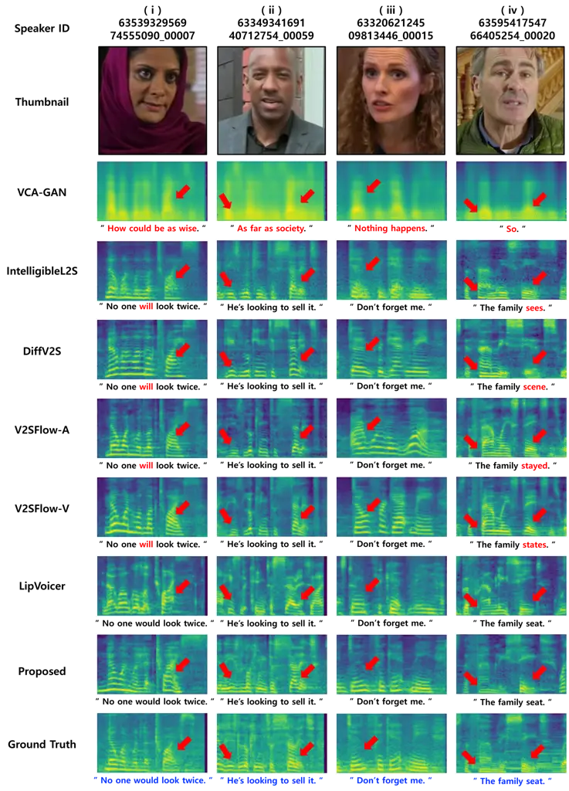

Figure S2: Qualitative comparison of mel spectrograms for LRS2 dataset.
The scripts below each mel spectrogram represent the ASR-predicted text
in black, while the ground-truth (GT) text is shown beneath the GT mel
spectrogram in blue. Incorrectly predicted words are highlighted in red.

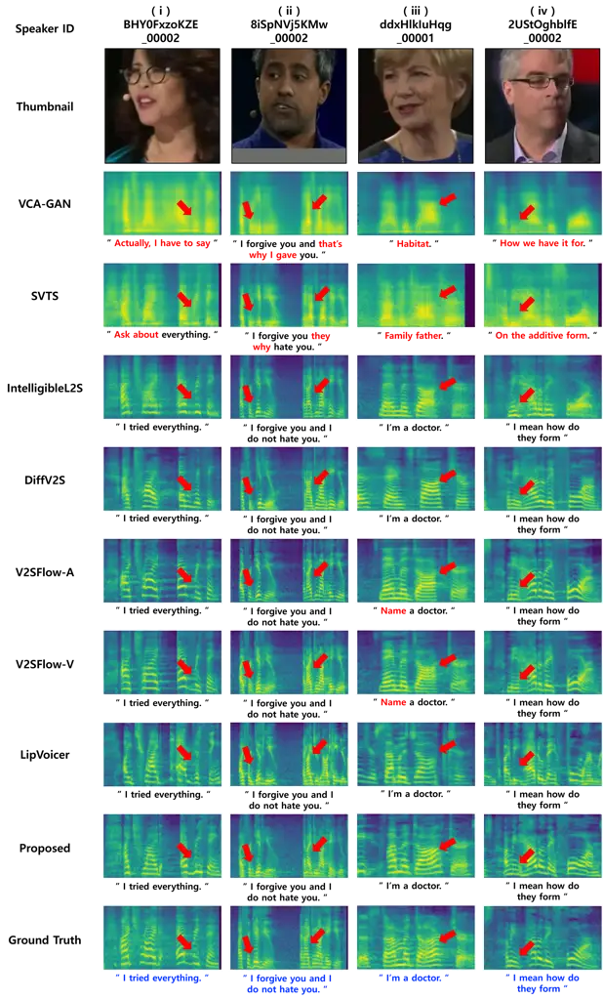

Figure S3: Qualitative comparison of mel spectrograms for LRS3 dataset.
The scripts below each mel spectrogram represent the ASR-predicted text
in black, while the ground-truth (GT) text is shown beneath the GT mel
spectrogram in blue. Incorrectly predicted words are highlighted in red.

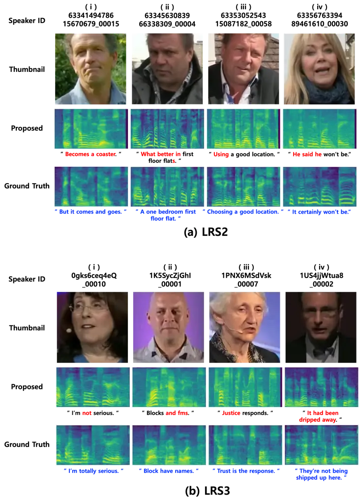

Figure S4: Failure cases in mel spectrogram generation with incorrect
text predictions on (a) LRS2 and (b) LRS3. The scripts below each mel
spectrogram represent the ASR-predicted text in black, while the
ground-truth (GT) text is shown beneath the GT mel spectrogram in blue.
Incorrectly predicted words are highlighted in red.

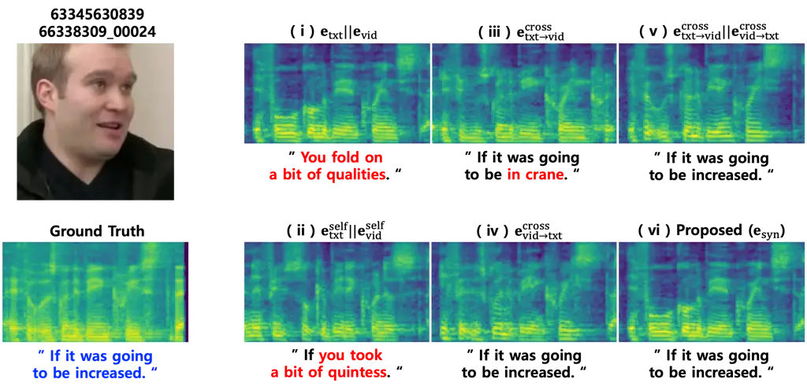

Figure S5: Qualitative comparison of mel spectrograms based on different
embedding combinations in the attention mechanism for the LRS2 Dataset.
The scripts below each mel spectrogram represent the ASR-predicted text
in black, while the ground-truth (GT) text is shown beneath the GT mel
spectrogram in blue. Incorrectly predicted words are highlighted in red.

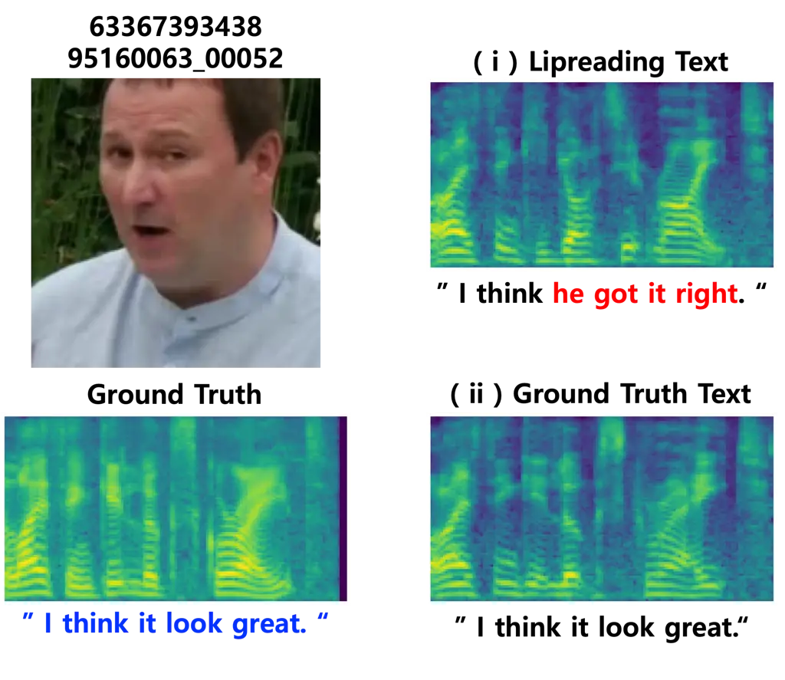

Figure S6: Mel spectrogram comparison on LRS2 using different guiding
texts during inference: (i) Lipreading Text, (ii) Ground-Truth Text. The
scripts below each mel spectrogram represent the ASR-predicted text in
black, while the ground-truth (GT) text is shown beneath the GT mel
spectrogram in blue. Incorrectly predicted words are highlighted in red.

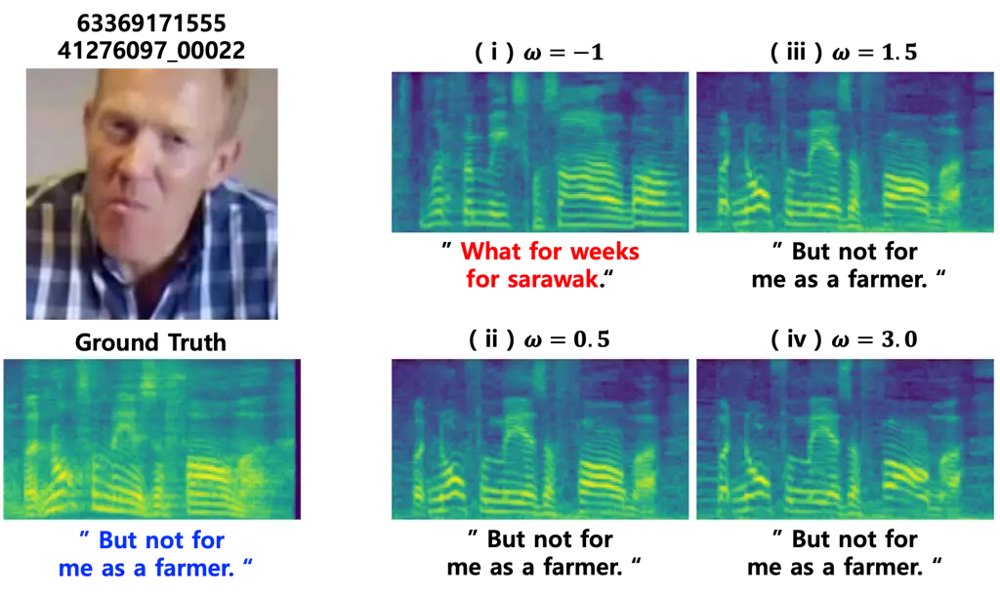

Figure S7: Mel spectrogram comparison on LRS2 with different values of
the guidance scaling factor $`\omega`$. The scripts below each mel
spectrogram represent the ASR-predicted text in black, while the
ground-truth (GT) text is shown beneath the GT mel spectrogram in blue.
Incorrectly predicted words are highlighted in red.

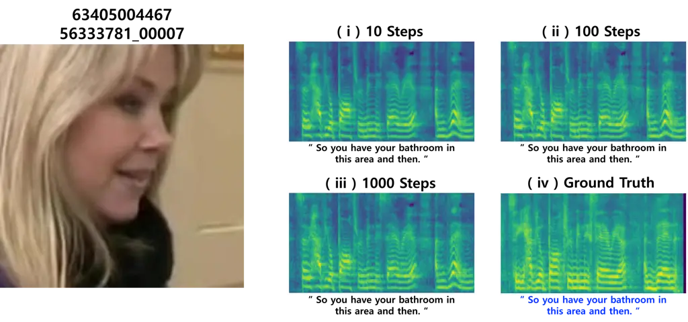

Figure S8: Mel spectrogram comparison on LRS2 using different sampling
steps: (i) 10 steps, (ii) 100 steps, (iii) 1000 steps, and (iv)
Ground-Truth. The scripts below each mel spectrogram represent the
ASR-predicted text in black, while the ground-truth (GT) text is shown
beneath the GT mel spectrogram in blue.

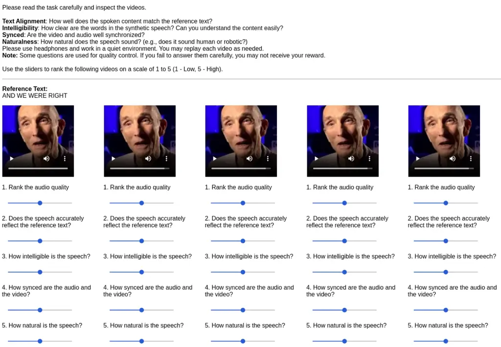

Figure S9: MOS evaluations. Participants evaluated samples from
IntelligibleL2S \[Choi et al.(2023b)Choi, Kim, and Ro\], DiffV2S \[Choi
et al.(2023a)Choi, Hong, and Ro\], LipVoicer \[Yemini
et al.(2024)Yemini, Shamsian, Bracha, Gannot, and Fetaya\], V2SFlow-V
\[Choi et al.(2025a)Choi, Kim, Li, Chung, and Liu\], WYS (Ours), and the
ground-truth based on five criteria, with randomized sample.
