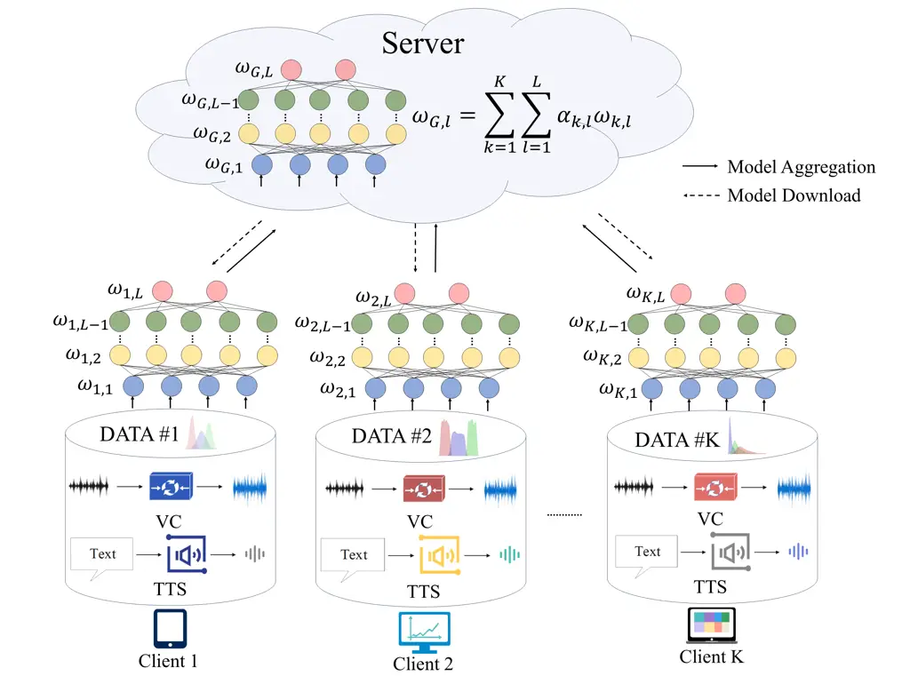
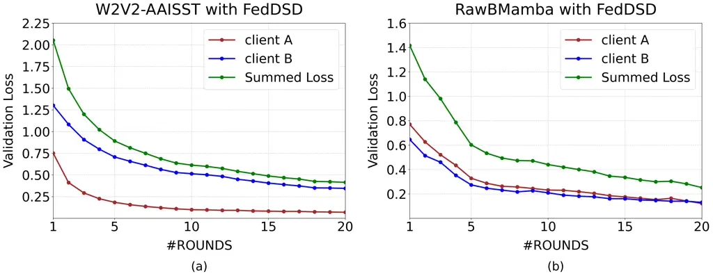

# A Federated Deepfake Speech Detection Method Based on Layer-Wise Center-Guided Weighting Aggregation Thanks: This work was supported by the National Natural Science Foundation of China (NSFC) under Grant No. 62071242. (Corresponding author: Haiyan Guo.)

Yingjian Yu, Haiyan Guo^(\*), Tianshun Wang, Zirui Ge, Chi Liu
Affiliation: School of Communications and Information Engineering,  
Nanjing University of Posts and Telecommunications, Nanjing 210003,
China Affiliation: Emails: {1024010412, guohy, tswang, 2022010211,
1224014133}@njupt.edu.cn

###### Abstract

The advancement of deep learning-based speech synthesis has
significantly increased the diversity of deepfake speech, posing threats
to voice authentication. While centralized training is effective for
deepfake speech detection (DSD), it requires considerable computational
resources and raises privacy concerns. To address these issues, we
propose a Federated DSD (FedDSD) method that enables collaborative model
training across decentralized speech datasets without sharing raw audio.
Specifically, each client trains a local model using the FedProx
algorithm to mitigate the effects of data heterogeneity and uploads
model parameters to a central server. To improve global model
aggregation, we further propose a layer-wise center-guided weighting
aggregation (L-CGWA) strategy that adjusts each client’s contribution
per layer based on its distance to a reference center, capturing
inter-client and inter-layer discrepancies and enhancing the robustness
of model aggregation. Experimental results demonstrate that models
trained under the proposed FedDSD method achieve equal error rates
(EERs) comparable to those obtained via centralized co-training, while
significantly outperforming models trained on individual corpora.
Furthermore, the proposed FedDSD method demonstrates robust
generalization capabilities across diverse cross-domain datasets.

###### Index Terms: 

deepfake speech detection, federated learning, deep learning

## I Introduction

In recent years, great progress has been made in deep learning-based
speech generation technology, leading to significant improvements in
generated speech quality in terms of both accuracy and naturalness.
Specifically, current state-of-the-art Audio Language Model (ALM)-based
text-to-speech (TTS) methods can mimic a real speaker’s voice given a
recording lasting just a few seconds. As a result, the misuse of
advanced speech generation techniques poses significant challenges to
the security and reliability of voice-based systems.

To address these security concerns, various deepfake speech detection
(DSD) models have been proposed, such as RawNet2\[1\], ASSIST\[2\],
Wav2Vec2-based (W2V2-based) architectures\[3, 4\], WavLM-based
models\[5, 6\], and Mamba-based networks\[7, 8\]. Although these models
have achieved impressive results on datasets such as ASVspoof2019 LA
(19LA), ASVspoof2021 LA (21LA), and even ASVspoof2021 DF (21DF), recent
studies show that they struggle to detect deepfake speech produced by
emerging ALM-based TTS systems \[9, 10, 11\]. This deficiency arises
because most existing detection models are trained on fake speech
generated by vocoder-based synthesis techniques. However, such
techniques differ fundamentally from ALM-based TTS systems, which
produce speech using discrete codec representations. To address this, Wu
et al. and Xie et al. introduced two Codecfake datasets\[9, 10\], each
of which is a large-scale, codec-specific dataset comprising speech
re-synthesized via different neural audio codec models. Experimental
results show that models trained on Codecfake can detect ALM-based
deepfake speech, yet exhibit degraded performance on vocoder-based
audio. To further bridge this gap, Xie et al. employed a co-training
strategy\[12\] that aggregates all available data to train a unified
model\[10\], mitigating domain-specific biases and achieving low EERs
across diverse deepfake speech generation methods.

However, this co-training method relies on centralized data processing,
requiring a powerful server with sufficient storage and computational
resources to manage multiple large-scale datasets. Most
resource-constrained clients lack such resources and therefore can only
utilize a fixed pre-trained model provided by the server to benefit from
the co-training scheme. Nevertheless, this approach may still not be
effective, as clients continuously receive new speech data that may
exhibit distributional shifts relative to the training data of the
co-trained model. Thus, in order to further improve the DSD performance
of the co-training scheme, clients would need to upload their raw data
to the server for further training. However, this practice poses
significant privacy risks, as raw speech data usually contain sensitive
personal information that users are unwilling or legally prohibited from
sharing.

To address these challenges, we propose a novel method named Federated
Deepfake Speech Detection (FedDSD). FedDSD leverages federated learning
(FL) to collaboratively train a global model without sharing raw audio
data. Considering the data heterogeneity, we propose to adopt
Fedprox\[13\] during the local DSD model training to mitigate client
drift. Furthermore, to account for layer-specific variations and
alleviate the impact of heterogeneous data distribution, we propose a
layer-wise center-guided weighting aggregation (L-CGWA) strategy. The
main contributions of this paper are summarized as follows:

\(1\) We propose FedDSD based on FL for effective DSD. Instead of
centralized training, FedDSD allows clients to train locally on their
private data and collaboratively build a global model through parameter
aggregation, without sharing raw data or exposing sensitive information.

\(2\) Considering that discrepancies among clients’ datasets may cause
misaligned layer-wise representations, we propose an L-CGWA strategy for
global aggregation. For each layer, a reference center is computed by
averaging the corresponding parameters across all clients to capture
shared knowledge. Client updates are then weighted inversely to their
distance from this center, such that updates closer to the consensus
receive higher weights, while more divergent ones contribute less. This
design enhances the robustness of aggregation by reducing the influence
of heterogeneous updates.

\(3\) Experimental results show that models trained under the proposed
FedDSD method significantly outperform those trained in an isolated
single-dataset paradigm, and achieve EERs comparable to those achieved
by the co-training approach. Additionally, the proposed FedDSD method
demonstrates strong generalization across cross-domain benchmarks,
further validating the effectiveness of our approach.



Fig. 1: Overview of our FedDSD framework.

## II Related Work

### II-A Deepfake Speech Detection

The development of DSD models has evolved through several key phases.
Early methodologies extracted handcrafted features (e.g., Mel-frequency
cepstral coefficients, constant-Q cepstral coefficients, etc.) and
combined them with classifiers such as Gaussian mixture models (GMM) or
light convolutional neural network (LCNN). Recent methods generally
adopt end-to-end architectures that directly process raw audio waveform.
For example, H. Tak et al. proposed RawNet2, which employs learnable
SincNet filters as a front-end feature extractor\[1\]. Building on
RawNet2, H. Tak et al. introduced RawGAT by adding a channel dimension
to capture time-frequency representation\[15\] . J.-W. Jung et al.
presented AASIST, which incorporates graph attention networks to model
interactions between spectral and temporal nodes\[2\]. Recent studies
propose to extract generalized embeddings from pre-trained models, such
as W2V2 and WavLM to improve the performance of DSD models\[3, 16, 17,
18\]. More recently, Y. Chen et al. utilized Mamba to effectively
capture long-range artifacts from raw audio while maintaining low
inference latency\[7\]. Considering the strong performance of
pre-trained models and the fast inference speed of Mamba, we select both
W2V2-AASIST\[10\] and RawBMamba\[7\] as local models to show the wide
applicability of our proposed FedDSD method.

### II-B Model Aggregation Schemes

In aggregation-based FL, model aggregation is central to synthesizing a
global model from distributed client updates. The widely used FedAvg
algorithm \[14\] performs weighted averaging based on the sizes of local
datasets. However, this approach tends to overemphasize clients with
larger data volumes, often resulting in suboptimal performance,
particularly in the presence of data heterogeneity. To address this
limitation, various enhancements to the aggregation process have been
proposed. For instance, Yeganeh et al. assigned higher aggregation
weights to clients exhibiting greater parameter divergence from the
global model\[21\]. Similarly, Ye et al. considered class distribution
disparities as an additional factor in weight assignment\[22\]. These
methods apply a uniform aggregation weight across the entire model.
Considering the fact that different layers in deep neural networks often
exhibit varying levels of divergence across clients, Rehman et al.
introduced a layer-wise strategy based on cosine similarity to guide
aggregation, thereby facilitating smoother model optimization and faster
convergence\[24\]. In this paper, we propose a novel L-CGWA strategy
which computes a reference center to guide the aggregation of local
models at the layer level, to account for layer-specific variations and
enhances the robustness of model aggregation.

## III Proposed Method

### III-A Overall framework of FedDSD

As shown in Fig.1, FedDSD follows typical FL steps: (1) global model
downloading, (2) local updating, (3) local model uploading and (4) model
aggregation. Each client owns a local dataset
$`\mathcal{D}_{k}=\{(x_{k,1},y_{k,1}),(x_{k,2},y_{k,2}),\ldots,(x_{k,n},y_{k,n})\}`$,
where $`x_{k,i}`$ and $`y_{k,i}`$ denote the $`i`$th raw speech segment
and its corresponding label (i.e., bonafide or spoofed) of $`k`$th
client, respectively. Each dataset includes deepfake speech generated by
different TTS or voice conversion (VC) frameworks. The data samples in
$`\mathcal{D}_{k}`$ are used to train the local DSD model parameterized
by $`w_{k}`$. After local training based on FedProx, the participating
clients upload their local model parameters to the central server. The
server then aggregates these local model parameters by performing the
proposed L-CGWA strategy to obtain a global DSD model, and sends the
global model to each client for the next round training. By doing so,
the server constructs a global DSD model $`w_{G}`$ that integrates
knowledge from all participating clients while preserving data privacy.
In this way, clients with limited memory or computational resources can
still benefit from this global model by locally training on their own
data and uploading only model parameters.

The objective of FedDSD can be formulated as

```math
\displaystyle\min_{w_{G}}\sum_{k=1}^{K}\frac{\lvert\mathcal{D}_{k}\rvert}{N}\sum_{i=1}^{\lvert\mathcal{D}_{k}\rvert}\mathcal{L}(\mathcal{F}(w_{G};x_{k,i}),y_{k,i}), \tag{1}
```

where $`\lvert\mathcal{D}_{k}\rvert`$ denotes the number of data samples
for $`k`$th client, $`N`$ represents the total number of data samples
across all clients, $`\mathcal{L}`$ is a general loss function for DSD
tasks, and $`\mathcal{F}`$ denotes the global model parameterized by
$`w_{G}`$.

### III-B Fedprox based Local DSD model training

In real-world scenarios, clients may encounter deepfake speech produced
by diverse spoofing algorithms and synthesis techniques. That is, the
local datasets on different clients show significant data heterogeneity,
leading to obvious data distribution disparities. Considering this, in
the local DSD model training phase, we propose to adopt
FedProx \[13\] to alleviate optimization inconsistencies and convergence
difficulties caused by heterogeneous data distributions. Specifically,
at each round of training, the local objective for the $`k`$th client is
formulated as

```math
\displaystyle\min_{w_{k}}\mathcal{L}(f_{k}(w_{k};x_{k,i}),y_{k,i})+\frac{\mu}{2}\|w_{k}-w_{G}\|^{2}, \tag{2}
```

where $`f_{k}`$ denotes the local DSD model of $`k`$th client
parameterized by $`w_{k}`$, and $`\mu`$ is a non-negative regularization
hyperparameter that controls the influence of the proximal term. It
penalizes large deviations of local parameters $`w_{k}`$ from the global
model $`w_{G}`$, thereby encouraging local updates to remain close to
the global solution and enhancing training stability under heterogeneous
data distributions.

### III-C L-CGWA based Global DSD model aggregation

In the proposed FedDSD method, client models share the same
architecture. However, due to heterogeneous data distributions, the
feature representations learned by different clients can become
misaligned across corresponding layers, meaning that similar inputs may
be mapped to inconsistent feature spaces\[30\]. Moreover, different
layers are affected by data heterogeneity to varying degrees, where
lower layers tend to learn general acoustic patterns, while higher
layers are more sensitive to dataset-specific characteristics. Hence, in
the global model aggregation phase, we propose a novel L-CGWA strategy
to address dataset-induced divergence in the representations learned at
different depths of the local DSD model. Specifically, the $`l`$th layer
of the global model parameter at the $`t`$th round $`w_{G,l}^{t}`$ is
obtained as

```math
\displaystyle w_{G,l}^{t}=\sum_{l=1}^{L}\sum_{k=1}^{K}\alpha_{k,l}^{t-1}w_{k,l}^{t-1}, \tag{3}
```

where the aggregation weight for the $`l`$th layer of the $`k`$th client
is given by

```math
\displaystyle{\alpha}_{k,l}^{t}=\frac{\tilde{\alpha}_{k,l}^{t}}{\sum_{k=1}^{K}\tilde{\alpha}_{k,l}^{t}}. \tag{4}
```

In (4), $`\tilde{\alpha}_{k,l}^{t}`$ is obtained as

```math
\displaystyle\tilde{\alpha}_{k,l}^{t}=\frac{1}{\|w_{k,l}^{t}-w_{\text{center},l}^{t}\|_{2}+\epsilon}, \tag{5}
```

where $`w_{k,l}^{t}`$ denotes the parameters of the $`l`$th layer of the
$`k`$th client at round $`t`$, and $`w_{center,l}^{t}`$ represents the
arithmetic mean of the $`l`$th layer parameters across all participating
clients at round $`t`$, which is given by

```math
\displaystyle w_{center,l}^{t}=\frac{\sum_{k=1}^{K}w_{k,l}^{t}}{K}. \tag{6}
```

By operating at the granularity of individual layers, our proposed
L-CGWA strategy better captures cross-client heterogeneity that varies
across the network depth, and provides a more flexible and adaptive
alternative to traditional uniform-weight aggregation.

As stated above, in the proposed L-CGWA strategy, $`w_{center,l}^{t}`$
is computed as the average of corresponding parameters from all clients,
serving as a temporary reference center that captures shared knowledge
for the $`l`$th layer at round $`t`$. The parameters of the $`l`$th
layer in each client’s model are weighted according to the inverse of
its distance to $`w_{center,l}^{t}`$. Setting $`w_{center,l}^{t}`$ as
the center for the $`l`$th layer offers several benefits. Geometrically,
it serves as a neutral reference point among client models, mitigating
bias toward any single update in heterogeneous environments. It also
serves as a consistent reference baseline for evaluating the
contribution of each client model. Specifically, a client model closer
to the center is more likely to capture shared patterns across datasets.
In addition, this design suppresses the influence of anomalous or overly
specialized client updates by assigning them lower weights, thereby
stabilizing the aggregation process without the need for explicit
outlier detection. Overall, this approach emphasizes updates that are
more consistent with the majority while reducing the impact of outlier
behavior.

### III-D Details of FedDSD algorithm

The process above is repeated for $`T`$ rounds. At the end of each
round, the updated global model is transmitted to all clients as the
initialization for subsequent local model update in the next training
round. To evaluate the performance of the global model without
centralizing local data, each client computes the average loss on its
local validation set and uploads the loss value to the central server.
The server then aggregates these losses by simply averaging them. Once
the FL training is terminated, the global model from all communication
rounds with the lowest aggregated validation loss is retained as the
ultimate DSD global model, and downloaded to each client for DSD task.
The details of the proposed FedDSD are summarized in Algorithm 1.

 Initialization: total number of clients $`K`$, total communication
rounds $`T`$, local epochs $`E`$, total model layers $`L`$

 Server side:

 1. Initialize parameters $`w_{G}^{0}`$

 2. for each round $`t=1,\ldots,T`$ do

 3.    for each client $`k=1,\ldots,K`$ in parallel do

 4.     $`w_{k}^{t}\leftarrow`$ ClientUpdate($`k`$,$`w_{G}^{t}`$)

 5.    End for

 6.     for each layer $`l=1,\ldots,L`$ do

 7.      $`w_{G,l}^{t+1}\leftarrow`$ Eq.(3)

 8.     End for

 9.    Send $`w_{G}^{t+1}`$ to all clients,

 10. End for

 Client side:

 11. ClientUpdate($`k`$,$`w_{G}^{t}`$):

 12.    for each client epoch $`e=1,\ldots,E`$ do

 13.      $`\mathcal{L}(w_{G}^{t})\leftarrow`$ Eq.(2)

 14.     
$`w_{k}^{t}\leftarrow w_{k}^{t}-\epsilon\nabla\mathcal{L}(w_{G}^{t})`$

 15. Upload $`w_{k}^{t}`$ to Server side

Algorithm 1 FedDSD

|                                         |                    |                         |        |           |        |        |        |        |        |        |        |
| --------------------------------------- | ------------------ | ----------------------- | ------ | --------- | ------ | ------ | ------ | ------ | ------ | ------ | ------ |
| Methods                                 | Datasets           | Model                   | 19LA   | Codecfake |        |        |        |        |        |        | AVG    |
|                                         |                    |                         |        | C1        | C2     | C3     | C4     | C5     | C6     | C7     |        |
| Single                                  | 19LA               | W2V2-AASIST^($`\star`$) | 0.122  | 40.142    | 42.908 | 44.564 | 33.580 | 39.197 | 44.889 | 45.804 | 36.401 |
|                                         |                    | RawBMamba               | 1.199  | 31.343    | 48.685 | 49.040 | 48.292 | 58.013 | 40.437 | 50.823 | 40.979 |
|                                         | Codecfake          | W2V2-AASIST^($`\star`$) | 3.806  | 0.167     | 0.008  | 0.023  | 0.015  | 0.038  | 0.106  | 0.884  | 0.631  |
|                                         |                    | RawBMamba               | 28.064 | 0.023     | 0.030  | 0.030  | 0.023  | 0.023  | 0.038  | 6.258  | 4.311  |
| Co-training                             | 19LA+Codecfake     | W2V2-AASIST^($`\star`$) | 0.625  | 0.015     | 0.030  | 0.023  | 0.023  | 0.038  | 0.098  | 0.627  | 0.185  |
|                                         |                    | RawBMamba               | 4.768  | 0.008     | 0.045  | 0.008  | 0.008  | 0.008  | 0.030  | 4.754  | 1.201  |
| FedDSD                                  | 19LA→client A      | W2V2-AASIST             | 0.571  | 0.023     | 0.098  | 0.061  | 0.023  | 0.015  | 0.227  | 1.111  | 0.266  |
|                                         | Codecfake→client B | RawBMamba               | 3.509  | 0.076     | 0.078  | 0.023  | 0.089  | 0.111  | 0.359  | 6.413  | 1.332  |
| ^($`\star`$)Results reported in \[10\]. |                    |                         |        |           |        |        |        |        |        |        |        |

TABLE I: EER(%) Results of In-domain and Cross-domain Evaluations on
ASVspoof 2019LA and Codecfake

| Methods        | 19LA  | Codecfake |       |       |       |       |       |       | AVG   |
| -------------- | ----- | --------- | ----- | ----- | ----- | ----- | ----- | ----- | ----- |
|                |       | C1        | C2    | C3    | C4    | C5    | C6    | C7    |       |
| Fedprox\[13\]  | 4.025 | 0.023     | 0.030 | 0.053 | 0.053 | 0.030 | 0.129 | 1.058 | 0.675 |
| IDA\[21\]      | 0.720 | 0.008     | 0.083 | 0.061 | 0.030 | 0.008 | 0.197 | 1.186 | 0.287 |
| FedDisco\[22\] | 3.997 | 0.030     | 0.068 | 0.106 | 0.053 | 0.045 | 0.454 | 2.071 | 0.853 |
| L-DAWA\[24\]   | 1.332 | 0.030     | 0.008 | 0.075 | 0.027 | 0.122 | 0.431 | 1.808 | 0.479 |
| FedLAMA\[23\]  | 0.831 | 0.038     | 0.212 | 0.068 | 0.045 | 0.008 | 0.272 | 1.359 | 0.298 |
| FedDSD         | 0.571 | 0.023     | 0.098 | 0.061 | 0.023 | 0.015 | 0.227 | 1.111 | 0.266 |

TABLE II: Comparison(%) of Model Aggregation Schemes on Cross-domain
Evaluations Using W2V2-AASIST

| Components |        | 19LA  | Codecfake |       |       |       |       |       |       | AVG   |
| ---------- | ------ | ----- | --------- | ----- | ----- | ----- | ----- | ----- | ----- | ----- |
| FedProx    | L-CGWA |       | C1        | C2    | C3    | C4    | C5    | C6    | C7    |       |
| ✓          |        | 4.025 | 0.023     | 0.030 | 0.053 | 0.053 | 0.030 | 0.129 | 1.058 | 0.675 |
|            | ✓      | 1.088 | 0.015     | 0.076 | 0.078 | 0.038 | 0.015 | 0.219 | 1.064 | 0.324 |
| ✓          | ✓      | 0.571 | 0.023     | 0.098 | 0.061 | 0.023 | 0.015 | 0.227 | 1.111 | 0.266 |

TABLE III: Results of the Ablation Study Corresponding To The adopted
Using W2V2-AASIST

| Methods                         | 21LA | 21DF  | ITW                                      |
| ------------------------------- | ---- | ----- | ---------------------------------------- |
| RawNet2\[1\]                    | 5.31 | 22.38 | 33.94 (Reported by \[25\])               |
| RawBMamba\[7\]                  | 3.28 | 15.85 | 47.02 (Evaluated by released checkpoint) |
| W2V2+FC+ASP\[3\]                | 3.54 | 4.98  | –                                        |
| 12L-WavLM-Large AttM-LSTM\[27\] | 3.50 | 3.19  | –                                        |
| 10L-WavLM-Large LinM-LSTM\[27\] | 4.52 | 4.37  | –                                        |
| WavLM-Large+MFA\[5\]            | 5.08 | 2.56  | –                                        |
| W2V2+AASIST2\[26\]              | 1.61 | 2.77  | –                                        |
| W2V2+MoE (frozen)\[28\]         | 2.96 | 2.54  | 12.48 (Reported by \[28\])               |
| W2V2+MoE (fine-tune)\[28\]      | 4.25 | 3.75  | 9.17 (Reported by \[28\])                |
| XLSR+AASIST\[4\]                | 1.00 | 3.69  | 10.46 (Reported by \[29\])               |
| XLSR+Mamba\[8\]                 | 0.93 | 1.88  | 6.71 (Reported by \[8\])                 |
| XLSR+Conformer+TCM\[32\]        | 1.18 | 2.25  | 7.79 (Reported by \[8\])                 |
| FedDSD (Ours)                   | 2.86 | 2.27  | 8.98                                     |

TABLE IV: Comparison of Out-of-Domain EERs with state-of-the-art DSD
Methods Using W2V2-AASIST

## IV Experiments AND Results

### IV-A Experiments settings

#### IV-A1 Datasets

We first thoroughly validate the proposed FedDSD method on two publicly
available datasets: 19LA \[19\] and Codecfake \[10\], both partitioned
into standard training, validation, and test sets. The details regarding
the two datasets are shown as follows.

• 19LA is based on vocoder-driven TTS and VC methods, comprising 25,380
training samples generated by six vocoder types, 24,844 development
samples, and 71,237 evaluation samples. The evaluation set introduces
seven additional vocoder types, resulting in thirteen distinct attack
classes overall.

• Codecfake dataset targets ALM-based deepfake audio, comprising 740,747
training utterances generated by six neural audio codec models (C1–C6),
with C7 reserved as an unseen method. The development and evaluation
sets consist of 92,596 and 224,873 samples, respectively.

To assess the effectiveness and generalizability of the proposed FedDSD
method, we conducted experiments on 21LA\[31\], 21DF\[31\] and
In-the-Wild (ITW)\[25\].

#### IV-A2 Implementation Details

In our proposed FedDSD method, we simulate a statistically heterogeneous
setting by assigning the 19LA dataset to client A and the Codecfake
dataset to client B. Both clients adopt the RawBMamba model \[7\] as
their initial DSD model. Additionally, we conduct experiments using the
W2V2-AASIST model \[10\] as the initial model to demonstrate the general
applicability of the proposed FedDSD method. Since our primary goal is
to focus on in-domain and cross-domain evaluation rather than
architectural refinements, we use the default hyperparameters as
provided by the original work. For the regularization term, $`\mu`$ is
set to 0.1. The system is configured with 20 communication rounds and 10
local epochs per round. Model performance is evaluated based on the
EERs. It should be noted that we adopt a two-client configuration with
19LA and Codecfake assigned to different clients. Although not
representative of large-scale federated settings, this setup creates a
highly heterogeneous scenario, as the two datasets stem from
fundamentally different spoofing paradigms, thereby enabling us to
assess the robustness of FedDSD and the effectiveness of L-CGWA under
severe non-IID conditions.



Fig. 2: Validation loss versus communication rounds for FedDSD method
with W2V2-AASIST and RawBMamba as local model, respectively.

### IV-B Experimental Results

Fig. 2 presents the validation loss versus communication rounds under
the proposed FedDSD framework. It can be observed that the validation
losses on both client A and client B consistently decrease. This trend
indicates that the proposed FedDSD method ensures stable convergence and
progressively enhances the performance of the global model throughout
the FL process.

Table I presents the EER results of the RawBMamba model and W2V2-AASIST
model obtained under four different training conditions: (i) training
solely on 19LA, (ii) training solely on Codecfake, (iii) co-training on
the combined 19LA and Codecfake datasets, and (iv) training under the
proposed FedDSD method. As shown in Table I, under the FedDSD method,
the RawBMamba and W2V2-AASIST architectures achieve an average EER of
1.332% and 0.266%, respectively, both significantly lower than when
trained on individual corpus. From Table I, we can observe that, their
performance remains slightly inferior to that achieved through
centralized co-training. This gap may result from the statistical
heterogeneity of client data in FL, which can lead to inconsistent
updates and hinder global model convergence \[20\].

### IV-C Comparison With Other Model Aggregation Schemes

To assess the effectiveness of the proposed L-CGWA strategy, we compare
FedDSD with several representative model aggregation methods, including
FedProx \[13\], inverse distance aggregation (IDA) \[21\], FedDisco
\[22\], FedLAMA \[23\], and L-DAWA \[24\]. Evaluations are conducted on
both the 19LA and Codecfake datasets, with all aggregation methods
implemented on top of the FedProx framework to ensure fair comparison.
As shown in Table II, FedDSD achieves the lowest average EER of 0.266%,
consistently outperforming all baseline methods. These results
demonstrate the effectiveness of the proposed L-CGWA strategy in
capturing structural discrepancies among clients and facilitating more
coherent, underscoring the importance of incorporating layer-wise
adaptivity into the aggregation process.

### IV-D Ablation Study

To evaluate the contribution of the adopted FedProx and the proposed
L-CGWA strategy in our proposed FedDSD method, we conduct an ablation
study. As shown in Table III, the average EER increases to 0.324% when
only the L-CGWA strategy is applied without FedProx, and further rises
to 0.675% when using only FedProx without L-CGWA. These results indicate
that both the adopted FedProx and the proposed L-CGWA strategy are
indispensable to the overall performance. The observed improvements
demonstrate that the performance gains of FedDSD stem from the
integration of robust optimization and adaptive, structure-aware
aggregation.

### IV-E Comparison of Out-of-Domain EERs with Existing State-of-the-Art DSD Method

To evaluate the generalization capability of the proposed FedDSD
framework, we report EER results on the 21LA, 21DF, and ITW datasets,
comparing them with several state-of-the-art DSD methods, including
RawNet2 \[1\], RawBMamba \[7\], W2V2-based models \[3, 26, 28\],
WavLM-based models \[5, 27\], and XLSR-based models \[4, 8, 32\]. As
shown in Table IV, FedDSD consistently outperforms representative
methods such as RawNet2, RawBMamba, WavLM-based models \[5, 27\],
W2V2+FC+ASP \[3\] and W2V2+MoE \[28\] across all benchmarks. It also
achieves lower EERS than W2V2+AASIST2 and XLSR+AASIST on 21DF, though
performs worse on 21LA. This is likely because both W2V2+AASIST2 and
XLSR+AASIST are trained solely on 19LA, whose distribution align better
with 21LA. Among all methods, the two XLSR-based approaches \[8, 32\]
achieve the lowest overall EERs, representing the best performance.
Their advantage is partly attributed to large-scale multilingual
pretraining and stronger backbones such as Mamba and Conformer, which
offer better temporal modeling than AASIST.

## V Conclusion

This paper proposes FedDSD, a privacy‑preserving federated method for
DSD. In FedDSD, we propose a L-CGWA strategy that robustly aggregates
client models under heterogeneous conditions. Experiments on two
distinct local architectures demonstrate that FedDSD matches centralized
baselines and generalizes well across domains, confirming the
effectiveness of the L-CGWA strategy and demonstrating the broad
applicability of the proposed FedDSD method.

## References

- \[1\] H.Tak, J.Patino, M.Todisco, A.Nautsch, N.Evans, and A.Larcher,
  “End to-end anti-spoofing with rawnet2,” in Proc. IEEE Int. Conf.
  Acoust., Speech Signal Process., 2021, pp. 6369–6373.
- \[2\] J.-w. Jung, H.-S. Heo, H. Tak, H.-j. Shim, J. S. Chung, B.-J.
  Lee et al., “Aasist: Audio anti-spoofing using integrated
  spectro-temporal graph attention networks,” in Proc. IEEE Int. Conf.
  Acoust., Speech Signal Process., 2022, pp. 6367–6371.
- \[3\] J. M. Martín-Doñas and A. Álvarez, “The vicomtech audio
  deepfake detection system based on wav2vec2 for the 2022 add
  challenge,” in Proc. IEEE Int. Conf. Acoust., Speech, Signal Process.,
  2022, pp. 9241–9245.
- \[4\] H. Tak, M. Todisco, X. Wang, J.-W. Jung, J. Yamagishi, and N.
  Evans, “Automatic speaker verification spoofing and deepfake detection
  using Wav2vec 2.0 and data augmentation,” in Proc. Speaker Lang.
  Recognit. Workshop 2022, pp. 112–119.
- \[5\] Y. Guo, H. Huang, X. Chen, H. Zhao, and Y. Wang, “Audio
  deepfake detection with self-supervised WavLM and multi-fusion
  attentive classifier,” in Proc. IEEE Int. Conf. Acoust., Speech Signal
  Process., 2024, pp. 12702–12706.
- \[6\] Ruoyu Wang, Jun Du, and Tian Gao, “Quantum transfer learning
  using the large-scale unsupervised pre-trained model wavlm-large for
  synthetic speech detection,” in Proc. IEEE Int. Conf. Acoust., Speech
  Signal Process., 2023, pp. 1–5.
- \[7\] Y. Chen, J. Yi, J. Xue, C. Wang, X. Zhang, S. Dong et al.,
  “RawBMamba: End-to-end bidirectional state space model for audio
  deepfake detection,” in Proc. Interspeech, 2024, pp. 2720–2724.
- \[8\] Y. Xiao and R. K. Das, “Xlsr-mamba: a dual-column bidirectional
  state space model for spoofing attack dection,” IEEE Signal Process.
  Lett., vol. 32, 2025, pp. 1276-1280.
- \[9\] H. Wu, Y. Tseng, and H. yi Lee, “CodecFake: enhancing
  anti-spoofing models against deepfake audios from codec-based speech
  synthesis systems,” in Proc. Interspeech, 2024, pp. 1770–1774.
- \[10\] Y. Xie, Y. Lu, R. Fu, Z. Wen, Z. Wang, J. Tao et al., “The
  codecfake dataset and countermeasures for the universally detection of
  deepfake audio,” IEEE Trans. Audio, Speech, Lang. Process., vol. 33,
  2025, pp. 386-400.
- \[11\] X. Chen, J. Du and H. Wu et al., “CodecFake+: a large-scale
  codec-based deepfake speech dataset,” 2025, arXiv:2501.08238.
- \[12\] H. J. Shim, J.-W. Jung, and T. Kinnunen, “Multi-dataset
  co-training with sharpness-aware optimization for audio
  anti-spoofing,” in Proc. Interspeech, 2023, pp. 3804–3808.
- \[13\] T. Li, A. K. Sahu, M. Zaheer, M. Sanjabi, A. Talwalkar, and V.
  Smith, “Federated optimization in heterogeneous networks,” in Proc.
  Mach. Learn. Syst., 2020, pp. 429–450.
- \[14\] B. McMahan et al., “Communication-efficient learning of deep
  networks from decentralized data,” in Proc. Int. Conf. Artif. Intell.
  Statist., 2017, pp. 1273–1282.
- \[15\] H. Tak, J.-W. Jung et al., “End-to-end spectro-temporal graph
  attention networks for speaker verification anti-spoofing and speech
  deepfake detection,” in Proc. Autom. Speaker Verification and Spoofing
  Countermeasures Workshop, 2021, pp. 1–8.
- \[16\] Z. Lv, S. Zhang, K. Tang, and P. Hu, “Fake audio detection
  based on unsupervised pretraining models,” in Proc. IEEE Int. Conf.
  Acoust., Speech Signal Process., 2022, pp. 9231–9235.
- \[17\] Yi Zhu, Saurabh Powar, and Tiago H. Falk, “Characterizing the
  temporal dynamics of universal speech representations for
  generalizable deepfake detection,” IEEE Int. Conf. Acoust., Speech
  Signal Process Workshops., 2024, pp. 139–143.
- \[18\] Y. Guo, H. Huang, X. Chen, H. Zhao, and Y. Wang, “Audio
  deepfake detection with self-supervised WavLM and multi-fusion
  attentive classifier,” in Proc. IEEE Int. Conf. Acoust., Speech Signal
  Process., 2024, pp. 12702–12706.
- \[19\] A. Nautsch, X. Wang, N. Evans, T. H. Kinnunen, V. Vestman, M.
  Todisco et al., “Asvspoof 2019: spoofing countermeasures for the
  detection of synthesized, converted and replayed speech,” IEEE Trans.
  Biom., Behav., Ident. Sci., vol. 3, no. 2, pp. 252–265, 2021.
- \[20\] Seo, Jungwon, Ferhat Ozgur Catak, and Chunming Rong.
  “Understanding federated learning from iid to non-iid dataset: an
  experimental study.” 2025, arXiv:2502.00182.
- \[21\] Y. Yeganeh, A. Farshad, N. Navab, and S. Albarqouni, “Inverse
  distance aggregation for federated learning with non-iid data,” in
  Domain Adaptation and Representation Transfer, and Distributed and
  Collaborative Learning: Second MICCAI Workshop. Springer, 2020, pp.
  150–159.
- \[22\] R. Ye, M. Xu, J. Wang, C. Xu, et al., “Feddisco: federated
  learning with discrepancy-aware collaboration,” in Proc. International
  Conference on Machine Learning., 2023, pp. 39879–39902.
- \[23\] Sunwoo Lee, Tuo Zhang, and A Salman Avestimehr, “Layer-wise
  adaptive model aggregation for scalable federated learning,” in Proc.
  AAAI Conference on Artificial Intelligence., 2023, pp. 8491–8499.
- \[24\] Y. A. Ur Rehman, Y. Gao, P. P. B. De Gusmão, M. Alibeigi, J.
  Shen, and N. D. Lane, “L-DAWA: layer-wise divergence aware weight
  aggregation in federated self-supervised visual representation
  learning,” in Proc. IEEE/CVF Int. Conf. Comput. Vis., 2023, pp.
  16464–16473.
- \[25\] N. Muller, P. Czempin, F. Diekmann, A. Froghyar, and K.
  Böttinger, “Does audio deepfake detection generalize?” in Proc.
  Interspeech, 2022, pp. 2783–2787.
- \[26\] Y. Zhang, J. Lu, Z. Shang, W. Wang, and P. Zhang, “Improving
  short utterance anti-spoofing with aasist2,” in Proc. IEEE Int. Conf.
  Acoust., Speech Signal Process., 2024, pp. 11636–11640.
- \[27\] Z. Pan, T. Liu, H. B. Sailor, and Q. Wang, “Attentive merging
  of hidden embeddings from pre-trained speech model for anti-spoofing
  detection,” in Proc. Interspeech, 2024. pp. 2090–2094.
- \[28\] Z. Wang, R. Fu, Z. Wen, J. Tao, X. Wang, Y. Xie et al.,
  “Mixture of experts fusion for fake audio detection using frozen
  wav2vec 2.0,” in Proc. IEEE Int. Conf. Acoust., Speech Signal
  Process., 2025. pp. 1-5.
- \[29\] Q. Zhang, S. Wen, and T. Hu, “Audio deepfake detection with
  self-supervised Xls-r and sls classifier,” in Proc. ACM Multimedia,
  2024, pp. 6765 – 6773.
- \[30\] X. Ma, J. Zhang, S. Guo, and W. Xu, “Layer-wised model
  aggregation for personalized federated learning,” in Proceedings of
  the IEEE/CVF conference on computer vision and pattern recognition,
  2022, pp. 10092–10101.
- \[31\] J. Yamagishi, X. Wang, M. Todisco, M. Sahidullah, J.
  Patino, A. Nautsch, et al., “Asvspoof 2021: accelerating progress in
  spoofed and deepfake speech detection,” in ASVspoof 2021
  Workshop-Automatic Speaker Verification and Spoofing Coutermeasures
  Challenge, 2021.
- \[32\] D.-T. Truong, R. Tao, T. Nguyen, H.-T. Luong, K. A. Lee,
  and E. S. Chng, “Temporal-channel modeling in multi-head
  self-attention for synthetic speech detection,” in Proc. Interspeech,
  2024, pp. 537–541.
