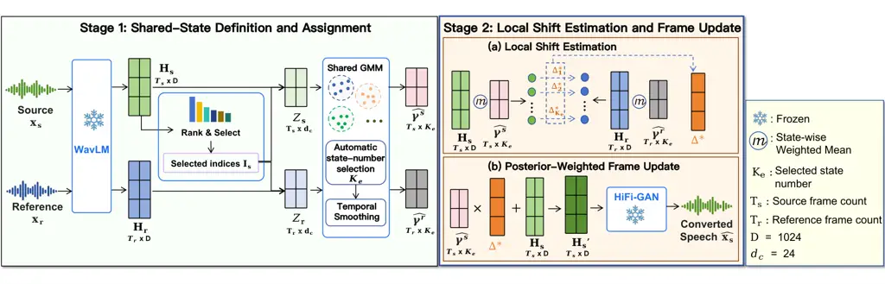

# Shared-State Local Translations for Training-Free Voice Conversion

Yangyang Qu    Michele Panariello    Massimiliano Todisco    Nicholas
Evans

###### Abstract

In one-shot training-free voice conversion (VC), the source and
reference utterances may contain different linguistic content, so
reliable frame-level correspondence between them cannot be assumed. We
propose StateVC, which jointly defines a common set of local regions
from pooled frame-level WavLM representations of the source and
reference utterances; we refer to these regions as _states_. These
shared states are obtained by fitting a pair-specific Gaussian mixture
model to the pooled representations, without explicit source–reference
frame matching. Within each state, StateVC estimates a
source-to-reference mean shift in the original WavLM space. Source-frame
posterior probabilities then combine the state-specific shifts so that
different frames can receive different local updates. For the
LibriSpeech one-shot protocol, StateVC achieves the lowest word error
rate (WER) and character error rate (CER) among the evaluated systems,
at 8.01% and 3.22%, respectively, with a speaker similarity (SIM) of
0.9512. It also achieves the highest mean perceived speaker similarity
among the evaluated systems and the highest mean naturalness among the
evaluated training-free systems.

###### Index Terms: 

voice conversion, self-supervised speech representations, Gaussian
mixture model, training-free conversion

^(†)^(†)address: EURECOM, Sophia Antipolis, France



Figure 1: Overview of StateVC. Source and reference representations
jointly define a common set of shared states through a pair-specific GMM
in a compact routing space. Source and reference means within each state
define full-dimensional local shifts. Source-frame posterior
probabilities combine these shifts before frozen HiFi-GAN synthesis.

## 1 Introduction

Reference-based voice conversion (VC) aims to modify the speaker
characteristics of a source utterance toward those of a reference
utterance while preserving the source linguistic content \[9\]. We
consider one-shot VC with a single reference utterance, whose linguistic
content may differ from that of the source; therefore, reliable
frame-level correspondence is not assumed. In training-free VC,
conversion is performed by modifying pretrained speech representations
without training a task-specific conversion network \[2, 4, 8\]. We
hypothesize that, for source frames with similar WavLM \[3\]
representations, the source-to-reference change can be approximated by a
common shift. This motivates defining local regions in representation
space and estimating a separate source-to-reference shift within each
region, rather than matching individual source and reference frames.

Existing VC methods based on self-supervised speech representations
differ in how they establish source–reference relations and in whether
they use a single mapping or multiple local mappings. Nearest-neighbor
and frame-based optimal transport methods explicitly relate source and
reference frames \[2, 1, 13\], while LinearVC fits a single linear
transformation from nearest-neighbor-paired frames \[4\]. MKL-VC
estimates factorized distribution-level mappings \[8\], while USCF uses
a shared low-rank representation with speaker-specific linear
transformations \[19\]. Classical GMM-based VC learns mixture-dependent
mappings from speaker-specific or parallel training data \[15, 18\],
whereas SSL-GMMVC obtains local affine mappings by first pairing source
and reference self-supervised representations and then fitting a
GMM \[17\]. These approaches leave open whether local
source-to-reference changes can be estimated without first pairing
source and reference frames.

To address this problem, we introduce StateVC, which pools source and
reference representations and fits a single GMM for each utterance pair
to define shared local regions. We refer to these regions as _states_.
This joint definition allows source and reference statistics to be
estimated within the same state without first matching individual frames
or separately estimated components. For each state, StateVC estimates a
source-to-reference mean shift in the original WavLM space. Source-frame
posterior probabilities then combine these state-specific shifts,
allowing the applied update to vary across frames.

Our contributions are:

- •
  We propose StateVC, a training-free one-shot VC method that jointly
  defines one set of local states shared by the source and reference,
  and uses state-specific mean shifts with posterior-weighted frame
  updates without explicit source–reference frame matching.
- •
  Controlled comparisons show that jointly defining one common set of
  states shared by source and reference yields lower WER and CER than
  defining them separately and matching them afterward.
- •
  Under the LibriSpeech one-shot protocol, StateVC achieves the lowest
  WER/CER among the evaluated systems with a SIM of 0.9512, alongside
  the highest mean perceived speaker similarity and the highest mean
  naturalness among the evaluated training-free systems.

## 2 Method

An illustration of StateVC is provided in Figure 1. A frozen WavLM \[3\]
encoder extracts frame-level representations from the source and
reference utterances. StateVC jointly defines shared states from these
representations and computes source and reference statistics within the
same states; no linguistic interpretation of the states is assumed. For
each state, StateVC estimates a source-to-reference mean shift in the
original WavLM space. Source-frame posterior probabilities then combine
these state-specific shifts to produce frame-level updates without
training or fine-tuning neural parameters.

### 2.1 Shared-State Definition and Assignment

The frozen WavLM encoder $`F`$ extracts
$`H_{q}=F(x_{q})\in\mathbb{R}^{T_{q}\times D},q\in\{s,r\},`$ where
$`T_{q}`$ is the number of frames in the source $`s`$ or reference $`r`$
and where $`D`$ is the representation dimension.

For each conversion, we fit the GMM using a reduced set of WavLM feature
dimensions. We rank the source feature dimensions by their temporal
standard deviation,
$`v_{d}=\operatorname{Std}\!\left(H_{s}[:,d]\right).`$ We retain the
$`d_{c}`$ source dimensions with the largest temporal standard
deviations and denote their indices by $`\mathcal{I}_{s}`$. We then
select these same feature dimensions from the reference representation.
This gives source and reference representations expressed in the same
$`d_{c}`$-dimensional coordinate system:
$`Z_{q}=H_{q}[:,\mathcal{I}_{s}]\in\mathbb{R}^{T_{q}\times d_{c}},q\in\{s,r\}.`$
The reduced representations $`Z_{q}`$ are used only for state definition
and frame-to-state routing. All state statistics and conversion shifts
are estimated and applied in the original $`D`$-dimensional WavLM space.

Fitting separate GMMs to the source and reference utterances would
define two independent sets of components and would therefore require an
additional component-matching step. We instead concatenate the source
and reference frames and fit one GMM to the resulting pooled
representations. Each mixture component therefore defines one shared
state for both utterances. We use a diagonal covariance
parameterization:

```math
p(z)=\sum_{k=1}^{K}\pi_{k}\mathcal{N}\left(z;\boldsymbol{\nu}_{k},\operatorname{diag}(\boldsymbol{\sigma}_{k}^{2})\right). \tag{1}
```

As usual, for each state $`k`$, $`\pi_{k}`$ denotes the mixture weight,
$`\boldsymbol{\nu}_{k}`$ the component mean, and
$`\boldsymbol{\sigma}_{k}^{2}`$ the diagonal variance. We then fit
candidate GMMs with number of components $`K\leq K_{\max}`$. For model
selection, each pooled frame $`Z_{q}[i]`$ is temporarily assigned to
$`k_{q}^{\star}(i)=\arg\max_{k}p(k\mid Z_{q}[i]).`$ We discard any GMM
candidate for which a state contains fewer than $`n_{\min}`$ assigned
pooled frames. Among the remaining candidates, the GMM with the lowest
Bayesian information criterion (BIC) \[12\] is selected, and its number
of states is denoted by $`K_{\mathrm{e}}`$.

The selected GMM is then used to assign each frame a posterior
probability over the set of $`K_{\mathrm{e}}`$ states:

```math
\gamma^{(q)}_{i,k}=p(k\mid Z_{q}[i]),\quad q\in\{s,r\},\quad k=1,\ldots,K_{\mathrm{e}}. \tag{2}
```

We refer to $`\gamma^{(q)}_{i,k}`$ as the routing probability from frame
$`i`$ of utterance $`q`$ to state $`k`$.

To reduce frame-to-frame variation in the routing probabilities, we
apply temporal smoothing over a window of $`L=2J+1`$ frames:

```math
\bar{\gamma}_{i,k}^{(q)}=\frac{1}{L}\sum_{j=-J}^{J}\gamma_{c_{q}(i+j),k}^{(q)},\qquad\hat{\gamma}_{i,k}^{(q)}=\frac{\bar{\gamma}_{i,k}^{(q)}}{\sum_{\ell=1}^{K_{\mathrm{e}}}\bar{\gamma}_{i,\ell}^{(q)}+\varepsilon}, \tag{3}
```

where $`c_{q}(u)=\min\{\max\{u,1\},T_{q}\}`$ clips out-of-range indices
to the nearest valid frame and $`\varepsilon`$ ensures numerical
stability.

### 2.2 Local Shift Estimation

For each state, StateVC estimates a source-to-reference mean shift in
the original $`D`$-dimensional WavLM space. The state statistics are
computed using the smoothed routing probabilities
$`\hat{\gamma}_{i,k}^{(q)}`$.

For state $`k`$, the total posterior weight and full-dimensional
weighted mean are

```math
M_{q,k}=\sum_{i=1}^{T_{q}}\hat{\gamma}_{i,k}^{(q)},\quad\boldsymbol{\mu}_{q,k}=\frac{\sum_{i=1}^{T_{q}}\hat{\gamma}_{i,k}^{(q)}H_{q}[i]}{M_{q,k}},\quad q\in\{s,r\}. \tag{4}
```

For a state whose total posterior mass is at least $`m_{\min}`$ in both
utterances, we define the source-to-reference shift as the difference
between the corresponding state means. Otherwise, we use the
utterance-level mean difference:

```math
\boldsymbol{\Delta}_{k}^{\star}=\begin{cases}\boldsymbol{\mu}_{r,k}-\boldsymbol{\mu}_{s,k},&M_{s,k}\geq m_{\min}\ \text{and}\ M_{r,k}\geq m_{\min},\\[2.84526pt]
\boldsymbol{\mu}_{r}^{\mathrm{g}}-\boldsymbol{\mu}_{s}^{\mathrm{g}},&\text{otherwise},\end{cases} \tag{5}
```

where

```math
\boldsymbol{\mu}_{q}^{\mathrm{g}}=\frac{1}{T_{q}}\sum_{i=1}^{T_{q}}H_{q}[i].
```

The state-specific shift controls the source-to-reference change within
each local region, while the utterance-level mean difference provides a
fallback when a local estimate is poorly supported.

### 2.3 Posterior-Weighted Frame Update

Given the estimated local shifts, each source frame is updated by a
posterior-weighted combination:

```math
H^{\prime}_{s}[t]=H_{s}[t]+\lambda\sum_{k=1}^{K_{\mathrm{e}}}\hat{\gamma}_{t,k}^{(s)}\boldsymbol{\Delta}_{k}^{\star}, \tag{6}
```

where $`\lambda\in[0,1]`$ controls the conversion strength. We refer to
this posterior-weighted combination of state-specific shifts as _soft
routing_. Because the posterior weights depend on the source frame,
different frames can receive different combinations of the
state-specific shifts.

Finally, a frozen WavLM-conditioned HiFi-GAN \[5\] vocoder released with
kNN-VC \[2\]¹¹ 1
[https://github.com/bshall/knn-vc](https://github.com/bshall/knn-vc)
reconstructs the converted waveform from $`H^{\prime}_{s}`$.

Figure 2: Sensitivity and design analyses for (a) conversion strength
$`\lambda`$, (b) candidate-state limit $`K_{\max}`$, (c) reference
duration, and (d) state transformation. SIM and WER use the left and
right axes, respectively. Panels (a–c) use Mean, while panel (d)
compares state-specific transformations. Shaded regions indicate the
selected settings; comparisons are made within each panel.

## 3 Experimental Setup

Following MKL-VC \[8\], we construct 7,800 cross-speaker pairs from
LibriSpeech test-clean \[10\]: five source utterances from each of 40
speakers, each paired with one reference utterance from every other
speaker. All systems use the same source–reference pairs. We include
FreeVC and FreeVC-S \[7\] as learned zero-shot references and compare
StateVC primarily with the training-free methods kNN-VC \[2\],
LinearVC \[4\], MKL-VC \[8\], $`k`$DOT \[13\], USCF \[19\], and
SSL-GMMVC \[17\]. For consistency with our evaluation setting, we adopt
the configurations from the original papers that are compatible with our
setup. We use MKL-VC with $`k=2`$, $`k`$DOT with $`k=4`$, USCF with
$`W_{1}`$ and $`r=75`$, and SSL-GMMVC CrossDiag with $`K=1`$.

Speaker similarity is measured by cosine similarity (SIM) between
SpeechBrain x-vectors²² 2
[https://huggingface.co/speechbrain/spkrec-xvect-voxceleb](https://huggingface.co/speechbrain/spkrec-xvect-voxceleb)
extracted from the converted and reference waveforms \[14\]. Content
preservation is evaluated for all systems using the same Whisper-base³³
3
[https://huggingface.co/openai/whisper-base](https://huggingface.co/openai/whisper-base)
WER/CER protocol against the source transcript \[11\]. Twenty listeners
each evaluate the outputs of all compared VC systems for the same 40
source–reference pairs. Naturalness is rated on a 1–5 scale (N-MOS), and
perceived similarity to the reference speaker on a 1–4 scale (S-MOS).
Reported scores are averaged over listeners and source–reference pairs
for each system.

StateVC uses frozen sixth-layer WavLM-Large representations with
$`D=1024`$, $`d_{c}=24`$, $`K_{\max}=4`$, $`n_{\min}=20`$,
$`m_{\min}=20`$, $`\lambda=1`$, and posterior smoothing with $`L=5`$
frames ($`J=2`$). Here, $`n_{\min}`$ is the minimum assigned-frame count
used to validate a candidate GMM, whereas $`m_{\min}`$ is the minimum
posterior mass required to use a state-specific shift.

To examine whether the shared-state framework requires transformations
more flexible than a mean shift, we compare three state-specific
transformations. Mean applies only the state-specific shift in Eq. (5).
Diagonal additionally rescales each source-centered coordinate by the
corresponding reference-to-source state-wise standard-deviation ratio
before recentering at the reference mean. Block further incorporates
within-block covariance through Gaussian Monge–Kantorovich linear
transport \[16\] over contiguous 2-D feature blocks. All three
transformations act in the full $`D=1024`$ WavLM space, while
$`d_{c}=24`$ is used only to define the shared states and compute
routing probabilities.

For the separate-GMM state-definition comparison, source and reference
states are matched by the Hungarian algorithm \[6\]. For the Block
transformation, we compare hard and soft frame-level routing. Both use
the same smoothed state posteriors, state means and covariances, and
state-specific Block transformations. Hard routing selects the
Block-transformed output of the most probable state,
$`k^{\star}(t)=\arg\max_{k}\hat{\gamma}_{t,k}^{(s)}`$, whereas soft
routing combines the state-specific Block-transformed outputs using the
source-frame posterior probabilities.

Code and audio samples are available at
[https://github.com/eurecom-asp/StateVC](https://github.com/eurecom-asp/StateVC)
and
[https://github.com/eurecom-asp/StateVC_listening_samples](https://github.com/eurecom-asp/StateVC_listening_samples).

|                     |                  |                    |                    |                    |                    |
| ------------------- | ---------------- | ------------------ | ------------------ | ------------------ | ------------------ |
| Method              | SIM $`\uparrow`$ | WER $`\downarrow`$ | CER $`\downarrow`$ | N-MOS $`\uparrow`$ | S-MOS $`\uparrow`$ |
| _Learned zero-shot_ |                  |                    |                    |                    |                    |
| FreeVC              | 0.9473           | 8.82               | 3.70               | 3.800              | 2.600              |
| FreeVC-S            | 0.9441           | 8.63               | 3.60               | 3.850              | 2.500              |
| _Training-free_     |                  |                    |                    |                    |                    |
| LinearVC            | 0.9753           | 47.65              | 28.69              | 2.500              | 2.200              |
| $`k`$DOT            | 0.9600           | 39.52              | 23.41              | 2.150              | 1.600              |
| kNN-VC              | 0.9699           | 37.50              | 22.17              | 2.850              | 2.200              |
| USCF                | 0.9515           | 20.36              | 11.38              | 2.250              | 1.850              |
| SSL-GMMVC           | 0.9303           | 11.87              | 5.39               | 1.850              | 1.650              |
| MKL-VC              | 0.9456           | 8.22               | 3.37               | 3.100              | 2.450              |
| StateVC             | 0.9512           | 8.01               | 3.22               | 3.550              | 2.750              |

Table 1: Objective and subjective results. WER/CER are percentages.

|                                           |                  |                    |                    |
| ----------------------------------------- | ---------------- | ------------------ | ------------------ |
| Variant                                   | SIM $`\uparrow`$ | WER $`\downarrow`$ | CER $`\downarrow`$ |
| _State definition_                        |                  |                    |                    |
| Separate GMMs + same-index                | 0.9467           | 40.28              | 26.40              |
| Separate GMMs + Hungarian                 | 0.9541           | 13.82              | 6.60               |
| Shared GMM                                | 0.9540           | 8.44               | 3.48               |
| _Frame-level routing_                     |                  |                    |                    |
| Hard: single-state Block transform        | 0.9556           | 9.14               | 3.86               |
| Soft: posterior-weighted Block transforms | 0.9540           | 8.44               | 3.48               |

Table 2: State-definition and routing comparisons with the Block
transformation fixed.

## 4 Results

Table 1 reports the overall VC results. On the 7,800 LibriSpeech
cross-speaker pairs, StateVC achieves 8.01% WER and 3.22% CER, the
lowest values among the evaluated systems, with a SIM of 0.9512.
Compared with MKL-VC, StateVC reduces WER from 8.22% to 8.01% and CER
from 3.37% to 3.22%, while increasing SIM from 0.9456 to 0.9512. It also
achieves the highest mean S-MOS among the evaluated systems and the
highest mean N-MOS among the evaluated training-free systems.

Table 2 evaluates state definition and frame-level routing with the
Block transformation fixed. Compared with Hungarian matching of
separately fitted states, the shared-state definition reduces WER from
13.82% to 8.44% and CER from 6.60% to 3.48%, at nearly identical SIM
(0.9541 vs. 0.9540). With the shared states, state statistics, and Block
transformations fixed, soft routing reduces WER from 9.14% to 8.44% and
CER from 3.86% to 3.48%, while SIM decreases slightly from 0.9556 to
0.9540.

Figure 2 reports the state-transformation and sensitivity analyses.
Figure 2(d) shows that more flexible state-specific transformations
provide only small additional SIM gains beyond Mean, while WER increases
from 8.01% for Mean to 8.36% for Diagonal and 8.44% for Block. Mean
captures most of the observed SIM gain over None, with a smaller WER
increase than the more flexible transformations. We therefore use Mean
in the final system. Figure 2(a–c) further shows that SIM increases with
$`\lambda`$, increasing $`K_{\max}`$ slightly improves SIM at the cost
of higher WER, and longer reference speech mainly improves SIM.

## 5 Conclusions

We presented StateVC, a training-free one-shot VC method that jointly
defines shared local states for source and reference representations and
applies state-specific mean shifts through posterior-weighted frame
updates. Under the LibriSpeech one-shot protocol, StateVC achieves the
lowest WER and CER among the evaluated systems, at 8.01% and 3.22%,
respectively, with a SIM of 0.9512. Controlled comparisons show that
jointly defined states yield lower recognition errors than separately
fitted and matched states at nearly identical SIM, while a simple mean
shift captures most of the SIM improvement obtained with more flexible
transformations. The current evaluation is limited to English
LibriSpeech under the reported one-shot protocol.

## Acknowledgment

This work was supported by the French Agence Nationale de la Recherche
(ANR) through the SpeechPrivacy project (ANR-23-CE23-0022). ChatGPT was
used solely for language editing and stylistic refinement. All
scientific claims, experimental results, analyses, and conclusions were
independently reviewed and verified by the authors.

## References

- \[1\] A. Asadulaev, R. Korst, V. Shutov, A. Korotin, Y. Grebnyak, V.
  Egiazarian, and E. Burnaev (2024) Optimal transport maps are good
  voice converters. arXiv preprint arXiv:2411.02402. Cited by: §1.
- \[2\] M. Baas, B. van Niekerk, and H. Kamper (2023) Voice Conversion
  With Just Nearest Neighbors. In Interspeech 2023, pp. 2053–2057.
  External Links:
  [Document](https://dx.doi.org/10.21437/Interspeech.2023-419), ISSN
  2958-1796 Cited by: §1, §1, §2.3, §3.
- \[3\] S. Chen, C. Wang, Z. Chen, Y. Wu, S. Liu, Z. Chen, J. Li, N.
  Kanda, T. Yoshioka, X. Xiao, et al. (2022) Wavlm: large-scale
  self-supervised pre-training for full stack speech processing. IEEE
  Journal of Selected Topics in Signal Processing 16 (6), pp. 1505–1518.
  Cited by: §1, §2.
- \[4\] H. Kamper, B. van Niekerk, J. Zaïdi, and M. Carbonneau (2025)
  LinearVC: Linear Transformations of Self-Supervised Features Through
  the Lens of Voice Conversion. In Interspeech 2025, pp. 1398–1402.
  External Links:
  [Document](https://dx.doi.org/10.21437/Interspeech.2025-438), ISSN
  2958-1796 Cited by: §1, §1, §3.
- \[5\] J. Kong, J. Kim, and J. Bae (2020) Hifi-gan: generative
  adversarial networks for efficient and high fidelity speech synthesis.
  Advances in neural information processing systems 33, pp. 17022–17033.
  Cited by: §2.3.
- \[6\] H. W. Kuhn (1955) The hungarian method for the assignment
  problem. Naval research logistics quarterly 2 (1-2), pp. 83–97. Cited
  by: §3.
- \[7\] J. Li, W. Tu, and L. Xiao (2023) Freevc: towards high-quality
  text-free one-shot voice conversion. In ICASSP 2023-2023 IEEE
  International Conference on Acoustics, Speech and Signal Processing
  (ICASSP), pp. 1–5. Cited by: §3.
- \[8\] A. Lobashev, A. Yermekova, and M. Larchenko (2025) Training-Free
  Voice Conversion with Factorized Optimal Transport. In Interspeech
  2025, pp. 1373–1377. External Links:
  [Document](https://dx.doi.org/10.21437/Interspeech.2025-2043), ISSN
  2958-1796 Cited by: §1, §1, §3.
- \[9\] S. H. Mohammadi and A. Kain (2017) An overview of voice
  conversion systems. Speech Communication 88, pp. 65–82. Cited by: §1.
- \[10\] V. Panayotov, G. Chen, D. Povey, and S. Khudanpur (2015)
  Librispeech: an asr corpus based on public domain audio books. In 2015
  IEEE international conference on acoustics, speech and signal
  processing (ICASSP), pp. 5206–5210. Cited by: §3.
- \[11\] A. Radford, J. W. Kim, T. Xu, G. Brockman, C. McLeavey, and I.
  Sutskever (2023) Robust speech recognition via large-scale weak
  supervision. In International conference on machine learning,
  pp. 28492–28518. Cited by: §3.
- \[12\] G. Schwarz (1978) Estimating the dimension of a model. The
  Annals of Statistics 6 (2), pp. 461–464. External Links: ISSN
  00905364, 21688966, [Link](http://www.jstor.org/stable/2958889) Cited
  by: §2.1.
- \[13\] A. Selitskiy and M. Kocharekar (2025) Discrete optimal
  transport and voice conversion. arXiv preprint arXiv:2505.04382. Cited
  by: §1, §3.
- \[14\] D. Snyder, D. Garcia-Romero, G. Sell, D. Povey, and S.
  Khudanpur (2018) X-vectors: robust dnn embeddings for speaker
  recognition. In 2018 IEEE international conference on acoustics,
  speech and signal processing (ICASSP), pp. 5329–5333. Cited by: §3.
- \[15\] Y. Stylianou, O. Cappé, and E. Moulines (1998) Continuous
  probabilistic transform for voice conversion. IEEE Transactions on
  speech and audio processing 6 (2), pp. 131–142. Cited by: §1.
- \[16\] A. Takatsu (2011) Wasserstein geometry of gaussian measures.
  Osaka Journal of Mathematics - OSAKA J MATH 48, pp. . Cited by: §3.
- \[17\] T. Tanabu, H. Nishijima, D. Saito, and N. Minematsu (2026)
  SSL-gmmvc: interpretable voice conversion via locally linear gmm
  transforms in self-supervised representation space. arXiv preprint
  arXiv:2606.10317. Cited by: §1, §3.
- \[18\] T. Toda, A. W. Black, and K. Tokuda (2007) Voice conversion
  based on maximum-likelihood estimation of spectral parameter
  trajectory. IEEE Transactions on Audio, Speech, and Language
  Processing 15 (8), pp. 2222–2235. Cited by: §1.
- \[19\] H. L. Xinyuan, Z. Cai, L. Zhang, L. P. García-Perera, B.
  Sisman, S. Khudanpur, N. Andrews, and M. Wiesner (2026) Universal
  speech content factorization. arXiv preprint arXiv:2603.08977. Cited
  by: §1, §3.
