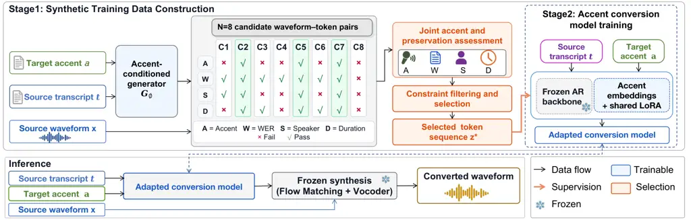

# Multi-sample Synthetic Supervision for Accent Conversion

Yangyang Qu    Michele Panariello    Massimiliano Todisco    Nicholas
Evans

###### Abstract

Accent conversion (AC) requires changing accent while preserving speaker
identity and linguistic content, yet parallel recordings are scarce.
Speech synthesis provides an alternative source of supervision, but
generated targets vary in accent realization and source preservation. We
propose a multi-sample synthetic supervision framework that constructs
conversion targets by jointly assessing these properties across
candidate waveforms for each source–accent condition. Selected
candidates provide associated discrete speech codes, representing
linguistic content, prosody, and speaking style, as targets for
accent-conditioned autoregressive adaptation. Compared with using one
generated target per training example, our method improves target-accent
classification accuracy by 2.49 percentage points, while speaker
similarity remains nearly unchanged, and word error rate increases by
0.29 percentage points. Across six target accents, our method achieves
7.81% WER and the highest mean listening ratings among evaluated
systems.

###### Index Terms: 

accent conversion, multi-sample supervision, synthetic supervision,
stochastic generation, target-accent conditioning

^(†)^(†)address: EURECOM, Sophia Antipolis, France



Figure 1: Overview of multi-sample synthetic supervision and accent
conversion. A reference-conditioned generation stage first provides
token targets for adapting the categorical candidate generator
$`G_{\phi}`$. The fixed $`G_{\phi}`$ then samples $`N`$ token sequences
from the source transcript $`t`$ and target-accent label $`a`$, while
frozen acoustic synthesis uses the source waveform $`x`$ to produce the
paired candidate waveforms. Waveform-level accent and preservation
assessment selects a candidate whose paired token sequence $`z^{*}`$
supervises the final converter $`p_{\theta}`$. At inference,
$`p_{\theta}`$ generates one token sequence from $`(t,a)`$ and frozen
synthesis combines it with $`x`$, without target-accent reference speech
or candidate selection.

## 1 Introduction

Accent conversion (AC) aims to modify accent while preserving speaker
identity and linguistic content. Learning this transformation from
paired examples ideally requires recordings of the same speaker uttering
the same content in different accents. Such recordings are difficult to
collect, motivating the use of synthetic supervision and making the
construction of suitable conversion targets a central challenge.

Existing approaches alleviate this data shortage using speech synthesis
and transferred representations. TTS-guided training \[20\] and
transferred linguistic representations \[4\] support AC with
non-parallel data. Other approaches construct synthetic native-like
targets \[10\], learn conversion through discrete speech tokens \[2\],
or pair synthesized accented speech with natural target
recordings \[3\]. Together, these methods show that useful AC
supervision can be constructed without directly matched recordings.

Pretrained controllable speech generators such as Vevo \[18\] and
Vevo2 \[17\] can also be used to construct synthetic AC supervision.
Because generation is stochastic, repeated sampling under the same
source–accent condition can produce realizations with different
target-accent and source-preservation characteristics. This raises a
specific supervision question: whether a single sampled target is
sufficient, or whether multiple stochastic realizations can provide more
effective supervision.

We formulate this question as a multi-sample target-construction
problem. Selection from multiple generations has precedents in
best-of-$`N`$ distillation \[13, 16\] and ASR-based self-verification
for speech synthesis \[1\]. In AC, however, candidate quality involves
multiple requirements: the output should exhibit the requested accent
change while preserving linguistic content and source-speaker
characteristics. Consequently, transcription correctness alone is
insufficient for constructing suitable AC supervision. We therefore
jointly assess accent realization and source preservation at the
waveform level, transfer the selection to the associated token sequence,
and test the resulting supervision under a matched source–accent
population.

We propose a multi-sample synthetic supervision framework in which a
fixed categorical accent-conditioned generator produces multiple
waveform–token candidates for each source–accent condition. Here, the
tokens are discrete content-style codes from a learned speech
representation that encode linguistic content, prosody, and speaking
style. Candidate waveforms are jointly assessed for target-accent
realization and source preservation, and the content-style token
sequence paired with a selected feasible waveform is used as
pseudo-supervision for categorical autoregressive adaptation. To test
whether access to multiple stochastic realizations improves supervision
rather than merely expanding the pool of usable training conditions, we
compare single- and eight-sample supervision on the same source–accent
conditions with identical data splits, initialization within each seed,
and optimization protocol. This controlled comparison isolates the
downstream effect of replacing the first generated target with a target
selected from multiple stochastic realizations. Under this matched
comparison, eight-sample supervision improves target-accent accuracy by
2.49 percentage points, with nearly unchanged speaker similarity.

Our main contributions are:

- •
  We formulate synthetic AC supervision as a multi-sample
  target-construction problem, in which multiple stochastic realizations
  of the same source–accent condition are jointly assessed for
  target-accent realization and source preservation.
- •
  We develop an AC-specific supervision framework that first adapts a
  pretrained autoregressive backbone to categorical accent control and
  then transfers waveform-level accent–preservation assessment to paired
  discrete content-style targets for final autoregressive adaptation.
- •
  We validate the proposed formulation through a controlled single-
  versus multi-sample comparison that holds the source–accent population
  and data split, showing stronger target-accent evidence with only a
  small WER increase and nearly unchanged speaker similarity.

## 2 Method

Given a source waveform $`x`$, its transcript $`t`$, and a target-accent
label $`a`$, we aim to generate speech $`\hat{x}`$ in the requested
accent while preserving linguistic content and source-speaker identity:
$`(t,x,a)\rightarrow\hat{x}.`$ The transcript is available during both
training and inference. The autoregressive model is conditioned on $`t`$
and $`a`$, whereas $`x`$ is used only for source timbre conditioning
during the subsequent frozen acoustic synthesis stage.

### 2.1 Synthetic Training Data Construction

#### 2.1.1 Stochastic Candidate Generation

We construct the accent-conditioned candidate generator $`G_{\phi}`$ in
two steps. First, we use reference-conditioned generation to construct
the token-level training targets for $`G_{\phi}`$. Let $`r_{a}`$ denote
a reference utterance representing target accent $`a`$ and $`t_{a}^{r}`$
its transcript. Given the source transcript $`t`$, the target-reference
pair $`(r_{a},t_{a}^{r})`$, and source waveform $`x`$, the pretrained
Vevo2 model \[17\] generates a content-style token sequence for the
source linguistic content while the reference provides target-accent and
style information. Frozen acoustic synthesis uses $`x`$ for
source-timbre conditioning. Selected token sequences from this stage are
retained as training targets for the subsequent categorical adaptation.

Second, we use these token targets to train a categorical
accent-conditioned autoregressive generator $`G_{\phi}`$. This
adaptation replaces target-reference conditioning with categorical
accent control, allowing $`G_{\phi}`$ to generate content-style tokens
directly from a source transcript and target-accent label. Each target
accent is represented by a trainable sequence of 32 accent embeddings,
while shared rank-32 LoRA modules \[6\] adapt the query, key, value, and
output projections. We first optimize the accent embeddings alone and
then jointly optimize the accent embeddings and LoRA parameters using
autoregressive token cross-entropy. All remaining autoregressive
backbone parameters are frozen. After development-set checkpoint
selection, $`G_{\phi}`$ is fixed for multi-sample supervision
construction.

Given a source transcript $`t`$ and target-accent label $`a`$, the fixed
generator $`G_{\phi}`$ samples a content-style token sequence $`z_{i}`$
conditioned on $`(t,a)`$. The content-style tokens are discrete codes
from the pretrained content-style representation \[17\], representing
linguistic content together with prosodic and speaking-style
information. Given $`z_{i}`$ and the source waveform $`x`$, frozen Flow
Matching \[17\] and Vocos \[14\] synthesize the corresponding candidate
waveform $`\tilde{x}_{i}`$, with $`x`$ providing source-timbre
conditioning. Thus, target-accent reference speech is required only for
constructing the initial pseudo-target supervision, whereas the trained
generator $`G_{\phi}`$ produces candidates using only the source
transcript and categorical target-accent label.

Repeating the stochastic generation process under fixed model parameters
and decoding settings produces multiple waveform–token realizations for
the same source–accent condition. With $`N`$ repetitions, we obtain

```math
\mathcal{C}_{N}(t,x,a)=\left\{(\tilde{x}_{i},z_{i})\right\}_{i=1}^{N}.
```

Each pair $`(\tilde{x}_{i},z_{i})`$ preserves the correspondence between
the synthesized waveform used for quality assessment and the discrete
token sequence available for supervision. The candidate waveform
$`\tilde{x}_{i}`$ is subsequently evaluated for target-accent
realization and source preservation, while its paired token sequence
$`z_{i}`$ serves as the candidate pseudo-target for final-model
training.

#### 2.1.2 Candidate Assessment and Selection

We assess each candidate waveform jointly for target-accent evidence,
content preservation, speaker preservation, and duration consistency.
Let $`q`$ denote the fixed development-time accent scorer used for
candidate construction. We define $`p_{i}=q(a\mid\tilde{x}_{i})`$ and
$`\Delta p_{i}=p_{i}-q(a\mid x),`$ and set $`h_{i}=1`$ when $`q`$
predicts the requested accent $`a`$ for $`\tilde{x}_{i}`$.

Let $`w_{i}`$ denote candidate WER, $`s_{i}`$ the source–candidate
ECAPA-TDNN \[5\] cosine similarity, and

```math
\rho_{i}=\frac{\operatorname{dur}(\tilde{x}_{i})}{\operatorname{dur}(x)}.
```

A candidate is feasible when

```math
w_{i}\!\leq\!\tau_{\mathrm{WER}},\;s_{i}\!\geq\!\tau_{\mathrm{SIM}},\;\rho_{\min}\!\leq\!\rho_{i}\!\leq\!\rho_{\max},\;(h_{i}\!=\!1\vee\Delta p_{i}\!\geq\!\tau_{\Delta}). \tag{1}
```

Conditions with no feasible candidate are excluded from final-model
training.

Among feasible candidates, we select the highest-ranked waveform–token
pair using lexicographic ordering by decreasing $`p_{i}`$,
$`\Delta p_{i}`$, $`h_{i}`$, and $`s_{i}`$, followed by increasing
$`w_{i}`$. The selected token sequence $`z^{*}`$ is retained as the
pseudo-target for final-model adaptation.

### 2.2 Accent Conversion Model Training

After candidate assessment and selection, each retained source–accent
condition provides an autoregressive training example
$`(t_{b},a_{b},z_{b}^{*}),`$ where $`t_{b}`$ is the source transcript,
$`a_{b}`$ is the categorical target-accent label, and $`z_{b}^{*}`$ is
the token sequence paired with the selected waveform. Thus,
waveform-level assessment determines which generated content-style token
sequence is used as supervision for the final conversion model.

The final converter $`p_{\theta}`$ uses the same categorical
autoregressive architecture as the candidate generator $`G_{\phi}`$, but
its parameters are further adapted using the selected supervision. For
each training seed, the converter is initialized from a seed-specific
categorical warm-start derived from $`G_{\phi}`$, rather than directly
from the pretrained backbone. We then continue adapting the model on the
selected token targets $`z^{*}`$ from the final supervision pool.

As in $`G_{\phi}`$, each target accent is represented by a trainable
sequence of 32 accent embeddings, and shared rank-32 LoRA modules \[6\]
adapt the query, key, value, and output projections of the
autoregressive backbone. Only the accent embeddings and shared LoRA
parameters are optimized, while the remaining autoregressive backbone
parameters are frozen. The autoregressive model therefore learns
$`p_{\theta}(z\mid t,a),`$ without using the source waveform $`x`$ as an
input to the token predictor.

For a minibatch of $`B`$ examples, let $`M_{b}`$ denote the non-padding
positions of the selected token sequence $`z_{b}^{*}`$. We minimize the
causal token negative log-likelihood

```math
\mathcal{L}_{\mathrm{tok}}=-\frac{1}{B}\sum_{b=1}^{B}\frac{1}{|M_{b}|}\sum_{u\in M_{b}}\log p_{\theta}\left(z^{*}_{b,u}\mid z^{*}_{b,<u},t_{b},a_{b}\right), \tag{2}
```

where $`\theta`$ denotes the trainable accent-embedding and LoRA
parameters. No additional accent, content, speaker, or preference loss
is used during this final adaptation.

### 2.3 Inference

At inference, given a source transcript $`t`$ and target-accent label
$`a`$, the trained autoregressive converter generates a single
content-style token sequence $`\hat{z}\sim p_{\theta}(z\mid t,a).`$ The
source waveform $`x`$ does not enter the autoregressive converter and is
instead used as the source-timbre reference during the subsequent frozen
acoustic synthesis stage. Frozen Flow Matching \[17\] and Vocos \[14\]
synthesize the converted waveform $`\hat{x}`$ from $`\hat{z}`$ and
$`x`$. Thus, inference requires only $`(t,x,a)`$ and produces a single
converted waveform without target-accent reference speech, multi-sample
candidate generation, or candidate selection.

| System       | Acc. (%) $`\uparrow`$ | $`\Delta p_{\mathrm{tgt}}`$ (pp) $`\uparrow`$ | WER (%) $`\downarrow`$ | SIM $`\uparrow`$ | N-MOS $`\uparrow`$ | S-MOS $`\uparrow`$ | A-MOS $`\uparrow`$ |
| ------------ | --------------------- | --------------------------------------------- | ---------------------- | ---------------- | ------------------ | ------------------ | ------------------ |
| Vevo-Style   | 32.33                 | +13.83                                        | 14.24                  | 0.6737           | 3.440              | 3.429              | 2.940              |
| Vevo1.5      | 18.63                 | +1.67                                         | 31.05                  | 0.7657           | 2.857              | 3.179              | 2.417              |
| Vevo2        | 19.13                 | +2.16                                         | 17.01                  | 0.8227           | 3.619              | 3.488              | 2.940              |
| SeedVC-v2    | 42.10                 | +20.08                                        | 17.60                  | 0.0910           | 2.464              | 1.786              | 2.440              |
| StarGANv2-VC | 45.50                 | +23.79                                        | 20.68                  | 0.1888           | 1.881              | 1.583              | 1.929              |
| Ours         | 30.31                 | +11.01                                        | 7.81                   | 0.7135           | 3.690              | 3.560              | 3.131              |

Table 1: Automatic results on AC-Eval3K and listening-test results on
the perceptual evaluation subset. MOS values are descriptive means
without uncertainty estimates. All systems use the same evaluation
pipeline, but the external systems are not training- or input-matched to
ours. Higher is better for target-accent classification accuracy,
$`\Delta p_{\mathrm{tgt}}`$, SIM, and MOS; lower is better for WER.

## 3 Experimental Setup

### 3.1 Data and Implementation

We evaluate six English target accents: Arabic, Chinese, Hindi, Korean,
Spanish, and Vietnamese. Synthetic-supervision construction uses 29,754
source–accent conditions from 17,649 LibriTTS \[15\] utterances from 235
speakers and 12,105 L2-ARCTIC \[19\] utterances from 20 speakers, with
4,959 conditions per accent. The categorical generator $`G_{\phi}`$ is
first adapted using 29,840 pseudo-target token sequences obtained from
the reference-conditioned bootstrap stage in Sec. 2.1.1.

For final supervision construction, the fixed $`G_{\phi}`$ generates
$`N=8`$ candidates per condition using top-$`k=25`$, top-$`p=0.8`$,
temperature $`1.0`$, and 32 Flow Matching steps. Candidate retention
uses $`\tau_{\mathrm{WER}}=0.08`$, $`\tau_{\mathrm{SIM}}=0.60`$,
$`\rho\in[0.75,1.45]`$, and $`\tau_{\Delta}=0.02`$. At least one
candidate is feasible for 16,153 conditions, which are partitioned into
15,346 optimization and 807 internal-validation conditions. A separate
300-condition development set is used for checkpoint selection.

Candidate selection uses a fixed six-way accent probe $`q`$ based on
valid-frame mean-pooled Whisper-small \[12\] encoder representations,
feature standardization, and balanced logistic regression. WER and
speaker similarity are measured using Whisper-small and
ECAPA-TDNN \[5\], respectively. The final converter is trained for three
epochs using seeds 1337, 2027, and 3407. The learning rates are
$`5\times 10^{-6}`$ for LoRA and $`10^{-4}`$ for the accent embeddings.

We construct AC-Eval3K from 3,000 unique LibriTTS test-clean utterances
by assigning each source utterance one target-accent label, yielding 500
conditions for each of the six accents. The utterances come from 39
speakers, with no source-utterance or speaker overlap with the
supervision-construction pool.

### 3.2 Compared Systems and Evaluation

Direct comparison with existing AC-specific systems is limited by
differences in task definition and target-accent coverage. Many closely
related methods focus on accent normalization or specific source–target
mappings \[4, 10, 3\], and do not provide a released model or protocol
covering all six target accents considered here. Evaluating them on
AC-Eval3K would therefore require retraining or modifying their original
task configuration. We instead compare with systems that can generate
outputs for all six targets: Vevo-Style \[18\], Vevo1.5 \[7\],
Vevo2 \[17\], SeedVC-v2 \[9\], and StarGANv2-VC \[8\]. All systems are
evaluated using the same output-level scoring pipeline, although their
training and inference conditions are not matched.

For automatic evaluation, target-accent performance is measured using
the PAID-Whisper evaluation framework introduced in \[11\]. We report
target-accent classification accuracy (Acc.), defined as the percentage
of converted utterances classified as the requested accent, and
$`\Delta p_{\mathrm{tgt}}=p(a\mid\hat{x})-p(a\mid x),`$ which measures
the source-relative increase in probability assigned to the requested
accent. Content preservation is measured by word error rate (WER) using
Whisper-small \[12\], and source-speaker preservation by cosine
similarity (SIM) between SpeechBrain ECAPA-TDNN \[5\] embeddings of the
source and converted speech. Higher Acc., $`\Delta p_{\mathrm{tgt}}`$,
and SIM indicate stronger target-accent evidence or speaker
preservation, whereas lower WER indicates better content preservation.

To isolate the effect of multi-sample supervision, we compare $`N=1`$
and $`N=8`$ on the same 6,600 source–accent conditions. The $`N=1`$
system uses the first feasible candidate, whereas $`N=8`$ selects the
highest-ranked feasible candidate from eight generations. Within each
seed, both systems use the same data split, initialization, and training
protocol. Target-accent metrics in this matched comparison are measured
using the development accent probe $`q`$.

We further conduct a blinded listening test with 10 listeners on 12
source utterances, comprising one male and one female utterance per
target accent. Listeners rate naturalness (N-MOS), source-speaker
similarity (S-MOS), and target-accent similarity (A-MOS) on 1–5 scales.
For A-MOS, listeners are provided with target-accent reference speech
only for perceptual evaluation.

Code and audio samples are available at
[https://github.com/eurecom-asp/SSAC](https://github.com/eurecom-asp/SSAC)
and
[https://github.com/eurecom-asp/SSAC_listening_samples](https://github.com/eurecom-asp/SSAC_listening_samples).

| Samples | Acc. (%) $`\uparrow`$ | $`\Delta p_{\mathrm{tgt}}`$ (pp) $`\uparrow`$ | WER (%) $`\downarrow`$ | SIM $`\uparrow`$ |
| ------- | --------------------- | --------------------------------------------- | ---------------------- | ---------------- |
| $`N=1`$ | 28.08                 | +9.77                                         | 7.82                   | 0.7139           |
| $`N=8`$ | 30.57                 | +11.70                                        | 8.11                   | 0.7134           |

Table 2: Single- versus multi-sample supervision using the same source
utterance–target accent training combinations. Values are means over
three training runs.

## 4 Results

### 4.1 Overall Conversion Performance

Table 1 summarizes performance across the evaluated systems. Our system
achieves the lowest WER of 7.81%, with a target-accent classification
accuracy of 30.31% and $`\Delta p_{\mathrm{tgt}}=+11.01`$ pp.
Vevo-Style, SeedVC-v2, and StarGANv2-VC obtain higher automatic
target-accent scores, while Vevo2 achieves the highest SIM. These
results show different accent–content–speaker operating points under the
common output-level evaluation rather than dominance by a single system
across all metrics.

In the listening test, our system obtains the highest observed mean
ratings for naturalness, source-speaker similarity, and target-accent
similarity, with N-MOS, S-MOS, and A-MOS of 3.690, 3.560, and 3.131,
respectively.

### 4.2 Effect of Multi-Sample Supervision

In the full construction pool, the first generated candidate satisfies
the retention requirements for 6,600 of 29,754 source–accent conditions
(22.18%). With eight stochastic generations, 16,153 conditions (54.29%)
contain at least one feasible candidate. This increased coverage shows
that multiple generations provide more opportunities to construct usable
supervision, but does not by itself establish a downstream benefit.

We therefore compare $`N=1`$ and $`N=8`$ using the same 6,600
source–accent conditions for which the first candidate is feasible. For
$`N=1`$, the first candidate provides the supervision target, whereas
for $`N=8`$, the highest-ranked feasible candidate is selected from
eight generations. Within each seed, the two systems use the same data
split, categorical warm-start, and optimization protocol.

As shown in Table 2, $`N=8`$ increases mean probe-measured target-accent
accuracy by 2.49 pp and mean $`\Delta p_{\mathrm{tgt}}`$ by 1.93 pp
relative to $`N=1`$. The target-accent gains are positive for all three
paired training seeds. Mean WER increases by 0.29 pp, while SIM changes
only from 0.7139 to 0.7134. These results support the use of multiple
stochastic realizations for constructing supervision with stronger
downstream target-accent evidence under the selection probe $`q`$, while
showing a small mean increase in WER.

### 4.3 Alternative Supervision Strategies

| Strategy         | Acc. (%) $`\uparrow`$ | $`\Delta p_{\mathrm{tgt}}`$ (pp) $`\uparrow`$ | WER (%) $`\downarrow`$ | SIM $`\uparrow`$ |
| ---------------- | --------------------- | --------------------------------------------- | ---------------------- | ---------------- |
| Random Near-Best | 29.82                 | +10.90                                        | 8.18                   | 0.7130           |
| Soft Top-2       | 29.88                 | +10.56                                        | 7.82                   | 0.7162           |
| Soft Near-Best   | 30.04                 | +10.94                                        | 8.38                   | 0.7156           |
| Selected Top-1   | 30.31                 | +11.01                                        | 7.81                   | 0.7135           |

Table 3: Alternative strategies for using feasible candidates. Results
are averaged over three training seeds.

Table 3 compares alternative ways of using feasible candidates. Selected
Top-1 uses the highest-ranked candidate. Random Near-Best samples from
candidates within $`\epsilon=0.05`$ of the highest target-accent
probability. Soft Top-2 combines losses from the two highest-ranked
candidates, while Soft Near-Best applies the same soft-min objective to
candidates within the same $`\epsilon`$ margin.

Selected Top-1 gives the highest mean target-accent accuracy and
$`\Delta p_{\mathrm{tgt}}`$ and the lowest mean WER, while Soft Top-2
gives the highest mean SIM. We therefore use Selected Top-1 in the final
system.

## 5 Conclusions

We studied synthetic AC supervision as selection over multiple
stochastic waveform–token realizations of the same source–accent
condition. Our framework first learns a categorical accent-conditioned
generator, uses it to construct and assess multiple candidate
conversions, and transfers the token sequence paired with a selected
waveform to final autoregressive adaptation. The resulting converter
uses the source transcript and categorical target-accent label for token
generation and requires neither target-accent reference speech nor
multi-candidate selection at inference. In the controlled comparison on
the same source–accent conditions, eight-sample supervision improves
probe-measured target-accent accuracy by 2.49 pp, with a 0.29-pp
increase in mean WER and nearly unchanged speaker similarity. Under the
common output-level evaluation, the final system achieves the lowest WER
among the evaluated systems and the highest observed mean ratings on all
three perceptual measures. The evaluation remains limited to six target
accents and to external systems with different training and inference
conditions. Future work will extend the evaluation to broader accent
settings and independently evaluate the matched multi-sample effect.

## Acknowledgment

This work was supported by the French Agence Nationale de la Recherche
(ANR) through the SpeechPrivacy project (ANR-23-CE23-0022). ChatGPT was
used solely for language editing and stylistic refinement. All
scientific claims, experimental results, analyses, and conclusions were
independently reviewed and verified by the authors.

## References

- \[1\] A. Asaria, T. Salomone, and D. Gandhi (2026) Reliable
  neural-codec text-to-speech by asr self-verification and distillation:
  near-zero catastrophic failures across models and codecs. arXiv
  preprint arXiv:2606.18323. Cited by: §1.
- \[2\] Q. Bai, S. Inoue, S. Wang, Z. Jiang, Y. Wang, and H. Li (2025)
  Accent Normalization Using Self-Supervised Discrete Tokens with
  Non-Parallel Data. In Interspeech 2025, pp. 1618–1622. External Links:
  [Document](https://dx.doi.org/10.21437/Interspeech.2025-2520), ISSN
  2958-1796 Cited by: §1.
- \[3\] Q. Bai, S. Shi, S. Wang, Y. Ju, Y. Wang, and H. Li (2026)
  CosyAccent: duration-controllable accent normalization using
  source-synthesis training data. In IEEE International Conference on
  Acoustics, Speech and Signal Processing (ICASSP), pp. 17372–17376.
  Cited by: §1, §3.2.
- \[4\] X. Chen, J. Pei, L. Xue, and M. Zhang (2024) Transfer the
  linguistic representations from tts to accent conversion with
  non-parallel data. In IEEE International Conference on Acoustics,
  Speech and Signal Processing (ICASSP), pp. 12501–12505. Cited by: §1,
  §3.2.
- \[5\] B. Desplanques, J. Thienpondt, and K. Demuynck (2020)
  ECAPA-TDNN: Emphasized Channel Attention, Propagation and Aggregation
  in TDNN Based Speaker Verification. In Interspeech 2020,
  pp. 3830–3834. External Links:
  [Document](https://dx.doi.org/10.21437/Interspeech.2020-2650), ISSN
  2958-1796 Cited by: §2.1.2, §3.1, §3.2.
- \[6\] E. J. Hu, yelong shen, P. Wallis, Z. Allen-Zhu, Y. Li, S.
  Wang, L. Wang, and W. Chen (2022) LoRA: low-rank adaptation of large
  language models. In International Conference on Learning
  Representations, External Links:
  [Link](https://openreview.net/forum?id=nZeVKeeFYf9) Cited by: §2.1.1,
  §2.2.
- \[7\] J. Li, X. Zhang, Y. Wang, H. He, C. Wang, L. Wang, H. Liao, J.
  Ao, Z. Xie, Y. Huang, et al. (2025) Overview of the amphion toolkit
  (v0. 2). arXiv preprint arXiv:2501.15442. Cited by: §3.2.
- \[8\] Y. A. Li, A. Zare, and N. Mesgarani (2021) StarGANv2-VC: A
  Diverse, Unsupervised, Non-Parallel Framework for Natural-Sounding
  Voice Conversion. In Interspeech 2021, pp. 1349–1353. External Links:
  [Document](https://dx.doi.org/10.21437/Interspeech.2021-319), ISSN
  2958-1796 Cited by: §3.2.
- \[9\] S. Liu (2024) Zero-shot voice conversion with diffusion
  transformers. arXiv preprint arXiv:2411.09943. Cited by: §3.2.
- \[10\] T. N. Nguyen, S. Akti, N. Q. Pham, and A. Waibel (2025)
  Improving pronunciation and accent conversion through knowledge
  distillation and synthetic ground-truth from native tts. In IEEE
  International Conference on Acoustics, Speech and Signal Processing
  (ICASSP), pp. 1–5. Cited by: §1, §3.2.
- \[11\] Y. Qu, M. Todisco, and N. Evans (2026) Phoneme-aware
  pronunciation representations for L2-English L1-Background accent
  identification. arXiv preprint arXiv:2609.10466. Cited by: §3.2.
- \[12\] A. Radford, J. W. Kim, T. Xu, G. Brockman, C. McLeavey, and I.
  Sutskever (2023) Robust speech recognition via large-scale weak
  supervision. In International conference on machine learning,
  pp. 28492–28518. Cited by: §3.1, §3.2.
- \[13\] P. G. Sessa, R. Dadashi, L. Hussenot-Desenonges, J. Ferret, N.
  Vieillard, A. Ramé, B. Shahriari, S. Perrin, A. Friesen, G. Cideron,
  et al. (2025) Bond: aligning llms with best-of-n distillation. In
  International Conference on Learning Representations, Vol. 2025,
  pp. 59040–59060. Cited by: §1.
- \[14\] H. Siuzdak (2024) Vocos: closing the gap between time-domain
  and fourier-based neural vocoders for high-quality audio synthesis. In
  International Conference on Learning Representations, Cited by:
  §2.1.1, §2.3.
- \[15\] H. Zen, V. Dang, R. Clark, Y. Zhang, R. J. Weiss, Y. Jia, Z.
  Chen, and Y. Wu (2019) LibriTTS: A Corpus Derived from LibriSpeech for
  Text-to-Speech. In Interspeech 2019, pp. 1526–1530. External Links:
  [Document](https://dx.doi.org/10.21437/Interspeech.2019-2441), ISSN
  2958-1796 Cited by: §3.1.
- \[16\] K. Zhang, Y. Tian, D. Zhao, Y. Li, Y. Liu, V. M. Patel, and D.
  Fu (2026) On-policy distillation with best-of-n teacher rollout
  selection. arXiv preprint arXiv:2605.09725. Cited by: §1.
- \[17\] X. Zhang, J. Zhang, Y. Wang, C. Wang, Y. Chen, D. Jia, Z. Chen,
  and Z. Wu (2026) Vevo2: a unified and controllable framework for
  speech and singing voice generation. IEEE Transactions on Audio,
  Speech and Language Processing. Cited by: §1, §2.1.1, §2.1.1, §2.3,
  §3.2.
- \[18\] X. Zhang, X. Zhang, K. Peng, Z. Tang, V. Manohar, Y. Liu, J.
  Hwang, D. Li, Y. Wang, J. Chan, et al. (2025) Vevo: controllable
  zero-shot voice imitation with self-supervised disentanglement. In
  International Conference on Learning Representations, Vol. 2025,
  pp. 58436–58459. Cited by: §1, §3.2.
- \[19\] G. Zhao, S. Sonsaat, A. Silpachai, I. Lucic, E.
  Chukharev-Hudilainen, J. Levis, and R. Gutierrez-Osuna (2018)
  L2-ARCTIC: A Non-native English Speech Corpus. In Interspeech 2018,
  pp. 2783–2787. External Links:
  [Document](https://dx.doi.org/10.21437/Interspeech.2018-1110), ISSN
  2958-1796 Cited by: §3.1.
- \[20\] Y. Zhou, Z. Wu, M. Zhang, X. Tian, and H. Li (2023) Tts-guided
  training for accent conversion without parallel data. IEEE Signal
  Processing Letters 30, pp. 533–537. Cited by: §1.
