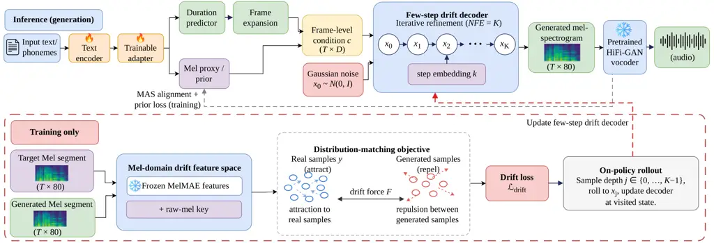

# DriftTTS: Few-Step Text-to-Speech Without Distillation via Distribution-Matching Drift

Mohammad Nur Hossain Khan^(⋆)    Subrata Biswas^(†)    Bashima Islam^(⋆)

###### Abstract

Few-step neural text-to-speech models often rely on shortened diffusion
or flow-matching schedules, or on distillation from pretrained
multi-step teachers. To avoid these dependencies, we present DriftTTS, a
few-step mel-spectrogram generator trained without a generative teacher,
distillation, or adversarial discrimination. DriftTTS uses a
distribution-matching drift objective in a mel-domain feature space
defined by raw mels and a frozen masked-autoencoder encoder pretrained
on the same LJSpeech training split. On-policy rollout trains the
decoder on its own intermediate states and supports inference up to the
trained rollout depth. On LJSpeech, DriftTTS at NFE=4 achieves 3.87 dB
MCD and 3.7% WER, compared with 3.85 dB and 3.4% for Matcha-TTS. In a
fully paired blind listening test, DriftTTS obtains 4.18 MOS, compared
with 3.96 for Matcha-TTS and 4.22 for ground truth. These results
demonstrate competitive few-step synthesis without a pretrained
generative teacher. Code can be found at
[https://github.com/BASHLab/driftTTS.git](https://github.com/BASHLab/driftTTS.git)

###### Index Terms: 

text-to-speech, drifting models, few-step generation, distillation-free
synthesis, flow matching

^(†)^(†)address: ^(⋆)University of Massachusetts Amherst, MA, USA
 ^(†)Worcester Polytechnic Institute, MA, USA

## 1 Introduction

Non-autoregressive neural text-to-speech (TTS) has moved from
deterministic regression \[1\] and end-to-end adversarial training \[2\]
toward iterative generative models. Grad-TTS \[3\] integrates a
diffusion SDE, and Matcha-TTS \[4\] integrates a conditional
flow-matching \[5\] ODE while remaining competitive with only a few
integration steps. These models reach high synthesis quality, but their
inference cost grows with the number of function evaluations (NFE).
Their training also shares a common structure. The network regresses a
known per-sample target, such as the added noise or the velocity along a
prescribed noise to data path, and the sampler integrates the learned
field at inference.

A common route to one-step synthesis is distillation. CoMoSpeech \[6\]
distills a consistency model from a diffusion teacher, while
ProDiff \[7\] progressively distills an $`N`$-step diffusion model into
fewer-step students. Teacher-free alternatives include
FastSpeech 2 \[1\], which regresses acoustic targets, VITS \[2\], which
uses variational and adversarial training, and FlashSpeech \[8\], which
trains a one- or two-step latent consistency model from scratch with
adversarial consistency training. Consistency models can also be trained
without a teacher \[9\]. These approaches still rely on per-sample
regression, adversarial discrimination, or consistency along a
prescribed trajectory. Teachers require multi-stage training,
discriminators introduce an additional network and min-max objective,
and consistency constraints tie generation to a fixed noise$`\to`$data
path. Whether a competitive few-step acoustic model can be trained with
none of these ingredients has, to our knowledge, not been examined for
text-to-speech.

We propose DriftTTS, a mel-spectrogram acoustic model built on Drifting
Models \[10\]. This recent generative framework replaces per-sample
regression targets with a _distribution-level_ matching force, termed
the drift. Given batches of generated and real samples embedded in a
feature space, the drift attracts generated samples toward the data and
repels them from one another, and the generator is updated to follow it.
No teacher, discriminator, or prescribed trajectory is involved. A
related formulation has recently been applied to speech
*enhancement* \[11\]. Applying the drift objective to TTS requires
several adaptations. Because each text is paired with only one
recording, we construct a local condition-specific positive pool around
the target segment. We further extend the original one-step formulation
to few-step generation and define the drift in a mel-domain feature
space that captures perceptually relevant differences.

DriftTTS adapts the drifting framework to TTS by optimizing the decoder
with the drift objective. For each conditioning segment, the paired
target and its noise-augmented views form a local positive pool, while
generated samples from other utterances in the batch provide negatives.
To move beyond a single step, we train the decoder by on-policy rollout.
The model is unrolled for a random number of its own steps up to a fixed
training depth, and the drift objective is applied at the visited state,
so no noise-to-data trajectory is prescribed. At inference, the same
trained model can be run at any number of evaluations up to that depth,
which makes the step count an explicit control rather than a property
fixed at training time. The drift is computed in the feature space of a
frozen masked autoencoder that we pretrain on the same LJSpeech training
split, together with the raw mel representation. This network is used
only to construct the objective and is discarded at inference. No
generative teacher, distillation stage, or discriminator is used at any
point. To our knowledge, DriftTTS is the first application of the drift
objective to TTS. Our contributions are:

1.  1.  DriftTTS, a TTS model whose decoder is trained entirely with a
        distribution-matching drift objective in a mel-domain perceptual
        feature space, without a generative teacher, distillation, or
        adversarial training.
2.  2.  A few-step on-policy training scheme that extends the one-step drift
        generator to iterative refinement with explicit NFE control at
        inference, where step count is the largest quality lever in our
        experiments.
3.  3.  A vocoder-controlled evaluation against Matcha-TTS on LJSpeech,
        centred on a fully paired blind listening test in which every
        listener rated every system on the same utterances and results are
        analysed both by subject and by utterance. Under this protocol
        DriftTTS at NFE=4 reaches naturalness comparable to Matcha-TTS and
        to ground truth (4.18 against 3.96 and 4.22 MOS), and sampling the
        same trained model with four evaluations instead of one raises MOS
        by 1.18 points, significant under both analyses.

## 2 DriftTTS



Figure 1: Overview of DriftTTS. Text-conditioned Gaussian noise is
iteratively refined by a few-step drift decoder to generate
mel-spectrograms, which are converted to waveform by HiFi-GAN. During
training, the decoder is optimized with an on-policy
distribution-matching drift objective computed in a mel-domain feature
space using real and generated samples.

DriftTTS replaces the prescribed noise-to-data field used by diffusion
and flow-matching TTS with the distribution-matching objective of
Drifting Models \[10\]. Let $`g_{i}`$ denote generated features and
$`p_{j}`$ real features. We form generated-to-real distances
$`d^{+}_{ij}=\|g_{i}-p_{j}\|_{2}`$ and generated-to-generated distances
$`d^{-}_{ik}=\|g_{i}-g_{k}\|_{2}`$, $`k\neq i`$. Each distance matrix is
normalized by its own batch mean, and at each scale
$`R\in\{0.2,0.05,0.02\}`$ we construct cross and self affinities using

```math
a_{ij}^{(R)}=\sqrt{\operatorname{softmax}_{\rm row}\!\left(-\frac{\tilde{d}_{ij}}{R}\right)\operatorname{softmax}_{\rm col}\!\left(-\frac{\tilde{d}_{ij}}{R}\right)}. \tag{1}
```

The same construction is applied to both distance matrices, with the
diagonal masked for the generated-to-generated self-affinity. The
resulting raw force is

```math
\widehat{F}_{i}^{(R)}=\sum_{j}a_{ij}^{+,(R)}p_{j}-\sum_{k\neq i}a_{ik}^{-,(R)}g_{k}, \tag{2}
```

where the two terms are the attractive and repulsive components,
respectively. Following \[10\], each scale is normalized by its batch
RMS,

```math
\displaystyle\lambda_{R}=\left(\frac{1}{BD_{R}}\sum_{i=1}^{B}\|\widehat{F}_{i}^{(R)}\|_{2}^{2}\right)^{1/2},\qquad F_{i}=\sum_{R}\frac{\widehat{F}_{i}^{(R)}}{\lambda_{R}+\epsilon}, \tag{3}
```

where $`D_{R}`$ is the feature dimensionality. Let $`E(\cdot)`$ denote
the frozen mel-domain feature mapping and
$`f_{\theta,\phi}(z_{i},x_{i})`$ the generated mel-spectrogram, with
decoder parameters $`\theta`$ and text-side parameters $`\phi`$.
Training uses stop-gradient regression toward the displaced feature
representation,

```math
\displaystyle\mathcal{L}_{\mathrm{drift}}=\frac{1}{B}\sum_{i=1}^{B}\|E(f_{\theta,\phi}(z_{i},x_{i}))-\mathrm{sg}[E(f_{\theta,\phi}(z_{i},x_{i}))+F_{i}]\|_{2}^{2} \tag{4}
```

The force $`F_{i}`$ is defined in feature space and is pulled back
through the frozen encoder $`E`$ to optimize the text encoder and
decoder, while $`E`$ itself remains fixed. Because the displacement is
normalized, the numerical value of $`\mathcal{L}_{\rm drift}`$ is not
used as a convergence measure. We instead monitor the pre-normalization
batch RMS $`\lambda_{R}`$, which decreases as the raw drift approaches
equilibrium.

### 2.1 Training

The text encoder, duration predictor, and monotonic alignment follow the
Grad-TTS/Matcha-TTS framework. Given target mel-spectrogram $`y`$, the
text encoder produces token representations and a mel-domain proxy
$`\mu`$; Monotonic Alignment Search \[12\] determines the text-to-frame
alignment, and the text side is trained with
$`\mathcal{L}_{\rm prior}=\|\mu_{\rm frame}-y\|_{2}^{2}`$, together with
the duration-prediction loss.

The acoustic generator is trained end-to-end with the drift objective
and no reconstruction loss on the generated mel. Training uses random
192-frame segments. For each conditioning segment, we generate $`g=8`$
samples sharing the same text condition. The positive pool contains the
paired target segment and seven Gaussian-perturbed views
($`\sigma=0.05`$ in normalized mel space), providing a local conditional
neighborhood for distribution matching.

The drift uses raw 80-bin mels together with a frozen MelMAE pretrained
on the LJSpeech training split. MelMAE uses $`16\times 16`$ patches,
hidden dimension 256, 60% masking, a six-layer encoder, and a two-layer
reconstruction decoder \[13\]. It is pretrained for 30k steps with AdamW
($`3\times 10^{-4}`$ learning rate, weight decay 0.05, cosine decay).
The 4.8M-parameter encoder is then frozen, with block-3 and block-6
activations used as drift features, while the reconstruction decoder is
discarded. MelMAE is used only during training and adds no inference
cost.

To train a few-step generator, we use on-policy rollout. For maximum
training depth $`K`$, we sample $`j\sim\mathcal{U}\{0,\ldots,K-1\}`$,
roll the current model forward for $`j`$ steps without gradient
computation, $`x_{i+1}=D_{\theta}(x_{i},c,i),\qquad i<j,`$ and evaluate
the drift objective at the visited state $`x_{j}`$. Thus, the model is
trained on states induced by its own current rollout rather than on an
externally prescribed noise-to-data trajectory or teacher-derived
intermediate targets. Empirically, the repulsive component is
concentrated at early rollout states. Once generated samples contract,
its gradient becomes nearly identical to attraction-only. Repulsion acts
primarily as an early-rollout shaping term.

### 2.2 Inference and architecture

At inference, the text encoder and duration predictor produce the
frame-level conditioning sequence $`c`$. Generation starts from
$`x_{0}\sim\mathcal{N}(0,I)`$, and the decoder performs replacement
updates $`x_{k+1}=D_{\theta}(x_{k},c,k),\qquad k=0,\ldots,K-1.`$ Here
$`D_{\theta}`$ directly predicts the next mel state rather than a
residual, and a learned step embedding identifies $`k`$. The same model
can be evaluated at any NFE up to its trained depth $`K`$; our primary
configuration uses $`K=4`$. The decoder is a six-layer convolutional
Transformer operating on 80-bin mel states, with hidden dimension 256,
four attention heads, and cross-attention to 192-dimensional frame-level
text representations. A two-layer Transformer adapter is applied to the
text representation, and the text encoder, adapter, duration predictor,
mel projection, and decoder are trained jointly. The decoder contains
7.37M parameters and the full acoustic model contains 15.70M trainable
parameters. The generated mel-spectrogram is converted to waveform using
a pretrained HiFi-GAN vocoder \[14\].

## 3 Experiments

### 3.1 Experimental Setup

We evaluate DriftTTS on LJSpeech using the official Matcha-TTS partition
of 12,500/100/500 train/validation/test utterances. Audio is represented
using 80-bin mel-spectrograms. DriftTTS is trained for 60k updates on a
single NVIDIA L40S using AdamW with learning rate $`10^{-4}`$ and cosine
decay to 5% of the initial rate. Training uses 192-frame mel segments
with $`g=8`$ generated samples and $`n=8`$ positive samples per
conditioning segment.

We compare against Matcha-TTS \[4\], a 18.2M parameter model, using its
official pretrained LJSpeech checkpoint and evaluate NFE
$`\in\{1,2,4\}`$. DriftTTS uses $`K=4`$ as the primary configuration and
is evaluated at NFE $`\in\{1,2,4\}`$ in the main comparison. We also
evaluate the official Grad-TTS \[3\] checkpoint at NFE=10; lower-NFE
settings produced substantially degraded synthesis quality and were not
competitive in our evaluation. All synthesized systems use the same
pretrained HiFi-GAN vocoder. We report mel-cepstral distortion (MCD-DTW)
\[15\] on resynthesized waveforms, word error rate (WER) using
Whisper-medium \[16\], UTMOS \[17\], and a fully paired blind
mean-opinion-score (MOS) test.

### 3.2 Main Results

Table 1 summarizes the objective and subjective results. At NFE=4,
DriftTTS reaches 3.87 dB MCD and 3.7% WER, compared with 3.85 dB and
3.4% for Matcha-TTS. DriftTTS therefore approaches the spectral fidelity
and intelligibility of the flow-matching baseline while using fewer
parameters.

Matcha-TTS at NFE=4 obtains UTMOS 4.36, exceeding the 4.20 score of
ground-truth mels resynthesized through the same vocoder, while
Matcha-TTS at NFE=1 matches DriftTTS-4 in UTMOS (4.25) despite
substantially higher MCD (4.79 vs. 3.87 dB). WER is similarly
non-discriminative for quality at this operating point. DriftTTS changes
only from 3.6% WER at NFE=1 to 3.7% at NFE=4, while MOS rises from 3.00
to 4.18. Thus, WER captures intelligibility but not the large
naturalness difference between these conditions. These differences
suggest that UTMOS remains informative but may not fully resolve
fine-grained naturalness differences in this high-quality regime,
motivating complementary human evaluation. To evaluate perceived
naturalness directly, we conduct a fully paired blind listening test
with 15 raters, 20 randomly selected utterances, and 5 systems. All
raters are recruited through institutional advertisement with no
compensation. Every listener rates all systems on the same utterances
using a five-point naturalness scale. This produces 300 ratings per
system and 1500 ratings in total. DriftTTS at NFE$`{=}4`$ obtained a MOS
of $`4.18\pm 0.16`$, compared with $`3.96`$ for Matcha-TTS and $`4.22`$
for ground-truth recordings. Both DriftTTS and Matcha-TTS exceed
Grad-TTS-10 at 3.55 while using fewer evaluations.

|                                |     |                   |                   |                   |                   |
| ------------------------------ | --- | ----------------- | ----------------- | ----------------- | ----------------- |
| System                         | NFE | WER$`\downarrow`$ | MCD$`\downarrow`$ | UTMOS$`\uparrow`$ | MOS$`\uparrow`$   |
| Ground truth                   | –   | 0.029             | 0.00              | 4.37              | $`4.22`$          |
| GT mel $`\rightarrow`$ vocoder | –   | –                 | 2.14              | 4.20              | –                 |
| Matcha-TTS                     | 1   | 0.042             | 4.79              | 4.25              | –                 |
| Matcha-TTS                     | 4   | 0.034             | 3.85              | 4.36              | $`3.96`$          |
| Grad-TTS                       | 10  | 0.043             | 4.17              | 3.76              | $`3.55`$          |
| DriftTTS                       | 1   | 0.036             | 4.89              | 3.16              | $`3.00`$          |
| DriftTTS                       | 2   | 0.041             | 4.08              | 4.01              | –                 |
| DriftTTS                       | 4   | 0.037             | 3.87              | 4.25              | $`\mathbf{4.18}`$ |

Table 1: Evaluation results on LJSpeech. All synthesized systems use the
same HiFi-GAN vocoder, and WER is computed using Whisper-medium.
Listening-test statistics are reported in Table 2.

The effect of the number of drift steps, in contrast, is clear.
Increasing DriftTTS from NFE$`{=}1`$ to NFE$`{=}4`$ raises MOS from 3.00
to 4.18, a gain of 1.18 points. The difference is significant both by
subject ($`p=0.001`$) and by item ($`p<0.001`$). The improvement is
therefore consistent across both listeners and utterances. We
additionally measure component-level inference latency for 20 utterances
with an average length of 487 and repeated 10 times on an NVIDIA RTX PRO
6000 with batch size one. At matched NFE=4, the DriftTTS decoder
requires 7.08 ms compared with 11.22 ms for Matcha-TTS, corresponding to
a $`1.58\times`$ decoder speedup. Excluding the vocoder, the complete
acoustic path requires 10.35 ms and 14.53 ms, respectively.

|                             |     |                           |
| --------------------------- | --- | ------------------------- |
| System                      | NFE | MOS $`\pm`$ 95% CI        |
| Ground truth                | –   | $`4.22\pm 0.17`$          |
| DriftTTS                    | 4   | $`\mathbf{4.18\pm 0.16}`$ |
| Matcha-TTS                  | 4   | $`3.96\pm 0.18`$          |
| Grad-TTS                    | 10  | $`3.55\pm 0.15`$          |
| DriftTTS                    | 1   | $`3.00\pm 0.21`$          |
| _Paired comparisons_        |     |                           |
| DriftTTS-4 vs. DriftTTS-1   |     | $`p=.001`$ / $`p<.001`$   |
| DriftTTS-4 vs. Matcha-TTS-4 |     | $`p=.31`$ / $`p=.044`$    |
| DriftTTS-4 vs. ground truth |     | $`p=.72`$ / $`p=.79`$     |

Table 2: Blind naturalness MOS and paired comparisons. Two-sided paired
t-tests are performed both across subjects and across utterances. CI was
measured over subjects’ mean rating.

| Configuration           | MCD $`\downarrow`$ | MCD Std. $`\downarrow`$ | Worst MCD $`\downarrow`$ |
| ----------------------- | ------------------ | ----------------------- | ------------------------ |
| MelMAE + raw mel, drift | 3.873              | 0.457                   | 4.78                     |
| Raw mel only, drift     | 4.065              | 0.575                   | 5.84                     |
| MelMAE + raw mel, L2    | 4.309              | 0.616                   | 6.91                     |

Table 3: Ablation of the drift objective and feature space. All models
use the same architecture, $`K=4`$ rollout, and 60k training updates.
Lower is better for all metrics.

|               |                    |                    |                    |     |
| ------------- | ------------------ | ------------------ | ------------------ | --- |
| Trained $`K`$ | MCD $`\downarrow`$ | WER $`\downarrow`$ | UTMOS $`\uparrow`$ |     |
| 2             | 4.76               | 0.0705             | 2.818              |     |
| 4             | 3.87               | 0.0373             | 4.253              |     |

Table 4: Effect of training rollout depth on synthesis quality and
learned dynamics. Evaluated at $`NFE=K`$.

### 3.3 Ablations and Analysis

Drift objective and feature space. Table 3 isolates the contributions of
the training objective and feature representation. Removing the MelMAE
features and using raw mels alone increases MCD from 3.873 to 4.065 dB
and increases worst-utterance MCD from 4.78 to 5.84 dB. Replacing the
drift objective with direct $`\ell_{2}`$ regression further increases
MCD to 4.309 dB and yields the largest variance and worst-case
distortion. Both the distribution-matching objective and the combined
learned/raw-mel feature space therefore contribute to synthesis quality.
The raw-mel-only drift model also outperforms the MelMAE-based
$`\ell_{2}`$ model (4.065 vs. 4.309 dB), showing that the
distribution-matching objective improves quality even without pretrained
features.

Training rollout depth Table 4 shows that training depth strongly
affects synthesis quality. Increasing $`K`$ from 2 to 4 reduces MCD from
4.76 to 3.87 dB and WER from 7.05% to 3.7%, while increasing UTMOS from
2.818 to 4.253. These results motivate $`K=4`$ as our primary training
configuration.

Generalization beyond the training window. The 500 test utterances span
100–867 frames ($`0.52\times`$–$`4.52\times`$ the training window), with
474/500 exceeding it. MCD improves with length, with a slope of
$`-0.0458`$ dB per 100 frames (95% CI $`[-0.075,-0.017]`$); the longest
quartile outperforms the shortest by 0.236 dB ($`p=0.005`$). Thus, the
fixed training window does not cause degradation on longer utterances.

Behavior beyond the trained rollout depth The on-policy objective
samples $`j\sim\mathcal{U}\{0,\ldots,K-1\}`$, so a model trained with
depth $`K`$ only optimizes step indices $`0,\ldots,K-1`$. For the
$`K=2`$ model, MCD increases from 4.76 dB at NFE=2 to 5.81 dB at NFE=4
when inference extends beyond the trained depth. In contrast, a model
trained with $`K=4`$ remains usable through four evaluations, with the
best MCD being 3.87 dB. We therefore restrict inference to
$`\mathrm{NFE}\leq K`$.

## 4 Conclusion

We introduced DriftTTS, a few-step TTS acoustic model trained with a
distribution-matching drift objective without a pretrained generative
teacher, distillation, or adversarial training. On LJSpeech, DriftTTS
achieves objective quality close to Matcha-TTS and a MOS of 4.18 at
NFE=4, while ablations confirm the importance of both the drift
objective and the combined mel-domain feature representation. These
results show that competitive few-step speech synthesis can be achieved
without a pretrained generative teacher or distillation.

## References

- \[1\] Y. Ren, C. Hu, X. Tan, T. Qin, S. Zhao, Z. Zhao, and T.
  Liu (2021) FastSpeech 2: fast and high-quality end-to-end text to
  speech. In Proc. International Conference on Learning Representations
  (ICLR), Cited by: §1, §1.
- \[2\] J. Kim, J. Kong, and J. Son (2021) Conditional variational
  autoencoder with adversarial learning for end-to-end text-to-speech.
  In Proc. International Conference on Machine Learning (ICML),
  pp. 5530–5540. Cited by: §1, §1.
- \[3\] V. Popov, I. Vovk, V. Gogoryan, T. Sadekova, and M.
  Kudinov (2021) Grad-TTS: a diffusion probabilistic model for
  text-to-speech. In Proc. International Conference on Machine Learning
  (ICML), pp. 8599–8608. Cited by: §1, §3.1.
- \[4\] S. Mehta, R. Tu, J. Beskow, É. Székely, and G. E. Henter (2024)
  Matcha-TTS: a fast TTS architecture with conditional flow matching. In
  Proc. IEEE International Conference on Acoustics, Speech and Signal
  Processing (ICASSP), pp. 11341–11345. Cited by: §1, §3.1.
- \[5\] Y. Lipman, R. T. Q. Chen, H. Ben-Hamu, M. Nickel, and M.
  Le (2023) Flow matching for generative modeling. In Proc.
  International Conference on Learning Representations (ICLR), Cited by:
  §1.
- \[6\] Z. Ye, W. Xue, X. Tan, J. Chen, Q. Liu, and Y. Guo (2023)
  CoMoSpeech: one-step speech and singing voice synthesis via
  consistency model. In Proc. ACM International Conference on Multimedia
  (ACM MM), pp. 1831–1839. Cited by: §1.
- \[7\] R. Huang, Z. Zhao, H. Liu, J. Liu, C. Cui, and Y. Ren (2022)
  ProDiff: progressive fast diffusion model for high-quality
  text-to-speech. In Proc. ACM International Conference on Multimedia
  (ACM MM), pp. 2595–2605. Cited by: §1.
- \[8\] Z. Ye, Z. Ju, H. Liu, X. Tan, J. Chen, Y. Lu, P. Sun, J. Pan, W.
  Bian, S. He, W. Xue, Q. Liu, and Y. Guo (2024) FlashSpeech: efficient
  zero-shot speech synthesis. In Proceedings of the 32nd ACM
  International Conference on Multimedia, pp. 6998–7007. External Links:
  [Document](https://dx.doi.org/10.1145/3664647.3681044) Cited by: §1.
- \[9\] Y. Song, P. Dhariwal, M. Chen, and I. Sutskever (2023)
  Consistency models. In Proc. International Conference on Machine
  Learning (ICML), pp. 32211–32252. Cited by: §1.
- \[10\] M. Deng, H. Li, T. Li, Y. Du, and K. He (2026) Generative
  modeling via drifting. arXiv preprint arXiv:2602.04770. Cited by: §1,
  §2, §2.
- \[11\] L. Xu, D. Caviedes-Nozal, W. B. Kleijn, L. F. Yan, and R. K.
  Olsson (2026) Speech enhancement based on drifting models. arXiv
  preprint arXiv:2604.24199. Cited by: §1.
- \[12\] J. Kim, S. Kim, J. Kong, and S. Yoon (2020) Glow-tts: a
  generative flow for text-to-speech via monotonic alignment search. In
  Advances in Neural Information Processing Systems, Vol. 33. Cited by:
  §2.1.
- \[13\] K. He, X. Chen, S. Xie, Y. Li, P. Dollár, and R.
  Girshick (2022) Masked autoencoders are scalable vision learners. In
  Proc. IEEE/CVF Conference on Computer Vision and Pattern Recognition
  (CVPR), pp. 16000–16009. Cited by: §2.1.
- \[14\] J. Kong, J. Kim, and J. Bae (2020) HiFi-GAN: generative
  adversarial networks for efficient and high fidelity speech synthesis.
  In Advances in Neural Information Processing Systems (NeurIPS),
  pp. 17022–17033. Cited by: §2.2.
- \[15\] R. F. Kubichek (1993) Mel-cepstral distance measure for
  objective speech quality assessment. In Proceedings of the IEEE
  Pacific Rim Conference on Communications, Computers and Signal
  Processing, Vol. 1, pp. 125–128. External Links:
  [Document](https://dx.doi.org/10.1109/PACRIM.1993.407206) Cited by:
  §3.1.
- \[16\] A. Radford, J. W. Kim, T. Xu, G. Brockman, C. McLeavey, and I.
  Sutskever (2023) Robust speech recognition via large-scale weak
  supervision. In Proc. International Conference on Machine Learning
  (ICML), pp. 28492–28518. Cited by: §3.1.
- \[17\] T. Saeki, D. Xin, W. Nakata, T. Koriyama, S. Takamichi, and H.
  Saruwatari (2022) UTMOS: UTokyo-SaruLab system for VoiceMOS challenge 2022. In Proc. Interspeech, pp. 4521–4525. Cited by: §3.1.
