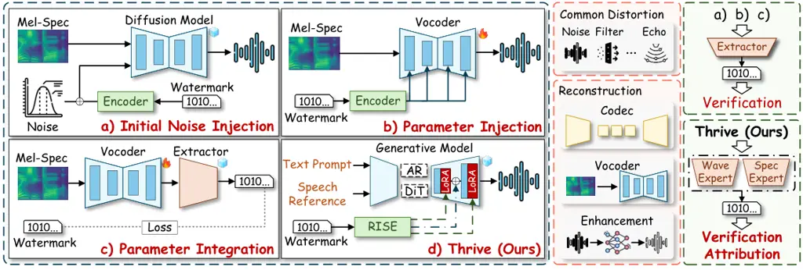
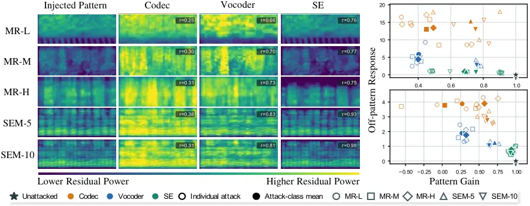
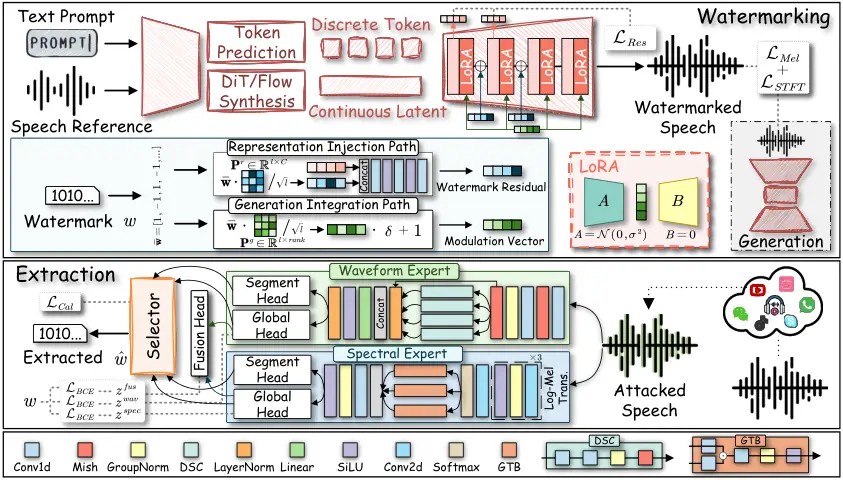
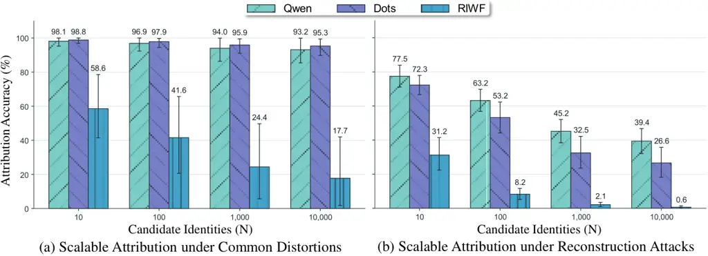
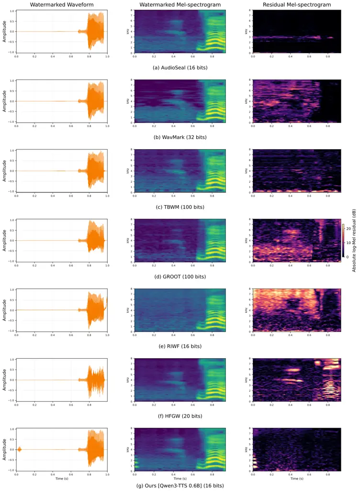
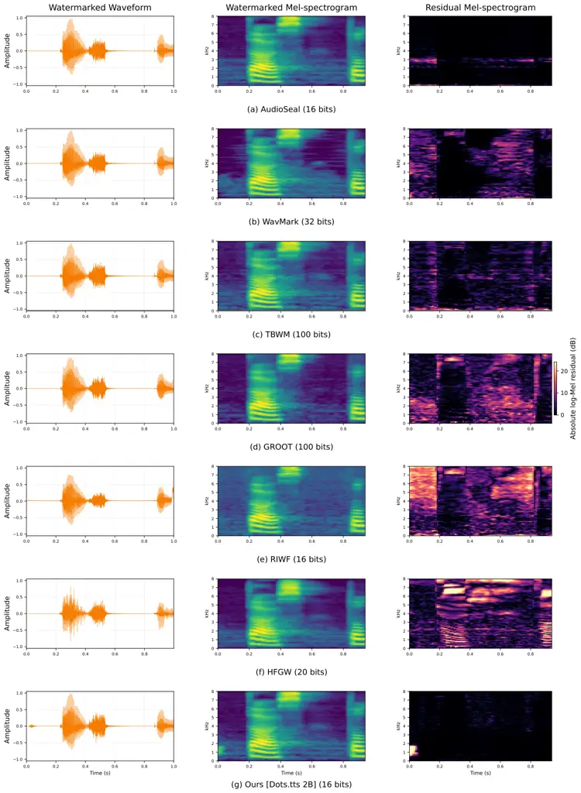

# Learning to Watermark Speech Synthesis Against Model-Driven Reconstruction

Weizhi Liu Affiliation: East China Normal University, Shanghai, China   
Yue Li Affiliation: Huaqiao University, Xiamen, China    Hui Tian
Affiliation: Huaqiao University, Xiamen, China    Zhaoxia Yin
^(†)^(†)thanks: Corresponding author Affiliation: East China Normal
University, Shanghai, China

###### Abstract

Modern TTS systems increasingly generate synthetic speech at scale for
diverse users. This setting calls for content-level provenance that can
verify the origin of released speech and attribute it to the requesting
user, which generative watermarking can support by embedding multi-bit
identifiers directly into synthesized speech. Once released, however,
speech may undergo heterogeneous learned transformations during
distribution and editing, with reconstruction objectives that can
preserve speech utility while affecting watermark recoverability
differently. We find that no single watermark carrier remains
consistently reliable across reconstruction models, as its survival
depends jointly on the embedded structure, reconstruction mechanism, and
observation representation. To this end, we propose Thrive, a multi-bit
generative speech watermarking framework for modern autoregressive TTS,
covering both discrete-token and continuous-representation generation
under reconstruction attacks. Specifically, Rise synchronizes watermark
injection into intermediate representations with its continued
integration into subsequent generation, while Care combines waveform and
spectral experts using bit-wise reliability selection. Experiments on
both autoregressive paradigms show that Thrive preserves synthesis
fidelity, achieves 87.6% average recovery accuracy under reconstruction
attacks, and supports source attribution over candidate sets of up to
10,000 identities.

|     |
| --- |
|     |

[  Speech Demo Page](https://lwzzz7.github.io/Thrive_Demo/)

## 1 Introduction

Neural codec language models (Cui et al., 2025), which autoregressively
generate discrete codec tokens, have become a prominent paradigm for
modern text-to-speech (TTS) synthesis, while recent systems extend to
continuous acoustic representations (Xie et al., 2025). As these models
are deployed in TTS services, a single model may generate speech for
many registered users. Practical accountability therefore requires
content-level provenance, including verifying the origin of released
speech and attributing it to the requesting user (USA, 2026; CHN, 2025).
Generative watermarking can support both objectives (Zhao et al., 2025)
by embedding a specific multi-bit identifier directly into synthesized
speech. Once released, speech content may be transformed as it is
distributed and edited across platforms. Such transformations may occur
in combination or in sequence in practice and are increasingly mediated
by learned speech models, whose reconstruction objectives can preserve
speech utility yet have markedly different effects on watermark
recoverability. Robustness tailored to a single reconstruction mechanism
can therefore become brittle, as the watermark provider cannot control
which sequence or combination of downstream transformations released
speech will actually undergo. When deliberately exploited to undermine
watermark recovery while retaining usable speech, such learned
transformations constitute model-driven reconstruction attacks.

Existing post-hoc methods embed watermarks into time-frequency or latent
representations (San Roman et al., 2024; Chen et al., 2026), while
generative methods inject them during synthesis (Liu et al., 2024b; Zhu
et al., 2026) or encode watermark behavior into model parameters (Feng
et al., 2025; Cheng et al., 2024). Despite these different integration
points, existing research establishes the watermark through a fixed
representation or model component and relies on the resulting acoustic
structure to remain observable. Heterogeneous reconstruction objectives
can preserve, reorganize, or discard the same structure differently,
leaving unresolved whether any fixed carrier can remain reliable across
reconstruction attacks.

To test this assumption, we embed controlled spectro-temporal patterns
into speech and trace their behavior across diverse acoustic and
representation spaces. We find that the same pattern can be preserved,
reshaped, or suppressed differently across reconstruction models, while
its observability varies across recovery representations. Watermark
survival therefore depends jointly on the embedded structure,
reconstruction mechanism, and observation representation, leaving no
single carrier uniformly reliable across attacks. This raises the
question of how to maintain watermark recoverability as watermark
behavior varies across heterogeneous reconstruction models.

To address this question, our key insight is to diversify watermark
participation in generation and adapt its recovery after reconstruction.
We therefore propose Thrive, a generative speech watermarking framework
for robust provenance verification and source attribution under
model-driven reconstruction, as contrasted with existing paradigms in
Fig. 1. Rise coordinates watermark injection into intermediate
representations with its continued participation in subsequent
generation, while Care combines waveform and spectral recovery through
bit-wise reliability selection. We further decouple capability learning
from reliability calibration so that the selector is trained against
stable recovery behavior. Experiments on autoregressive TTS backbone
with discrete tokens and continuous representations show that Thrive
preserves synthesis fidelity while maintaining robust provenance
verification under varied reconstruction and scalable multi-user source
attribution.

Our contributions can be summarized as:

- •
  We study canonical reconstruction attacks within a unified benchmark
  and reveal that watermark survival depends jointly on the embedded
  structure, reconstruction mechanism, and recovery representation.
  Motivated by this finding, we develop Thrive for robust provenance
  verification and source attribution under heterogeneous
  reconstruction.
- •
  Thrive integrates Rise for synchronized watermark participation across
  representation and generation, and Care for reliability-aware recovery
  across complementary waveform and spectral representations, enabling
  the framework to naturally accommodate continuous-representation
  autoregressive TTS.
- •
  We validate Thrive on two modern autoregressive TTS architectures,
  demonstrating robust provenance verification and scalable multi-user
  source attribution under diverse reconstruction attacks while
  preserving generation fidelity.



Figure 1: Comparison of generative speech watermarking paradigms.
Existing approaches establish the watermark through a particular
generation state, synthesis component, or model parameter, whereas
Thrive coordinates watermark participation throughout generation and
adapts recovery after model-driven reconstruction.

## 2 Related Work

Post-hoc speech watermarking improves robustness by seeking embedding
carriers that remain recoverable after signal processing or
reconstruction. WavMark (Chen et al., 2023), TBWM (Liu et al., 2024a),
and True (Li et al., 2026b) use frequency- or time-domain features,
while AudioSeal (San Roman et al., 2024), XAttnMark (Liu et al., 2025),
and DiscreteWM (Ji et al., 2025) extend watermark embedding to
continuous or discrete latent representations. FASW (Li et al., 2026a)
combines latent and frequency-domain features, whereas Latent-Mark (Chen
et al., 2026) constrains zero-bit watermark features to a latent
subspace preserved by codec reconstruction. These methods progressively
explore different feature spaces while retaining the central strategy of
finding carriers that remain stable after processing.

Generative speech watermarking has primarily studied multi-bit embedding
in two-stage TTS pipelines, where the watermark is tied to a particular
synthesis stage or generator component. Groot (Liu et al., 2024b), Zhu
et al. (2026), and Rong and Hu (2026) inject the watermark at the
initial stage of generation and rely on subsequent synthesis to
propagate it to the output. Parameter-based methods instead encode
watermark functionality into the generator, with RIWF (Feng et al., 2025) modulating selected vocoder weights and HFGw (Cheng et al., 2024)
fine-tuning the vocoder to produce watermarked speech. However, methods
such as Groot and HFGw bind the embedded watermark to the trained model
and require retraining to change the watermark. Recent approaches extend
watermarking to modern autoregressive models by steering discrete-token
sampling, but Wu et al. (2025) and Milis et al. (2026) primarily support
zero-bit detection. In contrast, Thrive brings multi-bit generative
watermarking to modern autoregressive TTS, including
continuous-representation generation that has not been covered by prior
autoregressive watermarking approaches. It further supports
utterance-specific identifiers at inference time without retraining,
while explicitly addressing watermark robustness under heterogeneous
model-driven reconstruction.

## 3 Preliminaries

### 3.1 Problem definition

Let $`x_{c}`$ denote the text prompt, $`x_{s}`$ the reference speech,
and $`\mathcal{G}`$ a protected speech generative model serving multiple
registered users. Each registered user is assigned a distinct $`l`$-bit
watermark $`w\in\{0,1\}^{l}`$. Given $`x_{c}`$, $`x_{s}`$, and $`w`$,
Thrive integrates $`w`$ into generation to produce the watermarked
speech $`s_{w}=\mathcal{G}(x_{c},x_{s},w)`$. The same model can embed
user-specific watermarks at inference time without retraining. After
release, $`s_{w}`$ may undergo routine or adversarial processing,
including signal distortions, lossy platform compression, and
enhancement or restoration during cross-platform reuse. We denote
$`\tilde{s}_{w}=\mathcal{P}(s_{w})`$, where $`\mathcal{P}`$ denotes such
processing during distribution. The recovery mechanism $`\mathcal{D}`$
then recovers:

```math
\hat{w}=\mathcal{D}(\tilde{s}_{w})=\mathcal{D}\bigl(\mathcal{P}(\mathcal{G}(x_{c},x_{s},w))\bigr). \tag{1}
```

Successful recovery requires $`\hat{w}=w`$ despite the applied
processing. The recovered watermark serves two purposes. ① Provenance
Verification links the processed speech $`\tilde{s}_{w}`$ to the
protected model $`\mathcal{G}`$, while ② Source Attribution identifies
the registered user who initiated the request. Both objectives must be
achieved while preserving Generation Fidelity. Let $`s`$ denote the
corresponding generation with watermark integration disabled. Thrive
aims to preserve fidelity between $`s_{w}`$ and $`s`$ while reliably
recovering $`w`$ after dissemination.

### 3.2 Threat Model

Defender’s abilities and goal. The defender deploys the protected model
$`\mathcal{G}`$ as a speech generation service for registered users. For
each request, $`\mathcal{G}`$ embeds the watermark assigned to the
requesting user and returns the watermarked speech $`s_{w}`$. When
$`s_{w}`$ later appears on public distribution channels, the defender
uses $`\mathcal{D}`$ for provenance verification and source attribution.
The defender aims to preserve synthesis fidelity while maintaining
reliable provenance verification and source attribution after
dissemination and reconstruction.

Attacker’s abilities and goal. During dissemination, $`s_{w}`$ may
undergo non-adversarial processing such as noise, filtering, resampling,
and lossy compression, which we treat as normal conditions under which
the watermark should remain recoverable. By contrast, once $`s_{w}`$
becomes publicly accessible, an attacker may deliberately apply
model-driven reconstruction, including neural codec regeneration,
enhancement reconstruction, and vocoder resynthesis, to disrupt
watermark recovery. The attacker has access only to the released speech
$`s_{w}`$ and may choose the reconstruction model and configuration, but
has no access to the internal generation or recovery pipeline. Denoting
the selected reconstruction attack by $`\mathcal{A}`$, the attacker aims
to make $`\mathcal{D}(\mathcal{A}(s_{w}))\neq w`$ while preserving
speech content and perceptual quality.

### 3.3 Analysis of Reconstruction Attacks



Figure 2: Controlled spectro-temporal pattern survival under
reconstruction attacks. Mel residuals show reconstruction-dependent
retention and deformation, while representation-space responses reveal
that the same reconstructed pattern can appear differently across
observation spaces.

To determine whether a stable watermark carrier can persist across
reconstruction models, we track controlled spectro-temporal patterns at
both acoustic and representation levels, following the ring-survival
diagnostic for image editing (Lu et al., 2025). For each reconstruction
model, we compare paired speech with and without each pattern to isolate
its post-reconstruction response. As shown in the left panel of Fig. 2,
temporal modulations are retained more strongly than localized spectral
structures under enhancement reconstruction, while retention varies
across codecs (Guo et al., 2025), vocoders (O’Shaughnessy, 2026), and
enhancement reconstructions (O’Shaughnessy, 2024). The right panel shows
that the same pattern-attack pair exhibits different retention and
deformation in FACodec (Ju et al., 2024) and WavLM (Chen et al., 2022)
representation spaces, indicating that watermark observability also
depends on the recovery representation. These findings show that
watermark survival depends jointly on acoustic structure, reconstruction
mechanism, and observation representation, so no single carrier or
observation space can characterize reconstruction robustness. Further
analysis is provided in Appendix A.

## 4 Method

### 4.1 Core Insight and Motivation

Since reconstruction can alter both watermark structures and their
observability, our core insight is to diversify how the watermark
participates in generation and how it is recovered after reconstruction.
Rather than relying on a watermark injected at a single intermediate
state to survive subsequent generation, Rise injects the message into
evolving representations and conditions later generation on the same
message, as illustrated in Fig. 3. Because reconstruction affects
waveform and spectral representations differently, Care selects between
their bit predictions according to estimated reliability. We first train
the embedding and recovery modules, then freeze them and calibrate only
the selector so that its reliability estimates reflect fixed expert
behavior. Implementation details are provided in Appendix B.



Figure 3: Overview of Thrive. Rise synchronizes watermark embedding
across representation and generation by injecting a representation
residual while modulating selected generation layers with the same
message. Care recovers complementary waveform and spectral predictions
and performs calibrated bit-wise selection for robust watermark recovery
after reconstruction.

### 4.2 Representation-Generation Synchronized Embedding

Rise synchronizes watermark injection with subsequent generation through
a Representation Injection Path and a Generation Integration Path. The
former writes the watermark into evolving intermediate representations,
while the latter allows the same watermark to continue influencing
subsequent generation. Given an $`l`$-bit watermark
$`\mathbf{w}\in\{0,1\}^{l}`$, we first XOR it with a predefined key and
map the result to the signed form $`\bar{\mathbf{w}}\in\{-1,1\}^{l}`$.

Representation Injection Path. Let
$`\mathbf{h}_{j}\in\mathbb{R}^{T\times d}`$ denote the intermediate
speech representation at generation stage $`j`$. We map the signed
watermark into the representation space as
$`\mathbf{w}^{r}=\mathbf{P}^{r}\bar{\mathbf{w}}/\sqrt{l}`$, where
$`\mathbf{P}^{r}\in\mathbb{R}^{d\times l}`$ is a learnable projection
matrix shared across the selected stages. The projected watermark
$`\mathbf{w}^{r}`$ is broadcast along the temporal dimension and
content-adaptively modulated before residual injection:

```math
\widetilde{\mathbf{h}}_{j}=\mathbf{h}_{j}+\Delta\mathbf{h}_{j}^{w},\qquad\Delta\mathbf{h}_{j}^{w}=\lambda_{j}\left\{\mathbf{1}+\rho\tanh\!\left(\mathcal{F}_{j}\!\left[\operatorname{LayerNorm}(\mathbf{h}_{j})\,\|\,\mathbf{w}^{r}\right]\right)\right\}\odot\mathbf{w}^{r}, \tag{2}
```

where $`\Delta\mathbf{h}_{j}^{w}`$ is the watermark residual and
$`\widetilde{\mathbf{h}}_{j}`$ the resulting watermarked representation.
The fusion network $`\mathcal{F}_{j}`$ consists of two pointwise
convolutions and a depthwise temporal convolution, with SiLU activations
between them. The coefficient $`\lambda_{j}`$ controls injection
strength, while $`\rho`$ bounds the modulation within
$`[1-\rho,1+\rho]`$.

Generation Integration Path. To maintain watermark participation in
subsequent generation, we introduce watermark-dependent rank-wise
modulation into the low-rank branches of selected generation layers,
following AquaLoRA (Feng et al., 2024). The signed watermark is mapped
to a rank-modulation vector
$`\mathbf{w}^{g}=g(\mathbf{1}+\delta\mathbf{P}^{g}\bar{\mathbf{w}}/\sqrt{l})`$,
where $`\mathbf{P}^{g}\in\mathbb{R}^{r\times l}`$ is a learnable
projection, $`\mathbf{1}\in\mathbb{R}^{r}`$ is the all-ones vector,
$`\delta`$ controls the watermark-dependent modulation strength, and
$`g`$ is a fixed modulation gain. For a selected generation layer $`m`$,
let $`\mathbf{h}_{m}`$ denote the intermediate representation received
by that layer, which may already include watermark residuals injected at
preceding representation stages. The modulated low-rank update is:

```math
\widetilde{\mathcal{W}}_{m}(\mathbf{h}_{m})=\mathcal{W}_{m}(\mathbf{h}_{m})+\frac{\alpha}{r}\mathcal{B}_{m}\!\left[\mathbf{w}^{g}\odot\mathcal{A}_{m}(\mathbf{h}_{m})\right], \tag{3}
```

where $`\mathcal{W}_{m}`$ denotes the frozen base transformation,
$`\mathcal{A}_{m}`$ and $`\mathcal{B}_{m}`$ are trainable low-rank
mappings, $`r`$ is the LoRA rank, and $`\alpha`$ is the fixed LoRA
scaling factor shared across the selected layers. The modulation vector
is shared across temporal positions. Because both $`\mathbf{w}^{r}`$ and
$`\mathbf{w}^{g}`$ are derived from the input watermark, Rise supports
different watermarks at inference time without retraining.

### 4.3 Cross-Representation Adaptive Recovery

Because reconstruction affects watermark recoverability differently
across waveform and spectral representations, their relative reliability
varies across attacks and bits. The Cross-Representation Adaptive
Recovery mechanism (Care) therefore uses complementary waveform and
spectral experts and selects between their predictions for each bit
according to estimated reliability.

Complementary Recovery Experts. Given the processed speech
$`\widetilde{s}_{w}`$, the Waveform Expert extracts watermark
information directly from the waveform. It extracts temporal features
through a frontend and four dilated depthwise-separable convolutional
(DSC) blocks, then fuses multi-level features with the deepest
representation. The Spectral Expert converts $`\widetilde{s}_{w}`$ into
a normalized log-Mel spectrogram, extracts local time-frequency features
with a convolutional encoder, aggregates the frequency dimension through
learned attention, and applies parallel gated temporal branches (GTB).
Both experts use a Segment Head for temporal bit logits and a Global
Head with attentive statistics pooling for utterance-level logits:

```math
(\mathbf{z}^{\mathrm{wav}},\mathbf{U}^{\mathrm{wav}})=\mathcal{D}_{\mathrm{wav}}(\widetilde{s}_{w}),\qquad(\mathbf{z}^{\mathrm{spec}},\mathbf{U}^{\mathrm{spec}})=\mathcal{D}_{\mathrm{spec}}\!\left(\operatorname{LogMel}(\widetilde{s}_{w})\right), \tag{4}
```

where $`\mathcal{D}_{k}`$ comprises the corresponding encoder, Segment
Head, and Global Head. For $`k\in\{\mathrm{wav},\mathrm{spec}\}`$,
$`\mathbf{U}^{k}\in\mathbb{R}^{T_{k}\times l}`$ contains segment-level
logits, while $`\mathbf{z}^{k}\in\mathbb{R}^{l}`$ contains
utterance-level logits. The global logits serve as candidate
predictions, while the segment-level logits capture temporal support for
each bit.

Furthermore, a Fusion Head uses cross-attention between the aligned
temporal representations to derive a spectral correction
$`\bm{\xi}\in\mathbb{R}^{l}`$ to the waveform prediction:

```math
\mathbf{z}^{\mathrm{fus}}=\mathbf{z}^{\mathrm{wav}}+\bm{\gamma}\odot\operatorname{clip}(\bm{\xi},-\kappa,\kappa). \tag{5}
```

where $`\bm{\gamma}\in[0,1]^{l}`$ is estimated from both experts’
prediction statistics and controls the bit-wise contribution of the
spectral correction, while $`\kappa`$ bounds its magnitude. The fused
logits $`\mathbf{z}^{\mathrm{fus}}`$ serve as the principal recovery
output during capability learning, whereas the calibrated reliability
selector later chooses directly between the two expert predictions.

Bit-wise Reliability Selector. Because the relative reliability of the
two experts can vary across bits, global confidence alone is
insufficient for selecting between their predictions. For each
expert-bit pair, Care estimates reliability from global confidence,
global–local agreement, segment strength, and temporal consistency:

```math
\displaystyle\bm{\phi}_{i}^{k}= \displaystyle\left[\tanh\!\left(\frac{|z_{i}^{k}|}{\tau}\right),\frac{1}{T_{k}}\sum_{t=1}^{T_{k}}\mathbb{I}\!\left[\operatorname{sgn}(U_{t,i}^{k})=\operatorname{sgn}(z_{i}^{k})\right],\right. \tag{6}
```

```math
\displaystyle\left.\operatorname*{median}_{t}\tanh\!\left(\frac{|U_{t,i}^{k}|}{\tau}\right),1-\operatorname{Std}_{t}\!\left(\tanh\!\left(\frac{U_{t,i}^{k}}{\tau}\right)\right)\right],
```

where $`\tau`$ controls confidence scaling. A shared scoring network
maps each descriptor to a correctness score
$`q_{i}^{k}=\mathcal{S}(\bm{\phi}_{i}^{k})+b_{k}`$, with the
expert-specific bias $`b_{k}`$ accounting for systematic confidence
differences. While $`q_{i}^{k}`$ captures bit-specific reliability,
reconstruction may also favor one representation across the entire
utterance. We therefore define the bit-wise reliability difference
$`d_{i}=q_{i}^{\mathrm{spec}}-q_{i}^{\mathrm{wav}}`$ and its
utterance-level average $`\bar{d}=l^{-1}\sum_{i=1}^{l}d_{i}`$. The final
prediction is selected by:

```math
\widehat{z}_{i}=\begin{cases}z_{i}^{\mathrm{spec}},&d_{i}+\lambda_{g}\bar{d}>0,\\
z_{i}^{\mathrm{wav}},&d_{i}+\lambda_{g}\bar{d}\leq 0,\end{cases}\qquad\widehat{w}_{i}=\mathbb{I}\!\left[\widehat{z}_{i}\geq 0\right], \tag{7}
```

where $`\lambda_{g}`$ controls the contribution of the utterance-level
preference. Applying this rule to all $`l`$ bits yields the recovered
watermark $`\widehat{\mathbf{w}}`$, with each bit selected according to
expert-specific reliability and the utterance-level representation
preference.

### 4.4 Capability Learning and Reliability Calibration

Reliable expert selection requires established recovery capabilities
that remain fixed during calibration. We therefore separate training
into capability learning and reliability calibration.

Capability Learning. We freeze the pretrained base generator and jointly
optimize Rise, the Fusion Head, and both recovery experts. Before
watermark recovery, an attack simulator produces
$`\widetilde{s}_{w}=\mathcal{T}(s_{w})`$ using either the identity or a
sampled training transformation, with details in Appendix C. The
recovery objective jointly supervises the fused and expert predictions:

```math
\mathcal{L}_{\mathrm{wm}}=\operatorname{BCE}(\mathbf{z}^{\mathrm{fus}},\mathbf{w})+\lambda_{\mathrm{wav}}\operatorname{BCE}(\mathbf{z}^{\mathrm{wav}},\mathbf{w})+\lambda_{\mathrm{spec}}\operatorname{BCE}(\mathbf{z}^{\mathrm{spec}},\mathbf{w}). \tag{8}
```

To preserve synthesis fidelity, $`\mathcal{L}_{\mathrm{mel}}(s_{w},s)`$
and $`\mathcal{L}_{\mathrm{stft}}(s_{w},s)`$ penalize Mel-spectrogram
and multi-scale STFT differences between $`s_{w}`$ and its unwatermarked
counterpart $`s`$. We further regularize the representation residuals as
$`\mathcal{L}_{\mathrm{res}}=\sum_{j\in\mathcal{J}}\operatorname{mean}[(\Delta\mathbf{h}_{j}^{w})^{2}]`$,
where $`\mathcal{J}`$ denotes the selected injection stages and the mean
is taken over all elements of each residual tensor. The overall
objective is:

```math
\mathcal{L}_{\mathrm{cap}}=\mathcal{L}_{\mathrm{wm}}+\lambda_{\mathrm{mel}}\mathcal{L}_{\mathrm{mel}}(s_{w},s)+\lambda_{\mathrm{stft}}\mathcal{L}_{\mathrm{stft}}(s_{w},s)+\lambda_{\mathrm{res}}\mathcal{L}_{\mathrm{res}}. \tag{9}
```

Reliability Calibration. After capability learning, we freeze Rise and
both recovery experts and calibrate only the shared scorer
$`\mathcal{S}`$ and expert-specific biases $`b_{k}`$ on sampled
processed speech. For expert $`k\in\{\mathrm{wav},\mathrm{spec}\}`$,
$`c_{i}^{k}=\mathbb{I}[\mathbb{I}(z_{i}^{k}\geq 0)=w_{i}]`$ indicates
whether bit $`i`$ is recovered correctly, and $`q_{i}^{k}`$ is treated
as its correctness logit. With $`\lambda_{g}=\frac{1}{2}`$, the selector
in Eq. (7) chooses the spectral expert when
$`\Delta_{i}=d_{i}+\frac{1}{2}\bar{d}>0`$ and the waveform expert
otherwise. For the ranking term, we use the disagreement set
$`\mathcal{I}=\{i\mid c_{i}^{\mathrm{wav}}\neq c_{i}^{\mathrm{spec}}\}`$,
where exactly one expert recovers the bit correctly:

```math
\mathcal{L}_{\mathrm{cal}}=\frac{1}{2}\sum_{k\in\{\mathrm{wav},\mathrm{spec}\}}\operatorname{BCE}(\mathbf{q}^{k},\mathbf{c}^{k})+\frac{1}{2\max(1,|\mathcal{I}|)}\sum_{i\in\mathcal{I}}\log\!\left(1+\exp\!\left[-\Delta_{i}\left(c_{i}^{\mathrm{spec}}-c_{i}^{\mathrm{wav}}\right)\right]\right), \tag{10}
```

The first term calibrates each expert’s score against bitwise
correctness, while the second encourages the selector to prefer the
correct expert on disagreement bits and vanishes when $`\mathcal{I}`$ is
empty.

|                                    |                     |                    |                    |                    |                     |                    |                       |                     |                  |                  |
| ---------------------------------- | ------------------- | ------------------ | ------------------ | ------------------ | ------------------- | ------------------ | --------------------- | ------------------- | ---------------- | ---------------- |
| Method (bps)                       | Objective Fidelity  |                    |                    |                    | Perceptual Quality  |                    | FAD                   |                     | Recovery         |                  |
|                                    | STOI $`\uparrow`$   | PESQ $`\uparrow`$  | SSIM $`\uparrow`$  | MCD $`\downarrow`$ | DNSMOS $`\uparrow`$ | NISQA $`\uparrow`$ | VGGish $`\downarrow`$ | CLAP $`\downarrow`$ | ACC $`\uparrow`$ | TPR $`\uparrow`$ |
| LJSpeech (In-Distribution Dataset) |                     |                    |                    |                    |                     |                    |                       |                     |                  |                  |
| Post-hoc Watermarking              |                     |                    |                    |                    |                     |                    |                       |                     |                  |                  |
| AudioSeal (16)                     | 0.998 $`\pm`$0.001  | 4.425 $`\pm`$0.073 | 0.978 $`\pm`$0.007 | 0.818 $`\pm`$0.160 | 3.202 $`\pm`$0.211  | 3.875 $`\pm`$0.625 | 0.077                 | 0.004               | 1.000            | 1.000            |
| WavMark (32)                       | 1.000 $`\pm`$0.001  | 4.495 $`\pm`$0.084 | 0.973 $`\pm`$0.022 | 1.278 $`\pm`$0.455 | 3.132 $`\pm`$0.239  | 3.708 $`\pm`$0.723 | 0.435                 | 0.013               | 1.000            | 1.000            |
| TBWM (100)                         | 0.986 $`\pm`$0.007  | 3.929 $`\pm`$0.214 | 0.937 $`\pm`$0.013 | 1.539 $`\pm`$0.138 | 3.213 $`\pm`$0.208  | 3.678 $`\pm`$0.621 | 0.855                 | 0.019               | 1.000            | 1.000            |
| Generative Watermarking            |                     |                    |                    |                    |                     |                    |                       |                     |                  |                  |
| Groot (100)                        | 0.958 $`\pm`$0.022  | 3.340 $`\pm`$0.315 | 0.907 $`\pm`$0.023 | 1.285 $`\pm`$0.192 | 3.277 $`\pm`$0.214  | 3.906 $`\pm`$0.624 | 0.058                 | 0.002               | 0.995            | 1.000            |
| RIWF (16)                          | 0.957 $`\pm`$0.018  | 2.414 $`\pm`$0.317 | 0.814 $`\pm`$0.047 | 6.310 $`\pm`$1.503 | 3.135 $`\pm`$0.315  | 3.098 $`\pm`$0.651 | 3.501                 | 0.102               | 0.993            | 1.000            |
| HFGw (20)                          | 0.943 $`\pm`$0.017  | 2.672 $`\pm`$0.275 | 0.935 $`\pm`$0.015 | 0.907 $`\pm`$0.068 | 2.877 $`\pm`$0.367  | 2.212 $`\pm`$0.556 | 1.790                 | 0.186               | 0.989            | 1.000            |
| Ours \[Qwen3-TTS 0.6B\] (16)       | 0.958 $`\pm`$0.073  | 3.565 $`\pm`$0.768 | 0.850 $`\pm`$0.087 | 1.754 $`\pm`$0.136 | 2.638 $`\pm`$0.429  | 2.807 $`\pm`$1.165 | 1.355                 | 0.086               | 0.999            | 1.000            |
| Ours \[Dots.tts 2B\] (16)          | 0.999 $`\pm`$0.003  | 4.210 $`\pm`$0.259 | 0.980 $`\pm`$0.004 | 0.777 $`\pm`$0.103 | 3.066 $`\pm`$0.317  | 4.094 $`\pm`$0.548 | 0.604                 | 0.037               | 0.999            | 1.000            |
| LibriTTS (OOD Dataset)             |                     |                    |                    |                    |                     |                    |                       |                     |                  |                  |
| Ours \[Qwen3-TTS\] (16)            | 0.969  $`\pm`$0.050 | 3.747 $`\pm`$0.566 | 0.858 $`\pm`$0.075 | 1.781 $`\pm`$0.157 | 2.271 $`\pm`$0.431  | 3.159 $`\pm`$1.007 | 1.539                 | 0.089               | 0.999            | 1.000            |
| Ours \[Dots.tts\] (16)             | 0.955 $`\pm`$0.197  | 4.045 $`\pm`$0.479 | 0.980 $`\pm`$0.004 | 0.739 $`\pm`$0.135 | 2.617 $`\pm`$0.286  | 3.827 $`\pm`$0.812 | 0.412                 | 0.052               | 0.999            | 0.999            |
| AISHELL-3 (OOD Dataset)            |                     |                    |                    |                    |                     |                    |                       |                     |                  |                  |
| Ours \[Qwen3-TTS\] (16)            | 0.902 $`\pm`$0.268  | 3.820 $`\pm`$0.439 | 0.874 $`\pm`$0.048 | 1.763 $`\pm`$0.146 | 2.667 $`\pm`$0.353  | 3.291 $`\pm`$0.798 | 1.243                 | 0.083               | 0.999            | 1.000            |
| Ours \[Dots.tts\] (16)             | 0.887 $`\pm`$0.314  | 4.069 $`\pm`$0.471 | 0.979 $`\pm`$0.004 | 0.764 $`\pm`$0.138 | 2.600 $`\pm`$0.325  | 3.399 $`\pm`$1.045 | 0.551                 | 0.067               | 0.999            | 1.000            |

Table 1: Fidelity and watermark recovery performance. Values are mean
$`\pm`$ standard deviation except FAD, which is computed at the corpus
level. TPR is measured at 1% FPR. Among generative watermarking methods,
the best results are highlighted in bold and the second-best are
underlined. $`\uparrow`$ and $`\downarrow`$ indicate that higher and
lower values are better, respectively.

## 5 Experiments

Following the objectives and the reconstruction analysis in Sec. 3, we
first describe the experimental setup (Sec. 5.1) and then evaluate
Thrive along four dimensions: generation fidelity and clean recovery
(Sec. 5.2), provenance verification (Sec. 5.3), source attribution
(Sec. 5.4), and the contributions of Rise and Care (Sec. 5.5).

### 5.1 Experimental Setup

Datasets and Baselines. Experiments use LJSpeech (Ito and Johnson, 2017)
(single-speaker English), LibriTTS (Zen et al., 2019) (multi-speaker
English), and AISHELL-3 (Shi et al., 2021) (multi-speaker Chinese). We
instantiate Thrive on Qwen3-TTS (0.6B) (Hu et al., 2026) with discrete
codec tokens and Dots.tts (2B) (Lian et al., 2026) with continuous
acoustic representations. Baselines include the post-hoc methods
WavMark (Chen et al., 2023) and AudioSeal (San Roman et al., 2024),
Timbre Watermark (Liu et al., 2024a), and the generative methods
Groot (Liu et al., 2024b), RIWF (Feng et al., 2025), and HFGw (Cheng et
al., 2024).

Evaluation Metrics. We report bit accuracy (ACC) for watermark recovery,
STOI (Taal et al., 2010), PESQ (Recommendation, 2001), SSIM (Wang et
al., 2004), and MCD (Kubichek, 1993) for paired speech fidelity,
DNSMOS (Reddy et al., 2022) and NISQA (Mittag et al., 2021) for
non-intrusive perceptual quality, and FAD for distribution-level
generation quality.

Implementation Details. We optimize trainable parameters with AdamW.
During capability learning, Rise, the Fusion Head, and both recovery
experts are trained for 80 epochs with batch size 2 and learning rates
of $`1\times 10^{-4}`$ for the low-rank generation path and
$`5\times 10^{-4}`$ for other modules. We use a three-epoch warm-up,
cosine annealing after epoch 60, and introduce sampled processing from
epoch 20. The reliability selector is then calibrated for 10 epochs at
$`1\times 10^{-4}`$ with all other modules frozen. Training uses a
single NVIDIA RTX 4090 GPU.

|                            |                       |               |               |                         |               |               |               |               |
| -------------------------- | --------------------- | ------------- | ------------- | ----------------------- | ------------- | ------------- | ------------- | ------------- |
|                            | Post-hoc Watermarking |               |               | Generative Watermarking |               |               |               |               |
|                            | AudioSeal (16)        | WavMark (32)  | TBWM (100)    | Groot (100)             | RIWF (16)     | HFGw (20)     | Ours-Q (16)   | Ours-D (16)   |
| Clean                      | 0.999 / 1.000         | 1.000 / 1.000 | 1.000 / 1.000 | 0.995 / 1.000           | 0.993 / 1.000 | 0.989 / 1.000 | 0.999 / 1.000 | 0.999 / 1.000 |
| Signal Distortion          |                       |               |               |                         |               |               |               |               |
| Gau. Noi.                  | 0.808 / 0.380         | 0.561 / 0.022 | 0.725 / 0.986 | 0.995 / 1.000           | 0.951 / 0.959 | 0.926 / 0.987 | 0.983 / 0.998 | 0.993 / 1.000 |
| Low-pass                   | 0.978 / 0.995         | 1.000 / 1.000 | 0.993 / 1.000 | 0.985 / 1.000           | 0.525 / 0.004 | 0.914 / 0.976 | 0.999 / 1.000 | 0.999 / 1.000 |
| Echo                       | 0.969 / 0.987         | 0.859 / 0.971 | 0.947 / 1.000 | 0.986 / 1.000           | 0.593 / 0.016 | 0.983 / 1.000 | 0.958 / 0.973 | 0.962 / 0.979 |
| Resample                   | 1.000 / 1.000         | 0.998 / 1.000 | 0.900 / 1.000 | 0.992 / 1.000           | 0.741 / 0.176 | 0.799 / 0.625 | 0.999 / 1.000 | 0.999 / 1.000 |
| Quant.                     | 0.995 / 1.000         | 0.951 / 1.000 | 0.947 / 1.000 | 0.996 / 1.000           | 0.990 / 0.999 | 0.986 / 1.000 | 0.999 / 1.000 | 0.999 / 1.000 |
| Traditional Compression    |                       |               |               |                         |               |               |               |               |
| MP3                        | 0.964 / 0.982         | 0.740 / 0.543 | 0.749 / 0.997 | 0.992 / 1.000           | 0.965 / 0.982 | 0.845 / 0.812 | 0.999 / 1.000 | 0.999 / 1.000 |
| Opus                       | 0.455 / 0.001         | 0.904 / 0.997 | 0.861 / 1.000 | 0.760 / 0.999           | 0.614 / 0.024 | 0.835 / 0.774 | 0.999 / 1.000 | 0.999 / 1.000 |
| Neural Codec Regeneration  |                       |               |               |                         |               |               |               |               |
| EnCodec                    | 0.509 / 0.003         | 0.496 / 0.003 | 0.582 / 0.190 | 0.973 / 1.000           | 0.803 / 0.363 | 0.578 / 0.033 | 0.891 / 0.748 | 0.967 / 0.986 |
| FACodec                    | 0.507 / 0.003         | 0.523 / 0.007 | 0.553 / 0.073 | 0.749 / 0.997           | 0.634 / 0.034 | 0.581 / 0.035 | 0.788 / 0.309 | 0.842 / 0.524 |
| STCodec                    | 0.505 / 0.002         | 0.502 / 0.004 | 0.553 / 0.073 | 0.949 / 1.000           | 0.853 / 0.577 | 0.595 / 0.046 | 0.762 / 0.230 | 0.818 / 0.422 |
| HiFiCodec                  | 0.508 / 0.003         | 0.498 / 0.003 | 0.544 / 0.051 | 0.724 / 0.984           | 0.680 / 0.073 | 0.547 / 0.018 | 0.854 / 0.580 | 0.943 / 0.942 |
| VoiceCraft                 | 0.505 / 0.002         | 0.490 / 0.002 | 0.551 / 0.068 | 0.980 / 1.000           | 0.605 / 0.020 | 0.480 / 0.004 | 0.796 / 0.338 | 0.837 / 0.504 |
| Vocoder Resynthesis        |                       |               |               |                         |               |               |               |               |
| WaveGlow                   | 0.511 / 0.003         | 0.508 / 0.005 | 0.783 / 1.000 | 0.775 / 1.000           | 0.549 / 0.007 | 0.443 / 0.001 | 0.933 / 0.914 | 0.892 / 0.753 |
| HiFi-GAN                   | 0.506 / 0.002         | 0.509 / 0.005 | 0.816 / 1.000 | 0.725 / 0.986           | 0.548 / 0.006 | 0.544 / 0.017 | 0.860 / 0.606 | 0.769 / 0.248 |
| BigVGAN                    | 0.520 / 0.003         | 0.506 / 0.004 | 0.884 / 1.000 | 0.727 / 0.987           | 0.642 / 0.039 | 0.497 / 0.005 | 0.899 / 0.785 | 0.882 / 0.709 |
| Vocos                      | 0.509 / 0.003         | 0.531 / 0.009 | 0.938 / 1.000 | 0.715 / 0.975           | 0.645 / 0.041 | 0.640 / 0.101 | 0.881 / 0.703 | 0.863 / 0.619 |
| DiffWave                   | 0.503 / 0.002         | 0.491 / 0.003 | 0.690 / 0.917 | 0.743 / 0.995           | 0.533 / 0.005 | 0.487 / 0.004 | 0.925 / 0.886 | 0.868 / 0.646 |
| PriorGrad                  | 0.507 / 0.002         | 0.490 / 0.003 | 0.688 / 0.911 | 0.740 / 0.994           | 0.532 / 0.004 | 0.489 / 0.004 | 0.926 / 0.886 | 0.870 / 0.646 |
| WaveFM                     | 0.527 / 0.004         | 0.469 / 0.001 | 0.929 / 1.000 | 0.687 / 0.906           | 0.755 / 0.210 | 0.590 / 0.043 | 0.920 / 0.868 | 0.965 / 0.983 |
| Enhancement Reconstruction |                       |               |               |                         |               |               |               |               |
| FRCRN                      | 0.998 / 1.000         | 0.999 / 1.000 | 0.989 / 1.000 | 0.996 / 1.000           | 0.589 / 0.015 | 0.962 / 0.999 | 0.902 / 0.798 | 0.805 / 0.370 |
| Demucs                     | 1.000 / 1.000         | 1.000 / 1.000 | 0.993 / 1.000 | 0.995 / 1.000           | 0.561 / 0.008 | 0.958 / 0.999 | 0.976 / 0.994 | 0.895 / 0.769 |

Table 2: Provenance verification under common distortions and
reconstruction attacks on LJSpeech. Entries are ACC / TPR@1%FPR and
Ours-Q/D denote Qwen3-TTS/Dots.tts.

### 5.2 Generation Fidelity and Clean Recovery

We first examine whether Thrive can preserve speech fidelity while
enabling reliable watermark recovery. Table 1 highlights three key
findings. ① Both implementations achieve near-perfect clean recovery,
with an ACC of 0.999 and a TPR of 1.000 at 1% FPR. Dots.tts retains
particularly high fidelity (PESQ 4.210 and SSIM 0.980), while Qwen3-TTS
preserves intelligibility (STOI 0.958) but exhibits larger acoustic
deviation. ② This reliable recovery extends beyond the training
distribution. On LibriTTS and AISHELL-3, both backbones retain
near-perfect watermark recovery despite changes in speaker diversity and
language. ③ The approach applies consistently across distinct
autoregressive representations. Qwen3-TTS generates discrete codec
tokens, whereas Dots.tts operates on continuous acoustic
representations, showing that Thrive supports reliable multi-bit
recovery while preserving generation fidelity in both settings.

### 5.3 Provenance verification

To assess provenance verification after dissemination and
reconstruction, we evaluate Thrive under common distortions and
model-driven reconstruction attacks. Table 2 highlights three key
findings. ① Thrive remains highly stable under routine processing and
robust across diverse reconstruction attacks. Dots.tts performs better
under neural codec regeneration, whereas Qwen3-TTS is stronger under
most vocoder resynthesis models and both enhancement models. ②
Robustness varies substantially across reconstruction mechanisms, with
clear performance crossings among Thrive backbones and competing
methods. This echoes the reconstruction-dependent carrier survival
identified in Sec. 3.3, showing that robustness depends on the
interaction between watermarking and reconstruction rather than a
universally stable carrier. ③ Despite this heterogeneity, Thrive
maintains reliable verification across all three reconstruction
families, preserving provenance after dissemination and model-driven
reconstruction.

### 5.4 Source Attribution



Figure 4: Source attribution across increasing candidate-set sizes.
Results are averaged over common distortions in (a) and across
reconstruction attacks in (b).

Following XAttnMark (Liu et al., 2025), we evaluate source attribution
by nearest-Hamming retrieval over candidate pools from $`10`$ to
$`10{,}000`$ under common processing and model-driven reconstruction, as
shown in Fig. 4. ① Thrive maintains strong attribution as the candidate
population scales. Under common processing, Qwen3-TTS and Dots.tts
retain 93.2% and 95.3% accuracy at $`N=10{,}000`$, whereas RIWF drops to
17.7%. ② Reconstruction makes attribution substantially harder, yet both
Thrive variants consistently outperform RIWF across all candidate-set
sizes. At $`N=10{,}000`$, Qwen3-TTS and Dots.tts retain 39.4% and 26.6%
accuracy, compared with 0.6% for RIWF. This difference further reflects
reconstruction-dependent robustness. ③ These results show that the
recovered watermark remains discriminative beyond provenance
verification, supporting scalable multi-user attribution under both
routine and reconstruction processing.

### 5.5 Contributions of Thrive

|                     |                   |                    |                    |                         |                           |
| ------------------- | ----------------- | ------------------ | ------------------ | ----------------------- | ------------------------- |
| Variant             | Quality           |                    | Recovery ACC       |                         |                           |
|                     | PESQ $`\uparrow`$ | NISQA $`\uparrow`$ | Clean $`\uparrow`$ | Codec Avg. $`\uparrow`$ | Vocoder Avg. $`\uparrow`$ |
| Full Thrive         | 3.565             | 2.807              | 0.999              | 0.818                   | 0.906                     |
| Embedding Ablation  |                   |                    |                    |                         |                           |
| Generation only     | 3.755             | 3.313              | 0.999 (0.000)      | 0.675 (-0.143)          | 0.674 (-0.232)            |
| Representation only | 4.643             | 3.477              | 0.489 (-0.510)     | –                       | –                         |
| Static LoRA         | 4.156             | 3.451              | 0.489 (-0.510)     | –                       | –                         |
| Recovery Ablation   |                   |                    |                    |                         |                           |
| Waveform only       | 3.814             | 3.276              | 1.000 (+0.001)     | 0.657 (-0.161)          | 0.771 (-0.135)            |
| Spectral only       | 3.408             | 3.315              | 0.938 (-0.061)     | 0.873 (+0.055)          | 0.771 (-0.135)            |
| Without Selector    | 3.565             | 2.807              | 0.999 (0.000)      | 0.780 (-0.038)          | 0.844 (-0.062)            |

Table 3: Ablation of Thrive on Qwen3-TTS. Parentheses indicate ACC
changes relative to the full model.

Table 3 ablates the embedding and recovery components of Thrive and
highlights three key findings. ① On the embedding side, generation-only
preserves clean recovery but reduces codec and vocoder ACC by 0.143 and
0.232, respectively, whereas representation-only and static LoRA remain
near chance-level on clean speech despite high synthesis quality. This
shows that representation injection strengthens robustness when
synchronized with continued watermark participation during generation. ②
On the recovery side, the waveform expert performs best on clean speech,
whereas the spectral expert is substantially stronger under codec
regeneration. Removing the selector further reduces codec and vocoder
ACC by 0.038 and 0.062 while leaving clean recovery unchanged,
supporting the contribution of reliability-based selection. These
complementary recovery profiles echo the representation-dependent
observability identified in Sec. 3.3 and motivate adaptive recovery
across representations. ③ Overall, the ablations support coordinating
watermark participation across representations and generation while
avoiding reliance on a single recovery representation under diverse
reconstruction.

## 6 Conclusion

We investigate generative speech watermarking under model-driven
reconstruction and show that watermark survival depends jointly on the
embedded structure, reconstruction mechanism, and recovery
representation. Motivated by this finding, we propose Thrive, where Rise
coordinates watermark participation across representation and
generation, while Care performs reliability-aware cross-representation
recovery. Experiments on modern autoregressive TTS, including the
continuous-representation setting, demonstrate high synthesis fidelity,
robust recovery under heterogeneous reconstruction attacks and common
distortions, and scalable source attribution.

### AI use statement

In this work, we used generative AI tools for sentence translation,
manuscript polishing, and detailed checking of consistency throughout
the paper. We have not used generative AI tools to fabricate experiments
or invent experimental results. We have reviewed all AI-assisted work
and verified the final manuscript content and reported results for
correctness. We take responsibility for the final content of this work,
including text, claims, or artifacts produced with the aid of generative
AI.

## References

- Chen et al. (2023) G. Chen, Y. Wu, S. Liu, T. Liu, X. Du, and F. Wei
  WavMark: watermarking for audio generation. arXiv preprint
  arXiv:2308.12770. Cited by: §2, §5.1.
- Chen et al. (2022) S. Chen, C. Wang, Z. Chen, Y. Wu, S. Liu, Z.
  Chen, J. Li, N. Kanda, T. Yoshioka, X. Xiao, J. Wu, L. Zhou, S.
  Ren, Y. Qian, Y. Qian, J. Wu, M. Zeng, X. Yu, and F. Wei WavLM:
  large-scale self-supervised pre-training for full stack speech
  processing. IEEE Journal of Selected Topics in Signal Processing 16
  (6), pp. 1505–1518. Cited by: §3.3.
- Chen et al. (2026) Y. Chen, S. Lai, Y. Tsou, Y. Lin, B. Chen, Y.
  Chen, H. Lee, and S. Chen Latent-mark: an audio watermark robust to
  neural codec compression. In Proceedings of Interspeech, Cited by: §1,
  §2.
- Cheng et al. (2024) X. Cheng, Y. Wang, C. Liu, D. Hu, and Z. Su
  HiFi-ganw: watermarked speech synthesis via fine-tuning of hifi-gan.
  IEEE Signal Processing Letters 31, pp. 2440–2444. Cited by: §1, §2,
  §5.1.
- CHN (2025) CHN Cybersecurity technology—labeling method for content
  generated by artificial intelligence (GB 45438-2025). Note:
  [https://www.cac.gov.cn/2025-03/14/c_1743654684782215.htm](https://www.cac.gov.cn/2025-03/14/c_1743654684782215.htm)
  Cited by: §1.
- Cui et al. (2025) W. Cui, D. Yu, X. Jiao, Z. Meng, G. Zhang, Q.
  Wang, S. Y. Guo, and I. King Recent advances in speech language
  models: a survey. In Proceedings of the 63rd Annual Meeting of the
  Association for Computational Linguistics (Volume 1: Long Papers),
  pp. 13943–13970. Cited by: §1.
- Feng et al. (2024) W. Feng, W. Zhou, J. He, J. Zhang, T. Wei, G.
  Li, T. Zhang, W. Zhang, and N. Yu AquaLoRA: toward white-box
  protection for customized stable diffusion models via watermark lora.
  In Proceedings of the 41st International Conference on Machine
  Learning, pp. 13423–13444. Cited by: §4.2.
- Feng et al. (2025) Y. Feng, X. Zhang, F. Feng, G. Zhang, and L. Xu
  Robust and imperceptible watermarking framework for generative audio
  models. IEEE Signal Processing Letters 32, pp. 3196–3200. Cited by:
  §1, §2, §5.1.
- Guo et al. (2025) Y. Guo, Z. Li, H. Wang, B. Li, C. Shao, H. Zhang, C.
  Du, X. Chen, S. Liu, and K. Yu Recent advances in discrete speech
  tokens: a review. IEEE Transactions on Pattern Analysis and Machine
  Intelligence. Cited by: §C.2, §3.3.
- Hu et al. (2026) H. Hu, X. Zhu, T. He, D. Guo, B. Zhang, X. Wang, Z.
  Guo, Z. Jiang, H. Hao, Z. Guo, et al. Qwen3-tts technical report.
  arXiv preprint arXiv:2601.15621. Cited by: §D.2, §5.1.
- Ito and Johnson (2017) K. Ito and L. Johnson The lj speech dataset.
  Note:
  [https://keithito.com/LJ-Speech-Dataset/](https://keithito.com/LJ-Speech-Dataset/)
  Cited by: §D.1, §5.1.
- Ji et al. (2025) S. Ji, Z. Jiang, J. Zuo, M. Fang, Y. Chen, T. Jin,
  and Z. Zhao Speech watermarking with discrete intermediate
  representations. In Proceedings of the AAAI Conference on Artificial
  Intelligence, Vol. 39, pp. 24239–24247. Cited by: §2.
- Ju et al. (2024) Z. Ju, Y. Wang, K. Shen, X. Tan, D. Xin, D. Yang, E.
  Liu, Y. Leng, K. Song, S. Tang, Z. Wu, T. Qin, X. Li, W. Ye, S.
  Zhang, J. Bian, L. He, J. Li, and S. Zhao NaturalSpeech 3: zero-shot
  speech synthesis with factorized codec and diffusion models. In
  Proceedings of the 41st International Conference on Machine Learning,
  pp. 22605–22623. Cited by: §3.3.
- Kubichek (1993) R. Kubichek Mel-cepstral distance measure for
  objective speech quality assessment. In Proceedings of IEEE Pacific
  Rim Conference on Communications Computers and Signal Processing, Vol.
  1, pp. 125–128. Cited by: §5.1.
- Li et al. (2026a) H. Li, S. Peng, Z. Zhang, J. Xie, X. Xie, H. Peng,
  and Z. Wu Feature-aligned speech watermarking for robustness to
  reconstruction distortions. In IEEE International Conference on
  Multimedia and Expo, Cited by: §2.
- Li et al. (2026b) Y. Li, W. Liu, D. Lin, H. Tian, and H. Wang
  Protecting your voice: temporal-aware robust watermarking. IEEE Signal
  Processing Letters 33, pp. 3446–3450. Cited by: §2.
- Lian et al. (2026) S. Lian, C. Li, B. Li, H. Wang, D. Zheng, J.
  Tian, Y. Ma, C. Zhang, and K. Yu Dots. tts technical report. arXiv
  preprint arXiv:2606.07080. Cited by: §D.2, §5.1.
- Liu et al. (2024a) C. Liu, J. Zhang, T. Zhang, X. Yang, W. Zhang,
  and N. Yu Detecting voice cloning attacks via timbre watermarking. In
  Proceedings of the Network and Distributed System Security (NDSS)
  Symposium, Cited by: §C.1, §C.1, §2, §5.1.
- Liu et al. (2024b) W. Liu, Y. Li, D. Lin, H. Tian, and H. Li Groot:
  generating robust watermark for diffusion-model-based audio synthesis.
  In Proceedings of the 32nd ACM International Conference on Multimedia,
  pp. 3294–3302. Cited by: §1, §2, §5.1.
- Liu et al. (2025) Y. Liu, L. Lu, J. Jin, L. Sun, and A. Fanelli
  XAttnMark: learning robust audio watermarking with cross-attention. In
  Proceedings of the 42nd International Conference on Machine Learning,
  pp. 38987–39015. Cited by: §2, §5.4.
- Lu et al. (2025) S. Lu, Z. Zhou, J. Lu, et al. Robust watermarking
  using generative priors against image editing: from benchmarking to
  advances. In International Conference on Learning Representations,
  pp. 83902–83936. Cited by: §3.3.
- Milis et al. (2026) G. Milis, Y. Qin, Y. Wu, and H. Huang Hidden in
  plain tokens: simply robust, gradient-free watermark for synthetic
  audio. In Proceedings of the 43rd International Conference on Machine
  Learning (ICML), Cited by: §2.
- Mittag et al. (2021) G. Mittag, B. Naderi, A. Chehadi, and S. Möller
  NISQA: A Deep CNN-Self-Attention Model for Multidimensional Speech
  Quality Prediction with Crowdsourced Datasets. In Interspeech 2021,
  pp. 2127–2131. Cited by: §5.1.
- O’Shaughnessy (2024) D. O’Shaughnessy Speech enhancement—a review of
  modern methods. IEEE Transactions on Human-Machine Systems 54 (1),
  pp. 110–120. Cited by: §3.3.
- O’Shaughnessy (2026) D. O’Shaughnessy Review of automatic
  text-to-speech synthesis methods. IEEE Transactions on Audio, Speech
  and Language Processing. Cited by: §3.3.
- Recommendation (2001) I. Recommendation Perceptual evaluation of
  speech quality (pesq): an objective method for end-to-end speech
  quality assessment of narrow-band telephone networks and speech
  codecs. Rec. ITU-T P. 862. Cited by: §5.1.
- Reddy et al. (2022) C. K. A. Reddy, V. Gopal, and R. Cutler Dnsmos
  p.835: a non-intrusive perceptual objective speech quality metric to
  evaluate noise suppressors. In IEEE International Conference on
  Acoustics, Speech and Signal Processing, pp. 886–890. Cited by: §5.1.
- Rong and Hu (2026) X. Rong and D. Hu Anchor watermark: robust
  attribution for diffusion-based text-to-audio model. In Proceedings of
  the AAAI Conference on Artificial Intelligence, Vol. 40,
  pp. 32817–32825. Cited by: §2.
- San Roman et al. (2024) R. San Roman, P. Fernandez, H. Elsahar, A.
  Défossez, T. Furon, and T. Tran Proactive detection of voice cloning
  with localized watermarking. In Proceedings of the 41st International
  Conference on Machine Learning, pp. 43180–43196. Cited by: §1, §2,
  §5.1.
- Shi et al. (2021) Y. Shi, H. Bu, X. Xu, S. Zhang, and M. Li AISHELL-3:
  a multi-speaker mandarin tts corpus. In Proc. Interspeech,
  pp. 2756–2760. Cited by: §D.1, §5.1.
- Taal et al. (2010) C. H. Taal, R. C. Hendriks, R. Heusdens, and J.
  Jensen A short-time objective intelligibility measure for
  time-frequency weighted noisy speech. In IEEE International Conference
  on Acoustics, Speech and Signal Processing, pp. 4214–4217. Cited by:
  §5.1.
- USA (2026) USA SB 942: California AI Transparency Act. Note:
  [https://leginfo.legislature.ca.gov/faces/billTextClient.xhtml?bill_id=202320240SB942](https://leginfo.legislature.ca.gov/faces/billTextClient.xhtml?bill_id=202320240SB942)
  Cited by: §1.
- Wang et al. (2004) Z. Wang, A.C. Bovik, H.R. Sheikh, and E.P.
  Simoncelli Image quality assessment: from error visibility to
  structural similarity. IEEE Transactions on Image Processing 13 (4),
  pp. 600–612. Cited by: §5.1.
- Wu et al. (2025) Y. Wu, G. Milis, R. Chen, and H. Huang Robust
  distortion-free watermark for autoregressive audio generation models.
  Advances in Neural Information Processing Systems 38,
  pp. 110038–110067. Cited by: §2.
- Xie et al. (2025) T. Xie, Y. Rong, P. Zhang, W. Wang, and L. Liu
  Towards controllable speech synthesis in the era of large language
  models: a systematic survey. In Proceedings of the 2025 Conference on
  Empirical Methods in Natural Language Processing, pp. 764–791. Cited
  by: §1.
- Zen et al. (2019) H. Zen, V. Dang, R. Clark, Y. Zhang, R. J. Weiss, Y.
  Jia, Z. Chen, and Y. Wu LibriTTS: a corpus derived from librispeech
  for text-to-speech. Proc. Interspeech. Cited by: §D.1, §5.1.
- Zhao et al. (2025) X. Zhao, S. Gunn, M. Christ, J. Fairoze, A.
  Fabrega, N. Carlini, S. Garg, S. Hong, M. Nasr, F. Tramer, et al. Sok:
  watermarking for ai-generated content. In 2025 IEEE Symposium on
  Security and Privacy (SP), pp. 2621–2639. Cited by: §1.
- Zhu et al. (2026) R. Zhu, L. Zou, S. Lai, Z. Shen, Z. Li, and T. Qiao
  LAW: a training-free latent watermark for diffusion-generated audio
  attribution. IEEE Signal Processing Letters. Cited by: §1, §2.

## Appendix

## Appendix A Detailed Analysis of Reconstruction Attacks

### A.1 Motivation and Analysis Scope

Released speech may be regenerated by neural codecs, resynthesized by
vocoders, or processed by speech enhancement models during distribution
and reuse. The watermark provider cannot determine in advance which
reconstruction mechanism or specific model will be applied downstream,
so robustness tailored to a single reconstruction path may not
generalize to others. This motivates a more basic question of whether
any spectro-temporal structure can remain consistently preserved across
these reconstruction mechanisms and whether the surviving information
remains equally observable in a fixed representation.

We study this question using controlled spectro-temporal patterns whose
acoustic structure is known before reconstruction. By comparing the same
pattern across reconstruction models and observation spaces, we can
directly characterize what is preserved, how it is reshaped, and where
the remaining response is observable. Our analysis covers neural codec
regeneration, vocoder resynthesis, and enhancement reconstruction, with
multiple models in each family where possible to capture both
cross-family and within-family variation. The results show that neither
a single acoustic pattern nor a single observation representation
remains consistently reliable across reconstruction models.

### A.2 Controlled Spectro-Temporal Patterns

We choose five controlled patterns along two interpretable acoustic
axes, spectral location and temporal modulation. The goal is not to
prescribe a particular watermark carrier, but to test whether common
structural properties exhibit consistent preservation under
reconstruction.

#### Spectral patterns.

We use three Mel-localized ripple patterns to examine whether
reconstruction preferentially preserves particular spectral regions.
Speech is represented by an 80-bin power Mel spectrogram computed from
24-kHz audio using a 1,024-point Hann window and a hop length of 256.
The low, middle, and high patterns target Mel bins 0–19, 30–49, and
60–79 and are denoted MR-L, MR-M, and MR-H, respectively. Within the
selected region, we add a deterministic zero-mean ripple whose phase
varies jointly across time and frequency. The modified Mel spectrum is
mapped back to a linear-frequency magnitude and reconstructed with 32
Griffin–Lim iterations.

#### Temporal patterns.

We further use two speech-envelope modulations to examine temporal
structure independently of nominal spectral location. For modulation
frequency $`f\in\{5,10\}`$ Hz, the unnormalized pattern is:

```math
\widetilde{\delta}_{f}(s;t)=s(t)\sin(2\pi ft), \tag{11}
```

where multiplication by the speech waveform concentrates the
modification in speech-active regions. The two patterns are denoted
SEM-5 and SEM-10.

To make comparisons reflect pattern structure rather than perturbation
energy, every realized waveform pattern is normalized to 2% of the RMS
of its corresponding clean utterance,

```math
\delta_{m}(s)=\frac{\widetilde{\delta}_{m}(s)}{\operatorname{RMS}(\widetilde{\delta}_{m}(s))+\epsilon}\operatorname{RMS}(s)\cdot 0.02. \tag{12}
```

The same pattern realization and relative amplitude are used across
reconstruction conditions.

### A.3 Reconstruction Models and Observation Spaces

We evaluate seven reconstruction models spanning the three attack
families considered in the main paper. Neural codec regeneration
includes EnCodec at 6 kbps, FACodec, and SpeechTokenizer. Vocoder
resynthesis includes DiffWave and HiFi-GAN. Enhancement reconstruction
includes FRCRN and Demucs. Using multiple models within each family is
important because a shared application category does not imply a shared
reconstruction mechanism, and one objective of the analysis is to
determine whether models within the same family preserve the same
acoustic structures.

Each reconstructed pattern is examined in three observation spaces that
expose complementary aspects of its survival. The Mel space preserves
explicit time–frequency organization and therefore shows whether the
original acoustic structure remains directly visible. The FACodec latent
space provides a learned acoustic representation and reveals whether
reconstruction retains or redistributes pattern information beyond its
explicit Mel structure. WavLM provides a complementary self-supervised
speech representation and allows us to test whether the same
reconstructed pattern appears differently under another learned
representation. Together, these spaces distinguish acoustic preservation
from representation-dependent observability.

FACodec is used both as one reconstruction model and as a fixed
observation encoder for all reconstruction conditions. We therefore
interpret the FACodec-on-FACodec case together with the Mel and WavLM
results rather than treating it as an independent cross-architecture
comparison.

### A.4 Measuring Pattern Survival

We use 20 one-second LJSpeech segments sampled at 24 kHz. Crossing 20
utterances, seven reconstruction models, and five pattern configurations
yields 700 paired reconstruction observations.

For each utterance, we send both the original speech and its
pattern-modified counterpart through the same reconstruction model. Let
$`A`$ denote the reconstruction operation and $`\Psi`$ an observation
mapping. The pattern responses before and after reconstruction are:

```math
\Delta_{m}^{\Psi}(s)=\Psi(s+\delta_{m}(s))-\Psi(s),\qquad\Delta_{A,m}^{\Psi}(s)=\Psi(A(s+\delta_{m}(s)))-\Psi(A(s)). \tag{13}
```

The second difference isolates the incremental response associated with
the controlled pattern after both branches undergo the same
reconstruction. For stochastic models, the two branches use matched
random seeds, and all features are compared over their common temporal
extent.

We characterize the relationship between the pre-reconstruction response
$`\mathbf{u}=\operatorname{vec}(\Delta_{m}^{\Psi})`$ and the
post-reconstruction response
$`\mathbf{v}=\operatorname{vec}(\Delta_{A,m}^{\Psi})`$ from three
complementary perspectives. Directional alignment measures whether the
original pattern direction is preserved. Pattern gain measures how much
response remains along that direction. Off-pattern response measures how
much reconstruction redirects the pattern into other feature directions.
They are defined as:

```math
\displaystyle\operatorname{Align}(\mathbf{u},\mathbf{v}) \displaystyle=\frac{\langle\mathbf{v},\mathbf{u}\rangle}{\|\mathbf{v}\|_{2}\|\mathbf{u}\|_{2}+\epsilon}, \tag{14}
```

```math
\displaystyle\operatorname{Gain}(\mathbf{u},\mathbf{v}) \displaystyle=\frac{\langle\mathbf{v},\mathbf{u}\rangle}{\|\mathbf{u}\|_{2}^{2}+\epsilon}, \tag{15}
```

```math
\displaystyle\operatorname{Off}(\mathbf{u},\mathbf{v}) \displaystyle=\frac{\|\mathbf{v}-\operatorname{Gain}(\mathbf{u},\mathbf{v})\mathbf{u}\|_{2}}{\|\mathbf{u}\|_{2}+\epsilon}. \tag{16}
```

Together, these quantities describe preservation, retained strength, and
deformation rather than reducing reconstruction behavior to a single
attenuation value.

Model-level results first average the paired measurements over
utterances. Class-level summaries then assign equal weight to
reconstruction models within each family. Fig. 2 visualizes both the
acoustic responses and their behavior in learned observation spaces.

### A.5 Analysis Results

#### No spectro-temporal pattern is consistently preserved across reconstruction models.

The relative advantage of a pattern changes with the reconstruction
mechanism. For Mel directional alignment, MR-L/MR-M/MR-H average
0.25/0.30/0.31 under neural codecs, approximately 0.66–0.73 under
vocoders, and 0.75–0.77 under enhancement reconstruction. SEM-5/SEM-10
reach 0.36/0.31, 0.83/0.81, and 0.93/0.98 in the same three families.
Temporal modulation is therefore substantially more stable under the
tested vocoders and enhancement models, but this advantage does not
persist consistently under neural codec regeneration. The three
localized spectral patterns likewise show no stable low-to-high ordering
across codecs. These results rule out a single spectral region or
temporal structure as a consistently preserved carrier across
reconstruction models.

#### Reconstruction behavior varies within and across model families.

Models assigned to the same reconstruction family can preserve the same
pattern very differently. DiffWave is nearly uniform across the five
patterns, with Mel directional alignment between 0.648 and 0.691,
whereas HiFi-GAN strongly favors the two temporal patterns, whose
alignments reach 0.971 and 0.938 compared with 0.651–0.771 for the
localized spectral patterns. The contrast is even stronger for
enhancement reconstruction. FRCRN reduces the three localized-pattern
alignments to approximately 0.51–0.55 while retaining SEM-5 and SEM-10
at 0.873 and 0.968, whereas Demucs remains close to the unattacked
direction for all five patterns. The neural codecs also exhibit
different pattern orderings. Pattern survival is therefore governed by
the specific reconstruction mechanism rather than by its coarse attack
family alone.

#### Pattern observability changes across representations.

Reconstruction not only changes how much of a pattern remains, but also
changes the representation in which that response is most visible. In
FACodec space, neural codec regeneration retains nonzero projections of
the temporal patterns while introducing substantial off-pattern
components, indicating that part of the original structure is preserved
but redistributed into different feature directions. Representation
dependence is also visible for vocoder resynthesis. DiffWave appears
nearly uniform across patterns in Mel space, yet in FACodec space its
SEM-5/SEM-10 gains reach 0.754/0.758 compared with approximately
0.36–0.44 for its three localized spectral patterns. Similarly, FRCRN
substantially weakens localized Mel responses while leaving coherent
responses observable in WavLM space. The same reconstructed pattern can
therefore appear attenuated, preserved, or redistributed depending on
the observation representation.

#### Summary.

The controlled analysis reveals that pattern survival is jointly
determined by the embedded acoustic structure, the reconstruction
mechanism, and the observation representation. No single
spectro-temporal pattern remains consistently preserved across
reconstruction models, and no single observation space fully
characterizes the information that survives reconstruction. These
findings motivate the two complementary design choices in Thrive, namely
maintaining watermark participation throughout generation with Rise and
recovering from complementary representations with Care.

## Appendix B Thrive: Detailed Architecture and Implementation

This section provides the architecture and implementation details
omitted from the main text and follows the notation in Sec. 4. The
pretrained speech backbones remain frozen, while only the
watermark-specific modules described below are optimized.

### B.1 Architecture Overview

Figure 3 summarizes the generation and recovery flows of Thrive. On the
generation side, Rise uses the same input watermark through two
synchronized paths. The Representation Injection Path writes a watermark
residual into selected intermediate representations, while the
Generation Integration Path maintains message-dependent modulation in
subsequent generation layers. This design is instantiated at different
decoder locations for Qwen3-TTS and Dots.tts without changing their
original input–output interfaces.

On the recovery side, the processed speech $`\widetilde{s}_{w}`$ is sent
to both the Waveform Expert and the Spectral Expert in Care. Each expert
produces utterance-level and segment-level bit logits. During capability
learning, the Fusion Head combines the two expert representations and
provides the principal fused prediction, while both expert predictions
are also supervised. After capability learning, the experts are frozen
and the reliability Selector is calibrated from their fixed recovery
behavior. At inference, the Fusion Head is not used for the final
decision, and the calibrated Selector chooses directly between the
waveform and spectral predictions for each bit.

|           |                                                                                                                                             |                                                                                                                                                                                                                       |
| --------- | ------------------------------------------------------------------------------------------------------------------------------------------- | --------------------------------------------------------------------------------------------------------------------------------------------------------------------------------------------------------------------- |
| Backbone  | Representation Injection Path                                                                                                               | Generation Integration Path                                                                                                                                                                                           |
| Qwen3-TTS | Outputs of post_upsample_1 and post_upsample_2; the feature residual is added at each named stage.                                          | Full-decoder LoRA updates on 57 modules: pre_conv.conv (Conv1d), the q/k/v/o attention projections (Linear), and the gate/up/down MLP projections (Linear).                                                           |
| Dots.tts  | Outputs of decoder.ups\[0\] and decoder.ups\[1\]; the feature residual is added before the corresponding decoder.resblocks AMP aggregation. | LoRA updates on 48 modules: post_proj (Conv1d), dec_mi_layer.1.lstm (LSTM), decoder.conv_pre (Conv1d), decoder.ups\[0\] and decoder.ups\[1\] (ConvTranspose1d), and selected decoder.resblocks convolutions (Conv1d). |

Table 4: Backbone-specific placement of the RISE paths.

### B.2 Rise Architecture and Embedding Flow

RISE is attached only to the synthesis decoder of each backbone. The
original text and reference-speech processing remain unchanged, and the
same backbone produces either watermarked or unwatermarked speech
depending on whether watermark integration is enabled. The
Representation Injection Path and Generation Integration Path follow
Eqs. (2) and (3), respectively, and are conditioned on the same
user-specific watermark, while the original backbone parameters remain
frozen.

Before carrier projection, the watermark is XOR-whitened with a
secret-key stream and mapped to signed values. Two learnable carrier
projections, initialized with orthogonal bases, map the keyed message
into the decoder feature space and rank space for the two RISE paths,
respectively.

For the Representation Injection Path, the projected watermark is
broadcast along the temporal axis and content-adaptively modulated by
$`F_{j}`$ following Eq. (2). We set the injection strengths
$`\lambda_{j}`$ to $`10^{-3}`$ and $`5\times 10^{-4}`$ at the two
selected decoder stages, respectively. Each $`F_{j}`$ consists of two
pointwise convolutions and a depthwise temporal convolution with SiLU
activations, and the modulation is bounded by $`\rho`$ as defined in
Eq. (2). Only valid non-padding positions are updated.

For Qwen3-TTS, representation residuals are injected at the outputs of
post_upsample_1 and post_upsample_2. For Dots.tts, they are injected at
the outputs of decoder.ups\[0\] and decoder.ups\[1\], before the
corresponding decoder.resblocks AMP aggregation.

For the Generation Integration Path, both backbones use LoRA rank
$`r=64`$ and scaling $`\alpha=64`$. The watermark-dependent modulation
coefficient is $`\delta=0.9`$, and the fixed modulation gain is
$`g=2.0`$. Let $`r_{m}`$ denote the signed keyed message projected into
the rank space; the resulting modulation is
$`s_{m}=g(1+\delta r_{m})=2.0(1+0.9r_{m})`$, shared across temporal
positions. The backbone-specific LoRA placements are listed in Table 4.
The carrier projections and low-rank adapter parameters are trainable,
while the original decoder weights remain frozen.

### B.3 Care Architecture and Recovery Flow

Care uses complementary waveform and spectral recovery paths with a
common hidden width of 256. Both experts produce global logits
$`\mathbf{z}^{k}`$ and segment-level logits $`\mathbf{U}^{k}`$,
following Eq. (4). The global logits provide candidate bit predictions,
while the segment-level logits provide temporal evidence for reliability
estimation.

#### Waveform Expert.

The Waveform Expert operates directly on $`\widetilde{s}_{w}`$. A
strided one-dimensional frontend is followed by four depthwise-separable
convolution blocks with dilation rates $`1`$, $`2`$, $`4`$, and $`8`$.
Features from multiple levels are projected to a common width and fused
before the Segment Head and Global Head. The Segment Head produces
temporal bit logits, while the Global Head uses attentive statistics
pooling to produce utterance-level logits.

#### Spectral Expert.

The Spectral Expert converts $`\widetilde{s}_{w}`$ into an 80-bin
log-Mel spectrogram at 24 kHz using a 1,024-point FFT and window and a
hop length of 256. A two-dimensional convolutional frontend extracts
local time–frequency features, followed by learned frequency attention.
Three temporal branches with kernel sizes $`3`$, $`7`$, and $`15`$ model
complementary temporal scales, with two gated temporal blocks in each
branch. The fused temporal representation is passed to Segment and
Global Heads with the same output format as the waveform path.

#### Fusion and Reliability Selection.

During capability learning, the Fusion Head applies four-head
cross-attention between the aligned temporal representations, using
waveform features as queries and spectral features as keys and values.
The resulting spectral correction is combined with the waveform
prediction according to Eq. (5). The Fusion Head is used only during
capability learning and does not determine the final inference output.

After the two experts are frozen, the Selector estimates their bit-wise
reliability from the four descriptors in Eq. (6), namely global
confidence, global–local sign agreement, median segment strength, and
temporal stability. A lightweight shared MLP maps these descriptors to
expert correctness scores, with an expert-specific bias accounting for
systematic confidence differences. The final decision follows Eq. (7),
combining the bit-wise score difference with the utterance-level
representation preference. No ground-truth watermark, attack identity,
or clean reference is required at inference.

### B.4 Training and Inference Procedure

#### Capability Learning.

We first freeze the pretrained speech backbone and jointly optimize
Rise, the Fusion Head, and both Care experts. Capability learning runs
for 80 epochs with batch size 2. The low-rank generation path is
optimized with learning rate $`1\times 10^{-4}`$, while the remaining
trainable modules use $`5\times 10^{-4}`$. We use a three-epoch warm-up
and cosine annealing after epoch 60.

Epochs 1–19 use clean watermarked speech for recovery training. From
epoch 20 onward, an attack simulator produces the processed speech
$`\widetilde{s}_{w}=\mathcal{T}(s_{w})`$ before watermark recovery. The
training distribution assigns 85% probability to reconstruction-oriented
transformations and 15% to broad signal augmentations. The attack
operators and their parameter ranges are provided in Appendix C. The
recovery predictions are supervised by Eq. (8), while synthesis fidelity
and representation residual magnitude are controlled by Eq. (9).

#### Reliability Calibration.

After capability learning, Rise, the Fusion Head, and both recovery
experts are frozen. We calibrate only the shared reliability scorer and
expert-specific biases for 10 additional epochs with learning rate
$`1\times 10^{-4}`$. For each expert and bit, the correctness target is
computed from the detached expert prediction and the ground-truth
watermark. The calibration objective in Eq. (10) aligns reliability
scores with expert correctness and trains the Selector to prefer the
correct expert when their bit predictions disagree. These correctness
targets are used only during calibration.

#### Inference.

For watermark generation, the text prompt and reference speech are
processed by the protected TTS backbone while Rise conditions the
synthesis decoder on the user-specific watermark. Changing the watermark
does not require retraining the backbone or watermark modules.

For recovery, the received waveform is processed independently by the
Waveform and Spectral Experts. The Selector computes the reliability
descriptors from their global and segment-level predictions and selects
one expert logit for each bit according to Eq. (7). The selected logits
are thresholded to obtain the keyed bit sequence, after which the
inverse XOR operation recovers the original watermark. The recovery
procedure requires neither the applied attack nor an unprocessed
reference signal.

## Appendix C Attack Simulator and Robustness Settings

### C.1 Attack Simulator

The Attack Simulator is applied to watermarked speech before recovery.
Capability learning uses clean watermarked speech during epochs 1–19.
From epoch 20 onward, one transformation is sampled for each mini-batch,
with 85% probability from the reconstruction-proxy branch and 15% from
the conventional augmentation branch. The same sampling distribution is
used during reliability calibration, where only the reliability selector
is updated. For non-differentiable operations, the transformed waveform
is used in the forward pass with a straight-through gradient during
backpropagation.

#### Conventional augmentations.

Several conventional signal-processing operations are adapted from the
distortion pipeline of Timbre Watermark (Liu et al., 2024a), with
parameters adjusted to our 24-kHz training pipeline. We additionally
include codec compression and Mel-reconstruction variants as listed
below.

Mel-spectrogram reconstruction. Following the reconstruction procedure
used in Timbre Watermark (Liu et al., 2024a), the peak-normalized
waveform is converted to an 80-bin Mel representation, mapped back to a
linear-frequency magnitude using the pseudoinverse Mel matrix, and
reconstructed with 32 Griffin–Lim iterations. We use three variants
based on linear Mel magnitude, log-Mel magnitude, and log-Mel magnitude
smoothed with a $`3\times 5`$ filter.

EnCodec. We perform an EnCodec encode–decode round trip at 6 kbps.

Opus. We perform an Opus encode–decode round trip at 16 kbps.

Gaussian noise. Additive white Gaussian noise is applied with an SNR
uniformly sampled from 15–20 dB.

Low-pass filtering. The cutoff frequency is uniformly sampled from
2–4 kHz.

Amplitude scaling. The waveform amplitude is scaled by a factor sampled
from $`[0.90,1.10]`$.

Requantization. The waveform is uniformly requantized to 256 levels.

Dither. TPDF dither is applied without noise shaping.

Echo. A single delayed reflection is added with delay and gain
independently sampled from $`[0.1,0.5]`$ s and $`[0.1,0.5]`$,
respectively.

Sample suppression. A contiguous 10–30% portion of the waveform is
zeroed at the beginning, middle, or end while preserving the waveform
length.

Time shift. The waveform is shifted left or right by 5–50 ms with equal
probability and zero-padded at the exposed boundary.

Resampling. The 24-kHz waveform is resampled to 16, 22.05, or 32 kHz and
then converted back to 24 kHz.

#### Reconstruction proxies.

To expose the recovery network to reconstruction behavior beyond
conventional signal processing, we introduce five model-free
transformations that approximate spectral smoothing, quantization,
remapping, and selective suppression produced by learned reconstruction
systems.

Spectral-smoothing resynthesis. The STFT magnitude is smoothed with a
$`5\times 5`$ time–frequency average filter and attenuated toward high
frequencies as $`0.45M+0.55M_{\mathrm{sm}}(1-0.35f^{1.7})`$. The
waveform is reconstructed by inverse STFT using the original phase.

Quantized-codec proxy. The peak-normalized waveform is quantized with a
resolution uniformly sampled from 32–128 levels. With probability
$`0.55`$, a stride-one average filter with kernel size sampled from
$`\{3,4,5,6,7\}`$ is additionally applied.

Signed spectral remapping. The normalized frequency axis is divided into
$`[0,0.22)`$, $`[0.22,0.58)`$, and $`[0.58,1]`$, with gains sampled from
$`[0.75,1.20]`$, $`[0.55,1.35]`$, and $`[0.35,1.10]`$, respectively. The
magnitude is shifted by $`[-6,6]`$ frequency bins and mixed with the
original magnitude using weights $`0.35`$ and $`0.65`$. The sign of the
middle-frequency region is reversed with probability $`0.5`$.

Spectral gating. A $`7\times 7`$ local average of the STFT magnitude
defines a local threshold with multiplier sampled from $`[0.35,0.70]`$.
A sigmoid gate with slope $`3`$ suppresses coefficients below the
threshold, followed by the frequency-dependent weighting
$`1-0.55f^{1.5}`$.

Mixed reconstruction. Spectral-smoothing resynthesis is always applied
first. Quantized-codec processing is then applied with probability
$`0.65`$, and spectral gating is independently applied with probability
$`0.50`$.

FACodec, SpeechTokenizer, HiFiCodec, VoiceCraft, the evaluation
vocoders, and the evaluation enhancement models are not used by the
Attack Simulator. EnCodec at 6 kbps and Opus at 16 kbps are the only
exact compression configurations shared between training and evaluation,
while the remaining model-based reconstruction conditions are unseen
during training.

### C.2 Robustness Evaluation Attacks

We evaluate the deployed watermarking system under five categories of
attacks: signal distortion, traditional compression, neural codec
regeneration, vocoder resynthesis, and enhancement reconstruction. Clean
speech is reported separately. Unless otherwise stated, processed
waveforms are converted back to 24 kHz and restored to the original
duration before watermark recovery.

Signal Distortion.

- •
  Gaussian Noise. Additive white Gaussian noise is applied at 5 dB SNR.
- •
  Low-Pass Filtering. A low-pass filter with a 3-kHz cutoff is applied.
- •
  Echo. A single delayed reflection is added with delay and gain sampled
  from $`[0.1,0.5]`$ s and $`[0.1,0.5]`$, respectively.
- •
  Resampling. The 24-kHz waveform is resampled to 16 kHz and then
  converted back to 24 kHz.
- •
  Requantization. The waveform is requantized to 8-bit precision.

Traditional Compression.

- •
  MP3. We perform an MP3 encode–decode round trip at 16 kbps.
- •
  Opus. We perform an Opus encode–decode round trip at 16 kbps.

Neural Codec Regeneration. Following the taxonomy of discrete speech
tokenization (Guo et al., 2025), we include codec-based reconstruction
mechanisms with different quantization and representation designs. For
each attack, the watermarked waveform is encoded into the model’s
discrete representation and decoded back to speech, thereby replacing
the original waveform realization through a learned quantization
bottleneck and decoder.

- •
  EnCodec is a general-purpose neural audio codec based on residual
  vector quantization (RVQ). We use the released 24-kHz model at 6 kbps,
  where the watermarked waveform is quantized into multiple residual
  codebook streams and reconstructed by the codec decoder.
- •
  FACodec is an attribute-factorized speech codec that uses factorized
  vector quantization to separate content, prosody, timbre, and acoustic
  details. We use its 4.8-kbps reconstruction setting and regenerate the
  watermarked speech from the complete set of factorized
  representations.
- •
  SpeechTokenizer (STCodec) combines RVQ with semantic distillation,
  encouraging the first quantizer to represent linguistic content while
  subsequent quantizers retain complementary acoustic information. We
  use the released 4-kbps configuration and reconstruct speech from the
  complete RVQ stream.
- •
  HiFi-Codec employs group-residual vector quantization (GRVQ),
  combining grouped and residual quantization to obtain high-fidelity
  reconstruction with a small number of codebooks. We pass the
  watermarked waveform through its released encoder–quantizer–decoder
  pipeline and use all codebooks of the selected pretrained
  configuration.
- •
  VoiceCraft is not a standalone codec but a token-infilling neural
  codec language model built on discrete EnCodec representations. Its
  released system operates on a 16-kHz EnCodec representation with four
  codebooks. We use the codec-based regeneration path to transform the
  watermarked waveform into discrete codec tokens and reconstruct speech
  through the released VoiceCraft pipeline.

Vocoder Resynthesis. Unlike codec regeneration, vocoder attacks first
derive the model-compatible acoustic representation from the watermarked
speech and then synthesize a new waveform from that representation. We
include substantially different waveform-generation mechanisms so that
robustness is not evaluated against a single vocoder family.

- •
  WaveGlow is a normalizing-flow vocoder that models the conditional
  waveform distribution through invertible transformations. We extract
  the corresponding Mel spectrogram from the watermarked speech and
  resynthesize the waveform through the pretrained flow model.
- •
  HiFi-GAN is a GAN-based vocoder whose generator reconstructs waveform
  periodic structure from Mel-spectrogram conditioning using
  multi-receptive-field blocks and adversarial training. The watermarked
  speech is converted to the model-compatible Mel representation and
  regenerated with the released V1 generator.
- •
  BigVGAN is a large-scale GAN vocoder that introduces periodic
  activations and anti-aliased representations for waveform synthesis.
  We resynthesize the watermarked speech from its Mel representation
  using the released pretrained model.
- •
  Vocos is a Fourier-based neural vocoder trained with an adversarial
  objective. Instead of directly generating time-domain samples, it
  predicts complex Fourier coefficients from acoustic features and
  reconstructs the waveform by inverse Fourier transform. We apply the
  released Mel-conditioned model to the Mel representation extracted
  from the watermarked speech.
- •
  DiffWave is a diffusion vocoder that iteratively transforms noise into
  a waveform conditioned on a Mel spectrogram. We derive the
  conditioning Mel spectrogram from the watermarked speech and
  regenerate the waveform through the pretrained reverse-diffusion
  process.
- •
  PriorGrad is a diffusion vocoder that replaces the standard Gaussian
  prior with a data-dependent adaptive prior derived from the acoustic
  condition. The watermarked speech is converted to its Mel condition
  and resynthesized through the released PriorGrad sampling process.
- •
  WaveFM is a flow-matching vocoder that learns a conditional transport
  process from a Mel-informed prior to the target waveform. We extract
  the Mel representation of the watermarked speech and use the released
  model to generate a new waveform from this condition.

Model-specific sampling rates and acoustic frontends follow their
released inference configurations, and all outputs are finally converted
to 24 kHz and restored to the original duration before watermark
recovery.

Enhancement Reconstruction. Speech-enhancement attacks operate directly
on the watermarked waveform and reconstruct a cleaner estimate according
to the inductive bias of the enhancement model. We include one complex
time–frequency model and one waveform-domain model to cover
substantially different enhancement mechanisms.

- •
  FRCRN is a complex-domain speech-enhancement model that combines
  convolutional encoding with frequency recurrence and predicts a
  complex ideal ratio mask. We convert the watermarked waveform to
  16 kHz, apply the released speech_frcrn_ans_cirm_16k model, and
  reconstruct the enhanced waveform from the estimated complex mask.
- •
  Demucs performs speech enhancement directly in the waveform domain
  using an encoder–decoder architecture with skip connections and
  recurrent temporal modeling. We pass the watermarked waveform through
  the released master64 denoising model and use its enhanced waveform as
  the attacked signal.

The enhanced outputs are converted to mono when necessary, resampled to
24 kHz, and restored to the original duration before watermark recovery.

## Appendix D Additional Experimental Details

### D.1 Datasets

We conduct experiments on LJSpeech (Ito and Johnson, 2017),
LibriTTS (Zen et al., 2019), and AISHELL-3 (Shi et al., 2021), covering
different speaker and language conditions.

LJSpeech is a single-speaker English corpus containing approximately 24
hours of read speech. We use it as the primary dataset for training and
in-domain evaluation. The fixed evaluation utterances are shared across
watermarking methods and attack conditions to ensure that all
comparisons are made on identical speech content.

LibriTTS is a multi-speaker English corpus derived from LibriSpeech and
contains substantially greater speaker variability than LJSpeech. We use
LibriTTS only for out-of-distribution evaluation to examine whether the
learned watermarking mechanism transfers from the single-speaker
training condition to unseen English speakers.

AISHELL-3 is a multi-speaker Mandarin corpus. We use it for
cross-lingual out-of-distribution evaluation, providing a substantially
different linguistic and speaker condition from the English training
data.

For all experiments, generated speech is converted to the common 24-kHz
evaluation rate when required by the native synthesis pipeline. The same
preprocessing and evaluation protocol are used across compared methods.

### D.2 Generative Speech Models

We instantiate Thrive on Qwen3-TTS (Hu et al., 2026) and Dots.tts (Lian
et al., 2026). We use the officially released checkpoints and inference
pipelines for both models and retain their original generation settings,
including model-specific preprocessing and synthesis configurations. The
pretrained model parameters remain frozen when training Thrive.

Qwen3-TTS represents the discrete generation paradigm. Its
autoregressive Talker predicts discrete acoustic codec tokens, which are
subsequently converted to speech by the pretrained codec decoder. We use
the official voice-cloning pipeline and introduce Rise only into the
codec decoding stage, without modifying the generated token sequence or
the original generation procedure. The resulting waveform is produced at
24 kHz.

Dots.tts provides a complementary generation paradigm based on
continuous acoustic representations. We follow its official synthesis
pipeline and use the released pretrained model and AudioVAE decoder
without modifying the native generation procedure. Rise is instantiated
within the frozen decoder while the upstream continuous acoustic
representation is kept unchanged. The model natively generates 48-kHz
speech, which is resampled to 24 kHz for the shared watermark recovery
and evaluation pipeline.

The two backbones therefore expose substantially different watermarking
interfaces, with Qwen3-TTS synthesizing speech from discrete codec
tokens and Dots.tts decoding continuous acoustic representations. Using
the same Thrive framework on both models allows us to evaluate its
applicability across these two representative generation paradigms.

|                         |                    |                    |                    |                    |                     |                    |                       |                     |                  |                  |
| ----------------------- | ------------------ | ------------------ | ------------------ | ------------------ | ------------------- | ------------------ | --------------------- | ------------------- | ---------------- | ---------------- |
| Method (bps)            | Objective Fidelity |                    |                    |                    | Perceptual Quality  |                    | FAD                   |                     | Recovery         |                  |
|                         | STOI $`\uparrow`$  | PESQ $`\uparrow`$  | SSIM $`\uparrow`$  | MCD $`\downarrow`$ | DNSMOS $`\uparrow`$ | NISQA $`\uparrow`$ | VGGish $`\downarrow`$ | CLAP $`\downarrow`$ | ACC $`\uparrow`$ | TPR $`\uparrow`$ |
| LibriTTS (OOD Dataset)  |                    |                    |                    |                    |                     |                    |                       |                     |                  |                  |
| Post-hoc Watermarking   |                    |                    |                    |                    |                     |                    |                       |                     |                  |                  |
| AudioSeal (16)          | 0.999 $`\pm`$0.001 | 4.393 $`\pm`$0.100 | 0.979 $`\pm`$0.007 | 0.689 $`\pm`$0.151 | 3.182 $`\pm`$0.190  | 4.260 $`\pm`$0.681 | 0.791                 | 0.009               | 1.000            | 1.000            |
| WavMark (32)            | 1.000 $`\pm`$0.001 | 4.246 $`\pm`$0.209 | 0.947 $`\pm`$0.038 | 1.532 $`\pm`$0.481 | 3.191 $`\pm`$0.192  | 4.275 $`\pm`$0.710 | 1.731                 | 0.027               | 1.000            | 1.000            |
| TBWM (100)              | 0.990 $`\pm`$0.005 | 3.870 $`\pm`$0.252 | 0.933 $`\pm`$0.015 | 1.368 $`\pm`$0.149 | 3.188 $`\pm`$0.208  | 4.019 $`\pm`$0.679 | 1.167                 | 0.045               | 1.000            | 1.000            |
| Generative Watermarking |                    |                    |                    |                    |                     |                    |                       |                     |                  |                  |
| Groot (100)             | 0.886 $`\pm`$0.052 | 2.236 $`\pm`$0.414 | 0.849 $`\pm`$0.025 | 1.261 $`\pm`$0.149 | 2.827 $`\pm`$0.325  | 3.169 $`\pm`$0.653 | 0.649                 | 0.021               | 0.995            | 1.000            |
| RIWF (16)               | 0.842 $`\pm`$0.064 | 1.530 $`\pm`$0.291 | 0.685 $`\pm`$0.063 | 6.329 $`\pm`$1.386 | 2.364 $`\pm`$0.524  | 2.159 $`\pm`$0.568 | 6.900                 | 0.180               | 0.938            | 0.926            |
| HFGw (20)               | 0.901 $`\pm`$0.033 | 2.005 $`\pm`$0.275 | 0.904 $`\pm`$0.019 | 1.321 $`\pm`$0.117 | 2.274 $`\pm`$0.405  | 2.214 $`\pm`$0.594 | 2.183                 | 0.260               | 0.980            | 1.000            |
| Ours \[Qwen3-TTS\] (16) | 0.969 $`\pm`$0.050 | 3.747 $`\pm`$0.566 | 0.858 $`\pm`$0.075 | 1.781 $`\pm`$0.157 | 2.271 $`\pm`$0.431  | 3.159 $`\pm`$1.007 | 1.539                 | 0.089               | 0.999            | 1.000            |
| Ours \[Dots.tts\] (16)  | 0.955 $`\pm`$0.197 | 4.045 $`\pm`$0.479 | 0.980 $`\pm`$0.004 | 0.739 $`\pm`$0.135 | 2.617 $`\pm`$0.286  | 3.827 $`\pm`$0.812 | 0.412                 | 0.052               | 0.999            | 0.999            |

Table 5: Fidelity and watermark recovery performance on LibriTTS. Values
are mean $`\pm`$ standard deviation except FAD, which is computed at the
corpus level. TPR is measured at 1% FPR.

|                         |                    |                    |                    |                    |                     |                    |                       |                     |                  |                  |
| ----------------------- | ------------------ | ------------------ | ------------------ | ------------------ | ------------------- | ------------------ | --------------------- | ------------------- | ---------------- | ---------------- |
| Method (bps)            | Objective Fidelity |                    |                    |                    | Perceptual Quality  |                    | FAD                   |                     | Recovery         |                  |
|                         | STOI $`\uparrow`$  | PESQ $`\uparrow`$  | SSIM $`\uparrow`$  | MCD $`\downarrow`$ | DNSMOS $`\uparrow`$ | NISQA $`\uparrow`$ | VGGish $`\downarrow`$ | CLAP $`\downarrow`$ | ACC $`\uparrow`$ | TPR $`\uparrow`$ |
| AISHELL-3 (OOD Dataset) |                    |                    |                    |                    |                     |                    |                       |                     |                  |                  |
| Post-hoc Watermarking   |                    |                    |                    |                    |                     |                    |                       |                     |                  |                  |
| AudioSeal (16)          | 0.996 $`\pm`$0.005 | 4.059 $`\pm`$0.275 | 0.905 $`\pm`$0.048 | 2.301 $`\pm`$0.907 | 2.974 $`\pm`$0.359  | 3.231 $`\pm`$0.787 | 1.325                 | 0.095               | 1.000            | 1.000            |
| WavMark (32)            | 0.994 $`\pm`$0.011 | 4.051 $`\pm`$0.381 | 0.814 $`\pm`$0.112 | 2.795 $`\pm`$0.936 | 2.909 $`\pm`$0.444  | 3.159 $`\pm`$0.792 | 0.993                 | 0.126               | 1.000            | 1.000            |
| TBWM (100)              | 0.961 $`\pm`$0.020 | 3.316 $`\pm`$0.487 | 0.844 $`\pm`$0.086 | 2.287 $`\pm`$0.502 | 2.964 $`\pm`$0.318  | 3.193 $`\pm`$0.772 | 1.076                 | 0.085               | 1.000            | 1.000            |
| Generative Watermarking |                    |                    |                    |                    |                     |                    |                       |                     |                  |                  |
| Groot (100)             | 0.919 $`\pm`$0.032 | 3.025 $`\pm`$0.334 | 0.806 $`\pm`$0.055 | 1.161 $`\pm`$0.122 | 2.958 $`\pm`$0.285  | 2.892 $`\pm`$0.840 | 0.309                 | 0.015               | 0.954            | 1.000            |
| RIWF (16)               | 0.873 $`\pm`$0.081 | 1.793 $`\pm`$0.361 | 0.637 $`\pm`$0.084 | 8.523 $`\pm`$1.628 | 2.550 $`\pm`$0.731  | 2.359 $`\pm`$0.650 | 2.495                 | 0.253               | 0.921            | 0.873            |
| HFGw (20)               | 0.898 $`\pm`$0.032 | 2.082 $`\pm`$0.310 | 0.876 $`\pm`$0.042 | 1.254 $`\pm`$0.159 | 2.621 $`\pm`$0.314  | 2.101 $`\pm`$0.715 | 1.989                 | 0.178               | 0.857            | 0.851            |
| Ours \[Qwen3-TTS\] (16) | 0.902 $`\pm`$0.268 | 3.820 $`\pm`$0.439 | 0.874 $`\pm`$0.048 | 1.763 $`\pm`$0.146 | 2.667 $`\pm`$0.353  | 3.291 $`\pm`$0.798 | 1.243                 | 0.083               | 0.999            | 1.000            |
| Ours \[Dots.tts\] (16)  | 0.887 $`\pm`$0.314 | 4.069 $`\pm`$0.471 | 0.979 $`\pm`$0.004 | 0.764 $`\pm`$0.138 | 2.600 $`\pm`$0.325  | 3.399 $`\pm`$1.045 | 0.551                 | 0.067               | 0.999            | 1.000            |

Table 6: Fidelity and watermark recovery performance on AISHELL-3.
Values are mean $`\pm`$ standard deviation except FAD, which is computed
at the corpus level. TPR is measured at 1% FPR.

|                            |                       |               |               |                         |               |               |               |               |
| -------------------------- | --------------------- | ------------- | ------------- | ----------------------- | ------------- | ------------- | ------------- | ------------- |
|                            | Post-hoc Watermarking |               |               | Generative Watermarking |               |               |               |               |
|                            | AudioSeal (16)        | WavMark (32)  | TBWM (100)    | Groot (100)             | RIWF (16)     | HFGw (20)     | Ours-Q (16)   | Ours-D (16)   |
| Clean                      | 1.000 / 1.000         | 1.000 / 1.000 | 1.000 / 1.000 | 0.995 / 1.000           | 0.938 / 0.926 | 0.980 / 1.000 | 0.999 / 1.000 | 0.999 / 1.000 |
| Signal Distortion          |                       |               |               |                         |               |               |               |               |
| Gau. Noi.                  | 0.853 / 0.576         | 0.581 / 0.037 | 0.707 / 0.962 | 0.997 / 1.000           | 0.793 / 0.327 | 0.901 / 0.958 | 0.973 / 0.992 | 0.998 / 1.000 |
| Low-pass                   | 0.986 / 0.999         | 1.000 / 1.000 | 0.993 / 1.000 | 0.995 / 1.000           | 0.748 / 0.191 | 0.908 / 0.968 | 0.999 / 1.000 | 0.999 / 1.000 |
| Echo                       | 0.975 / 0.993         | 0.885 / 0.992 | 0.956 / 1.000 | 0.989 / 1.000           | 0.823 / 0.441 | 0.957 / 0.999 | 0.969 / 0.987 | 0.912 / 0.841 |
| Resample                   | 1.000 / 1.000         | 1.000 / 1.000 | 0.904 / 1.000 | 0.995 / 1.000           | 0.733 / 0.158 | 0.864 / 0.873 | 0.999 / 1.000 | 0.999 / 1.000 |
| Quant.                     | 0.996 / 1.000         | 0.955 / 1.000 | 0.908 / 1.000 | 0.995 / 1.000           | 0.919 / 0.864 | 0.964 / 0.999 | 0.999 / 1.000 | 0.999 / 1.000 |
| Traditional Compression    |                       |               |               |                         |               |               |               |               |
| MP3                        | 0.997 / 1.000         | 0.778 / 0.733 | 0.794 / 1.000 | 0.995 / 1.000           | 0.738 / 0.168 | 0.878 / 0.912 | 0.999 / 1.000 | 0.999 / 1.000 |
| Opus                       | 0.463 / 0.001         | 0.968 / 1.000 | 0.874 / 1.000 | 0.755 / 0.998           | 0.543 / 0.006 | 0.879 / 0.914 | 0.999 / 1.000 | 0.999 / 1.000 |
| Neural Codec Regeneration  |                       |               |               |                         |               |               |               |               |
| EnCodec                    | 0.512 / 0.003         | 0.487 / 0.002 | 0.593 / 0.260 | 0.995 / 1.000           | 0.791 / 0.320 | 0.633 / 0.090 | 0.891 / 0.748 | 0.960 / 0.976 |
| FACodec                    | 0.514 / 0.003         | 0.504 / 0.004 | 0.549 / 0.063 | 0.688 / 0.913           | 0.616 / 0.025 | 0.574 / 0.031 | 0.798 / 0.345 | 0.821 / 0.433 |
| STCodec                    | 0.494 / 0.002         | 0.488 / 0.002 | 0.567 / 0.120 | 0.970 / 1.000           | 0.670 / 0.063 | 0.612 / 0.063 | 0.778 / 0.277 | 0.785 / 0.299 |
| HiFiCodec                  | 0.513 / 0.003         | 0.491 / 0.003 | 0.559 / 0.093 | 0.704 / 0.957           | 0.591 / 0.015 | 0.584 / 0.037 | 0.871 / 0.660 | 0.927 / 0.895 |
| VoiceCraft                 | 0.499 / 0.002         | 0.495 / 0.003 | 0.555 / 0.080 | 0.999 / 1.000           | 0.601 / 0.019 | 0.533 / 0.013 | 0.823 / 0.441 | 0.826 / 0.456 |
| Vocoder Resynthesis        |                       |               |               |                         |               |               |               |               |
| WaveGlow                   | 0.517 / 0.003         | 0.505 / 0.004 | 0.762 / 0.999 | 0.757 / 0.998           | 0.559 / 0.008 | 0.495 / 0.005 | 0.944 / 0.942 | 0.877 / 0.689 |
| HiFi-GAN                   | 0.511 / 0.003         | 0.502 / 0.004 | 0.789 / 1.000 | 0.713 / 0.972           | 0.570 / 0.010 | 0.613 / 0.064 | 0.869 / 0.648 | 0.741 / 0.175 |
| BigVGAN                    | 0.525 / 0.004         | 0.505 / 0.004 | 0.885 / 1.000 | 0.703 / 0.954           | 0.620 / 0.027 | 0.508 / 0.007 | 0.899 / 0.784 | 0.863 / 0.619 |
| Vocos                      | 0.517 / 0.003         | 0.545 / 0.014 | 0.942 / 1.000 | 0.763 / 0.999           | 0.605 / 0.020 | 0.634 / 0.092 | 0.897 / 0.776 | 0.859 / 0.605 |
| DiffWave                   | 0.513 / 0.003         | 0.484 / 0.002 | 0.660 / 0.775 | 0.732 / 0.991           | 0.532 / 0.004 | 0.502 / 0.006 | 0.927 / 0.895 | 0.858 / 0.596 |
| PriorGrad                  | 0.504 / 0.002         | 0.489 / 0.002 | 0.662 / 0.785 | 0.726 / 0.986           | 0.527 / 0.004 | 0.510 / 0.007 | 0.927 / 0.895 | 0.858 / 0.596 |
| WaveFM                     | 0.524 / 0.004         | 0.460 / 0.001 | 0.939 / 1.000 | 0.705 / 0.959           | 0.708 / 0.112 | 0.647 / 0.112 | 0.912 / 0.841 | 0.961 / 0.977 |
| Enhancement Reconstruction |                       |               |               |                         |               |               |               |               |
| FRCRN                      | 0.999 / 1.000         | 0.998 / 1.000 | 0.989 / 1.000 | 0.995 / 1.000           | 0.578 / 0.012 | 0.947 / 0.997 | 0.899 / 0.784 | 0.852 / 0.570 |
| Demucs                     | 1.000 / 1.000         | 1.000 / 1.000 | 0.995 / 1.000 | 0.995 / 1.000           | 0.578 / 0.012 | 0.941 / 0.995 | 0.970 / 0.989 | 0.887 / 0.734 |

Table 7: Provenance verification under common distortions and
reconstruction attacks on LibriTTS. Entries are ACC / TPR@1%FPR and
Ours-Q/D denote Qwen3-TTS/Dots.tts.

|                            |                       |               |               |                         |               |               |               |               |
| -------------------------- | --------------------- | ------------- | ------------- | ----------------------- | ------------- | ------------- | ------------- | ------------- |
|                            | Post-hoc Watermarking |               |               | Generative Watermarking |               |               |               |               |
|                            | AudioSeal (16)        | WavMark (32)  | TBWM (100)    | Groot (100)             | RIWF (16)     | HFGw (20)     | Ours-Q (16)   | Ours-D (16)   |
| Clean                      | 1.000 / 1.000         | 1.000 / 1.000 | 1.000 / 1.000 | 0.954 / 1.000           | 0.921 / 0.873 | 0.857 / 0.851 | 0.999 / 1.000 | 0.999 / 1.000 |
| Signal Distortion          |                       |               |               |                         |               |               |               |               |
| Gau. Noi.                  | 0.859 / 0.602         | 0.582 / 0.037 | 0.670 / 0.830 | 0.957 / 1.000           | 0.860 / 0.607 | 0.814 / 0.690 | 0.974 / 0.992 | 0.998 / 1.000 |
| Low-pass                   | 0.975 / 0.993         | 1.000 / 1.000 | 0.990 / 1.000 | 0.962 / 1.000           | 0.722 / 0.136 | 0.795 / 0.608 | 0.999 / 1.000 | 0.999 / 1.000 |
| Echo                       | 0.952 / 0.961         | 0.878 / 0.988 | 0.970 / 1.000 | 0.920 / 1.000           | 0.819 / 0.425 | 0.843 / 0.803 | 0.964 / 0.981 | 0.963 / 0.980 |
| Resample                   | 1.000 / 1.000         | 1.000 / 1.000 | 0.914 / 1.000 | 0.963 / 1.000           | 0.707 / 0.110 | 0.768 / 0.488 | 0.999 / 1.000 | 0.999 / 1.000 |
| Quant.                     | 0.965 / 0.983         | 0.843 / 0.947 | 0.775 / 1.000 | 0.954 / 1.000           | 0.938 / 0.928 | 0.815 / 0.694 | 0.999 / 1.000 | 0.999 / 1.000 |
| Traditional Compression    |                       |               |               |                         |               |               |               |               |
| MP3                        | 1.000 / 1.000         | 0.926 / 1.000 | 0.834 / 1.000 | 0.963 / 1.000           | 0.713 / 0.120 | 0.763 / 0.467 | 0.999 / 1.000 | 0.998 / 1.000 |
| Opus                       | 0.431 / 0.000         | 0.965 / 1.000 | 0.870 / 1.000 | 0.686 / 0.905           | 0.557 / 0.008 | 0.769 / 0.492 | 0.998 / 1.000 | 0.999 / 1.000 |
| Neural Codec Regeneration  |                       |               |               |                         |               |               |               |               |
| EnCodec                    | 0.490 / 0.002         | 0.480 / 0.002 | 0.557 / 0.086 | 0.956 / 1.000           | 0.774 / 0.265 | 0.616 / 0.067 | 0.897 / 0.779 | 0.960 / 0.976 |
| FACodec                    | 0.502 / 0.002         | 0.522 / 0.007 | 0.563 / 0.104 | 0.635 / 0.587           | 0.624 / 0.029 | 0.599 / 0.050 | 0.787 / 0.305 | 0.827 / 0.459 |
| STCodec                    | 0.492 / 0.002         | 0.494 / 0.003 | 0.558 / 0.089 | 0.914 / 1.000           | 0.627 / 0.030 | 0.625 / 0.078 | 0.755 / 0.210 | 0.802 / 0.359 |
| HiFiCodec                  | 0.505 / 0.002         | 0.483 / 0.002 | 0.568 / 0.123 | 0.723 / 0.983           | 0.562 / 0.009 | 0.642 / 0.104 | 0.841 / 0.519 | 0.947 / 0.950 |
| VoiceCraft                 | 0.501 / 0.002         | 0.485 / 0.002 | 0.543 / 0.049 | 0.947 / 1.000           | 0.600 / 0.018 | 0.556 / 0.021 | 0.787 / 0.308 | 0.820 / 0.430 |
| Vocoder Resynthesis        |                       |               |               |                         |               |               |               |               |
| WaveGlow                   | 0.519 / 0.003         | 0.515 / 0.006 | 0.769 / 0.999 | 0.745 / 0.996           | 0.569 / 0.010 | 0.500 / 0.006 | 0.936 / 0.922 | 0.876 / 0.680 |
| HiFi-GAN                   | 0.504 / 0.002         | 0.512 / 0.005 | 0.821 / 1.000 | 0.726 / 0.987           | 0.563 / 0.009 | 0.625 / 0.078 | 0.862 / 0.616 | 0.746 / 0.186 |
| BigVGAN                    | 0.534 / 0.005         | 0.497 / 0.003 | 0.899 / 1.000 | 0.686 / 0.904           | 0.608 / 0.021 | 0.521 / 0.010 | 0.880 / 0.700 | 0.868 / 0.645 |
| Vocos                      | 0.499 / 0.002         | 0.546 / 0.014 | 0.961 / 1.000 | 0.748 / 0.997           | 0.599 / 0.018 | 0.614 / 0.065 | 0.892 / 0.757 | 0.861 / 0.613 |
| DiffWave                   | 0.503 / 0.002         | 0.479 / 0.002 | 0.628 / 0.527 | 0.710 / 0.967           | 0.528 / 0.004 | 0.547 / 0.017 | 0.933 / 0.913 | 0.865 / 0.631 |
| PriorGrad                  | 0.502 / 0.002         | 0.486 / 0.002 | 0.635 / 0.584 | 0.706 / 0.959           | 0.534 / 0.005 | 0.543 / 0.016 | 0.933 / 0.913 | 0.865 / 0.631 |
| WaveFM                     | 0.541 / 0.005         | 0.470 / 0.001 | 0.943 / 1.000 | 0.712 / 0.970           | 0.689 / 0.084 | 0.615 / 0.066 | 0.916 / 0.853 | 0.961 / 0.978 |
| Enhancement Reconstruction |                       |               |               |                         |               |               |               |               |
| FRCRN                      | 0.999 / 1.000         | 1.000 / 1.000 | 0.994 / 1.000 | 0.959 / 1.000           | 0.554 / 0.007 | 0.840 / 0.794 | 0.896 / 0.770 | 0.824 / 0.446 |
| Demucs                     | 1.000 / 1.000         | 1.000 / 1.000 | 0.992 / 1.000 | 0.959 / 1.000           | 0.604 / 0.020 | 0.824 / 0.732 | 0.981 / 0.997 | 0.865 / 0.631 |

Table 8: Provenance verification under common distortions and
reconstruction attacks on AISHELL-3. Entries are ACC / TPR@1%FPR and
Ours-Q/D denote Qwen3-TTS/Dots.tts.

### D.3 Out-of-Distribution Generation Fidelity and Clean Recovery

Tables 5 and 6 further evaluate out-of-distribution generalization and
highlight three findings. ① Watermark recovery remains near-perfect on
both datasets. Qwen3-TTS and Dots.tts achieve 0.999 ACC on LibriTTS with
TPRs of 1.000 and 0.999, respectively, and both reach 0.999 ACC and
1.000 TPR on AISHELL-3. This consistently exceeds the recovery accuracy
of the generative baselines. ② Generation fidelity also transfers well
across domains. Dots.tts retains particularly strong spectral fidelity,
achieving SSIM/MCD of 0.980/0.739 on LibriTTS and 0.979/0.764 on
AISHELL-3, while Qwen3-TTS maintains competitive intelligibility and
perceptual quality. ③ The consistent behavior across multi-speaker
English and Chinese speech shows that Thrive is not tied to the training
speaker or language, while remaining effective on both discrete-token
and continuous-representation TTS backbones.

### D.4 Out-of-Distribution Provenance Verification

Tables 7 and 8 further evaluate provenance verification under
out-of-distribution speech, using multi-speaker English LibriTTS and
cross-lingual Mandarin AISHELL-3. Three observations emerge.

①Thrive preserves its robustness to routine processing under both
speaker and language shifts. Both backbones remain near saturation under
filtering, resampling, requantization, MP3, and Opus compression, with
only limited variation under Gaussian noise and echo. This indicates
that the strong robustness to conventional processing observed in-domain
is not tied to the LJSpeech speaker or language distribution. ② The
reconstruction-dependent robustness profiles observed in the main
evaluation remain remarkably consistent out of distribution. Across both
LibriTTS and AISHELL-3, Dots.tts achieves higher ACC than Qwen3-TTS on
all five neural codec regeneration attacks, whereas Qwen3-TTS is
stronger on six of the seven vocoder resynthesis models and on both
enhancement reconstruction models. WaveFM remains the notable vocoder
case favoring Dots.tts. The same cross-backbone pattern appears across
in-domain and OOD speech, suggesting that reconstruction robustness is
governed more strongly by the interaction between the generation
representation and reconstruction mechanism than by the particular
speaker or language being processed. ③ Distribution shift introduces
substantially less variation than changing the reconstruction mechanism
itself. Averaged over the model-driven reconstruction attacks, Qwen3-TTS
and Dots.tts retain ACCs of 88.6% and 86.3% on LibriTTS and 87.8% and
86.3% on AISHELL-3, respectively, remaining close to their in-domain
performance. TPR exhibits greater attack-specific variation,
particularly for several neural codecs, but its relative behavior across
reconstruction families is similarly preserved.

|           |                            |                                  |                               |                                    |                              |
| --------- | -------------------------- | -------------------------------- | ----------------------------- | ---------------------------------- | ---------------------------- |
|           | GN$`\rightarrow`$Echo      | LP$`\rightarrow`$GN              | Echo$`\rightarrow`$MP3        | GN$`\rightarrow`$EnCodec           | Opus$`\rightarrow`$MP3       |
| Qwen3-TTS | 0.897 / 0.776              | 0.972 / 0.991                    | 0.953 / 0.964                 | 0.903 / 0.802                      | 0.997 / 1.000                |
| Dots.tts  | 0.941 / 0.934              | 0.984 / 0.998                    | 0.956 / 0.969                 | 0.928 / 0.897                      | 0.999 / 1.000                |
|           | Opus$`\rightarrow`$EnCodec | HiFiCodec$`\rightarrow`$DiffWave | FACodec$`\rightarrow`$BigVGAN | VoiceCraft$`\rightarrow`$HiFiCodec | Vocos$`\rightarrow`$DiffWave |
| Qwen3-TTS | 0.919 / 0.864              | 0.791 / 0.321                    | 0.748 / 0.193                 | 0.716 / 0.124                      | 0.820 / 0.429                |
| Dots.tts  | 0.972 / 0.991              | 0.801 / 0.354                    | 0.743 / 0.179                 | 0.768 / 0.247                      | 0.752 / 0.201                |

Table 9: Robustness of Thrive under compound attacks on LJSpeech.
Attacks are applied from left to right, and entries report ACC /
TPR@1%FPR.

### D.5 Robustness under Compound Attacks

To further examine robustness beyond isolated transformations, we
evaluate Thrive under sequential compound attacks, with the two
operations applied from left to right. The evaluated conditions combine
signal processing, conventional compression, neural codec processing,
and sequential model-driven reconstruction. GN denotes Gaussian noise at
15 dB SNR. For compression and codec processing, MP3 and Opus operate at
32 kbps, EnCodec at 12 kbps, HiFiCodec at 4 kbps, and FACodec at
4.8 kbps.

Table 9 highlights three observations. ① Thrive remains robust under
sequential combinations of signal processing, compression, and codec
operations, with both backbones maintaining strong recovery across all
evaluated conditions. ② Sequential model-driven reconstruction imposes a
substantially stronger challenge. Nevertheless, both backbones retain
clearly above-chance recovery across all evaluated compositions, with
ACC ranging from 0.716 to 0.820, indicating that substantial watermark
information remains recoverable after multiple learned reconstruction
stages. ③ The relative robustness of the two backbones continues to vary
across reconstruction compositions. Neither backbone consistently
dominates, further supporting our observation that watermark robustness
depends on the interaction between the generation representation and
downstream reconstruction mechanism.

### D.6 Qualitative Fidelity Analysis

Fig. 5 and 6 provide a qualitative comparison of watermarking fidelity
on Qwen3-TTS and Dots.tts. ① Across both backbones, Thrive largely
preserves the waveform and Mel-spectrogram structure of the generated
speech, with relatively weak residual responses. ② In comparison,
several generative baselines, particularly Groot, RIWF, and HFGw,
exhibit broader or stronger residual patterns across time and frequency,
indicating larger acoustic deviations from the corresponding
unwatermarked speech. ③ Similar fidelity patterns are observed on both
Qwen3-TTS and Dots.tts, indicating that Thrive preserves generation
quality consistently across discrete-token and continuous-representation
backbones.

## Appendix E Discussion and Limitations

Generative speech watermarking has been developed mainly for
conventional two-stage TTS pipelines consisting of an acoustic model and
a vocoder. Recent efforts have begun to extend watermarking to modern
autoregressive TTS, but existing approaches focus on discrete-token
generation and primarily support zero-bit detection, leaving
continuous-representation autoregressive TTS unexplored. Extending this
paradigm to multi-bit watermarking is therefore non-trivial, as the
watermark must be integrated into the generation process without
compromising synthesis quality. The challenge is further amplified after
release, because learned reconstruction models can preserve, reorganize,
or suppress watermark structures differently, making reliance on a fixed
carrier or recovery representation increasingly fragile. Thrive
therefore extends generative watermarking to both discrete-token and
continuous-representation autoregressive TTS, while supporting multi-bit
identifiers in both settings.

Our primary focus is robustness to heterogeneous model-driven
reconstruction, which we view as a basic requirement for practical
generative speech watermarking. While our evaluation covers diverse
neural codec, vocoder, and enhancement reconstruction mechanisms, more
adaptive attacks may optimize transformations specifically against the
watermarking system. Robustness against such adaptive reconstruction
remains an important direction for future work.



Figure 5: Qualitative visualization of fidelity on Qwen3-TTS. Each row
presents the watermarked waveform, Mel-spectrogram, and residual
Mel-spectrogram produced by a different watermarking method.



Figure 6: Qualitative visualization of fidelity on Dots.tts. Each row
presents the watermarked waveform, Mel-spectrogram, and residual
Mel-spectrogram produced by a different watermarking method.
