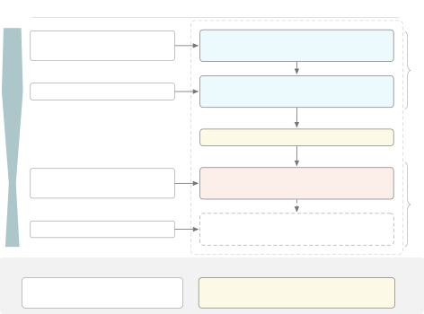

# Can LLM Agents Automate Reinforcement Learning for Text-to-Speech?

Xuanjun Chen ^(†)^(†)thanks: \* Work done during internship at Shanda
Group.    Zixiong Su    Hao Shi    Chang Zeng    Kai Li    Jyh-Shing
Roger Jang    Hung-yi Lee

###### Abstract

Although reinforcement learning (RL) post-training repairs the localized
segmental errors of zero-shot text-to-speech (TTS), arriving at a
working recipe still relies on tedious manual tuning, and whether LLM
agents can take over this research pipeline is unclear. We investigate
this question with AgenticTTS-Forge, a collaborative workflow that
structures human guidance and agentic execution around a shared
workspace, applied to CosyVoice2-0.5B. To measure what the agent
automates, we audit its trajectory stage by stage against the published
recipe. To measure what it exploits, we score its policies with held-out
observers hidden from the agent. Our results show that the agent
recovers an underspecified recipe, improves it, and, when gains stall,
surveys the literature unprompted and pivots from the LM carrier to the
flow carrier, halving Bad cases. However, its autonomy exposes three
traps across the data, proxy, and algorithm axes: the held-out set leaks
through a channel the contract never reads, a self-shaped reward
inflates the proxy where it is scored, and separately tuned policies do
not compose additively. These findings show that the binding constraint
is measurement rather than reasoning, and can inform the design of
harnesses whose contracts read every channel the agent does.

###### Index Terms: 

Text-to-Speech, Preference Optimization, LLM agents, Reinforcement
Learning, Auto-Research, Self-Improvement

^(†)^(†)address: ¹National Taiwan University, ²Shanda Group, ³National
Institute of Informatics, ⁴Tsinghua University

## 1 Introduction

While large language models (LLMs) have demonstrated the critical role
of post-training in systematically aligning model behavior with human
preferences and driving major gains in core capabilities, the
Text-to-Speech (TTS) domain faces a parallel necessity. Recent
advancements in neural codec-based TTS have enabled impressive zero-shot
speech synthesis by scaling up model parameters and training data \[2,
8\]. However, while this scaling has largely mitigated systemic errors
like poor speaker similarity, modern TTS systems continue to suffer from
fine-grained and localized quality degradations. These issues, referred
to as segmental errors, include mispronunciations, abnormal pauses, and
semantic-phonetic alignment problems \[27\].

Because these localized issues often occur in specific segments of
otherwise well-generated audio, they are not effectively addressed by
standard global training objectives. Consequently, post-training emerges
as an essential paradigm for TTS development. Existing supervised
fine-tuning (SFT) methods enable targeted re-synthesis \[16, 24\], but
they are constrained by their reliance on explicit target audio and
fixed data distributions. By integrating reinforcement learning (RL) and
human preference data to calibrate pre-trained models \[27, 29, 5, 12,
28\], this RL paradigm shifts the optimization focus to targeted local
refinement. This alignment process is crucial for correcting problematic
regions, significantly reducing the bad case rate, and ultimately
ensuring the robustness and perceptual quality of zero-shot TTS systems.

Autonomous AI agents can now execute complex workflows, write code, and
operate developer tools with minimal human oversight \[17, 13, 4\],
offering a powerful way to automate research and development. RL
Post-training is specifically well suited for this automation because it
is a clearly defined stage that produces direct and measurable
evaluation signals. By moving away from manual trial and error, these
agents utilize their broad autonomy to independently curate data, build
training pipelines from scratch, and iteratively refine optimization
strategies. Evidence shows that on focused tasks with clear metrics,
autonomous agents can carry post-training end to end, though still short
of expert engineering \[20, 15\]. Integrating this agentic workflow into
TTS systems provides a highly scalable method to automatically correct
localized audio errors and improve overall performance.

Figure 1: The human-agent collaborative AgenticTTS-Forge workflow.

Whether such agents can automate the full research pipeline that human
engineers follow, reproducing a baseline, improving it, and pivoting
architectures, remains unclear for TTS. Therefore, this paper aims to
investigate the overarching question: “Can LLM agents automate
reinforcement learning for text-to-speech?” As illustrated in Fig. 1, we
introduce AgenticTTS-Forge, a human-agent collaborative workflow in
which humans provide high-level guidance while the LLM agent executes
the human-like research process. To answer this question, our work
provides three main contributions:

- •
  We run the end-to-end RL post-training pipeline to demonstrate that an
  LLM agent can discover valid RL recipes and, when optimization
  plateaus, survey the literature unprompted to shift its optimization
  focus from the LM Carrier (the token LM) to the Flow Carrier (the
  flow-matching decoder).
- •
  Through auditing the agent’s trajectory, we identify three traps of
  autonomy, one per axis of the RL design space: a held-out set leaking
  through an unread channel (data), a self-shaped reward inflating its
  proxy (proxy), and separately tuned policies whose gains do not add up
  (algorithm).
- •
  We offer novel insights into agentic research by auditing the shared
  workspace. We find that the binding constraint is measurement rather
  than reasoning: preventative rules held only where the contract
  reached, and post-hoc auditability recovered what prevention missed.

## 2 The TTS Model Preliminaries for RL

Our RL post-training is built upon CosyVoice2 \[8\]. During RL
optimization process, existing utterances act as reference prompts to
generate new speech, providing the necessary training signals.

Base TTS Architecture. CosyVoice2 decouples speech synthesis into
semantic and acoustic stages through four modules. The process begins
with a speech tokenizer, followed by a unified text-speech Language
Model (LM) responsible for predicting semantic tokens. A chunk-aware
Flow Matching (FM) model then renders them into a Mel spectrogram under
the reference conditions, and a vocoder converts it to a waveform. We
freeze the tokenizer and vocoder and optimize only the text-speech LM
and the FM module.

RL Design Space for TTS. We decouple the RL pipeline into three axes:
data, proxy, and algorithm. The _data_ axis fixes which conditions and
generated candidates enter training and how they are arranged for the
update (e.g., preference pairs vs. sampled groups). The _proxy_ provides
the scalar reward signal, utilizing either trained human-preference
models or composite objective metrics (e.g., Automatic Speech
Recognition (ASR), Mean Opinion Score (MOS)). Finally, the _algorithm_
dictates how the policy is updated from that signal: pairwise Direct
Preference Optimization (DPO)-style losses \[19\] on the LM, or
critic-free Group Relative Policy Optimization (GRPO) \[22\] with
intra-group relative advantages on the decoder. We refer to these two
optimization targets as the LM Carrier and the Flow Carrier.

## 3 The Proposed Workflow and Details

Fig. 1 illustrates the AgenticTTS-Forge, featuring two layers: a
four-stage workflow (top) where human and agent collaborate, and an
shared workspace (bottom) that supports continuous interaction.

Human-Agent Collaboration. The workflow relies on an iterative
interaction between human guidance and agent execution across four
stages, named here by the human’s prompting role and in Sec. 4.2 by the
agent’s action (Table 3). In Stage 1 (Baseline Specification), the human
anchors the task via reference literature, setting the initial target
for the agent to reproduce. In Stage 2 (Trajectory Guidance), human
prompting effort peaks to steer step-wise optimization, guiding the
agent through design choices left unspecified by the paper. When
optimization plateaus, the human role diminishes in Stage 3 (Pivot
Authorization): rather than prescribing methods, the human merely flags
the symptom and delegates the solution, authorizing the agent’s proposed
methodological shift. Finally, in Stage 4 (Integration Approval), the
human explicitly selects the optimal final composition derived directly
from the agent’s scale sweep.

[TABLE]

- •
  Proxies either carry a gradient signal or only gate LM candidates
  (512-condition gate, one regression cap each); a gate has no gradient
  but is not held out either.
- •
  The LM gate also read parselmouth’s F0 correlation (FPC) \[30\], not
  reported.

Table 1: Measurement contract: in-loop proxies and held-out observers.
(LM Carrier introduced in S1–S2; Flow Carrier in S3).

|                                                                                    |                 |               |         |             |       |         |                          |       |         |              |
| ---------------------------------------------------------------------------------- | --------------- | ------------- | ------- | ----------- | ----- | ------- | ------------------------ | ----- | ------- | ------------ |
| System                                                                             | Intelligibility |               |         | SECS        |       |         | MOS                      |       |         | Bad case (%) |
|                                                                                    | en WER          | zh CER        | hard zh | en          | zh    | hard zh | en                       | zh    | hard zh |              |
| Expert-Tuned Preference Optimization on CosyVoice2 (Reported by Yao et al. \[27\]) |                 |               |         |             |       |         |                          |       |         |              |
| Reported models                                                                    | Whisper         | Paraformer-zh |         | WavLM-large |       |         | UTMOS22, all sets pooled |       |         | FPO def.     |
| CosyVoice2 \[8\]                                                                   | 2.57            | 1.45          | 8.08    | 0.652       | 0.748 | 0.730   | 3.49 (pooled)            |       |         | 14.0         |
|    + SDPO \[19\]                                                                   | 2.71            | 1.43          | 8.32    | 0.673       | 0.745 | 0.728   | 3.59 (pooled)            |       |         | 15.0         |
|    + UNO \[5\]                                                                     | 2.43            | 1.37          | 7.78    | 0.669       | 0.759 | 0.736   | 3.61 (pooled)            |       |         | 12.0         |
|    + RIO \[12\]                                                                    | 2.47            | 1.40          | 7.94    | 0.675       | 0.751 | 0.737   | 3.73 (pooled)            |       |         | 9.0          |
|    + Mask-DPO \[11\]                                                               | 2.51            | 1.42          | 7.92    | 0.671       | 0.754 | 0.733   | 3.64 (pooled)            |       |         | 13.0         |
|    + FPO \[27\]                                                                    | 2.24            | 1.32          | 6.92    | 0.654       | 0.747 | 0.731   | 3.56 (pooled)            |       |         | 8.0          |
| Agent-Automated TTS Policies (Evaluated by Held-out Observers)                     |                 |               |         |             |       |         |                          |       |         |              |
| Held-out observers                                                                 | Whisper         | Paraformer-zh |         | WavLM-large |       |         | UTMOSv2                  |       |         | FPO def.     |
| CosyVoice2 (Our Base)                                                              | 2.85            | 1.41          | 7.47    | 0.661       | 0.759 | 0.737   | 3.273                    | 3.121 | 3.083   | 13.4         |
|    Stage 1: FPO Repro. ($`i_{10}`$)                                                | 2.79            | 1.35          | 6.90    | 0.662       | 0.758 | 0.738   | 3.272                    | 3.129 | 3.097   | 13.1         |
|    Stage 2: LM Carrier Policy ($`i_{20}`$)                                         | 2.47            | 1.07          | 6.41    | 0.658       | 0.755 | 0.735   | 3.304                    | 3.146 | 3.130   | 13.6         |
|    Stage 3: Flow Carrier Policy ($`o_{23}`$)                                       | 2.82            | 1.37          | 7.48    | 0.660       | 0.754 | 0.727   | 3.409                    | 3.304 | 3.287   | 6.1          |
|    Stage 4: Composition ($`i_{20}\times o_{23}`$)                                  | 2.49            | 1.09          | 6.51    | 0.656       | 0.749 | 0.724   | 3.440                    | 3.325 | 3.301   | 5.4          |

Table 2: Objective evaluation on Seed-TTS-Eval; lower block scored by
the held-out observers of Table 1. Absolute scores are comparable only
within each block (different inference conditions and MOS scorers). Teal
marks gains over the released CosyVoice2 as run by us (Our Base).

The Shared Workspace. To guide decision-making throughout these stages,
the shared workspace relies on two main components: a measurement
contract that sets strict boundaries, and a trajectory memory that logs
past choices to guide subsequent iterations.

(a) Measurement Contract (Extensible Rules). The contract predefines
both the final evaluation benchmarks and the initial in-loop proxy
models used during RL. By decoupling the evaluation metrics from the
training proxies, the contract acts as a gatekeeper to prevent the agent
from exploiting the metrics; it gated every LM candidate (the LM pairs /
gate column of Table 1), whereas the proxies the agent later introduced
at its pivot never passed through it (Sec. 4.3). It defines three rule
categories, instantiated in Table 1:

- •
  Constraints (Prerequisites): These enforce basic validity through
  _Isolation_ and _Floors_. _Isolation_ pins variables such as tool
  versions and random seeds so they cannot confound the analysis.
  _Floors_ reject candidates that circumvent task requirements (e.g.,
  bypassing audio synthesis) or fail to outperform a seed-varied
  baseline in both languages.
- •
  Proxies (In-loop): Corresponding to the In-loop block of Table 1,
  these models serve as training proxies. The LM carrier (Stage 1)
  requires no reward model, relying directly on preference pairs (LM
  pairs) for its FPO loss, with all candidates subject to a
  512-condition gate (LM gate). Later, the flow carrier, adopted during
  the Stage 3 pivot, optimizes a weighted sum of its three reward
  entries (Flow reward).
- •
  Observers (Held-out): As detailed in the held-out block of Table 1,
  these are held-out evaluation models that assess the TTS performance
  using a sealed test set intentionally withheld by design (Sec. 4.3
  discusses instances where this failed). Any partial overlaps are
  indicated in the table footnotes.

(b) Trajectory Memory (Runtime Log). Rather than lossy textual
summaries \[14\], every evaluated candidate is appended to a runtime log
holding its Recipe (executable code), Score, and Trace, which records
_why_ a candidate failed, not merely that it did. Stable indices
($`i_{k}`$ LM candidates, $`o_{k}`$ flow candidates, $`g_{k}`$ retrieved
groundings) keep the trajectory auditable (Table 3) and let the Stage 3
pivot be derived from the record rather than prompted (Sec. 4.2).

## 4 Experiments

All systems initialize from CosyVoice2-0.5B ¹¹ 1
[https://huggingface.co/FunAudioLLM/CosyVoice2-0.5B](https://huggingface.co/FunAudioLLM/CosyVoice2-0.5B)
and are evaluated on Seed-TTS-Eval \[2\] ²² 2
[https://github.com/BytedanceSpeech/seed-tts-eval](https://github.com/BytedanceSpeech/seed-tts-eval)
(test-zh 2020, test-en 1088, test-hard 400) by word and character error
rate (WER, CER), speaker embedding cosine similarity (SECS), and MOS.
Both carriers search a shared, hash-pinned pool of 5,000 conditions
(AISHELL-3, LibriTTS) using FPO’s 100 prompt speakers \[27\] with 8
samples/condition. Training and evaluation are separated at the corpus
level.

### 4.1 Agent Outcomes: What Was Automated, and at What Cost

The pipeline operated end to end: every gain in the lower block of
Table 2 came from the agent’s own exploration, with no training recipe
edited by hand; the one hand-set value is the merge scale (Sec. 4.2).
Read stage by stage, the trajectory shows the agent breaking down an
optimization problem that expert recipes solve with a single LM carrier
policy. Stage 1 ($`i_{10}`$) recovers the direction of the published
FPO \[27\] effect on every intelligibility set. The Stage 2 LM carrier
policy ($`i_{20}`$) then consistently improves intelligibility across
all test sets while leaving speaker similarity unchanged. The Stage 3
flow carrier policy ($`o_{23}`$) targets a complementary objective: it
raises UTMOSv2 naturalness on every set and halves the bad case rate,
with intelligibility held at the base. Composition (Stage 4) merges the
two policies without training and retains the highest naturalness and
the lowest bad case rate of the block. Measured by the held-out
observers, then, the pipeline succeeded; the in-loop dynamics behind
these numbers are less clean, and they set the agenda for the rest of
this section. Sec. 4.2 reconstructs from Table 3 how an agent given only
the FPO paper arrived at $`i_{20}`$ and $`o_{23}`$. Sec. 4.3 examines
what Table 2 alone cannot show: a test set that leaked through a channel
the contract never read, a reward the agent inflated where it was
scored, and a merge that gained naturalness but sacrificed speaker
similarity and part of $`i_{20}`$’s intelligibility gain. Sec. 4.4 asks
which workspace mechanisms contained these failures and which did not.

[TABLE]

Table 3: Overview of the four workflow stages (Fig. 1). Each stage
traces the human prompting role, the published baseline recipe, the
agent’s autonomous edits across the design-space axes (Sec. 2), and the
resulting empirical reach and failure modes.

|                                                                   |          |                    |                     |       |
| ----------------------------------------------------------------- | -------- | ------------------ | ------------------- | ----- |
| Loop role                                                         | Quantity | $`\Delta`$ in-loop | $`\Delta`$ held-out | Ratio |
| Shaped reward (flow, $`o_{23}`$): gradient with threshold shaping |          |                    |                     |       |
|    zh                                                             | MOS      | $`+0.261`$         | $`+0.183`$          | 1.43  |
|    hard zh                                                        | MOS      | $`+0.319`$         | $`+0.204`$          | 1.56  |
| Unshaped reward (flow, $`o_{23}`$): gradient, no shaping          |          |                    |                     |       |
|    en                                                             | SECS     | $`-0.006`$         | $`-0.001`$          | –     |
|    zh                                                             | SECS     | $`-0.004`$         | $`-0.005`$          | –     |
| Not in reward (flow, $`o_{23}`$): never read, no gradient         |          |                    |                     |       |
|    en                                                             | MOS      | $`+0.121`$         | $`+0.136`$          | 0.89  |
| Gate only (LM, $`i_{20}`$): 0.03 cap, no gradient                 |          |                    |                     |       |
|    en                                                             | MOS      | $`+0.049`$         | $`+0.031`$          | –     |
|    zh                                                             | MOS      | $`-0.004`$         | $`+0.025`$          | –     |
|    hard zh                                                        | MOS      | $`-0.001`$         | $`+0.047`$          | –     |

Table 4: Reward-hacking evaluation on in-loop proxies vs. held-out
observers. Ratio denotes in-loop over held-out gain.

### 4.2 Workflow Dynamics: What the Agent Achieved on Its Own

Table 3 records the four stages of the workflow. Read against its
Published Recipe column, the agent first constructed the structural
space, then executed a heuristic search that revised the recipe,
redefined the search space by transferring an external method, and
finally swept integration scales for a post-hoc composition. Every
exploratory move was the agent’s; only the final scale was ours.

Stage 1: Construct Structural Space. FPO leaves most settings unstated.
With the paper as the only method prompt, the agent rewrote the recipe
as a family around FPO, each unstated choice a search coordinate, and
settled the data side by measurement: a pilot, an extrapolated pair
budget, and its own gates. The result matched the published effect in
direction, not size.

Stage 2: Execute Heuristic Search. Under our heaviest steering, one
falsifiable mutation per round, the agent searched that family along the
algorithm and data axes. Reading its own loss curves, it diagnosed
unequal pair lengths as the confounder and revised the objective at two
coordinates; later objective edits were rejected by the contract’s
512-condition gate. The gain came from the data axis: pairs generated
once from the initial policy had gone stale, so the agent regenerated
them on-policy, and that cut, not the objective edits, improved
intelligibility over the base.

Stage 3: Redefine Search Space. When the LM carrier ran out of gains,
the agent pivoted to the flow carrier under the least prompting of any
stage: we named a symptom, a Bad case tail that no LM edit moved, and no
method. It located the bottleneck in the decoder, surveyed the
literature unprompted, and transferred FlowTTS-GRPO \[25\] from
CosyVoice3 to CosyVoice2, a redefinition, not a copy: a stochastic
ordinary differential equation (ODE) sampler so that GRPO has a
log-probability to score, a different naturalness proxy, and conditions
banded by the base’s own scores. The pivot revived nearly every dead
condition and halved Bad cases; the published configuration, which we
could complete only on CosyVoice3, lifts two, so the two are neither the
same recipe nor compared as one.

Stage 4: Post-Hoc Composition. With two policies never trained together,
the agent swept a gradient-free merge over five scales on a short pilot;
the shipped scale was chosen by us rather than by a gate or a gradient,
and what that choice cost is dissected in Sec. 4.3.

### 4.3 Autonomy Traps: Outside the Contract’s Reach

Beyond this progress, Table 3’s Failure Mode column reveals the traps of
autonomy outside the contract’s reach. Read against the design space of
Sec. 2, each trap sits on one axis: data, proxy, and algorithm, and only
the proxy trap is of the agent’s own making.

The Data Trap: Distribution leaks. The measurement contract cannot guard
a channel it never reads. Explicit clauses forbid test leakage, and
every LM candidate passed through them. The leak came through the
harness’s own prompting channel instead: orchestrator guidance carried
the held-out set verbatim into the proposer’s context window, and no
clause fired, because the contract audits candidates, not prompts. In a
fully automated pipeline, boundary clauses fail without hard isolation
of every channel the agent reads.

The Proxy Trap: Reward hacking. The agent optimizes the proxy score, not
the audio. The same autonomy that, unprompted, replaced a speaker
encoder circular with the generator it scored also read a probe’s zero
spread as noise and built a threshold-shaping term on an ungated proxy,
forcing the band mean above the base in tens of steps. Table 4 scores
the same audio twice: on Mandarin, where the shaped reward was read, the
proxy overstates the held-out gain by up to 56%; on English, which the
shaped term never read, the two instruments agree, and the unshaped
speaker term does not inflate.

The Algorithm Trap: Composition failures. The literature assumes that LM
RL and decoder RL improve different things and thus add. The agent tuned
both, so we could test it. Merging its two policies shifted the upstream
distribution: the decoder had been optimized on the base LM’s tokens,
and the gradient-free merge pushed speaker similarity below the base and
gave back part of the LM policy’s intelligibility gain (Table 3). The
merge scale was chosen on a short pilot where the proxy kept rising past
the held-out peak; the one decision without a gradient was ours, and it
failed.

### 4.4 Workspace Controllability: What Held, and What Slipped

Autonomous optimization (Sec. 4.1, 4.2) exposed ungated proxies and
unread channels (Sec. 4.3); we now audit the shared workspace (Sec. 3)
for which controls held firm and which slipped.

Measurement Contract. The preventative rules yielded mixed results. The
Constraints and the LM gate functioned as intended, rejecting every
failed LM candidate (e.g., $`i_{16}`$–$`i_{19}`$; Table 3), and
repository-root access was never abused. However, the Proxies slipped at
the pivot: the contract’s scope never covered flow candidates,
permitting reward hacking on ungated in-loop signals. Similarly, the
Observers’ sealed set was compromised by channel blindness: the held-out
set leaked through the prompting channel, and the sealed-test clause ran
26 times but caught nothing.

Trajectory Memory. Where prevention failed, the runtime log succeeded.
The memory’s append-only record of every recipe, score, and trace
facilitated post-hoc auditability: it allowed us to trace and recover
the nine tainted records the contract had inadvertently passed.

## 5 Conclusion

We draw four findings in response to the question “Can LLM agents
automate reinforcement learning for text-to-speech?” First, the pipeline
automates: the agent recovers an underspecified method by measurement,
improves it, and, given a symptom and no method, changes carrier
unprompted, cutting Bad cases from $`13.4\%`$ to $`6.1\%`$. Second, a
data trap: the held-out set leaked through the one channel the contract
never read. Third, a proxy trap: the binding constraint is measurement
rather than reasoning: the agent’s shaping term inflated its proxy by up
to $`56\%`$ where it was scored. Finally, an algorithm trap: gains do
not add up: merging the policies caused a distribution shift that cost
intelligibility against the LM policy and speaker similarity against the
base. Taken together, these findings indicate that an agent automates RL
post-training only as far as its harness measures; the harness, unlike
the model, is ours to fix.

## 6 Acknowledgment

Generative AI was used solely for paper clarity. By exposing the
strengths and weaknesses of LLM agents, we aim to help readers leverage
them for accelerating code development and research ideation. The
authors thoroughly verified all agent-generated results present in this
paper and assume full responsibility.

## References

- \[1\] K. An, Q. Chen, C. Deng, et al. (2024) FunAudioLLM: voice
  understanding and generation foundation models for natural interaction
  between humans and LLMs. arXiv preprint arXiv:2407.04051. Cited by:
  Table 1.
- \[2\] P. Anastassiou, J. Chen, J. Chen, Y. Chen, Z. Chen, Z. Chen, J.
  Cong, L. Deng, C. Ding, et al. (2024) Seed-TTS: a family of
  high-quality versatile speech generation models. arXiv preprint
  arXiv:2406.02430. Cited by: §1, §4.
- \[3\] K. Baba, W. Nakata, Y. Saito, and H. Saruwatari (2024) The T05
  system for the VoiceMOS challenge 2024: transfer learning from deep
  image classifier to naturalness MOS prediction of high-quality
  synthetic speech. In Proc. SLT, Cited by: Table 1.
- \[4\] J. S. Chan, N. Chowdhury, O. Jaffe, et al. (2024) MLE-bench:
  evaluating machine learning agents on machine learning engineering.
  arXiv preprint arXiv:2410.07095. Cited by: §1.
- \[5\] C. Chen, Y. Hu, W. Wu, et al. (2024) Enhancing zero-shot
  text-to-speech synthesis with human feedback. arXiv preprint
  arXiv:2406.00654. Cited by: §1, Table 2.
- \[6\] S. Chen, C. Wang, Z. Chen, Y. Wu, S. Liu, Z. Chen, J. Li, N.
  Kanda, et al. (2022) WavLM: large-scale self-supervised pre-training
  for full stack speech processing. IEEE J-STSP 16 (6). Cited by: Table
  1.
- \[7\] Y. Chen, S. Zheng, H. Wang, et al. (2023) An enhanced Res2Net
  with local and global feature fusion for speaker verification. In
  Proc. INTERSPEECH, Cited by: Table 1.
- \[8\] Z. Du, Y. Wang, Q. Chen, X. Shi, X. Lv, T. Zhao, Z. Gao, Y.
  Yang, C. Gao, et al. (2024) CosyVoice 2: scalable streaming speech
  synthesis with large language models. arXiv preprint arXiv:2412.10117.
  Cited by: §1, §2, Table 2.
- \[9\] Z. Gao, Z. Li, J. Wang, et al. (2023) FunASR: a fundamental
  end-to-end speech recognition toolkit. In Proc. INTERSPEECH, Cited by:
  Table 1.
- \[10\] Z. Gao S. Zhang et al. (2022) Paraformer: fast and accurate
  parallel transformer for non-autoregressive end-to-end speech
  recognition. In Proc. INTERSPEECH, Cited by: Table 1.
- \[11\] Y. Gu, W. Zhang, C. Lyu, D. Lin, and K. Chen (2025) Mask-DPO:
  generalizable fine-grained factuality alignment of LLMs. In Proc.
  ICLR, Cited by: Table 2.
- \[12\] Y. Hu, C. Chen, S. Wang, et al. (2024) Robust zero-shot
  text-to-speech synthesis with reverse inference optimization. arXiv
  preprint arXiv:2407.02243. Cited by: §1, Table 2.
- \[13\] Q. Huang, J. Vora, P. Liang, and J. Leskovec (2024)
  MLAgentBench: evaluating language agents on machine learning
  experimentation. In Proc. ICML, Cited by: §1.
- \[14\] Y. Lee, R. S. Nair, Q. Zhang, K. Lee, O. Khattab, and C.
  Finn (2026) Meta-Harness: end-to-end optimization of model harnesses.
  In Proc. COLM, External Links:
  [Link](https://openreview.net/forum?id=tmbOUyFx3R) Cited by: §3.
- \[15\] Q. Li, Y. Zhang, X. Yang, X. Yang, Z. Wang, B. Xian, et
  al. (2026) FT-Dojo: towards autonomous LLM fine-tuning with language
  agents. In Proc. ICML, External Links:
  [Link](https://openreview.net/forum?id=Ws2RhhBir4) Cited by: §1.
- \[16\] T. Liu, Z. Song, T. Wang, Z. Li, C. Xu, et al. (2026)
  EmoTra-TTS: smooth intra-utterance emotion transitions for speech
  synthesis. In Proc. EMNLP, Cited by: §1.
- \[17\] C. Lu, C. Lu, R. T. Lange, et al. (2024) The AI Scientist:
  towards fully automated open-ended scientific discovery. arXiv
  preprint arXiv:2408.06292. Cited by: §1.
- \[18\] A. Radford J. W. Kim et al. (2023) Robust speech recognition
  via large-scale weak supervision. In Proc. ICML, Cited by: Table 1.
- \[19\] R. Rafailov, A. Sharma, E. Mitchell, et al. (2023) Direct
  Preference Optimization: your language model is secretly a reward
  model. In Proc. NeurIPS, Cited by: §2, Table 2.
- \[20\] B. Rank, H. Bhatnagar, A. Prabhu, S. Eisenberg, K. Nguyen, M.
  Bethge, and M. Andriushchenko (2026) PostTrainBench: can LLM agents
  automate LLM post-training?. In Proc. ICML, Cited by: §1.
- \[21\] T. Saeki, D. Xin, W. Nakata, et al. (2022) UTMOS:
  UTokyo-SaruLab system for VoiceMOS challenge 2022. In Proc.
  INTERSPEECH, Cited by: Table 1.
- \[22\] Z. Shao, P. Wang, Q. Zhu, et al. (2024) DeepSeekMath: pushing
  the limits of mathematical reasoning in open language models. arXiv
  preprint arXiv:2402.03300. Cited by: §2.
- \[23\] X. Shi, Y. Yang, Z. Li, et al. (2024) SeACo-Paraformer: a
  non-autoregressive ASR system with flexible and effective hotword
  customization ability. In Proc. ICASSP, Cited by: Table 1.
- \[24\] Z. Song, T. Liu, T. Wang, C. Xu, S. Y. Guo, and H. Li (2026)
  Diagnose, Then Refine: a closed-loop tts system with AudioLLM-Guided
  correction. In Proc. EMNLP, Cited by: §1.
- \[25\] H. Wang, B. Tian, W. Li, et al. (2026) FlowTTS-GRPO: online
  reinforcement learning with multi-objective reward optimization for
  flow-matching based text-to-speech. arXiv preprint arXiv:2606.23190.
  Cited by: §4.2.
- \[26\] H. Wang, S. Zheng, Y. Chen, et al. (2023) CAM++: a fast and
  efficient network for speaker verification using context-aware
  masking. In Proc. INTERSPEECH, Cited by: Table 1.
- \[27\] J. Yao, Y. Yuguang, Y. Feng, Y. Pan, Z. Ning, J. Ye, H. Zhou,
  and L. Xie (2026) FPO: fine-grained preference optimization improves
  zero-shot text-to-speech. IEEE TASLP 34, pp. 557–566. External Links:
  [Document](https://dx.doi.org/10.1109/TASLPRO.2025.3648888) Cited by:
  §1, §1, Table 2, Table 2, §4.1, §4.
- \[28\] C. Yu, Y. Lin, S. Huang, Y. Tsai, H. Chung, X. Chen, and H.
  Lee (2026) Listen, Critique, and Refine: RL-Based self-refinement for
  instruction-following speech synthesis. In Proc. SLT, Cited by: §1.
- \[29\] D. Zhang, Z. Li, S. Li, X. Zhang, P. Wang, Y. Zhou, and X.
  Qiu (2024) SpeechAlign: aligning speech generation to human
  preferences. In Proc. NeurIPS, Vol. 37, pp. 50343–50360. External
  Links: [Document](https://dx.doi.org/10.52202/079017-1594) Cited by:
  §1.
- \[30\] X. Zhang, L. Xue, Y. Gu, Y. Wang, J. Li, H. He, et al. (2024)
  Amphion: an open-source audio, music and speech generation toolkit. In
  Proc. SLT, Cited by: 2nd item.
