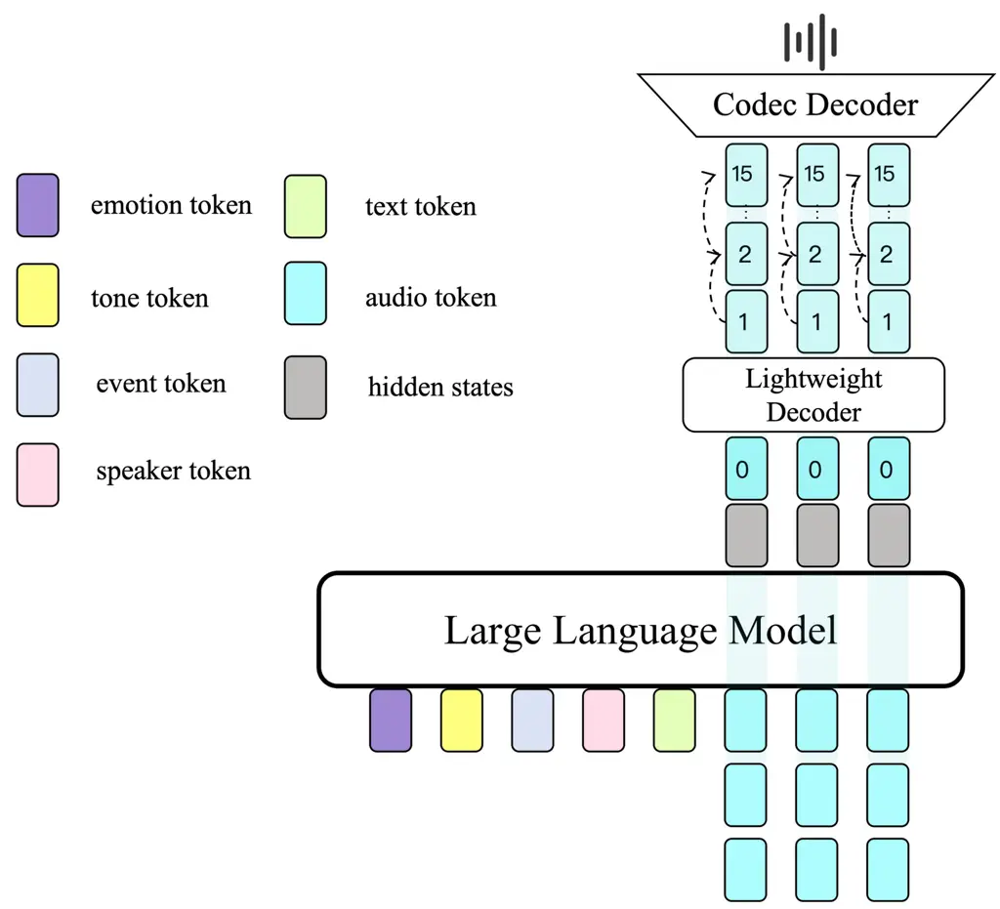
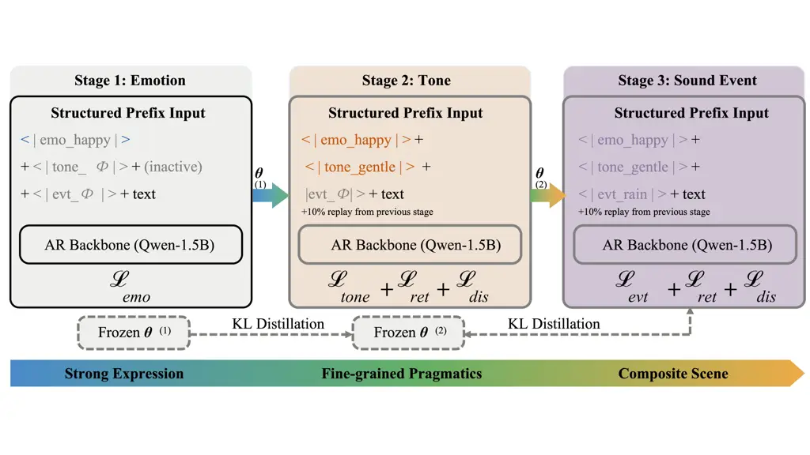

# VoiceWeaver: Staged Learning of Structured Controls for Expressive Speech and Sound-Event Generation

Xiaosu Su    Yun Cao    Yiping Ni    Xiaowei Yi

###### Abstract

Adding expressive and environmental controls to a speech generator
requires learning heterogeneous attributes without losing earlier
capabilities. VoiceWeaver addresses this problem with structured label
prefixes and staged emotion–tone–event training in a shared text–audio
model. Replay-based distillation retains earlier predictions, while
embedding decorrelation and attribute dropout regularize conditioning.
Evaluation separates single-attribute correctness, joint emotion–event
generation, and three-attribute correctness. Rounded to whole percentage
points, emotion accuracy is 86% in Chinese and 83% in English. Chinese
emotion–event joint accuracy is about 70%, versus 56% for mixed-task
training and 48% for Ming-omni-tts; English joint accuracy is 66%.
Three-attribute accuracy is 59% in Chinese and 55% in English on 500
samples each (57% pooled). Text error rates exceed those of the external
TTS baselines. Audio samples are available at
[https://anonymous.4open.science/api/repo/VoiceWeaver1-4D88/file/index.html](https://anonymous.4open.science/api/repo/VoiceWeaver1-4D88/file/index.html).

###### Index Terms: 

Controllable speech synthesis, expressive speech, sound events,
compositional control, continual learning

^(†)^(†)address: Institute of Information Engineering, Chinese Academy
of Sciences, Beijing, China  
School of Cyber Security, University of Chinese Academy of Sciences,
Beijing, China

## 1 Introduction

Speech for narration, games, and audiovisual production must coordinate
text, delivery, and acoustic scene. Emotion is a global affective state,
tone is more text-dependent, and events add non-speech acoustics. Their
distinct supervision and acoustic boundaries make it difficult to add
controls while retaining linguistic content and earlier capabilities.
Accepting multiple conditions alone does not establish joint
realization.

Codec language models provide a shared discrete-token formulation for
speech generation \[1, 2, 3, 24, 4, 5, 6, 28, 27, 29\]. PromptTTS and
related systems condition style using text descriptions \[7, 8, 9, 25,
26, 10, 11\], while factorized methods separate speaker, content, and
style representations \[12, 13, 14, 15, 16, 17\]. VoiceLDM and Speak in
the Scene model environmental context \[18, 19\]; Ming-omni-tts supports
speech and event prompts \[20\]. Unlike reference-audio or open-ended
prompt control, our label interface supplies a small, explicit
vocabulary. The central question is whether these heterogeneous labels
can be acquired sequentially without losing earlier controls, and
whether requested emotion and event are realized together.

VoiceWeaver couples a structured control interface with an
emotion–tone–event curriculum. Label prefixes separate requested
attributes from linguistic content within one token sequence. The
curriculum first learns stable affective cues, then adds delivery styles
and environmental events. Distillation on replayed examples targets
forgetting across stages; embedding decorrelation targets overlap
between control groups; attribute dropout trains the model to accept
incomplete label sets. A low-frame-rate tokenizer represents speech and
events without changing this interface.

The contribution is a training and evaluation framework for this
setting, rather than a new prefix mechanism or distillation loss. We
test staged acquisition against mixed training and alternative orders,
and separate bilingual attribute accuracy, emotion–event joint
correctness, content fidelity, and perceptual coexistence. A pooled
bilingual three-attribute test measures simultaneous correctness
directly, complementing the larger emotion–event benchmark.

## 2 VoiceWeaver

### 2.1 Structured conditioning and audio generation

Given text $`x`$, a speaker token $`s`$, and optional attributes
$`z=(z_{e},z_{t},z_{v})`$, the model generates audio codes $`a`$ and
reconstructs a waveform $`y=D(a)`$. Subscripts $`e,t,v`$ denote emotion,
tone, and event. The conditioning sequence is

```math
\displaystyle c \displaystyle=[p(z),s,\langle\mathrm{text}\rangle,x,\langle/\mathrm{text}\rangle], \tag{1}
```

```math
\displaystyle p(z) \displaystyle=[e_{e}(z_{e}),e_{t}(z_{t}),e_{v}(z_{v})],
```

where $`e_{k}`$ denotes a learned label embedding; absent attributes are
omitted. Labels specify global requests for an utterance, rather than
time-aligned event locations. In this work, _tone_ refers to delivery
styles such as gentle or hesitant, not lexical tone. The vocabulary
contains six emotions, five tones, and twelve sound events.

For example, happy and rain request happy speech in a rainy scene;
gentle adds a delivery style.

VoiceWeaver-Tokenizer-12Hz encodes 16-kHz audio at 12.5 frames/s with 16
residual codebooks of 2,048 entries. Its encoder combines semantic and
acoustic features before quantization, and its causal decoder
reconstructs speech and events. A Qwen-scale 1.5B backbone predicts the
semantic codebook; a 200M decoder predicts the remaining 15. Figures 1
and 2 summarize the two paths.



Figure 1: VoiceWeaver architecture and token types. The autoregressive
backbone predicts codebook 0; the lightweight decoder predicts codebooks
1–15 before codec reconstruction.

### 2.2 Staged learning with retention

The curriculum starts with affect, adds delivery style, then non-speech
events; Figure 2 shows retention.



Figure 2: Three-stage training. Emotion, tone, and sound-event controls
are introduced in sequence; replay and frozen teachers retain earlier
capabilities.

Let $`L_{c0}`$ and $`L_{\mathrm{dec}}`$ be cross-entropy losses for the
first and remaining codebooks, and $`L_{\mathrm{txt}}`$ an auxiliary
text loss. The base objective is

```math
\mathcal{L}_{\mathrm{AR}}=2\bigl[(1-\alpha)L_{c0}+\alpha L_{\mathrm{dec}}\bigr]+\lambda L_{\mathrm{txt}}, \tag{2}
```

with $`\alpha=0.6`$ and $`\lambda=0.01`$. At stage $`r>1`$, a frozen
previous-stage model $`\theta^{r-1}`$ acts as a teacher on replay buffer
$`\mathcal{R}^{r-1}`$. Retention penalizes changes in its predictive
code distributions:

```math
\mathcal{L}_{\mathrm{ret}}^{r}=\sum_{u\in\mathcal{R}^{r-1}}\sum_{j,q}D_{\mathrm{KL}}\!\left(P_{\theta^{r-1}}^{j,q}(u)\,\|\,P_{\theta^{r}}^{j,q}(u)\right), \tag{3}
```

where $`u`$ is a replayed training example, $`j`$ indexes audio frames,
$`q`$ indexes codebooks, and both models use the same teacher-forced
context.

Here $`q\in\{0,\ldots,15\}`$, and each $`P^{j,q}`$ is a distribution
over 2,048 code entries. Stage 2 uses the frozen emotion-stage model and
emotion replay; stage 3 uses the frozen emotion–tone model and replay
from the earlier stages. The distillation teacher is thus the preceding
VoiceWeaver checkpoint, distinct from the IndexTTS2 teacher used to
synthesize training data.

We apply a soft decorrelation penalty to label embeddings. Let
$`E_{k}\in\mathbb{R}^{d\times n_{k}}`$ contain the $`n_{k}`$ labels of
attribute $`k`$ as columns, and let $`\bar{E}_{k}`$ be centered across
labels and column-wise $`\ell_{2}`$ normalized. We use
$`\mathcal{L}_{\mathrm{dis}}=\|\bar{E}_{e}^{\mathsf{T}}\bar{E}_{t}\|_{F}^{2}+\|\bar{E}_{e}^{\mathsf{T}}\bar{E}_{v}\|_{F}^{2}+\|\bar{E}_{t}^{\mathsf{T}}\bar{E}_{v}\|_{F}^{2}`$,
a soft constraint on conditioning embeddings rather than full
audio-factor independence. For each available attribute
$`k\in\{e,t,v\}`$, dropout samples $`m_{k}\sim\mathrm{Bernoulli}(0.8)`$
independently; the label is omitted when $`m_{k}=0`$. Text and speaker
conditions remain present. The stage objectives are

```math
\mathcal{L}^{1}=\mathcal{L}_{\mathrm{AR}}^{1},\qquad\mathcal{L}^{r}=\mathcal{L}_{\mathrm{AR}}^{r}+\beta\mathcal{L}_{\mathrm{ret}}^{r}+\gamma\mathcal{L}_{\mathrm{dis}},\quad r=2,3, \tag{4}
```

with $`\beta=0.5`$ and $`\gamma=0.1`$. Replay occupies 10% of training
samples in the later stages. We train for 80K, 50K, and 60K steps,
respectively, using AdamW, learning rate $`10^{-5}`$, batch size 16, and
5,000 warmup steps.

### 2.3 Training data

Emotion and tone stages use 1,204,800 bilingual synthetic examples
(783,120 Chinese and 421,680 English; approximately 3,500 h). An
emotion-enhanced IndexTTS2 teacher supplies emotion data. Tone data
combines LLM-generated, tone-matched text with teacher synthesis.
Screening eleven candidate tones retains five with relatively
recognizable acoustic cues: gentle, hesitant, coquettish, complaining,
and resigned. Text dependence is reduced by this screening, but is not
eliminated.

Tone screening uses twenty neutral sentences per category and three
perceptibility judges.

The event stage uses 862,400 examples (552,000 Chinese and 310,400
English; approximately 2,500 h) from twelve ESC-50 \[21\] categories.
The 480 clips derive from 96 original recordings. Mixtures use a
relative speech–event level range of 5–20 dB; the tokenizer uses
approximately 10,000 h.

Event screening reconstructs candidate clips through the tokenizer and
retains PANNs-recognizable categories. Short events are placed randomly;
longer ones are cropped and aligned. Event data includes clean-event and
emotion–event examples. PANNs also evaluates generated events, so that
score is not independent of category selection.

## 3 Experimental Protocol

### 3.1 Test sets and baselines

Emotion evaluation uses 600 Chinese and 600 English test prompts,
balanced over six emotions. Chinese tone evaluation uses 300 prompts,
with 60 for each retained tone. The joint speech–scene test has 720
text–label combinations per language: six emotions crossed with twelve
events and ten texts per combination. A separate three-attribute
evaluation contains 500 Chinese and 500 English samples. Test texts in
the original benchmarks do not overlap the training corpus. Event clips
are drawn from the 96-recording source pool; recording-level separation
from training was not documented, so the original joint benchmark does
not measure generalization to unseen event recordings. We round the
original classification percentages to whole points because available
aggregates do not specify the generation count or averaging protocol
behind each rate.

We compare official IndexTTS2 (reference-audio control), CosyVoice 2
(natural-language instructions), and Ming-omni-tts (one-to-one event
prompts). All systems receive the same texts; external systems use
default recipes and VoiceWeaver uses fixed decoding. Scale, data, and
interface differ, so these are system-level comparisons.

E–V–T and T–E–V change stage order; mixed-task training removes staging.
Component ablations remove KL retention, embedding decorrelation, or
label dropout. The full model uses 190K steps and 10% replay in later
stages; per-attribute exposure in alternatives is not established by
these totals.

### 3.2 Automatic and perceptual evaluation

Emotion accuracy uses emotion2vec \[23\] (92.3% ground-truth upper
bound); event accuracy uses PANNs \[22\] (89.7% upper bound). Tone
accuracy uses majority votes from three annotators, with Qwen3-Omni as a
cross-check. FunASR Paraformer computes transcript error. We report CER
for Chinese, WER for English, and naturalness MOS alongside attribute
correctness. Let $`b_{i}`$ indicate correct emotion and event, and
$`t_{i}`$ correct tone, on sample $`i`$. We define

```math
\displaystyle\mathrm{JointAcc} \displaystyle=\frac{1}{N}\sum_{i}b_{i}, \tag{5}
```

```math
\displaystyle\mathrm{MC} \displaystyle=\frac{1}{N}\sum_{i}b_{i}\,\mathbf{1}[\mathrm{CER}_{i}<0.08],
```

where multimodal consistency (MC) adds a content constraint.
Three-attribute accuracy is $`N_{3}^{-1}\sum_{i=1}^{N_{3}}b_{i}t_{i}`$,
with $`N_{3}=500`$ for each language and 1,000 pooled; it uses the same
emotion2vec, PANNs, and three-annotator majority decisions described
above. MC uses an 8% character-error threshold for both languages;
standalone English intelligibility is WER. Automatic event scores
inherit the limitations of PANNs, which also screened event categories.

For MOS and coexistence naturalness (CN), each system contributes 60
samples per language, each rated by at least five listeners on a 1–5
scale. There are 15 Chinese and 10 English listeners; order is
randomized and identity hidden. Reported Krippendorff’s $`\alpha`$ is
0.70 for MOS and 0.62 for CN. Each listener rates 30 matched pairs.
Preferences are descriptive because listener- and clip-level records are
unavailable for repeated-measures analysis.

## 4 Results and Analysis

### 4.1 Expressive control and text fidelity

VoiceWeaver reaches about 86%/83% Chinese/English emotion accuracy and
70% Chinese tone accuracy (Table 1). Its CER/WER of 4.31%/4.68% trails
the external TTS systems; the no-label model is already at 4.18%/4.53%,
so this gap cannot be attributed solely to conditioning. Training data
also differ greatly: about 6,000 h for VoiceWeaver versus 55K h for
IndexTTS2 and 166K h for CosyVoice 2.

|               |                      |     |                   |                    |                    |
| ------------- | -------------------- | --- | ----------------- | ------------------ | ------------------ |
|               | Emotion $`\uparrow`$ |     | Tone $`\uparrow`$ | CER $`\downarrow`$ | WER $`\downarrow`$ |
| Model         | ZH                   | EN  | ZH                | ZH                 | EN                 |
| No labels     | 19                   | 17  | 23                | 4.18               | 4.53               |
| IndexTTS2     | 83                   | 80  | –                 | 1.88               | 2.34               |
| CosyVoice 2   | 75                   | 72  | –                 | 1.52               | 2.57               |
| Ming-omni-tts | 77                   | 75  | –                 | 2.14               | 2.82               |
| VoiceWeaver   | 86                   | 83  | 70                | 4.31               | 4.68               |

Table 1: Expressive control and intelligibility (%). Classification
accuracies are rounded to whole points; CER/WER retain two decimals.
Tone is evaluated in Chinese; “–” denotes no matched tone result.

Replacing tone-matched texts with random texts reduces tone accuracy
from about 70% to 64%, indicating substantial text dependence. Chinese
emotion MOS is 4.24 for VoiceWeaver versus 4.16/4.22 for
IndexTTS2/CosyVoice 2; these means do not establish significance.

### 4.2 Joint speech–scene generation

VoiceWeaver improves reported emotion–event joint accuracy over
Ming-omni-tts from 48% to 70% in Chinese and 46% to 66% in English
(Table 2). CN rises from 3.74 to 4.21 and from 3.68 to 4.14,
respectively. These system-level differences combine training,
interface, and architecture effects.

| Lang. | Model         | Event | Joint | MC  | CN   |
| ----- | ------------- | ----- | ----- | --- | ---- |
| ZH    | Ming-omni-tts | 63    | 48    | 46  | 3.74 |
|       | VoiceWeaver   | 79    | 70    | 67  | 4.21 |
| EN    | Ming-omni-tts | 62    | 46    | 43  | 3.68 |
|       | VoiceWeaver   | 76    | 66    | 64  | 4.14 |

Table 2: Emotion–event joint generation. Event, Joint, and MC are
rounded percentages; CN is rated from 1 to 5. All columns: higher is
better. Joint and MC do not include tone correctness.

Paired listening favors VoiceWeaver for emotion, event clarity, and
scene naturalness (about 68%, 72%, and 75%). These descriptive rates
complement classifier scores but do not resolve listener dependence or
interface confounds.

### 4.3 Training order and component ablations

The selected order reaches about 70% joint accuracy, versus 63% for
E–V–T, 59% for T–E–V, and 56% for mixed-task training (Table 3). The
comparison favors this curriculum within the reported setup, but
per-attribute exposure is not audited.

| Training / variant         | Emo. | Tone | Event | Joint |
| -------------------------- | ---- | ---- | ----- | ----- |
| Full (E–T–V)               | 86   | 70   | 79    | 70    |
| E–V–T                      | 84   | 67   | 75    | 63    |
| T–E–V                      | 84   | 65   | 74    | 59    |
| Mixed tasks                | 82   | 62   | 72    | 56    |
| w/o retention distillation | 83   | 67   | 76    | 63    |
| w/o decorrelation          | 83   | 68   | 75    | 64    |
| w/o attribute dropout      | 84   | 69   | 76    | 66    |
| Standard-teacher data      | 82   | 69   | 77    | 64    |

Table 3: Training orders and ablations (rounded %). E/T/V:
emotion/tone/event. Joint is Chinese emotion–event accuracy;
single-attribute emotion and tone use their respective test sets.

Removing retention, decorrelation, or dropout lowers joint accuracy by
roughly 6, 5, or 4 pp. Standard rather than enhanced emotion-teacher
data lowers it to 64%; this changes supervision, not just a loss term.
These comparisons do not quantify run-to-run variance.

Regularization is non-monotonic: reported joint accuracy is about 64% at
$`\gamma=0`$, 70% at 0.1, and 66% at 0.3.

### 4.4 Three-attribute control and stability

Among 500 samples per language requested with emotion, tone, and event
labels, 59% of Chinese and 55% of English outputs satisfy all three
simultaneously (57% pooled). On these same outputs, emotion, tone, and
event accuracies are 82%, 71%, and 77% in Chinese, and 80%, 69%, and 74%
in English, respectively. This directly tests three-way correctness,
unlike the emotion–event benchmark or anchor-condition diagnostics.
Across 100 fixed texts, the reported SD of a fixed attribute’s accuracy
stays near 1 pp when another attribute is varied under one anchor
setting. No matched three-attribute baseline on this set is available.

### 4.5 Scope and limitations

Evidence covers bilingual closed-set three-attribute control and
emotion–event composition, but tone is text-sensitive and weak or
continuous events can be masked. The three-way test lacks a matched
baseline. Event recording holdout remains unverified, and PANNs was used
for both category screening and evaluation. Synthetic data, a small
event library, and the text-fidelity gap limit generalization.

## 5 Conclusion

VoiceWeaver learns emotion, tone, and event controls sequentially in a
shared text–audio generator. Structured prefixes, replay distillation,
and conditioning regularizers improve emotion–event composition in the
reported ablations. On the closed-set benchmarks, emotion–event joint
accuracy reaches 70%/66% in Chinese/English; three-attribute correctness
reaches 59%/55% on 500 prompts per language. These findings support
staged training within this setup, although text fidelity trails
external TTS baselines. PANNs screens and evaluates event categories,
and recording-level holdout remains unverified. Independent event
scoring, recording-disjoint tests, and matched three-attribute baselines
are needed before claiming broader generalization.

## References

- \[1\] C. Wang et al., “Neural codec language models are zero-shot
  text to speech synthesizers,” arXiv:2301.02111, 2023.
- \[2\] Z. Zhang et al., “Speak foreign languages with your own voice:
  Cross-lingual neural codec language modeling,” arXiv:2303.03926, 2023.
- \[3\] P. Anastassiou et al., “Seed-TTS: A family of high-quality
  versatile speech generation models,” arXiv:2406.02430, 2024.
- \[4\] Z. Du et al., “CosyVoice 2: Scalable streaming speech synthesis
  with large language models,” arXiv:2412.10117, 2024.
- \[5\] H.-H. Guo et al., “FireRedTTS: A foundation text-to-speech
  framework for industry-level generative speech applications,”
  arXiv:2409.03283, 2024.
- \[6\] X. Wang et al., “Spark-TTS: An efficient LLM-based
  text-to-speech model with single-stream decoupled speech tokens,”
  arXiv:2503.01710, 2025.
- \[7\] Z. Guo, Y. Leng, Y. Wu, S. Zhao, and X. Tan, “PromptTTS:
  Controllable text-to-speech with text descriptions,”
  arXiv:2211.12171, 2023.
- \[8\] Y. Leng et al., “PromptTTS 2: Describing and generating voices
  with text prompt,” arXiv:2309.02285, 2023.
- \[9\] G. Liu et al., “PromptStyle: Controllable style transfer for
  text-to-speech with natural language descriptions,”
  arXiv:2305.19522, 2023.
- \[10\] S. Zhou et al., “IndexTTS2: A breakthrough in emotionally
  expressive and duration-controlled auto-regressive zero-shot
  text-to-speech,” arXiv:2506.21619, 2025.
- \[11\] D. Yang et al., “InstructTTS: Modelling expressive TTS in
  discrete latent space with natural language style prompt,”
  arXiv:2301.13662, 2023.
- \[12\] K. Shen et al., “NaturalSpeech 2: Latent diffusion models are
  natural and zero-shot speech and singing synthesizers,”
  arXiv:2304.09116, 2023.
- \[13\] Z. Ju et al., “NaturalSpeech 3: Zero-shot speech synthesis
  with factorized codec and diffusion models,” in _Proc. ICML_, 2024.
- \[14\] X. Zhang et al., “SpeechTokenizer: Unified speech tokenizer
  for speech large language models,” arXiv:2308.16692, 2023.
- \[15\] S. Ji et al., “ControlSpeech: Towards simultaneous and
  independent zero-shot speaker cloning and zero-shot language style
  control,” arXiv:2406.01205, 2024.
- \[16\] H. Lu, X. Wu, Z. Wu, and H. Meng, “SpeechTripleNet: End-to-end
  disentangled speech representation learning for content, timbre and
  prosody,” in _Proc. ACM Multimedia_, 2023, pp. 2829–2837.
- \[17\] W.-N. Hsu et al., “Disentangling correlated speaker and noise
  for speech synthesis via data augmentation and adversarial
  factorization,” in _Proc. ICASSP_, 2019, pp. 5901–5905.
- \[18\] Y. Lee, I. Yeon, J. Nam, and J. S. Chung, “VoiceLDM:
  Text-to-speech with environmental context,” in _Proc. ICASSP_, 2024,
  pp. 12566–12571.
- \[19\] M. Kim, S.-W. Chung, Y. Ji, H.-G. Kang, and M.-S. Choi, “Speak
  in the scene: Diffusion-based acoustic scene transfer toward immersive
  speech generation,” in _Proc. Interspeech_, 2024, pp. 4883–4887.
- \[20\] inclusionAI, “Ming-omni-tts: Unified audio generation with
  precise control,” 2025. \[Online\]. Available:
  [https://github.com/inclusionAI/Ming-omni-tts](https://github.com/inclusionAI/Ming-omni-tts).
- \[21\] K. J. Piczak, “ESC: Dataset for environmental sound
  classification,” in _Proc. ACM Multimedia_, 2015, pp. 1015–1018.
- \[22\] Q. Kong, Y. Cao, T. Iqbal, Y. Wang, W. Wang, and M. D.
  Plumbley, “PANNs: Large-scale pretrained audio neural networks for
  audio pattern recognition,” _IEEE/ACM Trans. Audio, Speech, Lang.
  Process._, vol. 28, pp. 2880–2894, 2020.
- \[23\] Z. Ma et al., “emotion2vec: Self-supervised pre-training for
  speech emotion representation,” arXiv:2312.15185, 2023.
- \[24\] Z. Du et al., “CosyVoice: A scalable multilingual zero-shot
  text-to-speech synthesizer based on supervised semantic tokens,”
  arXiv:2407.05407, 2024.
- \[25\] M. Kim et al., “Expressive text-to-speech using style tag,” in
  _Proc. Interspeech_, 2021, pp. 4663–4667.
- \[26\] Y. A. Li et al., “StyleTTS: A style-based generative model for
  natural and diverse text-to-speech synthesis,” _IEEE J. Sel. Top.
  Signal Process._, vol. 19, no. 1, pp. 283–296, 2025.
- \[27\] A. Défossez et al., “Moshi: A speech-text foundation model for
  real-time dialogue,” arXiv:2410.00037, 2024.
- \[28\] Z. Jiang et al., “Mega-TTS 2: Boosting prompting mechanisms
  for zero-shot speech synthesis,” arXiv:2307.07218, 2023.
- \[29\] T. Xie et al., “Towards controllable speech synthesis in the
  era of large language models: A systematic survey,”
  arXiv:2412.06602, 2024.
