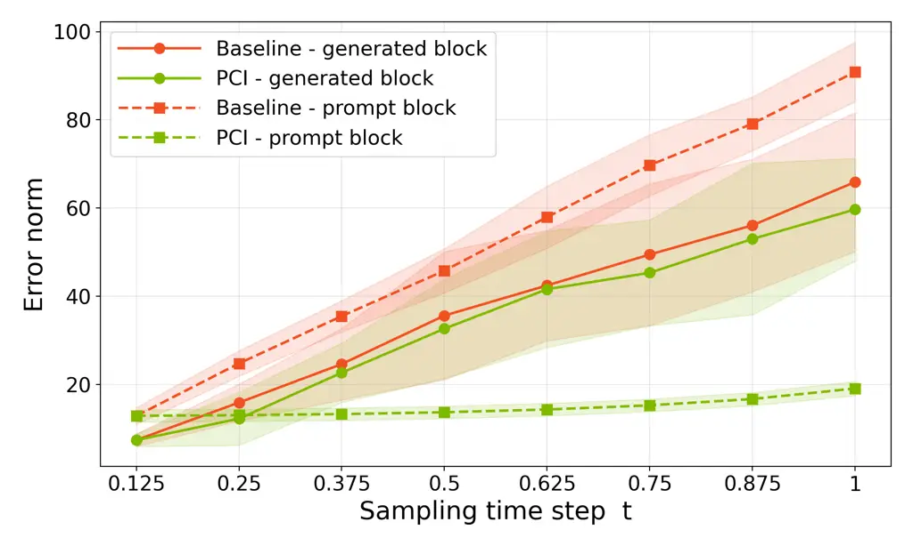
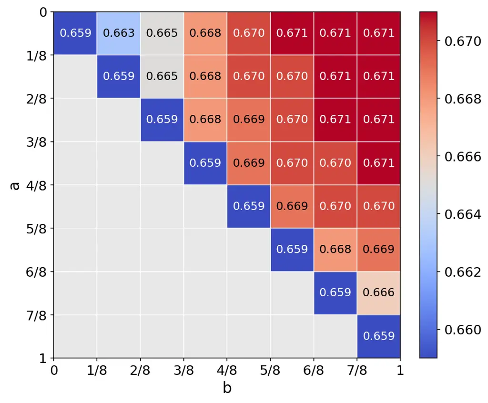

# Prompt-Consistency Inference for Zero-Shot Flow-Matching Text-to-Speech Models

Vasily Zadorozhnyy    Can Goksen    Kazuhito Koishida    Dung Tran

###### Abstract

In recent years, flow-matching models have produced significant
improvements in zero-shot text-to-speech synthesis. Conditioned on an
audio prompt and text, these models learn a velocity field and generate
speech by iteratively solving an ODE. During inference, the solver
evolves a single state spanning both the prompt and the region to be
generated, although only the generated region is ultimately retained.
The discarded prompt state, however, still matters; its intermediate
values influence generation through the velocity field that couples the
two regions. As sampling continues, this state can drift away from the
prescribed conditional path, introducing a discrepancy into subsequent
generation updates. Unlike the unknown generated trajectory, the prompt
path is available in closed form from the reference audio and the
initial noise. We exploit this observation with Prompt-Consistency
Inference (PCI), a training-free rule that restores the prompt block to
its analytic value before each velocity evaluation, while leaving the
generated block unchanged. PCI improves speaker similarity and
intelligibility across the evaluated flow-matching TTS backbones without
additional network evaluations. Our ablation studies further show that
PCI keeps post-step prompt discrepancies smaller and that corrections
covering the later sampling stages recover much of the observed
similarity gain.

###### Index Terms: 

Zero-shot Text-to-Speech, Flow Matching, Prompt-Consistency Inference

^(†)^(†)address: Applied Sciences Group, Microsoft Corporation, Redmond,
USA

## 1 Introduction

A zero-shot Text-to-Speech (TTS) system aims to synthesize voice speech
of an unseen speaker from a single short reference utterance, without
any speaker-specific fine-tuning \[22, 12\]. Many recent systems use
_Flow Matching_ (FM) method, which learns a continuous-time velocity
field that transports a simple noise distribution to the data
distribution along a prescribed probability path \[14, 15, 21, 1, 13\].
The FM TTS models such as Voicebox \[12\], E2 TTS \[6\], F5-TTS \[4\],
and ZipVoice \[23\] achieve high synthesis quality while remaining
non-autoregressive and efficient to sample at inference.

Several of these systems are _prompted_ through audio infilling. The
acoustic features of the reference prompt and the region to be generated
occupy two temporal blocks of a single state, and the model is
conditioned on the clean prompt together with its transcript and the
target text. At inference, both blocks are initialized from a single
noise sample $`\bm{\epsilon}\sim\mathcal{N}(\bm{0},\bm{I})`$, and the
learned ODE is integrated jointly over the full state from $`t=0`$ to
$`t=1`$. Once sampling is complete, only the generated region is kept as
synthesized speech, while the prompt region is discarded. The two
regions thus share a sampling trajectory, despite serving different
roles.

Discarding the prompt output, however, does not remove its role during
generation. The velocity field processes the two regions jointly at
intermediate times, so the update in the generated region depends on the
current state of the prompt region at every sampling step. The clean
reference supplied as conditioning remains unchanged, but the evolving
prompt state follows the model’s predicted velocity. If this state
departs from the prompt interpolation prescribed during training, the
discrepancy becomes part of the input used to compute subsequent
generation updates. The prompt block therefore matters not because of
its final output, but because of the intermediate values the network
sees along the way.

The prompt region also has a property that the generated region does
not: its prescribed conditional path is known in closed form. Under the
linear conditional FM construction \[14\], this path is an interpolation
between the reference features and the fixed noise drawn at
initialization. Since both are available at inference, the deviation of
the integrated prompt state from this path can be measured exactly. We
call this discrepancy _prompt drift_. It is important to distinguish
prompt drift from numerical integration error alone; the predicted
prompt velocity need not follow the prescribed interpolation, even if
the learned ODE is integrated accurately. What makes prompt drift useful
to address is, therefore, not a particular source of error, but the fact
that it is observable and can be corrected before it influences the next
update.

We introduce _Prompt-Consistency Inference_ (_PCI_) to exploit this
observation. Before each velocity evaluation, we overwrite the prompt
region with its analytic value on the conditional path, leaving the
generated region unchanged. To the best of our knowledge, PCI is the
first method to explicitly enforce this prompt-path consistency during
inference in FM TTS. Rather than asking the model to reconstruct an
observed region, PCI supplies its prescribed state directly, while the
generated region continues to evolve under the learned field. An ODE
solver step can introduce a new prompt residual, but PCI corrects the
prompt input before the next velocity evaluation rather than carrying
that discrepancy forward. In this way, the known prompt path becomes an
explicit constraint on the sampling input. The modification requires no
retraining, no additional parameters, and no extra network evaluations
for a fixed sampling schedule.

Our contributions can be summarized as follows:

- •
  We identify _prompt drift_, an inference-time discrepancy in prompted
  FM TTS in which the integrated prompt state departs from its known
  conditional path. We explain why this discrepancy is relevant to
  generation even if the final prompt output is discarded.
- •
  We introduce PCI, a training-free, parameter-free inference rule that
  restores the prompt state before each velocity evaluation via a simple
  tensor overwrite. PCI applies to prompted FM models with an observed
  state region and analytical conditional path.
- •
  We evaluate PCI across several TTS backbones and benchmarks,
  demonstrating improvements in speaker similarity and intelligibility.
  In addition, our ablation studies examine the post-step discrepancies
  and show that corrections covering later sampling stages recover much
  of the observed similarity gain.

## 2 Related Work

### 2.1 Flow Matching and Rectified Flow

FM \[14\] trains a continuous generative model by regressing a
time-dependent velocity field onto the conditional velocity of a
prescribed probability path, avoiding simulation of the full ODE during
training. Rectified flow \[15\] and related conditional FM
formulations \[21\] use linear noise-to-data interpolation, providing
simple conditional paths with constant velocities. These training paths,
however, should be distinguished from the trajectories of the learned
field, which need not follow individual noise-data interpolations. PCI
exploits the part of the conditional path that remains available at
inference: the interpolation between the known prompt features and their
initial noise.

### 2.2 Prompting and Audio Infilling

Prompt-based conditioning, popularized for speech by neural codec
language models \[22\] and text-guided audio infilling \[12\], uses a
short reference utterance as evidence of speaker identity and prosody.
In prompted FM models, the clean reference can serve as conditioning
while a noisy version of the prompt also occupies part of the evolving
state. These two roles are distinct: keeping the clean reference fixed
does not ensure the evolving prompt follows its prescribed path. PCI
addresses the second role by constraining the prompt state supplied to
the velocity field, without changing the reference conditioning.

### 2.3 Flow Matching Text-to-Speech

Voicebox \[12\] casts text-guided speech generation as masked audio
infilling, supporting synthesis and editing within one model.
Matcha-TTS \[17\] combines an encoder-decoder acoustic model with
optimal-transport conditional FM for efficient synthesis. Models such as
E2 TTS \[6\] and F5-TTS \[4\] simplify explicit alignment components,
while ZipVoice \[23\] combines a compact backbone with flow distillation
to reduce sampling cost. These methods improve model architecture,
training, or sampling procedure. PCI instead corrects the evolving
prompt input and applies to samplers that jointly represent observed and
generated regions with an available conditional prompt path.

### 2.4 Guidance and Inference-Time Consistency

Classifier-Free Guidance (CFG) \[10\] controls generation by combining
conditional and unconditional predictions. A complementary strategy is
to enforce consistency with known observations during sampling. In the
image domain, RePaint \[16\] replaces known image regions with noised
observations in diffusion sampling, while Restora-Flow \[9\] combines
time-dependent observation fusion with trajectory correction and
resampling in FM restoration. PCI shares the principle of enforcing
known information, applying it to conditioned FM TTS through a prompt
overwrite using fixed initial noise. Our contribution focuses on
identifying, evaluating, and correcting prompt-state inconsistency in
the samplers, rather than known-region replacement itself.

## 3 Method

### 3.1 Background: Conditional Flow Matching

Let $`\bm{f},\bm{\epsilon}\in\mathbb{R}^{d\times L}`$ denote acoustic
features and Gaussian noise, respectively, with $`d`$ channels and $`L`$
frames, where $`\bm{\epsilon}\sim\mathcal{N}(\bm{0},\bm{I})`$. Under the
linear conditional FM construction \[14, 15\], a training state at time
$`t\in[0,1]`$ is obtained by interpolating between noise and data:

```math
\bm{x}_{t}^{\star}=t\cdot\bm{f}+(1-t)\cdot\bm{\epsilon}. \tag{1}
```

The corresponding conditional velocity is constant along the path:

```math
\bm{u}=\frac{d\bm{x}_{t}^{\star}}{dt}=\bm{f}-\bm{\epsilon}. \tag{2}
```

During training, we let $`\bm{m}\in\{0,1\}^{d\times L}`$ be a binary
mask selecting the region to be generated, and let $`\odot`$ denote the
Hadamard product. With conditioning $`\bm{c}`$, the masked regression
objective is

```math
\mathcal{L}_{\mathrm{CFM}}=\mathbb{E}_{\bm{f},\,\bm{m},\,\bm{\epsilon},\,t}\left\|\bm{m}\odot\left(\bm{v}_{\theta}(t,\bm{x}_{t}^{\star};\bm{c})-(\bm{f}-\bm{\epsilon})\right)\right\|_{F}^{2}, \tag{3}
```

where the expectation is over training examples, masks, noise, and time.
The conditioning $`\bm{c}`$ includes the clean reference features
$`(\bm{1}-\bm{m})\odot\bm{f}`$. Under this masked objective, velocity
errors are penalized only in the generated region. The prompt state is
therefore supplied as a network input, but its predicted velocity is not
directly supervised by this loss. Consequently, using that velocity to
evolve the prompt during sampling need not preserve its prescribed
interpolation. More generally, the conditional interpolation defines the
training input and velocity target; it does not require the learned
field to reproduce each individual noise–data path at inference.

To generate speech, we initialize $`\bm{x}_{t_{0}}=\bm{\epsilon}`$ and
integrate the learned field over a partition $`0=t_{0}<\cdots<t_{N}=1`$.
Although other ODE solvers may be used \[6\], explicit Euler is a common
choice \[4, 23\], updating the state with step size
$`h_{i}=t_{i+1}-t_{i}`$ as

```math
\bm{x}_{t_{i+1}}=\bm{x}_{t_{i}}+h_{i}\bm{v}_{\theta}(t_{i},\bm{x}_{t_{i}};\bm{c}). \tag{4}
```

Unlike the training state $`\bm{x}_{t}^{\star}`$, the sampled state
$`\bm{x}_{t_{i}}`$ depends on successive model predictions evaluated at
preceding sampled states. For notational simplicity, $`\bm{v}_{\theta}`$
in the following equations may include the backbone’s existing guidance
rule, such as CFG \[10\].

### 3.2 Prompted Infilling and Prompt Drift

Let $`\mathcal{P}\subset\{1,\ldots,L\}`$ index the prompt frames and
$`\mathcal{G}=\{1,\ldots,L\}\setminus\mathcal{P}`$ the frames to be
generated. For a prefix prompt, we write the joint state as
$`\bm{x}=[\,\bm{x}[\mathcal{P}]\mid\bm{x}[\mathcal{G}]\,]`$, where
$`\mid`$ denotes temporal concatenation. The conditioning $`\bm{c}`$
includes the known reference features $`\bm{f}[\mathcal{P}]`$, the
reference transcript, and the text to be generated.

In the baseline joint-state sampler, (4) updates both regions, and only
$`\bm{x}_{t_{N}}[\mathcal{G}]`$ is kept as the generated acoustic
features. Although the clean reference in $`\bm{c}`$ is fixed, the
prompt coordinates $`\bm{x}_{t_{i}}[\mathcal{P}]`$ evolve from the
predicted velocity and need not follow the conditional interpolation
path used to construct the training input. The interpolation is
available for the prompt region at every sampling time from (1) using
known reference features and fixed initial noise $`\bm{\epsilon}`$:

```math
\bm{p}_{t}^{\star}=t\cdot\bm{f}[\mathcal{P}]+(1-t)\cdot\bm{\epsilon}[\mathcal{P}]. \tag{5}
```

We define _prompt drift_ as the difference between the integrated prompt
state and this prescribed value:

```math
\bm{\delta}_{i}=\bm{x}_{t_{i}}[\mathcal{P}]-\bm{p}_{t_{i}}^{\star}. \tag{6}
```

Since $`\bm{x}_{t_{0}}=\bm{\epsilon}`$, the initial prompt drift is
$`\bm{\delta}_{0}=\bm{0}`$. Furthermore, subtracting the prompt
interpolation from the Euler update gives

```math
\bm{\delta}_{i+1}=\bm{\delta}_{i}+h_{i}\bigl(\bm{v}_{\theta}(t_{i},\bm{x}_{t_{i}};\bm{c})[\mathcal{P}]-(\bm{f}[\mathcal{P}]-\bm{\epsilon}[\mathcal{P}])\bigr). \tag{7}
```

Equation (7) shows that each step adds a scaled velocity residual to the
prompt drift, which could amplify or offset it. This drift is not from
numerical integration error alone: Euler integration of the exact
constant conditional velocity would recover the linear prompt path at
all sampling nodes, where the learned prompt velocity need not match the
target. Any drift that enters the next network evaluation and can affect
the generated-region update through the jointly processed state even
though the final prompt output is discarded.

### 3.3 Prompt-Consistency Inference

Since the prompt region path is known, we need not rely on the predicted
prompt state when evaluating the next velocity. PCI uses this
observation directly. Before each evaluation, it restores the prompt
coordinates to (5) and the generated coordinates are unchanged. To
distinguish the corrected input from the solver output, let
$`\bm{x}_{t_{i}}`$ denote the raw state produced by the preceding Euler
step. PCI constructs the corrected network input and advances the state
as follows:

```math
\displaystyle\bm{x}_{t_{i}}^{\mathrm{PCI}} \displaystyle=[\,\bm{p}_{t_{i}}^{\star}\mid\bm{x}_{t_{i}}[\mathcal{G}]\,], \tag{8}
```

```math
\displaystyle\bm{x}_{t_{i+1}} \displaystyle=\bm{x}_{t_{i}}^{\mathrm{PCI}}+h_{i}\bm{v}_{\theta}(t_{i},\bm{x}_{t_{i}}^{\mathrm{PCI}};\bm{c}).
```

Note that the prompt noise $`\bm{\epsilon}[\mathcal{P}]`$ is drawn once
at initialization and reused throughout sampling, so every correction
restores the same conditional path.

By construction, PCI eliminates prompt drift before each velocity
evaluation:
$`\bm{x}_{t_{i}}^{\mathrm{PCI}}[\mathcal{P}]-\bm{p}_{t_{i}}^{\star}=\bm{0}`$.
The subsequent Euler update can nevertheless produce a nonzero post-step
residual if the predicted prompt velocity differs from the conditional
target:

```math
\bm{\delta}_{i+1}^{\mathrm{PCI}}=h_{i}\bigl(\bm{v}_{\theta}(t_{i},\bm{x}_{t_{i}}^{\mathrm{PCI}};\bm{c})[\mathcal{P}]-(\bm{f}[\mathcal{P}]-\bm{\epsilon}[\mathcal{P}])\bigr). \tag{9}
```

Algorithm 1 presents the full-state implementation with Euler
integration, which also allows us to measure the post-step prompt
residual in our ablation study (see § 4.4).

0:  Conditioning $`\bm{c}`$, reference features $`\bm{f}[\mathcal{P}]`$,
block indices $`\mathcal{P},\mathcal{G}`$, sampling times
$`\{t_{i}\}_{i=0}^{N}`$, velocity field $`\bm{v}_{\theta}`$

1:  Sample $`\bm{\epsilon}\sim\mathcal{N}(\bm{0},\bm{I})`$; set
$`\bm{x}_{t_{0}}\leftarrow\bm{\epsilon}`$

2:  for $`i=0,\ldots,N-1`$ do

3:
  $`\bm{x}_{t_{i}}^{\mathrm{PCI}}[\mathcal{G}]\leftarrow\bm{x}_{t_{i}}[\mathcal{G}]`$

4:
  $`\bm{x}_{t_{i}}^{\mathrm{PCI}}[\mathcal{P}]\leftarrow t_{i}\bm{f}[\mathcal{P}]+(1-t_{i})\bm{\epsilon}[\mathcal{P}]`$

5:
  $`\bm{v}\leftarrow\bm{v}_{\theta}(t_{i},\bm{x}_{t_{i}}^{\mathrm{PCI}};\bm{c})`$

6:
  $`\bm{x}_{t_{i+1}}\leftarrow\bm{x}_{t_{i}}^{\mathrm{PCI}}+(t_{i+1}-t_{i})\bm{v}`$

7:  return $`\bm{x}_{t_{N}}[\mathcal{G}]`$

Algorithm 1 Prompt-Consistency Inference (Euler)

### 3.4 Remarks

- •
  Integrator choice. PCI can also be applied to inputs at
  intermediate-stage velocity evaluations in higher-order ODE solvers.
  We evaluate the Euler implementation in this work.
- •
  Flow-matching path. PCI does not require a linear interpolation
  path (5). It can use other conditional paths, provided the prompt
  state at each evaluation time can be reconstructed from the known
  reference and fixed sampled noise consistently with training.
- •
  Applicability beyond TTS. PCI is not inherently tied to speech
  synthesis. The same principle can be applied to other conditional
  flow-matching models with jointly evolved observed and generated
  regions, provided the prescribed path on the observed region is
  available at inference.

## 4 Experiments and Results

### 4.1 Experimental Setup

We evaluate PCI on E2 TTS \[6\], F5-TTS \[4\], and ZipVoice and its
distilled variants \[23\], using pretrained checkpoints downloaded from
Hugging Face and keeping all model weights frozen. For each model and
utterance, baseline and PCI use identical random seeds, initial noise,
conditioning, duration settings, ODE solver, sampling schedules, and
guidance settings; the only difference is the prompt correction in (8),
applied before each velocity evaluation without additional network
evaluations. We evaluate on three standard zero-shot benchmarks:
LibriSpeech-PC test-clean \[18\], Seed-TTS test-en \[2\], and Seed-TTS
test-zh \[8\].

### 4.2 Evaluation Metrics

We report: (i) speaker similarity (SIM-o), the cosine similarity between
speaker embeddings of the generated and reference audios, extracted with
a WavLM-based \[3\] ECAPA-TDNN speaker-verification model \[5\]; (ii)
word error rate (WER), computed by comparing the ASR transcription of
synthesized speech with the input text, using Whisper-large-v3 \[19\]
for Seed-TTS test-en, Paraformer-zh \[7\] for Seed-TTS test-zh, and a
HuBERT-based recognizer \[11\] for LibriSpeech-PC test-clean; and (iii)
UTMOS, an automatic prediction of speech naturalness \[20\]. For the
trajectory analysis, we additionally report the Frobenius norms of
prompt drift and generated-block reference-path discrepancy in § 4.4.

### 4.3 Main Results

Table 1 summarizes the comparison. PCI improves SIM-o and reduces WER in
many settings while improving or preserving UTMOS in most. On Seed-TTS
test-en, F5-TTS improves SIM-o from $`0.664`$ to $`0.685`$ (relative
gain of $`3.2\%`$). On LibriSpeech-PC, ZipVoice at 16 NFEs reduces WER
from $`1.77\%`$ to $`1.47\%`$ (relative reduction of $`16.9\%`$). The
benefits extend to low-NFE distilled sampling: ZipVoice-Distill at 4
NFEs improves all three metrics on each benchmark, including a WER
decrease from $`1.39\%`$ to $`1.33\%`$ on Seed-TTS test-zh (relative
reduction of $`4.3\%`$). The following ablations examine block-wise
trajectory discrepancies (§ 4.4) and the effect of correction timing
(§ 4.5).

|                              |                 |      |                                  |                   |                      |     |                        |                   |                      |     |                        |                   |                      |
| ---------------------------- | --------------- | ---- | -------------------------------- | ----------------- | -------------------- | --- | ---------------------- | ----------------- | -------------------- | --- | ---------------------- | ----------------- | -------------------- |
| 1-2      Model               | Training Data   | NFEs | LibriSpeech-PC test-clean \[18\] |                   |                      |     | Seed-TTS test-en \[2\] |                   |                      |     | Seed-TTS test-zh \[8\] |                   |                      |
|                              |                 |      | SIM-o$`\uparrow`$                | UTMOS$`\uparrow`$ | WER(%)$`\downarrow`$ |     | SIM-o$`\uparrow`$      | UTMOS$`\uparrow`$ | WER(%)$`\downarrow`$ |     | SIM-o$`\uparrow`$      | UTMOS$`\uparrow`$ | WER(%)$`\downarrow`$ |
| Ground Truth                 | \-              | \-   | 0.690                            | 4.10              | 1.87                 |     | 0.734                  | 3.52              | 2.14                 |     | 0.755                  | 2.78              | 1.25                 |
| E2 TTS^(∗)                   | LibriHeavy (EN) | 32   | 0.692                            | 3.42              | 2.72                 |     | 0.706                  | 3.21              | 2.32                 |     | 0.733                  | 2.26              | 2.72                 |
| E2 TTS^(∗)  +  PCI           | LibriHeavy (EN) | 32   | 0.698                            | 3.46              | 2.44                 |     | 0.712                  | 3.27              | 2.32                 |     | 0.742                  | 2.42              | 2.58                 |
| F5-TTS^(†)                   | Emilia (EN+ZH)  | 32   | 0.655                            | 3.85              | 1.89                 |     | 0.664                  | 3.67              | 1.85                 |     | 0.750                  | 2.91              | 1.70                 |
| F5-TTS^(†)  +  PCI           | Emilia (EN+ZH)  | 32   | 0.674                            | 3.85              | 1.61                 |     | 0.685                  | 3.86              | 1.82                 |     | 0.765                  | 2.91              | 1.63                 |
| ZipVoice^(‡)                 | Emilia (EN+ZH)  | 16   | 0.665                            | 3.98              | 1.77                 |     | 0.696                  | 3.82              | 1.70                 |     | 0.750                  | 3.15              | 1.45                 |
| ZipVoice^(‡)  +  PCI         | Emilia (EN+ZH)  | 16   | 0.676                            | 4.09              | 1.47                 |     | 0.694                  | 3.90              | 1.56                 |     | 0.761                  | 3.22              | 1.38                 |
| ZipVoice-Distill^(‡)         | Emilia (EN+ZH)  | 8    | 0.645                            | 4.07              | 1.65                 |     | 0.670                  | 3.90              | 1.64                 |     | 0.739                  | 3.11              | 1.37                 |
| ZipVoice-Distill^(‡)  +  PCI | Emilia (EN+ZH)  | 8    | 0.657                            | 4.16              | 1.50                 |     | 0.684                  | 3.89              | 1.59                 |     | 0.746                  | 3.16              | 1.32                 |
| ZipVoice-Distill^(‡)         | Emilia (EN+ZH)  | 4    | 0.649                            | 4.05              | 1.64                 |     | 0.679                  | 3.82              | 1.59                 |     | 0.747                  | 3.16              | 1.39                 |
| ZipVoice-Distill^(‡)  +  PCI | Emilia (EN+ZH)  | 4    | 0.658                            | 4.11              | 1.57                 |     | 0.684                  | 3.93              | 1.51                 |     | 0.751                  | 3.17              | 1.33                 |

Table 1: Zero-shot TTS results with and without PCI using frozen
pretrained checkpoints: ^(∗) – unofficial E2 TTS, provided by the
F5-TTS \[4\]; ^(†) – official F5-TTS \[4\]; ^(‡) – official
ZipVoice(-Distill) \[23\]. Higher SIM-o and UTMOS and lower WER are
better.

### 4.4 Ablation I: Block-Wise Trajectory Discrepancies

The following ablation examines prompt drift and its relationship to the
generated trajectory. We compare baseline sampling and PCI on
ZipVoice-Distill(8 NFEs) using LibriSpeech-PC test-clean \[18\], with a
uniform partition of $`[0,1]`$. For this diagnostic, the generated
region is assigned the reference feature length so the two states’
dimensions match; this does not imply phonetic alignment. We quantify
the prompt drift defined in (6) by its Frobenius norm and extend the
reference-path discrepancy measure to the generated region:

```math
e_{\mathcal{P}}(t_{i})=\|\bm{\delta}_{i}\|_{F},\quad e_{\mathcal{G}}(t_{i})=\left\|\bm{x}_{t_{i}}[\mathcal{G}]-\bm{x}_{t_{i}}^{\star}[\mathcal{G}]\right\|_{F} \tag{10}
```

Both quantities are measured after each Euler step, before any
subsequent PCI correction. Thus, for PCI, $`e_{\mathcal{P}}(t_{i})`$
measures the post-step residual characterized in (9), rather than the
zero prompt discrepancy of the corrected input used at the next velocity
evaluation. For the generated region, the reference interpolation is
constructed using (1). Reference feature values $`\bm{f}[\mathcal{G}]`$
are used only to compute this diagnostic and are not supplied as sampler
inputs; only their sequence length is used to set the generated-region
length. Since the learned ODE need not reproduce this particular
interpolation, $`e_{\mathcal{G}}(t_{i})`$ is a diagnostic reference-path
distance, not a direct measure of numerical integration error or
synthesis quality.



Figure 1: Prompt drift and generated-block reference-path discrepancy
for ZipVoice-Distill (8 NFEs) on LibriSpeech-PC test-clean, with and
without PCI. Measurements are taken after each Euler step, before any
subsequent prompt correction. Curves show means, with shaded bands
indicating one standard deviation across utterances.

Figure 1 shows two effects. First, the baseline prompt drift (dashed
red) increases along the sampling trajectory, whereas PCI (dashed green)
maintains a smaller post-step residual. This behavior is consistent with
the distinction in (7) and (9): baseline sampling carries accumulated
prompt drift into subsequent evaluations, while PCI removes it from the
network input before the next evaluation. Second, the generated-block
discrepancy under PCI (solid green) is also lower than the baseline
(solid red), even though PCI never directly overwrites this region. This
observation is consistent with prompt-state discrepancies influencing
generation through the jointly evaluated velocity field. Together with
the output metrics in Table 1, these results support the benefit of
enforcing prompt consistency beyond the corrected region itself.

### 4.5 Ablation II: Correction Windows

We next examine which sampling intervals require prompt correction to
recover the similarity gains of full PCI. Using the same experimental
setup as in § 4.4, we restrict prompt correction to velocity evaluations
within the window $`[a,b)`$, where $`0\leq a\leq b\leq 1`$. The
corresponding evaluation indices are
$`\mathcal{I}_{a,b}=\{\,i\in\{0,\ldots,N-1\}:a\leq t_{i}<b\,\}`$. The
network input for windowed PCI is defined as

```math
\bm{x}_{t_{i}}^{\mathrm{PCI}}[\mathcal{G}]=\bm{x}_{t_{i}}[\mathcal{G}],\quad\bm{x}_{t_{i}}^{\mathrm{PCI}}[\mathcal{P}]=\begin{cases}\bm{p}_{t_{i}}^{\star},&i\in\mathcal{I}_{a,b},\\
\bm{x}_{t_{i}}[\mathcal{P}],&\text{otherwise}.\end{cases} \tag{11}
```

The Euler update then proceeds as in (8); outside the correction window,
the raw state is used without prompt correction as in (4). Setting
$`a=0`$ and $`b=1`$ applies PCI correction at every step of ODE solver,
recovering full PCI. When $`a=b`$, we apply no correction
($`\mathcal{I}_{a,a}=\varnothing`$), recovering baseline sampling.

Figure 2 reports mean SIM-o across utterances, with the window start
$`a`$ on the vertical axis and the window end $`b`$ on the horizontal
axis. Full PCI occupies the top-right corner and achieves the highest
similarity, while the diagonal represents baseline sampling. Similarity
generally increases as $`b`$ approaches $`1`$, and correction over the
second half of the schedule captures most of the benefit. Together with
the trajectory analysis in § 4.4, these results suggest that maintaining
prompt consistency during later velocity evaluations is particularly
important for speaker similarity.



Figure 2: SIM-o for windowed PCI on ZipVoice-Distill (8 NFEs) on
LibriSpeech-PC test-clean. Rows specify window start $`a`$ and columns –
its end $`b`$. The top-right entry shows full PCI; diagonal entries
correspond to baseline.

## 5 Conclusion

We introduced Prompt-Consistency Inference (PCI), an inference-time
correction that restores the prompt state to its prescribed conditional
path before each velocity evaluation. PCI improves speaker similarity
and intelligibility across the evaluated models and benchmarks, while
generally preserving or improving predicted naturalness, without
additional network evaluations. Our ablations show that PCI limits
post-step prompt drift and generated-block reference-path discrepancies,
despite leaving that block unmodified. Windowed correction further
indicates that later sampling intervals are particularly important for
recovering speaker similarity gains. These findings highlight prompt
consistency as an efficient way to improve flow-based zero-shot speech
synthesis.

## Compliance with Ethical Standards

This study used existing speech benchmarks and did not recruit human
participants or conduct animal experiments. No new ethical approval was
required for the reported evaluation. Zero-shot voice generation can
enable impersonation; reference audio should be used with appropriate
permission, and generated speech should be disclosed as synthetic. The
authors declare no conflicts of interest.

## References

- \[1\] M. S. Albergo and E. Vanden-Eijnden (2023) Building normalizing
  flows with stochastic interpolants. In International Conference on
  Learning Representations (ICLR), External Links:
  [Link](https://arxiv.org/abs/2209.15571) Cited by: §1.
- \[2\] R. Ardila, M. Branson, K. Davis, M. Henretty, M. Kohler, J.
  Meyer, R. Morais, L. Saunders, F. M. Tyers, and G. Weber (2020) Common
  voice: a massively-multilingual speech corpus. In Proceedings of the
  12th Conference on Language Resources and Evaluation (LREC 2020),
  pp. 4211–4215. Cited by: §4.1, Table 1.
- \[3\] S. Chen, C. Wang, Z. Chen, Y. Wu, S. Liu, Z. Chen, J. Li, N.
  Kanda, T. Yoshioka, X. Xiao, J. Wu, et al. (2022) WavLM: large-scale
  self-supervised pre-training for full stack speech processing. IEEE
  Journal of Selected Topics in Signal Processing 16 (6), pp. 1505–1518.
  External Links:
  [Document](https://dx.doi.org/10.1109/JSTSP.2022.3188113) Cited by:
  §4.2.
- \[4\] Y. Chen, Z. Niu, Z. Ma, K. Deng, C. Wang, J. Zhao, K. Yu, and X.
  Chen (2024) F5-tts: a fairytaler that fakes fluent and faithful speech
  with flow matching. arXiv preprint arXiv:2410.06885. Cited by: §1,
  §2.3, §3.1, §4.1, Table 1.
- \[5\] B. Desplanques, J. Thienpondt, and K. Demuynck (2020)
  ECAPA-TDNN: emphasized channel attention, propagation and aggregation
  in TDNN based speaker verification. In Proc. Interspeech,
  pp. 3830–3834. External Links:
  [Document](https://dx.doi.org/10.21437/Interspeech.2020-2650) Cited
  by: §4.2.
- \[6\] S. E. Eskimez, X. Wang, M. Thakker, C. Li, C. Tsai, Z. Xiao, H.
  Yang, Z. Zhu, M. Tang, X. Tan, Y. Liu, S. Zhao, and N. Kanda (2024) E2
  tts: embarrassingly easy fully non-autoregressive zero-shot tts. In
  2024 IEEE Spoken Language Technology Workshop (SLT), Vol. ,
  pp. 682–689. External Links:
  [Document](https://dx.doi.org/10.1109/SLT61566.2024.10832320) Cited
  by: §1, §2.3, §3.1, §4.1.
- \[7\] Z. Gao, S. Zhang, I. McLoughlin, and Z. Yan (2022) Paraformer:
  fast and accurate parallel transformer for non-autoregressive
  end-to-end speech recognition. In Proc. Interspeech, pp. 2063–2067.
  External Links:
  [Document](https://dx.doi.org/10.21437/Interspeech.2022-9996) Cited
  by: §4.2.
- \[8\] T. Guo, C. Wen, D. Jiang, N. Luo, R. Zhang, S. Zhao, W. Li, C.
  Gong, W. Zou, K. Han, and X. Li (2020) Didispeech: a large scale
  mandarin speech corpus. ICASSP 2021 - 2021 IEEE International
  Conference on Acoustics, Speech and Signal Processing (ICASSP),
  pp. 6968–6972. Cited by: §4.1, Table 1.
- \[9\] A. Hadzic, F. Thaler, L. Bogensperger, S. J. Joham, and M.
  Urschler (2026) Restora-Flow: mask-guided image restoration with flow
  matching. In Proc. IEEE/CVF Winter Conference on Applications of
  Computer Vision (WACV), pp. 4943–4952. External Links:
  [Link](https://openaccess.thecvf.com/content/WACV2026/html/Hadzic_Restora-Flow_Mask-Guided_Image_Restoration_with_Flow_Matching_WACV_2026_paper.html)
  Cited by: §2.4.
- \[10\] J. Ho and T. Salimans (2021) Classifier-free diffusion
  guidance. In NeurIPS 2021 Workshop on Deep Generative Models and
  Downstream Applications, External Links:
  [Link](https://openreview.net/forum?id=qw8AKxfYbI) Cited by: §2.4,
  §3.1.
- \[11\] W. Hsu, B. Bolte, Y. H. Tsai, K. Lakhotia, R. Salakhutdinov,
  and A. Mohamed (2021) HuBERT: self-supervised speech representation
  learning by masked prediction of hidden units. IEEE/ACM Transactions
  on Audio, Speech, and Language Processing 29, pp. 3451–3460. Cited by:
  §4.2.
- \[12\] M. Le, A. Vyas, B. Shi, B. Karrer, L. Sari, R. Moritz, M.
  Williamson, V. Manohar, Y. Adi, J. Mahadeokar, and W. Hsu (2023)
  Voicebox: text-guided multilingual universal speech generation at
  scale. In Advances in Neural Information Processing Systems, Vol. 36,
  pp. 14005–14034. External Links:
  [Link](https://proceedings.neurips.cc/paper_files/paper/2023/file/2d8911db9ecedf866015091b28946e15-Paper-Conference.pdf)
  Cited by: §1, §2.2, §2.3.
- \[13\] S. Lim, A. Yu, B. O’Bray, and K. Borgwardt (2024) Elucidating
  the design choice of probability paths in flow matching for
  forecasting. arXiv preprint arXiv:2410.03229. External Links:
  [Link](https://arxiv.org/abs/2410.03229) Cited by: §1.
- \[14\] Y. Lipman, R. T. Q. Chen, H. Ben-Hamu, M. Nickel, and M.
  Le (2023) Flow matching for generative modeling. In The Eleventh
  International Conference on Learning Representations (ICLR), External
  Links: [Link](https://openreview.net/forum?id=PqvMRDCJT9t) Cited by:
  §1, §1, §2.1, §3.1.
- \[15\] X. Liu, C. Gong, and qiang liu (2023) Flow straight and fast:
  learning to generate and transfer data with rectified flow. In The
  Eleventh International Conference on Learning Representations (ICLR),
  External Links: [Link](https://openreview.net/forum?id=XVjTT1nw5z)
  Cited by: §1, §2.1, §3.1.
- \[16\] A. Lugmayr, M. Danelljan, A. Romero, F. Yu, R. Timofte,
  and L. V. Gool (2022) RePaint: inpainting using denoising diffusion
  probabilistic models. In CVPR, pp. 11461–11471. External Links:
  [Link](https://arxiv.org/abs/2201.09865) Cited by: §2.4.
- \[17\] S. Mehta, R. Tu, J. Beskow, É. Székely, and G. E. Henter (2024)
  Matcha-tts: a fast tts architecture with conditional flow matching. In
  IEEE International Conference on Acoustics, Speech and Signal
  Processing (ICASSP), pp. 12496–12500. Cited by: §2.3.
- \[18\] A. Meister, M. Novikov, N. Karpov, E. Bakhturina, V. Lavrukhin,
  and B. Ginsburg (2023) LibriSpeech-pc: benchmark for evaluation of
  punctuation and capitalization capabilities of end-to-end asr models.
  In 2023 IEEE Automatic Speech Recognition and Understanding Workshop
  (ASRU), Vol. , pp. 1–7. External Links:
  [Document](https://dx.doi.org/10.1109/ASRU57964.2023.10389666) Cited
  by: §4.1, §4.4, Table 1.
- \[19\] A. Radford, J. W. Kim, T. Xu, G. Brockman, C. McLeavey, and I.
  Sutskever (2023) Robust speech recognition via large-scale weak
  supervision. In Proceedings of the 40th International Conference on
  Machine Learning, Proceedings of Machine Learning Research, Vol. 202,
  pp. 28492–28518. Cited by: §4.2.
- \[20\] T. Saeki, D. Xin, W. Nakata, T. Koriyama, S. Takamichi, and H.
  Saruwatari (2022) UTMOS: UTokyo-SaruLab system for VoiceMOS challenge 2022. In Proc. Interspeech, pp. 4521–4525. External Links:
  [Document](https://dx.doi.org/10.21437/Interspeech.2022-439),
  [Link](https://www.isca-archive.org/interspeech_2022/saeki22c_interspeech.html)
  Cited by: §4.2.
- \[21\] A. Tong, K. FATRAS, N. Malkin, G. Huguet, Y. Zhang, J.
  Rector-Brooks, G. Wolf, and Y. Bengio (2024) Improving and
  generalizing flow-based generative models with minibatch optimal
  transport. Transactions on Machine Learning Research. Note: Expert
  Certification External Links: ISSN 2835-8856,
  [Link](https://openreview.net/forum?id=CD9Snc73AW) Cited by: §1, §2.1.
- \[22\] C. Wang, S. Chen, Y. Wu, Z. Zhang, L. Zhou, S. Liu, Z. Chen, Y.
  Liu, H. Wang, et al. (2023) Neural codec language models are zero-shot
  text to speech synthesizers. arXiv preprint arXiv:2301.02111. Cited
  by: §1, §2.2.
- \[23\] H. Zhu, W. Kang, Z. Yao, L. Guo, F. Kuang, Z. Li, W. Zhuang, L.
  Lin, and D. Povey (2025) ZipVoice: fast and high-quality zero-shot
  text-to-speech with flow matching. preprint arXiv:2506.13053. Cited
  by: §1, §2.3, §3.1, §4.1, Table 1.
