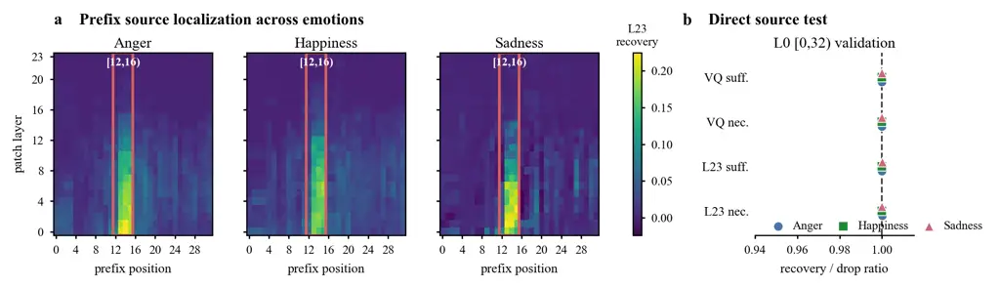
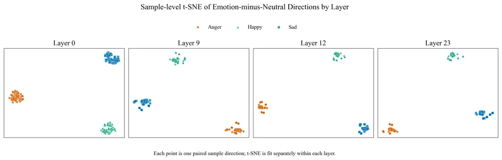

# Tracing a Sparse Emotion-Control Circuit in LLM-Based Text-to-Speech

Hongfei Du    Jiacheng Shi    Yanfu Zhang    Ye Gao
Affiliation: Department of Computer Science, William & Mary,
Williamsburg, USA Affiliation: {hdu02, jshi12, yzhang105, ygao18}@wm.edu

###### Abstract

LLM-based text-to-speech (TTS) models can generate emotionally
expressive speech, but how reference emotion is routed through the model
and realized in decoded speech remains unclear. We introduce two
emotion-sensitive metrics for matched neutral and emotional syntheses—a
codec trajectory score and a late residual direction score—and use them
to score activation-patching interventions. Under controlled
matched-reference conditions, this analysis identifies a sparse
source-to-readout component-level circuit: 23–27 attention heads and
MLPs per emotion, roughly 5% of the components considered, recover or
suppress 74–88% of the late emotion-readout shift on held-out cases. The
circuit combines a shared component backbone with emotion-specific
components; cross-emotion activation swaps reduce the target readout in
47 of 48 cases. In decoded speech, the same intervention produces
consistent changes in pitch, energy, and spectral brightness over 24
matched pairs per emotion. A readout-matched residual-direction baseline
produces only 17–27% of the intervention’s pitch effect, showing that
internal readout movement alone does not explain the decoded acoustic
changes. These results trace a compact causal route from
reference-derived prefix information to emotion-relevant properties of
generated speech.

## 1 Introduction

LLM-based text-to-speech (TTS) models have recently shown strong
capability for generating natural and emotionally expressive speech from
text, speaker information, and reference prompts (Wang et al., 2023a; Du
et al., 2024; Wang et al., 2025; Deng et al., 2025; Zhou et al., 2026).
Controllable style and emotion generation is especially important for
spoken dialogue agents, virtual humans, and health-support interfaces
(Picard, 1997; Bickmore and Picard, 2005), because vocal emotion and
prosody shape how listeners perceive intent, engagement, and empathy
(Scherer, 2003; Juslin and Laukka, 2003). Recent TTS systems support
such control through reference prompts, style descriptions, or explicit
emotion conditioning (Guo et al., 2023; Yang et al., 2024; Zhou et al.,
2026; Yang et al., 2025). This capability raises a mechanistic question:
how does reference emotion enter an LLM-based TTS model, and which
internal components carry its effect toward generated speech?

Prior mechanistic studies of language models often study behaviors with
localized output positions (Olah et al., 2020; Elhage et al., 2021). In
factual recall, causal tracing, and automated circuit discovery,
interventions can often be scored at answer tokens or other local
prediction sites (Vig et al., 2020; Meng et al., 2022; Heimersheim and
Nanda, 2024; Conmy et al., 2023). This scoring strategy does not
transfer directly to LLM-based TTS. Reference emotion affects a long
sequence of generated speech tokens, which are then transformed by
acoustic decoding before they become audible. A decoded-speech emotion
score can verify that decoded speech moves toward a target emotion, but
it does not reveal which hidden states, components, or generation steps
caused the change. Mechanistic analysis of TTS therefore needs
measurements that link internal activations to codec-level changes and
decoded-speech outcomes.

Our causal tracing workflow has four steps. We first build matched
neutral and emotional synthesis pairs, then localize where reference
emotion enters the conditioning prefix, trace its effect through
attention heads and MLPs to late emotion readouts, and finally test
whether the selected components causally change decoded speech.
Together, these steps turn a decoded-speech emotion change into a
source-to-readout causal localization problem.

Figure 1: Causal tracing localizes a sparse source-to-readout
component-level emotion circuit within a reference-conditioned LLM-based
TTS model. Matched neutral/emotional runs localize a conditioning-prefix
source, trace its effect through sparse attention-head and MLP sets to
late emotion readouts, and validate the pathway with causal and
decoded-speech tests.

To causally localize the reference emotion effect, we construct matched
neutral and emotional syntheses that keep text and speaker setting fixed
while changing the emotion reference. For these pairs, we design and
validate two emotion-sensitive metrics: a codec trajectory score over
generated token trajectories and a late residual direction score over
generation states. These metrics let us score activation-patching
interventions that replace selected internal activations from one
synthesis trajectory with matched activations from another. These scores
support prefix localization, component-level tracing, matched controls,
component specificity checks, and decoded-audio validation. Figure 1
summarizes this complete workflow.

Our activation-patching analysis identifies a sparse source-to-readout
component-level circuit under controlled matched-reference conditions.
The circuit starts at a shared conditioning-prefix source and passes
through 23–27 selected attention heads and MLPs per emotion, roughly 5%
of the components considered, to late emotion readouts. On held-out
cases, these components recover or suppress 74–88% of the readout shift
and exceed matched random sets in every emotion and intervention
direction. The circuit has a shared computational backbone together with
emotion-specific components: shared-only sets recover 79–86% of the
full-set effect, while cross-emotion donor activations reduce the target
readout in 47 of 48 cases. Finally, paired analyses over 24 decoded
waveforms per emotion show consistent changes in pitch, energy, and
spectral brightness. A residual-direction baseline matched to the
internal readout shift produces only 17–27% of the selected components’
pitch effect, connecting the localized components to acoustic changes
beyond a global emotion direction.

Our main contributions are:

- •
  We design and validate two emotion-sensitive metrics for causal
  localization in TTS: a codec trajectory score and a late residual
  direction score. Unlike prior circuit work that scores answer-token
  interventions, these metrics score patching across codec-generation
  trajectories and late residual states, enabling localization that can
  be tested against decoded waveform evidence.
- •
  We identify a sparse source-to-readout component-level circuit for
  reference emotion. It begins at a shared conditioning-prefix source
  and passes through 23–27 selected attention heads and MLPs per emotion
  to late readouts for anger, happiness, and sadness.
- •
  We show that the circuit is causal and structured. Sufficiency and
  necessity interventions recover or suppress 74–88% of the readout
  shift; shared/specific decomposition and cross-emotion swaps reveal a
  shared backbone carrying emotion-dependent activation content.
- •
  We connect the internal circuit to decoded speech. The selected
  components produce consistent emotion-relevant acoustic changes and
  substantially outperform readout-matched residual-direction steering
  at transferring the internal shift to waveform pitch.

## 2 Related Work

#### Emotion control in TTS.

Emotion-controllable TTS aims to synthesize speech whose affect can be
specified or guided by the user. Existing systems expose this control
through natural-language style descriptions, explicit emotion labels,
intensity controls, reference prompts, or reinforcement-learning
objectives (Guo et al., 2023; Yang et al., 2024; Zhang et al., 2025;
Yang et al., 2025; Li et al., 2026). Modern TTS systems often synthesize
speech by generating discrete semantic or acoustic tokens before
waveform decoding (Borsos et al., 2023; Wang et al., 2023a). Recent
LLM-based TTS systems, including CosyVoice, Spark-TTS, IndexTTS, and
IndexTTS2, build on this token-generation design and support
controllable generation through attribute prompts, style references, or
emotion inputs (Du et al., 2024; Wang et al., 2025; Deng et al., 2025;
Zhou et al., 2026). These systems demonstrate practical emotion control
in generated speech, but they do not identify how reference-conditioned
emotion is represented or routed inside the TTS model. We instead ask
where reference-conditioned emotion enters LLM-based TTS generation and
which internal components carry its effect to emotion-sensitive
readouts.

#### Causal circuit localization.

Mechanistic interpretability studies often explain a model behavior by
identifying the internal states or components that causally support a
chosen metric (Olah et al., 2020; Elhage et al., 2021; Olsson et al.,
2022). Causal mediation, causal tracing, and activation patching test
this relation by replacing internal states under a source-target
contrast (Vig et al., 2020; Meng et al., 2022; Heimersheim and Nanda,
2024). Circuit studies then refine this localization from residual
states to attention heads, MLPs, or paths (Wang et al., 2023b; Conmy et
al., 2023; Goldowsky-Dill et al., 2023; Kramár et al., 2024). Most
circuit-level evidence so far comes from localized prediction tasks,
such as factual recall or indirect object identification. We study
reference-conditioned emotion in LLM-based TTS under this causal
localization perspective. Unlike localized prediction tasks, the emotion
effect is distributed across a long sequence of generated speech tokens
and only becomes audible after waveform decoding. We therefore need
intervention metrics that score how changes in prefix and generation
states affect the generated token trajectory and decoded speech.

#### Internal analyses of speech models.

Recent work has begun to analyze internal representations in speech
models. Mechanistic studies of automatic speech recognition examine how
speech representations support transcription-related behavior (Glazer et
al., 2026). Paek et al. (2025) analyze audio latent spaces with sparse
autoencoders and learn features aligned with acoustic properties such as
pitch, amplitude, and timbre. In speech synthesis, hidden-state steering
methods show that adding learned directions can change the emotion of
synthesized speech without updating model weights (Xie et al., 2025).
These studies show that speech model internals can be probed or
manipulated, but they do not trace how reference-conditioned emotion
flows through an LLM-based TTS model. We instead localize a
conditioning-prefix source and identify attention heads and MLPs that
carry its effect to late emotion readouts.

## 3 Preliminaries

#### Generated speech token trajectories.

We study the autoregressive stage that produces generated speech tokens
before waveform decoding. In LLM-based TTS, an autoregressive
language-model component predicts discrete speech tokens from text,
speaker information, and an emotion reference, and a downstream decoder
converts the predicted token sequence into a waveform (Wang et al.,
2023a; Du et al., 2024; Wang et al., 2025; Deng et al., 2025).
Suppressing speaker notation for clarity, we write this process as

```math
p_{\theta}(z_{t}\mid x,r,z_{<t}),\qquad y=D(z_{1:T}),
```

where $`x`$ is the input text, $`r`$ is the emotion reference,
$`z_{1:T}`$ is the generated speech token trajectory, and $`D`$ is the
audio decoder. We intervene during this autoregressive stage, before
waveform decoding.

#### Matched synthesis pairs.

We next define the neutral–emotion contrast that supplies source and
target trajectories. Each contrast uses matched neutral and emotional
syntheses that share the same text and speaker setting but differ in the
emotion reference. The neutral trajectory uses a neutral reference
$`r^{(n)}`$, while the emotional trajectory uses a target-emotion
reference $`r^{(e)}`$:

```math
\displaystyle\tau^{(n)} \displaystyle=(x,r^{(n)},z^{(n)}_{1:T},y^{(n)}),
```

```math
\displaystyle\tau^{(e)} \displaystyle=(x,r^{(e)},z^{(e)}_{1:T},y^{(e)}).
```

Here $`z_{1:T}`$ is the generated speech token trajectory and $`y`$ is
the decoded waveform for the same text $`x`$. Because $`x`$ and the
speaker setting are fixed within each pair, differences between
$`\tau^{(n)}`$ and $`\tau^{(e)}`$ define the reference emotion contrast
while controlling for lexical content and speaker identity. We use
$`\tau^{\mathrm{src}}`$ for the trajectory that supplies an activation
and $`\tau^{\mathrm{tgt}}`$ for the trajectory being modified.

#### Activation patching.

Given a source and target trajectory, activation patching tests whether
copying one internal value from the source trajectory into the target
trajectory moves the target toward the source condition. For a component
site $`q=(\ell,t,c)`$, let $`a_{q}(\tau)`$ denote the activation of
component $`c`$ at layer $`\ell`$ and position $`t`$ on trajectory
$`\tau`$. A patch replaces the target activation with its source
counterpart,

```math
a_{q}(\tau^{\mathrm{tgt}})\leftarrow a_{q}(\tau^{\mathrm{src}}),
```

and we score the resulting patched trajectory (Vig et al., 2020; Meng et
al., 2022; Heimersheim and Nanda, 2024). The next section defines the
scores used for this measurement.

#### Patchable states.

Finally, we specify the internal values that can serve as patch sites in
the autoregressive model. A patch can replace a residual state, an
attention-head output, or an MLP output. At sequence position $`t`$, let
$`h_{\ell,t}`$ be the residual stream entering layer $`\ell`$. A
Transformer block updates this state in two steps,

```math
\tilde{h}_{\ell,t}=h_{\ell,t}+u_{\ell,t},\qquad h_{\ell+1,t}=\tilde{h}_{\ell,t}+m_{\ell,t},
```

where $`u_{\ell,t}`$ is the attention update and $`m_{\ell,t}`$ is the
MLP update. For head-level patches, we decompose the attention update
before the output projection,

```math
u_{\ell,t}=W^{O}_{\ell}\,[o_{\ell,1,t}\|\cdots\|o_{\ell,H,t}],
```

where $`W^{O}_{\ell}`$ is the layer-$`\ell`$ attention output
projection, $`\|`$ denotes concatenation, $`H`$ is the number of
attention heads, and $`o_{\ell,j,t}`$ is the output of head $`j`$. Thus
$`c`$ can denote a residual stream, head output, MLP output, or block
state. Prefix patches use prefix positions; generation-time component
patches use generated speech-token positions.

## 4 Measuring and Localizing Causal Emotion Effects

To localize causal emotion effects, activation-patching interventions
must be scored on matched neutral and emotional trajectories. We
therefore define two complementary metrics for this setting: a codec
trajectory score and a late residual direction score. Together, they
score patched trajectories and trace reference emotion within the TTS
computation; Table 1 reports their stability.

### 4.1 Metrics for emotion effects

Before localizing an emotion effect, we need a scalar score for how much
a patched trajectory moves along the neutral-to-emotion contrast. For
each matched synthesis pair $`i`$, let $`\tau_{i}^{(n)}`$ and
$`\tau_{i}^{(e)}`$ denote the neutral and emotional trajectories defined
above, with $`\tau_{i}^{(e)}`$ corresponding to the currently scored
target emotion $`k`$. The codec trajectory score represents a trajectory
by the mean embedding of its predicted codec tokens, $`\mu(\tau)`$. For
target emotion $`k`$, let
$`\Delta_{k}^{\mu}=\sum_{i}(\mu(\tau_{i}^{(e)})-\mu(\tau_{i}^{(n)}))`$.
For any trajectory $`\tau`$ paired with the neutral member of pair
$`i`$, such as a patched trajectory $`\tau_{i}^{\mathrm{patch}}`$, we
define

```math
\displaystyle\hat{d}_{k}^{\mu} \displaystyle=\Delta_{k}^{\mu}/\|\Delta_{k}^{\mu}\|_{2},
```

```math
\displaystyle C_{k}(\tau) \displaystyle=\left\langle\mu(\tau)-\mu(\tau_{i}^{(n)}),\hat{d}_{k}^{\mu}\right\rangle.
```

Here $`C_{k}`$ is the codec trajectory score, evaluated relative to the
neutral member of the same matched pair. The late residual direction
score uses $`\bar{h}_{L}(\tau)`$, the mean final-layer residual state
over generated token positions, where $`L`$ denotes the final layer
index. We define

```math
\displaystyle\Delta_{k}^{h} \displaystyle=\sum_{i}(\bar{h}_{L}(\tau_{i}^{(e)})-\bar{h}_{L}(\tau_{i}^{(n)})),
```

```math
\displaystyle\hat{d}_{k}^{h} \displaystyle=\Delta_{k}^{h}/\|\Delta_{k}^{h}\|_{2},
```

```math
\displaystyle R_{k}(\tau) \displaystyle=\left\langle\bar{h}_{L}(\tau)-\bar{h}_{L}(\tau_{i}^{(n)}),\hat{d}_{k}^{h}\right\rangle.
```

We use $`R_{k}(\tau)`$ as the internal score for target emotion $`k`$,
with the same pair-relative convention. When the matched pair is clear,
we suppress the pair index and write $`C_{k}(\tau)`$ or $`R_{k}(\tau)`$.

| Emotion   | Codec pair | Codec split | Resid. cent. |
| --------- | ---------- | ----------- | ------------ |
| Anger     | 0.941      | 0.998       | 0.926        |
| Happiness | 0.764      | 0.988       | 0.903        |
| Sadness   | 0.903      | 0.996       | 0.874        |

Table 1: Stability of the two emotion metrics over 50 matched pairs. For
the codec trajectory score, Codec pair reports the mean pairwise cosine
among paired codec-token embedding shifts, and Codec split reports
split-half agreement of the global codec direction. Resid. cent. reports
the mean cosine to the final-layer residual centroid used by the late
residual direction score.



Figure 2: Conditioning-prefix source localization and direct source
tests. (a) Layer-by-position scans show that emotional-prefix patching
into neutral runs has the strongest final-layer residual recovery in the
conditioning prefix, with a narrow peak near positions $`[12,16)`$. (b)
Direct interventions on the layer-0 $`[0,32)`$ source window validate
this source across anger, happiness, and sadness: emotional-prefix
patching recovers the emotion effect, while neutral-prefix patching
removes it. Ratios near one indicate recovery or removal of nearly the
full clean neutral–emotion shift under both codec trajectory and late
residual direction scores.

Both metrics are stable enough for intervention scoring (Table 1). The
codec trajectory score is less consistent for happiness, consistent with
more heterogeneous acoustic realizations of happiness (Appendix B.1).
The late residual direction score is coherent across emotions and serves
as the internal readout target for causal tracing. We use the final
layer because it is closest to generated-token prediction, although
emotion directions are already separable in earlier layers due to the
conditioning prefix (Appendix B.2). These metrics do not establish
causality by themselves; they define the targets used to score the
interventions below.

### 4.2 Conditioning-prefix patching for source localization

With these metrics, source localization focuses on a natural candidate
region in IndexTTS2. The emotion reference is converted into an emotion
vector and placed in the GPT input prefix, before the text embeddings
and before generated speech tokens are produced. We therefore search the
conditioning prefix rather than all generated positions.

We test this with prefix patching. Let $`\tau^{(n)}`$ and $`\tau^{(e)}`$
denote paired neutral and emotional trajectories with the same speaker
and text but different emotion references. For a conditioning-prefix
source site $`s_{\mathrm{src}}=(\ell,\mathcal{W})`$, where
$`\mathcal{W}`$ is a prefix window at layer $`\ell`$, we run the neutral
trajectory while replacing its prefix activations with the emotional
counterparts,

```math
h_{\ell,\mathcal{W}}^{(n)}\leftarrow h_{\ell,\mathcal{W}}^{(e)},
```

and then measure whether the patched trajectory moves toward the
emotional trajectory. We score this movement with either metric defined
above, $`M_{k}\in\{C_{k},R_{k}\}`$. Recovery is normalized by the clean
gap between the matched emotional and neutral trajectories:

```math
E_{s_{\mathrm{src}},k}=\frac{M_{k}(\tau_{s_{\mathrm{src}}}^{\mathrm{patch}})-M_{k}(\tau^{(n)})}{M_{k}(\tau^{(e)})-M_{k}(\tau^{(n)})}.
```

Here $`s_{\mathrm{src}}=(\ell,\mathcal{W})`$ is the patched prefix site,
$`\tau_{s_{\mathrm{src}}}^{\mathrm{patch}}`$ is the neutral trajectory
after replacing site $`s_{\mathrm{src}}`$ with its emotional
counterpart, and $`M_{k}`$ is either the codec trajectory score or the
late residual direction score for target emotion $`k`$, using the
pair-relative convention defined above. The ratio is defined only when
the magnitude of the clean gap exceeds the numerical tolerance of
$`10^{-8}`$; otherwise, it is excluded. A value near one means that the
patched prefix activations recover most of the clean emotional shift
under that metric. For necessity tests, we reverse the patch direction
and measure how much of the clean shift is removed when the emotional
trajectory receives the neutral prefix. We use these normalized recovery
and removal scores to compare prefix sites.

### 4.3 Localizing and validating the conditioning-prefix source

In the IndexTTS2 autoregressive module, the prefix scan localizes the
strongest reference-emotion source to the conditioning prefix. Across
anger, happiness, and sadness, recovery concentrates near prefix
positions $`[12,16)`$, with the strongest signal in low-to-middle patch
layers and weaker spread across nearby prefix positions (Figure 2a).
Direct tests on this prefix hotspot $`[12,16)`$ confirm that it is a
strong partial source: across emotions, $`[12,16)`$ recovers or removes
roughly half to two thirds of the clean shift (Appendix F). Rather than
using this narrow peak as the only source, we use the full layer-0
conditioning-prefix block $`[0,32)`$ as a conservative layer-0
$`[0,32)`$ source window for subsequent tracing. We validate this source
choice with two direct interventions (Figure 2b): patching the emotional
prefix into the neutral run should recover the emotional effect, and
patching the neutral prefix into the emotional run should remove it.
Across eight matched examples per emotion, both interventions are nearly
complete under both metrics. The mean codec recovery and removal ratios
are 1.00 for all three emotions, and the late residual direction ratios
are also approximately 1.00. Thus, for this model, the full
conditioning-prefix block provides a conservative layer-0 $`[0,32)`$
source window, not a claim that every token in the window is
individually necessary.

These controls isolate the reference emotion from simpler confounds.
Each matched pair keeps the text and speaker fixed, so the patched
contrast is not explained by lexical content or speaker identity. The
same source window is used for every validation prompt, so the result
does not rely on prompt-specific window choices. This gives a fixed
source for the component analyses below.

## 5 Selecting Candidate Emotion-Carrying Components

The localized conditioning-prefix source gives us a place to start, but
not a component-level pathway. We next use gradient attribution as a
screening step to identify heads and MLPs whose source-induced changes
point toward the late emotion readout. This yields a sparse candidate
set for each emotion.

### 5.1 Gradient attribution selects components

Directly intervening on every head and MLP would make candidate
discovery expensive and hard to separate from validation. We therefore
use gradient attribution as a first-order screen, following attribution
patching methods for scalable component localization (Nanda, 2023;
Kramár et al., 2024). Let $`\tau_{s_{\mathrm{src}}}^{\mathrm{patch}}`$
denote the neutral trajectory after patching the validated
conditioning-prefix source
$`s_{\mathrm{src}}=(0,\mathcal{W}_{\mathrm{src}})`$, with
$`\mathcal{W}_{\mathrm{src}}=[0,32)`$, from the emotional trajectory.
For a component $`c`$, pilot pair $`i`$, and autoregressive prediction
step $`t`$, define the source-induced activation change

```math
\Delta a_{i,c,t}=a_{i,c,t}(\tau_{i,s_{\mathrm{src}}}^{\mathrm{patch}})-a_{i,c,t}(\tau_{i}^{(n)}),
```

and sum its local first-order effects over prediction steps:

```math
A_{i,c,k}=\sum_{t}\left\langle\Delta a_{i,c,t},\nabla_{a_{i,c,t}}R_{k}(\tau_{i,s_{\mathrm{src}}}^{\mathrm{patch}})\right\rangle.
```

Here $`R_{k}`$ is the late residual direction score for target emotion
$`k`$, and $`a_{i,c,t}(\tau)`$ denotes the generation-time output of
component $`c`$ for pair $`i`$ at step $`t`$. The gradient is evaluated
on the source-patched trajectory. A large positive $`A_{i,c,k}`$ means
that the source-induced change in component $`c`$ locally increases the
emotion readout. For each emotion, we average $`A_{i,c,k}`$ over eight
pilot pairs and keep components whose mean score exceeds
$`\eta\bar{g}_{k}`$, where $`\eta=0.005`$ and
$`\bar{g}_{k}=\frac{1}{8}\sum_{i}\|\bar{h}_{L}(\tau_{i}^{(e)})-\bar{h}_{L}(\tau_{i}^{(n)})\|_{2}`$
is the mean clean pairwise final-layer residual shift over the same
pilot pairs. We also require positive attribution on at least seven
pairs. Eligible components are then ranked by mean absolute attribution,
and the top 30% form the frozen candidate set.

| Emotion   | Nodes | Heads | MLPs | Late MLPs | Shared |
| --------- | ----- | ----- | ---- | --------- | ------ |
| Anger     | 24    | 15    | 9    | 6         | 13     |
| Happiness | 23    | 13    | 10   | 6         | 13     |
| Sadness   | 27    | 21    | 6    | 5         | 13     |

Table 2: Gradient-attribution candidate sets. Nodes are selected
attention-head and MLP components in the frozen top-30% candidate set
for each emotion. The Late MLPs column counts selected MLPs in layers
18–23. Shared counts components that appear in all three
emotion-specific candidate sets.

| Emotion   | Components | Pilot recover | Pilot remove  | Valid. recover | Valid. remove |
| --------- | ---------- | ------------- | ------------- | -------------- | ------------- |
| Anger     | 24 (15/9)  | 0.812 / 0.815 | 0.787 / 0.786 | 0.814 / 0.815  | 0.784 / 0.787 |
| Happiness | 23 (13/10) | 0.883 / 0.886 | 0.864 / 0.865 | 0.876 / 0.868  | 0.855 / 0.855 |
| Sadness   | 27 (21/6)  | 0.751 / 0.754 | 0.754 / 0.755 | 0.736 / 0.739  | 0.747 / 0.744 |

Table 3: Pilot and validation results for frozen top-30% component sets.
Each component set is selected on eight pilot pairs and evaluated
without retuning on eight validation synthesis pairs. Components reports
total selected components, with heads/MLPs in parentheses. Recover is
the fraction of the full-source readout shift restored by the selected
components; remove is the fraction lost when the same components are
replaced with neutral activations in the full-source trajectory. Each
recover/remove cell reports mean/median.

Table 2 shows that the attribution ranking is sparse, late-MLP-heavy,
and partly shared across emotions. The 30% budget is also supported by a
compression sweep on anger: the top 10% recovers 0.696 of the readout
shift and removes 0.661, the top 15% reaches 0.763 and 0.720, and the
top 30% reaches 0.815 and 0.798. Increasing the budget to 50% or 90%
gives only smaller additional gains (Appendix G). We therefore use the
top 30% as a compact candidate set for validation, not as a claim that
lower-ranked components have no effect. The exact frozen component
identities are reported in Appendix G.1. This gives a concrete
source-to-readout candidate pathway for the intervention tests below.

## 6 Validating the Source-to-Readout Component-Level Circuit

The attribution ranking gives candidate heads and MLPs, but direct
interventions are needed to test whether they carry the source effect to
the emotion readout. We therefore freeze the selected components and
evaluate them on validation synthesis cases. We test sufficiency and
necessity, trace source-to-component effects against matched controls,
and compare the selected sets with matched random component sets.

| Emotion   | Recover  |        | Remove   |        |
| --------- | -------- | ------ | -------- | ------ |
|           | Selected | Random | Selected | Random |
| Anger     | 0.814    | 0.278  | 0.784    | 0.242  |
| Happiness | 0.876    | 0.421  | 0.855    | 0.463  |
| Sadness   | 0.736    | 0.340  | 0.747    | 0.395  |

Table 4: Matched random controls for component-set validation. Selected
cells report validation mean ratios for the frozen component sets.
Random cells report the mean over 20 matched random sets with the same
size and head–MLP mix. The selected set is larger than every matched
random set in all three emotions and both intervention directions.

### 6.1 Frozen component interventions

We apply the sufficiency and necessity logic from source localization
(Section 4.2) to the frozen component sets selected above (Section 5).
For each emotion, the source window, readout metric, component budget,
and selected heads and MLPs are fixed before validation. Thus the
following interventions test the attribution-selected set directly,
rather than continuing the selection procedure.

In the sufficiency test, the neutral trajectory receives the selected
head and MLP outputs from the trajectory with the emotional source. In
the necessity test, the source-patched neutral trajectory receives the
matched clean-neutral outputs at the same components. We normalize both
scores by the full-source readout gap between the source-patched neutral
and clean-neutral trajectories. A ratio near one means that the frozen
component set recovers the readout shift in the sufficiency test or
removes it in the necessity test.

### 6.2 Frozen components recover and suppress the readout

The frozen component sets pass the main readout-level validation on
synthesis cases that were not used for attribution. Table 3 reports two
ratios for each emotion: recover is the sufficiency score, and remove is
the necessity score. Across emotions, validation recovery/removal ratios
remain close to the pilot ratios, and the expected direction holds for
every pair in every condition.

Together, the two intervention directions show that the selected
components both restore the emotion readout when added to a neutral
trajectory and suppress it when replaced with clean-neutral outputs in
the source-patched neutral trajectory. This supports the readout-level
claim that the frozen sparse sets carry a large fraction of the measured
emotion shift.

### 6.3 Testing component specificity

The set-level interventions show that the selected components matter,
but do not by themselves rule out a simpler explanation: perhaps many
components in similar layers would work equally well. We therefore test
specificity at the full-set level by sampling random component sets with
the same size and head/MLP mix. This control gives a larger separation
(Table 4). Across emotions, selected validation recovery ratios are
0.736–0.876, while matched random sets average 0.278–0.421. The same
pattern holds for removal: selected sets remove 0.747–0.855 of the
readout shift, while matched random sets average 0.242–0.463. In every
emotion and intervention type, the selected set exceeds all 20 random
sets.

As an auxiliary source-conditioned specificity check, selected
components exhibit positive selected-minus-control deltas against
cleaner matched alternatives in all three emotions and both intervention
directions (Appendix H). Together, these controls show that the result
is not explained by patching arbitrary components in similar layers.

### 6.4 Shared and emotion-specific structure

The selected sets combine a common backbone with emotion-specific
components. The same 13 components occur in all three top sets. As
Table 5 shows, these shared components alone recover 79–86% of the
full-set sufficiency effect, while the remaining emotion-specific
components recover 58–59%. Both subsets have positive effects on every
held-out pair.

| Emotion   | Full  | Shared only | Specific only |
| --------- | ----- | ----------- | ------------- |
| Anger     | 0.814 | 0.686 (84%) | 0.470 (58%)   |
| Happiness | 0.876 | 0.753 (86%) | 0.511 (58%)   |
| Sadness   | 0.736 | 0.584 (79%) | 0.433 (59%)   |

Table 5: Sufficiency recovery of full, shared-only, and emotion-specific
component sets. Parentheses give the fraction of the full-set recovery.

Shared sites nevertheless carry emotion-dependent activation content.
Replacing their target-emotion activations with activations from another
emotion reduces the target readout in 47 of 48 source–target cases. The
mean changes are $`-33.14`$, $`-40.72`$, and $`-51.46`$ for anger,
happiness, and sadness, respectively; the overall change is $`-41.77`$,
with a 95% confidence interval of $`[-48.27,-35.28]`$. Thus the circuit
uses shared computational sites while retaining target-specific
activation content and components.

| Emotion   | Circuit $`\Delta`$F0 (st)   | Second correlate  | Circuit change                     | Residual $`\Delta`$F0 | Ratio |
| --------- | --------------------------- | ----------------- | ---------------------------------- | --------------------- | ----- |
| Anger     | $`+2.77`$ $`[2.44,3.12]`$   | RMS energy        | $`+3.35`$ dB $`[2.99,3.73]`$       | $`+0.74`$ st          | 0.27  |
| Happiness | $`+3.57`$ $`[3.18,3.98]`$   | Spectral centroid | $`+133.06`$ Hz $`[113.37,152.10]`$ | $`+0.83`$ st          | 0.23  |
| Sadness   | $`-1.01`$ $`[-1.38,-0.55]`$ | RMS energy        | $`-3.04`$ dB $`[-3.42,-2.67]`$     | $`-0.17`$ st          | 0.17  |

Table 6: Decoded acoustic effects of the sparse component intervention
and a readout-matched residual-direction baseline. Changes are measured
from the matched neutral baseline. The second correlate follows the
salient target-reference contrast for each emotion.

## 7 Decoded-Audio Effects and Baselines

The component tests so far are internal; we next ask whether the same
fixed interventions affect decoded waveforms. For each target emotion,
we compare 24 matched text-speaker cases under a neutral baseline and a
component-patched target intervention. We measure mean F0, active-frame
RMS energy, and spectral centroid, calibrating each sign by the
corresponding target-minus-neutral reference contrast. We report paired
bootstrap 95% confidence intervals, paired sign-permutation tests, and
directional consistency. Target-prototype Emo-SIM from emotion2vec (Ma
et al., 2024) is reported as a secondary measure in Appendix C.

### 7.1 Paired acoustic effects

Table 6 shows consistent waveform-level changes for all three emotions.
Anger increases pitch and energy, happiness increases pitch and spectral
brightness, and sadness decreases pitch and energy, matching the
corresponding reference contrasts. All reported acoustic changes are
significant under paired permutation tests: $`p\leq 10^{-4}`$ with 24/24
directional consistency, except sadness F0 with $`p=3\times 10^{-4}`$
and 23/24 consistency.

### 7.2 Readout-matched residual-direction steering

We compare the component intervention with direct steering along the
layer-23 residual emotion direction at every generation step. Steering
strength is chosen to match the mean component-induced readout shift.
The residual baseline reaches equal or larger internal shifts—56.9
versus 51.0 for anger, 62.1 versus 57.5 for happiness, and 35.1 versus
32.4 for sadness—but produces only 17–27% of the component
intervention’s F0 change (Table 6). The selected components therefore
transfer reference-derived emotion information to decoded acoustics more
effectively than a global readout direction.

The effect also persists under top-$`p`$ sampling: over eight pairs per
emotion, F0 changes by $`+2.15`$, $`+1.69`$, and $`-0.95`$ semitones for
anger, happiness, and sadness. A second-backbone check on LLaSA-1B
further finds that a layer-8 anger-prefix patch recovers 0.855 of the
speech-token direction effect over 30 prompts. Appendix D provides the
full protocols and confidence intervals. An exploratory blinded A/B
check also prefers the intervention for target-emotion strength in 24/24
trials, while 21 of 24 naturalness comparisons are ties (Appendix E).

## 8 Conclusion

This work traces reference-conditioned emotion from an input-prefix
source through sparse attention-head and MLP sets to late readouts and
decoded speech. The selected component-level circuits recover and
suppress most of the measured readout effect on held-out cases, combine
a shared computational backbone with emotion-specific content, and
outperform matched random sets. Their decoded acoustic effects are
substantially stronger than those of readout-matched residual-direction
steering, linking the localized components to concrete changes in pitch,
energy, and spectral brightness. These results establish a compact
causal account of reference-emotion routing in LLM-based TTS under
matched-reference conditions.

## Limitations

The main circuit analysis uses IndexTTS2, one speaker/timbre setting,
English prompts, three emotions, and one fixed reference file per
emotion. The identified components may therefore capture properties of
these references in addition to emotion structure. The LLaSA-1B and
top-$`p`$ checks extend the causal pattern to a second backbone and
stochastic decoding, but broader tests across speakers, languages,
references, and architectures remain open. Our circuit is a
component-level source-to-readout account rather than a complete
enumeration of every internal edge. Finally, the listening check uses
one listener; a multi-listener study would provide stronger perceptual
evaluation.

## Ethical Considerations and Potential Risks

Emotion-controllable TTS could be misused to misrepresent a speaker’s
affect or to create deceptive voice content, especially when combined
with unauthorized voice cloning. Our work is a controlled
interpretability study and does not release a deployable editing system.
Any deployment of emotion-controllable TTS should require speaker
consent, clear disclosure or provenance mechanisms, and safeguards
against impersonation and deceptive use.

## Acknowledgments

This work is supported in part by the National Science Foundation (NSF)
grant IIS-2451436 and the Commonwealth Cyber Initiative grant
HC-2Q26-032.

## References

- Bickmore and Picard (2005) T. W. Bickmore and R. W. Picard
  Establishing and maintaining long-term human-computer relationships.
  ACM Transactions on Computer-Human Interaction 12 (2), pp. 293–327.
  External Links: [Document](https://dx.doi.org/10.1145/1067860.1067867)
  Cited by: §1.
- Borsos et al. (2023) Z. Borsos, R. Marinier, D. Vincent, E.
  Kharitonov, O. Pietquin, M. Sharifi, D. Roblek, O. Teboul, D.
  Grangier, M. Tagliasacchi, and N. Zeghidour AudioLM: a language
  modeling approach to audio generation. IEEE/ACM Transactions on Audio,
  Speech, and Language Processing 31, pp. 2523–2533. External Links:
  [Document](https://dx.doi.org/10.1109/TASLP.2023.3288409) Cited by:
  §2.
- Conmy et al. (2023) A. Conmy, A. Mavor-Parker, A. Lynch, S.
  Heimersheim, and A. Garriga-Alonso Towards automated circuit discovery
  for mechanistic interpretability. Advances in Neural Information
  Processing Systems 36, pp. 16318–16352. External Links:
  [Document](https://dx.doi.org/10.52202/075280-0719),
  [Link](https://proceedings.neurips.cc/paper_files/paper/2023/hash/34e1dbe95d34d7ebaf99b9bcaeb5b2be-Abstract-Conference.html)
  Cited by: §1, §2.
- Deng et al. (2025) W. Deng, S. Zhou, J. Shu, J. Wang, and L. Wang
  IndexTTS: an industrial-level controllable and efficient zero-shot
  text-to-speech system. arXiv preprint arXiv:2502.05512. External
  Links: [Link](https://arxiv.org/abs/2502.05512) Cited by: §1, §2, §3.
- Du et al. (2024) Z. Du, Q. Chen, S. Zhang, K. Hu, H. Lu, Y. Yang, H.
  Hu, S. Zheng, Y. Gu, Z. Ma, Z. Gao, and Z. Yan CosyVoice: a scalable
  multilingual zero-shot text-to-speech synthesizer based on supervised
  semantic tokens. arXiv preprint arXiv:2407.05407. External Links:
  [Link](https://arxiv.org/abs/2407.05407) Cited by: §1, §2, §3.
- Elhage et al. (2021) N. Elhage, N. Nanda, C. Olsson, T. Henighan, N.
  Joseph, B. Mann, A. Askell, Y. Bai, A. Chen, T. Conerly, N.
  DasSarma, D. Drain, D. Ganguli, Z. Hatfield-Dodds, D. Hernandez, A.
  Jones, J. Kernion, L. Lovitt, K. Ndousse, D. Amodei, T. Brown, J.
  Clark, J. Kaplan, S. McCandlish, and C. Olah A mathematical framework
  for transformer circuits. Transformer Circuits Thread. External Links:
  [Link](https://transformer-circuits.pub/2021/framework/index.html)
  Cited by: §1, §2.
- Glazer et al. (2026) N. Glazer, Y. Segal-Feldman, H. Segev, A.
  Shamsian, A. Buchnick, G. Hetz, E. Fetaya, J. Keshet, and A. Navon
  Beyond transcription: mechanistic interpretability in ASR. In
  Proceedings of the AAAI Conference on Artificial Intelligence, Vol.
  40, pp. 37407–37416. External Links:
  [Document](https://dx.doi.org/10.1609/aaai.v40i44.41073),
  [Link](https://ojs.aaai.org/index.php/AAAI/article/view/41073) Cited
  by: §2.
- Goldowsky-Dill et al. (2023) N. Goldowsky-Dill, C. MacLeod, L. Sato,
  and A. Arora Localizing model behavior with path patching. arXiv
  preprint arXiv:2304.05969. External Links:
  [Link](https://arxiv.org/abs/2304.05969) Cited by: §2.
- Guo et al. (2023) Z. Guo, Y. Leng, Y. Wu, S. Zhao, and X. Tan
  PromptTTS: controllable text-to-speech with text descriptions. In 2023
  IEEE International Conference on Acoustics, Speech and Signal
  Processing (ICASSP), pp. 1–5. External Links:
  [Document](https://dx.doi.org/10.1109/ICASSP49357.2023.10096285) Cited
  by: §1, §2.
- Heimersheim and Nanda (2024) S. Heimersheim and N. Nanda How to use
  and interpret activation patching. arXiv preprint arXiv:2404.15255.
  External Links: [Link](https://arxiv.org/abs/2404.15255) Cited by: §1,
  §2, §3.
- Juslin and Laukka (2003) P. N. Juslin and P. Laukka Communication of
  emotions in vocal expression and music performance: different
  channels, same code?. Psychological Bulletin 129 (5), pp. 770–814.
  External Links:
  [Document](https://dx.doi.org/10.1037/0033-2909.129.5.770) Cited by:
  §1.
- Kramár et al. (2024) J. Kramár, T. Lieberum, R. Shah, and N. Nanda
  AtP\*: an efficient and scalable method for localizing LLM behaviour
  to components. arXiv preprint arXiv:2403.00745. External Links:
  [Link](https://arxiv.org/abs/2403.00745) Cited by: §2, §5.1.
- Li et al. (2026) H. Li, Y. Liu, Y. Sun, H. Shi, L. Qu, and T. Li
  EMORL-TTS: reinforcement learning for fine-grained emotion control in
  LLM-based TTS. In 2026 IEEE International Conference on Acoustics,
  Speech and Signal Processing (ICASSP), pp. 17272–17276. External
  Links:
  [Document](https://dx.doi.org/10.1109/ICASSP55912.2026.11460999) Cited
  by: §2.
- Ma et al. (2024) Z. Ma, Z. Zheng, J. Ye, J. Li, Z. Gao, S. Zhang,
  and X. Chen Emotion2vec: self-supervised pre-training for speech
  emotion representation. In Findings of the Association for
  Computational Linguistics: ACL 2024, Bangkok, Thailand,
  pp. 15747–15760. External Links:
  [Document](https://dx.doi.org/10.18653/v1/2024.findings-acl.931),
  [Link](https://aclanthology.org/2024.findings-acl.931/) Cited by: §7.
- Meng et al. (2022) K. Meng, D. Bau, A. Andonian, and Y. Belinkov
  Locating and editing factual associations in GPT. In Advances in
  Neural Information Processing Systems, Vol. 35, pp. 17359–17372.
  External Links: [Document](https://dx.doi.org/10.52202/068431-1262),
  [Link](https://proceedings.neurips.cc/paper_files/paper/2022/hash/6f1d43d5a82a37e89b0665b33bf3a182-Abstract-Conference.html)
  Cited by: §1, §2, §3.
- Nanda (2023) N. Nanda Attribution patching: activation patching at
  industrial scale. Note: Online articleAccessed: 2026-08-25 External
  Links:
  [Link](https://www.neelnanda.io/mechanistic-interpretability/attribution-patching)
  Cited by: §5.1.
- Olah et al. (2020) C. Olah, N. Cammarata, L. Schubert, G. Goh, M.
  Petrov, and S. Carter Zoom in: an introduction to circuits. Distill.
  External Links:
  [Document](https://dx.doi.org/10.23915/distill.00024.001),
  [Link](https://distill.pub/2020/circuits/zoom-in/) Cited by: §1, §2.
- Olsson et al. (2022) C. Olsson, N. Elhage, N. Nanda, N. Joseph, N.
  DasSarma, T. Henighan, B. Mann, A. Askell, Y. Bai, A. Chen, T.
  Conerly, D. Drain, D. Ganguli, Z. Hatfield-Dodds, D. Hernandez, S.
  Johnston, A. Jones, J. Kernion, L. Lovitt, K. Ndousse, D. Amodei, T.
  Brown, J. Clark, J. Kaplan, S. McCandlish, and C. Olah In-context
  learning and induction heads. Note: Transformer Circuits Thread
  External Links:
  [Link](https://transformer-circuits.pub/2022/in-context-learning-and-induction-heads/index.html)
  Cited by: §2.
- Paek et al. (2025) N. Paek, Y. Zang, Q. Yang, and R. Leistikow
  Learning interpretable features in audio latent spaces via sparse
  autoencoders. arXiv preprint arXiv:2510.23802. External Links:
  [Link](https://arxiv.org/abs/2510.23802) Cited by: §2.
- Picard (1997) R. W. Picard Affective computing. MIT Press, Cambridge,
  MA. External Links: ISBN 978-0-262-16170-1,
  [Link](https://mitpress.mit.edu/9780262161701/affective-computing/)
  Cited by: §1.
- Scherer (2003) K. R. Scherer Vocal communication of emotion: a review
  of research paradigms. Speech Communication 40 (1–2), pp. 227–256.
  External Links:
  [Document](https://dx.doi.org/10.1016/S0167-6393%2802%2900084-5) Cited
  by: §1.
- Vig et al. (2020) J. Vig, S. Gehrmann, Y. Belinkov, S. Qian, D.
  Nevo, Y. Singer, and S. Shieber Investigating gender bias in language
  models using causal mediation analysis. In Advances in Neural
  Information Processing Systems, Vol. 33, pp. 12388–12401. External
  Links:
  [Link](https://proceedings.neurips.cc/paper/2020/hash/92650b2e92217715fe312e6fa7b90d82-Abstract.html)
  Cited by: §1, §2, §3.
- Wang et al. (2023a) C. Wang, S. Chen, Y. Wu, Z. Zhang, L. Zhou, S.
  Liu, Z. Chen, Y. Liu, H. Wang, J. Li, L. He, S. Zhao, and F. Wei
  Neural codec language models are zero-shot text to speech
  synthesizers. arXiv preprint arXiv:2301.02111. External Links:
  [Link](https://arxiv.org/abs/2301.02111) Cited by: §1, §2, §3.
- Wang et al. (2023b) K. R. Wang, A. Variengien, A. Conmy, B. Shlegeris,
  and J. Steinhardt Interpretability in the wild: a circuit for indirect
  object identification in GPT-2 small. In International Conference on
  Learning Representations, External Links:
  [Link](https://openreview.net/forum?id=NpsVSN6o4ul) Cited by: §2.
- Wang et al. (2025) X. Wang, M. Jiang, Z. Ma, Z. Zhang, S. Liu, L.
  Li, Z. Liang, Q. Zheng, R. Wang, X. Feng, W. Bian, Z. Ye, S. Cheng, R.
  Yuan, Z. Zhao, X. Zhu, J. Pan, L. Xue, P. Zhu, Y. Chen, Z. Li, X.
  Chen, L. Xie, Y. Guo, and W. Xue Spark-TTS: an efficient LLM-based
  text-to-speech model with single-stream decoupled speech tokens. arXiv
  preprint arXiv:2503.01710. External Links:
  [Link](https://arxiv.org/abs/2503.01710) Cited by: §1, §2, §3.
- Xie et al. (2025) T. Xie, S. Yang, C. Li, D. Yu, and L. Liu
  EmoSteer-TTS: fine-grained and training-free emotion-controllable
  text-to-speech via activation steering. arXiv preprint
  arXiv:2508.03543. External Links:
  [Link](https://arxiv.org/abs/2508.03543) Cited by: §2.
- Yang et al. (2024) D. Yang, S. Liu, R. Huang, C. Weng, and H. Meng
  InstructTTS: modelling expressive TTS in discrete latent space with
  natural language style prompt. IEEE/ACM Transactions on Audio, Speech,
  and Language Processing 32, pp. 2913–2925. External Links:
  [Document](https://dx.doi.org/10.1109/TASLP.2024.3402088) Cited by:
  §1, §2.
- Yang et al. (2025) G. Yang, C. Yang, Q. Chen, Z. Ma, W. Chen, W.
  Wang, T. Wang, Y. Yang, Z. Niu, W. Liu, F. Yu, Z. Du, Z. Gao, S.
  Zhang, and X. Chen EmoVoice: LLM-based emotional text-to-speech model
  with freestyle text prompting. In Proceedings of the 33rd ACM
  International Conference on Multimedia, pp. 10748–10757. External
  Links: [Document](https://dx.doi.org/10.1145/3746027.3754829) Cited
  by: §1, §2.
- Zhang et al. (2025) S. Zhang, A. Mehrish, Y. Li, and S. Poria PROEMO:
  prompt-driven text-to-speech synthesis based on emotion and intensity
  control. arXiv preprint arXiv:2501.06276. External Links:
  [Link](https://arxiv.org/abs/2501.06276) Cited by: §2.
- Zhou et al. (2026) S. Zhou, Y. Zhou, Y. He, X. Zhou, J. Wang, W. Deng,
  and J. Shu IndexTTS2: a breakthrough in emotionally expressive and
  duration-controlled auto-regressive zero-shot text-to-speech. In
  Proceedings of the AAAI Conference on Artificial Intelligence, Vol.
  40, pp. 35139–35148. External Links:
  [Document](https://dx.doi.org/10.1609/aaai.v40i41.40820),
  [Link](https://ojs.aaai.org/index.php/AAAI/article/view/40820) Cited
  by: §1, §2.

## Appendix A Experimental Setup Details

#### Model and tracing configuration.

All experiments use the released IndexTTS2-style autoregressive GPT/T2S
module with the checkpoint configuration loaded from
index-tts/checkpoints. The model is run in evaluation mode, and the
accelerated inference engine is disabled during tracing so that PyTorch
hooks can capture and patch internal states. Unless otherwise noted,
generation traces are capped at 200 generated speech token steps.

#### Text and reference manifests.

The paired manifests used in our experiments contain 50 English text
prompts and four reference conditions per prompt: neutral, anger,
happiness, and sadness, for 200 rows in each manifest. They use a single
speaker identifier, 0001. Within each neutral–emotion pair, the text and
speaker/timbre reference are fixed, while the style reference is an
utterance expressing the target emotion. The exact style-reference
utterance used for each run is specified in its corresponding manifest.

#### Pair construction.

For each text id $`i`$ and target emotion
$`k\in\{\mathrm{anger},\mathrm{happy},\mathrm{sad}\}`$, we construct a
pair identifier such as text0_anger consisting of a neutral trajectory
and an emotional trajectory for the same prompt. This yields 150
possible neutral–emotion pairs: 50 text prompts for each of three
non-neutral target emotions. Pair construction requires both the neutral
row and the target-emotion row to exist in the manifest and requires the
corresponding cached trace to be present. Pairs that do not satisfy
these conditions are excluded before analysis.

#### Generation and random seeds.

The main experiments use deterministic greedy codec-token decoding. We
set the Python, NumPy, PyTorch, and CUDA random seeds to 42 in the
patching scripts. A separate robustness run uses top-$`p`$ sampling with
temperature 0.9 and $`p=0.95`$, holding the sampling seed fixed across
intervention roles within each matched pair.

#### Activation caches.

For each pair, the cached trace stores both neutral and emotional
trajectories. The main cache captures residual streams, MLP outputs,
attention-head outputs, and full prefill activations for all Transformer
layers. Generation-time caches store the activation used to predict each
next codec token, along with metadata including prefix length, generated
token id, and generation length. Prefix source interventions capture
donor prefill residual states from the emotional prompt and patch them
into the corresponding neutral prompt at the same layer and prefix
positions.

#### Pair regimes and validation split.

We use two pair regimes. First, coarse source-localization scans are run
over the full 50 pairs per target emotion when available; the merged
full-scan outputs record num_pairs_used=50. Second, higher-cost
interventions use fixed 8-pair pilot sets for each target emotion. The
pilot ids are text0, text1, and text10–text15, paired with the target
emotion suffix. Components are selected on these eight pilot prompts and
evaluated without retuning on eight validation synthesis cases. The
matched random component controls use the same validation synthesis
cases and the same sufficiency and necessity metrics. The
source-conditioned component specificity control also uses the
validation synthesis cases and keeps the frozen component membership
fixed. Decoded-audio analyses use 24 matched synthesis pairs per
emotion, and the top-$`p`$ check uses eight pairs per emotion.

## Appendix B Metric Validation and Readout Diagnostics

### B.1 Happiness codec-direction heterogeneity

Happiness has lower pair-level codec agreement than anger and sadness in
Table 1. To check whether this is driven by a few anomalous pairs, we
remove the most inconsistent happy pairs and recompute the
codec-direction statistics. Table 7 shows that pairwise agreement
increases only modestly, while split-half agreement stays near 0.99,
suggesting a reproducible but more heterogeneous happiness direction.

| Removed | Pair cos. | Split cos. |
| ------- | --------- | ---------- |
| 0       | 0.764     | 0.988      |
| 1       | 0.769     | 0.986      |
| 3       | 0.780     | 0.988      |
| 5       | 0.789     | 0.987      |
| 10      | 0.810     | 0.987      |

Table 7: Outlier removal for the Happiness codec direction. Removing the
least aligned happiness pairs modestly increases pairwise agreement but
leaves split-half agreement high.

### B.2 Residual direction clustering

To examine when reference-conditioned emotion becomes separable, we
visualize paired residual differences at the first autoregressive
prediction step across layers.



Figure 3: Emotion clustering at the first autoregressive prediction
step. Each point is a paired sample-level emotion direction, computed as
the residual difference between an emotional trajectory and its neutral
counterpart at the same layer and prediction step. t-SNE is fit
independently within each layer. This figure measures layerwise
separability at a single prediction step; the whole-generation residual
readout used for component selection and validation is computed
separately.

Figure 3 shows the resulting first-step layerwise separation; the
whole-generation residual readout is evaluated separately.

## Appendix C Decoded-Audio Statistical Details

We retain calibrated target-prototype Emo-SIM as an auxiliary
decoded-audio measure. Table 8 reports paired bootstrap intervals, win
counts, and sign-permutation tests over the same 24 pairs per emotion
used in the acoustic analysis. Happiness and sadness show positive
calibrated changes; the anger interval includes zero. The primary
decoded-audio evidence in Section 7 is therefore the more direct and
consistent acoustic analysis.

| Emotion   | Mean \[95% CI\]               | Wins  | $`p`$               |
| --------- | ----------------------------- | ----- | ------------------- |
| Anger     | $`+0.323`$ $`[-0.209,0.833]`$ | 17/24 | 0.243               |
| Happiness | $`+0.730`$ $`[0.438,1.047]`$  | 20/24 | $`2\times 10^{-5}`$ |
| Sadness   | $`+0.396`$ $`[0.105,0.731]`$  | 19/24 | 0.0156              |

Table 8: Paired statistics for calibrated Emo-SIM change.

## Appendix D Decoding and Second-Backbone Robustness

#### Top-$`p`$ decoding.

We rerun the frozen component interventions with temperature 0.9 and
top-$`p=0.95`$ on eight pairs per emotion. The sampling seed is shared
across roles within each pair. The resulting F0 changes preserve the
greedy-decoding directions (Table 9), and the target readout moves in
the intended direction in all 24 cases.

| Emotion   | $`\Delta`$F0 in semitones \[95% CI\] |
| --------- | ------------------------------------ |
| Anger     | $`+2.15`$ $`[1.29,3.00]`$            |
| Happiness | $`+1.69`$ $`[1.20,2.22]`$            |
| Sadness   | $`-0.95`$ $`[-1.46,-0.45]`$          |

Table 9: F0 effects under top-$`p`$ decoding. Intervals are paired
bootstrap 95% confidence intervals over eight pairs per emotion.

#### LLaSA-1B source localization.

Component identities are architecture-specific, so the second-backbone
test repeats the source-sufficiency question rather than transferring
IndexTTS2 components. On 30 matched anger–neutral prompts, a
right-aligned layer-8 LLaSA prefix patch recovers 0.855 of the generated
speech-token anger-direction effect (95% CI $`[0.771,0.931]`$; 30/30
directional consistency). A neutral random-window control is near zero
at $`-0.044`$ (95% CI $`[-0.148,0.043]`$).

## Appendix E Exploratory Listening Check

One of the authors completed a blinded A/B comparison over 24 matched
trials, with eight trials per target emotion. This author-conducted
evaluation is intended only as an exploratory sanity check; no external
participants were recruited, and the results should not be interpreted
as population-level perceptual evidence. Each trial compared the neutral
baseline with the sparse component intervention using the same text and
reference setup. The intervention was preferred for target-emotion
strength in all 24 trials; naturalness was judged as a tie in 21 trials
(Table 10).

| Emotion   | Emotion pref. | $`p`$                  | Naturalness |
| --------- | ------------- | ---------------------- | ----------- |
| Anger     | 8/8           | 0.0039                 | 0/1/7       |
| Happiness | 8/8           | 0.0039                 | 1/1/6       |
| Sadness   | 8/8           | 0.0039                 | 0/0/8       |
| Overall   | 24/24         | $`5.96\times 10^{-8}`$ | 1/2/21      |

Table 10: Single-listener blinded A/B results. Naturalness cells report
intervention/baseline/tie counts. The reported $`p`$-values are
item-level one-sided exact sign tests.

## Appendix F Conditioning-Prefix Source Localization Details

The conditioning-prefix source scan evaluates eight non-overlapping
four-token prefix windows from $`[0,4)`$ to $`[28,32)`$. The narrow
hotspot $`[12,16)`$ is selected from these scans. The broader layer-0
$`[0,32)`$ source window is then used for downstream validation.
Source-window validation records the neutral and emotional prefix
lengths and skips a pair if the selected source window exceeds either
prefix length. In the current validation set, the $`[0,32)`$ envelope
fits all reported pairs. Table 11 reports the corresponding
narrow-window sufficiency and necessity results.

| Emotion   | Codec suff. | Resid. suff. | Codec nec. | Resid. nec. |
| --------- | ----------- | ------------ | ---------- | ----------- |
| Anger     | 0.62        | 0.60         | 0.47       | 0.54        |
| Happiness | 0.55        | 0.55         | 0.73       | 0.65        |
| Sadness   | 0.59        | 0.53         | 0.59       | 0.64        |

Table 11: Direct tests on the narrow prefix hotspot $`[12,16)`$. Ratios
are averaged over 50 matched pairs per emotion. The hotspot recovers or
removes a substantial fraction of the clean neutral–emotion shift, but
does not fully account for the effect; the main tracing experiments
therefore use the broader layer-0 $`[0,32)`$ conditioning-prefix block
as the source window.

## Appendix G Component Selection and Set-Level Validation Details

#### Component-set selection and validation boundary.

Component candidates are selected from a source-conditioned attribution
graph using the fixed layer-0 $`[0,32)`$ source window and a fixed
layer-23 residual emotion readout. Canonical top-30% sets are frozen
before the direct sufficiency and necessity tests. The resulting sets
contain 24 nodes for anger, 27 nodes for sadness, and 23 nodes for the
happiness configuration used in the cross-emotion component-set summary.
These validation tests therefore evaluate fixed component sets rather
than retuning membership during the intervention trajectory.

### G.1 Canonical Component Identities

The evaluated component universe contains 480 attention heads and 24
MLPs across 24 Transformer layers, for 504 components in total. Table 12
lists the three frozen sets in mean-absolute-attribution rank order. We
write $`LxHy`$ for attention head $`y`$ in layer $`x`$, and
$`Lx\mathrm{MLP}`$ for the MLP in layer $`x`$. The sets aggregate
attribution across the eight pilot pairs and are not reselected on
validation pairs; attribution magnitudes and within-set ranks may vary
across individual pairs. Component identities are specific to the
studied checkpoint and reference configuration.

| Anger  | Happiness | Sadness |
| ------ | --------- | ------- |
| L21MLP | L22MLP    | L0H2    |
| L22MLP | L21MLP    | L21MLP  |
| L20MLP | L0H2      | L22MLP  |
| L18MLP | L20MLP    | L20MLP  |
| L16H8  | L19MLP    | L0MLP   |
| L17MLP | L6H2      | L0H16   |
| L19MLP | L0MLP     | L6H2    |
| L6H2   | L16H8     | L16H8   |
| L9H14  | L23MLP    | L9H19   |
| L15H19 | L17MLP    | L19MLP  |
| L12H19 | L18MLP    | L12H0   |
| L23MLP | L9H14     | L15H19  |
| L16MLP | L0H16     | L23MLP  |
| L12H0  | L14H13    | L11H9   |
| L8H12  | L10H19    | L12H9   |
| L14H13 | L12H19    | L9H12   |
| L15MLP | L12H9     | L13H13  |
| L14H19 | L11H10    | L12H19  |
| L11H10 | L15H19    | L10H19  |
| L10H19 | L10H4     | L10H12  |
| L14H18 | L5MLP     | L11H10  |
| L10H12 | L6MLP     | L11H14  |
| L13H13 | L14H18    | L9H14   |
| L10H4  |           | L10H16  |
|        |           | L14H4   |
|        |           | L8H14   |
|        |           | L14H13  |

Table 12: Frozen canonical component identities. Each column follows its
emotion-specific attribution ranking. Bold entries are the 13 components
shared by all three sets.

Figure 4: Source-conditioned component specificity controls. Each
selected component is compared with five cleaner matched alternatives:
same-layer non-selected heads for head components, and nearby same-type
non-selected MLPs for MLP components. Bars report pair-level
selected-minus-control deltas after averaging over selected components
within each validation pair; error bars are bootstrap confidence
intervals over the eight validation pairs. Positive values indicate that
selected components carry more source-conditioned readout effect than
matched alternatives.

#### Component-budget sweep.

We use an auxiliary anger budget sweep to test how quickly the
source-to-readout effect appears as components are added. Retaining only
the top 10% of nodes gives a sufficiency recovery ratio of 0.696 and a
necessity removal ratio of 0.661. Increasing the budget to the top 15%
raises these values to 0.763 and 0.720, and the top 30% reaches 0.815
and 0.798. Larger budgets add only modest gains: the top 50% gives 0.831
recovery and 0.828 removal, while the top 90% gives 0.870 recovery and
0.862 removal.

This compression curve supports a sparse component-set interpretation.
The effect is not confined to a single component, but much of the
measurable source-to-readout effect is captured by a relatively small
subset of ranked nodes. Group blockout analyses further indicate that
late MLPs contribute a substantial fraction of the effect: removing
$`L20`$–$`L23`$ MLPs from the anger top-30% component set reduces the
necessity removal ratio from 0.798 to 0.677 and the sufficiency recovery
ratio from 0.815 to 0.698. Removing middle-layer heads also reduces the
effect, especially the head-specific contribution, but the late-MLP
removal produces the larger overall decrease in the full component-set
score.

## Appendix H Source-Conditioned Component Specificity Controls

We run an auxiliary component-level control to test whether selected
components outperform cleaner matched alternatives after
conditioning-prefix source patching. The layer-0 $`[0,32)`$ source
window remains fixed, and the readout remains the whole-generation
layer-23 residual emotion readout. For each selected head, we sample
five same-layer heads that are not in the frozen selected set. For each
selected MLP, we sample five same-type MLP controls, preferring nearby
layers within $`\pm 2`$, expanding to $`\pm 4`$, and then filling from
the closest non-selected MLPs if needed. The control manifest records
the candidate-pool size, matching rule, and selected controls for every
component.

For each validation pair and selected component, we compare the selected
component score with the mean score of its five controls. We then
average these selected-minus-control deltas over selected components
within the same validation pair and bootstrap over the eight pairs. This
keeps the validation pair, rather than the component row, as the
statistical unit. The deltas are positive for all three emotions and
both intervention directions: recovery ranges from $`+0.038`$ to
$`+0.064`$, and removal ranges from $`+0.038`$ to $`+0.074`$, with
bootstrap confidence intervals excluding zero in every condition
(Figure 4).

## Appendix I Cross-Emotion Component Swaps

The canonical component rankings share a common backbone, but the
activations at these sites are emotion dependent. For each ordered
source–target emotion pair, we replace the target-emotion activations at
shared sites with donor activations from the other emotion. Table 13
reports the target readout change relative to the target-source
intervention. Cross-emotion donors reduce the target readout in 47 of 48
cases, with an overall mean change of $`-41.77`$ and a 95% confidence
interval excluding zero.

| Target    | Mean change | 95% CI              | Lower |
| --------- | ----------- | ------------------- | ----- |
| Anger     | $`-33.14`$  | $`[-47.44,-18.84]`$ | 15/16 |
| Happiness | $`-40.72`$  | $`[-52.73,-28.70]`$ | 16/16 |
| Sadness   | $`-51.46`$  | $`[-53.47,-49.46]`$ | 16/16 |
| Overall   | $`-41.77`$  | $`[-48.27,-35.28]`$ | 47/48 |

Table 13: Cross-emotion shared-component swaps. Negative values mean
that another emotion’s donor activations weaken the target readout.
